# Design of hybrid series converter valve considering device switching characteristics

Ruiqi Zhan , Yunxia Ye , Jiahang Xia , Chengyong Zhao

The State Key Laboratory of Alternate Electrical Power System with Renewable Energy Sources, North China Electric Power University, Beijing, China

# A R T I C L E I N F O

Keywords:

HVDC

Commutation failure

Hybrid series converter valve

Turn-off time control

Dynamic voltage equalization design

# A B S T R A C T

The line commutated converter high voltage direct current (LCC-HVDC) has a weak ability to resist commutation failure (CF). In order to solve this problem, we studied a hybrid series converter valve (HSCV) composed of thyristors and the fully controllable switches in series. The working states of HSCV were designed, besides, the operating principle of HSCV was analyzed. Considering the characteristics of the device, HSCV’s turn-off time control was provided. The voltage and current stress in the turn-off process of HSCV was analyzed, dynamic voltage equalization parameters of HSCV were designed also. The simulation results of SABER and PSCAD/ EMTDC showed that HSCV increases the time for the thyristor to recover its forward blocking capability, thereby preventing the valve from re-conducting and switching phases. That is why HSCV-HVDC has stronger commutation failure suppression than LCC-HVDC and ELCC-HVDC. In addition, the parameter design principle proposed in this paper can reasonably design the dynamic voltage balancing branch, effectively solve the overvoltage problem of the turn-off tube, and meet the device parameter requirements.

# 1. Introduction

Renewable Energy technology is currently developing rapidly around the world. The State Grid Corporation of China has built many high voltage direct current transmission projects to solve the problem of reverse distribution of energy and load in China. Line commutated converter high voltage direct current (LCC-HVDC) is an important part of HVDC transmission projects [1]. Its converter valve is composed of thyristors, and the semi-controlled characteristic of thyristor determines that the converter itself does not have the ability to actively turn off. Therefore, after the fault occurs, the converter is prone to commutation failure (CF), causing power shocks and voltage fluctuations and affecting the stable operation of the system [2–3].

It is necessary to resist CF. At present, additional installation of AC voltage regulators [4–6], commutation failure prevention control [7–9], and new converter topology [10–13] are the main methods to improve immunity against CF. Among them, the new converter topology is a hot research direction because of its direct effect on the suppression of commutation failure. Thyristor-based full-bridge module (TFBM) is connected in series to the converter valve arm to mitigate the CF of LCC-HVDC [10]. However, the semi-controlled characteristic of thyristor forces TFBM to have a span that is not conducive to the commutation.

What’s more, the use of thyristors strengthens the control flexibility of capacitor commutated converter (CCC) and reduces the CF risk of LCC-HVDC [11–12]. But similarly, the semi-controlled characteristic of thyristor leads to a very complicated circuit structure. Xue and Ni both proposed a hybrid configuration using dynamic series capacitor insertion. This hybrid configuration is simple in structure and can increase the effective commutation voltage, thereby preventing commutation failure [13–14]. The hybrid configuration scheme provides a new idea for the converter topology research, but the research ignores the differences of different devices to design control strategies. Moreover, the lack of corresponding electrical stress analysis makes its guiding significance for engineering unclear. Hence, in order to demonstrate the engineering reference value of the new topology of the converter valve with simple structure and controllable resistance to commutation failure, it is necessary to consider the device switching characteristics to analyze the control coordination and electrical stress. This problem needs to be resolved by analyzing the coupling change relationship of turn-off time of different switching devices.

Recently, many studies on the turn-off time of the valve thyristor have been reported [15–18]. These studies provide references for analyzing the coupling change relationship of the turn-off time of different switching devices. Shammas et al. [15] demonstrated the relationship between the reverse recovery process and external circuit

<table><tr><td colspan="2">Nomenclature</td><td>ic</td><td>the current of the IGBT</td></tr><tr><td></td><td></td><td>tf</td><td>the turn-off time of the IGBT</td></tr><tr><td>μ</td><td>commutation overlap angle</td><td>is</td><td>the current of the dynamic voltage equalization branch of the IGBT</td></tr><tr><td>γ</td><td>arc extinguishing angle</td><td></td><td></td></tr><tr><td>trr</td><td>reverse recovery time</td><td>uC</td><td>the voltage of the dynamic balancing capacitor</td></tr><tr><td>tgr</td><td>gate recovery time</td><td>UR</td><td>the voltage of the dynamic balancing resistor</td></tr><tr><td>Idc</td><td>DC current</td><td>IF</td><td>the turn-off current value of the IGBT</td></tr><tr><td>ω</td><td>angular frequency of the system</td><td>k</td><td>the current rate of the IGBT</td></tr><tr><td>Δγ</td><td>variation of arc extinguishing angle</td><td>VCES</td><td>the maximum rated value of the fully controllable switches collector-emitter voltage</td></tr><tr><td>t1~t4</td><td>time node of turn-off process of hybrid series converter valve</td><td>tf</td><td>the zero-crossing point of the current of the IGBT</td></tr><tr><td>U1</td><td>AC line voltage</td><td>tf1</td><td>the zero-crossing point of the current of the valve</td></tr><tr><td>UVT</td><td>voltage of thyristor of valve</td><td>MHSCV</td><td>the construction cost of a hybrid series converter valve</td></tr><tr><td>Δtgr</td><td>variation of gate recovery time</td><td>w1~w4</td><td>the weight of each influencing factor</td></tr><tr><td>ioff</td><td>turn-off current of valve</td><td>iv</td><td>the current of the thyristor</td></tr><tr><td>iV0</td><td>turn-off current initial value of valve</td><td>iVs</td><td>the current of the dynamic voltage equalization branch of the thyristor</td></tr><tr><td>Un</td><td>AC bus voltage of turn-off process of valve 1 to valve 6(n = 1~6)</td><td>icD</td><td>the current of the anti-parallel diode of the IGBT</td></tr><tr><td>UVtn</td><td>the voltage of thyristor during turn-off process of valve 1 to valve 6(n = 1~6)</td><td>IRM</td><td>the maximum value of the reverse current of the thyristor</td></tr><tr><td></td><td></td><td>iV1</td><td>the current of the thyristor of Case 1</td></tr><tr><td>iVTn</td><td>the current of valve 1 to valve 6(n = 1~6)</td><td>iV3</td><td>the current of the thyristor of Case 3</td></tr><tr><td>UVTmax</td><td>the maximum voltage of thyristor during turn-off process of valve 1 to valve 6</td><td>ETcon</td><td>the on-state loss of the IGBT</td></tr><tr><td></td><td></td><td>Esw</td><td>the switching loss of the IGBT</td></tr><tr><td>URmin</td><td>the reverse voltage experienced by the thyristor</td><td>ton</td><td>the on-time of the IGBT</td></tr><tr><td>URmin</td><td>the minimum reverse voltage experienced by the thyristor</td><td>UCE0</td><td>the holding voltage of the IGBT</td></tr><tr><td>ioffref</td><td>turn-off current reference value of valve</td><td>RT</td><td>the forward conduction resistance of the IGBT</td></tr><tr><td>Ule</td><td>the rated AC line voltage</td><td>UDCN</td><td>the rated voltage of the IGBT</td></tr><tr><td>Lr</td><td>equivalent circuit inductance</td><td>EswN</td><td>the switching loss under the rated DC voltage</td></tr><tr><td>diV/dt</td><td>rate of change of valve current</td><td>m1~m3</td><td>the characteristic parameters related to temperature of the IGBT</td></tr><tr><td>diC/dt</td><td>rate of change of the current of the IGBT</td><td></td><td></td></tr><tr><td>uce</td><td>the voltage of the IGBT</td><td></td><td></td></tr></table>

conditions and internal physical design parameters. The linear model and experimental parameters in the recovery process of the thyristor are considered to design the snubber circuit [16]. The reverse recovery charge dispersion can cause the difference in voltage between the thyristor stages at the time of turn-off is found [17]. Dongye et al. analyzed that the reverse recovery process of a thyristor can induce a significant overvoltage problem, which jeopardizes the reliable operation. They also proposed a new model of the reverse recovery process [18]. Obviously, the above research model is relatively simple, and only analyzes the reverse recovery time of the turn-off time of thyristors, which is just a part of the turn-off time. Moreover, the research is limited by the switching device test circuit, thus, it is impossible to draw conclusions about engineering applicability in combination with the converter topology. Therefore, analyzing the complete turn-off time of different devices coupled with the new converter topology is the basic work that needs to be done.

Considering the engineering reference value, this paper studies a hybrid series converter valve (HSCV) composed of fully controllable switches and thyristors. Firstly, based on the difference of switching devices, the working state of HSCV is designed. After that, a complete analysis of the turn-off process of HSCV is carried out, focusing on the positive change of arc extinguishing angle and thyristor forward blocking recovery time. Then, the turn-off time control strategy of HSCV is designed. In order to solve the overvoltage problem during HSCV turnoff, this paper analyzes the electrical stress of HSCV in detail. A method for determining the parameters of dynamic voltage equalization branch is proposed. Finally, the comparison concludes that HSCV can increase the forward blocking recovery time of the thyristor and prevent the thyristor from turning back on. That makes the HSCV less prone to commutation inversion than other existing solutions, increasing the inverter’s resistance to commutation failure.

The rest of this article is organized as follows. In Section II, the hybrid series converter valve will be introduced, including its topology, working state and working principle. In Section III, the turn-off time control of HSCV will be designed. In Section IV, the dynamic voltage equalization branch of HSCV will be presented. In Section Ⅴ, the effectiveness of HSCV will be validated by various simulations in SABER and PSCAD. Section VI concludes this paper.

# 2. The hybrid series converter valve

# 2.1. The topology of hybrid series converter valve

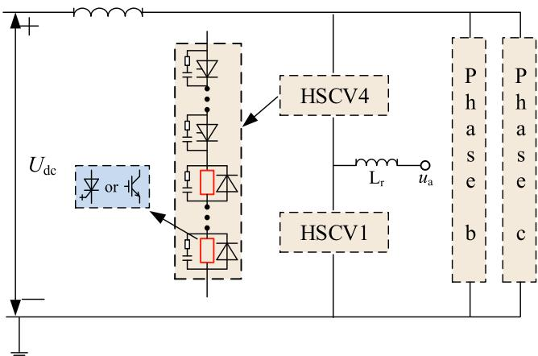  
Fig. 1 shows the topology of the hybrid series converter valve. The   
Fig. 1. The topology of hybrid series converter valve.

main part of the converter valve is thyristor, which is connected in series with the fully controllable switches. All switches are equipped with dynamic voltage balancing circuits. In this paper, reverse conducting devices (such as GTO, IGBT, IGCT, this article takes IGBT as an example) are utilized to design the fully controllable switches.

# 2.2. Working states of hybrid series converter valve

The three different working states of the HSCV are illustrated in Fig. 2. Line segments of different colors represent different states. Specifically, the red solid line represents the current of the valve arm conduction process, the red dashed line represents the current in the process of turning off, the green box indicates that the fully controllable switches are on, and the red box indicates that the fully controllable switches are off.

When the system is initially started and the thyristors in the HSCV are triggered to conduct, the fully controllable switches are triggered to conduct, and the valve arm current gradually rises and reaches the rated value. Obviously, HSCV is working in state 1 of Fig. 2. In the case of no fault, when the thyristors in the HSCV are about to be closed, the fully controllable switches remain on, and the valve arm current is gradually reduced to zero under the action of the AC system. Under this condition, HSCV is working in state 2 of Fig. 2. In the event of a fault, when the thyristors in the HSCV are about to be closed, the fully controllable switches actively trigger shutdown during the decrease of the valve arm current, accelerating the valve arm current to zero. Apparently, HSCV is working in state 3 of Fig. 2 in this case.

# 2.3. The working mechanism of hybrid series converter valve

Commutation failure is a common fault of inverters. During the operation of inverters, when the time (angle $\gamma )$ of applying negative voltage on the valve that has just been turned off is shorter than the time required for it to restore the blocking capability and the valve is conducted again when positive voltage is applied, commutation failure would occur [19]. The time required for valve to restore the blocking capability is at least the turn-off time of the valve thyristor. And the turnoff time of the valve thyristor contains two parts: reverse recovery time (t ) and gate recovery time $( t _ { \mathrm { g r } } )$ [20].

The working principle of HSCV is shown in Fig. 3. $I _ { \mathrm { d c } }$ is DC current. As we can see, when the system fails, the HSCV acts on the valve that is expected to be turned off during the commutation. The fully controllable switches turn off quickly and actively to achieve a rapid zero-crossing of the valve current, and the thyristors enter the turn-off time of themselves. Assuming the angular frequency ω of the system remains constant, HSCV increases the margin of the time (angle γ) of applying negative voltage on the valve by $\Delta \gamma .$ .

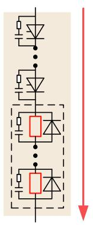

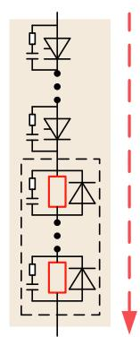

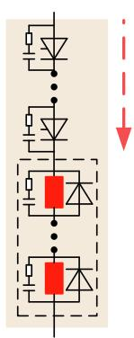  
  
Fig. 2. Working States of hybrid series converter valve. (a) State 1. (b) State 2. (c) State 3.

$$
\Delta \gamma = \gamma^ {\prime} - \gamma = \omega \left(t _ {3} - t _ {2}\right) \tag {1}
$$

The turn-off time of the valve thyristor is the blue shaded part in Fig. 3, and the specific process is shown in the dashed box. In the case of a fault, the red dotted line is the current of the converter valve of LCC-HVDC. It crosses zero at $t _ { 3 } ,$ and then the valve enters a long reverse recovery time. Before the line voltage ul(t) crosses the zero point (t4), the valve thyristor only has a short gate recovery time $( t _ { 3 } ,$ t4). The time required for the valve to restore the blocking capability is insufficient, so there is a high possibility that the valve will be conducted again, and commutation failure will happen.

The solid red line is the valve current of HSCV. The fully controllable switches are quickly turned off during the current drop. The valve current of the HSCV crosses zero at $t _ { 2 } ,$ and the thyristor of the HSCV quickly enters the reverse recovery time. The gate recovery time starts at $t _ { 3 } ,$ and there is still a long time before when positive voltage is applied at $t _ { 4 } .$ The HSCV thyristor valve can fully recover the positive blocking capability. Therefore, HSCV increases the gate recovery time of the thyristor by $\Delta t _ { \mathrm { g r } }$ .

$$
\Delta t _ {g r} = t _ {3} ^ {\prime \prime} - t _ {3} ^ {\prime} \tag {2}
$$

In summary, when the system fails, the fully controllable switches of the HSCV are actively turned off, so that the commutation process can get rid of the dependence on the AC side to a certain extent, and the valve current realizes a rapid zero-crossing, which increases quenching margin angle of the inverter. At the same time, the fully controllable switches change the turn-off time of the thyristors in the HSCV, and the valve thyristor obtains an additional gate recovery time. Based on the above two aspects, HSCV can enhance the system’s ability to resist commutation failure.

# 3. Turn-off time control strategy of hybrid series converter valve

HSCV plays a role in the case of a fault, and the system parameters fluctuate greatly in a short time during the transient process, so the commutation process of each HSCV of the converter is inconsistent. It is mainly manifested in that under the same shutdown current, different HSCVs have different turn-off moments, and the corresponding AC bus voltages at the turn-off moments are also different. In addition, different devices have different pressure parameters in HSCV. When the IGBT reaches the voltage limit, the thyristor may have a large pressure margin. Therefore, it is necessary to consider the difference of switching devices to design the turn-off time control strategy of HSCV under transient conditions.

The power electronic switch models in PSCAD/EMTDC are ideal models. They do not include turn-off process characteristics, such as reverse recovery characteristics of thyristors and tailing processes of IGBTs. This does not help to determine the off current reference value in practical engineering. The switch model in SABER contains the turn-off process characteristics of the switch. Therefore, this paper considers the combination of PSCAD/EMTDC and SABER to design the turn-off time control strategy of hybrid series converter valve.

Assuming that during the turn-off time of the valve thyristor, the AC bus voltage is maintained at the value at the time the valve current crosses zero. Set the turn-off current $i _ { \mathrm { V } 0 }$ in the first cycle after the fault. When the current is less than $i _ { \mathrm { V } 0 } ,$ the IGBT will be actively turned off. Detect the AC bus voltage $U _ { l \mathrm { n } } ( \mathrm { n } = 1 \sim 6 )$ at the zero-crossing time of the valve current, and refer to the relationship between the reverse voltage and the thyristor valve voltage characteristic $( U _ { l ^ { - } } U _ { \mathrm { V T } } )$ in SABER, and the thyristor valve voltage $U _ { \mathrm { V T n } }$ corresponding to each HSCV in PSCAD can be obtained. Then, if the thyristor pressure requirement is exceeded, the IGBT is turned back on. This section can limit the thyristor valve voltage to protect the device. If the thyristor valve voltage is within a reasonable range, take the maximum value of the thyristor valve voltage $\left( U _ { \mathrm { V I m a x } } \right)$ of the six valves to output. Refer to the characteristic relationship between

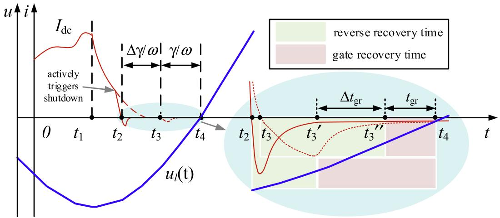  
Fig. 3. The working mechanism of hybrid series converter valve.

the reverse voltage of the thyristor under the minimum reverse voltage $( U _ { \mathrm { R m i n } } )$ and the DC current value of the active turn-off $( U _ { \mathrm { V T } } - i _ { \mathrm { o f f } } )$ in the Saber to determine the HSCV active turn-off current reference value i . Detect the DC current value $i _ { \mathrm { V T n } }$ in the case of a fault, and when the current is less than $i _ { \mathrm { o f f r e f } } ,$ the IGBT is actively turned off. Fig. 4 shows the turn-off time control strategy of HSCV.

$$
U _ {R \min } = k \% U _ {l \max } \tag{3}
$$

In Eq. (3), k% is the percentage of the fault line voltage drop, and $U _ { l \mathrm { e } }$ is the rated line voltage.

# 4. Design of dynamic voltage equalization circuit of hybrid series converter valve

# 4.1. Overvoltage during the turn-off time of hybrid series converter valve

The switching characteristics of different devices in HSCV are inconsistent, so, during the decrease of valve current, the fully controllable switches quickly turn off before the thyristors turn off. The existence of circuit inductance $L _ { \mathrm { r } }$ will cause overvoltage at both ends of the IGBT, which is positively correlated with the rate of change of valve current di /dt [21–22].

In order to study the overvoltage of the IGBT, an equivalent simulation circuit of the HSCV turn-off process was built in SABER with reference to Fig. 1. It has the turn-off characteristics of different devices, but without any voltage equalization measures. The IGBT model parameters refer to FZ3600R17HP4_B2, and the thyristor model refers to KP 5500-85Y04. Main parameters are shown in Table 1.

Set $I _ { \mathrm { d c } } = 2 ~ \mathrm { k A }$ , loop inductance $L _ { \mathrm { r } } = 0 . 6 5$ mH. The valve current begins to decay under the action of the reverse voltage at 20 ms, and the natural zero-crossing time is 21.3 ms. Through the turn-off time control strategy of HSCV, the IGBT turn-off current is 0.4 kA. The electrical

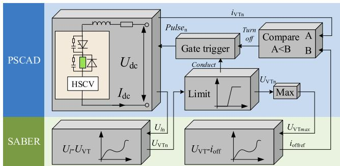  
Fig. 4. Turn-off time control strategy of hybrid series converter valve.

Table 1 Main parameters of devices of HSCV.   

<table><tr><td>Parameters</td><td>KP_E5500-85Y04</td><td>FZ3600R17HP4_B2</td></tr><tr><td>Voltage limit</td><td>8.5 kV(VRRM)</td><td>1.7 kV(VCES)</td></tr><tr><td>Forward current</td><td>5.5 kA(Tf)</td><td>3.6 kA(If)</td></tr><tr><td>Turn-off time</td><td>450 μs(tq)</td><td>0.21 μs(tf)</td></tr></table>

stress of the fully controllable switches valve during the HSCV turn-off process is shown in Fig. 5.

In Fig. 5, u is the voltage of the IGBT, and $i _ { \mathrm { c } }$ is the current of the IGBT. The IGBT starts to turn off at 21.037 ms, and the $i _ { \mathrm { c } }$ drops rapidly from 0.4kA to 0.04kA after 226.9 ns. Due to the effect of $L _ { \mathrm { r } } ,$ the voltage $u _ { \mathrm { c e } }$ rises to $2 . 5 4 8 \times 1 0 ^ { 3 } \mathrm { k V }$ , the HSCV has a severe shut-off overvoltage, and the components in the valve will be damaged. After that, as the current rate of change dic/dt decreases, $u _ { \mathrm { c e } }$ gradually drops to zero. Thus, measures must be taken to solve the overvoltage problem of HSCV.

The method commonly used in engineering at present is to connect a dynamic voltage equalization buffer circuit in parallel at both ends of each device, which is composed of resistors and capacitors in series [23–24], as shown in Fig. 1. However, the HSCV studied in this paper is composed of thyristors and the fully controllable switches in series. Due to the inconsistent switching characteristics of different devices, the voltage equalization circuit parameters of the same device in series cannot meet the HSCV overvoltage suppression requirements. Therefore, the dynamic voltage equalization branch of HSCV needs to be redesigned.

# 4.2. Analysis of electrical stress during the turn-off time of hybrid series converter valve

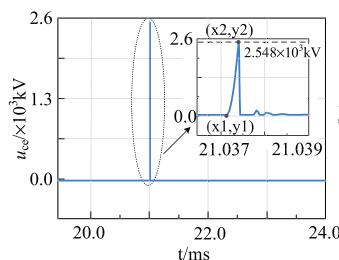  
Fig. 6 demonstrates the equivalent circuit of the HSCV turn-off   
(a)

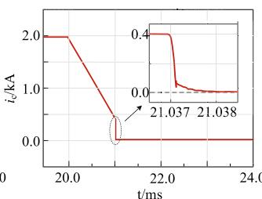  
  
Fig. 5. Electrical stress of the fully controllable switches valve. (a) Voltage stress. (b) Current stress.

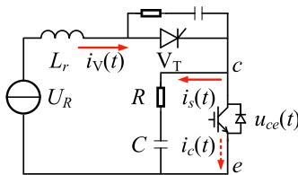

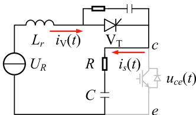  
(b)   
Fig. 6. Equivalent circuit of turn-off process of hybrid series converter valve with dynamic voltage equalization branch. $\mathrm { \Gamma } ( { \mathrm { a } } ) \ t < t _ { \mathrm { f } } . \ \mathrm { \left( b \right) } \ t > t _ { \mathrm { f } } .$

process, as well as the dynamic voltage equalization branch. tf is the turn-off time of the IGBT, and $i _ { s }$ the current of the dynamic voltage equalization branch.

In the case of a fault, the HSCV turn-off process is state 3 in Fig. 2. The active turn-off time of IGBT is several microseconds, and this process can be regarded as a current decay process with a constant current change rate [25]. In this process, the current will quickly transfer from the IGBT to the RC dynamic voltage equalization branch to form $i _ { s } .$ It charges the capacitor C and flows through the resistor $\mathbb { R } ,$ resulting in a voltage drop. The sum of the dynamic balancing capacitor voltage uC and the dynamic balancing resistor voltage $u _ { \mathrm { R } }$ is equal to $u _ { \mathrm { c e } } .$ After the IGBT is completely turned off, $, i _ { s }$ gradually drops to zero under the action of the external voltage.

Fig. 7 shows the turn-off process of HSCV in state 3 in Fig. 2. Take the time when the valve current is i as the starting time, and i is the turn-off current value. The current of HSCV is.

$$
i _ {\mathrm {V}} (t) = \left\{ \begin{array}{c c} i _ {c} (t) + i _ {s} (t) & t \in (0, t _ {\mathrm {f}}) \\ i _ {s} (t) & t \in \left(t _ {\mathrm {f}}, t _ {\mathrm {f} 1}\right) \end{array} \right. \tag {4}
$$

Equation (5) and (6) can be deduced from Kirchhoff’s law in Fig. 6.

$$
U _ {R} = L _ {r} \frac {\mathrm {d} i (t)}{\mathrm {d} t} + u _ {c e} (t) \tag {5}
$$

$$
u _ {c e} (t) = R i _ {s} (t) + u _ {C} (t) \tag {6}
$$

The current of the IGBT and the current of the dynamic voltage equalization branch are.

$$
i _ {c} (t) = k t + i _ {F} t \in (0, t _ {\mathrm {f}}) \tag {7}
$$

$$
i _ {s} (t) = C \frac {\mathrm {d} u _ {c} (t)}{\mathrm {d} t} \tag {8}
$$

where k is the current rate of IGBT.

Letδ $\begin{array} { r l r } { ~ } & { { } = } & { \frac { R } { 2 L _ { \mathrm { t } } } , \omega _ { 0 } = ~ \frac { 1 } { \sqrt { C L _ { r } } } , \varepsilon = ~ \sqrt { \delta ^ { 2 } - \omega _ { 0 } ^ { 2 } } \mathrm { . } } \end{array}$ , and discussion itemΔ = $\begin{array} { r } { 4 \delta ^ { 2 } - 4 \omega _ { 0 } ^ { 2 } = 4 ( \frac { R ^ { 2 } } { 4 L _ { r } ^ { 2 } } - \frac { 1 } { C L _ { r } } ) } \end{array}$ .

When $\Delta > 0 ,$ it can be deduced from the appendix equations (A1) ~ (A12).

$$
i (t) = \left\{ \begin{array}{c} \frac {U _ {R} - k L _ {r}}{2 \varepsilon L _ {r}} e ^ {(\varepsilon - \delta) t} + \frac {k L _ {r} - U _ {R}}{2 \varepsilon L _ {r}} e ^ {(- \varepsilon - \delta) t} + \\ k t + i _ {F} t \in (0, t _ {\mathrm {f}}) \\ \left(\frac {k L _ {r} - U _ {R}}{2 \varepsilon L _ {r}} - \frac {k}{2 \delta e ^ {(- \varepsilon - \delta) t _ {\mathrm {f}}}}\right) e ^ {(- \varepsilon - \delta) t} + \\ \left(\frac {U _ {R} - k L _ {r}}{2 \varepsilon L _ {r}} - \frac {k}{2 \delta e ^ {(\varepsilon - \delta) t _ {\mathrm {f}}}}\right) e ^ {(\varepsilon - \delta) t} t \in \left(t _ {\mathrm {f}}, t _ {\mathrm {f l}}\right) \end{array} \right. \tag {9}
$$

$$
u _ {c e} (t) = \left\{ \begin{array}{c} U _ {R} - L _ {r} \left[ \frac {U _ {R} - k L _ {r}}{2 \varepsilon L _ {r}} (\varepsilon - \delta) \times \right. \\ e ^ {(\varepsilon - \delta) t} + \frac {k L _ {r} - U _ {R}}{2 \varepsilon L _ {r}} \times \\ (- \delta - \varepsilon) e ^ {(- \delta - \varepsilon) t} + k ] t \in (0, t _ {\mathrm {f}}) \\ U _ {R} - L _ {r} \left[ \left(\frac {U _ {R} - k L _ {r}}{2 \varepsilon L _ {r}} - \right. \right. \\ \frac {k}{2 \delta e ^ {(\varepsilon - \delta) t _ {\mathrm {f}}}} (\varepsilon - \delta) e ^ {(\varepsilon - \delta) t} + \\ \left. \left(\frac {k L _ {r} - U _ {R}}{2 \varepsilon L _ {r}} - \frac {k}{2 \delta e ^ {(- \delta - \varepsilon) t _ {\mathrm {f}}}}\right) \times \right. \\ (- \delta - \varepsilon) e ^ {(- \delta - \varepsilon) t} ] t \in (t _ {\mathrm {f}}, t _ {\mathrm {f} 1}) \end{array} \right. \tag {10}
$$

When $\Delta = 0 ,$

$$
i (t) = \left\{ \begin{array}{c} \left(\frac {U _ {R}}{L _ {r}} - k\right) t e ^ {- \delta t} + k t + i _ {F} t \in \left(0, t _ {\mathrm {f}}\right) \\ \left[ - \frac {k t _ {\mathrm {f}}}{e ^ {- \delta t _ {\mathrm {f}}}} + \left(\frac {U _ {R}}{L _ {r}} - k + \right. \right. \\ \left. \frac {k}{e ^ {- \delta t _ {\mathrm {f}}}}\right) t ] e ^ {- \delta t} t \in \left(t _ {\mathrm {f}}, t _ {\mathrm {f} 1}\right) \end{array} \right. \tag {11}
$$

$$
u _ {c e} (t) = \left\{ \begin{array}{c} U _ {R} - L _ {r} [ (1 - \delta t) \times \\ \left(\frac {U _ {R}}{L _ {r}} - k\right) e ^ {- \delta t} + k ] t \in (0, t _ {\mathrm {f}}) \\ U _ {R} - L _ {r} \{- \delta [ - \frac {k t _ {\mathrm {f}}}{e ^ {- \delta t _ {\mathrm {f}}}} + \\ \left(\frac {U _ {R}}{L _ {r}} - k + \frac {k}{e ^ {- \delta t _ {\mathrm {f}}}}\right) t ] e ^ {- \delta t} \times \\ \left(\frac {U _ {R}}{L _ {r}} - k + \frac {k}{e ^ {- \delta t _ {\mathrm {f}}}}\right) e ^ {- \delta t} \} t \in \left(t _ {\mathrm {f}}, t _ {\mathrm {f} 1}\right) \end{array} \right. \tag {12}
$$

When $\Delta < 0 ,$

$$
i (t) = \left\{ \begin{array}{c} e ^ {- \delta t} \left(\frac {U _ {R} - k L _ {r}}{\varepsilon L _ {r}} \sin \varepsilon t\right) + k t + i _ {F} t \in (0, t _ {\mathrm {f}}) \\ e ^ {- \delta t} \left[ - \frac {k \sin \varepsilon t _ {\mathrm {f}}}{\varepsilon e ^ {- \delta t _ {\mathrm {f}}}} \cos \varepsilon t + \right. \\ \left. (\frac {U _ {R} - k L _ {r}}{\varepsilon L _ {r}} + \frac {k \cos \varepsilon t _ {\mathrm {f}}}{\varepsilon e ^ {- \delta t _ {\mathrm {f}}}}) \sin \varepsilon t \right] t \in (t _ {\mathrm {f}}, t _ {\mathrm {f l}}) \end{array} \right. \tag {13}
$$

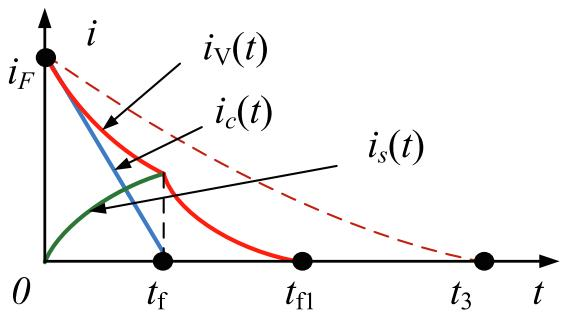  
Fig. 7. The turn-off process of of hybrid series converter valve in state 3.

$$
u _ {c e} (t) = \left\{ \begin{array}{r l} U _ {R} - L _ {r} \left[ - \delta e ^ {- \delta t} \left(\frac {U _ {R} - k L _ {r}}{\varepsilon L _ {r}} \sin \varepsilon t\right) + \right. & \\ e ^ {- \delta t} \left(\frac {U _ {R} - k L _ {r}}{L _ {r}} \cos \varepsilon t\right) + k ] t \in (0, t _ {\mathrm {f}}) \\ U _ {R} - L _ {r} \{- \delta e ^ {- \delta t} \left[ - \frac {k \sin \varepsilon t _ {\mathrm {f}}}{\varepsilon e ^ {- \delta t _ {\mathrm {f}}}} \cos \varepsilon t + \right. & \\ \left. (\frac {U _ {R} - k L _ {r}}{\varepsilon L _ {r}} + \frac {k \cos \varepsilon t _ {\mathrm {f}}}{\varepsilon e ^ {- \delta t _ {\mathrm {f}}}}) \sin \varepsilon t \right] + & \\ e ^ {- \delta t} \left[ \frac {k \sin \varepsilon t _ {\mathrm {f}}}{e ^ {- \delta t _ {\mathrm {f}}}} \sin \varepsilon t + \right. & \\ \left. (\frac {U _ {R} - k L _ {r}}{L _ {r}} + \frac {k \cos \varepsilon t _ {\mathrm {f}}}{e ^ {- \delta t _ {\mathrm {f}}}}) \times \right. & \\ \left. \cos \varepsilon t \right] \} t \in (t _ {\mathrm {f}}, t _ {\mathrm {f l}}) & \end{array} \right. \tag {14}
$$

Based on the different relationship between the damping capacitor C and the damping resistance R of the dynamic balancing branch, formulas (9) to (14) express the voltage and current stress of the turn-off tube. After that, the dynamic pressure equalization parameters can be designed.

# 4.3. Design of dynamic voltage equalization parameters of hybrid series converter valve

Combining the working states of HSCV in section II.B and the voltage and current stress analysis of HSCV in section IV. B, the design principles of dynamic voltage equalization parameters are proposed as follows:

(1) The voltage stress of the fully controllable switches does not exceed the maximum rated value of the device:

$$
u _ {\mathrm {c e}} (t) <   V _ {C E S} \tag {15}
$$

$V _ { \mathrm { C E S } }$ is the maximum rated value of the fully controllable switches collector-emitter voltage;

(2) The current of the dynamic voltage equalization branch should be reduced to 0 before $\mathbf { t } _ { 1 } ,$ , so as to ensure the shutdown effect of HSCV:

$$
t _ {\mathrm {f} 1} <   t _ {1} \tag {16}
$$

During the period of $( t _ { \mathrm { f } } , \ t _ { \mathrm { f 1 } } ) ,$ it can be deduced from Eqs. (10), (12) and Eq. (A13) in the appendix:

$$
i (t) = \left\{ \begin{array}{c} A _ {1} e ^ {(- \varepsilon - \delta) t} + B _ {1} e ^ {(\varepsilon - \delta) t} \Delta > 0 \\ \left(A _ {2} + B _ {2} t\right) e ^ {- \delta t} \Delta = 0 \\ \left(A _ {3} \cos \varepsilon t + B _ {3} \sin \varepsilon t\right) e ^ {- \delta t} \Delta <   0 \end{array} \right. \tag {17}
$$

There are boundary conditions.

$$
\left. i (t) \right| _ {t = t _ {\mathrm {f} 1}} = 0 \tag {18}
$$

$$
t _ {\mathrm {f l}} > t _ {\mathrm {f}} \tag {19}
$$

Finally:

$$
t _ {\mathrm {f}} <   \left\{ \begin{array}{c} \frac {1}{2 \varepsilon} \left(\ln \left(- A _ {1}\right) - \ln B _ {1}\right) \Delta > 0 \\ - \frac {A _ {2}}{B _ {2}} \Delta = 0 \\ \frac {1}{\varepsilon} \arctan \left(- \frac {A _ {3}}{B _ {3}}\right) \Delta <   0 \end{array} \right\} \Bigg \langle t _ {1} \tag {20}
$$

(3) The discussion item Δ should ensure that the two preceding principles are met at the same time.

The design of HSCV dynamic voltage equalization branch also needs

to be considered in terms of loss and economy. According to the calculation formula of converter valve dynamic voltage equalization loss given in literature [26], the dynamic voltage equalization loss of the converter valve and the dynamic pressure equalization capacitance are positively correlated. The larger the dynamic pressure equalization capacitance, the greater the loss. Assuming the cost of the dynamic equalization branch M (R, C) is positively correlated with the dynamic equalization parameters, and the construction cost of a single HSCV is MHSCV. After combining Eqs. (14) and (19) and normalizing, the objective function can be established:

$$
\left\{ \begin{array}{c} \min  f (R, C) = w _ {1} \frac {t _ {\mathrm {f} 1} (R , C)}{t _ {3} - t _ {\mathrm {f}}} + w _ {2} \frac {u _ {c e} (R , C)}{V _ {C E S}} + \\ w _ {3} \frac {C}{C _ {M A X}} + w _ {4} \frac {M (R , C)}{M} \\ \sum_ {1} ^ {4} w = 1 \end{array} \right. \tag {21}
$$

Therefore, if the system operating conditions and the device parameters of the fully controllable switch can be determined, reasonable dynamic balancing parameters can be designed. After that, HSCV not only enhanced the system’s ability to resist commutation failure, but also avoided the problem of overvoltage during the turn-off process.

# 5. Simulation verification and application analysis

In order to verify: (1) the effectiveness of HSCV dynamic voltage equalization parameter design; (2) the improvement effect of HSCV’s internal thyristor blocking capability recovery process; (3) the improvement effect of HSCV on immunity against commutation failure of the HVDC transmission system. Simulation and comparison experiments were carried out on the two cases from the five aspects of dynamic voltage equalization branch buffer effect, HSCV turn-off process current characteristics, HSCV thyristor valve blocking ability recovery characteristics, system dynamic characteristics and immunity against commutation failure. Finally, the loss calculation of HSCV is carried out.

Case 1: LCC-HVDC: take the CIGRE benchmark model as an example; Case 2: ELCC-HVDC: take the model proposed in [14] as an example;

Case 3: HSCV-HVDC: rectifier is a LCC station, inverter is based on HSCV.

# 5.1. Dynamic voltage equalization branch buffer effect

To optimize the design of HSCV dynamic voltage equalization parameters, the equivalent turn-off process circuit of Case 3 with switching device turn-off characteristics is established in SABER. In the circuit, the IGBT parameters and the thyristor parameters are from Table 1.

Through the turn-off time control strategy of HSCV, the IGBT turn-off current is 0.4kA. Set parameters of the equivalent turn-off process circuit: $I _ { \mathrm { d c } } = 2 \mathrm { k A } , i _ { \mathrm { F } } = 0 . 4 \mathrm { k A } , U _ { \mathrm { R } } = 1 \mathrm { k V } , L _ { \mathrm { r } } = 0 . 6 5 \mathrm { m H } , \mathrm { k } = 1 . 5 \mathrm { k A } / \mu \mathrm { s }$ . Combined with the calculation of IV.C, the range of dynamic voltage equalization parameters is shown in Fig. 8.

If the system operating conditions and device selection are determined, the parameters of the dynamic pressure equalizing branch of the fully controllable switches can be reasonably designed through the methods in Section IV. Considering the importance of different factors, the current assumption is that the turn-off time, voltage stress and RC loss are equally important, and the cost for the dynamic pressure equalizing branch is relatively low, so the weights $w _ { 1 } = w _ { 2 } = w _ { 3 } = 0 . 3$ and $w _ { 4 } = 0 . 1$ are adopted. The optimal dynamic voltage equalization parameters are calculated by multi-objective planning as $\mathrm { R } = 5 . 6 8 \Omega , \mathrm { C }$

= 16 μF. Comparing the dynamic voltage equalization branch buffer effect, the voltage and current stress comparison of tl;he IGBT in HSCV is shown in Fig. 9. The parameters in Fig. 9. (a) and (b) are from the CIGRE benchmark model; the parameters in Fig. 9 (c) and (d) are from the

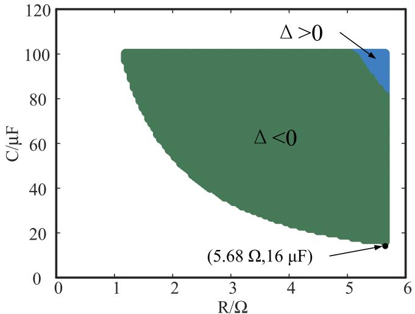  
Fig. 8. The range of dynamic voltage equalization parameters.

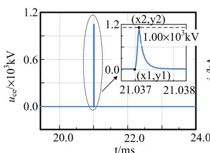  
(a)

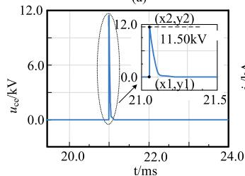

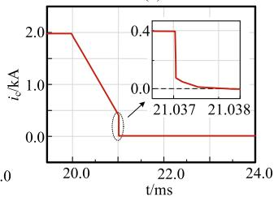

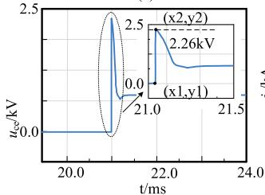

  
  
Fig. 9. The voltage and current stress comparison of the IGBT in of hybrid series converter valve. (a) Voltage stress when R = 5000 Ω, C = 0.05 μF. (b) Current stress when R = 5000 Ω, C = 0.05 μF. (c) Voltage stress when R = 30 Ω, C = 2 μF. (d) Current stress when $\mathrm { R } = 3 0 \Omega , \mathrm { C } = 2 \mu \mathrm { F } ,$ . (e) Voltage stress when R = 5.68 Ω, C = 16 μF. (f) Current stress when R = 5.68 Ω, C = 16 μF.

A5000 converter valve of Northwest Yunnan Engineering. The parameters in Fig. 9. (e) and (f) are designed by this paper.

It can be seen from Fig. 9. that the IGBT of HSCV starts to turn off at 21.037 ms, and the current ic drops rapidly from 0.4kA. When R = 5000 Ω and $\mathbf { C } = 0 . 0 5 \mu \mathrm { F }$ , the voltage $u _ { \mathrm { c e } }$ across IGBT rises to $1 . 0 0 \times 1 0 ^ { 3 }$ kV after 180.2 ns, as shown in Fig. 9(a) and (b). This shows that the dynamic voltage equalization parameters in the CIGRE model is not suitable for the dynamic pressure equalization branch of the fully controllable switches in HSCV. When R = 30 Ω and $\mathbf { C } = 2 \mu \mathrm { F } _ { : }$ , the voltage $u _ { \mathrm { c e } }$ across IGBT rises to 11.50 kV after 1.36 μs, as shown in Fig. 9(c) and

(d). This shows that the dynamic voltage equalization parameters in the A5000 converter valve are applied to the dynamic pressure equalizing branch of the fully controllable switches in HSCV, and the overvoltage phenomenon is serious. When R = 5.68 Ω and ${ \mathrm { C } } = 1 6 \mu { \mathrm { F } }$ , the voltage $u _ { \mathrm { c e } }$ across IGBT rises to 2.26 kV after 1.79 μs. After the IGBT is completely turned off, the current $i _ { s }$ drops to 0, and the IGBT bears a capacitor voltage of $0 . 7 5 \mathrm { k V } ,$ as shown in Fig. 9. (e) and (f). The electrical stress requirements of the device are well met. Table 2 shows the comparison of overvoltage of IGBT with different dynamic voltage equalization parameters.

Based on the data in Table 1 and Table 2, two IGBTs are designed in series, and a reasonable dynamic voltage equalization branch is connected in parallel to solve the problem of overvoltage during the turn-off time of HSCV.

# 5.2. Turn-off process current characteristics of hybrid series converter valve

The HSCV turn-off process is simulated in the equivalent turn-off process circuit of Case 3 in SABER. Set $I _ { \mathrm { d c } } = 2 \mathrm { k A } , i _ { \mathrm { F } } = 0 . 4 \mathrm { k A } , U _ { \mathrm { R } } =$ 1 kV, L = 0.65 mH, ${ \bf k } = 1 . 5 \mathrm { k A } / \mu \mathrm { s } .$ . Refer to the CIGRE benchmark model to set the dynamic voltage equalization parameters of the thyristor to R = 5000 Ω, $\mathbf { C } = 0 . 0 5 ~ \mu \mathrm { F }$ . Refer to section Ⅴ.A to set the IGBT dynamic voltage equalization parameters to $\mathrm { R } = 5 . 6 8 \Omega , \mathrm { C } = 1 6 \mu \mathrm { F } .$ .

Fig. 10 shows the current of different circuits of HSCV. $i _ { \mathrm { V } }$ is the current of the thyristor, and $i _ { \mathrm { V s } }$ is the current of the dynamic voltage equalization branch of the thyristor. $i _ { \mathrm { c } }$ is the current of the IGBT. is the current of the dynamic voltage equalization branch of the IGBT. $i _ { \mathrm { c D } }$ is the current of the anti-parallel diode of the IGBT.

The current ic begins to decline rapidly at 21.037 ms, and enters the tailing process after 441.45 ns. The initial value of the tail current is 17.95 A, which drops to 0 at 21.0387 ms. The current $i _ { s }$ quickly rises to 320.65 A when the IGBT starts to turn $\operatorname { o f f } ,$ and then slowly rises. After the IGBT is completely turned off, is and $i _ { \mathrm { V } }$ have the same value. When iV crosses zero at 21.1318 ms, the thyristor enters the blocking ability recovery process, and ends the reverse recovery process at 21.3268 ms (the reverse current drops to 0.1IRM, IRM is the maximum value of the reverse current [27]). After that, the forward blocking capability begins to recover. The current $i _ { s }$ and thyristor reverse recovery current waveform is the same. The current $i _ { \mathrm { c D } }$ and $i _ { \mathrm { V s } }$ have no change during the HSCV turn-off process.

Therefore, the fully controllable switches of HSCV can quickly cut off the current and make the thyristor enter the blocking capacity recovery process in advance. After that, the dynamic pressure equalization branch of the fully controllable switches constitutes the path for the reverse recovery process of the thyristors until the thyristor fully recovers its blocking capability. The above process ensures the basic ability of HSCV to suppress commutation failure.

# 5.3. Comparison of recovery of blocking ability of thyristors

The equivalent turn-off process circuits of Case 1 and Case 3 are established in SABER. Set $I _ { \mathrm { d c } } = 2 \mathrm { k A } ,$ , and the thyristor begins to bear the reverse voltage $U _ { \mathrm { R } } = 1$ kV at 20 ms. The thyristor begins to bear the forward voltage of 400 V at 21.6 ms. The current of the thyristor in case

Table 2 Overvoltage of IGBT with different dynamic voltage equalization parameters.   

<table><tr><td>Parameters reference</td><td>Resistor</td><td>Capacitor</td><td>UCE</td></tr><tr><td>No dynamic voltage equalization</td><td>0</td><td>0</td><td>2.55 × 103kV</td></tr><tr><td>CIGRE benchmark model</td><td>5000 Ω</td><td>0.05 μF</td><td>1.00 × 103kV</td></tr><tr><td>A5000 converter valve of Northwest Yunnan Engineering</td><td>30 Ω</td><td>2 μF</td><td>11.50 kV</td></tr><tr><td>Design method of this article</td><td>5.68 Ω</td><td>16 μF</td><td>2.26 kV</td></tr></table>

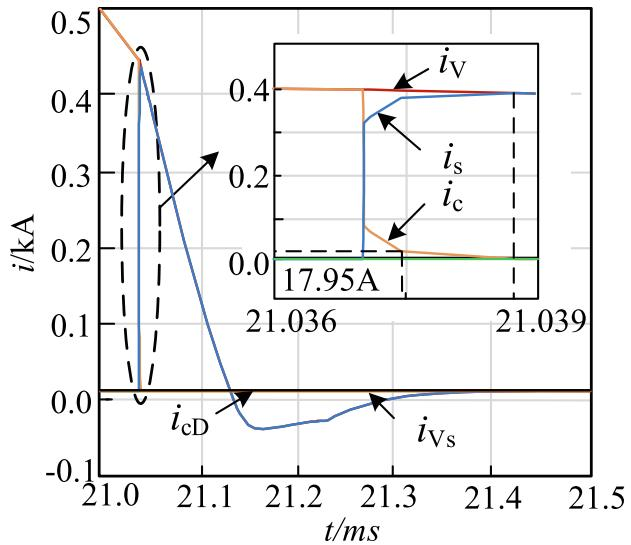  
Fig. 10. The turn-off current stress characteristics of of hybrid series converter valve.

1 naturally decays and crosses zero under the back pressure. The fully controllable switches of Case 3 is actively shut off when the valve current drops to 0.4 kA, so that the current of the thyristor accelerates to zero.

The comparison of recovery of blocking ability of thyristors is shown in Fig. 11. i is the current of the thyristor of Case 1. i is the current of the thyristor of Case 3. The thyristor current of Case 1 slowly drops after 21.0 ms, and enters the reverse recovery process at 21.299 ms when the current crosses zero. The thyristor of Case 1 ends the reverse recovery process in 21.506 ms (the reverse current drops to 0.1IRM). When the thyristor of Case 1 bears the forward voltage for 21.6 ms, it turns on again without a trigger signal and the current rises to 0.2 kA. The thyristor current of Case 3 drops rapidly after 21.037 ms, and crosses zero at 21.131 ms and enters the reverse recovery process. The reverse recovery process of the thyristor in Case 3 ends at 21.338 ms, and the thyristor does not turn on again after receiving the forward voltage at 21.6 ms.

Therefore, the thyristors in the HSCV can enter the reverse recovery process earlier, which provides an additional 156 μs forward blocking recovery time for the thyristor, thereby improving the reliability of commutation.

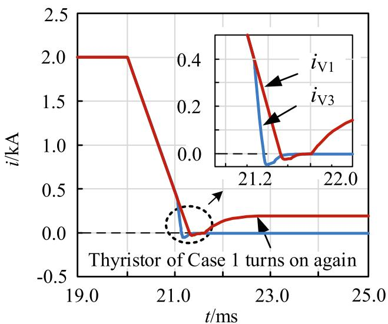  
Fig. 11. The comparison of recovery of blocking ability of thyristors.

# 5.4. System transient characteristics comparison

The model of Case 3 is built in PSCAD/EMTDC, the control of the model of Case 3 remains the same with CIGRE benchmark model. The rectifier adopts constant current control, the inverter adopts constant extinction angle control and current error control (CEC), and both the rectifier and the inverter are equipped with voltage dependent current order limiting (VDCOL). Basic parameters of the model of Case 3 are shown in Table 3.

Set the single phase to ground fault at the inverter side AC bus of Case 1 and Case 3. The fault occurs at 1 s, and the fault grounding inductance value is 0.5H. the duration of the fault is 50 ms. Considering the influence of the fault detection delay, this article sets the relevant control delay to 1 ms.

Fig. 12 is the comparison of system transient characteristics. After the fault occurs, the AC bus voltage on the inverter side of Case 1 quickly drops to 0.82p.u., and then its DC voltage drops to 0. Its DC current rises to 1.95p.u. in a short time, and its arc extinguishing angle drops to 0 at the same time. So the commutation failure occurs in the system. Commutation failure also occurs in the system of Case 2. Its AC bus voltage drops to 0.83p.u., and its DC voltage drops to 0.32. Its DC current rises to 1.29p.u.. However, Case 3 can commutate successfully under this failure. After the fault occurs, the fully controllable switches have a gradual change of off current reference value from 0.4kA to 0.47kA. The AC bus voltage on the inverter side of Case 3 slowly drops to 0.85p.u., and then the DC voltage on the inverter side only drops to 0.69p.u. Its DC current slowly rises to 1.13p.u., and there is a small range for its extinguishing angle to change slowly, which is 8.46◦ to 29.34◦.

In addition, after the fault occurs, the Case 1 system is fully stable in 1.25 s. So the transient recovery time of Case 1 is 0.25 s, and Case 2 needs 0.17 s. However, the Case 3 system has achieved system stability in 1.15 ${ \mathbf { s } } ,$ and its transient recovery time is 0.15 s.

From the comparison of the above data, it can be seen that when a fault occurs on the inverter side, HSCV-HVDC has better transient characteristics than LCC-HVDC and ELCC-HVDC. These strengths are mainly manifested in smaller fluctuation range of system parameters and faster system recovery speed after a fault.

# 5.5. Comparison of immunity against commutation failure

The commutation failure immunity index (CFII) is an important index to compare the system’s commutation failure immunity [28], and the formula is.

$$
CFII = \frac{U_{\mathrm{ac}}^{2}}{\omega\cdot L_{\mathrm{min}}\cdot P_{\mathrm{dc}}}\cdot 100\backslash \% \tag{22}
$$

where $L _ { \mathrm { m i n } }$ is the critical inductance which is determined by conducting a sequence of EMT simulations, and $P _ { \mathrm { d c } }$ is the DC power of the converter. From (22), the larger CFII value represents stronger immunity against commutation failure.

Fig. 13 shows the CFII curves of two cases. Here, the fault angle takes 18◦ as the step length and changes from 0 to 162◦[10]. Single-phase fault and three-phase fault are set in two Cases. The fault occurs at 1 s, and the duration of the fault is 50 ms. The control delay is 1 ms.

From Fig. 13(a), when single phase to ground fault occurs, the

Table 3 The main parameters of the two calculation examples.   

<table><tr><td>Parameters</td><td>Rectifier</td><td>Inverter</td></tr><tr><td>AC bus voltage</td><td>345 kV</td><td>230 kV</td></tr><tr><td>Short circuit ratio</td><td>2.5</td><td>2.5</td></tr><tr><td>Reactive power compensation capacity</td><td>626 MVA</td><td>626 MVA</td></tr><tr><td>Transformer ratio</td><td>345/213.2</td><td>230/209.2</td></tr><tr><td>Transformer leakage reactance</td><td>0.18p.u.</td><td>0.18p.u.</td></tr><tr><td>DC Resistance</td><td>5 Ω</td><td></td></tr><tr><td>DC reactance</td><td>1.19H</td><td></td></tr></table>

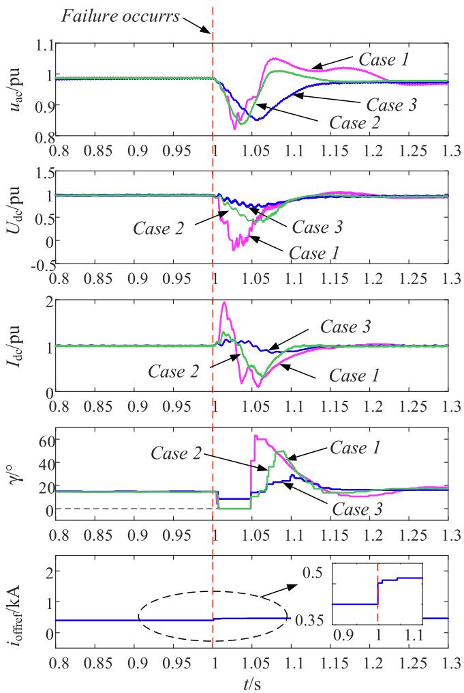  
Fig. 12. The comparison of system transient characteristics.

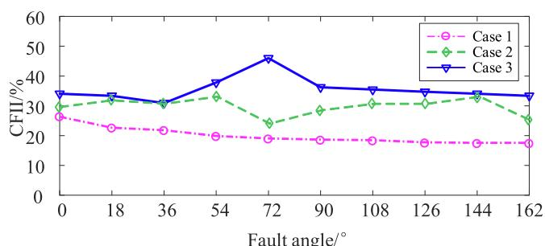

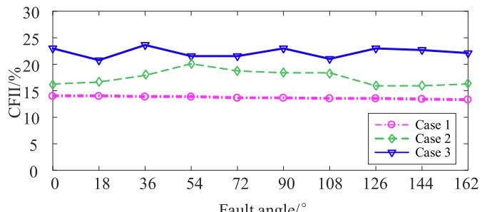  
(a)   
(b)   
Fig. 13. The CFII curves of three cases. (a) Single phase to ground fault occurs. (b) Three-phase fault occurs.

variation range of CFII of Case 1 is (17.18%, 26.18%), and the variation range of CFII of Case 2 is (25.43%, 34.25%). At the same time, the variation range of CFII of Case 3 is (30.94%, 45.99%). Obviously, the CFII of Case 3 is larger than the CFII of Case 1. Thus, with HSCV embedded in the inverter, a noticeable higher immunity to CFs is obtained. From Fig. 13(b), when three-phase fault occurs, the variation range of Case 1 CFII is (13.29%, 13.94%), and the variation range of Case 3 CFII is (16.35%, 19.72%). At the same time, the variation range of Case 3 CFII is (20.75%, 23.64%). The result is similar as that under single-phase fault condition, Case 3 have the higher CFII values than Case 1 and Case 2, which means stronger ability to improve the CF immunity. In summary, HVDC based on HSCV presents satisfactory transient responses under fault.

H. Xiao proposed the hybrid multi-infeed interactive effective shortcircuit ratio (HMIESCR) strength index, which accurately describes the voltage stability of the HMIDC system composed of VSC- and LCC-HVDC [29]. The HSCV studied in this paper is a hybrid series connection of different devices in the valve. In order to quantitatively evaluate the influence of different AC system strengths on the commutation failure mitigation performance of HSCV-HVDC, it is still necessary to change the SCR of the AC system at the receiving end, and further compare the CFII value of three cases.

The CFII curves of two cases are shown in Fig. 14 (a) and (b), assuming a failure occurs at the same moment. From the results, no matter what the SCR is, the CFII of Case 3 is larger than the CFII of Case 1 and Case 2. Moreover, the larger the SCR, the larger the CFII excess value of Case 3.This shows that HSCV-HVDC has stronger resistance to commutation failure than LCC-HVDC and ELCC-HVDC regardless of the strength of the AC system at the receiving end.

# 5.6. Power loss calculation of hybrid series converter valve

The difference between the inverter with HSCV embedded and the

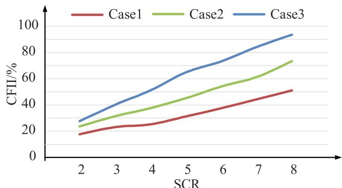  
(a)

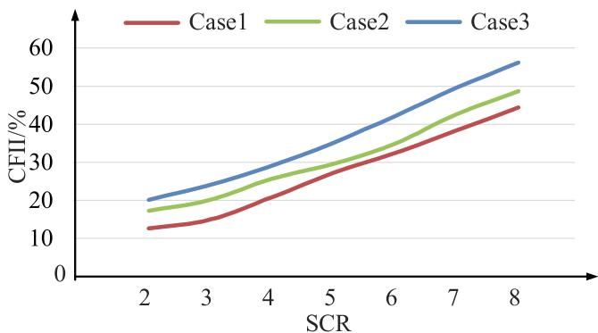  
  
Fig. 14. Comparison of CFII under different SCR. (a) Single phase to ground fault occurs. (b) Three-phase fault occurs.

LCC inverter is the fully controllable switches, which bring cost increases and additional losses. Considering that the fully controllable switches of HSCV is in a long-term conduction state during operation, the current is only turned off in advance in the event of a fault. Therefore, the on-state loss and switching loss of the fully controllable switches need to be calculated separately. Taking IGBT as an example, the calculation formula is [30].

$$
E _ {T \text {c o n}} = U _ {C E} \cdot I _ {C} \cdot t _ {\text {o n}} = \left(R _ {T} \cdot I _ {C} + U _ {C E 0}\right) \cdot I _ {C} \cdot t _ {\text {o n}} \tag {22}
$$

$$
\begin{array}{l} E _ {\mathrm {s w}} = U _ {D C N} \left(m _ {1} + m _ {2} I _ {C} + m _ {3} I _ {C} ^ {2}\right). \tag {23} \\ U _ {D C} / U _ {D C N} = E _ {\mathrm {s w N}} \cdot U _ {D C} / U _ {D C N} \\ \end{array}
$$

Where $E _ { \mathrm { T c o n } }$ is the on-state loss of the IGBT, and $E _ { \mathrm { s w } }$ is the switching loss of the IGBT. $t _ { \mathrm { o n } }$ is the on-time of the IGBT. $U _ { \mathrm { C E 0 } }$ is the holding voltage of the IGBT. $R _ { \mathrm { T } }$ is the forward conduction resistance of the IGBT. $U _ { \mathrm { D C N } }$ is the rated voltage of the IGBT. $E _ { \mathrm { { s w N } } }$ is the switching loss under the rated DC voltage. $m _ { 1 } , m _ { 2 } ,$ and m3 are characteristic parameters related to temperature.

In a cycle under normal conditions, the loss of the IGBT is the onstate loss. Its voltage is the on-state voltage drop, and its current can be divided into direct current and thyristor leakage current, and the duration is $1 2 0 ^ { \circ } + \mu$ and $2 4 0 ^ { \circ } - \mu$ respectively. At the rated temperature, referring to the data in Table 1 and Table 3, we can calculate that the loss of a fully controllable switch in a normal cycle is 59.12 J. In a cycle under a fault condition, the loss of the IGBT is the sum of the on-state loss and the switching loss. Considering the change of the fault current, it is approximately twice the rated current [31]. At the rated temperature, referring to the data in Table 1 and Table 3, the loss in a cycle of the fully controllable switches under a fault condition is 121.04 J.

Therefore, the switching on and off of the fully controllable switches of HSCV will bring losses and additional economic costs. However, in the case of system failure, HSCV has stronger commutation failure suppression capability, ensures the transmission of DC power, and has investment value.

# 6. Conclusion

Considering the difference of device characteristics, the working state and turn-off sequence of HSCV are designed, and the principle of HSCV suppressing commutation failure is analyzed. Aiming at the overvoltage phenomenon during the turn-off process of HSCV, the electrical stress of the turn-off tube is analyzed, and the parallel dynamic balancing branch is selected to buffer the overvoltage, and the design

# Appendix

Combine the formulas (4) ~ (8) in IV. B,

$$
\left\{ \begin{array}{c} \frac {d i ^ {2} (t)}{d t ^ {2}} + \frac {R}{L _ {r}} \frac {d i (t)}{d t} + \frac {1}{C L _ {r}} i (t) = \\ \frac {k}{C L _ {r}} t + \frac {R}{L _ {r}} k + \frac {1}{C L _ {r}} i _ {F} t \in (0, t _ {\mathrm {f}}) \\ \frac {d i ^ {2} (t)}{d t ^ {2}} + \frac {R}{L _ {r}} \frac {d i (t)}{d t} + \frac {1}{C L _ {r}} i (t) = 0 t \in \left(t _ {\mathrm {f}}, t _ {\mathrm {f} 1}\right) \end{array} \right. \tag {A1}
$$

Then,

$$
\left\{ \begin{array}{c} \frac {d i ^ {2} (t)}{d t ^ {2}} + 2 \delta \frac {d i (t)}{d t} + \omega_ {0} ^ {2} i (t) = \\ \omega_ {0} ^ {2} k t + 2 \delta k + \omega_ {0} ^ {2} i _ {F} t \in (0, t _ {\mathrm {f}}) \\ \frac {d i ^ {2} (t)}{d t ^ {2}} + 2 \delta \frac {d i (t)}{d t} + \omega_ {0} ^ {2} i (t) = 0 t \in \left(t _ {\mathrm {f}}, t _ {\mathrm {f l}}\right) \end{array} \right. \tag {A2}
$$

Set up the characteristic equation.

method of the resistance–capacitance parameters is proposed. The conclusion is expressed as follows:

(1) The designed working states of HSCV make the fully controllable switches act in a timely manner, accelerate the current drop of the valve. That causes the valve that is expected to close early to enter the blocking capacity recovery process. Therefore, HSCV can increase the forward blocking recovery time of the thyristor and prevent the thyristor from turning back on. This actually reduces the system’s requirements for the turn-off arc extinguishing angle and improves the reliability of system operation.   
(2) The proposed dynamic pressure equalization branch design principles and optimization methods can calculate the best dynamic pressure equalization parameters. After applying the best parameters, the maximum voltage of the turn-off process of HSCV is reduced to 2.26 kV. That provides a design reference for engineering practical applications.   
(3) The HVDC transmission system based on HSCV has a strong inhibitory effect on commutation failure. Under single-phase-toground fault conditions and three-phase faults, regardless of the strength of the AC system, HSCV has stronger mitigation performance for commutation failure than LCC-HVDC and ELCC-HVDC.

As the focus of this paper is to study the hybrid series converter valve and propose HVDC based on HSCV. Future research will carry out further work in three aspects: the coupling turn-off characteristics of HSCV, the design of the number of the fully controllable switches considering engineering capacity matching and device redundancy, and the modern optimization calculation method of dynamic pressure equalization parameters.

# CRediT authorship contribution statement

Ruiqi Zhan: Methodology, Software, Validation, Writing – original draft, Writing – review & editing. Yunxia Ye: Investigation, Software. Jiahang Xia: Supervision. Chengyong Zhao: Conceptualization, Supervision, Writing – review & editing.

# Declaration of Competing Interest

The authors declare that they have no known competing financial interests or personal relationships that could have appeared to influence the work reported in this paper.

$$
\lambda^ {2} + 2 \delta \lambda + \omega_ {0} ^ {2} = 0 \tag {A3}
$$

Then,

$$
\lambda_ {1, 2} = \frac {- 2 \delta \pm \sqrt {\Delta}}{2} \neq 0
$$

Set.

$$
i ^ {*} (t) = A t + B t \in (0, t _ {\mathrm {f}}) \tag {A4}
$$

Then,

$$
\left\{ \begin{array}{l} i ^ {s ^ {\prime}} (t) = A \\ i ^ {s ^ {\prime \prime}} (t) = 0 \end{array} t \in (0, t _ {\mathrm {f}}) \right. \tag {A5}
$$

Combine the formulas (A1), (A4) and (A5).

$$
2 \delta A + \omega_ {0} ^ {2} (A t + B) = \tag {A6}
$$

$$
\omega_ {0} ^ {2} k t + 2 \delta k + \omega_ {0} ^ {2} i _ {F} t \in (0, t _ {\mathrm {f}}) \tag {A0}
$$

Then,

$$
\left\{ \begin{array}{l} A = k \\ B = i _ {F} \end{array} t \in (0, t _ {\mathrm {f}}) \right. \tag {A7}
$$

That is.

$$
i ^ {*} (t) = k t + i _ {F} t \in (0, t _ {\mathrm {f}}) \tag {A8}
$$

When $\Delta > 0 ,$ which $\begin{array} { r } { \mathrm { i } s \frac { C R ^ { 2 } } { 4 L _ { r } } > 1 , \lambda _ { 1 , 2 } = - \delta \pm \varepsilon , } \end{array}$ the current and voltage can be calculated as.

$$
i (t) = \left\{ \begin{array}{c} C _ {1} e ^ {(- \delta + \varepsilon) t} + C _ {2} e ^ {(- \delta - \varepsilon) t} + \\ A t + B t \in (0, t _ {\mathrm {f}}) \\ C _ {3} e ^ {(- \delta + \varepsilon) t} + C _ {4} e ^ {(- \delta - \varepsilon) t} t \in \left(t _ {\mathrm {f}}, t _ {\mathrm {f l}}\right) \end{array} \right. \tag {A9}
$$

$$
u _ {c e} (t) = \left\{ \begin{array}{c} U _ {R} - L _ {r} \left[ C _ {1} (\varepsilon - \delta) e ^ {(\varepsilon - \delta) t} + \right. \\ C _ {2} (- \varepsilon - \delta) e ^ {(- \delta - \varepsilon) t} + A ] t \in (0, t _ {\mathrm {f}}) \\ U _ {R} - L _ {r} \left[ C _ {3} (\varepsilon - \delta) e ^ {(\varepsilon - \delta) t} + \right. \\ C _ {4} (- \delta - \varepsilon) e ^ {(- \delta - \varepsilon) t} ] t \in \left(t _ {\mathrm {f}}, t _ {\mathrm {f} 1}\right) \end{array} \right. \tag {A10}
$$

There are boundary conditions.

$$
\left\{ \begin{array}{c} i (0) = i _ {F} \\ u _ {c e} (0) = 0 \\ C _ {1} e ^ {(- \delta + \varepsilon) t _ {\mathrm {f}}} + C _ {2} e ^ {(- \delta - \varepsilon) t _ {\mathrm {f}}} + A t _ {\mathrm {f}} + B = \\ C _ {3} e ^ {(- \delta + \varepsilon) t _ {\mathrm {f}}} + C _ {4} e ^ {(- \delta - \varepsilon) t _ {\mathrm {f}}} \\ U _ {R} - L _ {r} [ C _ {1} (- \delta + \varepsilon) e ^ {(- \delta + \varepsilon) t _ {\mathrm {f}}} + \\ C _ {2} (- \delta - \varepsilon) e ^ {(- \delta - \varepsilon) t _ {\mathrm {f}}} + A ] = \\ U _ {R} - L _ {r} [ C _ {3} (- \delta + \varepsilon) e ^ {(- \delta + \varepsilon) t _ {\mathrm {f}}} + \\ C _ {4} (- \delta - \varepsilon) e ^ {(- \delta - \varepsilon) t _ {\mathrm {f}}} ] \end{array} \right. \tag {A11}
$$

Combine the formulas (A9), (A10) and (A11).

$$
\left\{ \begin{array}{c} C _ {1} = \frac {U _ {R} - A L _ {r}}{2 \varepsilon L _ {r}} \\ C _ {2} = \frac {A L _ {r} - U _ {R}}{2 \varepsilon L _ {r}} \\ C _ {3} = C _ {1} - \frac {A}{2 \delta e ^ {(- \delta + \varepsilon) t _ {\mathrm {f}}}} \\ C _ {4} = C _ {2} - \frac {A}{2 \delta e ^ {(- \delta - \varepsilon) t _ {\mathrm {f}}}} \end{array} \right. \tag {A12}
$$

Combine the formulas (A7), (A9), (A10) and (A12).

$$
i (t) = \left\{ \begin{array}{c} \frac {U _ {R} - k L _ {r}}{2 \varepsilon L _ {r}} e ^ {(\varepsilon - \delta) t} + \frac {k L _ {r} - U _ {R}}{2 \varepsilon L _ {r}} e ^ {(- \varepsilon - \delta) t} + \\ k t + i _ {F} t \in (0, t _ {\mathrm {f}}) \\ \left(\frac {k L _ {r} - U _ {R}}{2 \varepsilon L _ {r}} - \frac {k}{2 \delta e ^ {(- \varepsilon - \delta) t _ {\mathrm {f}}}}\right) e ^ {(- \varepsilon - \delta) t} + \\ \left(\frac {U _ {R} - k L _ {r}}{2 \varepsilon L _ {r}} - \frac {k}{2 \delta e ^ {(\varepsilon - \delta) t _ {\mathrm {f}}}}\right) e ^ {(\varepsilon - \delta) t} t \in \left(t _ {\mathrm {f}}, t _ {\mathrm {f l}}\right) \end{array} \right. \tag {A13}
$$

$$
u _ {c e} (t) = \left\{ \begin{array}{l} U _ {R} - L _ {r} \left[ \frac {U _ {R} - k L _ {r}}{2 \varepsilon L _ {r}} (\varepsilon - \delta) \times \right. \\ \quad e ^ {(\varepsilon - \delta) t} + \frac {k L _ {r} - U _ {R}}{2 \varepsilon L _ {r}} \times \\ (- \delta - \varepsilon) e ^ {(- \delta - \varepsilon) t} + k ] t \in (0, t _ {\mathrm {f}}) \\ U _ {R} - L _ {r} \left[ \left(\frac {U _ {R} - k L _ {r}}{2 \varepsilon L _ {r}} - \right. \right. \\ \left. \frac {k}{2 \delta e ^ {(\varepsilon - \delta) t _ {\mathrm {f}}}}\right) (\varepsilon - \delta) e ^ {(\varepsilon - \delta) t} + \\ \left. \left(\frac {k L _ {r} - U _ {R}}{2 \varepsilon L _ {r}} - \frac {k}{2 \delta e ^ {(- \delta - \varepsilon) t _ {\mathrm {f}}}}\right) \times \right. \\ (- \delta - \varepsilon) e ^ {(- \delta - \varepsilon) t} ] t \in (t _ {\mathrm {f}}, t _ {\mathrm {f l}}) \end{array} \right. \tag {A14}
$$

The same goes for when $\Delta = 0 ,$ the current and voltage can be calculated as.

$$
i (t) = \left\{ \begin{array}{c} \left(\frac {U _ {R}}{L _ {r}} - k\right) t e ^ {- \delta t} + k t + i _ {F} t \in \left(0, t _ {\mathrm {f}}\right) \\ \left[ - \frac {k t _ {\mathrm {f}}}{e ^ {- \delta t _ {\mathrm {f}}}} + \left(\frac {U _ {R}}{L _ {r}} - k + \right. \right. \\ \left. \frac {k}{e ^ {- \delta t _ {\mathrm {f}}}}\right) t ] e ^ {- \delta t} t \in \left(t _ {\mathrm {f}}, t _ {\mathrm {f l}}\right) \end{array} \right. \tag {A15}
$$

$$
u _ {c e} (t) = \left\{ \begin{array}{c} U _ {R} - L _ {r} \left[ (1 - \delta t) \times \right. \\ \left(\frac {U _ {R}}{L _ {r}} - k\right) e ^ {- \delta t} + k ] t \in \left(0, t _ {\mathrm {f}}\right) \\ U _ {R} - L _ {r} \{- \delta \left[ - \frac {k t _ {\mathrm {f}}}{e ^ {- \delta t _ {\mathrm {f}}}} + \right. \\ \left. \left(\frac {U _ {R}}{L _ {r}} - k + \frac {k}{e ^ {- \delta t _ {\mathrm {f}}}}\right) t \right] e ^ {- \delta t} \times \\ \left. \left(\frac {U _ {R}}{L _ {r}} - k + \frac {k}{e ^ {- \delta t _ {\mathrm {f}}}}\right) e ^ {- \delta t} \right\} t \in \left(t _ {\mathrm {f}}, t _ {\mathrm {f l}}\right) \end{array} \right. \tag {A16}
$$

When $\Delta < 0 ,$ the current and voltage can be calculated as.

$$
i (t) = \left\{ \begin{array}{c} e ^ {- \delta t} \left(\frac {U _ {R} - k L _ {r}}{\varepsilon L _ {r}} \sin \varepsilon t\right) + k t + i _ {F} t \in (0, t _ {\mathrm {f}}) \\ e ^ {- \delta t} \left[ - \frac {k \sin \varepsilon t _ {\mathrm {f}}}{\varepsilon e ^ {- \delta t _ {\mathrm {f}}}} \cos \varepsilon t + \right. \\ \left. (\frac {U _ {R} - k L _ {r}}{\varepsilon L _ {r}} + \frac {k \cos \varepsilon t _ {\mathrm {f}}}{\varepsilon e ^ {- \delta t _ {\mathrm {f}}}}) \sin \varepsilon t \right] t \in (t _ {\mathrm {f}}, t _ {\mathrm {f l}}) \end{array} \right. \tag {A17}
$$

$$
u _ {c e} (t) = \left\{ \begin{array}{r l} U _ {R} - L _ {r} \left[ - \delta e ^ {- \delta t} \left(\frac {U _ {R} - k L _ {r}}{\varepsilon L _ {r}} \sin \varepsilon t\right) + \right. & \\ e ^ {- \delta t} \left(\frac {U _ {R} - k L _ {r}}{L _ {r}} \cos \varepsilon t\right) + k ] t \in (0, t _ {\mathrm {f}}) \\ U _ {R} - L _ {r} \left\{- \delta e ^ {- \delta t} \left[ - \frac {k \sin \varepsilon t _ {\mathrm {f}}}{\varepsilon e ^ {- \delta t _ {\mathrm {f}}}} \cos \varepsilon t + \right. \right. & \\ \left. (\frac {U _ {R} - k L _ {r}}{\varepsilon L _ {r}} + \frac {k \cos \varepsilon t _ {\mathrm {f}}}{\varepsilon e ^ {- \delta t _ {\mathrm {f}}}}) \sin \varepsilon t \right] + \\ e ^ {- \delta t} \left[ \frac {k \sin \varepsilon t _ {\mathrm {f}}}{e ^ {- \delta t _ {\mathrm {f}}}} \sin \varepsilon t + \right. & \\ \left. (\frac {U _ {R} - k L _ {r}}{L _ {r}} + \frac {k \cos \varepsilon t _ {\mathrm {f}}}{e ^ {- \delta t _ {\mathrm {f}}}}) \times \right. & \\ \left. \cos \varepsilon t \right] \} t \in (t _ {\mathrm {f}}, t _ {\mathrm {f l}}) & \end{array} \right. \tag {A18}
$$

# References

[1] Dong X, Guan E, Jing L, Wang H, Mirsaeidi S. Simulation and analysis of cascading faults in hybrid AC/DC power grids. Int J Electr Power Energy Syst 2020;115: 105492. https://doi.org/10.1016/j.ijepes.2019.105492.   
[2] Song J, Li Y, Zhang Y. The influence of open-phase operation of inverter side AC subsystem on commutation process and countermeasures. Int J Electr Power Energy Syst 2021;129:106805. https://doi.org/10.1016/j.ijepes.2021.106805.   
[3] Xiao H, Li Y, Lan T. Sending End AC Faults can Cause Commutation Failure in LCC-HVDC Inverters. IEEE Trans Power Del 2020;35(5):2554–7.   
[4] Wang P, Wang Y, Jiang N, Gu W. A comprehensive improved coordinated control strategy for a STATCOM integrated HVDC system with enhanced steady/transient state behaviors. Int J Electr Power Energy Syst 2020;121:106091. https://doi.org/ 10.1016/j.ijepes.2020.106091.   
[5] Nayak OB, Gole AM, Chapman DG, Davies JB. ‘Dynamic performance of static and synchronous compensators at an HVDC inverter bus in a very weak AC system’. IEEE Trans Power Syst 1994;9(3):1350–8.   
[6] Mithulananthan N, Canizares CA, Reeve J, Rogers GJ. ‘Comparison of PSS, SVC, and STATCOM controllers for damping power system oscillations’. IEEE Trans Power Syst 2003;18(2):786–92.   
[7] Zhao Y, Ma J, Tong Jiang AG, Phadke PC. Commutation failure prediction method based on characteristic of accumulated energy in inverter. Int J Electr Power Energy Syst 2021;133:107311.   
[8] Ouyang J, Pang M, Zhang Z, Ye J, Diao Y. Prediction method of successive commutation failure for multi-infeed high voltage direct current systems under fault of weak receiving-end grid. Int J Electr Power Energy Syst 2021;133:107313. https://doi.org/10.1016/j.ijepes.2021.107313.   
[9] Ouyang J, Zhang Z, Li M, Pang M, Xiong X, Diao Y. A Predictive Method of LCC-HVDC Continuous Commutation Failure Based on Threshold Commutation Voltage Under Grid Fault. IEEE Trans Power Syst 2021;36(1):118–26.   
[10] Guo C, Li C, Zhao C, Ni X, Zha K, Xu W. An Evolutional Line-Commutated Converter Integrated With Thyristor-Based Full-Bridge Module to Mitigate the Commutation Failure. IEEE Trans Power Electron 2017;32(2):967–76.   
[11] Guo C, Yang Z, Jiang B, Zhao C. An Evolved Capacitor-Commutated Converter Embedded With Antiparallel Thyristors Based Dual-Directional Full-Bridge Module. IEEE Trans Power Del 2018;33(2):928–37.   
[12] Mirsaeidi S, Tzelepis D, He J, Dong X, Said DM, Booth C. A Controllable Thyristor-Based Commutation Failure Inhibitor for LCC-HVDC Transmission Systems. IEEE Trans Power Electron 2021;36(4):3781–92.   
[13] Xue Y, Zhang X, Yang C. Elimination of Commutation Failures of LCC HVDC System with Controllable Capacitors. IEEE Trans Power Syst 2016;31(4):3289–99.   
[14] Ni X, Zhao C, Guo C, Liu H, Liu Y. Enhanced line commutated converter with embedded fully controlled sub-modules to mitigate commutation failures in high voltage direct current systems. IET Power Electron 2016;9(2):198–206.   
[15] Shammas NYA, Rahimo MT, Hoban PT. Effects of external operating conditions on the reverse recovery behaviour of fast power diodes. EPE J 1999;8(1-2):11–8.   
[16] Chang Woo Lee, Song Bai Park. Design of a thyristor snubber circuit by considering the reverse recovery process. IEEE Trans Power Electron 1988;3(4):440–6.   
[17] Lips HP, Pauli M. Gating system for high voltage thyristor valves. IEEE Trans Power Del 1998;3(3):978–83.   
[18] Dongye Z, Qi L, Cui X, Qiu P, Lu F. A new approach to model reverse recovery process of a thyristor for HVDC circuit breaker testing. IEEE Trans Power Electron 2021;36(2):1591–601.   
[19] Liu Bo, Chen Z, Yang S, Lu C, Deng X, Wang R. Research on methods of measuring extinction angle and measures to suppress repetitive commutation failures through equivalent DC input resistance. Int J Electr Power Energy Syst 2021;133:107326. https://doi.org/10.1016/j.ijepes.2021.107326.

[20] Kang IH, Kim SC, Bahng W, Joo SJ, Kim NK. Accurate Extraction Method of Reverse Recovery Time and Stored Charge for Ultrafast Diodes. IEEE Trans Power Electron 2012;27(2):619–22.   
[21] He R, Jin Yu, Hou W, Luo D, Huang S. A capacitor overvoltage elimination strategy for reduced-voltage-sensor-based MMC. Int J Electr Power Energy Syst 2021;132: 107181. https://doi.org/10.1016/j.ijepes.2021.107181.   
[22] Shu L, Zhang J, Peng F, Chen Z. Active Current Source IGBT Gate Drive With Closed-Loop di/dt and dv/dt Control. IEEE Trans Power Electron 2017;32(5): 3781–96.   
[23] Tu C, Guo Qi, Jiang F, Shuai Z, He Xi. Analysis and control of bridge-type fault current limiter integrated with the dynamic voltage restorer. Int J Electr Power Energy Syst 2018;95:315–26.   
[24] Fu X, Javadi A, Al-Haddad K, Dessaint L, Li W, Ooi B. HIL-RT Implementation of UHVDC Transmission System Based on Series-Connected VSC Modules. IEEE Access 2019;7:84602–12.   
[25] C. L. Ma, P. O. Lauritzen, P. Turkes and H. J. Mattausch, A physically-based lumped-charge SCR model, in Proceedings of IEEE Power Electronics Specialist Conference - PESC ’93, Seattle, WA, USA;1993, p. 53-59.   
[26] Han P, Sun H, Tong Q, Zhang Y, Chen Z, Yang W, et al. A control strategy of converters based on constant extinction area for UHVDC system under hierarchical connection. Int J Electr Power Energy Syst 2021;130:106968. https://doi.org/ 10.1016/j.ijepes.2021.106968.   
[27] Revankar GN, Srivastava PK. Turn off Model of an SCR. IEEE Trans. Ind. Electron. Contr. Instrum. 1975;22(4):507–10.   
[28] Rahimi E, Gole A, Davies B, Fernando I, Kent K. Commutation failure analysis in multi-infeed HVDC systems. IEEE Trans Power Del 2011;26(1):378–84.   
[29] Xiao H, Zhang Y, Duan X, Li Y. Evaluating Strength of Hybrid Multi-Infeed HVDC Systems for Planning Studies Using Hybrid Multi-Infeed Interactive Effective Short-Circuit Ratio. IEEE Trans Power Del 2021;36(4):2129–44.   
[30] Hsu J-T, Ngo KDT. Behavioral modeling of the IGBT using the hammerstein configuration. IEEE Trans Power Electron 1996;11(6):746–54.   
[31] Yin S, Li X, Li H, Cai Z, Zhang J. Novel detection scheme for commutation failure based on virtual blocking state. Int J Electr Power Energy Syst 2022;137:107789. https://doi.org/10.1016/j.ijepes.2021.107789.

Ruiqi Zhan received the B.S. degree in power system and its automation from North China Electric Power University (NCEPU), Beijing, China, in 2017. He is currently pursuing the Ph.D. degree in electrical engineering with NCEPU, Beijing, China. His research interests include HVDC and commutation failure.

Yunxia Ye received the B.S. degree from North China Electric Power University (NCEPU), Beijing, China, in 2019, where she is currently working toward the master’s degree. Her research interests include HVDC and commutation failure.

Jiahang Xia received the B.S. degree in power system and its automation from North China Electric Power University (NCEPU), Beijing, China, in 2018. He is currently pursuing the Ph.D. degree in electrical engineering with NCEPU, Beijing, China. His research interests include HVDC and current source converter.

Chengyong Zhao received the B.S., M.S., and Ph.D. degrees in power system and its automation from North China Electric Power University, Beijing, China, (NCEPU) in 1988, 1993, and 2001, respectively. He was a Visiting Professor with the University of Manitoba from January 2013 to April 2013 and September 2016 to October 2016. He is currently a Professor with the School of Electrical and Electronic Engineering, NCEPU. His research interests include HVDC system and dc grid.