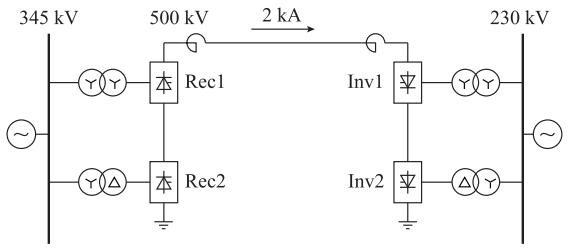
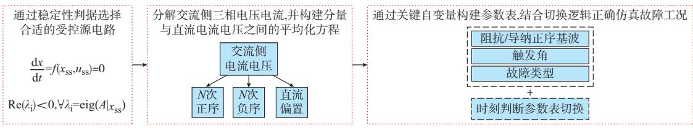
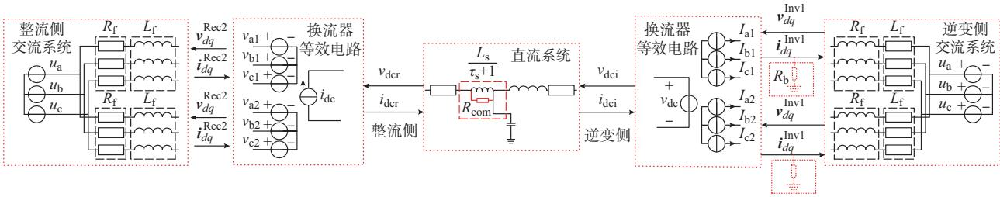
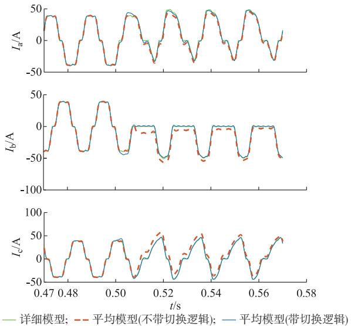
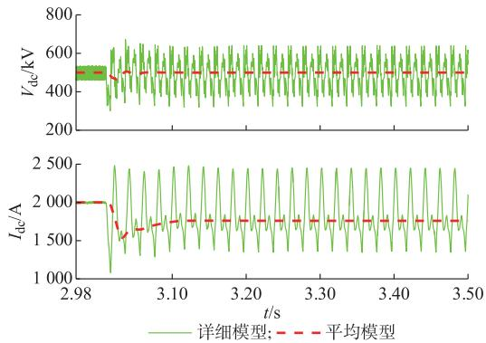
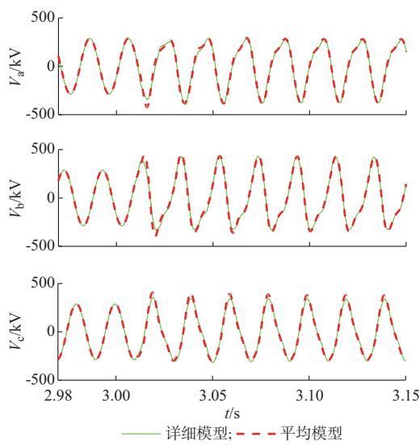
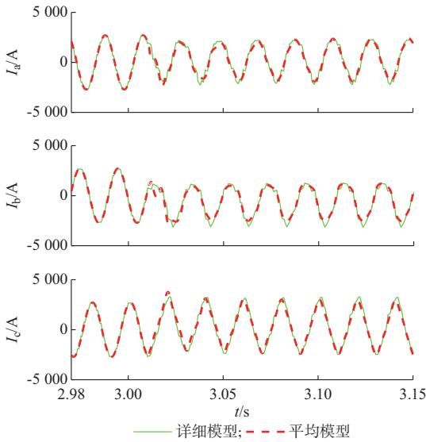

# 考虑换流器内部故障的LCC-HVDC动态平均化建模方法

洪泽祺1,许 寅1,和敬涵1,吴海伟2

( 北京交通大学电气工程学院,北京市 ; 国网江苏省电力有限公司,江苏省南京市 )

摘要:随着多个高压直流输电工程陆续投入运行,中国输电网呈现交直流混联的特征,其稳态与暂态特性区别于传统的交流互联电网。常规高压直流线路采用晶闸管换流器作为交流系统与直流系统的接口,换流器内部发生故障往往给系统的运行带来安全风险。研究高压直流换流器内部故障对电网运行的影响,需要建立准确高效的直流换流器暂态模型。基于分立开关的直流换流器详细模型在仿真过程中需处理大量开关动作事件,计算效率无法满足大规模交直流混联电力系统在线分析的需求。提出一种考虑内部故障的高压直流输电系统动态平均化模型,能够准确模拟由于直流换流器内部故障引起的暂态响应,且具有较高的计算效率,并以 标准直流输电系统为例验证了所提出模型的准确性与高效性。

关键词:动态平均化模型;高压直流输电;内部故障;交直流混联电网;电磁暂态仿真

# 0 引言

可再生能源发电技术的迅速发展[1]以及中国可再生能源与负荷中心逆向分布的特点使得长距离大容量输电的需求日益凸显[2] 随着高压直流(high-voltage direct current,HVDC)输电工程在输电网中的广泛应用 目前中国输电网已呈现明显的多区域直流互联特征[3]

交直流混联电网的动态特性比传统交流电网更为复杂[4-6]。基于晶闸管的电网换相型换流器(commutated converter,LCC)作为常规高压直流输电系统 的核 心部 件 发生 换 相 失败[7] 闭锁[8] 以及内部电力 电子 开关短路 或 开路[9-11]故障时,会给电力系统的安全运行带来风险。因此 有必要研究 内部故障对电力系统运行的影响 而时域仿真是分析这类问题的重要工具

系统的时域仿真方式分为机电暂态[12]和电磁暂态[13]仿真 类 在研究换流器故障暂态时,电磁暂态仿真更为常用。电磁暂态仿真常采用详细模型 针对 中的电力电子开关分立建模[14] 能够得到 系统的准确暂态特性但由于在仿真过程中需处理大量开关动作事件 需要采用较小的仿真步长,故计算效率低,难以满足大

规模交直流混联电力系统在线分析的需求 为进一步发挥电磁暂态仿真的优势,建立更加高效的系统模型十分重要

针对详细模型仿真效率低的缺点 有学者提出的 动 态 平 均 化 模 型 ( ,以实现 系统的高效电磁暂态仿真[15-16] 动态平均化模型基于动态系统的平均化理论[17] 建立 系统交直流电气量平均值间的关系 无须模拟开关动作细节 可在准确模拟 系统暂态外特性的前提下 采用较大的计算步长以提升仿真效率

系统的动态平均化模型可分为解析平均化模型和参数平均化模型两大类 其中 解析平均化模型从 的开关函数出发 推导端口电流电压平均值的解析关系式 普渡大学 团队[15-16]、 团队[18-19]、威斯康星大学麦迪逊分校 团队[20]以及贝尔格莱德大学团队[21]针对不同的交流侧电源和直流运行模式建立了对应的解析化平均模型 但仍然缺乏能描述换流器多种工况的统一解析化平均模型 且无法准确模拟 系统内部故障时的响应特性 由英属哥伦比亚大学 团队提出的参数化平均模型采用数值函数描述晶闸管变流器端口电压、电流平均值之间的物理关系 可实现对晶闸管换流器全工况的准确仿真[22] 基于该模型 有团队构建了正常工况下 直流输电系统的动态平均化模型[23] 以及考虑谐波[24-25]及内部故障的 脉波晶

闸管整流器模型[26] 但这些模型在内部故障工况下的 系统中并非简单拓展 目前尚无相关成果 且对于多参数表间的切换原则并未做深入探讨。

本文建立了考虑直流换流器内部故障的系统参数平均化模型 分析了 内部开关状态异常引起换流器运行工况变化的时序关系提出了参数平均化模型参数表切换逻辑 通过标准直流输电系统验证了所提出模型的正确性及高效性 相比于详细模型 本文模型主要有点优势 无须模拟 内部的开关动作过程 故可采用大步长仿真 切实降低计算量 避免了开关过程处理的辅助算法,计算流程简单,易于并行 尤其适合图形处理器 等众核处理器

# 1 LCC-HVDC换流器内部故障工况下的谐波分析

在正常运行和换流器内部故障工况下系统交流母线电压所含的谐波分量差异较大。以 标准高压直流输电系统(图 )为例,其整流侧和逆变侧均由 个 脉波 整流侧分别为 和 逆变侧分别为 和 串联构成。在正常运行工况下,由于上、下 个换流器的换相电压相差 次 次 次和 次等特征谐波分量会在换流变压器之间形成环流而不会流入换流母线 因此换流母线处只含有 k 次k 谐波 再配合对应的滤波器 换流母线的主导分量一般为基波分量[23]。但当 内部开关元件没有按照正常换相顺序导通和关断时 串联换流器之间的互补效应不再存在 换流母线电流电压呈现非对称特征并含有大量非特征次谐波,如附录 图 和图 所示[27]

  
图1 CIGRE标准高压直流输电系统示意图  
Fig.1 SchematicdiagramofCIGREbenchmarkHVDCtransmissionsystem

由于 的触发信号是根据换流母线处的相位产生的 忽略谐波的影响会导致触发角计算误差[28] 因此 为准确模拟 系统在换流器内部故障下的暂态特性 构建其模型时应考虑主

要谐波分量的影响 本文考虑所有幅值超过基波正序幅值 的谐波分量,采用详细模型对所关心的故障类型进行仿真以确定所需考虑的最高次谐波。

# 2 参数平均化建模原理

对于给定变量或函数 f(t),其平均值为[29]:

$$
\bar {f} (t) = \frac {1}{T _ {\mathrm {s}}} \int_ {t - T _ {\mathrm {s}}} ^ {t} f (x) \mathrm {d} x \tag {1}
$$

式中 t 为时间 T 为平均化周期

由于 系统中的晶闸管换流器内部不含储能元件 故其交直流侧物理量之间的关系可以采用代数方程描述 将交流电流 电压变换到同步旋转坐标系 并应用式 可以得到一组平均化代数方程[30]:

$$
\left\{ \begin{array}{l} \bar {v} _ {d} = \| \bar {v} _ {d q} \| \sin \left(\theta_ {v, d q}\right) \\ \bar {v} _ {q} = \| \bar {v} _ {d q} \| \cos \left(\theta_ {v, d q}\right) \end{array} \right. \tag {2}
$$

$$
\left\{ \begin{array}{l} \bar {i} _ {d} = \| \bar {i} _ {d q} \| \sin \left(\theta_ {i, d q}\right) \\ \bar {i} _ {q} = \| \bar {i} _ {d q} \| \cos \left(\theta_ {i, d q}\right) \end{array} \right. \tag {3}
$$

$$
\left\{ \begin{array}{l} \| \bar {v} _ {d q} \| = w _ {v} (\cdot) \bar {v} _ {\mathrm {d c}} \\ \bar {i} _ {\mathrm {d c}} = w _ {i} (\cdot) \| \bar {i} _ {d q} \| \end{array} \right. \tag {4}
$$

$$
\phi (\cdot) = \left\langle \bar {v} _ {d q}, \bar {i} _ {d q} \right\rangle = \theta_ {i, d q} - \theta_ {v, d q} \tag {5}
$$

式中 $\bullet \sigma _ { d } \bullet \sigma _ { q }$ 和 $\bar { i } _ { \ d } \ , \bar { i } _ { \ q }$ 分别为换流器交流侧电压和电流 $d q$ 轴分量的平均值 $\bar { v } _ { \mathrm { ~ d ~ c ~ } }$ 和 $\bar { i } _ { \mathrm { ~ d ~ c ~ } }$ 分别为直流电压、电流平均值; $\bar { \nu } _ { \ d q } = \bar { v } _ { \ d } + \mathrm { j } \bar { v } _ { \ d } , \bar { i } _ { \ d q } = \bar { i } _ { \ d } + \mathrm { j } \bar { i } _ { \ d }$ ，其中为虚数单位 $\langle \bar { \pmb { \nu } } _ { d q } , \bar { \pmb { i } } _ { d q } \rangle$ 为向量 $\bar { \nu _ { \ d q } }$ 与 $\hat { i } _ { \ d q }$ 的夹角$\theta _ { v , d q }$ 和 $\theta _ { i , d _ { q } }$ 分别为交流电压 $\bar { \nu _ { \ d _ { q } } }$ 和电流 $\hat { i } _ { \ d _ { q } }$ 与同步旋转坐标系 d 轴的夹角 $\mathbf { \Psi } _ { \mathbf { { ; } } } \ w _ { v } \ , \ w _ { i } \ , \phi$ 为方程系数,其取值随着触发角和换流器工况的变化而变化

通过数值化方法构建上述系数的参数表 并在应用该模型进行仿真时查表确定各系数的取值 因此该 模 型 被 称 为 参 数 平 均 化 模 型 (, )[30] 。

# 3 考虑换流器内部故障的LCC-HVDC系统参数平均化模型

# 建模思路

考虑换流器内部故障的 系统参数平均化模型构建思路如图 所示 主要可分为 步针对 脉波 的特点构建合适的等效电路稳定判据的变量解释详见文献 分解交流侧非对称电气量 含基波和谐波 构建各分量的平均化方程 选择关键变量提取对应的参数表 确定参数表切换逻辑 下面分别进行详细阐述

  
图2 考虑换流器内部故障的LCC-HVDC系统参数平均化建模  
Fig.2 PAVMofLCC-HVDCsystemconsideringinternalfaultsofconverter

# 32 LCC-HVDC系统等效电路构建

系统中换流器可等效为受控源电路,如图 所示。其中 $u _ { \textup { a } } , u _ { \textup { b } } , u _ { \textup { c } }$ 为外部系统等效电源电压 $\colon R _ { \mathrm { ~ 1 ~ } }$ 和 $L _ { \textrm { f } }$ 分别为外部系统与换流变压器合并等效电阻和电抗; $\ : \pmb { \nu } _ { d q } ^ { \mathrm { R e c l } } \ :$ 和 $i _ { d q } ^ { \mathrm { R e c l } } \ , \nu _ { d q } ^ { \mathrm { R e c 2 } }$ 和 $i _ { d q } ^ { \mathrm { R e c 2 } } \ , \nu _ { d q } ^ { \mathrm { I n v 1 } }$ 和$i _ { d q } ^ { \mathrm { I n v 1 } } , \nu _ { d q } ^ { \mathrm { I n v 2 } }$ 和 $\pmb { i } _ { d q } ^ { \mathrm { I n v 2 } }$ 分别为 Rec1,Rec2,Inv1和Inv2交流侧的电压和电流向量; $ { \tau } _ { \mathrm { d c r } } , i _ { \mathrm { d c r } }$ 和 $ { v _ { \mathrm { d c i } } } \cdot  { i _ { \mathrm { ~ d c i ~ } } }$ 分别为整流侧和逆变侧的直流电压 电流 整流侧 个换流器在交流侧分别等效为 组三相受控电压源 直流侧等效为 个共同的受控电流源 逆变侧 个换流器在交流侧分别等效为 组三相受控电流源 直流侧等效为 个共同的受控电压源 逆变侧之所以采用与整流侧不同的等效电路 主要考虑了等效系统的稳定性[31]

文献 将连接有 受控源等效电路的交

流系统表示为一组非线性微分方程 动态系统 并分析该系统在多种运行工况下的稳定性 得到 种等效电路的稳定域 并得出以下结论 当换流器的触发角大于 $9 0 ^ { \circ } \cdot$ 即换流器工作在逆变模式 时 若交流侧采用受控电压源形式 则系统稳定域较小 一些详细模型可有效模拟的运行工况无法采用动态平均化模型准确仿真;而交流侧采用受控电流源形式则可避免该问题。因此,本文在构建 系统等效电路时,逆变器交流侧等效为三相受控电流源,直流侧等效为受控电压源。此外,出于数值稳定性的考虑 整流侧电流源连接的电感需要添加一个时间常数足够小的惯性环节[30];逆变器侧受控电流源与外电路连接处需并联补偿电阻[32] 根据文献[ ]的结论,补偿电阻越大,误差越小,但数值稳定性越差,仿真效率越低;补偿电阻越小则反之。

  
图3 LCC-HVDC系统动态平均化模型等效电路  
Fig.3 EquivalentcircuitofAVMforLCC-HVDCsystem

换流变压器可近似等效为阻抗。由于篇幅所限 在附录 中给出增加等效阻抗的计算过程 高压直流输电系统的变压器容量通常较大 励磁支路中的电流可以忽略 因此本文的等效方式对于仿真的准确性影响不大。

# 33 交流侧多频率分量的获取

基于第 章的分析 系统中任一换流器交流侧电压 电流可以表示为

$$
\left\{ \begin{array}{l} v _ {\mathrm {a}} = \sum_ {n = 0} ^ {\infty} v _ {\mathrm {a}} ^ {(n)} \\ v _ {\mathrm {b}} = \sum_ {n = 0} ^ {\infty} v _ {\mathrm {b}} ^ {(n)} \\ v _ {\mathrm {c}} = \sum_ {n = 0} ^ {\infty} v _ {\mathrm {c}} ^ {(n)} \end{array} \right. \tag {6}
$$

$$
\left\{ \begin{array}{l} i _ {\mathrm {a}} = \sum_ {n = 0} ^ {\infty} i _ {\mathrm {a}} ^ {(n)} \\ i _ {\mathrm {b}} = \sum_ {n = 0} ^ {\infty} i _ {\mathrm {b}} ^ {(n)} \\ i _ {\mathrm {c}} = \sum_ {n = 0} ^ {\infty} i _ {\mathrm {c}} ^ {(n)} \end{array} \right. \tag {7}
$$

式中:n 为谐波次数,n 代表直流分量。

在内部故障状态下 换流器交流侧的端口电压电流往往呈现三相非对称,因此将交流电压电流的各次谐波分量进一步分解成正负序对称分量 由于高压直流系统换流变压器能够隔离零序分量 故不考虑零序分量 最终 换流器交流母线的电压 电流如式 和式 所示

$$
v _ {j} = v _ {j, \mathrm {d c}} ^ {(0)} + \sum_ {n = 1} ^ {\infty} \left(v _ {j, \text {p o s}} ^ {(n)} + v _ {j, \text {n e g}} ^ {(n)}\right) \tag {8}
$$

$$
i _ {j} = i _ {j, \mathrm {d c}} ^ {(0)} + \sum_ {n = 1} ^ {\infty} \left(i _ {j, \text {p o s}} ^ {(n)} + i _ {j, \text {n e g}} ^ {(n)}\right) \tag {9}
$$

式中:v(0) $\mathbf { \sigma } : \boldsymbol { v } _ { j , \mathrm { d c } } ^ { ( 0 ) }$ 和 $\boldsymbol { i } _ { j , \mathrm { d c } } ^ { ( 0 ) }$ 分别为j相电压、电流的直流分量; $\displaystyle { \mathfrak { o } } _ { j , \mathrm { p o s } } ^ { ( n ) }$ 和 $\boldsymbol { i } _ { j , \mathrm { p o s } } ^ { ( n ) }$ 分别为j相n次电压、电流的正序分量 $\mathfrak { ; v } _ { j , \mathrm { n e g } } ^ { ( n ) }$ 和 $\boldsymbol { i } _ { i , \mathrm { n e g } } ^ { ( n ) }$ 分别为j相n次电压、电流的负序分量;j 表示 , 或 相。

设 $\omega _ { \epsilon }$ 为基波同步旋转坐标系的角速度 则各电压 电流分量的瞬时值表达式为

$$
\begin{array}{l} k _ {j} = K _ {\mathrm {d c}} ^ {(0)} \cos \left(\theta_ {k, \mathrm {d c}} ^ {(0)} + \theta_ {j}\right) + \\ \sum_ {n = 1} ^ {\infty} K _ {\text {p o s}} ^ {(n)} \cos \left(n \omega_ {\mathrm {e}} t + \theta_ {k, \text {p o s}} ^ {(n)} + \theta_ {j}\right) + \\ \sum_ {n = 1} ^ {\infty} K _ {\text {n e g}} ^ {(n)} \cos \left(n \omega_ {\mathrm {e}} t + \theta_ {k, \text {n e g}} ^ {(n)} - \theta_ {j}\right) (10) \\ \theta_ {j} = \left\{ \begin{array}{l l} 0 & j = a \\ \frac {- 2 \pi}{3} & j = b \\ \frac {2 \pi}{3} & j = c \end{array} \right. (11) \\ \end{array}
$$

式中:k 表示电压 v 或电流 $i : K _ { \mathrm { ~ p o s ~ } } ^ { ( n ) }$ 和 $K _ { \mathrm { \ n e g } } ^ { ( n ) }$ 分 别 为次谐波的正、负序分量幅值; $\theta _ { k , \mathrm { p o s } } ^ { ( n ) }$ 和 $\theta _ { k \mathrm { ~ } , \mathrm { n e g } } ^ { ( n ) }$ 分别为次谐波的正、负序分量的相角。

引入多同步坐标系[26]计算各次谐波正负序分量的幅值和相角 对于任意三相交流波形 $k _ { \mathrm { a b c } }$ 设其基波角速度为 $\omega _ { \mathrm { e } }$ 采用角速度为 $\omega = \pm n \omega$ 的旋转坐标系对其 n 次谐波正 负序分量进行分解 得到其 $d q$ 轴分量 进而计算出该分量的幅值和相角关于多同步坐标系的详细说明参见文献[24]

# 34 LCC-HVDC系统参数平均化方程构建

换流器的外特性共有 组变量 分别为直流电流 直流电压 交流电流与交流电压 采用受控源电路等效换流器后 交直流侧分别有一组变量是通过测量得到的,另一组变量则是受控源的输出 平均模型在仿真过程中需要通过一侧的测量值去计算另一侧的受控源输出 因此需要结合具体的受控源形式 建立交直流电流 电压的参数平均化方程 描述当前工况下交直流电流 电压的关系

# 整流侧参数平均化方程

整流侧的受控源形式为交流电压源和直流电流源 测量量为交流电流和直流电压 需要建立交流电压各次分量与直流电压之间 以及交流电流基波正序分量和直流电流之间的参数平均化方程 其中交流电压 n 次谐波正序分量与直流电压间的参数平均化方程为 在动态平均化建模的过程中 上 下

个换流器的运行工况需要分开考虑 但由于 个换流器的平均化方程形式基本一致,因此这里仅以换流器 为例写出其参数平均化方程 将上标 替换为 即可得到换流器 的参数平均化方程 逆变侧同理

$$
\left\| \nu_ {d q, \text {p o s}} ^ {(n), \text {R e c l}} \right\| = w _ {v, \text {p o s}} ^ {(n), \text {R e c l}} \bar {v} _ {\mathrm {d c}} ^ {\text {R e c}} \tag {12}
$$

$$
\theta_ {v, \text {p o s}} ^ {(n), \text {R e c l}} = \arctan \left(\frac {\mathcal {V} _ {d , \text {p o s}} ^ {(n) , \text {R e c l}}}{\mathcal {V} _ {q , \text {p o s}} ^ {(n) , \text {R e c l}}}\right) \tag {13}
$$

式中:v(n),R $: \mathcal { V } _ { d , \mathrm { p o s } } ^ { ( n ) , \mathrm { R e c l } }$ (n),R $\boldsymbol { v } _ { q , \mathrm { p o s } } ^ { ( n ) , \mathrm { R e c l } }$ 分别为Recl交流电压正序各次分量经过对应的同步坐标系变换所得的 d 轴和q 轴分量; $\pmb { \nu } _ { d q , \mathrm { p o s } } ^ { ( n ) , \mathrm { R e c l } } = \pmb { \nu } _ { d , \mathrm { p o s } } ^ { ( n ) , \mathrm { R e c l } } + \mathbf { j } \pmb { v } _ { q , \mathrm { p o s } } ^ { ( n ) , \mathrm { R e c l } }$ (n),Rec1 (n),R 为 整流侧的直流电压; $\cdot \theta _ { v , \mathrm { p o s } } ^ { ( n ) , \mathrm { R e c l } }$ (n),Re $\nu _ { d q , \mathrm { p o s } } ^ { \left( n \right) , \mathrm { R e c l } }$ 与d轴的夹角。

由于 个整流器在直流侧串联 流过整流器和整流器 的电流是一样的 因此交流电流基波正序分量和直流电流之间的参数平均化方程如下

$$
\bar {i} _ {\mathrm {d c}} ^ {\text {R e c}} = \omega_ {i, \text {p o s}} ^ {(1), \text {R e c l}} \| i _ {d q, \text {p o s}} ^ {(1), \text {R e c l}} \| \tag {14}
$$

式中:i-Recdc 为整流侧的直流电流; $\pmb { i } _ { d q , \mathrm { p o s } } ^ { ( 1 ) , \mathrm { R e c l } } = i _ { d , \mathrm { p o s } } ^ { ( 1 ) , \mathrm { R e c l } } +$ =id,pos (1),Rec1$\mathrm { j } i _ { q , \mathrm { p o s } } ^ { ( 1 ) , \mathrm { R e c l } }$ ，其中 $i _ { d , \mathrm { p o s } } ^ { ( 1 ) , \mathrm { R e c l } }$ 和 $i _ { q , \mathrm { p o s } } ^ { ( 1 ) , \mathrm { R e c l } }$ 分别为Rec1交流电流正序基波经过对应的同步坐标系变换所得的$d$ 轴和 轴分量

同理 交流电压的负序分量和直流分量的参数平均化方程如下:

$$
\left\| \nu_ {d q, \text {n e g}} ^ {(n), \text {R e c l}} \right\| = \omega_ {v, \text {n e g}} ^ {(n), \text {R e c l}} \bar {v} _ {\mathrm {d c}} ^ {\text {R e c}} \tag {15}
$$

$$
\theta_ {v, \text {n e g}} ^ {(n), \text {R e c l}} = \arctan \left(\frac {\mathcal {V} _ {d , \text {n e g}} ^ {(n) , \text {R e c l}}}{\mathcal {V} _ {q , \text {n e g}} ^ {(n) , \text {R e c l}}}\right) \tag {16}
$$

$$
\left\| v _ {d q, \mathrm {d c}} ^ {(0), \mathrm {R e c l}} \right\| = w _ {v, \mathrm {d c}} ^ {(0), \mathrm {R e c l}} \bar {v} _ {\mathrm {d c}} ^ {\mathrm {R e c}} \tag {17}
$$

$$
\theta_ {v, \mathrm {d c}} ^ {(0), \mathrm {R e c l}} = \arctan \left(\frac {\mathcal {V} _ {d , \mathrm {d c}} ^ {(0) , \mathrm {R e c l}}}{\mathcal {V} _ {q , \mathrm {d c}} ^ {(0) , \mathrm {R e c l}}}\right) \tag {18}
$$

式中:v-Rec为整流侧的直流电压 $\mathfrak { ; v } _ { d , \mathrm { n e g } } ^ { ( n ) , \mathrm { R e c l } }$ (n),R $\boldsymbol { v } _ { \boldsymbol { q } , \mathrm { n e g } } ^ { ( n ) , \mathrm { R e c l } }$ 分别为 交流电压负序各次分量经过对应的同步坐标系 变 换 所 得 的 d 轴 和 q 轴 分 量;v(n),Rec $\pmb { \nu } _ { d q , \mathrm { n e g } } ^ { ( n ) , \mathrm { R e c l } } =$ (n)，Recl=${ \boldsymbol { \upsilon } } _ { d , \mathrm { n e g } } ^ { ( n ) , \mathrm { R e c l } } + \mathrm { j } { \boldsymbol { v } } _ { q , \mathrm { n e g } } ^ { ( n ) , \mathrm { R e c l } } ; { \boldsymbol { \theta } } _ { \boldsymbol { v } , \mathrm { n e g } } ^ { ( n ) , \mathrm { R e c l } }$ (),R (n),R $\nu _ { d q , \mathrm { n e g } } ^ { \left( n \right) , \mathrm { R e c l } }$ 与d轴的夹角;v(0),R $\mathbf { \sigma } _ { \mathbf { 3 } } ^ { ( 0 ) } , \mathbf { v } _ { d , \mathrm { d c } } ^ { ( 0 ) } , \mathbf { v } _ { q , \mathrm { d c } } ^ { ( 0 ) , \mathrm { R e c l } }$ ,q，d (), 和 $\theta _ { v , \mathrm { d c } } ^ { ( 0 ) , \mathrm { R e c l } }$ 分别为Reel 三相电压的直流分量经过静止 $( \omega = 0 ) d q$ 坐标系变换后的合成向量的模及其与 d 轴的夹角 由于逆变侧变量将上标 换成 即可全部表示 含义不变 因此不再赘述。

在 式 (12)至 式 (18)中,w(n),Re $\mathcal { W } _ { v , \mathrm { p o s } } ^ { ( n ) , \mathrm { R e c l } } , \ \mathcal { W } _ { v , \mathrm { n e g } } ^ { ( n ) , \mathrm { R e c l } }$ u，neg ，$\begin{array} { r l } & { \mathrel { \mathop { \mathcal { W } } _ { v , \mathrm { d c } } ^ { ( 0 ) , \mathrm { R e c l } } } , \mathrel { \mathop { \mathcal { W } } _ { i , \mathrm { p o s } } ^ { ( 1 ) , \mathrm { R e c l } } } } \end{array}$ (0), (1),R 和 $\theta _ { v , \mathrm { p o s } } ^ { ( n ) , \mathrm { R e c l } } , \theta _ { v , \mathrm { n e g } } ^ { ( n ) , \mathrm { R e c l } } , \theta _ { v , \mathrm { d c } } ^ { ( 0 ) , \mathrm { R e c l } }$ 1 (n),Rec1 为随着换流器触发角和负载工况变化的参数 且难以通过解析化的方法获取 因此通过仿真详细模型获取若干运行点的参数 触发角与换流器运行工况 再通过插值构建成二维参数表[22] 触发角可以很容易从控制器的输出获取 而整流侧则采用动态阻抗来表

征每个运行点上的换流器工况

$$
Z _ {\mathrm {d}} ^ {\text {R e c l}} = \frac {\bar {v} _ {\mathrm {d c}} ^ {\text {R e c}}}{\| \boldsymbol {i} _ {d q , \text {p o s}} ^ {(1) , \text {R e c l}} \|} \tag {19}
$$

假设外部系统等效电源三相对称且除基波以外的谐波可以忽略 在交流系统中 除正序基波外的谐波注入源 只有等效换流器的受控源 因此谐波电流的相角只取决于受控电压源的输入 在记录相角参数时 只 需 记 录 电 压 分 量 的 相 角 $\theta _ { v , \mathrm { p o s } } ^ { ( n ) , \mathrm { R e c } } \ ( n \neq 1 )$ (n),Rec $\theta _ { v , \mathrm { n e g } } ^ { \left( n \right) , \mathrm { R e c } } , \theta _ { v , \mathrm { d c } } ^ { \left( 0 \right) , \mathrm { R e c } }$ 。但正序基波的注入源有换流器等效受控源和外部系统等效电源 在触发角和负载工况固定的情况下, $\theta _ { v , \mathrm { p o s } } ^ { ( 1 ) , \mathrm { R e c } }$ 和 $\theta _ { i , \mathrm { p o s } } ^ { ( 1 ) , \mathrm { R e c } }$ 会因外部系统等效电源变化而变化 但 个参数之间的差值不变[26]所以正序基波的相角合并表示为电流与电压的相角差 对于逆变侧同理

$$
\begin{array}{l} \phi_ {\text {p o s}} ^ {(1), \operatorname {R e c l}} = \theta_ {i, \text {p o s}} ^ {(1), \operatorname {R e c l}} - \theta_ {v, \text {p o s}} ^ {(1), \operatorname {R e c l}} = \\ \arctan \left(\frac {i _ {d , \text {p o s}} ^ {(1) , \operatorname {R e c l}}}{i _ {q , \text {p o s}} ^ {(1) , \operatorname {R e c l}}}\right) - \arctan \left(\frac {\mathcal {V} _ {d , \text {p o s}} ^ {(1) , \operatorname {R e c l}}}{\mathcal {V} _ {q , \text {p o s}} ^ {(1) , \operatorname {R e c l}}}\right) \tag {20} \\ \end{array}
$$

在仿真中先测量出 $\theta _ { i , \mathrm { p o s } } ^ { ( 1 ) , \mathrm { R e c l } }$ ,再根据参数表即可计算出 $\theta _ { v , \mathrm { p o s } } ^ { ( 1 ) , \mathrm { R e c l } }$ 。

# 342 逆变侧参数平均化方程

逆变侧的受控源形式为交流电流源和直流电压源 测量量为交流电压与直流电流 需要建立交流电流各次分量与直流电流之间 以及交流电压基波正序分量和直流电压之间的参数平均化方程 其中交流电流 n 次谐波正序分量与直流电流间的参数平均化方程如下

$$
\left\| \boldsymbol {i} _ {d q, \text {p o s}} ^ {(n), \text {I n v l}} \right\| = w _ {i, \text {p o s}} ^ {(n), \text {I n v l}} i _ {\mathrm {d c}} ^ {- \text {I n v}} \tag {21}
$$

$$
\theta_ {i, \text {p o s}} ^ {(n), \text {I n v l}} = \arctan \left(\frac {i _ {d , \text {p o s}} ^ {(n) , \text {I n v l}}}{i _ {q , \text {p o s}} ^ {(n) , \text {I n v l}}}\right) \tag {22}
$$

同样 正序基波的相角合并表示为电流与电压的相角差:

$$
\begin{array}{l} \phi_ {\mathrm {p o s}} ^ {(1), \mathrm {I n v l}} = \theta_ {i, \mathrm {p o s}} ^ {(1), \mathrm {I n v l}} - \theta_ {v, \mathrm {p o s}} ^ {(1), \mathrm {I n v l}} = \\ \arctan \left(\frac {i _ {d , \text {p o s}} ^ {(1) , \operatorname {I n v} 1}}{i _ {q , \text {p o s}} ^ {(1) , \operatorname {I n v} 1}}\right) - \arctan \left(\frac {v _ {d , \text {p o s}} ^ {(1) , \operatorname {I n v} 1}}{v _ {q , \text {p o s}} ^ {(1) , \operatorname {I n v} 1}}\right) \tag {23} \\ \end{array}
$$

由于 个逆变器是串联的关系 个换流器在直流侧电压相加,交流电压基波正序分量和直流电压之间的参数平均化方程如下

$$
\bar {v} _ {\mathrm {d c}} ^ {\text {I n v}} = w _ {v, \text {p o s}} ^ {(1), \text {I n v 1}} \| v _ {d q, \text {p o s}} ^ {(1), \text {I n v 1}} \| + w _ {v, \text {p o s}} ^ {(1), \text {I n v 2}} \| v _ {d q, \text {p o s}} ^ {(1), \text {I n v 2}} \| \tag {24}
$$

交流电流的负序和直流分量的参数平均化方程如下:

$$
\begin{array}{l} \left\| \boldsymbol {i} _ {d q, \text {n e g}} ^ {(n), \text {I n v l}} \right\| = w _ {i, \text {n e g}} ^ {(n), \text {I n v l}} i _ {\mathrm {d c}} ^ {- \text {I n v}} (25) \\ \theta_ {i, \text {n e g}} ^ {(n), \text {I n v l}} = \arctan \left(\frac {i _ {d , \text {n e g}} ^ {(n) , \text {I n v l}}}{i _ {q , \text {n e g}} ^ {(n) , \text {I n v l}}}\right) (26) \\ \parallel \boldsymbol {i} _ {d q, \mathrm {d c}} ^ {(0), \text {I n v l}} \parallel = w _ {i, \mathrm {d c}} ^ {(0), \text {I n v l}} v _ {\mathrm {d c}} ^ {\text {I n v}} (27) \\ \end{array}
$$

$$
\theta_ {i, \mathrm {d c}} ^ {(0), \text {I n v l}} = \arctan \left(\frac {i _ {d , \mathrm {d c}} ^ {(0) , \text {I n v l}}}{i _ {q , \mathrm {d c}} ^ {(0) , \text {I n v l}}}\right) \tag {28}
$$

逆变侧采用动态导纳来表征每个运行点上的换流器工况

$$
Y _ {\mathrm {d}} ^ {\text {I n v l}} = \frac {\bar {i} _ {\mathrm {d c}} ^ {\text {I n v}}}{\| \boldsymbol {v} _ {d q , \text {p o s}} ^ {(1) , \text {I n v l}} \|} \tag {29}
$$

# 35 LCC-HVDC平均化模型参数表切换时刻

由于换流器端口暂态特性发生变化的时刻与发生故障的时刻并不完全同步,不正确的参数表切换时刻会导致动态平均化模型的仿真结果与详细模型存在较大差异。

本文主要考虑 换流器内部单个开关管短路或者开路故障 这里所说的开关管故障是指开关管的导通状态与正常运行时应处于的状态不吻合 其产生原因可分为一次系统故障 即开关管本身故障 和二次系统故障 即触发信号错误 控制 量测等模块发生故障最终也反映在触发信号上 因此本文综合故障类型 短路或开路 和故障来源 开关管本身故障或触发信号错误 将参数表切换的场景分为 类 如表 所示

表 不同开关故障类型与故障原因下换流器发生故障的时刻  
Table1 Failureoccurrencetimeofconverterwith differentfaulttypesandcausesofswitch   

<table><tr><td>类型</td><td>开关故障</td><td>错误信号</td></tr><tr><td>开路</td><td>若开关此刻导通,则立即切换参数表;若开关此刻关断,下一个导通时刻切换参数表</td><td>下一个导通时刻再切换参数表</td></tr><tr><td>短路</td><td>若开关此刻导通,当前导通过程结束时应切换参数表;若开关此刻关断,立即切换参数表</td><td>故障时刻在关断后的下一个线电压过零点之前,在过零点切换参数表;故障时刻在关断后的下一个线电压过零点之后,立即切换参数表</td></tr></table>

这 种情况下 直流换流器进入故障运行工况的时间点各不相同,需要在合适的时刻切换平均化模型的参数表才能够准确模拟 在换流器内部故障工况下的暂态外特性 因此 需要在模型中增加判断逻辑 以保证模型在正确的时刻切换参数表。

# 3.6 LCC-HVDC 系统动态平均化模型的构建与使用

对于给定拓扑和参数的 系统 首先构建详细仿真模型 接着 通过改变系统的运行状态 正常运行或换流器内部故障 负载工况和触发角 记录相应的稳态运行点 进而 提取各运行工况下动态平均化模型的参数值 形成参

数表 最后 构建 系统动态平均化模型等效电路。以上步骤在首次构建模型时完成,当外部网络结构变化时,无须重复构建。

在使用 系统动态平均化模型进行仿真时 根据其内部故障类型 包括无故障 选择合适的参数表 并在仿真过程中计算负载工况 通过式 和式 和获取触发角作为参数表输入 获得方程参数。

# 4 算例测试

本节首先针对单个晶闸管换流器进行仿真以说明设置合适的参数表切换时刻的必要性,进而采用高压直流输电标准系统验证所提模型的准确性与高效性

测试中以详细模型仿真结果为参照 详细模型采用 中的 工具包搭建 动态平均化模型采用 的标准库元件搭建 仿真 硬 件 环 境 为7700HQ CPU @2.80 GHz 和16 GB 内存。

# 参数表切换时刻判别的必要性测试

以附录 图 所示的晶闸管整流器为例进行验证 系统参数如附录 表 所示 动态平均化模型考虑 次及以下谐波 设 时由于开关损坏 开路 分别采用详细模型 动态平均化模型故障瞬间切换参数表 和动态平均化模型 按照节的逻辑切换参数表 进行仿真 结果如图 和附录 图 和图 所示

  
图 脉波整流器 开路故障交流侧电流波形  
Fi.4 AC-sidecurrentwaveformsof6-ulse rectifierwithT3open-circuitfault

可以看出 无参数表切换逻辑的动态平均化模型在 直接切换参数表,而增加了参数表切换逻辑的动态平均化模型在检测到相应开关管即将导通的时刻才切换参数表

种模型交流侧电流如图 所示 有参数表切换逻辑的动态平均化模型在故障发生后的交流电流暂态也比无参数表切换逻辑的动态平均化模型更为准确。

与详细模型相比 动态平均化模型在故障发生后的第 个周期内存在一定误差 即过渡过程误差 但在一个周期后则能够较为准确的模拟系统 此时的误差称为故障稳态误差 评估故障稳态误差时,可对比详细模型和平均化模型仿真得到的交流电压 电流波形所含各次谐波分量的幅值和相角;过渡过程误差则主要通过比较电压、电流的瞬时值予以评估 如附录 图 所示 由于本文所提出的模型主要应用于系统级分析,故障后 个周期内的瞬时波形存在一定偏差对整体分析结果并无太大影响 因此本文以故障稳态误差大小判断其是否在可接受范围内 若各次谐波电压幅值相对误差均在 以内且相角误差均在 以内,则认为误差在可接受范围内

在故障发生 个周期之后 对比详细模型和平均化模型仿真结果所含有的各次谐波分量的幅值和相角 具体结果如附录 表 和表 所示 可以看出 动态平均化模型基波及 次谐波正负序分量的幅值误差在 以内 相角误差在 以内 在可接受范围之内

综上 增加参数表切换逻辑使模型在正确的时刻切换参数表 能够更准确仿真故障发生后的交直流侧暂态 后续对 高压直流输电系统建模换流器的模型中均增加了该参数表切换逻辑。

# 42 CIGRE高压直流输电系统

标准直流系统的算例信息与文献一致,其中变压器整流侧等效漏感 $L _ { \mathrm { \ e q } } ^ { \mathrm { \scriptsize ~ r e c } } = 0 . 1 1 3 ~ \mathrm { H }$ ,逆变侧等效漏感 $L _ { \mathrm { \ e q } } ^ { \mathrm { \ i n v } } = 0 . 0 5 1 \ 2 1 \ \mathrm { H } , R _ { \mathrm { \scriptsize { b } } } = 5 0 \ \Omega , \tau =$ $2 . 5 \times { { 1 0 } ^ { - 3 } }$ 在故障工况下 由于同一侧串联的个换流器不再对称 需要对上下 脉波 分别建模 才能准确仿真故障下的暂态 根据详细模型仿真结果,动态平均化模型考虑 次及以下谐波。以下分别针对开路故障和短路故障 个场景进行仿真分析

# 421 算例 开路故障

一开始系统处于额定工况 时 的 相

上桥臂 发生开路 详细模型与平均模型的暂态特性如图 至图 所示, 种模型的误差曲线详见附录 图 。

  
图5 CIGRE系统Rec1的T3开路故障直流侧暂态波形

  
Fi.5 DC-sidetransientwaveformswithT3 open-circuitfaultinRec1forCIGREsystem   
图6 CIGRE系统Rec1的T3开路故障交流侧电压波形  
Fig.6 AC-sidevoltagewaveformswithT3 open-circuitfaultinRec1forCIGREsystem

可以看出 受建模原理所限 故障发生后的 个周期内动态平均化模型仿真结果存在一定误差 但能够准确仿真 个周期之后的暂态特性 稳态误差如附录 表 和表 所示 动态平均化模型给出的交流电压和电流各分量的幅值误差在 以内相角误差在 以内

# 422 算例 短路故障

为了保证验证算例的完整性 在逆变侧设置了故障进行仿真实验 一开始系统处于稳态工况时 的 相上桥臂由于错误的触发信号发生短路故障,控制系统立刻增大了触发角,阻止 发生换相失败而导致电压跌落 由于篇幅所限 详细模型

  
图7 CIGRE系统Rec1的T3开路故障交流侧电流波形  
Fig.7 AC-sidecurrentwaveformswithT3 open-circuitfaultinRec1forCIGREsystem

与平均模型的暂态特性以及误差曲线已在附录给出 稳态误差如附录 表 和表 所示 动态平均化模型的准确性同样能够达到 节中的标准

# 43 仿真效率

种模型均采用 积分算法 其中相对和绝对容差均设置为 $1 0 ^ { - 3 }$ ,最大步长为 。此外 对于 直流输电系统 详细模型除采用上述设置外 还采用 $5 0 ~ \mu \mathrm { s }$ 定步长的 算法进行仿真 由于篇幅所限 这里给出算例 中 种模型的仿真效率 可以看出 平均模型相对于详细模型由于无须针对具体的开关进行仿真 能够采用较大的步长进行计算 计算效率有较大的提升 但与只考虑基波相比 当考虑谐波的影响时 变步长算法的平均步长缩小 仿真时间变长 这是由于变步长算法的仿真步长主要由容差控制 由于仿真过程中始终需要计算交流侧的正弦电压电流分量 在相同的容差下 系统需要考虑的谐波分量频率越高 则平均步长越小 另一方面 节为针对单个换流器的仿真而 节与 节为针对 系统的仿真随着系统换流器数量的增多 动态平均化模型对于仿真效率的提升更为明显,因此该模型适合应用于大规模交直流混联电网的建模仿真

算例 详细模型与平均模型的仿真效率如表所示 其中仿真时长为 节和 节的仿真效率结果见附录 表 和表

表2 算例1详细模型与PAVM 的仿真效率Table2 SimulationperformanceofdetailedmodelandPAVMincase1  

<table><tr><td>仿真方式</td><td>计算时长/s</td><td>仿真步数</td><td>平均步长/μs</td><td>加速比</td></tr><tr><td>详细模型(变步长)</td><td>441.40</td><td>334249</td><td>12.00</td><td></td></tr><tr><td>详细模型(定步长)</td><td>34.24</td><td>80000</td><td>50.00</td><td></td></tr><tr><td>PAVM考虑基波</td><td>8.12</td><td>6263</td><td>638.67</td><td>54.4/4.22</td></tr><tr><td>PAVM考虑谐波</td><td>10.63</td><td>10449</td><td>382.82</td><td>41.5/3.22</td></tr></table>

可以看出 平均模型相对于详细模型 由于无须针对具体的开关进行仿真,能够采用较大的步长进行计算 计算效率有较大的提升 但与只考虑基波相比 当考虑谐波的影响时 变步长算法的平均步长缩小 仿真时间变长 这是由于变步长算法的仿真步长主要由容差控制 由于仿真过程中始终需要计算交流侧的正弦电压电流分量 在相同的容差下 系统需要考虑的谐波分量频率越高 则平均步长越小 另一方面, 节 为 针 对 单 个 换 流 器 的 仿 真,而节与 节为针对 系统的仿真,随着系统换流器数量的增多,动态平均化模型对于仿真效率的提升更为明显 因此该模型适合应用于大规模交直流混联电网的建模仿真

# 44 惯性环节时间常数的选取

系统动态平均化模型整流器直流侧引入的惯性环节等效于在电感处并联一个电阻并联电路等效阻抗为

$$
Z _ {\mathrm {c o m}} = R _ {\mathrm {c o m}} / / L = \frac {R _ {\mathrm {c o m}} L s}{L s + R _ {\mathrm {c o m}}} = \frac {L s}{\left(\frac {L}{R _ {\mathrm {c o m}}}\right) s + 1} = \frac {L s}{\tau s + 1} \tag {30}
$$

式中: $R _ { \mathrm { { c o m } } }$ 为并联电阻;L 为 直流系统整流侧直流出口连接的电感; $Z _ { \mathrm { c o m } }$ 为补偿后整个并联支路的阻抗。

稳态时惯性环节等效于幅值为 的增益 不引入误差 在暂态时能够有效抑制电流源与孤立电感串联引起的数值振荡 惯性环节时间常数的大小会影响模型的效率与准确性,目前尚无文献给出确定时间常数取值的一般方法 本文以 标准直流系统为例 在额定工况下改变电流参考值 通过仿真分析说明时间常数对于仿真结果准确性以及仿真效率的影响。求解算法为 ,最大步长设为${ { 1 0 } ^ { - 3 } } \mathrm { s }$ 相对容差设为 $1 0 ^ { - 2 }$ 仿真结果如附录 图和图 所示 可以看出 时间常数过大会导致模型的暂态特性误差增大 过小则无法充分抑制数值

振荡 导致仿真步长减小 选择的时间常数应能够充分抑制数值振荡且不引入过大的暂态误差,对于本文算例时间常数可设为 $2 . 5 \times { { 1 0 } ^ { - 3 } }$ 根据所选择的时间常数即可换算出对应的并联电阻

不同 τ 值时平均模型的仿真效率如表 所示,其中仿真时长为 。

表3 不同时间常数时PAVM 的仿真效率  
Table3 Simulationperformanceof PAVM with different time constants   

<table><tr><td>时间常数τ</td><td>计算时长/s</td><td>仿真步数</td><td>平均步长/μs</td></tr><tr><td>1.1×10-3</td><td>41.8</td><td>16 559</td><td>543.5</td></tr><tr><td>2.5×10-3</td><td>22.1</td><td>11 145</td><td>807.5</td></tr><tr><td>2.5×10-2</td><td>19.7</td><td>10 293</td><td>874.4</td></tr></table>

可以看出,时间常数过大会导致模型的暂态特性误差增大 过小则无法充分抑制数值振荡 导致仿真步长减小。选择的时间常数应能够充分抑制数值振荡且不引入过大的暂态误差 对于本文算例时间常数可设为 $2 . 5 \times { { 1 0 } ^ { - 3 } }$ 根据所选择的时间常数即可换算出对应的并联电阻

# 5 结语

本文分析了正常工况与换流器故障状态下系统交流侧的谐波特性 指出需要在仿真过程中考虑谐波的影响 结合能够考虑换流器内部故障的晶闸管换流器动态平均化模型,提出模型参数表切换逻辑 建立了能够考虑交流侧谐波分量的高压直流输电系统的动态平均化模型 通过算例验证了模型的正确性和高效性。相较于详细模型,动态平均化能够准确仿真换流器换流器故障工况下的高压直流输电系统暂态特性 并且提升了仿真效率 适用于系统级别的仿真

考虑到高压直流输电系统互联的交流系统通常为三相对称 且换流母线上配有滤波器 模型对外部交流系统进行了适当的简化。目前,模型能够对外部交流系统对称且无明显谐波含量的高压直流输电系统换流器内部单个开关短路或开路故障进行较准确的仿真 但尚未考虑换相失败等含有不完整换相过程的换流器异常运行状态 以及换流母线出现明显非对称和大量谐波的情况 此外 想要准确仿真换相失败现象 还需要准确判断发生换相失败的时刻 而平均化模型内部不存在开关元件 这会给判断带来困难 这些将在后续的研究工作中体现

附录见本刊网络版( :/// / / )。

# 参 考 文 献

韩雪 任东明 胡润青 中国分布式可再生能源发电发展现状与挑战 中国能源  
HAN Xue，REN Dongming，HU Runqing.Current satus and challenges of distributed renewable energy power generation in China[J].Energy of China，2019(6)：32-36.   
陈庆 闪鑫 罗建裕 等 特高压直流故障下源网荷协调控制策略及应用 电 力 系 统 自 动 化10.7500/AEPS20160803005.  
CHEN Qing，SHAN Xin，LUO Jianyu，et al.Source-grid-load coordinated control strategy and its application under UHVDC faults[J]. Automation of Electric Power Systems，2017, 41(5)：147-152.DOI:10.7500/AEPS20160803005.   
刘振亚 张启平 国家电网发展模式研究 中国电机工程学报，2013,33(7)：1-10.  
LIU Zhenya，ZHANG Qiping. Study on the development mode of national power grid of China[J]. Proceedings of the CSEE, , ():   
徐政 交直流电力系统的动态行为分析 北京 机械工业出版社，2004.  
XU Zheng. Dynamic behavior analysis of AC and DC power system[M].Beijing：Machinery Industry Press，2004.   
王晶芳 王智冬 李新年 等 含特高压直流的多馈入交直流系统动态特性仿真 电力系统自动化  
WANG Jingfang，WANG Zhidong，LI Xinnian， et al. Simulation to study the dynamic performance of multi-infeed AC/DC power systems including UHVDC[J].Automation of Electric Power Systems，2007，31(11)：97-102.   
邵瑶 汤涌 多馈入交直流混合电力系统研究综述 电网技术,2009,33(17):24-30.  
SHAO Yao，TANG Yong.Research survey on multi-infeed AC/DC hybrid power systems[J]. Power System Technology, 2009，33(17)：24-30.   
王晶 梁志峰 江木 等 多馈入直流同时换相失败案例分析及仿真计算 电力系统自动化  
WANG Jing，LIANG Zhifeng，JIANGMu，etal.Case analysisand simulation of commutation failure in multi-infeed HVDCtransmission systems [J].Automation of Electric PowerSystems，2015，39(4)：141-146.  
王莹 刘兵 刘天斌 等 特高压直流闭锁后省间紧急功率支援的协调 优 化 调 度 策 略 中 国 电 机 工 程 学 报35(11):2695-2702.  
WANG Ying，LIU Bing，LIU Tianbin，et al．Coordinated optimal dispatching ofemergency power support among provinces after UHVDC transmission system block fault[J]. Proceedings of the CSEE，2015，35(11)：2695-2702.   
王振 钱海 周尚礼 等 天广直流工程换流阀异常导通原因分析及对策[]高电压技术, , ():  
WANG Zhen，QIAN Hai，ZHOU Shangli，et al.Cause analysis and countermeasures for the abnormal conduction of converter valve in Tian-Guang HVDC project[J].High Voltage Engineering，2017，43(7)：2154-2160.   
刘磊 林圣 李小鹏 等 基于电流积分的 系统阀短路故

障分类 与 定 位 方 法 电 力 系 统 自 动 化112-117.DOI:10.7500/AEPS20170216003.  
LIU Lei，LIN Sheng，LI Xiaopeng，et al． Current integral based method for valve short-circuit fault classification and location in HVDC system[J].Automation of Electric Power , , ( ): : / AEPS20170216003.   
胡宇洋 唐开平 余珊珊 葛洲坝换流站直流开路试验故障原因分析[J.电力系统自动化，2010，34(18)：103-107.  
HU Yuyang，TANG Kaiping，YU Shanshan. Fault analysis of open line test on DC side of Gezhouba converter station[J].   
34(18):103-107.   
[ ]倪以信 动态电力系统的理论和分析[ ]北京:清华大学出版社,2002.  
NI Yixin. Theory and analysis of dynamic power system[M]. Beijing：Tsinghua University Press，2002.   
汤涌 电力系统数字仿真技术的现状与发展 电力系统自动化，2002,26(17):66-70.  
TANG Yong. Present situation and development of power system simulation technologies[J]．Automation of Electric Power Systems，2002，26(17)：66-70.   
[14]WATSONN，ARRILLAGAJ． Powersystemselectromagnetic transients simulation[M.UK：IET，2003.  
[15] SUDHOFF S D，WASYNCZUK O. Analysis and averagevalue modeling of line-commutated converter-synchronous machine sstems [J]. IEEE Transactions on Ener Conversion，1993，8(1)：92-99.   
[16] SUDHOFF S D，CORZINE K A，HEGNER H J，et al. Transient and dynamic average-value modeling of synchronous machine fed load-commutated converters [J].IEEE Transactions on Energy Conversion，1996，11(3)：508-514.   
[17]SANDERSJA,VERHULSTF,MURDOCKJ.Averain methods in nonlinear dynamical systems[M]// Applied Mathematical Sciences.New York，USA：Springer，2007.   
[18]KRAUSE P C，LIPO T A.Analysis and simplified representations of a rectifier-inverter induction motor drive[J]. IEEE Transactions on Power Apparatus and Systems，1969, 88(5):588-596.   
[19]PETROSON H，KRAUSE P. A direct-and quadrature-axis representation of a parallel AC and DC power system[J].IEEE Transactions on Power Apparatus and Systems，1966，85(3): 210-225.   
[20]CALISKAN V，PERREAULT D J，JAHNS T M，et al. Analysis of three-phase rectifiers with constant-voltage loads [J].IEEE Transactions on Circuits and SystemsI: FundamentalTheoryand Applications, 2003, 50(9)：1220-1226.   
[21]PEJOVIC P，KOLAR JW.Exact analysis of three-phaserectifiers with constant voltage loads[J]. IEEE TransactionsonCircuits and SystemsI： Express Briefs， 2008,55(8):743-747.  
[22]JATSKEVICH J，PEKAREK S D，DAVOUDI A.Fast procedure for constructing an accurate dynamic average-value

model of synchronous machine-rectifier systems[J].IEEETransactions on Energy Conversion，2006，21(2)：435-441.  
[23］ATIGHECHI H，CHINIFOROOSH S，JATSKEVICHJ，et al.Dynamic average-value modeling of CIGRE HVDC benchmark system[J]. IEEE Transactions on Power Delivery, 2014，29(5)：2046-2054.   
[24]ATIGHECHI H，CHINIFOROOSH S，EBRAHIMI S，et al. Usingmultiple reference frame theory for considering harmonics in average-value modeling of diode rectifiers [J]. IEEETransactionsonEnergyConversion，2016, 31(3):872-881.   
[25]EBRAHIMI S， AMIRI N，ATIGHECHI H， etal. Generalized parametricaverage-valuemodelofline commutated rectifiers considering AC harmonics with variable frequency operation [J].IEEE Transactions on Energy Conversion，2018，33(1)：341-353.   
[26] EBRAHIMI S，AMIRI N，WANG L W，et al.Parametric average-value modeling of thyristor-controlled rectifiers with internal faults and asymmetrical operation [J].IEEE Transactions on Power Delivery，2019，34(2)：773-776.   
[27] BAUTA M，GROTZBACH M.Noncharacteristicline harmonics of AC/DC converters with high DC current ripple [] , , ( ): 1060-1066.   
曾淑云 江全元 陆韶琦 等 适用于不对称情况的线换相换流器动态相量模型 电力系统自动化DOI:10.7500/AEPS20170716003.  
ZENG Shuyun，JIANG Quanyuan，LU Shaoqi，et al.Dynamicphasor model of line commutated converter under unbalancedconditions[J].Automation of Electric Power Systems，2018,42(11)：129-135．DOI：10.7500/AEPS20170716003.

[29] XU Y，CHEN Y，LIU C C，et al. Piecewise average-value model of PWM converters with applications to large-signal transient simulations[J]．IEEE Transactions on Power , , ():   
[30]JATSKEVICHJ，PEKAREKSD,DAVOUDIA.Parametricaverage-value model of synchronous machine-rectifier systems[J].IEEE Transactions on Energy Conversion，2oo6，21(1)：9-18.  
[31]ATIGHECHI H，JATSKEVICH J，CANO J M.Average value modeling of thyristor controlled line-commutated converter using voltage and current source formulations[C]// 2013 IEEE Power & Energy Society General Meeting，July 21- 25，2013，Vancouver，Canada.   
[32]WANGL，JATSKEVICHJ，DINAVAHIV，etal.Methods of interfacing rotating machine models in transient simulation programs[J]． IEEE Transactions on Power Delivery，2010, 25(2):891-903.

洪泽祺( —),男,博士研究生,主要研究方向:直流输电系统及分布式电源的平均化建模。 :bjtu. edu.cn

许 寅( —),男,通信作者,博士,教授,博士生导师,主要研究方向:配电网故障恢复与韧性、电力系统暂态建模与仿真。 :

和敬涵( —),女,博士,教授,博士生导师,主要研究方向:智能电网、交直流混联输/配电网保护与控制、新能源接入及主动配电网保护、集成网络保护与站域协同保护、轨道交通电气化等。 :

(编辑 孔丽蓓)

# DynamicAverage-valueModelingMethodofLCC-HVDCSystemConsideringInternalFaultofConverter

1 1 1 Haiwei2

（1. School of Electrical Engineering，Beijing Jiaotong University，Beijing l0o044，China;

2． State Grid Jiangsu Electric Power Co.，Ltd.，Nanjing 21lloo,China)

Abstract:Withthe implementationof multiple high voltage directcurrent（HVDC）transmisson projects，theAC-DC hybrid characteristicsof the transmision systemsof China insteadyand transient states becomequitediferentfrom the traditional AC hybrid grids.Line-commutated converters(LCCs）are used by HVDC lines as the interfaces between the AC system and DC system.Internalfaults inside theconverters willpose threats to theoperationofthepower system.Accurateand eficient transient modelsof HVDCconvertersare essentialfortheanalysisof influencesof internalfaults for HVDCconverterson power systemoperation.Thedetailed modelof HVDCconverterbasedon discrete switches is notsuitable forthe requirements ofon-lineanalysisforlarge-scaleAC-DChybrid powersystemduetotheloweficiencyinsimulating largeamountofswitching events.This paper proposes adynamic average-value modelof the HVDC system considering the internal faults，which can simulatethetransientresonseofinternalfaultsforHVDCconvertersandhashihcom utationalefficienc The roosed model is validated by the CIGRE benchmark HVDC system.The simulation results indicate the superiorityon accuracy and efficienc

This work is supported by National Key R&D Program of China （No.2017YFB090260O）and State Grid Corporation of China（No.SGJS0000DKJS1700840).

Key words:dynamicaverage-value model;high voltagedirectcurrent transmision;internalfault；AC-DC hybrid power grid; electromagnetic transient simulation