# Phase-domain model of twelve-phase synchronous machine for EMTP-type simulation

Shilin Gao a, Zhendong Tan b, Yankan Song b,∗, Ying Chen a,b, Chen Shen a,b, Zhitong Yu b

a Department of Electrical Engineering, Tsinghua University, 100084, Beijing, China   
b Sichuan Energy Internet Research Institute, Tsinghua University, 610000, Chengdu, China

# A R T I C L E I N F O

Keywords:

CC-PD

Constant conductance model

Electromagnetic transient simulation

EMTP

Integrated power system

PD

Phase-domain model

Twelve-phase synchronous machine

# A B S T R A C T

The twelve-phase synchronous machines are widely used for the power supply of integrated power systems on board. This paper formulates two phase-domain (PD)-type models of twelve-phase synchronous machines for the simulation of nodal analysis-based electromagnetic transients programs (i.e., EMTP-type simulation). The PD model for the twelve-phase machine is first formulated, which avoids the interface error in the qd0 model. It is well-suitable for the implementation in EMTP-type simulators. To further improve the simulation efficiency of a power system with twelve-phase machines, a constant conductance PD (CC-PD) model is proposed, avoiding the re-factorization of the network conductance matrix at every time-step. Test results demonstrate the accuracy and efficiency of the two proposed PD-type models for the EMTP-type solution.

# 1. Introduction

In industrial applications such as aviation, ship and electric vehicle, there are stringent demands for power density, power quality and torque ripple of power supplies, especially integrated power systems on vessels and airplanes [1,2]. In these scenarios, three-phase synchronous machines are difficult to meet the actual demand. In contrast, multiphase machines have high power density, small torque ripple and high reliability [3,4], and are widely used in the above areas [5]. Among multi-phase machines, the twelve-phase synchronous machine is one of the most promising machines [6] and has been successfully applied to the power supply of an integrated power system on board [7].

For the twelve-phase synchronous machines, the modeling is the basis of their design, operation and control and has been an active topic of research and application. In [8], a continuous twelve-phase machine model considering magnetic coupling is formulated. In [9], a continuous state-space model of a twelve-phase machine is established and simulated in MATLAB/Simulink. To analyze the electromagnetic transient (EMT) characteristics of a power system with twelve-phase synchronous machines, the power system with twelve-phase machine models should be constructed in the nodal analysis-based EMT programs (i.e., EMTP-type programs) [10–12], which are extensively used by power engineers and researchers in industry and academia all over the world as standard simulation tools. However, there is currently no EMT model of twelve-phase machine available in the field of EMTPtype simulation. Formulating the models of twelve-phase synchronous

machines for EMTP-type simulation is urgent and meaningful for the analyses of power systems with twelve-phase synchronous machines.

In the EMTP-type simulations, various kinds of three-phase machine models, such as qd0 [13], voltage-behind-reactance (VBR) [14–16] and phase-domain (PD) [17–19] models have been formulated. In the qd0 model, machines are equivalent to predicted current sources when interfaced with the network model, where numerical instability may happen. As alternatives, the VBR and PD models are directly interfaced with the network solution and are stable even with large time-steps. Following the idea of three-phase synchronous machine modeling, this paper formulates two PD-type models of the twelve-phase synchronous machine for the EMTP-type solution, which facilitates the EMT analysis of integrated power systems with twelve-phase machines. The continuous-time model for a twelve-phase synchronous machine is first derived, and the way to obtain the parameters in the phase domain is addressed. Based on this, the discretized PD model is derived for the EMTP-type solution. Then, to improve the computational efficiency of EMTP network solution with PD models, a constant conductance PD (CC-PD) model is formulated. Furthermore, aiming at improving the accuracy of the PD models in large time-step simulation, an embedded small step algorithm is proposed.

The contributions made in this paper are threefold. (1) To the best of the authors’ knowledge, this is the first time that twelve-phase synchronous machines have been modeled for the EMTP-type solution. It fills the gap in EMT simulation for an integrated power system

<table><tr><td colspan="2">Nomenclature</td></tr><tr><td>λs, λr</td><td>Stator and rotor flux linkage vectors.</td></tr><tr><td>eh, rh</td><td>Equivalent history voltage and current sources.</td></tr><tr><td>is, ir</td><td>Stator and rotor current vectors.</td></tr><tr><td>Lir, Lri</td><td>Inductance matrices between ith stator group and rotor windings.</td></tr><tr><td>Lij</td><td>Mutual-inductance matrix between ith and jth stator winding groups.</td></tr><tr><td>MijS</td><td>Inductance matrix between ith and jth stator winding groups depending on their positions.</td></tr><tr><td>Mijt</td><td>Second-order harmonic inductance matrix between ith and jth stator windings.</td></tr><tr><td>Rss, Rr</td><td>Stator and rotor resistance matrices.</td></tr><tr><td>Req, Geq</td><td>Equivalent resistance and conductance matrices.</td></tr><tr><td>usi, iSi, λsi</td><td>Voltage, current and flux linkage vectors of ith (i = 1 ... 4) group of stator windings.</td></tr><tr><td>us, ur</td><td>Stator and rotor voltage vectors.</td></tr><tr><td>usqd0, iSqd0</td><td>Voltage and current vectors of stator windings in qd0 coordinates.</td></tr><tr><td>[Lri]i=1,2,3,4</td><td>Rotor and stator mutual-inductance matrix.</td></tr><tr><td>[Lir]i=1,2,3,4</td><td>Stator and rotor mutual-inductance matrix.</td></tr><tr><td>[Lij]i,j=1,2,3,4</td><td>Stator inductance matrix.</td></tr><tr><td>τqNq+1</td><td>Time constant of the added damper wind-ing.</td></tr><tr><td>θr</td><td>Rotor position angle.</td></tr><tr><td>LCritical</td><td>Critical leakage inductance for the additional damper winding.</td></tr><tr><td>Ms, Mt</td><td>Amplitudes of the elements in MijS and Mtijt, respectively.</td></tr><tr><td>Nq, Nd</td><td>The number of q-axis and d-axis dampers.</td></tr><tr><td>Z&#x27;&#x27;q, Z&#x27;&#x27;d</td><td>Equivalent q-axis and d-axis subtransient impedances.</td></tr><tr><td>Zaq, Zad</td><td>Equivalent q-axis and d-axis magnetizing impedances.</td></tr><tr><td>Zlfd</td><td>Equivalent field winding impedances.</td></tr><tr><td>Zlkg, Zljkd</td><td>Equivalent damper winding impedances.</td></tr><tr><td>ZNq+1lkd</td><td>Impedance of the added damper winding.</td></tr></table>

with twelve-phase machines and presents a comprehensive example for modeling the twelve-phase machine under the umbrella of EMTP-type solution. (2) The PD and CC-PD models for the twelve-phase machine are formulated. The accuracy and efficiency of the two models with different time-steps are demonstrated by both theoretical analyses and test results. (3) The proposed two models can be readily used for investigating the steady-state and transient characteristics of power systems with twelve-phase machines. Especially, test results indicate that the CC-PD model can be adopted in real-time EMT simulations for integrated power systems.

The remainder of this paper is organized as follows. The continuoustime model of a twelve-phase synchronous machine is formulated in Section 2. Section 3 derives the discretized PD model of a twelve-phase synchronous machine for EMTP-type solution. To improve computational efficiency, a CC-PD model is presented in Section 4. Section 5 validates the accuracy and efficiency of the two proposed PD-type models. Conclusions are drawn in Section 6.

# 2. Continuous-time model of twelve-phase synchronous machine

# 2.1. Continuous-time model of twelve-phase machine

The stator windings of a twelve-phase synchronous machine consist of four groups of three-phase windings, which are separated by an electrical angle of $\beta = \pi / 1 2$ . Each group has its own star point and the star points are isolated. Besides, the three-phase windings are symmetrically distributed in space, and the electrical angle between the phases in a winding group is $\alpha = \pi / 3$ . These can be illustrated by Fig. 1, where the phase electromagnetic force vectors of the stator windings in electrical degrees are presented.

To make the twelve-phase synchronous machine model manageable, several idealized characteristics are assumed, which are reasonable for system studies:

(1) The permeance of each portion of the magnetic circuit is constant, which means that the saturation is neglected.   
(2) Effects of hysteresis are negligible.   
(3) The resistance of each winding is constant.

According to the structure and the aforementioned assumptions of a twelve-phase machine, the voltage equation of it in physical variables and abc coordinates can be expressed as:

$$
\left[ \begin{array}{l} \boldsymbol {u} _ {\mathrm {s}} \\ \boldsymbol {u} _ {\mathrm {r}} \end{array} \right] = \left[ \begin{array}{c c} \boldsymbol {R} _ {\mathrm {s s}} & \boldsymbol {0} \\ \boldsymbol {0} & \boldsymbol {R} _ {\mathrm {r}} \end{array} \right] \left[ \begin{array}{l} - i _ {\mathrm {s}} \\ i _ {\mathrm {r}} \end{array} \right] + \frac {\mathrm {d}}{\mathrm {d} t} \left[ \begin{array}{l} \lambda_ {\mathrm {s}} \\ \lambda_ {\mathrm {r}} \end{array} \right] \tag {1}
$$

whose expanded form can be represented as [20]:

$$
\left[ \begin{array}{l} u _ {\mathrm {s} 1} \\ u _ {\mathrm {s} 2} \\ u _ {\mathrm {s} 3} \\ u _ {\mathrm {s} 4} \\ u _ {\mathrm {r}} \end{array} \right] = \left[ \begin{array}{c c c c c} R _ {\mathrm {s}} & \mathbf {0} & \mathbf {0} & \mathbf {0} & \mathbf {0} \\ \mathbf {0} & R _ {\mathrm {s}} & \mathbf {0} & \mathbf {0} & \mathbf {0} \\ \mathbf {0} & \mathbf {0} & R _ {\mathrm {s}} & \mathbf {0} & \mathbf {0} \\ \mathbf {0} & \mathbf {0} & \mathbf {0} & R _ {\mathrm {s}} & \mathbf {0} \\ \mathbf {0} & \mathbf {0} & \mathbf {0} & \mathbf {0} & R _ {\mathrm {r}} \end{array} \right] \left[ \begin{array}{l} - i _ {\mathrm {s} 1} \\ - i _ {\mathrm {s} 2} \\ - i _ {\mathrm {s} 3} \\ - i _ {\mathrm {s} 4} \\ i _ {\mathrm {r}} \end{array} \right] + \frac {\mathrm {d}}{\mathrm {d} t} \left[ \begin{array}{l} \lambda_ {\mathrm {s} 1} \\ \lambda_ {\mathrm {s} 2} \\ \lambda_ {\mathrm {s} 3} \\ \lambda_ {\mathrm {s} 4} \\ \lambda_ {\mathrm {r}} \end{array} \right] \tag {2}
$$

where the detailed expressions of the resistance submatrices are given in (A.1) and (A.2) of Appendix A. The flux linkage equation of the twelve-phase machine can be expressed as:

$$
\left[ \begin{array}{l} \lambda_ {\mathrm {s}} \\ \lambda_ {\mathrm {r}} \end{array} \right] = \left[ \begin{array}{c c} \left[ L _ {i j} \right] _ {i, j = 1, 2, 3, 4} & \left[ L _ {i r} \right] _ {i = 1, 2, 3, 4} \\ \left[ L _ {\mathrm {r} i} \right] _ {i = 1, 2, 3, 4} & L _ {\mathrm {r r}} \end{array} \right] \left[ \begin{array}{l} - i _ {\mathrm {s}} \\ i _ {\mathrm {r}} \end{array} \right] \tag {3}
$$

whose expanded form can be represented as:

$$
\left[ \begin{array}{l} \lambda_ {\mathrm {s} 1} \\ \lambda_ {\mathrm {s} 2} \\ \lambda_ {\mathrm {s} 3} \\ \lambda_ {\mathrm {s} 4} \\ \lambda_ {\mathrm {r}} \end{array} \right] = \left[ \begin{array}{l l l l l} L _ {1 1} & L _ {1 2} & L _ {1 3} & L _ {1 4} & L _ {1 \mathrm {r}} \\ L _ {2 1} & L _ {2 2} & L _ {2 3} & L _ {2 4} & L _ {2 \mathrm {r}} \\ L _ {3 1} & L _ {3 2} & L _ {3 3} & L _ {3 4} & L _ {3 \mathrm {r}} \\ L _ {4 1} & L _ {4 2} & L _ {4 3} & L _ {4 4} & L _ {4 \mathrm {r}} \\ L _ {\mathrm {r} 1} & L _ {\mathrm {r} 2} & L _ {\mathrm {r} 3} & L _ {\mathrm {r} 4} & L _ {\mathrm {r r}} \end{array} \right] \left[ \begin{array}{l} - i _ {\mathrm {s} 1} \\ - i _ {\mathrm {s} 2} \\ - i _ {\mathrm {s} 3} \\ - i _ {\mathrm {s} 4} \\ i _ {\mathrm {r}} \end{array} \right] \tag {4}
$$

where $L _ { i j } ( i = 1 , \dots , 4 ; \ j = 1 , \dots , 4 )$ consists of three parts and can be represented as:

$$
\boldsymbol {L} _ {i j} = \boldsymbol {L} _ {\mathrm {l s}} ^ {i j} + \boldsymbol {M} _ {\mathrm {s}} ^ {i j} + \boldsymbol {M} _ {\mathrm {t}} ^ {i j}. \tag {5}
$$

In (5), $L _ { \mathrm { l s } } ^ { i j }$ represents the leakage mutual-inductance matrix between ??th and ??th stator winding groups. It is not considered in threephase machines but needs to be taken into account in multi-phase machines [21], which can be represented as:

$$
\boldsymbol {L} _ {1 \mathrm {s}} ^ {i j} = \left[ \begin{array}{l l l} l _ {\mathrm {s} (j - i)} & l _ {\mathrm {s} (j - i + 8)} & l _ {\mathrm {s} (i - j + 8)} \\ l _ {\mathrm {s} (i - j + 8)} & l _ {\mathrm {s} (j - i)} & l _ {\mathrm {s} (j - i + 8)} \\ l _ {\mathrm {s} (j - i + 8)} & l _ {\mathrm {s} (i - j + 8)} & l _ {\mathrm {s} (j - i)} \end{array} \right] \tag {6}
$$

where $l _ { \mathrm { s } k } \left( k = - 1 1 , \ - 1 0 , \ldots , \ - 1 , \ 1 , \ldots , \ 1 1 \right)$ is the leakage mutualinductance between two windings separated by an electrical angle of $k \times \beta ,$ , and $l _ { \mathrm { s 0 } }$ is the leakage self-inductance of any stator winding. They satisfy (7) due to the symmetry of the spatial locations, which means that some are unnecessary. For example, the leakage mutualinductance between windings ${ \bf a } _ { 1 }$ and ${ \bf a } _ { 2 }$ is the additive inverse of the leakage mutual-inductance between windings ${ \bf a } _ { 1 }$ and ${ \mathsf { b } } _ { 4 }$ .

$$
\left\{ \begin{array}{l} l _ {\mathrm {s k}} = - l _ {\mathrm {s} (1 2 - k)} \\ l _ {\mathrm {s k}} = l _ {\mathrm {s} (- k)}. \end{array} \right. \tag {7}
$$

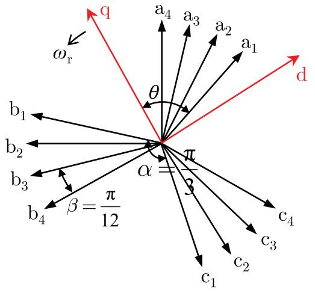  
Fig. 1. The phase electromagnetic force vectors of the stator windings in electrical degrees.

In addition, $M _ { \mathrm { ~ s ~ } } ^ { i j }$ and $\pmb { M } _ { \mathrm { t } } ^ { i j }$ in (5) can be written in the expanded forms of (A.3) and $\left( \mathsf { A } . 4 \right)$ of Appendix A, respectively. The details of $\mathbf { { { L } } } _ { i \mathrm { { r } } } ,$ $\mathbf { } L _ { \mathrm { r } i }$ and $L _ { \mathrm { r r } }$ in (4) are also presented in Appendix A. They are calculated in a similar way to that of a three-phase synchronous machine.

The induced electromagnetic torque of the twelve-phase machine $T _ { \mathrm { e } }$ can be expressed as (8), whose expanded form is given in (A.11) of Appendix A.

$$
T _ {\mathrm {e}} = \frac {P}{2} \left[ - \frac {1}{2} i _ {\mathrm {s}} ^ {\mathrm {T}} \frac {\partial [ L _ {i j} ] _ {i , j = 1 , 2 , 3 , 4}}{\partial \theta_ {\mathrm {r}}} i _ {\mathrm {s}} + i _ {\mathrm {S}} ^ {\mathrm {T}} \frac {\partial [ L _ {i r} ] _ {i = 1 , 2 , 3 , 4}}{\partial \theta_ {\mathrm {r}}} i _ {\mathrm {r}} \right]. \tag {8}
$$

The mechanical equations are not presented here due to space limitations. They are the same as those of the three-phase synchronous machines [18]. Combining the equations above, the continuous-time model of the twelve-phase synchronous machine in the phase-domain is formulated.

For the purpose of EMTP-type simulation, the continuous-time model needs to be discretized. As elaborated in Section 1, the qd0- domain discretized model of a synchronous machine has poor numerical stability [18]. Thus, a discretized phase-domain synchronous machine model is thus planned to be constructed in this paper directly based on the continuous-time model above. However, the parameters in the phase domain continuous-time model cannot be directly obtained. It should be converted from the manufacturer parameters.

# 2.2. Parameter conversion from qd0 to abc coordinates

Generally, in the system-level EMT studies, the parameters of twelve-phase machines are given by the manufacturer, which are obtained from machine tests. As elaborated in [22,23], these parameters are in ${ \bf q } { \bf d } 0$ coordinates, $\mathrm { e . g . , }$ d-axis and q-axis inductances. Thus, for formulating the phase-domain model of the twelve-phase machine, the manufacturing parameters in qd0 coordinates need to be converted to ones in abc coordinates. Note that the parameter conversion of the twelve-phase machine is quite different from that of the three-phase synchronous machine. It is elaborated as follows.

The voltage equation (1) and flux linkage equation (3) of the twelvephase machine can be transformed into ones in the qd0 coordinates by using the Park’s transformation in Appendix B:

$$
\left[ \begin{array}{l} \boldsymbol {u} _ {\mathrm {s}} ^ {\mathrm {q d 0}} \\ \boldsymbol {u} _ {\mathrm {r}} \end{array} \right] = \left[ \begin{array}{c c} \boldsymbol {R} _ {\mathrm {s s}} & \boldsymbol {0} \\ \boldsymbol {0} & \boldsymbol {R} _ {\mathrm {r}} \end{array} \right] \left[ \begin{array}{c} - t _ {\mathrm {s}} ^ {\mathrm {q d 0}} \\ i _ {\mathrm {r}} \end{array} \right] + \frac {\mathrm {d}}{\mathrm {d} t} \left[ \begin{array}{c} \lambda_ {\mathrm {s}} ^ {\mathrm {q d 0}} \\ \lambda_ {\mathrm {r}} \end{array} \right] \tag {9}
$$

$$
\left[ \begin{array}{c} \lambda_ {\mathrm {s}} ^ {\mathrm {q d 0}} \\ \lambda_ {\mathrm {r}} \end{array} \right] = L ^ {\mathrm {q d 0}} (\theta) \left[ \begin{array}{c} - i _ {\mathrm {s}} ^ {\mathrm {q d 0}} \\ i _ {\mathrm {r}} \end{array} \right] \tag {10}
$$

with the details of $L ^ { \mathrm { q d 0 } } ( \theta )$ are presented in Appendix C. It can be found from (C.4) of Appendix C that the stator inductance parameter set in qd0 coordinates is:

$$
\left\{L _ {\mathrm {q m}} ^ {k}, L _ {\mathrm {d m}} ^ {k}, L _ {\mathrm {q d m}} ^ {k}, L _ {0 \mathrm {m}} ^ {k} \right\}, k = 0, \dots , 3 \tag {11}
$$

where $L _ { \mathrm { q d m } } ^ { k } ~ ( L _ { \mathrm { q m } } ^ { k } , L _ { \mathrm { d m } } ^ { k } , L _ { \mathrm { 0 m } } ^ { k } )$ represents the mutual inductance between qdm the q-axis (q-axis, d-axis, 0-axis) and d-axis (q-axis, d-axis, 0-axis) of two stator windings separated by an electrical angle of ??×??. The parameters are not all mutually unrelated. According to their relationships in $\mathrm { A p \cdot }$ - pendix C, the minimum set of induction parameters (including rotor’s induction parameters) in qd0 coordinates can be chosen as:

$$
\left\{ \begin{array}{l} L _ {\mathrm {a d}}, L _ {\mathrm {d m}} ^ {0}, L _ {\mathrm {q m}} ^ {0}, L _ {0 \mathrm {m}} ^ {0}, L _ {\mathrm {d m}} ^ {1}, L _ {\mathrm {q d m}} ^ {1}, L _ {0 \mathrm {m}} ^ {1}, L _ {\mathrm {d m}} ^ {2}, L _ {0 \mathrm {m}} ^ {2} \\ L _ {\mathrm {k q}} ^ {1}, L _ {\mathrm {k q}} ^ {2}, \dots , L _ {\mathrm {k q}} ^ {N _ {\mathrm {q}}}, L _ {\mathrm {f d}}, L _ {\mathrm {k d}} ^ {1}, L _ {\mathrm {k d}} ^ {2}, \dots , L _ {\mathrm {k d}} ^ {N _ {\mathrm {q}}} \end{array} \right\}. \tag {12}
$$

Besides, according to (1)–(7), it can be found that the minimum set of inductance parameters in abc coordinates is:

$$
\left\{ \begin{array}{l} M _ {\mathrm {s}}, M _ {\mathrm {t}}, l _ {\mathrm {s} 0}, l _ {\mathrm {s} 1}, l _ {\mathrm {s} 2}, l _ {\mathrm {s} 3}, l _ {\mathrm {s} 4}, l _ {\mathrm {s} 5}, l _ {\mathrm {s} 6}, \\ L _ {\mathrm {k q}} ^ {1}, L _ {\mathrm {k q}} ^ {2}, \dots , L _ {\mathrm {k q}} ^ {N _ {\mathrm {q}}}, L _ {\mathrm {f d}}, L _ {\mathrm {k d}} ^ {1}, L _ {\mathrm {k d}} ^ {2}, \dots , L _ {\mathrm {k d}} ^ {N _ {\mathrm {q}}} \end{array} \right\} \tag {13}
$$

It can be obtained from (12) and (13) that the rotor’s induction parameters in qd0 and abc coordinates are the same. Besides, according to (C.2) and (C.4) of Appendix C, the conversion relationships between the stator’s induction parameters in the two coordinates can be expressed as:

$$
\begin{array}{l} \left[ \begin{array}{c c c c c c c c} \frac {3}{2} M _ {\mathrm {s}} & \frac {3}{2} M _ {\mathrm {t}} & l _ {\mathrm {s 0}} & l _ {\mathrm {s 1}} & l _ {\mathrm {s 2}} & l _ {\mathrm {s 3}} & l _ {\mathrm {s 4}} & l _ {\mathrm {s 5}} & l _ {\mathrm {s 6}} \end{array} \right] ^ {\mathrm {T}} \\ = \left[ \begin{array}{c c c c c c c c c} 1 & 1 & 0 & 0 & 0 & 0 & 0 & 0 & 0 \\ 1 & 1 & 1 & 0 & 0 & 0 & - 1 & 0 & 0 \\ 1 & - 1 & 1 & 0 & 0 & 0 & - 1 & 0 & 0 \\ 0 & 0 & 1 & 0 & 0 & 0 & - 2 & 0 & 0 \\ 1 & 1 & 0 & \cos 1 5 ^ {\circ} & 0 & \frac {\sqrt {2}}{2} & 0 & \sin 1 5 ^ {\circ} & 0 \\ 0 & 0 & 0 & 1 & 0 & - 1 & 0 & - 1 & 0 \\ 0 & 0 & 0 & \sin 1 5 ^ {\circ} & 0 & \frac {- \sqrt {2}}{2} & 0 & \cos 1 5 ^ {\circ} & 0 \\ 1 & 1 & 0 & 0 & \sqrt {3} & 0 & 0 & 0 & 0 \\ 0 & 0 & 0 & 0 & 0 & 0 & 0 & 0 & 1 \end{array} \right] ^ {- 1} \tag {14} \\ \times \left[ \begin{array}{c c c c c c c c} L _ {\mathrm {a d}} & L _ {\mathrm {d m}} ^ {0} & L _ {\mathrm {q m}} ^ {0} & L _ {\mathrm {0 m}} ^ {0} & L _ {\mathrm {d m}} ^ {1} & L _ {\mathrm {0 m}} ^ {1} & L _ {\mathrm {q d m}} ^ {1} & L _ {\mathrm {d m}} ^ {2} & L _ {\mathrm {0 m}} ^ {2} \end{array} \right] ^ {\mathrm {T}}. \\ \end{array}
$$

By using (14), the inductance parameters in qd0 coordinates can be converted to ones in abc coordinates. In addition, according to (1) and (9), it is found that the resistance parameters in qd0 and abc coordinates are the same.

# 3. Discretized PD model of twelve-phase machine for EMTP-type solution

Due to the poor numerical instability of the qd0 domain discretized model for EMTP-type simulation, this paper formulates a discretized phase-domain model. To interface the synchronous machine with the external EMTP-type network, the discretized form of the stator voltage equations in (1) is expressed in a general form (15) by applying the trapezoidal rule [24,25]:

$$
\begin{array}{l} \boldsymbol {i} _ {\mathrm {s}} (t) = - \boldsymbol {G} _ {\mathrm {e q}} \boldsymbol {u} _ {\mathrm {s}} (t) - \boldsymbol {i} _ {\mathrm {h}} (t) \tag {15} \\ = - \left(\boldsymbol {R} _ {\mathrm {e q}} (t)\right) ^ {- 1} \boldsymbol {u} _ {\mathrm {s}} (t) - \left(\boldsymbol {R} _ {\mathrm {e q}} (t)\right) ^ {- 1} \boldsymbol {e} _ {\mathrm {h}} (t) \\ \end{array}
$$

where Norton equivalent resistance matrix ${ \pmb R } _ { \mathrm { e q } } ( t )$ and history voltage source $e _ { \mathrm { h } } ( t )$ can be expressed as:

$$
\boldsymbol {R} _ {\mathrm {e q}} (t) = \boldsymbol {R} _ {\mathrm {s s}} + \frac {2}{\Delta t} \left[ \boldsymbol {L} _ {i j} (t) \right] _ {i, j = 1, 2, 3, 4} + \boldsymbol {R} _ {\mathrm {X}} (t) \tag {16}
$$

$$
\begin{array}{l} \boldsymbol {e} _ {\mathrm {h}} (t) = - \boldsymbol {u} _ {\mathrm {s}} (t - \Delta t) - \frac {2}{\Delta t} \left[ \boldsymbol {L} _ {i \mathrm {r}} (t - \Delta t) \right] _ {i = 1, 2, 3, 4} \boldsymbol {i} _ {\mathrm {r}} (t - \Delta t) + \\ \left. \frac {2}{\Delta t} \left[ L _ {i r} (t) \right] _ {i = 1, 2, 3, 4} \left(\frac {2}{\Delta t} L _ {\mathrm {r r}} + R _ {\mathrm {r}}\right) ^ {- 1} \left[ u _ {\mathrm {r}} (t) + e _ {\mathrm {r h}} (t) \right] - \right. \tag {17} \\ \left[ \boldsymbol {R} _ {\mathrm {s s}} - \frac {2}{\Delta t} \left[ \boldsymbol {L} _ {i j} (t - \Delta t) \right] _ {i, j = 1, 2, 3, 4} \right] \boldsymbol {i} _ {\mathrm {s}} (t - \Delta t) \\ \end{array}
$$

with:

$$
\boldsymbol {R} _ {\mathrm {X}} (t) = - \left(\frac {2}{\Delta t}\right) ^ {2} \left[ \boldsymbol {L} _ {i r} (t) \right] _ {i = 1, 2, 3, 4} \left(\frac {2}{\Delta t} \boldsymbol {L} _ {\mathrm {r r}} + \boldsymbol {R} _ {\mathrm {r}}\right) ^ {- 1} \times \left[ \boldsymbol {L} _ {\mathrm {r i}} (t) \right] _ {i = 1, 2, 3, 4} \tag {18}
$$

$$
\begin{array}{l} \boldsymbol {e} _ {\mathrm {r h}} (t) = \left(\frac {2}{\Delta t} \boldsymbol {L} _ {\mathrm {r r}} (t - \Delta t) - \boldsymbol {R} _ {\mathrm {r}}\right) \boldsymbol {i} _ {\mathrm {r}} (t - \Delta t) \tag {19} \\ + \boldsymbol {u} _ {\mathrm {r}} (t - \Delta t) - \frac {2}{\Delta t} \left[ \boldsymbol {L} _ {\mathrm {r} i} (t - \Delta t) \right] _ {i = 1, 2, 3, 4} \boldsymbol {i} _ {\mathrm {s}} (t - \Delta t) \\ \end{array}
$$

The rotor current $\dot { \pmb { \imath } } _ { \mathrm { r } } ( t )$ can be expressed as:

$$
\boldsymbol {i} _ {\mathrm {r}} (t) = \left(\frac {2}{\Delta t} \boldsymbol {L} _ {\mathrm {r r}} + \boldsymbol {R} _ {\mathrm {r}}\right) ^ {- 1} \left[ \boldsymbol {u} _ {\mathrm {r}} (t) + \frac {2}{\Delta t} \left[ \boldsymbol {L} _ {\mathrm {r i}} (t) \right] _ {i = 1, 2, 3, 4} \boldsymbol {i} _ {\mathrm {s}} (t) + \boldsymbol {e} _ {\mathrm {r h}} (t) \right]. \tag {20}
$$

According to (16), Theorem 1 can be derived as follows.

Theorem 1. ${ \pmb R } _ { \mathrm { e q } } ( t )$ can be expressed as a constant plus a rotor-positiondependent part:

$$
\boldsymbol {R} _ {\mathrm {e q}} (t) = \boldsymbol {R} _ {0} ^ {\prime \prime} - \frac {1}{3} \left(Z _ {\mathrm {d}} ^ {\prime \prime} - Z _ {\mathrm {q}} ^ {\prime \prime}\right) \boldsymbol {A} (\theta) \tag {21}
$$

a rotor-position-dependent matrix, which is given in (A.6). where ??′′0 represents the constant part of ??eq(??); ??(??) = [?????? (??)]??,??=1,2,3,4 i $\pmb { R } _ { 0 } ^ { \prime \prime }$ $\pmb { R } _ { \mathrm { e q } } ( t ) ; \pmb { A } ( \theta ) = \left[ \pmb { A } _ { i j } ( \theta ) \right] _ { i , i = 1 , 2 . 3 . 4 } i s$ $\dot { Z } _ { \mathrm { d } } ^ { \prime \prime }$ and $\dot { Z } _ { \mathrm { q } } ^ { \prime \prime }$ can be represented as:

$$
Z _ {\mathrm {d}} ^ {\prime \prime} = \left(\left(Z _ {\mathrm {a d}}\right) ^ {- 1} + \sum_ {j = 1} ^ {N _ {\mathrm {d}}} \left(Z _ {\mathrm {l k d}} ^ {j}\right) ^ {- 1} + \left(Z _ {\mathrm {l f d}}\right) ^ {- 1}\right) ^ {- 1} \tag {22}
$$

$$
Z _ {\mathrm {q}} ^ {\prime \prime} = \left(\left(Z _ {\mathrm {a q}}\right) ^ {- 1} + \sum_ {j = 1} ^ {N _ {\mathrm {q}}} \left(Z _ {\mathrm {l k q}} ^ {j}\right) ^ {- 1}\right) ^ {- 1} \tag {23}
$$

where

$$
Z _ {\mathrm {a d}} = \frac {2}{\Delta t} L _ {\mathrm {a d}}, Z _ {\mathrm {a q}} = \frac {2}{\Delta t} L _ {\mathrm {a q}}, Z _ {\mathrm {l f d}} = r _ {\mathrm {f d}} + \frac {2}{\Delta t} L _ {\mathrm {l f d}},
$$

$$
Z _ {\mathrm {l k d}} ^ {j} = r _ {\mathrm {k d}} ^ {j} + \frac {2}{\Delta t} L _ {\mathrm {l k d}} ^ {j}, j = 1, \dots , N _ {\mathrm {d}},
$$

$$
Z _ {\mathrm {l k q}} ^ {j} = r _ {\mathrm {k q}} ^ {j} + \frac {2}{\Delta t} L _ {\mathrm {l k q}} ^ {j}, j = 1, \dots , N _ {\mathrm {q}}.
$$

The proof of Theorem 1 is provided in Appendix D. Generally, the term $Z _ { \mathrm { d } } ^ { \prime \prime } { - } Z _ { \mathrm { q } } ^ { \prime \prime }$ in (21) is nonzero for twelve-phase machines. Thus, ${ \pmb R } _ { \mathrm { e q } } ( t )$ （4号 of the twelve-phase motor is time-variant. In the EMT simulation of power systems with twelve-phase synchronous machines, the equivalent conductance matrix of the whole system needs to be re-factorized at each time-step due to the time-variant $G _ { \mathrm { e q } }$ (which equals $( R _ { \mathrm { e q } } ( t ) ) ^ { - 1 } )$ . This significantly deteriorates the efficiency of EMT simulation. To this end, it is desirable to have a constant equivalent resistance matrix ${ \pmb R } _ { \mathrm { e q } } ( t )$ for the PD model.

# 4. Constant conductance PD model (CC-PD) of twelve-phase machine

This Section focuses on achieving a constant conductance matrix $G _ { \mathrm { e q } }$ for the PD model formulated in Section 3. Two ways are reported in the literature for obtaining a CC-PD model [18,26], and both are efficient and accurate. The method in [26] is adopted here for establishing the CC-PD model for twelve-phase synchronous machines.

As mentioned above, equivalent sub-transient impedances $Z _ { \mathrm { d } } ^ { \prime \prime }$ and $Z _ { \mathrm { q } } ^ { \prime \prime }$ in (22) and (23) are asymmetrical, and it is typical that the d-axis has the lower impedance (see [26,27]). To make the $\pmb { R } _ { \mathrm { e q } } ( t )$ in (21) constant, one additional artificial damper winding with an equivalent impedance of $Z _ { \mathrm { l k q } } ^ { N _ { \mathrm { q } } + 1 }$ could be added to the q-axis to make the term

$Z _ { \mathrm { q } } ^ { \prime \prime } \mathrm { ~ - ~ } Z _ { \mathrm { d } } ^ { \prime \prime }$ in (21) zero [26]. With this condition, the rotor-positiondependent term in (21) is removed. The equivalent impedance $Z _ { \mathrm { l k q } } ^ { N _ { \mathrm { q } } + 1 }$ ??lkq can be calculated as:

$$
Z _ {\mathrm {l k q}} ^ {N _ {\mathrm {q}} + 1} = \left(\left(Z _ {\mathrm {d}} ^ {\prime \prime}\right) ^ {- 1} - \left(Z _ {\mathrm {q}} ^ {\prime \prime}\right) ^ {- 1}\right) ^ {- 1} \tag {24}
$$

where $\begin{array} { r } { Z _ { \mathrm { l k q } } ^ { N _ { \mathrm { q } } + 1 } = r _ { \mathrm { k q } } ^ { N _ { \mathrm { q } } + 1 } + \frac { 2 } { \Delta t } L _ { \mathrm { l k q } } ^ { N _ { \mathrm { q } } + 1 } } \end{array}$ = ??kq , and $r _ { \mathrm { k q } } ^ { N _ { \mathrm { q } } + 1 }$ and ????q+lkq $L _ { \mathrm { l k q } } ^ { N _ { \mathrm { q } } + 1 }$ are the resistance and leakage inductance of the added ??-axis damper, respectively.

Eq. (24) does not define the parameters of the added damper winding alone for a given ???? [26]. This is because adding this extra damper winding also changes the q-axis operational impedance by adding a corresponding pole to the respective transfer function. To maintain good simulation accuracy, the responses of the frequencies of interest should be accurate. The frequency range of interest is named fit frequency $f _ { \mathrm { f i t } } .$ . According to the guidelines in [26], the time constant of the additional winding should be larger than ten times of $f _ { \mathrm { f i t } } .$ . Based on this and (24), a critical value of the leakage inductance of the additional damper can be obtained:

$$
\begin{array}{l} L _ {\mathrm {l k q}} ^ {N _ {\mathrm {q}} + 1} \leq L _ {\mathrm {c r i t i c a l}} \\ = \frac {Z _ {\mathrm {l k q}} ^ {N _ {\mathrm {q}} + 1} - 2 0 \pi f _ {\text {f i t}} \left(\left(L _ {\mathrm {a q}}\right) ^ {- 1} + \sum_ {j = 1} ^ {N _ {\mathrm {q}}} \left(L _ {\mathrm {l k q}} ^ {j}\right) ^ {- 1}\right) ^ {- 1}}{2 0 \pi f _ {\text {f i t}} + 2 / \Delta t}. \tag {25} \\ \end{array}
$$

For the CC-PD model of the twelve-phase synchronous machine in this paper, $L _ { \mathrm { l k q } } ^ { N _ { \mathrm { q } } + 1 }$ is assumed to be $L _ { \mathrm { c r i t i c a l } } .$ . Then, the additional winding resistance is calculated as:

$$
r _ {\mathrm {k q}} ^ {N _ {\mathrm {q}} + 1} = Z _ {\mathrm {l k q}} ^ {N _ {\mathrm {q}} + 1} - \frac {2}{\Delta t} L _ {\mathrm {l k q}} ^ {N _ {\mathrm {q}} + 1} \tag {26}
$$

By adding an additional damper with the appropriate parameters mentioned above, the conductance matrix ${ \pmb R } _ { \mathrm { e q } } ( t )$ in (21) is then changed into a constant matrix:

$$
\boldsymbol {R} _ {\mathrm {e q}} (t) = \boldsymbol {R} _ {0} ^ {\prime \prime} = \left[ \frac {2}{\Delta t} \left(\boldsymbol {L} _ {\mathrm {s}} ^ {i j} + \boldsymbol {M} _ {\mathrm {s}} ^ {i j}\right) + \boldsymbol {R} _ {\mathrm {x s}} ^ {i j} \right] _ {i, j = 1, 2, 3, 4} \tag {27}
$$

where $R _ { \mathrm { x s } } ^ { i j }$ is defined in (D.8).

Note that the above analyses are based on the premise of the lower impedance of d-axis. If the d-axis has a higher impedance than q-axis, the additional damper winding should be added to the d-axis, and the theoretical analyses of choosing its parameters are also applicable.

# 5. Case studies

In this Section, the effectiveness, accuracy and efficiency of the proposed two PD-type models are validated on two different test systems.

# 5.1. Simulation for a single twelve-phase machine

Parameters of the twelve-phase machine in qd0 coordinates are given in Table 1, where $U _ { \mathfrak { n } }$ is the line-to-ground voltage amplitude and $S _ { \mathrm { n } }$ is the rated capacity of the machine. The inductance parameters under qd0 coordinates can be converted to ones in abc coordinates using (14), as shown in Table 2. Note that a continuous twelve-phase synchronous machine model is implemented on MATLAB/Simulink for comparison. It is solved with a small time-step size of 1 μs to obtain very accurate solutions, which are considered references.

# 5.1.1. Accuracy validation

The twelve-phase machine is first simulated using the PD and CC-PD models with a small time-step size of 50 μs. For the CC-PD model, the parameters of additional winding with $\varDelta t = 5 0$ μs can be obtained by (25) and (26): $r _ { \mathrm { k q } } ^ { 3 } \ = \ 1 6 0 . 2 2 \ \Omega$ and $L _ { \mathrm { l k q } } ^ { 3 } = 0 . 0 2 4 0 4$ H. In steady-state, the results obtained by the continuous model, PD model and CC-PD model are the same. The stator currents $i _ { \mathrm { s a } k } , i _ { \mathrm { s b } k } , i _ { \mathrm { s c } k } ( k = 1 , 2 , 3 , 4 )$ are shown in Fig. 2. It can be seen that the steady-state currents are stable and conform to the relationship of phase angles, which validates the correctness of the proposed models in steady-state.

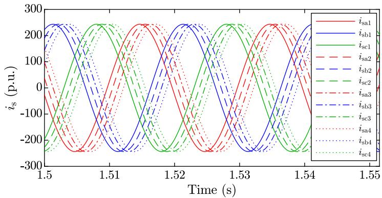  
Fig. 2. Steady-state stator currents of the twelve-phase machine.

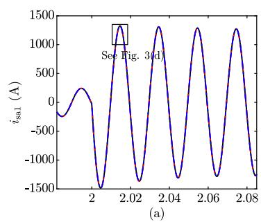

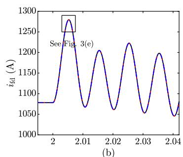

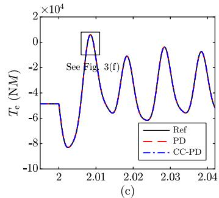

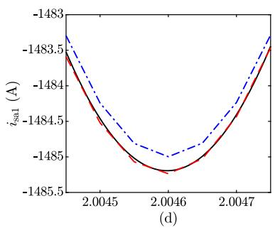

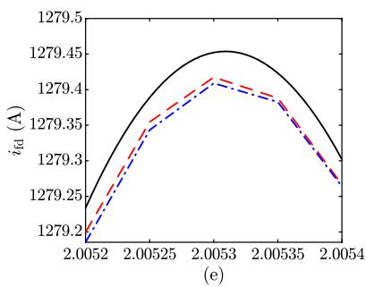

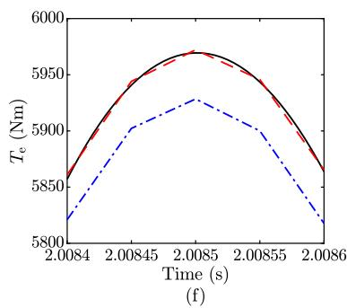  
Fig. 3. Offline simulation results for the twelve-phase synchronous machine with a time step of 50 μs during the phase-to-ground fault. (a) Phase a1 stator current; (b) field current; (c) electromagnetic torque; (d) zoomed-in view of phase a1 stator current; (e) zoomed-in view of the field current; (f) zoomed-in view of the electromagnetic torque.

Table 1 Parameters of the first test case in qd0 coordinates.   

<table><tr><td>Quantity</td><td>Value</td><td>Quantity</td><td>Value</td></tr><tr><td>Un(kV)</td><td>2.0000</td><td>Sn(MVA)</td><td>10.0000</td></tr><tr><td>rs(p.u.)</td><td>0.0288</td><td>Lad(p.u.)</td><td>0.6090</td></tr><tr><td>L0qm(p.u.)</td><td>0.4905</td><td>L0dm(p.u.)</td><td>0.6215</td></tr><tr><td>L0m(p.u.)</td><td>0.0110</td><td>L1dm(p.u.)</td><td>0.6190</td></tr><tr><td>L0m(p.u.)</td><td>0.0049</td><td>L1qdm(p.u.)</td><td>0.0018</td></tr><tr><td>L2dm(p.u.)</td><td>0.6175</td><td>L2om(p.u.)</td><td>0.0000</td></tr><tr><td>rfd(p.u.)</td><td>0.0155</td><td>L1fd(p.u.)</td><td>0.2300</td></tr><tr><td>Rkcd(p.u.)</td><td>0.0368</td><td>L1kd(p.u.)</td><td>0.1980</td></tr><tr><td>R1kq(p.u.)</td><td>0.0264</td><td>L1kq(p.u.)</td><td>0.1360</td></tr><tr><td>R2kq(p.u.)</td><td>0.0460</td><td>L2kq(p.u.)</td><td>0.9500</td></tr></table>

${ \mathrm { \bf { A } } } { \mathrm { \bf { t } } } \ t = 2 \ s ,$ phase a1 of the machine is shorted to ground with a transition resistance of 0.01 Ω, and it is cleared at $t = 2 . 2 ~ s .$ The transient stator currents $i _ { \mathrm { s a l } } ,$ field current $i _ { \mathrm { f d } }$ and electromagnetic torque $T _ { \mathrm { e } }$ obtained by the three models are depicted in Fig. 3. It can be found that the transient responses of the PD and CC-PD models nearly coincide with the references. These test results demonstrate the good accuracy of the proposed two models. Furthermore, the proposed CC-PD model

Table 2 Parameters of the first test case in abc coordinates.   

<table><tr><td>Quantity</td><td>Value</td><td>Quantity.</td><td>Value</td></tr><tr><td>Ms(pu.)</td><td>0.5435</td><td>Mt(p.u.)</td><td>0.0655</td></tr><tr><td>ls0(p.u.)</td><td>0.0140</td><td>ls1(p.u.)</td><td>0.0083</td></tr><tr><td>ls2(p.u.)</td><td>0.0049</td><td>ls3(p.u.)</td><td>0.0022</td></tr><tr><td>ls4(p.u.)</td><td>0.0015</td><td>ls5(p.u.)</td><td>0.0012</td></tr><tr><td>ls6(p.u.)</td><td>0.0000</td><td></td><td></td></tr></table>

is implemented on the real-time simulation platform. Note that the PD model of the twelve-phase machine is not implemented in the realtime simulation platform because it has a time-variant conductance. It is hard to realize the real-time simulation when the conductance matrix is time-variant. The real-time simulation results obtained with a time-step of 50 μs are shown in Fig. 4. It can be found that the realtime simulation results are near to the offline simulation results, which further illustrates the accuracy of the proposed models.

Next, to further validate the accuracy and numerical stability of the PD and CC-PD models, the test system is simulated with a much larger time-step size of 1000 μs. With $\varDelta t = 1 0 0 0 ~ \mu s ,$ the parameters of additional winding are: $r _ { \mathrm { k q } } ^ { 3 } = 4 2 . 2 1 ~ \Omega , L _ { \mathrm { l k q } } ^ { 3 } = 0 . 0 0 5 2 6 ~ \mathrm { H }$ . The transient

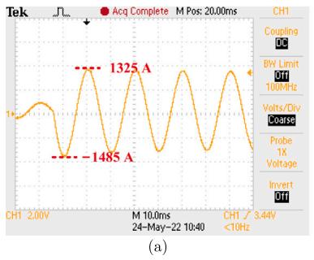

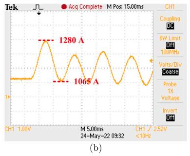

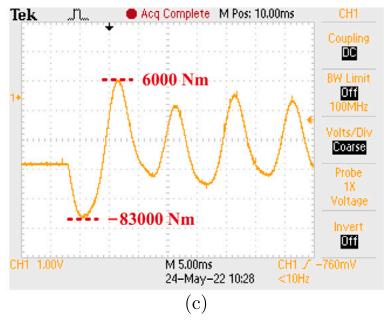  
Fig. 4. Real-time simulation results for the twelve-phase synchronous machine with a time step of 50 μs during the phase-to-ground fault. (a) Phase a1 stator current. (b) Field current. (c) Electromagnetic torque.

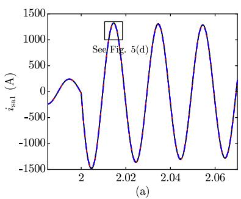

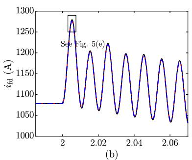

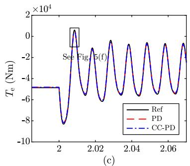

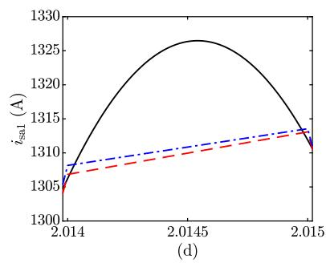

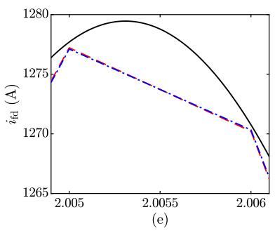

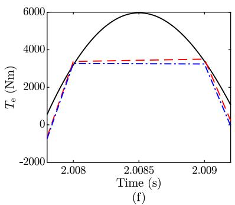  
Fig. 5. Offline simulation results for the twelve-phase synchronous machine with the time step of 1000 μs during the phase-to-ground fault. (a) Phase a1 stator current; (b) field current; (c) electromagnetic torque; (d) zoomed-in view of phase a1 stator current; (e) zoomed-in view of the field current; (f) zoomed-in view of the electromagnetic torque.

currents $i _ { \mathrm { s a l } } , \ i _ { \mathrm { f d } }$ and electromagnetic torque $T _ { \mathrm { e } }$ during the fault are illustrated in Fig. 5. As can be observed, reasonable and convergent results can also be obtained by the PD and CC-PD models, even in the large time-step simulation. The results at the $1 0 0 0 ~ \mu s$ points are near to the references. The detailed analysis of other variables shows a similar result. Usually, the numerical solution of the ordinary differential equations is regarded to be accurate when the values of the variables at the sampling points are accurate. When the values of the variables at the sampling points are accurate, the points between the sampling points can be accurately obtained by interpolation. According to this, it can be found that the proposed model is accurate in the simulation with a large time-step since the sampling points are accurate. It is worth noting that it seems that the relative error during [2.0084, 2.0086] s is very large. This is because the simulation program connects the adjacent two points with a straight line to obtain a line chart. The fewer discrete points, the greater the gap between the reference and the simulation results.

Besides the offline simulation, the proposed CC-PD model is also implemented on the real-time simulation platform with a time-step size of 1000 μs. The stator currents, field currents and the electromagnetic transient torque are illustrated in Fig. 6. By comparing Figs. 5 and 6, it can be found that the offline simulation results and real-time simulation results are nearly the same, which also demonstrates the accuracy of the proposed models.

Table 3 2-norm errors for the variables in the twelve-phase machine with different time-step sizes.   

<table><tr><td>Variables</td><td>Models</td><td>ε(x) with Δt = 50 μs</td><td>ε(x) with Δt = 1000 μs</td></tr><tr><td rowspan="2">isal</td><td>PD</td><td>0.0381%</td><td>0.130%</td></tr><tr><td>CC-PD</td><td>0.0779%</td><td>0.264%</td></tr><tr><td rowspan="2">idf</td><td>PD</td><td>0.00472%</td><td>0.0139%</td></tr><tr><td>CC-PD</td><td>0.00616%</td><td>0.0200%</td></tr><tr><td rowspan="2">Te</td><td>PD</td><td>0.0348%</td><td>0.834%</td></tr><tr><td>CC-PD</td><td>0.115%</td><td>0.931%</td></tr></table>

# 5.1.2. Accuracy comparison between the proposed models

To compare the accuracies of the PD and CC-PD models, the 2-norm cumulative errors are used:

$$
\varepsilon (x) = \frac {\left\| x _ {\text {ref}} - x \right\| _ {2}}{\left\| x _ {\text {ref}} \right\| _ {2}} \times 100 \% \tag{28}
$$

where ?? represents the solution obtained from a given model; $x _ { \mathrm { r e f } }$ represents the reference solution; $\left\| x _ { \mathrm { r e f } } \right\| _ { 2 }$ represents the 2-norm of $x _ { \mathrm { r e f } } .$ . The 2-norm errors of $i _ { \mathrm { a l } } , ~ i _ { \mathrm { f d } }$ and $T _ { \mathrm { e } }$ during the fault are shown in Table 3. As can be seen, the PD model is a little more accurate than the CC-PD mode,l although both of them show good accuracies.

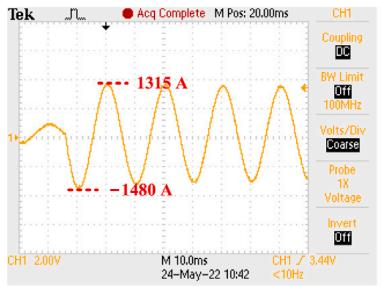  
(a)

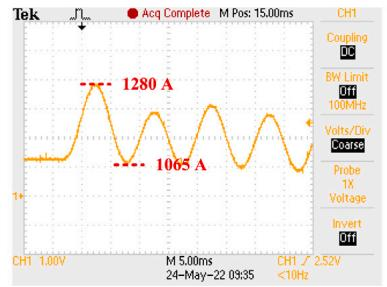

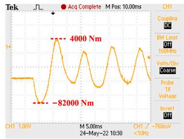

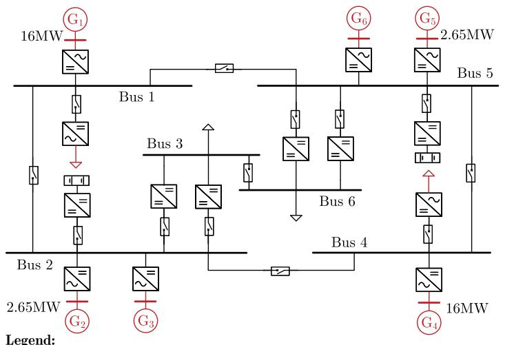  
Fig. 6. Real-time simulation results for the twelve-phase synchronous machine with a time step of 1000 μs during the phase-to-ground fault. (a) Phase a1 stator current. (b) Field current. (c) Electromagnetic torque.

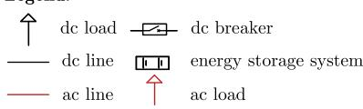

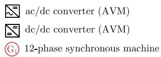  
Fig. 7. Schematic diagram of the onboard integrated power system.

Note that only the time-step points of the large-step simulation are considered in the 2-norm cumulative relative error calculation. Thus, the 2-norm cumulative relative error is small although it seems that the gaps between the reference and the test results shown in Fig. 5(f) are large. Usually, If the values of the variables at the time-step points are accurate, the large-step simulation is considered to be accurate. The lines between the points have no practical purpose.

# 5.2. Power system simulation with twelve-phase machine

# 5.2.1. EMT simulation of an onboard power system

To further illustrate the application and effectiveness of the two proposed machine models, an integrated power system with 6 twelvephase synchronous machines is considered, with the schematic diagram shown in Fig. 7. This test system is abstracted from a real onboard power system and established for the real-time EMT simulation and control of the integrated power system. Without the EMT models of the twelve-phase synchronous machines, the EMT characteristics of the integrated power system cannot be analyzed.

The twelve-phase synchronous machines are all directly connected with the twelve-phase diode rectifiers. As for the ac loads, they are supplied by the fifteen-phase three-level neutral-point-clamped (NPC) converter. The dc loads are supplied by the dual active bridge (DAB) converter. In order to achieve real-time simulation performance, the widely-used averaged model (AVM) is adopted for modeling the DAB and 15-phase three-level NPC converters here [28–30], and the 12- phase diode rectifier is constructed as parametric AVM (PAVM) [31,

32]. The rated dc voltage of the integrated dc power grid is 4 kV. The dc grid voltage is controlled by the $U _ { \mathrm { d c } } { - } I _ { \mathrm { d c } }$ droop control strategy in the excitation controllers of the six twelve-phase machines. Besides, the $U _ { \mathrm { d c } } { - } I _ { \mathrm { d c } }$ droop control is also adopted for the DABs and the voltage of dc loads is controlled by them. The rated voltage of the dc loads is 0.71 kV. Due to the page limitation, detailed parameters of the test system are not listed here.

The simulations are implemented using the C++ language. The time-step size is 50 μs. A short-circuit fault occurs at Bus 1 at ?? = 1.5 s and it is cleared at 1.55 s with a transition resistance of 0.01 Ω. The integrated power system is simulated with the proposed PD and the CC-PD models, respectively. The stator current and angular speed of $\mathbf { G } _ { 1 }$ are shown in Fig. 8. The twelve-phase machine keeps a stable operation during the whole process. Furthermore, it can be found that both PD and CC-PD models have similar accuracy. Next, the dc voltages of Buses 1 and 3 are studied and illustrated in Fig. 9. As can be seen in the figure, reasonable system responses are obtained. The system dc voltage returns to about 4 kV quickly after the fault is cleared, which illustrates the effectiveness of the two machine models formulated in this paper. Overall, the two proposed twelve-phase machine models work well in the integrated power system EMT simulations.

Similar to the single-machine system test, real-time simulations are also carried out to further validate the effectiveness of the proposed models. The real-time simulation is implemented with a time-step size of 100 μs, with the real-time simulation results illustrated in Figs. 10 and 11. As the figures show, the real-time simulation results are in

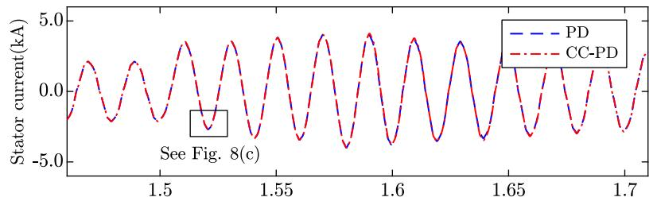  
(a)

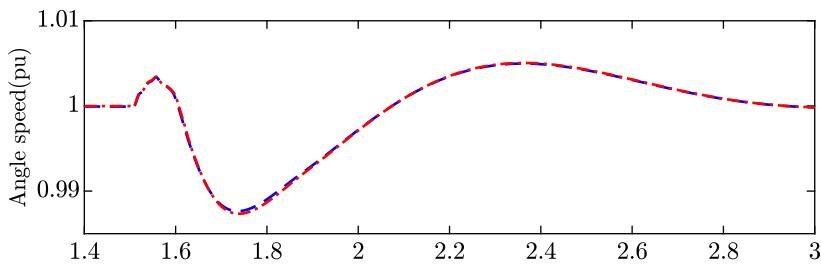  
(b)

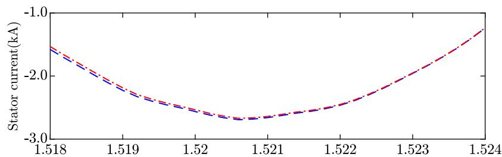  
  
Fig. 8. Offline simulation results for $G _ { 1 }$ of the integrated power system with a time-step size of 50 μs. (a) phase a1 current of ${ \bf G } _ { 1 } ;$ (b) angular speed of ${ \bf G } _ { 1 } ;$ (c) zoomed-in view of phase a1 current at $\mathbf { G } _ { 1 }$ .

Table 4 CPU time consumption different cases with various time-step sizes (simulation for 3 s).   

<table><tr><td>Cases</td><td>Δt = 10 μs</td><td>Δt = 50 μs</td><td>Δt = 100 μs</td></tr><tr><td>Case with PD</td><td>36.594 s</td><td>6.838 s</td><td>3.521 s</td></tr><tr><td>Case with CC-PD</td><td>19.827 s</td><td>4.024 s</td><td>2.262 s</td></tr></table>

agreement with the offline simulation results, which further validates the accuracy of the proposed twelve-phase machine model.

To assess the computational speed, the CPU time consumption for simulating the integrated power system is tested and presented in Table 4. The simulations start at 0 s and last for 3 s. It can be found that the EMT simulation for the integrated power system with the CC-PD model is more efficient than that with the PD model. This is because the PD model has a time-variant conductance matrix, and the conductance matrix of the whole network needs updating and LU-factorization at each time-step, which leads to extra computation burdens.

# 5.2.2. Ship-shore power system

In this subsection, the onboard power network is integrated into an onshore power system to illustrate the application of the proposed model in large network simulation and analyses. The schematic diagram of the power system is illustrated in Fig. 12. At ?? = 1.5 s, a three-phase short-circuit fault occurs at Node 45 of the ship-shore power system and it is cleared at ?? = 1.7 s. To study the post-fault transient characteristic of this power system, EMT simulations of the system are carried out with the proposed PD model and CC-PD model, respectively. The simulation results that obtained with a time-step size of 50 μs are depicted in Fig. 13. Similar to the simulations of the onboard power system in Section 5.2.1, it can be seen that the

Table 5 CPU time consumption of the ship-shore power system simulations with various time-step sizes (simulation for 3 s).   

<table><tr><td>Cases</td><td>Δt = 10 μs</td><td>Δt = 50 μs</td><td>Δt = 100 μs</td><td>Δt = 150 μs</td></tr><tr><td>Case with PD</td><td>426.125 s</td><td>98.063 s</td><td>50.129 s</td><td>34.617 s</td></tr><tr><td>Case with CC-PD</td><td>146.788 s</td><td>33.803 s</td><td>17.398 s</td><td>12.310 s</td></tr></table>

simulation results obtained with the two models are in agreement with each other. Both two models lead to reasonable results. The results indicate that the short-circuit fault does not cause instability in the shipshore power system. During the fault, the dc voltage of the onboard power network decreases slightly. After the fault is cleared, the dc voltage recovers. The above analyses demonstrate that the proposed models work well in EMT simulations of large networks.

Furthermore, the CPU computation time for simulating the large network with different time step sizes is tested and compared, as shown in Table 5. The simulation duration is 3 s. It is found that the computational time for the ship-shore integrated power system simulation with CC-PD models is much more efficient than that with PD models. Besides, by comparing the large network simulations with the small network simulations in Section 5.2.1, it can be found that the speedup of the simulation with the CC-PD model with respect to that with the PD model increases with the scale of the power network. The reason is that the CC-PD model has a constant conductance.

# 5.3. Discussion

This paper proposes two PD-type models (PD and CC-PD) for the twelve-phase synchronous machine. The accuracy and efficiency of them are discussed as follows.

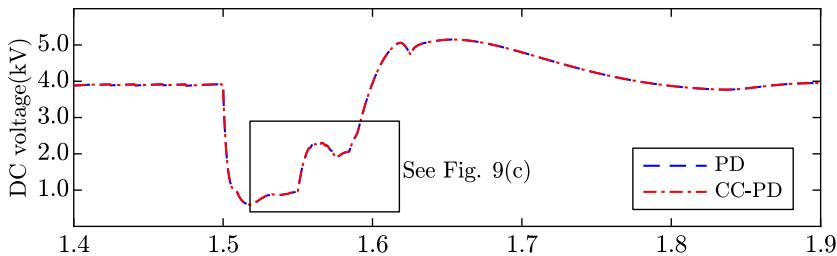

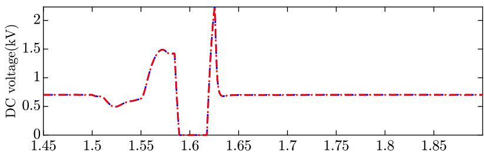

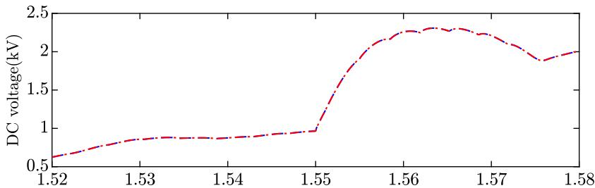  
(c)

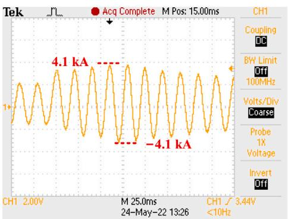  
Fig. 9. DC voltages of Buses 1 and 3 with a time-step size of 50 μs. (a) DC voltage of Bus 1; (b) DC voltage of Bus 3; (c) zoomed-in view of dc voltage of Bus 1.

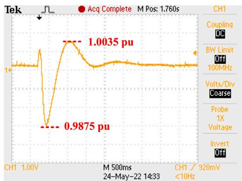  
(b)   
Fig. 10. Real-time simulation results for $G _ { 1 }$ of the integrated onboard power system. (a) Phase a1 current of $\mathbf { G } _ { 1 } .$ . (b) Angular speed of $\mathbf { G } _ { 1 } .$

# 5.3.1. Accuracy analyses

Due to the direct interfacing with the EMTP-type network solution, the two PD-type models for synchronous machines are accurate and numerically stable.

# 5.3.2. Efficiencies of the models

In the CC-PD model, an additional damper winding is added. This results in a constant conductance matrix, which is always preferred for the efficient EMTP-type network solution. For the power system with twelve-phase synchronous machines, a better speedup from using the CC-PD over the PD model will be anticipated. It is indicated in Section 5.2 that the CC-PD can be used for real-time simulation with a time-step size of 100 μs.

# 6. Conclusion

In this paper, two PD-type models (PD and CC-PD) for the twelvephase synchronous machines are proposed and validated. It is the first time that twelve-phase machine models have been formulated for EMTP-type solutions. Following conclusions can be drawn from both theoretical analyses and numerical studies. Both the PD and CC-PD models of the twelve-phase synchronous machine are accurate.

In the scenarios where accuracy is strictly required, the PD model could be used. The CC-PD model is implemented with a constant conductance matrix, resulting in a highly efficient EMTP-type network solution. Besides, the accuracy of CC-PD is acceptable. It is more suitable for the application in power system simulation, including real-time simulation.

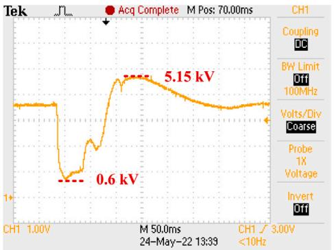

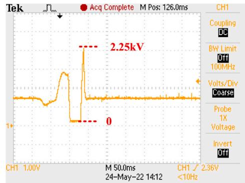  
(b)

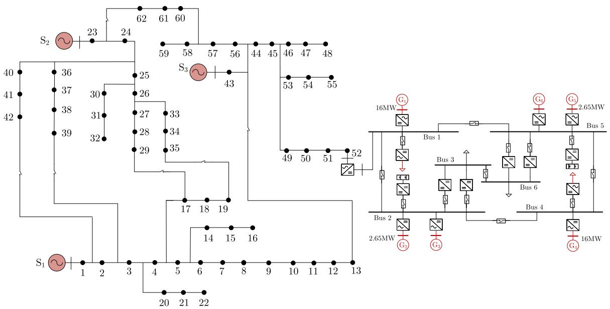  
Fig. 11. DC voltages of Buses 1 and 3 of the integrated onboard power system obtained from the real-time simulation. (a) Voltage of Buses 1. (b) Voltage of Bus 1.   
Fig. 12. Schematic diagram of the ship-shore power system.

# CRediT authorship contribution statement

Shilin Gao: Methodology, Software, Writing – original draft, Validation. Zhendong Tan: Methodology, Software, Data curation, Validation. Yankan Song: Conceptualization, Writing – reviewing, Investigation. Ying Chen: Conceptualization, Writing – reviewing. Chen Shen: Conceptualization, Supervision. Zhitong Yu: Software, Validation.

# Declaration of competing interest

The authors declare that they have no known competing financial interests or personal relationships that could have appeared to influence the work reported in this paper.

# Acknowledgments

This work was supported by the National Natural Science Foundation of China under Grants 52007101, 51877115 and 51861135312.

# Appendix A. Coefficient matrices in the PD model

The stator resistance sub-matrix $\pmb { R } _ { \mathrm { s } }$ and the rotor resistance matrix $\scriptstyle { R _ { \mathrm { r } } }$ are represented as follows:

$$
\boldsymbol {R} _ {\mathrm {s}} = \operatorname {d i a g} \left[ \begin{array}{l l l} r _ {\mathrm {s}} & r _ {\mathrm {s}} & r _ {\mathrm {s}} \end{array} \right] \tag {A.1}
$$

$$
\boldsymbol {R} _ {\mathrm {r}} = \operatorname {d i a g} \left[ r _ {\mathrm {k q}} ^ {1}, \dots , r _ {\mathrm {k q}} ^ {N _ {\mathrm {q}}} \text {,} r _ {\mathrm {f d}} ^ {1}, r _ {\mathrm {k d}} ^ {1}, \dots , r _ {\mathrm {k d}} ^ {N _ {\mathrm {q}}} \right] \tag {A.2}
$$

The details of $\pmb { M } _ { \mathrm { s } } ^ { i j }$ , ${ \pmb M } _ { \mathrm { t } } ^ { i j } ( \theta )$ are presented as:

$$
\boldsymbol {M} _ {\mathrm {s}} ^ {i j} = M _ {\mathrm {s}} \boldsymbol {K} _ {i j} \tag {A.3}
$$

$$
\boldsymbol {M} _ {\mathrm {t}} ^ {i j} (\theta) = - M _ {\mathrm {t}} \boldsymbol {A} _ {i j} (\theta) \tag {A.4}
$$

where $K _ { i j }$ and $A _ { i j } ( \theta )$ can be expressed as (A.5) and (A.6) which is given in Box I.

The $\mathbf { } L _ { \mathrm { r } i }$ and $\pmb { L } _ { i \mathrm { r } }$ in (4), can be derived as:

$$
\boldsymbol {L} _ {\mathrm {r i}} = \frac {2}{3} \boldsymbol {L} _ {\mathrm {i r}} ^ {\mathrm {T}} = \boldsymbol {L} _ {\mathrm {a q d}} \boldsymbol {T} (\theta - (i - 1) 1 5 ^ {\circ}) \tag {A.7}
$$

where

$$
L _ {\mathrm {a q d}} = \left[ \begin{array}{c c c c c c} L _ {\mathrm {a q}} & \dots & L _ {\mathrm {a q}} & 0 & 0 & 0 \\ 0 & 0 & 0 & L _ {\mathrm {a d}} & \dots & L _ {\mathrm {a d}} \\ 0 & 0 & 0 & 0 & 0 & 0 \end{array} \right] _ {(N _ {\mathrm {d}} + N _ {\mathrm {q}} + 1) \times 3} \tag {A.8}
$$

with

$$
\left\{ \begin{array}{l} L _ {\mathrm {a d}} = \frac {3}{2} \left(M _ {\mathrm {s}} + M _ {\mathrm {t}}\right) \\ L _ {\mathrm {a q}} = \frac {3}{2} \left(M _ {\mathrm {s}} - M _ {\mathrm {t}}\right). \end{array} \right. \tag {A.9}
$$

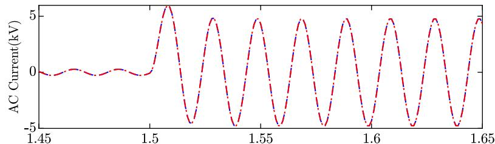  
(a)

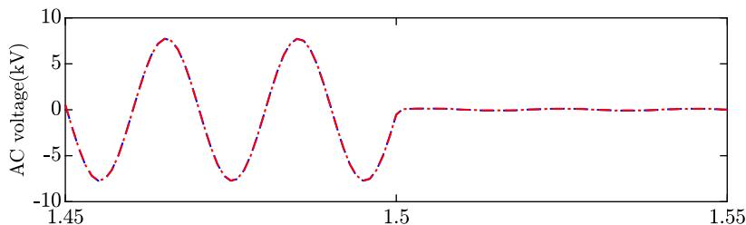

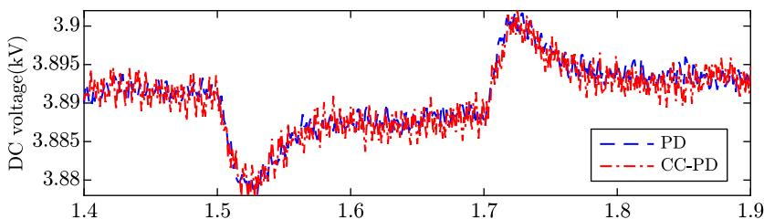  
（c）  
Fig. 13. Simulation results of the ship-shore integrated power system. (a) Phase A current of transmission line 44–45. (b) Phase A voltage of Node 51 of the distributed network. (c) DC voltage of Bus 1 of the onboard power network.

$$
\boldsymbol {K} _ {i j} = \left[ \begin{array}{c c c} \cos ((j - i) \beta) & \cos ((j - i) \beta + \alpha) & \cos ((j - i) \beta - \alpha) \\ \cos ((j - i) \beta - \alpha) & \cos ((j - i) \beta) & \cos ((j - i) \beta + \alpha) \\ \cos ((j - i) \beta + \alpha) & \cos ((j - i) \beta - \alpha) & \cos ((j - i) \beta) \end{array} \right] \tag {A.5}
$$

$$
\boldsymbol {A} _ {i j} (\theta) = \left[ \begin{array}{c c c} \cos 2 \left(\theta - \frac {\beta}{2} (j + i)\right) & \cos 2 \left(\theta + \alpha - \frac {\beta}{2} (j + i)\right) & \cos 2 \left(\theta - \alpha - \frac {\beta}{2} (j + i)\right) \\ \cos 2 \left(\theta + \alpha - \frac {\beta}{2} (j + i)\right) & \cos 2 \left(\theta - \alpha - \frac {\beta}{2} (j + i)\right) & \cos 2 \left(\theta - \frac {\beta}{2} (j + i)\right) \\ \cos 2 \left(\theta - \alpha - \frac {\beta}{2} (j + i)\right) & \cos 2 \left(\theta - \frac {\beta}{2} (j + i)\right) & \cos 2 \left(\theta + \alpha - \frac {\beta}{2} (j + i)\right) \end{array} \right]. \tag {A.6}
$$

# Box I.

The $L _ { \mathrm { r r } }$ in (4) can be expressed as:

$$
L _ {\mathrm {r r}} = \left[ \begin{array}{c c c c c c c} L _ {\mathrm {l k q}} ^ {1} & L _ {\mathrm {a q}} & L _ {\mathrm {a q}} & 0 & 0 & 0 & 0 \\ L _ {\mathrm {a q}} & \ddots & L _ {\mathrm {a q}} & 0 & 0 & 0 & 0 \\ L _ {\mathrm {a q}} & L _ {\mathrm {a q}} & L _ {\mathrm {l k q}} ^ {N _ {\mathrm {q}}} & 0 & 0 & 0 & 0 \\ 0 & 0 & 0 & L _ {\mathrm {l f d}} & L _ {\mathrm {a d}} & L _ {\mathrm {a d}} & L _ {\mathrm {a d}} \\ 0 & 0 & 0 & L _ {\mathrm {a d}} & L _ {\mathrm {l k d}} ^ {1} & L _ {\mathrm {a d}} & L _ {\mathrm {a d}} \\ 0 & 0 & 0 & L _ {\mathrm {a d}} & L _ {\mathrm {a d}} & \ddots & L _ {\mathrm {a d}} \\ 0 & 0 & 0 & L _ {\mathrm {a d}} & L _ {\mathrm {a d}} & L _ {\mathrm {a d}} & L _ {\mathrm {l k d}} ^ {N _ {\mathrm {d}}} \end{array} \right] \tag {A.10}
$$

The expanded form of $T _ { \mathrm { e } }$ in (8) is:

$$
T _ {\mathrm {e}} = \frac {3 P}{4} L _ {\mathrm {a d}} \sum_ {k = 1} ^ {4} \left(i _ {\mathrm {s d}} ^ {k} + i _ {\mathrm {f d}} + \sum_ {j = 1} ^ {N _ {\mathrm {d}}} i _ {\mathrm {k d}} ^ {j}\right) i _ {\mathrm {s q}} ^ {k} - \frac {3 P}{4} L _ {\mathrm {a q}} \sum_ {k = 1} ^ {4} \left(i _ {\mathrm {s q}} ^ {k} + \sum_ {j = 1} ^ {N _ {q}} i _ {\mathrm {k q}} ^ {j}\right) i _ {\mathrm {s d}} ^ {k} \tag {A.11}
$$

where

$$
\left[ \begin{array}{l} i _ {\mathrm {s q}} ^ {k} \\ i _ {\mathrm {s d}} ^ {k} \end{array} \right] = \frac {2}{3} \left[ \begin{array}{c c} \cos (\theta - k \beta) & \sin (\theta - k \beta) \\ \cos (\theta - \alpha - k \beta) & \sin (\theta - \alpha - k \beta) \\ \cos (\theta + \alpha - k \beta) & \sin (\theta + \alpha - k \beta) \end{array} \right] ^ {\mathrm {T}} \left[ \begin{array}{l} i _ {\mathrm {s a} k} \\ i _ {\mathrm {s b} k} \\ i _ {\mathrm {s c} k} \end{array} \right]. \tag {A.12}
$$

# Appendix B. Park’s transformation

For 12-phase machine, the Park’s transformation from abc coordinates to qd0 coordinates is defined as:

$$
\boldsymbol {T} (\theta) = \operatorname {d i a g} \left\{\boldsymbol {T} _ {k} \right\}, k = 0, 1, 2, 3 \tag {B.1}
$$

where

$$
\boldsymbol {T} _ {k} = \frac {2}{3} \left[ \begin{array}{c c c} \cos (\theta - k \beta) & \cos (\theta - \alpha - k \beta) & \cos (\theta + \alpha - k \beta) \\ \sin (\theta - k \beta) & \sin (\theta - \alpha - k \beta) & \sin (\theta + \alpha - k \beta) \\ 1 / 2 & 1 / 2 & 1 / 2 \end{array} \right].
$$

# Appendix C. Coefficient matrices in the ?????? coordinates

According to the Park’s transformation and the machine model, $L ^ { \mathrm { q d 0 } } ( \theta )$ in (10) can be expressed as:

$$
\begin{array}{l} \boldsymbol {L} ^ {\mathrm {q d 0}} (\theta) = \left[ \begin{array}{c c} \left[ \boldsymbol {L} _ {i j} \right] _ {i, j = 1, 2, 3, 4} ^ {\mathrm {q d 0}} & \left[ \boldsymbol {L} _ {i r} \right] _ {i = 1, 2, 3, 4} ^ {\mathrm {q d 0}} \\ \left[ \boldsymbol {L} _ {\mathrm {r} i} \right] _ {i = 1, 2, 3, 4} ^ {\mathrm {q d 0}} & \boldsymbol {L} _ {\mathrm {r r}} ^ {\mathrm {q d 0}} \end{array} \right] \\ = \left[ \begin{array}{l l l l l} L _ {\mathrm {m} (0)} ^ {\mathrm {q d 0}} & L _ {\mathrm {m} (1)} ^ {\mathrm {q d 0}} & L _ {\mathrm {m} (2)} ^ {\mathrm {q d 0}} & L _ {\mathrm {m} (3)} ^ {\mathrm {q d 0}} & L _ {\mathrm {a q d}} \\ L _ {\mathrm {m} (- 1)} ^ {\mathrm {q d 0}} & L _ {\mathrm {m} (0)} ^ {\mathrm {q d 0}} & L _ {\mathrm {m} (1)} ^ {\mathrm {q d 0}} & L _ {\mathrm {m} (2)} ^ {\mathrm {q d 0}} & L _ {\mathrm {a q d}} \\ L _ {\mathrm {m} (- 2)} ^ {\mathrm {q d 0}} & L _ {\mathrm {m} (- 1)} ^ {\mathrm {q d 0}} & L _ {\mathrm {m} (0)} ^ {\mathrm {q d 0}} & L _ {\mathrm {m} (1)} ^ {\mathrm {q d 0}} & L _ {\mathrm {a q d}} \\ L _ {\mathrm {m} (- 3)} ^ {\mathrm {q d 0}} & L _ {\mathrm {m} (- 2)} ^ {\mathrm {q d 0}} & L _ {\mathrm {m} (- 1)} ^ {\mathrm {q d 0}} & L _ {\mathrm {m} (0)} ^ {\mathrm {q d 0}} & L _ {\mathrm {a q d}} \\ \left(L _ {\mathrm {a q d}}\right) ^ {\mathrm {T}} & \left(L _ {\mathrm {a q d}}\right) ^ {\mathrm {T}} & \left(L _ {\mathrm {a q d}}\right) ^ {\mathrm {T}} & \left(L _ {\mathrm {a q d}}\right) ^ {\mathrm {T}} & L _ {\mathrm {r r}} \end{array} \right] \tag {C.1} \\ \end{array}
$$

where

$$
\begin{array}{l} \boldsymbol {L} _ {\mathrm {m} (j - i)} ^ {\mathrm {q d 0}} = \boldsymbol {T} (\theta - i \beta) \left[ \boldsymbol {L} _ {\mathrm {s}} ^ {i j} + \boldsymbol {M} _ {\mathrm {s}} ^ {i j} + \boldsymbol {M} _ {\mathrm {t}} ^ {i j} (\theta) \right] (\boldsymbol {T} (\theta - j \beta)) ^ {- 1} \\ = \frac {3}{2} \left[ \begin{array}{c c c} M _ {\mathrm {s}} - M _ {\mathrm {t}} & 0 & 0 \\ 0 & M _ {\mathrm {s}} + M _ {\mathrm {t}} & 0 \\ 0 & 0 & 0 \end{array} \right] + \left[ \begin{array}{c c c} L _ {\mathrm {s m}} ^ {j - i} & - L _ {\mathrm {q d m}} ^ {j - i} & 0 \\ L _ {\mathrm {q d m}} ^ {j - i} & L _ {\mathrm {s m}} ^ {j - i} & 0 \\ 0 & 0 & L _ {0 \mathrm {m}} ^ {j - i} \end{array} \right] \tag {C.2} \\ \end{array}
$$

with the elements expressed as:

$$
L _ {\mathrm {s m}} ^ {k} = l _ {\mathrm {s k}} \cos (k \beta) + l _ {\mathrm {s} (k + 8)} \cos (k \beta + \alpha) + l _ {\mathrm {s} (- k + 8)} \cos (k \beta - \alpha)
$$

$$
L _ {\mathrm {q d m}} ^ {k} = l _ {\mathrm {s k}} \sin (k \beta) + l _ {\mathrm {s} (k + 8)} \sin (k \beta + \alpha) + l _ {\mathrm {s} (- k + 8)} \sin (k \beta - \alpha) \tag {C.3}
$$

$$
L _ {0 \mathrm {m}} ^ {k} = l _ {\mathrm {s} k} + l _ {\mathrm {s} (k + 8)} + l _ {\mathrm {s} (- k + 8)}, k = j - i.
$$

qd0 $L _ { \mathrm { m } ( j - i ) } ^ { \mathrm { q d 0 } }$ can also be represented as (C.4), where the elements are obtained from generator tests. According to (A.9), (C.2) and (C.4), conversion relationships between parameters in abc and qd0 coordinates can be obtained, which are presented in (14).

$$
L _ {\mathrm {m} (j - i)} ^ {\mathrm {q d 0}} = \left[ \begin{array}{c c c} L _ {\mathrm {q m}} ^ {j - i} & - L _ {\mathrm {q d m}} ^ {j - i} & 0 \\ L _ {\mathrm {q d m}} ^ {j - i} & L _ {\mathrm {d m}} ^ {j - i} & 0 \\ 0 & 0 & L _ {0 \mathrm {m}} ^ {j - i} \end{array} \right]. \tag {C.4}
$$

# Appendix D. Proof of Theorem 1

${ \pmb R } _ { \mathrm { e q } } ( t )$ in (16) can be rewritten as (D.1):

$$
\boldsymbol {R} _ {\mathrm {e q}} (t) = \boldsymbol {R} _ {\mathrm {s s}} + \boldsymbol {R} _ {\mathrm {L s s}} (t) + \boldsymbol {R} _ {\mathrm {X}} (t). \tag {D.1}
$$

It is found that $\pmb { R } _ { \mathrm { e q } } ( t )$ is divided into 3 parts, where $R _ { \mathrm { L s s } } ( t )$ and $\pmb { R } _ { \mathrm { X } } ( t )$ can be respectively calculated as:

$$
\begin{array}{l} \boldsymbol {R} _ {\mathrm {L s s}} (t) = \frac {2}{\Delta t} \left[ \boldsymbol {L} _ {i j} \right] _ {i, j = 1, 2, 3, 4} (t) \\ = \frac {2}{\Delta t} \left(\left[ \boldsymbol {L} _ {\mathrm {l s}} ^ {i j} + \boldsymbol {M} _ {\mathrm {s}} ^ {i j} + \boldsymbol {M} _ {\mathrm {t}} ^ {i j} (\theta) \right] _ {i, j = 1, 2, 3, 4}\right) \\ \end{array}
$$

$$
\begin{array}{l} \boldsymbol {R} _ {\mathrm {X}} (t) = - \frac {4}{\Delta t ^ {2}} \left[ \boldsymbol {L} _ {\mathrm {i r}} (t) \right] _ {i = 1, 2, 3, 4} \left(\frac {2}{\Delta t} \boldsymbol {L} _ {\mathrm {r r}} + \boldsymbol {R} _ {\mathrm {r}}\right) ^ {- 1} \left[ \boldsymbol {L} _ {\mathrm {r i}} (t) \right] _ {i = 1, 2, 3, 4} \\ = - \left(\boldsymbol {T} (\theta)\right) ^ {- 1} \frac {4}{\Delta t ^ {2}} \left[ \boldsymbol {L} _ {\mathrm {i r}} \right] _ {i = 1, 2, 3, 4} ^ {\mathrm {q d} 0} \left(\frac {2}{\Delta t} \boldsymbol {L} _ {\mathrm {r r}} + \boldsymbol {R} _ {\mathrm {r}}\right) ^ {- 1} \tag {D.3} \\ \times \left[ L _ {r i} \right] _ {i = 1, 2, 3, 4} ^ {\mathrm {q d} 0} T (\theta) \\ = - (\boldsymbol {T} (\theta)) ^ {- 1} \boldsymbol {R} _ {\mathrm {X}} ^ {\mathrm {q d} 0} \boldsymbol {T} (\theta) \\ \end{array}
$$

where

$$
\boldsymbol {R} _ {\mathrm {X}} ^ {\mathrm {q d 0}} = \left[ \begin{array}{l l l l} \boldsymbol {R} _ {\mathrm {x}} ^ {\mathrm {q d 0}} & \boldsymbol {R} _ {\mathrm {x}} ^ {\mathrm {q d 0}} & \boldsymbol {R} _ {\mathrm {x}} ^ {\mathrm {q d 0}} & \boldsymbol {R} _ {\mathrm {x}} ^ {\mathrm {q d 0}} \end{array} \right] ^ {\mathrm {T}} \left[ \begin{array}{l l l l} \boldsymbol {E} & \boldsymbol {E} & \boldsymbol {E} & \boldsymbol {E} \end{array} \right] \tag {D.4}
$$

with

$$
\boldsymbol {R} _ {\mathrm {x}} ^ {\mathrm {q d 0}} = \left[ \begin{array}{c c c} R _ {\mathrm {x q}} & 0 & 0 \\ 0 & R _ {\mathrm {x d}} & 0 \\ 0 & 0 & 0 \end{array} \right], \boldsymbol {E} = \left[ \begin{array}{c c c} 1 & 0 & 0 \\ 0 & 1 & 0 \\ 0 & 0 & 1 \end{array} \right] \tag {D.5}
$$

and

$$
R _ {\mathrm {x q}} = \frac {(Z _ {\mathrm {a q}}) ^ {2}}{\frac {1}{\sum_ {j = 1} ^ {N _ {\mathrm {q}}} (Z _ {\mathrm {l k q}} ^ {j}) ^ {- 1}} + Z _ {\mathrm {a q}}}, R _ {\mathrm {x d}} = \frac {(Z _ {\mathrm {a d}}) ^ {2}}{\frac {1}{\sum_ {j = 1} ^ {N _ {\mathrm {d}}} (Z _ {\mathrm {l k d}} ^ {j}) ^ {- 1} + (Z _ {\mathrm {f d}}) ^ {- 1}} + Z _ {\mathrm {a d}}}.
$$

It is defined that

$$
\boldsymbol {R} _ {\mathrm {X}} (t) = \left[ \boldsymbol {R} _ {\mathrm {x}} ^ {i j} \right] _ {i, j = 1, 2, 3, 4}. \tag {D.6}
$$

Thus, by combining (D.3) and (D.6), it can be obtained that

$$
\boldsymbol {R} _ {\mathrm {x}} ^ {i j} = \left(\boldsymbol {T} _ {i} (\theta)\right) ^ {- 1} \boldsymbol {R} _ {\mathrm {x}} ^ {\mathrm {q d} 0} \left(\boldsymbol {T} _ {j} (\theta)\right) ^ {- 1} = \boldsymbol {R} _ {\mathrm {x s}} ^ {i j} + \boldsymbol {R} _ {\mathrm {x t}} ^ {i j} (\theta) \tag {D.7}
$$

where the details of $\pmb { R } _ { \mathrm { x s } } ^ { i j }$ and $R _ { \mathrm { x t } } ^ { i j } ( \theta )$ ) are presented as:

$$
\boldsymbol {R} _ {\mathrm {x s}} ^ {i j} = \frac {1}{3} \left(R _ {\mathrm {x q}} + R _ {\mathrm {x d}}\right) \boldsymbol {K} _ {i j} \tag {D.8}
$$

$$
\boldsymbol {R} _ {\mathrm {x t}} ^ {i j} (\theta) = - \frac {1}{3} \left(R _ {\mathrm {x d}} - R _ {\mathrm {x q}}\right) \boldsymbol {A} _ {i j} (\theta). \tag {D.9}
$$

According to (D.6)–(D.9), $\pmb { R } _ { \mathrm { X } } ( t )$ can be represented as:

$$
\boldsymbol {R} _ {\mathrm {X}} (t) = \left[ \boldsymbol {R} _ {\mathrm {x s}} ^ {i j} + \boldsymbol {R} _ {\mathrm {x t}} ^ {i j} (\theta) \right] _ {i, j = 1, 2, 3, 4}. \tag {D.10}
$$

Then, according to (D.2) and (D.10), the rotor-position-dependent part of ${ \pmb R } _ { \mathrm { e q } } ( t )$ can be derived as:

$$
\begin{array}{l} \boldsymbol {R} _ {\mathrm {t}} ^ {\prime \prime} (\theta) = \left[ \boldsymbol {R} _ {\mathrm {x t}} ^ {i j} (\theta) + \frac {2}{\Delta t} \boldsymbol {M} _ {\mathrm {t}} ^ {i j} (\theta) \right] _ {i, j = 1, 2, 3, 4} \tag {D.11} \\ = - \frac {1}{3} \left(Z _ {\mathrm {d}} ^ {\prime \prime} - Z _ {\mathrm {q}} ^ {\prime \prime}\right) A (\theta) \\ \end{array}
$$

where

$$
\begin{array}{l} Z _ {\mathrm {q}} ^ {\prime \prime} = \frac {2}{\Delta t} L _ {\mathrm {a q}} - R _ {\mathrm {x q}} = \frac {1}{(Z _ {\mathrm {a q}}) ^ {- 1} + \sum_ {j = 1} ^ {N _ {\mathrm {q}}} (Z _ {\mathrm {l k q}} ^ {j}) ^ {- 1}}, \\ Z _ {\mathrm {d}} ^ {\prime \prime} = \frac {2}{\Delta t} L _ {\mathrm {a d}} - R _ {\mathrm {x d}} = \frac {1}{(Z _ {\mathrm {a d}}) ^ {- 1} + \sum_ {j = 1} ^ {N _ {\mathrm {d}}} (Z _ {\mathrm {l k d}} ^ {j}) ^ {- 1} + (Z _ {\mathrm {f d}}) ^ {- 1}}. \\ \end{array}
$$

Besides, also according to (D.2) and (D.10), the constant part of ${ \pmb R } _ { \mathrm { e q } } ( t )$ can be represented as :

$$
\boldsymbol {R} _ {0} ^ {\prime \prime} = \left[ \frac {2}{\Delta t} \left(\boldsymbol {L} _ {\mathrm {s}} ^ {i j} + \boldsymbol {M} _ {\mathrm {s}} ^ {i j}\right) + \boldsymbol {R} _ {\mathrm {x s}} ^ {i j} \right] _ {i, j = 1, 2, 3, 4}. \tag {D.12}
$$

In summary, ${ \pmb R } _ { \mathrm { e q } } ( t )$ can be expressed as a constant plus a rotorposition-dependent part:

$$
\boldsymbol {R} _ {\mathrm {e q}} (t) = \boldsymbol {R} _ {0} ^ {\prime \prime} - \frac {1}{3} \left(Z _ {\mathrm {d}} ^ {\prime \prime} - Z _ {\mathrm {q}} ^ {\prime \prime}\right) \boldsymbol {A} (\theta). \tag {D.13}
$$

# References

[1] Tong M, Cheng M, Wang S, Hua W. An on-board two-stage integrated fast battery charger for EVs based on a five-phase hybrid-excitation flux-switching machine. IEEE Trans Ind Electron 2021;68(2):1780–90.   
[2] Singh GK. Multi-phase induction machine drive research—A survey. Electr Power Syst Res 2002;61(2):139–47.   
[3] Fall O, Nguyen NK, Charpentier JF, Letellier P, Semail E, Kestelyn X. Variable speed control of a 5-phase permanent magnet synchronous generator including voltage and current limits in healthy and open-circuited modes. Electr Power Syst Res 2016;140:507–16.   
[4] Abdel-Khalik AS, Masoud MI, Ahmed S, Massoud A. Calculation of derating factors based on steady-state unbalanced multiphase induction machine model under open phase(s) and optimal winding currents. Electr Power Syst Res 2014;106:214–25.   
[5] Shao L, Hua W, Li F, Soulard J, Zhu ZQ, Wu Z, et al. A comparative study on nine- and twelve-phase flux-switching permanent-magnet wind power generators. IEEE Trans Ind Appl 2019;55(4):3607–16.   
[6] Shao L, Hua W, Soulard J, Zhu Z, Wu Z, Cheng M. Electromagnetic performance comparison between 12-phase switched flux and surface-mounted PM machines for direct-drive wind power generation. IEEE Trans Ind Appl 2020;56(2):1408–22.   
[7] Tessarolo A, Castellan S, Menis R. Feasibility and performance analysis of a high power drive based on four synchro-converters supplying a twelve-phase synchronous motor. In: Proc. IEEE power electron. spec. conf.. Rhodes, Greece; 2008. p. 2352–2357.   
[8] Shao L, Hua W, Dai N, Tong M, Cheng M. Mathematical modeling of a 12- phase flux-switching permanent-magnet machine for wind power generation. IEEE Trans Ind Electron 2016;63(1):504–16.

[9] Liu S, Cheng Y. Modeling of a twelve-phase synchronous machine using Matlab/SimPowerSystems. In: Proc. 2nd ICECC. Ningbo, China; 2011. p. 2131–2134.   
[10] Dommel HW. Digital computer solution of electromagnetic transients in single and multiphase networks. IEEE Trans Power App Syst 1969;PAS-88(4):388–99.   
[11] Gole AM, Nayak OB, Sidhu TS, Sachdev MS. A graphical electromagnetic simulation laboratory for power systems engineering programs. IEEE Trans Power Syst 1996;11(2):599–606.   
[12] Mahseredjian J, Dennetière S, Dubé L, Khodabakhchian B, Gérin-Lajoie L. On a new approach for the simulation of transients in power systems. Electr Power Syst Res 2007;77(11):1514–20.   
[13] Gole AM, Menzies RW, Turanli HM, Woodford DA. Improved interfacing of electrical machine models to electromagnetic transients programs. IEEE Trans Power App Syst 1984;PAS-103(9):2446–51.   
[14] Wang L, Jatskevich J. A voltage-behind-reactance synchronous machine model for the EMTP-type solution. IEEE Trans Power Syst 2006;21(4):1539–49.   
[15] Wang L, Jatskevich J. Magnetically-saturable voltage-behind-reactance synchronous machine model for EMTP-type solution. IEEE Trans Power Syst 2011;26(4):2355–63.   
[16] Gao S, Song Y, Chen Y, Yu Z, Tan Z. Shifted frequency-based electromagnetic transient simulation for AC power systems in symmetrical component domain. IET Renew Power Gener 2022;1–12.   
[17] Marti JR, Louie KW. A phase-domain synchronous generator model including saturation effects. IEEE Trans Power Syst 1997;12(1):222–9.   
[18] Xia Y, Chen Y, Song Y, Huang S. An efficient phase domain synchronous machine model with constant equivalent admittance matrix. IEEE Trans Power Deliv 2019;34(3):929–40.   
[19] Xia Y, Strunz K. Multi-scale induction machine model in the phase domain with constant inner impedance. IEEE Trans Power Syst 2020;35(3):2120–32.   
[20] Rubino S, Bojoi R, Cavagnino A, Vaschetto S. Asymmetrical twelve-phase induction starter/generator for more electric engine in aircraft. In: Proc. IEEE energy convers. congr. expo.. Milwaukee, WI, US; 2016. p. 1–8.

[21] Tessarolo A, Mohamadian S, Bortolozzi M. A new method for determining the leakage inductances of a nine-phase synchronous machine from no-load and short-circuit tests. IEEE Trans Energy Convers 2015;30(4):1515–27.   
[22] Kundur P. Power system stability and control. New York, NY, USA: McGraw-Hill; 1994.   
[23] Dommel HW. EMTP theory book. 2nd ed.. Portland, OR, USA: Bonneville Power Administration; 1996.   
[24] Butcher JC. Numerical methods for ordinary differential equations. New York, NY, USA: John Wiley & Sons; 2016.   
[25] Gao S, Chen Y, Song Y, Xia Y, Tan Z. Determination of optimal shift frequency for shifted frequency-based simulation. IEEE Trans Power Syst 2021;36(5):4824–7.   
[26] Wang L, Jatskevich J. A phase-domain synchronous machine model with constant equivalent conductance matrix for EMTP-type solution. IEEE Trans Energy Convers 2013;28(1):191–202.   
[27] Chapariha M, Wang L, Jatskevich J, Dommel HW, Pekarek SD. Constantparameter RL-branch equivalent circuit for interfacing ac machine models in state-variable-based simulation packages. IEEE Trans Energy Convers 2012;27(3):634–45.   
[28] Zhang K, Shan Z, Jatskevich J. Large- and small-signal average-value modeling of dual-active-bridge DC-DC converter considering power losses. IEEE Trans Power Electron 2017;32(3):1964–74.   
[29] Milani AA, Khan MTA, Chakrabortty A, Husain I. Equilibrium point analysis and power sharing methods for distribution systems driven by solid-state transformers. IEEE Trans Power Syst 2018;33(2):1473–83.   
[30] Missula JV, Adda R, Tripathy P. Average modeling of active neutral point clamped inverter. In: Proc. IEEE energy convers. congr. expo.. Baltimore, MD, US; 2019. p. 3689–3696.   
[31] Jatskevich J, Pekarek SD, Davoudi A. Fast procedure for constructing an accurate dynamic average-value model of synchronous machine-rectifier systems. IEEE Trans Energy Conver 2006;21(2):435–41.   
[32] Wang K, Wei W, Gao S, Huang S, Sun X, Zhou B. Parametric average-value modeling of diode rectifier systems based on neural network. In: Proc. Asia energy electr. eng. symp.. Chengdu, China; 2022. p. 609–613.