# A phase-domain synchronous machine modeling technique by using magnetic circuit representation of armature and rotor windings

# R. Yonezawa

Grid and Communication Technology Division, Grid Innovation Research Laboratory, CRIEPI (Central Research Institute of Electric Power Industry), 2-6-1, Nagasaka, Yokosuka, Kanagawa 240-0196, Japan

# A R T I C L E I N F O

Keywords:

Electromagnetic transient (EMT) analysis

Magnetic circuit representation

Park’s equations

Phase domain

Spatial harmonics

Synchronous machine

# A B S T R A C T

A phase-domain synchronous machine modeling technique by using only basic circuit components and applying the magnetic circuit representation used for transformer modeling is proposed in this paper. The model based on the proposed technique is implemented into XTAP, one of the electromagnetic transient analysis programs, and the accuracy of the proposed model is validated through simulation in an infinite-bus case system by comparing it with some conventional synchronous machine models in this paper.

# 1. Introduction

Although the number of synchronous machines has been decreasing owing to the recent increase in the utilization of renewable energy, they are still a major source of energy in power systems and models that can accurately reproduce the electrical and mechanical behaviors of synchronous machines in power system simulation are needed.

A synchronous machine consists of armature windings, a field winding, and one or more damper windings arranged spatially, and its electrical behavior (the relationship between voltage and current in each winding) can be expressed by circuit equations composed of an inductance matrix consisting of the self- and mutual inductances and a resistance matrix to express the resistances of each winding [1]. However, the values of some elements of the inductance matrix change from time to time depending on the rotor position (angle), which makes their handling complicated in transient analysis. Therefore, in the field of power system analysis, a model based on Park’s equations (referred to as Park’s model in this paper), which eliminates the time-varying inductances between windings by using the dq0 transformation on the inductance matrix, is the standard model for synchronous machines and has been widely used for many years [2].

Park’s model assumes the following two points: (1) the magnetic field distribution in the air gap is sinusoidal, and (2) the circuit constants such as the inductances and resistances of each phase winding are balanced among the three phases. Although the first assumption is not strictly true, many synchronous machines use distributed armature windings so that the spatial distribution of the magnetomotive force

approaches a sinusoidal one, and adopting this assumption does not pose a major problem. In most of the analyses that have been conducted, Park’s model has been sufficiently accurate.

However, with the increase in the number of power conditioning systems and other power electronics equipment used in renewable energy interconnection, the need for analysis that takes harmonics into account is expected to increase in the future. Accordingly, a synchronous machine model that can appropriately take into account spatial harmonics in the magnetic field distribution, which has been ignored until now because it has no significant impact, is considered necessary. In the design of synchronous machines, it is sometimes necessary to analyze a situation in which the machine parameters become three-phase unbalanced, such as an internal short-circuit accident in an armature winding [3]. Under such condition, Park’s model cannot be used as it is because it does not satisfy the second assumption [4].

A method for solving the circuit equations of a synchronous machine in the three-phase domain without using the dq0 transformation (called a phase-domain model) has been proposed to realize these analyses [5, 6]. Therefore, for analyses where Park’s model cannot be used, users can create a phase-domain model of a synchronous machine according to the type of analysis and perform their analysis using this model.

When performing analysis of a power system that includes synchronous machines, it is not practical to create an analysis program, including a synchronous machine model, from scratch. In the case of electromagnetic transient (EMT) analysis, EMTP (DCG-EMTP [7], EMTP-RV [8]), ATP [9], PSCAD [10], and XTAP [11] are the typical analysis programs used. Since the source codes of these programs are

usually not disclosed, models that require incorporation into the program are not practically available except to the program developers. However, the phase-domain models proposed so far have been imple mented as models embedded in programs (black-box models where the models cannot be edited). Therefore, it is virtually difficult for users to create a phase-domain model that can simulate spatial harmonics and internal faults. It was also practically impossible to improve or expand the existing model for research and development purposes, such as simulating a dual-excited synchronous machine [12].

In this paper, the author proposes a phase-domain modeling technique for synchronous machines, which can be freely edited by the user. The proposed modeling technique represents the relationship between the electromotive force and flux linkage in the armature, field, and damper windings of a synchronous machine as magnetic circuits consisting of a combination of basic circuit elements. Therefore, the proposed technique does not require implementation in the source code, and the model implemented by the proposed technique (proposed model) can be easily modified by the user according to the analysis purposes, such as spatial harmonics and three-phase unbalanced conditions. The proposed model is also superior in terms of analytical accuracy and numerical stability because it is a phase-domain model characterized by the fact that it is coupled with the external system of a synchronous machine.

In the following sections, the phase-domain modeling technique for synchronous machines proposed in this paper is explained, and by using the proposed technique, a synchronous machine model is implemented on XTAP. The basic behavior of the proposed model is compared with that of the conventional Park’s model by simulating the transient response of a synchronous machine to three-phase-to-ground fault using an infinite-bus system.

# 2. Proposed phase-domain modeling technique for synchronous machines

In EMT analysis programs, basic circuit elements such as an inductor and a capacitor, which are used by program users to construct power systems and models, have the operation of discretization of the differential equations expressing the relationship between their voltage and current built into the program in advance. For this reason, power equipment models such as a transformer model based on the basic equivalent circuit and a transmission line model based on the π-type equivalent circuit, whose dynamic characteristics can be expressed by combining basic circuit elements without editing the program source code, can be freely edited by changing some of their components and can also be easily modified to allow external manipulation of components’ parameters during transient analysis by using controlled circuit components that can change parameters from the control system. Similarly, if the controlled switch that can be operated from the control system is incorporated into the model, it is possible to simulate internal wiring breaks or ground faults during transient analysis. Therefore, from the standpoint of versatility, the equipment model should be composed of a combination of basic elements. Furthermore, such models are desirable from the standpoint of model reliability because the internal configuration of the model is not concealed. In the case of synchronous machines, however, no phase-domain model composed of a combination of circuit elements has ever been created.

On the other hand, in the case of transformers, which are electrical equipment consisting of windings and an iron core similar to synchronous machines, it is sometimes desirable to precisely consider the magnetic coupling between the windings because of the iron core structure. In such cases, a technique is known to construct a magnetic circuit composed of the electromotive force, magnetic flux, and magnetic resistance of multiple windings and the iron core on an EMT analysis program, and to solve it in combination with the electric winding circuits and external system [13]. In this technique, the current flowing through the winding corresponds to the magnetomotive force,

and the induced electromotive voltage of the winding corresponds to the magnetic flux. Depending on the method of connection between the electric and magnetic circuits, both circuits can also be solved simultaneously [14,15]. Therefore, in this paper, the author proposes a technique to represent a synchronous machine by a combination of basic circuit elements by applying the magnetic-circuit-based method in transformer modeling described above to the circuit equations for a synchronous machine.

# 2.1. Magnetic circuit modeling of the circuit equations for a synchronous machine

First, the equations for the flux linkages in each of the windings due to the currents flowing through the armature windings, field winding, and damper windings are considered. The flux linkages in each winding are obtained by the product of the inductance matrix between the windings and the current vector, as shown in the following equation [1].

$$
\left[ \begin{array}{l} \Phi_ {\mathrm {s}} \\ \Phi_ {\mathrm {r}} ^ {\prime} \end{array} \right] = \left[ \begin{array}{c c} \mathbf {L} _ {\mathrm {s s}} (\theta) & \mathbf {L} _ {\mathrm {s r}} ^ {\prime} (\theta) \\ \frac {2}{3} \left(\mathbf {L} _ {\mathrm {s r}} ^ {\prime} (\theta)\right) ^ {T} & \mathbf {L} _ {\mathrm {r r}} ^ {\prime} \end{array} \right] \left[ \begin{array}{l} \mathbf {i} _ {\mathrm {s}} \\ \mathbf {i} _ {\mathrm {r}} ^ {\prime} \end{array} \right] \tag {1}
$$

$$
\Phi_ {\mathrm {s}} = \left[ \begin{array}{l l l} \Phi_ {\mathrm {s a}} & \Phi_ {\mathrm {s b}} & \Phi_ {\mathrm {s c}} \end{array} \right] ^ {T}
$$

$$
\Phi_ {\mathrm {r}} ^ {\prime} = \left[ \begin{array}{l l l} \Phi_ {\mathrm {f d}} ^ {\prime} & \Phi_ {\mathrm {k d}} ^ {\prime} & \Phi_ {\mathrm {k q}} ^ {\prime} \end{array} \right] ^ {T} \tag {2}
$$

$$
\mathbf {i} _ {\mathrm {s}} = \left[ i _ {\mathrm {s a}} \quad i _ {\mathrm {s b}} \quad i _ {\mathrm {s c}} \right] ^ {T}
$$

$$
\mathbf {i} _ {\mathrm {f}} ^ {\prime} = \left[ \begin{array}{l l} i _ {\mathrm {f d}} ^ {\prime} & i _ {\mathrm {k d}} ^ {\prime} & i _ {\mathrm {k q}} ^ {\prime} \end{array} \right] ^ {T}
$$

where $\Phi _ { \mathrm { s a } } ,$ Φsb and $\Phi _ { \mathrm { s c } }$ are the flux linkages in the armature windings, Φ′ fd, $\Phi ^ { \prime } \mathrm { _ { k d } }$ and $\Phi _ { \mathrm { { k q } } } ^ { \prime }$ are the flux linkages in the field and damper windings, $i _ { \mathrm { s a } } , i _ { \mathrm { s b } }$ and $i _ { \mathrm { s c } }$ are the currents in the armature windings, $i _ { \mathrm { f d } } ^ { \prime } , i _ { \mathrm { k d } } ^ { \prime }$ and $i ^ { \prime } \mathrm { k q }$ are the currents in the field and damper windings, $\mathbf { L } _ { \mathrm { S S } } \left( \theta \right)$ and $\mathbf { L } _ { \mathrm { r r } } ^ { \prime }$ are respectively the inductance matrices of the armature and rotor (field and damper) windings, $\mathbf { L } _ { \mathrm { s r } } ^ { \prime } \left( \theta \right)$ is the inductance matrix between the armature and rotor windings, and θ is the electrical phase angle between the armature and rotor. For simplicity, we also assume that there is one damper winding on the direct axis and one on the quadrature axis. In many references, $" { \bf a } ^ { \dag }$ in armature is used as a subscript of armature winding, but in this report, "s" meaning stator is used to avoid confusion with phase a.

As shown in Fig. 1(a), when a current i flows through a resistor with an inductance value L in the EMT analysis program, the voltage applied to the resistor becomes the flux linkage (= Li). Then, with a currentcontrolled current source (CCCS), which is a dependent source that controls its own current according to the current of any circuit component, the current $i _ { \mathrm { s a } }$ of the armature winding of phase a is applied to the resistor whose value is set to the self-inductance value $L _ { \tt a a }$ of the armature winding of phase a. The flux linkage in the phase a winding due to

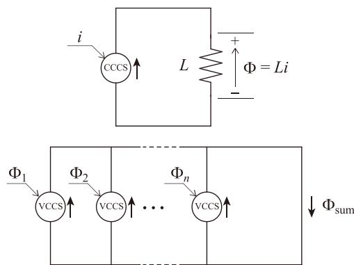  
Fig. 1. Circuits for calculating flux linkage using a resistor component and dependent sources. (a) Circuit representation of flux linkage Φ. (b) Flux linkage $\Phi _ { \mathrm { s u m } }$ attributable to currents in multiple windings.

the current $i _ { \mathrm { s a } }$ of the armature winding of phase a can be obtained as a voltage. Similarly, if the current $i _ { \mathrm { s b } }$ in the phase b armature winding flows through a resistor whose value is set to the mutual inductance value $L _ { \mathrm { a b } }$ of the armature windings between phases a and b, the flux linkage in the phase a winding due to the current $i _ { \mathrm { s b } }$ in the phase b armature winding can be obtained as a voltage. To obtain the sum of the flux linkage $\Phi _ { 1 } , \Phi _ { 2 } , . . . , \Phi _ { n } ,$ first, convert each flux linkage obtained as a voltage into a current from a voltage-controlled current source (VCCS), which is a dependent source that controls its own current according to the voltage of any circuit component. Next, these are connected in parallel as shown in Fig. 1(b), and the total flux linkage $\Phi _ { \mathrm { s u m } }$ is obtained as the resultant current. In the circuit shown in Fig. 1(a), the physical quantities corresponding to current, voltage, and resistance are electromotive force, flux linkage (magnetic flux), and permeance, respectively.

Next, the induced electromotive force of each winding is determined. The induced electromotive force of a winding is related to the derivative of the flux linkage (Faraday’s law). Therefore, the induced electromotive force can be obtained using a differential circuit with a 1 H inductance as shown in Fig. 2. In other words, in the circuit shown in Fig. 2, by passing a current through a 1 H inductance using VCCS through the flux linkage obtained as the voltage at both ends of the resistor, the voltage becomes the derivative of the flux linkage. To obtain the induced electromotive force from the flux linkage due to the current flowing through multiple windings, a 1 H inductance is connected in parallel with VCCS in the circuit shown in Fig. 1(b).

Then, the obtained induced electromotive force is set as the induced electromotive force of the winding in the electric circuit. This can be achieved by using a voltage-controlled voltage source (VCVS), which is a component that controls its voltage according to the voltage of any circuit component. Thus, by using three types of dependent sources, namely, CCCS, VCCS, and VCVS, the relationship between the current and induced electromotive force in multiple windings (electric circuit) and the relationship between the current and the flux linkage (magnetic circuit) can be established simultaneously.

By the technique described above, one can obtain the induced electromotive force $e _ { \mathrm { s a } }$ in the armature winding of phase a by combining the multiple circuits shown in Fig. 3. In these circuits, the currents $i _ { \mathrm { s a } } , i _ { \mathrm { s b } } , i _ { \mathrm { s c } } ,$ $i _ { \mathrm { f d } } ^ { \prime } , \ i _ { \mathrm { k d } } ^ { \prime }$ and $i _ { \mathrm { k q } } ^ { \prime }$ are taken as currents from CCCS and connected to a resistance (not exactly a resistance but a permeance) with an inductance value obtained from the inductance matrix in (1), and the flux linkages $\Phi _ { \mathrm { s a - s a } } , \Phi _ { \mathrm { s a - s b } } , \Phi _ { \mathrm { s a - s c } } , \Phi _ { \mathrm { s a - f d } } ^ { \prime } , \Phi _ { \mathrm { s a - k d } } ^ { \prime }$ and $\Phi _ { \mathrm { { \tt { s a - k q } } } } ^ { \prime }$ of the armature winding of phase a due to the current in each winding are obtained. The voltages of each resistor (flux linkages in the armature winding of phase a due to the current in each winding) are extracted as a current from VCCS, and they are connected in parallel to obtain the resultant current (the flux linkages in the armature winding of phase a $\Phi _ { \mathrm { { s a } } } )$ . This resultant current is then passed through a 1 H inductance to obtain the induced electromotive force $e _ { \mathrm { s a } }$ as the voltage of the inductance. Furthermore, this induced electromotive force is set on the electric circuit side as the induced electromotive force of the winding by VCVS. Since the value of each inductance varies depending on the rotor angle θ, a controlled resistor (a resistor whose value is controlled by the control system) is

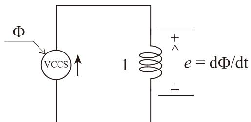  
Fig. 2. Circuits for calculating electromagnetic force of a winding using an inductor component and a voltage-controlled current source.

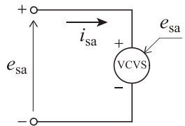

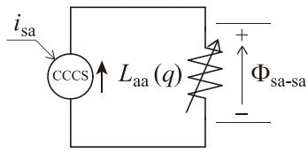

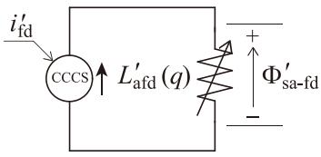

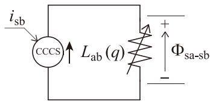

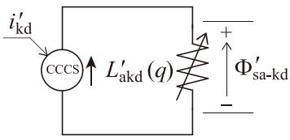

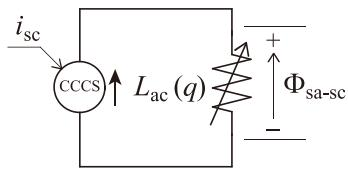

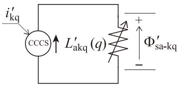

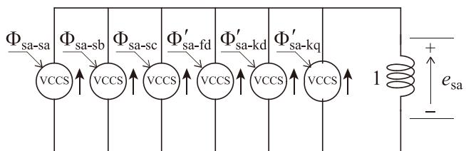  
Fig. 3. Circuits for calculating induced electromotive force of a winding.

used to set the value using the control system based on θ. The induced electromotive force of other windings can be obtained in the same way. The relationships among the flux linkages, currents, and induced electromotive forces in each winding can now be expressed by combining the basic circuit elements.

In addition, considering the winding resistances, the terminal voltages v of the armature and rotor windings are obtained. Here, the leakage inductance, similar to the winding resistance, is an element related only to the current in its winding. Therefore, the winding resistance and leakage inductance should be connected as a single-phase resistance and inductance on the electric circuit side. Note that in this case, the leakage inductance should be subtracted from the calculation of the inductance matrix.

Finally, the circuit group shown in Fig. 4 is the model that represents the terminal voltages of each winding that makes up a synchronous machine. Fig. 4 represents the following equations, which express the relationship between terminal voltages and induced electromotive forces, using the electric circuits.

$$
\left[ \begin{array}{l} \mathbf {v} _ {\mathrm {s}} \\ \mathbf {v} _ {\mathrm {r}} ^ {\prime} \end{array} \right] = \left[ \begin{array}{c c} \mathbf {R} _ {\mathrm {s s}} & 0 \\ 0 & \mathbf {R} _ {\mathrm {r r}} ^ {\prime} \end{array} \right] \left[ \begin{array}{l} \mathbf {i} _ {\mathrm {s}} \\ \mathbf {i} _ {\mathrm {r}} ^ {\prime} \end{array} \right] + \left[ \begin{array}{l} \mathbf {e} _ {\mathrm {s}} \\ \mathbf {e} _ {\mathrm {r}} ^ {\prime} \end{array} \right] \tag {3}
$$

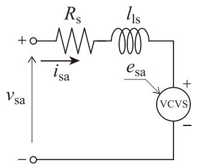

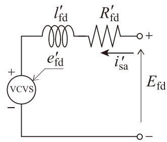

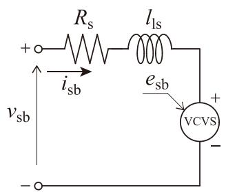

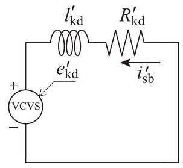

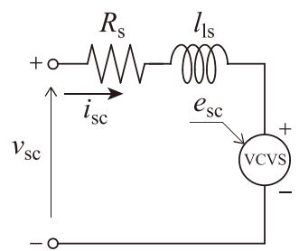

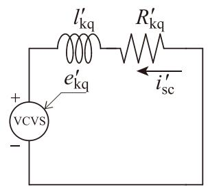  
Fig. 4. Electrical circuits on the winding side of a synchronous machine (excluding the calculation circuits for each winding flux linkage).

$$
\mathbf {v} _ {\mathrm {s}} = \left[ \begin{array}{c c c} v _ {\mathrm {s a}} & v _ {\mathrm {s b}} & v _ {\mathrm {s c}} \end{array} \right] ^ {T}
$$

$$
\mathbf {v} _ {\mathrm {r}} ^ {\prime} = \left[ \begin{array}{c c c} E _ {\mathrm {f d}} & 0 & 0 \end{array} \right] ^ {T}
$$

$$
\mathbf {e} _ {\mathrm {s}} = \left[ \begin{array}{l l l} e _ {\mathrm {s a}} & e _ {\mathrm {s b}} & e _ {\mathrm {s c}} \end{array} \right] ^ {T} \tag {4}
$$

$$
\mathbf {e} _ {\mathrm {r}} ^ {\prime} = \left[ \begin{array}{c c c} e _ {\mathrm {f d}} ^ {\prime} & e _ {\mathrm {k d}} ^ {\prime} & e _ {\mathrm {k q}} ^ {\prime} \end{array} \right] ^ {T}
$$

where $\nu _ { \mathrm { s a } } , \nu _ { \mathrm { s b } }$ and $\nu _ { \mathrm { s c } }$ are the terminal voltages in the armature windings, $E _ { \mathrm { f d } }$ is the terminal voltage in the field winding, $e _ { \mathrm { s a } } , e _ { \mathrm { s b } } , e _ { \mathrm { s c } } , e _ { \mathrm { f d } } ^ { \prime } , e _ { \mathrm { k d } } ^ { \prime }$ and $e _ { \mathrm { { k q } } } ^ { \prime }$ are the induced electromotive force in the armature and rotor windings, $\mathbf { R } _ { \mathrm { s s } }$ and ${ \bf { R } ^ { \prime } } _ { \mathrm { { r r } } }$ are respectively the winding resistance matrices of the armature and rotor windings.

The terminals of the damper windings are shorted. For the external system, the terminals of the phases of the armature winding and the field winding are connected. If the armature winding is star-connected, the negative terminal of each phase is connected and taken to the external system as the neutral point. As Fig. 4 shows, the terminals of the field winding can also be taken out as an electric circuit, and thus can be used in analyses that simulate field circuits in detail, such as those studied in [16], for example. If the field voltage is set by the control system, as in the conventional synchronous machine model, a controlled voltage source whose value can be set by the control system should be connected to the terminals of the field winding.

In the proposed model, the flux linkages in each winding are calculated by multiplying the inductance value according to the rotor angle by the winding currents. The inductance value is calculated every time step using the control system. If the magnetomotive force distribution in the air gap is sinusoidal, the inductance can be calculated using the following equation [1]:

$$
\mathbf {L} _ {\mathrm {s s}} (\theta) = \left[ \begin{array}{c} \left[ \begin{array}{c} L _ {\mathrm {a a 0}} + L _ {\mathrm {a a 2}} \cos 2 \theta \\ - L _ {\mathrm {a b 0}} + L _ {\mathrm {a a 2}} \cos (2 \theta - 2 \pi / 3) \\ - L _ {\mathrm {a b 0}} + L _ {\mathrm {a a 2}} \cos (2 \theta - 4 \pi / 3) \end{array} \right] ^ {T} \\ \left[ \begin{array}{c} - L _ {\mathrm {a b 0}} + L _ {\mathrm {a a 2}} \cos (2 \theta - 2 \pi / 3) \\ L _ {\mathrm {a a 0}} + L _ {\mathrm {a a 2}} \cos (2 \theta - 4 \pi / 3) \\ - L _ {\mathrm {a b 0}} + L _ {\mathrm {a a 2}} \cos 2 \theta \end{array} \right] ^ {T} \\ \left[ \begin{array}{c} - L _ {\mathrm {a b 0}} + L _ {\mathrm {a a 2}} \cos (2 \theta - 4 \pi / 3) \\ - L _ {\mathrm {a b 0}} + L _ {\mathrm {a a 2}} \cos 2 \theta \\ L _ {\mathrm {a a 0}} + L _ {\mathrm {a a 2}} \cos (2 \theta - 2 \pi / 3) \end{array} \right] ^ {T} \end{array} \right] \tag {5}
$$

$$
\mathbf {L} _ {\mathrm {r r}} ^ {\prime} = \left[ \begin{array}{c c c} L _ {\mathrm {m d}} & L _ {\mathrm {m d}} & 0 \\ L _ {\mathrm {m d}} & L _ {\mathrm {m d}} & 0 \\ 0 & 0 & L _ {\mathrm {m q}} \end{array} \right]
$$

$$
\begin{array}{l} \mathbf {I} _ {\mathrm {s r}} ^ {\prime} (\theta) = \left[ \begin{array}{c c c} L _ {\mathrm {m d}} \cos \theta & L _ {\mathrm {m d}} \cos \theta & - L _ {\mathrm {m q}} \sin \theta \\ L _ {\mathrm {m d}} \cos \theta_ {2} & L _ {\mathrm {m d}} \cos \theta_ {2} & - L _ {\mathrm {m q}} \sin \theta_ {2} \\ L _ {\mathrm {m d}} \cos \theta_ {3} & L _ {\mathrm {m d}} \cos \theta_ {3} & - L _ {\mathrm {m q}} \sin \theta_ {3} \end{array} \right] \\ \mathbf {\Sigma} = \left[ \mathbf {L} _ {\mathrm {r s}} ^ {'} (\theta) \right] ^ {T} \\ \end{array}
$$

where $L _ { \mathsf { a a 0 } }$ is the average value of self-inductance of each armature winding, $L _ { \mathrm { a b 0 } }$ is the maximum value of change in self-inductance of each armature winding, $L _ { \mathrm { a a 2 } }$ is the average value of mutual inductance between armature windings, $L _ { \mathrm { m d } }$ and $L _ { \mathrm { m q } }$ are respectively the magnetization inductances of the d-axis and q-axis, $\theta _ { 2 } = \theta { - } 2 \pi / 3$ and $\theta _ { 3 } = \theta { - } 4 \pi / 3$ .

If the spatial harmonics are to be simulated in detail, for example, in the case of the inductance value of the armature winding, not only the second harmonic component but also the fourth and sixth harmonic components should be added $[ 7 ] ,$ , or the magnetomotive force distribution that varies with the rotor angle should be calculated as is. Thus, the proposed model can easily simulate spatial harmonics because the inductance value can be freely set according to the rotor angle. In addition, since each phase armature winding is composed of independent circuit elements, for example, if internal short-circuit faults in the phase a winding are to be simulated, it can be taken into account by applying a fault-simulating change only to the phase a winding during the transient analysis.

# 2.2. Mechanical equations

In this section, how to simulate the mechanical equations that describe the relationship between the angular velocity and the electromagnetic torque of the rotor is considered. The electromagnetic torque $T _ { \mathrm { E } }$ is obtained by algebraic operations involving the product of the currents in the two windings [1], but since it is difficult to achieve this operation using a combination of circuit elements, it is calculated using a control system. Similarly, the angular velocity is calculated with a control system using some control elements such as integral elements. For example, the angular velocity can be obtained using the block diagram shown in Fig. 5 [1], where $T _ { \mathrm { { L } } }$ is the mechanical torque of the machine, $\omega _ { \mathrm { e } }$ is the electric angular velocity of the rotor, J is the moment of inertia of the rotating machine system, $D$ is the damping constant, and q is the number of pole pairs. The rotor angle $\theta ,$ which is required in the calculation of the circuit equations on the winding side, is obtained by further integrating $\omega _ { \mathrm { e } } .$ . In many EMT analysis programs, the solution of the control system is not coupled with the solution of the electric circuit side, and there is one calculation time step delay in the exchange of signals between the control system side and the electrical circuit side.

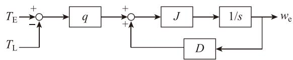  
Fig. 5. Block diagram of the calculation of angular velocity using the control system.

Therefore, the control system uses the result of one previous calculation to calculate the predicted value at the current time. In other words, the equations on the control system side are not strictly coupled with the equations on the electrical circuit side, which may cause problems in terms of calculation accuracy and numerical stability. In reality, however, changes in the angular velocity of a rotating machine are sufficiently slower than changes in the winding voltage, current, etc. If the calculation time step for the analysis is set appropriately, the one calculation time step delay between the control system side and the electrical circuit side does not cause any problem and the predicted value can be calculated with sufficient accuracy [7].

By the above technique, one can represent the electrical and mechanical behaviors of a synchronous machine by combining basic circuit elements and control systems. Since the parameters of all circuit elements and control blocks can be freely set, it is easy to analyze, for example, a three-phase unbalanced condition assuming equipment failure. The parameters can also be changed during the analysis by using controlled circuit components whose parameters can be manipulated from the control system. The proposed method can be implemented in any EMT analysis program that can use dependent sources such as VCVS and CCCS. However, it cannot be implemented in EMT analysis programs that use the traditional nodal analysis as the circuit formulation method, such as the early EMTP (DCG-EMTP) and ATP. If a program uses a method based on the modified nodal analysis [17] or the sparse tableau method [18] as the formulation method, dependent sources can be implemented in principle, but care must be taken because whether they can be used or not depends on the program.

# 2.3. Implementation example

calculation of the flux linkages of each winding are constructed using the electrical circuit components. The electromagnetic torque, the angular velocity and rotor angle are calculated using the control system. The inductances of each winding are also calculated with the control system using the rotor angle. The sequence of calculation steps in the proposed model is concisely described here, assuming that the solution at timestep t–Δt is known and that the solution at t is to be found.

1) Using the control system, calculate the electromagnetic torque $T _ { \mathrm { E } }$ from the current of each winding at t–Δt and predict the electric angular velocity $\omega _ { \mathrm { e } }$ at t using the block diagram shown in Fig. 5. An explicit numerical integration method is used for integrator $^ { \ 6 } 1 / s ^ { \ 3 }$ .   
2) Calculate the rotor angle θ at t using the predicted angular velocity $\omega _ { \mathrm { e } } .$ The rotor angle is used to calculate $\mathbf { L } _ { s s }$ and $\mathbf { L } _ { \mathrm { { s r } } } ^ { \prime } ,$ and these are set to the values of the controlled resistors in Fig. 4.   
3) Solve the circuit equations for all networks including the synchronous machine. As a result, the winding currents, flux linkages, and induced electromotive forces are solved simultaneously.

Note that XTAP uses a second-order explicit Runge-Kutta method [19,20] as the numerical integration method for the integrator to perform highly accurate calculations in control systems.

In the Fig. $^ { 6 , }$ the model is based on the case where there is only one damper winding on the d-axis and one on the q-axis. If the number of damper windings on the q-axis is increased or if the number of field windings is increased as in a dual-axis synchronous machine [12], the equations for the terminal voltages and flux linkages of each winding are also updated. To accommodate this, a circuit to calculate the flux linkage of the added winding (Fig. 3) and a circuit to calculate the terminal voltage of that winding (Fig. 4) should be added.

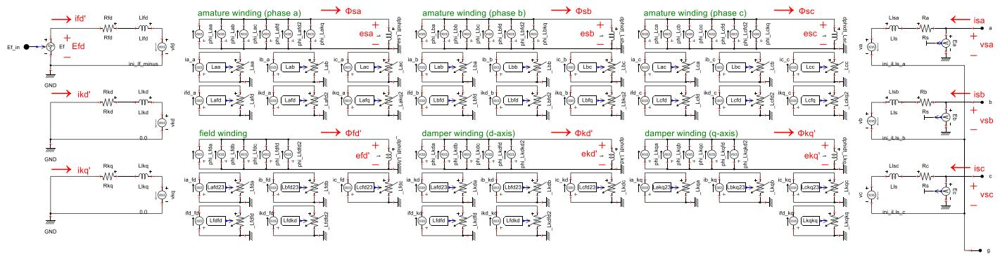  
Fig. 6 shows an example of a synchronous machine model proposed in the above section implemented on XTAP. The electrical circuits of the armature windings, the field winding, and the damper windings, and the

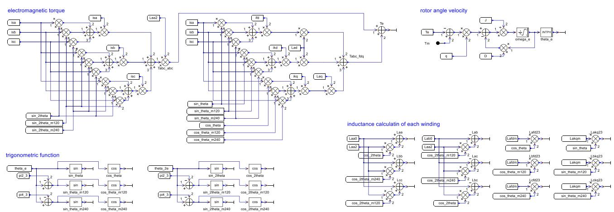  
Fig. 6. Proposed synchronous machine model implemented on XTAP.

# 3. Validation

In this section, a phase-domain synchronous machine model proposed in the previous section is verified by comparing its behavior with that of a synchronous machine model available in other EMT analysis programs. Fig. 7 shows a single-wire diagram of the test circuit used for the verification. In this circuit, with the synchronous machine in steadystate operation, switch $\mathsf { S W } _ { 3 }$ is turned on at time 0.5 s to simulate a threephase to ground fault. Then, at 0.57 s, the circuit breakers $\mathrm { C B _ { 1 } }$ and $\mathrm { C B _ { 2 } }$ at both ends of the transmission line are opened to eliminate the fault. The dynamic characteristics of the synchronous machine caused by the disturbances are simulated.

The synchronous machine is assumed to have a sinusoidal magnetomotive force distribution, with one damper winding on each of the daxis and q-axis. The field voltage and mechanical torque to the synchronous machine are assumed to be constant at steady-state operation. The constants of the synchronous machine are shown in Fig. 7.

For comparison with the proposed model, calculations are also performed for the machine model available in EMTP-RV under similar conditions. XTAP Ver. 3.30 is used for the calculations of the proposed model and EMTPWorks 4.2.0 is used for the calculations of the EMTP-RV model. The time step is set to 100 μs.

Calculations were also performed using the Universal Machine (UM) model [21] based on the compensation method as reference data. Calculations for the UM model was performed using EMTP-DCG Ver. 1.2.1, and the same data as for EMTP-RV are input using the Type-59 format. Since the data are used for reference purposes, the time step was set to 10 μs.

Fig. 8 shows the simulation results for 0–5 s for the electromagnetic torque $T _ { \mathrm { e } , }$ angular velocity deviation $s _ { \mathrm { g } } ,$ phase a terminal voltage $\nu _ { \mathrm { s a } } ,$ and phase a armature winding current $i _ { \mathrm { s a } }$ of the synchronous machine. Fig. 9 also shows an enlarged view of the period during which the fault occurs for $T _ { \mathrm { e } }$ and $i _ { \mathrm { s a } } .$ It is clear from these figures that the results of all the models are in good agreement at the waveform level (the waveforms overlap, making it difficult to discern differences). The EMTP-RV and UM models differ from the proposed model not only in model construction and calculation methods but also in the algorithms (e.g., circuit equation formulation methods and numerical integration methods) of EMT programs that perform the calculations. Therefore, some differences were expected, but it is interesting to note that the results are in good agreement.

The proposed model is characterized by the fact that it does not require implementation in the source code nor iterative calculations of angular velocity. Thus, as the time step is increased, its difference from the EMTP-RV model with iterative computation is expected to widen (i. e., the error of the proposed model becomes larger). However, in EMT analysis of power systems including synchronous machines, the time step is often set to around 100 μs or less for the accurate computation of voltage and current waveforms. Therefore, errors due to the lack of iterative calculations are unlikely to be a problem in many realistic simulation cases. However, if a case arises in which more accurate calculation results are required, the iterative calculation of angular velocity may be necessary. This is a future issue for the proposed model.

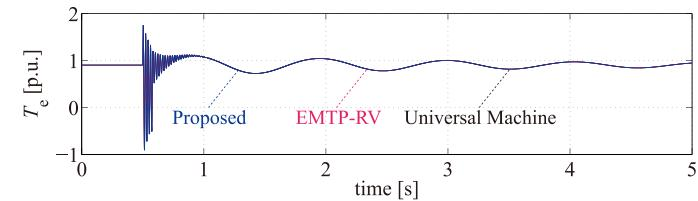

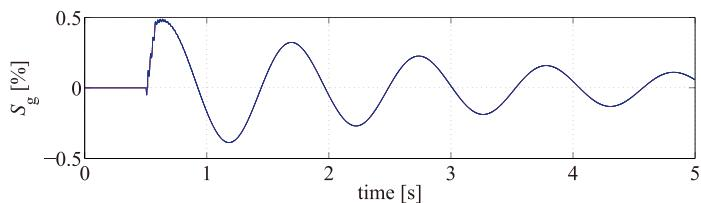

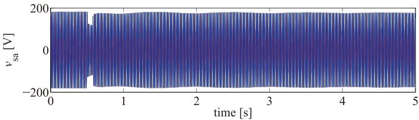

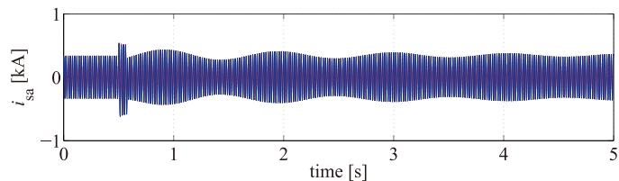  
Fig. 8. Simulation results for each synchronous machine model.

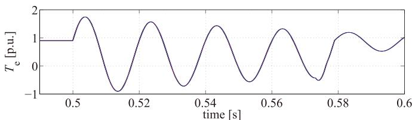

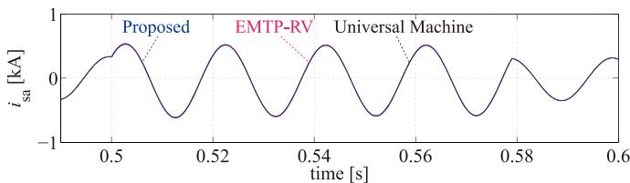  
Fig. 9. Enlarged view of the duration of the fault.

# 4. Conclusions

A phase-domain synchronous machine model that can be built on an electromagnetic transient analysis program, such as XTAP, which can use dependent sources, is proposed in this paper. The proposed model

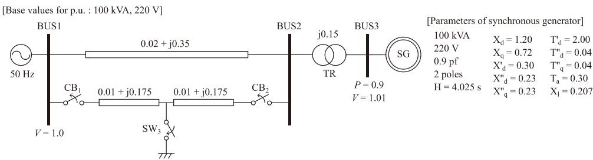  
Fig. 7. Test circuit for validation of synchronous machine models.

treats the relationship between the winding currents and the inductance matrix composed of the armature windings, a field winding, and damper windings of a synchronous machine as magnetic circuits. It also represents the relationship of the flux linkages in each winding by combining circuit elements. Therefore, the proposed model can be flexibly constructed and improved by users. The proposed model was implemented on XTAP and validated through simulation in an infinite-bus system by comparing it with conventional synchronous machine models. As a result, it is shown that the calculation accuracy of the proposed model is equivalent to that of the Universal Machine model based on the compensation method, which is superior in calculation accuracy. It was also confirmed that the accuracy was equivalent to that of the synchronous machine model of EMTP-RV, one of the leading electromagnetic transient analysis programs.

# 5. Further work

This paper provides only a basic validation of the proposed model. In the future, functions such as magnetic saturation and iterative improvement of angular velocity to the proposed model will be added. In addition, spatial harmonics affected by the magnetomotive force distribution and internal faults will also be calculated.

# CRediT authorship contribution statement

R. Yonezawa: Conceptualization, Methodology, Software, Validation, Investigation, Resources, Writing – original draft, Writing – review & editing.

# Declaration of Competing Interest

The authors declare that they have no known competing financial interests or personal relationships that could have appeared to influence the work reported in this paper.

# Data availability

The authors do not have permission to share data.

# References

[1] Paul Krause, Oleg Wasynczuk, Scott Sudhoff, Steven Pekarek, Analysis of Electric Machinery and Drive Systems, 3rd edition, IEEE Press, Picattaway, NJ, 2012.

[2] R.H. Park, Two-reaction theory of synchronous machines -Generalized method of analysis-part I, AIEE Trans. 48 (1929) 716–727. July.   
[3] A.I. Megahed, O.P. Malikl, Simulation of internal faults in synchronous generators, IEEE Trans. Energy Convers. 14 (4) (1999) 1306–1311. Dec.   
[4] L. Wang, J. Jatskevich, H.W. Dommel, Re-examination of synchronous machine modeling techniques for electromagnetic transient simulations, IEEE Trans. Power Syst. 22 (3) (2007) 1221–1230. Aug.   
[5] J.R. Marti, K.W. Louie, A phase-domain synchronous generator model including saturation effects, IEEE Trans. Power Syst. 12 (1) (1997) 222–229. Feb.   
[6] X. Cao, A. Kurita, H. Mitsuma, Y. Tada, H. Okamoto, Improvements of numerical stability of electromagnetic transient simulation by use of phase-domain synchronous machine models, Electr. Eng. Japan 128 (3) (1999) 53–62. Apr.   
[7] H.W. Dommel, Electromagnetic Transients Program Reference Manual (EMTP Theory Book), Portland, OR, U.S.A., BPA, 1986.   
[8] J. Mahseredjian, S. Denneti`ere, L. Dub´e, B. Khodabakhchian, L. G´erin-Lajoie, On a new approach for the simulation of transients in power systems, Electr. Power Syst. Res. 77 (11) (2007) 1514–1520. Sep.   
[9] Canadian/American EMTP User Group, ATP Rule Book, Portland, OR, U.S.A., 1995.   
[10] Manitoba HVDC Research Centre, User’s guide on the use of PSCAD, Winnipeg, MB, Canada, 2004.   
[11] T. Noda, T. Takenaka, T. Inoue, Numerical integration by the 2-stage diagonally implicit Runge–Kutta method for electromagnetic transient simulations, IEEE Trans. Power Deliv. 24 (1) (2009) 390–399. Jan.   
[12] A.M. El-serafi, M.A. Badr, Extension of the under-excited stable region of the dualexcited synchronous machine, IEEE Trans. Power Appar. Syst. PAS-92 (1) (1973).   
[13] S. Jazebi, S.E. Zirka, M. Lambert, A. Rezaei-Zare, N. Chiesa, Y. Moroz, X. Chen, M. Martinez-Duro, C.M. Arturi, E.P. Dick, A. Narang, R.A. Walling, J. Mahseredjian, J.A. Artinez, F. de Leon, ´ Duality derived transformer models for low-frequency electromagnetic transients—part I: topological models, IEEE Trans. Power Deliv. 31 (5) (2016).   
[14] R. Yonezawa, T. Noda, Comparison of geometry-based transformer iron-core Conference on Power Systems Transients (IPST) 2015, 2015. Cavtat, Croatia, June.   
[15] M. Lambert, J. Mahseredjian, M. Martinez-Duro, F. Sirois, Magnetic circuits within electric circuits: critical review of existing methods and new mutator implementations, IEEE Trans. Power Deliv. 30 (6) (2015) 2427–2434.   
[16] U. Karaagac, H. Gras, J. Mahseredjian, A. El-Akoum, X. Legrand, Synchronous machine exciter circuit model in a simultaneous field winding interface, in: Proc. 2013 IEEE Power & Energy Society General Meeting (PES GM), 2013. July.   
[17] C.-.W. Ho, A.E. Ruehli, P.A. Brennan, The modified nodal approach to network analysis, IEEE Trans. Circuit Syst. CAS-22 (6) (1975).   
[18] G.D. Hachtel, R.K. Brayton, F.G. Gustavson, The sparse tableau approach to network analysis and design, IEEE Trans. Circuit Theory CT-18 (1) (1971) 101–113. Jan.   
[19] K. Takenaka, Development of highly accurate methods to analyze power system dynamic stability, in: CRIEPI Komae Research Report No. T63, 2000. Dec.(in Japanese).   
[20] O. Sakamoto, K. Ishii, A new VBR modeling of squirrel-cage induction machine for power system analysis with XTAP, in: Proc. 2014 5thIEEE PES Innovative Smart Grid Technologies Europe (ISGT Europe), 2014. Istanbul, TurkeyOct.   
[21] H.K. Lauw, W.S. Meyer, Universal machine modeling for the representation of rotating electric machinery in an electromagnetic transients program, IEEE Trans. Power Appar. Syst. PAS-101 (6) (1982) 1342–1351. June.