# Hybrid Average Modeling of Three-Phase Dual Active Bridge Converters for Stability Analysis

Maxime Berger, Student Member, IEEE, Ilhan Kocar, Senior Member, IEEE, Handy Fortin-Blanchette, Member, IEEE, and Carl Lavertu, Member, IEEE

Abstract— The three-phase dual active bridge (3p-DAB) converter is widely addressed in emerging power systems applications such as solid-state transformer (SST), and dc microgrids. Its successful integration requires accurate modeling of its small-signal characteristics. Due to its dc-ac-dc structure, the DAB converter brings many challenges in small-signal modeling. The state-space averaging (SSA) has been the first proposed methodology to approximate the control-to-output, and line-to-output transfer functions of the 3p-DAB. However, as shown in this paper, SSA is not precise for the stability analysis of 3p-DAB converters. A generalized state-space averaging (GSSA) model based on the dynamic phasor concept is developed in this paper for the Y-∆ 3p-DAB. A hybrid SSA and GSSA model representation is then proposed for the evaluation of all the converter transfer functions. The developed models are validated with detailed time-domain switch-level simulations in an electromagnetic transient type (EMT-type) program. They are also used for the accelerated stability prediction in an EMT-type program.

Index Terms— Distributed resources, bidirectional converters, dc-dc conversion, dual active bridge, state-space averaging, generalized averaging, dynamic phasor, Electromagnetic Transients Program

# I. INTRODUCTION

ual active bridge (DAB) isolated bidirectional dc-dc converters are widely considered as the central element in D converters are widely considered as the central element in current and next-generation high-frequency-link power conversion systems [1]. Due to their high flexibility, DAB converters are proposed to be employed in many recent conversion applications such as distributed resources interface [2], uninterruptible power supply (UPS) systems [3], automotive [4], railway transportation [5], solid-state transformers (SSTs) in distribution networks [6], airborne wind turbines [7], and flexible load emulators [8].

The DAB has been first proposed in [9] and [10]. The transformer voltage ratio is used to match the nominal voltage level between the two grids. Voltage control is performed by controlling the duty cycle of the primary and secondary bridges, and/or the phase-shift between the two bridges [11]. Both single-phase (1p-DAB) and three-phase (3p-DAB) topologies have been proposed in the literature. The 3p-DAB

converter provides many advantages over the 1p-DAB which is why it is favored in modern flexible dc-grids [9][10][12]. Due to its three-phase structure, the 3p-DAB (Fig. 1) also allows using different winding connections (Y-Y, Y-∆, and ∆-∆). It is demonstrated in [13] that the Y-∆ transformer offers better performance in terms of stress on switches, transformer utilization, and filter capacitor requirements.

The integration of power electronics in ac- and dc-grids brings new challenges in terms of power system control and stability [14]-[16]. For this reason, this paper focuses on the development of accurate models of the 3p-DAB converter for stability analysis in dc-grid applications. Small- and largesignal analyses are widely used for stability assessment of power electronics-based systems [17]. Converter open-loop small-signal characteristics are generally defined by a set of standard transfer functions: the control-to-output transfer function $G _ { \mathrm { v d } } ( \mathrm { s } )$ , line-to-output transfer function $G _ { \mathrm { v g } } ( \mathrm { s } )$ , driving point $Z _ { \mathrm { D } } ( \mathrm { s } )$ and null driving point $Z _ { \mathrm { { N } } } ( \mathrm { { s } ) }$ input impedances, and output impedance $Z _ { \mathrm { o } } ( \mathrm { s } )$ . For the stability analysis of multiple converters interacting with other network components, it is also required to determine the closed loop small-signal characteristics of the converter such as the loop gain T(s), and closed-loop input and output impedances [18].

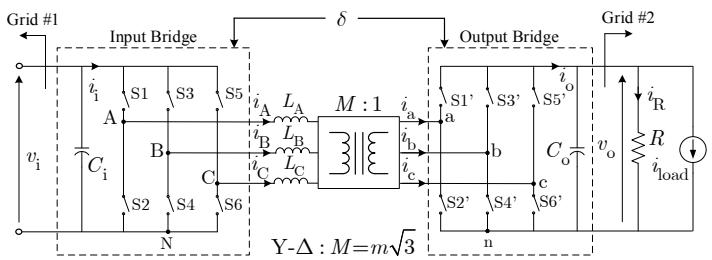

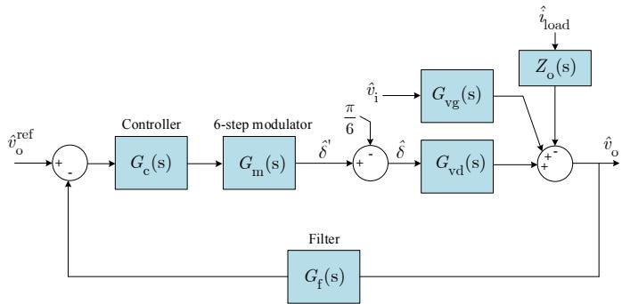  
(b)   
Fig. 1. Three-phase dual-active-bridge (3p-DAB) (a) General architecture (b) Output voltage regulation small-signal block diagram (forward operation)

Detailed switch-level simulation in time-domain tools is a recognized methodology to extract small-signal characteristics of power electronics converters [17]. However, it does not provide analytical expressions for the prediction of converter behavior. The prediction of instability conditions can also require extensive simulations.

The most commonly used technique to derive the analytical small-signal model of dc-dc converters is the state-space averaging (SSA) method [19][20]. It is based on two main assumptions: 1) the ac variations are small, and 2) the control cross-over frequency $f _ { \Phi \mathrm { m } }$ is much smaller than the switching frequency $f _ { \mathrm { s } } .$ It leads to a dc-averaged model of the converter.

Due to the high-frequency ac-link in DAB converter, SSA has limitations in deriving an accurate small-signal model [21][22]. SSA has been first applied to approximate the control-to-output $G _ { \mathrm { v d } } ( \mathrm { s } )$ , and line-to-output $G _ { \mathrm { v g } } ( \mathrm { s } )$ transfer functions of the Y-Y 3p-DAB [23]. There is currently no resource in the literature to evaluate the driving point $Z _ { \mathrm { D } } ( \mathrm { s } )$ and the null driving point $Z _ { \mathrm { { N } } } ( \mathrm { { s } ) }$ input impedances for the 3p-DAB converter with SSA. These two transfer functions are necessary for the application of Middlebrook’s extra element theorem for the stability prediction of dc-dc converters [24].

To overcome the limitations of SSA for the DAB converter, generalized state-space averaging (GSSA) models [25] have been developed in [22], [26] and [27]. These models are not extended to the derivation of the converter input and output impedances. The derivation of the open-loop null driving point input impedance $Z _ { \mathrm { N } } ( \mathrm { s } )$ is particularly challenging for the DAB converter modeled with GSSA. The methodology presented in [21] is the first attempt to derive both $Z _ { \mathrm { D } } ( \mathrm { s } )$ and $Z _ { \mathrm { { N } } } ( \mathrm { { s } ) }$ for a 1p-DAB converter modeled with GSSA. The methodology used, requires determining the closed-loop input impedance with a dummy controller $G _ { \mathrm { c } } ( \mathrm { s } )$ before extracting $Z _ { \mathrm { { N } } } ( \mathrm { { s } ) }$ by analytically removing the controller from the set of equations. The application of this methodology to 3p-DAB converters modeled with GSSA is neither shown nor trivial.

In this paper, complete SSA and GSSA small-signal models are derived for the calculation of all the transfer functions of Y-∆ 3p-DAB converter (Fig. 1). Both models are then compared and validated with detailed switched-level simulations in the Electromagnetic Transient Program (EMTP) [28]. The paper contributes to the identification of limitations of SSA in the modeling of 3p-DAB converters especially for the determination of $Z _ { \mathrm { D } } ( \mathrm { s } )$ and $Z _ { \mathrm { { N } } } ( \mathrm { { s } ) }$ . While GSSA is used to evaluate $Z _ { \mathrm { D } } ( \mathrm { s } )$ , a hybrid SSA and GSSA multi-input multi-output (MIMO) model is proposed to evaluate $Z _ { \mathrm { { N } } } ( \mathrm { { s } ) }$ . As an example of stability assessment, the developed models are finally used to predict the impact of an additional input filter on the closed-loop stability of the 3p-DAB converter in dc-dc conversion applications.

# II. 3P-DAB SMALL-SIGNAL MODEL

The 3p-DAB converter under study is operated using single phase-shift (SPS) control with a fixed switching frequency of $\omega = 2 \pi f _ { \mathrm { s } }$ and a $1 8 0 ^ { \circ }$ (or 6-step) modulation method. SPS is

the most commonly used control method for the 3p-DAB. The phase-shift d between the two bridges is defined as in [13], and is used to regulate the output voltage $v _ { \mathrm { o } } .$

For the sake of simplicity and due to space constraints, only unidirectional forward operation $( 0 ^ { \circ } \leq \delta \leq 9 0 ^ { \circ } )$ is considered in this paper. A similar procedure can be applied for reverse operation $( - 9 0 ^ { \circ } \leq \delta \leq 0 ^ { \circ } )$ . In forward operation, active power is transferred from the input bridge to the output bridge. The open-loop transfer functions are defined as,

$$
G _ {\mathrm {v d}} (s) = \left. \frac {\hat {v} _ {\mathrm {o}} (s)}{\hat {\delta} (s)} \right| _ {\hat {v} _ {\mathrm {i}} (s) = 0} \tag {1}
$$

$$
G _ {\mathrm {v g}} (s) = \left. \frac {\hat {v} _ {\mathrm {o}} (s)}{\hat {v} _ {\mathrm {i}} (s)} \right| _ {\hat {\delta} (s) = 0} \tag {2}
$$

$$
Z _ {\mathrm {i n}} (s) = Z _ {\mathrm {D}} (s) = \left. \frac {\hat {v} _ {\mathrm {i}} (s)}{\hat {i} _ {\mathrm {i}} (s)} \right| _ {\hat {\delta} (s) = 0} \tag {3}
$$

$$
Z _ {\mathrm {N}} (s) = \left. \frac {\hat {v} _ {\mathrm {i}} (s)}{\hat {i} _ {\mathrm {i}} (s)} \right| _ {\hat {v} _ {\mathrm {o}} (s) = 0} \tag {4}
$$

$$
Z _ {\mathrm {o}} (s) = - \frac {\hat {v} _ {\mathrm {o}} (s)}{\hat {i} _ {\text {l o a d}} (s)} \bigg | _ {\hat {v} _ {\mathrm {i}} (s) = 0, \hat {\delta} (s) = 0} \tag {5}
$$

where d is the control phase-shift, $v _ { \mathrm { o } }$ is the output voltage, vi is the input voltage, ii the input current, and $i _ { \mathrm { l o a d } }$ is a perturbation in the load current as defined in Fig. 1.

Note here that, for the general case of the time-domain variable $x ( t )$ , its small-signal frequency-domain notation is ${ \hat { x } } ( s )$ . Small-letters are used for time- and frequency-domain variables. Capital letters will be used in the next sections for steady-state values.

# III. STATE-SPACE AVERAGING (SSA)

# A. General Procedure

The general procedure to derive the 3p-DAB converter small-signal model using SSA has been presented in [23] to derive $G _ { \mathrm { v d } } ( \mathrm { s } )$ , and $G _ { \mathrm { v g } } ( \mathrm { s } )$ . It assumes that the transformer current is changing much faster than the dc voltage in addition to the assumption of balanced operation. In this section, this approach is extended to derive $G _ { \mathrm { v d } } ( \mathrm { s } ) , G _ { \mathrm { v g } } ( \mathrm { s } ) , Z _ { \mathrm { D } } ( \mathrm { s } ) , Z _ { \mathrm { N } } ( \mathrm { s } )$ , and $Z _ { \mathrm { o } } ( \mathrm { s } )$ for the Y-∆ 3p-DAB converter.

The idea behind the SSA modeling technique for the 3p-DAB converter is to describe the converter behavior by a dcaveraged state-space model as follows,

$$
\frac {d}{d t} \hat {\mathbf {x}} (t) = \hat {\mathbf {A}} \hat {\mathbf {x}} (t) + \hat {\mathbf {B}} \hat {\mathbf {u}} (t) \tag {6}
$$

$$
\hat {\mathbf {y}} (t) = \hat {\mathbf {C}} \hat {\mathbf {x}} (t) + \hat {\mathbf {D}} \hat {\mathbf {u}} (t) \tag {7}
$$

where, to obtain all the desired transfer functions, it is proposed here to use more generalized set of vectors of state, inputs and outputs,

$$
\hat {\mathbf {x}} (t) = \hat {v} _ {\mathrm {o}} (t), \quad \hat {\mathbf {u}} (t) = \left[ \begin{array}{l} \hat {\delta} (t) \\ \hat {v} _ {\mathrm {i}} (t) \end{array} \right], \quad \hat {\mathbf {y}} (t) = \left[ \begin{array}{l} \hat {v} _ {\mathrm {o}} (t) \\ \hat {\dot {i}} _ {\mathrm {i}} (t) \end{array} \right] \tag {8}
$$

The objective is to determine the state-space matrices in (6) and (7). For the 3p-DAB, there are two sets of state-space matrices depending on the operating range defined by d. In both cases, the capacitor current equation is first given by,

$$
\mathrm {C} _ {\mathrm {o}} \frac {\mathrm {d} v _ {\mathrm {o}} (t)}{\mathrm {d} t} = i _ {\mathrm {o}} (t) - \frac {v _ {\mathrm {o}} (t)}{R} \tag {9}
$$

where the output current is a function of the three-phase secondary currents,

$$
i _ {\mathrm {o}} (t) = f \left(i _ {\mathrm {a}} (t), i _ {\mathrm {b}} (t), i _ {\mathrm {c}} (t)\right) \tag {10}
$$

By neglecting the input capacitor, which is instead considered as part of the input filter transfer function, the input current is written as a function of the primary currents,

$$
i _ {\mathrm {i}} (t) = f \left(i _ {\mathrm {A}} (t), i _ {\mathrm {B}} (t), i _ {\mathrm {C}} (t)\right) \tag {11}
$$

The three-phase currents are defined using the piecewiselinear model [13] and averaged as described in [23] and [29]. By linearizing around the operating point, and changing the model into a small-signal model with,

$$
\delta (t) = \delta + \hat {\delta} (t), v _ {i} (t) = V _ {i} + \hat {v} _ {i} (t) \tag {12}
$$

$$
v _ {\mathrm {o}} (t) = V _ {\mathrm {o}} + \hat {v} _ {\mathrm {o}} (t), i _ {\mathrm {i}} (t) = I _ {\mathrm {i}} + \hat {i} _ {\mathrm {i}} (t)
$$

it leads to the following state-matrices for $0 ^ { \circ } \le \delta \le 3 0 ^ { \circ }$ ,

$$
\hat {\mathbf {A}} = \frac {- 1}{R C _ {\mathrm {o}}}, \quad \hat {\mathbf {B}} = \left[ \begin{array}{c c} m V _ {\mathrm {i}} & m \delta \\ \omega L _ {\mathrm {s}} C _ {\mathrm {o}} & \omega L _ {\mathrm {s}} C _ {\mathrm {o}} \end{array} \right] \tag {13}
$$

$$
\hat {\mathbf {C}} = \left[ \begin{array}{c} 1 \\ \frac {m \delta}{\omega L _ {\mathrm {s}}} \end{array} \right], \quad \hat {\mathbf {D}} = \left[ \begin{array}{c c} 0 & 0 \\ \frac {m V _ {\mathrm {o}}}{\omega L _ {\mathrm {s}}} & 0 \end{array} \right]
$$

with $L _ { \mathrm { s } }$ being the total transformer series inductance $( L _ { \mathrm { s } } = L _ { \mathrm { A } }$ $= L _ { \mathrm { B } } = L _ { \mathrm { C } } )$ . Using a similar procedure, it can be demonstrated that the state-matrices for $3 0 ^ { \circ } < \delta \leq 9 0 ^ { \circ }$ are given by,

$$
\hat {\mathbf {A}} = \frac {- 1}{R C _ {\mathrm {o}}}
$$

$$
\hat {\mathbf {B}} = \frac {m}{\omega L _ {\mathrm {s}} C _ {\mathrm {o}}} \left[ V _ {\mathrm {i}} \left(\frac {3}{2} \left(1 - \frac {2 \delta}{\pi}\right)\right) \quad \frac {3}{2} \left(\delta - \frac {\delta^ {2}}{\pi}\right) - \frac {\pi}{2 4} \right] \tag {14}
$$

$$
\hat {\mathbf {C}} = \left[ \begin{array}{c} 1 \\ \frac {m}{\omega L _ {\mathrm {s}}} \left(\frac {3}{2} \left(\delta - \frac {\delta^ {2}}{\pi}\right) - \frac {\pi}{2 4}\right) \end{array} \right]
$$

$$
\hat {\mathbf {D}} = \left[ \begin{array}{c c} 0 & 0 \\ \frac {m V _ {\mathrm {o}}}{\omega L _ {\mathrm {s}}} \left(\frac {3}{2} \left(1 - \frac {2 \delta}{\pi}\right)\right) & 0 \end{array} \right]
$$

For each operating region, the operating point can be calculated using the developed equation in [13] for the Y-∆ 3p-DAB converter.

# B. Derivation of the Converter Transfer Functions

The SSA model allows to derive equivalent small-signal circuits for the 3p-DAB in an analogous way to simple topologies [18]. By transferring (6)-(8), (13), and (14) into the frequency-domain, two equivalent circuits are defined (Fig. 2). The equivalent circuits are then used to derive the converter transfer functions. For $0 ^ { \circ } \le \delta \le 3 0 ^ { \circ }$ , it gives,

$$
G _ {\mathrm {v d}} (s) = \left(\frac {m R V _ {\mathrm {i}}}{\omega L _ {\mathrm {s}}}\right) \frac {1}{s R C _ {\mathrm {o}} + 1} \tag {15}
$$

$$
G _ {\mathrm {v g}} (s) = \left(\frac {m R \delta}{\omega L _ {\mathrm {s}}}\right) \frac {1}{s R C _ {\mathrm {o}} + 1} \tag {16}
$$

$$
Z _ {\mathrm {D}} (s) = \left(\frac {\omega L _ {\mathrm {s}}}{m \delta}\right) ^ {2} \frac {s R C _ {\mathrm {o}} + 1}{R} \tag {17}
$$

$$
Z _ {\mathrm {N}} (s) = - \frac {\omega L _ {\mathrm {s}} V _ {\mathrm {i}}}{m V _ {\mathrm {o}} \delta} \tag {18}
$$

Note that, in this case, according to the SSA model, the perturbation $\hat { \delta } ( s )$ that need to be injected for the evaluation of $Z _ { \mathrm { N } } ( \mathrm { s } )$ can be calculated using the following relationship,

$$
G _ {\delta \mathrm {i}} (s) = \left. \frac {\hat {\delta} (s)}{\hat {v} _ {\mathrm {i}} (s)} \right| _ {\hat {v} _ {\mathrm {o}} (s) = 0} = - \frac {\delta}{V _ {\mathrm {i}}} \tag {19}
$$

For $3 0 ^ { \circ } < \delta \leq 9 0 ^ { \circ }$ , the following equations are obtained,

$$
G _ {\mathrm {v d}} (s) = \left(\frac {m R V _ {\mathrm {i}}}{\omega L _ {\mathrm {s}}} \left[ \frac {3}{2} \left(1 - \frac {2 \delta}{\pi}\right) \right]\right) \frac {1}{s R C _ {\mathrm {o}} + 1} \tag {20}
$$

$$
G _ {\mathrm {v g}} (s) = \left(\frac {m R}{\omega L _ {\mathrm {s}}} \left[ \frac {3}{2} \left(\delta - \frac {\delta^ {2}}{\pi}\right) - \frac {\pi}{2 4} \right]\right) \frac {1}{s R C _ {\mathrm {o}} + 1} \tag {21}
$$

$$
Z _ {\mathrm {D}} (s) = \frac {1}{\left(\frac {m}{\omega L _ {\mathrm {s}}} \left[ \frac {3}{2} \left(\delta - \frac {\delta^ {2}}{\pi}\right) - \frac {\pi}{2 4} \right]\right) ^ {2}} \left(\frac {s R C _ {\mathrm {o}} + 1}{R}\right) \tag {22}
$$

$$
Z _ {\mathrm {N}} (s) = - \frac {\omega L _ {\mathrm {s}} V _ {\mathrm {i}}}{m V _ {\mathrm {o}}} \frac {1}{\left[ \frac {3}{2} \left(\delta - \frac {\delta^ {2}}{\pi}\right) - \frac {\pi}{2 4} \right]} \tag {23}
$$

$$
G _ {\delta \mathrm {i}} (s) = \left. \frac {\hat {\delta} (s)}{\hat {v} _ {\mathrm {i}} (s)} \right| _ {\hat {v} _ {\mathrm {o}} (s) = 0} = - \frac {\frac {3}{2} \left(\delta - \frac {\delta^ {2}}{\pi}\right) - \frac {\pi}{2 4}}{\left[ \frac {3}{2} \left(1 - \frac {2 \delta}{\pi}\right) \right] V _ {\mathrm {i}}} \tag {24}
$$

For the output impedance it yields to,

$$
Z _ {\mathrm {o}} (s) = - \frac {R}{s R C _ {\mathrm {o}} + 1} \tag {25}
$$

which is valid for $0 ^ { \circ } \leq \delta \leq 9 0 ^ { \circ }$ .

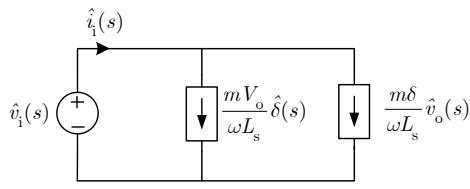

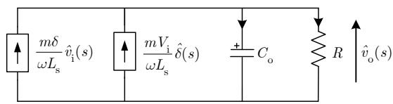  
(a)

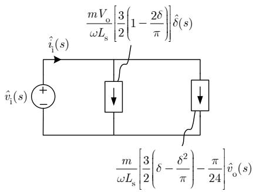

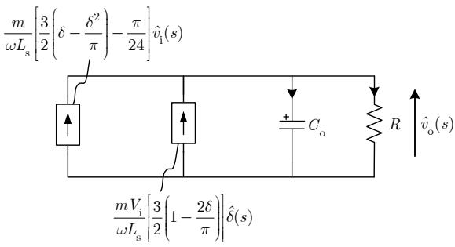  
  
Fig. 2. Equivalent SSA small-signal circuits of the Y-Δ 3p-DAB converter in forward mode (a) for $0 ^ { \circ } \le \delta \le 3 0 ^ { \circ } ,$ (b) for $3 0 ^ { \circ } < \delta \leq 9 0 ^ { \circ }$ . These equivalent circuits are used to determine $G _ { \mathrm { v d } } ( \mathrm { s } ) , G _ { \mathrm { v g } } ^ { \mathrm { { - } } } ( \mathrm { s } ) , Z _ { \mathrm { D } } ( \mathrm { s } ) , Z _ { \mathrm { N } } ( \mathrm { s } )$ and $\dot { Z _ { \mathrm { o } } } ( \mathrm { s } )$ .

# IV. GENERALIZED STATE-SPACE AVERAGING (GSSA)

# A. General Procedure and Assumptions

Generalized state-space averaging (GSSA) [25] based on the dynamic phasor theory is widely used for the small-signal analysis of power electronics converters. It is based on the concept of dynamic phasors which is also used for the analysis of power electronics converters, and electric machines in power systems [30]-[34]. The concept of GSSA is to expand the converter state-variables and its switching-functions using a $k ^ { \mathrm { t h } }$ coefficient Fourier series decomposition. The general procedure consists in 1) selecting the converter state-variables, 2) writing the converter differential equations using the statespace representation and the switching-functions, 3) deriving the index-kth state-space equations, and 4) averaging the switching-functions and the resulting equations using Fourier series properties [22][25].

The result is a k-dependent averaged small-signal model written as,

$$
\frac {d \left\langle \hat {\mathbf {x}} (t) \right\rangle}{d t} = \hat {\mathbf {A}} \left\langle \hat {\mathbf {x}} (t) \right\rangle + \hat {\mathbf {B}} \left\langle \hat {\mathbf {u}} (t) \right\rangle \tag {26}
$$

$$
\left\langle \hat {\mathbf {y}} (t) \right\rangle = \hat {\mathbf {C}} \left\langle \hat {\mathbf {x}} (t) \right\rangle + \hat {\mathbf {D}} \left\langle \hat {\mathbf {u}} (t) \right\rangle \tag {27}
$$

For the 3p-DAB, the output capacitor voltage $v _ { \mathrm { o } } ,$ and the transformer primary currents $( i _ { \mathrm { A } } , \ i _ { \mathrm { B } } ,$ and iC) are taken as statevariables. Unlike SSA which is valid for the balanced case, GSSA is generalized for the unbalanced case. The model includes $k = 0$ and $k = \pm 1$ terms. Since the three-phase structure leads to a ripple voltage at $k = 6$ , and the transformer current is purely ac, it is assumed that,

$$
v _ {\mathrm {i}} = \left\langle v _ {\mathrm {i}} \right\rangle_ {0}, v _ {\mathrm {o}} = \left\langle v _ {\mathrm {o}} \right\rangle_ {0}
$$

$$
\left\langle v _ {\mathrm {i}} \right\rangle_ {1} ^ {\mathrm {R}} = \left\langle v _ {\mathrm {i}} \right\rangle_ {1} ^ {\mathrm {I}} = \left\langle v _ {\mathrm {o}} \right\rangle_ {1} ^ {\mathrm {R}} = \left\langle v _ {\mathrm {o}} \right\rangle_ {1} ^ {\mathrm {I}} = 0 \tag {28}
$$

$$
\left\langle i _ {\mathrm {A}} \right\rangle_ {0} = \left\langle i _ {\mathrm {B}} \right\rangle_ {0} = \left\langle i _ {\mathrm {C}} \right\rangle_ {0} = 0
$$

This leads to the following averaged state-variable vector,

$$
\left\langle \hat {\mathbf {x}} \right\rangle = \left[ \left\langle \hat {v} _ {\mathrm {o}} \right\rangle_ {0} \left\langle \hat {i} _ {\mathrm {A}} \right\rangle_ {1} ^ {\mathrm {R}} \left\langle \hat {i} _ {\mathrm {A}} \right\rangle_ {1} ^ {\mathrm {I}} \left\langle \hat {i} _ {\mathrm {B}} \right\rangle_ {1} ^ {\mathrm {R}} \left\langle \hat {i} _ {\mathrm {B}} \right\rangle_ {1} ^ {\mathrm {I}} \left\langle \hat {i} _ {\mathrm {C}} \right\rangle_ {1} ^ {\mathrm {R}} \left\langle \hat {i} _ {\mathrm {C}} \right\rangle_ {1} ^ {\mathrm {I}} \right] ^ {T} \tag {29}
$$

The vectors of input and output are given by,

$$
\left\langle \hat {\mathbf {u}} \right\rangle = \left[ \begin{array}{l l} \hat {\delta} & \left\langle v _ {\mathrm {i}} \right\rangle_ {0} \end{array} \right] ^ {T}, \left\langle \hat {\mathbf {y}} \right\rangle = \left[ \begin{array}{l l} \left\langle \hat {v} _ {\mathrm {o}} \right\rangle_ {0} & \left\langle \hat {i} _ {\mathrm {i}} \right\rangle_ {0} \end{array} \right] ^ {T} \tag {30}
$$

The linearized GSSA small-signal model is defined by applying perturbations around the operating point,

$$
\left\langle v _ {\mathrm {o}} \right\rangle_ {0} = V _ {\mathrm {o}} + \left\langle \hat {v} _ {\mathrm {o}} \right\rangle_ {0}, \left\langle v _ {\mathrm {i}} \right\rangle_ {0} = V _ {\mathrm {i}} + \left\langle \hat {v} _ {\mathrm {i}} \right\rangle_ {0} \tag {31}
$$

$$
\left\langle i _ {\mathrm {x}} \right\rangle_ {1} ^ {\mathrm {R}} = \left\langle I _ {\mathrm {x}} \right\rangle_ {1} ^ {\mathrm {R}} + \left\langle \hat {i} _ {\mathrm {x}} \right\rangle_ {1} ^ {\mathrm {R}}, \left\langle i _ {\mathrm {x}} \right\rangle_ {1} ^ {\mathrm {I}} = \left\langle I _ {\mathrm {x}} \right\rangle_ {1} ^ {\mathrm {I}} + \left\langle \hat {i} _ {\mathrm {x}} \right\rangle_ {1} ^ {\mathrm {I}}
$$

with $\mathrm { x } = \mathrm { A }$ , B, or C being used to consider each of the three phases. The averaged state-space matrices are given by,

$$
\hat {\mathbf {A}} = \left[ \begin{array}{c c c c c c c} \frac {- 1}{R C _ {\mathrm {o}}} & A _ {1 2} & A _ {1 3} & A _ {1 4} & A _ {1 5} & A _ {1 6} & A _ {1 7} \\ A _ {2 1} & 0 & \omega & 0 & 0 & 0 & 0 \\ A _ {3 1} & - \omega & 0 & 0 & 0 & 0 & 0 \\ A _ {4 1} & 0 & 0 & 0 & \omega & 0 & 0 \\ A _ {5 1} & 0 & 0 & - \omega & 0 & 0 & 0 \\ A _ {6 1} & 0 & 0 & 0 & 0 & 0 & \omega \\ A _ {7 1} & 0 & 0 & 0 & 0 & - \omega & 0 \end{array} \right] \tag {32}
$$

$$
\hat {\mathbf {B}} = \left[ \begin{array}{c c c c c c c} B _ {1 1} & B _ {1 2} & B _ {1 3} & B _ {1 4} & B _ {1 5} & B _ {1 6} & B _ {1 7} \\ 0 & 0 & \frac {- 1}{\pi L _ {\mathrm {A}}} & \frac {- \sqrt {3}}{2 \pi L _ {\mathrm {B}}} & \frac {1}{2 \pi L _ {\mathrm {B}}} & \frac {\sqrt {3}}{2 \pi L _ {\mathrm {C}}} & \frac {1}{2 \pi L _ {\mathrm {C}}} \end{array} \right] ^ {T} \tag {33}
$$

$$
\hat {\mathbf {C}} = \left[ \begin{array}{c c c c c c c} 1 & 0 & 0 & 0 & 0 & 0 & 0 \\ 0 & 0 & - \frac {2}{\pi} & - \frac {\sqrt {3}}{\pi} & \frac {1}{\pi} & \frac {\sqrt {3}}{\pi} & \frac {1}{\pi} \end{array} \right] \tag {34}
$$

$$
\hat {\mathbf {D}} = \left[ \begin{array}{l l} 0 & 0 \\ 0 & 0 \end{array} \right] \tag {35}
$$

with,

$$
A _ {1 2} = \frac {2}{C _ {\mathrm {o}}} S _ {1}, A _ {1 3} = \frac {2}{C _ {\mathrm {o}}} S _ {2}, A _ {1 4} = \frac {2}{C _ {\mathrm {o}}} S _ {3} \tag {36}
$$

$$
A _ {1 5} = \frac {2}{C _ {\mathrm {o}}} S _ {4}, A _ {1 6} = \frac {2}{C _ {\mathrm {o}}} S _ {5}, A _ {1 7} = \frac {2}{C _ {\mathrm {o}}} S _ {6}
$$

$$
A _ {2 1} = - \frac {1}{L _ {\mathrm {A}}} S _ {1}, A _ {3 1} = - \frac {1}{L _ {\mathrm {A}}} S _ {2}, A _ {4 1} = - \frac {1}{L _ {\mathrm {B}}} S _ {3} \tag {37}
$$

$$
A _ {5 1} = - \frac {1}{L _ {\mathrm {B}}} S _ {4}, A _ {6 1} = - \frac {1}{L _ {\mathrm {C}}} S _ {5}, A _ {7 1} = - \frac {1}{L _ {\mathrm {C}}} S _ {6}
$$

$$
B _ {1 2} = - \frac {V _ {\mathrm {o}}}{L _ {\mathrm {A}}} S _ {2}, B _ {1 3} = \frac {V _ {\mathrm {o}}}{L _ {\mathrm {A}}} S _ {1}, B _ {1 4} = - \frac {V _ {\mathrm {o}}}{L _ {\mathrm {B}}} S _ {4} \tag {38}
$$

$$
B _ {1 5} = \frac {V _ {\mathrm {o}}}{L _ {\mathrm {B}}} S _ {3}, B _ {1 6} = - \frac {V _ {\mathrm {o}}}{L _ {\mathrm {C}}} S _ {6}, B _ {1 7} = \frac {V _ {\mathrm {o}}}{L _ {\mathrm {C}}} S _ {5}
$$

$$
B _ {1 1} = \frac {2}{C _ {\mathrm {o}}} \sum_ {n = 1} ^ {6} B _ {1 1} (n) \tag {39}
$$

where the $B _ { 1 1 } \left( n \right)$ terms are defined by,

$$
B _ {1 1} (1) = S _ {2} \left\langle I _ {\mathrm {A}} \right\rangle_ {1} ^ {\mathrm {R}}, B _ {1 1} (2) = - S _ {1} \left\langle I _ {\mathrm {A}} \right\rangle_ {1} ^ {\mathrm {I}},
$$

$$
B _ {1 1} (3) = S _ {4} \left\langle I _ {\mathrm {B}} \right\rangle_ {1} ^ {\mathrm {R}}, B _ {1 1} (4) = - S _ {3} \left\langle I _ {\mathrm {B}} \right\rangle_ {1} ^ {\mathrm {I}} \tag {40}
$$

$$
B _ {1 1} (5) = S _ {6} \left\langle I _ {\mathrm {C}} \right\rangle_ {1} ^ {\mathrm {R}}, B _ {1 1} (6) = - S _ {5} \left\langle I _ {\mathrm {C}} \right\rangle_ {1} ^ {\mathrm {I}}
$$

and $S _ { 1 }$ to $S _ { 6 }$ are defined by,

$$
S _ {1} = \frac {m}{\pi} \bigg [ \sin \bigg (\frac {7 \pi}{6} + \delta \bigg) - \sin \bigg (\frac {1 1 \pi}{6} + \delta \bigg) \bigg ]
$$

$$
S _ {2} = \frac {m}{\pi} \bigg [ \cos \bigg (\frac {7 \pi}{6} + \delta \bigg) - \cos \bigg (\frac {1 1 \pi}{6} + \delta \bigg) \bigg ]
$$

$$
S _ {3} = \frac {m}{\pi} \left[ \sin \left(\frac {1 1 \pi}{6} + \delta\right) - \sin \left(\frac {\pi}{2} + \delta\right) \right] \tag {41}
$$

$$
S _ {4} = \frac {m}{\pi} \left[ \cos \left(\frac {1 1 \pi}{6} + \delta\right) - \cos \left(\frac {\pi}{2} + \delta\right) \right]
$$

$$
S _ {5} = \frac {m}{\pi} \left[ \sin \left(\frac {\pi}{2} + \delta\right) - \sin \left(\frac {7 \pi}{6} + \delta\right) \right]
$$

$$
S _ {6} = \frac {m}{\pi} \left[ \cos \left(\frac {\pi}{2} + \delta\right) - \cos \left(\frac {7 \pi}{6} + \delta\right) \right]
$$

# B. Hybrid MIMO system and transfer functions evaluation

The system of equations defined by the GSSA model (i.e. (26), (27), and (32)-(41)) is combined with the SSA model (i.e. (19) and (24)) such that the system is represented as a coupled multi-input multi-output (MIMO) system (Fig. 3). This representation is called “hybrid” because it combines both SSA and GSSA models. For the evaluation of the transfer function $Z _ { \mathrm { { N } } } ( \mathrm { { s } ) }$ , the SSA model is used to approximate the required perturbation ( )ˆd s to be injected in the GSSA model.

The general procedure to obtain all the transfer functions is decomposed into four (4) steps:

$$
\left[ \begin{array}{l} {\left\langle \hat {v} _ {\mathrm {o}} (s) \right\rangle_ {0}} \\ {\left\langle \hat {i} _ {\mathrm {i}} (s) \right\rangle_ {0}} \end{array} \right] = \left[ \begin{array}{c c} G _ {\mathrm {v d}} (s) & G _ {\mathrm {v g}} (s) \\ G _ {2 1} (s) & 1 / Z _ {\mathrm {D}} (s) \end{array} \right] \left[ \begin{array}{c} \hat {\delta} (s) \\ {\left\langle \hat {v} _ {\mathrm {i}} (s) \right\rangle_ {0}} \end{array} \right] \tag {42}
$$

1) The GSSA model (i.e. (26), (27), and (32)-(41)) is solved using MATLAB to obtain the transfer functions defined in (42), i.e. $G _ { \mathrm { v d } } ( \mathrm { s } ) , G _ { \mathrm { v g } } ( \mathrm { s } ) , G _ { \mathrm { 1 2 } } ( \mathrm { s } )$ , and $Z _ { \mathrm { D } } ( \mathrm { s } )$ .   
2) The SSA model is solved to obtain the transfer functions defined by (19) or (24), depending on the steady-state value of the phase-shift d.   
3) Knowing all the transfer functions in Fig. 3, the MIMO system is implemented in MATLAB/Simulink. The GSSA part is implemented as in (42).   
4) The transfer function $Z _ { \mathrm { { N } } } ( \mathrm { { s } ) }$ is evaluated by solving the complete hybrid system of Fig. 3 using the Linear Analysis tool of MATLAB/Simulink.

# V. EMTP VALIDATION OF THE SSA AND GSSA MODELS

# A. General Procedure

Both SSA and GSSA models are validated with detailed switched-level time-domain simulations in EMTP. The main simulation parameters are provided in TABLE I. The magnitudes of the output signals $\hat { v } _ { \mathrm { o } }$ and $\hat { i } _ { \mathrm { i } }$ at the perturbation frequencies are extracted by FFT analysis. The amplitude of the perturbations is kept small around the operating point (< 5%). The perturbations frequency is varied between 50 Hz to 48 kHz, with a switching frequency fs = 50 kHz. The simulation time-step is fixed to 0.01 μs for increased accuracy of the simulation results. The results of the magnitude validation of the open-loop transfer functions are shown in Fig. 4 to Fig. 8.

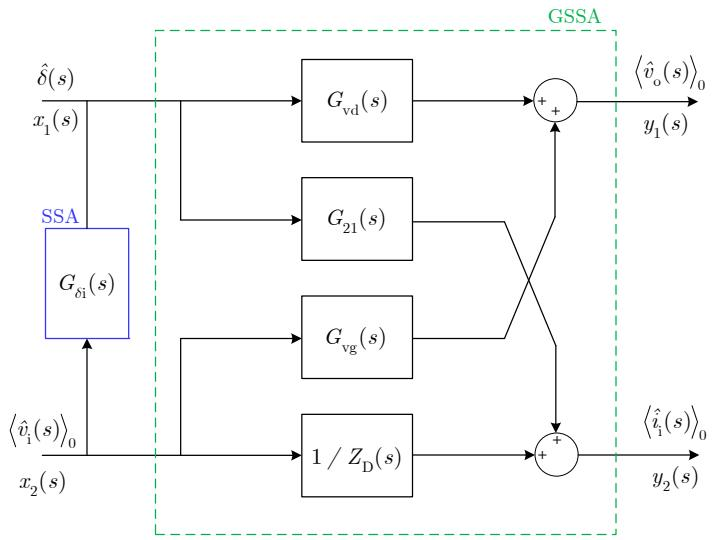  
Fig. 3. Hybrid MIMO small-signal model representation of the 3p-DAB converter in forward mode $( 0 ^ { \circ } \leq { \overline { { \delta } } } \leq 9 0 ^ { \circ } )$ . The SSA model is coupled to the GSSA model for the determination of $Z _ { \mathrm { N } } ( \mathrm { s } )$ . For the evaluation of $G _ { \mathrm { v d } } ( \mathrm { s } ) _ { \mathrm { : } }$ , $G _ { \mathrm { v g } } ( \mathrm { s } )$ , and $Z _ { \mathrm { D } } ( \mathrm { s } )$ only the GSSA model is solved.

TABLE I MAIN SIMULATION PARAMETERS   

<table><tr><td>Description</td><td>Symbol</td><td>Value</td></tr><tr><td>Input Voltage</td><td>\(V_{i}\)</td><td>600 V</td></tr><tr><td>Output Voltage</td><td>\(V_{o}\)</td><td>37.5V</td></tr><tr><td rowspan="3">Load Resistance</td><td rowspan="3">R</td><td>10.2 Ω</td></tr><tr><td>1.4 Ω</td></tr><tr><td>0.9 Ω</td></tr><tr><td rowspan="3">Phase-shift</td><td rowspan="3">δ</td><td>5.00°</td></tr><tr><td>36.75°</td></tr><tr><td>76.00°</td></tr><tr><td>Output Capacitor</td><td>\(C_{o}\)</td><td>150 μF</td></tr><tr><td>Transformer Leakage Inductance</td><td>\(L_{s}\)</td><td>420 μH</td></tr><tr><td>Transformer Global Ratio</td><td>M:1</td><td>16 : 1</td></tr><tr><td>Switching Frequency</td><td>\(f_{s}\)</td><td>50 kHz</td></tr></table>

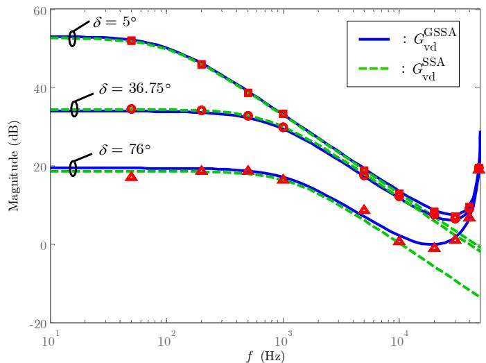

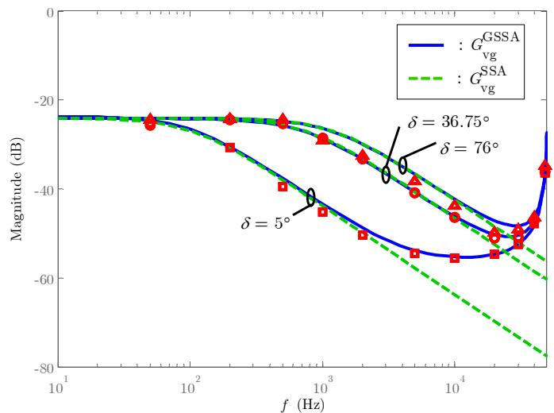  
Fig. 4. Validation by simulation of the control-to-output transfer function $G _ { \mathrm { v d } } ^ { - } ( \mathrm { s } )$ . The maximum error between the simulation results and the GSSA model is 2.4 dB a $f = 5 0 \mathrm { H z } ,$ and $\delta = 7 6 ^ { \circ }$ .   
Fig. 5. Validation by simulation of the input-to-output transfer function $G _ { \mathrm { v g } } ( \mathrm { s } )$ . The maximum error between the simulation results and the GSSA model is 2.8 dB a $f { = } 2 0 \mathrm { k H z } ,$ and $\delta = 7 6 ^ { \circ }$ .

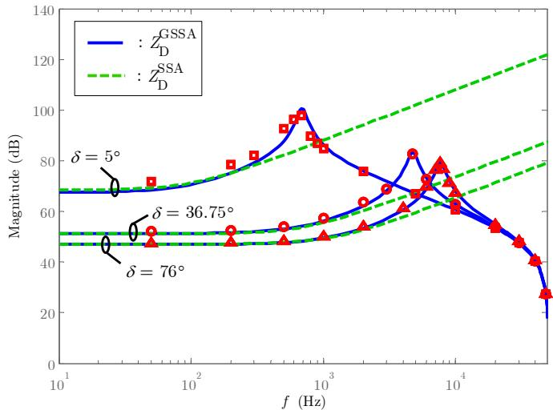  
Fig. 6. Validation by simulation of the driving point input impedance $Z _ { \mathrm { D } } ( \mathrm { s } ) .$ The maximum error between the simulation results and the GSSA model is 5.0 dB at $f = 5 0 0 ~ \mathrm { H z } ,$ and $\delta = 5 ^ { \circ } .$ . As d increases, the magnitude of $Z _ { \mathrm { D } } ( \mathrm { s } )$ decreases at low frequency.

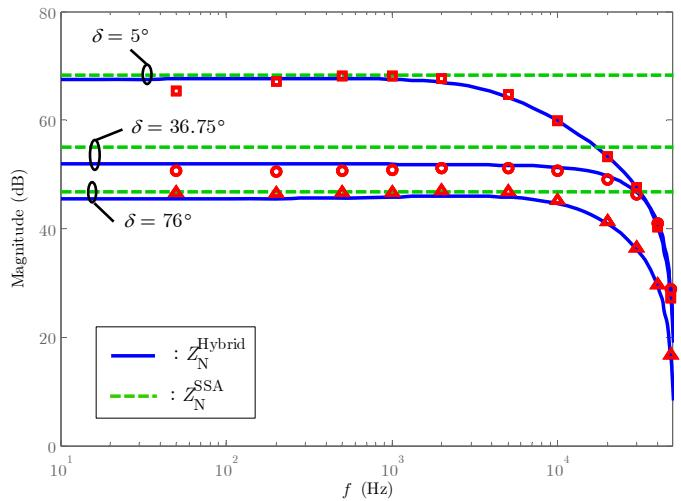  
Fig. 7. Validation by simulation of the null driving point input impedance $Z _ { \mathrm { N } } ( \mathrm { s } )$ . The maximum error between the simulation results and the hybrid model is 2.2 dB at $f = 5 0 \ \mathrm { H z } ,$ and $\delta = 5 ^ { \circ }$ . The magnitude of $Z _ { \mathrm { N } } ( \mathrm { s } )$ decreases as d increases.

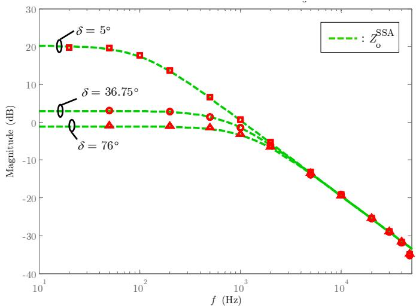  
Fig. 8. Validation by simulation of the output impedance $Z _ { \mathrm { o } } ( \mathrm { s } )$ . The maximum error between the simulation results and the SSA model is 2.2 dB at $f = 4 8 \mathrm { k H z } ,$ and $\delta = 3 6 . 7 5 ^ { \circ }$ .

# B. Comparison of SSA and GSSA

From Fig. 4 and Fig. 5, it is first observed that both GSSA and SSA models are accurate to evaluate $G _ { \mathrm { v d } } ( \mathrm { s } )$ , and $G _ { \mathrm { v g } } ( \mathrm { s } )$ for the frequencies up to $1 / 5 ^ { \mathrm { t h } }$ of the switching frequency fs. The precision of the SSA model decreases as the frequency of the perturbation is increased toward $f _ { \mathrm { s } } .$ As a side note, it has also been observed that GSSA is more accurate than SSA to evaluate $G _ { \mathrm { v d } } ( \mathrm { s } )$ , and $G _ { \mathrm { v g } } ( \mathrm { s } )$ when $f _ { \mathrm { s } }$ is varied. This is important for controller design and stability analysis with variable switching frequency converter [35].

By analyzing Fig. 6 and Fig. 7, one concludes that SSA model does not represent correctly the dynamics of $Z _ { \mathrm { D } } ( \mathrm { s } )$ , and $Z _ { \mathrm { { N } } } ( \mathrm { { s } ) }$ . Conversely, the hybrid model provides a mean to evaluate $Z _ { \mathrm { N } } ( \mathrm { s } )$ which is not possible using GSSA only.

Overall, from the simulation results (Fig. 4 to Fig. 7), it is also concluded that GSSA and hybrid models are fairly accurate to determine $G _ { \mathrm { v d } } ( \mathrm { s } ) , G _ { \mathrm { v g } } ( \mathrm { s } ) , Z _ { \mathrm { N } } ( \mathrm { s } )$ , and $Z _ { \mathrm { D } } ( \mathrm { s } )$ over the validated frequency range (50 Hz to 48 kHz). However, for $G _ { \mathrm { v d } } ( \mathrm { s } )$ and $G _ { \mathrm { v g } } ( \mathrm { s } )$ , the GSSA model slightly tends to lose accuracy at high power, while for $Z _ { \mathrm { D } } ( \mathrm { s } )$ , the accuracy is slightly reduced at low power. For $Z _ { \mathrm { { N } } } ( \mathrm { { s } ) }$ , the hybrid model is a little less accurate at low frequencies. From Fig. 8, it is also concluded that the SSA model is accurate for the evaluation of the output impedance $Z _ { \mathrm { o } } ( \mathrm { s } )$ , but the accuracy is a bit reduced at frequencies close to the switching frequency $f _ { \mathrm { s } } .$ Being able to model the converter from very low frequencies up to the switching frequency $f _ { \mathrm { s } }$ is important because it allows to 1) design a controller with an increased bandwidth, and 2) predict stability as well as the dynamic behavior of the converter over a broad range of frequencies (DC to $f _ { \mathrm { s } } ) _ { }$ .

Although SSA is less precise, it allows representing the converter equivalent model using standard circuit theory. These circuits are easier to manipulate to determine analytical expressions of converter transfer functions. SSA also gives a better insight of system parameters sensitivity. However, SSA results in two sets of state-space matrices depending on d.

Finally, because it considers the transformer leakage inductance of the three phases, the GSSA model can be used to analyze the impact of unbalance within the transformer on the small-signal characteristics of the 3p-DAB converter. The transformer connection is considered through the switchingfunctions and the definition of the winding ratio.

# VI. INSTABILITY PREDICTION IN DC POWER SYSTEMS

# A. Application of Middlebrook’s extra element theorem

The utilization of the developed models is demonstrated through the application of the Middlebrook’s extra element theorem for additional input filter. According to Middlebrook’s criterion [18][24], the magnitude of the output impedance of the input filter $Z _ { \mathrm { g } } ( \mathrm { s } )$ should meet (43) to both ensure stability, and that the input filter does not substantially alter the converter open-loop transfer functions,

$$
\left| Z _ {\mathrm {g}} (s) \right| \ll \left| Z _ {\mathrm {N}} (s) \right|, \left| Z _ {\mathrm {g}} (s) \right| \ll \left| Z _ {\mathrm {D}} (s) \right| \tag {43}
$$

Note that this can also be extended to the interaction between the converter and other network components. A closed-loop detailed switched-level model is implemented in EMTP. Bode’s plots describing the complete system are shown in Fig. 9. The analysis is performed for $\delta = 3 6 . 7 5 ^ { \circ }$ .

Three LC input filters are designed (Fig. 10). They all have a cut-off frequency of 1 kHz and a series resistance of 0.5 Ω. According to (43), Filter #1 should not lead to system instability but Filter #2 and Filter #3 are expected to lead to instability, that is, an oscillating behavior. Because the output impedance of Filter #3 is smaller than Filter #2, it should lead to oscillations with smaller amplitude.

In Fig. 10, the closed-loop input impedance is also shown. It is defined by,

$$
\frac {1}{Z _ {\mathrm {i n}} ^ {\mathrm {c}} (s)} = \frac {1}{Z _ {\mathrm {N}} (s)} \left(\frac {T (s)}{1 + T (s)}\right) + \frac {1}{Z _ {\mathrm {D}} (s)} \left(\frac {1}{1 + T (s)}\right) \tag {44}
$$

where the loop gain T(s) is calculated by,

$$
T (s) = G _ {\mathrm {f}} (s) \cdot G _ {\mathrm {c}} (s) \cdot G _ {\mathrm {m}} (s) \cdot G _ {\mathrm {v d}} (s) \tag {45}
$$

The analysis of the closed-loop input impedance (Fig. 10) is used to show that, for frequencies below the crossover frequency, the closed-loop input impedance of the converter behaves similarly to its ideal closed-loop input impedance $Z _ { \mathrm { N } } \mathrm { ( s ) }$ . The null-driving impedance $Z _ { \mathrm { { N } } } ( \mathrm { { s } ) }$ represents the destabilizing equivalent negative resistance characteristic (i.e. constant power load behavior) of the converter which interacts with the LC input filter [18]. As the frequency increases, the controller becomes less efficient, and the closed-loop input impedance reverts to its open-loop input impedance $Z _ { \mathrm { D } } ( \mathrm { s } )$ .

Fig. 11 shows the simulation results. As predicted, the system is stable with Filter #1 and is unstable with Filter #2 and Filter #3. As shown in [36], these cases are considered unstable because both the converter input and output voltages exhibit oscillations superimposed on their normal operation dc values.

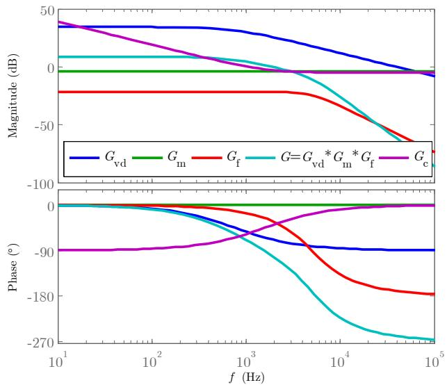  
Fig. 9. Transfer functions for the calculation of the controller parameters. The PI controller is set to have a phase-margin of 45º at a cross-over frequency of 1.5 kHz.

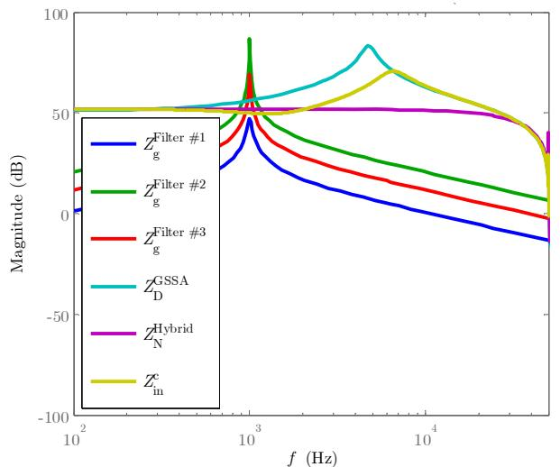  
Fig. 10. Design of the input filters for stability analysis. Filter #1 meets Middlebrook’s extra element theorem. Filter #2 and Filter #3 do not meet Middlebrook’s extra element theorem.

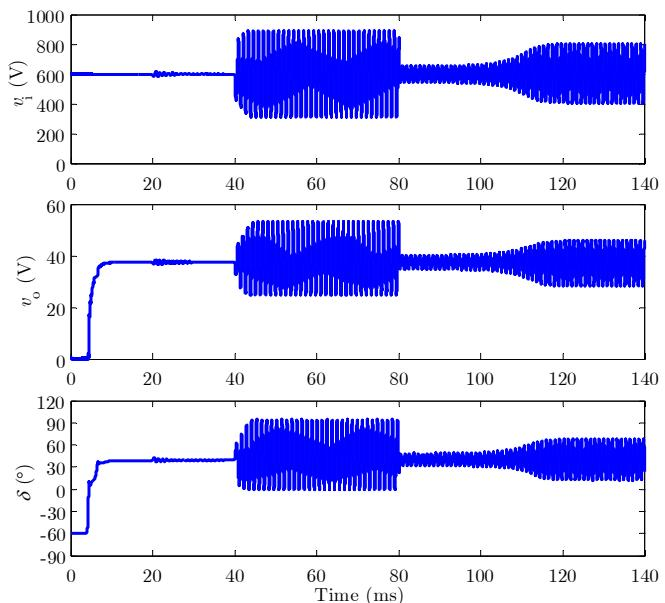  
Fig. 11. EMTP simulation results showing the problem of instability as predicted with the GSSA and hybrid models. At t = 4 ms, the converter is started without input filter. At t = 20 ms, Filter #1 is inserted at the input of the Y-∆ 3p-DAB converter. The converter remains stable. At t = 40 ms, Filter #1 is replaced by Filter #2. The system becomes unstable. At t = 80 ms, Filter #2 is replaced by Filter #3. The system remains unstable, but as predicted, the amplitude of the oscillations is smaller with Filter #3 than with Filter #2.

# B. Discussion on Middlebrook’s extra element theorem and stability assessment

Middlebrook’s theorem formulated as (43) is a well-known stability criterion. It is used not only to guarantee stability, but also to ensure that the introduction of an input filter does not substantially alter the converter transfer functions, mainly $G _ { \mathrm { v d } } ( \mathrm { s } ) , G _ { \mathrm { v g } } ( \mathrm { s } )$ , and $Z _ { \mathrm { o } } ( \mathrm { s } )$ [37]. Its application greatly reduces the required number of both time-domain simulations and experiments to 1) predict stability, and 2) design a system with an acceptable and predictable transient response. It is known to be a conservative approach which means that, even if (43) is violated, the system still can be stable [37].

Additional simulation results showed that any filters with a cutoff frequency of 1 kHz, and having an output impedance

between Filter #1 and Filter #3 (Fig. 10) lead to a damped oscillatory behavior. However, even if the system is considered stable, these oscillations may become unacceptable if the output voltage needs to be tightly constrained.

Knowing all the converter transfer functions, it is frequent practice to analyze the modified converter loop gain. This is a key step to ensure the predictability of the converter dynamic. Under the presence of an additional input filter, the converter control-to-output transfer function is modified following [18],

$$
G _ {\mathrm {v d}} ^ {\text {n e w}} (s) = G _ {\mathrm {v d}} (s) \left(\frac {1 + Z _ {\mathrm {g}} (s) / Z _ {\mathrm {N}} (s)}{1 + Z _ {\mathrm {g}} (s) / Z _ {\mathrm {D}} (s)}\right) \tag {46}
$$

which leads a new loop gain calculated as,

$$
T ^ {\text {n e w}} (s) = T (s) \left(\frac {1 + Z _ {\mathrm {g}} (s) / Z _ {\mathrm {N}} (s)}{1 + Z _ {\mathrm {g}} (s) / Z _ {\mathrm {D}} (s)}\right) \tag {47}
$$

For the three filters of Fig. 10, the resulting loop gains are plotted in Fig. 12 along with the nominal converter loop gain. Based on Fig. 12, similar conclusions to Fig. 10 can be drawn, i.e. Filter #1 does not alter significantly the loop gain which is not the case with Filter #2 and Filter #3. Pole-zero plot of the modified loop gain is alternatively used in specific cases (not shown here).

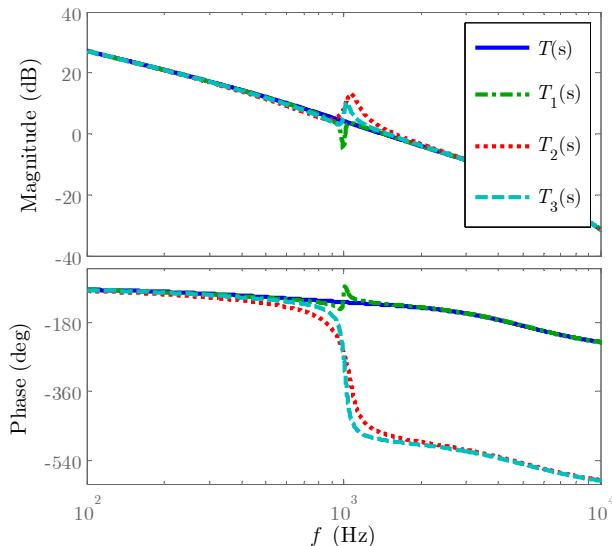  
Fig. 12. Loop gain analysis with additional input filter. The nominal converter loop gain T(s) is plotted with the resulting loop gain modified by the presence of the three filters. Filter #1 does not alter significantly the loop gain (amplitude and phase) while Filter #2 and Filter #3 significantly modify the phase of the loop gain.

# VII. CONCLUSION

This paper is a key step forward towards describing the behavior of 3p-DAB converters for next-generation power systems. The successful integration of the 3p-DAB with other power systems components requires determining its smallsignal characteristics accurately.

In this paper, SSA and GSSA small-signal models are derived for the determination of all the transfer functions of the Y-∆ 3p-DAB converter. Both models are validated with detailed switched-level simulations in EMTP. SSA benefits

from being easier to be represented as equivalent circuits. However, as seen in this paper, SSA is not accurate for stability analysis of the 3p-DAB. To overcome the limitations of SSA, a hybrid SSA and GSSA model is proposed. The GSSA model is used to calculate the driving point input impedance $Z _ { \mathrm { D } } ( \mathrm { s } )$ while the hybrid model is used to evaluate the null driving point input impedance $Z _ { \mathrm { N } } ( \mathrm { s } )$ . These models are used to accurately predict instability conditions.

# VIII. REFERENCES

[1] B. Zhao, Q. Song, W. Liu, and Y. Sun, “Overview of Dual-Active-Bridge Isolated Bidirectional DC–DC Converter for High-Frequency-Link Power-Conversion System,” IEEE Trans. Power Electron., vol. 29, no. 8, pp. 4091–4106, Aug. 2014.   
[2] N. M. L. Tan, T. Abe, and H. Akagi, “Design and Performance of a Bidirectional Isolated DC–DC Converter for a Battery Energy Storage System,” IEEE Trans. Power Electron., vol. 27, no. 3, pp. 1237–1248, Mar. 2012.   
[3] B. Zhao, Q. Song, W. Liu, and Y. Xiao, “Next-Generation Multi-Functional Modular Intelligent UPS System for Smart Grid,” IEEE Trans. Ind. Electron., vol. 60, no. 9, pp. 3602–3618, Sept. 2013.   
[4] H. van Hoek, M. Neubert, and R. W. De Doncker, “Enhanced Modulation Strategy for a Three-Phase Dual Active Bridge-Boosting Efficiency of an Electric Vehicle Converter,” IEEE Trans. Power Electron., vol. 28, no. 12, pp. 5499-5507, Dec. 2013.   
[5] N. H. Baars, J. Everts, H. Huisman, J. L. Duarte, and E. A. Lomonova, “A 80-kW Isolated DC–DC Converter for Railway Applications,” IEEE Trans. Power Electron., vol. 30, no. 12, pp. 6639–6647, Dec. 2015.   
[6] X. She, A. Q. Huang, and R. Burgos, “Review of Solid-State Transformer Technologies and Their Application in Power Distribution Systems,” IEEE J. of Emerg. Sel. Topics in Power Electron., vol. 1, no. 3, pp. 186–198, Sept. 2013.   
[7] C. Gammeter, F. Krismer, and J. W. Kolar, “Comprehensive conceptualization, design, and experimental verification of a weightoptimized all-sic 2 kV/700 V DAB for an airborne wind turbine,” IEEE J. Emerg. Sel. Topics Power Electron., vol. 4, no. 2, pp. 638–656, June 2016.   
[8] H. Y. Kanaan, M. Caron, and K. Al-Haddad, “Design and Implementation of a Two-Stage Grid-Connected High Efficiency Power Load Emulator,” IEEE Trans. Power Electron., vol. 29, no. 8, pp. 3997– 4006, Aug. 2014.   
[9] R. W. A. A. De Doncker, D. M. Divan, and M. H. Kheraluwala, “A three-phase soft-switched high-power-density DC/DC converter for high-power applications,” IEEE Trans. Ind. Appl., vol. 27, no. 1, pp. 63– 73, Jan/Feb 1991.   
[10] M. N. Kheraluwala, R. W. Gascoigne, D. M. Divan, and E. D. Baumann, “Performance characterization of a high-power dual active bridge DCto-DC converter,” IEEE Trans. Ind. Appl., vol. 28, no. 6, pp. 1294–1301, Nov/Dec 1992.   
[11] F. Krismer, S. Round, and J. W. Kolar, “Performance optimization of a high current dual active bridge with a wide operating voltage range,” in Proc. IEEE Power Electron. Spec. Conf., 2006, pp. 1–7.   
[12] R. W. De Doncker, “Power electronic technologies for flexible DC distribution grids,” in Proc. IEEE Int. Power Electron. Conf., pp. 736– 743, 2014.   
[13] N. H. Baars, J. Everts, C. G. E. Wijnands, and E. A. Lomonova, “Performance Evaluation of a Three-Phase Dual Active Bridge DC–DC Converter With Different Transformer Winding Configurations,” IEEE Trans. Power Electron., vol. 31, no. 10, pp. 6814–6823, Oct. 2016.   
[14] D. G. Shah and M. L. Crow, “Stability Design Criteria for Distribution Systems With Solid-State Transformers,” in IEEE Trans. Power Del., vol. 29, no. 6, pp. 2588–2595, Dec. 2014.   
[15] A. Emadi, A. Khaligh, C. H. Rivetta, and G. A. Williamson, “Constant power loads and negative impedance instability in automotive systems: Definition, modeling, stability, and control of power electronic converters and motor drives,” in IEEE Trans. Veh. Technol., vol. 55, no. 4, pp. 1112–1125, July 2006.   
[16] A. Riccobono et al., “Stability of Shipboard DC Power Distribution: Online Impedance-Based Systems Methods,” in IEEE Elect. Mag., vol. 5, no. 3, pp. 55–67, Sept. 2017.

[17] S. Chiniforoosh, J. Jatskevich, A. Yazdani, V. Sood, V. Dinavahi, J. A. Martinez, and A. Ramirez, “Definitions and applications of dynamic average models for analysis of power systems,” in IEEE Trans. Power Del., vol. 25, no. 4, pp. 2655–2669, Oct. 2010   
[18] R. W. Erickson and D. Maksimovic, Fundamental of Power Electronics. 2nd ed., Norwell, MA, USA: Kluwer, 2001.   
[19] D. Maksimovic, A. M. Stankovic, V. J. Thottuvelil, and G. C. Verghese, “Modeling and simulation of power electronic converters,” in Proc. IEEE, vol. 89, no. 6, pp. 898–912, June 2001.   
[20] R. D. Middlebrook and S. Cùk, “A general unified approach to modelling switching-converter power stages,” in Proc. IEEE Power Electron. Spec. Conf., pp. 18–34, June 1976.   
[21] J. A. Mueller and J. W. Kimball, “Model-based determination of closedloop input impedance for dual active bridge converters,” in Proc. IEEE Appl. Power Electron. Conf. and Expo., pp. 1039–1046, Mar. 2017.   
[22] H. Qin and J. W. Kimball, “Generalized average modeling of dual active bridge DC-DC converter,” in IEEE Trans. Power Electron., vol. 27, no. 4, pp. 2078–2084, Apr. 2012.   
[23] S. P. Engel, N. Soltau, H. Stagge, and R. W. De Doncker, “Dynamic and Balanced Control of Three-Phase High-Power Dual-Active Bridge DC– DC Converters in DC-Grid Applications,” IEEE Trans. Power Electron., vol. 28, no. 4, pp. 1880–1889, April 2013.   
[24] R. D. Middlebrook, “Input filter considerations in design and application of switching regulators,” in Proc. IEEE Industrial Applications Soc. Conf., Oct. 1976, pp. 91–107.   
[25] S. Sanders, J. Noworolski, X. Liu, and G. Verghese, “Generalized averaging method for power conversion circuits,” in IEEE Trans. Power Electron., vol. 6, no. 2, pp. 251–259, Apr. 1991.   
[26] K. Zhang, Z. Shan, and J. Jatskevich, “Large- and small-signal average value modeling of dual-active-bridge DC-DC converter considering power losses,” in IEEE Trans. Power Electron., vol. 32, no. 3, pp. 1964– 1974, Mar. 2017.   
[27] Z. Li, Y. Wang, L. Shi, J. Huang, Y. Cui, and W. Lei, “Generalized averaging modeling and control strategy for three-phase dual-activebridge DC-DC converters with three control variables,” in Proc. IEEE Appl. Power Electron. Conf. and Expo., pp. 1078–1084, Mar. 2017.   
[28] J. Mahseredjian, S. Dennetiere, L. Dube, B. Khodabakhchian, and L. Gerin-Lajoie, “On a new approach for the simulation of transients in power systems,” Electr. Power Syst. Res., vol. 77, no. 11, pp. 1514– 1520, Sep. 2007.   
[29] H. Li and F. Peng, “Modeling of a new ZVS bi-directional dc-dc converter,” IEEE Trans. Aerosp. Electron. Syst., vol. 40, no. 1, pp. 272– 283, Jan. 2004.   
[30] S. Chandrasekar and R. Gokaraju, “Dynamic Phasor Modeling of Type 3 DFIG Wind Generators (Including SSCI Phenomenon) for Short-Circuit Calculations,” in IEEE Trans. Power Del., vol. 30, no. 2, pp. 887–897, April 2015.   
[31] C. Liu, A. Bose, and P. Tian, “Modeling and Analysis of HVDC Converter by Three-Phase Dynamic Phasor,” in IEEE Trans. Power Del., vol. 29, no. 1, pp. 3–12, Feb. 2014.   
[32] Y. Huang, L. Dong, S. Ebrahimi, N. Amiri, and J. Jatskevich, “Dynamic Phasor Modeling of Line-Commutated Rectifiers With Harmonics Using Analytical and Parametric Approaches,” in IEEE Trans. Energy Convers., vol. 32, no. 2, pp. 534–547, June 2017.   
[33] A. M. Stankovic, S. R. Sanders, and T. Aydin, “Dynamic phasors in modeling and analysis of unbalanced polyphase AC machines,” in IEEE Trans. Energy Convers., vol. 17, no. 1, pp. 107–113, Mar. 2002.   
[34] A. M. Stankovic, B. C. Lesieutre, and T. Aydin, “Modeling and analysis of single-phase induction machines with dynamic phasors,” in IEEE Trans. Power Syst., vol. 14, no. 1, pp. 9–14, Feb. 1999.   
[35] V. A. Caliskan, G. C. Verghese, and A. M. Stankovic, “Multifrequency averaging of DC/DC converters,” in IEEE Trans. Power Electron., vol. 14, pp. 124–133, Jan. 1999.   
[36] Y. Jang and R. W. Erickson, “Physical origins of input filter oscillations in current programmed converters,” in IEEE Trans. Power Electron., vol. 7, no. 4, pp. 725–733, Oct 1992.   
[37] A. Riccobono and E. Santi, “Comprehensive Review of Stability Criteria for DC Power Distribution Systems,” in IEEE Trans. Ind. Appl., vol. 50, no. 5, pp. 3525–3535, Sept.–Oct. 2014.