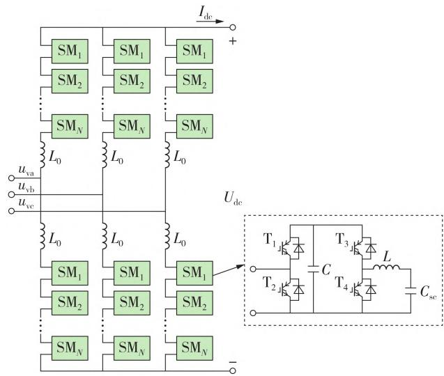
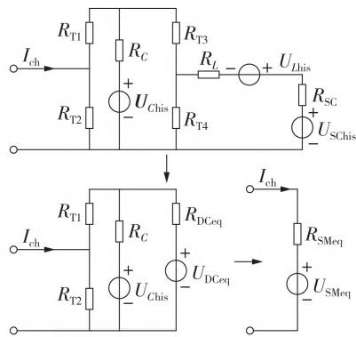
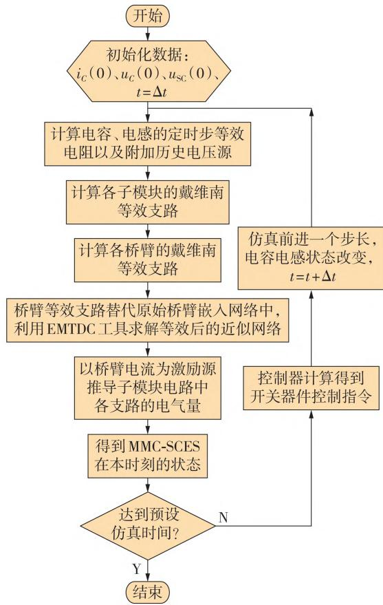
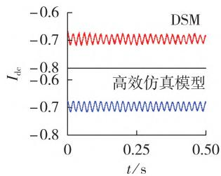
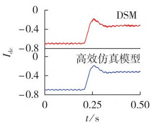
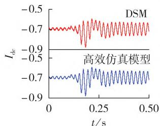

# 基于模块化多电平换流器的超级电容储能系统高效仿真方法

朱琼海，肖晃庆

（华南理工大学 电力学院 广东省绿色能源技术重点实验室，广东 广州 ）

摘要：基于模块化多电平换流器的超级电容储能系统（ - ）半导体开关器件数量众多，仿真规模庞大，给电磁暂态仿真效率带来了巨大的挑战。针对此问题，基于桥臂戴维南等效电路提出了一种高效的- 电磁暂态仿真方法。该仿真运用嵌套快速求解方法对 - 进行建模，不仅可以大幅降低仿真耗时和保持仿真精度，还可以保留换流器的所有动态变量。搭建了双端 - 仿真系统，对所提出的高效仿真方法进行了验证。结果表明：相比于基于平均值模型的仿真方法，所提出的高效仿真方法具有更高的精度，能够拟合子模块内部动态变量；相比基于详细开关模型的仿真方法，所提出的高效仿真方法的仿真速度最高可提升约 倍，而仿真的绝对误差标幺化积分则控制在 以内。

关键词：模块化多电平换流器；超级电容储能；电磁暂态仿真；戴维南等效；高效仿真方法

中图分类号： ；

文献标志码：

DOI：10.16081/j.epae.202312006

# 0 引言

随着世界各国对气候问题日益关注，发展新能源已成为国际社会的普遍共识。然而，新能源的开发仍然存在着诸多问题［1‐4］ ：①自然资源如风能、太阳能等存在间歇性和随机性，这将导致新能源场站的输出功率具有不确定性，增加电网功率实时平衡的难度；②新能源场站使用了大量的电力电子器件，惯量相较于常规电源低得多，缺乏对电网的支撑能力，在同样功率变化下的频率波动更大；③新能源中心与负荷中心存在一定的空间差异，并网时还须考虑输电线路经济效益问题，我国西电东送工程、欧洲北海海上风电枢纽计划等均试图通过大规模输电网络弥补这种空间差异。

基于模块化多电平换流器的超级电容储能系统（modular multilevel converter with embedded supercapacitor energy storage system，MMC-SCES）对上述点缺陷都能起到一定的改善作用［5‐6］ ：储能系统的加入能有效地弥补新能源的间歇性和随机性；超级电容功率密度较大的特性配合恰当的控制策略能为换流器提供一定的惯量储备；MMC-SCES的灵活控制能力可实现海上风电的大容量远距离直流传输，提高系统的经济性和稳定性。

然而，随着电压等级的升高， - 中的开

关器件和动态元件数量将会高达数百甚至上千个。在 - 的电磁暂态仿真研究中，众多的元器件与较小的时间步长将导致巨大的计算工作量和相当长的仿真时间。因此，快速高效的电磁暂态仿真模型对MMC-SCES相关研究而言是非常必要的。

目前，国内外对模块化多电平换流器（， ）电磁暂态仿真模型的研究已较为成熟，学者们已经提出了多种MMC快速仿真模型［7‐8］ 。适用于不同场景的 模型包含详细开关模型（detailed switching model，DSM）、详细等效模型（detailed equivalent model，DEM）、平均值模型（ - ， ）等。 对换流器所有的开关器件均进行建模，具有较好的准确性但运行速度慢，可用于开关损耗的相关研究［9‐10］ ；DEM使用二值电阻替代绝缘栅双极型晶体管（， ），运行效率较高并且能够较好地表示子模块电容的电气状态［11］ ；平均值模型（average-value model，AVM）使用状态空间平均法处理子模块开关器件，能够较好地模拟桥臂以及换流器的外特性，但无法获知不同子模块间的差异和处理桥臂内部的故障工况［12‐14］。文献［ ］则从换流器整体等效的角度考虑，对MMC进行阻抗建模，在 的外特性保持不变的同时也可以对其进行谐振稳定性分析。嵌入储能系统的 电磁暂态仿真模型通常基于 快速仿真模型建立，相关文献主要集中在基于 的储能型静止同步补偿器与嵌入蓄电池储能的 方面，关于建立 -快速仿真模型的研究相对较少。文献［ ］针对基于 的蓄电池储能型静止同步补偿器系统提出了子模块级的替代模型（ -

model，SLS）、基于桥臂等效的平均值模型（arm-levelequivalent average-value model，ALA）及电压源等效模 型（voltage source equivalent model，VSM）。 SLS将子模块的开关器件部分等效为可控电压源，但在子模块数上升的情况下依然需要较长的仿真时间；借鉴了 电磁暂态仿真研究中常用的 ，对换流器外部动态有着良好的近似效果，但ALA无法描述各子模块的实时状态； 将 的输出特性描述为具有等效输出阻抗的理想受控电压源，无法模拟直流侧暂态工况，仅适用于稳态基频研究。文献［18‐19］对基于蓄电池储能的MMC系统采用了嵌套快速同步仿真方法并得到了良好的仿真精度。文献［ ］对基于蓄电池储能的 系统采用 ，仿真速度大幅提升且换流器外特性精度无明显折损。文献［ ］提出了含高比例电力电子器件系统的云仿真技术，能满足新型电力系统的仿真分析需求，但暂未应用至储能型MMC领域。

为了满足 - 的快速电磁暂态仿真分析需求，本文基于戴维南等效方法提出了一种高效的- 模型。与典型的 拓扑不同， -在半桥子模块中增加了储能元件相关回路。储能元件加入后， - 同时具备了能量存储与交直流变换的特性，但其子模块的拓扑结构相较典型 子模块拓扑变得更加复杂，该拓扑的状态方程也因子模块中 组可控开关元件以及多个动态元件而提高了阶数。动态元件的增加使得典型的MMC快速仿真模型不再适用。因此本文所提高效仿真模型将关注重点从常规的 桥臂外部等效扩展至复杂子模块的内部电气量求解，以获取仿真过程中换流器的所有动态变量。在电磁暂态仿真效果方面，该模型在减少仿真耗时的基础上达到了与相近的仿真精度，高效地验证了不同的控制策略。

本文首先介绍了 - 的拓扑结构与工作原理，然后构建了基于嵌套快速同时求解方法的- 仿真模型，最后在 ／ 平台上搭建了电平数为 、容量为 的 -双端输电系统。通过与 、 进行对比，从精度与效率 个方面验证了所提仿真方法的可行性和有效性。

# - 拓扑结构及工作原理

# 拓扑结构

- 是一种储能型 ，储能型 结构与常规 结构大致相同［7，22］。换流器共包含个桥臂，每个桥臂由N个子模块级联并与桥臂电抗器串接组成，一定数量的子模块通过级联形成直流母线电压，为桥臂提供相对稳定的电压。储能型由 于 年初次提出，其主要特

征在于采用含储能器件的子模块。主流的储能型子模块构成方案包括储能元件取代子模块电容、储能元件与子模块电容直接并联、储能元件经非隔离环节接入子模块、储能元件经隔离环节接入子模块等。储能元件取代子模块电容、储能元件与子模块电容直接并联这2种方案对储能功率的控制较为困难；储能元件经非隔离环节接入子模块的方案可使储能元件控制与子模块投入控制两者相互解耦，相较于储能元件经隔离环节接入子模块方案其效率较高，但在安全性与储能元件电压等级的选择范围上有所不及。储能元件一般采用蓄电池或超级电容，蓄电池系统能够达到更高的电压等级，而超级电容在充放电次数与响应时间上更具优势［23‐24］ 。本文所研究的 - 采用超级电容经非隔离型双向 - 电路接入子模块的拓扑结构，如图 所示。图中： $L _ { 0 }$ 为桥臂电感 $; I _ { \mathrm { d c } } \setminus U _ { \mathrm { d c } }$ 分别为直流电流、直流电压； ${ \mathrm { ; T _ { 1 } - T _ { 4 } } }$ 为 IGBT开关管；C为子模块电容； $C _ { \mathrm { s c } }$ 为超级电容；L为子模块电感 $\sharp u _ { \mathrm { v a } } \setminus u _ { \mathrm { v b } } \setminus u _ { \mathrm { v c } }$ 为电网三相电压； （i ，，…，N）为桥臂第i个子模块。

  
图1 MMC-SCES拓扑结构  
Fig.1 Topology structure of MMC-SCES

对超级电容储能型 子模块而言，常规半桥单元上可控器件的通断决定了子模块的投入或切除状态，储能变换器单元上可控器件的通断决定了超级电容的充放电状态， - 在正常运行时子模块的 种工作状态如附录 表 所示。

# 控制策略

采用双向 - 变换器为子模块增加超级电容后，换流器的交流出口以及直流母线二者的工况与常规 仍保持一致，其差异之处仅在于电能来源不同或内部损耗的增加，故常规的交流侧电流矢量控制方法依然有效［24］ 。双向 - 变换器采用恒功率控制方法，功率外环与电流内环共同作

用，维持超级电容的充放电功率在设定值附近［25］。调制方式采用互补脉宽调制方法，双向 Buck-Boost变换器中2个IGBT开关管 $\mathrm { T } _ { 3 } , \mathrm { T } _ { 4 }$ 交替互补动作，相较于独立脉宽调制方法，该方法能降低开关损耗，加快系统响应速度。详细的控制框图见附录 图 。

# 嵌套快速同时求解方法

为了解决 - 电磁暂态仿真中计算量大、仿真时间长的问题，本文提出采用一种嵌套快速同时求解方法对MMC-SCES建模［6］ 。该方法的核心在于利用等效电路消除电网络中的非主要节点。首先对子模块中的动态元件实施 算法等效以便于计算机进行数值计算；然后对子模块以及各个桥臂应用戴维南等效方法，从而建立下一时刻的嵌套求解电路；在嵌套求解电路中，数量众多的子模块均被等效模型所替代，仿真模型中的总电气节点数得以减少，网络导纳矩阵的维数降低，进而大幅减少仿真过程中的计算量，加快仿真速度。

# 2.1 基于Dommel算法的子模块等效模型

因子模块中存在动态元件，电磁暂态仿真中需对其进行数值等效。电容元件的特性可表示为：

$$
u _ {C} (t) = u _ {C} (t - \Delta t) + \frac {1}{C} \int_ {t - \Delta t} ^ {t} i _ {C} (\tau) \mathrm {d} \tau \tag {1}
$$

式中：t为仿真步长；t为仿真时间 $; u _ { C }$ 为电容电压；$i _ { C }$ 为电容电流。用梯形积分方法近似后可得电容电压在离散计算中的表达式为：

$$
\begin{array}{l} u _ {C} (t) \approx u _ {C} (t - \Delta t) + \frac {\Delta t}{2 C} \left(i _ {C} (t) + i _ {C} (t - \Delta t)\right) = \\ \frac {\Delta t}{2 C} i _ {C} (t) + \left(u _ {C} (t - \Delta t) + \frac {\Delta t}{2 C} i _ {C} (t - \Delta t)\right) \tag {2} \\ \end{array}
$$

由此可见，除去上一时刻的历史观测变量的影响，梯形积分方法近似后的电容电压仅与本时刻的电容电流相关，故将上一时刻的历史观测变量记作电容等效电路中的附加历史电压源 $U _ { \mathrm { c h i s } }$ 如式（）所示，定义电容的定时步等效电阻 $R _ { c }$ 如式（）所示。

$$
\begin{array}{l} U _ {\text {C h i s}} = u _ {C} (t - \Delta t) + \frac {\Delta t}{2 C} i _ {C} (t - \Delta t) (3) \\ R _ {C} = \frac {\Delta t}{2 C} (4) \\ \end{array}
$$

电容等效电路中的附加历史电压源与电容的定时步等效电阻串联共同构成等效支路，嵌入本时刻的仿真模型以替代原来的电容支路，如附录 图（a）所示。

对电感元件也进行类似的等效，电感元件的特性以及电感电压在离散计算中的表达式分别为：

$$
\begin{array}{l} i _ {L} (t) = i _ {L} (t - \Delta t) + \frac {1}{L} \int_ {t - \Delta t} ^ {t} u _ {L} (\tau) \mathrm {d} \tau (5) \\ u _ {L} (t) \approx \frac {2 L}{\Delta t} i _ {L} (t) - \left(u _ {L} (t - \Delta t) + \frac {2 L}{\Delta t} i _ {L} (t - \Delta t)\right) (6) \\ \end{array}
$$

式中： $\{ i _ { L }$ 为电感电流 $; \boldsymbol { u } _ { L }$ 为电感电压。定义电感等效电路中的附加历史电压源 $U _ { \mathrm { { } _ { L h i s } } }$ 如式（7）所示，定义电感的定时步等效电阻 $R _ { L }$ 如式（）所示。

$$
\begin{array}{l} U _ {L \text {h i s}} = u _ {L} (t - \Delta t) + \frac {2 L}{\Delta t} i _ {L} (t - \Delta t) (7) \\ R _ {L} = \frac {2 L}{\Delta t} (8) \\ \end{array}
$$

电感等效电路中的附加历史电压源与电感的定时步等效电阻串联共同构成等效支路，嵌入本时刻的仿真模型以替代原来的电感支路，如附录 图（b）所示。

此外，当 - 正常运行时， 及续流二极管的饱和压降相对较小，可以视为一个由开关指令控制的可变二态电阻［6］ 。导通时通态电阻造成导通压降，关断时器件呈现高阻值状态。在一般的电磁暂态仿真软件中，二态电阻的阻值依次可取为：导通时 $R _ { \mathrm { o n } } = 0 . 0 1 \Omega$ ；关断时 $R _ { \mathrm { o f f } } = 0 . 5 \ : \mathrm { M } \Omega$ 。由此可将模型中的每个子模块均近似等效为只含无源电阻和直流电源的网络。

# 桥臂戴维南等效模型

将电力电子开关以及动态元件均进行等效处理后，可得到各个子模块的等效电路，进一步可得到相应的戴维南等效电路，如图2所示。图中： $I _ { \mathrm { c h } }$ 为特定时步下的桥臂电流值； $R _ { \mathrm { T 1 } } - R _ { \mathrm { T 4 } }$ 分别为 开关管$\mathrm { T _ { 1 } }$ — T 的等效电阻； $R _ { \mathrm { { s c } } } , U _ { \mathrm { { s c h i s } } }$ 分别为超级电容的定时步等效电阻、超级电容电压等效电路中的附加历史电压源； $R _ { \mathrm { D C e q } } \setminus U _ { \mathrm { D C e q } }$ 分别为储能单元等效电阻、等效电压源，其表达式见式（9）； $R _ { \mathrm { { s M e q } } } \setminus U _ { \mathrm { { s M e q } } }$ 分别为子模块等效电阻、等效电压源，其表达式见式（ ）。

  
图2 子模块等效电路  
Fig.2 Equivalent circuit of submodule

$$
\begin{array}{l} \left\{ \begin{array}{l} R _ {\mathrm {D C e q}} = R _ {\mathrm {T 3}} + \frac {\left(R _ {L} + R _ {\mathrm {S C}}\right) R _ {\mathrm {T 4}}}{R _ {L} + R _ {\mathrm {S C}} + R _ {\mathrm {T 4}}} \\ U _ {\mathrm {D C e q}} = R _ {\mathrm {T 4}} \frac {U _ {\mathrm {S C h i s}} - U _ {L \text {h i s}}}{R _ {\mathrm {S C}} + R _ {L} + R _ {\mathrm {T 4}}} \end{array} \right. (9) \\ \left\{ \begin{array}{l} R _ {\mathrm {S M e q}} = \frac {R _ {\mathrm {T 2}} \left(R _ {\mathrm {D C e q}} R _ {C} + R _ {\mathrm {T 1}} R _ {\mathrm {D C e q}} + R _ {\mathrm {T 1}} R _ {C}\right)}{R _ {\mathrm {D C e q}} R _ {C} + \left(R _ {\mathrm {D C e q}} + R _ {C}\right) \left(R _ {\mathrm {T 1}} + R _ {\mathrm {T 2}}\right)} \\ U _ {\mathrm {S M e q}} = \frac {R _ {\mathrm {T 2}} \left(R _ {\mathrm {D C e q}} U _ {\text {C h i s}} + R _ {C} U _ {\mathrm {D C e q}}\right)}{R _ {\mathrm {D C e q}} R _ {C} + \left(R _ {\mathrm {D C e q}} + R _ {C}\right) \left(R _ {\mathrm {T 1}} + R _ {\mathrm {T 2}}\right)} \end{array} \right. (10) \\ \end{array}
$$

桥臂中的所有子模块是以首尾依次相连的形式接入电路的，因而可合并为一个戴维南等效电路。设 $j ( j = \mathrm { A } , \mathrm { B } , \mathrm { C } )$ 相 $\cdot ( r { = } \mathrm { P } _ { \mathrm { \downarrow } } r { = } \mathrm { N }$ 分别对应每相的上、下桥臂）桥臂的等效电阻 $R _ { \mathrm { e q } } ^ { j r }$ 与等效电压 $U _ { \mathrm { e q } } ^ { j r }$ 分别为：

$$
\left\{ \begin{array}{l} R _ {\mathrm {e q}} ^ {j r} = \sum_ {i = 1} ^ {N} R _ {\mathrm {S M i}} ^ {j r} \\ U _ {\mathrm {e q}} ^ {j r} = \sum_ {i = 1} ^ {N} U _ {\mathrm {S M i}} ^ {j r} \end{array} \right. \tag {11}
$$

式中： $R _ { \mathrm { { S M } } i } ^ { j r } \setminus U _ { \mathrm { { S M } } i } ^ { j r }$ 分别为 j 相r桥臂第i个子模块的电阻与电压。同时对 个桥臂进行等效，能够达到降低网络节点数的效果，缩短仿真时间。基于以上电路等效，可得 - 的完整等效电路见附录 图 。

# 子模块元件电气量的计算

在仿真过程中使用 工具求解带等效桥臂的MMC-SCES电路拓扑，能够得到未经等效部分的外部网络电气量，其中包含桥臂电流。对每个桥臂中的N个子模块而言，流入子模块的电流即为桥臂电流，因此可将桥臂电流作为激励源推导本时刻子模块中各支路的电气量，从而获取电容、电感等元件在仿真中的实时状态。

考虑如附录 图 所示的子模块网络，网络包含 个附加历史激励源以及外部桥臂电流激励，在特定时步对外部网络求解后，桥臂电流激励相当于理想直流电流源，故建立节点电压方程可得：

$$
\left\{ \begin{array}{l} Y _ {\mathrm {S M}} U _ {\mathrm {n}} = I _ {\mathrm {S}} \\ U _ {\mathrm {n}} = \left[ U _ {\mathrm {n} 1} U _ {\mathrm {n} 2} U _ {\mathrm {n} 3} \right] ^ {\mathrm {T}} \\ I _ {\mathrm {S}} = \left[ I _ {\mathrm {c h}} \frac {U _ {\mathrm {C h i s}}}{R _ {C}} \frac {U _ {\mathrm {S C h i s}} - U _ {\mathrm {L h i s}}}{R _ {\mathrm {S C}} + R _ {L}} \right] ^ {\mathrm {T}} \\ Y _ {\mathrm {S M}} = \left[ \begin{array}{c c c} \frac {1}{R _ {\mathrm {T} 1}} + \frac {1}{R _ {\mathrm {T} 2}} & - \frac {1}{R _ {\mathrm {T} 1}} & 0 \\ - \frac {1}{R _ {\mathrm {T} 1}} & \frac {1}{R _ {\mathrm {T} 1}} + \frac {1}{R _ {C}} + \frac {1}{R _ {\mathrm {T} 3}} & - \frac {1}{R _ {\mathrm {T} 3}} \\ 0 & - \frac {1}{R _ {\mathrm {T} 3}} & \frac {1}{R _ {\mathrm {T} 3}} + \frac {1}{R _ {\mathrm {T} 4}} + \frac {1}{R _ {L} + R _ {\mathrm {S C}}} \end{array} \right] \end{array} \right. \tag {12}
$$

式中： $U _ { \mathrm { n } k } ( k = 1 , 2 , 3 )$ 为子模块中节点k的电压。

为加速仿真过程，使用符号运算预先对矩阵 $Y _ { \mathrm { s u } }$ 求逆，高效仿真程序运行时执行式（ ）所示计算过程可快速获取子网络中各节点电压值，进而由元件电压电流关系求得所需电气量如式（ ）所示。

$$
\boldsymbol {U} _ {\mathrm {n}} = \boldsymbol {Y} _ {\mathrm {S M}} ^ {- 1} \boldsymbol {I} _ {\mathrm {S}} \tag {13}
$$

$$
\left\{ \begin{array}{l} u _ {C} (t) = U _ {\mathrm {n} 2} \\ u _ {\mathrm {S C}} (t) = U _ {\mathrm {S C h i s}} + \frac {\left(U _ {\mathrm {n} 3} - U _ {\mathrm {S C h i s}} + U _ {\mathrm {L h i s}}\right) R _ {\mathrm {S C}}}{R _ {L} + R _ {\mathrm {S C}}} \end{array} \right. \tag {14}
$$

式中： $: u _ { \mathrm { S C } }$ 为超级电容的瞬时电压。此时可得 -的嵌套快速同时求解完整流程，如图 所示。

  
图3 MMC-SCES的高效仿真模型求解流程  
Fig.3 Solution flowchart of efficient simulation model of MMC-SCES

# 3 仿真验证

在 ／ 仿真平台上搭建基于 电平 - 的双端输电系统，对比 与高效仿真模型得到的仿真结果，验证所提高效仿真模型的有效性。所研究的基于 - 的双端输电系统如附录B图B1所示，两端换流站额定容量为，储能系统额定容量为 ，交流系统额定电压为 ，直流母线的额定电压为 ，系统其余详细参数如附录 表 所示。此外，同时运用文献［ ］所提出的 建立参数相同的双端输电系统进行比较分析。

# 3.1 高效仿真模型精度验证

、 与所提高效仿真模型的仿真结果见附录 图 ，各电气量用标幺值表示。由图可见：高效仿真模型得到的换流器 相阀侧电压UA 波形接近正弦波，且与 得到的波形相互吻合；在直流端口电压 $U _ { \mathrm { d c } }$ 方面，高效仿真模型和 的高频噪声过滤效果更好，这是因为 中大量的子模块带来了相对较多的高频噪声。

对于换流器内部电气量，相较于 高效仿真模型的拟合效果更好。这是由于高效仿真模型对子模块中各个电气量的拟合均由实际子网络求解得到，而 则忽略了开关控制的动态继而造成了精

度损失。在研究超级电容荷电状态均衡策略、子模块电容电压平衡策略、子模块内部故障处理策略等问题时，高效仿真模型因拥有实际计算拟合特性，能显示出相对优势，这是其他快速仿真模型所缺乏的。

此外，在交流侧采用电流矢量控制方法、储能系统采用恒功率控制方法的解耦控制策略下，直流端口电压存在一定的纹波，仍需要进一步研究MMC-SCES 中功率传输原理以及优化控制策略。由于篇幅原因图B2中仅给出C相上桥臂第3个子模块电容电压UCP 、A相上桥臂第一个超级电容电压UAP 以及A相上桥臂电流 $I _ { \mathrm { c h } } ^ { \mathrm { A P } }$ 的时域仿真曲线。由图可知：高效仿真模型的仿真精度较高。

为了验证高效仿真模型对于MMC-SCES不同工况均具备适用性，除了上述稳定工作状态以外，在功率阶跃变化以及交流故障2种工况下对双端输电系统的直流电流 $I _ { \mathrm { d c } }$ 波形进行仿真对比，结果如图 所示。由图可知：在 种不同工况下，高效仿真模型均给出了与 相一致的结果，误差均较小。

  
（a）稳态过程

  
（b）功率阶跃过程

  
（c）故障过程  
图4 3种工况下的直流电流波形  
Fig.4 DC current under three kinds of operating conditions

采用绝对误差的标幺化积分（， ）［17］在数值上描述高效仿真模型相较于 的误差，计算式为：

$$
\lambda_ {\mathrm {NIAE}} = \frac {\int_ {t _ {1}} ^ {t _ {2}} \left| x _ {\mathrm {ref}} (t) - x _ {\mathrm {m}} (t) \right| \mathrm {d} t}{\int_ {t _ {1}} ^ {t _ {2}} \left| X _ {\mathrm {N}} \right| \mathrm {d} t} \times 100 \% \tag{15}
$$

式中： $\lambda _ { \mathrm { { N A E } } }$ 为 NIAE 值； $x _ { \mathrm { r e f } }$ 为 DSM 的某一电气量 $; x _ { \mathrm { m } }$ 为对应电气量在高效仿真模型或 中得到的结果； $\ d ; X _ { \mathrm { N } }$ 为对应电气量的额定值 $; t _ { 1 } \setminus t _ { 2 }$ 分别为仿真开始时间和结束时间。

$\lambda _ { \mathrm { { N I A E } } }$ 通常用于比较2个连续曲线之间的误差，在时域仿真结果的误差分析中较为适用。 $\lambda _ { \mathrm { { N L A E } } }$ 越

小，表示 个曲线之间的误差越小，误差越接近于 ，高效仿真模型与DSM对MMC-SCES的仿真效果越接近。分别计算高效仿真模型与AVM在稳态工况下各电气量的 $\lambda _ { \mathrm { { N A E } } }$ ，结果如表 1所示。由表可知：使用高效仿真模型能够达到与使用 相仿的仿真效果， $\lambda _ { \mathrm { { N I A E } } }$ 非常小，曲线相似程度非常高，相较于AVM数值精度较好。

表1 2种模型下各电气量仿真结果的λNIAE $\lambda _ { \mathrm { { N L A E } } }$   
Table 1 $\lambda _ { \mathrm { { N L A E } } }$ of each electrical quantity under two models   

<table><tr><td rowspan="2">电气量</td><td colspan="2">λNIAE / %</td></tr><tr><td>高效仿真模型</td><td>AVM</td></tr><tr><td>阀侧电压</td><td>0.1211</td><td>0.1432</td></tr><tr><td>直流电压</td><td>0.1402</td><td>0.2716</td></tr><tr><td>子模块电容电压</td><td>0.0941</td><td>0.2038</td></tr><tr><td>超级电容电压</td><td>0.0018</td><td>0.0024</td></tr><tr><td>桥臂电流</td><td>0.7739</td><td>1.5907</td></tr></table>

# 高效仿真模型效率验证

仿真效率方面，分别基于 、 以及所提高效仿真模型对图 所示双端输电系统进行建模与仿真分析。模型运行于 操作系统的／ 电磁暂态仿真软件，硬件使用 核 ， 内存。

首先通过改变子模块个数对所提高效仿真模型的效率进行验证。 种仿真模型下 - 桥臂电气节点数量随子模块个数改变的情况见表 。可见相较于DSM，高效仿真模型的桥臂电气节点数量有所减少，在子模块个数较多时尤为明显。在多座换流站构建直流电网的具体应用场景下，采用高效仿真模型后，整个系统电气节点个数大幅降低，较大程度减少了仿真软件的矩阵运算量。

表2 3种模型下桥臂电气节点个数对比  
Table 2 Comparison of electrical nodes number in MMC-SCES arm under three models   

<table><tr><td rowspan="2">子模块个数</td><td colspan="3">每个桥臂电气节点个数</td></tr><tr><td>DSM</td><td>AVM</td><td>高效仿真模型</td></tr><tr><td>4</td><td>13</td><td>4</td><td>2</td></tr><tr><td>20</td><td>61</td><td>4</td><td>2</td></tr><tr><td>50</td><td>151</td><td>4</td><td>2</td></tr></table>

针对 - 桥臂子模块个数不同的双端输电系统进行仿真时间为 ，仿真步长为 $2 0 ~ \mu \mathrm { s }$ 的仿真分析，结果如表 所示。可见当桥臂子模块数量提升时，若依然采用 ，仿真耗时将显著增加，在子模块数量为 时耗时已超过 。而 与所提高效仿真模型则表现出显著的提速效果。注意到在电气节点数稍多的情况下效率比高效仿真模型更高，这是因为 个模型的等效原理存在较大差异：在 中电磁暂态仿真软件仅对一个子模块进行求解，继而将该子模块的电气状态认为是整个

桥臂所有子模块的电气状态，可见AVM的加速效果源于其对子模块个体差异的忽略，这显然在仿真精度上造成了折损；在高效仿真模型中，尽管桥臂节点个数能够降低到 2 个，但子模块节点电压嵌套快速同步求解方法同时被应用于桥臂上的每个子模块网络，每个子模块的差异和动态特性都能被很好地拟合，在这个意义上也可视作增加了 个子模块节点个数。可见高效仿真模型的加速效果确实源于电气节点个数的大量减少，而保留足够仿真精度的要求又使其运行时的计算量相对AVM有所增加。

表3 MMC-SCES桥臂子模块个数对仿真效率的影响  
Table 3 Effect of submodule number in arm-bridge submodule of MMC-SCES on simulation efficiency   

<table><tr><td rowspan="2">子模块个数</td><td colspan="3">仿真耗时/s</td></tr><tr><td>DSM</td><td>AVM</td><td>高效仿真模型</td></tr><tr><td>4</td><td>33</td><td>4</td><td>4</td></tr><tr><td>20</td><td>5110</td><td>8</td><td>16</td></tr><tr><td>50</td><td>110434</td><td>19</td><td>27</td></tr></table>

此外，在不同仿真时间步长下对双端输电系统进行验证。在仿真时间设定为 的情况下，仿真耗时随仿真步长变化的情况如表 所示。由表可知：在相同仿真步长下 耗时最长，高效仿真模型耗时虽然比 稍多，但加速效果依然是比较明显的，提速倍数最高约达到518。

表4 仿真时间步长对仿真效率的影响  
Table 4 Effect of time steps on simulation efficiency   

<table><tr><td rowspan="2">仿真步长 / μs</td><td colspan="3">仿真耗时 / s</td></tr><tr><td>DSM</td><td>AVM</td><td>高效仿真模型</td></tr><tr><td>100</td><td>2074</td><td>3</td><td>4</td></tr><tr><td>50</td><td>2315</td><td>6</td><td>6</td></tr><tr><td>20</td><td>5110</td><td>10</td><td>16</td></tr><tr><td>10</td><td>6944</td><td>14</td><td>25</td></tr></table>

综上所述，本文所提出的 - 高效仿真模型同时实现了仿真结果精度较好、仿真效率较高的预定目标，其有效性得到了验证，能够应用于后续- 的相关研究。

# 4 结论

为了满足基于模块化多电平换流器的超级电容储能系统的快速电磁暂态仿真分析需求，解决仿真计算量大、耗时长的问题，本文基于戴维南等效方法提出了一种简化且计算效率高的 - 模型。该模型能够得到仿真过程中换流器所有的动态变量，在大幅减少仿真耗时的基础上达到了与 相仿的仿真精度，用以验证不同的控制策略。搭建了电平、 的 - 双端输电系统，通过种仿真模型的对比，从仿真精度与仿真效率两方面验证了所提高效仿真方法的可行性和有效性。

附录见本刊网络版（http：∥www.epae.cn）。

# 参考文献：

［1］徐政. 电力系统广义同步稳定性的物理机理与研究途径［J］.电力自动化设备，2020，40（9）：3-9.  
XU Zheng. Physical mechanism and research approach ofgeneralized synchronous stability for power systems［J］. Elec‐tric Power Automation Equipment，2020，40（9）：3-9.  
［ ］孙华东，王宝财，李文锋，等 高比例电力电子电力系统频率响应的惯量体系研究［］ 中国电机工程学报， ， （ ）：5179-5191.  
SUN Huadong，WANG Baocai，LI Wenfeng，et al. Research on inertia system of frequency response for power system with highpenetration electronics[J]．Proceedingsof the CSEE, ，（ ）： -   
［ ］饶宏，周月宾，李巍巍，等 柔性直流输电技术的工程应用和发展展望［］ 电力系统自动化， ，（）：-  
RAO Hong，ZHOU Yuebin，LI Weiwei，et al. Engineering ap‐ plication and development prospect of VSC-HVDC transmis‐ sion technology［J］. Automation of Electric Power Systems， ，（）：-   
［ ］肖晃庆，黄小威，李岩，等 适用于二极管不控整流送出的海上风电机组无功功率同步控制策略［］ 高电压技术， ，（ ）： -  
XIAO Huangqing，HUANG Xiaowei，LI Yan，et al. Reactive power-synchronization control for offshore wind turbines con‐ nected to diode rectifier［J］. High Voltage Engineering，2022， 48（10）：3820-3828.   
［ ］贺之渊，杨杰，吴亚楠，等 能源转型下的未来交流和直流联合运行模式及发展趋势探讨［］ 中国电机工程学报， ，（）： -  
HE Zhiyuan，YANG Jie，WU Yanan，et al. Investigation onthe future AC and DC combined operation form and develop‐ment trend under energy transition［J］. Proceedings of the， ，（）： -  
［ ］徐政，肖晃庆，张哲任，等 柔性直流输电系统［ ］ 版 北京：机械工业出版社， ： -  
［ ］ ， - ， - ，Review of dynamic and transient modeling of power electronicconverters for converter dominated power systems［J］. IEEE， ，： -  
[8］STEPANOV A,SAAD H,MAHSEREDJIAN J. Modeling of MMC-based STATCOM with embedded energy storage for the simulation of electromagnetic transients[J]. Electric Power Systems Research,2023,220:109316.   
［9］ DE ANDRADE F C，BRADASCHIA F，LIMONGI L R，et al. A reduced switching loss technique based on generalized scalar PWM for nine-switch inverters［J］. IEEE Transactions on Industrial Electronics,2018,65(1):38-48.   
[10]HERATH N,FILIZADEH S. Improved average-value and detailed equivalent models for modular multilevel converters with embedded storage［J］. IEEE Transactions on Energy Conversion， ，（）： -   
［ ］张芳，黄维持，李传栋 适用于多种子模块拓扑的 通用化快速仿真模型［］ 电力自动化设备， ，（）： - ，  
ZHANG Fang,HUANG Weichi,LI Chuandong. General fastsimulation model applicable to multiple sub-module topologies of MMC[J].Electric Power Automation Equipment,2019,（）： - ，  
[12] SONG G B,WANG T,HUANG X H,et al. An improved averaged value model of MMC-HVDC for power system faults simulation[J]. International Journal of Electrical Power& ， ， ： -   
［ ］李晓栋 特高压混合级联直流输电系统的几个关键技术问题研究[D].杭州·浙江大学.2022.

LI Xiaodong. Research on several key technical issues for hy‐ brid cascaded UHVDC transmission system［D］. Hangzhou： Zhejiang University，2022.   
［ ］范新凯，王艳婷，张保会 柔性直流电网的快速电磁暂态仿真［］ 电力系统自动化， ，（）： -  
FAN Xinkai，WANG Yanting，ZHANG Baohui. Fast electro‐ magnetic transient simulation for flexible DC power grid［J］. Automation of Electric Power Systems,2017,41(4):92-97.   
［ ］陆秋瑜，杨银国，郑建平，等 功率同步控制的模块化多电平换流器阻抗建模及谐振稳定性分析［J］. 电力自动化设备，2022，42（8）：160-166.  
LU Qiuyu，YANG Yinguo，ZHENG Jianping，et al. Impedance modeling and resonance stability analysis of modular multilevel converter with power synchronization control［J］. Electric Power Automation Equipment，2022，42（8）：160-166.   
［ ］毛光亮，彭乔，舒稷，等 - 直流侧阻抗模型简化方法［］ 电力自动化设备， ，（）： -  
MAO Guangliang，PENG Qiao，SHU Ji，et al. DC-side impe-dance model simplification method of MMC-HVDC[J].Elec-tric Power Automation Equipment，2022，42（8）：229-234.  
［17］ CUPERTINO A F，AMORIM W C S，PEREIRA H A，et al.High performance simulation models for ES-STATCOM basedon modular multilevel converters［J］. IEEE Transactions onEnergy Conversion，2020，35（1）：474-483.  
［ ］刘耀，吴佳玮，赵小令，等 基于电池储能的 - 系统的建模与仿真［］ 电力工程技术， ，（）： -  
LIU Yao，WU Jiawei，ZHAO Xiaoling，et al. Modeling and simulation of battery energy storage system based on MMC-HVDC［J］. Electric Power Engineering Technology，2020，39 （4）：48-54.   
［19］ HERATH N，FILIZADEH S，TOULABI M S. Modeling of a modular multilevel converter with embedded energy storage for electro-magnetic transient simulations［J］. IEEE Transactions on Energy Conversion,2019,34(4):2096-2105.   
［20］ HERATH N，FILIZADEH S. Average-value model for a modular multilevel converter with embedded storage［J］. IEEE Transactions on Energy Conversion,2021,36(2):789-799.   
［ ］陈颖，高仕林，宋炎侃，等 面向新型电力系统的高性能电磁暂

态云仿真技术［］ 中国电机工程学报， ，（）： -  
CHEN Ying，GAO Shilin，SONG Yankan，et al. High-perfor‐ mance electromagnetic transient simulation for new-type power system based on cloud computing［J］. Proceedings of the CSEE，2022，42（8）：2854-2864.   
［22］ TRINTIS I，MUNK-NIELSEN S，TEODORESCU R. A new modular multilevel converter with integrated energy storage［C］∥ IECON 2011-37th Annual Conference of the IEEE Industrial Electronics Society. Melbourne，Australia：IEEE，2011：1075-1080.   
［23］蔡婉琪. 基于模块化多电平换流器的混合储能系统研究［D］.杭州：浙江大学，  
CAI Wanqi. Study on hybrid energy storage system based on modular multilevel converter［D］. Hangzhou：Zhejiang University， 2021.   
［ ］王哲 集成储能型模块化多电平变换器运行特性与优化控制［ ］ 武汉：华中科技大学，  
WANG Zhe. Operational characteristics and optimization con‐ trol of modular multilevel converter with integrated battery energy storage system［D］. Wuhan：Huazhong University of Science and Technology,2020.   
［ ］张国驹，唐西胜，周龙，等 基于互补 控制的 ／双向变换器在超级电容器储能中的应用［］ 中国电机工程学报， ，（）： -  
ZHANG Guoju,TANG Xisheng,ZHOU Long,et al． Researchon complementary PWM controlled Buck/Boost bi-directionalconverter in supercapacitor energy storage［J］. Proceedings ofthe CSEE，2011，31（6）：15-21.

# 作者简介：

朱琼海（ —），男，硕士研究生，主要研究方向为储能型模块化多电平换流器的建模与控制（E-mail：mail.scut.edu.cn）；

肖晃庆（ —），男，副教授，博士，通信作者，主要研究方向为直流输电、新能源并网、电力系统稳定分析与控制（E-mail：xiaohq@scut.edu.cn）。

（编辑 王欣竹）

# Efficient simulation method for modular multilevel converter with embedded super capacitor energy storage system

ZHU Qionghai，XIAO Huangqing

（Guangdong Key Laboratory of Clean Energy Technology，School of Electric Power，

South China University of Technology，Guangzhou 510640，China）

Abstract：There are a large number of semiconductor switching devices in the modular multilevel converter with embedded super capacitor energy storage system（MMC-SCES），and the simulation scale of MMC-SCES pose a huge challenge to the efficiency of electromagnetic transient simulation. To overcome this issue，it is proposed an efficient MMC-SCES electromagnetic transient simulation method by constructing the Thevenin equivalent circuit of the bridge arm. This method significantly reduces simulation time and maintains simu‐ lation accuracy while preserving all dynamic variables of the converter. A dual-ending MMC-SCES simula‐ tion system is built in PSCAD／EMTDC to validate the proposed efficient simulation method. The results show that compared with the simulation methods based on the average value model，the proposed efficient simulation method has higher accuracy and can fit the dynamic variables inside the submodules，compared with the simulation methods based on detailed switching model，the proposed efficient simulation method can increase the simulation speed by about 518 times，while the normalized integral of absolute error is controlled within 1%.

Key words：modular multilevel converter；super capacitor energy storage；electromagnetic transient simulation； Thevenin equivalence；efficient simulation method