# A Harmonic Phasor Domain Co-Simulation Method and New Insight for Harmonic Analysis of Large-scale VSC-MMC based AC/DC Grids

Dewu Shu, Senior Member, IEEE, Huiwen Yang, Student Member, IEEE, Guanghui He, Member, IEEE

Abstract—Recently, frequency coupling oscillation events, such as harmonic oscillations, sub- and super-synchronous oscillations (S2SO), driven by multiple converters with different switching frequencies have brought new challenges of AC/DC grid modeling, despite the traditional one of improving the accuracy and efficiency. There is an urgent requirement of practical engineering projects to produce a modeling method that can produce instantaneous and harmonic phasor waveforms simultaneously, dedicated to harmonic interaction analysis of largescale ac/dc grids. To realize the above-mentioned targets, the harmonic phasor domain (HPD) modeling of power electronic based dc grids is proposed. The HPD modeling is then combined and coordinated with EMT based ac-grid models based on the proposed HPD transmission line model (HPD-TLM). The overall HPD co-simulation is realized by the EMT based ac-grid models, HPD based dc-grid models, and HPD-TLM, which is governed by the decoupled and coordinated time sequences. The performance (efficiency and accuracy of instantaneous and harmonic phasor waveforms) for the HPD co-simulations is validated on practical large-scale VSC-MMC based AC/DC grids in China.

Index Terms—voltage source converter(VSC), modular multilevel converer (MMC), harmonic phasor domain (HPD), cosimulation, interface model

# I. INTRODUCTION

T HE traditional power grids at the transmission levelthat are primarily controlled by electrical machines are that are primarily controlled by electrical machines are gradually evolving into power electronic dominated systems, driven by the large-scale adoptions of electronic power converters for high voltage transmissions, such as the voltage source converter (VSC) and the modular multi-level converter (MMC),etc. [1]-[2]. This tremendous transformation paves the way towards more reliable, more flexible and more sustainable power grids, yet it also produces new challenges to the stability issues of power electronic dominated systems. For example, in the recent years, A number of incidents, such as harmonic oscillations [3]-[4], sub- and super-synchronous oscillations (S2SO) [5], etc., have been reported, where the undesired harmonics will cause the drop of the power transmission, and

This work was supported in part by National Key Research and Development Program of China (2019YFE0102900), National Natural Science Foundation of China under Grant 61674103, Shanghai Sailing Program 19YF1423500, Shanghai Jiao Tong University Scientific and Technological Innovation Funds. (corresponding author: Guanghui He).

Dewu Shu is with the Department of Electrical Engineering, Shanghai Jiaotong University, Shanghai, 200240, China. (e-mail: shudewu@sjtu.edu.cn). Huiwen Yang is with the Department of Electrical Engineering, Hunan University,Changsha China. Guanghui He is with Department of Electronic Engineering, Shanghai Jiaotong University.

failures of control and protection systems of the converters. Consequently, a proper tool that can accurately carry out instantaneous harmonic analysis of steady-state and dynamic responses is highly desirable to analyze these wide frequency band and harmonic interactions and to emulate these oscillation scenarios.

Despite the electromagnetic stability small signal analysis method, such as the eigenvalue analysis [6] or the impedance based method [7]-[8], the time-domain simulation is still the ideal solution to reproduce the oscillation scenarios of largescale VSC-MMC based AC/DC grids and reveal the typical influencing factors contributing to these oscillation scenarios. This is because: (1) the scale of the AC/DC grids is so large, such as hundreds or even thousands of node buses are contained in the ac system; (2) it is troublesome work to derive the small signal model for the practical and three level control and protection system of the HVDC, including the valve level, pole level and system level, etc.

Up to now, many attempts have been made to improve the simulation accuracy and efficiency, from the aspect of ac-grid modeling, to co-simulation schemes, etc, as given in Table I. Typical examples, such as the reduced order equivalent model [9], hybrid transient stability (TS)/electromagnetic transient (EMT) simulations [10]-[11], and transient stabilitydynamic phasor-electromagnetic transient (TS-DP-EMT) hybrid simulations [12]-[14], etc. are proposed to reduce the computation burden of the large-scale AC grids. However, for hybrid TS and EMT simulations, wide frequency band and harmonic interactions cannot be captured; and even the TS-DP-EMT hybrid simulations cannot produce wide frequency band/harmonic phasors and instantaneous values simultaneously. It should be noted that for the studies of electromagnetic interactions or the harmonic interactions, the EMT model is recommended for the AC grid, instead of the transient stability model. Consequently, to propose a simulation method that can produce the exact and accurate instantaneous value waveforms and instantaneous harmonic phasor waveform preserving the desired electro-magnetic dynamics is a tricky issue but an urgent requirement for harmonic interaction analysis.

Furthermore, the wide frequency band couplings driven by multiple high-frequency converters under different switching frequencies or harmonics aroused by AC/DC grid interactions makes the modeling of dc grids a much more challenging work. As detailed in Fig. 1, several time-domain averaging techniques, such as the circuit averaging[15]-[16], the state-space averaging [17]-[19], dynamic phasor model [20]-

TABLE I MODELING AND SIMULATION METHODS TO STUDY THE INTERACTIONS BETWEEN AC/DC GRIDS   

<table><tr><td>Simulation method</td><td>Issues can be resolved</td><td>Issues cannot be resolved</td></tr><tr><td>Norton/Thevenin equivalent [9]</td><td>Design of the DC grids</td><td>No wide frequency band and harmonic interactions can be captured</td></tr><tr><td>TS-EMT simulations [10][11]</td><td>Low-frequency dynamic interactions between AC and DC grids</td><td>No wide frequency band and harmonic interactions can be captured</td></tr><tr><td>TS-DP-EMT simulations[12][13]</td><td>Low order harmonic interactions between AC/DC grids</td><td>Cannot produce wide frequency band /harmonic phasors and instantaneous values simultaneously</td></tr></table>

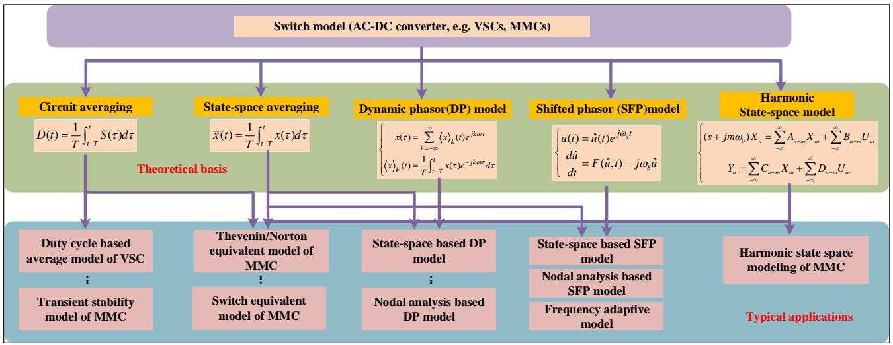  
Fig. 1. Modeling to study the interactions between AC/DC grids

[21], shifted phasor model [22]-[23], and harmonic statespace (HSS) averaging techniques [24]. are proposed. Typical applications of the MMC have been proposed, such as the transient stability of the MMC[14], preserving only dynamics of controllers; the detailed equivalent model of the MMC [17], preserving the system-level dynamics, etc. Previous work mainly focuses on improving the efficiency so that the averaged models can be applied for system-level studies, but few of them can provide additional and useful information especially for the harmonic interaction analysis. Recently, the frequencydomain and small-signal based harmonic state-space (HSS) averaging technique is used to derive the impedance model of the converters [25]-[30]. However, the HSS model is only a small-signal model, which must be linearized around steadystate point. Moreover, the dimension of the update equation of the HSS model rises as the order of the harmonics and the number of state variables are increased.

Let us pause for a moment and make the reader think about the essential purpose of time-domain simulations despite improving the simulation efficiency while satisfying the accuracy expectations: (1) Is the purpose of EMT simulation only to reproduce the results of time domain simulations? (2) Whether time domain simulation can provide additional information for harmonic interactions? (3) After thoroughly investigating previous work, we cannot help to think that is there any new method modeling of power electronic devices, which can

produce large-signal dynamics for harmonic analysis after the occurrence/clearance of the fault?

To extend the traditional EMT models into a more advanced one, which is capable of producing instantaneous time-domain waveforms and instantaneous harmonic phasor waveforms simultaneously, the harmonic phasor domain (HPD) modeling of power electronic based dc grids is proposed. The HPD modeling of dc grids is then combined with traditional EMT model based ac grids by adopting the propose HPD transmission line model (HPD-TLM). The salient features of the proposed HPD based co-simulations include:

(i) generalization of new HPD models based on the concept of harmonic phasors are derived and further applied for the modeling of two-level VSCs and MMCs. The advantages of HPD model are that it can extend the limited time-step to a much larger one, such as 500µs while preserving the satisfied accuracy; it can efficiently produce instantaneous time-domain waveforms and instantaneous harmonic phasor waveforms simultaneously;   
(ii) different from the frequency-domain and the state-space variable based HSS model, the proposed HPD model is a timedomain large-signal dynamic and nodal analysis-based model, which can trace the large-signal dynamics of ac/dc grids after the occurrence and clearance of the fault;   
(iii) the proposed HPD model can produce instantaneous time-domain waveforms and instantaneous harmonic phasor

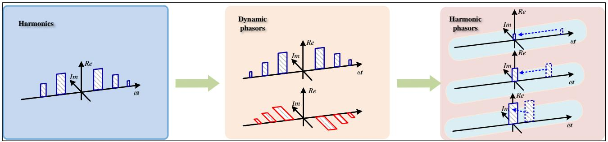  
Fig. 2. Physical interpretation of the proposed harmonic domain phasors

waveforms simultaneously. Noticeably, the harmonic phasor waveforms can be the exact envelopes of the instantaneous harmonic values;

(iv) different from the HSS model, the proposed HPD cosimulation method can produce the small-signal dynamics around the steady state and the large-signal dynamics after the occurrence/clearance of the fault;   
(v) the dimension of the system-level nodal voltage equation will not expand when the number of state variables and the number of harmonics are increased, which is more suitable for the simulations and harmonic analysis of the large-scale AC/DC grids.

The rest of the paper is organized as follows: Section II introduces the derivation HPD modeling. Section III elaborates HPD modeling of typical dc-grid components; Section IV detailes the overall realization of the HPD based co-simulations. Section IV examines the performance of the proposed method on a practical AC/DC system in China. Brief conclusions are finally drawn in Section V.

# II. GENERALIZATION OF HARMONIC PHASOR DOMAIN(HPD) MODELING

Generally, the frequency band of electric quantities in largescale power systems can be regarded as a narrow band centered around the fundamental frequency 50Hz. Therefore, Several shifted frequency techniques, such as the shifted frequency phasor (SFP) models [22]-[23], or the time-domain matrix transformation based SFP models (Matrix-SFP) [32] have been proposed to transfer the fast-varying instantaneous vales to the slow-varying phasor values, under the hypothesis that the electric quantities are centered around the fundamental frequency.

For power electronic system, actually, there is no fixed characteristic frequency, especially when the system contains high frequency power electronic devices, such as voltage source converter (VSC) and modular multi-level converter (MMC), etc. In order to capture the high-frequency harmonic dynamics inside the power electronic systems, the harmonic phasor domain (HPD) modeling is proposed.

# A. Concept of Harmonic Phasor Domain (HPD) Modeling

The idea of harmonic phasor domain (HPD) modeling is originated from the idea to include instantenous harmonic values of high frequency power electronic devices. Based on

the Fourier series analysis, the $\mathrm { k } ^ { t h }$ time-varying harmonics can be represented (see Fig. 2(a-b)):

$$
\langle x \rangle_ {k} (t) = \left[ \begin{array}{c c} \langle x \rangle_ {k} ^ {R} (t) & \langle x \rangle_ {k} ^ {I} (t) \end{array} \right]
$$

$$
\langle x \rangle_ {k} ^ {R} (t) = \operatorname {R e} \left\{\frac {1}{T} \int_ {t - T} ^ {t} x (\tau) e ^ {- j k \omega_ {s} \tau} d \tau \right\}, \tag {1}
$$

$$
\langle x \rangle_ {k} ^ {I} (t) = \operatorname {I m} \left\{\frac {1}{T} \int_ {t - T} ^ {t} x (\tau) e ^ {- j k \omega_ {s} \tau} d \tau \right\}
$$

where $\langle x \rangle _ { k } ( t )$ denotes the $\mathrm { k } ^ { t h }$ dynamic phasor, $\langle x \rangle _ { k } ^ { R } ( t )$ and $\langle x \rangle _ { k } ^ { I } ( t )$ denote the real and imaginary part of $\langle x \rangle _ { k } ( t )$ .

Based on the concept of dynamic phasors, the proposed harmonic phasor can be defined:

$$
\langle x \rangle_ {k} ^ {H D} (t) = \left[ \begin{array}{c c} \langle x \rangle_ {k} ^ {R} (t) & \langle x \rangle_ {k} ^ {I} (t) \end{array} \right] \mathbf {T} (- k, t),
$$

$$
\mathbf {T} (k, t) = \left[ \begin{array}{c c} \cos k \omega_ {s} t & - \sin k \omega_ {s} t \\ \sin k \omega_ {s} t & \cos k \omega_ {s} t \end{array} \right], \tag {2}
$$

The physical interpretation of the proposed harmonic domain phasors is illustrated in Fig. 2. As can be seen, the time-domain signal is first decomposed into several Fourier series. And then, each Fourier series will be transformed to the corresponding dynamic phasor. Finally, the desired harmonic phasors can be calculated according to Eq. (2) by harmonic shifting in the frequency domain.

In the following, the HPD modeling of the benchmark state space equations will be derived. First, the state space equation of the $\mathrm { k } ^ { t h }$ dynamic phasor is given:

$$
\frac {d \langle x \rangle_ {k} (t)}{d t} = \boldsymbol {A} \langle x \rangle_ {k} (t) + \boldsymbol {B} \langle u \rangle_ {k} (t), k = 0, 1, 2 \dots . \tag {3}
$$

where A, B are the parameter matrixes.

According to (2), the HPD modeling of state space equation can be derived by separating the real and imaginary parts:

$$
\frac {d \langle x \rangle_ {k} ^ {H D} (t)}{d t} = \mathbf {A} \langle x \rangle_ {k} ^ {H D} (t) + \mathbf {B} \langle u \rangle_ {k} ^ {H D} (t) - \langle x \rangle_ {k} ^ {H D} (t) \mathbf {T} \left(k, - \frac {\pi}{2 k \omega_ {s}}\right) \tag {4}
$$

After discretization of (4), the update of kth harmonics in a instantaneous way can be calculated as:

$$
\begin{array}{l} \frac {\langle x \rangle_ {k} (t) - \langle x \rangle_ {k} (t - \Delta t) \mathbf {T} (k , - \Delta t)}{\Delta t} \\ = \frac {1}{2} \left[ \begin{array}{l} \boldsymbol {A} \langle x \rangle_ {k} (t) + \boldsymbol {B} \langle u \rangle_ {k} (t) - \langle x \rangle_ {k} (t) \mathbf {T} \left(k, - \frac {\pi}{2 k \omega_ {s}}\right) \\ + \boldsymbol {A} \langle x \rangle_ {k} (t - \Delta t) \mathbf {T} (k, - \Delta t) + \\ \boldsymbol {B} \langle u \rangle_ {k} (t - \Delta t) \mathbf {T} (k, - \Delta t) - \langle x \rangle_ {k} (t - \Delta t) \mathbf {T} (k, - \Delta t - \frac {\pi}{2 k \omega_ {s}}) \end{array} \right] \tag {5} \\ \end{array}
$$

$$
\begin{array}{l} \left[ \begin{array}{c c c c} \operatorname {R e} \left(G _ {c, k} + G _ {r 1, k}\right) & - \operatorname {I m} \left(G _ {c, k} + G _ {l 1, k}\right) & - \operatorname {R e} \left(G _ {r 1, k}\right) & \operatorname {I m} \left(G _ {r 1, k}\right) \\ \operatorname {I m} \left(G _ {c, k} + G _ {r 1, k}\right) & \operatorname {R e} \left(G _ {c, k} + G _ {l 1, k}\right) & - \operatorname {I m} \left(G _ {r 1, k}\right) & - \operatorname {R e} \left(G _ {r 1, k}\right) \\ - \operatorname {R e} \left(G _ {l 1, k}\right) & \operatorname {I m} \left(G _ {l 1, k}\right) & \operatorname {R e} \left(G _ {l 1, k} + G _ {l 2, k}\right) & - \operatorname {I m} \left(G _ {l 1, k} + G _ {l 2, k}\right) \\ - \operatorname {I m} \left(G _ {l 1, k}\right) & - \operatorname {R e} \left(G _ {l 1, k}\right) & \operatorname {I m} \left(G _ {l 1, k} + G _ {l 2, k}\right) & \operatorname {R e} \left(G _ {l 1, k} + G _ {l 2, k}\right) \end{array} \right] \left[ \begin{array}{c} v _ {k, x} ^ {1} (t) \\ v _ {k, y} ^ {1} (t) \\ v _ {k, x} ^ {2} (t) \\ v _ {k, y} ^ {2} (t) \end{array} \right] \tag {11} \\ = \left[ \begin{array}{c c} I _ {k} \sin k \omega t \\ I _ {k} \cos k \omega t \\ 0 \\ 0 \end{array} \right] + \left[ \begin{array}{c c} J _ {c, x} (t - \Delta t) + J _ {l 1, x} (t - \Delta t) \\ J _ {c, y} (t - \Delta t) + J _ {l 1, y} (t - \Delta t) \\ - J _ {l 1, x} (t - \Delta t) + J _ {l 2, x} (t - \Delta t) \\ - J _ {l 1, y} (t - \Delta t) + J _ {l 2, y} (t - \Delta t) \end{array} \right] \\ \end{array}
$$

Here, “the instantaneous way” refers to that harmonics of power electronic devices and the time-domain EMT results are calculated simultaneously. As a result, the HPD modeling can produce the instantaneous harmonic values of each power electronic devices and thus the contribution of each harmonics aroused by the wide frequency band harmonic interactions can be meticulously identified.

# B. A Simple Circuit based on HPD Modeling

To help readers better understand the derivation of the HPD modeling, a simple circuit is taken as an illustrative example, as shown in Fig. 3.

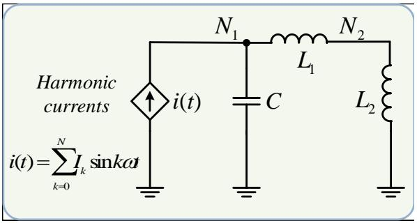  
Fig. 3. a simple circuit based on the proposed harmonic phasors

First, the state space equation of the $\mathrm { k } ^ { t h }$ dynamic phasor of a capacitor is given:

$$
C \frac {d \langle u _ {c} \rangle_ {k} (t)}{d t} = \langle i _ {c} \rangle_ {k} (t) \tag {6}
$$

Where $u _ { c } , \ i _ { c }$ denote the capacitor voltage and current.

According to Eq. (2), the HPD modeling of state space equation can be derived by separating the real and imaginary parts:

$$
C \frac {d \langle u _ {c} \rangle_ {k} ^ {H D} (t)}{d t} = \left\langle i _ {c} \right\rangle_ {k} ^ {H D} (t) - \left\langle u _ {c} \right\rangle_ {k} ^ {H D} (t) \mathbf {T} \left(k, - \frac {\pi}{2 k \omega_ {s}}\right) \tag {7}
$$

After discretization of (7) by Trapezoidal algorithm, the update of time-domain $\mathrm { k } ^ { t h }$ harmonics in an instantaneous way can be calculated as:

$$
\langle i _ {c} \rangle_ {k} (t) = G _ {c, k} \left\langle u _ {c} \right\rangle_ {k} (t) + J _ {c, k} (t - \Delta t) \tag {8}
$$

where

$$
\left\{ \begin{array}{c} G _ {c, k} = \frac {2 C}{\Delta t} + \mathbf {T} \left(k, - \frac {\pi}{2 k \omega_ {s}}\right) \\ J _ {c, k} (t - \Delta t) = \left\langle u _ {c} \right\rangle_ {k} (t - \Delta t) \mathbf {T} \left(k, \Delta t - \frac {\pi}{2 k \omega_ {s}}\right) \\ - \left\langle i _ {c} \right\rangle_ {k} (t - \Delta t) \mathbf {T} (k, \Delta t) \end{array} \right. \tag {9}
$$

With all the network components represented by HPDderived Norton equivalents, the whole system is then formulated into nodal voltage equations, the solution to which prompts the instantaneous harmonics of different components. The system-level equation is written as:

$$
\begin{array}{l} \left[ \begin{array}{l l} \operatorname {R e} \left(G _ {k}\right) & - \operatorname {I m} \left(G _ {k}\right) \\ \operatorname {I m} \left(G _ {k}\right) & \operatorname {R e} \left(G _ {k}\right) \end{array} \right] \left[ \begin{array}{l} v _ {k, x} (t) \\ v _ {k, y} (t) \end{array} \right] \tag {10} \\ = \left[ \begin{array}{c} i _ {k, x} (t) \\ i _ {k, y} (t) \end{array} \right] + \left[ \begin{array}{c} J _ {k, x} (t - \Delta t) \\ J _ {k, y} (t - \Delta t) \end{array} \right] \\ \end{array}
$$

where $G _ { k }$ denotes the complex-value-based conductance matrix of the $\mathrm { k } ^ { t h }$ harmonic phasors; $[ \nu _ { k , x } ( t ) , ~ \nu _ { k , y } ( t ) ]$ denote the vector of nodal voltages of the $\mathrm { k } ^ { t h }$ harmonic phasor; $[ i _ { k , x } ( t ) , \ i _ { k , y } ( t ) ]$ ] denote the vector of external current sources of the $\mathrm { k } ^ { t h }$ harmonic phasor; $[ J _ { k , x } ( t - \Delta t ) , J _ { k , y } ( t - \Delta t ) ]$ ] denote the equivalent current vector of the $\mathrm { k } ^ { t h }$ harmonic phasor.

Take the circuit in Fig. 1 as an example, the system-level equation based on the harmonic phaosrs is derived as in Eq. (11). Where $G _ { c , k } , G _ { l 1 , k } , G _ { l 2 , k }$ denote the conductance terms of the capacitor and the inductor L1, L2, respectively; Iksinωt denotes the instantaneous value of the injected harmonic current; $J _ { c , x } ( t - \Delta t ) , J _ { c , y } ( t - \Delta t )$ denote the equivalent currents of the $\mathrm { k } ^ { t h }$ harmonic phasor for the capacitor; $J _ { l 1 , x } \big ( t - \Delta t \big ) , J _ { l 1 , y } \big ( t - \Delta t \big )$ denote the equivalent currents of the $\operatorname { k } ^ { t h }$ harmonic phasor for L1; $J _ { l 2 , x } ( t - \Delta t ) , \ J _ { l 2 , y } ( t - \Delta t )$ denote the equivalent currents of the $\mathrm { k } ^ { t h }$ harmonic phasor for L2; $\nu _ { k , x } ^ { 1 } ( t ) , ~ \nu _ { k , y } ^ { 1 } ( t )$ denote the nodal voltage vector of node $1 ; \nu _ { k , x } ^ { 2 } ( t ) , \nu _ { k , y } ^ { 2 } ( t )$ denote the nodal voltage vector of node 2.

Based on the calculations of Eq. (11) in an iterative way, the instantaneous harmonics of the circuit in Fig. 3 can be obtained.

# C. Differences between the Proposed HPD model with the HSS model

The differences between the proposed HPD model and the HSS model are detailed below:

(1) The dimension of the proposed HPD model is 4 according to the circuit in Fig. 3, i.e., the node number is multiplied by 2; the dimension of the HSS model is the number of state variables, or 3, is multiplied by the number of harmonics, or 7. The final dimension of the HSS model is 21. Consequently, the dimension of the HSS model will be sharply increased by the number of state variables and the number of harmonics. On the contrary, the dimension of the proposed HPD model

is only dependent upon the number of node buses, much lower than that of the HSS model. The dimension of the overall system-level equations will directly affect the overall simulation efficiency, where the proposed HPD model is more suitable for the harmonic analysis of the large-scale AC/DC grids, including thousands of AC buses, and thousands of DC electric and control buses, which is fully verified by the simulation cases.

(2) The proposed HPD model can produce instantaneous time-domain waveforms and instantaneous harmonic phasor waveforms at the same time according to Eq. (5), while the HSS model can only give steady-state harmonic values around the steady state point. In other words, the results of the HSS model are only the steady-state phasor values, not the timevarying instantaneous harmonic waveforms.

According to [27], the results of the HSS model are phasor values in the frequency domain, or

$$
\begin{array}{l} s X = (A - N) X + B U, \\ X = \left[ \begin{array}{l l l l} \dots & \hat {x} (s _ {1}) & \hat {x} (s) & \hat {x} (s _ {- 1}), \dots \end{array} \right] ^ {T} \tag {12} \\ \end{array}
$$

All the final results, such as

$. . . . . , \hat { x } ( s _ { 2 } ) , \hat { x } ( s _ { 1 } ) , \hat { x } ( s ) , \hat { x } ( s _ { - 1 } ) , \hat { x } ( s _ { - 2 } ) , . . . .$ . are only steady state phasor values, or $\hat { x } ( s _ { i } ) = \left| \hat { x } ( s _ { i } ) \right| \angle \hat { x } ( s _ { i } )$ , where $\vert \hat { x } ( s _ { i } ) , \ \vert \angle \hat { x } ( s _ { i } )$ denote the phasor value and the angle value of the harmonics in the frequency domain.

On the contrary, the simulation results of the HPD model are the time-domain instantaneous harmonic waveforms, such as $\langle x \rangle _ { k } ^ { H D } ( t )$ , where x denotes the state variable and k denotes the index of the harmonics.

Of course, We do not say that our proposed HPD model is superior to the HSS model. Actually, different methods of modeling have their own advantages, and the HSS model is beneficial to derive the impedance model of converters [26]- [27].

D. Discussion on the Advantages and the Time-step of the HPD Modeling

Normally, the time-step of AC/DC grids is limited under 20µs due to numerical convergence issues [33]. Consequently, when there are hundreds or even thousands of power switches inside the system, the simulation efficiency will be quite unacceptable. On the contrary, the proposed HPD modeling can extend the time-step of AC/DC grids to even 500µs or larger.

The direct advantage of the presented HPD model constructed by frequency shifting is that a much larger timestep can be used, resulting in significant improvement of the simulation efficiency, where the interested instantaneous harmonic phasor waveforms can be traced and simulated. These instantaneous harmonic phasor waveforms can be quite useful for the harmonic interaction studies of the MMCs and adjacent AC grids.

The reason is given below: Suppose the original frequency band of simulated system is $\left[ \left( k - 1 \right) \omega _ { s } - \Delta \omega , k \omega _ { s } + \Delta \omega \right]$ , $k =$ $1 , 2 . . . . N , N = [ \omega _ { \mathrm { m a x } } / \omega _ { s } ] + 1 , \Delta \omega \ll \omega _ { s }$ where $\omega _ { s }$ denote the fundamental frequency; $\omega _ { m a x }$ is the maximum frequency. Based on our proposed HPD models, the $\mathrm { k } ^ { t h }$ frequency band will be shifted to $[ - \Delta \omega , \Delta \omega ]$ . According to the Nyquist

criterion, the maximum time-step for HPD models should satisfy $\Delta T _ { \mathrm { m a x } } \leq \pi / \Delta \omega$ , where the traditional EMT models should satisfy $\Delta T _ { \mathrm { m a x } } \leq \pi / \left( N \omega _ { s } + \Delta \omega \right)$ . This is the reason why the proposed method can extend time-step to a significantly larger one.

Concerning the simulation efficiency, although the harmonic phasors will be expanded k times if $\mathrm { k } ^ { t h }$ harmonic phasors are included in the model, each harmonic phasor will be calculated in an independent and paralleled way. In other words, the parallel technique, such as openMP technique, can guarantee the HPD model is as efficient as the traditional EMT models. The openMP method is a paralleled computing technique in C++, which enables the desired paralleled computing or the update of different order of the harmonic phasors simultaneously. Amazingly, the HPD model can not only guarantee the required accuracy, providing the additional harmonic phasors, but also it can be much more efficient than the traditional EMT models by extending the limited and small time-step to a more ideal and much larger one. As researchers may argue that “there is no free lunch”, we should admit that the programming complexity has to be increased with much more attention and carefulness.

III. HPD MODELING OF TYPICAL DC-GRID COMPONENTS

In order to evaluate the efficacy of the proposed HPD modeling for the generalization of different power electronic devices, two typical high frequency power electronics, or the two level voltage source converter (VSC), and modular multilevel converter (MMC) are derived and represented as their corresponding HPD models. Thus, the HPD model resembles the practical system by providing the detailed instantaneous waveforms, with the additional benefit of providing the instantaneous harmonic waveforms.

A. HPD Modeling of Two-level VSC based Converter

1) HPD Modeling of the Main Circuit of the VSC: The typical structure of a two-level VSC is given in Fig. 4. As can be seen, the AC side of the VSC is modeled as a controlled voltage source while the DC side of the VSC is equivalent to a controlled current source. The electric connections between AC and DC sides are characterized by a PWM controlled switch function. According to the modulation theory, the formula for calculating the controlled voltage source is given in Eq. (13), where $S _ { a } , ~ S _ { b } , ~ S _ { c }$ denote the switch function of each phase. The current relationship between AC side and DC side of VSC can be described as follows:

$$
\langle i _ {d c} \rangle_ {k} ^ {H D} = \frac {1}{2} \sum_ {l = - \infty} ^ {\infty} \left( \begin{array}{c} \langle i _ {a} \rangle_ {l} ^ {H D} \langle S _ {a} \rangle_ {k - l} ^ {H D} + \\ \langle i _ {b} \rangle_ {l} ^ {H D} \langle S _ {b} \rangle_ {k - l} ^ {H D} + \langle i _ {c} \rangle_ {l} ^ {H D} \langle S _ {c} \rangle_ {k - l} ^ {H D} \end{array} \right) \tag {14}
$$

Similarly, according to the properties of harmonic phasors, the HPD model of the three-phase RL filter can be described as follows:

$$
\left\{ \begin{array}{l} L \frac {d \langle i _ {a} \rangle_ {k} ^ {H D}}{d t} = \langle u _ {a} ^ {\prime} \rangle_ {k} ^ {H D} - \langle u _ {a} \rangle_ {k} ^ {H D} - \left(R + \mathbf {T} (k, - \frac {\pi}{2 k \omega_ {s}}) L\right) \langle i _ {a} \rangle_ {k} ^ {H D} \\ L \frac {d \langle i _ {b} \rangle_ {k} ^ {H D}}{d t} = \langle u _ {b} ^ {\prime} \rangle_ {k} ^ {H D} - \langle u _ {b} \rangle_ {k} ^ {H D} - \left(R + \mathbf {T} (k, - \frac {\pi}{2 k \omega_ {s}}) L\right) \langle i _ {b} \rangle_ {k} ^ {H D} \\ L \frac {d \langle i _ {c} \rangle_ {k} ^ {H D}}{d t} = \langle u _ {c} ^ {\prime} \rangle_ {k} ^ {H D} - \langle u _ {c} \rangle_ {k} ^ {H D} - \left(R + \mathbf {T} (k, - \frac {\pi}{2 k \omega_ {s}}) L\right) \langle i _ {c} \rangle_ {k} ^ {H D} \end{array} \right. \tag {15}
$$

$$
\left\{ \begin{array}{l} \langle u _ {a} \rangle_ {k} ^ {H D} = \frac {1}{2} \langle u _ {d c} S _ {a} \rangle_ {k} ^ {H D} - \langle u _ {0} \rangle_ {k} ^ {H D} = \frac {1}{2} \sum_ {l = - \infty} ^ {\infty} \left(\langle u _ {d c} \rangle_ {l} ^ {H D} \cdot \langle S _ {a} \rangle_ {k - l} ^ {H D}\right) - \langle u _ {0} \rangle_ {k} ^ {H D} \\ \langle u _ {b} \rangle_ {k} ^ {H D} = \frac {1}{2} \langle u _ {d c} S _ {b} \rangle_ {k} ^ {H D} - \langle u _ {0} \rangle_ {k} ^ {H D} = \frac {1}{2} \sum_ {l = - \infty} ^ {\infty} \left(\langle u _ {d c} \rangle_ {l} ^ {H D} \cdot \langle S _ {b} \rangle_ {k - l} ^ {H D}\right) - \langle u _ {0} \rangle_ {k} ^ {H D} \\ \langle u _ {c} \rangle_ {k} ^ {H D} = \frac {1}{2} \langle u _ {d c} S _ {c} \rangle_ {k} ^ {H D} - \langle u _ {0} \rangle_ {k} ^ {H D} = \frac {1}{2} \sum_ {l = - \infty} ^ {\infty} \left(\langle u _ {d c} \rangle_ {l} ^ {H D} \cdot \langle S _ {c} \rangle_ {k - l} ^ {H D}\right) - \langle u _ {0} \rangle_ {k} ^ {H D} \end{array} \right. \tag {13}
$$

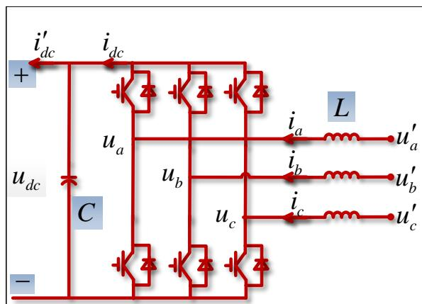

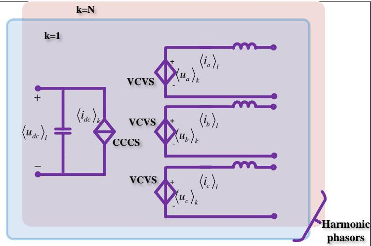

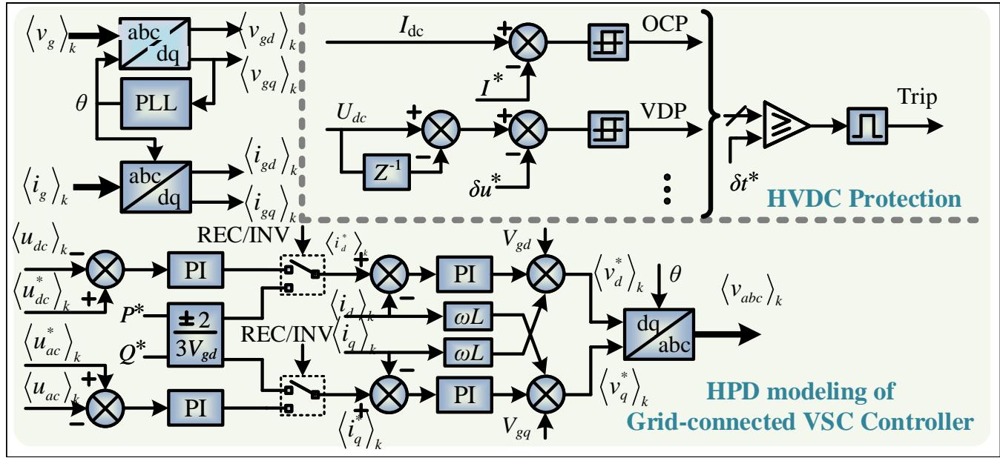  
Fig. 4. HPD model of two-level VSC   
Fig. 5. Control and protection system of the VSC

Where R, L correpsond to the resistance and inductor of the filter.

The harmonic phasor model of DC capacitor can be described as follows:

$$
C \frac {d \langle u _ {d c} \rangle_ {k} ^ {H D}}{d t} = \left\langle i _ {d c} ^ {\prime} \right\rangle_ {k} ^ {H D} - \left\langle i _ {d c} \right\rangle_ {k} ^ {H D} - \mathbf {T} (k, - \frac {\pi}{2 k \omega_ {s}}) C \left\langle u _ {d c} \right\rangle_ {k} ^ {H D} \tag {16}
$$

Consequently, Eqs. (14)-(16) constitute the overall HPD model of the two-level VSC, where the numerical calcalations can be carried out in the nodal analysis form according to Eqs. (1)-(5).

2) HPD Modeling of the Controllers of the VSC: The control and protection system of the VSC in the HPD subsystem is taken as an example, which is shown in Fig. 5. Here the trip signal is to determine the converter to be blocked or not. For example, when the dc current or the dc voltage is larger than the threshold value, the MMC converter will be blocked. As can be seen, the most difficult component of the controller is the PI component, where other components can be realized by simple mathematical calculations, such as the multiplications and divisions. The realization of the PI component is detailed below, with the equation in s domain:

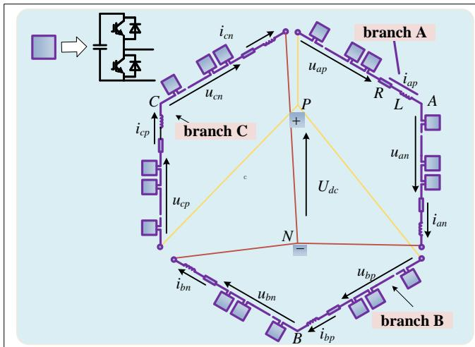

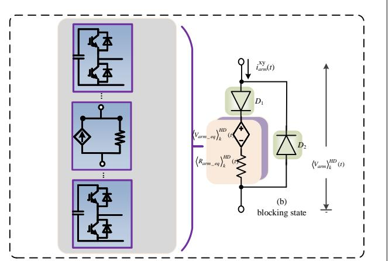  
Fig. 6. HPD model of MMC

$$
x (s) \left[ K _ {p} + \frac {1}{T _ {i} s} \right] = u (s) \tag {17}
$$

Where $x ( s ) , u ( s )$ denote the input and the output in s domain; $K _ { p }$ and $T _ { i }$ denote the parameters of the PI component. After transforming eq. (17) in s domain to that in time-domain as:

$$
\frac {1}{T _ {i}} x (t) = \frac {d}{d t} u (t) - K _ {p} \frac {d}{d t} x (t) \tag {18}
$$

After discretizing Eq. (18) by Backward Euler algorithm, and transforming all the variables into the time-domain form as:

$$
\begin{array}{l} \left[ \Delta t \mathbf {T} \left(k, - \frac {\pi}{2 k \omega_ {s}}\right) - I \right] \langle u \rangle_ {k} (t) \\ = \left[ K _ {p} - \frac {\Delta t}{T _ {i}} - \Delta t \mathbf {T} \left(k, - \frac {\pi}{2 k \omega_ {s}}\right) \right] \langle x \rangle_ {k} (t) \tag {19} \\ - K _ {p} \mathbf {T} (k, \Delta t) \langle x \rangle_ {k} (t - \Delta t) - \langle u \rangle_ {k} (t - \Delta t) \mathbf {T} (k, \Delta t) \\ \end{array}
$$

The update of the output variables of $\langle u \rangle _ { k } ( t )$ can be obtained according to Eq. (19).

# B. HPD Modeling of MMC based Converter (HPD based Coupling Circuit)

The MMC structure can be regarded as the hexagon shape of two upper and lower arms for abc three-phases, in which the upper arm of each phase has the same anode, the lower arm of each phase has the same cathode, and the middle point of the upper and lower arm is the output node of the AC side. As can be seen in Fig. 6, extensive symmetries exist in the MMC, or the three phases have an identical topology and so do the each sub-module inside each arm. Consequently, the HPD model of the MMC can be derived from the parallelism of the model structure, where its HPD model is derived level by level, i.e., sub-module level, arm level and the system level.

1) HPD Modeling of MMC Sub-modules: The HPD model of MMC sub-modules can be represented as a switched

capacitor. According to $( 1 ) ‐ ( 5 ) ,$ the capacitor of each submodule can be represented as:

$$
\left\{ \begin{array}{c} \langle G _ {c} \rangle_ {k} ^ {H D} = \left[ I + \frac {\Delta t}{2} \mathbf {T} \left(k, - \frac {\pi}{2 k \omega_ {s}}\right) \right] ^ {- 1} \frac {\Delta t C}{2} \\ \langle J _ {c} \rangle_ {k} ^ {H D} (t - \Delta t) = K _ {v} \langle i _ {c} \rangle_ {k} ^ {H D} (t - \Delta t) + K _ {v} \langle u _ {c} \rangle_ {k} ^ {H D} (t - \Delta t) \end{array} \right. \tag {20}
$$

where

$$
\left\{ \begin{array}{c} K _ {v} = \left[ I + \frac {\Delta t}{2} \mathbf {T} \left(k, - \frac {\pi}{2 k \omega_ {s}}\right) \right] ^ {- 1} \frac {\Delta t C}{2} \\ K _ {i} = \left[ I + \frac {\Delta t}{2} \mathbf {T} \left(k, - \frac {\pi}{2 k \omega_ {s}}\right) \right] ^ {- 1} \left[ I + \frac {\Delta t}{2} \mathbf {T} \left(k, - \frac {\pi}{2 k \omega_ {s}}\right) \right] \end{array} \right. \tag {21}
$$

2) HPD Modeling for the MMC Arm Model: Usually, the arm current is rotating at a frequency much lower than that of the digital sampling rate. That is to say, the MMC arm model splitting all the submodules from the arms by a pair of coupled Thevenin-Norton equivalent circuits will not affect the accuracy (see Fig. 6). Then, the partitioned MMC corresponding to a collection of Norton equivalent sub-module model can be processed more efficiently, particularly when the processer supports parallel computation.

The HPD modeling for the MMC arm model, which is further used for the system-level calculations, is amalgamated by adding all the HPD based Thevenin circuits of all the submodules together:

$$
\left\{ \begin{array}{c} \langle V _ {\text {a r m}} \rangle_ {k} ^ {H D} (t) = \sum_ {i \in \Omega} \langle G _ {c, i} \rangle_ {k} ^ {H D} \langle J _ {c, i} \rangle_ {k} ^ {H D} (t - \Delta t) \\ \left\langle R _ {\text {a r m} - e q} \right\rangle_ {k} ^ {H D} (t) = \sum_ {i \in \Omega} \left[ \left\langle G _ {c, i} \right\rangle_ {k} ^ {H D} \right] ^ {- 1} \end{array} \right. \tag {22}
$$

where Ω denotes the set, where all the submodules inside the arm are conducted; $\langle V _ { a r m } \rangle _ { k } ^ { H D } ( t ) , \ : \left. R _ { a r m \_ e q } \right. _ { k } ^ { H D } ( t )$ D (t), 
Rarm eqHk denote the $\mathrm { k } ^ { t h }$ harmonic phasor for the Thevenin voltage and impedance respectively.

3) HPD Modeling for the MMC System-level Model: Finally, the sytem level HPD modeling for the MMC, considering the blocking/de-blocking capabilities is also detailed in Fig. 6, which is equivalent to the combination of the HPD based Thevenin equivalent circuit and accompanied diodes.

# IV. HARMONIC PHASOR DOMAIN (HPD) CO-SIMULATION METHOD

# A. Network Partitioning based on the HPD-TLM

Generally, the frequency band of power system, which is governed by dynamics of generators and transmission lines, etc., can be regarded as a narrow band centered around the fundamental frequency, i.e., 50Hz. Unexpectedly, for the harmonic dominated power electronic devices, the time-step of these high-frequency power electronic devices by the traditional EMT models will be limited under an unanimous and tiny one, or less than 10-20µs. In order to capture the harmonic dynamics of power electronic devices in an accurate and efficient way, the HPD model is proposed to obtain multiple harmonics of power electronic devices in a paralleled and simultaneous way.

As shown in Fig. 7, the first step for the proposed harmonic phasor domain (HPD) co-simulation method is to decouple the whole system into the respective HPD subsystem and the EMT subsystem. The large-scale AC grids, incorporating generators and transmission lines, etc., are included in the EMT subsystem. The harmonic dominated power electronic devices, such as the VSC/MMC based HVDC transmissions, etc., are included in the harmonic phasor domain (HPD) subsystem. The advantages of HPD models of high frequency power electronic devices lie in the following aspects: (1) the multiple harmonics can be accurately and separately simulated for each power electronic devices; (2) the efficiency can be significantly improved by the extension of time-step to 100µs or larger; the paralleled computation of different harmonics. The harmonic interactions between EMT and HPD subsystems are reflected by the proposed HPD transmission line model (HPD-TLM).

In the proposed co-simulation method (see Fig. 7), the HPD-TLM is represented as a time- and harmonic phasor domain based dual Norton equivalent circuit. Unexpectedly, the time delay τ is usually not an integer multiple of the time step, but it is lucky that historical values on either side can be interpolated so that their accurate values in time- and harmonic phasordomain can be obtained, respectively.

# B. The interface model between HPD and EMT subsystems

The interface model of HPD-TLM in the EMT subsystem is formulated in s domain:

$$
\left\{ \begin{array}{l} \frac {d \mathbf {u} _ {m} (x , s)}{d x} + s L \mathbf {i} _ {m} (x, s) = 0 \\ \frac {d \mathbf {i} _ {m} (x , s)}{d x} + s C \mathbf {u} _ {m} (x, s) = 0 \end{array} \right. \tag {23}
$$

where ${ \bf u _ { m } } ( { \bf x } , { \bf s } ) , \ { \bf i _ { m } } ( { \bf x } , { \bf s } )$ denote the voltage and current phasors of node m in s domain, respectively.

Applying partial derivative for x on both sides of (23), there is:

$$
\left\{ \begin{array}{l} \frac {\partial^ {2} \mathbf {u} _ {m} (x , s)}{\partial x ^ {2}} + L C s ^ {2} \mathbf {u} _ {m} (x, s) = 0 \\ \frac {\partial^ {2} \mathbf {i} _ {m} (x , s)}{\partial x ^ {2}} + L C s ^ {2} \mathbf {i} _ {m} (x, s) = 0 \end{array} \right. \tag {24}
$$

Performing inverse Laplace transformation to (24) yields :

$$
\left\{ \begin{array}{l} \mathbf {u} _ {m} (x, t) = \mathbf {u} _ {m} \left(t - \frac {x}{v}\right) + \mathbf {u} _ {m} \left(t + \frac {x}{v}\right) \\ \boldsymbol {i} _ {m} (x, t) = \boldsymbol {i} _ {m} \left(t - \frac {x}{v}\right) + \boldsymbol {i} _ {m} \left(t + \frac {x}{v}\right) \end{array} \right. \tag {25}
$$

where the speed of wave is $\nu = 1 / \sqrt { L C }$ .

The equivalent source in EMT subsystem $I _ { m } ( t - \tau )$ is calculated as:

$$
I _ {m} (t - \tau) = - Z ^ {- 1} u _ {n} (t - \tau) - i _ {n} (t - \tau) \tag {26}
$$

where $u _ { n } ( t - \tau ) , \ i _ { n } ( t - \tau )$ are instantaneous interface voltage and current of node n in HPD subsystem.

Similarly, the HPD-TLM in the HPD subsystem is modelled as:

$$
\left\{ \begin{array}{l} \frac {\partial \langle u _ {n} \rangle_ {k} ^ {H D} (x , t)}{\partial x} + L \frac {\partial \langle i _ {n} \rangle_ {k} ^ {H D} (x , t)}{\partial t} + L \langle i _ {n} \rangle_ {k} ^ {H D} (x, t) \mathbf {T} (k, - \frac {\pi}{2 k \omega_ {s}}) = 0 \\ \frac {\partial \langle i _ {n} \rangle_ {k} ^ {H D} (x , t)}{\partial x} + C \frac {\partial \langle u _ {n} \rangle_ {k} ^ {H D} (x , t)}{\partial t} + C \langle u _ {n} \rangle_ {k} ^ {H D} (x, t) \mathbf {T} (k, - \frac {\pi}{2 k \omega_ {s}}) = 0 \end{array} \right. \tag {27}
$$

where $\left. u _ { n } \right. _ { k } ^ { H D } \left( x , t \right) , \left. i _ { n } \right. _ { k } ^ { H D } \left( x , t \right)$ denote the $\mathrm { k } ^ { t h }$ harmonic phasors of $u _ { n } ( x , t )$ and $i _ { n } ( x , t )$ respectively.

Based on the same procedure as Eqs. (23)-(27), the Phasor-TLM in the HPD subsystem can be calculated by:

$$
\left\{ \begin{array}{l} \langle i _ {n} \rangle_ {k} ^ {H D} (t) = \langle u _ {n} \rangle_ {k} ^ {H D} (t) / Z + \langle I _ {n} \rangle_ {k} ^ {H D} (t - \tau) \\ \langle I _ {n} \rangle_ {k} ^ {H D} (t - \tau) = - Z ^ {- 1} [ \langle u _ {m} \rangle_ {k} ^ {H D} (t - \tau) \mathbf {T} (k, - \theta) ] \\ - \langle i _ {m} \rangle_ {k} ^ {H D} (t - \tau) \mathbf {T} (k, - \theta) \end{array} \right. \tag {28}
$$

where hik $\langle \rangle _ { k } ^ { H D } \left( t \right)$ denotes the $\mathrm { k } ^ { t h }$ harmonic phasor of the corresponding variable.

Eq. (26) and Eq. (28) constitute the overall phasor-TLM model between HPD and SFP subsystems. In order to realize the proposed HPD-TLM, how to update parameters of interface models of HPD-TLM will be detailed below.

1) Update of HPD-TLM in the EMT subsystem: The update of HMD-TLM contains two steps: (1) update the parallel impedance Z in time-domain; (2) update the desired Norton equivalent current $I _ { m } ( t - \tau )$ in time-domain.

To obtain ${ \cal I } _ { m } ( t - \tau ) \ , u _ { n } ( t - \tau ) , i _ { n } ( t - \tau )$ at node n should be converted from harmonic phasor form to the time-domain form:

$$
\mathbf {u} _ {n} (t - \tau) = \operatorname {R e} \left\{\sum_ {\substack {k = 1 \\ N}} ^ {N} \langle u _ {n} \rangle_ {k} ^ {H D} (t - \tau) \mathbf {T} (k, t) \right\}, \tag{29}
$$

$$
i _ {n} (t - \tau) = \operatorname {R e} \left\{\sum_ {k = 1} ^ {N} \langle i _ {n} \rangle_ {k} ^ {H D} (t - \tau) \mathbf {T} (k, t) \right\}
$$

$\left. u _ { n } \right. _ { k } ^ { H D } \left( t - \tau \right)$ is obtained by the interpolation in harmonic phasor domain:

$$
\langle u _ {n} \rangle_ {k} ^ {H D} (t - \tau) = \frac {i \Delta t - \tau}{\Delta t} \langle u _ {n} \rangle_ {k} ^ {H D} [ t - (i - 1) \Delta t ] \mathbf {T} [ k, \tau - (i - 1) \Delta t ]
$$

$$
+ \frac {\tau - (i - 1) \Delta t}{\Delta t} \left\langle u _ {n} \right\rangle_ {k} ^ {H D} [ t - i \Delta t ] \mathbf {T} [ k, \tau - i \Delta t ] \tag {30}
$$

where the time delay τ is supposed to be within the interval $[ ( i - 1 ) \Delta t , i \Delta t ]$ , and $i = [ \tau / \Delta t ] + 1$ with [.] indicating the integer function.

2) Update of HPD-TLM in the HPD to calculate the Norton equivalent current $\left. I _ { n } \right. _ { k } ^ { \check { H } D } \left( t - \tau \right)$ order in the form of the $\mathrm { k } ^ { t h }$ Fourier coefficient, the interface voltages and currents in the dynamic phasor form should be transformed to its harmonic phasor form by Fourier transform and rotational transform:

$$
\left\langle u _ {m} \right\rangle_ {k} ^ {H D} (t - \tau) = \left\langle u _ {m} \right\rangle_ {k} (t - \tau) \mathbf {T} (k, - t) \tag {31}
$$

Where $\left. u _ { m } \right. _ { k } \left( t - \tau \right)$ denote the $\mathrm { k } ^ { t h }$ dynamic phasor.

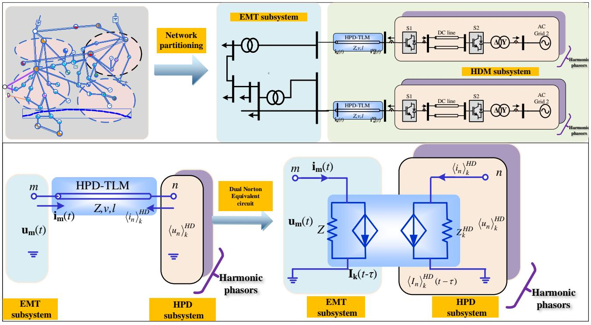  
Fig. 7. Harmonic phasor domain transmission line model (HPD-TLM)

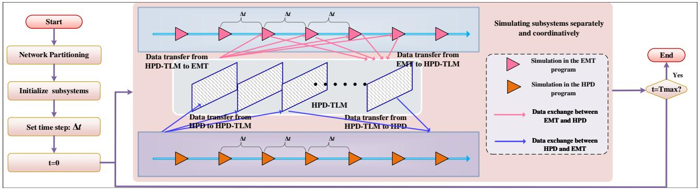  
Fig. 8. The detailed program flow, data path and coupling HPD-TLM model of the proposed co-simulation

$\left. u _ { m } \right. _ { k } \left( t - \tau \right)$ is the interface voltage in the EMT subsystem, which are calculated using interpolations in dynamic phasor domain:

$$
\begin{array}{l} \left\langle u _ {m} \right\rangle_ {k} (t - \tau) = \frac {i \Delta t - \tau}{\Delta t} \left\langle u _ {m} \right\rangle_ {k} [ t - (i - 1) \Delta t ] \tag {32} \\ + \frac {\tau - (i - 1) \Delta t}{\Delta t} \left\langle u _ {m} \right\rangle_ {k} [ t - i \Delta t ] \\ \end{array}
$$

where the time delay τ is supposed to be within the interval $[ ( i - 1 ) \Delta t , i \Delta t ]$ , and $i = [ \tau / \Delta t ] + 1$ with [.] indicating the integer function.

# C. The Overall Co-simulation Computational Framework

The detailed program flow, data path and coupling HPD-TLM model are illustrated in Fig. 8. The harmonic phasor based transmission-line modeling (HPD-TLM) solution of the wide frequency band and harmonic couplings is provided in details, and the parallelism of each subsystem, either in the time-domain or the harmonic phasor domain, is also noted. The program starts with partitioning the whole system into the

respective EMT and HPD subsystems; thus, the calculations of different subsystems can be carried out in an independent and paralleled way. Noticeably, high frequency power electronic devices, such as VSC or the MMCs, etc., are included in the HPD subsystem. The advantages of HPD models over the traditional EMT models are summarized as follows: (1) each harmonic phasor uses multi-core CPUs, such as openMP techniques, for parallel simulation, so the order of harmonic phasor will not affect the simulation efficiency of harmonic subsystem; (2) harmonic phasor can expand the simulation step to 500µs, while the traditional EMT models under such time-steps fail to converge. (3) Undoubtedly, the efficiency in the HPD subsystem will not become a troublesome issue, but providing the additional benefit of producing the instantaneous value curves of each harmonic phasor in real time.

The co-ordinations between HPD and EMT subsystems are constructed by the update of the so-called HPD-TLM model, which is detailed in Part IV(B). The update of dual Norton

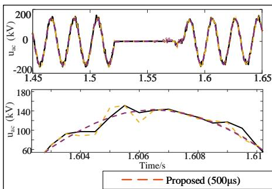

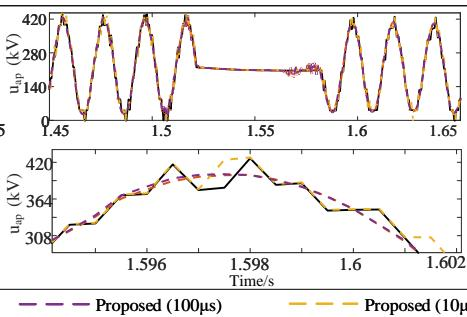

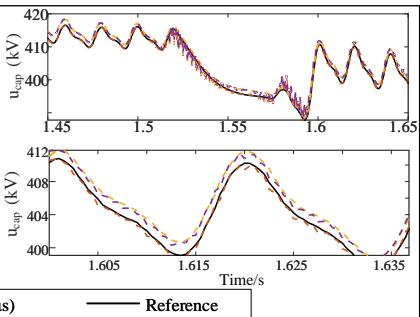

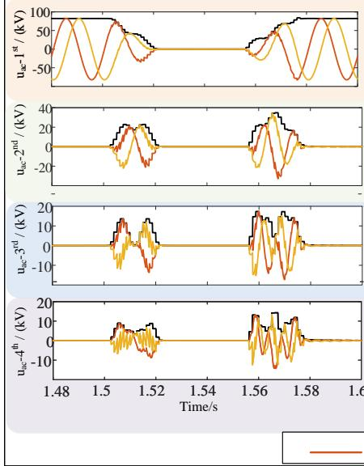  
Fig. 9. Instantaneous curves under different time-steps (a) ac voltage of phase A: uac; (b) arm voltage of phase $\mathrm { A } \colon u _ { a p } \ \mathrm { ( c ) }$ capacitor voltage of phase $\underline { { \mathbf { A } } } \mathrm { : } u _ { c a p }$

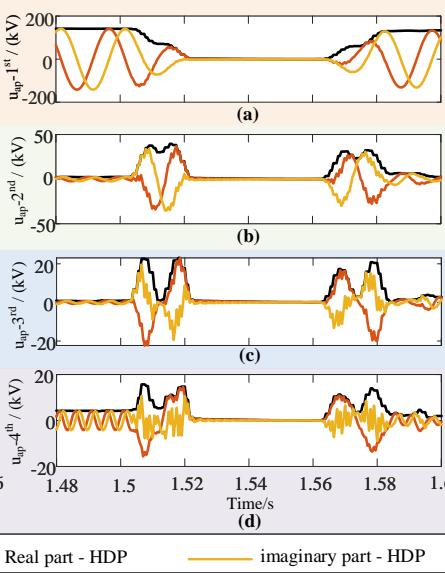

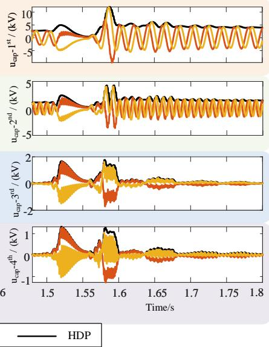

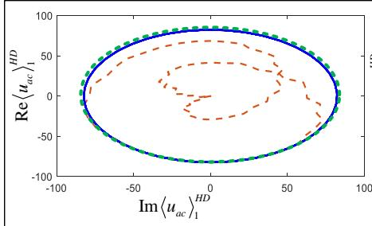  
Fig. 10. Instantaneous and harmonic domain phasor (HDP) curves (a) ac voltage of phase A: $u _ { a c } ;$ (b) arm voltage of phase $\mathbf { A } \colon u _ { a p }$ (c) capacitor voltage of phase A: ucap

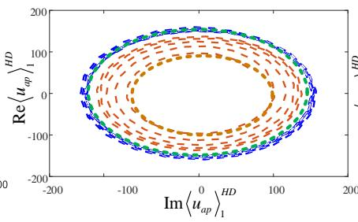

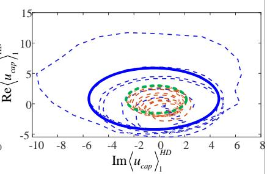  
Fig. 11. The phase diagram of the first order harmonic phasor (a) ac voltage of phase $\operatorname { A } \colon u _ { a c } ;$ (b) arm voltage of phase A: $u _ { a p }$ (c) capacitor voltage of phase A: ucap

equivalent circuits of HPD-TLM requires the data conversion from time-domain to harmonic phasor domain, and vise versa. Accurate and efficient wide frequency band and harmonic interactions can be meticulously captured based on such a coordinated and independent manner. The simulations will be carried out until the expected total time is reached.

Researchers may ask: what can we gain from the simulation results? Of course, the detailed EMT simulation results in the form of instantaneous waveforms will be given; and the additional harmonic phasor waveforms of each power electronic devices inside the HPD subsystem will also be emulated. These harmonic waveforms will be directly beneficial to the harmonic analysis or the interactions between high frequency power electronic devices and the large-scale AC grids.

# V. NEW INSIGHT FOR HARMONIC ANALYSIS OFLARGE-SCALE VSC-MMC BASED AC/DC GRIDS

The proposed harmonic phasor domain co-simulation method is fully tested in a practical large-scale VSC-MMC based AC/DC grids in China (see Fig. 7). Despite the scale of ac-grid based EMT subsystem is large (see Table II), the practical protection and control system of the VSC-HVDC and the MMC based HVDC are also partitioned in the HPD subsystem. The protection and control system is divided into three levels: valve level, pole level and the converter system level.

To show the benefits of the proposed method, an asymmetric ac/dc fault scenario of the MMC/VSC based HVDC and

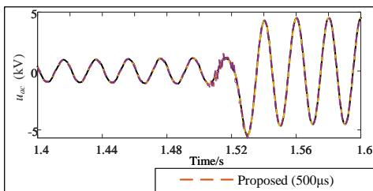

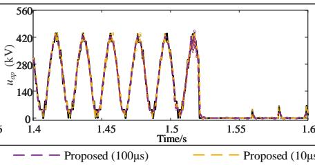

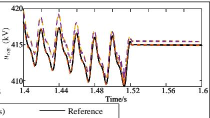

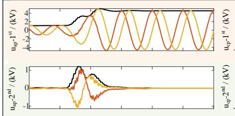  
Fig. 12. Instantaneous curves under different time-steps (a) ac voltage of phase A: $u _ { a c } ;$ (b) arm voltage of phase A: $u _ { a p }$ (c) capacitor voltage of phase A: ucap $u _ { c a p }$

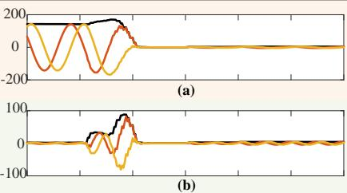

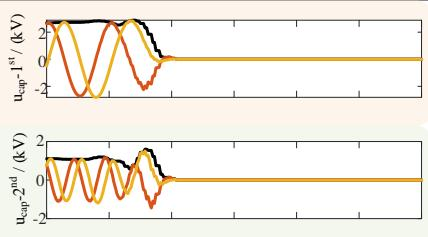

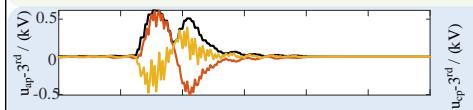

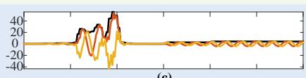

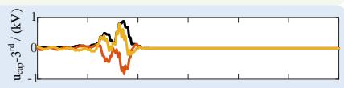

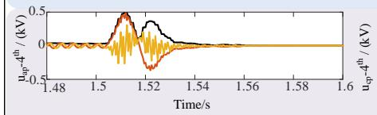

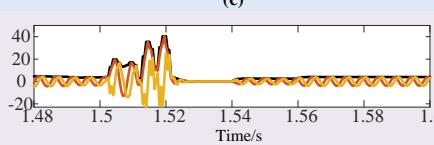

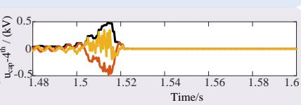

  
Fig. 13. Instantaneous and harmonic domain phasor (HDP) curves (a) ac voltage of phase A: $u _ { a c } ;$ (b) arm voltage of phase A: $u _ { a p }$ (c) capacitor voltage of phase A: $u _ { c a p }$

the re-occurrence of a oscillation scenario are both tested. Specifically, different time-steps (from 10µs to 500µs) are adopted to compare the proposed method with the traditional one. The order of harmonic phasors is dependent upon the required frequency band. In our simulations of the practical large-scale VSC-MMC based AC/DC grids in China, the required frequency band is within the 7th harmonics. Therefore, the desired order of the harmonic phasors is 7. Meanwhile, the simulation results under a unanimous time-step of 10µs by PSCAD/EMTDC are used as the high-fidelity benchmark reference values.

TABLE II SCALE OF AC GRIDS IN EMT SUBSYSTEM   

<table><tr><td>Area</td><td>Bus number</td><td>Generator number</td><td>Load number</td><td>Line number</td></tr><tr><td>EMT subsystem</td><td>2412</td><td>599</td><td>1291</td><td>3537</td></tr></table>

# A. MMC Test: Asymmetric AC fault

Fig. 9 shows the system-level performance of the MMC based HVDC subjected to a short-term asymmetric ac fault, where the fault occurs at $t = 1 . 5 s$ and lasts for 50ms under different time-steps of the proposed co-simulation method. Fig. 10 further illustrates the first to fourth harmonic phasors corresponding to quantities in Fig. 9. As can be seen, at t = 1.5s, the fault lasting 50 ms occurs at the AC side of

the MMC, the profound impact can be observed in the AC voltages and the arm voltages of phase A. The capacitor voltages witness a slight drop before being gradually restored. The following conclusions can be reached from Fig. 9: (1) Even when the time-step is extended to 500us, amazingly, the simulation results of HPD model can match the reference very well; (2) zoomed in figures show that there are slight differences between the HPD model at the time-step of 500µs and the reference curve, but the gaps are still acceptable.

Insightful conclusions can be deduced from Fig. 10: (1) each harmonic phasor can be the exact wide frequency envelopes of the instantaneous values of each harmonics; (2) Concerning the dynamics of the MMC, the second or higher harmonics of AC quantities and the arm voltages primarily appear at the occurrence and the clearance of the fault;(3) harmonic phasors will be beneficial to study the dominated first and second harmonics in real time.

The phase diagram of the first order harmonic phasors of ac voltage, arm voltage and capacitor voltage will give us more interesting physical interpretations of dynamics (see Fig. 11). In Fig. 11, the green circle denotes the original state before the fault, and the blue circle denotes the final state after the fault. The dynamics of the AC voltages can be grouped into the homo-clinic orbit. That is to say, the AC voltages will return to the original steady state after the fault. The dynamics of the arm voltages and the capacitor voltages can be grouped into the hetero-clinic orbit [34]. That is to say, the arm voltages

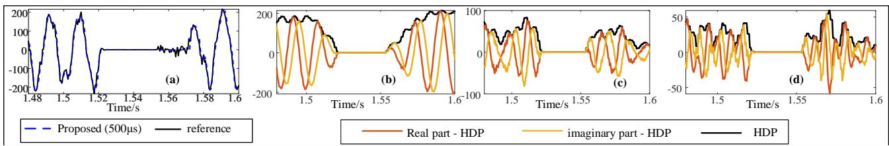

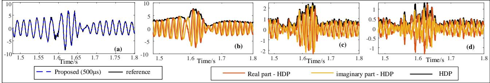  
Fig. 14. Instantaneous and HDP curves of the AC voltages:(a) instantaneous values $u _ { a c } ; ( \mathbf { b } )$ fundamental $\langle u _ { a c } \rangle _ { 1 } ^ { H D } \rangle _ { \ 3 \mathrm { ( c ) } }$ second harmonic $\langle u _ { a c } \rangle _ { 2 } ^ { H D } ;$ ; (d) third harmonic $\langle u _ { a c } \rangle _ { 3 } ^ { H D }$   
Fig. 15. Instantaneous and HDP curves of the AC currents:(a) instantaneous values HD $i _ { a c } ; ( \mathfrak { b } )$ fundamental $\langle i _ { a c } \rangle _ { 1 } ^ { H D } ;$ (c) second harmonic $\langle i _ { a c } \rangle _ { 2 } ^ { H D }$ ; (d) third harmonic hiaci3 $\langle i _ { a c } \rangle _ { 3 } ^ { H D }$

or the capacitor voltages will be gradually stabilized to a new steady state after the fault scenario.

# B. MMC Test: A pole-to-pole DC fault

Fig. 12 shows the system-level performance subjected to a permanent dc pole-to-pole fault at t = 1.5s. At t = 1.5s, the fault occurs in the middle of the line, and consequently, the profound impacts can be observed in the dc and ac networks. The arm voltages witness an immediate drop; while the capacitor voltages remain a constant value due to the blocking capability. The proposed method can successfully extend the time-step to 500µs without losing the accuracy requirement, which is fully validated by the overlapped waveforms from the benchmark PSCAD/EMTDC reference results. Further, different orders of harmonic phasors are given in Fig 13, where the harmonic phasors can be the exact envelopes of different harmonics, predicting the variations of different harmonics very well during the fault scenarios.

# C. VSC Test: Asymmetric AC fault

To validate the HPD model of the VSC, the ac quantities under different time-steps and different harmonic phasors are depicted in Figs. 14-15. The following conclusions can be reached: (1) the HPD model of the VSC can successfully extend the time-step to 500µs without losing accuracy; (2) the wide frequency band harmonic phasors can be the exact envelopes of different harmonics.

# D. An Oscillation Scenario aroused by harmonic interactions between the VSC and the MMC

Up to now, the HPD models of individual VSC and MMC converters have been fully evaluated. Researchers may doubt whether the proposed model can be applied for the oscillation scenario aroused by the interactions between VSC, MMC and the large-scale AC grids. According to the system case detailed in Fig. 7 and the field recording data, an oscillation scenario

is reproduced by the proposed HPD model. It should be noted that the system model is modified from a practical engineering project, where two converter stations are replaced by the VSC based converters. To construct this case, there are several troublesome issues: (1) the modeling complexity significantly increased by the practical three level control and protection systems, or the valve level, pole level and the converter level; (2) the interface number is significantly increased to be four, where the wide frequency band or harmonic interactions between different interfaces should be considered. Consequently, it will become dramatically harder to guarantee the overall simulation accuracy. Let us investigate the recording and simulation results of the oscillation scenario in Figs. 16-17. Fig. 16 demonstrates that the proposed co-simulations under various interface applications can also achieve the accuracy expectations even when the time-step is extended to 500µs. Fig. 17 shows that the harmonic phasors can be the exact envelopes of different harmonics as hoped.

More physical interpretations can be deduced from the harmonic phasor waveforms: (1) According to the first order harmonic phasors, the envelope is accompanied by the low frequency oscillations aroused by the harmonic oscillation loops from the VSC, AC grid, and the MMC; (2) only the operations of the MMC and VSC are connected to the ac grids, will the low frequency oscillations appear after the fault;(3) the low frequency oscillations of the first-order harmonic phasor will also arouse low frequency oscillations of harmonic phasors of other orders. Consequently, we guess that the harmonic linearization technique may fail to work in this special case, in order to study the mechanism of harmonic interactions between the MMC and the VSC. Up to now, the proposed co-simulation method is the ideal solution to reproduce this oscillation scenario and to study the typical influencing factors contributing to this oscillation, where the traditional techniques will meet troublesome simulation accuracy and efficiency issues.

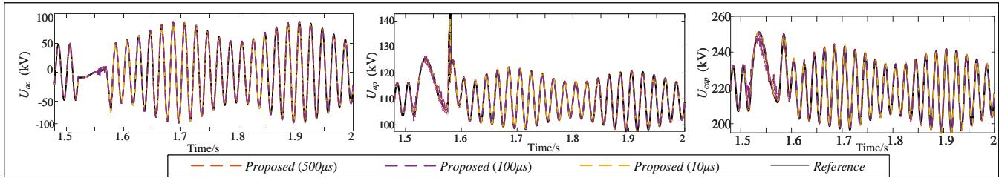

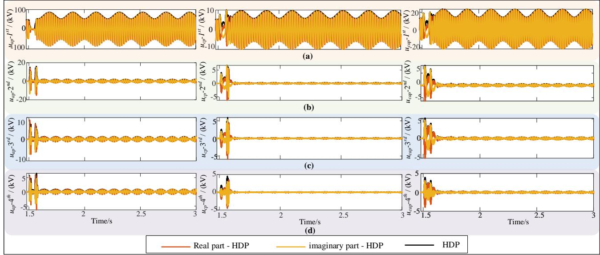  
Fig. 16. Instantaneous curves under different time-steps (a) ac voltage of phase A: $u _ { a c } ;$ (b) arm voltage of phase A: $u _ { a p }$ (c) capacitor voltage of phase A: ucap $u _ { c a p }$   
Fig. 17. Instantaneous and harmonic domain phasor (HDP) curves (a) ac voltage of phase A: $u _ { a c } ;$ (b) arm voltage of phase A: $u _ { a p }$ (c) capacitor voltage of phase A: ucap

# E. Comparisons of simulation efficiency

In this work, the simulation efficiency is measured in terms of execution time and speedup, where the execution time is given in Table II. It should be noted that the simulation environment and computation setup for all the simulation results are the same, or a 2.67 GHz Intel i7 CPU; with 32 GB of RAM and a 64-b Windows 10 operating system. The speedup is defined as the ratio of the execution time consumed by PSCAD (base scenario) and the proposed method. As can be seen,the execution time of the proposed co-simulation method can reduce the simulation time to a much smaller one. For example, simulating the tested cases in Fig. 7 with the total simulation time of 6s, the proposed method reduce the computation time from $1 . 2 * 1 0 ^ { 4 } \mathrm { s }$ to 120s, achieving an acceleration ratio of more than 100.

The following conclusions can be reached:

(1) The proposed method reduces the computation time from 1.2*104s to 120s, achieving an acceleration ratio of more than 100 compared to the benchmark PSCAD results (MMC detailed switch model);   
(2) The proposed co-simulation method can extend the time-step to a much larger one, such as 500µs, significantly improving the efficiency. It can achieve an acceleration ratio of 10 compared to the PSCAD results (MMC equivalent model) under 100µs;   
(3) Each harmonic phasor uses multi-core CPUs, such as

openMP techniques, for parallel simulation, so the order of harmonic phasor will not affect the simulation efficiency of harmonic subsystem.

The efficiency of the proposed HPD based co-simulation method is improved by adopting a much larger time-step of the HPD subsystem, the decoupled interface model based on the HPD-TLM. Detailed explanations are given below:

1) the VSC and the MMC converters are modeled by the equivalent controlled source model based on the harmonic phasor domain (HPD) models. As a result, the node buses of the MMC will not increase as the sub-module number rises. For example, if the sub-module is 100, the calculations of each submodule are updated independently and the number of increased node buses is 6, i.e., the upper and lower arms of three phases;   
2) the calculations of the AC grids and DC grids are decoupled based on the HPD transmission line model (HPD-TLM). For example, suppose the node number of the ac grids is 6000 and the node number of the converter is 3000. Originally, the dimension of the system-level nodal voltage equation for the traditional EMT models is (3000 + 600) ∗ 3 = 10800. Instead, based on the HPD-TLM, the calculations are replaced by two nodal voltage equations with much smaller dimensions, i.e., dimensions of $3 0 0 0 ^ { * } 3 { = } 9 0 0 0$ and $6 0 0 ^ { * } 3 { = } 1 8 0 0$ . Correspondingly, the efficiency is much improved.   
Therefore, the proposed method has achieved improved efficiency and required accuracy in simulating large-scale

AC/DC grids, with additional benefit of providing instantaneous harmonic phasor waveforms. Up to now, the proposed co-simulation method is the ideal solution to reproduce the wide frequency band oscillation scenario of MMC-VSC based AC/DC grids and to study the typical influencing factors contributing to this oscillation, where the traditional techniques will meet troublesome simulation accuracy and efficiency issues.

TABLE III EFFICIENCY COMPARISONS   

<table><tr><td colspan="4">Execution Time(s)</td></tr><tr><td rowspan="2">PSCAD(MMC detailed switch model)</td><td colspan="3">Proposed under different time-steps/μs</td></tr><tr><td>10</td><td>100</td><td>500</td></tr><tr><td>1.2 × 104</td><td>5000</td><td>480</td><td>120</td></tr><tr><td rowspan="2">PSCAD(MMC detailed switch model)</td><td colspan="3">PSCAD(MMC equivalent model) /μs</td></tr><tr><td>10</td><td>100</td><td>500</td></tr><tr><td>1.2 × 104</td><td>8000</td><td>980</td><td>/</td></tr></table>

# VI. APPENDIX

TABLE IV SYSTEM PARAMETERS OF THE MMCS   

<table><tr><td>RMS AC voltage of converter T1 and T2</td><td>220kV</td></tr><tr><td>capacitor of each sub-module</td><td>1200 μF</td></tr><tr><td>Vdc rated value</td><td>400kV</td></tr><tr><td>DC line: length D = 200 km</td><td>200km</td></tr><tr><td>DC line: impedance r0</td><td>0.012 Ω/km</td></tr><tr><td>DC line: inductance l0</td><td>0.106 mH/km</td></tr><tr><td>DC line: capacitance c0</td><td>0.296 μF/km</td></tr><tr><td colspan="2">Control Parameters: outer loop controllers of constant DC voltage: Kp = 2, KI = 0.0025</td></tr><tr><td colspan="2">outer loop controllers of constant reactive power: Kp = 0.001, KI = 0.15; the phase shift loop: Kp = 0.5, KI = 150.</td></tr></table>

TABLE V SYSTEM PARAMETERS OF THE TWO-LEVEL VSCS   

<table><tr><td>RMS AC voltage of converter T1 and T2</td><td>220kV</td></tr><tr><td>capacitor of each sub-module</td><td>1200 μF</td></tr><tr><td>Vdc rated value</td><td>200kV</td></tr><tr><td>Proportional parameter of dc voltage controller Kp(dc)</td><td>0.2</td></tr><tr><td>Integral parameter of dc voltage controller Ki(dc)</td><td>0.1</td></tr><tr><td>Proportional parameter of current controller Kpi</td><td>8</td></tr><tr><td>Integral parameter of current controller Kii</td><td>0.25</td></tr></table>

# VII. CONCLUSION

In this paper, the harmonic phasor domain co-simulation Method is proposed by combing EMT and the proposed HPD models. In this method, the high frequency power electronic devices are generalized and represented by the HPD models. The wide frequency band harmonic interactions between HPD and EMT subsystems are reflected by the proposed HPD-TLM.

The performance of the proposed method has been validated on a practical Large-scale VSC-MMC based AC/DC Grids in China. Simulation results have demonstrated that:

(i) Even when the time-step is extended to 500us, amazingly, the simulation results of HPD model can match the reference very well;   
(ii) Each harmonic phasor can be the exact envelope of the wide frequency instantaneous values, and it will be beneficial to study the dominated first and second harmonics in real time;   
(iii) the proposed co-simulation method can achieve an acceleration ratio of more than 100 times at the time-step of 500us;   
(iv) Up to now, the proposed co-simulation method is the ideal solution to reproduce the wide frequency band oscillation scenario of MMC-VSC based AC/DC grids and to study the typical influencing factors contributing to this oscillation, where the traditional techniques will meet troublesome simulation accuracy and efficiency issues.

# REFERENCES

[1] R. Marquardt, “Stromrichterschaltungen Mit Verteilten Energiespeichern” Patent DE10103031A1, Jan. 24, 2001   
[2] N. T. Trinh, M. Zeller, and K. Wuerflinger, “Generic model of MMC-VSC HVDC for interaction study with AC power system,” IEEE Trans. Power Syst., vol. 31, no. 1, pp. 27–34, Jan. 2016   
[3] L. Harnefors, R. Finger, X. Wang, H. Bai, and F. Blaabjerg, “VSC input admittance modeling and analysis above the Nyquist frequency for passivity-based stability assessment,” IEEE Trans. Ind. Electron., vol. 64, no. 8, pp. 6362-6370, Aug. 2017.   
[4] X. Wang, F. Blaabjerg, and W. Wu, “Modeling and analysis of harmonic stability in ac power-electronics-based power system,” IEEE Trans. Power Electron., vol. 29, no. 12, pp. 6421-6432, Dec. 2014.   
[5] D. Shu, X. Xie, H. Rao, X. Gao, Q.Jiang, and Y. Huang, “Sub- and super-synchronous interactions between STATCOMs and weak AC/DC transmissions with series compensations,” IEEE Trans. Power Electron., vol. 33, no. 9, pp. 7424–7437, Sep. 2018   
[6] Y. Wang, X. Wang, F. Blaabjerg, and Z. Chen, ”Small-signal stability analysis of inverter-fed power systems using component connection method,” IEEE Trans. Smart Grid, vol. PP, no. 99, pp. 1-1.   
[7] M. Belkhayat. Stability Criteria for AC Power Systems with Regulated Loads. Ph.D. thesis, Purdue University, Dec. 1997.   
[8] C. Yoon, X. Wang, C. L. Bak, and F. Blaabjerg, “Stabilization of multiple unstable modes for small-scale inverter-based power systems with impedance-based stability analysis,” in Proc. IEEE APEC 2015, pp. 1202-1208.   
[9] M. Saeedifard and R. Iravani, “Dynamic performance of a modular multilevel back-to-back HVDC system,” IEEE Trans. Power Del., vol. 25, no. 4, pp. 2903–2912, Oct. 2010.   
[10] D. Shu, X. Xie, et al.,“A novel interfacing technique for distributed hybrid simulations combining EMT and transient stability models,” IEEE Trans. Power Del., vol. 33, no. 1, pp. 130-140, Mar. 2017.   
[11] X. Lin, A. M. Gole, and M. Yu, “A wide-band multi-port system equivalent for real-time digital power system simulators,” IEEE Trans. Power Syst., vol. 24, no. 1, pp. 237-249, Feb. 2009.   
[12] D. Shu, X. Xie, V. Dinavahi, C. Zhang, X. Ye, and Q. Jiang, “Dynamic phasor based interface model for EMT and transient stability hybrid simulations,” IEEE Trans. Power Syst., vol. 33, no. 4, pp. 3930 - 3939 2017.   
[13] K. Mudunkotuwa, S. Filizadeh, and U. Annakkage, “Development of a hybrid simulator by interfacing dynamic phasors with electromagnetic transient simulation,” IET Gener., Transmiss. Distrib., vol. 11, no. 12, pp. 2991–3001, Aug. 2017.   
[14] S. Liu, Z. Xu, W. Hua, G. Tang, and Y. Xue, “Electromechanical transient modeling of modular multilevel converter based multi-terminal HVDC systems,” IEEE Trans. Power Syst., vol. 29, no. 1, pp. 72–83, Jan. 2014   
[15] R. D. Middlebrook, “Small-signal modeling of pulse-width modulated switched-mode power converters,” Proc. IEEE, vol. 76, no. 4, pp. 343–354, Apr. 1988.   
[16] W. Jun, R. Burgos, and D. Boroyevich, ”Switching-Cycle State-Space Modeling and Control of the Modular Multilevel Converter,” Emerging and Selected Topics in Power Electronics, IEEE Journal of, vol. 2, pp. 1159-1170, 2014

[17] U. N. Gnanarathna, A. M. Gole, and R. P. Jayasinghe, “Efficient modeling of modular multilevel HVDC converters (MMC) on electromagnetic transient simulation programs,” IEEE Trans. Power Del., vol. 26, no. 1, pp. 316–324, Jan. 2011.   
[18] F. B. Ajaei and R. Iravani, ”Enhanced Equivalent Model of the Modular Multilevel Converter,” IEEE Trans. Power Del., vol. 30, pp. 666-673, 2015   
[19] J. Xu, C. Zhao, W. Liu, and C. Guo, “Accelerated model of modular multilevel converters in PSCAD/EMTDC,” IEEE Trans. Power Del., vol. 28, no. 1, pp. 129–136, Jan. 2013   
[20] J. Rupasinghe, S. Filizadeh, L. W. Wang, ”A dynamic phasor model of an MMC with extended frequency range for EMT simulations”, IEEE Journal of Emerging and Selected Topics in Power Electronics, vol. 7, no. 1, pp/30-40, 219.   
[21] J. Hu, D. Shu, Yan Z, et al. “Dynamic Phasor Modeling of Modular Multilevel Converters for Electromagnetic Transients” ICPE (ISPE) ECCE asia 2019, pp.166-171.   
[22] K. Strunz, R. Shintaku, and F. Gao, “Frequency-adaptive network modeling for integrative simulation of natural and envelope waveforms in power systems and circuits,” IEEE Trans. Circuits Syst., vol. 53, no. 12, pp. 2788–2803, Dec. 2006   
[23] D. Shu, V. Dinavahi, X. Xie, and Q. Jiang, “Shifted frequency modeling of hybrid modular multilevel converters for simulation of MTDC grid,” IEEE Trans. Power Del., vol. 33, no. 3, pp. 1288–1298, Jun. 2018.   
[24] J. Kwon, X. Wang, F. Blaabjerg, C. L. Bak, V. S. Sularea, and C. Busca, “Harmonic interaction analysis in grid-connected converter using Harmonic State Space (HSS) modeling,” IEEE Trans. Power Electron., vol. 32, no. 9, pp. 6823–6835, Sep. 2016.   
[25] X. Wang, L. Harnefors and F. Blaabjerg, ”Unified Impedance Model of Grid-Connected Voltage-Source Converters,” IEEE Trans. Power Electron., vol. 33, no. 2, pp. 1775-1787, Feb. 2018.   
[26] Y. Li, Y. Gu and T. C. Green, ”Interpreting Frame Transformations in AC Systems as Diagonalization of Harmonic Transfer Functions,” in IEEE Transactions on Circuits and Systems I: Regular Papers. doi: 10.1109/TCSI.2020.2976754.   
[27] S. Lissandron, L. Dalla Santa, P. Mattavelli and B. Wen, ”Experimental Validation for Impedance-Based Small-Signal Stability Analysis of Single-Phase Interconnected Power Systems With Grid-Feeding Inverters,” IEEE Journal of Emerging and Selected Topics in Power Electronics, vol. 4, no. 1, pp. 103-115, March 2016.   
[28] H. Wu and X. Wang, ”Dynamic Impact of Zero-Sequence Circulating Current on Modular Multilevel Converters: Complex-Valued AC Impedance Modeling and Analysis,” in IEEE Journal of Emerging and Selected Topics in Power Electronics.   
[29] Y. Liao, X. Wang, X. Yue and L. Harnefors, ”Complex-Valued Multi-Frequency Admittance Model of Three-Phase VSCs in Unbalanced Grids,” IEEE Journal of Emerging and Selected Topics in Power Electronics, vol. 8, no. 2, pp. 1947-1963, June 2020.   
[30] Y. Liao and X. Wang, ”Stationary-Frame Complex-Valued Frequency-Domain Modeling of Three-Phase Power Converters,” IEEE Journal of Emerging and Selected Topics in Power Electronics, vol. 8, no. 2, pp. 1922-1933, June 2020.   
[31] J. Kwon, X. Wang, F. Blaabjerg, and C. L. Bak, “Frequency-Domain Modeling and Simulation of DC Power Electronic Systems Using Harmonic State Space Method,” IEEE Trans. Power Electron., vol. 32, no. 2, pp. 1044–1055, Feb. 2017.   
[32] D. Shu, X. Xie, Z. Yan, V. Dinavahi and K. Strunz, ”A Multi-Domain Co-Simulation Method for Comprehensive Shifted-Frequency Phasor DC-Grid Models and EMT AC-Grid Models,” IEEE Trans. Power Electron., vol. 34, no. 11, pp. 10557-10574, Nov. 2019.   
[33] J. C. G. de Siqueira et al., “A discussion about optimum time step size and maximum simulation time in EMTP-based programs,” Int. J. Elect. Power Energy Syst., vol. 72, pp. 24–32, 2015.   
[34] F. Verhulst, Nonlinear differential equations and dynamical systems. Springer Science Business Media, 2006

Dewu Shu (Senior’20) received the B.Sc. received the B.Sc. Ph. D degree in Electrical Engineering from Tsinghua University in 2013, 2018. Currently, he is the assistant professor in Electrical Engineering, Shanghai Jiaotong University.

He is the organizer of the Shanghai Jiatong High Performance Computing Center, AI Center and Associate Editor of IET Renewable Power Generation, etc, the chair of several conferences such as ECCE, etc. His research interests include high performance computing, VLSI, 5G techniques.

Huiwen Yang Huiwen Yang received the M.S. degree in electrical engineering from HUnan University, Changsha, China, in 2020. Her research interests include modeling, analysis and control of power system with power electronic equipments.

  
systems.

Guanghui He received the B.S. degree in electronic engineering from the University of Electronic Science and Technology of China, Chengdu, China, in 2002, and the Ph.D. degree in electronic engineering from Tsinghua University, Beijing, China, in 2007.

He is currently an Associate Professor with the Department of Micro/Nano Electronics, Shanghai Jiao Tong University. His research interests include high performance electromagnetic transient simulation , energy efficient algorithms and circuits design for wireless communication and artificial intelligent