# Development of phase domain frequency-dependent transmission line model on FPGA for real-time digital simulator

Jiadai Liu a,* , Yuan Chen a , Hui Ding a , Yi Zhang a

a RTDS Technologies Inc., Winnipeg, MB, R3T 2E1, Canada

# A R T I C L E I N F O

Keywords:

Electromagnetic transient analyses

Real-time digital simulator

Field programmable gate arrays

Frequency-dependent transmission line

Parallel algorithm

Pipelining

# A B S T R A C T

The transmission line model is one of the most important components for the real-time digital simulator based on the electromagnetic transient (EMT) algorithm. In order to predict the behavior of power systems under both steady and transient states, the coupling and frequency dependence of the transmission line need to be precisely represented. This paper presents a frequency-dependent phase domain (FDPD) transmission line model on a field programmable gate array (FPGA) for an EMT type real-time digital simulator. The developed model has been fully pipelined and parallelized in hardware to achieve the lowest time-step. All the hardware developments for this model depicted in this paper are carried out in VHDL, and a customized 48-bits floating-point data representation is used for hardware implementation to improve the accuracy. This developed FPGA-based line model can be interfaced to the rest of the network to perform real-time simulation.

# 1. INTRODUCTION

The real-time digital electromagnetic transient type power system simulator is an important tool for the power system industry in the analyzing, design and development of new solutions to alleviate operational challenges of complex grids, especially in transient conditions. Compared to mathematical models and analog simulators such as a transient network analyzer (TNA), the digital real-time simulator provides a more comprehensive solution with lower cost, reduced space and flexibility to expand. This allows the digital real-time simulator to play an important role in the testing of manufactured controller and protective devices in a hardware-in-the-loop (HIL) configuration, in the planning of new grids such as determining component rating and isolating level, and in the training and education of operators. Digital real-time simulation requires all necessary calculations to be finished within a certain period of time, which is called a simulation time-step, as they happen in real world, to reproduce whatever happens in a real power network. All simulations and tests are done in digital laboratory conditions, so that the real-time digital simulator can be used to test a power system under extreme conditions such as overvoltage and overcurrent conditions under EMT states. The simulation time-step is a critical factor in HIL simulation in order to reproduce the high frequency transient and power electronic phenomenon. Depending on the application, the range of digital real-time simulation time-step size is from

several microseconds to hundreds of microseconds.

Transmission lines are important components in power systems for transmission and distribution of electrical energy. The transient behavior of a transmission line, such as frequency-dependent impedance characteristics and propagation, will have a great impact on the transient overvoltage and overcurrent. This will need to be addressed when a transmission line model is developed for EMT type real-time digital simulation. Significant efforts have been put into studying the behavior of transmission lines and developing accurate models for steady-state and transient state simulation. Traditionally, the transmission line models can be classified into two categories: lumped parameter Pi section models and travelling-wave models. The Pi section models consider both mutual and self resistances, inductances and capacitances at a single frequency but do not take into account the propagation of the transmission line. The travelling wave models, also known as distributed-parameter models, consider transmission line propagation and can be further classified into two sub-categories: constant parameter and frequency-dependent parameter transmission line models. The first type of model represents the transmission line in the modal domain, and the parameter is calculated at a single frequency, so this model can only be applied within a very limited bandwidth. The second type of model represents the transmission line by taking into account the frequencydependence nature when calculating its parameters, and this type of model is the most accurate model type for transient simulation. The

modal domain frequency-dependent model calculates transmission line solutions in the modal domain and then transfers the solutions to the phase domain by performing a linear transformation. This model works well for symmetrical and transposed lines, however, not for asymmetrical and untransposed lines since this model uses constant transformation matrices which cannot be guaranteed to always be accurate and which may cause error [1, 2, 3]. Phase domain models avoid the transformation matrices by performing all calculations directly in the phase domain $[ 4 , 5 , 6 , 7 , 8 ] .$ . Among these models, the universal line model (ULM) [8] is considered numerically efficient and robust for both underground cables and overhead lines. RTDS Technologies Inc. has developed a processor-based large time-step ULM model for their own digital real-time simulator, and this model can handle up to 12 conductors with a time-step size of around $5 0 \mu \mathbf { s } .$ An FPGA-based real-time model is also proposed; however, this model and the rest of the power system network can only run on FPGA and is not able to interface with other real-time simulators [9].

Nowadays, FPGA is being widely used to design computationally intensive applications due to its inherent parallel architecture, pipelining computation and custom configuration. FPGA-based power system apparatus models for digital real-time simulation have also been proposed in both academics and industry [10, 11, 12]. For HVDC-VSC real-time simulation, the time-step is required to be relative small, for example ${ 3 \mu \mathsf { s } } ,$ to accurately simulate high frequency switching circuits for capturing high frequency transients. As a result, there is a need to develop a FDPD transmission line model for small time-step simulation.

# 2. FPGA-BASED FREQUENCY-DEPENDENT TRANSMISSION LINE REAL-TIME MODEL

# 2.1. Phase-domain frequency dependent line model

# 2.1.1. Time domain representation and formulation

The frequency domain solution for an n-phase transmission line as shown in Fig. 1 can be expressed as,

$$
\boldsymbol {I} _ {k} = \boldsymbol {Y} _ {c} \boldsymbol {V} _ {k} - 2 \boldsymbol {I} _ {k i} = \boldsymbol {Y} _ {c} \boldsymbol {V} _ {k} - 2 \boldsymbol {H} _ {m r}, \tag {1}
$$

$$
\boldsymbol {I} _ {m} = \boldsymbol {Y} _ {c} \boldsymbol {V} _ {m} - 2 \boldsymbol {I} _ {m i} = \boldsymbol {Y} _ {c} \boldsymbol {V} _ {m} - 2 \boldsymbol {H} _ {k r} \tag {2}
$$

where k and m stand for transmission line sending and receiving end respectively. $I _ { k } , V _ { k } , I _ { m }$ and $V _ { m }$ are n dimensional sending and receiving end current and voltage vectors. $I _ { k i }$ and $I _ { m i }$ are the incident current vectors and $I _ { k r }$ and $I _ { m r }$ are reflected current vectors. The two n ×n matrices are the characteristic admittance matrix $Y _ { c }$ and the propagation matrix H $( H _ { m r }$ and $H _ { k r } )$ expressed as,

$$
Y _ {c} = \sqrt {\mathbf {Y} / \mathbf {Z}}, \tag {3}
$$

$$
\boldsymbol {H} = e ^ {- \sqrt {\mathbf {Y Z}} t} \tag {4}
$$

where the two n × n matrices are shunt admittance matrix Y and series impedance matrix Z per unit length, respectively. l is the line length. Transforming (1) and (2) into the time-domain equations by using inverse Fourier Transformation gives

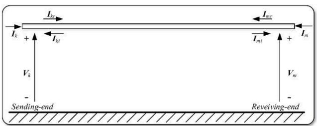  
Fig. 1. An n-phase transmission line.

$$
\boldsymbol {i} _ {k} (t) = \boldsymbol {G} * v _ {k} (t) - \boldsymbol {i} _ {\text {h i s t k}} (t), \tag {5}
$$

$$
\boldsymbol {i} _ {m} (t) = \boldsymbol {G} * v _ {m} (t) - \boldsymbol {i} _ {\text {h i s t m}} (t). \tag {6}
$$

The history current vectors $i _ { h i s t k } ( t ) , i _ { h i s t m } ( t )$ and equivalent impedance matrix G are expressed as

$$
\boldsymbol {i} _ {\text {h i s t k}} (t) = \boldsymbol {Y} _ {c} * v _ {k} (t - \Delta t) - 2 \boldsymbol {H} * \boldsymbol {i} _ {m r} (t - \Delta t - \tau), \tag {7}
$$

$$
\boldsymbol {i} _ {\text {h i s t m}} (t) = \boldsymbol {Y} _ {c} * v _ {m} (t - \Delta t) - 2 \boldsymbol {H} * \boldsymbol {i} _ {k r} (t - \Delta t - \tau), \tag {8}
$$

and

$$
\boldsymbol {G} = \boldsymbol {d} + r _ {\mathrm {Y c}} \lambda_ {\mathrm {Y c}} \tag {9}
$$

where the symbol ‘*’ indicates the matrix-vector convolution. The coefficient $\lambda _ { Y c } ,$ , is defined as

$$
\lambda_ {Y c} = \left(\frac {\Delta t}{2}\right) / \left(1 - p _ {Y c} \frac {\Delta t}{2}\right) \tag {10}
$$

where p, r and d are poles, residues and proportional terms, respectively. The equations indicate that the Norton equivalent circuit for the timedomain transmission line model can be represented as shown in Fig. 2.

To perform the convolution of $Y _ { c } * \nu _ { k } ( t ) \mathrm { a n d } H$ ∗ $i _ { m r } ( t$ − τ) two state variables $x _ { Y c }$ and $x _ { H }$ are defined as

$$
\boldsymbol {x} _ {Y c} (t) = \boldsymbol {\alpha} _ {Y c} \boldsymbol {x} _ {Y c} (t - \Delta t) + \boldsymbol {v} _ {k} (t - \Delta t), \tag {11}
$$

$$
\boldsymbol {x} _ {H} (t) = \boldsymbol {\alpha} _ {H} \boldsymbol {x} _ {H} (t - \Delta t) + \boldsymbol {i} _ {m r} (t - \tau - \Delta t). \tag {12}
$$

The convolution then is computed using

$$
\boldsymbol {Y} _ {c} * \boldsymbol {v} _ {k} (t) = \boldsymbol {c} _ {Y _ {c}} \boldsymbol {x} _ {Y _ {c}} (t), \tag {13}
$$

$$
\boldsymbol {H} * \boldsymbol {i} _ {m r} (t - \tau) = \boldsymbol {c} _ {H} \boldsymbol {x} _ {H} (t) + \boldsymbol {G} _ {H} \boldsymbol {i} _ {m r} (t - \tau - \Delta t) \tag {14}
$$

where the coefficients $\pmb { \alpha } _ { Y c ; }$ , αH, $c _ { Y c _ { i } }$ , $c _ { H }$ and ${ \bf { G } } _ { H }$ are expressed as

$$
\boldsymbol {\alpha} _ {Y c} = \left(1 + \boldsymbol {p} _ {Y c} \frac {\Delta t}{2}\right) / \left(1 - \boldsymbol {p} _ {Y c} \frac {\Delta t}{2}\right), \tag {15}
$$

$$
\boldsymbol {\alpha} _ {H} = \left(1 + \boldsymbol {p} _ {H} \frac {\Delta t}{2}\right) / \left(1 - \boldsymbol {p} _ {H} \frac {\Delta t}{2}\right), \tag {16}
$$

$$
\boldsymbol {c} _ {Y c} = \boldsymbol {r} _ {Y c} \left(\boldsymbol {\alpha} _ {Y c} + 1\right) \boldsymbol {\lambda} _ {Y c}, \tag {17}
$$

$$
\boldsymbol {c} _ {H} = \boldsymbol {r} _ {H} (\boldsymbol {\alpha} _ {H} + 1) \lambda_ {H}, \tag {18}
$$

$$
\boldsymbol {G} _ {H} = \boldsymbol {r} _ {H} \lambda_ {H}. \tag {19}
$$

# 2.1.2. Hardware design

Due to the natural traveling time delay of a transmission line, the sending-end and receiving-end calculations can be computed in parallel and two identical hardware designs are implemented on FPGA to reduce the simulation time-step. In each simulation time-step, after receiving the transmission line node voltages $V _ { k }$ and $V _ { m }$ from the network solver

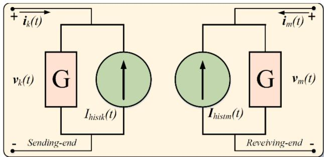  
Fig. 2. Norton equivalent circuit for time-domain transmission line model.

module, the transmission line model is executed to carry out the history current term $I _ { h i s t k }$ and $I _ { h i s t m }$ as shown in Fig. 2. As shown in (7) and (8), two convolutions contribute the main computational burden for the transmission line calculation. In order to achieve the lowest latency for real-time simulation, (13) and (14) are rearranged into three parts ihistn1 $= c _ { Y c } \mathbf { x } _ { Y c } , i _ { h i s t n 2 } = G _ { H } i _ { m r }$ and $\begin{array} { r } { i _ { h i s t n 3 } = \pmb { c } _ { H } \pmb { x } _ { H } . } \end{array}$ .

For better explanation of these computational modules, two concepts, "parallel dimension" and "pipeline dimension", are given. In hardware implementation, all necessary parameters are stored in RAMs. If the parameter is a matrix, then it will be stored in either row or column order. For example, if the entries are stored in row order that means the first RAM stores the first row entries, the second RAM stores the second row entries and so on. By arranging the parameters in this way, all the entries from the first column will be accessed simultaneously and go through the computation unit in parallel, so the column-wise is the "parallel dimension". The second column entries will be accessed next, and then the third column entries until the last column entries. In this way the entries in each row will go through the computation unit in a pipelined manner, so that the row-wise is the "pipeline dimension". In the remainder part of this paper, the terms n, p and g are the number of conductors, poles and delay groups of the simulated transmission line model.

2.1.2.1. $I _ { k / m r }$ module. As shown in Fig. 1 and Fig. 2, the equation for $I _ { k r }$ and $I _ { m r }$ can be expressed as

$$
\boldsymbol {I} _ {k r} (t) = \boldsymbol {G} \boldsymbol {V} _ {k} (t) - \boldsymbol {I} _ {\text {h i s t k}} (t) - \boldsymbol {I} _ {k i}, \tag {20}
$$

$$
\boldsymbol {I} _ {m r} (t) = \boldsymbol {G} \boldsymbol {V} _ {m} (t) - \boldsymbol {I} _ {\text {h i s t m} (t)} - \boldsymbol {I} _ {m i}, \tag {21}
$$

The $I _ { k / m r }$ module is responsible for calculating the above equations and Fig. 3 shows the parallel hardware scheme for (20) only. The RAMs contain the parameter of an n × n matrix G and the n ×1 voltage vector $V _ { k } .$ . When the module executes, the RAMs mentioned above are accessed and send the data to the Matrix-Vector-Multiplication (MVM) unit paralleled and pipelined. Each MVM unit takes data from one row of the matrix G and the vector $V _ { k }$ to finish the multiply-accumulate operation.

2.1.2.2. Update $X _ { Y c }$ and update $X _ { H }$ modules. As can be seen from (11) and (12), the calculation for updating two state variables $X _ { Y c }$ and $X _ { H }$ are similar, so the paralleled hardware implementations are similar for these two models as illustrated in Fig. 4. The matrices and signals shown in this figure are only for (11). Each column of $X _ { Y c }$ is accessed and calculated in parallel and the updated $X _ { Y c }$ is sent back to the RAMs which are dual-port, supporting ’read’ and ’write’ operations simultaneously. The hardware implementation for updating $X _ { H }$ is the same as Fig. 4 except that the matrix $X _ { H } { } ^ { \dag }$ ’s dimension is n $\imath \times n \times g ,$ , which is a three dimensional matrix rather than a two dimensional matrix. If the parallel hardware implementation is still desired, then the parallel dimension would be $p \times$ $g$ rather than $p ,$ therefore for updating $X _ { H }$ the hardware source utilization would be g times of Fig. 4.

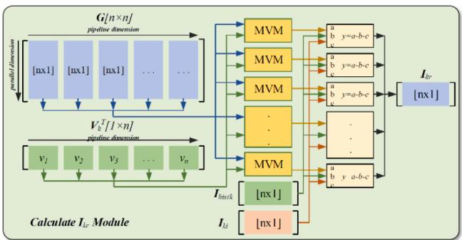  
Fig. 3. Paralleled scheme for $I _ { k r }$ and $I _ { m r }$ calculation module.

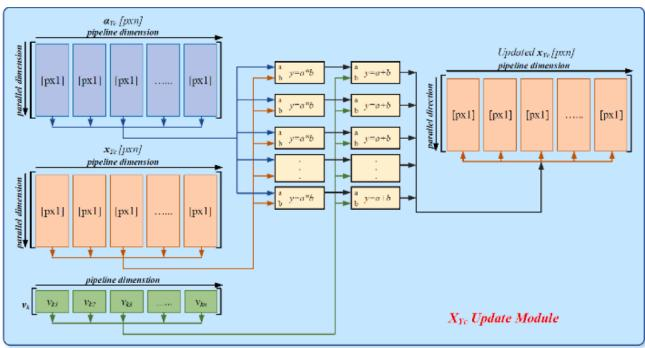  
Fig. 4. Paralleled scheme for $X _ { Y c }$ update module.

2.1.2.3. $G _ { H } i _ { m r } ( t - \tau )$ module. From (14), the calculation for the term $G _ { H } \dot { \iota } _ { m r } ( t - \tau )$ is only dependent on $i _ { m r } ( t - \tau )$ . As such the $G _ { H } \dot { \iota } _ { m r } ( t - \tau )$ module is executed in parallel with the Update $X _ { H }$ module as well as the Convolution module which will be detailed later. The dimension of $G _ { H }$ is $n \times n \times g ,$ the parallel dimension is n and the pipeline dimension is $n \times g$ as shown in Fig. 5. An accumulate unit (ACC) is responsible for accumulation operation.

2.1.2.4. Convolution module. Once $X _ { Y c }$ or $X _ { H }$ is updated, the convolu tion of (13) or (14) can be carried out. Fig. 6 illustrates the parallel computation scheme in the Convolution module for (13) only. The parameter $c _ { Y c }$ is a $p \times n \times n$ matrix and stored in RAMs with parallel dimension p and pipeline dimension $n \times n . \mathrm { { } } S 0 _ { \mathrm { { ; } } }$ , the computing is done in p-path parallel and in every n FPGA clock cycles one entry of vector ihistn1 is calculated. For the convolution of (14), the parameter $\pmb { c } _ { H }$ is a four dimensional matrix, $n \times p \times n \times g ,$ so there will be massive computations and arithmetic hardware units involved if a full parallelism scheme is implemented. Subject to the FPGA resource utilization, the hardware design for $X _ { H }$ convolution uses $2 \times n \times g$ parallel computing and the value of vector $i _ { h i s t n 3 }$ comes out sequentially in every $p / 2$ FPGA clock cycles.

# 2.2. Bergeron interface transmission line

The simplest approach to interface the FPGA-based FDPD transmission line model to the rest of the small time-step network is to use a Bergeron travelling wave transmission line with a travel time of 1 small time-step. This provides a stable interface between the small time-step network and the FPGA-based FDPD transmission line model. The Bergeron line injection current terms are updated separately and then sent to the opposite side by an optical fiber cable. Since the Bergeron interface line has a travel time of 1 small time-step, FPGA can send the previous time-step injection currents to the other side at the very beginning of each simulation time-step, so that a smaller simulation time-step around 3.0µs can be achieved.

Alternatively, the Bergeron line can removed from the FPGA-based line model to make this model an embedded model. This means the

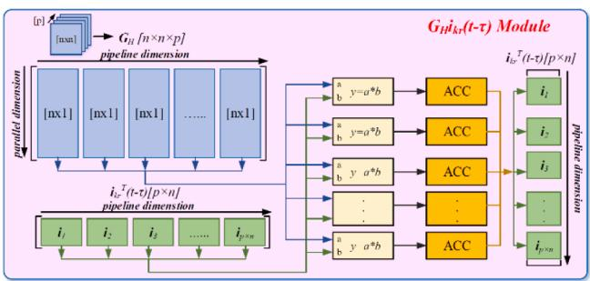  
Fig. 5. Paralleled scheme for $G _ { H } i _ { m r } ( t - \tau )$ calculation module.

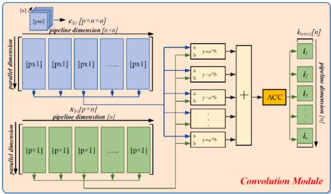  
Fig. 6. Paralleled computation scheme in Convolution module.

FPGA-based line model is solved as part of the entire circuit in each timestep. The embedded line model requires the FPGA to wait until receiving the terminal node voltages before starting calculation, which results in a larger simulation time-step. After removing the interface line, the timestep for the FPGA-based 8-conductor and 12-conductor model increased to 5.0µs and 5.8µs, respectively.

The embedded solution is mathematically rigorous but take long computation time. Therefore, it is the user’s choice to select which model to use in the real-time simulation, one model coming with a smaller time-step size and the other model providing a more accurate result but with a larger time-step size.

# 2.3. Hardware setup and simulation performance

# 2.3.1. Data representation

Before implementing any application in a digital system, such as CPU or FPGA, the data representation is always the first consideration, since it affects the accuracy of computation and the hardware resource utilization. There are two data representation systems widely used to approximate a real number: fixed-point number system and floatingpoint number system. In the fixed-point system, the decimal point location does not change during the entire computation and that can produce precision loss when the calculated result has more bits than the operands. In the floating-point number system, the decimal point is floating so that it can represent a number that has long integer or decimal digits in a dynamic range. This results in high accuracy computation. However, if the floating-point system does not have enough bits and the represented real number has both long integer and decimal digits then the system may not be accurate enough to achieve high accuracy computation. For a transmission line with a high number of conductors, poles and delay groups, the convolution in (13) and (14) requires highly accurate computation and more floating-point system bits are desired, which unfortunately requires more hardware resources and takes a longer computation time. In the non real-time and large time-step real-time simulation, the computations are done in doubleprecision floating-point to guarantee accurate computation. However, on FPGA, due to the hardware resource and the restriction of time-step size, the implementation of a double-precision small time-step model is very difficult. In this paper, to compare the precision of the different floating-point system, two designs are implemented on two FPGAs: one single-precision floating-point representation design is implemented on Xilinx® Virtex-7 FPGA VC707, and the other one using a customized 48- bits precision floating-point representation design is implemented on UltraScale+ FPGA VCU118 due to the fact that VC707 does not have enough hardware resource to implement more bits while holding the same time-step size. FPGA VCU118 is a Stacked Silicon Interconnect (SSI) type device which consists of multiple Super Logic Region (SLR) components and Super Long Line (SSL) components. Each SLR is a single FPGA and contains hardware resource such as LUT, DSP and block memory. The SSL component is hardware resource and is placed

between two SLRs to provide general connectivity for signals crossing form one SLR to another. If there are too many signals traffic between two SLRs and exceed the transferring capability of SSL, then the FPGA design will fail. Double-precision floating-point implementation can provide better performance, however the FPGA will run out of SLL resource.

# 2.3.2. FPGA hardware setup with real-time simulator

The real-time frequency-dependent transmission line model is implemented on the FPGA and interfaced to the RTDS NovaCor real-time simulator as shown in Fig. 7. The USB cable connected between the host computer and the FPGA through the USB JTAG interface is used to download the hardware design into the FPGA. An optical fiber cable is connected between the FPGA transceiver and the NovaCor chassis gigabyte transceiver (GT) port. The communication is realized by using a RTDS supported serial interface. It has a speed of 2.0 Gigabits Per Second (Gbps) with an 8-bit/10-bit (8B/10B) encoding format, which provides a simple interface for application on FPGA and allows communication with the NovaCor. The data received from the NovaCor is on a 32-bits with a 24-bit address bus and the data sent to the NovaCor uses a 32-bits with an 8 bit address bus. At the case start-up, the transmission line parameters will be sent into the RAMS implemented on the FPGA through this optical fiber cable and during the simulation for each time-step, this optical fiber cable is responsible for exchanging the injection currents between real-time simulator and FPGA. The monitor signals from the FPGA such that transmission line currents and voltages are also sent back to the real-time simulator by this optical fiber cable.

The real-time simulation is carried out with a clock frequency of 100 MHz on the FPGA. There are two versions of the model, 8 and 12 conductor models are implemented with a different maximum number of conductors, poles and delay groups. The 8 conductor model can simulate up to 8 conductors, 20 poles and 6 delay groups while the 12 conductor model can simulate up to 12 conductors, 20 poles and 4 delay groups. The hardware resource utilization from post-implementation and time-step for the single-precision floating-point design is summarized in Table I and the possible number of conductors per line/cable for each model is outlined in Table II. From Table II, it can be clearly seen that almost full lookup tables (LUT), Block RAM (BRAM), flip-flops (FF) and DSP48 are occupied by the single-precision floating-point design. So, it is not possible to accommodate a customized 48-bits floating-point design on FPGA VC707 at the same simulation time-step. The BUFG is used to distribute clock signals across the entire FPGA to synchronize the calculation, and the GT port is used to send and receive signals from the real-time digital simulator.

# 3. CASE STUDY AND VALIDATION

# 3.1. Case study i

Three case studies are analyzed to show the effectiveness and accuracy of the proposed FPGA-based transmission line model. The first case study is a three-phase power system where two voltage sources are

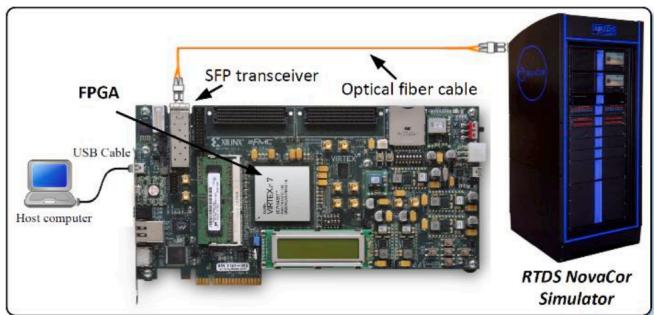  
Fig. 7. Hardware setup and the connection between FPGA and NovaCor.

TABLE I FPGA Hardware Resource Utilization On VC707 for single-precision floatingpoint design.   

<table><tr><td>Hardware Utilization</td><td>8 Conductor Model</td><td>12 Conductor Model</td></tr><tr><td>LUT</td><td>276,344 (91.02%)</td><td>280,958 (92.54%)</td></tr><tr><td>BRAM</td><td>845 (82.04%)</td><td>773.5 (75.10%)</td></tr><tr><td>DSP48</td><td>2539 (90.68%)</td><td>2651 (94.68%)</td></tr><tr><td>FF</td><td>256,877 (42.31%)</td><td>261,639 (43.09%)</td></tr><tr><td>I/O</td><td>65 (9.29%)</td><td>64 (9.29%)</td></tr><tr><td>BUFG</td><td>4 (12.50%)</td><td>4 (12.5%)</td></tr><tr><td>GT</td><td>1 (2.86%)</td><td>1 (2.86%)</td></tr><tr><td>Time-step</td><td>2.4μs</td><td>2.8μs</td></tr></table>

TABLE II Line/cable Configurations for Transmission Line Model.   

<table><tr><td>Number of Line/Cables</td><td>8 Conductor Model</td><td>12 Conductor Model</td></tr><tr><td>1 line/cable</td><td>1-8</td><td>1-12</td></tr><tr><td>2 line/cable</td><td>1-4</td><td>1-6</td></tr><tr><td>3 line/cable</td><td>1-2</td><td>1-4</td></tr><tr><td>4 line/cable</td><td>1-2</td><td>1-3</td></tr><tr><td>5 line/cable</td><td>1</td><td>1-2</td></tr><tr><td>6 line/cable</td><td>1</td><td>1-2</td></tr><tr><td>7 line/cable</td><td>1</td><td>1</td></tr><tr><td>8 line/cable</td><td>1</td><td>1</td></tr><tr><td>9 line/cable</td><td>N/A</td><td>1</td></tr><tr><td>10 line/cable</td><td>N/A</td><td>1</td></tr><tr><td>11 line/cable</td><td>N/A</td><td>1</td></tr><tr><td>12 line/cable</td><td>N/A</td><td>1</td></tr></table>

connected using two lines and a fault bus is placed between them. A single-line diagram of a three-phase system for a large time-step realtime simulation is shown in Fig. 8(a). The same system is also simulated in a small time-step simulation environment where the transmission line is simulated on FPGA and the rest of the power system is simulated on NovaCor as shown in Fig. 8(b). The different types of fault will be applied to the system by controlling the fault breaker in both simulation environments. As shown in Fig. 9, a single phase-a fault is applied, and the three-phase voltage and current waveforms from both simulation environments are plotted on top of each other to validate the FPGA-

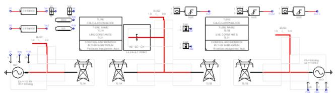  
(a)

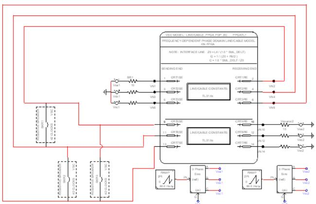  
(b)   
Fig. 8. Case study I (a) single-line diagram in large time-step real-time simulation; (b) three-phase line diagram in small time-step real-time simulation and its configuration.

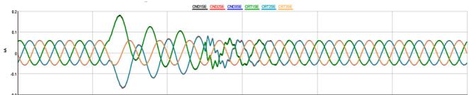

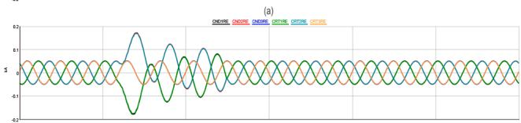

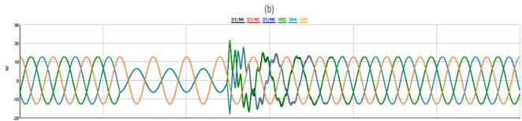

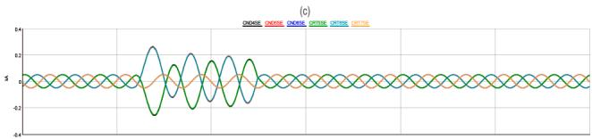

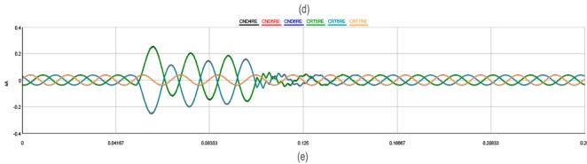  
Fig. 9. Case study I Phase-a faults simulation results: (a) Line TL1A sendingend currents; (b) Line TL1A reserving-end currents; (c) Fault bus voltages; (d) Line TL1B sending-end currents; (e) Line TL1B reserving-end currents.

based model. As can be seen, the simulation results are closely matched. These aforementioned FPGA-based model results are from single-precision floating-point hardware implementation. The customized 48-bits simulation which is omitted here has the same result. In case study II, we will show the precision problem caused by different floating-point systems.

# 3.2. Case study ii

In case study II, a 48-bits precision floating-point FDPD transmission line model is also implemented on UltraScale+ VCU118 FPGA and the hardware resource utilization for 12 conductor model is summarized in Table III. The tested system as shown in Fig. 10(a) is built and run in both off-line software PSCAD and real-time simulator, and the simulation results are compared against each other. In the real-time simulator, different simulation models such as large time-step simulation model, single-precision FPGA-based model and 48-bits precision FPGA-based model, are used to carry out the results. The test is done by doing a sending-end voltage step-up and plotting the sending-end branch current waveforms together. As can be seen from Fig. 10, the PSCAD, large time-step model (LDT) and FPGA-based 48-bits model (FPGA-48)

TABLE III FPGA Hardware Resource Utilization On VCU118 for 48-Bits Precision Floating-point Design.   

<table><tr><td>Hardware Utilization</td><td>12 Conductor Model</td></tr><tr><td>LUT</td><td>572,113 (48.39%)</td></tr><tr><td>BRAM</td><td>1408 (65.18%)</td></tr><tr><td>DSP48</td><td>3220 (47.08%)</td></tr><tr><td>FF</td><td>454,176 (19.21%)</td></tr><tr><td>I/O</td><td>12 (1.44%)</td></tr><tr><td>BUFG</td><td>39 (2.17%)</td></tr><tr><td>GT</td><td>1 (1.92%)</td></tr><tr><td>Time-step</td><td>3.27μs</td></tr></table>

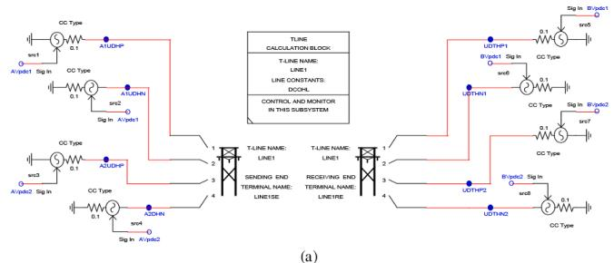

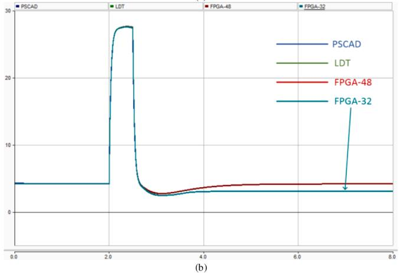  
Fig. 10. Case study II (a) simulated power system; (b) transmission line sending-end current waveforms from different simulation environments.

simulation gives matched results before and after the step-up operation. However, results from the FPGA-based single-precision model (FPGA-32) are departing from the others’ because the step-up operation and the current value will never go back to the value before the operation. This case study clearly shows that the precision will have a great impact on the model accuracy. This is because the convolutions in (13) and (14) are basically multiple-accumulation operations and for some line or cable with a larger number of conductors, poles and delay groups, if the floating-point system does not have enough bits to accurately represent a real number, the error will be accumulated in the convolution and give inaccurate and even wrong results.

# 3.3. Case study iii

Frequency response is an important concern to the power system industry due to the potential grid impact from a sudden loss of generations or loads during disturbance or restoration. Integrating of renewable energy resources such as wind also increases the complexity of the power grids and introduces a challenge in frequency control of systems. To properly investigate the frequency response of the FPGAbased transmission line model proposed in this paper, which essentially is a combination of FDPD transmission line and interface Bergeron line, the FPGA-based model frequency scan result from 1 Hz to 1000 Hz is validated against the result from the large time-step model. Two methods can be used to carry out the frequency response result. For the large time-step model, a frequency scan component can be placed in the canvas to carry out the theoretical result. The second method is to inject small magnitude harmonic signals as inputs, such as voltage injections, to the power system. Then the output signals, such as current and voltage values, are measured to compute the frequency response of the power system. A harmonic scan component has also been developed for this purpose. In this paper, the second method is used to provide the harmonic perturbations to both the large time-step model and the FPGAbased model to carry out the frequency response. The results from 1 Hz to 1000 Hz of both methods are plotted in Fig. 11(a). As can be shown, the frequency response of the processor-based model (green) is very

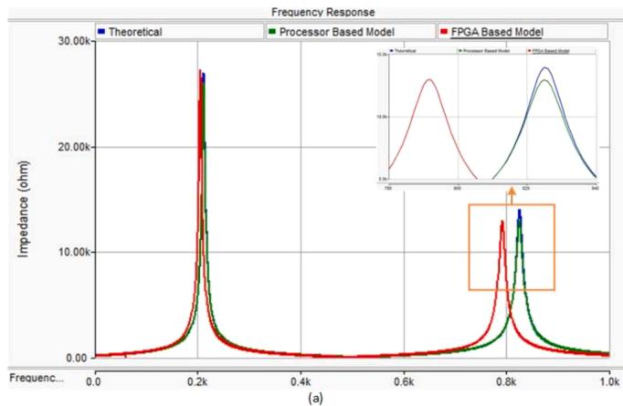

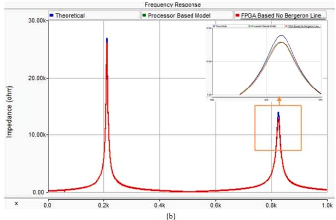  
Fig. 11. Case study III frequency response results for processor-based model and (a) FPGA-based FDPD model with Bergeron interface; (b) FPGA-based FDPD model without Bergeron interface.

close to the theoretical result (blue). However, the frequency response of the FPGA-based model (red) has a discrepancy compared to the other two’s. The reason is because, as mentioned before, the FPGA-based line model essentially is a combination of FDPD transmission line and Bergeron line, and the Bergeron line does have an impact on the frequency response. To validate this, the response of the FPGA-based line model to make this model an embedded model with and without the interface Bergeron line compared. As shown in Fig. 11(b), the frequency response result of the FPGA-based no interface line model matched to the processor-based model very well. The users can trade off the priority between the time step and the frequency response then determine whether to keep the interface of the short Bergeron line.

# 4. Conclusion

This paper proposed an FPGA-based phase domain frequencydependent transmission line model for real-time simulation. Taking the natural advantages of hardware architecture, parallelism, and pipelining, the FPGA enabled us to achieve a significantly smaller time step to simulate the FDPD line compared with the same model on processor. A key problem of the implementation is precision of the computation on the FPGA. A custom 48-bit float point design has been proposed to enhance the precision of the model. Both time domain simulation and frequency scanning are used to validate the model. The frequency scanning showed that the interface Bergeron line may cause deviations in the frequency response of the line. A new option to eliminate the interface line was developed, which brings more accurate performance at the price of increasing the time step to 5 µs. All those options are integrated in the model for user to choose depending on various scenarios.

# Declaration of Competing Interest

The authors declare that they have no known competing financial interests or personal relationships that could have appeared to influence the work reported in this paper.

# References

[1] L. Marti, Simulation of transients in underground cables with frequency-dependent modal transformation matrices, IEEE Trans. Pow. Deliv. 3 (3) (1988) 1099–1110. July.   
[2] L.M. Wedepohl, H.V. Nguyen, G.D. Irwin, Frequency-dependent transformation matrices for untransposed transmission lines using newton-raphson method, IEEE Trans. Pow. Syst. 11 (3) (1996) 1538–1546. Aug.   
[3] B. Gustavsen, A. Semlyen, Simulation of transmission line transients using vector fitting and modal decomposition, IEEE Trans. Pow. Deliv. 13 (2) (1998) 605–614. April.   
[4] H. Nakanishi, A. Ametani, Transient calculation of a transmission line using superposition law, IEEE Proc. 133 (5) (1986) 263–269. July.

[5] T. Noda, N. Nagaoka, A. Ametani, Phase domain modeling of frequency-dependent transmission lines by means of an ARMA model, IEEE Trans. Pow. Deliv. 11 (1) (1996) 401–411. Jan.   
[6] H.V. Nguyen, H.W. Dommel, J.R. Marti, Direct phase-domain modelling of frequency-dependent overhead transmission lines, IEEE Trans. Pow. Deliv. 12 (3) (1997) 1335–1342. July.   
[7] B. Gustavsen, A. Semlyen, Combined phase and modal domain calculation of transmission line transients based on vector fitting, IEEE Trans. Pow. Deliv. 13 (2) (1998) 596–604. April.   
[8] A. Morched, B. Gustavsen, M. Tartibi, A universal model for accurate calculation of electromagnetic transients on overhead lines and underground cables, IEEE Trans. Power Delivery 14 (3) (1999) 1032–1038. July.   
[9] Y. Chen, V. Dinavahi, Digital Hardware Emulation of universal machine and universal line models for real-time electromagnetic transient simulation, IEEE Trans. on Ind. Elect. 59 (2) (2012) 1300–1309. Feb.   
[10] Y. Chen, V. Dinavahi, FPGA-based real-time EMTP, IEEE Trans. on Pow. Deliv. 24 (2) (2009) 892–902. April.   
[11] J. Liu, V. Dinavahi, A real-time nonlinear hysteretic power transformer transient model on FPGA, IEEE Trans. on Ind. Elect. 61 (7) (2014) 3587–3597. Jul.   
[12] Z. Shen, V. Dinavahi, Real-time device-level transient electro-thermal model of the modular multilevel converter on FPGA, IEEE Trans. Pow. Elect. PP (99) (2021) 1.