# Fast Simulation Model of Voltage Source Converters With Arbitrary Topology Using Switch-State Prediction

Shilin Gao , Student Member, IEEE, Yankan Song , Member, IEEE, Ying Chen , Senior Member, IEEE, Zhitong Yu, Member, IEEE, and Rui Zhang

Abstract— Voltage source converter (VSC) is fundamental and critical in renewable energy integration and transmission and has become ubiquitous in power systems. For the design and operation of power systems with VSCs, electromagnetic transient (EMT) simulation is indispensable. However, a large number of VSCs in power systems cause a high time-consuming issue in EMT simulation. This article proposes a fast EMT simulation model for VSCs with arbitrary topology based on switch-state prediction. The accurate switch-state prediction has two steps: Preliminary switchstate prediction and simultaneous switching prediction. It avoids the iterative computation required to obtain a feasible switch-state combination in the traditional EMT simulators. Extensive tests on different types of VSCs and a dc microgrid demonstrate that the proposed fast model significantly improves the EMT simulation efficiency of power systems with VSCs.

Index Terms—Electromagnetic transient (EMT) simulation, half-bridge converter, neural-point-clamped (NPC) converter, switching state prediction, t-type converter, voltage source converter (VSC).

# I. INTRODUCTION

V OLTAGE source converter (VSC) is widely used in themodern power system for various applications, such as photovoltaic systems [1], wind farms [2], ac/dc microgrids [3], and high voltage direct current (HVdc) systems [4], due to the advantages in the aspects of reliability, controllability, and flexibility. Nowadays, with the high penetration of renewable energies, a large number of VSCs are integrated into the power system [5]. Along with this, the problems such as subsynchronous oscillations, voltage surges, and poor power quality are becoming increasingly severe [6].

Manuscript received December 11, 2021; revised April 5, 2022; accepted May 16, 2022. Date of publication May 24, 2022; date of current version June 24, 2022. This work was supported in part by the National Natural Science Foundation of China under Grants 52007101, 51877115, and 51861135312. Recommended for publication by Associate Editor F. Gao. (Corresponding author: Yankan Song.)

Shilin Gao and Ying Chen are with the Department of Electrical Engineering, Tsinghua University, Beijing 100084, China (e-mail: gaosl19@foxmail.com; chen_ying@tsinghua.edu.cn).

Yankan Song, Zhitong Yu, and Rui Zhang are with the Sichuan Energy Internet Research Institute, Tsinghua University, Chengdu 610042, China (e-mail: songyankan@cloudpss.net; yuzhitong@cloudpss.net; zhangrui_cq@ foxmail.com).

Color versions of one or more figures in this article are available at https://doi.org/10.1109/TPEL.2022.3176687.

Digital Object Identifier 10.1109/TPEL.2022.3176687

Owing to the complexity of VSCs, digital simulation is needed in the design, analysis, and control of VSC systems. The modern circuit simulators fall into two classes: 1) The state-space analysis method-based simulators, e.g., DSIM [7] and Simulink [8], and 2) the nodal-analysis method-based simulators, e.g., PSCAD/EMTDC [9], [10] and EMTP-RV [11], [12]. These two categories of methods have their own advantages and have different applications. Compared with the nodal analysis method, the state-space approach is widely used for power electronic system simulation as the state equation of power electronic systems can be readily constructed [13]. Besides, the statespace matrices are independent of step-size so a variable-step solver can be readily implemented to obtain a faster simulation speed. Under the framework of the state-space approach, the discrete state event-driven (DSED)-based simulation algorithm for power electronic systems is proposed in [13]–[15], and the simulator DSIM is developed based on the DSED method, which is very efficient. It is widely used in device-level studies of power electronic systems. The main disadvantage is that it has difficulty in system-level studies (e.g., difficulty in modeling transmission lines with distributed parameters [16]). In contrast, the nodal analysis method (also called EMTP-type method [17]) works well in power system electromagnetic transient (EMT) simulations. To study the dynamic characteristics of power systems with VSCs, the power converters have been modeled under the EMTP-type solution framework, such as PSCAD/EMTDC. Nowadays, the EMTP-type simulators are widely used in the system-level studies of power systems with converters, such as the oscillation analyses of renewable energy integration systems, the control and protection system characteristic analyses of high-voltage direct current transmission grid, and hardware-inthe-loop tests of controllers of the power electronic systems.

Nevertheless, these traditional EMTP-type simulators are usually confronted with low computational efficiency issues when simulating the power system with a large number of VSCs. Four factors account for the low efficiency. First, since detailed models are commonly adopted for the VSCs, tiny time-steps (as small as microseconds) are required to emulate switching events within the converters accurately [18]. Second, for the electric network of power system with numerous VSCs, there are too many switches, resulting in a high-dimensional system dynamic equation with a large admittance matrix [19]. Third, the nodal

admittance matrix of the power system is frequently changed in the EMT simulation. Every time the nodal admittance matrix is modified, lower-upper (LU) factorization of it is required. Nevertheless, the LU factorization of a high-dimensional matrix is quite time-consuming. Fourth, to determine the ON or OFF states of the switches in the converters, iterative calculation of the whole power system is required in each time-step of the EMT simulation to obtain a feasible switch-state combination, which will dramatically increase the computational time.

Aiming at the first problem, the averaged-value modeling (AVM) technique is proposed for system-level simulations [20], [21], which ignores the switching characteristics of power electronic converters. Large time-steps can be adopted for the AVM simulation [22], [23]. Besides enlarging the time-step, the dimension of the system dynamic equation is usually reduced since the converters are models as several voltages or current sources. Thus, the AVM is highly efficient. The problem is that the high-frequency transients of VSCs cannot be accurately emulated. In [24]–[26], switching function models (SFMs) are proposed, where the converters are modeled as voltage/current sources controlled by the switching function. Compared with AVM, the SFM is able to emulate the high-frequency transients, e.g., the voltage ripples, but a much smaller time-step is required. In addition to this shortcoming, the common problems with the AVM and SFM are that they are incapable of emulating the inner fault characteristics of the VSCs and ignore the power loss of the converters. This makes the AVM and SFM fail to analyze the transient characteristics in some cases, e.g., impedance-based stability analysis. Thus, it is of importance to accelerate the detailed EMT simulation of power systems with VSCs without loss of accuracy. To address this, the Thevenin equivalence method is proposed for modeling the modular multilevel converter [27] and power electronic transformer [28]. The two types of typical VSCs are modeled as two-port Thevenin equivalent circuit in the EMT simulation and the inner nodes are eliminated, which greatly reduce the dimension of the system dynamic equations with guaranteed accuracy. Considering the superiority of the method, it can be extended to the EMT simulation of all kinds of VSCs. Besides the above techniques, aiming at the third cause of low simulation efficiency, the associated discrete circuit (ADC) models of the converters are proposed [29], [30], where the switch is equivalent to inductance or capacitance according to the switch state. By selecting proper parameters, the equivalent admittance becomes constant and the simulation efficiency is thus improved. However, the parameter settings of ADC models are tough and unacceptable virtual power loss may emerge in the simulation. To solve the fourth problem, heuristic works have been proposed in [31], [32]. Using predefined transition rules, switch states of VSC devices can be predicted without iterative calculation. Nevertheless, theoretical analyses of such prediction methods are not explicitly given, which weakens their applications for VSCs with complicated topology and varied operating conditions.

In summary, many researchers have been worked to resolve the first three problems. Based on their work, the EMT efficiency of power systems with VSCs can be improved, although there is still room for improvement in these aspects. More notably,

note that the fourth issue is hardly solved to the authors’ best knowledge.

To this end, a fast EMT simulation model for VSCs with arbitrary topology using switch-state prediction is proposed. It aims to accelerate the detailed EMT simulation of VSCs, which is popular in the design and characteristic analysis of VSCs. In this article, the structures of the existing VSCs are first analyzed. It is found that all of the widely used VSCs are composed of the parallel or series connections of half-bridge converters (HBCs), although there are a wide variety of topologies of VSCs. Specifically, there exist three types of HBCs: The two-level HBC, three-level neural-point-clamped (NPC) HBC (abbreviated as NPCHBC), and three-level T-type HBC (abbreviated as THBC). Second, the operational principles of the HBCs are analyzed. In each time-step of the EMT simulation for VSCs, the switch states of each HBC are hardly affected by other HBCs. Then, based on the two characteristics above, a switch-state prediction method is proposed to determine the switch states of HBC one by one, where the switch states of an HBC are constructed as a finite-state machine.

The contributions and features of the proposed model are twofold. 1) The structural and operational characteristics of various VSCs are analyzed. All of them are composed of HBCs, and the switch states of an HBC are hardly influenced by the switch states of the others in each step of the EMT simulation. Thus, the switch-state judgments can be limited into the HBCs rather than the whole system, reducing the complexity of the switch-state judgment. 2) By representing the switch states of each HBC as a finite-state machine, an accurate switch-state prediction method is proposed for obtaining a feasible switch-state combination, avoiding the iterative computation of the whole system in each time-step, which significantly improves the simulation efficiency. Furthermore, extensive tests are performed to examine the accuracy and efficiency of the proposed model versus the state-of-the-art model.

The remainder of this article is organized as follows. The limitations of traditional EMT simulation for power systems with a number of VSCs are analyzed in Section II. Section III proposes a switch-state prediction method for determining the states of the converter. In Section IV, the flowchart EMT simulation based on the above two techniques is presented. Section V validates the accuracy and efficiency of the proposed method on HBCs, VSCs, and systems, respectively. Finally, Section VI concludes this article.

# II. PROBLEM DESCRIPTION

# A. Brief Introduction to EMT Simulation

In each time-step of EMTP-type simulation, there are five main steps [33].

1) Solve the control system.   
2) Modify the nodal admittance matrix if there is a switching.   
3) Calculate the history current sources and external current sources.   
4) Solve the nodal equation and obtain the nodal voltages

$$
\boldsymbol {Y} (t) \boldsymbol {v} (t) = \boldsymbol {i} _ {\mathrm {s}} (t) + \boldsymbol {i} _ {\mathrm {h}} (t) \tag {1}
$$

where ${ \pmb v } ( t )$ is the nodal voltage vector, $\mathbf { } Y ( t )$ represents the equivalent nodal admittance matrix, $ { i _ { \mathrm { s } } } ( t )$ is the vector of external current sources, and $i _ { \mathrm { h } } ( t )$ is the history current vector.

5) The inner variables of each branch are calculated for updating the history current sources in the next time-step.

For an electric network without switches, $\mathbf { } Y ( t )$ is always a constant matrix. Equation (1) is a set of linear algebraic equations, which can be solved by direct methods based on Gauss elimination.

It is worth noting that, for the EMT simulation with switches, $\mathbf { } Y ( t )$ is dependent on the states of switches and can be represented as

$$
\boldsymbol {Y} (t) = f _ {\mathrm {Y}} (\boldsymbol {X} (t)) \tag {2}
$$

where $f _ { \mathrm { Y } } ( \cdot )$ is the function that represents the mapping from $X ( t )$ to Y (t). X(t) is the switch-state vector and can be written as

$$
\boldsymbol {X} (t) = \left[ \begin{array}{l l l l} x _ {1} (t) & x _ {2} (t) & \dots & x _ {n} (t) \end{array} \right] \tag {3}
$$

where n is the number of switches. $x _ { i } ( t )$ is the state of the ith switch, which can be represented as

$$
x _ {i} (t) = 0 \text {o r} 1 \tag {4}
$$

where $x _ { i } ( t ) = 0$ represents that the switch is OFF, and $x _ { i } ( t ) = 1$ represents that the switch is ON. When the switch is OFF, it can be equivalent to a large resistance $( \mathbf { e } . \mathbf { g } . , 1 0 ^ { 8 } \Omega )$ in the simulation. On the contrary, when the switch is $^ { 6 6 } \mathrm { O N } , ^ { 5 }$ it is equivalent to a small resistance [34]. $X ( t )$ is constrained by the voltage and current of the VSCs, which can be represented as

$$
\boldsymbol {X} (t) = f _ {\mathrm {X}} (\boldsymbol {v} (t)) \tag {5}
$$

where $f _ { \mathrm { X } } ( \cdot )$ is the function that represents the mapping from ${ \pmb v } ( t )$ to $X ( t )$ .

Besides, it is worth noting that the calculation of $\dot { \mathbf { \mathfrak { z } } } _ { \mathrm { s } } ( t )$ is dependent on $\mathbf { } Y ( t )$ .

$$
\boldsymbol {i} _ {s} (t) = f _ {1} (\boldsymbol {Y} (t)) \tag {6}
$$

where $f _ { \mathrm { I } } ( \cdot )$ is the function that represents the mapping from $Y ( t ) \mathrm { t o } i _ { s } ( t )$ .

For the EMT simulation of a power system with a number of VSCs, the switching of some converters will cause parasitic switching events simultaneously. The switch-state vector is hard to be determined before the solution of nodal equations. Then, (1), (2), (5), and (6) become a set of discrete nonlinear algebraic equations.

# B. Limitation of EMT Simulation for Power System With a Number of VSCs

According to the above analyses, it can be found that the essence of the computation of the electric network in each timestep of the EMT simulation is to solve a set of discrete nonlinear algebraic equations. Mathematically, the solution to nonlinear equations is an iterative process. The flowchart of traditional EMT simulation for power systems with VSCs is illustrated in Fig. 1. As can be seen, iterative computation is added to

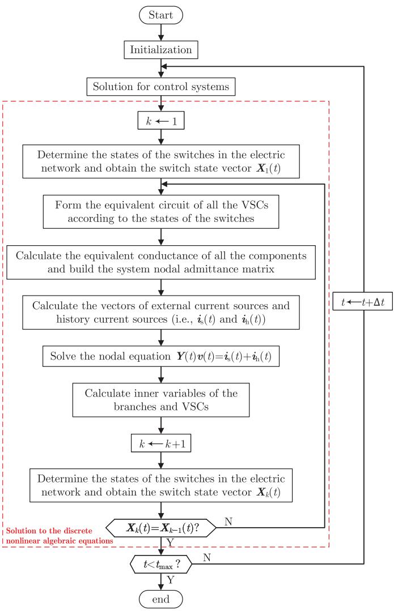  
Fig. 1. Flowchart of traditional EMT simulation for power system with VSCs.

the original EMTP-type simulation algorithm [33] to obtain a feasible switch-state combination. Specifically, after calculating the inner variables of the branches at each time-step, the state of each switch is calculated again and the switch-state vector is updated, which can be denoted as $X _ { k } ( t ) ~ ( \mathrm { i . e . }$ ., the switch-state vector in kth iteration at time t). If $X _ { k } ( t ) \neq X _ { k - 1 } ( t )$ , it means that there are parasitic switching events. Then, the system admittance matrix and the history current sources are reupdated according to $X _ { k } ( t )$ and the system is solved again, obtaining a new switch-state vector $X _ { k + 1 } ( t )$ . The computation of the next time-step, $\mathrm { 1 . e . , ~ } t + \Delta t$ , will be executed until the switch-state vector $X _ { k } ( t )$ does not change. For a power system with massive VSCs, the process of iterative switch-state judgment is quite time-consuming.

Aiming at avoiding the iterative computation mentioned above, an accurate noniterative prediction method is proposed in Section III to determine the switch states $X ( t )$ before the solution to equivalent nodal conductance matrix and nodal equations. When $X ( t )$ is obtained, the nodal conductance matrix $\mathbf { } Y ( t )$ , the history current vector $\dot { \mathbf { \mathfrak { z } } } _ { \mathrm { s } } ( t )$ , and the nodal equations can be solved sequentially.

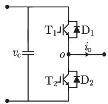

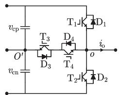

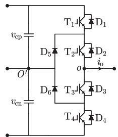  
  
Fig. 2. Topologies of different types of HBCs. (a) Two-level HBC. (b) Threelevel THBC. (c) Three-level NPCHBC.

# III. SWITCH-STATE PREDICTION FOR THE VSC

# A. Characteristics Analyses of Switch States of VSCs

By analyzing the structure of all the widely used VSCs in power systems, e.g., the grid-tie inverter of renewable energies, VSC-HVdc and dc–dc transformers [13], it is found that all of these VSCs are composed of the series or parallel connections of the HBCs if there is an appropriate partitioning method. The HBCs include two-level HBC [35], three-level THBC [36], and three-level NPCHBC [37]. The schematic diagrams of the three HBCs are shown in Fig. 2, where $\mathrm { T } _ { i } ( i = 1 , \dots , 4 )$ represents the ith IGBT, $\mathrm { D } _ { j } ( j = 1 , \ldots , 6 )$ is the jth diode, and $v _ { \mathrm { c } } , v _ { \mathrm { c p } } ,$ and $v _ { \mathrm { c n } }$ are the capacitor voltages. $i _ { \mathrm { o } }$ is the current of the HBC.

For all the switches in an HBC, it can be found that the states of them are only related to the capacitor voltage (i.e., $v _ { \mathrm { c } } , v _ { \mathrm { c p } } ,$ and $v _ { \mathrm { c n } } )$ , the HBC current $i _ { \mathrm { o } }$ and the gate signal G of the switch. Thus, in each time-step, the states of the switches in each HBC are only determined by the quantities in the HBC and independent of the external circuit. Besides, due to the existence of capacitor and inductor, $v _ { \mathrm { c } } , v _ { \mathrm { c p } } , v _ { \mathrm { c n } } ,$ and $i _ { \mathrm { o } }$ will not suddenly change in a small time-step. Considering this fact, we can predict the switch states at t using the $v _ { \mathrm { c } } , v _ { \mathrm { c p } } , v _ { \mathrm { c n } } ,$ , and $i _ { \mathrm { o } }$ at $t - \Delta t$ . Based on this characteristic, an accurate switch-state prediction method is proposed for determining the states of the switches in an HBC. The prediction process mainly includes two steps: 1) Preliminary prediction of switch states of the HBC; 2) Prediction of simultaneous switching and updating the switch states of the HBC.

# B. Preliminary Prediction for the “ON” or $" O F F "$ States of the Switches in an HBC

In the HBCs presented in Fig. 2, there are two types of switch units, i.e., the group of insulated gate bipolar transistor (IGBT) and diode (in all the three HBCs) and the diode (only in NPCHBC). The preliminary predictions of the two switch units are elaborated as follows.

1) Preliminary Switch-State Prediction of IGBT/Diode Switch Group: For an IGBT/diode switch group, the state of the IGBT or diode can be derived at any time-step according to the gate signal (G), and branch current and voltage $( i _ { \mathrm { c e } }$ and $v _ { \mathrm { c e } } )$ . The schematic diagram of the IGBT/diode switch group is shown in Fig. 3(a). The IGBT and diode have two states of ON and OFF, respectively. For the IGBT/diode switch group, the

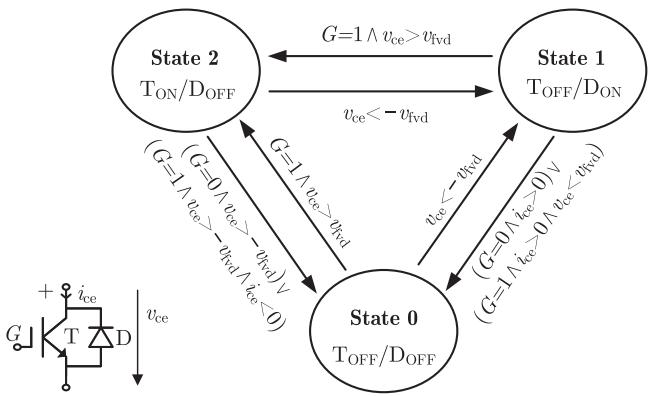  
  
  
Fig. 3. (a) Schematic diagram of switch group IGBT/diode. (b) Switch states of the switch group and transitions between the states.

IGBT and diode cannot conduct simultaneously. Thus, there are three states of the switch group [31].

1) State 0: Both the IGBT and diode are OFF.   
2) State 1: The IGBT is OFF while the diode is ON.   
3) State 2: The IGBT is ON while the diode is OFF.

The IGBT turns ON when G=1 and the branch voltage exceeds the forward voltage drop $( v _ { \mathrm { c e } } > v _ { \mathrm { f v d } } )$ , where $v _ { \mathrm { f v d } }$ is usually set as 0 in power system analyses. When $i _ { \mathrm { c e } } < 0$ or $G = 0$ , the IGBT turns OFF. For the diode in the switch group, it turns ON when $v _ { \mathrm { c e } } < - v _ { \mathrm { f v d } }$ and turns OFF at a current zero. According to these switching characteristics of the IGBT and diode, the switch-state transition diagram of the IGBT/diode switch group can be obtained, which is represented as an infinite state machine [see Fig. 3(b)]. It can also be expressed as

$$
s _ {i} (t) =
$$

$$
\left\{ \begin{array}{l} 1 \binom {s _ {i} (t - \Delta t) = 2 \wedge v _ {\mathrm {c e}} (t - \Delta t) <   - v _ {\mathrm {f v d}}) \vee} {\left(s _ {i} (t - \Delta t) = 0 \wedge v _ {\mathrm {c e}} (t - \Delta t) <   - v _ {\mathrm {f v d}}\right)} \\ 2 \binom {s _ {i} (t - \Delta t) = 1 \wedge G (t) = 1 \wedge v _ {\mathrm {c e}} (t - \Delta t) > v _ {\mathrm {f v d}}) \vee} {\left(s _ {i} (t - \Delta t) = 0 \wedge G (t) = 1 \wedge v _ {\mathrm {c e}} (t - \Delta t) > v _ {\mathrm {f v d}}\right)} \\ \left. \begin{array}{l} \left(s _ {i} (t - \Delta t) = 2 \wedge ((G (t) = 0 \wedge v _ {\mathrm {c e}} (t - \Delta t) > - v _ {\mathrm {f v d}}) \vee \right. \\ 0 \left. \begin{array}{l} \left(G (t) = 1 \wedge v _ {\mathrm {c e}} (t - \Delta t) > - v _ {\mathrm {f v d}} \wedge i _ {\mathrm {c e}} (t - \Delta t) <   0\right)\right) \vee \\ \left(s _ {i} (t - \Delta t) = 1 \wedge ((G (t) = 0 \wedge i _ {\mathrm {c e}} (t - \Delta t) > 0) \vee \right. \\ \left. \left(G (t) = 1 \wedge i _ {\mathrm {c e}} (t - \Delta t) > 0 \wedge v _ {\mathrm {c e}} (t - \Delta t) <   v _ {\mathrm {f v d}}\right)\right) \end{array} \right. \\ \end{array} \right. \tag {7}
$$

where $s _ { i }$ is the state of the ith IGBT/diode switch group. If the transition conditions above are not met, the switch states remain unchanged. For an IGBT/diode group, it can be regarded as a $\mathrm { R _ { o n } / R _ { o f f } }$ switch in the simulation. In this case, the relationship between $x _ { i }$ and $s _ { i }$ can be represented as

$$
x _ {i} (t) = \left\{ \begin{array}{l l} 1 & s _ {i} (t) = 1 \vee s _ {i} (t) = 2 \\ 0 & s _ {i} (t) = 0 \end{array} \right. \tag {8}
$$

where $x _ { i } ( t )$ is the same as that in (4).

2) Preliminary Switch-State Prediction of Diode: For single diodes in the three-level NPCHBC, there are only two states:

1) State 0: The diode is ON.   
2) State 1: The diode is OFF.

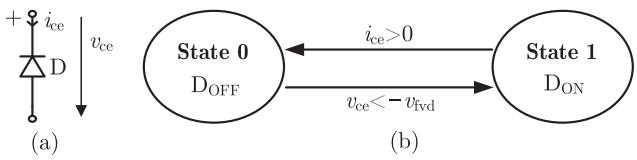

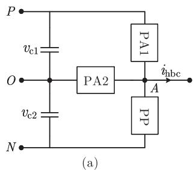  
Fig. 4. Switch-state transition of the diode.

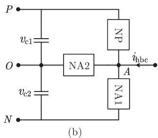  
Fig. 5. Equivalent topology of the HBCs with different injected currents. (a) With positive injection current. (b) With negative injection current.

The transition between the two states is illustrated in Fig. 4. It can also be represented as

$$
s _ {i} = \left\{ \begin{array}{l l} 1 & s _ {i} (t - \Delta t) = 0 \wedge v _ {\mathrm {c e}} (t - \Delta t) <   - v _ {\mathrm {f v d}} \\ 0 & s _ {i} (t - \Delta t) = 1 \wedge i _ {\mathrm {c e}} (t - \Delta t) > 0 \end{array} \right. \tag {9}
$$

Here, $s _ { i }$ represents the switch state of the diode. For the diode, the relationship between $x _ { i }$ and $s _ { i }$ can be represented as

$$
x _ {i} = s _ {i}. \tag {10}
$$

According to the state transition diagrams, states of the single diode and the IGBT/diode switch group can be determined. However, these states may not be feasible. Due to the interaction between the switches in an HBC, changes in the ON/OFF states of the IGBTs will result in ON/OFF state switching of the diodes, which is called simultaneous switching. In these cases, the switch states need further correction, which is detailedly elaborated in the following subsection.

# C. Simultaneous Switching Prediction of HBC

As mentioned above, the ON/OFF state switching of IGBTs will result in simultaneous switching of the diodes. This subsection addresses the prediction of simultaneous switching. For predicting the simultaneous switching, the topology and the switch-state characteristics of an HBC are analyzed first. Based on these, simultaneous switching is predicted.

1) Equivalent Topology of the HBCs: To analyze the simultaneous switching conveniently, all of the three HBCs shown in Fig. 2 are simplified as the same topology in Fig. 5. In Fig. 5(a), PA1 and PA2 are the active conduction paths of positive injection current $i _ { \mathrm { o } } ,$ and PP is the passive conduction path of positive injection current. In Fig. 5(b), NA1 and NA2 are the active conduction paths of negative injection current, and NP is the passive conduction path of negative injection current. Note that active conduction refers to the process of IGBT conduction, while passive conduction means the process of diode freewheeling. For different types of HBCs, these paths are comprised of different switches. For the two-level HBC,

there are no PA2 and NA2 paths. They can be regarded as open circuits in the simulation. PA1, PP, NP, and NA1 are $\mathrm { T _ { 1 } , D _ { 2 } , D _ { 1 } }$ , and $\mathrm { T _ { 2 } }$ , respectively. For the three-level THBC, PA1, PP, NA1, and NP are $\mathrm { T _ { 1 } , D _ { 2 } , T _ { 2 } }$ , and $\mathrm { D _ { 1 } }$ , respectively. PA2 is composed of $\mathrm { D _ { 3 } }$ and $\mathrm { T _ { 4 } } .$ , and NA2 includes $\mathrm { D _ { 4 } }$ and $\mathrm { T } _ { 3 } .$ . For the three-level NPCHBC, PA1 includes $\mathrm { T _ { 1 } }$ and $\mathrm { T _ { 2 } } ,$ PA2 is comprised of $\mathrm { D } _ { 5 }$ and $\mathrm { T _ { 2 } } .$ , PP includes $\mathrm { D _ { 3 } }$ and $\mathrm { D } _ { 4 } .$ , NA1 includes $\mathrm { T _ { 3 } }$ and $\mathrm { T _ { 4 } } .$ , NA2 includes $\mathrm { D } _ { 6 }$ and $\mathrm { T } _ { 3 } ,$ and NP includes $\mathrm { D _ { 1 } }$ and $\mathrm { D _ { 2 } }$ .

2) Characteristics of the States of the Switches in an HBC: In addition to the topology equivalence, to quickly predict the switch states, some characteristics of the gate signals of the IGBTs in Fig. 2 also need to be clarified for eliminating the impossible switch states in the VSCs: 1) For the two-level HBC, the gate signals of IGBTs T1 and $\mathrm { T _ { 2 } }$ cannot be 1 at the same time. 2) For the three-level THBC, the gate signals of $\mathrm { T _ { 1 } }$ and $\mathrm { T _ { 3 } }$ are complementary, which means that $G _ { 1 } ( t ) = 0$ when $G _ { 3 } ( t ) = 1$ and vice versa. Besides, the gate signals of $\mathrm { T _ { 2 } }$ and $\mathrm { T _ { 4 } }$ are complementary, and the gate signals of $\mathrm { T _ { 1 } }$ and $\mathrm { T _ { 2 } }$ cannot be 1 simultaneously. 3) For three-level NPCHBCs, the gate signals of $\mathrm { T _ { 1 } }$ and $\mathrm { T _ { 3 } }$ are complementary and the gate signals of $\mathrm { T _ { 2 } }$ and $\mathrm { T _ { 4 } }$ are also complementary.   
3) Prediction of the Simultaneous Switching: According to the predicted switch states in the preliminary switch-state prediction, the states of active conduction paths in the HBCs can be obtained. For example, with regard to the three-level NPCHBC, if $s _ { 1 } ( t - \Delta t ) \neq 2 , s _ { 1 } ( t ) = 2 , s _ { 2 } ( t ) = 2 , i _ { \mathrm { o } } > 0 ,$ , it means that the state of PA1 is switched from OFF to ON. If $s _ { 5 } ( t - \Delta t ) = 0 , s _ { 2 } ( t ) = 2 , s _ { 1 } ( t ) = 0$ , and $i _ { \mathrm { o } } > 0$ , it means that the state of PA2 is switched from OFF to ON. Then, based on the state switching of active conduction paths, the simultaneous prediction is implemented to correct the switch states obtained from the preliminary switch-state prediction.

When the state of the active conduction path is switched, some diodes in the HBC will be turned OFF (ON) simultaneously because of bearing a negative (positive) voltage. Based on the characteristics of switch states and the equivalent topology of the HBC mentioned above, simultaneous switching can be predicted. The prediction of simultaneous switching of the three types of HBCs can be modeled as three decision trees, as shown in Fig. 6. According to the decision trees, the switch states of the HBCs at time t can be readily obtained. Detailed analyses of the decision trees are elaborated as follows. Note that the decision tree is effective for the VSCs based on IGBT. For other types of converters, e.g., MOSFET-based ones, the decision tree needs to be modified.

In Sections III-C4 and III-C5, the simultaneous switching caused by the opening and closing of the active conduction path with a positive injection current $i _ { \mathrm { o } }$ is analyzed, respectively. It is worth noting that, due to the symmetry of the topology of HBCs, analyses of the simultaneous switching of HBCs with negative $i _ { \mathrm { o } }$ are similar to that with positive $i _ { \mathrm { o } }$ . This is not presented here because of page limitations. Besides, note that the state switching of passive conduction paths does not cause simultaneous switching.

4) Simultaneous Switching Caused by the Turn-On of Active Conduction Path With Positive Injection Current: For the two-level HBC, if the PA1 is switched ON $( \mathrm { i } . \mathrm { e } . , s _ { 1 } ( t - \Delta t ) \neq 2$ , $s _ { 1 } ( t ) = 2 )$ , it can be found that the conduction path of injection

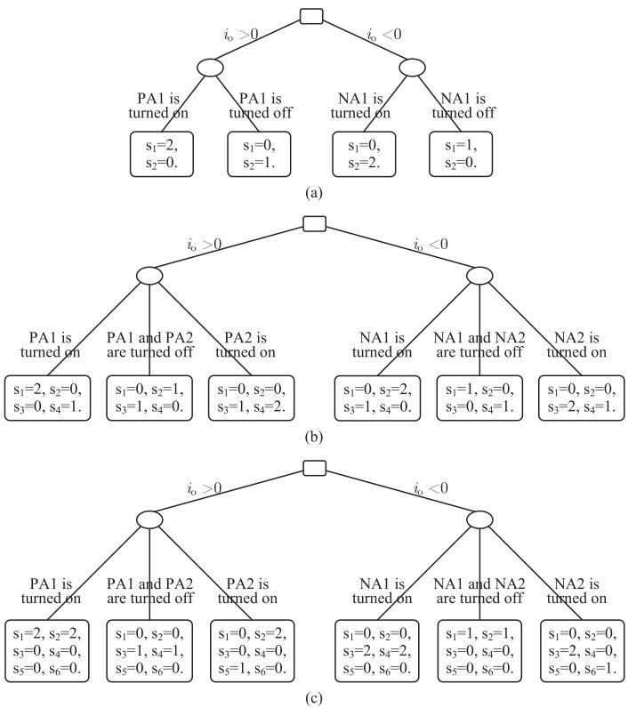  
Fig. 6. Prediction of the simultaneous switching of HBCs using decision trees. (a) Decision tree of the simultaneous switching of the two-level HBC. (b) Decision tree of the simultaneous switching of the three-level THBC. (c) Decision tree of the simultaneous switching of the three-level NPCHBC.

current $i _ { \mathrm { o } }$ is PA1. Then, $\mathrm { D _ { 2 } }$ will be OFF because it bears a negative voltage. Besides, it can be known from the preliminary prediction that $\mathrm { T _ { 2 } }$ is OFF due to the complementary characteristic elaborated in Section III-C2. Thus, $s _ { 2 } ( t ) = 0$ . In this case, the states of the two switches groups in the two-level HBC are $s _ { 1 } ( t ) = 2$ and $s _ { 2 } ( t ) = 0 ,$ , respectively.

For the three-level THBC, it can be found in Figs. 2 and 5 that PA2 will be switched OFF if PA1 is turned ON. Besides, PA2 can be in the ON-state only when PA1 is switched OFF. In a word, PA1 and PA2 will not be in ON-state at the same time. When the PA1 is turned ON from the OFF state [i.e., $s _ { 1 } ( t - \Delta t ) \neq 2 , s _ { 1 } ( t ) = 2 ] ,$ D2 will be OFF because of bearing negative voltage. In addition, PA2 is switched OFF. In this case, $s _ { 1 } ( t ) = 2 , s _ { 2 } ( t ) = 0 , s _ { 3 } ( t ) = 0 , s _ { 4 } ( t ) = 1$ . When PA2 is turned ON from the OFF state [i.e., $( s _ { 4 } ( t - \Delta t ) \neq 2 , s _ { 4 } ( t ) =$ $2 ) \vee ( s _ { 1 } ( t - \Delta t ) = 2 , s _ { 1 } ( t ) = 0 , G _ { 4 } ( t ) = 1 ) ] , \mathrm { D } _ { 2 }$ will be OFF because it bears negative voltage as well. In this case, $s _ { 1 } ( t ) = 0$ , $s _ { 2 } ( t ) = 0 , s _ { 3 } ( t ) = 1 , s _ { 4 } ( t ) = 2 .$ .

For the three-level NPCHBC, similar to the THBC, PA1 and PA2 cannot be in ON-state simultaneously. When PA1 is turned ON from the OFF state [i.e., $s _ { 1 } ( t - \Delta t ) \neq$ 2, $s _ { 1 } ( t ) = 2 , \ s _ { 2 } ( t ) = 2 ] ,$ D3 and $\mathrm { D } _ { 4 }$ will be OFF due to bearing negative voltage. Besides, $\mathrm { D } _ { 5 }$ and $\mathrm { D } _ { 6 }$ will also be OFF. Thus, $s _ { 1 } ( t ) = s _ { 2 } ( t ) = 2 , s _ { 3 } ( t ) = s _ { 4 } ( t ) = s _ { 5 } ( t ) =$ $s _ { 6 } ( t ) = 0$ . When PA2 is switched ON from the OFF state $\mathrm { [ i . e . , ~ } \left( s _ { 5 } ( t - \Delta t ) = 0 , s _ { 2 } ( t ) = 2 , s _ { 1 } ( t ) = 0 \right) \lor ( s _ { 1 } ( t - \Delta t ) =$ $0 , s _ { 2 } ( t - \Delta t ) = 0 , s _ { 1 } ( t ) = 0 , s _ { 2 } ( t ) = 0 ) ]$ , diodes $\mathrm { { D } _ { 3 } , \mathrm { { D } _ { 4 } } }$ , and

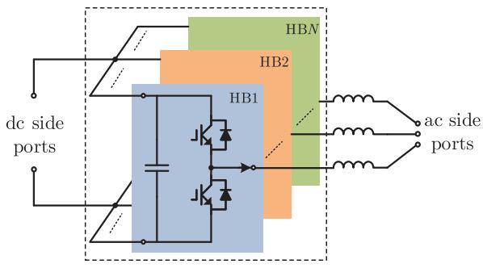  
Fig. 7. Topology of an N-phase two-level VSC.

$\mathrm { D } _ { 6 }$ will be OFF passively. In this case, $s _ { 1 } ( t ) = 0 , s _ { 2 } ( t ) = 2$ , $s _ { 5 } ( t ) = 1 , s _ { 3 } ( t ) = s _ { 4 } ( t ) = s _ { 6 } ( t ) = 0$ .

5) Simultaneous Switching Caused by Interruption of Active Conduction Path With Positive Injection Current: When the active conduction path is switched OFF from the ON state, the states of some diodes will change because of freewheeling. The details of this type of simultaneous switching in the three HBCs are elaborated as follows. 1) For the two-level HBC, when the active conduction path PA1 is switched OFF [i.e., $s _ { 1 } ( t - \Delta t ) = 2 , s _ { 1 } ( t ) = 0 ]$ , D2 will be ON at the same time due to the diode freewheeling of HBC. In this case, $s _ { 1 } ( t ) = 0 \mathrm { . }$ $s _ { 2 } ( t ) = 1 , 2 )$ For the three-level THBC, when both of PA1 and PA2 are switched OFF from ON states $[ \mathrm { i . e . , ~ } s _ { 1 } ( t - \Delta t ) =$ $2 \vee s _ { 4 } ( t - \Delta t ) = 2 , s _ { 1 } ( t ) = 0 .$ , and $s _ { 4 } ( t ) = 0 ]$ , D2 will be turned ON at the same time due to freewheeling. In this case, $s _ { 1 } ( t ) = 0 , s _ { 2 } ( t ) = 1 , s _ { 3 } ( t ) = 1 , s _ { 4 } ( t ) = 0 . 3 )$ For the threelevel NPCHBC, when both of PA1 and PA2 are switched OFF [i.e., $s _ { 2 } ( t - \Delta t ) = 2 , s _ { 2 } ( t ) \neq 2 ] , \mathrm { D } _ { 3 }$ and $\mathrm { D } _ { 4 }$ will be ON at the same time also due to freewheeling. $\mathrm { D _ { 6 } }$ will be turned OFF due to bearing negative voltage. In other words, $s _ { 1 } ( t ) = 0 , s _ { 2 } ( t ) = 0$ , $s _ { 3 } ( t ) = 1 , s _ { 4 } ( t ) = 1 , s _ { 5 } ( t ) = 0 , s _ { 6 } ( t ) = 0 .$ .

6) Summary of the Switch-State Prediction: Using the preliminary and simultaneous switching predictions sequentially, accurate switch states of an HBC are finally determined. Note that the simultaneous prediction is unnecessary when the HBC is in a pure freewheeling state because there is no active conduction path in this case.

# D. Extension of Switch-State Prediction of HBC to a VSC

As mentioned in Section III-A, all the widely used VSCs are composed of the series or parallel collections of HBCs. In the switch-state prediction process, a HBC is regarded as the fundamental switch-state judgment unit. For example, for an N-phase two-level VSC shown in Fig. 7, the switch states of the VSC can be obtained by determining the switch states of the HBCs one by one. More specifically, a three-phase two-level VSC can be divided into three HBCs. Each phase of the VSC is a HBC. Even in the special case where phases A and B are actively conducted and phase C acts as a passive rectifier, the proposed method works well. The switch states of phases A and B legs are predicted by both preliminary switch-state prediction and simultaneous switching prediction, and the switch states of phase C are obtained only by preliminary switch-state

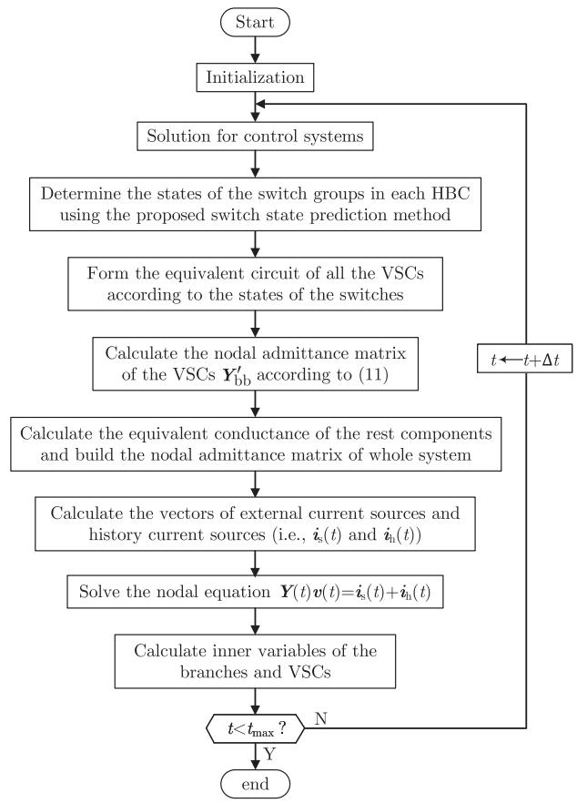  
Fig. 8. Flowchart of EMT simulation with switch-state prediction.

prediction. After the switch states of all HBCs are determined, the equivalent circuit of the converter can be obtained. Then, the equivalent nodal admittance matrix of the system can be constructed and the nodal equations are then solved.

# IV. EMT SIMULATION WITH SWITCH-STATE PREDICTION

# A. Procedure of the EMT Simulation for VSC Systems With the Proposed Method

For the power systems with a number of VSCs, the flowchart of EMT simulation with the proposed switch-state prediction is shown in Fig. 8. It can be found that, with the proposed method, X(t) is obtained before solving the nodal voltage equation. Then, the nodal voltage equations (1) (discrete nonlinear algebraic equations) are transformed into linear algebraic equations and can be solved by the direct methods based on Gauss elimination. Comparing Fig. 8 with Fig. 1, it can be clearly found that the iteration computation in traditional EMT simulations is avoided in the proposed method.

Details of the steps of the EMT simulation with switch-state prediction are explained as follows.

Step 1: The simulation is initialized, in which the time-step size and the simulation duration are set and the data of the test system is loaded.   
- Step 2: Control systems are solved.   
Step 3: Determine the switch states of the VSCs using the proposed switch-state prediction method. The switch

states of the VSCs can be obtained by using the preliminary switch-state prediction and simultaneous switching prediction sequentially.

- Step 4: Form the equivalent circuit of all VSCs according to the switch states.   
- Step 5: Build the equivalent admittance matrix of the whole system.   
- Step 6: Calculate the vectors of external current sources and history current sources $[ \mathrm { i . e . , } i _ { \mathrm { h } } ( t ) , i _ { \mathrm { s } } ( t ) ]$ .   
- Step 7: Solve the nodal equation ${ \bf \cal Y } ( t ) { \bf \cal v } ( t ) = i _ { \mathrm { s } } ( t ) +$ $i _ { \mathrm { h } } ( t )$ .   
Step 8: Calculate the inner variables of the branches and VSCs for updating the ${ i _ { \mathrm { h } } } ( t ) , { i _ { \mathrm { s } } } ( t )$ in the next time-step.   
Step 9: Check whether the simulation duration is reached. If yes, the EMT simulation ends. If no, the time is updated $( \mathrm { i . e . , } t \gets t + \Delta t )$ , and then go back to step 2.

# B. Implementation of the Proposed Method

The object-oriented methods have been widely used in various aspects of EMT simulations. Its design philosophy is no substantial revision of the code when adding a new simulation model. For example, in the PSCAD/EMTDC, each component is defined as a class. When someone is developing a new simulation model, there is no need to modify the main program.

Based on the idea of the object-oriented method, the proposed method can be readily implemented in the EMT simulations. Specifically, each VSC can be modeled as a component (i.e., class). The switch-state prediction of the VSC is realized in the class and is independent of the other VSCs. The control system inputs the gate signals to the VSC component. Then, with the input gate signal and the branch currents and voltages, the switch states can be determined by the switch-state prediction function in the class of the VSC. Next, the equivalent circuit of the VSC can be obtained according to the switch states. To exemplify this, the model of a single-phase two-level converter designed on the PSCAD/EMTDC is uploaded to Github [38].

# C. Merits of the Proposed Method

1) Efficiency Improvement: Compared with the traditional detailed EMT simulation that needs several global iterations to find a feasible switch-state combination, iterative computation is avoided in the proposed switch-state prediction method. Thus, the proposed method outperforms the traditional EMT simulation in computational efficiency.   
2) Flexibility: The proposed method for the VSC model can be readily embedded into the traditional EMT simulation algorithm and commercial software, such as PSCAD/EMTDC and CloudPSS. The efficient model of the VSCs based on the proposed algorithm can be regarded as a conditional triggering impedance component, and its switch states are not included in the system’s switch-state vector X(t). The single switches and the HBC-based VSCs coexist in the simulation. The switch states of VSCs are predicted and the switch states of the other converters are obtained by iterations. In this way, much fewer global iterations are required in the EMT simulation.

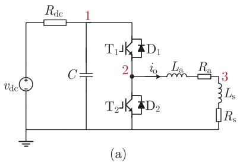

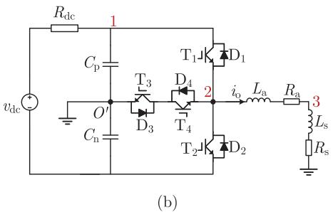

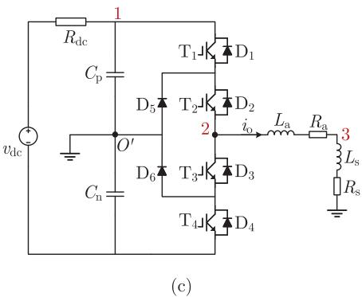  
Fig. 9. Schematic diagrams of the test cases for the HBCs. (a) Two-level HBC. (b) Three-level THBC as an inverter. (c) Three-level NPCHBC as an inverter.

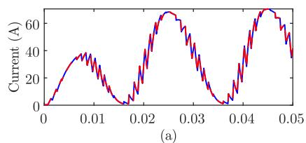

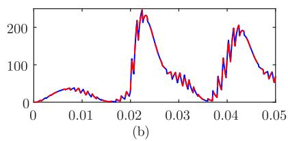

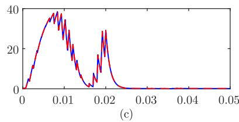

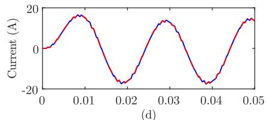

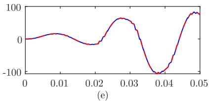

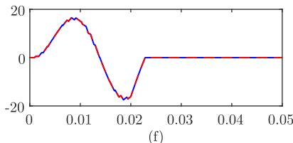

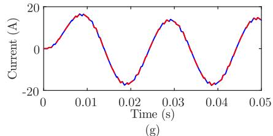

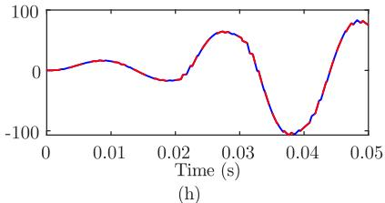

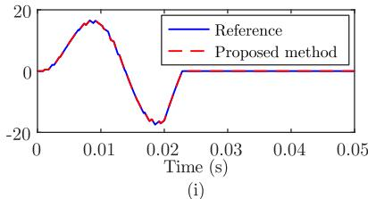  
Fig. 10. Output currents $i _ { \mathrm { o } }$ of the HBCs in Fig. 9 under different operational conditions. (a) Output current of the two-level HBC in healthy operational condition. (b) Output current of the two-level HBC with a node-3-to-ground short-circuit fault at t = 0.02 s. (c) Output current of the two-level HBC with the IGBTs blocked at $t = 0 . 0 2$ s. (d)–(f) Output currents of the three-level THBC in the three conditions mentioned above, respectively. (g)–(i) Output currents of the three-level NPCHBC in the three conditions mentioned above, respectively.

# V. CASE STUDIES

In this section, the accuracy and efficiency of the proposed method are studied on various converters and dc microgrids. The proposed method is programmed in PSCAD/EMTDC. It is implemented using the user-defined modeling method. Each VSC is modeled as a new component, which contains the main circuit of the VSC and the switch-state prediction block.

For comparison, these test systems are detailedly constructed using the detailed IGBT/diode components in PSCAD/EMTDC. It is then simulated with a time-step size of 1 $\mu \mathrm { s } ,$ and the solutions are considered as references.

# A. Accuracy Validation

1) Accuracy of the Three Types of HBCs: The accuracy of the proposed method is first validated on the three types of

HBCs with open-loop controls. The schematic diagrams of the test cases are illustrated in Fig. 9. Parameters of the three test systems are listed in Table A1 of the Appendix. Linear models are adopted for the inductors and capacitors [16]. The output currents of the HBCs under three typical operational conditions (i.e., the healthy, short-circuit, and blocking conditions) are calculated by the proposed method with a time-step of 1 μs and then compared with the references. The results are depicted in Fig. 10. It can be found that, for all the three types of HBCs, the results obtained from the proposed method are coincident with the references in all three typical conditions. Besides, it is worth noting that the proposed method is accurate in the pure freewheeling state simulation of HBCs even though the output current is “clamped” to nearly zero, as shown in Figs. 10(c), (f), and (i). When the HBC is in a pure freewheeling state, the switch states of the HBCs can be obtained only through the preliminary switch-state prediction. The simultaneous switching prediction

TABLE I2-NORM CUMULATIVE RELATIVE ERRORS OF OUTPUT CURRENT OF THE HBCSUNDER DIFFERENT OPERATIONAL CONDITIONS OBTAINED FROM THEPROPOSED METHOD (%)  

<table><tr><td rowspan="2">Conditions</td><td colspan="2">Two-level HBC</td><td colspan="2">Three-level THBC</td><td colspan="2">Three-level NPCHBC</td></tr><tr><td>inverter</td><td>rectifier</td><td>inverter</td><td>rectifier</td><td>inverter</td><td>rectifier</td></tr><tr><td>Healthy condition</td><td>0.0603</td><td>0.0107</td><td>0.0159</td><td>0.00568</td><td>0.0164</td><td>0.00494</td></tr><tr><td>Node-1-to-ground fault</td><td>0.0478</td><td>0.0413</td><td>0.0108</td><td>0.0264</td><td>0.0763</td><td>0.0440</td></tr><tr><td>Node-2-to-ground fault</td><td>0.0462</td><td>0.0131</td><td>0.0128</td><td>0.0390</td><td>0.0128</td><td>0.0191</td></tr><tr><td>Node-3-to-ground fault</td><td>0.0723</td><td>0.0404</td><td>0.0131</td><td>0.0382</td><td>0.0527</td><td>0.0186</td></tr><tr><td>Switch blocked</td><td>0.0596</td><td>0.0122</td><td>0.0163</td><td>0.0502</td><td>0.0162</td><td>0.0426</td></tr></table>

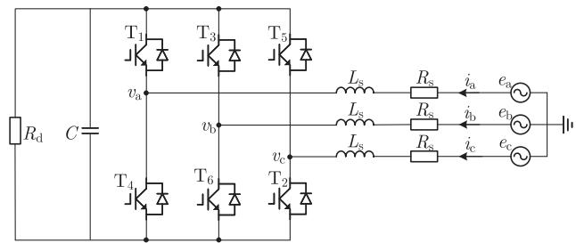  
Fig. 11. Schematic diagram of the three-phase two-level VSC system.

is unnecessary in this case because there is no active conduction path.

To further validate the correctness of the proposed method, more operational conditions are tested. The 2-norm cumulative relative error (11) of the proposed method is studied.

$$
\varepsilon (y) = \frac {\left\| y _ {\text {ref}} - y \right\| _ {2}}{\left\| y _ {\text {ref}} \right\| _ {2}} \times 100 \% \tag{11}
$$

where $y$ represents the solution obtained from the proposed model; $y _ { \mathrm { r e f } }$ represents the reference solution; and $\| y _ { \mathrm { r e f } } \| _ { 2 }$ represents the 2-norm of $y _ { \mathrm { r e f } } .$ . The 2-norm errors of the currents $i _ { \mathrm { o } }$ obtained from the proposed method are listed in Table I. It can be found that the 2-norm relative errors are all tiny, which demonstrates the accuracy of the proposed method.

2) Accuracy Validation on the Three-Phase Two-Level VSC: A three-phase two-level VSC is first considered, with the schematic diagram shown in Fig. 11. Parameters of the threephase two-level converter are listed in Table A2 of the Appendix. In the test system, phases A and B of the VSC are actively operated and phase C is passively operated. The test system is simulated by the proposed method and then compared with the reference. The injection currents $i _ { \mathrm { a } }$ and $i _ { \mathrm { c } }$ as well as the dc voltage $v _ { \mathrm { d c } }$ obtained from the two methods are compared and depicted in Fig. 12. As the figure shows, the currents and voltages obtained from the proposed method are the same as the reference, which indicates the accuracy of the proposed method. Besides, it can be found that, for a three-phase two-level VSC, when two phases are actively operated and one phase acts as a passive rectifier, the proposed method also works well. This is because the switch states of the three-phase two-level VSC are obtained by determining the switch states of the three HBCs of the VSC one by one.

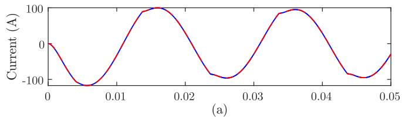

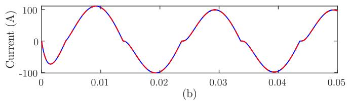

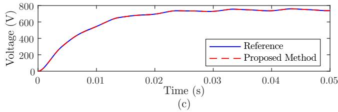  
Fig. 12. (a) and (b) AC-side currents of phases A and C of the three-phase two-level VSC. (c) DC voltage of the VSC.

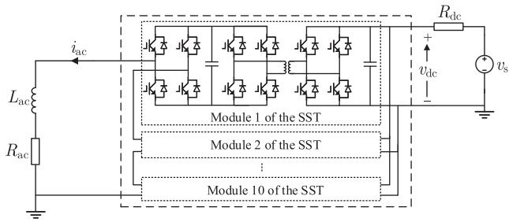  
Fig. 13. Schematic diagram of the test case with a 10-module SST.

3) Accuracy Validation on the SSTs: A solid-state transformer (SST) with 10 modules is also considered. Its schematic diagram is illustrated in Fig. 13. Parameters of the SST system are listed in Table A3 of the Appendix. The inductors, capacitors, and transformers are all represented by linear models [16].

For the SST test system, the healthy condition of the SST is first simulated. The ac-side current and dc-side voltage obtained from the proposed method with a time-step size of 1 $\mu \mathrm { s }$ are compared with the references and illustrated in Figs. 14 and 15. As can be observed from the two figures, the proposed method is accurate in the simulation for SST in healthy conditions.

Besides, the fault condition of the SST is studied. At t=0.1 s, the ac-side of the SST is shorted to the ground, and the fault is cleared at t = 0.12 s. The postfault ac-side currents and dc-side voltages are simulated by the proposed method with a time-step size of 1 $\mu \mathrm { s }$ and then compared with the references. It can be seen from Figs. 16 and 17 that there are no visible errors, which means that the proposed method is also accurate in the simulation for SST in fault conditions. This is because that the switch-state prediction does not lead to errors.

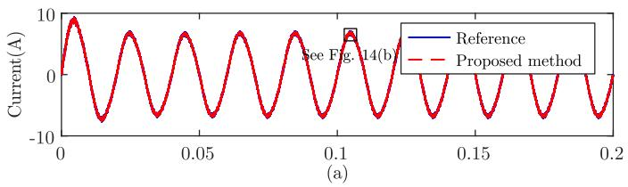

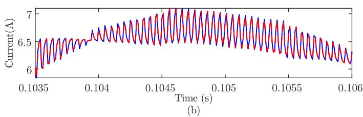  
Fig. 14. (a) AC-side current of the SST under the normal condition obtained from simulations with a time-step of 1 µs. (b) Magnified view of the SST’s ac-side current.

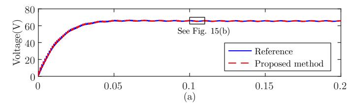

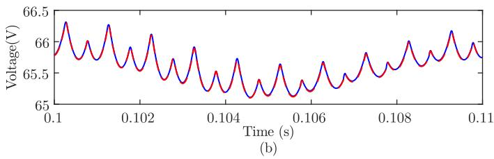  
Fig. 15. (a) DC-side voltage of the 10-module SST under the normal condition. (b) Magnified view of the SST’s dc-side voltage.

To illustrate the accuracy of the proposed method in EMT simulations with larger time-steps, the SST is simulated by the proposed method and traditional method with a time-step of 10 $\mu \mathrm { s } .$ Note that, in the case studies of this article, the traditional method refers to the construction and simulation of a test system with the components in PSCAD/EMTDC. The ac-side currents of the SST obtained from different methods are illustrated in Fig. 18. It can be found from Fig. 18 that the proposed method is also accurate in relatively large-step EMT simulation. In contrast, at the fault instant, a large virtual negative current exists in the results obtained from the traditional method, as shown in Fig. 18(a) and (b). The root cause is that the traditional method with a time-step size of $1 0 \mu \mathrm { s }$ does not obtain a feasible switch-state combination in limited iterations at the fault instant. Besides, it can be seen from Fig. $1 8 ( \mathrm { a } )$ and (c) that the proposed method and the traditional method are both near to the reference at other time instants and the proposed method is a little more accurate than the traditional method. This is because the error of the traditional method at the time instant influences the results after. Besides, linear interpolation is adopted in the traditional iterative judgment-based method to deal with switch

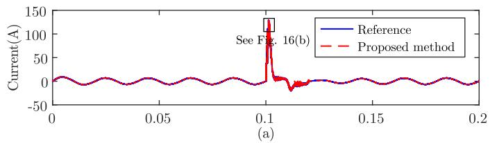

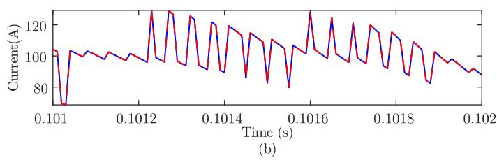  
Fig. 16. (a) AC-side current of the 10-module SST when an ac short-circuit fault occurs at $t = 0 . 1 { \mathrm { s . } } ( \mathrm { b } )$ Zoomed-in view of the fault current.

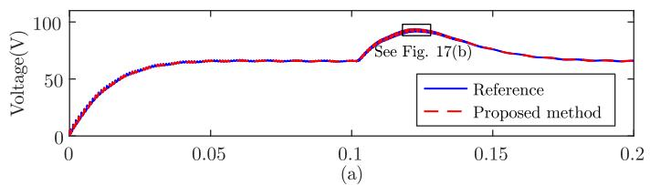

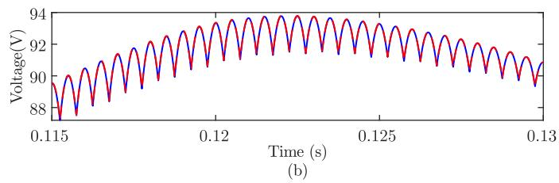  
Fig. 17. (a) DC-side voltage of the SST with an ac short-circuit fault at $t = 0 . 1 { \mathrm { s . } } ( { \mathrm { b } } )$ Zoomed-in view of the dc voltage.

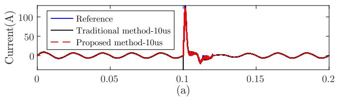

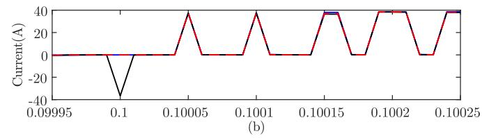

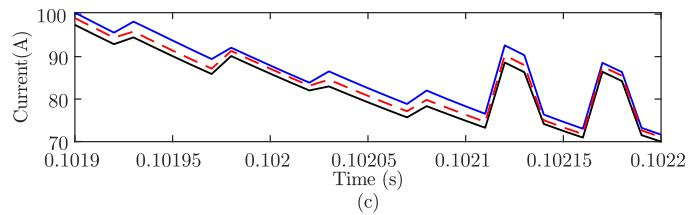  
Fig. 18. (a) AC-side current of the 10-module SST obtained from different methods when an ac short-circuit fault occurs a $\mathrm { \Delta } t = 0 . 1 \mathrm { \Delta s }$ . (b) and (c) Zoomed-in views of the fault currents.

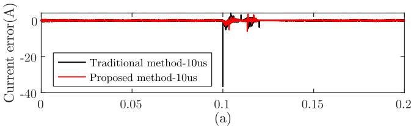

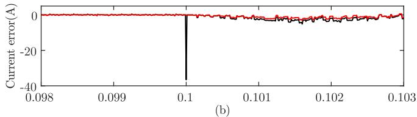

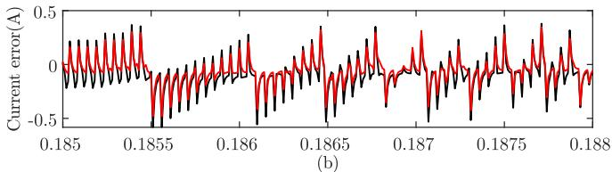  
Fig. 19. Errors of the proposed method and traditional method with a timestep size of 10 µs. (a) A global view of the real errors of the proposed method and traditional method. (b) Magnified-view of the errors at the time interval [0.095, 0.125] s. (c) Magnified-view of the errors at the time interval [0.185, 0.195] s.

events. It will also lead to discontinuity and numerical errors in the simulation results, which have been discussed in [31]. To further compare the accuracy of the proposed method and traditional method, the real-value errors of the two methods are calculated and illustrated in Fig. 19. It also shows that the proposed method is a little more accurate than the proposed method in the simulation of SST with a time-step size of 10 μs. In addition to the real errors in Fig. 19, the 2-norm relative errors of the two methods are also computed. The 2-norm relative errors of the traditional method and the proposed method are 5.15% and 3.84%, respectively, which once again shows that the proposed method is more accurate than the traditional method in the simulation of SST. Above all, it can be found that the proposed method is a little more accurate than the traditional method.

4) Accuracy of the Proposed Method on Other VSCs: Extensive studies on some typical VSCs are further carried out in this subsection. Similar to the analyses in Section V-A1, the 2-norm cumulative relative errors of the proposed method are also tested on various types of VSCs [39]. The 2-norm cumulative relative errors of the arm current and capacitor voltage obtained from the proposed method are listed in Table II. With a small time-step size, the proposed method is very accurate in simulating different kinds of VSCs.   
5) Accuracy Validation on a DC Microgrid: The dc microgrid is promising in the efficient and reliable integration of renewable sources, energy storage, electric vehicles, and other dc loads. The EMT simulations of a dc microgrid are extensively studied here to validate the accuracy of the proposed method further. The schematic diagram of a dc microgrid is shown in Fig. 20. The test system includes six VSC converters: a 10-module SST, a Buck converter, a Boost converter, a threephase two-level converter (TPTLC), a three-phase three-level

TABLE II 2-NORM CUMULATIVE RELATIVE ERRORS OF THE ARM CURRENTS AND CAPACITOR VOLTAGES OF DIFFERENT TYPES OF VSCS OBTAINED FROM THE PROPOSED METHOD WITH A TIME-STEP OF 1 µs (%)   

<table><tr><td>Types of Converters</td><td>ε(x) of capacitor voltage</td><td>ε(x) of arm current</td></tr><tr><td>Boost converter</td><td>0.00278</td><td>0.0203</td></tr><tr><td>Buck converter</td><td>0.00378</td><td>0.0345</td></tr><tr><td>Modular multilevel converter</td><td>0.0123</td><td>0.0130</td></tr><tr><td>10-module solid-state transformer</td><td>0.0627</td><td>0.286</td></tr><tr><td>Dual active bridge dc/dc converter</td><td>0.00154</td><td>0.451</td></tr><tr><td>Single-phase two-level converter</td><td>0.00497</td><td>0.0315</td></tr><tr><td>Three-phase two-level converter</td><td>0.00551</td><td>0.0390</td></tr><tr><td>Three-phase three-level T-type converter</td><td>0.00439</td><td>0.0175</td></tr><tr><td>Three-phase three-level NPC converter</td><td>0.00414</td><td>0.0171</td></tr></table>

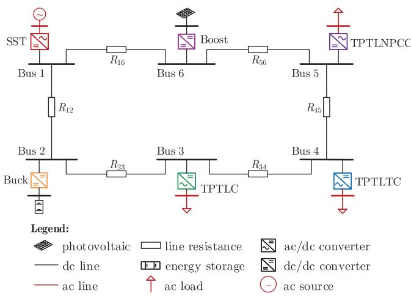  
Fig. 20. One-line diagram of the dc microgrid with six VSCs.

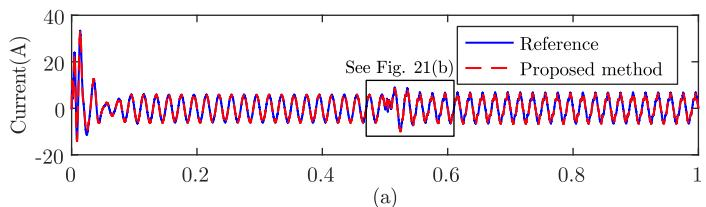

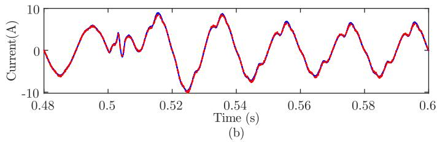  
Fig. 21. (a) AC-side current of the SST in the dc microgrid. (b) Zoomed-in view of the ac current.

T-type converter (TPTLTC), and a three-phase three-level NPC converter (TPTLNPCC). The switching frequencies (carrier signal frequencies) of the converters are all 10 kHz. Parameters of the dc microgrid are listed in Table A4 of the Appendix.

At t = 0.5 s, the dc load at Bus 3 is changed, and the ac-side current and dc-side voltage of the SST during the interval [0, 1] s are depicted in Figs. 21 and 22, respectively. The test results

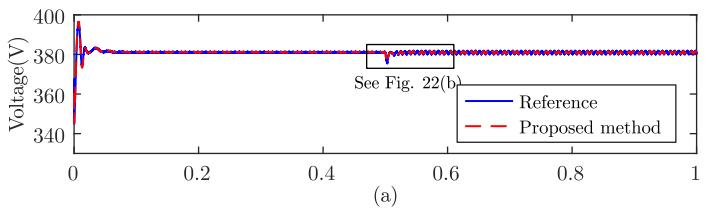

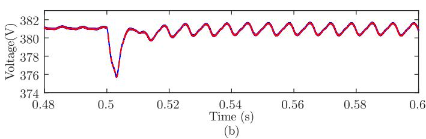  
Fig. 22. (a) DC-side voltage of the SST in the dc microgrid. (b) Zoomed-in view of the dc voltage.

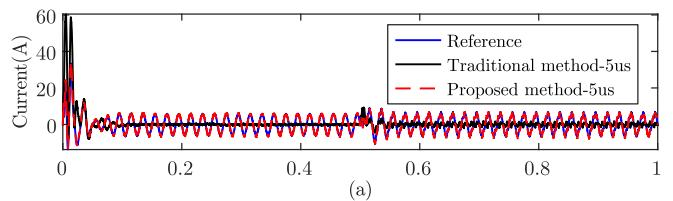

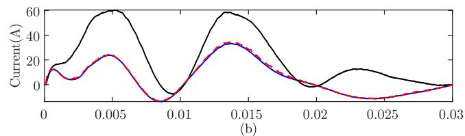

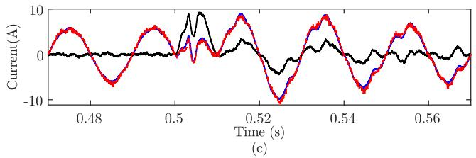  
Fig. 23. (a) AC-side current of the SST in the dc microgrid. (b) and (c) Zoomed-in view of the ac current.

demonstrate perfect agreement between the proposed method and the reference in a system composed of VSCs, whether in steady state or transient state. This validates the effectiveness of the proposed method in simulating power systems with massive VSCs.

Furthermore, the dc microgrid is respectively simulated by the proposed method and traditional method with a time-step size of 5 μs to show the correctness of the proposed method in larger time-step simulation. AC-side currents of the SST obtained from different methods are compared in Fig. 23. As can be observed, the proposed method is generally accurate, although there are slight variations. On the contrary, if the microgrid is simulated by the traditional method with a time-step of 5 μs, wrong simulation results will be achieved because of iteration and interpolation [31]. This further demonstrates the effectiveness of the proposed method.

  
Fig. 24. (a) Time consumption of simulations for different SSTs $( \Delta t = 1 \mu \mathrm { s } )$ (b) Speedups of the proposed method with respect to the traditional method.

Overall, it can be found that the results obtained from the proposed method show good coincident with the references, no matter for a single VSC or power system with massive VSCs. In other words, the proposed method is accurate.

# B. Efficiency Validation of the Proposed Method

For validating the efficiency, the proposed method is implemented on the PSCAD/EMTDC by using the construction and interface of custom components. All simulation tests are carried out on an Intel(R) Core (TM) i7-7700 K 4.2 GHz desktop computer with 32 GB RAM.

1) Efficiency Comparison on Converters: With a time-step size of 1 $\mu \mathrm { s } ,$ the CPU time consumed by traditional and the proposed methods in simulating SSTs with various modules are compared and shown in Fig. 24, where the speedups of the proposed method with respect to the traditional method are also given. It can be found that the proposed method is much more efficient because the switch states are accurately predicted rather than obtained by iterative computation. Besides, note that the speedup of the presented method with respect to the traditional method increases with the increase of the number of modules. When the number of modules continues to increase, the speedup is supposed to increase further. Specifically, for an SST with 80 modules, the speedup is about 2. The iteration number of traditional simulation ranges from 1 to 3 in each time-step of the 80-module SST simulation. In contrast, the iterative computation is avoided in the proposed method.

Next, the speedups of the proposed method with respect to the traditional method are studied under various time-step sizes, as shown in Fig. 25. The speedup increases with the time-step increases. This is because the global iterations are much more frequent in the traditional method when the time-step becomes large. In contrast, the global iterative computations are avoided by using the proposed fast model of VSCs. Note that, when the time-step reaches up to $1 0 \mu \mathrm { s } .$ , the speedup in the 80-module SST case increases to more than 6.

2) Simulation Efficiency Enhancement for the DC Microgrid: Extensive efficiency comparisons are implemented on the dc microgrid. The CPU computational time of traditional and the

  
Fig. 25. Speedups of the proposed method with respect to the traditional method under various time-step sizes.

TABLE III EFFICIENCY COMPARISON BETWEEN THE PROPOSED METHOD AND TRADITIONAL METHOD FOR SIMULATIONS OF THE DC MICROGRID   

<table><tr><td>Time step (μs)</td><td>Traditional method (s)</td><td>Proposed method (s)</td><td>Speedup factor</td></tr><tr><td>1</td><td>143.47</td><td>79.27</td><td>1.81</td></tr><tr><td>2</td><td>115.36</td><td>53.16</td><td>2.17</td></tr><tr><td>5</td><td>fatal error</td><td>32.98</td><td>-</td></tr></table>

proposed methods in simulating the dc grid is summarized in Table III. With a time-step size of $2 \mu \mathrm { s } ,$ the proposed method is about 2.17 times faster than the traditional method because the switch-state prediction avoids the global iterative computation in each time-step. This demonstrates the potential of the proposed method in a detailed EMT simulation.

# VI. CONCLUSION

Based on the switch-state prediction, this article proposes a fast and detailed EMT model of the VSC. Theoretical analyses and test results show that the proposed model is accurate and is much faster than the traditional detailed model of the VSC. Besides, it merits attention that the proposed method can be implemented on any other topologies although only three basic topologies of HBCs are considered. It is open to any new HBC in the future that can be described by the switch group. Due to the above advantages, the proposed fast EMT simulation model of the VSC has broad application prospects in the simulation of power systems with massive VSCs. For future work, the proposed method can be further explored in the following two aspects.

1) In addition to the two-value resistance model of the switch, the ADC model of switches is widely used in real-time simulation. The proposed can be implemented with the ADC model of the switch to improve the real-time simulation of the power system with VSCs.   
2) Since the proposed switch-state prediction method is independent of time-step sizes, the proposed method is also applicable in variable-step solvers in addition to the fixed-step solver. Thus, some attention will be devoted to the variable-step simulation algorithm.

# APPENDIX

Parameters of the three HBC systems, the three-phase twolevel VSC system, the SST test system, and the dc microgrid are listed in Tables A1–A4, respectively.

TABLE A1 PARAMETERS OF THE THREE HBC TEST SYSTEMS   

<table><tr><td>Test Systems</td><td>Parameters</td><td>Values</td></tr><tr><td rowspan="9">Single-phase two-level HBC</td><td>Voltage of the dc voltage source (kV)</td><td>1</td></tr><tr><td>DC-side resistance Rdc(Ω)</td><td>10</td></tr><tr><td>DC-side capacitance C(μF)</td><td>1000</td></tr><tr><td>On-resistance of the IGBTs/diodes (Ω)</td><td>0.005</td></tr><tr><td>Off-resistance of the IGBTs/diodes (Ω)</td><td>108</td></tr><tr><td>Arm inductance La(H)</td><td>0.02</td></tr><tr><td>Arm resistance Ra(Ω)</td><td>2</td></tr><tr><td>AC-side inductance (H)</td><td>0.08</td></tr><tr><td>AC-side resistance (Ω)</td><td>8</td></tr><tr><td rowspan="10">Single-phase three-level THBC</td><td>Voltage of the dc voltage source (kV)</td><td>1</td></tr><tr><td>DC-side resistance Rdc(Ω)</td><td>10</td></tr><tr><td>Positive-pole capacitance Cp(μF)</td><td>500</td></tr><tr><td>Positive-pole capacitance Cn(μF)</td><td>500</td></tr><tr><td>On-resistance of the IGBTs/diodes (Ω)</td><td>0.005</td></tr><tr><td>Off-resistance of the IGBTs/diodes (Ω)</td><td>108</td></tr><tr><td>Arm inductance La(H)</td><td>0.02</td></tr><tr><td>Arm resistance Ra(Ω)</td><td>2</td></tr><tr><td>AC-side inductance (H)</td><td>0.08</td></tr><tr><td>AC-side resistanc (Ω)</td><td>8</td></tr><tr><td rowspan="10">Single-phase three-level NPCHBC</td><td>Voltage of the dc voltage source (kV)</td><td>1</td></tr><tr><td>DC-side resistance Rdc(Ω)</td><td>10</td></tr><tr><td>Positive-pole capacitance Cp(μF)</td><td>500</td></tr><tr><td>Positive-pole capacitance Cn(μF)</td><td>500</td></tr><tr><td>On-resistance of the IGBTs/diodes (Ω)</td><td>0.005</td></tr><tr><td>Off-resistance of the LGBTs/diodes (Ω)</td><td>108</td></tr><tr><td>Arm inductance La(H)</td><td>0.02</td></tr><tr><td>Arm resistance Ra(Ω)</td><td>2</td></tr><tr><td>AC-side inductance (H)</td><td>0.08</td></tr><tr><td>AC-side resistance (Ω)</td><td>8</td></tr></table>

TABLE A2 PARAMETERS OF THE THREE-PHASE TWO-LEVEL CONVERTER SYSTEM   
TABLE A3 PARAMETERS OF THE TEN-MODULE SST TEST SYSTEMS   

<table><tr><td>Parameters</td><td>Values</td></tr><tr><td>RMS of line-to-ground voltage of ac sources (kV)</td><td>1</td></tr><tr><td>Phase resistance of the ac sources (Ω)</td><td>1</td></tr><tr><td>Arm inductance of each phase (H)</td><td>0.1</td></tr><tr><td>Arm resistance of each phase (Ω)</td><td>5</td></tr><tr><td>On-resistance of the IGBTs/diodes (Ω)</td><td>0.005</td></tr><tr><td>Off-resistance of the IGBTs/diodes (Ω)</td><td>108</td></tr><tr><td>DC-side capacitance (μF)</td><td>1000</td></tr><tr><td>Resistance of dc load (Ω)</td><td>10</td></tr></table>

<table><tr><td>Components</td><td>Parameters</td><td>Values</td></tr><tr><td rowspan="2">DC source</td><td>Voltage of the dc voltage source (kV)</td><td>1</td></tr><tr><td>Series resistance of the voltage source (Ω)</td><td>1</td></tr><tr><td rowspan="2">AC load</td><td>AC-side inductance (H)</td><td>0.001</td></tr><tr><td>AC-side resistance (Ω)</td><td>10</td></tr><tr><td rowspan="8">Each module of the SST</td><td>Transformer capacity (kVA)</td><td>0.1</td></tr><tr><td>Transformer voltages (kV/kV)</td><td>0.1/0.1</td></tr><tr><td>Base operation frequency (Hz)</td><td>10000</td></tr><tr><td>Transformer linkage reactance (pu)</td><td>0.65</td></tr><tr><td>Transformer copper loss (pu)</td><td>0</td></tr><tr><td>On-resistance of the IGBTs/diodes (Ω)</td><td>0.005</td></tr><tr><td>Off-resistance of the IGBTs/diodes (Ω)</td><td>108</td></tr><tr><td>Capacitances of the two capacitors (μF)</td><td>1000</td></tr></table>

TABLE A4 PARAMETERS OF THE DC MICROGRID   

<table><tr><td>Components</td><td>Parameters</td><td>Values</td></tr><tr><td rowspan="3">AC source</td><td>RMS of line-to-ground voltage of ac sources (kV)</td><td>10</td></tr><tr><td>Series resistance of the ac source (Ω)</td><td>0.01</td></tr><tr><td>Series inductance of the voltage source (H)</td><td>0.1</td></tr><tr><td rowspan="6">SST</td><td>Number of modules</td><td>10</td></tr><tr><td>Transformer voltages (kV/kV)</td><td>1.67/0.38</td></tr><tr><td>Transformer linkage reactance (pu)</td><td>0.7</td></tr><tr><td>Transformer capacity (MVA)</td><td>0.1</td></tr><tr><td>Interstage capacitance C1(μF)</td><td>5000</td></tr><tr><td>DC-side output capacitance C2(μF)</td><td>1000</td></tr><tr><td rowspan="3">Buck converter</td><td>Battery-side capacitance (μF)</td><td>1000</td></tr><tr><td>DC-grid-side inductance (H)</td><td>0.01</td></tr><tr><td>DC-grid-side capacitance (μF)</td><td>1000</td></tr><tr><td rowspan="3">Boost converter</td><td>DC-grid-side capacitance (μF)</td><td>1000</td></tr><tr><td>Photovoltaic-side inductance (H)</td><td>0.01</td></tr><tr><td>Photovoltaic-side capacitance (μF)</td><td>10</td></tr><tr><td rowspan="3">Three-phase two-level converter</td><td>DC-grid-side capacitance (μF)</td><td>1000</td></tr><tr><td>Photovoltaic-side inductance (H)</td><td>0.005</td></tr><tr><td>Photovoltaic-side capacitance (μF)</td><td>2</td></tr><tr><td rowspan="4">Three-phase three-level T-type converter</td><td>Positive-pole capacitance (μF)</td><td>600</td></tr><tr><td>Negative-pole capacitance (μF)</td><td>600</td></tr><tr><td>AC-side arm inductance (H)</td><td>0.02</td></tr><tr><td>AC-side arm resistance (μF)</td><td>1</td></tr><tr><td rowspan="4">Three-phase three-level NPC converter</td><td>Positive-pole capacitance (μF)</td><td>600</td></tr><tr><td>Negative-pole capacitance (μF)</td><td>600</td></tr><tr><td>AC-side arm inductance (H)</td><td>0.02</td></tr><tr><td>AC-side arm resistance (μF)</td><td>1</td></tr><tr><td rowspan="2">DC grid</td><td>Rated voltage of the dc grid (kV)</td><td>0.38</td></tr><tr><td>Resistance of the dc lines (Ω)</td><td>0.01</td></tr></table>

# REFERENCES

[1] R. Shen and H. S. H. Chung, “Mitigation of ground leakage current of single-phase PV inverter using hybrid PWM with soft voltage transition and nonlinear output inductor,” IEEE Trans. Power Electron., vol. 36, no. 3, pp. 2932–2946, Mar. 2021.   
[2] G. Guo et al., “HB and FB MMC based onshore converter in seriesconnected offshore wind farm,” IEEE Trans. Power Electron., vol. 35, no. 3, pp. 2646–2658, Mar. 2020.   
[3] X. Wu, Y. Xu, J. He, X. Wang, J. C. Vasquez, and J. M. Guerrero, “Pinningbased hierarchical and distributed cooperative control for AC microgrid clusters,” IEEE Trans. Power Electron., vol. 35, no. 9, pp. 9865–9885, Sep. 2020.   
[4] H. Ye, S. Gao, G. Li, and Y. Liu, “Efficient estimation and characteristic analysis of short-circuit currents for MMC-MTDC grids,” IEEE Trans. Ind. Electron., vol. 68, no. 1, pp. 258–269, Jan. 2021.   
[5] R. Yin, M. Shi, W. Hu, J. Guo, P. Hu, and Y. Wang, “An accelerated model of modular isolated DC/DC converter used in offshore DC wind farm,” IEEE Trans. Power Electron., vol. 34, no. 4, pp. 3150–3163, Apr. 2019.   
[6] C. Zhang, M. Molinas, A. Rygg, J. Lyu, and X. Cai, “Harmonic transferfunction-based impedance modeling of a three-phase VSC for asymmetric AC grid stability analysis,” IEEE Trans. Power Electron., vol. 34, no. 12, pp. 12552–12566, Dec. 2019.   
[7] DSIM Technology Co. User manual. 2022. [Online]. Available: https:// www.dsimtechnology.com/doc/DSIM%20User%20Manual.pdf   
[8] MathWorks Inc. Simulink user’s guide 2022a. 2022. [Online]. Available: https://www.mathworks.com/help/pdf_doc/simulink   
[9] A. Gole, O. Nayak, T. Sidhu, and M. Sachdev, “A graphical electromagnetic simulation laboratory for power systems engineering programs,” IEEE Trans. Power Syst., vol. 11, no. 2, pp. 599–606, May 1996.   
[10] J. Xu, C. Zhao, W. Liu, and C. Guo, “Accelerated model of modular multilevel converters in PSCAD/EMTDC,” IEEE Trans. Power Del., vol. 28, no. 1, pp. 129–136, Jan. 2013.

[11] J. Mahseredjian, S. Dennetière, L. Dubé, B. Khodabakhchian, and L. Gérin-Lajoie, “On a new approach for the simulation of transients in power systems,” Electr. Power Syst. Res., vol. 77, no. 11, pp. 1514–1520, Sep. 2007.   
[12] N. M. Shah, V. K. Sood, and V. Ramachandran, “EMTP simulation of a chain-link STATCOM,” IEEE Trans. Power Del., vol. 23, no. 4, pp. 2148–2159, Oct. 2008.   
[13] Z. Yu, Z. Zhao, B. Shi, Y. Zhu, and J. Ju, “An automated semi-symbolic state equation generation method for simulation of power electronic systems,” IEEE Trans. Power Electron., vol. 36, no. 4, pp. 3946–3956, Apr. 2021.   
[14] Y. Zhu, Z. Zhao, B. Shi, and Z. Yu, “Discrete state event-driven framework with a flexible adaptive algorithm for simulation of power electronic systems,” IEEE Trans. Power Electron., vol. 34, no. 12, pp. 11692–11705, Dec. 2019.   
[15] B. Shi, Z. Zhao, Y. Zhu, Z. Yu, and J. Ju, “Discrete state event-driven simulation approach with a state-variable-interfaced decoupling strategy for large-scale power electronics systems,” IEEE Trans. Ind. Electron., vol. 68, no. 12, pp. 11673–11683, Dec. 2021.   
[16] N. Watson and J. Arrillaga, Power Systems Electromagnetic Transients Simulation. London, U.K.: IET, 2003.   
[17] H. W. Dommel, EMTP Theory Book, 2nd ed. Portland, OR, USA: Bonneville Power Administration, 1996.   
[18] Y. Xu, Y. Chen, C. Liu, and H. Gao, “Piecewise average-value model of PWM converters with applications to large-signal transient simulations,” IEEE Trans. Power Electron., vol. 31, no. 2, pp. 1304–1321, Feb. 2016.   
[19] J. Sun, S. Debnath, M. Saeedifard, and P. R. Marthi, “Real-time electromagnetic transient simulation of multi-terminal HVDC-AC grids based on GPU,” IEEE Trans. Ind. Electron., vol. 68, no. 8, pp. 7002–7011, Aug. 2021.   
[20] J. Xu, A. M. Gole, and C. Zhao, “The use of averaged-value model of modular multilevel converter in DC grid,” IEEE Trans. Power Del., vol. 30, no. 2, pp. 519–528, Apr. 2015.   
[21] S. Horiuchi, K. Sano, and T. Noda, “An inverter model simulating accurate harmonics with low computational burden for electromagnetic transient simulations,” IEEE Trans. Power Electron., vol. 36, no. 5, pp. 5389–5397, May 2021.   
[22] Q. Su and K. Strunz, “Stochastic polynomial-chaos-based average modeling of power electronic systems,” IEEE Trans. Power Electron., vol. 26, no. 4, pp. 1167–1171, Apr. 2011.   
[23] K. Zhang, Z. Shan, and J. Jatskevich, “Large- and small-signal averagevalue modeling of dual-active-bridge DC–DC converter considering power losses,” IEEE Trans. Power Electron., vol. 32, no. 3, pp. 1964–1974, Mar. 2017.   
[24] Q. An, L. Sun, K. Zhao, and L. Sun, “Switching function modelbased fast-diagnostic method of open-switch faults in inverters without sensors,” IEEE Trans. Power Electron., vol. 26, no. 1, pp. 119–126, Jan. 2011.   
[25] Y. Xia, Y. Chen, Y. Song, and K. Strunz, “Multi-scale modeling and simulation of DFIG-based wind energy conversion system,” IEEE Trans. Energy Convers., vol. 35, no. 1, pp. 560–572, Mar. 2020.   
[26] K. Sano, S. Horiuchi, and T. Noda, “Comparison and selection of grid-tied inverter models for accurate and efficient EMT simulations,” IEEE Trans. Power Electron., vol. 37, no. 3, pp. 3462–3472, Mar. 2022.   
[27] U. N. Gnanarathna, A. M. Gole, and R. P. Jayasinghe, “Efficient modeling of modular multilevel HVDC converters (MMC) on electromagnetic transient simulation programs,” IEEE Trans. Power Del., vol. 26, no. 1, pp. 316–324, Jan. 2011.   
[28] J. Xu et al., “High-speed electromagnetic transient (EMT) equivalent modelling of power electronic transformers,” IEEE Trans. Power Del., vol. 36, no. 2, pp. 975–986, Apr. 2021.   
[29] Q. Mu, J. Liang, X. Zhou, Y. Li, and X. Zhang, “Improved ADC model of voltage-source converters in DC grids,” IEEE Trans. Power Electron., vol. 29, no. 11, pp. 5738–5748, Nov. 2014.   
[30] K. Wang, J. Xu, G. Li, N. Tai, A. Tong, and J. Hou, “A generalized associated discrete circuit model of power converters in real-time simulation,” IEEE Trans. Power Electron., vol. 34, no. 3, pp. 2220–2233, Mar. 2019.   
[31] R. Zhang, Y. Song, Z. Yu, Y. Chen, and S. Huang, “A non-iterative switching status combination judgement algorithm for half-bridge sub-circuit based voltage-source converters in EMTP-type simulation program,” in Proc. IEEE PES Innov. Smart Grid Technol. Asia, Chengdu, China, 2019, pp. 2336–2340.

[32] T. Maguire, S. Elimban, E. Tara, and Y. Zhang, “Predicting switch on/off statuses in real time electromagnetic transients simulations with voltage source converters,” in Proc. IEEE Conf. Energy Internet Energy Syst. Integr., Beijing, China, 2018, pp. 1–7.   
[33] H. W. Dommel, “Digital computer solution of electromagnetic transients in single-and multiphase networks,” IEEE Trans. Power Appl. Syst., vol. PAS- 88, no. 4, pp. 388–399, Apr. 1969.   
[34] D. Shu, X. Xie, Z. Yan, V. Dinavahi, and K. Strunz, “A multi-domain cosimulation method for comprehensive shifted-frequency phasor DC-grid models and EMT AC-grid models,” IEEE Trans. Power Electron., vol. 34, no. 11, pp. 10557–10574, Nov. 2019.   
[35] J. Fang, Z. Li, and S. M. Goetz, “Multilevel converters with symmetrical half-bridge submodules and sensorless voltage balance,” IEEE Trans. Power Electron., vol. 36, no. 1, pp. 447–458, Jan. 2021.   
[36] M. Schweizer and J. W. Kolar, “Design and implementation of a highly efficient three-level t-type converter for low-voltage applications,” IEEE Trans. Power Electron., vol. 28, no. 2, pp. 899–907, Feb. 2013.   
[37] J. Pou, J. Zaragoza, S. Ceballos, M. Saeedifard, and D. Boroyevich, “A carrier-based PWM strategy with zero-sequence voltage injection for a three-level neutral-point-clamped converter,” IEEE Trans. Power Electron., vol. 27, no. 2, pp. 642–651, Feb. 2012.   
[38] S. Gao. EMT simulation for half-bridge converter. 2022. [Online]. Available: https://github.com/gaosl19/emt-simulation-for-half-bridgeconverter   
[39] M. Milton and A. Benigni, “Latency insertion method based real-time simulation of power electronic systems,” IEEE Trans. Power Electron., vol. 33, no. 8, pp. 7166–7177, Aug. 2018.

Ying Chen (Senior Member, IEEE) received the B.S. and Ph.D. degrees in electrical engineering from Tsinghua University, Beijing, China, in 2001 and 2006, respectively.

He is currently a Professor with the Department of Electrical Engineering, Tsinghua University. His research interests include parallel and distributed computing, electromagnetic transient simulation, cyberphysical system modeling, and cyber security of smart grids.

Zhitong Yu (Member, IEEE) received the B.S. and M.S. degrees in electrical engineering from Tsinghua University, Beijing, China, in 2014 and 2017, respectively.

He is currently the Executive Director of Center of Cloud-Based Simulation and Intelligent Decision-Making, Sichuan Energy Internet Research Institute, Tsinghua University. His research interests include electromagnetic transient simulation, GPUbased high-performance computing, and digital twin of power system.

Shilin Gao (Student Member, IEEE) received the B.S. and M.S. degrees in electrical engineering from Shandong University, Jinan, China, in 2017. He is currently working toward the Ph.D. degree in electrical engineering with the Department of Electrical Engineering, Tsinghua University, Beijing, China.

His research interests include power system electromagnetic transient simulation, power system dynamic stability analysis and control, and MTDC grid.

Yankan Song (Member, IEEE) received the Ph.D. degree in electrical engineering from Tsinghua University, Beijing, China, in 2018.

From 2018 to 2020, he was a Postdoctoral Scholar with Tsinghua University, where he is currently the R&D Manager with the Center of Cloud-Based Simulation and Intelligent Decision-Making (CSAID), Sichuan Energy Internet Research Institute. His research interests include power system modeling and electromagnetic transient simulation, parallel computing, and hybrid simulation of interconnected ac–dc

Rui Zhang received the B.S. and M.S. degrees in electrical engineering from Sichuan University, Chengdu, China, in 2015 and 2018, respectively.

He is currently an Algorithm Engineer with Tsinghua Sichuan Energy Internet Research Institute, Chengdu, China. His research interests include electromagnetic transient simulation, power electronics, and renewable energy power generation system.

systems.