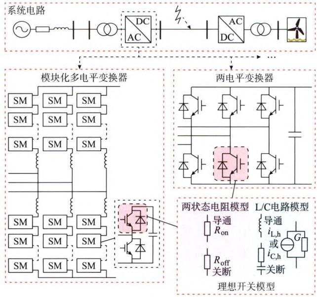
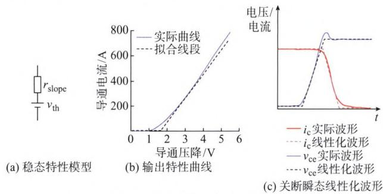
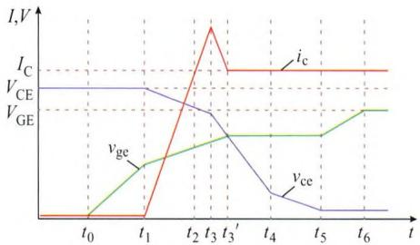
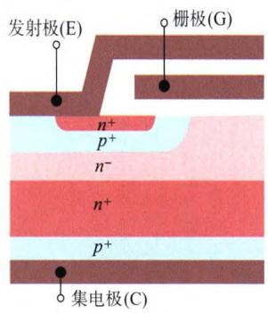
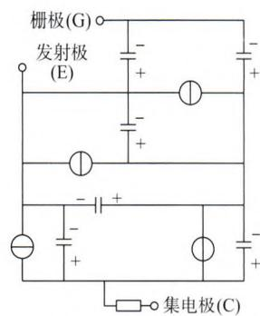
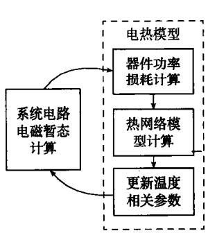
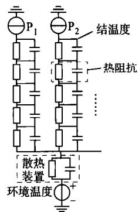
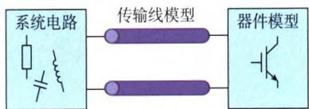
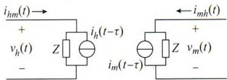
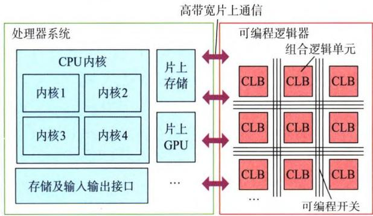

# 电力系统电磁暂态仿真IGBT详细建模及应用

沈卓轩，姜齐荣

（电力系统及发电设备控制和仿真国家重点实验室，清华大学，北京市100084）

摘要：在电力系统电磁暂态离线和实时仿真中，以绝缘栅双极型晶体管(IGBT)为代表的全控型电力电子器件常采用理想开关模型。IGBT器件在交直流变换器、直流断路器中获得了广泛的应用，器件的运行状态会对系统暂态过程产生影响，而系统的暂态过程也会增加器件的电压、电流应力，严重时可能造成器件损坏，进而影响整个设备及系统的安全可靠运行。基于理想开关模型的电磁暂态仿真无法准确模拟暂态过程中该器件的特性及其受到的应力。研究系统电路、器件及其控制之间的动态相互作用，就对电磁暂态仿真中IGBT准确建模提出了更高的要求。近年来，多种IGBT详细模型和解耦方法被提出，并被应用在离线及实时电磁暂态仿真中。得益于高性能计算设备的快速发展，详细模型可高效应用于含有大量IGBT器件的交直流系统仿真中。文中对不同类型建模方法进行归纳，分析其功能、计算复杂度和准确度，并详细介绍了系统解法、并行算法与仿真平台等方面内容。另外，还举例介绍了IGBT详细建模的应用场景，分析了在建模、系统解法、并行算法及应用领域等方面的难点与限制，并提出了相应的建议。

关键词：电磁暂态仿真；电力系统；绝缘栅双极型晶体管；器件模型；模块化多电平变换器

# 0 引言

以绝缘栅双极型晶体管(insulated gate bipolar transistor,IGBT)为代表的全控型电力电子器件在多种电力系统设备中得到了广泛使用[1-2]。含有电力电子器件的电路仿真研究，通常被划分为电力电子器件级研究和系统电路级研究。器件级研究通过对IGBT建立非线性微分方程组来描述其准确的物理特性，或者通过器件外部响应建立多节点的行为模型[3-6]。该类研究的测试电路相对简单，用于器件及驱动电路的设计制造和测试环节。与之对应的是系统级研究，主要用于电力电子化电力系统的电磁暂态现象研究、相应电力电子设备的控制及保护设计[7]。

随着对大规模交直流系统暂态过程及电力电子器件控制保护研究的深入，IGBT理想开关模型因无法准确描述器件暂态过程，难以对器件、系统及控制保护间的动态作用进行精确的仿真研究。器件及电力电子装置的控制保护研究要求在系统级电路研究中运用准确的IGBT模型，以体现器件在暂态过程的运行状态。

对IGBT暂态过程进行准确仿真具有以下特殊问题：①开通关断过程短暂，通常需要数十纳秒级的仿真步长；②模型元件阻抗非线性程度高，包含较多电气节点，数值稳定性相对较差。在大规模系统电路中对器件准确建模，需要针对IGBT仿真具有的特殊问题在模型算法、系统求解方法、并行算法及计算平台等多方面进行优化与开发，以满足计算效率要求与稳定性要求。近年来，一些研究关注于可应用于系统级电路的IGBT详细模型开发。本文中详细模型是指能体现IGBT非理想运行特性的模型，这些特性包括器件的功率损耗，瞬态开关过程，电热效应等。随着系统电路规模的扩大，系统矩阵求解的计算量急剧增长，高效的系统解耦与多速率仿真是实现详细模型在大规模电力系统快速仿真的基础方法[8-11]。并行计算平台性能的提升及大规模并行算法的应用，可有效提高电磁暂态仿真计算效率[12-22]。

文章对IGBT详细模型进行归纳，分析不同模型的建模方法、复杂度、准确性及应用范围，并介绍了可提升计算效率的系统求解方法及并行计算平台。文章详细论述了IGBT详细建模在变换器控制保护、系统暂态研究及硬件在环测试中的应用领域，并对现有技术方法限制进行分析，提出对应研究建议。文章通过对现有方法及问题的分析，以促进

IGBT详细建模领域研究工作，使其满足电力电子化电力系统电磁暂态仿真当前及未来更高的计算精度与计算效率要求。

# 1 IGBT模型

IGBT是由双极结型晶体管(BJT)和金属-氧化物半导体场效应晶体管(MOSFET)构成的复合全控型电力电子器件，具有类似于MOSFET器件较小的栅极损耗和类似于BJT器件的低导通压降。在实际使用中，IGBT器件常与二极管反并联或串联构成模块。图1展示了典型的直流输电系统电路图，用于连接离岸风电场和在岸交流电网。其中，交直流变换器可以采用模块化多电平变换器(modular multilevel converter, MMC)、两电平变换器等结构，SM表示子模块。该类研究系统电路规模较大，包含大量电力电子器件。理想开关模型、稳态模型等建模方法为了减少IGBT模型的电气节点，栅极可采用开关函数，即使用1和0来表示器件的通断，不对驱动电路进行准确建模，也不考虑器件内部节点状态。在许多简化模型中，可以通过设置电流及开关状态条件，对模块中的IGBT器件和二极管器件进行综合建模。本章按建模复杂度，对IGBT电路仿真模型进行分类归纳，并介绍模型基本计算原理与建模特点。基于节点电压法或状态空间法的建模方法均在本文讨论范围。

  
图1 系统级研究  
Fig.1 System-level study

# 1.1 理想开关模型

图1中，理想开关模型只考虑IGBT器件导通、关断2种状态，采用两状态电阻模型，极小的电阻值 $R_{\mathrm{on}}$ 用于导通状态，极大的电阻值 $R_{\mathrm{off}}$ 用于关断状态，

而忽略器件通断时的非理想状态。在实时仿真中，为了避免导纳矩阵因开关状态变化而频繁求解逆矩阵，常采用 $\mathrm{L} / \mathrm{C}$ 电路模型。在导通时表现为电感元件，关断时表现为电阻与电容元件串联。感性及容性支路导纳 $G$ 取值相同，仅使用不同的历史电流源 $i_{\mathrm{L,h}}$ 和 $i_{\mathrm{C,h}}$ 表示器件的导通和关断[23-24]。电感 $L$ 、电容 $C$ 及电阻 $R$ 的取值可由式(1)一式(3)计算得出[23]

$$
L = \sqrt {2} (\Delta T F) \frac {V}{I} \tag {1}
$$

$$
C = \frac {(\Delta T F) ^ {2}}{L} \tag {2}
$$

$$
R = \frac {2 L}{\Delta T} - \frac {\Delta T}{2 C} \tag {3}
$$

其中

$$
F = \frac {1}{2 (\sqrt {\delta^ {2} + 1} - \delta)} \tag {4}
$$

式中： $\Delta T$ 为仿真步长； $\delta$ 为阻尼系数； $V$ 为关断时稳态电压； $I$ 为导通时稳态电流。由式(1)一式(3)可以看出 $\mathrm{L} / \mathrm{C}$ 模型电路参数的选择受到仿真步长等因素影响，无法表征器件特性，因此也属于理想开关模型。

# 1.2 稳态特性模型

稳态特性模型采用电压源与电阻串联的方式来表示器件的导通状态。图2(a)和(b)展示了稳态特性模型电路图和导通状态时IGBT的输出特性曲线。其中，电压源 $v_{\mathrm{th}}$ 表示器件导通截止电压，阻值 $r_{\mathrm{slope}}$ 表示一定范围内的斜率电阻。

  
图2IGBT稳态特性模型、输出特性及关断瞬态线性化波形  
Fig.2 IGBT steady-state characteristics model, output characteristics and linearized waveforms during turn-off transient

该类模型可以采用多种不同方式来拟合器件的输出特性，例如采用分段线性化、多项式或者查表法等。采用多项式拟合时，给出 $v_{\mathrm{th}}$ 和 $r_{\mathrm{slope}}$ 的表达式为：

$$
v (i) = \sum_ {k = 0} ^ {N} \alpha_ {k} i ^ {k} \tag {5}
$$

$$
r _ {\text {s l o p e}} = \frac {\mathrm {d} v}{\mathrm {d} i} = \sum_ {k = 0} ^ {N - 1} \beta_ {k} i ^ {k} \tag {6}
$$

$$
v _ {\mathrm {t h}} = v (i) - r _ {\mathrm {s l o p e}} i \tag {7}
$$

式中： $v$ 为IGBT导通状态时集电极与发射极间压降； $i$ 为导通状态集电极电流； $N$ 为多项式最大阶数； $\alpha_{k}$ 和 $\beta_{k}$ 为多项式第 $k$ 阶拟合系数。采用该类模型时，器件的导通损耗可以准确计算，系统电路计算结果精确度提高。

# 1.3 线性化或基于查表法的开关瞬态模型

开关瞬态是指IGBT在导通和关断瞬间器件电压电流的变化过程。由于开关过程时间很短，通常在数微秒或数百纳秒内完成，因此需要采用极小的仿真步长。通过数据手册或者测试实验可以获取IGBT电压电流通断瞬间波形数据，例如上升时间、下降时间、变化率等。采用线性化的波形如图2(c)所示，或者利用查表法读取事先存储好的暂态波形，并通过线性化假设适用于不同稳态电压、电流值[13,15-16,25]。图2(c)中， $v_{\mathrm{ce}}$ 为IGBT集电极与发射极间电压； $i_{\mathrm{c}}$ 为集电极电流。通过数据手册中提供的电流上升时间 $t_\mathrm{r}$ 、电流下降时间 $t_\mathrm{f}$ 、导通损耗 $E_{\mathrm{on}}$ 和关断损耗 $E_{\mathrm{off}}$ 可以估算电压的上升时间 $t_{\mathrm{vr}}$ 和下降时间 $t_{\mathrm{vf}}^{[15]}$ ，即

$$
t _ {\mathrm {v r}} = \frac {2 E _ {\mathrm {o f f}}}{V I} - t _ {\mathrm {f}} \tag {8}
$$

$$
t _ {\mathrm {v f}} = \frac {2 E _ {\mathrm {o n}}}{V I} - t _ {\mathrm {r}} \tag {9}
$$

根据电压、电流稳态数值（ $V$ 和 $I$ ）及上升下降时间可以求得器件单个步长内电压电流的变化量。因计算步骤简单，该模型可以在现场可编程逻辑门阵列（field programmable gate array，FPGA）的单个系统时钟内完成单步长计算，实现极小步长实时仿真。获取的瞬态波形可进一步提高系统波形分析准确性，例如傅里叶分析等。

# 1.4 基于瞬态行为过程的分段折线模型

该类模型基于对器件开关瞬态行为过程分析，建立多个时序分段的折线模型，如图3所示。图3中， $I_{\mathrm{C}}$ 为器件导通状态下集电极稳态电流； $V_{\mathrm{GE}}$ 为导通状态时栅极与发射极间稳态电压； $V_{\mathrm{CE}}$ 为关断状态时集电极与发射极间稳态电压。

对每个分段过程，通过已知的稳态电压、电流及器件栅极状态等信息，计算该时间分段下电流、电压变化率及该分段时长等信息[26-30]。该类模型的栅极电压 $v_{\mathrm{ge}}$ 、集电极发射极电压 $v_{\mathrm{ce}}$ 和集电极电流 $i_{\mathrm{c}}$ 的瞬态波形由分段折线或指数函数给出。计算瞬态过程参数时，需考虑器件的非线性电阻及电容特性，因此数学模型计算量比线性化开关模型显著增大，波形也能更准确地随电路稳态数值及器件状态变化。该模型的难点在于与系统电路的耦合方式，采用受控

电压源或电流源计算时，只能保障电压或电流波形准确。文献[27]采用二端口网络对含有2组IGBT模块的环流回路桥臂整体建模，对仿真电路拓扑有一定限制要求。文献[30]则采用稳态模型作为系统电路耦合元件，采用分离的器件瞬态计算模块给出的电压、电流瞬态波形。

  
图3 分段折线模型导通瞬态示意图  
Fig.3 Schematic diagram of piecewise linearized model during turn-on transient

# 1.5 物理模型及行为模型

物理模型通过对器件包含的MOSFET及BJT结构建立准确的数学解析表达式，采用非线性阻抗及受控电流源建立对应电路模型[3-4]。图4(a)和(b)分别为IGBT器件结构示意图和Hefner等人提出的IGBT物理模型电路图。

  
(a)结构示意图

  
(b) Hefner模型电路图  
图4IGBT器件结构示意图与Hefner模型电路图  
Fig.4 Structure schematic of IGBT device and circuit diagram of Hefner model

物理模型通常需要详细准确的器件制造参数，包括尺寸、材料掺杂浓度等，获取难度较大。行为模型是指利用实验获得的电压及电流波形进行参数拟合并建立相应的电路模型，模型参数与器件内部结构没有关联。仿真应用中，可通过IGBT模块数据手册获取模型参数。计算精度要求较高时，则需要通过对实际模块进行测试，对电压电流变化率、拖尾电流时间常数等行为模型参数进行拟合校正。物理模型与行为模型的区别主要在于电路模型参数的获取与计算过程，两者在建模时通常包含栅极、集电极、发射极，也可能包含器件内部节点。由于该类模型含有大量非线性元件，通常采用牛顿法迭代求解，

并通过变步长方法控制截断误差，计算量很大。物理模型与行为模型能准确反映系统瞬态过程及与其他元件的动态作用，可充分考虑器件驱动电路对器件运行的影响，且不受电路拓扑及测试条件限制。然而由于计算复杂度与数值计算稳定性等原因，该类方法较少应用于含有大量电力电子器件的复杂系统研究中。

# 1.6 电热模型

电热模型用于体现电力电子器件瞬态和稳态特性随结温度变化的特点[15,31-32]。电热模型是IGBT模型的一部分，可与线性化模型、行为模型及物理模型等多种电路模型结合。随着IGBT器件结温度上升，导通和开关损耗随之上升。图5(a)展示了在电磁暂态应用中电热模型的计算流程。通过电磁暂态算法计算得出的IGBT器件电压、电流数值及开关状态可以用于导通和开关功率损耗计算。器件功率损耗在图5(b)中用等效电流源 $\mathrm{P_1}$ 和 $\mathrm{P_2}$ 等表示，用于在热网络模型中计算器件结温度。图5(b)中，Foster热网络模型由多级热阻抗串联构成，多个器件可并联至同一散热装置。由热网络计算得到的结温度将影响下一个步长下的稳态及瞬态模型电路参数。计算过程中需要的器件开关损耗特性、温度特性和热网络参数等可从厂商数据手册中获得。

  
(a)计算流程图

  
(b) Foster热网络模型  
图5 电热模型计算流程图及Foster热网络模型  
Fig.5 Flow chart of electrothermal model computation and Foster thermal network model

附录A表A1按计算简单至计算复杂的顺序列出了各类IGBT模型建模特点，包括选取的典型步长、模型节点数、复杂度、应用电路规模、稳态与瞬态结果准确度及电热模型兼容性。随着对器件开关瞬态建模准确度的提高，仿真步长由微秒级逐步减少至十纳秒级，建模节点数与复杂度均大幅提升。线性化及分段折线模型相较于理想开关模型具有更高的计算复杂度，但模型节点数不增加，因此不会影响系统矩阵阶数。模型详细程度的提升，可增加器件仿真数据的完整性及准确性，具体应用中模型详细

程度选取的必要性与差异性主要由仿真研究目的决定。当存在多个可以满足特定研究目标的详细模型时，模型选择还与计算实时性要求、计算电路规模等因素有关。

模型详细程度的提升，可增加器件仿真数据的完整性及准确性，具体应用中模型详细程度选取的必要性与差异性主要由仿真研究目的决定。当存在多个可以满足特定研究目标的详细模型时，模型选择还与计算实时性要求、计算电路规模等因素有关。

当仿真应用关注于系统稳态运行及故障暂态过程的系统变量变化规律时，例如换流站母线电流、电压等，理想开关模型可满足基本仿真需求。研究电力电子器件与装置损耗时，需采用更详细的IGBT模型，包括稳态模型、线性化模型、电热模型等。在不考虑开关损耗时，可采用稳态模型，该模型使用较大的仿真步长，模型计算量小。考虑器件开关损耗时，可运用线性化模型进行功率计算。采用分段折线、行为与物理模型可在系统短路等暂态过程时提高计算精度，但在电路规模较大及计算资源有限时，不是必要选择。

利用仿真方法进行器件与装置可靠性研究时，需要获取较小步长下器件开关瞬态波形，以分析开关延时、上升下降时间、电压电流应力、波形振荡等问题。线性化模型仅可满足对开关延时及上升、下降时间的基本分析。当需要分析较准确的波形及应力数据时，可使用更“详细”的分段折线模型，该模型在大规模系统电路应用中可替代行为或物理模型。进行制造参数对IGBT运行状态影响等机理性研究时，应使用物理模型。器件结温度是影响器件运行效率和可靠性的重要因素，在仿真中进行器件结温度研究时，需使用IGBT电热模型。

在计算资源、计算时长要求、系统解法均相同的情况下，应用规模随计算复杂度的提高而减小。由于计算要求（离线仿真或实时仿真）和计算平台的差异，确定模型“详细”程度与应用规模的定量关系存在一定难度。物理模型及行为模型通常适用于含有数个IGBT器件的小规模电路；线性化模型及分段折线模型可用于含有数十至数百器件的电路规模；而稳态模型及理想开关模型可用于更大规模电路。文章在系统解法、并行算法与计算平台章节中将详细介绍系统解耦、多速率仿真等方法，以及多种高性能并行计算平台，这些方法与平台的应用进一步拓展了详细模型的应用规模与水平。

# 2 系统解法

详细建模方法在电力电子化电力系统仿真的高

效应用，不仅在于器件模型的开发与优化，还需要根据应用场景及系统拓扑考虑相应系统解法的适用性、稳定性、复杂度、并行度等因素。随着电路规模的扩大，系统矩阵求解时，矩阵求逆及逆矩阵乘法的计算量随矩阵阶数成立方及平方倍增长。电力系统电磁暂态快速及实时仿真的算法基础在于对大规模系统的有效分网，使相对稀疏的系统矩阵分割为大量节点数较小的密集子矩阵。通过有效分网，可以在仿真电路规模扩大时，不增加子矩阵的阶数，而使子矩阵数量及总计算量线性增长。IGBT详细模型通常需要亚微秒级的仿真步长，然而对整个交直流系统均采用小步长并不必要，仿真耗时也会过于漫长，对不同子网运用多个仿真步长可优化整体计算效率。本章重点分析不同系统解法的特点及计算复杂度，并介绍适用于电力电子化电力系统的解耦方法、多速率算法、混合算法等方法，以实现大量电力电子器件在复杂电力系统拓扑中的准确仿真。

# 2.1 系统解法及计算复杂度

电力系统及电力电子领域时域仿真软件采用的系统求解方法主要包括电磁暂态算法，牛顿迭代算法以及状态空间法等。最早由H.W.Dommel提出的电磁暂态算法[33]采用节点电压法建立如下矩阵方程：

$$
G v (t) = I _ {\mathrm {e q}} \tag {10}
$$

式中： $G$ 为导纳矩阵； $\pmb {v}(t)$ 为 $t$ 时刻下电压向量； $I_{\mathrm{eq}}$ 为等效电流源，由系统电源及动态元件等效历史电流源构成。

牛顿迭代法也采用节点电压法，系统矩阵方程为：

$$
J \left(\boldsymbol {v} ^ {(k)}\right) \boldsymbol {v} ^ {(k + 1)} = I _ {\mathrm {e q}} \left(\boldsymbol {v} ^ {(k)}\right) \tag {11}
$$

其中

$$
J \left(\boldsymbol {v} ^ {(k)}\right) = \left[ \begin{array}{c c c c} \frac {\partial i _ {1}}{\partial v _ {1}} \Big | _ {v ^ {(k)}} & \frac {\partial i _ {1}}{\partial v _ {2}} \Big | _ {v ^ {(k)}} & \dots & \frac {\partial i _ {1}}{\partial v _ {n}} \Big | _ {v ^ {(k)}} \\ \frac {\partial i _ {n}}{\partial v _ {1}} \Big | _ {v ^ {(k)}} & \frac {\partial i _ {n}}{\partial v _ {2}} \Big | _ {v ^ {(k)}} & \dots & \frac {\partial i _ {n}}{\partial v _ {n}} \Big | _ {v ^ {(k)}} \end{array} \right] \tag {12}
$$

式中： $k$ 为迭代次数， $n$ 为电压节点数， $i_{1}$ 和 $\upsilon_{1}$ 分别为节点1的电流和电压； $J$ 为雅可比矩阵。

状态空间法选取电路中存在的动态元件变量，例如电容电压、电感电流等，作为状态变量 $\pmb{x}$ ，通过求解状态方程式(13)，获得时域下的仿真波形。

$$
\left\{ \begin{array}{l} \dot {x} = A x + B u \\ y = C x + D u \end{array} \right. \tag {13}
$$

式中： $A,B,C,D$ 为状态方程系数矩阵； $\pmb{u}$ 为输入向量； $\pmb{y}$ 为输出向量。

IGBT物理模型及行为模型中存在大量高度非线性电容及阻抗元件，通常需要牛顿迭代求解。而理想开关模型、稳态模型在各类系统解法中均可使用。线性及折线模型原理上适用于各类系统解法，但模型开发的目的是为简化计算过程，因此通常不采用迭代算法。系统电路仿真计算负荷由IGBT等元件模型复杂度及系统解法综合决定。表1列出了采用各类系统解法的常用软件及针对密集矩阵的计算复杂度。其中， $m$ 为动态元件数量， $O$ 为渐进上界符，用于表达计算总量随 $n$ 或 $m$ 的增长关系，即算法的空间复杂度。

表 1 系统求解方法计算复杂度比较  
Table 1 Computation complexity comparison among system solving schemes   

<table><tr><td>系统解法</td><td>软件</td><td>矩阵阶数</td><td>迭代次数</td><td>复杂度(变化导纳)</td><td>复杂度(固定导纳)</td></tr><tr><td>电磁暂态</td><td>EMTDC,EMTP-rv等</td><td>n×n</td><td>1</td><td>O(n3)</td><td>O(n2)</td></tr><tr><td>牛顿迭代</td><td>Saber,PSpice等</td><td>n×n</td><td>k</td><td>kO(n3)</td><td></td></tr><tr><td>状态空间</td><td>Simulink等</td><td>m×m</td><td>1</td><td>O(m3)</td><td>O(m2)</td></tr></table>

状态空间法系统矩阵大小与动态元件总数相关，相比于基于节点电压法的求解方式，计算大规模电路时效率较低。影响计算复杂度的另一个重要因素是每个计算步长下导纳矩阵或状态矩阵是否变化。在导纳矩阵变化时，需要重新进行矩阵求逆或矩阵分解运算。IGBT物理模型、行为模型均需要在每个步长甚至每次迭代计算时，进行矩阵求逆计算。理想开关模型、稳态模型等可以采用固定阻抗，在IGBT保持开通或关断时，不需要进行求逆计算。

# 2.2 系统电路解耦方法

电磁暂态仿真常采用传输线模型、理想变压器模型等作为子网接口元件以实现完全分网[8,11,34]，或者采用分割法（diakoptics），即通过构造等效网络和关联矩阵实现子网等效网络矩阵并行化求解[10,35-37]。

图6(a)为利用传输线模型分割系统电路与器件模型的示意图，图6(b)为传输线模型的电路图，历史电流源计算公式如下：

$$
\left\{ \begin{array}{l} i _ {h} (t - \tau) = \frac {1}{Z} v _ {m} (t - \tau) + i _ {m h} (t - \tau) \\ i _ {m} (t - \tau) = \frac {1}{Z} v _ {h} (t - \tau) + i _ {h m} (t - \tau) \end{array} \right. \tag {14}
$$

其中

$$
\left\{ \begin{array}{l} Z = \sqrt {\frac {L}{C}} \\ \tau = l \sqrt {L C} \end{array} \right. \tag {15}
$$

式中： $i_{hm}$ 和 $v_{h}$ 分别为传输线 $h$ 端的电流与电压； $i_{mh}$ 和 $v_{m}$ 分别为传输线 $m$ 端的电流与电压； $i_{h}$ 和 $i_m$ 分别为 $h$ 端与 $m$ 端传输线模型等效电流源； $Z$ 为传输线特征阻抗； $\tau$ 为传输延时； $l,L,C$ 为分别为传输线距离、单位长度电感及电容值。

  
(a)系统分割示意图

  
(b)传输线模型电路图  
图6 传输线模型分割示意图及模型电路图  
Fig.6 Decomposition schematic diagram and circuit diagram of transmission line model

传输线模型利用行波传输延时特点，使用对侧子网若干仿真步长前的历史电流源，因此子网求解时不受外部网络当前仿真时刻节点电压的影响。当长距离传输线在系统电路中并不存在时，采用该解耦方法会引入单步长的传输延时。理想变压器模型采用受控电源表征外部网络，子网间数据交换也存在单步长延时。对系统矩阵进行迭代计算可以缓解该延时引起的计算误差与稳定性问题，但也会导致计算量成倍增长。

采用分割法进行分网时，不会产生子网间的数据交互延时，针对状态空间解法与节点电压解法存在多种实现方式。基于改进节点方程，文献[10]利用连接子网络的支路电流构成关联矩阵，提出了一种多区域戴维南等值（multi-area Thevenin equivalent, MATE）算法。文献[35]在MATE算法的基础上提出了节点分裂方法，将电压节点作为子网分割位置，分裂节点间的电流作为关联矩阵元素。该方法在分网时对支路元件没有限制，具有更高的通用性。文献[36]提出了电气网络等效生成（generation of electric network equivalents, GENE）方法，该方法同时适用于节点电压法和状态空间法。文献[37]基于分割法思想提出了状态空间节点(state-space nodal, SSN)算法，在同一系统中同时使用状态空间法与节点电压法，其中子网采用状态空间法描述，子网连接方法则采用节点电压法。运用分割法时，尽管多个子网的等效电路计算可并行完

成，但等效电路计算与关联矩阵计算这2个步骤需串行完成。随着子网数量增加，关联矩阵的规模及计算负荷也会急剧增加。因此分割法计算效率低于传输线解耦方法，该方法适宜用于对计算精度要求较高、子网数量较少的场合。

# 2.3 多速率仿真方法

电力系统电磁暂态仿真应用中不同器件、物理量的瞬态变化时间常数具有数量级的差异。电力电子器件时间常数通常小于电力系统设备，IGBT瞬态开关过程时间常数小于稳态过程，电磁暂态时间常数小于器件温度变化过程。运用多速率仿真方法，即对不同的子网、器件或物理量采用不同步长，可以有效提高计算效率[8-9,38-43]。例如交流子网可采用数十微秒以上的仿真步长；换流站子网使用十微秒左右的仿真步长；电力电子器件详细模型可使用亚微秒级的仿真步长。

由于快系统不能由慢系统获取所有小步长下的交互数据，多速率仿真方法需要针对特定系统解耦方法设计交互接口与插值方法。文献[38]基于状态方程提出了电力系统多速率仿真求解方法，并分析仿真步长比率对计算准确性和稳定性的影响。文献[8]基于传输线分网提出全隐式内插值多速率仿真方法，并推导了该方法的稳定判据。文献[39]与文献[9]则分别基于MATE算法与节点分裂方法提出多速率算法，以提高计算精度。文献[40]基于延迟插入法(latency insertion method,LIM)提出快慢系统交替求解的多速率仿真方法；文献[41]基于LIM及接口数据的外插法在实时数字仿真器(real time digital simulator,RTDS)和FPGA联合仿真平台中实现多速率实时仿真。文献[42]采用类似于控制系统回路的方式实现电路解耦与多速率仿真，即将系统电路仿真的输出数据作为另一电路的受控源或可变阻抗输入数据。文献[30]与文献[15]均采用该方式实现IGBT详细模型(分段折线模型与电热模型)与系统电路间的解耦与多速率仿真

在大规模交直流系统仿真中，采用多速率方法并同时采用多种仿真精度的电力电子器件模型可以在保持系统规模的同时，提高局部研究区域的模型详细程度与计算精度。

# 2.4 混合仿真解法

在电子电路及电力电子器件分析领域，对IGBT等电力电子器件物理及行为模型已有大量研究成果[44]。该类模型主要采用变步长及牛顿迭代算法，然而在系统电路中含有大量IGBT器件时，开关时刻各不相同，不同器件在特定时刻的误差控制要求存在较大差异。因此在采用变步长算法对非线

性电路迭代求解时，数值计算稳定性会随电路规模的增长而下降。此外，电力系统中大量存在的电机、频变传输线模型主要在电磁暂态解法下开发，电子电路仿真软件中对该类器件支持较差。基于以上原因，牛顿迭代算法难以独立用于大规模电力电子化电力系统仿真。

采用电磁暂态与牛顿迭代混合仿真解法可以实现IGBT物理与行为模型在复杂系统电路仿真的难题。文献[18]将定步长电磁暂态算法用于MMC桥臂及系统电路仿真，而将变步长牛顿迭代算法用于MMC的SM及电力电子器件仿真。采用该方式可以将电磁暂态子网与多个采用牛顿迭代解法的子网通过传输线模型耦合。每个采用迭代算法的子网络节点数较小，且采用独立的步长选择，可以有效解决复杂系统迭代算法收敛问题。采用该方法的难点在于解决不同子网间数据准确交互与同步问题。

# 3 并行算法与计算平台

模型复杂度的提升、系统电路规模的扩大及仿真步长的缩短，都会大幅增加仿真计算负荷。并行算法及计算硬件的高速发展为含有详细IGBT模型的系统电路快速及实时仿真提供必要基础。并行算法的计算性能主要受到算法并行逻辑、计算平台性能及通信延迟等因素影响。

# 3.1 电磁暂态计算并行逻辑

电磁暂态计算在每个步长计算流程中包含控制系统计算、元件参数及历史电流源计算、系统矩阵的构建与求解、输出量计算、子系统间及与外部控制系统数据交互等过程。这些主要计算流程间具有串行逻辑，而在各个过程中则含有的不同程度并行计算逻辑如下。

1)多个解耦子网络并行计算。  
2)同一子网络中大量电气元件、电力电子器件参数及电流源计算。  
3) 单个元件或控制系统数值计算过程中含可并行计算步骤。  
4)矩阵求解过程进行向量化计算，矩阵求逆过程并行化后的时间复杂度为 $O(n^{2})$ ，而当导纳矩阵不变，仅需逆矩阵乘法运算时，时间复杂度最少为 $O(\log_2n)$ 。  
5) 多次仿真运行间（适用于系统参数优化等问题）。

理想情况下，并行计算的加速比 $S$ 会随Gustafson-Barsis法则变化，即

$$
S = N + (1 - N) s \tag {16}
$$

式中： $N$ 为并行核数； $s$ 为串行计算比重。

并行线程间同步及数据交互过程会占用一定计算时间，由于电磁暂态仿真步长较小，在并行计算过程中数据交互频率很高。数据交互频率、交互数据量、最小延时等要求在不同类型并行计算过程要求不同，从高至低依次为：元件内部数值计算及矩阵求解计算，不同元件间，不同解耦子网络间，多次仿真运行间的并行计算。

# 3.2 并行计算平台

电磁暂态程序及实时仿真器最早基于处理器系统开发[34]。受到通信、功耗、成本等因素的影响，处理器的并行核数仍很有限。每个核的通用性强，对于仿真计算来说，有一定程度功能冗余。采用大型多处理器架构，会显著提高硬件成本且通信开销较大。近年来，大量研究采用图形处理器（graphics processing unit, GPU）、FPGA、片上系统（system-on-chip, SoC）等并行处理平台实现高度并行化的电磁暂态离线及实时仿真应用。本节介绍了不同平台的计算特性及IGBT详细建模在不同仿真平台中的应用实例。

# 3.2.1 GPU

GPU含有成百上千的计算内核，主要通过单指令多数据流及单指令多线程方式实现并行运算。GPU适宜用于同构计算，例如系统中采用相同建模方法的电力电子器件。文献[12,18]采用传输线模型对MMC中的每个SM解耦，SM中的IGBT及二极管采用物理或行为模型，每个SM计算分配至单个GPU内核。SM的总数较少时，GPU计算时间比处理器系统长，但当SM的数量达到上千个，即接近或超过GPU内核数时，加速比可达到数十倍以上[18]。然而该加速比通常远小于GPU并行内核数，这主要由于GPU时钟频率低于CPU，且数据交互及同步过程会产生一定延时。当系统中存在模型种类较少，系统规模很大时，GPU在仿真应用中加速性能较好。

# 3.2.2 FPGA

FPGA由可编程逻辑单元构成，可以根据运算需要，大量配置并行计算单元，数据类型没有限制。在电磁暂态仿真应用中，模块计算延时固定，模块间连接灵活，可实现运算级并行，即元件内部计算并行化。FPGA的高并行计算性能，使其可以实现复杂IGBT模型小步长实时仿真，FPGA也常用于具有大量子模块的MMC系统实时仿真。文献[13]基于FPGA开发了IGBT线性化开关瞬态模型，用于两电平变换器。文献[30]基于FPGA实现应用于MMC实时仿真的IGBT分段折线模型，器件电压电流波形的最小仿真步长为5ns。FPGA的缺点是时

钟频率较低，通常为百兆赫兹级，编程复杂度高，计算资源有限。

# 3.2.3 片上系统

附录A表A2归纳了不同计算架构的特点及在电磁暂态仿真中的典型应用。本文的片上系统指将CPU，GPU，FPGA等不同计算架构集成在同一块芯片上，以获取不同计算架构的优点，且具有很高的片上通信带宽。图7展示了Xilinx多处理器片上系统（multi-processor system-on-chip，MPSoC）的基本结构，该芯片架构集成了多核CPU和FPGA[45]。较为复杂的串行计算可由CPU处理，大规模并行计算则由FPGA处理。文献[22]基于Hammerstein方法建立IGBT行为模型，用于电磁轨道炮系统实时仿真。文献[45]采用IGBT模块电热模型对多端MMC直流输电系统进行建模。其中与MMC的SM相关的阀级控制和模型计算由片上FPGA实现，系统级控制和系统中其他元件的计算则由片上多核处理器实现。

  
图7 多处理器片上系统示意图  
Fig.7 Schematic diagram of multi-processor system-on-chip

# 4 IGBT详细模型应用

随着电力电子技术在电力系统中的广泛使用，电力电子器件非理想运行特性对交直流系统的动态影响研究也更为重要。IGBT详细模型可应用于两电平变换器、MMC、直流断路器等电力系统装置[46-49]，附录A表A3列举了一些参考文献中IGBT详细模型在中低压电力拖动、高压直流输电等领域的应用实例。

建立IGBT详细的数学模型可以更为准确地考虑器件稳态及瞬态特性，特性如下。

1)导通压降。  
2)开关瞬态过程的电压、电流波形，包括器件开关过程的延时及引起的过电压、过电流、振荡等。  
3)导通及开关损耗。   
4)栅极电压影响。

5)器件结温度及温度对器件特性的影响等。

这些详细的仿真数据和波形可以用于电力电子装置及系统的设计、测试、故障分析等领域。在交直流系统变换器等设备故障中，电力电子器件失效和故障占有较高比例。电力电子器件失效的成因复杂多样，包括过电流、过电压、结温度过高等[50-51]。IGBT器件的详细建模可直接在仿真中反映这些应力，用于器件、系统及其控制间的动态研究。通过对器件与装置控制保护系统的优化设计，提高电力电子装置整体可靠性。本章对电力系统电磁暂态应用中IGBT详细建模的应用进行列举，但不限于以下例子。

# 4.1 电力电子变换器及控制系统设计

电力电子变换器的设计不仅考虑稳态运行时的功能、容量、效率等因素，还需考虑应对系统扰动和故障状态时的冗余设计。仅对单一器件或单一变换装置进行仿真，无法获得变换器在具体安装的交直流网络中在特定扰动下的响应，也难以有针对性地提出冗余设计要求。如果在实际系统中采用理想开关模型对IGBT等电力电子器件进行仿真，则无法观察到交直流系统中器件开关瞬态时的过电压、过电流等现象。这些在特定扰动或故障下的器件波形可以为变换器设计提供直观准确的参考依据，也可用于验证控制算法对器件瞬态过程的识别或滤波过程。基于仿真获取的器件应力数据，可用于调整电力电子控制方式及参数，使器件与装置在实际运行环境中满足特定的可靠性要求。当控制方式无法满足电力电子器件应力平衡时，可利用仿真确定应力负荷较大的位置，采用对应参数额定值更高、可靠性更好的器件，优化电力电子装置设计。详细建模可以较为准确地计算变换器损耗，用于评估控制算法及开关频率等控制参数对系统运行效率的影响。

在此举例电热模型在MMC系统中的应用。在MMC中有大量IGBT器件，器件及SM电容存在制造差异。复杂的电压平衡控制及器件参数差异会引起不同器件导通时长及通断频率不同，从而影响器件结温度变化。因此部分器件的结温度变化程度及最高温升可能会显著高于其他器件[52-53]。最高结温度会影响IGBT器件的运行效率，损耗通常会随温度提高，并增加器件热失效风险[50-51]。IGBT结温度的波动能引起一定程度的机械振动，影响器件焊接牢固程度及使用寿命。因此，在设计变换器及控制算法时，可以考虑IGBT器件的热效应及热平衡[52-53]。因MMC具有大量IGBT器件，传统的器件级物理模型及系统解法难以用于MMC控制器验证。由于控制算法会动态改变器件的运行状态，采

用解析法估算温度[54]或者在仿真结束后利用相关电流、电压波形计算温升也不能有效用于热平衡控制算法的验证。针对电磁暂态仿真应用的电热模型可以提供热平衡控制算法需要的器件结温度数据[15]。

# 4.2 电力电子变换器保护装置设计验证

器件及装置的保护则针对特定系统的扰动及故障状态，准确详细的电力电子器件建模可以更有效地验证保护装置效果。仿真中可以获得IGBT等器件在故障暂态过程中的波形数据，作为对应保护算法输入。仿真结果可用于分析器件与装置在系统电路故障瞬态时的运行可靠性，并进一步用于保护算法优化及参数整定。再次以结构较为复杂的MMC系统为例。在MMC系统中，通常会安装SM的旁路保护。对SM中器件进行详细建模，可准确得到开关瞬态过程电流电压应力，作为触发器件保护的依据之一。在MMC发生短路故障时，瞬时过电流可以引起电力电子器件结温度快速上升，并导致器件损坏。器件结温度可以作为评价MMC保护效果的标准之一[45]。

# 4.3 系统级与器件级电路暂态过程动态影响研究

IGBT详细建模对电力系统暂态过程研究也有很大帮助，主要体现在系统级暂态过程对器件瞬态产生的影响，以及由于器件暂态过程触发的控制保护过程对系统电路的动态影响。详细仿真结果可以使研究人员方便直观地了解器件在大型系统中的运行特性。在准确的建模环境中，可以进一步研究器件驱动电路、内部故障对系统产生的影响。电力电子装置电磁兼容研究，则需要在特定系统中对器件进行详细建模，以研究器件寄生电容电感引起的高频谐波影响。部分电力电子设备，例如直流断路器、电磁能武器系统等，并不采用周期性脉冲宽度调制方式运行IGBT等器件，而是需要间歇性导通或关断瞬时大电流。该类研究需要精确的IGBT瞬态模型，用以仿真器件瞬态过程对电力系统或供电系统造成的冲击。

# 4.4 硬件在环实时仿真应用

电力系统实时仿真器常用于硬件在环测试，该硬件可以是控制器、保护装置或电力设备。用实时仿真器取代实际系统，可以在较低的成本和风险下测试硬件在大规模系统中的功能和可靠性。实时仿真器的基本功能要求其具有与实际系统尽可能相同的响应。控制器采样频率和准确度的进一步提升，就要求仿真步长更小，仿真波形更准确。由于计算设备性能的限制，在实时仿真环境中，电力电子及电力系统模型会相应简化。FPGA、多处理器片上系

统等高性能并行计算平台的应用，使详细器件模型可以在复杂系统中使用，并可采用更小的仿真步长，以获得准确的仿真结果。高分辨率的瞬态波形可以验证控制器中对特定瞬态的识别算法或对高频信号的滤波效果。

综合以上应用，采用IGBT详细建模可以有以下基本功能。

1)提高系统仿真精度。  
2)为器件控制和保护研究提供反馈输入。  
3)提供验证及评价系统设计、控制与保护效果的仿真结果。

# 5 研究建议

随着IGBT等电力电子器件在高压直流系统、微网、新能源发电、电磁能系统等领域广泛应用，高效准确的电磁暂态仿真在系统设计验证及其安全稳定运行方面将发挥更大作用。然而当前IGBT详细建模方法仍存在一定技术限制，系统电路规模与建模方法、运行平台间存在制约关系。本章在IGBT器件电路模型、系统解耦与混合算法、并行计算与仿真平台、应用领域等方面分析现有方法存在的问题与瓶颈，并提出相应研究建议。

# 5.1 IGBT器件电路模型

文中介绍的IGBT线性化及分段折线模型中，IGBT瞬态电压与电流采用数学解析式，即器件模型计算与系统计算相对独立，对系统拓扑有一定限制[13-16]。如果采用可控电压源或电流源作为系统电路模型，则只能保证电压或电流的准确仿真。此时需要添加额外的非线性阻抗及电流源元件，以实现准确动态响应，本质上模型已转化为节点维数下降的行为模型。针对IGBT建模，可以进一步研究分段折线模型与对应行为模型的转化机理，或从行为模型出发，研究简化或节点降维方法，以减少计算复杂度。

# 5.2 系统解耦与仿真方法

系统解耦可以有效降低计算复杂度，也是多速率仿真、混合仿真等方法的实现基础。然而系统解耦常常会引入单步长的计算延时，会对计算精度及稳定性产生影响，例如引起解耦系统两侧功率不平衡、相位及幅值误差等问题。IGBT器件模型与系统解耦后，器件模型在小步长下获取的准确幅值及器件功率损耗难以有效影响大步长系统电路仿真结果。可以进一步研究对器件级IGBT模型进行解耦后，大步长系统电路中的耦合元件建模方法，以便有效补偿解耦引起的计算误差，并准确反映器件平均瞬态损耗。定步长电磁暂态与变步长牛顿迭代混合

仿真方法在电力系统及电力电子仿真领域中研究较少，可以进一步研究该混合仿真方法计算效率、分网后同步及计算稳定性问题。在大时间范围及系统规模中，可以研究采用机电暂态、电磁暂态、基于牛顿迭代的电力电子电路联合仿真方法，运用毫秒级、微秒级与纳秒级多速率方法，实现大规模电力电子化电力系统的多层级、高精度的“镜像”仿真系统。

# 5.3 并行计算与仿真平台

随着多核CPU，GPU，FPGA等平台并行计算性能的提升，对仿真计算性能及算法要求也产生深刻变化。计算优化的对象并不需要是仿真计算总负荷，而转变为并行计算下的计算时长与仿真结果准确度。并行计算效率与并行数、通信频率及延时、是否为同构计算等因素相关。为提高并行效率，计算单元必然从粗粒度向细粒度及运算级的微粒度方向发展。电力系统及电力电子仿真元件种类较多，需要进一步研究电磁暂态仿真基本运算类型，构造适用于不同元件及不同建模方法的通用化并行单元。电路拓扑及仿真要求的差异也使得单一计算架构难以满足不同计算要求，混合计算架构及片上系统的运用可进一步提高计算效率，需要进一步研究模型计算特点与计算资源系统化分配方法，以获得仿真平台最优计算性能。

# 5.4 应用领域

在系统电路中采用IGBT详细建模方法可以有效研究宏观系统与微观器件在电路瞬态过程中的动态影响，目前在该领域的应用研究较少。随着器件测量、通信等技术的发展，在变换器中可以测量电力电子器件电气、温度等物理量，以监控器件的运行状态并触发器件保护。可以进一步研究IGBT详细建模及仿真在器件及模块保护领域的应用方法，并开发能准确计算检测数据类型的详细模型。仿真物理量将不仅限于电压、电流等电气量，还可以进一步根据监测需求将器件建模范围扩展至温度、机械应力、电磁场等方面的动态模型。对IGBT等器件的详细建模有效提高了仿真精度，大量准确的仿真数据还可以用于大数据分析、人工智能算法等领域[55]。与现场及实验数据相比，电磁暂态仿真具有安全、快速等特点，可以获取现场难以获得的极端工况数据。

# 6 结语

IGBT器件结构复杂、开关过程迅速，在大规模电路中实现准确、稳定、高效的离线及实时仿真具有很大难度。文章从多个角度对电力系统电磁暂态仿真中IGBT详细建模技术进行分析与归纳，包括IGBT详细建模特点及计算复杂度、系统解法与仿

真方法、并行算法与仿真平台、应用等方面。在建模、系统解法、计算平台等多方面技术积累下，电力电子化电力系统电磁暂态仿真可以进一步向大规模、高精度、小步长方向发展。最后，针对IGBT建模及与系统电路耦合方法中存在的计算精度误差、数值计算稳定性问题、并行算法效率及应用领域等方面提出一些研究建议。在大规模系统仿真中运用准确高效的电力电子器件模型可有效促进电力电子器件、系统电路及控制系统间动态影响的研究，拓展电磁暂态仿真应用领域。准确、详细、高效的电磁暂态仿真是构建安全、稳定的电力电子化电力系统的重要研究工具与技术保障。

附录见本刊网络版（http://www.aeps-info.com/aeps/ch/index.aspx），扫英文摘要后二维码可以阅读网络全文。

# 参考文献

[1] 于坤山, 谢立军, 金锐. IGBT 技术进展及其在柔性直流输电中的应用[J]. 电力系统自动化, 2016, 40(6): 139-143.  
YU Kunshan, XIE Lijun, JIN Rui. Recent development and application prospects of IGBT in flexible HVDC power system [J]. Automation of Electric Power Systems, 2016, 40(6): 139-143.   
[2] 杜翼, 江道灼, 郑欢, 等. 基于电力电子复合开关的限流式混合直流断路器参数设计[J]. 电力系统自动化, 2015, 39(11):88-95. DU Yi, JIANG Daozhuo, ZHENG Huan, et al. Parameter designing of current limiting DC hybrid circuit breaker based on combinatorial electronic switch[J]. Automation of Electric Power Systems, 2015, 39(11):88-95.  
[3] HEFNER A R, DIEBOLT D M. An experimentally verified IGBT model implemented in the Saber circuit simulator [J]. IEEE Transactions on Power Electronics, 1994, 9(5): 532-542.   
[4] KRAUS R, TURKES P, SIGG J. Physics-based models of power semiconductor devices for the circuit simulator SPICE [C]// 29th Annual IEEE Power Electronics Specialists Conference, May 22, 1998, Fukuoka, Japan: 1726-1731.   
[5] 张薇琳, 张波, 丘东元. 电力电子开关器件仿真模型分析和比较 [J]. 电气应用, 2007, 26(9): 64-67.  
ZHANG Weilin, ZHANG Bo, QIU Dongyuan. Analysis and comparison of power electronic devices models [J]. Electrotechnical Application, 2007, 26(9): 64-67.   
[6] WANG W T, SHEN Z X, DINAVAHI V. Physics-based device-level power electronic circuit hardware emulation on FPGA[J]. IEEE Transactions on Industrial Informatics, 2014, 10(4): 2166-2179.   
[7] 李亚楼, 稽清, 安宁, 等. 直流电网模型和仿真的发展与挑战[J]. 电力系统自动化, 2014, 38(4): 127-135.  
LI Yalou, MU Qing, AN Ning, et al. Development and challenge of modeling and simulation of DC grid[J]. Automation of Electric Power Systems, 2014, 38(4): 127-135.   
[8] 稻清, 李亚楼, 周孝信, 等. 基于传输线分网的并行多速率电磁

暂态仿真算法[J].电力系统自动化，2014,38(7)：47-52.  
MU Qing, LI Yalou, ZHOU Xiaoxin, et al. A parallel multi-rate electromagnetic transient simulation algorithm based on network division through transmission line [J]. Automation of Electric Power Systems, 2014, 38(7): 47-52.   
[9] MU Q, LIANG J, ZHOU X, et al. A node splitting interface algorithm for multi-rate parallel simulation of DC grids [J]. CSEE Journal of Power and Energy Systems, 2018, 4(3): 388-397.   
[10] MARTI J R, LINARES L R, HOLLMAN J A, et al. OVNI: integrated software/hardware solution for real-time simulation of large power systems [J]. Proceedings of the PSCC, 2002, 2: 1-7.   
[11] LIN N, DINAVAHI V. Behavioral device-level modeling of modular multilevel converters in real time for variable-speed drive applications[J]. IEEE Journal of Emerging and Selected Topics in Power Electronics, 2017, 5(3): 1177-1191.   
[12] YAN S, ZHOU Z, DINAVAHI V. Large-scale nonlinear device-level power electronic circuit simulation on massively parallel graphics processing architectures [J]. IEEE Transactions on Power Electronics, 2018, 33(6): 4660-4678.   
[13] PARMA G, DINAVAHI V. Real-time digital hardware simulation of power electronics and drives [J]. IEEE Transactions on Power Delivery, 2007, 22(2): 1235-1246.   
[14] SONG Y K, CHEN Y, HUANG S W, et al. Fully GPU-based electromagnetic transient simulation considering large-scale control systems for system-level studies [J]. IET Generation, Transmission & Distribution, 2017, 11 (11): 2840-2851.   
[15] SHEN Z X, DINAVAHI V. Real-time device-level transient electrothermal model for modular multilevel converter on FPGA [J]. IEEE Transactions on Power Electronics, 2016, 31(9): 6155-6168.   
[16] LIU C, MA R, BAI H, et al. FPGA-based real-time simulation of high-power electronic system with nonlinear IGBT characteristics [J]. IEEE Journal of Emerging and Selected Topics in Power Electronics, 2019, 7(1): 41-51.   
[17] ZHU J, TENG G, QIN Y, et al. A fully FPGA-based real-time simulator for the cascaded STATCOM [C]// IEEE Energy Conversion Congress and Exposition (ECCE), September 18-22, 2016, Milwaukee, US: 1-6.   
[18] LIN N, DINAVAHI V. Variable time-stepping modular multilevel converter model for fast and parallel transient simulation of multi-terminal DC grid [J]. IEEE Transactions on Industrial Electronics, 2019, 66(9): 6661-6670.   
[19] LI Yong, CHANG Tianqing, BAI Fan, et al. Switching characteristics simulation of IGBT based on FPGA [C]// International Conference on Computational Problem-Solving, December 3-5, 2010, Lijiang, China: 386-391.   
[20] ZHOU Z Y, DINAVAHI V. Parallel massive-thread electromagnetic transient simulation on GPU [J]. IEEE Transactions on Power Delivery, 2014, 29(3): 1045-1053.   
[21] 朱建鑫, 膝国栋, 秦阳, 等. 基于多FPGA的电力电子实时仿真系统[J]. 电力系统自动化, 2017, 41(9): 137-143. ZHU Jianxin, TENG Guodong, QIN Yang, et al. Multi

FPGA based real-time simulation system for power electronics [J]. Automation of Electric Power Systems, 2017, 41(9): 137-143.   
[22] LIANG T, DINAVAHI V. Real-time system-on-chip emulation of electrothermal models for power electronic devices via Hammerstein configuration [J]. IEEE Journal of Emerging and Selected Topics in Power Electronics, 2018, 6 (1): 203-218.   
[23] MAGUIRE T, GIESBRECHT J. Small time-step $(< 2\mu$ sec) VSC model for the real time digital simulator [C]// International Conference on Power Systems Transients, June 19-23, 2005, Montreal, Canada: 1-6.   
[24] 徐晋, 汪可友, 李国杰, 等. 基于参数化历史电流源的广义小步长开关模型[J]. 中国电机工程学报, 2018, 38(6): 1647-1654. XU Jin, WANG Keyou, LI Guojie, et al. A general small timestep model based on the parameterized history current sources [J]. Proceedings of the CSEE, 2018, 38(6): 1647-1654.   
[25] MYAING A, DINAVAHI V. FPGA-based real-time emulation of power electronic systems with detailed representation of device characteristics [J]. IEEE Transactions on Industrial Electronics, 2011, 58(1): 358-368.   
[26] 施博辰, 赵争鸣, 蒋烨, 等. 功率开关器件多时间尺度瞬态模型 (I) ——开关特性与瞬态建模 [J]. 电工技术学报, 2017, 32(12):16-24.  
SHI Bochen, ZHAO Zhengming, JIANG Ye, et al. Multi-timescale transient models for power semiconductor devices: Part 1 switching characteristics and transient modeling [J]. Transactions of China Electrotechnical Society, 2017, 32(12): 16-24.   
[27] 蒋烨, 赵争鸣, 施博辰, 等. 功率开关器件多时间尺度瞬态模型 (Ⅱ)——应用分析与模型互联 [J]. 电工技术学报, 2017, 32(12):25-32.  
JIANG Ye, ZHAO Zhengming, SHI Bochen, et al. Multi-timescale transient models for power semiconductor devices: Part 2 applications analysis and model connection [J]. Transactions of China Electrotechnical Society, 2017, 32(12):25-32.   
[28] DENG Y, ZHAO Z, YUAN L. IGBT modeling for analysis of complicated multi-IGBT circuits [C]// 2nd International Conference on Power Electronics and Intelligent Transportation System (PEITS), December 19-20, 2009, Shenzhen, China: 137-140.   
[29]马晓军，杨宗民，刘春光，等.电力电子器件的实时仿真[J].电力系统自动化，2013,37(18)：108-112.MAXiaojun，YANGZongmin，LIUChunguang，et al.Realtime simulation of power electronic devices [J].Automation of Electric Power Systems，2013,37(18):108-112.  
[30] BAI H, LIU C, RATHORE A K, et al. An FPGA-based IGBT behavioral model with high transient resolution for real-time simulation of power electronic circuits [J]. IEEE Transactions on Industrial Electronics, 2019, 66(8): 6581-6591.   
[31] 唐勇, 汪波, 陈明.IGBT开关瞬态的温度特性与电热仿真模型[J].电工技术学报, 2012, 27(12):146-153. TANG Yong, WANG Bo, CHEN Ming. Temperature

characteristic and electric-thermal model of IGBT switching transient [J]. Transactions of China Electrotechnical Society, 2012, 27(12): 146-153.   
[32]周飞，赵成勇，徐延明，等.考虑热学特性的高压IGBT模块暂态模型[J].高电压技术，2016,42(7)：2215-2223.ZHOUFei，ZHAOChengyong,XU Yanming，et al.High voltageIGBT module transient model when considering thermal properties[J].High Voltage Engineering，2016，42(7)：2215-2223.  
[33]DOMMEL H W. Digital computer solution of electromagnetic transients in single-end multiphase networks [J]. IEEE Transactions on Power Apparatus and Systems, 1969, 88(4):388-399.   
[34] OMAR FARUQUE MD, STRASSER T, LAUSS G, et al. Real-time simulation technologies for power systems design, testing, and analysis[J]. IEEE Power and Energy Technology Systems Journal, 2015, 2(2): 63-73.   
[35] 岳程燕, 周孝信, 李若梅. 电力系统电磁暂态实时仿真中并行算法的研究[J]. 中国电机工程学报, 2004, 24(12): 5-11. YUE Chengyan, ZHOU Xiaoxin, LI Ruomei. Study of parallel approaches to power system electromagnetic transient real-time simulation[J]. Proceedings of the CSEE, 2004, 24(12): 5-11.  
[36] KAI S, ERIC C. Nested fast and simultaneous solution for time-domain simulation of integrative power-electric and electronic systems[J]. IEEE Transactions on Power Delivery, 2007, 22(1): 277-287.   
[37] DUFOUR C, BELANGER J, MAHSEREDJIAN J. A combined state-space nodal method for the simulation of power system transients [J]. IEEE Transactions on Power Delivery, 2011, 26(2): 928-935.   
[38] CROW M L, CHEN J G. The multirate method for simulation of power system dynamics [J]. IEEE Transactions on Power Systems, 1994, 9(3): 1684-1690.   
[39] 韩佶, 董毅峰, 苗世洪, 等. 基于MATE的电力系统分网多速率电磁暂态并行仿真方法[J]. 高电压技术, 2019, 45(6): 1857-1865. HAN Ji, DONG Yifeng, MIAO Shihong, et al. Multi-rate electromagnetic transient parallel simulation of power system based on MATE[J]. High Voltage Engineering, 2019, 45(6): 1857-1865.   
[40] BENIGNI A, MONTI A, DOUGAL R A. Latency-based approach to the simulation of large power electronics systems[J]. IEEE Transactions on Power Electronics, 2014, 29(6): 3201-3213.   
[41] 王潇, 张炳达, 陈铭. 基于RTDS和FPGA联合仿真平台的多速率实时仿真方法[J]. 电力系统自动化, 2016, 40(12): 144-150.  
WANG Xiao, ZHANG Bingda, CHEN Ming. Multi-rate real-time simulation method based on RTDS and FPGA co-simulation platform [J]. Automation of Electric Power Systems, 2016, 40(12): 144-150.   
[42] PEKAREK S D, WASYNCZUK O, WALTERSE A, et al. An efficient multi-rate simulation technique for power-electronic-based systems [J]. IEEE Transactions on Power Systems, 2004, 19(1): 399-409.

[43] SHU DW, XIE XR, JIANG QR, et al. A multi-rate EMT co-simulation of large AC and MMC-based MTDC systems[J]. IEEE Transactions on Power Systems, 2018, 33(2): 1252-1263.   
[44] SHENG K, WILLIAMS B W, FINNEY S J. A review of IGBT models [J]. IEEE Transactions on Power Electronics, 2000, 15(6): 1250-1266.   
[45] SHEN Z X, DINAVAHI V. Real-time MPSoC-based electrothermal transient simulation of fault tolerant MMC topology[J]. IEEE Transactions on Power Delivery, 2019, 34(1): 260-270.   
[46] 凌亚涛, 赵争鸣, 杨祎, 等. 考虑非理想器件模型的电力电子系统状态方程分析法[J]. 电工技术学报, 2017, 32(13):51-59. LING Yatao, ZHAO Zhengming, YANG Yi, et al. State space method to analyze the power electronics circuits considering devices' non-ideal models [J]. Transactions of China Electrotechnical Society, 2017, 32(13):51-59.   
[47]喻湄霁，魏晓光，齐磊，等.混合式高压直流断路器用IGBT功能模型[J].高电压技术，2019,45(8):2472-2479. YUMeiji，WEIXiaoguang，QILei，et al.IGBTfunction model for hybrid HVDC circuit breaker [J].High Voltage Engineering，2019,45(8):2472-2479.  
[48] 施博辰, 赵争鸣, 朱义诚, 等. 离散状态事件驱动仿真方法在高压大容量电力电子变换系统中的应用[J]. 高电压技术, 2019, 45(7):2053-2061. SHI Bochen, ZHAO Zhengming, ZHU Yicheng, et al. Application of discrete state event-driven simulation framework in high-voltage power electronic hybrid systems [J]. High Voltage Engineering, 2019, 45(7):2053-2061.   
[49] LIN N, DINAVAHI V. Exact nonlinear micromodeling for fine-grained parallel EMT simulation of MTDC grid interaction with wind farm [J]. IEEE Transactions on Industrial Electronics, 2019, 66(8): 6427-6436.   
[50] 汪波, 罗毅飞, 张烁, 等. IGBT 极限功耗与热失效机理分析[J]. 电工技术学报, 2016, 31(12): 135-141. WANG Bo, LUO Yifei, ZHANG Shuo, et al. Analysis of limiting power dissipation and thermal failure mechanism [J]. Transactions of China Electrotechnical Society, 2016, 31(12): 135-141.   
[51] MUSALLAM M, JOHNSON C M. Real-time compact thermal models for health management of power electronics[J]. IEEE Transactions on Power Electronics, 2010, 25(6): 1416-1425.   
[52] GONCALVES J, ROGERS D J, LIANG J. Submodule temperature regulation and balancing in modular multilevel converters [J]. IEEE Transactions on Industrial Electronics, 2018, 65(9): 7085-7094.   
[53] HAHN F, ANDRESEN M, BUTICCHI G, et al. Thermal analysis and balancing for modular multilevel converters in HVDC applications [J]. IEEE Transactions on Power Electronics, 2018, 33(3): 1985-1996.   
[54] 李强, 庞辉, 贺之渊. 模块化多电平换流器损耗与结温的解析计算方法[J]. 电力系统自动化, 2016, 40(4):85-91. LI Qiang, PANG Hui, HE Zhiyuan. Analytic calculating method for loss and junction temperature of modular multilevel

converter[J].Automation of Electric Power Systems,2016, 40(4):85-91.   
[55] KHOMFOI S, TOLBERT L M. Fault diagnostic system for a multilevel inverter using a neural network [J]. IEEE Transactions on Power Electronics, 2007, 22(3): 1062-1069.

沈卓轩(1991—),男,通信作者,博士,现在博士后工作站

进行研究，主要研究方向：电力系统电磁暂态仿真。E-mail:zxshen@mail.tsinghua.edu.cn  
姜齐荣(1968—),男,教授,博士生导师,主要研究方向:电力系统分析与控制、柔性交流输配电系统建模与控制、电能质量分析与控制。E-mail:qrjiang@mail.tsinghua.edu.cn

（编辑 鲁尔姣）

# Detailed IGBT Modeling and Applications of Electromagnetic Transient Simulation in Power System

SHEN Zhuoxuan, JIANG Qirong

(State Key Laboratory of Control and Simulation of Power System and Generation Equipments,

Tsinghua University, Beijing 100084, China)

Abstract: In power system off-line and real-time electromagnetic transient simulation, the ideal switch model is often used for typical controllable power electronics devices represented by insulated gate bipolar transistor (IGBT). With the increasing applications of IGBTs in AC/DC converters and DC circuit breakers, the operation status of IGBT can affect the dynamics of system transients which can increase the voltage current pressure of devices in serious cases. This may cause damage to the device and consequently threat the safe and reliable operation of the converter and the complete system. Electromagnetic transient simulation based on ideal switch model cannot accurately simulate the characteristics of the device and the pressure, which it is subjected to in the transient process. The study of the inter-dynamics among the system circuit, individual devices, and the corresponding control system requires IGBT modeling schemes with higher accuracy for electromagnetic transient simulation. In recent years, detailed modeling schemes of multiple IGBT and decoupling methods are proposed and applied in off-line and real-time simulation. Due to the rapid development of high-performance computing platform, relatively detailed models can be applied to the simulations of AC/DC power system with a large amount of IGBT devices. The modeling schemes are classified and the function, the modeling complexity, and the accuracy of various IGBT models are analyzed. The system solution schemes, parallel computing schemes and the simulation platforms in detail are also described. Moreover, typical applications of IGBT detailed modeling schemes are introduced. The difficulties and limitations in areas of IGBT modeling schemes, system solution methods, parallel computing schemes and applications are analyzed, and the corresponding research suggestions are proposed as well.

This work is supported by National Natural Science Foundation of China (No. 51490680, No. 51490683).

Key words: electromagnetic transient simulation; power system; insulated gate bipolar transistor (IGBT); device model; modular multi-level converter (MMC)

