# 基于 FPGA 的双馈风力发电机定转子解耦数字镜像超实时仿真

陈厚合 1，杨 政 1，叶 华 2，裴 玮 2，KAI Strunz3

（1. 东北电力大学电气工程学院，吉林 132012；2. 中国科学院电工研究所，北京 100190；3. 柏林工业大学，柏林 10587）

摘 要：为实现双馈风力发电机(doubly fed wind generator，DFIG)大规模实时仿真，设计了一种基于现场可编程逻辑阵列(field programmable gate array，FPGA)的 DFIG 数字镜像 IP 核。并提出面向异步机定子与转子“T 型”等效电路解耦的虚拟电容等效法，在此基础上提出 DFIG 内部各组件并行算法，最后构建 DFIG-IP。通过流水线优化设计，完成基于FPGA的 DFIG-IP在4种工况下计算精度与计算速度的实验验证。研究结果表明：该文所提方法降低DFIG异步机求解模块所需FPGA资源约77%；基于FPGA设计的DFIG-IP在500 MHz 时钟频率下，超实时加速度比可达 27.8，单个DFIG-IP 占用 ZCU106 资源不超过 20%；所提方法能够满足 DFIG 并网系统实时仿真在精度与速度上的要求。研究结果可为含大量新能源并网系统的电磁暂态仿真加速研究提供参考。

关键词：现场可编程逻辑阵列(FPGA)；虚拟电容等效；并行计算；双馈风力发电机；超实时仿真

# Faster-than-real-time Simulation of Stator-rotor Decoupling Digital Twin of Doubly-fed Induction Generator Based on FPGA

CHEN Houhe1, YANG Zheng1, YE Hua2, PEI Wei2, KAI Strunz3

(1. School of Electrical Engineering, Northeast Electric Power University, Jilin 132012, China;   
2. Institute of Electrical Engineering, Chinese Academy of Sciences, Beijing 100190, China;   
3. Technische Universität Berlin, Berlin 10587, Germany)

Abstract：To achieve the large-scale real-time simulation of doubly fed wind generator (DFIG), we designed a DFIG digital image intelligent property (IP) core based on field programmable gate array (FPGA), and proposed a virtual capacitance equivalent method for decoupling the “T-shaped” equivalent circuit of the stator and rotor of the asynchronous machine. Based on this, a parallel algorithm for each component in DFIG was proposed. Finally, DFIG-IP was constructed. Through pipeline optimization design, we performed the experimental verification of the calculation accuracy and speed of DFIG-IP based on FPGA under four working conditions. The research results show that the proposed method can be employed to reduce the FPGA resource required by DFIG asynchronous machine solution module about 77%. The DFIG-IP designed based on FPGA can achieve a faster-than-real-time acceleration ratio of 27.8 at 500 MHz clock frequency, and a single DFIG-IP can occupy no more than 20% of ZCU106 resources. The method proposed can meet the requirements of DFIG grid connected system real-time simulation in accuracy and speed. The research in this paper can provide a reference for accelerating the research of electromagnetic transient simulation of grid connected systems with a large number of new energy sources.

Key words：field programmable gate array(FPGA); virtual capacitor equivalent; parallel computing; doubly-fed induction generator; faster-than-real-time simulation

# 0 引言1

双馈风力发电机作为新能源发电的一种，具有

技术成熟、价格较低的优点，国内风电以双馈机型为主[1]。我国2021年提出，新能源要成为主体电源，海量双馈机组接入电力系统已为必然[2]。风电机组大规模接入电网，将给电力系统电磁暂态仿真带来诸多挑战[3]。电磁暂态仿真是研究电力系统动

态特性的重要手段，然而双馈机型构成较为复杂，双馈风电场电磁暂态仿真效率低下，而数字孪生电力系统[4-7]又对电磁仿真的计算精度与计算速度两方面提出更高的要求。因此，亟需研究仿真效率更高和准确性更强的风电场电磁暂态仿真方法。

当前开展风电大规模仿真，主要利用风电场等值方法、改良求解算法及提升计算平台硬件性能来实现。风电场等值建模方法[8-10]，主要用于研究风电场外特性，而在研究宽频振荡问题时，需要考虑具体换流器的内外环及其锁相角度的控制措施[8]，多机等值忽略了每台风电机配置参数的特异性[11]，这对于数字化电力系统智能终端的建立是不可接受的。而改良求解算法[12-14]，如采用解耦算法或采用换流器平均值模型，可保留每台风电机的特异性且可加快其电磁暂态仿真速度，但对于风电机大规模仿真仍不能实时计算[12]。对于提升硬件性能主要采用中央处理器(central processing unit，CPU)多核并行计算、CPU 与图形处理器(graphics processingunit，GPU)异构并行计算以及建造实时仿真平台来实现。GPU 较CPU 更适合并行计算场景。文献[15]基于CPU的多线程运算能力对含DFIG的风电场进行加速计算，但实验结果表明，此方法对于大规模风电并网系统电磁仿真仍有缺陷。文献[16-17]突破传统单CPU 架构，采用CPU+GPU 异构平台对电磁暂态仿真加速。文献[16]研发的CloudPSS电磁仿真平台，对 500 台直驱风机 1 s 物理过程仿真，采用GPU异加速时，耗时5 s，极大的提高了仿真速度。文献[17]构建了一个基于GPU的并行仿真平台，在100 台双馈风力发电机(doubly fed wind generator，DFIG)风场算例下验证了 CPU+GPU 相结合的仿真较传统CPU仿真拥有计算速度优势。虽然这些方法提高了风场电磁暂态仿真速度，但对数据预处理以及每个时步仿真结果的处理仍依赖CPU，仍会付出较大的时间成本，此外 GPU 售价高昂，工程上采用此方法开展电磁暂态仿真代价巨大。由此可知：1）采用新的加速算法，如果仿真平台的性能不改善，仿真速度仍不会有质的提升；2）建造性能更好的仿真平台花费巨大，工程上难以实现。

现场可编程逻辑阵列(field programmable gatearray，FPGA)内部拥有海量查找表(look-up-table，LUT)、触发器(flip flop，FF)等资源，较 CPU 具有低功耗、高灵活性及高实时性等优点，较 GPU 又具有价格优势。FPGA 在解决电力系统电磁暂态仿

真问题方面已体现出优良的性能[18]。有研究采用FPGA 开发了一种嵌入式实时仿真器，可模拟实际物理对象的动态特性，如文献[19]研究了电力电子设备中基于FPGA 嵌入式实时模拟器，当换流器故障后，FPGA 可替代换流器的控制部分发出正确的控制信号维持换流器正常运行。也有研究将物理实体抽象为数据模型，采用 FPGA的高并行计算能力对模型进行求解。又如文献[20]将换流器定义为 1个具有随机变量的概率模型，并将该模型嵌入到FPGA 设备上进行实时求解并发出控制信号。这种模拟方法在一些文献中被定义为电力系统器件级数字孪生[4-7,15,20-21]。以上文献针对矩阵的求逆运算均预 先 存 于 FPGA 的 随 机 存 储 器 (random accessmemory，RAM)中，此方法虽可降低资源使用率，但同时会降低模型的通用性。

从现有研究看，针对单个 DFIG 设备内部各模块间的并行研究不足，对DFIG进行实时“镜像复现”的数字镜像系统[22]设计亦鲜有研究。其次，由于异步机电压–磁链方程每时步求解需要对矩阵进行求逆运算[15]，在 FPGA器件中实现较为困难，因此风场仿真多基于 CPU，目前未有采用纯 Verilog 语言编制的 DFIG 数字镜像 IP 核(Intellectual Property，用于表征具有自主知识产权的预定义系统级功能模块或核心模块）对 DFIG 仿真加速的相关研究，以下简称为 DFIG-IP。

针对以上问题，本文提出虚拟电容等效法，将其用于异步机定转子解耦，避免异步机电压–磁链方程每时步矩阵求逆计算。其次，本文基于时步内数据无关可并行原则提出 DFIG 内部各组件并行算法，并在此基础上采用Verilog语言设计 DFIG-IP。最后，将本文设计的 DFIG-IP烧录至FPGA中，进行与RT-lab互联平台的硬件实验，验证基于 FPGA的 DFIG-IP的计算精度与速度。

# 1 虚拟电容等效法与异步机定转子解耦

# 1.1 虚拟电容等效法

由戴维南定理可知，系统稳态时，阻抗相同的元件接入同一电路，端口电压可保持不变。考虑电机机械部分比电气部分时间尺度长，在电磁仿真极短的离散时间内转子转速近似不变，即在离散时间内存在短暂的稳态。因此，在这个极短的离散时间内，采用与实际电感相同阻抗的虚拟电容接入原电路，可保持励磁电压不变。

图 1 为三支路均为电感的“T 型”电路。考虑节点 m 对地支路为励磁电感 $L _ { m }$ 时，列写基尔霍夫定律(KVL)并采用中点积分法在(n–1/2, $n { + } 1 / 2 )$ 时段内离散化可得式(1)。考虑短暂稳态，用虚拟电容$C _ { m }$ 替代励磁电感 $L _ { m }$ 并采用中点积分法在 $( n , n ^ { + }$ 1)时段内离散化可得式(2)。对节点 m 两侧的 ab 绕组列写KVL并采用中点积分法在 $( n { - } 1 / 2 , n { + } 1 / 2 )$ 时段内离散化可得式(3)。

$$
u _ {m} ^ {n} = \frac {L _ {m}}{\Delta t} \left(i _ {m} ^ {n + 1 / 2} - i _ {m} ^ {n - 1 / 2}\right) \tag {1}
$$

$$
C _ {m} \frac {\mathrm {d} u _ {m}}{\mathrm {d} t} = i _ {m} \Leftrightarrow u _ {m} ^ {n + 1} = \frac {\Delta t}{C _ {m}} i _ {m} ^ {n + 1 / 2} + u _ {m} ^ {n} \tag {2}
$$

$$
\left\{ \begin{array}{l} L _ {\mathrm {a}} \frac {\mathrm {d} i _ {\mathrm {a}}}{\mathrm {d} t} = u _ {\mathrm {a}} - u _ {m} \Leftrightarrow i _ {\mathrm {a}} ^ {n + 1 / 2} = \frac {\Delta t \left(u _ {\mathrm {a}} ^ {n} - u _ {m} ^ {n}\right)}{L _ {\mathrm {a}}} + i _ {\mathrm {a}} ^ {n - 1 / 2} \\ L _ {\mathrm {b}} \frac {\mathrm {d} i _ {\mathrm {b}}}{\mathrm {d} t} = u _ {\mathrm {b}} - u _ {m} \Leftrightarrow i _ {\mathrm {b}} ^ {n + 1 / 2} = \frac {\Delta t \left(u _ {\mathrm {b}} ^ {n} - u _ {m} ^ {n}\right)}{L _ {\mathrm {b}}} + i _ {\mathrm {b}} ^ {n - 1 / 2} \end{array} \right. \tag {3}
$$

式中：虚拟电容 $C _ { m }$ 采用稳态等效阻抗计算式求得，即 $C _ { m } { = } 1 / ( ( \omega ^ { * } ) ^ { 2 } L _ { m } )$ ； $\omega ^ { * }$ 为励磁支路转速；Δt 为离散步长； $i _ { m } { = } i _ { \mathrm { a } } { + } i _ { \mathrm { b } } ,$ 。

由于在进行电磁暂态仿真时，n 时刻的端口电压及(n–1/2)时刻的绕组电流已知，可利用式(3)求得(n+1/2)时刻流过两侧绕组的电流，接着可求得(n+1/2)时刻励磁绕组电流。因此，利用式(1)可求得本时刻的励磁电压；将式(1)与式(3)代入式(2)可求得(n+1)时刻 m 节点的电压。由于求解 m 节点(n+1)时刻的电压均采用已知项或历史项，所以上述方法完成了“T 型”电感电路中 a 与 b 两绕组的解耦。综上所述，本文所提虚拟电容等效法可用于三支路均为电感的“T型”电路解耦。

下面对本文所提算法的离散步长 Δt 进行稳定性分析。联立式(2)与式(3)可得，(n+1)时刻与 n 时刻m节点的电压如式(4)所示。

$$
\left\{ \begin{array}{l} u _ {m} ^ {n + 1} = \frac {\Delta t}{C _ {m}} \left(\frac {\Delta t \left(u _ {\mathrm {a}} ^ {n} - u _ {m} ^ {n}\right)}{L _ {\mathrm {a}}} + i _ {\mathrm {a}} ^ {n - 1 / 2} + \right. \\ \left. \frac {\Delta t \left(u _ {\mathrm {b}} ^ {n} - u _ {m} ^ {n}\right)}{L _ {\mathrm {b}}} + i _ {\mathrm {b}} ^ {n - 1 / 2}\right) + u _ {m} ^ {n} \\ u _ {m} ^ {n} = \frac {\Delta t}{C _ {m}} \left(i _ {\mathrm {a}} ^ {n - 1 / 2} + i _ {\mathrm {b}} ^ {n - 1 / 2}\right) + u _ {m} ^ {n - 1} \end{array} \right. \tag {4}
$$

联立式(4)可得关于节点m电压的递推格式为

$$
u _ {m} ^ {n + 1} = \frac {\Delta t ^ {2}}{C _ {m} L _ {\mathrm {a}}} \left(u _ {\mathrm {a}} ^ {n} - u _ {m} ^ {n}\right) + \frac {\Delta t ^ {2}}{C _ {m} L _ {\mathrm {b}}} \left(u _ {\mathrm {b}} ^ {n} - u _ {m} ^ {n}\right) + 2 u _ {m} ^ {n} - u _ {m} ^ {n - 1} \tag {5}
$$

由式(5)可知 ${ \boldsymbol u } _ { m } ^ { 0 }$ 至 ${ \boldsymbol { u } } _ { m } ^ { n }$ 的励磁节点前(n+1)时刻

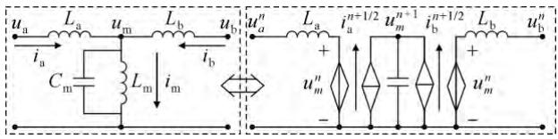  
图1 虚拟电容励磁支路解耦  
Fig.1 Virtual capacitor magnetizing branches decoupling

的所有关系式。将其相加后， $m$ 节点的电压恒等变化并相加可得

$$
\sum_ {k = 0} ^ {n - 1} \frac {u _ {m} ^ {n + 1 - k}}{K ^ {k}} - K u _ {m} ^ {n} = K _ {\mathrm {a}} \sum_ {k = 0} ^ {n - 1} \frac {u _ {\mathrm {a}} ^ {n - k}}{K ^ {k}} + K _ {\mathrm {b}} \sum_ {k = 0} ^ {n - 1} \frac {u _ {\mathrm {b}} ^ {n - k}}{K ^ {k}} \tag {6}
$$

式中 $K { = } 2 { - } K _ { \mathrm { a } { - } } K _ { \mathrm { b } }$ ， $K _ { \mathrm { a } } { = } \Delta t ^ { 2 } / ( C _ { m } L _ { \mathrm { a } } )$ ， $K _ { \mathrm { b } } { = } \Delta t ^ { 2 } / ( C _ { m } L _ { \mathrm { b } } )$ 。由式(6)可知，需要满足|K|>1 才可使方程有界，由此可得解耦的稳定条件 $\Delta t$ 为

$$
0 <   \Delta t <   \sqrt {\frac {L _ {\mathrm {a}} L _ {\mathrm {b}} C _ {m}}{L _ {\mathrm {a}} + L _ {\mathrm {b}}}} \tag {7}
$$

# 1.2 双馈风力发电机定转子解耦

由附录B式(B1)可知异步机电压磁链方程分解到 $d q$ 轴后存在交互，由于磁链时刻变化，因此每时步内均需要进行矩阵求逆运算。为避免 FPGA进行求逆运算，本文对附录 B 式(B1)重新列写 KVL 方程并采用转子参考坐标系可得式(8)、式(9)。

$$
\left\{ \begin{array}{l} u _ {d s} = R _ {\mathrm {s}} i _ {d s} + L _ {\mathrm {l s}} \frac {\mathrm {d} i _ {d s}}{\mathrm {d} t} + u _ {d \mathrm {m}} - \omega_ {\mathrm {r}} \lambda_ {q s} \\ u _ {d \mathrm {r}} = R _ {\mathrm {r}} i _ {d \mathrm {r}} + L _ {\mathrm {l r}} \frac {\mathrm {d} i _ {d \mathrm {r}}}{\mathrm {d} t} + u _ {d \mathrm {m}} \\ u _ {d \mathrm {m}} = L _ {\mathrm {m}} \frac {\mathrm {d} i _ {d \mathrm {m}}}{\mathrm {d} t} \end{array} \right. \tag {8}
$$

$$
\left\{ \begin{array}{l} u _ {q \mathrm {s}} = R _ {\mathrm {s}} i _ {q \mathrm {s}} + L _ {\mathrm {l s}} \frac {\mathrm {d} i _ {q \mathrm {s}}}{\mathrm {d} t} + u _ {q \mathrm {m}} + \omega_ {\mathrm {r}} \lambda_ {d \mathrm {s}} \\ u _ {q \mathrm {r}} = R _ {\mathrm {r}} i _ {q \mathrm {r}} + L _ {\mathrm {l r}} \frac {\mathrm {d} i _ {q \mathrm {r}}}{\mathrm {d} t} + u _ {q \mathrm {m}} \\ u _ {q \mathrm {m}} = L _ {\mathrm {m}} \frac {\mathrm {d} i _ {q \mathrm {m}}}{\mathrm {d} t} \end{array} \right. \tag {9}
$$

式中： $u _ { d \mathrm { s } }$ 、 ${ u _ { q \mathrm { s } } }$ 为定子 $d q$ 轴上的电压； $u _ { d \mathrm { r } }$ 、 $u _ { \boldsymbol { q } \mathrm { r } }$ 为转子 $d q$ 轴上的电压；ids、 $i _ { q \mathrm { s } }$ 为定子 $d q$ 轴上的电流；$i _ { d \mathrm { r } }$ 、 $i _ { q \mathrm { r } }$ 为转子 $d q$ 轴上的电流； $R _ { \mathrm { s } } { \mathrm { . } }$ 、 $L _ { \mathrm { l s } }$ 为定子电阻与定子漏感， $L _ { \mathrm { m } }$ 为励磁电感； $R _ { \Gamma }$ 、 $L _ { \mathrm { l r } }$ 为转子电阻与转子漏感； $\lambda _ { d s }$ 、 $\lambda _ { q \mathrm { s } }$ 为定子 $d q$ 轴上的磁链； $\omega _ { \mathrm { r } }$ 为转子转速； $u d \mathrm { m } \cdot \mathrm { ~  ~ \Omega ~ }$ 、 $u _ { \boldsymbol { q } \mathrm { m } }$ 为折算到 $d q$ 轴上的励磁支路电压；$i _ { d \mathrm { m } }$ 、 $i _ { q \mathrm { m } }$ 为折算到 $d q$ 轴上的励磁支路电流，其值分别为 ${ i _ { d } } _ { \mathrm { m } } { = } i _ { d } { \mathrm { s } } { + } i _ { d } { \mathrm { r } }$ ， $i _ { q \mathrm { m } } { = } i _ { q \mathrm { s } } { + } i _ { q \mathrm { r } }$ 。

由式(8)与式(9)可知，定子绕组、转子绕组及励磁绕组各电气量存在交互。因此采用 1.1 节所提虚

拟电容等效法将其折算到 $d q$ 轴的定转子电气量解耦。对式(8)、式(9)进行处理得：

$$
\begin{array}{l} \left\{ \begin{array}{l} i _ {d s} ^ {n + 1 / 2} = \frac {u _ {d s} ^ {n} - u _ {d m} ^ {n} + \omega_ {\mathrm {r}} \frac {\lambda_ {q s} ^ {n + 1 / 2} + \lambda_ {q s} ^ {n - 1 / 2}}{2} - \left(\frac {R _ {\mathrm {s}}}{2} - \frac {L _ {\mathrm {l s}}}{\Delta t}\right) i _ {\mathrm {d s}} ^ {n - 1 / 2}}{\left(\frac {R _ {\mathrm {s}}}{2} + \frac {L _ {\mathrm {l s}}}{\Delta t}\right)} \approx \\ \frac {u _ {d s} ^ {n} - u _ {d m} ^ {n} + \omega_ {\mathrm {r}} \lambda_ {q s} ^ {n - 1 / 2} - \left(\frac {R _ {\mathrm {s}}}{2} - \frac {L _ {\mathrm {l s}}}{\Delta t}\right) i _ {d s} ^ {n - 1 / 2}}{\left(\frac {R _ {\mathrm {s}}}{2} + \frac {L _ {\mathrm {l s}}}{\Delta t}\right)} \\ i _ {d r} ^ {n + 1 / 2} = \frac {2 \Delta t \left(u _ {d r} ^ {n} - u _ {d m} ^ {n}\right) - \left(R _ {\mathrm {r}} \Delta t - 2 L _ {\mathrm {l r}}\right) i _ {d r} ^ {n - 1 / 2}}{R _ {\mathrm {r}} \Delta t + 2 L _ {\mathrm {l r}}} \\ u _ {d m} ^ {n} = \frac {L _ {\mathrm {m}}}{\Delta t} \left(i _ {d m} ^ {n + 1 / 2} - i _ {d m} ^ {n - 1 / 2}\right) \\ u _ {d m} ^ {n + 1} = \frac {i _ {d m} ^ {n + 1 / 2}}{C _ {\mathrm {m}}} \Delta t + u _ {d m} ^ {n} = \frac {i _ {d s} ^ {n + 1 / 2} + i _ {d r} ^ {n + 1 / 2}}{C _ {\mathrm {m}}} \Delta t + u _ {d m} ^ {n} \end{array} \right. (10) \\ \left\{ \begin{array}{l} i _ {q s} ^ {n + 1 / 2} = \frac {u _ {q s} ^ {n} - u _ {q m} ^ {n} - \omega_ {\mathrm {r}} \frac {\lambda_ {d s} ^ {n + 1 / 2} + \lambda_ {d s} ^ {n - 1 / 2}}{2} - \left(\frac {R _ {\mathrm {s}}}{2} - \frac {L _ {\mathrm {l s}}}{\Delta t}\right) i _ {q s} ^ {n - 1 / 2}}{\left(\frac {R _ {\mathrm {s}}}{2} + \frac {L _ {\mathrm {l s}}}{\Delta t}\right)} \approx \\ \frac {u _ {q s} ^ {n} - u _ {q m} ^ {n} - \omega_ {\mathrm {r}} \lambda_ {d s} ^ {n - 1 / 2} - \left(\frac {R _ {\mathrm {s}}}{2} - \frac {L _ {\mathrm {l s}}}{\Delta t}\right) i _ {q s} ^ {n - 1 / 2}}{\left(\frac {R _ {\mathrm {s}}}{2} + \frac {L _ {\mathrm {l s}}}{\Delta t}\right)} \\ i _ {q r} ^ {n + 1 / 2} = \frac {2 \Delta t \left(u _ {q r} ^ {n} - u _ {q m} ^ {n}\right) - \left(R _ {\mathrm {r}} \Delta t - 2 L _ {\mathrm {l r}}\right) i _ {q r} ^ {n - 1 / 2}}{R _ {\mathrm {r}} \Delta t + 2 L _ {\mathrm {l r}}} \\ u _ {q m} ^ {n} = \frac {L _ {\mathrm {m}}}{\Delta t} \left(i _ {q m} ^ {n + 1 / 2} - i _ {q m} ^ {n - 1 / 2}\right) \\ u _ {q m} ^ {n + 1} = \frac {i _ {q m} ^ {n + 1 / 2}}{C _ {\mathrm {m}}} \Delta t + u _ {d m} ^ {n} = \frac {i _ {q s} ^ {n + 1 / 2} + i _ {q r} ^ {n + 1 / 2}}{C _ {\mathrm {m}}} \Delta t + u _ {q m} ^ {n} \end{array} \right. (11) \\ \end{array}
$$

式中 $C _ { \mathrm { m } } { = } 1 / ( \omega _ { \mathrm { r } } ^ { 2 } L _ { \mathrm { m } } )$ 。由式(10)、式(11)可知， $i _ { d \mathrm { r } } ^ { n + 1 / 2 }$ 1/ 2ni  与 二$i _ { \boldsymbol { q } \mathrm { r } } ^ { n + 1 / 2 }$ 的表达式仅存在常数项与历史项，因此，电机转子完成了对定子的解耦；而对于 $i _ { d \mathrm { s } } ^ { n + 1 / 2 }$ 与 sqi $i _ { q \mathrm { s } } ^ { n + 1 / 2 }$ 由于磁链交互的原因需要本时刻的转子 $d q$ 轴电流才可以求解，为节省时间可采用后向欧拉法对其近似，这样就完成了电机定子对转子的完全解耦。由以上分析可知，等式右侧均为已知量，因此采用虚拟电容等效法可将异步机定转子解耦，进而避免 FPGA矩阵求逆运算。此外，由于式(10)、式(11)的定转子电流求解过程数据无交互，因此定转子电流可并行求出，进一步节省了异步机仿真计算时间。

在 MATLAB/Simulink 中对异步机进行仿真，

采用梯形求逆法与虚拟电容等效法所求得 $d q$ 轴电流结果见图2，基准电流为定子额定电流 2130 A。可以看出，虚拟电容等效法求解精度与梯形求逆法的仿真结果几乎完全重合。因此虚拟电容等效法可完成异步机的定转子解耦，简化DFIG-IP采用FPGA计算时的求解流程。

# 2 基于 FPGA 的可复用双馈风力发电机数字镜像模拟器架构

本文设计的基于FPGA的可复用双馈风力发电机数字镜像模拟器架构包含 FPGA-DFIG 模拟部分与RT-lab/电网、上位机数据交互部分。因此，模拟器架构包含DFIG计算模块及本文所建IP与外界通信模块，以下为2个模块架构的详细阐述。

# 2.1 IP 计算架构

图3所示为双馈风力发电机的物理架构，主要由9个模块组成，分别为浆距角控制、二质量块传动链方程、转子运动方程、异步发电机电压方程、转子侧换流器(rotor-side converter，RSC)控制、网侧换流器(grid-side converter，GSC)控制、DC 链路、RL 滤波电路以及锁相环(phase locked loop，PLL)控制，图中各参数的物理意义如 3.1 节所述。本文

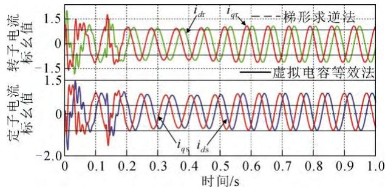  
图2 定转子解耦法与梯形求逆法电流对比结果

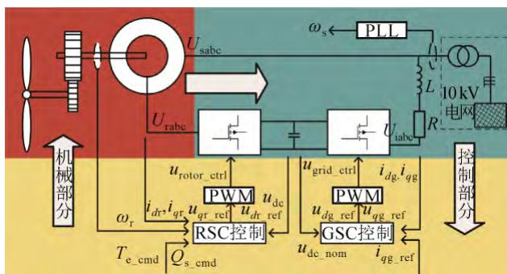  
Fig.2 Current comparison results between stator and rotor decoupling method and trapezoidal inversion method   
图 3 DFIG 发电单元  
Fig.3 Power generation unit of DFIG

所建的 DFIG 风电并网系统数字镜像换流器为详细平均值电磁暂态模型[23]。

在进行电力系统电磁暂态仿真时，需要考虑实际物理对象的不确定因素。若采用定点数格式计算，当模拟的系统或设备出现异常时，由于数据位数的限制存在数据溢出的可能[24]。为防止计算过程出现数值溢出，本文设计的 DFIG-IP 统一采用 IEEE 754二进制单浮点数算术标准[25]。

为在 FPGA 中实现 DFIG-IP，需要对 DFIG 的物理模型架构深入分析。本文采用“层次化设计”思想，“自上而下”地根据 DFIG各个模块不同的组成特点，设计相应的并行算法；根据并行算法，采用不同的底层算法模块。整个 IP 架构被设计完成后，可以根据模型架构“自下而上”地逐步构建整个 DFIG-IP。

按照这一思路，本文在图4中基于“层次化设计”思想设计了 DFIG-IP模块架构，这是面向可复用与可交互的 DFIG IP而设计的整体性架构，其包含位于顶层的 DFIG接口模块，分别通过 FMC连接器(FPGA mezzanine card，FMC)和光模块硬件接口(small form pluggable，SFP)分别与 RT-lab/电网和 PC机连接；位于第 3 层的 FIFO 存储器(first input firstoutput, FIFO) 和 片 外 内 存 (double data ratesynchronous dynamic random access memory，DDRSDRAM)数据缓冲模块与 DFIG 的各个组成部分模块，位于第2层的dq变换与逆变换算法、积分器与PI模块、滤波器模块、斜率限制器模块、坐标系换算模块、信号取均值模块、数模转换器 ADC模块、用户数据报协议(user datagram protocol，UDP)模块以及位于底层的基本算术与逻辑运算模块。根据以上整体 DFIG-IP 设计架构即可“自下而上”地构建整个 DFIG-IP。

本文着重讨论 DFIG-IP 构建方法与 DFIG 内部异步机求解模块并行算法。因此，仅给出底层算法性能表与所对应函数。如表 1所示，所有模块求解时间均在500 MHz 时钟下测得，滤波器均根据文献[26]设计。

# 2.2 通信架构

为使基于FPGA的DFIG-IP可与外界进行数据交互，本文设计了 DFIG-IP与 RT-lab/电网、上位机通信模块。其包含2个组成部分：第一部分为 FPGA与RT-lab/电网模拟信号间的通信部分；第二部分为FPGA与上位机之间的通讯。与实际电网/RT-lab通

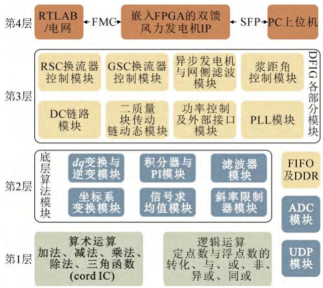  
图 4 DFIG-IP 设计架构  
Fig.4 Design architecture of DFIG digital mirroring IP core

表1 各算法模块性能  
Table 1 Performance of each algorithm block   

<table><tr><td>模块</td><td>函数记号</td><td>LUT数量/个</td><td>FF数量/个</td><td>时间/μs</td></tr><tr><td>dq</td><td>fdq</td><td>459</td><td>2643</td><td>0.365</td></tr><tr><td>dqinv</td><td>fdqinv</td><td>206</td><td>2629</td><td>0.320</td></tr><tr><td>PI</td><td>fPI</td><td>308</td><td>617</td><td>0.250</td></tr><tr><td>滤波器1</td><td>ffilter1</td><td>52</td><td>449</td><td>0.0825</td></tr><tr><td>滤波器2</td><td>ffilter2</td><td>112</td><td>3140</td><td>0.1575</td></tr><tr><td>斜率限制器</td><td>frate</td><td>291</td><td>347</td><td>0.0035</td></tr><tr><td>极坐标变换</td><td>fto_polar</td><td>211</td><td>1002</td><td>0.3325</td></tr><tr><td>笛卡尔坐标系变换</td><td>fto_xy</td><td>30</td><td>406</td><td>0.1775</td></tr><tr><td>信号取均值模块</td><td>fmean</td><td>779</td><td>1598</td><td>0.720</td></tr><tr><td>积分器</td><td>fInt</td><td>183</td><td>502</td><td>0.1425</td></tr></table>

讯的 ADC 模块可将实际电网数据模拟量采集到FPGA 中，以模拟 DFIG 端口电压变化。与上位机通讯模块可将计算的数据结果上传至上位机，亦可实现 DFIG 以瞬时电流源形式的模拟量注入到RT-lab/电网的功能。考虑需要进行大规模风电场内各台风电机动态特性仿真，数据传输量很大，TCP协议传输速度较 UDP协议慢，虽然UDP协议数据传输不可靠，但网络丢失数据对大量暂态数据几乎无影响，因此仿真数据采用 UDP协议传输[27]。

# 3 双馈风力发电机各模块并行算法

基于粗粒度并行计算原则，将问题拆解为 l 个子问题，并将这 l 个子问题分配到 l 个对应的计算资源上[28]。又由于数据无关可做并行处理[29]，因此在进行电力系统电磁暂态仿真时，可将大系统分解为 l 个小系统求解，若这 l 个小系统计算时数据无

关，则还可做并行处理。DFIG 由多个元件组成，部分元件在离散化处理后对应的时步内数据无关联，因此可对 DFIG 内部元件做基于粗粒度计算原则的时步内数据无关并行计算，本文将其定义为时步数据无关可并行原则。

# 3.1 DFIG 并行求解算法

基于时步内数据无关可并行原则提出 DFIG 并行计算方法如图5所示。由图5可知，在步骤1中$d q$ 变换模块与 PLL 模块数据无关联，因此可以做并行处理；在步骤 2 中，RSC 平均值模块与 GSC平均值模块数据无关联，因此可以做并行处理；在步骤 3 中，异步发电机求解模块与网侧 RL 滤波模块数据无关联，因此可以做并行处理；在步骤 4中，求解功率控制模块、Vdc 求解模块、与电网接口模块数据无关联，因此可以做并行处理；在步骤 5中，RSC控制模块、GSC控制模块、浆距角控制模块数据无关联，因此可以做并行处理。

在第 4 步求解完成后，DFIG 即可以等效瞬时电流源[30]的形式与外部电网接口。虽然 DFIG 的整

个求解过程需要7步才可进行下一次计算，但在第4步后的电网求解与DFIG第5—7步求解是并行的，因此进一步节省了求解时间。本文主要讨论 DFIG中异步机的定转子解耦方法，因此本节给出 DFIG异步机的求解时序。对于图中 5中其余各模块详细组成及符号意义在附录 A 中给出。

DFIG 异步机定转子基于虚拟电容等效法解耦后的电压与电流求解关系在 1.2节给出，如式(10)、式(11)。将 $i _ { d \mathrm { r } } ^ { n + 1 / 2 }$ 、 、 $i _ { \boldsymbol { q } \mathrm { r } } ^ { n + 1 / 2 }$ $i _ { d \mathrm { s } } ^ { n + 1 / 2 }$ $i _ { q \mathrm { s } } ^ { n + 1 / 2 }$ 2 记为 srdqi  ， $i _ { d q - \mathrm { s r } } ^ { n + 1 / 2 }$ 1/ 2n 其可并行算出，而对于(n+1)时刻的 $u _ { \boldsymbol { q } \mathrm { m } } ^ { n + 1 }$ 、 $u _ { d \mathrm { m } } ^ { n + 1 }$ 需 要等待(n+1/2)时刻电流求得才可求出。图6为本模块求解时序图。

如图6所示，采用梯形法，或采用前半步电流近似可求得本时刻定转子 $d q$ 轴电流，进而可求得定转子 abc 三相电流 Irabc、Isabc 为：

$$
\left\{ \begin{array}{l} I _ {\mathrm {r a b c}} = f _ {\mathrm {d q i n v}} \left(i _ {\mathrm {d r}}, i _ {\mathrm {q r}}\right) | _ {\theta \mathrm {s} - \theta \mathrm {r}} = \left[ I _ {\mathrm {r a}}, I _ {\mathrm {r b}}, I _ {\mathrm {r c}} \right] \\ I _ {\mathrm {s a b c}} = f _ {\mathrm {d q i n v}} \left(i _ {\mathrm {d s}}, i _ {\mathrm {q s}}\right) | _ {\theta \mathrm {s}} = \left[ I _ {\mathrm {s a}}, I _ {\mathrm {s b}}, I _ {\mathrm {s c}} \right] \end{array} \right. \tag {12}
$$

式中： $\theta _ { \mathrm { s } }$ 与 $\theta _ { \mathrm { r } }$ 为定转子 $d q$ 轴相对于 abc 坐标系 a

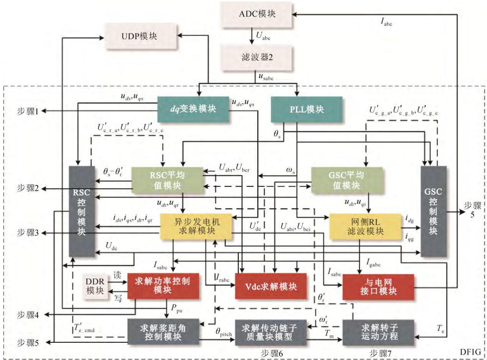  
图5 DFIG的并行计算方法  
Fig.5 Parallel computing method of DFIG

轴的角度。利用附录B式(B1)可求得本时刻磁链，进而根据附录B 式(B5)求得异步机的本时步电磁转矩 $T _ { \mathrm { e } } ,$ 。

对 DFIG IP在 FPGA中进行布局布线后，其各组件使用资源如表2所示，求解时间在500 MHz时钟下测得。

表2中，采用矩阵求逆方法求解异步机所需时间为 1.3 μs，而采用定转子解耦法仅需 0.49 μs；注入电网电流模块由于包含了 dq 变换，因此整个模块需要0.45 μs，而与外界接口的电流仅需 0.07 μs即可完成。由表2 异步机求解模块可知，采用定转子解耦后的异步机求解所用资源降低约 77%；由表 2最后一栏可知，DFIG与电网接口时间为1.8 μs，而整个 DFIG IP 求解时间为 5.5325 μs，单台 DFIG 占用资源不超过 20%，降低总资源占用约 51%。表 2中求解时间由 DFIG 并行求解流程与各步骤内各模块所需最大计算时间共同决定，这个求解时间在FPGA 计算资源充足的前提下不会发生变化。本文所提超实时加速比定义采用文献[15]中的实际加速比定义。由于本文离散时间为 50 μs，且每次向RT-lab/电网发送数据时间为 1.8 μs，因此超实时加速比近似为28。

# 3.2 通信模块设计

本文使用的FPGA板卡为ZCU106评估套件，配有 xczu7ev-ffvc1156-2-e 芯片，该芯片包含 230 400个 LUT、460 800 个 FF 以及 1728 个 DSP 资源，312个 18 Kb 的 RAM，360 个 IO(输入输出引脚)，拥有最大支持 810 MHz 的可编程时钟，片外挂载镁光4Gb的MT40A256M16GE-075E 型号的DDR4内存。本文的 DFIG-IP在 FPGA中计算完成，电网模型在RT-lab 中计算完成，两者通过 ZCU106 FMC 插槽上的高速 AD 模块 FL9613 连接，连接采样值经换算与滤波后输入到 DFIG-IP中。上位机的仿真平台与ZCU106 通过 TL-TC532-1 电缆相连接，两者通过SFP 端口连接。在 FPGA 中布局布线，用于数据通信的 ADC模块与 UDP模块使用资源如表3所示。

由于基于FPGA的DFIG-IP受到实际电网电压或RT-lab输出的端口模拟电压控制，因此可以更接近真实的反应实际 DFIG 运行工况。此外，由于本文设计的 DFIG-IP基于 Verilog编制，因此任意型号的 FPGA 均可使用。当模拟对象为多台不同 DFIG时，仅需要设置不同 DFIG参数，例化多个 DFIG-IP即可，此 IP核具有可移植性及并行性。

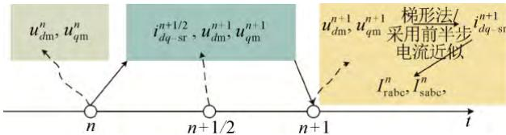  
图6 异步发电机定转子电流求解时序  
Fig.6 Time sequence diagram of stator and rotor current solution of induction generator

表2 DFIG各模块资源占用  
Table 2 Resource usage of DFIG block   

<table><tr><td>模块</td><td>LUT/个</td><td>FF/个</td><td>时间/μs</td></tr><tr><td>RSC 控制模块</td><td>5683</td><td>8723</td><td>2.2525</td></tr><tr><td>RSC 平均值模块</td><td>2771</td><td>4623</td><td>1.0625</td></tr><tr><td>GSC 控制模块</td><td>4967</td><td>7620</td><td>1.7525</td></tr><tr><td>GSC 平均值模块</td><td>2204</td><td>3583</td><td>0.7775</td></tr><tr><td>异步机求解模块</td><td>51 482/8641</td><td>125 567/31 883</td><td>1.3/0.49</td></tr><tr><td>网侧 RL 滤波模块</td><td>2778</td><td>4814</td><td>0.615</td></tr><tr><td>DC 端电压求解模块</td><td>553</td><td>1080</td><td>0.295</td></tr><tr><td>功率控制模块</td><td>8793</td><td>11936</td><td>0.9575</td></tr><tr><td>注入电网电流模块</td><td>1707</td><td>2792</td><td>0.07/0.45</td></tr><tr><td>浆距角控制模块</td><td>979</td><td>1714</td><td>0.825</td></tr><tr><td>传动链求解模块</td><td>1722</td><td>2900</td><td>0.880</td></tr><tr><td>转子运动方程求解</td><td>451</td><td>756</td><td>0.3125</td></tr><tr><td>PLL 模块</td><td>2314</td><td>3494</td><td>0.865</td></tr><tr><td>总计</td><td>86 404/43 563</td><td>179 602/85 918</td><td>1.8/5.5325</td></tr></table>

注：采用虚拟电等效法后，异步机求解模块所占资源大大减少，因此异步机模块出现两组数据；时间指的是求解各个模块FPGA所需时间。

表3 通信模块资源占用  
Table 3 Resource usage of correspondence block   

<table><tr><td>模块</td><td>LUT/个</td><td>FF/个</td><td>BRAM/(18Kb)</td><td>IO数量/个</td></tr><tr><td>UDP</td><td>5842</td><td>6052</td><td>8.5</td><td>15</td></tr><tr><td>ADC</td><td>2929</td><td>4389</td><td>2.5</td><td>66</td></tr></table>

# 4 硬件实验

为验证本文设计的基于FPGA的双馈风力发电机数字镜像IP 并行计算模拟能力，本文将 DFIG-IP烧录到 ZCU106 板卡中，并与实验室现有的 RT-lab组成如图7所示硬件实验测试平台。网络拓扑如图3所示，系统电压等级为10 kV，经降压变压器与额定电压为 575 V 的 DFIG 相连，DFIG 模型在 FPGA中实现。基准容量、定子额定电压、基准频率及直流电容额定电压分别为 S =1.5 MVA、U =575 V、$f _ { 0 } { = } 5 0 \ \mathrm { H z } , U _ { \mathrm { d c } } { = } 1 1 5 0 \ \mathrm { V }$ ，初始风速 $V _ { \mathrm { i n i t } } { = } 1 1 { \sim } 1 6 ~ \mathrm { m / s }$ 。在 RT-lab 中模拟 DFIG 端口电压数据通过 AD模块输入到 FPGA 板卡中。FPGA 模拟 DFIG 的结果通过光模块输出到上位机，光缆型号及 AD 模块型号如3.2节所述。

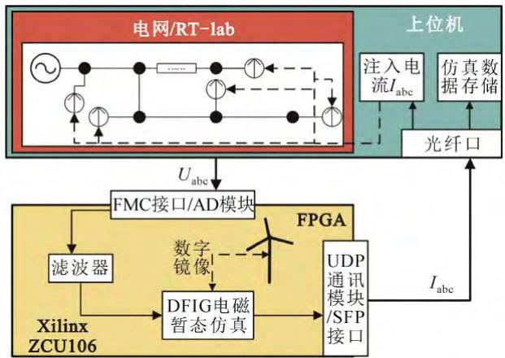

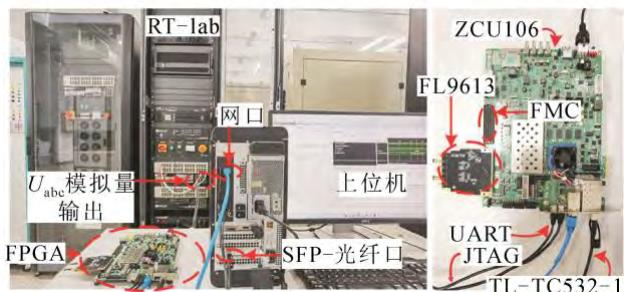  
（a）接线示意图  
(b)接线实物图  
图7 实验装置  
Fig.7 Experimental setup

# 4.1 稳态运行

DFIG 稳态运行的硬件实验波形如图 8 所示。稳态运行实验结果表明，采用 AD 模块接口后，输入到 FPGA 板卡的 DFIG 端口电压信号存在误差，由于滤波器2的设计，降低了信号的误差，可以看出 DFIG的几个关键性指标与 Simulink仿真结果一致性较好，表明本文设计的基于 FPGA 的 DFIG-IP在实际加速比接近28的情况下，仍然能保持高精度的模拟。

# 4.2 电网侧故障引起电压暂降

设置 t=1.05 s 时，电网出现电压暂降故障，持续0.45 s后电压水平恢复。硬件实验波形如图9所示。电网电压暂降实验结果表明，即便存在 AD 模块的通信干扰以及电压暂降，DFIG 镜像仍然可以保持高精度的求解。由图 9 可知，DFIG 的除电磁转矩 Te外，其余关键性指标与 Simulink仿真结果一致。电磁转矩 Te由于与端口电压强相关，在电压幅值与相位均异常的条件下，其模拟结果会存在一定的误差。

# 4.3 直流电容故障

设置 t=1 s 时，DFIG 的 RSC 与 GSC 间的电容发生短路故障，DFIG转子侧功率无法流动至电网，

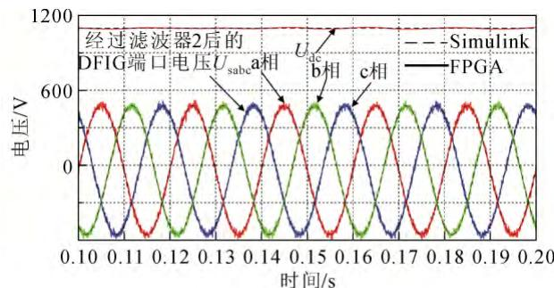

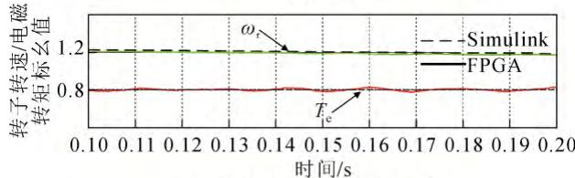  
（a）电压  
(b)转子转速/电磁转矩标幺值

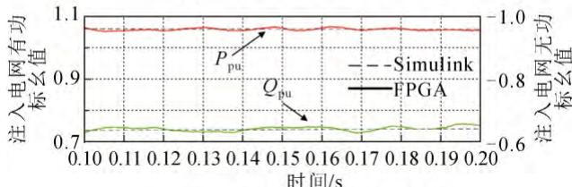  
(c)注入电网有功无功标幺值   
图8 硬件实验稳态仿真波形  
Fig.8 Simulation results of hardware test in normal operation

故障1 ms 后切除，实验结果如图10所示。可以发现除转速外，其余电气量均存在一定程度的误差，大约在1.094 s后误差可接受，在1.2 s后恢复至额定值。这种现象是硬件仿真不可避免的[31]。本文中，由于转子转速本身时间尺度比较长，对于毫秒级的故障响应较小，因此误差较小；其次，由于 AD 模块通信受扰造成PLL锁相误差，而DC电压在DFIG的RSC与GSC电流内环控制起到关键作用。因此，在 PLL 误差积累与 DC 短路的条件下造成 RSC 与GSC电流内环控制出现偏差，因此本节模拟误差较大。

为消除此误差，本文在 FPGA中设计理想三相电源与变压器模块，采用全 FPGA求解方法以解决此问题，模拟结果如图 11 所示。由图 11 可知，此方法在不损失速度，甚至由于电网与 DFIG 被完全集成到 FPGA 中求解，提高了求解速度的条件下，此解决方案又大大提高了 DFIG的模拟精度。

# 4.4 多机仿真

如图12，对图3所示单台 DFIG发电单元扩充为 5 台(A 区域)、10 台(B 区域)、40 台(全部)DFIG接入的风电场，图12中每台 DFIG参数均不相同。图12拓扑由文献[15]修改后得到，图中每台风电机

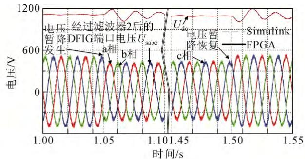

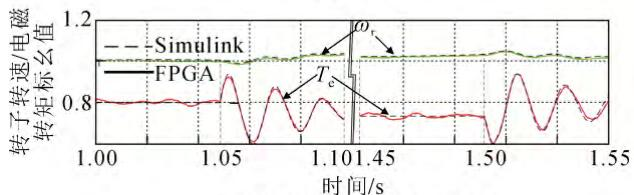  
（a）电压  
(b)转子转速/电磁转矩标幺值

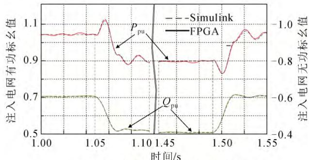  
(c)注入电网有功无功有功标幺值   
图9 硬件实验电压暂降仿真波形  
Fig.9 Simulation results of hardware test in voltage sag

通过575 V/10 kV变压器连接到集电网络，并通过10/35 kV 变压器接入外部系统。表 4 为每台 DFIG参数选取范围，基准容量、定子额定电压、基准频率与前文保持一致，换流器间电容C=0.01 F。

由表2可知，单台ZCU106由于资源的限制，最多可同时模拟 5 台 DFIG，因此进行 10 台与 40台 DFIG 模拟时，单个 ZCU106 资源不够。而采用流水线方式可降低求解时间并提高模块利用率。设置时钟为500 MHz，仿真总时长为1 s，步长为50 μs。

图13为40台风机仿真时，具有代表性风电机组功率(采用电动机惯例)。表5为不同DFIG数量接入 RT-lab/电网时，DFIG-IP 模块在 FPGA 中的求解时间及对应求解加速比(不含 RT-lab 求解时间)。本节算例运行 MATLAB/Simulink 的 PC 机配置为：CPUIntel Core i7-10750H，主频 2.6 GHz，内存 16.0 GB。

由表5可知，在FPGA计算资源充足的前提下，DFIG-IP求解速度超过了离散时间 27.8倍，大大降低 DFIG-IP求解时间。此方法可为采用更加复杂且

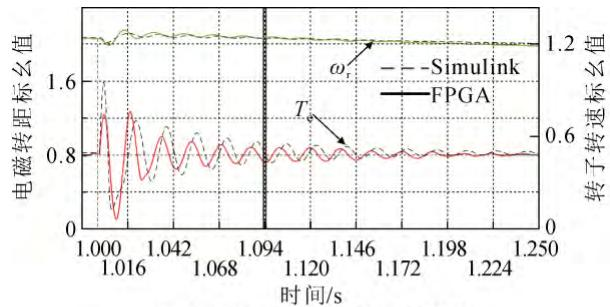  
(a)电磁转距和转子转速标幺值

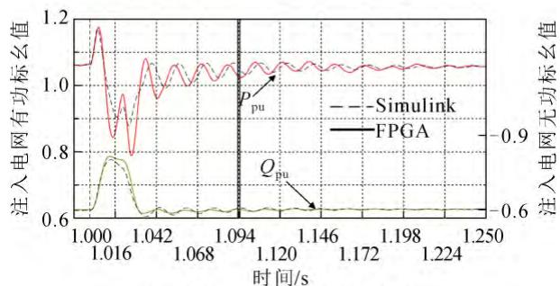  
(b)注入电网有功无功标幺值

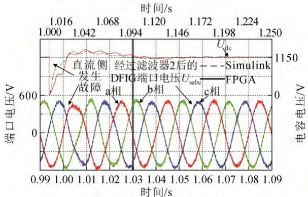  
(c)端口电压和电容电压   
图10 硬件实验直流侧故障仿真波形  
Fig.10 Simulation results of hardware test in dc-side short circuit

精确的辨识算法而节省时间，这对于文献[15,20-21]的研究具有重要意义。

进行 10 机以上仿真时，实验硬件资源限制了求解速率，但由表5可知，其仍可保持超实时计算。实际工程若进行 DFIG 场站级电磁仿真，则只需采用更大规模的 FPGA或者增加 FPGA设备数量，将本文设计的DFIG-IP分别例化后，烧录到 FPGA上即可保持 DFIG 的加速比为27.8的并行高速求解。

# 5 结论

本文设计了双馈风力发电机定转子解耦数字镜像 IP，接着采用 Verilog 硬件描述语言在 FPGA板卡上实现，最后与 RT-lab/电网联合进行模型精度验证与速度验证，结果表明：

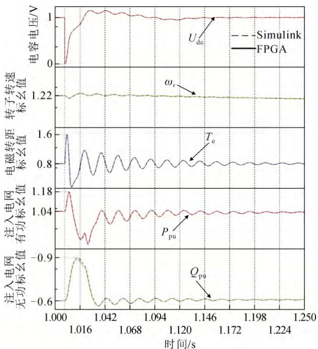  
图 11 硬件实验直流侧故障仿真波形(全 FPGA)

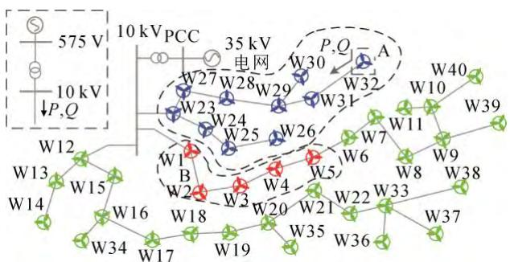  
Fig.11 Simulation results of hardware test in dc-side short circuit   
图12 40机风电场拓扑  
Fig.12 40 machine wind farm topology

表 4 DFIG 参数选取范围  
Table 4 DFIG parameter selection range   

<table><tr><td>参数</td><td>标幺值</td><td>参数</td><td>标幺值</td><td>参数</td><td>标幺值</td></tr><tr><td>Cki_vr</td><td>5~10</td><td>i_qg_ref</td><td>0</td><td>P</td><td>2或3</td></tr><tr><td>Ckp_vr</td><td>0.5~0.9</td><td>Cki_θ</td><td>0.7~1.3</td><td>C_Fg</td><td>0.01~0.03</td></tr><tr><td>Cki_wt</td><td>0.1~0.4</td><td>Ckp_θ</td><td>2~7</td><td>CHg</td><td>0.4~0.8</td></tr><tr><td>Cki_ig</td><td>350~420</td><td>Cki_Te</td><td>0.3~0.8</td><td>C_stiff</td><td>1~1.5</td></tr><tr><td>Ckp_ig</td><td>5~15</td><td>Ckp_Te</td><td>2~5</td><td>Cdamp</td><td>1.2~1.7</td></tr><tr><td>Qs_cmd</td><td>0</td><td>Climiter_p</td><td>0~36</td><td>Kc</td><td>0.02</td></tr><tr><td>Cki_vg</td><td>3~12</td><td>Cki_pitch</td><td>30~40</td><td>Rs</td><td>0.01~0.025</td></tr><tr><td>Ckp_vg</td><td>0.5~1.2</td><td>Ckp_pitch</td><td>1~6</td><td>Lls</td><td>0.1~0.2</td></tr><tr><td>R</td><td>0.001~0.006</td><td>Ck_pitch</td><td>120~200</td><td>Lm</td><td>2.5~3.5</td></tr><tr><td>L</td><td>0.1~0.6</td><td>Kpitch</td><td>7~16</td><td>Rr</td><td>0.01~0.025</td></tr><tr><td>Llr</td><td>0.1~0.2</td><td>θp</td><td>0~36</td><td></td><td></td></tr></table>

1）本文所提虚拟电容等效法改变了异步机电压与磁链方程的求解步骤，无需进行矩阵求逆运算。

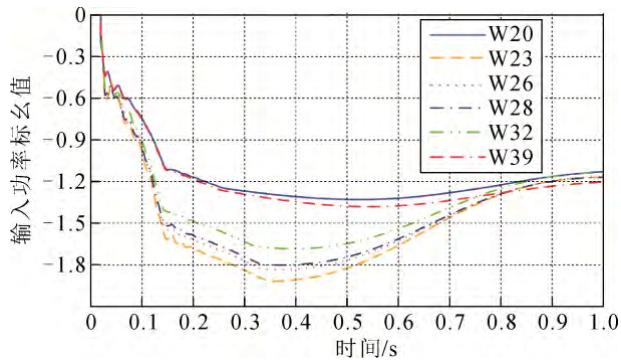  
图13 风场部分DFIG输出功率  
Fig.13 DFIG output power of wind farm

表5 不同DFIG数量接入电网仿真结果对比  
Table 5 Comparison of simulation results of different DFIG numbers connected to the power grid   

<table><tr><td rowspan="2">DFIG并网个数</td><td colspan="2">仿真耗时/s</td><td rowspan="2">串行超实时加速比</td><td rowspan="2">流水线超实时加速比</td></tr><tr><td>Simulink</td><td>FPGA</td></tr><tr><td>1</td><td>1.2</td><td>0.036</td><td>27.8</td><td>27.8</td></tr><tr><td>5</td><td>14</td><td>0.036</td><td>27.8</td><td>27.8</td></tr><tr><td>10</td><td>31</td><td>0.2213/0.1786</td><td>4.52</td><td>5.6</td></tr><tr><td>40</td><td>132</td><td>0.8852/0.597</td><td>1.13</td><td>1.675</td></tr></table>

注：当模拟DFIG超过5 台后，串行计算和流水线算法加速比不同，因此会出现2个时间。

本文基于虚拟电容等效法设计的 DFIG 异步机求解模块，FPGA 资源占用降低约 77%，单个 DFIG-IP占用 ZCU106 资源不超过 20%，降低了 DFIG-IP 对FPGA的资源使用率。

2）本文以粗粒度时步内数据无关可并行原则为指导，提出 DFIG 内部各模块并行算法，提高了DFIG-IP 的计算速度。实验结果表明，本文设计的DFIG-IP 在 500 MHz 时钟频率下，DFIG-IP 超实时加速比约为27.8。  
3）本文构建的 DFIG-IP 可进行超实时仿真，但RT-lab仅支持实时仿真，若要开展全电网超实时仿真研究，则可依据本文 4.3 节实验方法，将全电网模型均烧录至 FPGA中进行计算。其次，电流内环对 DFIG 模拟起到重要作用，若进行的实验对电流内环控制影响较大，则需要将全电网模型烧录至FPGA中进行全电网的电磁暂态仿真。  
4）本文所构建的 DFIG-IP 采用 Verilog 编制而成，可移植性强。进行大规模 DFIG 接入电力系统电磁暂态实时仿真研究中只需例化该模块即可使用。DFIG-IP 保留 SFP 与 FMC 接口增强了与外界数据通讯的能力提高了DFIG-IP的扩展性。

附录见本刊网络版(http://hve.epri.sgcc.com.cn)。

# 参考文献 References

[1] 曾治安，王良毅，吴志鹏，等. 基于两机表征的双馈风电场整定计算等效模型[J]. 电工技术，2022(14)：36-41.  
ZENG Zhian, WANG Liangyi, WU Zhipeng, et al. DFIG-based wind farm equivalent model for setting calculation based on two-machine characterization[J]. Electric Engineering, 2022(14): 36-41.   
[2] 孔 力，裴 玮，饶建业，等. 建设新型电力系统促进实现碳中和[J]. 中国科学院院刊，2022，37(4)：522-528.  
KONG Li, PEI Wei, RAO Jianye, et al. Build new power system to promote carbon neutrality[J]. Bulletin of Chinese Academy of Sciences, 2022, 37(4): 522-528.   
[3] 周孝信，陈树勇，鲁宗相，等. 能源转型中我国新一代电力系统的技术特征[J]. 中国电机工程学报，2018，38(7)：1893-1904.  
ZHOU Xiaoxin, CHEN Shuyong, LU Zongxiang, et al. Technology features of the new generation power system in China[J]. Proceedings of the CSEE, 2018, 38(7): 1893-1904.   
[4] 沈 沉，曹仟妮，贾孟硕，等. 电力系统数字孪生的概念、特点及应用展望[J]. 中国电机工程学报，2022，42(2)：487-498.  
SHEN Chen, CAO Qianni, JIA Mengshuo, et al. Concepts, characteristics and prospects of application of digital twin in power system[J]. Proceedings of the CSEE, 2022, 42(2): 487-498.   
[5] PENG Y Z, ZHAO S, WANG H. A digital twin based estimation method for health indicators of DC-DC converters[J]. IEEE Transactions on Power Electronics, 2021, 36(2): 2105-2118.   
[6] MOUTIS P, ALIZADEH-MOUSAVI O. Digital twin of distribution power transformer for real-time monitoring of medium voltage from low voltage measurements[J]. IEEE Transactions on Power Delivery, 2021, 36(4): 1952-1963.   
[7] ZHOU M K, YAN J F, FENG D H. Digital twin framework and its application to power grid online analysis[J]. Journal of Power and Energy Systems, 2019, 5(3): 391-398.   
[8] 周佩朋，孙华东，项祖涛，等. 大规模电力系统仿真用新能源场站模型结构及建模方法研究(3)电磁暂态模型[J/OL]. 中国电机工程学报，2022：1-11[2023-03-30]. https://doi. org/ 10.13334/j. 0258-8013.pcsee. 213036.  
ZHOU Peipeng, SUN Huadong, XIANG Zutao, et al. Research on model structures and modeling methods of renewable energy stations for large-scale power system simulation (3) electromagnetic transient models[J/OL]. Proceedings of the CSEE, 2022: 1-11[2023-03-30]. https: //doi. org/10.13334/j. 0258-8013. pcsee. 213036.   
[9] SHABANIKIA N, NIA N N, TABESH A, et al. Weighted dynamic aggregation modeling of induction machine-based wind farms[J]. IEEE Transactions on Sustainable Energy, 2021, 12(3): 1604-1614.   
[10] WU Y K, ZENG J J, LU G L, et al. Development of an equivalent wind farm model for frequency regulation[J]. IEEE Transactions on Industry Applications, 2020, 56(3): 2360-2374.   
[11] 王成山，董 博，于 浩，等. 智慧城市综合能源系统数字孪生技术及应用[J]. 中国电机工程学报，2021，41(5)：1597-1607.  
WANG Chengshan, DONG Bo, YU Hao, et al. Digital twin technology and its application in the integrated energy system of smart city[J]. Proceedings of the CSEE, 2021, 41(5): 1597-1607.   
[12] 姚蜀军，庞博涵，吴国旸，等. 半隐式延迟解耦电磁暂态并行仿真方法(一)：原理及交流分网与并行[J]. 中国电机工程学报，2022，42(7)：2486-2496.  
YAO Shujun, PANG Bohan, WU Guoyang, et al. A method of parallel computing for electromagnetic transient simulation based on semi-implicit latency decoupling technology (Part I): theory and AC network partitioning and parallel[J]. Proceedings of the CSEE, 2022,

42(7): 2486-2496.   
[13] YE H, STRUNZ K. Multi-scale and frequency-dependent modeling of electric power transmission lines[J]. IEEE Transactions on Power Delivery, 2018, 33(1): 32-41.   
[14] XIA Y, CHEN Y, YE H, et al. Multiscale induction machine modeling in the dq0 domain including main flux saturation[J]. IEEE Transactions on Energy Conversion, 2019, 34(2): 652-664.   
[15] 陈厚合，杨 政，裴 玮，等. 风电并网系统数字孪生及故障态势辨识[J]. 电工电能新技术，2022，41(11)：43-58.  
CHEN Houhe, YANG Zheng, PEI Wei, et al. Digital twin and fault situation identification of wind power integration system[J]. Advanced Technology of Electrical Engineering and Energy, 2022, 41(11): 43-58.   
[16] 陈 颖，高仕林，宋炎侃，等. 面向新型电力系统的高性能电磁暂态云仿真技术[J]. 中国电机工程学报，2022，42(8)：2854-2863.  
CHEN Ying, GAO Shilin, SONG Yankan, et al. High-performance electromagnetic transient simulation for new-type power system based on cloud computing[J]. Proceedings of the CSEE, 2022, 42(8): 2854-2863.   
[17] GAO H X, CHEN Y, XU Y, et al. A GPU-based parallel simulation platform for large-scale wind farm integration[C]∥Proceedings of 2014 IEEE PES T&D Conference and Exposition. Chicago, USA: IEEE, 2014: 1-5.   
[18] 王成山，丁承第，李 鹏，等. 基于FPGA的配电网暂态实时仿真研究(一)：功能模块实现[J]. 中国电机工程学报，2014，34(1)：161-167.  
WANG Chengshan, DING Chengdi, LI Peng, et al. Real-time transient simulation for distribution systems based on FPGA, Part I: module realization[J]. Proceedings of the CSEE, 2014, 34(1): 161-167.   
[19] DAGBAGI M, HEMDANI A, IDKHAJINE L, et al. ADC-based embedded real-time simulator of a power converter implemented in a low-cost FPGA: application to a fault-tolerant control of a grid-connected voltage-source rectifier[J]. IEEE Transactions on Industrial Electronics, 2016, 63(2): 1179-1190.   
[20] MILTON M, DE LA O C A, GINN H L, et al. Controller-embeddable probabilistic real-time digital twins for power electronic converter diagnostics[J]. IEEE Transactions on Power Electronics, 2020, 35(9): 9850-9864.   
[21] JAIN P, POON J, SINGH J P, et al. A digital twin approach for fault diagnosis in distributed photovoltaic systems[J]. IEEE Transactions on Power Electronics, 2020, 35(1): 940-956.   
[22] 邵昊舒，蔡 旭，周党生，等. 风电机组虚拟同步及惯量控制方法分析与测试评估[J]. 高电压技术，2020，46(5)：1538-1547.  
SHAO Haoshu, CAI Xu, ZHOU Dangsheng, et al. Analysis and test evaluation of VSG and virtual inertia control method for wind turbine[J]. High Voltage Engineering, 2020, 46(5): 1538-1547.   
[23] 陈武晖，吴明哲，张 军，等. 模块化多电平换流器电磁暂态模型研究综述[J]. 电网技术，2020，44(12)：4755-4765.  
CHEN Wuhui, WU Mingzhe, ZHANG Jun, et al. Review of electromagnetic transient modeling of modular multilevel converters[J]. Power System Technology, 2020, 44(12): 4755-4765.   
[24] SCHMITT A, RICHTER J, JURKEWITZ U, et al. FPGA-based real-time simulation of nonlinear permanent magnet synchronous machines for power hardware-in-the-loop emulation systems[C]∥ Proceedings of the 40th Annual Conference of the IEEE Industrial Electronics Society. Dallas, USA: IEEE, 2014: 3763-3769.   
[25] LIU J, DINAVAHI V. A real-time nonlinear hysteretic power transformer transient model on FPGA[J]. IEEE Transactions on Industrial Electronics, 2014, 61(7): 3587-3597.   
[26] 李钟慎. 基于 MATLAB 设计巴特沃斯低通滤波器[J]. 信息技术，

2003，27(3)：49-50，52.  
LI Zhongshen. The design of Butterworth Lowpass filter based on MATLAB[J]. Information Technology, 2003, 27(3): 49-50, 52.   
[27] LI B, ZHAO H R, DIAO J C, et al. Design of real-time co-simulation platform for wind energy conversion system[J]. Energy Reports, 2020, 6(Supplement 2): 403-409.   
[28] 仲 妍. 大型稀疏线性方程组并行求解及预处理技术研究[D]. 长沙：国防科学技术大学，2010.  
ZHONG Yan. Parallel algorithms and preconditioning for large sparse linear sytems[D]. Changsha, China: National University of Defense Technology, 2010.   
[29] 赵金利，刘君陶，李 鹏，等. 面向指数积分方法的电磁暂态仿真GPU 并行算法[J]. 电力系统自动化，2018，42(6)：113-119.  
ZHAO Jinli, LIU Juntao, LI Peng, et al. GPU based parallel algorithm oriented to exponential integration method for electromagnetic transient simulation[J]. Automation of Electric Power Systems, 2018, 42(6): 113-119.   
[30] CLARK K, MILLER N W, SANCHEZ-GASCA J J. Modeling of GE wind turbine-generators for grid studies: version 4.5[R]. New York, USA: General Electric International, Inc., 2010.   
[31] LAUSS G, STRUNZ K. Multirate partitioning interface for enhanced stability of power hardware-in-the-loop real-time simulation[J]. IEEE Transactions on Industrial Electronics, 2019, 66(1): 595-605.

  
CHEN Houhe   
Ph.D., Professor

  
Corresponding author   
YE Hua   
Ph.D.   
Associate professor   
Corresponding author

# 陈厚合(通信作者)

1978—，男，博士，教授，博导

主要从事电力系统安全性与稳定性、电力系统优化运行方面的工作

E-mail: chenhouhe@126.com

# 叶 华

1982—，男，博士，副研究员主要从事电力系统建模与仿真算法、电力系统稳定与分析、大规模储能并网等方面的研究工作E-mail: yehua@mail.iee.ac.cn

收稿日期 2022-11-02 修回日期 2023-01-09 编辑 卫李静