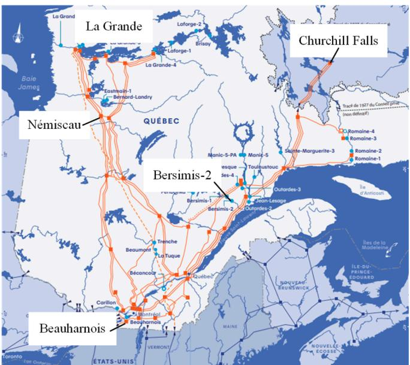
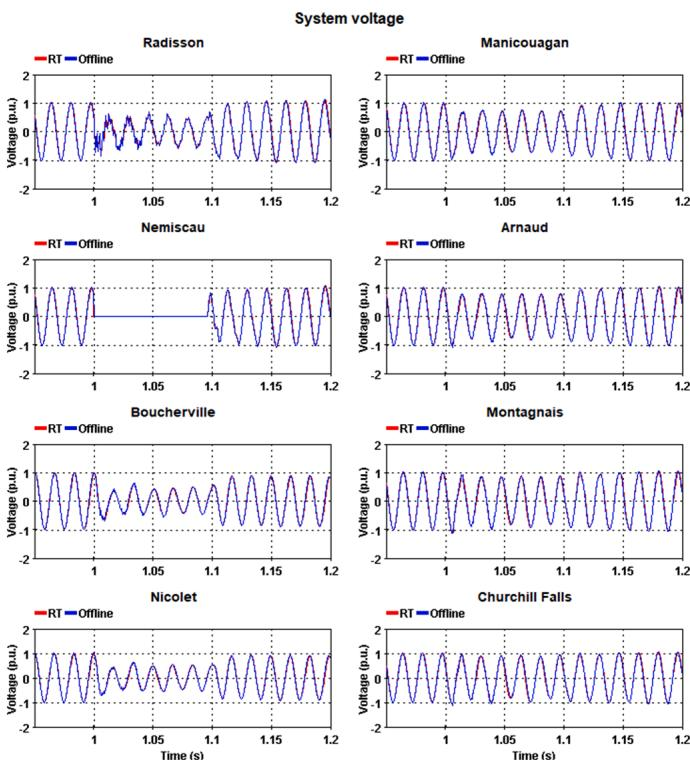
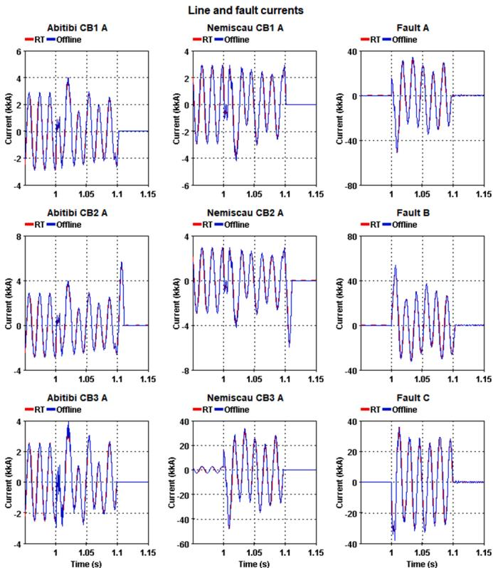
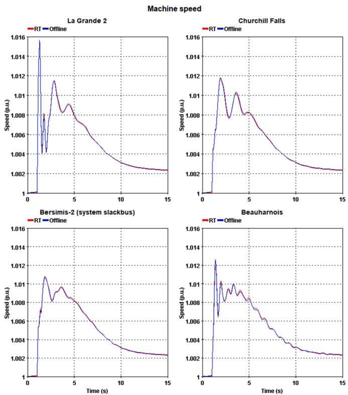
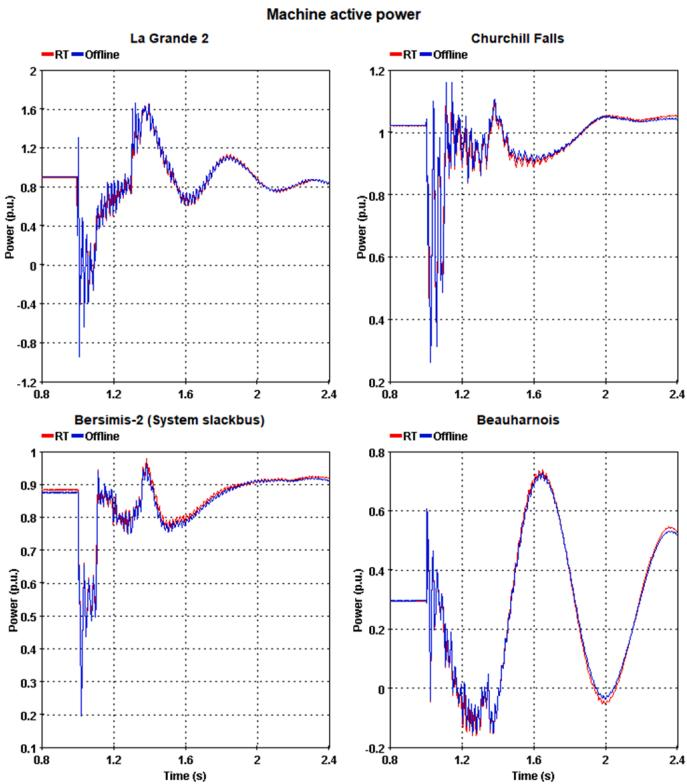

# Lessons learned in porting offline large-scale power system simulation to real-time for wide-area monitoring, protection and control

P. Le-Huy * , E. Lemieux , F. Guay

Power System Simulation Group, IREQ, Hydro-Qu´ebec’s Research Center, 1800 boul. Lionel-Boulet, Varennes, Qu´ebec J3 × 1S1, Canada

# A R T I C L E I N F O

Keywords:

Electromagnetic transient

Offline

Real-time

Simulation

User experience

Wide-area monitoring, protection and control

# A B S T R A C T

At Hydro-Qu´ebec, power system studies are mainly done with offline electromagnetic transient simulation tools and real-time simulation is typically reserved for hardware-in-the-loop studies related to HVDC and compensation system commissioning. However, there is a growing internal need to pursue large-scale power studies incorporating physical systems to explore wide-area monitoring, protection, and control strategies: large power systems must then be ported from offline software to the real-time environment. The current paper presents lessons learned over the years about the offline to real-time porting process. As Hydro-Qu´ebec is involved in simulation tool development, software-related issues and challenges are presented and discussed. Details are then provided regarding the porting process of a large-scale power system required for wide-area control explorations. Prior to waveform comparison and performance assessment, modeling details and required modifications on the original simulation schematic are presented. In closing, electromagnetic transient modeling best practices and tricks to facilitate porting offline simulations to real-time are reported here to help users increase the efficiency and performance of their offline simulations and prepare them for real-time operation.

# 1. Introduction

THE power system study group at Hydro-Qu´ebec (HQ) works mainly with offline electromagnetic transient (EMT) simulation tools to execute various types of analysis in order to identify, investigate, and solve challenges related to power system apparatus, control and protection. Among the various investigations, some eventually require the use of real-time (RT) hardware-in-the-loop (HIL) simulations to incorporate the behavior of real control or protection systems to get more realistic results. For example, control interaction studies with the actual control systems in HIL simulations involve far fewer hypotheses, which increases confidence that results could be observed on the real power system and that the study conclusions are meaningful.

Historically, when porting such offline simulations (EMTP [1]) to HQ’s RT simulation tool (HYPERSIM [2]), significant time and effort were required as both environments were quite different, and no export/import capabilities with automatic place and route were available. So, such offline to RT porting implied that all electrical and control components had to be instantiated in the RT tools, properly parametrized, and connected. Signal checks and system validation were then

done to verify proper behavior. Sometimes, certain offline components did not have direct RT equivalents and had to be built or synthesized from basic blocks or hand coded in a user-code model (UCM). Furthermore, additional steps had to be taken in certain situations to respect RT constraints and simulators’ capabilities, all with minimal, if any, alteration to the simulation results.

For small- to medium-scale power systems without complex internal controls, this translation from offline to RT tools was tedious but still manageable. However, for large-scale power systems with several complex internal control systems, the task became herculean: it required a lot of time and a team of simulation experts to capture all the intricate details of the offline simulation and reproduce them in the RT environment [3].

Such porting activities were soon deemed as too expensive, yet they remained essential in several projects or studies. So development efforts were deployed to facilitate and accelerate this activity. In the case presented in this paper, the purpose of the conversion is to co-simulate the EMT part with a telecommunication simulator and control and protection equipment to further explore the link between these domains and the impact they have on each other’s performance [4].

This paper aims to share the lessons learned during the porting of large-scale power systems used for wide-area monitoring, protection, and control (WAMPAC) RT simulations with other entities to facilitate their own large-scale conversion endeavors. Hopefully, the information provided in this paper will help users to enhance their in-house methods or optimize their conversion scripts when using commercial tools such as the RTDS import tool [5]. Very little information concerning this tool capabilities and limitations is publicly available and no large-scale power system conversions with this tool were found in the literature.

Challenges, solutions, and pitfalls of the porting process are presented in Section II, as are general comments and experiences, while Section III presents in more depth the ported large-scale power system and the required modifications. An application example and its results and performance are also presented. Section IV outlines and explains the major offline modeling habits that can facilitate and expedite porting an offline EMT simulation to RT. Finally, Section V concludes with a summary and closing remarks.

# 2. From offline to real-time simulation tools

The porting process is not always straightforward, and several challenges can be encountered. This section describes the main diffi culties that had to be tackled by the development team as well as the power system modeling experts.

# 2.1. Graphical user interface and import/export

Previously, export and import capabilities of the EMT software used at HQ allowed us to export the netlist and the parameters from a sche matic and the RT tools could then process the information. However, automatic place and route was not available: the HQ RT simulation import tool produced the correct netlist with the proper parameters, but everything had to be placed manually. Obviously, this approach rapidly became impractical as the size of the power system increased.

Over the years, work was done to add place and route information in the export file and to increase import capabilities, but the imported schematic still required manual modifications to improve usability and, most importantly readability.

In the early 2010s, it was decided to upgrade the HQ RT simulation tool graphical user interface (GUI) and thus began the adaptation to the DesignWorks GUI, the same used by EMTP. This solved the place and route issue of the export/import process for the HQ EMT simulation workflow.

However, this solution is rather unique to HQ as HQ is involved in both EMTP and HYPERSIM development, and it was a logical step in HQ’s EMT technical agenda.

On a more general note, the key idea here to keep in mind is that the tools’ GUI and import and export capabilities are important factors to consider while planning an offline to RT port as it can greatly affect the readability and long-term usability of the port product. In that regard, the proper evaluation of commercial tools’ import and export capabilities should be a selection criterion for any attempt to tackle both offline and RT studies.

# 2.2. Model compatibility layer

Once all the parts are properly placed and all connections and signals go where they should in an orderly manner, model compatibility becomes the main focus. Ensuring that all the models work in the intended manner is not an easy task, as each simulation tool’s model library has its own way of defining things with its own specificities.

Of course, basic power system elements and control blocks typically have their counterparts in all simulation software, but nonetheless, great care should be taken to provide adequate parameters. Some simulation packages might require additional information that is non-existent in the source software or unavailable in the import file: relying on default

values in those cases can prove to be hazardous as it may impact simulation results significantly. For example, some simulation tools have numerical dampers in certain models: default parameters could potentially affect several scenarios by overdamping phenomena of interest or producing uncharacteristic leakages leading to erroneous current and power measurements.

Model compatibility is typically addressed during the import process but here, it is slightly different. In HYPERSIM, upon opening a schematic containing EMTP models, a compatibility layer is applied to interpret the models and map them to equivalent native models, pre-generated equivalent UCMs, or equivalent subsystems containing power elements and/or control blocks to provide the same behavior. If a model is not supported, a warning is displayed, and an orange backdrop is applied on the culprit in the schematic. All previous information is retained and is accessible in the GUI. The translated equivalent can also be accessed. However, it is by default locked to prevent modification as the original modeling information has priority. On a parameter basis, the equivalent can be unlocked to allow users to further tune the equivalent.

In summary, model compatibility is far from trivial and great care must be taken to ensure the integrity of simulation results during the porting process. Ideally, the import process would take care of all compatibility issues; however, for the time being, manual intervention from simulation and modeling experts is still required. As for lessons learned, one of the most significant is that all EMT simulation tools, both offline and RT, give the same results when simulating exactly the same thing. If results are different, it means that the simulated system is different: a model, a parameter, an unconsidered decoupling or damping adjustment, simulation setting, etc. Making the results of two software match perfectly is a time-consuming process that requires in-depth knowledge of both tools.

# 2.3. System initialization

A major difference between offline and RT EMT simulation is initialization. In offline simulation software, as execution time can be quite long, the simulation time frame tends to be as short as possible: a few moments to see the system steady state, the disturbance, and recovery. As little as possible simulation time should be used for system stabilization prior to the disturbance of interest, which encourages having “perfect steady state” initial conditions, with all the control systems properly initialized to the exact operating point required by the study. This can be quite challenging when simulating user-code and imported black box models.

In RT, as the name implies, simulation time is on par with the realworld time, and thus electrical initialization is less critical as electric phenomena have a time constant in the μs/ms range. So, even if the system is not initialized exactly in steady state, which would lead to a small transient at the start of the simulation, it would go unnoticed to typical users. However, electromechanical phenomenon and others with time constants in the tens of seconds and higher can lead to unwanted wait times at the start of RT simulations.

As explained, system initialization is critical in offline simulations, and it may sometimes lead to implementing all sorts of tricks to accelerate system stabilization: some are either irrelevant, incompatible, or both for RT simulations. During the porting process, attention to such initialization contrivances is essential to ensure that no long-term numerical stability arises or builds up.

# 2.4. Control system modeling

Offline simulation tools have the luxury of time. This implies that sophisticated and time-consuming solvers can be implemented. At the control system level, several offline tools can solve algebraic loops, which is not the case for typical RT control system solvers due to the non-deterministic nature of that iterative process. Such algebraic loops

are typically seen when modeling electrical phenomena with control blocks and a voltage or current source: current (or voltage) is read from the power system, calculations are applied and an immediate change to the value of the voltage (or current) source is made.

Adding a delay block to break the loop is trivial but making sure that results are still valid is not so easy. If modifications to the control systems are required during the port, it is wise, after proper validation, to implement those changes in both offline and RT schematics.

# 3. Large-Scale power system for WAMPAC

At HQ, there is a growing need for wide-scale and detailed simulations as several wide-area control schemes are devised. To address this need, a group of HQ modeling specialists periodically build an EMT equivalent of the complete HQ power system, taking into account the latest additions and modifications. From these offline representations, the first major port to RT was the HQ 2009 winter configuration power system that was presented in [3] and used in several case studies [6,7]. The 2020 power system was the second major port to RT and it set the stage for the current work, which presents the modeling for the 2023 configuration.

# 3.1. Hydro-Qu´ebec power system

The backbone of the HQ power system is the 735-kV transmission system illustrated in Fig. 1. The simulated power system follows the same structure and lower voltage level (315, 230, 120 kV and generation level) components are placed in subsystems. Due to the sheer size and complexity of the simulation schematic, it is not presented here as even a full-page illustration would not be legible.

To further appreciate the size and complexity of the simulation schematic, the high-level component count is given in Table 1, while Table 2 gives the basic component count. High-level components are both user-built super-models combining power and control basic elements or native components that are constructed from basic elements (e. g. a three-phase transformer is an assembly of single-phase components and internal nodes). Load centers are represented by complex dynamic load models that contribute generously to the control block count.

The load flow solutions from both offline and RT software are given in Table 3, which shows production and load levels for that specific configuration. It also illustrates how the two simulations are closely matched: 8 MW and 35 Mvar represent differences of 0.02 and 0.83%

  
Fig. 1. HQ 735-kV power system and 450-kV HVDC line.

Table 1 High-level content of the 2023 HQ power system representation.   

<table><tr><td>Complex components</td><td>Quantity</td></tr><tr><td>Three-phase buses</td><td>1666</td></tr><tr><td>Electrical machines</td><td>111</td></tr><tr><td>Lines and cables</td><td>432</td></tr><tr><td>Three-phase transformers</td><td>338</td></tr><tr><td>Governors</td><td>86</td></tr><tr><td>Excitation systems</td><td>81</td></tr><tr><td>Stabilizers</td><td>54</td></tr><tr><td>Static compensators</td><td>10</td></tr><tr><td>Wind power plants</td><td>6</td></tr><tr><td>HVDC converters</td><td>6</td></tr><tr><td>Dynamic loads</td><td>165</td></tr></table>

Table 2 Basic content of the 2023 HQ power system representation.   

<table><tr><td>Basic components</td><td>Quantity</td></tr><tr><td>Single-phase electrical nodes</td><td>6 180</td></tr><tr><td>Single-phase transformers</td><td>1 182</td></tr><tr><td>RLCs</td><td>13 626</td></tr><tr><td>Current sources</td><td>2 784</td></tr><tr><td>Voltage sources</td><td>66</td></tr><tr><td>Non-linear elements</td><td>951</td></tr><tr><td>Switches and breakers</td><td>502</td></tr><tr><td>Control blocks</td><td>90 405</td></tr></table>

Table 3 Load flow solution: generation and load.   

<table><tr><td></td><td colspan="2">Total generation</td><td colspan="2">Total load</td></tr><tr><td>Software</td><td>P (MW)</td><td>Q (Mvar)</td><td>P (MW)</td><td>Q (Mvar)</td></tr><tr><td>EMTP</td><td>41 036</td><td>4 277</td><td>38 632</td><td>958</td></tr><tr><td>HYPERSIM</td><td>41 044</td><td>4 242</td><td>38 632</td><td>958</td></tr></table>

respectively.

# 3.2. Modifications for Real-Time operation

As will be detailed in section D., this power system was first simulated offline as it was in both software environment. However, to reach RT performance, a few modifications were necessary: node reduction was required at a few substations and Π sections were combined and replaced by constant parameter lines with the necessary propagation delay to further partition the power system.

Some substations had a very high number of electrical nodes (300 or more) due to the use of discrete R, L and C components. Since most of these nodes’ voltage was not required for the control systems and presented little to no value for users, they were considered “useless” and only represented “unnecessary” computations. So, where possible, the discrete components were replaced by lumped equivalent RLC components or lumped filter components, effectively removing the “useless” nodes and the related computations. Furthermore, to minimize the node count, several current measurement shunts were removed, and current measurements were taken in nearby serial components instead.

In this simulation, the transmission lines are modeled in great detail. For example, if the real-world transmission line has several physical configurations in one corridor due to various pylon designs, several line model instances with the corresponding parameters of each section are used in series to represent the corridor. For some corridors, this results in a complex assembly of Π sections due to the very short length of the various configurations. As Π sections do not represent propagation delays, they cannot be used to partition the simulation. This was problematic as several simulation tasks were too long to calculate. To overcome this difficulty, such Π-section assemblies were reduced to

equivalent constant parameter lines, thus enabling partitioning with transmission lines as described in [2].

Both modifications are discussed further in Section IV. .

# 3.3. Application example and results

The simulated event consists of a three-phase fault on a line coming out of N´emiscau substation, 250 km south of the La Grande generation complex. This fault effectively takes out the western corridor (3 parallel 735-kV lines) at 1 s. The fault is then isolated 95 ms later, but the two parallel circuits are brought down as well at 1.1 s and 1.105 s. This then triggers a cascade of generation rejection at the La Grande complex and remote load shedding in order to stabilize the power system at a different operating point. The four following figures present results for this event for both offline (EMTP) and RT simulation (HYPERSIM). An overview of the system voltages is given in Fig. 2. The western corridor line currents and fault currents are illustrated in Fig. 3. Machine speed for the western (La Grande) and eastern (Churchill Falls) generation complex, the system slack bus at Bersimis-2 (geographically midway between the eastern generation complex and Qu´ebec City) and a generation complex south of Montr´eal (Beauharnois) are illustrated in Fig. 4. Generated power for the same machine is shown in Fig. 5. The voltage and current waveforms from the offline and RT simulations present an extremely good match as do most machine-related waveforms. The machines’ speed and the voltages present a maximum deviation from the original offline case of 0.025 and 0.5% respectively while the currents and power have a maximum deviation during the transient of 1.7%. This higher value is explained by the transmission line modeling (Π-sections with no delay vs constant parameter lines with propagation delays) and operating point differences.

Waveforms for the slack bus machine are at a slightly different operating point (0.008 p.u.) due to slight differences in modeling and operating conditions: all differences are accumulated at the slack bus machine setpoints.

Despite these subtle differences, system response and dynamic match very well.

  
Fig. 2. Phase A voltage of various bus bars in the power system during the event.

  
Fig. 3. Line currents (measured in circuit breakers at each end of the lines) and fault currents.

  
Fig. 4. Machine speed during the fault-induced transient.

# 3.4. Performance

TABLE IV gives the required time to execute the 15 s simulation in offline mode and in RT. All four simulations run with a time step of 40 μs

  
Fig. 5. Active power generated by La Grande-2, Churchill Falls, Bersimis-2 and Beauharnois generating stations.

Table 4 Simulation performances for a 15-second simulation.   

<table><tr><td>Type</td><td>Timestep (μs)</td><td>Number of processors</td><td>Execution time (s)</td></tr><tr><td rowspan="2">Offline(EMTP)</td><td rowspan="2">40</td><td rowspan="2">1</td><td>17,388 (289.8 min) w/ CDA</td></tr><tr><td>14,340 (239 min) w/o CDA</td></tr><tr><td>Offline (HYPERSIM)</td><td>40</td><td>1</td><td>2565 (42.75 min)</td></tr><tr><td>Offline (HYPERSIM)</td><td>40</td><td>4</td><td>786 (13.1 min)</td></tr><tr><td>RT</td><td>40</td><td>56</td><td>15</td></tr></table>

and all offline simulations use processing cores from an Intel Core i9- 10900X CPU (HP Z4 G4 workstation) while the RT simulation requires 56 simulation cores (HPE Superdome Flex with eight Intel Xeon Scalable Gold 6144, 64 cores in total).

The EMTP 4.1.1 offline simulation benefits from an iterative solver for both the power components and control systems as well as critical damping adjustment (CDA) method (trapezoidal numerical integration for regular steps and backward Euler integration method following an admittance matrix modification) [8] for absolute maximum precision.

The HYPERSIM 2021.3 offline simulation benefits from all the RT partitioning and modifications in addition to an iterative power component solver. When operating offline, the RT clocking mechanism is disabled, and all simulation tasks are executed as fast as possible by a certain number of processing cores (from one to the maximum number of cores in the computer). With such a huge workload, the simulation does not reside solely in cache memory for typical PCs and thus performance is greatly hindered for all offline cases.

The main difference between the two offline simulations (EMTP and HYPERSIM) is that the first deals with a single admittance matrix for the whole power system while the second handles 271 smaller matrices. This “small-matrix” approach, combined with a non-iterative control

system solver, results in a speed-up of 6.78 in single-core performance.

As most personal computers now have at least four cores, it is interesting to share the computational burden of the 271 matrices across four cores: a speed-up of 3.26 is observed when compared to RT modeling single-core performance, which follows Amdahl’s law [9,10]. Direct comparison and speed-up calculation can be made in this case because both single-core and 4-core simulations have access to the same L3 cache memory, and both suffer similar penalties for this specific workload. Better performance and greater speed-ups would be observed with sufficient L3 cache memory (e.g., more cache per CPU or by using more CPUs). Comparing the 4-core execution time to the original offline case yields a speed-up of 22.12.

RT operation is achieved by spreading all these matrices over 56 processing cores and by using HPE Superdome Flex communication fabric for communications and synchronization. Before concluding that this case exhibits a super-linear speed-up compared to the other cases in the table, it is important to note that the CPUs are different (Intel Core i9-10900X versus Intel Scalable Xeon Gold 6144) and that, most importantly, L3 cache is sufficient in the RT hardware, and execution is not hindered by memory-related issues. External equipment can then be connected in HIL to explore WAMPAC applications and the interaction between the power system and the telecommunication infrastructure.

# 4. EMT best practices for RT

Here are a few elements to take into consideration while building EMT schematics to increase offline performance and facilitate porting a power system in RT tools. Partitioning considerations are also discussed in this section.

# 4.1. Nodes

Electrical nodes are computationally expensive. Each one increases the rank of the admittance matrices used in the nodal representation of most EMT software. They are even more expensive if they are connected to non-linear elements. As such, to increase simulation speed both off line and in RT, it is highly recommended to actively reduce the number of nodes in the simulation, if possible, by using lumped or aggregated models.

Most software offers lumped series-connected RLC components or commonly used filter designs: using them instead of explicit resistors, inductors and capacitors presents a significant advantage.

Attention must be paid to current measurements: typically, a very small resistive shunt is inserted to provide the current measurement. The additional node count can be quite significant if all current measurements are done that way. Using the current measurements of existing serial components is a more effective way as it involves no additional component or node. One could argue that it is less explicit and visible in the schematic view, but sometimes such small details are required for RT operations.

Another very important point to consider is the use of “supermodels” (i.e., models available in each software component’s library that are in fact built from basic components). These super-models often contain several internal nodes that may significantly increase the node count. For example, transformer models can introduce a certain number of internal electrical nodes depending on actual implementation.

# 4.2. Non-Linear device modeling

Offline EMT tools have a lot of freedom regarding how non-linear devices are handled and solved. Nonetheless, being overzealous in that area can drastically hinder execution performance of offline simulations and make impossible RT operations. Non-linearity should be considered carefully: oversampling a non-linearity with a large number of points for its piecewise linear representation when it could be captured adequately with a reduced number of points is

counterproductive. Having too many segments results in admittance matrix refactoring that contribute very little to the overall accuracy of the simulation and yet take a significant amount of time, which is not desirable in offline and even less in RT.

In some RT tools, all possible configurations are precomputed and stored in memory prior to the start of the simulation. Memory resources being finite, the number of possible configurations is often limited. All the more reason to be judicious in the use of non-linear devices and in their piecewise linear representations.

In summary, capturing the essence of non-linearities with the minimum number of linear pieces is always advantageous, offline and in RT.

# 4.3. Control system modeling considerations

Once again, this consideration is linked to fact that offline tools can implement sophisticated iterative control system solvers that can tackle all imaginable control block schematics without a hiccup, although it comes at the cost of increased simulation time. If algebraic loops can be eliminated and implicit methods replaced by explicit methods, solving the control part of the EMT simulation becomes much easier, and more importantly, a lot faster. An RT simulator typically handles control blocks in a very straightforward manner that does not involve iteration. So, even if RT operation is not a remote possibility, it is advantageous timewise to build the simulated control systems without having to use iterative capabilities.

# 4.4. Using simulation time

A possible pitfall when building an EMT simulation in offline and porting it to RT is using the simulation time in some parts of the control blocks. In offline simulation, the simulation time always start at zero and increases to the end of the simulation, typically a few seconds or tens of seconds. In RT, it also starts from zero, but it keeps increasing until someone stops the RT simulator. This can be several minutes, hours or even days or weeks. So, the simulation time value can get extremely large and create numerical difficulties, such as underflows and overflows (e.g., directly computing sin(ωt)).

Also, during the port, care should be taken to correctly reproduce in the RT tools the event programming that uses absolute simulation time to consider other triggers available in the RT environment.

# 4.5. Partitioning: transmission lines

In RT, the propagation time of transmission lines is useful to partition the power system into smaller computational tasks that are independent of each other’s current time step solution [2]. These smaller tasks can thus be solved in parallel on different computational units. So, a good practice is to use line modeling that implements such propagation delay. However, the lines must be of a certain length to provide sufficient propagation time in order to partition the system: the required length is actually a function of line geometry/parameters and simulation time step. For example, typical overhead lines require a length of 15 km to provide a propagation delay of 50 μs.

In some cases, several lines connected in series are individually shorter than the required length: these can be combined to form a sufficiently long line to provide the required length. This also helps to reduce the number of nodes, as seen previously.

Alternatively, a part of nearby reactive elements could be added to the lines to artificially increase their series reactance and their shunt admittance and thus increasing their effective length to provide the correct propagation delay (see next subsection).

Parallel offline simulations can also benefit from this partitioning, it is not limited to RT implementation.

# 4.6. Partitioning: do not add; borrow

A common practice in RT EMT simulation is the use of “stublines”, a transmission line with exactly one timestep propagation delay. These partitioning elements are used to partition parts of the power system that are too big for RT operations, even after regular transmission line partitioning. They are strategically placed to break the simulation tasks into smaller chunks that can be computed in RT. However, they essentially add an “artificial” line to the power system with a series reactor $L _ { s t u b }$ and a shunt capacitor $C _ { s t u b } ,$ whose values are related to the timestep ts of the simulation as shown by (1). Care must be taken when choosing these values as they can have a huge impact on the simulation: their impact on the reactive power in the power system may significantly shift the operating point of the whole system.

$$
t _ {s} = \frac {1}{\sqrt {L _ {\text {s t u b}} C _ {\text {s t u b}}}} \tag {1}
$$

As the title of this section implies, it is far better to “borrow” some inductance and capacitance from components already present in the power system rather than just adding the stubline. For example, inductance can easily be borrowed from transformer leakage or from a Π-section, which could also lend part of their shunt capacitance as well. That way, the impact of introducing a stubline into the power system can be greatly reduced and the simulation can operate in RT.

# 4.7. Partitioning: strong state variables

When further partitioning is required and a stubline would alter the power system operating point too much, it may be necessary to fall back on the delicate Ideal Transformer Method (ITM) or V-I partitioning [11]. In ITM, current and voltage measurements are exchanged between the simulation tasks and are applied on the following simulation timestep. To increase the stability of this method, it helps tremendously to exchange strong state variables, that is, the current in a large inductor and the voltage in a large capacitor.

# 5. Conclusion

HQ’s RT simulation lab has been involved in EMT simulation since the early 1990s and has participated in several offline to RT ports over the years. Meaningful lessons from these activities were shared in section II regarding (1) place and route, (2) initialization, and (3) the compatibility layer and control system modeling:

• The place and route capability of the simulation tools used should not be ignored as they have a huge impact on schematic readability and, maintainability as well as on how the ported simulation can be used in the future.   
• Close attention should be given to how the simulation initialization is ported to RT as several offline methods and tricks might unnecessarily increase the computational burden, resulting in wasted RT hardware resources, or introduce numerical issues for RT simulations.   
• Great care should be taken in understanding the modeling differences and choice made during the porting process as very small differences, such as the exact detail of basic power or control model implementations, could have a significant impact on the results.

Illustration of the points presented and further discussions were brought forth through the presentation of an application case. It is based on the RT port of a detailed representation of the HQ power system used in WAMPAC studies. Results matched exceptionally well and simulation execution time for different processing hardware were provided. Significant speedups were observed with the RT modeling used offline: 6.78 and 22.12 for single and 4-core simulations when compared to the original offline case. RT operation required 56 Intel Xeon Scalable Gold

6144 processing cores.

Finally, insights were offered on how to accelerate EMT simulations in general and prepare them for RT operation. Much of these best practices are simple to implement, but their impact is significant when simulating large-scale power systems.

# CRediT authorship contribution statement

P. Le-Huy: Conceptualization, Methodology, Validation, Formal analysis, Investigation, Writing – original draft, Writing – review & editing, Visualization. E. Lemieux: Conceptualization, Methodology, Software, Validation. F. Guay: Conceptualization, Methodology, Supervision, Project administration.

# Declaration of Competing Interest

The authors declare that they have no known competing financial interests or personal relationships that could have appeared to influence the work reported in this paper.

# Data availability

The authors do not have permission to share data.

# Acknowledgement

The authors gratefully acknowledge the contributions of A. Nantel, M.-A. L´egar´e and L. G´erin-Lajoie for the EMTP schematics and support,

O. Tremblay for his load flow expertise and J. Lemay for his relentless testing.

# References

[1] J. Mahseredjian, S. Dennetiere, L. Dube, B. Khodabakhchian, L. Gerin-Lajoie, On a new approach for the simulation of transients in power systems, Electric Power Syst. Res. 77 (11) (2007) 1514–1520. Sept.   
[2] V.Q. D.o, J.C. Soumagne, G. Sybille, G. Turmel, P. Giroux, G. Cloutier, S. Poulin, Hypersim, an Integrated Real-Time Simulator for Power Networks and Control Systems, ICDS, Vasteras, Sweden, 1999, 99May 25-28.   
[3] D. Par´e, G. Turmel, J.C. Soumagne, V.A. D.o, S. Casoria, M. Bissonnette, B. Marcoux, D. McNabb, Validation Tests of the Hypersim digital Real Time Simulator With a Large AC-DC Network, IPST, New Orleans, USA, 2003, 03Sept. 28 - Oct. 2,.   
[4] C.F. M.ugombozi, R. Zgheib, T. Roudier, A. Kemmeugne, D. Rimorov, I. Kamwa, Collaborative Simulation of Heterogeneous Components As a Means Toward a More Comprehensive Analysis of Smart Grids, MSCPES, Montr´eal, Canada, 2019, 2019April 15,.   
[5] “PSCAD to RSCAD Conversion - Bring cases from PSCAD into RSCAD for real time simulation with minimal intervention,” https://knowledge.rtds.com/hc/en-us /articles/360034825653-PSCAD-to-RSCAD-Conversion- (accessed March 7, 2023).   
[6] P. Le-Huy, M. Woodacre, S. Gu´erette, E. ´ Lemieux, Massively Parallel Real-Time Simulation of Very-Large-Scale Power Systems, IPST, Seoul, Republic of Korea, 2017, 17June 26-29.   
[7] P. Le-Huy, P. Giroux, J.C. Soumagne, Real-Time Simulation of Large-Scale AC System With Offshore DC Grid, IPST, Vancouver, Canada, 2013, 13June 18-20.   
[8] J.R. Marti, J. Lin, Suppression of numerical oscillations in the EMTP power systems, IEEE Trans. Power Systems 4 (2) (1989) 739–747. May.   
[9] G.M. Amdahl, Validity of the Single Processor Approach to Achieving Large-Scale Computing Capabilities, AFIPS, Atlantic City, USA, 1967, 67April 18-20.   
[10] P. Le-Huy, J. Huang, F. Guay, I. Kamwa, Hybrid Simulation and Off-the-Shelf Hardware For Efficient Real-Time Simulation Studies, ENERGYCon, Gammarth, Tunisia, 2020, 20202020, Sept. 28 – Oct. 1.   
[11] W. Ren, et al., Interfacing issues in real-time digital simulators, IEEE Trans. Power Del. 26 (2) (2011) 1221–1230. Apr.