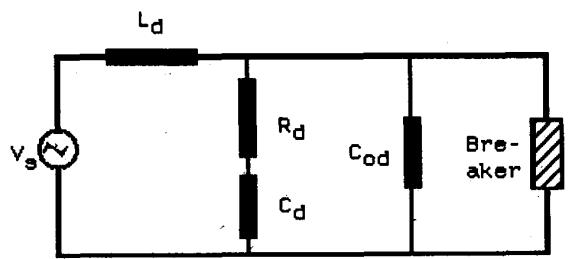
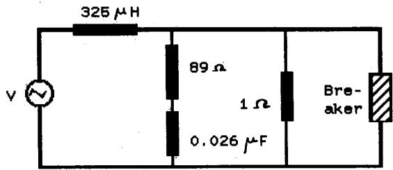
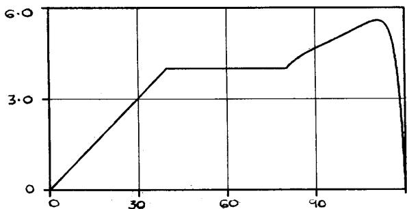
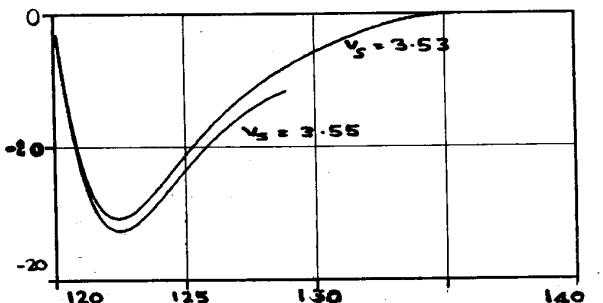
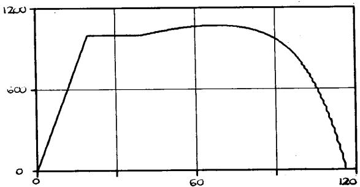
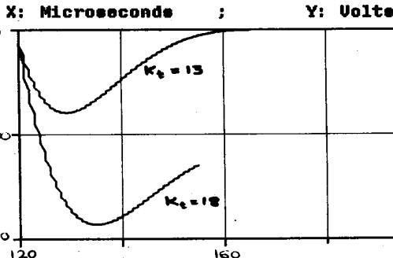
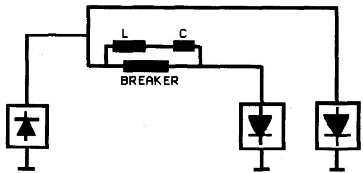
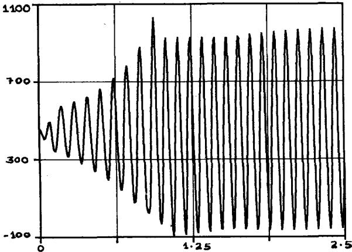
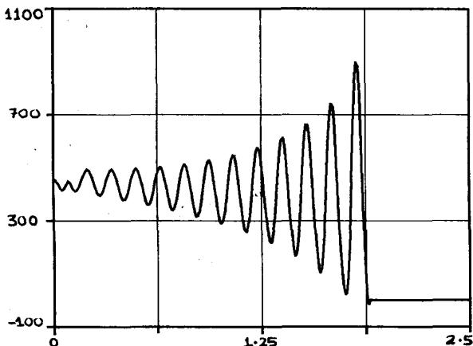
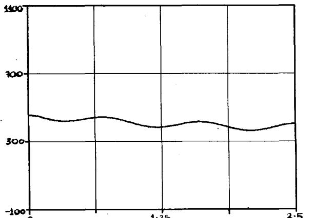

# MODELLING OF CIRCUIT BREAKERS IN THE ELECTROMAGNETIC TRANSIENTS PROGRAM

V. PHANIRAJ

A.G.PHADKE

Student Member, IEEE

Fellow, IEEE

Virginia Polytechnic Institute and State University

ABSTRACT - The recent publication of experimental and theoretical results from verified arc models has made possible the implementation and testing of a dynamic circuit breaker model in the Electromagnetic Transients Program (EMTP). An estimator was developed to obtain model parameters from test data. Results from this are given, and it's data requirements specified. To illustrate an application of the model not previously possible with the existing capabilities of EMTP, simulations of load current interruption in a multi-terminal HVDC system were performed. Results from these are included, along with a discussion of the effects of system and model parameter variation on the interruption process.

# INTRODUCTION

The Electromagnetic Transients Program (EMTP) is an extensively used tool for the analysis and simulation of power system transients [1,2]. It contains a large number of independent modules, each modelling a different component such as a transformer, a synchronous machine or a transmission line. Inductances and capacitances are represented by an equivalent circuit consisting of resistances in parallel with current sources. These equivalent circuits are obtained by the application of the trapezoidal rule of integration [1]. Through this transformation, the nodal admittance matrix [Y] becomes real and symmetric, and the differential equations for capacitances and inductances become algebraic equations. Thus the governing equation of the system is:

$$
[ Y ]. \bar {e} (t) = \bar {i} (t) - [ I ] \tag {1}
$$

where $\overline{e}(t)$ and $\overline{i}(t)$ are column vectors of the node voltages and injected currents, and [I] is the known vector of equivalent current sources representing the system history. Eq. (1) is to be solved repeatedly as the simulation progresses, and therefore in order to enhance the program speed, the [Y] matrix is factored and stored in the L-U form. This technique requires that the [Y] matrix remain constant, making it difficult to simulate switches, saturable devices and elements whose impedance is time-varying, such as circuit breakers. The effect of switching operations however can be pre-computed and the resulting modifications made directly to the L-U factors.

This paper was sponsored by the IEEE Power Engineering Society for presentation at the IEEE Power Industry Computer Application Conference, Montreal, Canada, May 18-21, 1987. Manuscript was published in the 1987 PICA Conference Record.

Since a large proportion of all power system transients are initiated by circuit breaker operations, the need to represent breakers accurately in EMTP has long been recognized [3]. Until now, the approximations used for modelling circuit breakers included voltage or current controlled switches, and predetermined time-dependent or nonlinear resistances. These are adequate for cases such as Transient Recovery Voltage (TRV) calculation, but are not suitable for many other applications. In particular, phenomena such as thermal and dielectric failure cannot be modelled. A more realistic model would perform these and other functions, and find application in the following types of studies:

Circuit Breaker Testing: With the increase in short-circuit capacity of power systems and the consequent rise in interrupting capabilities, direct testing of breakers is becoming more difficult because of the high short-circuit capacity test source requirement. Though synthetic testing is commonly used, an accurate EMTP model could be used to simulate a direct test, and supplement the synthetic tests.

Interruption of Small Inductive Currents : This situation, which arises often in transformer and reactor switching, may lead to current chopping and multiple restrikes which in turn cause dangerous overvoltages. The model could be used to identify such problems, and determine the nature of corrective action, such as the ratings of a surge arrester to be connected.

The need for a better model having been established, the next task was to choose appropriate models to fulfill the requirements. The main criteria used for selection were :

1. Availability of Model Parameters and Test Results.   
2. Numerical Simplicity and Robustness.   
3. Range of Applications.

Based on these factors, three models were chosen, and these are discussed in the next section.

# ARC MODELS

The three models chosen for implementation were, (1) the modified Mayr or Avdonin model [4]; (2) the Urbanek model [4]; and (3) the Kopplin model [5].

Avdonin Model :

The Avdonin model equation is :

$$
\frac {d r}{d t} = \frac {r ^ {1 - \alpha}}{A} - v. i. \frac {r ^ {1 - \alpha - \beta}}{A . B} \tag {2}
$$

where $\mathbf{v}, \mathbf{i}$ and $\mathbf{r}$ are the arc voltage, current and resistance respectively, and and $A, B, \alpha$ and $\beta$ are the breaker model parameters. This model is a derivative of the Mayr model with the time constant $\theta$ replaced by $A.r^{\alpha}$ and the power constant $P$ replaced by $Br^{\beta}$ . This model has been tested at Hydro-Quebec, and published results are available [4] for validation of the EMTP simulations. The model is capable of representing arc interruption and thermal failure, and has been used for modelling current chopping. It cannot simulate dielectric breakdown or multiple restrikes, but has the advantages of being computationally simple and robust.

# Urbanek Model:

This model can be described by the differential equation

$$
\frac {d g}{d t} = \frac {1}{\theta} \left(\frac {v i}{V ^ {2}} - g - \frac {P}{V ^ {2}} \left(1 - \left(\frac {v}{\zeta}\right) ^ {2} - \frac {2 0 v}{\zeta^ {2}} \cdot \frac {d v}{d t}\right)\right) \tag {3}
$$

where $\mathbf{g}$ is the arc conductance, $\mathbf{V}$ the arc voltage for large currents, $\zeta$ the breakdown voltage of the cold arc channel and the other variables are as defined previously. This model is the most complex of the three, and can represent arc interruption and both thermal and dielectric failure. In addition to these, it can model current chopping and re-ignition. An estimation program to determine the model parameters has been written [6], and test results are available [4].

# Kopplin Model :

This equation, which was used in EMTP to model generator circuit breakers is described by:

$$
\frac {d g}{d t} = \frac {g}{\tau (g)} \left(\frac {v . i}{P (g)} - 1\right) \tag {4}
$$

where $\tau(g) = k_{t}$ , $(g + 0.0005)^{0.25}$ and $P(g) = k_{p}$ . $(g + 0.0005)^{0.6}$ , $k_{p}$ and $k_{t}$ being model parameters. This model is also derived from the Mayr model, and can be used with larger time-steps than the Avdonin or Urbanek models. It simulates thermal breakdown, and test results are available [5]. The next section describes the incorporation of these arc equations into a complete model for a circuit breaker.

# MODEL IMPLEMENTATION AND TESTING

# Implementation

The arc equations described above can be used only during a short interval commencing about 100 microseconds before the current zero, while the overall interruption process may take a few periods at fundamental frequency. Therefore a complete model had to be developed, of which the arc model would be a crucial component.

The first major change in breaker status during opening occurs when the contacts part, when the arc voltage starts to build up and the arc resistance increases. It is known from experimental evidence that the arc voltage rises until a certain value, and then remains steady until just before the current zero, at a value that depends on the interrupting medium used. Therefore, in EMTP, the initial stages of the opening are modelled by a constant arc voltage until the inception of the arc instability period, with the voltage determined by any of the equations described previously. This procedure is fairly realistic, and provides suitable initial values for the arc equations and minimizes the numerical problems due to a sudden voltage change.

The breaker is interfaced to EMTP as a nonlinear component by the compensation method [3], using a three

stage procedure. At first, the nonlinear element is open-circuited and the response of the network calculated, specifically the open-circuit voltage $V_{oc}$ and the Thevenin impedance $Z_{\text{thev}}$ . If the nonlinearity can be characterized by the equation:

$$
V _ {n} = f \left(I _ {n}\right) \tag {5}
$$

then the actual value of $I_{n}$ can be evaluated from

$$
V _ {o c} - Z _ {t h e v}. I _ {n} = f (I _ {n}) \tag {6}
$$

where for multiple nonlinearities, $V_{oc}$ and $I_{n}$ are column vectors and $Z_{thev}$ an impedance matrix. Having calculated $I_{n}$ , usually by an iterative procedure, the final network solution is obtained by superimposing the response due to $I_{n}$ upon the open-circuit response.

The use of this method constrains the types of networks that can be simulated, chiefly in that two nonlinear elements cannot be electrically adjacent. This restriction can be overcome by the use of stub lines, with short travel times, but this artifice complicates and distorts the system modelling. It could be removed by solving all nonlinear equations of the form of (6) simultaneously, but this would be computationally difficult, and would require the interfacing of all modules that use the compensation method (such as synchronous machines and circuit breakers) in a common segment of the program. EMTP is not structured to allow this at present, and the breaker model interface developed here cannot be connected directly to other nonlinear elements.

The iterative procedure used to solve Eq. (6) is of the predictor-corrector form. Since near an a.c current zero the current decreases practically linearly, this slope can be used to provide an initial guess for the current at the next time-step. The slope is evaluated by a recursive moving-average equation, and is continuously updated. The first guess therefore is:

$$
I (t + \Delta t) = I (t) + \Delta t. \frac {d I}{d t} \tag {7}
$$

and the initial arc voltage estimate is

$$
V (t + \Delta t) = I (t + \Delta t). r (t) \tag {8}
$$

The rate of change of resistance $(dr/dt)_{1}$ can be found from the appropriate arc equation, and therefore an estimate made of the arc resistance by the trapezoidal rule

$$
r (t + \Delta t) = r (t) + 0. 5 \left(\frac {d r}{d t} _ {1} + \frac {d r}{d t} _ {0}\right) \Delta t \tag {9}
$$

where $(dr/dt)_0$ is the rate of change saved from the previous time-step. The estimate for the current is then corrected by the equation

$$
I (t + \Delta t) = \frac {V _ {o c}}{Z _ {\text {t h e v}} + r (t + \Delta t)} \tag {10}
$$

and a convergence check made by comparing the two arc voltage estimates

$$
V _ {1} = V _ {o c} - Z _ {t h e v}. I (t + \Delta t) \tag {11}
$$

and

$$
V _ {2} = r (t + \Delta t) . I (t + \Delta t) \tag {12}
$$

If they agree to within a specified tolerance, the iteration is over, otherwise the process returns to Eq. (8) with an updated estimate for the current from Eq. (10). It was found that 3 or 4 iterations were generally sufficient, and convergence problems were rare.

Once the arc resistance and current have been determined, the routine is ready to return them to the main program for processing. The last stage is to evaluate the breaker status for the next time-step, which is necessary only in the arcing regime. There are three possibilities: (1) The interruption succeeded; (2) that it failed; or (3) there was no change and the arc calculations should be continued. A decision is made by the following criteria, and the appropriate flag set for future use. The criterion for declaring the interruption to be a success is that either the arc resistance should exceed $10^{10}\Omega$ or that the rate of change of resistance should be greater than $10^{18}\Omega$ /second. In real interruptions, when failure occurs, the arc resistance becomes zero, but in a numerical simulation it usually overshoots and becomes negative. This would cause computational difficulties in EMTP, and therefore the interruption is deemed to have failed when the rate of change of resistance starts to decrease. This hypothesis was tested by conducting many simulations, and in no case was the interruption successful after a decrease in the rate of change of arc resistance following the current zero.

# Testing

Two basic test circuits were used, Circuit 1 for the Avdonin and Urbanek models and Circuit 2 for the Kopplin model. These circuits and the results from tests thereof are taken from [4] and [5] respectively, and are shown in Figures 1 and 2. The component values for Circuit 1 are given in Table 1 and the arc model parameters in Table 2.

The testing in Circuit 1 is conducted by variation of the supply voltage $V_{s}$ . The voltage is raised until at some value $V_{d}$ the interruption succeeds, while at a value of $V_{s}$ equal to $1.01 \times V_{d}$ it fails. This value of the voltage $V_{d}$ is called the interruption limit and it's value is used to compare the EMTP simulations and the benchmark results from [4]. The comparison is shown in Table 3, with $V_{d}$ expressed on a per unit basis, with 1.0 p.u representing $106.14\mathrm{kV}$ peak. As can be seen from Table 3, there is excellent agreement between the two methods, despite the more sophisticated methods used in [4] which were not feasible in EMTP due to the various constraints discussed previously. Graphical results from these simulations are given in Figures 3 and 4.

The Kopplin breaker was tested in Circuit 2 by variation of the parameter $K_{t}$ with $K_{p} = 4 \mathrm{MW}$ , and the supply voltage equal to $29.4 \mathrm{kV}$ peak. $K_{t}$ is varied between 13 and 18 microseconds. The result of the test is determined by observing the post-arc current, and are shown in Table 4 along with the reference case results from [5]. Figures 5 and 6 show the post-arc current and arc voltage respectively for the Kopplin breaker.

<table><tr><td>Circ.</td><td>Rd ohme</td><td>Ld mH</td><td>Cd microF</td><td>Cod nanoF</td></tr><tr><td>A</td><td>57.38</td><td>6.90</td><td>1.055</td><td>0.0</td></tr><tr><td>B</td><td>60.34</td><td>6.90</td><td>1.037</td><td>22.56</td></tr><tr><td>C</td><td>62.77</td><td>6.90</td><td>1.029</td><td>44.26</td></tr></table>

  
Figure 1: Test Circuit 1

TABLE 1: Circuit 1 Component Values   
TABLE 2: ARC MODEL PARAMETERS   

<table><tr><td colspan="4">AUDONIN</td><td>URBANEK</td></tr><tr><td></td><td>AIR</td><td>OIL</td><td>SF6</td><td rowspan="5">P = 3.0E4V = 8000,θ = 2. E-6= 45. E4</td></tr><tr><td>A</td><td>6. E-6</td><td>6. E-6</td><td>1. 3E-6</td></tr><tr><td>B</td><td>1. 6E7</td><td>1. 0E8</td><td>1. 0E6</td></tr><tr><td>α</td><td>-0.20</td><td>-0.15</td><td>-0.15</td></tr><tr><td>β</td><td>-0.50</td><td>-0.60</td><td>-0.28</td></tr></table>

TABLE 3: Comparison of Benchmark ( Reference 4 ) and EMTP Results   

<table><tr><td rowspan="2">Model Circuit</td><td colspan="6">AVDONIN</td><td colspan="2">URBANEK</td></tr><tr><td colspan="2">AIR</td><td colspan="2">OIL</td><td colspan="2">SF6</td><td rowspan="2" colspan="2">BENCH. EMTP</td></tr><tr><td rowspan="2">1-A</td><td>BENCH, EMTP</td><td colspan="2">BENCH, EMTP</td><td colspan="3">BENCH, EMTP</td></tr><tr><td>3.55</td><td>3.54</td><td>5.04</td><td>5.04</td><td>5.52</td><td>5.45</td><td>2.79</td><td>2.78</td></tr><tr><td>1-B</td><td>3.82</td><td>3.83</td><td>5.27</td><td>5.29</td><td>7.35</td><td>7.16</td><td>3.24</td><td>3.10</td></tr><tr><td>1-C</td><td>4.14</td><td>4.14</td><td>5.59</td><td>5.61</td><td>8.70</td><td>8.57</td><td>3.61</td><td>3.50</td></tr></table>

  
Figure 2: Test Circuit 2

  
Figure 3: Avdonin Model Arc Voltage   
X: Time in microseconds.

  
Y: Voltage in Kilovolts.   
Figure 4: Avdonin Model Post-Arc Current   
X: Time in Microseconds.   
Y: Current in Ampere.

TABLE 4: KOPPLIN MODEL RESULTS   

<table><tr><td>Kt microsec.</td><td>Reference [15]</td><td>EMTP</td></tr><tr><td>13</td><td>SUCCEED</td><td>SUCCEED</td></tr><tr><td>15</td><td>SUCCEED</td><td>SUCCEED</td></tr><tr><td>17</td><td>SUCCEED</td><td>SUCCEED</td></tr><tr><td>18</td><td>FAILURE</td><td>FAILURE</td></tr></table>

# MODEL PARAMETER ESTIMATION

As mentioned previously, one of the chief problems faced during the implementation was the lack of standard data for arc model parameters and field test results. Therefore in order to render the EMTP model more useful, it was necessary to develop an auxiliary routine to estimate the parameters from user-supplied test results on a given circuit breaker. The estimator developed was for the Avdonin model. Since the steady arc voltage prior to arc instability can be determined directly by inspection of the test waveforms, the aim was to estimate the remaining constants A, B, $\alpha$ and $\beta$ .

  
Figure 5: Kopplin Model Arc Voltage

  
Figure 6: Kopplin Model Post-Arc Current   
X: Microseconde Y: Amperes

The input is assumed to consist of $\mathbf{N}$ regular samples of the arc voltage and current, at known instants of time. These are transformed to values of arc resistance, and used as input to a least-squares curve fitting routine which produces the best polynomial $\mathbf{r}(t)$ fitting the points supplied. $\mathbf{r}(t)$ is analytically differentiated and a set of values for $\dot{r}(t)$ , the derivative obtained. From the Avdonin equation, given a parameter vector $\mathbf{X} = (A, B, \alpha, \beta)^t$ the derivative $\dot{R}(t,X)$ can also be computed. The estimation problem then reduces to that of choosing $\mathbf{X}$ such that $\dot{r}(t)$ and $\dot{R}(t,X)$ are as close as possible. This is solved by an iterative nonlinear least-squares estimator.

If $\Delta Y$ is the vector of differences between $\dot{r}(t)$ and $\dot{R}(t,X)$ , the correction to the iterate $X$ is given by

$$
\Delta X = \left[ H ^ {t} H \right] ^ {- 1} [ H ] ^ {t}. \Delta Y \tag {13}
$$

where $\mathbf{H}$ is the Jacobian matrix, consisting of the partial derivatives of $\dot{R}(t,X)$ with respect to A, B, $\alpha$ and $\beta$ , and has 4 rows and N columns. The new estimate $X' = X + \Delta X$ is used to update $\Delta Y$ . If the norm of $\Delta Y$ is sufficiently small, the iteration has converged; otherwise $\Delta X$ is recalculated and further iterations made.

The choice of data samples hinges on two factors: the number of samples and the sampling instants. Based on many trials, the minimum number of samples was found to be about 10, while using more than 40 points resulted in no significant improvement in the estimate. All results in this section are based therefore upon $\mathrm{N} = 30$ , at a spacing of half a microsecond. If the samples start much before the current zero, the rate of change of resistance is very small and hence accuracy is lost in computing $\mathbf{r}(t)$ and it's derivative. On the other hand, if the samples are all from the post current-zero period, $\mathbf{r}(t)$ and $\dot{\boldsymbol{r}} (t)$ are extremely large and numerical overflow problems arise both in fitting $\mathbf{r}(t)$ and calculating the inverse of $(H^{\prime},H)$ . After repeated trials it was found that the samples should be taken from a period of $20~\mu s$ before and $20~\mu s$ after the current zero, for a total maximum sample span of $40~\mu s$ during which the arc equation is valid.

In the absence of field test data, the output from EMTP simulations was used as input to the estimator in an attempt to recreate the original parameters. To validate the estimation, the interruption limits for both sets of parameters were evaluated from EMTP runs and these are listed in Table 5. Estimates were made for all three models ; in the case of the Urbanek and Kopplin models, the original interruption limits are compared with those obtained from simulations using the equivalent Avdonin model parameters. These parameters are estimated by using the Kopplin or Urbanek model outputs as input to the estimator. It can be seen that there is good agreement between the various limits and the original values.

TABLE 5: Model Parameter Estimation Results   

<table><tr><td>Type
Model</td><td colspan="2">MODEL PARAMETERS
Original Estimated</td><td colspan="2">INTERRUPTION
LIMIT
Orig. Est.</td></tr><tr><td rowspan="4">AVDONIN</td><td>A 6.E-6</td><td>6.04E-6</td><td rowspan="4">3.55</td><td rowspan="4">3.69</td></tr><tr><td>B 1.6E7</td><td>2.098E7</td></tr><tr><td>α -0.20</td><td>-0.1953</td></tr><tr><td>β -0.50</td><td>-0.5255</td></tr><tr><td rowspan="4">URBANEK</td><td>P 30.E3</td><td>A 2.87E-5</td><td rowspan="4">2.78</td><td rowspan="4">2.56</td></tr><tr><td>V 8000,</td><td>B 1.045E7</td></tr><tr><td>θ 45.E4</td><td>α -0.085</td></tr><tr><td>V 2.E-6</td><td>β -0.5679</td></tr><tr><td rowspan="4">KOPPLIN</td><td>Kp 4.E6</td><td>A 1.51E-6</td><td>34.5</td><td>35.5</td></tr><tr><td>Kt 15.E-6</td><td>B 4.043E6</td><td>kV</td><td>kV</td></tr><tr><td></td><td>α -0.253</td><td></td><td></td></tr><tr><td></td><td>β -0.514</td><td></td><td></td></tr></table>

The estimation routine was found to be extremely sensitive to measurement noise; a noise amplitude of $1\%$ being sufficient to distort the estimates significantly, or in some cases cause a failure to converge at all. This can be remedied, as discussed later.

# FUTURE RESEARCH AND APPLICATIONS

There are several areas in which refinements can be made to the model and algorithm; some of these are described here.

1. Since test cases involving dielectric strike and chopping are not available, simulation of these phenomena has not been attempted. In particular, dielectric strike presents some interesting problems, mainly convergence-related or of a computational nature. Tests of these are planned using the Urbanek model, and field verification will be attempted later this year in a case involving reactor switching. Other related issues include the modelling of multiple resistance switching, in order to damp the TRV, and investigation of the missing current zeroes in faults close to a synchronous machine.   
2. In the area of algorithm improvement the main focus is on increasing the minimum step-size that must be used for accurate simulations. At present this is about $0.2\mu s$ for the Avdonin model; a value of about $1\mu s$ would be desirable. Though convergence problems have not been encountered yet, the possibility of these occurring increases while simulating cases of restrike or chopping.

3. Since measurement noise adversely affects the estimation algorithm, the data will have to be processed before using the estimator. Some smoothing and filtering may be necessary in the pre-processing stage. The routine itself has to be added to the EMTP, and more rigorously tested.

# Application to HVDC Breaker Simulation

This example was chosen to illustrate the use of the new model in a situation which could not previously be simulated by EMTP. The principle of operation of the DC breaker simulated here consists of inducing an oscillation between the negative V-I characteristics of the arc and a parallel L-C circuit, after the parting of the contacts. Depending on the system and breaker properties, the oscillations may increase in amplitude and induce an arc current zero, leading to the interruption of the DC current.

Figure 7 shows the test system used, a multi-terminal HVDC system taken from [7]. The simulation was performed using the UBC (University of British Columbia) version of EMTP, which is much smaller and simpler to use. The Kopplin model was used, since it's longer time constant makes it suitable for lengthy simulations. It is also similar to, though less complex than, the model used in [8] for the same purpose. All cases described here correspond to the interruption of the rated load current of $450\mathrm{A}$ . The effects of varying L, C, $K_{t}$ and $K_{p}$ and the line inductance were studied.

It was found that there is a minimum shunt capacitance required to sustain the oscillation, and both a minimum and a maximum shunt inductance. The smaller the inductance, the larger the capacitance required to cause the current zero. The effect of $K_{t}$ is inversely related to the interruption level; smaller the $K_{t}$ , the higher the current that can be interrupted. As is to be expected intuitively, the power constant $K_{p}$ and the current interruption level are in direct relation to one another.

  
Figure 7: Test HUDC System

Due to space constraints only a few cases are shown here. Figure 8 shows the current with $\mathrm{L} = 0.25\mathrm{mH}$ and $\mathrm{C} = 1.0\mu \mathrm{F}$ . A current zero is induced, very quickly, and the breaker cannot interrupt the current due to thermal failure. When the inductance is raised to $0.5\mathrm{mH}$ interruption occurs successfully, as shown in Figure 9. Figure 10 shows the effect of a much larger inductance, when no current zero is induced at all, with $\mathrm{L} = 20.0\mathrm{mH}$ . The results are very similar to those in [8], when the effect of the simple arc model used here is considered, and also to the experimental results reported in [9]. For example, the frequency of oscillations in Figure 9 is about $8000\mathrm{Hz}$ , while the frequency in Figure 9 of [8] is about $7800\mathrm{Hz}$ . Work is cur

rently in progress to implement the more detailed model from [8] in EMTP to provide a more accurate tool for such simulations.

  
Figure 8: HUDC Breaker Current - Case 1

X: Time in milliseconds.

Y: Current in ampere.

  
Figure 9: HUDC Breaker Current - Case 2

X: Time in milliseconds.

Y: Current in ampere.

  
Figure 10: HVDC Breaker Current - Case 3

X: Time in milliseconds

Y: Current in amperes.

# CONCLUSIONS

1. An accurate and realistic circuit breaker model with a choice of three dynamic arc equations has been incorporated in EMTP. It was tested against previously published results, and performed very well.   
2. EMTP now has the capability to simulate phenomena such as thermal and dielectric failure, current chopping and interruption.   
3. Default values for the arc model parameters are provided to overcome the difficulty in obtaining input data. An estimation program has been written and tested, which evaluates these parameters from user-supplied test data.

# Acknowledgements

This research, forming part of the M.S thesis of V.Phaniraj at Virginia Polytechnic Institute, was supported by the EMTP Development Co-ordination Group and the Electric Power Research Institute (EPRI/DCG).

# REFERENCES

1. H.W. Dommel, "Digital Computer Solution of Electromagnetic Transients in Single- and Multiphase Networks"; IEEE Transactions on Power Apparatus and Systems, April 1969, pp. 388-399.   
2. A.G. Phadke (organizer), "Digital Simulation of Electrical Transient Phenomena"; IEEE Tutorial Course, 1980.   
3. H.W. Dommel, "Nonlinear and Time-Varying Elements in Digital Simulation of Electromagnetic Transients"; IEEE Transactions on Power Apparatus and Systems, November/December 1971, pp. 2561-2567.   
4. G. St-Jean, R.F. Wang, "Equivalence between Direct and Synthetic Interruption Tests on High Voltage Circuit Breakers"; IEEE Transactions on Power Apparatus and Systems, July/August 1983, pp. 2216-2223.   
5. E. Thuries, P. Van Doan, J.Dayet, and B. Joyeux-Bouillon, "Synthetic Testing Method for Generator Circuit Breakers"; IEEE Transactions on Power Delivery, January 1986, pp. 179-184.   
6. L. Blahous, "Derivation of Circuit Breaker Parameters by Means of Gaussian Approximation"; IEEE Transactions on Power Apparatus and Systems, December 1982, pp. 4611-4616.   
7. W.F. Long, “A Study of some Switching Aspects of a Double Circuit HVDC Transmission Line”; IEEE Transactions on Power Apparatus and Systems, March/April 1973, pp. 734-741.   
8. K. Ragaller, A. Plessl, W. Hermann, and W. Egli, "Calculation Methods for the Arc Quenching System of Gas Circuit Breakers"; CIGRE Paper No. 13-03, Paris, 1984.

9. B. Bachmann, G. Mauthe, E. Ruoss, H.P. Lips, J. Porter, and J. Vithayathil, "Development of a $500\mathrm{kV}$ Airblast HVDC Circuit Breaker"; IEEE Transactions on Power Apparatus and Systems, September 1985, pp. 2460-2466.

# INFORMATION FOR AUTHORS

In January 1986 IEEE TRANSACTIONS ON POWER APPARATUS AND SYSTEMS was replaced with three new TRANSACTIONS which are sponsored by the Power Engineering Society. The new publications will continue to be devoted to all aspects of electric power generation, transmission, distribution, and utilization. Original contributions of lasting value to the profession are sought for publication in the appropriate TRANSACTIONS according to the subject matter as follows.

IEEE TRANSACTIONS ON ENERGY CONVERSION: Research, development, design, application, construction, installation and operation of electric power generating facilities (along with their conventional, nuclear, or renewable sources) for the safe, reliable and economic generation, conversion and control of electrical energy for general industrial, commercial, public and domestic consumption.

IEEE TRANSACTIONS ON POWER DELIVERY: Research, development, design, application, construction, installation and operation of apparatus, equipment, structures, materials and systems for the safe, reliable and economic delivery and control of electrical energy for general industrial, commercial, public and domestic consumption.

IEEE TRANSACTIONS ON POWER SYSTEMS: Requirements, planning, analysis, reliability, operation and economics electrical generating, transmission and distribution systems for general industrial, commercial, public and domestic consumption.

In general, papers are preprinted and presented at a technical meeting of the Institute before being published in the appropriate Transactions; discussions by qualified specialists are sought and published along with a closure by the author. All contributions are reviewed by an appropriate technical committee of the IEEE Power Engineering Society as listed on the inside back cover.

Following review, a decision is made as to publication. All papers accepted for publication will be published in full in one of the TRANSACTIONS and a one page summary will be published in the IEEE POWER ENGINEERING REVIEW. COPYRIGHT: It is the policy of the IEEE to own the copyright to the technical contributions it publishes on behalf of the interests of the IEEE, its authors, and their employers, and to facilitate the appropriate reuse of this material by others. To comply with the U.S. Copyright Law, authors are required to sign an IEEE copyright form before publication. This form, returns to authors and their employers full rights to reuse their material for their own purposes. Authors must submit a signed copy of this form with their manuscripts.

The original manuscript, typed on IEEE mats in accordance with the IEEE Power Engineering Society Publication Guide for Power Engineers, November 1986, should be sent for review processing to the following address.

IEEE Headquarters

Society Special Services

345 East 47 Street

New York, NY 10017

IEEE Power Engineering Society Publication Guide for Power Engineers, November 1986, available on request from the Society Special Services Department, at the above address, provides a guide to approved style and usage. Detailed instructions, copyright forms, and standard mats for the preparation and handling of manuscripts can be obtained from the IEEE PES Special Activities. Manuscripts should be limited to seven pages including illustrations. Other editorial correspondence should be directed to the Editor.

Harold Gold

1037 North Primrose

Rialto, CA 92376