# Wave Function and Multiscale Modeling of MMC-HVdc System for Wide-Frequency Transient Simulation

Hua Ye , Member, IEEE, Feng Gao , Member, IEEE, Wei Pei , Member, IEEE, and Li Kong, Member, IEEE

Abstract— The detailed modeling of power electronic (PE) devices poses challenging problems to an efficient transient simulation of large-scale PE-dominated power systems. As PE paradigm, a multiscale modeling methodology of the modular multilevel converter (MMC) for simulating diverse transients from low-frequency oscillations up to high-frequency switching events in an MMC high-voltage direct current (HVdc) system is developed, implemented, and validated. The novelty lies in the creation of a wave propagation function (WPF) that describes the MMC submodule (SM) transient behavior, and then, the SM Fourier series-based shifted-frequency phasor (SFP) is developed to accelerate the computation speed of the system-level dynamics. These efforts serve as the basis for multiscale modeling of the MMC where a multiple-frequency shifting is achieved. By implementing a seamless model interface with the control systems, the multiscale modeling is applicable to an MMC-HVdc transmission system. The multiscale model is validated through case studies that cover dc fault, MMC internal fault, power oscillations, and wind power fluctuations. The computational accuracy and efficiency of the model are verified through a comparison of the results with those from the full electromagnetic transient (EMT) model.

Index Terms— Analytic signal, dynamic phasor (DP), electromagnetic transients (EMTs), high-voltage direct current (HVdc), modular multilevel converter (MMC), multiscale modeling, power system modeling, power system simulation, wave propagation.

# I. INTRODUCTION

M ODERN electric power systems are characterized bythe increasing penetration of power electronic (PE) theincreasing penetration of power electronic (PE) devices due to applications of the PE-interfaced wind and photovoltaic power integrations, flexible alternating current transmission system (FACTS), and high-voltage direct current (HVdc) system installations [1]. With more prominent PE advancements, the modular multilevel converter (MMC)

Manuscript received July 12, 2020; revised September 22, 2020 and December 4, 2020; accepted December 28, 2020. Date of publication January 21, 2021; date of current version October 1, 2021. This work was supported in part by the National Natural Science Foundation of China under Grant 51707183 and in part by the Key Front Science Project of the Chinese Academy of Sciences under Grant QYZDY-SSW-JSC025. Recommended for publication by Associate Editor Lennart Harnefors. (Corresponding author: Feng Gao.)

Hua Ye, Wei Pei, and Li Kong are with the Institute of Electrical Engineering, Chinese Academy of Sciences, Beijing 100190, China, and also with the School of Electronic, Electrical and Communication Engineering, University of Chinese Academy of Sciences, Beijing 100049, China (e-mail: yehua@mail.iee.ac.cn; peiwei@mail.iee.ac.cn; kongli@mail.iee.ac.cn).

Feng Gao is with the Energy Internet Research Institute, Tsinghua University, Beijing 100084, China (e-mail: fgao@tsinghua.edu.cn).

Color versions of one or more figures in this article are available at https://doi.org/10.1109/JESTPE.2021.3051647.

Digital Object Identifier 10.1109/JESTPE.2021.3051647

is widely investigated and employed in realistic voltagesource converter-based HVdc projects [2], [3], for example, the Zhangbei 500-kV four-terminal MMC-HVdc grid in China [3]. Practically, any MMC-HVdc system requires rigorous and efficient modeling for electromagnetic/electromechanical transient studies to guarantee its secure and stable operations [4]. The electromagnetic transients (EMTs) are fast, with time scales from microseconds to several seconds, and are caused by, for example, PE switching, short-circuits. On the other hand, the electromechanical transients are caused, for example, by system-level instability problems, whose time scales are from seconds to several minutes. The well-known quasi-steady-state models [5]– [8] for electromechanical transient studies do not track PE fast-changing snapshots, inherently limited for the usage in modeling MMC-HVdc systems. This is because, as affected by high-frequency PE switching events, power system-level dynamic studies, such as stability analysis, are currently extended to a broader range of frequencies to the EMTs [9], i.e., to cover multiple time-scale transients with a wide frequency range.

The EMT program (EMTP) type modeling methodology is respected for its accurate representation of high-frequency transients and is applied in establishing MMC EMT models. The MMC submodule (SM) device-level model in [10], for example, describes electronic circuit physical phenomenon, while the MMC SM switching-function model (SFM) was presented in [11] to study the PE switching events. These models use small time-step sizes in the order of microseconds or even nanoseconds. To accelerate the EMT simulation, the detailed equivalent model (DEM) based on binary resistors was developed in [12] where individual SMs on one arm are assembled. The DEM is still inefficient in terms of computational speed for representing an MMC with a large number of SMs due to the time-varying equivalence [13]. The averagedvalue models (AVMs) were addressed to track fundamental frequency dynamics [14], [15], but they neglect the switching transients of individual SMs. Therefore, when considering internal SM behavior and giving an efficient representation of large-scale HVdc system, the MMC-HVdc system-level EMT speed-up simulation, i.e., multiscale transient simulation, needs to be supported by further research.

To modulate wide-frequency transients aiming at high accuracy and efficiency within the same simulation run, the frequency shifting modeling methodology was proposed in [16] and [17]. In the EMTP solution environment, the

shifted-frequency analysis (SFA) [17] was addressed to perform long-term dynamics and large-scale studies. The adaptive frequency shifting of Fourier spectra of the transients during the simulation is achieved in [16], which is referred to as the frequency-adaptive simulation of transients (FAST). The FAST-based multiscale transient models were developed in [18] and [19] for wide-frequency alternating current (ac) components, such as frequency-dependent transmission lines. However, the frequency-shifting methods above focus on fundamental frequency ac power systems, and thus, multiscale transient modeling of PE-dominated power systems, especially the MMC-HVdc system, is desirable.

In recent years, a lot of effort has been devoted to multiscale modeling of the PE-based devices, such as two-level VSC. In [20] and [21], the multiscale models of two-level VSC were implemented where the SFM and AVM are alternatively used to modulate the EMTs and electromechanical transients, respectively. It was found that the transitions between both models may lead to unpredicted numerical oscillations, not being directly applied in MMC multiscale modeling. To present a wider EMT frequency range, the shifted-frequency model of the MMC was addressed in [22], and even the extended-frequency MMC dynamic phasor (DP) model was proposed in [23] to contain full harmonic spectra for output quantities. The Fourier spectra of all MMC electrical quantities, including capacitor dc voltages, however, are shifted or transformed so that the simulation time-step size is limited in the order of microseconds. In addition, the MMC SMs are often considered to be identical, and the SM transients need to be performed, for example, internal SM faults. Therefore, the existing efforts still face challenging problems to modulate multiple time-scale transients of the MMC-HVdc system within one and the same simulation run.

The wide-frequency transient phenomena in PE-dominated power systems created a demand for more general models and more comprehensive studies. In the preliminary work [24], the describing function-based multiscale model for the lowvoltage cascaded H-bridge (CHB) converter was developed, but the function is still piecewise and the influence of dccircuit quantities on the modeling is not considered. This article provides the reader more generalized methodology. To overcome the above limitations, the contributions made in this article are summarized as follows.

1) A new wave propagation function (WPF) method is proposed so that individual PE SM switching transients can be efficiently modeled without a compromise of the simulation accuracy. By adjusting the WPF parameters, a unified MMC SM WPF is constructed in a flexible manner to cover different SM topologies and modulation strategies.   
2) The generalized WPF-based Fourier series is proposed to derive the shifted-frequency phasor (SFP) model, and the Fourier spectra of dc quantities are not shifted, resulting in a speed-up simulation of the MMC low-frequency transients.   
3) Multiple-frequency decoupling and shifting of different MMC quantities are achieved, and also, the seamless interface model of the HVdc with its controllers is

processed so that the multiscale wide-frequency transient model of an MMC-HVdc system is established.

4) The simulation accuracy and efficiency of the multiscale model are validated through case studies that cover dccircuit faults, internal MMC SM faults, and wind power fluctuations and are further verified by comparisons of the results with those from the EMTP-type simulators.

The rest of this article is organized as follows. Section II illustrates the problem of wide-frequency transient modeling in the MMC. By creating the WPF and Fourier series-based SFP, a multiscale model of the MMC is developed in Section III. Then, in Section IV, the MMC multiscale model is extended to the MMC-HVdc system. In Section V, case studies are performed, and conclusions are drawn in Section VI.

# II. PROBLEM ILLUSTRATION

An analytic signal s(t) can be formed by adding to real signal $s ( t )$ an imaginary part that is equal to the Hilbert transform of $s ( t ) \colon \underline { { s } } ( t ) = s ( t ) + \mathrm { j } \mathcal { H } [ s ( t ) ]$ [25]. The underscore denotes that the analytic signal is complex. The Fourier spectra of bandpass analytic signals can be shifted along the frequency axis by an angular frequency $\omega _ { s }$ [16] as

$$
\mathcal {S} [ \underline {{s}} (t) ] = \underline {{s}} (t) \mathrm {e} ^ {- \mathrm {j} \omega_ {s} t} \tag {1}
$$

where $\omega _ { s } = 2 \pi f _ { s }$ and $f _ { s }$ is referred to as the shift frequency. The physical interpretation of the analytic signals and frequency shifting is given in Fig. 1. As depicted in Fig. 1(a), the Fourier spectrum of the original bandpass analytic signal is concentrated on a narrow bandwidth around ac carrier frequency $\omega _ { \mathrm { c } } .$ . Then, as shown in Fig. 1(b), it is shifted to the origin by the shift frequency, i.e., $\omega _ { s } ~ = ~ \omega _ { \mathrm { c } }$ , so that the complex envelope can be obtained. The complex envelope is a low-pass signal whose maximum frequency is lower than that of the original signal. According to Shannon’s sampling theory, a larger time-step size can, thus, be used for tracking the envelope waveforms as that in electromechanical transient simulators. If the Fourier spectrum is not concentrated on a narrow bandwidth, i.e., $\mid \omega - \omega _ { \mathrm { c } } \mid > \omega _ { \mathrm { c } }$ , then $\omega _ { s }$ is set to zero, and a small time-step size is used to track natural waveforms as that in EMTP-type simulators.

Using the shift frequency, the methodology FAST in [16] was established and then applied for modeling the ac components in power systems. The corresponding details can be found in [16], [18], and [19]. However, the Fourier spectra of the quantities in PE-dominated power systems become more complex. During the MMC operation, not only the singlefrequency ac carrier but also multiple-frequency ac carriers exist, as depicted in Fig. 1(c). To facilitate the analysis, only one phase leg of the MMC topology is presented and may be divided into three parts, as shown in Fig. 1(d). The modeling challenges are discussed as follows.

1) Part 1 covers the ac system at the MMC ac side. Due to a large number of SMs per arm, ac-side quantities (for example, $\underline { { \upsilon } } _ { \mathrm { a c } p } )$ of the MMC under its normal operation mainly present quasi-periodic sinusoidal waveforms involved with high-frequency harmonics. When analyzing electromechanical transients, such as powerangle stability, the high-frequency harmonics of the ac

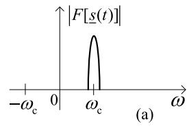

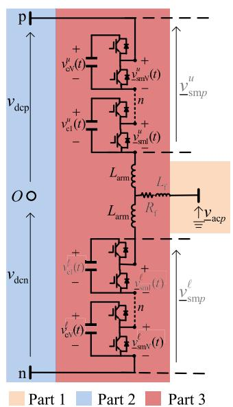  
（c）  
Fig. 1. Schematic of an MMC topology and the Fourier spectra of existing analytic signals. (a) Fourier spectrum of ac analytic signal. (b) Fourier spectrum of frequency-shifted signal. (c) Fourier spectrum of multiple-frequency analytic signal. (d) MMC topology.

system can be ignored, and then, the Fourier spectrum of the ac quantities is shown as that in Fig. 1(a) where only single-frequency carrier is present. If the highfrequency harmonics or EMT stability [9] is concerned, then the time-step size of microseconds is required for the simulation.

2) Part 2 is the dc system at the MMC dc side. By considering reactor effects at the dc side and dc voltage ripple ignorable, the Fourier spectrum of dc quantities, such as $ { \boldsymbol { v } } _ { \mathrm { d c p } }$ and $\upsilon _ { \mathrm { d c n } } .$ , is shown as that in Fig. 1(b), and no ac carrier is observed. The frequency components of dc quantities are around the origin, and the shifting of the Fourier spectra is not essential. In fact, however, the dc quantities contain not only dc and fundamental but also higher order harmonics. In this case, EMT simulation is often performed using the time-step size in the order of microseconds.   
3) Part 3 covers all SMs with IGBT/diode pairs, arm inductors, and also ac filters. The Fourier spectra of output quantities at the ac side of the SMs, such as ${ \underline { { \upsilon } } } _ { \mathrm { s m } n } ^ { u }$ and ${ \underline { { \upsilon } } } _ { \mathrm { s m } n } ^ { l } ,$ present multiple-frequency carriers at the dc, fundamental, and harmonic frequencies, as observed in Fig. 1(c). The maximum frequency of the baseband quantities at the harmonics is much higher than that only at the fundamental frequency. The Fourier spectra of such wide-frequency quantities can be shifted by the shift frequency along the frequency axis, but the maximum frequency contained is not reduced. In addition, the DP methods remove all the carriers separately and then increase the order and dimension of the dynamic equations to be resolved, resulting in a high computational burden.

To resolve the problems, novel multiscale modeling methods for the MMC as a typical PE device are developed in Sections III and IV.

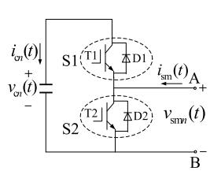  
(a)

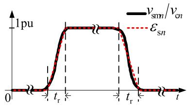

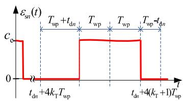  
(c)

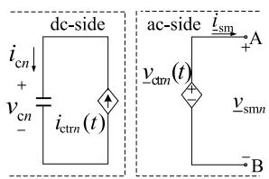  
(d)   
Fig. 2. Wave function-based equivalent modeling of the MMC SM. (a) Halfbridge SM. (b) Description of SM output voltage profile. (c) Waveform of SM switching events. (d) SM equivalent model.

# III. MULTISCALE MODELING OF THE MMC BASED ONWAVE FUNCTION AND FREQUENCY SHIFTING METHODS

The multiscale modeling of the MMC starts by modeling the SM switching events with a traveling wave function. The WPF-based detailed MMC arm model is derived in Section III-A; then, a frequency shifting modeling of the MMC arm is presented in Section III-B. These efforts lead to a multiscale transient model of the MMC in Section III-C.

# A. Wave Propagation Function-Based MMC SM Modeling

Not considering the idea of two-state switch described by the resistors $r _ { 0 n }$ and $r _ { 0 f f }$ [10], a new WPF method is proposed in this article to describe main states of the IGBT/diode pair as affected by its turn-on/off processes and conduction losses. For the purpose of illustration, the half-bridge topology of the SM depicted in Fig. 2(a) is adopted as a paradigm. When the switch S1 is turned on and S2 is turned off, or vice versa, the output voltage of the SM, i.e., $v _ { \mathrm { s m } n } ,$ can be illustrated with a wave shape profile, as shown in Fig. 2(b). By fitting the wave shape with the dashed line, only the rising front of the output voltage profile may be described in per unit by a ramp with rise time $t _ { \mathrm { r } }$ and a unit-step function σ (t) as

$$
e _ {s n} (t) = \left\{ \begin{array}{l l} \frac {t}{t _ {\mathrm {r}}} \sigma (t), & \text {i f} t \leq t _ {\mathrm {r}} \\ \sigma (t), & \text {i f} t > t _ {\mathrm {r}} \end{array} \right. \tag {2}
$$

where $t _ { \mathrm { r } }$ represents an effect of short IGBT/diode turn-on/off delays that depend on the diode reverse recovery process and also IGBT command commutation process, for example. Both processes need to consider the current direction, and for simplification of the analysis, $t _ { \mathrm { r } }$ is chosen about 1 $\mu \mathrm { s } ,$ , as mentioned in [26]. To describe the switching ON/OFF profile in Fig. 2(b), a WPF $\varepsilon _ { s n }$ is defined by scaling it with instantaneous voltage crossing the SM capacitor, i.e., $\upsilon _ { \mathrm { c } n }$ to produce

$$
v _ {\mathrm {s m} n} (t) = \varepsilon_ {s n} (t) v _ {\mathrm {c} n} (t) \tag {3}
$$

with

$$
\varepsilon_ {s n} (t) = c _ {\mathrm {e}} \sum_ {k = 1} ^ {K} (- 1) ^ {k - 1} e _ {s n} (t - (2 k - 1) T _ {\mathrm {w p}} (t)). \tag {4}
$$

For (4), the formulation of the WPF is elaborated upon in Appendix A [27] where $T _ { \mathrm { w p } } ( t )$ presents the time-varying duty ratio of the SM switching ON/OFF periods. By replacing t in (2) with $t - ( 2 k - 1 ) T _ { \mathrm { w p } } ( t )$ , and considering $k = 1 , \ldots , K$ as the integers, now, it is noted that $t _ { \mathrm { r } }$ and $t - ( 2 k - 1 ) T _ { \mathrm { w p } } ( t )$ are comparable; for example, $t _ { \mathrm { r } }$ can be compared with the time instants $t - T _ { \mathrm { w p } } ( t ) , t - 3 T _ { \mathrm { w p } } ( t )$ , and so on $( T _ { \mathrm { w p } } \neq 0 )$ . Moreover, the coefficient $c _ { \mathrm { e } }$ reflects the IGBT/diode voltage thresholds and effective resistive losses, and both of which depend on the current direction. If the ac-side current flowing out the SM is positive, then $c _ { \mathrm { e } } ~ < ~ 1$ , whereas, if the ac-side current flows into the SM, then $c _ { \mathrm { e } } ~ > ~ 1$ . It should, however, be noted that $c _ { \mathrm { e } }$ is close to 1. In a further step, individual switching ON/OFF instants of all SMs on the arm can be shifted with a time-varying variable $t _ { d n } ( t )$ , as depicted in Fig. 2(c). As a consequence, a general WPF describing the SM switching behavior can be expressed as

$$
\varepsilon_ {s n} (t) = c _ {\mathrm {e}} \sum_ {k = 1} ^ {K} (- 1) ^ {k - 1} e _ {s n} (t - (2 k - 1) T _ {\mathrm {w p}} (t) - t _ {d n} (t)). \tag {5}
$$

Remark 1: Using the WPF, the SM-level transients are modeled as a function of the variables $T _ { \mathrm { w p } } ( t )$ and $t _ { d n } ( t )$ . This means, by changing $T _ { \mathrm { w p } }$ and $t _ { d n } .$ , the switching ON/OFF transients of all SMs of the MMC can be described in a flexible manner. For example, the adjustment of $T _ { \mathrm { w p } } ( t )$ can be used to modulate different modulation strategies, while the adjustment of $t _ { d n } ( t )$ can be used to modulate the SM dynamics as affected by the controller. In special cases of $t _ { d n } ( t ) = - T _ { \mathrm { w p } } ( t )$ , the WPF in (5) produces the value of $c _ { \mathrm { e } } \cdot 1$ and, after half of the period, produces $c _ { \mathrm { e } } \cdot 0 .$ . It is of particular interest that the WPF approach of the SM HB topology can be extended to other topologies of the SMs, such as full-bridge (FB) SM.

For convenience of the analysis, the base-frequency nearest level modulation (NLM) strategy, as described in Appendix B, is adopted in this article, and then, the WPF is presented by

$$
\varepsilon_ {s n} (t) = c _ {\mathrm {e}} \sum_ {k = 2 k _ {\mathrm {T}}} ^ {2 k _ {\mathrm {T}} + 1} (- 1) ^ {k} e _ {s n} (t - (2 k + 1) T _ {\mathrm {w p}} - t _ {d n} (t)) \tag {6}
$$

where $T _ { \mathrm { w p } }$ is chosen constant and denotes a quarter of one switching ON/OFF period. The latter can be accounted by $k _ { \mathrm { { T } } } =$ floor $( t - t _ { d n } ( t ) ) / ( 4 T _ { \mathrm { w p } } ) ) ( t > t _ { d n } ( t ) )$ , and f loor is a function that rounds a variable to the nearest integer smaller than or equal to itself. As shown in Fig. 2(d), the nth HB SM is modeled as a controlled voltage source $\upsilon _ { \mathrm { c t r } n } ( t )$ at its ac side. By delaying the waveform propagation in Fig. 2(c) with $T _ { \mathrm { w p } } .$ , i.e., $\varepsilon _ { s n } ( t - T _ { \mathrm { w p } } )$ , a quadrature component as an imaginary part to $\varepsilon _ { s n } ( t )$ is obtained, and thus, an analytic signal can be constructed. It is obvious that $\underline { { { \upsilon } } } _ { \mathrm { c t r } n } ( t ) = \underline { { { \upsilon } } } _ { \mathrm { s m } n } ( t )$ , and adding all SM output voltages on the MMC upper arm yields

$$
\underline {{v}} _ {\mathrm {s m}} ^ {u} (t) = \sum_ {n = 1} ^ {N} \underline {{v}} _ {\mathrm {s m} n} ^ {u} (t) = \sum_ {n = 1} ^ {N} \underline {{\varepsilon}} _ {s n} (t) v _ {\mathrm {c n}} ^ {u} (t) \tag {7}
$$

with

$$
\underline {{\varepsilon}} _ {s n} (t) = \varepsilon_ {s n} (t) + \mathrm {j} \varepsilon_ {s n} (t - T _ {\mathrm {w p}}) \tag {8}
$$

where the imaginary part is also equivalent to the Hilbert transform $\mathcal { H } [ \varepsilon _ { s n } ( t ) ]$ , the superscript u denotes the upper arm, and N is the number of SMs per multivalve arm. According to (7), the WPFs on the lower arm can be obtained in a similar manner. At the dc side in Fig. 2(d), the nth HB-SM is modeled with a controlled current source, which is demonstrated in Section III-C.

# B. Fourier Series-Based Multiple-Frequency Shifting of MMC Arm Modeling

When the slowly changing dynamics are concerned, for example, the frequencies in the dynamics smaller than the fundamental frequency, a computationally efficient MMC model is essential. In this context, for each SM of the MMC, the switched-ON/OFF states produce quasi-stationary square WPF. Such WPF can be expressed using the corresponding Fourier series expansion. Taking the upper arm as an example, the SM output voltage ${ \boldsymbol { v } } _ { \mathrm { s m } n } ^ { u }$ in (3) is expressed with a Fourier series expansion as

$$
\begin{array}{l} v _ {\mathrm {s m} n} ^ {u} (t) \\ = \frac {v _ {c n} ^ {u} (t)}{2} \left(1 + \sum_ {h = 1, 3, \dots} ^ {\infty} \frac {4 \sin (0 . 5 h \pi)}{h \pi} \cos \left(h \omega_ {\mathrm {c}} \left(t - t _ {d n} (t)\right)\right)\right) \tag {9} \\ \end{array}
$$

where $\upsilon _ { { \mathrm c n } } ^ { u }$ is the nth SM capacitor voltage as that in (7). Assume that the modulation in Appendix B generates the reference with the magnitude M(t) and phase angle $\Delta \theta _ { \mathrm { d v } } ( t )$ , which presents low-frequency dynamics. As the NLM in [24], $\omega _ { \mathrm { c } } t _ { d n } ( t ) = \Delta \theta _ { \mathrm { d y } } ( t ) + \Delta \theta _ { \mathrm { a c t } n } ( t )$ in which $\Delta \theta _ { \mathrm { a c t } n }$ is the angle distance between the two SM WPFs. Using trigonometric on the upper arm, i.e., decomposition and adding the terminal voltages of all N SMs $\bar { \sum _ { n = 1 } ^ { N } } v _ { \mathrm { s m } n } ^ { u }$ , lead to

$$
v _ {\mathrm {s m}} ^ {u} (t) - \frac {v _ {\mathrm {d c}} ^ {u} (t)}{2} = \sum_ {h = 1, 3, \dots} ^ {\infty} A _ {h} (t) \cos \left(h \left(\omega_ {\mathrm {c}} t - \Delta \theta_ {\mathrm {d y}} (t)\right)\right) \tag {10}
$$

where $\begin{array} { r } { \upsilon _ { \mathrm { d c } } ^ { u } ( t ) = \sum _ { n = 1 } ^ { N } \upsilon _ { \mathrm { c } n } ^ { u } ( t ) } \end{array}$ and

$$
A _ {h} (t) = \sum_ {n = 1} ^ {N _ {\mathrm {a c t}}} \frac {2 \sin (0 . 5 h \pi) v _ {\mathrm {c n}} ^ {u} (t)}{h \pi} \cos \left(h \Delta \theta_ {\mathrm {a c t} n} (t)\right) \tag {11}
$$

where the summation superscript N is replaced by $N _ { \mathrm { a c t } }$ , and the latter stands for the number of SMs alternatively having the switched ON and OFF states during one switching period. There exist cos $( h \Delta \theta _ { \mathrm { a c t } n } ) = \cos ( h \pi / 2 ) = 0$ if h is odd and $n ~ \in ~ [ N -  { N _ { \mathrm { a c t } } } , \ldots ,  { N } ] ~ [ 2 4 ]$ , as explained in Appendix B. Noted that when a large number of cascaded SMs and identical capacitor voltages are considered, $A _ { 1 } \gg A _ { h } ( h \ge 3 )$ , and $A _ { 3 }$ is relatively small than $A _ { 1 }$ . During the steady state, the high orders of $A _ { h } ( h \geq 5 )$ can be ignored.

With an application of Hilbert transformation, both hands of (10) can be expressed in the analytical signals, and then,

the fundamental frequency shifting is performed, leading to

$$
\mathcal {S} \left[ \underline {{v}} _ {\mathrm {s m}} ^ {u} (t) - \frac {v _ {\mathrm {d c}} ^ {u} (t)}{2} \right] = A _ {1} (t) \mathrm {e} ^ {- \mathrm {j} \Delta \theta_ {\mathrm {d y}} (t)} + A _ {3} (t) \mathrm {e} ^ {\mathrm {j} \left(2 \omega_ {\mathrm {c}} t - 3 \Delta \theta_ {\mathrm {d y}} (t)\right)}. \tag {12}
$$

When the low-frequency electromechanical transients are of more interest, it is reasonable to consider the first two frequency components of ac quantities [23]. In a further step, another frequency shifting of $\omega _ { s } = 2 \omega _ { \mathrm { c } }$ can be achieved as

$$
\mathcal {S} \left[ \mathcal {S} \left[ \underline {{v}} _ {\mathrm {s m}} ^ {u} (t) - \frac {v _ {\mathrm {d c}} ^ {u} (t)}{2} \right] - A _ {1} (t) \mathrm {e} ^ {- \mathrm {j} \Delta \theta_ {\mathrm {d y}} (t)} \right] = A _ {3} (t) \mathrm {e} ^ {- \mathrm {j} 3 \Delta \theta_ {\mathrm {d y}} (t)}. \tag {13}
$$

Remark 2: The shifted-frequency DP signals on the right hands in (12) and (13) can be sampled with a large timestep size. This, in turn, reduces the number of time steps and associated computational effort of the simulation. In fact, when a large number of SMs in the MMC is considered, the first term on the right of (12) $A _ { 1 } ( t ) \approx 0 . 5 N _ { \mathrm { a c t } } \upsilon _ { \mathrm { c } } ^ { u } ( t )$ . Considering $N _ { \mathrm { a c t } } \approx M ( t ) N$ and $A _ { 1 } ( t ) \approx 0 . 5 M ( t ) \upsilon _ { \mathrm { d c } } ^ { u } ( t )$ , then the first term can be approximated to $0 . 5 \upsilon _ { \mathrm { d c } } ^ { u } ( t ) M ( t ) \ddot { \mathrm { e } } ^ { - \mathrm { j } \Delta \theta _ { \mathrm { d y } } ( t ) }$ . Therefore, the right hands of (12) and (13) change at a lower rate compared with the unshifted counterpart.

# C. Implementation of MMC Multiscale Transient Model

According to the MMC operation principles [4], [8], [15], the transient behavior of the MMC arms (taking the upper arm as an example) can be described by

$$
\begin{array}{l} L \frac {d i _ {\mathrm {a c} p} ^ {u} (t)}{d t} = - R i _ {\mathrm {a c} p} ^ {u} (t) + \frac {v _ {\mathrm {s m} p} ^ {l} (t) - v _ {\mathrm {s m} p} ^ {u} (t)}{2} - v _ {\mathrm {a c} p} (t) (14) \\ \begin{array}{r} L _ {\mathrm {a r m}} \frac {d i _ {\text {d i f f} p} ^ {u} (t)}{d t} = - R _ {\mathrm {a r m}} i _ {\text {d i f f} p} ^ {u} (t) - \operatorname {R e} \left[ \frac {\underline {{v}} _ {\mathrm {s m} p} ^ {l} (t) + \underline {{v}} _ {\mathrm {s m} p} ^ {u} (t)}{2} \right] \\ + v _ {\mathrm {d c p}} (t) \end{array} (15) \\ \end{array}
$$

where $p \ = \ a , b , \mathrm { o r } \ c ,$ and it corresponds to the MMC arm phases of a, b, or c. In (14), $R = R _ { \mathrm { a r m } } / 2 + R _ { f }$ , and $L = L _ { \mathrm { a r m } } / 2 { + } L _ { f }$ , where $R _ { \mathrm { a r m } }$ and $L _ { \mathrm { a r m } }$ are the equivalent arm resistance and inductance, respectively, and $R _ { f }$ and $L _ { f }$ represent the equivalent resistance and inductance of the ac-side filter, respectively. It is noted that $R _ { f }$ and $L _ { f }$ can also include the resistance and inductance of other components, such as transformer [8]. Moreover, $\underline { { i } } _ { \mathrm { a c } p } ^ { u }$ and $i _ { \mathrm { d i f f } p } ^ { u }$ represent the MMC ac-side current and inner difference current, respectively, and they constitute the upper arm current, that is, $\begin{array} { r } { \underline { { i } } _ { p } ^ { u } = \underline { { i } } _ { \mathrm { a c } p } ^ { u } + i _ { \mathrm { d i f f } p } ^ { u } . } \end{array}$ The latter $i _ { \mathrm { d i f f } p } ^ { u } = i _ { \mathrm { d c p } } / 3 + i _ { \mathrm { c i r } p } ,$ , and $i _ { \mathrm { c i r } p }$ is the circulating current. In addition, $\underline { { \upsilon } } _ { \mathrm { a c } p }$ and $ { \boldsymbol { v } } _ { \mathrm { d c p } }$ (and $\boldsymbol { v } _ { \mathrm { d c n } } )$ are the MMC ac-side and dc-side voltages, respectively, which can reflect external disturbances as affected by ac and dc grid conditions. Noted that, in this article, $i _ { \mathrm { d i f f } p } ^ { u } \equiv i _ { \mathrm { d i f f } p } ^ { l } ,$ and $ { \boldsymbol { v } } _ { \mathrm { d c p } }$ (and $\boldsymbol { v } _ { \mathrm { d c n } } )$ is referred to the midpoint of MMC inner leg, i.e., O in Fig. 1. By assuming perfect filtering effects and no external disturbances, the MMC ac-side voltage $\underline { { \upsilon } } _ { \mathrm { a c } p }$ only presents fundamental frequency component, while $ { \boldsymbol { v } } _ { \mathrm { d c p } }$ (or $ { \boldsymbol { v } } _ { \mathrm { d c n } } )$ only contains the dc component. Such assumptions enable that the circuit superposition principle is satisfied to calculate different

current components as forced by the MMC inner controlled voltage sources in (7) and (12).

In (14) and (15), the MMC inner controlled voltages of ${ \underline { { \upsilon } } } _ { \mathrm { s m } p } ^ { u }$ and vlsm p $\underline { { \upsilon } } _ { \mathrm { s m } p } ^ { l }$ can be considered as the forcing functions and are rearranged as

$$
\underline {{v}} _ {\text {a c s} p} = 0. 5 \left(\underline {{v}} _ {\text {s m} p} ^ {l} (t) - \underline {{v}} _ {\text {s m} p} ^ {u} (t)\right) \tag {16}
$$

$$
\underline {{v}} _ {\mathrm {d c s} p} = 0. 5 \left(\underline {{v}} _ {\mathrm {s m} p} ^ {l} (t) + \underline {{v}} _ {\mathrm {s m} p} ^ {u} (t)\right). \tag {17}
$$

It should, however, be noted that the forcing functions vacsp $\underline { { \upsilon } } _ { \mathrm { a c s } p }$ and $\underline { { \upsilon } } _ { \mathrm { d c s } p }$ may cover dc, fundamental frequency, and highorder harmonics. The trapezoidal integration method is applied to discretize (14), and then, a frequency-adaptive companion model is derived as

$$
\underline {{i}} _ {\mathrm {a c} p} ^ {u} (k) = - \underline {{G}} _ {\mathrm {a c} p} ^ {u} \underline {{v}} _ {\mathrm {a c} p} (k) + \underline {{i}} _ {\mathrm {a c s} p} ^ {u} (k) + \underline {{i}} _ {\mathrm {a c h} p} ^ {u} (k - 1) \tag {18}
$$

with

$$
\underline {{G}} _ {\mathrm {a c} p} ^ {u} = \left\{ \begin{array}{l l} \underline {{G}} _ {\mathrm {a c} 1 p} ^ {u} \left(\omega_ {s} = 0\right), & \text {f o r e l e c t r o m a g n e t i c t r a n s i e n t s} \\ \underline {{G}} _ {\mathrm {a c} 1 p} ^ {u} \left(\omega_ {s} = \omega_ {\mathrm {c}}\right), & \text {f o r e l e c t r o m e c h a n i c a l t r a n s i e n t s} \end{array} \right. \tag {19}
$$

and

$$
\underline {{i}} _ {\mathrm {a c s} p} ^ {u} (k) = \left\{ \begin{array}{l} \underline {{G}} _ {\mathrm {a c} 1 p} ^ {u} \underline {{v}} _ {\mathrm {a c s} p} (k) \\ \text {f o r e l e c t r o m a g n e t i c t r a n s i e n t s , a n d} \\ \omega_ {s} = 0 \mathrm {r a d / s} \\ \underline {{G}} _ {\mathrm {a c} 1 p} ^ {u} \underline {{v}} _ {\mathrm {a c s} 1 p} (k) + \underline {{G}} _ {\mathrm {a c} 3 p} ^ {u} \underline {{v}} _ {\mathrm {a c s} 3 p} (k), \\ \text {f o r e l e c t r o m e c h a n i c a l t r a n s i e n t s , a n d} \\ \omega_ {s} = \omega_ {\mathrm {c}} \end{array} \right. \tag {20}
$$

where

$$
\underline {{G}} _ {\mathrm {a c} 1 p} ^ {u} = \frac {\Delta t}{2 L + (R + \mathrm {j} \omega_ {s} L) \Delta t}
$$

$$
\underline {{G}} _ {\mathrm {a c} 3 p} ^ {u} = \frac {\Delta t}{2 L + (R + \mathrm {j} 3 \omega_ {s} L) \Delta t}. \tag {21}
$$

Moreover, t is the simulation time-step, k is the timestep counter, and sources described ${ \underline { { i } } _ { a c s p } ^ { u } } ( k )$ is related to the contro The history current term $\underline { { i } } _ { \mathrm { a c h } p } ^ { u } ( k - 1 )$ in (18) is shown at the bottom of next page. Noted that, for electromechanical transient studies, only the first two frequency components of the forcing functions are considered, i.e., prin $\underline { { \upsilon } } _ { \mathrm { a c s 1 } p }$ and one c $\underline { { \upsilon } } _ { \mathrm { a c s } 3 p } .$ cuit superposition. When the EMTs $\begin{array} { r } { \underline { { i } } _ { \mathrm { a c } p } ^ { u } = \underline { { i } } _ { \mathrm { a c } 1 p } ^ { u } + \underline { { i } } _ { \mathrm { a c } 3 p } ^ { u } } \end{array}$ are concerned, by setting $\omega _ { s } = 0$ ac1p ac3p enables that $\begin{array} { r } { \underline { G } _ { \mathrm { a c } 1 p } ^ { u } = \underline { G } _ { \mathrm { a c } 3 p } ^ { u } , } \end{array}$ and the voltage components $\underline { { \upsilon } } _ { \mathrm { a c s l } p }$ and $\underline { { \upsilon } } _ { \mathrm { a c s } 3 p }$ can be replaced by $\underline { { \upsilon } } _ { \mathrm { a c s } p } .$ By performing a similar solution procedure used for (14), a companion model of presenting the difference current transients in (15) is given as

$$
\underline {{i}} _ {\text {d i f f} p} ^ {u} (k) = G _ {\mathrm {d c} 0 p} ^ {u} v _ {\mathrm {d c p}} (k) + \underline {{i}} _ {\mathrm {d c s} p} ^ {u} (k) + \underline {{i}} _ {\mathrm {d c h} p} ^ {u} (k - 1) \tag {23}
$$

where $G _ { \mathrm { d c } 0 p } ^ { u }$ has the same form as that from conventional EMT models, and the quantities $G _ { \mathrm { d c 0 } p } ^ { u } , \ \underline { { i } } _ { \mathrm { d c s } p } ^ { u } ,$ , and i udch p are given $\underline { { i } } _ { \mathrm { d c h } p } ^ { u }$ in Appendix C. As a consequence, based on (18) and (23), the Norton equivalent circuits of the three-phase MMC can be constructed as those in Fig. 3. Since the present current sources in Fig. 3 cover the controlled voltage sources that represent the SM switching events, the proposed MMC multiscale model in

this article do not modify the admittance matrix of the holistic ac/dc network.

The transient behavior of individual SM capacitor of the MMC is then described. As shown in Fig. 3, the current injected into the individual capacitor is decoupled with the dc and ac parts, and furthermore, the capacitor voltage can be decomposed into different frequency components. As a consequence, for the simplicity, the companion model of the dc component is given in (24), whereas a frequency-adaptive companion model of other ac frequency parts is obtained, as in (25)

$$
v _ {\mathrm {d c} p n} ^ {u} (k) = Z _ {\mathrm {d c} n} i _ {\mathrm {d c} p} ^ {u} (k) + h _ {\mathrm {d c} p n} ^ {u} (k) \tag {24}
$$

$$
\underline {{v}} _ {\mathrm {a c} p n} ^ {u} (k) = \sum_ {j = 1} ^ {J} \underline {{Z}} _ {\mathrm {a c} j n} \underline {{i}} _ {\mathrm {a c} j p} ^ {u} (k) + \underline {{h}} _ {\mathrm {a c} p n} ^ {u} (k) \tag {25}
$$

where $Z _ { \mathrm { d c } n } , h _ { \mathrm { d c } p n } ^ { u } , \underline { { Z } } _ { \mathrm { a c } / n } .$ , and $\underline { { h } } _ { \mathrm { a c } p n } ^ { u }$ are given in Appendix C. Finally, the upper arm models above can be extended to the modeling of the lower arms.

Remark 3: As shown from (19)–(22), at the bottom of the page, the shift frequency appears as adjustable simulation parameters in terms of ωs and 3ωs. When high-order harmonics are considered, multipliers of $\omega _ { s }$ also appear, as shown in Appendix C. The simulation parameter adjustment depends on the transient types to be studied. When the electromechanical transients are of more interest, $\omega _ { s }$ is set equal to $\omega _ { \mathrm { c } } ,$ the forcing functions are replaced by the Fourier series-based SFPs in Section III-B, and a large simulation time-step size can be used. For tracking the EMTs, the shift frequency is set to zero, and the WPF in Section III-A is used to replace the forcing functions. Correspondingly, smaller time-step size is set. Since the WPF and SFP models can be converted to each other when the simulation run enters into slow dynamics, smooth transitions between the tracking of high-frequency and low-frequency transients are guaranteed within one and the same run.

# IV. MULTISCALE MODELING APPLICATION INMMC-HVDC SYSTEMS

# A. Multiscale Modeling of DC Transmission Cables

By considering constant distributed-parameters and accessible line data, a multiscale transient model of ac transmission lines was developed in [18]. The modeling approach in [18] is applied to establish the multiscale model of dc cables, in which only real signals rather than analytical signals are processed. Similarly, the insertion or removal of a π -circuit of the dc

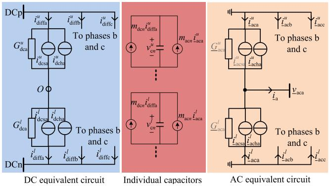  
Fig. 3. Norton equivalent circuits of the MMC multiscale model.

cable multiscale model enables a smooth transition between the EMT and low-frequency transient simulations.

# B. Interfacing of Multiscale Model of the MMC-HVdc With Its Control Systems

In this article, the MMC control systems use the typical $d q -$ frame model to be implemented. Since the MMC controllers have different simulation solvers with the electrical models in the discrete-time domain, an interface solution of the MMC-HVdc control and electrical systems is required and described as follows.

Step 1: The electrical system model solver of the MMC provides the measurements to the low-pass filters of the control systems. Due to the filter effects, the quantities such as dcside voltages $\upsilon _ { \mathrm { d c } } ( k - 1 )$ , individual SM capacitor voltages, ac-side terminal voltages $\underline { { \upsilon } } _ { \mathrm { s a b c } } ( k - 1 )$ , and currents $\underline { { i } } _ { \mathrm { s a b c } } ( k - 1 )$ are considered to contain only dc or fundamental frequency components.

Step 2: Due to the electromagnetic or electromechanical transients to be studied, the simulation parameters such as the shift frequency are set, and correspondingly, the WPF- or-SFP controlled voltage sources are chosen.

Step 3: One time-step delay between different solvers of the electrical and control systems [20] may cause simulation errors. To avoid numerical errors, predictions of the interface quantities, such as $\upsilon _ { \mathrm { d c } } ( k - 1 ) , \underline { { \upsilon } } _ { \mathrm { s a b c } } ( k - 1 )$ , and $\underline { { i } } _ { \mathrm { s a b c } } ( k - 1 )$ , are performed depending on the presence of ac carriers. The dc quantities are predicted using the extrapolation as

$$
s (k) = s (k - 1) + \varsigma (s (k - 1) - s (k - 2)) \tag {26}
$$

where $\varsigma ~ = ~ { \Delta t ( k ) } / { \Delta t ( k - 1 ) }$ . On the other hand, the ac quantities with a carrier are calculated by predicting the carrier

$$
\underline {{i}} _ {\mathrm {a c h} p} ^ {u} (k - 1) = \left\{ \begin{array}{l} - \underline {{G}} _ {\mathrm {a c} 1 p} ^ {u} \left(\underline {{v}} _ {\mathrm {a c} p} (k - 1) - \underline {{v}} _ {\mathrm {a c s} p} (k - 1)\right) + \frac {2 L - R \Delta t}{2 L + R \Delta t} \underline {{i}} _ {\mathrm {a c} p} ^ {u} (k - 1) \\ \text {f o r e l e c t r o m a g n e t i c t r a n s i e n t s a n d} \omega_ {s} = 0 \mathrm {r a d / s} \\ \mathrm {e} ^ {\mathrm {j} \omega_ {s} \Delta t} \left(- \underline {{G}} _ {\mathrm {a c} 1 p} ^ {u} \underline {{v}} _ {\mathrm {a c} p} (k - 1) + \underline {{G}} _ {\mathrm {a c} 1 p} ^ {u} \underline {{v}} _ {\mathrm {a c s} 1 p} (k - 1) + \frac {2 L - (R + \mathrm {j} \omega_ {s} L) \Delta t}{2 L + (R + \mathrm {j} \omega_ {s} L) \Delta t} \underline {{i}} _ {\mathrm {a c} 1 p} ^ {u} (k - 1)\right) \\ + \mathrm {e} ^ {\mathrm {j} 3 \omega_ {s} \Delta t} \left(\underline {{G}} _ {\mathrm {a c} 3 p} ^ {u} \underline {{v}} _ {\mathrm {a c s} 3 p} (k - 1) + \frac {2 L - (R + \mathrm {j} 3 \omega_ {s} L) \Delta t}{2 L + (R + \mathrm {j} 3 \omega_ {s} L) \Delta t} \underline {{i}} _ {\mathrm {a c} 3 p} ^ {u} (k - 1)\right) \\ \text {f o r e l e c t r o m e c h a n i c a l t r a n s i e n t s a n d} \omega_ {s} = \omega_ {\mathrm {c}}. \end{array} \right. \tag {22}
$$

and shifted phasor separately [21] as

$$
\underline {{s}} (k) = A (k) \mathrm {e} ^ {\mathrm {j} \omega_ {s} \Delta t} \frac {\underline {{s}} (k - 1)}{| \underline {{s}} (k - 1) |} \tag {27}
$$

where $A ( k ) = | \underline { { s } } ( k - 1 ) | + \varsigma \left( | s ( k - 1 ) | - | s ( k - 2 ) | \right)$ , and then, the imaginary parts of the analytical signals $\underline { s } ( k )$ are discarded.

Step 4: Following the predictions, the conventional cascaded vector controls and NLM strategies [4] are carried out to generate the corresponding modulation signals, and then, the controlled voltage sources as in (7) or (12) are formed. The details of the MMC control parts can be found in Appendix B.

Step 5: The Norton equivalent circuits in Fig. 3 are established, and then, the holistic MMC-HVdc electrical system model is resolved numerically using the nodal analysis method. Then, by calculating the MMC arm currents and using (24) and (25), the voltages of all individual capacitors are calculated at current time step. The modeling details of the MMC electrical parts can be found in Section III.

Return to the implementation step 1 until the total simulation time is met.

# V. VERIFICATION AND VALIDATION

The proposed multiscale modeling methodology was implemented and verified in the created multiscale transient simulator based on MATLAB scripts and then validated in diverse studies that include dc fault, MMC internal fault, and wind power fluctuations. The computational accuracy and efficiency of the multiscale model are verified through comparisons of the results with those obtained from the existing models.

# A. Description and Simulation Setup of the Test System

The test system is the CIGRÉ B4 DCS-1 that consists of a two-terminal symmetric monopole HVdc link ( 200 kV). The schematic of the system is depicted in Fig. 4. The control modes and parameters of the MMC-HVdc system can be found in the CIGRÉ brochure [28]. In this article, the dc voltage/reactive power control mode is used for the MMC Cm-A1, while the active/reactive power controls are used for the MMC Cm-C1. The offshore wind farm and onshore ac systems are represented with equivalent Thevenin voltage sources. In the system, the pole-to-pole fault F1 and MMC internal fault F2, as denoted in Fig. 4, are separately performed to study their effects on the system dynamics. To perform the studies clearly, the HB SM topology and 20 SMs per arm of the MMC are considered. For the purpose of comparison, this system was also implemented in the EMTP-type simulator, PSCAD/EMTDC, where the MMC DEM was used. It is noted that both simulators were carried out based on the same hardware environment of Dell-PC, Intel Xeon CPUE5-2609 1.9-GHz processor.

# B. Simulation Accuracy Under DC Polar-to-Polar Fault

The first scenario is the polar-to-polar dc-fault (F1 in Fig. 4), which was applied at dc cable terminals of the MMC Cm-A1 dc side at $t ~ = ~ 0 . 0 2 ~ \mathrm { ~ s ~ }$ . After 8 ms, the dc-fault was isolated by triggering the opening of the dc circuit breakers (CBs), resulting in the disconnection of both MMC stations.

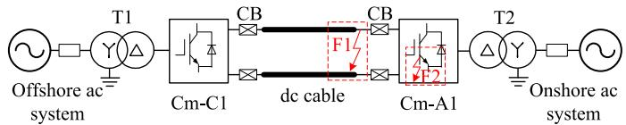

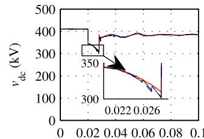  
Fig. 4. Two-terminal MMC-based HVdc transmission system.

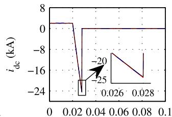

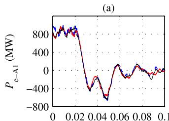

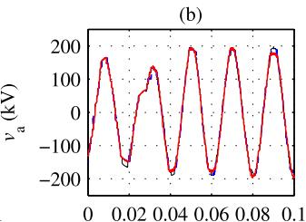  
(d)

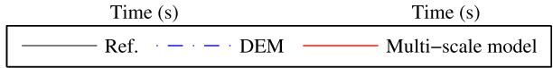  
Fig. 5. Comparison of simulation results with different models under polarto-polar dc-fault: (a) dc-side terminal voltage, (b) dc-fault current, (c) ac-side active power, and (d) ac-side terminal voltage of the MMC Cm-A1.

If overhead dc lines are employed, then the dc faults at any position of the lines would be applied. This scenario aims at verifying the accuracy of the multiscale model (WPF-based controlled voltage sources are used) compared with the DEM. To perform maximum dc fault currents, the IGBT blocking of each SM is not considered in this article, and the MMC controllers are still working.

Fig. 5(a)–(d) shows the dc-side voltage $v _ { \mathrm { d c } } .$ , dc-fault current $i _ { \mathrm { d c } } .$ , ac-side active power $P _ { \mathrm { e - A l } } .$ , and ac terminal voltage of the MMC Cm-A1 $v _ { \mathrm { a } } .$ , respectively. Both the multiscale model and traditional DEM use the same time-step size of 50 $\mu \mathbf { S } ,$ , while the reference solution is obtained with a simulation time-step of $5 ~ \mu \mathrm { s }$ in the PSCAD/EMTDC. As shown in Fig. 5, it can be seen that both models give the results that match the reference closely. The zoom-in results in Fig. 5(a) and (b) verify the accuracy of the multiscale model with a high degree.

Furthermore, the computational errors of different models can be calculated by using the relative average simulation error as defined by

$$
\operatorname {E r r o r} = \frac {1}{N _ {s}} \sum_ {i = 1} ^ {N _ {s}} \frac {\left| x _ {i} - x _ {\text {r e f} i} \right|}{\left| x _ {\text {r e f} i} \right|} \tag {28}
$$

where $x _ { i }$ is the simulation results obtained from the compared models, $x _ { \mathrm { { r e f } } i }$ is the reference values at corresponding sample points, and $N _ { s }$ is the number of compared samples. Using the time-step sizes of 20 and 50 $\mu \mathrm { s } ,$ respectively, the relative errors of the simulation results of both models are given in Table I, and it is visible that they are similar. Comparing the cases of 20 and 50 $\mu \mathbf { S } ,$ the small time-step size gives

TABLE IERRORS OF SIMULATION RESULTS USING THE DEM ANDMULTISCALE MODELS  

<table><tr><td>Methods</td><td>\( v_{\mathrm {dc}} \)</td><td>\( i_{\mathrm {dc}} \)</td><td>\( P_{\mathrm {e}-A1} \)</td><td>\( v_{\mathrm {a}} \)</td></tr><tr><td>Multi-scale 20 μs</td><td>0.0018</td><td>0.0059</td><td>0.0321</td><td>0.0292</td></tr><tr><td>DEM 20 μs</td><td>0.0015</td><td>0.0052</td><td>0.0314</td><td>0.0213</td></tr><tr><td>Multi-scale 50 μs</td><td>0.0020</td><td>0.0056</td><td>0.0483</td><td>0.0352</td></tr><tr><td>DEM 50 μs</td><td>0.0019</td><td>0.0092</td><td>0.0457</td><td>0.0313</td></tr><tr><td>Multi-scale 120 μs</td><td>0.0034</td><td>0.0232</td><td>0.0491</td><td>0.0335</td></tr><tr><td>DEM 120 μs</td><td>0.0059</td><td>0.0257</td><td>0.1092</td><td>0.0667</td></tr></table>

relatively low values of the errors. When the time-step size is increased to 120 $\mu \mathrm { s } ,$ as shown in Table I, the multiscale model results present more precise than those from the DEM. In addition, when the time-step size is further increased to 200 $\mu \mathrm { s } ,$ , the DEM becomes numerically unstable, but this is not the case for the multiscale model. Therefore, the high accuracy of the multiscale model is confirmed. On the other hand, the multiscale model processes analytic complex signals, while the DEM deals with real signals. Correspondingly, the multiscale model takes about 1.4 times the CPU computational cost of the DEM when both models were implemented in the MATLAB scripts.

# C. Multiscale Transient Simulation Under an MMC Internal Fault

To further validate the proposed multiscale model, diverse phenomena, including internal SM fault, circulating current oscillation, and harmonics, are simulated. For the clarity of presenting internal fault and harmonics, the number of SMs at MMC Cm-A1 is reduced to 10 per arm. By staring an increase of transmitted active power, at $t = 0 . 3 \mathrm { ~ s ~ } ,$ , an internal fault of the MMC Cm-A1 occurs where a short-circuit of the sixth SM (for example) on the upper arm of phase a is assumed. Due to the SM fault-tolerant operation of the MMC, after one cycle, the on-fault SM is replaced, and the fault is cleared. These phenomena are also performed in the EMTDC where the MMC DEM is applied and a time-step size of 50 $\mu \mathrm { s }$ is used.

Fig. 6 shows the results of phase a of ac currents at MMC Cm-A1. It is obvious that, in Fig. 6(a), the multiscale model simulates the envelop and natural waveforms of ac quantities alternately. The envelope waveforms first observed change slowly due to the slow increase of transmitted power in the MMC-HVdc. During the envelope tracking, the Fourier seriesbased SFP voltage source is chosen, and large time-step size of 1 ms is set. When the MMC internal fault occurs, the faultrelated transients need to be represented in detail. To end this, the multiscale simulator changes to use a smaller time-step of 50 $\mu \mathbf { S } ,$ , and the WPF-based voltage source is chosen. The internal fault causes the circulating current due to arm voltage unbalance of three phases and then results in the oscillation of SM capacitor voltages. The latter forms the forcing voltage sources in (14) and (15), and correspondingly, the ac currents in Fig. 6(a) start to oscillate. After the fault is cleared, the current oscillations can be observed through the envelope tracking where a time-step size of 500 $\mu \mathrm { s }$ is suitable. It is noted that,

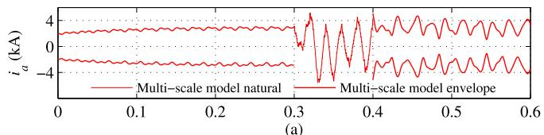

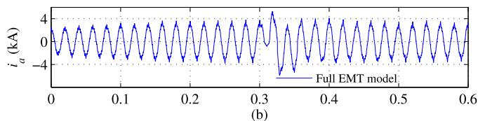

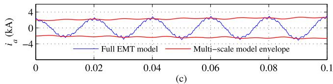

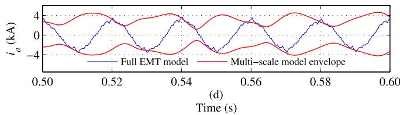  
Fig. 6. Comparison of phase a currents of the MMC Cm-A1: (a) natural and envelope waveforms from the multiscale model, (b) natural waveform from the full EMT model, (c) prefault zoomed-in view of the currents for both models, and (d) postfault zoomed-in view of the currents for both models.

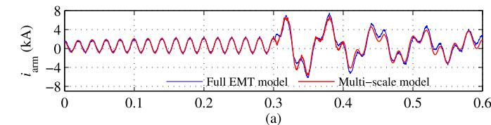

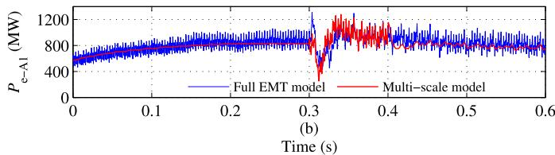  
Fig. 7. Comparison of arm currents and active power at MMC Cm-A1 using the full EMT and multiscale models. (a) MMC arm currents. (b) Active power at MMC ac-side.

for the multiscale model, different time-step sizes and their transition time-points can be determined by the users. On the other hand, the EMTDC simulation only provides natural waveforms, as shown in Fig. 6(b). It is difficult to feature the oscillations through natural waveforms but readily observed in Fig. 6(a). The zoom-in results of the currents in Fig. 6(c) and (d) show that the envelope from the multiscale model touches the amplitudes of the currents obtained with the EMTDC. In addition, the upper arm current of phase a at MMC Cm-A1 is shown in Fig. 7(a), while the transmitted active power is plotted in Fig. 7(b). At t = 0.3 s, the circulating currents are presented. For the purpose of comparison, the natural waveform results from both simulators throughout the simulations are shown in Fig. 7(a), and it is visible that the results

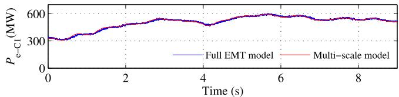  
Fig. 8. Comparison of active power monitored at MMC Cm-C1 using the full EMT and multiscale models.

match closely. The system oscillation as affected by the MMC internal fault can be suppressed by designing and improving the circulating current controller.

A speed-up effect of the multiscale simulation over the 0.6 s is validated against a full EMTP-type implementation that has the same software and hardware environment. The multiscale simulation processes analytic rather than just real signals for the ac quantities, leading to about 1.4 times in an increased computational cost [18] compared with the full EMT simulation. However, the multiscale transient simulation can use larger time-step sizes during the low-frequency transients, resulting in an accelerated simulation speed without a loss of accuracy. The adopted time steps of 1, 500, and 50 μs are 20, 10, and 1 times of 50 μs, respectively, and the ratios of corresponding simulation periods over the 0.6 s are 3/6, 2/6, and 1/6, respectively. The speed-up effect of the multiscale simulation can be evaluated by $( 3 / 6 / 2 0 + 2 / 6 / 1 0 + 1 / 6 / 1 )$ · $1 . 4 = 9 . 6 $ , and thus, about 9.6 times speed-up over the full EMT simulation is obtained. In fact, the absolute simulation time for the multiscale model is about 86.5 s, whereas the absolute time for the full EMT type is 813.4 s.

# D. Efficient Simulation Under Wind Power Fluctuations

The MMC-HVdc system is often employed to integrate offshore wind power. In this article, the offshore wind farm is represented as a power injection with fluctuations into the MMC Cm-C1. Since the power injection behaves slowly changed transients, a speed-up simulation of the multiscale model is essential and can be achieved using a time-step size of 1 ms. This time-step size can be estimated mainly depending on the time constants of the MMC inner current controllers. The time constant of 0.01 s is often selected, and according to Shannon’s sampling theorem, the time-step size of 1 ms is suitable. For the comparison, the full EMT simulation is performed in the EMTDC where a time-step size of 50 $\mu \mathrm { s }$ is used. Fig. 8 shows a comparison of active power transferred by the MMC Cm-C1 when using the full EMT and multiscale models, and the results match closely. Fig. 9 shows ac current results of phase a of the MMC Cm-A1. The natural and envelope waveforms are obtained with the full EMT and multiscale models, respectively. The zoomin results in Fig. 9(b) show that the envelope waveforms touch the amplitudes of natural waveforms obtained from the EMTDC very well. Moreover, the multiscale simulator can also accurately present the instantaneous natural waveforms. In Fig. 9(b), there is no visible difference between the natural waveforms obtained from the multiscale and full EMT models.

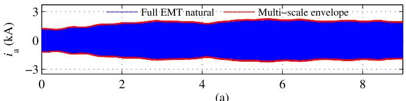

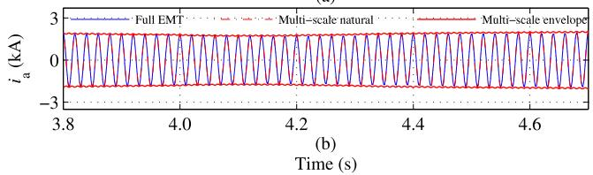  
Fig. 9. Comparison of phase a currents of MMC Cm-A1: (a) natural and envelope waveforms from the full EMT and multiscale models, respectively, and (b) zoomed-in view of the currents for both models.

The computation efficiency of the multiscale model is verified again compared with that of the EMTP-type implementation. During the period of wind power fluctuations, the proposed multiscale model uses a larger time-step size of 1 ms. Compared with the EMT simulation, the computational efficiency should be increased by a factor of (1 ms/50 $\mu \mathrm { s } ) = 2 0$ . However, the processing of analytic versus real signals has been shown to increase the computational cost [18] by a factor of about 1.4. In this example, the absolute CPU computation time of the multiscale model is 362.8 s, whereas the absolute time for the full EMT model is about 5186.2 s. Thus, the computation speed-up of the multiscale model is still 14.3 times, which is about 20/1.4, compared with the full EMT simulation. Furthermore, the computational cost reduction of the multiscale simulation can be achieved with other factors, such as data storage improvements. Proceeding in a similar way to improve the data storage, the computational cost of the full EMT model can also be reduced.

# VI. CONCLUSION

A multiscale modeling methodology of MMC-HVdc transmission systems for analyzing wide-frequency transients within one and the same simulation run was developed, implemented, and validated. While the existing MMC EMT models, such as DEM and AVM, process real signals, the MMC multiscale model is developed to process real and analytic signals. A salient feature of the modeling methodology is the creation of WPF and Fourier series-based SFP methods, offering an in-depth presentation into individual SMs and internal MMC arm circuits. Moreover, the multiscale MMC model enables the multiple-frequency shifting and seamless interfacing with its controllers. As a consequence, the electromagnetic and electromechanical transients are simulated alternatively, and a smooth transition between both is guaranteed. The proposed multiscale model was validated through case studies that include the dc fault, MMC internal fault, and wind power fluctuations. The computational accuracy and efficiency of the multiscale model are verified through comparisons of the results with those from the EMTP-type simulations.

The small time constants of the dc network and MMC controllers limit the usage of large simulation time-step sizes in

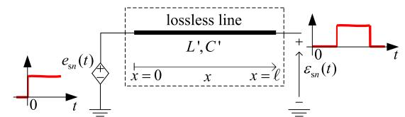

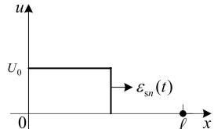  
(b)

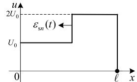

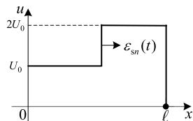  
(d)

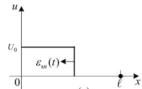  
  
Fig. 10. Physical interpretation of the WPF: (a) wave traveling along the lossless line, (b) wave during $0 \leq t < T _ { \mathrm { w p } } ,$ (c) wave during $T _ { \mathrm { w p } } \leq t < 2 T _ { \mathrm { w p } } ,$ , (d) wave during $2 T _ { \mathrm { w p } } \leq t < 3 T _ { \mathrm { w p } } ,$ , and (e) wave during $3 \bar { T } _ { \mathrm { w p } } \leq t < 4 T _ { \mathrm { w p } } .$ .

the order of tens and hundreds of milliseconds. In this article, a natural decoupling of the multiscale MMC model into dc and ac parts provides an interest to perform multirate simulation. The dc part and MMC controllers are simulated with the timestep size of microseconds, while the ac parts are modeled using the proposed multiscale method, in which the time-step size can cover a wide range of microseconds to milliseconds. Such multirate simulation of the MMC-connected ac/dc system is ongoing research work.

On the other hand, due to similar topologies, for example, the cascaded connection of IGBT/diode bridges, the proposed multiscale modeling methodology can be used for the applications, such as FACTS and solid-state transformer (SST) traction. Likewise, the proposed methodology can accelerate the simulation of the switching events and also facilitates the electromagnetic and electromechanical transient simulation within one and the same simulation run. When facing at the large-size system, the multiscale methodology can provide the flexibility of multirate simulation of the electromagnetic and electromechanical transients.

# APPENDIX A DETAILED DERIVATION OF WAVE PROPAGATION FUNCTION

An alternative derivation of the WPF in (4) can be performed by describing the traveling wave along a lossless distributed parameter line, as depicted in Fig. 10(a). For the line with length $\ell ,$ the wave traveling time that it takes from one end to opposite end of the line is denoted as $T _ { \mathrm { w p } } ~ =$ $\ell \sqrt { L ^ { \prime } C ^ { \prime } }$ , where $L ^ { \prime }$ and $C ^ { \prime }$ are the distributed inductance and capacitance per-unit length, respectively. When the pulse in (2) that describes a unit-step voltage source originates at location $x = 0 .$ , then an incident waveform, as shown in Fig. 10(b), is formed and travels forward to $x = \ell .$ Assuming that the

receiving end of the line is being open circuit, the forward traveling wave is reflected with the coefficient $\Gamma _ { \mathrm { r e c } } = 1$ , leading to the backward traveling wave in Fig. 10(c). Considering the composite forward and backward waves, the voltage profile, as observed at $x = \ell ,$ is delayed and doubled [27] as

$$
\varepsilon_ {s n} (t, \ell) = (1 + \Gamma_ {\mathrm {r e c}}) e _ {s n} (t - T _ {\mathrm {w p}}, 0). \tag {29}
$$

When the backward traveling wave reaches x = 0 again, it is reflected at the sending end of the line with the coefficient $\Gamma _ { \mathrm { s e n d } } = - 1$ . Considering the reflected wave as another pulse that originates again at $x = 0 .$ , the second round of the forward and backward traveling waves is formed. In this case, the voltage profiles on the line can be depicted in Fig. 10(d) and (e). Correspondingly, the two-round voltage profiles at x = 
 can be combined and rewritten [27] by

$$
\varepsilon_ {s n} (t, \ell) = \left(1 + \Gamma_ {\text {r e c}}\right) \left(e _ {s n} \left(t - T _ {\mathrm {w p}}, 0\right) + \Gamma_ {\text {s e n d}} e _ {s n} \left(t - 3 T _ {\mathrm {w p}}, 0\right)\right). \tag {30}
$$

In fact, the wave can travel forth and back between both ends of the line. After the K th round of the wave traveling forward and backward where $\Gamma _ { \mathrm { r e c } } = 1$ and $\Gamma _ { \mathrm { s e n d } } = - 1$ , a formula can be obtained over multiple rounds of the wave propagation as

$$
\varepsilon_ {s n} (t, \ell) = 2 \sum_ {k = 1} ^ {K} (- 1) ^ {k - 1} e _ {s n} (t - (2 k - 1) T _ {\mathrm {w p}} (t), 0). \tag {31}
$$

It is noted that the mathematical expression in (31) can be used to describe the SM switching rising and falling edges. To modulate the time-varying duty ratio of the switching events, the wave traveling time that behaves a delay in (30) can be modified as a function of the time, that is, $T _ { \mathrm { w p } } ( t )$ . With half of the wave expression and neglecting the location notations in (31), the WPF in (4) can be established.

# APPENDIX B

# MMC MODULATION AND SUBMODULE CONTROL

In this article, the typical cascaded outer and inner control loops of the MMC are employed. According to the MMC-HVdc system-level operation principle, the outer loop control quantities can be chosen as shown in the left of Fig. 11, and the outer loop regulation can produce the current references. Then, the decoupling current-vector control strategies are used for the inner loop that generates the dq-axis modulation signals $m _ { d } ( t )$ and $m _ { \mathrm { q } } ( t )$ . It is noted that the current control loops also contain the inner circulating current controller, and thus, the latter can affect the modulation signals. As a result, the modulation magnitude and phase angle can be calculated as

$$
M (t) = \sqrt {m _ {d} ^ {2} (t) + m _ {\mathrm {q}} ^ {2} (t)}, \quad \Delta \theta_ {\mathrm {d q}} (t) = \arcsin \left(\frac {m _ {\mathrm {q}} (t)}{M (t)}\right). \tag {32}
$$

By assuming that $\Delta \theta _ { \mathrm { P L L } } ( t )$ is the phase angle difference as an output of the phase-locked loop (PLL), then the dynamics of the modulation references can be represented by $M ( t )$ and $\Delta \theta _ { \mathrm { d y } } ( t ) = \Delta \theta _ { \mathrm { P L L } } ( t ) + \Delta \theta _ { \mathrm { d q } } ( t )$ .

To reduce the converter losses, one fundamental-frequency nearest level control (NLC) technique is presented. First,

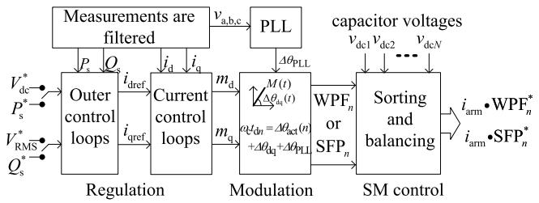  
Fig. 11. MMC control and modulation.

by taking the upper arm as an example, the modulation magnitude is used to generate the initial nearest voltage levels

$$
m _ {\mathrm {N L M}} (n) = \frac {2 n - N - 1}{N \cdot M (t)}, \quad n \in 1, \dots , N \text {a n d} M (t) \neq 0. \tag {33}
$$

It is noted that only $N _ { \mathrm { a c t } } ( t )$ SMs are being switched-ON/OFF states on the condition of $| m _ { \mathrm { N L M } } ( n ) | \leq 1$ , whereas $N - N _ { \mathrm { a c t } } ( t )$ SMs are being bypassed state for $\begin{array} { l } { | m _ { \mathrm { N L M } } ( n ) | \ > \ 1 } \end{array}$ . Such NLC describes the $N _ { \mathrm { a c t } } ( t )$ SM switching events with an angle sinusoidal distribution as

$$
\Delta \theta_ {\mathrm {a c t}} (n) = \left\{ \begin{array}{l l} \pm \frac {\pi}{2}, & n \in N _ {\mathrm {a c t}} + 1, \dots , N \\ \arcsin \left(m _ {\mathrm {N L M}} (n)\right), & n \in 1, \dots , N _ {\mathrm {a c t}}. \end{array} \right. \tag {34}
$$

Second, the modulation phase angle dynamics are considered, and the switching ON/OFF time constants of all individual SMs on the upper MMC arm can be calculated as

$$
t _ {d n} (t) = \frac {\Delta \theta_ {\mathrm {a c t}} (n) + \Delta \theta_ {\mathrm {P L L}} (t) + \Delta \theta_ {\mathrm {d q}} (t)}{\omega_ {\mathrm {c}}}. \tag {35}
$$

With such NLC technique, the sum of all SM voltages produces a desired output sinusoidal voltage waveform. Third, based on (6) and (9), the switching ON/OFF time constants in (35) can be used to produce the WPF and SFP of individual SMs.

Following the NLM, the capacitor voltage balancing block is presented in Fig. 11. According to the capacitor voltage sorting results, the WPFs or SFPs are reassigned to describe all individual SMs on the upper arm. Cooperated with the arm current, the corresponding current injected into the capacitors is updated. According to (24) and (25), the capacitor voltages are updated for constructing the controlled voltage sources.

# APPENDIX C

# DETAILS OF THE MULTISCALE COMPANION MODELS

For the companion model in (23), the present current source ${ \underline { { i } } _ { \mathrm { d c s } } ^ { u } } _ { p } ( k )$ is expressed as

$$
\underline {{i}} _ {\mathrm {d c s} p} ^ {u} (k) = - \sum_ {j = 0} ^ {J} \underline {{G}} _ {\mathrm {d c} j p} ^ {u} \underline {{v}} _ {\mathrm {d c s} j p} ^ {u} (k). \tag {36}
$$

Meanwhile, the history current source $\underline { { i } } _ { \mathrm { d c h } _ { p } } ^ { u } ( k - 1 )$ is expressed as

$$
\begin{array}{l} \underline {{i}} _ {\mathrm {d c h} p} ^ {u} (k - 1) = \frac {\Delta t}{2 L _ {\mathrm {a r m}} + R _ {\mathrm {a r m}} \Delta t} v _ {\mathrm {d c p}} (k - 1) \\ + \sum_ {j = 0} ^ {J} \mathrm {e} ^ {\mathrm {j} j \omega_ {s} \Delta t} \left(\underline {{K}} _ {\mathrm {d c} j p} ^ {u} \underline {{L}} _ {\mathrm {d c s} j p} ^ {u} (k - 1) \right. \\ \left. - \underline {{G}} _ {\mathrm {d c} j p} ^ {u} \underline {{v}} _ {\mathrm {d c s} j p} ^ {u} (k - 1)\right) \tag {37} \\ \end{array}
$$

with the conductance and coefficient

$$
\underline {{G}} _ {\mathrm {d c} J P} ^ {u} = \frac {\Delta t}{2 L _ {\mathrm {a r m}} + \left(R _ {\mathrm {a r m}} + \mathrm {j} J \omega_ {s} L _ {\mathrm {a r m}}\right) \Delta t} \tag {38}
$$

$$
\underline {{K}} _ {\mathrm {d c} j p} ^ {u} = \frac {2 L _ {\mathrm {a r m}} - \left(R _ {\mathrm {a r m}} + \mathrm {j} J \omega_ {s} L _ {\mathrm {a r m}}\right) \Delta t}{2 L _ {\mathrm {a r m}} + \left(R _ {\mathrm {a r m}} + \mathrm {j} J \omega_ {s} L _ {\mathrm {a r m}}\right) \Delta t} \tag {39}
$$

where $\jmath \geq 0$ and is even. It is noted that, for EMT studies in which $\begin{array} { r c l } { \omega _ { s } } & { = } & { 0 , \ \sum _ { \ j = 0 } ^ { J } \underline { { \upsilon } } _ { \mathrm { d c s } _ { \jmath } p } ^ { u } } \end{array}$ and $\scriptstyle \sum _ { J = 0 } ^ { J } \underline { { \upsilon } } _ { \mathrm { d c s } _ { J } p } ^ { u }$ in (36) and (37) are replaced by $\underline { { \upsilon } } _ { \mathrm { d c s } p }$ and $\underline { { i } } _ { \mathrm { d i f f } p } ^ { u } ,$ =    respectively. When the electromechanical transient are modeled, as an example, the dc and second-order harmonics, i.e., considered, and thus, one can obtain tha $\jmath = 0$ $\ j = 2 ,$ $\begin{array} { r } { \underline { { i } } _ { \mathrm { d i f f } p } ^ { u } = i _ { \mathrm { d c } 0 p } ^ { u } + \underline { { i } } _ { \mathrm { d c } 2 p } ^ { u } . } \end{array}$

In (24), the equivalent quantities are expressed as follows:

$$
Z _ {\mathrm {d c} n} = \frac {\Delta t}{2 C _ {\mathrm {v} n}}, \quad h _ {\mathrm {d c} p n} ^ {u} (k) = Z _ {\mathrm {d c} n} i _ {\mathrm {d c} p} ^ {u} (k - 1) + v _ {\mathrm {d c} p n} ^ {u} (k - 1). \tag {40}
$$

In (25), if fundamental frequency and high-order harmonics of individual SM capacitor voltage are considered, then

$$
\underline {{Z}} _ {\mathrm {a c} j n} = \frac {\Delta t}{(2 + \mathrm {j} J \omega_ {s} \Delta t) C _ {\mathrm {v n}}} \tag {41}
$$

and

$$
\underline {{h}} _ {\mathrm {a c} p n} ^ {u} (k) = \sum_ {j = 1} ^ {J} \mathrm {e} ^ {\mathrm {j} j \omega_ {s} \Delta t} \left(\underline {{Z}} _ {\mathrm {a c} J n} \underline {{i}} _ {\mathrm {a c} J p} ^ {u} (k - 1) + \underline {{v}} _ {\mathrm {a c} J p n} ^ {u} (k - 1)\right). \tag {42}
$$

# REFERENCES

[1] B. Johnson, “New trends for HVDC: An evolution of applications since 2007,” IEEE Power Energy Mag., vol. 17, no. 3, pp. 20–144, May/Jun. 2019.   
[2] H. Rao, “Architecture of Nan’ao multi-terminal VSC-HVDC system and its multi-functional control,” CSEE J. Power Energy Syst., vol. 1, no. 1, pp. 9–18, Mar. 2015.   
[3] G. Tang et al., “Research on key technology and equipment for Zhangbei 500 kV DC grid,” (in Chinese), High Voltage Eng., vol. 44, no. 7, pp. 2097–2106, Jul. 2018.   
[4] M. Mehrasa, E. Pouresmaeil, S. Zabihi, and J. P. S. Catalao, “Dynamic model, control and stability analysis of MMC in HVDC transmission systems,” IEEE Trans. Power Del., vol. 32, no. 3, pp. 1471–1482, Jun. 2017.   
[5] P. Kundur, Power System Stability and Control. New York, NY, USA: McGraw-Hill, 1993.   
[6] S. Liu, Z. Xu, W. Hua, G. Tang, and Y. Xue, “Electromechanical transient modeling of modular multilevel converter based multi-terminal HVDC systems,” IEEE Trans. Power Syst., vol. 29, no. 1, pp. 72–83, Jan. 2014.   
[7] N.-T. Trinh, M. Zeller, K. Wuerflinger, and I. Erlich, “Generic model of MMC-VSC-HVDC for interaction study with AC power system,” IEEE Trans. Power Syst., vol. 31, no. 1, pp. 27–34, Jan. 2016.   
[8] S. Zhu et al., “Reduced-order dynamic model of modular multilevel converter in long time scale and its application in power system lowfrequency oscillation analysis,” IEEE Trans. Power Del., vol. 34, no. 6, pp. 2110–2120, Dec. 2019.   
[9] J. Segundo-Ramirez, A. Bayo-Salas, M. Esparza, J. Beerten, and P. Gomez, “Frequency domain methods for accuracy assessment of wideband models in electromagnetic transient stability studies,” IEEE Trans. Power Del., vol. 35, no. 1, pp. 71–83, Feb. 2020.   
[10] N. Lin and V. Dinavahi, “Behavioral device-level modeling of modular multilevel converters in real time for variable-speed drive applications,” IEEE J. Emerg. Sel. Topics Power Electron., vol. 5, no. 3, pp. 1177–1191, Sep. 2017.   
[11] N. Ahmed, L. Angquist, S. Norrga, A. Antonopoulos, L. Harnefors, and H.-P. Nee, “A computationally efficient continuous model for the modular multilevel converter,” IEEE J. Emerg. Sel. Topics Power Electron., vol. 2, no. 4, pp. 1139–1148, Dec. 2014.

[12] U. N. Gnanarathna, A. M. Gole, and R. P. Jayasinghe, “Efficient modeling of modular multilevel HVDC converters (MMC) on electromagnetic transient simulation programs,” IEEE Trans. Power Del., vol. 26, no. 1, pp. 316–324, Jan. 2011.   
[13] J. Xu et al., “High-speed electromagnetic transient (EMT) equivalent modelling of power electronic transformers,” IEEE Trans. Power Del., to be published.   
[14] Y. Xu, Y. Chen, C.-C. Liu, and H. Gao, “Piecewise average-value model of PWM converters with applications to large-signal transient simulations,” IEEE Trans. Power Electron., vol. 31, no. 2, pp. 1304–1321, Feb. 2016.   
[15] X. K. Meng, J. T. Han, L. W. Wang, and W. Li, “A unified arm modulebased average value model for modular multilevel converter,” IEEE Access, vol. 8, pp. 63821–63831, 2020.   
[16] K. Strunz, R. Shintaku, and F. Gao, “Frequency-adaptive network modeling for integrative simulation of natural and envelope waveforms in power systems and circuits,” IEEE Trans. Circuits Syst. I, Reg. Papers, vol. 53, no. 12, pp. 2788–2803, Dec. 2006.   
[17] P. Zhang, J. R. Marti, and H. W. Dommel, “Shifted-frequency analysis for EMTP simulation of power-system dynamics,” IEEE Trans. Circuits Syst. I, Reg. Papers, vol. 57, no. 9, pp. 2564–2574, Sep. 2010.   
[18] F. Gao and K. Strunz, “Frequency-adaptive power system modeling for multiscale simulation of transients,” IEEE Trans. Power Syst., vol. 24, no. 2, pp. 561–571, May 2009.   
[19] H. Ye and K. Strunz, “Multi-scale and frequency-dependent modeling of electric power transmission lines,” IEEE Trans. Power Del., vol. 33, no. 1, pp. 32–41, Feb. 2018.   
[20] H. Ye, B. Yue, X. Li, and K. Strunz, “Modeling and simulation of multiscale transients for PMSG-based wind power systems,” Wind Energy, vol. 20, no. 8, pp. 1349–1364, Mar. 2017.   
[21] Y. Xia, Y. Chen, Y. Song, and K. Strunz, “Multi-scale modeling and simulation of DFIG-based wind energy conversion system,” IEEE Trans. Energy Convers., vol. 35, no. 1, pp. 560–572, Mar. 2020.   
[22] D. Shu, V. Dinavahi, X. Xie, and Q. Jiang, “Shifted frequency modeling of hybrid modular multilevel converters for simulation of MTDC grid,” IEEE Trans. Power Del., vol. 33, no. 3, pp. 1288–1298, Jun. 2018.   
[23] J. Rupasinghe, S. Filizadeh, and L. Wang, “A dynamic phasor model of an MMC with extended frequency range for EMT simulations,” IEEE J. Emerg. Sel. Topics Power Electron., vol. 7, no. 1, pp. 30–40, Mar. 2019.   
[24] H. Ye, L. Kong, Y. Tang, W. Pei, and W. Deng, “Multi-scale transient modelling and simulation for distribution network-interactive CHB multilevel converters,” IET Gener., Transmiss. Distrib., vol. 14, no. 2, pp. 330–338, Jan. 2020.   
[25] S. K. Mitra, Digital Signal Processing: A Computer-Based Approach, 2nd ed. New York, NY, USA: McGraw-Hill, 2001.   
[26] A. Yazdani and R. Iravani, Voltage-Sourced Converters in Power Systems, 2nd ed. Hoboken, NJ, USA: Wiley, 2010.   
[27] M. Kuschke and K. Strunz, “Transient cable overvoltage calculation and filter design: Application to onshore converter station for hydrokinetic energy harvesting,” IEEE Trans. Power Del., vol. 28, no. 3, pp. 1322–1329, Jul. 2013.   
[28] Working Group B4.57, “Guide for the development of models for HVDC converters in a HVDC grid,” CIGRÉ Tech. Brochure, Paris, France, Tech. Rep. 604, Dec. 2014.

Hua Ye (Member, IEEE) received the B.S. and M.S. degrees in electrical engineering from China Agricultural University, Beijing, China, in 2006 and 2008, respectively, and the Ph.D. degree in electrical engineering from the Technische Universität Berlin, Berlin, Germany, in 2013.

He is currently an Associate Professor with the Institute of Electrical Engineering, Chinese Academy of Sciences, Beijing. His research interests include modeling of power system transients, computational methods, integration of wind power, and

high-voltage direct current (HVdc) grids.

Feng Gao (Member, IEEE) received the B.S. and M.S. degrees in electrical engineering from Tsinghua University, Beijing, China, in 2000 and 2003, respectively, and the Ph.D. degree in electrical engineering from the University of Washington, Seattle, WA, USA, in 2008.

From 2008 to 2010, he was Research Associate with the Technische Universität Berlin, Berlin, Germany. From 2010 to 2015, he was Research Staff with the IBM Research China, Beijing, and the Co-Chair of IBM Global Smart Energy PIC. Since

2015, he has been Deputy Director of the Energy Internet Research Institute, Tsinghua University. His research interests include digital energy transformation, computational methods, and information technology applications in power systems.

Dr. Gao was a Core Member to compose China’s programmatic document about Energy Internet and has been supporting the China National Energy Administration (NEA) to organize the National Energy Internet Demonstration Projects. He won the IBM Research Accomplishment Award three times. He also serves as the Vice-Chairman of SAC/TC411, the Deputy General Secretary of the China Energy Internet Alliance, and the Vice-Chairman of Electric Digitalization Industrial Commission, the China Electric Power Promotion Council, and so on.

Wei Pei (Member, IEEE) received the B.S. and M.S. degrees in electrical engineering from Tianjin University, Tianjin, China, in 2002 and 2005, respectively, and the Ph.D. degree from the Institute of Electrical Engineering, Chinese Academy of Sciences, Beijing, China, in 2008.

He is currently a Professor and the Director of the Distributed Generation and Power System Research Group, Institute of Electrical Engineering, Chinese Academy of Sciences. His research interests include the impact of the integration of renewable

energy sources on the electricity grid and the development of the transmission/distribution grid for large-scale renewable integration, active distribution network, and ac/dc microgrids.

Li Kong (Member, IEEE) received the B.S. degree in electrical engineering from the Huazhong University of Science and Technology (HUST), Wuhan, China, in 1982, the M.S. degree from the Institute of Electrical Engineering of Chinese Academy of Sciences (IEE, CAS), Beijing, China, in 1987, and the Ph.D. degree from the Institute National Polytechique de Lorraine (INPL), Paris, France, in 1994. From 1999 to 2007, he was the Director of the IEE, CAS. From 2007 to 2013, he was the Director of the Development and Budget Bureau of CAS.

Since 1995, he has been a Full Professor with IEE, CAS, where he is currently the Head of the Power Grid Technologies Lab. His research interests include microgrid technologies, renewable energy comprehensive utilization technologies, and power electronics.

Dr. Kong is the Vice-President of the China Solar Energy Society, the Editorin-Chief of the Journal of Solar Energy, an Executive Committee Member of the International Solar Energy Society (ISES), a member of the Energy Committee of the Chinese Academy of Sciences, and the Honorary Director of the China Electro-Technical Society. He was a recipient of the Second Prize for Scientific and Technological Progress of the CAS and other awards.