# Influence of approximate internal impedance formula on half-wavelength transmission lines✩,✩✩

J.E. Guevara Asorza , R.E. Rojas ∗, J. Pissolato Filho

School of Electrical and Computer Engineering, University of Campinas - UNICAMP, Campinas, Brazil

# A R T I C L E I N F O

# Keywords:

Long distance transmission

Half-wavelength transmission line

Internal impedance

Overvoltage

Statistical switching

# A B S T R A C T

This paper evaluates the impact of using approximate versus exact internal impedance formulations in Overhead Transmission Lines (OHTL), focusing on Half-Wavelength Transmission lines (HWTL) and high-surge impedance loading applications, where multiple conductors per phase are employed. Approximate formulations for the internal impedance of conductors simplify calculations but may introduce minor errors that, in specific applications, can become more significant. These inaccuracies affect key parameters, including active power transfer, surge impedance loading (SIL), and Joule losses, and can also compromise the accuracy of transient analysis. The study compares approximate and exact impedance formulations under steady-state and transient conditions across three OHTL configurations of varying designs. Results reveal that approximate formulations reduce accuracy in SIL and voltages calculations, resulting in potential power transfer limitations and increased voltage drops. Furthermore, a statistical analysis of switching manoeuvres demonstrates that the approximate model predicts higher overvoltages than the exact formula, with phase C exhibiting the most significant deviations. These findings underscore the critical importance of precise internal impedance modelling in HWTL studies to ensure reliable power system analysis.

# 1. Introduction

Accurate computation of electrical parameters in overhead transmission lines (OHTL) is essential for designing and analysing power systems, particularly in applications involving long-distance power transmission. Parameters such as series impedance and shunt admittance are influenced by conductor properties and their position concerning ground, ground characteristics, and frequency-dependent behaviour, including skin effect and electromagnetic field interactions. In ultralong transmission lines, power transfer efficiency is impacted by increased line impedance, voltage stability concerns, and significant reactive power generation, requiring specialised solutions such as highvoltage direct current (HVDC) transmission systems or half-wavelength transmission lines (HWTL) [1–3], to mitigate these effects, as seen in large continental countries like Brazil, where generation sources and demand centres are widely separated. HWTL designs can optimise power transfer, reduce losses, and enhance grid resilience, proving indispensable for large-scale power applications.

The concept of a HWTL is predicated on the electrical length that corresponds to half the wavelength of the operating frequency. For a

60 Hz system, the wavelength in a vacuum is approximately 5000 km; however, the propagation velocity of electromagnetic waves in transmission lines is affected by the line’s construction and the surrounding medium, resulting in a velocity factor that is less than unity. This reduction in propagation speed leads to a shorter wavelength within the transmission line [4]. It can thus be concluded that the half-wavelength of practical 60 Hz transmission lines is less than 2500 km. However, to ensure a stable response, it is necessary that the line should be slightly longer than half the wavelength [5,6] Consequently, the HWTL examined in this study spans 2600 km.

Some electromagnetic transient (EMT) programs use approximate internal impedance formulations to become computationally more efficient and hold good accuracy in the results. However, these approximations may introduce deviations that affect the calculation of power losses, surge impedance loading (SIL), and transient performance— particularly under switching manoeuvres and high-surge impedance loading (HSIL) conditions. Therefore, the central aim of this work is to address the implications introduced by such approximations.

Therefore, this paper evaluates the influence of approximate versus exact internal impedance formulations on the modelling of HSIL HWTLs. Unlike previous studies that primarily focus on the computational efficiency of different formulations [7], this study emphasises the accuracy of the resulting electrical models. Through simulations of three OHTL configurations with multiple conductors per phase, this research assesses the impact of internal impedance approximations on SIL calculations, active power transfer, and transient overvoltage predictions. The findings contribute to improving the modelling accuracy of HWTLs, supporting more informed decision-making in their potential application for ultra-long-distance power transmission.

# 2. Computing electrical parameters

To accurately calculate the series impedance and shunt admittance matrix of an overhead transmission line (OHTL), it is essential to account for the medium surrounding the conductors as well as the electrical properties of the ground. In this context, it is possible to calculate the series impedance and shunt admittance using (1) and $( 2 ) ,$ where all the terms depend on the frequency, except for $\mathbf { Y } _ { 0 } ,$ , which remains constant across the entire frequency domain; meanwhile, $\mathbf { Y } _ { g }$ plays an important role in high-frequency phenomena, in the order of hundreds of kHz. In (1), the first term, $\mathbf { Z } _ { \mathrm { i n t } } ,$ corresponds to the electromagnetic field within the conductors, incorporating the effects of skin depth. The second term, $\mathbf { Z } _ { \mathrm { e x t } } ,$ , accounts for the electromagnetic field in the air, while the third term, $\mathbf { Z } _ { \mathbf { g } } ,$ , adjusts for deviations from the assumption of an ideal ground.

$$
\mathbf {Z} = \mathbf {Z} _ {\text {i n t}} + \mathbf {Z} _ {\text {e x t}} + \mathbf {Z} _ {\mathrm {g}} \tag {1}
$$

$$
\mathbf {Y} = j \omega \mathbf {P} ^ {- 1} = \mathbf {Y} _ {0} + \mathbf {Y} _ {g} \tag {2}
$$

For the internal impedance, ${ \bf Z } _ { i n t } ,$ which only has terms in the diagonal matrix, calculations can be made using Bessel functions [8], as indicated in (3). This formulation is the exact one.

$$
\mathbf {Z} _ {i n t (i)} = \frac {p _ {i} \gamma_ {i}}{2 \pi r _ {i}} \left[ \frac {I _ {0} (\gamma_ {i} r _ {i}) K _ {1} (\gamma_ {i} q _ {i}) + I _ {1} (\gamma_ {i} q _ {i}) K _ {0} (\gamma_ {i} r _ {i})}{I _ {1} (\gamma_ {i} r _ {i}) K _ {1} (\gamma_ {i} q _ {i}) - I _ {1} (\gamma_ {i} q _ {i}) K _ {1} (\gamma_ {i} r _ {i})} \right] \tag {3}
$$

$$
\gamma_ {i} = \sqrt {j \omega \mu_ {r i} \mu_ {0} \sigma_ {i}} \tag {4}
$$

where $I _ { 0 } , I _ { 1 } , K _ { 0 }$ and $K _ { 1 }$ represent modified Bessel functions of the first and second kind with orders zero and one, respectively, $\gamma _ { i }$ denotes the propagation constant of the conductor medium, $\mu _ { r i }$ represents the relative permeability of the medium, $\varepsilon _ { r i }$ represents the relative permittivity of the medium, $\mu _ { 0 }$ is defined as 4??× $1 0 ^ { - 7 } \mathrm { H } / \mathrm { m } , \varepsilon _ { 0 }$ is equal to $8 . 8 5 4 \times 1 0 ^ { - 1 2 }$ F/m, ?? symbolises the angular frequency in rad/s, ?? corresponds to the conductivity of the medium, assuming the conductivity of air to be zero, $r _ { i }$ denotes the external radius of the conductor, and $q _ { i }$ signifies the internal radius of the conductor.

However, due to the computational demands of this expression, different approximations have been proposed in the literature, such as those found in [9,10]. Electromagnetic transients programs such as ATP [11], use the exact formulation indicated in (3); meanwhile, others programs, like the PSCAD/EMTDC [12], use approximated formulations through its Line Constants Program (LCP), in order to be computationally more efficient and stable without altering the accuracy of the results [13]. These approximate formulations are indicated in (5) and (6), when the conductor is a solid cylinder and hollow core, respectively.

$$
\mathbf {Z} _ {i n t (i)} = \frac {p _ {i} \gamma_ {i}}{2 \pi r _ {i}} \operatorname {c o t h} \left(0. 7 3 3 \gamma_ {i} r _ {i}\right) + \frac {0 . 3 1 7 9 \rho_ {i}}{\pi r _ {i} ^ {2}} \tag {5}
$$

$$
\mathbf {Z} _ {\text {i n t} (i)} = \frac {p _ {i} \gamma_ {i}}{2 \pi r _ {i}} \operatorname {c o t h} \left(\gamma_ {i} \left(r _ {i} - q _ {i}\right)\right) + \frac {\rho_ {i}}{2 \pi r _ {i} \left(r _ {i} + q _ {i}\right)} \tag {6}
$$

where $\rho _ { i }$ corresponds to the inverse of $\sigma _ { i } .$

These formulations apply the method described in [10] but with varying degrees of freedom, denoted by the constant ??. This arbitrary

Table 1 Input data of the OHTLs.   

<table><tr><td>Description</td><td>Unit</td><td>TL1</td><td>TL2</td><td>TL3</td></tr><tr><td>Voltage level</td><td></td><td>440</td><td>765</td><td>800</td></tr><tr><td>N° of conductors</td><td>-</td><td>4</td><td>6</td><td>8</td></tr><tr><td>Internal radius</td><td>mm</td><td>4.64</td><td>4.135</td><td>4.135</td></tr><tr><td>External radius</td><td>mm</td><td>12.57</td><td>16.56</td><td>16.56</td></tr><tr><td>DC Resistance at 20 °C</td><td>Ω/km</td><td>0.08989</td><td>0.0478</td><td>0.0478</td></tr></table>

constant must be chosen to optimise the formula at lower frequencies. In [10], ?? is set to 0.777, while in [13], it is adjusted to 0.733. The resulting error from using this constant is approximately 0.5% at mid-range frequencies compared to the exact formulation [13]. While the associated error is comparatively minor, its potential to induce appreciable discrepancies under specific conditions reinforces the need for enhanced modelling precision, forming part of the motivation for this research.

On the other hand, the earth-return impedance can be calculated using various expressions found in the literature, with the choice of formulation depending on the specific type of study being conducted [14, 15]. Key differences become apparent when examining phenomena at high frequencies above 100 kHz. However, since our work focuses on lower frequencies, we use Carson formulation [16] to calculate the earth-return impedance.

# 3. Difference between internal impedance formulations

To assess the impact of using the internal impedance calculated by the approximate formulation, as employed by PSCAD/EMTDC, instead of the exact formulation based on Bessel functions, we conducted an analysis using three different OHTL: TL1, TL2, and TL3, featuring four, six, and eight conductors per phase, respectively. The principal information about these OHTLs was extracted and adapted from [2,15] and is provided in Table 1. The physical position of conductors and shield wires in the tower are shown in Table 2. In the latter table, the coordinates of each conductor are presented, with the X-axis representing the horizontal distance and the Y-axis indicating the average height. TL1 and TL2 correspond to a conventional transmission lines; meanwhile, the TL3 corresponds to a line with HSIL [17], and is lately used for HWTL studies [3,18].

Considering both the approximate and exact internal impedance formulas discussed in the previous section, it is possible to calculate the electrical parameters at the system frequency (60 Hz) for the positive and zero sequences of these OHTLs, as well as the surge impedance (Zc) and surge impedance loading (SIL). The results are shown in Table 3, which demonstrates that as the number of conductors per phase rises, the absolute difference in SIL also increases. Specifically, the percentage deviation in SIL is 0.0374% for TL1, 0.0579% for TL2, and 0.0717% for TL3. While these deviations may appear negligible, they will become significant in the context of electromagnetic transient studies for the HWTL, where even minor discrepancies in impedance and power transfer can influence the voltage variations during manoeuvres, the accuracy of fault detection algorithms and the identification of fault location. Additionally, in all OHTLs, the resistance in positive sequence computed using the exact formulation is lower than that calculated with the approximate formulation. This implies that the transmission line can carry more active power when the exact formulation is applied, leading to lower losses.

On the other hand, the approximate formulation impacts not only the SIL but also the losses due to the Joule effect. These losses depend on the resistance of the OHTL, the current flowing through the conductors and the length of the transmission line. To calculate these losses, we consider that the three OHTLs are operating at their respective SILs, with the lengths of TL1, TL2, and TL3 being 350 km, 450 km, and 2600 km, respectively. Fig. 1 illustrates the differences in losses due

Table 2 Position of the conductors and shield wires of the OHTL analysed.   

<table><tr><td rowspan="2">OHTL
N° Conductor</td><td colspan="3">TL1</td><td colspan="3">TL2</td><td colspan="3">TL3</td></tr><tr><td>Phase A</td><td>Phase B</td><td>Phase C</td><td>Phase A</td><td>Phase B</td><td>Phase C</td><td>Phase A</td><td>Phase B</td><td>Phase C</td></tr><tr><td>1</td><td>(-9.37;15.18)</td><td>(-0.1;18.78)</td><td>(9.17;15.18)</td><td>(-9.47;15.43)</td><td>(-0.2;19.03)</td><td>(9.07;15.43)</td><td>(-8.09; 22.73)</td><td>(1.39; 22.87)</td><td>(8.09; 21.35)</td></tr><tr><td>2</td><td>(-9.17;15.18)</td><td>(0.1;18.78)</td><td>(9.37;15.18)</td><td>(-9.07;15.43)</td><td>(0.2;19.03)</td><td>(9.47;15.43)</td><td>(-9.07; 23.7)</td><td>(0.58;23.68)</td><td>(9.07;20.37)</td></tr><tr><td>3</td><td>(-9.37;14.98)</td><td>(-0.1;18.58)</td><td>(9.17;14.98)</td><td>(-8.87;15.08)</td><td>(0.4;18.68)</td><td>(9.67;15.08)</td><td>(-10.45; -23.7)</td><td>(-0.58;23.68)</td><td>(10.45;20.37)</td></tr><tr><td>4</td><td>(-9.17;14.98)</td><td>(0.1;18.58)</td><td>(9.37;14.98)</td><td>(-9.07;14.74)</td><td>(0.2;18.34)</td><td>(9.47;14.74)</td><td>(-11.42;22.73)</td><td>(-1.39;22.87)</td><td>(11.42;21.35)</td></tr><tr><td>5</td><td>-</td><td>-</td><td>-</td><td>(-9.47;14.74)</td><td>(-0.2;18.34)</td><td>(9.07;14.74)</td><td>(-11.42;21.35)</td><td>(-1.39;21.72)</td><td>(11.42;22.73)</td></tr><tr><td>6</td><td>-</td><td>-</td><td>-</td><td>(-9.67;15.08)</td><td>(-0.4;18.68)</td><td>(9.07;15.08)</td><td>(-10.45;20.37)</td><td>(-0.58;20.9)</td><td>(10.45;23.7)</td></tr><tr><td>7</td><td>-</td><td>-</td><td>-</td><td>-</td><td>-</td><td>-</td><td>(-9.07;20.37)</td><td>(0.58;20.9)</td><td>(9.07;23.7)</td></tr><tr><td>8</td><td>-</td><td>-</td><td>-</td><td>-</td><td>-</td><td>-</td><td>(-8.09;21.35)</td><td>(1.39;21.72)</td><td>(8.09;22.73)</td></tr><tr><td></td><td>CG1</td><td>CG2</td><td>-</td><td>CG1</td><td>CG2</td><td>-</td><td>CG1</td><td>CG2</td><td>-</td></tr><tr><td>Shield wire</td><td>(-7;51.73)</td><td>(7;51.73)</td><td>-</td><td>(-7;71.73)</td><td>(7;71.73)</td><td>-</td><td>(-9;31.73)</td><td>(9;31.73)</td><td>-</td></tr></table>

Table 3 Electrical parameters in positive and zero sequence.   

<table><tr><td>Electrical parameter</td><td>Unit</td><td colspan="2">TL1</td><td colspan="2">TL2</td><td colspan="2">TL3</td></tr><tr><td></td><td></td><td>Approximation</td><td>Exact</td><td>Approximation</td><td>Exact</td><td>Approximation</td><td>Exact</td></tr><tr><td>R1</td><td>Ω/km</td><td>0.022824</td><td>0.022794</td><td>0.008509</td><td>0.008419</td><td>0.006833</td><td>0.006765</td></tr><tr><td>X1</td><td>Ω/km</td><td>0.359726</td><td>0.359458</td><td>0.278357</td><td>0.278037</td><td>0.173748</td><td>0.173501</td></tr><tr><td>R0</td><td>Ω/km</td><td>0.378154</td><td>0.378110</td><td>0.363635</td><td>0.363531</td><td>0.381623</td><td>0.381539</td></tr><tr><td>X0</td><td>Ω/km</td><td>1.532719</td><td>1.532434</td><td>1.451536</td><td>1.451200</td><td>1.336660</td><td>1.336395</td></tr><tr><td>B1</td><td>μS/km</td><td>4.565460</td><td>4.565460</td><td>5.962440</td><td>5.962440</td><td>9.814902</td><td>9.814902</td></tr><tr><td>B0</td><td>μS/km</td><td>2.897353</td><td>2.897353</td><td>3.401324</td><td>3.401324</td><td>4.112616</td><td>4.112616</td></tr><tr><td>Zc1</td><td>Ω</td><td>280.983</td><td>280.878</td><td>216.118</td><td>215.993</td><td>133.102</td><td>133.006</td></tr><tr><td>SIL</td><td>MW</td><td>569.43</td><td>569.64</td><td>2707.90</td><td>2709.47</td><td>4808.35</td><td>4811.79</td></tr><tr><td>ΔSIL</td><td>MW (%)</td><td colspan="2">0.213 (0.0374%)</td><td colspan="2">1.569 (0.0579%)</td><td colspan="2">3.449 (0.0717%)</td></tr></table>

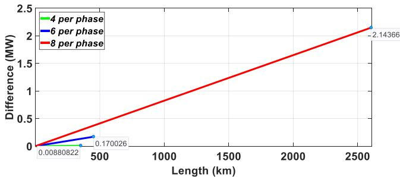  
Fig. 1. Losses due to joule effect - Difference between formulations.

to the Joule effect in these transmission lines as their length increases. In the case of TL1, which consists of four conductors per phase, the discrepancy in losses between the two approaches remains minimal. Even with an increase in length, this difference remains negligible. Conversely, for TL2, which has six conductors per phase, the difference between the formulations becomes more pronounced as the transmission line length increases. Finally, TL3, which contains eight conductors per phase, exhibits the highest difference in power losses. For these three cases, the differences in losses represent approximately 1%, while the deviation in SIL remains below 0.1%. Nevertheless, it is essential to investigate discrepancies at higher frequency further ranges to ensure that the impact of the approximate formulation remains minimal across the entire frequency spectrum.

In that sense, Fig. 2 shows the percentage deviation (P.D) of the internal resistance and reactance, using the values obtained from the exact formulation as the 100% reference. The results indicate that the percentage deviation at the power system frequency, 60 Hz, is 12.21% for the reactance, while it is 1.1% for the resistance. In the frequency range associated with OHTL manoeuvres, the percentage deviation for the internal resistance increases and decreases for the internal reactance.

Nevertheless, the approximate formulation error is reduced when calculating the electrical parameters for the positive and zero sequences as long as the frequency increases. This is because, as the frequency

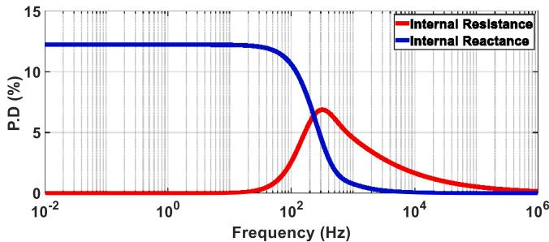  
Fig. 2. Percentage deviation between formulations.

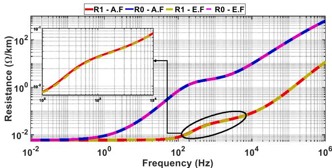  
Fig. 3. Internal resistance in positive and zero sequence.

increases, the earth-return impedance becomes the predominant factor. Figs. 3 and 4 presents the resistance and inductance for both sequences, showing differences in the frequency range in which the maneuvers occur, where A.F means approximate formula and E.F, exact formula. Meanwhile, these parameters are almost identical for phenomena such as atmospheric discharges, which involve high-frequency ranges. At this frequency, this implies that the approximate formulation will yield results similar to those obtained with the exact formulation.

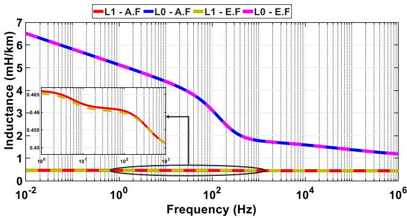  
Fig. 4. Internal Inductance in positive and zero sequence.

The differences in active power, Joule effect losses, and electrical parameters in the frequency domain observed for the half-wavelength transmission line (TL3) highlight the need for a more detailed and accurate study of the impact of approximate formulations in both steady-state and transient conditions, specially, in energisation maneuvers.

# 4. Statistical behaviour of the circuit breakers

To accurately explore the impact of transient conditions, such as manoeuvres, it is crucial to understand the switching process, which is inherently random and can lead to overvoltages in the power system. The circuit breaker operation involves the protection relay sending a signal to open or close at a specific moment. Following this, the circuit breaker requires additional time to mechanically operate its poles, representing the actual closing or opening of the circuit. However, both the signal transmission and the mechanical operation of the poles are neither instantaneous nor precisely timed, which introduces random timing. This time can be modelled using statistical parameters: the signal sent by the protection relay typically follows a uniform distribution, while the mechanical operation of the poles adheres to a normal (Gaussian) distribution [19–21]. Understanding these statistical variations is essential for accurately assessing the system’s transient behaviours and potential overvoltages.

# 5. Results

This section presents and discusses the steady-state and transient results obtained from implementing the HWTL in the electric power network described in [3]. Its implementation in PSCAD/EMTDC is shown in Fig. 5. The electric network comprises a 15 kV generation system, a 15/800 kV transformer, and a 2600 km transmission line (HWTL). This transmission line connects to a substation that steps down the voltage from 800 kV to 500 kV, which is then linked to the main system through four single-circuit 500 kV transmission lines. Key information about these network elements is provided in Fig. 5. The HWTL features nine transposition cycles (T.C), each 288 km in length, except for the last cycle, which measures 296 km.

The steady-state analysis focuses on the voltage, the active and reactive powers at the receiving end of the HWTL, considering the power transferred to the receiving terminal as a function of the SIL guaranteeing 1 pu of voltage on this terminal, using the approximate internal impedance formulation. The transient study examines the connection of the HWTL to the power system both directly and using statistical switch.

Table 4 Internal voltage-angle of sources.   

<table><tr><td>Load (p.u)</td><td>Vs(kV)</td><td>Ve(kV)</td></tr><tr><td>0.9</td><td>16.95∠207.7°</td><td>498.82∠0°</td></tr><tr><td>1.0</td><td>17.29∠213.11°</td><td>516.37∠0°</td></tr><tr><td>1.1</td><td>17.5∠218.71°</td><td>540.1∠0°</td></tr></table>

Table 5 Voltages and powers from the steady-state analysis.   

<table><tr><td>SIL (p.u)</td><td>Formulation</td><td>V (p.u)</td><td>P (MW)</td><td>Q (MVar)</td></tr><tr><td rowspan="3">0.9</td><td>Approximate</td><td>1</td><td>4327.52</td><td>215.268</td></tr><tr><td>Exact</td><td>0.98175</td><td>4515.46</td><td>133.338</td></tr><tr><td>Δ</td><td>-0.01825</td><td>187.94</td><td>-81.93</td></tr><tr><td rowspan="3">1.0</td><td>Approximate</td><td>1</td><td>4808.35</td><td>-2.207</td></tr><tr><td>Exact</td><td>0.98106</td><td>5015.93</td><td>-61.243</td></tr><tr><td>Δ</td><td>-0.01894</td><td>207.58</td><td>-59.036</td></tr><tr><td rowspan="3">1.1</td><td>Approximate</td><td>1</td><td>5289.19</td><td>-346.59</td></tr><tr><td>Exact</td><td>0.97887</td><td>5516.43</td><td>-390.99</td></tr><tr><td>Δ</td><td>-0.02113</td><td>227.24</td><td>-44.4</td></tr></table>

# 5.1. Steady-state simulations

The steady-state analysis of the system under investigation was conducted by considering the power transfer as a function of the HWTL’s SIL. The internal parameters for generation (?? ) and the source equivalent (?? ) were set based on the parameters calculated with the approximate internal impedance formulation, established in the PSCAD/EMTDC simulation environment (see Table 4). In this analysis, it is crucial to emphasise that the internal adjustment of the sources for both formulas is identical. The objective of this analysis is to compare the voltage (V), active power (P), and reactive power (Q) values derived from the internal impedance formulae, approximate and exact, as previously shown in Table 3.

The results of the steady-state analysis, summarised in Table 5, highlighted significant discrepancies between the two formulations. In particular, looks like that the exact formulation indicates an ability to transfer higher electrical power compared to approximate formula implemented inside PSCAD/EMTDC. This occurs because the analysis is based on the SIL calculated using the approximate formula, which differs from the exact formulation. For instance, when the SIL is one p.u., the voltage remains at one p.u. using the approximate formula; however, it drops below 0.98 p.u. When the exact formula is applied, this voltage deviation, observed with the exact formulation, results in noticeable differences in active and reactive power.

Therefore, the disparity between the two formulations is substantial. For active power (P), the difference escalates in correlation with increases in SIL. Conversely, an increase in SIL results in a reduction of reactive power (Q) flux.

In general, the steady-state results indicate that if voltage sources for the HWTL are calibrated using electrical parameters derived from the approximate formula, significant discrepancies will arise in voltage at the receiver end, active power, and reactive power. Such differences are not negligible and can significantly impact voltage stability margins, power flow analysis, and operational decision-making, particularly under high-load or critical infrastructure scenarios. Thus, the following section focuses on analysing energisation manoeuvres.

# 5.2. Manoeuvres simulations

Before conducting the manoeuvres simulations on the HWTL, it is essential to note that, due to its extensive length, the electrical properties of the ground vary along its entire route. Different values of ground electrical resistivity will alter the electrical parameters, thereby affecting the outcomes of various studies. However, this variation does not

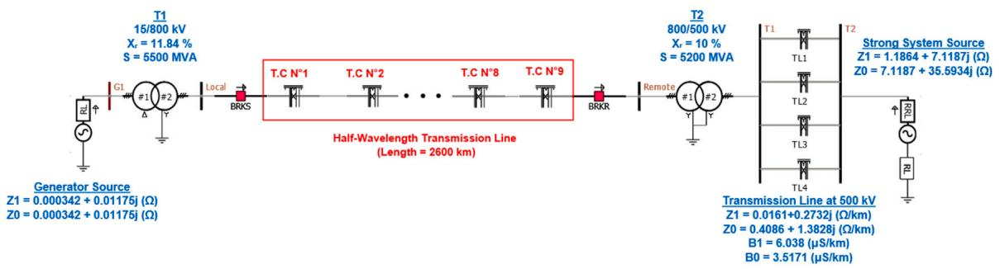  
Fig. 5. Power electric network in PSCAD/EMTDC.

Table 6 Electrical parameters in positive and zero sequence.   

<table><tr><td>Ground electrical resistivity (Ω m)</td><td>Length (km)</td><td>Progressive (km)</td></tr><tr><td>20000</td><td>0</td><td>100</td></tr><tr><td>15000</td><td>100</td><td>200</td></tr><tr><td>10000</td><td>200</td><td>400</td></tr><tr><td>5000</td><td>200</td><td>600</td></tr><tr><td>2500</td><td>1000</td><td>1600</td></tr><tr><td>1000</td><td>1000</td><td>2600</td></tr></table>

necessarily impact the results of all studies. We analysed the positivesequence impedance as ground resistivity increases to explore the effect of ground resistivity on the electrical parameters. The resistivity values considered are 1000, 2500, 5000, 10000, 15000, and 20000 ??⋅m. This analysis is presented in Fig. 6, where all parameters were calculated using the exact internal impedance formulation.

Fig. 6 shows that the positive-sequence impedance at the power system frequency of 60 Hz remains nearly constant across the entire range of ground electrical resistivity values. However, as the frequency increases, the positive-sequence impedance begins to vary with the rise in ground resistivity. For higher resistivity values, the resistance decreases, while the inductance increases as the ground resistivity increases. In the frequency range relevant to our analysis, some variations in impedance are observed. Therefore, to enhance the accuracy of the manoeuvre study and account for ground resistivity variation, we considered three cases for this study.

In the first case, Case 1, a single ground resistivity of 2000 ??⋅m is used, applying the approximate formulation for calculating the internal impedance. The Case 2 employs the exact formulation to calculate the internal impedance, using a single ground resistivity value of 2000 ??⋅m. Finally, the Case 3, which is the most accurate, involves using the exact formulation for computing the internal impedance with six different ground resistivity values, as indicated in Table 6. For the second and third cases, it is necessary to compute the series impedance and shunt admittance externally. The resulting YZ matrix can be imported into PSCAD/EMTDC. These external computations were performed with MATLAB.

The initial ground resistivity value, representing the area near the generation source, was set to 20,000 ??⋅m. As the HWTL extends further from the generation source, this resistivity value decreases, as outlined in Table 6. These values reflect the ground behaviour typical of the Brazilian Amazon region [2,22].

Considering the power electric system showed in Fig. 5, the HWTL was introduced to the system by closing the circuit breaker on the remote side at t = 0.1 s, with a phase-to-phase closing interval of 0.003 s. The resulting voltage variations for the three phases at the receiving end of the transmission line, in p.u., are presented in Figs. 7 to 9; meanwhile, Figs. 10 and 11 presents the active and reactive power at the line end.

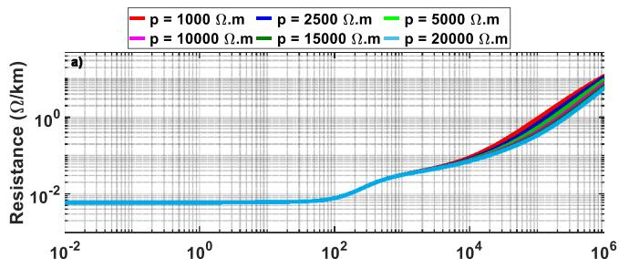

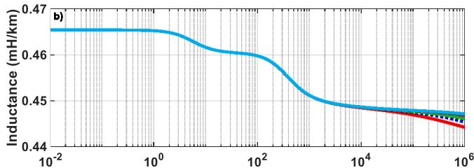  
Frequency (Hz)   
Frequency (Hz)

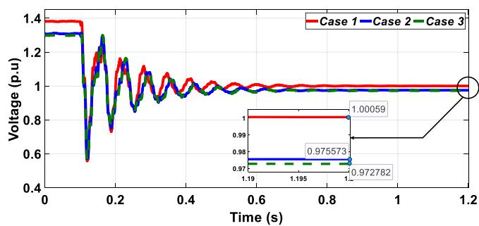  
Fig. 6. Parameter in positive sequence varying ground electrical resistivity: (a) resistance and (b) inductance.   
Fig. 7. Voltage in phase A during the connection of the line to the system.

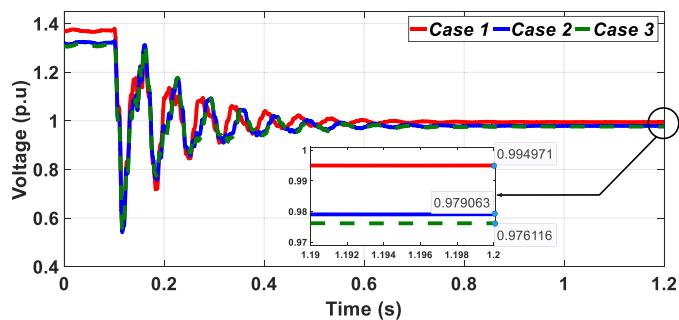  
Fig. 8. Voltage in phase B during the connection of the line to the system.

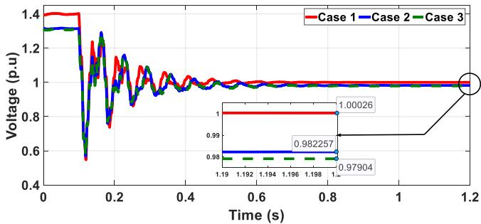  
Fig. 9. Voltage in phase C during the connection of the line to the system.

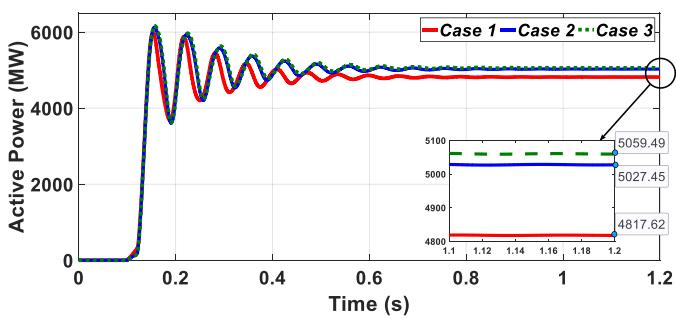  
Fig. 10. Active power during the connection of the line to the system.

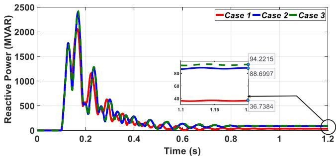  
Fig. 11. Reactive power during the connection of the line to the system.

Before closing the circuit breaker, the voltage of the three phases on the receiving side is higher in Case 1, ranging between 1.36 and 1.39 p.u. This value is lower in Cases 2 and 3, falling between 1.29 and 1.31 p.u. After closing, the transmission line adopts the system’s voltage level, as seen in Case 1. However, for Cases 2 and 3, the voltage at the end of the line does not settle at 1.0 p.u. or close to it; instead, it oscillates between 0.976 and 0.982 p.u. Among all cases, Case 3 results in the lowest steady-state voltage values after connection to the system.

On the other hand, in the steady-state, the active power in Cases 2 and 3 is higher than in Case 1 by 209.8 MW and 241.78 MW, respectively. For reactive power, after the connection to the system, Cases 2 and 3 deliver more than 2.4 times the reactive power compared to Case 1.

Since a single manoeuvre at a specific time does not accurately represent the transient behaviour on the receiving end when the transmission line is connected to the system using the circuit breaker ‘‘BRKR’’ from Fig. 5, it is necessary to perform a statistical circuit breaker analysis over one cycle of the wave (16.67 ms). For this purpose, we used the multiple-run tool with additional recording in PSCAD/EMTDC. This tool simulates the master switch, which sends signals to close the circuit breaker multiple times at varying intervals, following a uniform distribution (called ‘‘random-flat’’ in PSCAD/EMTDC). For the slave switch, we used the statistical distribution of signals for single-pole

Table 7 Transient overvoltages at line end.   

<table><tr><td>Case</td><td>Phase</td><td>Minimum</td><td>Maximum</td><td>Mean</td><td>Std Dev</td><td>Voltage (98%)</td></tr><tr><td rowspan="3">1</td><td>A</td><td>1.357</td><td>1.422</td><td>1.367</td><td>0.017</td><td>1.403</td></tr><tr><td>B</td><td>1.354</td><td>1.354</td><td>1.354</td><td>0.000</td><td>1.354</td></tr><tr><td>C</td><td>1.387</td><td>1.732</td><td>1.481</td><td>0.131</td><td>1.750</td></tr><tr><td rowspan="3">2</td><td>A</td><td>1.280</td><td>1.342</td><td>1.283</td><td>0.012</td><td>1.309</td></tr><tr><td>B</td><td>1.301</td><td>1.304</td><td>1.302</td><td>0.001</td><td>1.305</td></tr><tr><td>C</td><td>1.290</td><td>1.650</td><td>1.395</td><td>0.136</td><td>1.674</td></tr><tr><td rowspan="3">3</td><td>A</td><td>1.289</td><td>1.351</td><td>1.302</td><td>0.016</td><td>1.335</td></tr><tr><td>B</td><td>1.309</td><td>1.316</td><td>1.313</td><td>0.003</td><td>1.320</td></tr><tr><td>C</td><td>1.292</td><td>1.648</td><td>1.397</td><td>0.136</td><td>1.677</td></tr></table>

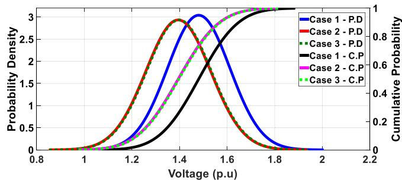  
Fig. 12. Probability density and cumulative probability - Overvoltages on phase C.

break operation available in PSCAD/EMTDC. This component generates individual signals to operate (open/close) each single-pole breaker with a delay time corresponding to the interval at which each breaker pole will operate. Since the signals are sent with random delays for each pole, the circuit breaker’s three poles operate at different times. The random delay follows a normal distribution, where, for this study, the average operation time for each pole is 5 ms [23], with a standard deviation of 0.625 ms and truncation at ±4?? (number of standard deviations). It is important to emphasise that the same statistical distribution was used for all three cases, ensuring that the results can be compared based on the same circuit breaker closing time.

Using an initial seed of 23309, 200 simulations were conducted for each case. The results of the overvoltages at the line end, in p.u., are shown in Table 7. As expected, the maximum values occur in Case 1, while the lowest values are observed in Case 2. The differences between Cases 2 and 3 are notable in phases A and B. The highest value of overvoltages occurs in the phase C for the three cases. Furthermore, while the standard deviation for phases A and B is approximately 11 kV, the standard deviation for phase C is significantly higher at around 88 kV.

Fig. 12 shows the probability density (P.D) and cumulative probability (C.P) of the overvoltages for phase C at the line end, as this phase exhibits both the highest values among the phases and the greatest standard deviation. The Case 1 - P.D. curve indicates that Case 1 has a higher probability of experiencing greater overvoltage values compared to Cases 2 and 3. Additionally, between Cases 2 and 3, Case 3 shows a slightly higher likelihood of higher overvoltages, though the difference is minimal. On the other hand, Case 2 has the highest probability of lower overvoltage values.

# 6. Conclusions

This study systematically examines the impact of approximate and exact internal impedance formulations on both steady-state and transient analyses in a slightly longer half-wavelength transmission line for ultra-long distance power transmission. The results show that for a 2600 km transmission line, the use of approximate formulations leads to a reduction of the calculated SIL by 3.45 MW, while the Joule

effect losses show a deviation of about 1 % compared to the exact formulation.

The steady-state analysis shows that the voltage at the receiving end of the transmission line is underestimated by almost 2 % when electrical parameters are calculated using the approximate formulation. In addition, active power transfer increases by up to 207.58 MW when using the exact formulation for a 1.0 SIL, with corresponding reactive power variations of over 59 MVar at the same SIL level. These discrepancies can have an impact on voltage stability and power system operation and require careful consideration when modelling HWTLs.

Under transient conditions, the statistical switching analysis performed with 200 simulations confirms that the approximate formulation results in higher predicted overvoltages in all phases. The most significant deviation occurs in phase C, where the peak overvoltage using the approximate method is 1.732 pu compared to 1.650 pu using the exact formulation. Furthermore, variations in the electrical resistivity of the ground along the transmission line route were observed to influence the transient behaviour, although their effect remains secondary to the choice of impedance formulation. While there are uncertainties regarding soil resistance, their impact on steady-state electrical parameters is minimal at power system frequencies (60 Hz), as demonstrated in the analysis of positive-sequence impedance. However, higher frequencies, particularly in transient studies where ground resistivity can introduce small deviations, do reveal some variations. Notwithstanding this, the findings indicate that the choice of internal impedance formulation has a far greater impact on accuracy than variations in ground resistance.

Overall, this study provides a quantitative basis for evaluating the suitability of approximate impedance models in HWTL applications. The results highlight the need to use exact formulations where high accuracy is required, particularly in scenarios involving long distance transmission and transient studies. Future work will extend this analysis to short-circuit studies and further investigate the influence of frequency-dependent effects on system performance and evaluate the accuracy fault event detection and fault location.

# CRediT authorship contribution statement

J.E. Guevara Asorza: Methodology, Investigation, Writing – original draft, Conceptualization. R.E. Rojas: Methodology, Writing – review & editing, Conceptualization, Writing – original draft, Investigation. J. Pissolato Filho: Writing – review & editing, Validation, Supervision, Visualization.

# Declaration of competing interest

The authors declare that they have no known competing financial interests or personal relationships that could have appeared to influence the work reported in this paper.

# Data availability

No data was used for the research described in the article.

# References

[1] J.S. Ortega, M.C. Tavares, New perspectives about AC link based on halfwavelength properties for bulk power transmission with flexible distance, IET Gener. Transm. Distrib. 12 (12) (2018) 3005–3012, [Online]. Available: https: //ietresearch.onlinelibrary.wiley.com/doi/abs/10.1049/iet-gtd.2017.1554.

[2] J. Santiago, M.C. Tavares, Analysis of half-wavelength transmission line under critical balanced faults: Voltage response and overvoltage mitigation procedure, Electr. Power Syst. Res. 166 (2019) 99–111.   
[3] A.F. Moro, J.S. Ortega, M.C. Tavares, Performance evaluation of power differential protection applied to half-wavelength transmission lines, Electr. Power Syst. Res. 209 (2022) 107998, [Online]. Available: https://www.sciencedirect.com/ science/article/pii/S0378779622002243.   
[4] B.C. Wadell, Transmission Line Design Handbook, Artech House, Boston, MA, USA, 1991.   
[5] F.S. Prabhakara, K. Parthasarathy, H.N.R. Rao, Analysis of natural half-wavelength power transmission lines, IEEE Trans. Power Appar. Syst. PAS-88 (12) (1969) 1787–1794.   
[6] F.J. Hubert, M.R. Gent, Half-wavelength power transmission lines, IEEE Spectr. 2 (1) (1965) 87–92.   
[7] H.M.J.D. Silva, M. Shafieipour, On combining classical and numerical techniques for extracting the impedance and admittance of cables and overhead lines, 2019, [Online]. Available: https://api.semanticscholar.org/CorpusID:229938717.   
[8] H. Dommel - MicroTran Power System Analysis Corporation, EMTP theory book, 1992.   
[9] R. Galloway, Calculation of electrical parameters for short and long polyphase transmission lines, Proc. Inst. Electr. Eng. 111 (1964) 2051–2059(8), [Online]. Available: https://digital-library.theiet.org/content/journals/10.1049/piee.1964. 0331.   
[10] L. Wedepohl, Transient analysis of underground power-transmission systems. system-model and wave-propagation characteristics, Proc. Inst. Electr. Eng. 120 (1973) 253–260(7), [Online]. Available: https://digital-library.theiet.org/ content/journals/10.1049/piee.1973.0056.   
[11] The ATPDraw simulation software (2019), Version 7.0, 2019, https://www. atpdraw.net/. (Accessed 01 July 2023).   
[12] PSCAD simulation software, 2020, [Online]. Available: https://hvdc.ca/pscad. (Accessed 30 September 2020).   
[13] Manitoba Hydro International Ltd, Transient Analysis for PSCAD Power System Simulation - USER’S GUIDE - A Comprehensive Resource for EMTDC, MicroTran Power System Analysis Corporation, 2018.   
[14] A.C.S. Lima, R.A.R. Moura, M.A.O. Schroeder, M.T.C. de Barros, Different approaches on modeling of overhead lines with ground displacement currents, in: International Conference on Power Systems Transients, IPST, 2017.   
[15] J.E. Guevara, J.S.L. Colqui, J.P. Filho, Analysis of overvoltage and backflashover with different transmission line models, in: SoutheastCon 2024, 2024, pp. 498–503.   
[16] J.R. Carson, Wave propagation in overhead wires with ground return, Bell Syst. Tech. J. 5 (4) (1926) 539–554.   
[17] J.S. Acosta, M.C. Tavares, Methodology for optimizing the capacity and costs of overhead transmission lines by modifying their bundle geometry, Electr. Power Syst. Res. 163 (2018) 668–677, Advances in HV Transmission Systems. [Online]. Available: https://www.sciencedirect.com/science/article/pii/ S0378779617304091.   
[18] A. Moro, J. Santiago, M. Tavares, Power differential protection for halfwavelength transmission lines—Software in the loop analysis, Electr. Power Syst. Res. 223 (2023) 109626, [Online]. Available: https://www.sciencedirect.com/ science/article/pii/S0378779623005151.   
[19] J. Martinez, R. Natarajan, E. Camm, Comparison of statistical switching results using Gaussian, uniform and systematic switching approaches, in: 2000 Power Engineering Society Summer Meeting (Cat. No.00CH37134), vol. 2, 2000, pp. 884–889.   
[20] P. Gomez, Performance evaluation of time domain transmission line models for a statistical study of switching overvoltages, IEEE Lat. Am. Trans. 11 (4) (2013) 1036–1046.   
[21] P. Mestas, M.C. Tavares, Relevant parameters in a statistical analysis— Application to transmission-line energization, IEEE Trans. Power Deliv. 29 (6) (2014) 2605–2613.   
[22] E.A. Silva, F.A. Moreira, M.C. Tavares, Energization simulations of a halfwavelength transmission line when subject to three-phase faults—Application to a field test situation, Electr. Power Syst. Res. 138 (2016) 58–65, Special Issue: Papers from the 11th International Conference on Power Systems Transients (IPST), [Online]. Available: https://www.sciencedirect.com/science/article/pii/ S0378779616300761.   
[23] A. Odon, Circuit Breakers Timing Test System, Meas. Sci. Rev. 7 (section 3, 5) (2007) 56–58, [Online]. Available: https://www.measurement.sk/2007/S3/ Odon.pdf.