# 一种用于电磁暂态仿真的两电平电压源型换流器解耦模型

刘刚 1，张春强 1，马嘉昊 1，李蕴红 2，王潇 2，汪燕 1，刘晋 1，姚蜀军 1

（1．华北电力大学电气与电子工程学院，北京市 昌平区 102206；  
2．华北电力科学研究院有限责任公司，北京市 西城区 100045）

Two-level Voltage Source Converter Decoupling Model for Electromagnetic Transient Simulation

LIU Gang1, ZHANG Chunqiang1, MA Jiahao1, LI Yunhong2, WANG Xiao2, WANG Yan1, LIU Jin1, YAO Shujun1

(1. School of Electrical and Electronic Engineering, North China Electric Power University, Changping District, Beijing 102206, China; 2. North China Electric Power Research Institute Co., Ltd., Xicheng District, Beijing 100045, China)

ABSTRACT: Due to the time-varying nodal matrix of the electromagnetic transient detailed model of the VSC converter, the simulation efficiency is usually low when simulating a large power grid of a large-scale new energy station. To solve this problem, based on the principle of semi-implicit latency decoupling, a decoupling model with the characteristics of uncomplicated decoupled electric circuit, invariable nodal admittance matrix and convenient parallel computing is proposed. Firstly, according to the state equation of the two-level VSC converter and with the methods of matrix splitting and latency technology, the half-step time latency decoupling models of the DC-side capacitor-grounded VSC converter and the DC-side capacitor-ungrounded VSC converter respectively are constructed, realizing the decoupling and parallelization of the AC and DC sides. Then using the characteristics of the longitudinal commutation and mutually exclusive conduction of the upper and lower arms of the VSC to simplify the calculation of the decoupling model parameters so that the system admittance matrix remains constant and further improves the calculation efficiency. In addition, the method in this paper accurately retains the internal information of the converter. The

accuracy and effectiveness of the proposed method is verified by the results of simulation examples.

KEY WORDS: semi-implicit latency decoupling technology; voltage source converter; electromagnetic transient simulation; constant nodal admittance matrix; parallel simulation

摘要：由于电压源型换流器(voltage source converter, VSC)电磁暂态详细模型导纳矩阵时变，因此对含大规模新能源场站的大电网进行仿真时，仿真效率低下。针对这一问题，该文基于半隐式延迟解耦原理，提出一种解耦电路简单、导纳矩阵恒定、可计及换流器内部特性的解耦模型。首先从VSC换流器的状态方程出发，利用矩阵分裂和延迟技术，分别构建直流侧电容接地 VSC 换流器和直流侧电容不接地 VSC 换流器的半步时延模型，实现交直流侧的解耦；然后利用VSC上下桥臂纵向换流互斥导通的特点，简化解耦模型参数计算，从而使得系统导纳矩阵恒定，进一步提高计算速度。算例结果表明了所提方法在保持较高精度的同时提升了计算速度。

关键词：半隐式延迟解耦；电压源型换流器；电磁暂态仿真； 导纳矩阵恒定；并行仿真

DOI：10.13335/j.1000-3673.pst.2022.0096

# 0 引言

随着新型电力系统概念的提出，新能源发电及并网需求进一步扩大，电力系统将呈现出高比例可再生能源占比和高比例电力电子设备接入的“双高”特征[1-4]。电压源型换流器(voltage source converter，VSC)具有控制灵活等优点，因而广泛应用于新能源发电[5-7]。然而，在含有大量风光储场站的大电网的

电磁暂态仿真场景中，由于传统的 VSC 详细模型仿真速度慢，如果对每台换流器都使用详细模型，系统的仿真速度将大幅降低。以某一省级电网为例，目前区内风电场数量已超过 100 座，开展电网全电磁暂态仿真10s过程耗时超过3h。因此需要研究高效的VSC换流器电磁暂态仿真模型[8]。

因为导纳矩阵随开关动作的时变特性，VSC详细模型很大一部分计算量源于导纳矩阵的 LU 重分解，使得仿真速度很慢。针对这一特点，文献[9-10]提出一种恒导纳开关模型，但是存在着开关虚拟功率损耗较大和参数配置复杂的问题。文献[11-12]提出基于响应匹配的广义小步长模型降低虚拟损耗，但由于存在非状态量突变，在开关动作时仍可能存在一定的数值稳定性问题。此外，这2 种方法都要求亚微秒级的步长，限制了仿真效率的提升。

针对VSC开关频率较高，仿真时不得不采用小步长而引起仿真速度较慢的问题，可采用忽略换流器内部特性而只对外特性建模的思路。文献[13-16]提出了两电平 VSC 的平均值模型，文献[17]提出分段平均化方法，可计及文献[13-16]中平均值模型所忽略的换流器的纹波。为了平衡仿真的效率和精度，文献[18]将分段平均法和广义状态空间平均法结合，提出分段广义平均模型。除了平均值模型外，基于傅里叶变换的建模方法同样可以增大仿真步长，提高仿真速度。文献[19]提出动态/扩展谐波域法，文献[20]提出了状态空间平均法，文献[21]提出了广义状态空间平均法，文献[22-26]基于动态相量法，以上 3 种方法建立的 VSC 换流器模型都是 VSC 换流器的复数域模型；文献[27-28]提出宽频时间尺度变换和多频段时间尺度变换的方法进行仿真提速。这些方法都是基于傅里叶变换的方法。当谐波阶数足够多时，模型精度可以接近详细模型。但是在实际仿真中，由于系统规模庞大，计算资源有限，为了保证仿真速度，通常只考虑基波和少数阶谐波。因而上述方法在实际使用过程中，虽均可增大仿真步长，但在含有宽频信号的场景下，存在较大的截断误差，仿真精度不高。

为了提高大规模场景中的仿真速度，对换流器进行解耦，采用并行计算是一个有效途径。文献[29]基于延迟插入法，实现了直流侧电容接地 VSC 换流器的交直流侧解耦，但文中没有涉及直流侧电容不接地的情况。文献[30]以单个电感或电容为解耦元件，利用前向欧拉法的显式积分特性，实现交直流侧解耦；但由于前向欧拉法的精度和稳定性都较差，这种解耦方法不适用于开关频繁动作的场景。文献[31-32]提出

自适应离散事件驱动(flexible adaptive discrete state，FA-DS)算法，利用状态变量进行解耦，但是其本质上仍是前向欧拉法，数值精度低，并且解耦后模型的导纳矩阵仍然时变，降低了仿真效率。

综上所述，目前对大规模风光储场站进行快速仿真时仍存在如下问题：一是由于传统VSC详细模型的导纳矩阵时变，导致整个大电网的导纳矩阵也时变，从而影响了整个大电网的仿真效率；二是现有的VSC换流器改进模型，为了提高仿真效率，大多都忽略了换流器的内部损耗，仿真精度需要提高。

文献[33]提出半隐式延迟解耦电磁暂态并行仿真方法(semi-implicit latency decoupling and parallelingtechnology，SILDP)，对交流大电网进行分网，实现交流电网的并行计算与交流大电网的提速仿真。文献[34]利用该方法建立了模块化多电平变换器(modular multilevel converter，MMC)通用半隐式延迟解耦模型。文献[35]将半隐式延迟解耦用在拓扑更为复杂的电力电子变压器的建模仿真中。MMC的半隐式延迟解耦模型是对桥臂子模块进行建模，然后将子模块的解耦模型接入到各桥臂之中，电力电子变压器的建模也是对各 H 桥、双有源桥(dual active bridge，DAB)模块进行解耦，再将各单元按照拓扑进行连接。这2种设备中，由于换流器的交流侧相与相之间不存在耦合，可以先利用替代定理建立单相桥臂的解耦模型，再利用叠加定理得到完整的三相解耦模型。

而两电平 VSC 换流器存在 2 种情况：一种是直流侧电容接地 VSC 换流器，该拓扑由于不存在相间耦合，其半隐式延迟解耦模型的推导过程与MMC 和电力电子变压器(power electronic transformer，PET)类似。另一种是直流侧电容不接地的情况。由于直流侧电容不接地，交流侧相与相之间通过直流电容耦合，回路中会出现 2个电感，不满足替代定理，无法简单地用替代定理按相进行分析，因而也不能类似MMC和PET那样简单地得到半隐式延迟解耦电路，进而无法用于 VSC 换流器的交直流侧以及 VSC换流器与系统其他部分的解耦。

本文面向 VSC 换流器的高效仿真，研究半隐式延迟解耦法在 VSC 换流器中的应用，重点解决直流电容不接地情况下半隐式延迟解耦方法的适用问题，以期为含大规模新能源场站的大电网快速仿真提供高效模型。文中，首先对直流侧电容接地与直流侧电容不接地的2种VSC拓扑列写状态方程并进行分裂和延迟，得到2种不同拓扑VSC的半隐式延迟解耦模型。既实现了交直流侧的解耦，降低矩阵计算规模，又可实现交直流侧的并行计算。然后，根据VSC上、

下桥臂纵向换流互斥导通的特点，在简化解耦模型参数计算的同时，还使得系统导纳矩阵恒定，开关动作时无需LU重分解，进一步提高了计算效率。最后通过 2 个算例验证本文方法的准确性和有效性。

# 1 两电平VSC换流器拓扑

两电平VSC换流器一般分为直流侧电容接地和不接地2种拓扑，见图1所示，变量定义见附录D。

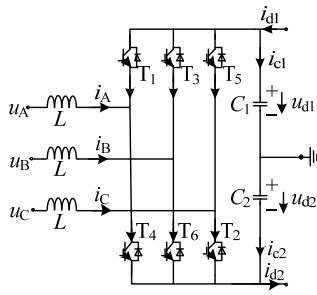  
(a)电容接地

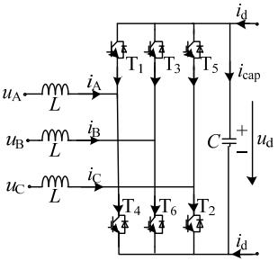  
(b)电容不接地  
图 1 2 种 VSC 拓扑  
Fig. 1 Diagram of VSC topology

# 2 两电平 VSC 的解耦

半隐式延迟解耦法对系统的状态空间矩阵进行分裂，并分成不同的状态变量组，各变量组之间使用不同的积分方法，各状态变量组的半时步延迟解耦得以实现。该方法的原理、特点见附录或文献[33]。下面将该方法具体应用于2种不同拓扑的VSC换流器。

# 2.1 直流侧电容接地的 VSC 解耦

在某个给定的开关组合状态下，直流侧电容接地 VSC 电路满足替代定理和叠加定理，因此可先利用替代定理建立单相桥臂的解耦模型，再利用叠加定理得到完整的 VSC三相解耦模型。

图 2(a)为 VSC 单相桥臂拓扑。以 A 相为例，$u _ { \mathrm { A } }$ 和 $i _ { \mathrm { A } }$ 分别表示交流侧对地的相电压和相电流； $u _ { \mathrm { d l } }$ 和 $u _ { \mathrm { d } 2 }$ 分别表示直流侧 2个电容的电压； $i _ { \mathrm { c l } }$ 和 $i _ { \mathrm { c } 2 }$ 表示流过 2 个电容的电流； $i _ { \mathrm { d l } }$ 和 $i _ { \mathrm { d } 2 }$ 表示直流侧输入电流； $T _ { \mathrm { u } }$ 和 $T _ { \mathrm { d } }$ 分别表示上下桥臂 IGBT 与二极管构成的开关组；开关组采用二值电阻模型，导通时$R _ { \mathrm { o n } } { = } 0 . 0 1 \Omega$ ，关断时 $R _ { \mathrm { o f f } } { = } 1 0 ^ { 6 } \Omega$ 。VSC 单相桥臂的二

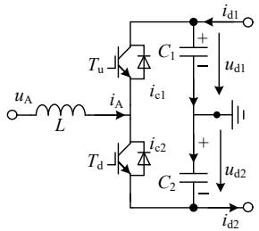  
(a) 拓扑

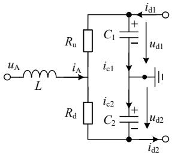  
(b) 等效电路  
图 2 电容接地 VSC 单个桥臂的拓扑  
Fig. 2 Topology of a single bridge arm of a capacitor-grounded VSC

值电阻等效电路如图 2(b)所示， $R _ { \mathrm { u } }$ 和 $R _ { \mathrm { d } }$ 分别表示上下桥臂的等值电阻。

以电感电流和电容电压为状态变量，根据替代定理列写状态方程可得：

$$
\left\{ \begin{array}{l} L \frac {\mathrm {d} i _ {\mathrm {A}}}{\mathrm {d} t} = - \frac {R _ {\mathrm {u}} R _ {\mathrm {d}}}{R _ {\mathrm {u}} + R _ {\mathrm {d}}} i _ {\mathrm {A}} - \frac {R _ {\mathrm {d}}}{R _ {\mathrm {u}} + R _ {\mathrm {d}}} u _ {\mathrm {d 1}} + \frac {R _ {\mathrm {u}}}{R _ {\mathrm {u}} + R _ {\mathrm {d}}} u _ {\mathrm {d 2}} + u _ {\mathrm {A}} \\ C _ {1} \frac {\mathrm {d} u _ {\mathrm {d l}}}{\mathrm {d} t} = - \frac {1}{R _ {\mathrm {u}} + R _ {\mathrm {d}}} u _ {\mathrm {d l}} - \frac {1}{R _ {\mathrm {u}} + R _ {\mathrm {d}}} u _ {\mathrm {d 2}} + \frac {R _ {\mathrm {d}}}{R _ {\mathrm {u}} + R _ {\mathrm {d}}} i _ {\mathrm {A}} + i _ {\mathrm {d l}} \\ C _ {2} \frac {\mathrm {d} u _ {\mathrm {d 2}}}{\mathrm {d} t} = - \frac {1}{R _ {\mathrm {u}} + R _ {\mathrm {d}}} u _ {\mathrm {d 2}} - \frac {1}{R _ {\mathrm {u}} + R _ {\mathrm {d}}} u _ {\mathrm {d l}} - \frac {R _ {\mathrm {u}}}{R _ {\mathrm {u}} + R _ {\mathrm {d}}} i _ {\mathrm {A}} + i _ {\mathrm {d 2}} \end{array} \right. \tag {1}
$$

正常情况下，上下桥臂开关组互斥导通，令$R _ { \mathrm { s u m } } = R _ { \mathrm { u } } + R _ { \mathrm { d } } = R _ { \mathrm { o n } } + R _ { \mathrm { o f f } } , R _ { \mathrm { m u l } } = R _ { \mathrm { u } } R _ { \mathrm { d } } = R _ { \mathrm { o n } } R _ { \mathrm { o f f } } ,$ ，由式(1)可得：

$$
\left[ \begin{array}{l} L \frac {\mathrm {d} i _ {\mathrm {A}}}{\mathrm {d} t} \\ \hline C _ {1} \frac {\mathrm {d} u _ {\mathrm {d} 1}}{\mathrm {d} t} \\ C _ {2} \frac {\mathrm {d} u _ {\mathrm {d} 2}}{\mathrm {d} t} \end{array} \right] = \left[ \begin{array}{c c c} - R _ {\mathrm {e q}} & - k _ {\mathrm {u} 1} & k _ {\mathrm {u} 2} \\ \hline k _ {\mathrm {i} 1} & - G _ {\mathrm {e q} 1} & - k _ {\mathrm {i c} 2} \\ - k _ {\mathrm {i} 2} & - k _ {\mathrm {i c} 1} & - G _ {\mathrm {e q} 2} \end{array} \right] \left[ \begin{array}{c} i _ {\mathrm {A}} \\ \hline u _ {\mathrm {d} 1} \\ u _ {\mathrm {d} 2} \end{array} \right] + \left[ \begin{array}{c} u _ {\mathrm {A}} \\ \hline i _ {\mathrm {d} 1} \\ i _ {\mathrm {d} 2} \end{array} \right] (2)
$$

式中： $R _ { \mathrm { e q } } { = } R _ { \mathrm { m u l } } / R _ { \mathrm { s u m } } ; ~ G _ { \mathrm { e q 1 } } { = } G _ { \mathrm { e q 2 } } { = } k _ { \mathrm { i c 1 } } { = } k _ { \mathrm { i c 2 } } { = } 1 / R _ { \mathrm { s u m } } ; ~ k _ { \mathrm { u l } } { = }$ $k _ { \mathrm { i l } } { = } R _ { \mathrm { d } } / R _ { \mathrm { s u m } } ; k _ { \mathrm { u 2 } } { = } k _ { \mathrm { i 2 } } { = } R _ { \mathrm { u } } / R _ { \mathrm { s u m } } \circ$ 。

根据半隐式延迟解耦法，按电感电流和电容电压对状态变量分组。由于 $R _ { \mathrm { s u m } } { = } R _ { \mathrm { o n } } { + } R _ { \mathrm { o f f } }$ 趋向于无穷大，因此 $G _ { \mathrm { e q l } } { = } G _ { \mathrm { e q } 2 } { = } k _ { \mathrm { i c l } } { = } k _ { \mathrm { i c } 2 } { \approx } 0$ ， $R _ { \mathrm { e q } } { = } R _ { \mathrm { m u l } } / R _ { \mathrm { s u m } } { \approx } R _ { \mathrm { o n } } ;$ ，式(2)的分裂形式如式(3)所示。

$$
\left[ \begin{array}{l} L \frac {\mathrm {d} i _ {\mathrm {A}}}{\mathrm {d} t} \\ \hline C _ {1} \frac {\mathrm {d} u _ {\mathrm {d} 1}}{\mathrm {d} t} \\ C _ {2} \frac {\mathrm {d} u _ {\mathrm {d} 2}}{\mathrm {d} t} \end{array} \right] = \left[ \begin{array}{c c c} - R _ {\mathrm {e q}} & 0 & 0 \\ \hline 0 & 0 & 0 \\ 0 & 0 & 0 \end{array} \right] \left[ \begin{array}{l} i _ {\mathrm {A}} \\ u _ {\mathrm {d} 1} \\ u _ {\mathrm {d} 2} \end{array} \right] +
$$

$$
\left[ \begin{array}{c c c} 0 & - k _ {\mathrm {u} 1} & k _ {\mathrm {u} 2} \\ \hline k _ {\mathrm {i} 1} & 0 & 0 \\ - k _ {\mathrm {i} 2} & 0 & 0 \end{array} \right] \left[ \begin{array}{c} i _ {\mathrm {A}} \\ u _ {\mathrm {d} 1} \\ u _ {\mathrm {d} 2} \end{array} \right] + \left[ \begin{array}{c} u _ {\mathrm {A}} \\ i _ {\mathrm {d} 1} \\ i _ {\mathrm {d} 2} \end{array} \right] \tag {3}
$$

根据半隐式延迟解耦法对式(3)进行半步延时，最终得到单相桥臂的半步时延差分方程。

$$
\begin{array}{l} \left[ \begin{array}{c} L \left(i _ {\mathrm {A}} ^ {n + \frac {1}{2}} - i _ {\mathrm {A}} ^ {n - \frac {1}{2}}\right) \\ \hline C _ {1} \left(u _ {\mathrm {d} 1} ^ {n + 1} - u _ {\mathrm {d} 1} ^ {n}\right) \\ C _ {2} \left(u _ {\mathrm {d} 2} ^ {n + 1} - u _ {\mathrm {d} 2} ^ {n}\right) \end{array} \right] = \left[ \begin{array}{c c c} - R _ {\mathrm {e q}} & 0 & 0 \\ \hline 0 & 0 & 0 \\ 0 & 0 & 0 \end{array} \right] \left[ \begin{array}{c} i _ {\mathrm {A}} ^ {n + \frac {1}{2}} + i _ {\mathrm {A}} ^ {n - \frac {1}{2}} \\ u _ {\mathrm {d} 1} ^ {n + 1} + u _ {\mathrm {d} 1} ^ {n} \\ u _ {\mathrm {d} 2} ^ {n + 1} + u _ {\mathrm {d} 2} ^ {n} \end{array} \right] \frac {\Delta t}{2} + \\ \left[ \begin{array}{c c c} 0 & - k _ {\mathrm {u} 1} & k _ {\mathrm {u} 2} \\ \hline k _ {\mathrm {i} 1} & 0 & 0 \\ - k _ {\mathrm {i} 2} & 0 & 0 \end{array} \right] \left[ \begin{array}{l} i _ {\mathrm {A}} ^ {n + \frac {1}{2}} \\ \hline u _ {\mathrm {d} 1} ^ {n} \\ u _ {\mathrm {d} 2} ^ {n} \end{array} \right] \Delta t + \left[ \begin{array}{l} u _ {\mathrm {A}} ^ {n} \\ \hline i _ {\mathrm {d} 1} ^ {n + \frac {1}{2}} \\ i _ {\mathrm {d} 2} ^ {n + \frac {1}{2}} \end{array} \right] \Delta t \tag {4} \\ \end{array}
$$

与式(4)对应的解耦电路如图 3 所示，变量定义

见附录 D。其中： $U _ { \mathrm { e q } } = \ k _ { \mathrm { u 2 } } u _ { \mathrm { d 2 } } - k _ { \mathrm { u 1 } } u _ { \mathrm { d 1 } } , \ J _ { \mathrm { e q 1 } } = k _ { \mathrm { i 1 } } i _ { \mathrm { A } }$ ，$J _ { \mathrm { e q } 2 } { = } k _ { \mathrm { i } 2 } i _ { \mathrm { A } }$ 。各状态变量的迭代式见附录 A.1。

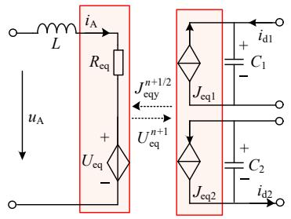  
图 3 电容接地 VSC 单个桥臂的解耦电路  
Fig. 3 Decoupling circuit of a single bridge arm of capacitor-grounded VSC

对交流侧每一相采用相同的方法进行解耦，最后通过叠加定理可得到三相完整解耦电路，如图4所示，变量定义见附录 D。各受控源系数以及相关变量的表达式见附录 A.2。

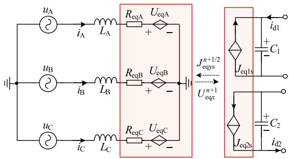  
图4 电容接地VSC 解耦电路  
Fig. 4 Decoupling circuit of capacitor-grounded VSC

# 2.2 直流侧电容不接地的 VSC 解耦

直流侧电容不接地VSC的二值电阻拓扑见图5。$u _ { x }$ 表示交流侧某一相的相电压(xA、B、C，表示A、B、C三相，下同)， $i _ { x }$ 表示交流侧某一相的相电流，$u _ { \mathrm { d } }$ 表示直流侧电容电压， $i _ { \mathrm { c a p } }$ 表示流过电容的电流，$i _ { \mathrm { d } }$ 表示直流侧输入电流， $R _ { 1 } { - } R _ { 6 }$ 为各桥臂二值电阻。

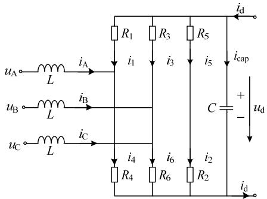  
图5 电容不接地VSC 的等效电路  
Fig. 5 Equivalent circuit of VSC with ungrounded capacitor

由于直流侧电容不接地，交流侧两相之间通过直流电容构成回路，回路中出现 2 个电感，不满足替代定理，无法按相分析。下面推导适用这一特点的解耦电路。

以电容电流和电感电压为状态变量，对 VSC

整体列写状态方程可得：

$$
\left\{ \begin{array}{l} C \frac {\mathrm {d} u _ {\mathrm {d}}}{\mathrm {d} t} = \frac {R _ {4} i _ {\mathrm {A}} - u _ {\mathrm {d}}}{R _ {1} + R _ {4}} + \frac {R _ {6} i _ {\mathrm {B}} - u _ {\mathrm {d}}}{R _ {3} + R _ {6}} + \frac {R _ {2} i _ {\mathrm {C}} - u _ {\mathrm {d}}}{R _ {5} + R _ {2}} + i _ {\mathrm {d}} \\ u _ {\mathrm {A}} - u _ {\mathrm {B}} = L \frac {\mathrm {d} i _ {\mathrm {A}}}{\mathrm {d} t} - L \frac {\mathrm {d} i _ {\mathrm {B}}}{\mathrm {d} t} + \frac {R _ {4}}{R _ {1} + R _ {4}} u _ {\mathrm {d}} - \frac {R _ {6}}{R _ {3} + R _ {6}} u _ {\mathrm {d}} + \\ \frac {R _ {1} R _ {4}}{R _ {1} + R _ {4}} i _ {\mathrm {A}} - \frac {R _ {3} R _ {6}}{R _ {3} + R _ {6}} i _ {\mathrm {B}} \\ u _ {\mathrm {B}} - u _ {\mathrm {C}} = L \frac {\mathrm {d} i _ {\mathrm {B}}}{\mathrm {d} t} - L \frac {\mathrm {d} i _ {\mathrm {C}}}{\mathrm {d} t} + \frac {R _ {6}}{R _ {3} + R _ {6}} u _ {\mathrm {d}} - \frac {R _ {2}}{R _ {5} + R _ {2}} u _ {\mathrm {d}} + (5) \\ \frac {R _ {3} R _ {6}}{R _ {3} + R _ {6}} i _ {\mathrm {B}} - \frac {R _ {5} R _ {2}}{R _ {5} + R _ {2}} i _ {\mathrm {C}} \\ u _ {\mathrm {C}} - u _ {\mathrm {A}} = L \frac {\mathrm {d} i _ {\mathrm {C}}}{\mathrm {d} t} - L \frac {\mathrm {d} i _ {\mathrm {A}}}{\mathrm {d} t} + \frac {R _ {2}}{R _ {5} + R _ {2}} u _ {\mathrm {d}} - \frac {R _ {4}}{R _ {1} + R _ {4}} u _ {\mathrm {d}} + \\ \frac {R _ {5} R _ {2}}{R _ {5} + R _ {2}} i _ {\mathrm {C}} - \frac {R _ {3} R _ {6}}{R _ {3} + R _ {6}} i _ {\mathrm {A}} \end{array} \right.
$$

类似的，正常情况下，VSC 每相上下桥臂开关组互斥导通，令 $R _ { \mathrm { s u m } } = R _ { 1 } + R _ { 4 } = R _ { 3 } + R _ { 6 } = R _ { 5 } + R _ { 2 } = R _ { \mathrm { o n } } + R _ { \mathrm { o f f } } ;$ $R _ { \mathrm { m u l } } { = } R _ { 1 } R _ { 4 } { = } R _ { 3 } R _ { 6 } { = } R _ { 5 } R _ { 2 } { = } R _ { \mathrm { o n } } R _ { \mathrm { o f f } } { \circ }$ 。为了直观看出解耦电路的具体形式，对状态方程(5)进行整合，可得：

$$
\left\{ \begin{array}{l} C \frac {\mathrm {d} u _ {\mathrm {d}}}{\mathrm {d} t} = \frac {R _ {4} i _ {\mathrm {A}} + R _ {6} i _ {\mathrm {B}} + R _ {2} i _ {\mathrm {C}}}{R _ {\mathrm {o n}} + R _ {\mathrm {o f f}}} - \frac {3}{R _ {\mathrm {o n}} + R _ {\mathrm {o f f}}} u _ {\mathrm {d}} + i _ {\mathrm {d}}. \\ \left(u _ {\mathrm {A}} - L \frac {\mathrm {d} i _ {\mathrm {A}}}{\mathrm {d} t} - \frac {R _ {\mathrm {o n}} R _ {\mathrm {o f f}}}{R _ {\mathrm {o n}} + R _ {\mathrm {o f f}}} i _ {\mathrm {A}}\right) - \left(u _ {\mathrm {B}} - L \frac {\mathrm {d} i _ {\mathrm {B}}}{\mathrm {d} t} - \right. \\ \left. \frac {R _ {\mathrm {o n}} R _ {\mathrm {o f f}}}{R _ {\mathrm {o n}} + R _ {\mathrm {o f f}}} i _ {\mathrm {B}}\right) = \frac {\left(R _ {4} - R _ {6}\right)}{R _ {\mathrm {o n}} + R _ {\mathrm {o f f}}} u _ {\mathrm {d}} \\ \left(u _ {\mathrm {B}} - L \frac {\mathrm {d} i _ {\mathrm {B}}}{\mathrm {d} t} - \frac {R _ {\mathrm {o n}} R _ {\mathrm {o f f}}}{R _ {\mathrm {o n}} + R _ {\mathrm {o f f}}} i _ {\mathrm {B}}\right) - \left(u _ {\mathrm {C}} - L \frac {\mathrm {d} i _ {\mathrm {C}}}{\mathrm {d} t} - \right. \\ \left. \frac {R _ {\mathrm {o n}} R _ {\mathrm {o f f}}}{R _ {\mathrm {o n}} + R _ {\mathrm {o f f}}} i _ {\mathrm {C}}\right) = \frac {\left(R _ {6} - R _ {2}\right)}{R _ {\mathrm {o n}} + R _ {\mathrm {o f f}}} u _ {\mathrm {d}} \\ \left(u _ {\mathrm {C}} - L \frac {\mathrm {d} i _ {\mathrm {C}}}{\mathrm {d} t} - \frac {R _ {\mathrm {o n}} R _ {\mathrm {o f f}}}{R _ {\mathrm {o n}} + R _ {\mathrm {o f f}}} i _ {\mathrm {C}}\right) - \left(u _ {\mathrm {A}} - L \frac {\mathrm {d} i _ {\mathrm {A}}}{\mathrm {d} t} - \right. \\ \left. \frac {R _ {\mathrm {o n}} R _ {\mathrm {o f f}}}{R _ {\mathrm {o n}} + R _ {\mathrm {o f f}}} i _ {\mathrm {A}}\right) = \frac {\left(R _ {2} - R _ {4}\right)}{R _ {\mathrm {o n}} + R _ {\mathrm {o f f}}} u _ {\mathrm {d}} \end{array} \right. \tag {6}
$$

写成状态空间表达式为

$$
\left[ \begin{array}{c c c c} C & 0 & 0 & 0 \\ \hline 0 & L _ {\mathrm {A}} & - L _ {\mathrm {B}} & 0 \\ 0 & 0 & L _ {\mathrm {B}} & - L _ {\mathrm {C}} \\ 0 & - L _ {\mathrm {A}} & 0 & L _ {\mathrm {C}} \end{array} \right] \left[ \begin{array}{c} \frac {\mathrm {d} u _ {\mathrm {d}}}{\mathrm {d} t} \\ \frac {\mathrm {d} i _ {\mathrm {A}}}{\mathrm {d} t} \\ \frac {\mathrm {d} i _ {\mathrm {B}}}{\mathrm {d} t} \\ \frac {\mathrm {d} i _ {\mathrm {C}}}{\mathrm {d} t} \end{array} \right] = \left[ \begin{array}{c} i _ {\mathrm {d}} \\ \frac {u _ {\mathrm {A}} - u _ {\mathrm {B}}}{u _ {\mathrm {B}} - u _ {\mathrm {C}}} \\ u _ {\mathrm {C}} - u _ {\mathrm {A}} \end{array} \right] +
$$

$$
\left[ \begin{array}{c c c c} - G _ {\mathrm {e q}} & k _ {\mathrm {i A}} & k _ {\mathrm {i B}} & k _ {\mathrm {i C}} \\ \hline - k _ {\mathrm {u A B}} & - R _ {\mathrm {e q A}} & R _ {\mathrm {e q B}} & 0 \\ - k _ {\mathrm {u B C}} & 0 & - R _ {\mathrm {e q B}} & R _ {\mathrm {e q C}} \\ - k _ {\mathrm {u C A}} & R _ {\mathrm {e q A}} & 0 & - R _ {\mathrm {e q C}} \end{array} \right] \left[ \begin{array}{l} u _ {\mathrm {d}} \\ \hline i _ {\mathrm {A}} \\ i _ {\mathrm {B}} \\ i _ {\mathrm {C}} \end{array} \right] \tag {7}
$$

式中： $R _ { \mathrm { e q } x } = R _ { \mathrm { m u l } } / R _ { \mathrm { s u m } } , k _ { \mathrm { u A B } } = ( R _ { 4 } - R _ { 6 } ) / R _ { \mathrm { s u m } } , k _ { \mathrm { u B C } } = ( R _ { 6 } - R _ { 7 } ) / R _ { \mathrm { s u m } }$ $R _ { 2 } ) / R _ { \mathrm { s u m } } , k _ { \mathrm { u C A } } = ( R _ { 2 } - R _ { 4 } ) / R _ { \mathrm { s u m } } , k _ { \mathrm { i A } } = R _ { 4 } / R _ { \mathrm { s u m } } , k _ { \mathrm { i B } } = R _ { 6 } / R _ { \mathrm { s u m } } ,$ ，$k _ { \mathrm { i C } } { = } R _ { 2 } / R _ { \mathrm { s u m } } , G _ { \mathrm { e q } } { = } 3 / R _ { \mathrm { s u m } } \circ$ 。

类似的，根据半隐式延迟解耦法，按电感电流和电容电压对状态变量分组。由于 $R _ { \mathrm { s u m } } { = } R _ { \mathrm { o n } } { + } R _ { \mathrm { o f f } }$ 趋向于无穷大，因此 $G _ { \mathrm { e q } } { = } 3 / R _ { \mathrm { s u m } } { \approx } 0 , R _ { \mathrm { e q } x } { = } R _ { \mathrm { m u l } } / R _ { \mathrm { s u m } } { \approx } R _ { \mathrm { o n } } ,$ 式(7)的分裂形式为

$$
\left[ \begin{array}{c c c c} C & 0 & 0 & 0 \\ \hline 0 & L _ {\mathrm {A}} & - L _ {\mathrm {B}} & 0 \\ 0 & 0 & L _ {\mathrm {B}} & - L _ {\mathrm {C}} \\ 0 & - L _ {\mathrm {A}} & 0 & L _ {\mathrm {C}} \end{array} \right] \left[ \begin{array}{c} \frac {\mathrm {d} u _ {\mathrm {d}}}{\mathrm {d} t} \\ \frac {\mathrm {d} i _ {\mathrm {A}}}{\mathrm {d} t} \\ \frac {\mathrm {d} i _ {\mathrm {B}}}{\mathrm {d} t} \\ \frac {\mathrm {d} i _ {\mathrm {C}}}{\mathrm {d} t} \end{array} \right] =
$$

$$
\left[ \begin{array}{c c c c} 0 & 0 & 0 & 0 \\ \hline 0 & - R _ {\mathrm {e q A}} & R _ {\mathrm {e q B}} & 0 \\ 0 & 0 & - R _ {\mathrm {e q B}} & R _ {\mathrm {e q C}} \\ 0 & R _ {\mathrm {e q A}} & 0 & - R _ {\mathrm {e q C}} \end{array} \right] \left[ \begin{array}{l} u _ {\mathrm {d}} \\ \hline i _ {\mathrm {A}} \\ i _ {\mathrm {B}} \\ i _ {\mathrm {C}} \end{array} \right] +
$$

$$
\left[ \begin{array}{c c c c} 0 & k _ {\mathrm {i A}} & k _ {\mathrm {i B}} & k _ {\mathrm {i C}} \\ \hline - k _ {\mathrm {u A B}} & 0 & 0 & 0 \\ - k _ {\mathrm {u B C}} & 0 & 0 & 0 \\ - k _ {\mathrm {u C A}} & 0 & 0 & 0 \end{array} \right] \left[ \begin{array}{c} u _ {\mathrm {d}} \\ \hline i _ {\mathrm {A}} \\ i _ {\mathrm {B}} \\ i _ {\mathrm {C}} \end{array} \right] + \left[ \begin{array}{c} i _ {\mathrm {d}} \\ \hline u _ {\mathrm {A}} - u _ {\mathrm {B}} \\ u _ {\mathrm {B}} - u _ {\mathrm {C}} \\ u _ {\mathrm {C}} - u _ {\mathrm {A}} \end{array} \right] \tag {8}
$$

对式(8)进行半步延时，得到直流侧电容不接地VSC的半步时延差分方程：

$$
\left[ \begin{array}{c c c c} C & & & \\ \hline & L _ {\mathrm {A}} & - L _ {\mathrm {B}} & 0 \\ & 0 & L _ {\mathrm {B}} & - L _ {\mathrm {C}} \\ & - L _ {\mathrm {A}} & 0 & L _ {\mathrm {C}} \end{array} \right] \left[ \begin{array}{c} \left(u _ {\mathrm {d}} ^ {n + 1} - u _ {\mathrm {d}} ^ {n}\right) \\ \hline \left(i _ {\mathrm {A}} ^ {n + \frac {1}{2}} - i _ {\mathrm {A}} ^ {n - \frac {1}{2}}\right) \\ \left(i _ {\mathrm {B}} ^ {n + \frac {1}{2}} - i _ {\mathrm {B}} ^ {n - \frac {1}{2}}\right) \\ \left(i _ {\mathrm {C}} ^ {n + \frac {1}{2}} - i _ {\mathrm {C}} ^ {n - \frac {1}{2}}\right) \end{array} \right] =
$$

$$
\left[ \begin{array}{c c c c} 0 & 0 & 0 & 0 \\ \hline 0 & - R _ {\mathrm {e q A}} & R _ {\mathrm {e q B}} & 0 \\ 0 & 0 & - R _ {\mathrm {e q B}} & R _ {\mathrm {e q C}} \\ 0 & R _ {\mathrm {e q A}} & 0 & - R _ {\mathrm {e q C}} \end{array} \right] \left[ \begin{array}{l} \left(u _ {\mathrm {d}} ^ {n + 1} + u _ {\mathrm {d}} ^ {n}\right) \\ \frac {(i _ {\mathrm {A}} ^ {n + \frac {1}{2}} + i _ {\mathrm {A}} ^ {n - \frac {1}{2}})}{(i _ {\mathrm {B}} ^ {n + \frac {1}{2}} + i _ {\mathrm {B}} ^ {n - \frac {1}{2}})} \\ (i _ {\mathrm {C}} ^ {n + \frac {1}{2}} + i _ {\mathrm {C}} ^ {n - \frac {1}{2}}) \end{array} \right] \frac {\Delta t}{2} +
$$

$$
\left[ \begin{array}{c c c c} 0 & k _ {\mathrm {i A}} & k _ {\mathrm {i B}} & k _ {\mathrm {i C}} \\ \hline - k _ {\mathrm {u A B}} & 0 & 0 & 0 \\ - k _ {\mathrm {u B C}} & 0 & 0 & 0 \\ - k _ {\mathrm {u C A}} & 0 & 0 & 0 \end{array} \right] \left[ \begin{array}{l} \frac {u _ {\mathrm {d}} ^ {n}}{n + \frac {1}{2}} \\ i _ {\mathrm {A}} ^ {n + \frac {1}{2}} \\ i _ {\mathrm {B}} ^ {n + \frac {1}{2}} \\ i _ {\mathrm {C}} ^ {n + \frac {1}{2}} \end{array} \right] \Delta t + \left[ \begin{array}{l} i _ {\mathrm {d}} ^ {n + \frac {1}{2}} \\ \frac {u _ {\mathrm {A}} ^ {n} - u _ {\mathrm {B}} ^ {n}}{u _ {\mathrm {A}} ^ {n} - u _ {\mathrm {B}} ^ {n}} \\ u _ {\mathrm {B}} ^ {n} - u _ {\mathrm {C}} ^ {n} \\ u _ {\mathrm {C}} ^ {n} - u _ {\mathrm {A}} ^ {n} \end{array} \right] \Delta t \tag {9}
$$

与式(9)对应的解耦电路如图 6所示，变量定义见附录 D。各受控源系数以及相关变量的表达式见附录 A.3。

总体来说，式(7)和式(9)可以描述为式(10)的形式。

$$
\boldsymbol {M} \dot {\boldsymbol {x}} = \boldsymbol {A} \boldsymbol {x} + \boldsymbol {B} \boldsymbol {u} \tag {10}
$$

由于直流侧不接地VSC换流器相间存在耦合，若将式(10)两侧同时乘 M 的逆矩阵，不能直观得到图 6 的解耦电路形式，因而推导时仍保持(10)式形式。而直流侧电容接地 VSC 不存在相间耦合，因此不存在以上问题。

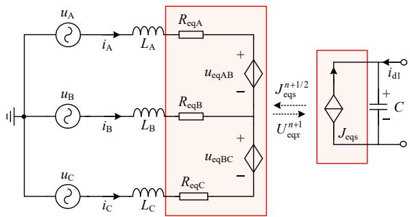  
图6 电容不接地VSC 解耦电路  
Fig. 6 Decoupling circuit of VSC with ungrounded capacitor

# 3 两电平VSC换流器的并行计算

根据上述 VSC解耦电路，结合文献[30]中的交流分网方法，能够对含大规模新能源场站的大电网中的 VSC 交直流侧全部解耦，并使得系统导纳矩阵恒定。具体计算时，对整个电网的状态变量按受控源的类型进行分组后，可进一步采用并行计算提速。下面给出相应的计算时序、步骤和流程。

# 3.1 计算时序

令状态变量组 $x _ { 1 }$ 包含受控电流源所在的子系统，令状态变量组 $x _ { 2 }$ 包含受控电压源所在子系统。根据解耦子系统间的半步延时，对 $x _ { 1 }$ 和 $x _ { 2 }$ 交替求解，而 $x _ { 1 }$ 和 $x _ { 2 }$ 内部并行求解，计算时序如图 7 所示。

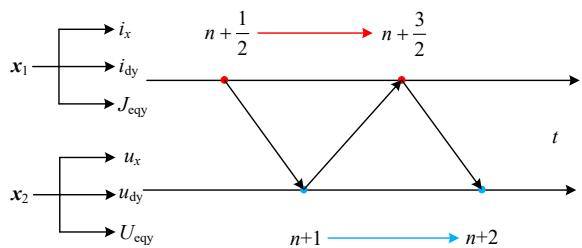  
图7 并行计算时序  
Fig. 7 Timing sequence of parallel processing

# 3.2 计算步骤

VSC的半隐式延迟解耦仿真算法流程如图8所示。在对含有大量风光储场站的大电网仿真场景进行仿真时，可通过本文解耦模型经 VSC 换流器进行分网，将系统分为多个子系统，解耦后的交流侧子系统与直流侧子系统可以分别并行求解。鉴于

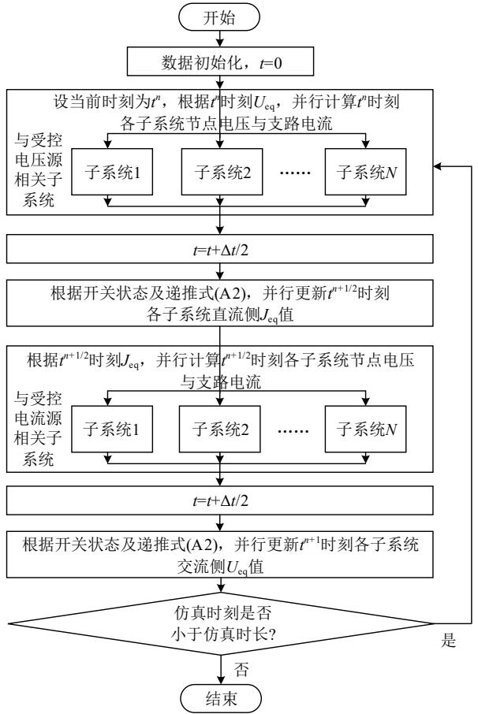  
图 8 仿真流程图  
Fig. 8 Flowchart of simulation

VSC解耦后导纳恒定，在计算之前对系统导纳矩阵进行 LU 分解，方便后续计算使用。各系统可以分为 2类：一类是与受控电压源相关的子系统，另一类是与受控电流相关的子系统。在更新 $U _ { \mathrm { e q } }$ 之后对与受控电压源相关的子系统进行求解，在更新 $J _ { \mathrm { e q } }$ 之后对与受控电流相关的子系统进行求解。

# 4 算例验证

本文给出 2 个算例分别验证所提出模型的精度和效率。由于有相间耦合，电容不接地 VSC 换流器的解耦模型相对复杂，本文以其作为算例系统验证本文方法的有效性和准确性。此外，算例采用 VSC 换流器整流电路，以体现解耦模型对直流电压存在波动时的适应性。系统拓扑和参数分别如图 9 和表 1 所示。将 VSC 接入电网测试解耦模型的计算效率，结果如图 12 所示。本文解耦模型通过编程实现，实验平台为 Intel Core i5-9600KCPU，16GB RAM。在精度验证时以 PSCAD 的结果为对比标准，在进行效率验证时，以编程实现的详细模型作为对比。算例中，VSC 的控制外环采用 PQ 控制，内环采用电流矢量控制。解耦模型根据控制环节给出的开关组合，计算相应的受控电流源和受控电压源的系数 $( k _ { \mathrm { u } } , k _ { \mathrm { i } } )$ ，然后分别与相

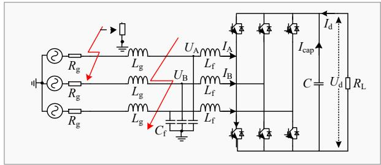  
图 9 算例拓扑  
Fig. 9 Topology of test case system

表 1 两电平 VSC 测试系统参数  
Table 1 Two-level VSC test case system parameters   

<table><tr><td>参数名称</td><td>数值及单位</td></tr><tr><td>交流电网电压频率</td><td>50Hz</td></tr><tr><td>交流电网相电压</td><td>0.69kV</td></tr><tr><td>直流电容C</td><td>50mF</td></tr><tr><td>滤波电感Lf</td><td>0.6mH</td></tr><tr><td>滤波电容Cf</td><td>0.1mF</td></tr><tr><td>线路电感Lg</td><td>0.4mH</td></tr><tr><td>线路电阻Rg</td><td>1Ω</td></tr><tr><td>负载电阻RL</td><td>10Ω</td></tr><tr><td>开关导通电阻</td><td>0.01Ω</td></tr><tr><td>开关关断电阻</td><td>10^6Ω</td></tr><tr><td>开关频率</td><td>2kHz</td></tr><tr><td>仿真步长</td><td>20μs, 40μs, 50μs</td></tr></table>

应的电感电流和电容电压相乘，最后得到相应受控源的输出。

仿真具体时间点设置如下：仿真总时长为 1s，其中在 0.3s 时刻发生三相直接接地短路故障，持续时间 50ms；在 0.6s 时刻发生 A 相经电阻(0.5)接地短路故障，持续时间 50ms。三相接地短路故障点设置 LC 滤波器出口处，A 相经电阻接地短路故障设置在线路电感与线路电阻之间。

# 4.1 精度对比

在开关频率为 2kHz 的情况下，分别对仿真步长为 20、40、50s 3 种情况进行仿真精度对比。图 10 为仿真步长为 $2 0 \mu \mathrm { s }$ 结果，其中图 10(a)—(f)分别为 A 相电压 $( U _ { \mathrm { A } } )$ 、A 相电流 $\left( I _ { \mathrm { A } } \right)$ 、直流电压 $( U _ { \mathrm { d } } )$ 、B 相电压 $\left( U _ { \mathrm { B } } \right)$ 、B 相电流 $\mathrm { ( } I _ { \mathrm { B } } )$ 、电容电流 $( I _ { \mathrm { c a p } } )$ 的波形和误差情况(对应电气量测量点已在图 9 标出，误差公式见附录 B)。

表 2 列出了各仿真步长下相关电气量的最大误差情况。

由图 10 和表 2 可以看出，本文提出的解耦模型，不论是在稳态还是暂态情况，均具有很高的精度，能够满足仿真精度的需求。需要指出的是图 10的交流侧误差波形中，发生三相接地短路时，由于是直接接地，故障左侧电路不受右侧电路的影响，此时左侧电路与未解耦的详细模型一样，因此误差相比于正常工况减小。而 A 相经较大电阻接地短路

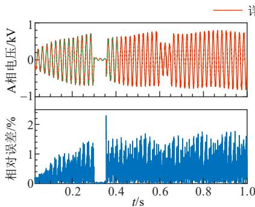

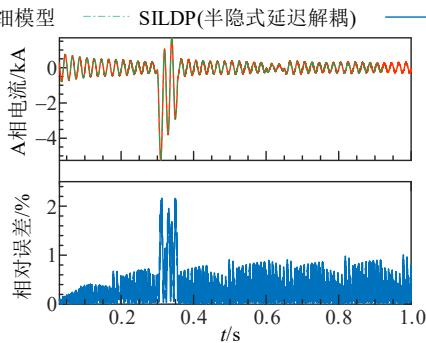

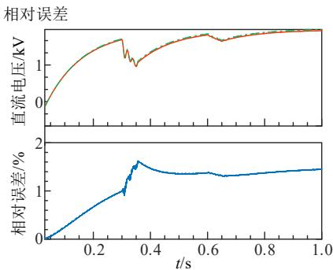

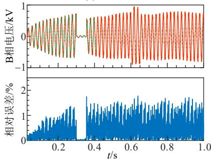  
(a) A相电压   
(b) B相电压

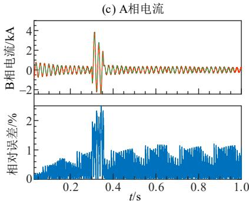  
(d) B相电流

(e) 直流电压  
(f) 电容电流  
图10 仿真结果对比  
Fig. 10 Comparison of simulation results   
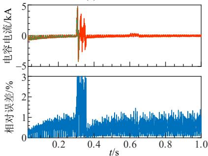  
详细模型 详细模型

表 2 误差情况  
Table 2 Error situation   

<table><tr><td rowspan="2">电气量</td><td colspan="3">误差/%</td></tr><tr><td>步长=20μs</td><td>步长=40μs</td><td>步长=50μs</td></tr><tr><td>A相电压</td><td>2.21</td><td>2.73</td><td>3.16</td></tr><tr><td>A相电流</td><td>2.16</td><td>2.64</td><td>3.41</td></tr><tr><td>直流电压</td><td>1.62</td><td>1.97</td><td>2.32</td></tr><tr><td>B相电压</td><td>1.78</td><td>2.55</td><td>3.28</td></tr><tr><td>B相电流</td><td>2.43</td><td>2.97</td><td>3.51</td></tr><tr><td>电容电流</td><td>3.02</td><td>3.87</td><td>4.12</td></tr></table>

时，由于存在着较大的接地电阻(0.5)，此时故障左侧电路将会受到右侧解耦电路的影响，此时与未

解耦的详细模型短路时的情况有较大不同，因此相对误差相比于正常工况增大。

此外，相较于开关函数模型、平均值模型、动态相量模型等模型，本文提出的解耦模型还能准确地保留内部开关损耗信息。图 11 为开关频率 2kHz，仿真步长 $2 0 \mu \mathrm { s }$ 的情况下，详细模型、半隐式延迟解耦模型以及开关函数模型的交流侧与直流侧的功率比较。以详细模型为基准，半隐式延迟解耦模型相比于开关函数模型，交流侧的有功功率和无功功率以及直流侧有功功率误差均小于开关函数模型。

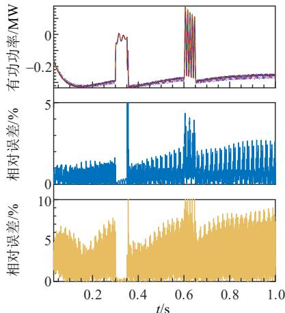  
  
SILDP(半隐式延迟解耦)   
开关函数模型  
SILDP与详   
细模型相对误差  
开关函数模型与详细模型相对误差  
(a) 交流侧有功功率

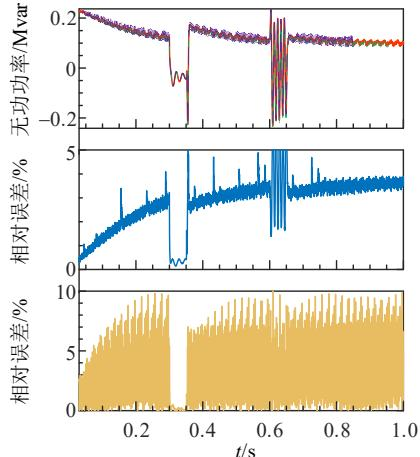  
(b) 交流侧无功功率

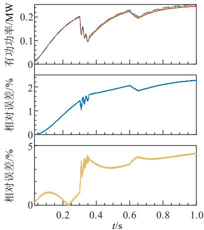  
(c) 直流侧有功功率  
图11 不同模型功率结果对比  
Fig. 11 Comparison of power results of different models

# 4.2 效率对比

图 12为效率测试仿真算例，将 5台 VSC 换流

器 接 入 到 一 组 IEEE39 测 试 系 统 作 为 一 个IEEE39+VSC 单元，不同 IEEE39+VSC 单元通过

BUS8 并联在一起。表 3 为在仿真步长为 $2 0 \mu \mathrm { s }$ ，开关频率为 2kHz，总仿真时长 5s 情况下，不同数量的VSC 的测试结果。加速比 1 与加速比 2 分别是详细模型与解耦模型串行计算和并行计算的耗时比。

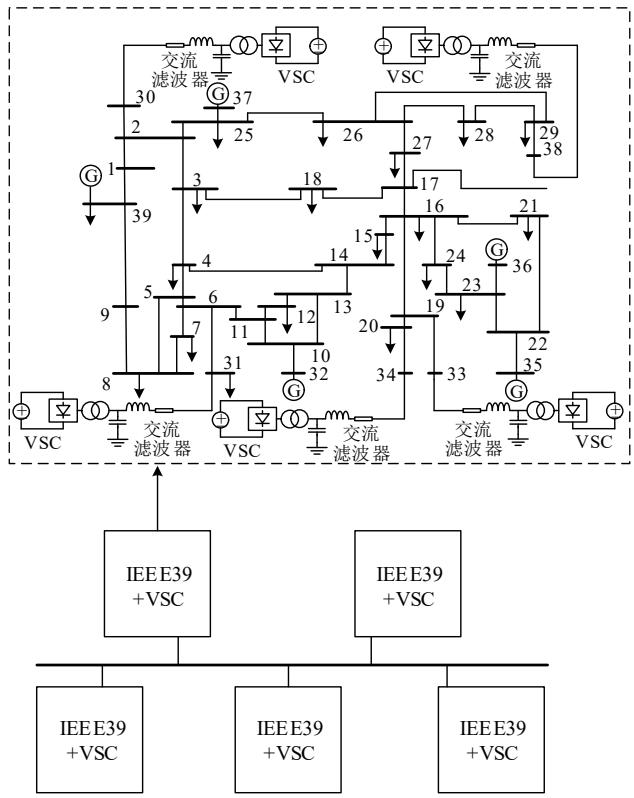  
图12 效率测试算例拓扑图  
Fig. 12 Topology diagram of efficiency test system

表3 不同VSC 个数CPU 时间对比  
Table 3 Comparison of CPU time with different VSC numbers   

<table><tr><td rowspan="2">VSC数量</td><td colspan="3">仿真用时/s</td><td rowspan="2">加速比1</td><td rowspan="2">加速比2</td></tr><tr><td>详细模型</td><td>解耦串行</td><td>解耦并行</td></tr><tr><td>5</td><td>28.53</td><td>14.56</td><td>9.12</td><td>1.96</td><td>3.13</td></tr><tr><td>10</td><td>45.61</td><td>21.41</td><td>10.07</td><td>2.13</td><td>4.53</td></tr><tr><td>50</td><td>150.03</td><td>45.74</td><td>19.71</td><td>3.28</td><td>7.61</td></tr><tr><td>100</td><td>248.72</td><td>68.52</td><td>26.45</td><td>3.63</td><td>9.40</td></tr></table>

可以看出，当系统规模增加后，本文解耦模型能够有效的提速，计算效率得到大幅提升。此外，本文仿真平台采用的是 6 核 CPU，如果采用更多核芯数的 CPU 或者 GPU 甚而 FPGA 执行并行仿真，加速比会进一步提高。

# 5 结论

本文基于半隐式延迟解耦电磁暂态仿真方法，建立了2种不同VSC拓扑的半隐式延迟解耦模型，为含有大量风光储场站的大电网的电磁暂态仿真场景提速计算提供可能，并对其中的直流侧电容不接地的拓扑进行了算例验证。对于大规模风光储场站的 VSC 换流器模型，相比于现有的 VSC 仿真方法，本文提出的 VSC 半隐式延迟解耦模型具有以

下特点：

1）解耦模型实现了 VSC 交直流侧解耦，既可分解计算规模，又为多 VSC 换流器交直流系统的分网与并行提供了基础。  
2）解耦电路中，开关动作导致的系统拓扑变化只体现在受控源 $U _ { \mathrm { e q r } } , \ : J _ { \mathrm { e q s y } }$ 的系数 $k _ { \mathrm { u } x } , ~ k _ { \mathrm { i } x }$ 上，桥臂等效电阻 $R _ { \mathrm { e q } x } { \approx } R _ { \mathrm { o n } }$ 为定值，因而系统导纳矩阵恒定，开关动作后无需 LU重分解。  
3）本文提出的解耦模型，当控制系统给出开关状态，仅需更改受控源系数，无需对电路拓扑进行更改，因此换流器控制环节并不影响本文提出的一次系统整体仿真。  
4）本文提出的解耦模型与平均值模型、开关函数模型以及动态相量模型等相比，精度与详细模型十分接近。这是因为本文模型能够保留上述换流器模型忽略的内部动态特性，并且考虑了换流器的开关损耗。此外，解耦时采用的中心积分形式，其面积与隐式梯形积分的面积等效(电磁暂态仿真尺度下)，也使得解耦模型与详细模型的精度相仿。

通过算例结果可知，本文所提出的半隐式延迟解耦模型既有很高的仿真精度，同时随着系统规模的增大，仿真速度又提升明显，能够很好地兼顾VSC换流器的仿真效率与精度。此外，所提出的解耦方法实现了 VSC 换流器的细粒度解耦，理论上既可适用于离线仿真，也适用于实时仿真。

附 录 见 本 刊 网 络 版 (http://www.dwjs.com.cn/CN/1000-3673/current.shtml)。

# 参考文献

[1] 康重庆，姚良忠．高比例可再生能源电力系统的关键科学问题与理论研究框架[J]．电力系统自动化，2017，41(9)：1-11KANG Chongqing，YAO Liangzhong．Key scientific issues andtheoretical research framework for power systems with highproportion of renewable energy[J]．Automation of Electric PowerSystems，2017，41(9)：1-11(in Chinese)  
[2] 程浩忠，李隽，吴耀武，等．考虑高比例可再生能源的交直流输电网规划挑战与展望[J]．电力系统自动化，2017，41(9)：19-27．CHENG Haozhong，LI Jun，WU Yaowu，et al．Challenges andprospects for AC/DC transmission expansion planning consideringhigh proportion of renewable energy[J]．Automation of Electric PowerSystems，2017，41(9)：19-27(in Chinese)  
[3] 林恒先，侯凯元，陈磊，等．高比例风电电力系统考虑频率安全约束的机组组合[J]．电网技术，2021，45(1)：1-9．LIN Hengxian，HOU Kaiyuan，CHEN Lei，et al．Unit commitmentof power system with high proportion of wind power consideringfrequency safety constraints[J]．Power System Technology，2021，45(1)：1-9(in Chinese)  
[4] 周勤勇，赵珊珊，刘增训，等．高比例新能源电力系统稳定拐点释义[J]．电网技术，2020，44(8)：2979-2986．ZHOU Qinyong，ZHAO Shanshan，LIU Zengxun，et al．Discussionon inflection point for power system stability with high proportion of

new energy generation[J]．Power System Technology，2020，44(8)：2979-2986(in Chinese)．  
[5] 钟庆，马新华，王钢，等．电压源型换流器稳态等值电路模型[J]高电压技术，2014，40(8)：2485-2489ZHONG Qing，MA Xinhua，WANG Gang，et al．Static equivalentcircuit models of voltage source converter[J] ． High VoltageEngineering，2014，40(8)：2485-2489(in Chinese)  
[6] 杨立敏，朱艺颖，郭强，等．基于 HYPERSIM 的柔性直流输电系统数模混合仿真建模及试验[J]．电网技术，2020，44(11)：4055-4062YANG Limin，ZHU Yiying，GUO Qiang，et al．Modelling andvalidation of digital-analog hybrid simulation for VSC-HVDC systembased on HYPERSIM[J]．Power System Technology，2020，44(11)：4055-4062(in Chinese)．  
[7] YUAN Zheng，DU Zhengchun，LI Guiyuan，et al．Reduced order VSC model based on balanced truncation[C]//Proceedings of the 2017 IEEE 12th International Conference on Power Electronics and Drive Systems．Honolulu：IEEE，2017：25-29．   
[8] 郑德博，顾丹珍，黄汉远．电压源型换流器平均模型在风机建模中的应用[J]．电测与仪表，2021，58(2)：164-170ZHENG Debo，GU Danzhen，HUANG Hanyuan．Application ofvoltage source converter average model in wind power modeling[J]Electrical Measurement & Instrumentation，2021，58(2)：164-170(inChinese)．  
[9] HUI S Y R，MORRALL S．Generalised associated discrete circuit model for switching devices[J] ． IEE Proceedings-Science ， Measurement and Technology，1994，141(1)：57-64   
[10] HUI S Y R，CHRISTOPOULOS C．A discrete approach to the modeling of power electronic switching networks[J] ． IEEE Transactions on Power Electronics，1990，5(4)：398-403．   
[11] 徐晋，汪可友，李国杰，等．基于参数化历史电流源的广义小步长开关模型[J]．中国电机工程学报，2018，38(6)：1647-1654XU Jin，WANG Keyou，LI Guojie，et al．A general small time-stepmodel based on the parameterized history current sources[J]Proceedings of the CSEE，2018，38(6)：1647-1654(in Chinese)  
[12] 徐晋，汪可友，李国杰，等．基于响应匹配的电力电子换流器恒导纳建模[J]．中国电机工程学报，2019，39(13)：3879-3888XU Jin，WANG Keyou，LI Guojie，et al．Fixed-admittance modelingof power electronic converters using response-matching technique[J]Proceedings of the CSEE，2019，39(13)：3879-3888(in Chinese)  
[13] 周诗嘉，林卫星，姚良忠，等．两电平 VSC与 MMC通用型平均值仿真模型[J]．电力系统自动化，2015，39(12)：138-145ZHOU Shijia，LIN Weixing，YAO Liangzhong，et al．Genericaveraged value models for two-level VSC and MMC[J]．Automationof Electric Power Systems，2015，39(12)：138-145(in Chinese)  
[14] SONG Teng，LI Guangkai，SONG Xinli，et al．A novel method for VSC-HVDC electromechanical transient modeling and simulation [C]//Proceedings of 2012 Power Engineering and Automation Conference．Wuhan：IEEE，2012：1-4   
[15] 陈武晖，吴明哲，张军，等．模块化多电平换流器电磁暂态模型研究综述[J]．电网技术，2020，44(12)：4755-4765CHEN Wuhui，WU Mingzhe，ZHANG Jun，et al．Review ofelectromagnetic transient modeling of modular multilevel converters[J]．Power System Technology，2020，44(12)：4755-4765(in Chinese)  
[16] 王成山，高菲，李鹏，等．电力电子装置典型模型的适应性分析[J]．电力系统自动化，2012，36(6)：63-68．WANG Chengshan，GAO Fei，LI Peng，et al．Adaptability analysisof typical power electronic device models[J]．Automation of ElectricPower Systems，2012，36(6)：63-68(in Chinese)  
[17] 许寅，陈颖，陈来军，等．基于平均化理论的 PWM 变流器电磁暂态快速仿真方法(一)PWM 变流器分段平均模型的建立[J]．电力

系统自动化，2013，37(11)：58-64 XU Yin，CHEN Ying，CHEN Laijun，et al．Fast electromagnetic transient simulation method for PWM converters based on averaging theory part one establishment of piecewise averaged model for PWM converters[J]．Automation of Electric Power Systems，2013，37(11)： 58-64(in Chinese)   
[18] 王磊，邓新昌，侯俊贤，等．适用于电磁暂态高效仿真的变流器分段广义状态空间平均模型[J]．中国电机工程学报，2019，39(11)：3130-3139WANG Lei，DENG Xinchang，HOU Junxian，et al．A piecewisegeneralized state space model of power converters for electromagnetictransient efficient simulation[J]．Proceedings of the CSEE，2019，39(11)：3130-3139(in Chinese)  
[19] MAZHARI S M，KOUHSARI S M，RAMIREZ A，et al．Interfacingtransient stability and extended harmonic domain for dynamicharmonic analysis of power systems[J]．IET Generation，Transmission& Distribution，2016，10(11)：2720-2730  
[20] ROJAS S，GENSIOR A．Prediction of the average value of state variables for modulated power converters considering the modulation and measuring method[J]．IEEE Transactions on Industrial Electronics， 2016，63(8)：5209-5220   
[21] LIU Xiao，CRAMER A M，PAN Fei．Generalized average method for time-invariant modeling of inverters[J]．IEEE Transactions on Circuits and Systems I：Regular Papers，2017，64(3)：740-751   
[22] YAO Shujun，BAO Mingran，HU Ya’nan，et al．Modeling for VSC-HVDC electromechanical transient based on dynamic phasor method[C]//Proceedings of the 2nd IET Renewable Power Generation Conference．Beijing：IET，2013：1-4   
[23] 鲍明然．VSC-HVDC 的动态相量建模和 PLL 研究[D]．北京：华北电力大学，2014  
[24] 刘博宁，姚蜀军，张慧媛，等．多频段–动态相量法电磁暂态仿真研究[J]．中国电机工程学报，2019，39(19)：5772-5781LIU Boning，YAO Shujun，ZHANG Huiyuan，et al．A research onmulti-frequency band dynamic phasor for electromagnetic transientssimulation[J]．Proceedings of the CSEE，2019，39(19)：5772-5781(inChinese)．  
[25] 姚蜀军，屈秋梦，蔡焱蒙，等．基于多频段动态相量法的 MMC换流器建模方法[J]．中国电机工程学报，2020，40(18)：5932-5941．YAO Shujun，QU Qiumeng，CAI Yanmeng，et al．Research ofmodeling method of modular multilevel converter based onmulti-frequency bands dynamic phasor[J]．Proceedings of the CSEE，2020，40(18)：5932-5941(in Chinese)  
[26] 汪燕，姚蜀军，林芝茂，等．一种基于多频段动态相量的 LCC换流器电磁暂态建模方法研究[J]．中国电机工程学报，2020，40(17)：5644-5652WANG Yan，YAO Shujun，LIN Zhimao，et al．A modeling methodfor LCC electromagnetic transient simulation based on multifrequency band dynamic phasor[J]．Proceedings of the CSEE，2020，40(17)：5644-5652(in Chinese)  
[27] 姚蜀军，刘畅，汪燕，等．多频段时间尺度变换电磁暂态仿真研究[J]．中国电机工程学报，2019，39(24)：7199-7208YAO Shujun，LIU Chang，WANG Yan，et al．A research onmulti-frequency band time-scale frame transformation forelectromagnetic transients simulation[J]．Proceedings of the CSEE，2019，39(24)：7199-7208(in Chinese)  
[28] 姚蜀军，刘畅，韩民晓，等．宽频时间尺度变换多速率电磁暂态仿真研究[J]．中国电机工程学报，2019，39(3)：675-684YAO Shujun，LIU Chang，HAN Minxiao，et al．A research onmulti-rate electromagnetic transients simulation strategy based onfrequency dependent time scale frame transformation[J]．Proceedings

of the CSEE，2019，39(3)：675-684(in Chinese)  
[29] MILTON M，BENIGNI A．Latency insertion method based real-time simulation of power electronic systems[J]．IEEE Transactions on Power Electronics，2018，33(88)：7166-7177   
[30] KATO T，INOUE K，FUKUTANI T，et al．Multirate analysis method for a power electronic system by circuit partitioning[J] ． IEEE Transactions on Power Electronics，2009，24(12)：2791-2802   
[31] SHI Bochen，ZHAO Zhengming，ZHU Yicheng，et al．Discrete state event-driven approach for high-power converter simulations[C]// Proceedings of 2019 IEEE Energy Conversion Congress and Exposition．Baltimore：IEEE，2019：4627-4631．   
[32] ZHU Yicheng，ZHAO Zhengming，SHI Bochen，et al．Discrete state event-driven framework with a flexible adaptive algorithm for simulation of power electronic systems[J]．IEEE Transactions on Power Electronics，2019，34(12)：11692-11705   
[33] 姚蜀军，庞博涵，吴国旸，等．半隐式延迟解耦电磁暂态并行仿 真方法(一)：原理及交流分网与并行[J/OL]．中国电机工程学报 [2021-05-31]．https://doi.org/10.13334/j.0258-8013.pcsee.201891 YAO Shujun，PANG Bohan，WU Guoyang，et al．A method of parallel computing for electromagnetic transient simulation based on semi-implicit latency decoupling technology—part I：theory and AC network partitioning and parallel[J/OL]．Proceedings of the CSEE [2021-05-31] ． https://doi.org/10.13334/j.0258-8013.pcsee.201891(in Chinese)．   
[34] 姚蜀军，庞博涵，曾子文，等．半隐式延迟解耦电磁暂态仿真方法(二)：单端口子模块 MMC 通用解耦与快速仿真[J/OL]．中国电机工程学报．[2021-07-09]．https://doi.org/10.13334/j.0258-8013.pcsee.210064

YAO Shujun，PANG Bohan，ZENG Ziwen，et al．Semi-implicit latency decoupling technology based electromagnetic transient simulation—part Ⅱ：general decoupling and fast simulation for single-port sub-module MMC[J/OL]．Proceedings of the CSEE [2021-07-09]．https://doi.org/ 10.13334/j.0258-8013.pcsee.201891   
[35] 许明旺，庞博涵，曾子文，等．半隐式延迟解耦电磁暂态并行仿真方法(三)：级联 H 桥型电力电子变压器解耦与仿真[J/OL]．中国电机工程学报．[2021-07-09]．https://doi.org/10.13334/j.0258-8013.pcsee.210067  
XU Mingwang，PANG Bohan，ZENG Ziwen，et al．A method of parallel computing for electromagnetic transient simulation based on semi-implicit latency decoupling technology—part Ⅲ：decoupling and simulation of cascaded h-bridge power electronic transformer [J/OL]．Proceedings of the CSEE．[2021-07-09]．https://doi.org/10. 13334/j.0258-8013.pcsee.210067(in Chinese)

  
刘刚

在线出版日期：2022-04-01。

收稿日期：2022-01-27。

作者简介：

刘刚(1998)，男，硕士研究生，主要从事电磁暂 态建模与仿 真方面的 研 究工作，E-mail：1054335168@qq.com；

姚蜀军(1973)，男，副教授，硕士生导师，通信作者，主要从事电力系统运行与控制、直流输电、电磁暂态仿真和建模等方面的研究工作，E-mail：yaoshujun@ncepu.edu.cn。

（责任编辑 徐梅）

# 附录 A：

1、直流侧电容接地 VSC单桥臂状态变量半隐式延迟递推式：

$$
\left\{ \begin{array}{l} i _ {A} ^ {n + \frac {1}{2}} = \frac {\left(L - R _ {e q A} \frac {\Delta t}{2}\right) i _ {A} ^ {n - \frac {1}{2}} + U _ {e q} ^ {n} \Delta t + u _ {A} ^ {n} \Delta t}{L + R _ {e q A} \frac {\Delta t}{2}} \\ u _ {d 1} ^ {n + 1} = \frac {C _ {1} u _ {d 1} ^ {n} + J _ {e q 1} ^ {n + \frac {1}{2}} \Delta t + i _ {d 1} ^ {n + \frac {1}{2}} \Delta t}{C _ {1}} \\ u _ {d 2} ^ {n + 1} = \frac {C _ {2} u _ {d 2} ^ {n} - J _ {e q 2} ^ {n + \frac {1}{2}} \Delta t + i _ {d 2} ^ {n + \frac {1}{2}} \Delta t}{C _ {2}} \end{array} \right. \tag {A1}
$$

式中： $U _ { \mathrm { e q } } = k _ { \mathrm { u 2 } } u _ { \mathrm { d 2 } } - k _ { \mathrm { u 1 } } u _ { \mathrm { d 1 } } , J _ { \mathrm { e q 1 } } = k _ { \mathrm { i 1 } } i _ { \mathrm { a c } } , J _ { \mathrm { e q 2 } } = k _ { \mathrm { i 2 } } i _ { \mathrm { a c } } \circ$

2、直流侧电容接地 VSC 换流器状态变量半隐式延迟递推式

$$
\left\{ \begin{array}{l} i _ {\mathrm {x}} ^ {n + 1 / 2} = \frac {\left(L _ {\mathrm {x}} - R _ {\mathrm {e q x}} \frac {\Delta t}{2}\right) i _ {\mathrm {x}} ^ {n - \frac {1}{2}} + U _ {\mathrm {e q x}} ^ {n} + u _ {\mathrm {x}} ^ {n}}{L _ {\mathrm {x}} + R _ {\mathrm {e q x}} \frac {\Delta t}{2}} \\ u _ {\mathrm {d l}} ^ {n + 1} = \frac {C _ {1} u _ {\mathrm {d l}} ^ {n} + J _ {\mathrm {e q l s}} ^ {n + \frac {1}{2}} \Delta t + i _ {\mathrm {d l}} ^ {n + \frac {1}{2}} \Delta t}{C _ {1}} \\ u _ {\mathrm {d} 2} ^ {n + 1} = \frac {C _ {2} u _ {\mathrm {d} 2} ^ {n} - J _ {\mathrm {e q} 2 \mathrm {s}} ^ {n + \frac {1}{2}} \Delta t + i _ {\mathrm {d} 2} ^ {n + \frac {1}{2}} \Delta t}{C _ {2}} \end{array} \right. \tag {A2}
$$

其中

$$
\left\{ \begin{array}{l} R _ {\mathrm {e q x}} = \frac {R _ {\mathrm {m u l}}}{R _ {\mathrm {s u m}}} = R _ {\mathrm {o n}} \\ U _ {\mathrm {e q x}} = \frac {R _ {\mathrm {x u}}}{R _ {\mathrm {s u m}}} u _ {\mathrm {d 2}} - \frac {R _ {\mathrm {x d}}}{R _ {\mathrm {s u m}}} u _ {\mathrm {d 1}} \\ J _ {\mathrm {e q 1 s}} = \sum \left(\frac {R _ {\mathrm {x d}}}{R _ {\mathrm {s u m}}} i _ {x}\right) \\ J _ {\mathrm {e q 2 s}} = \sum \left(\frac {R _ {\mathrm {x u}}}{R _ {\mathrm {s u m}}} i _ {\mathrm {x}}\right) \end{array} \right.
$$

3、直流侧电容不接地 VSC 状态变量半隐式延迟递推式

$$
u _ {\mathrm {d}} ^ {n + 1} = \frac {C u _ {\mathrm {d}} ^ {n} + J _ {\mathrm {e q s}} ^ {n + \frac {1}{2}} \Delta t + i _ {\mathrm {d}} ^ {n + \frac {1}{2}} \Delta t}{C}
$$

$$
\mathrm {A} \left[ \begin{array}{l} i _ {\mathrm {A}} ^ {n + \frac {1}{2}} \\ i _ {\mathrm {B}} ^ {n + \frac {1}{2}} \\ i _ {\mathrm {C}} ^ {n + \frac {1}{2}} \end{array} \right] = B \left[ \begin{array}{l} i _ {\mathrm {A}} ^ {n - \frac {1}{2}} \\ i _ {\mathrm {B}} ^ {n - \frac {1}{2}} \\ i _ {\mathrm {C}} ^ {n - \frac {1}{2}} \end{array} \right] - \left[ \begin{array}{l} U _ {\mathrm {e q A B}} ^ {n} \\ U _ {\mathrm {e q B C}} ^ {n} \\ U _ {\mathrm {e q C A}} ^ {n} \end{array} \right] \Delta t + \left[ \begin{array}{l} u _ {\mathrm {A}} ^ {n} - u _ {\mathrm {B}} ^ {n} \\ u _ {\mathrm {B}} ^ {n} - u _ {\mathrm {C}} ^ {n} \\ u _ {\mathrm {C}} ^ {n} - u _ {\mathrm {A}} ^ {n} \end{array} \right] \Delta t \tag {A3}
$$

其中

$$
\begin{array}{l} A = \left[ \begin{array}{c c c} L _ {\mathrm {A}} + \frac {R _ {\mathrm {e q A}}}{2} \Delta t & - (L _ {\mathrm {B}} + \frac {R _ {\mathrm {e q B}}}{2} \Delta t) & 0 \\ 0 & L _ {\mathrm {B}} + \frac {R _ {\mathrm {e q B}}}{2} \Delta t & - (L _ {\mathrm {C}} + \frac {R _ {\mathrm {e q C}}}{2} \Delta t) \\ - (L _ {\mathrm {A}} + \frac {R _ {\mathrm {e q A}}}{2} \Delta t) & 0 & L _ {\mathrm {C}} + \frac {R _ {\mathrm {e q C}}}{2} \Delta t \end{array} \right] \\ B = \left[ \begin{array}{c c c} L _ {\mathrm {A}} - \frac {R _ {\mathrm {e q A}}}{2} \Delta t & - (L _ {\mathrm {B}} - \frac {R _ {\mathrm {e q B}}}{2} \Delta t) & 0 \\ 0 & L _ {B} - \frac {R _ {\mathrm {e q B}}}{2} \Delta t & - (L _ {\mathrm {C}} - \frac {R _ {\mathrm {e q C}}}{2} \Delta t) \\ - (L _ {\mathrm {A}} - \frac {R _ {\mathrm {e q A}}}{2} \Delta t) & 0 & L _ {\mathrm {C}} - \frac {R _ {\mathrm {e q C}}}{2} \Delta t \end{array} \right] \\ U _ {\mathrm {e q x}} = k _ {\mathrm {u x}} * u _ {\mathrm {d}}, \quad J _ {\mathrm {e q s}} = \sum k _ {\mathrm {i x}} i _ {x} 。 \\ \end{array}
$$

附录 B：

在 4.1节中，本文所用的相对误差公式为：

$$
\mathrm{E}\% = \frac{\left|\hat{\boldsymbol{x}} - \boldsymbol{x}\right|}{rms(\boldsymbol{x})} 100\% \tag{B1}
$$

式中：x 基准结果的 n维向量(本文选取 C++详细模型)； x 为本文算法仿真结果 n 维向量；n 为总仿真时刻节点数；rms 为向量的均方根。

# 附录 C：

文献[33]提出半隐式延迟解耦法，该方法应用矩阵分裂技术，通过对不同状态变量组间采用不同积分格式实现变量组之间的延迟解耦。

# 1）矩阵分裂

考虑线性系统，用状态空间方程表示为：

$$
\left\{ \begin{array}{l} \dot {\boldsymbol {x}} (t) = \boldsymbol {A} \boldsymbol {x} (t) + \boldsymbol {B} \boldsymbol {u} (t) \\ \boldsymbol {x} (0) = \boldsymbol {x} _ {0}, t \geq 0 \end{array} \right. \tag {C1}
$$

将系数矩阵 A 进行分裂构造子系统。由于输入u 是已知量，系数矩阵 B 可不进行分裂。

设 $\scriptstyle A = A _ { \beta } - A _ { \alpha } ,$ ，系统(C1)变为：

$$
\left\{ \begin{array}{l} \dot {\boldsymbol {x}} (t) + \boldsymbol {A} _ {\alpha} \boldsymbol {x} (t) = \boldsymbol {A} _ {\beta} \boldsymbol {x} (t) + \boldsymbol {B} \boldsymbol {u} (t) \\ \boldsymbol {x} (0) = \boldsymbol {x} _ {0}, t \geq 0 \end{array} \right. \tag {C2}
$$

取分裂形式： $\scriptstyle A _ { \alpha } = D , A _ { \beta } = L + U ,$ 。系统分裂为 N个子系统。其中， ${ \pmb { D } } { \pmb = } d i a g \left[ { \pmb { D } } _ { 1 } , { \pmb { D } } _ { 2 } , . . . { \pmb { D } } _ { N } \right]$ 由原系数矩阵 A 的分块对角矩阵构成， ${ \pmb { D } } _ { 1 } , { \pmb { D } } _ { 2 } , . . . { \pmb { D } } _ { N }$ 为方阵，与分裂后的各子系统相对应。类似的，L 和 U 分别是严格的分块下三角和上三角矩阵。

将 $\scriptstyle A _ { \alpha } = D , A _ { \beta } = L + U$ 代入式(C2)，得到：

$$
\left\{ \begin{array}{l} \dot {\boldsymbol {x}} (t) + \boldsymbol {D} \boldsymbol {x} (t) = (\boldsymbol {L} + \boldsymbol {U}) \boldsymbol {x} (t) + \boldsymbol {B} \boldsymbol {u} (t) \\ \boldsymbol {x} (0) = \boldsymbol {x} _ {0}, t \geq 0 \end{array} \right. \tag {C3}
$$

将式(C3)按子系统展开，可得：

$$
\left\{ \begin{array}{l} \dot {\boldsymbol {x}} _ {i} (t) + \boldsymbol {D} _ {i} \boldsymbol {x} _ {i} (t) = \sum_ {j = 1, j \neq i} ^ {N} \boldsymbol {A} _ {\beta , i j} \boldsymbol {x} _ {j} (t) + \boldsymbol {u} _ {i} (t) \\ \boldsymbol {x} _ {i} (0) = \boldsymbol {x} _ {i, 0} \\ \boldsymbol {A} _ {\beta , i i} = 0 \\ t \geq 0, i, j \in 1, 2 \dots N \end{array} \right. \tag {C4}
$$

对系统(C4)进行分裂并两边积分：

$$
\int \dot {\boldsymbol {x}} _ {i} (t) + \int \boldsymbol {D} _ {i} \boldsymbol {x} _ {i} (t) = \int \sum_ {j = 1, j \neq i} ^ {N} \boldsymbol {A} _ {\beta , i j} \boldsymbol {x} _ {j} (t) + \int \boldsymbol {u} _ {i} (t) \tag {C5}
$$

# 2）中心积分

在电磁暂态仿真的仿真步长范围内，中心积分形式的精度近似于梯形积分，图 C1 是其示意图。图中梯形的面积可以近似看作是以 ${ \pmb u } ^ { n + 1 / 2 }$ 为长，t为宽的矩形的面积，即：

$$
\frac {\left(\boldsymbol {u} ^ {n} + \boldsymbol {u} ^ {n + 1}\right)}{2} \Delta t \approx \boldsymbol {u} ^ {n + 1 / 2} \Delta t \tag {C6}
$$

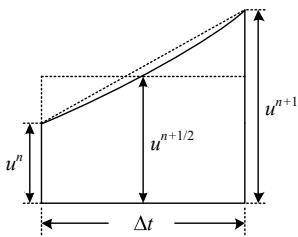  
图 C1 中心积分示意图  
Fig. C1 Central integration diagram

# 3）半隐式差分方程

对式(C5)等式两端按隐式梯形法离散化，并对等式右端用中心积分替代梯形积分：

$$
\boldsymbol {x} _ {i} ^ {n + 1} - \boldsymbol {x} _ {i} ^ {n} + \boldsymbol {D} _ {i} \frac {\boldsymbol {x} _ {i} ^ {n + 1} + \boldsymbol {x} _ {i} ^ {n}}{2} \Delta t =
$$

$$
\sum_ {j = 1, j \neq i} ^ {N} A _ {\beta , i j} \frac {\boldsymbol {x} _ {j} ^ {n + 1} + \boldsymbol {x} _ {j} ^ {n}}{2} \Delta t + \frac {\boldsymbol {u} _ {i} ^ {n} + \boldsymbol {u} _ {i} ^ {n + 1}}{2} \Delta t \approx
$$

$$
\sum_ {j = 1, j \neq i} ^ {N} A _ {\beta , i j} x _ {j} ^ {n + 1 / 2} \Delta t + u _ {i} ^ {n + 1 / 2} \Delta t =
$$

$$
f _ {i} \left(\boldsymbol {x} _ {j} ^ {n + 1 / 2}, \boldsymbol {u} _ {i} ^ {n + 1 / 2}\right) \tag {C7}
$$

# 4）半隐式延迟解耦并行计算原理

将分裂成的子系统分为两组 $x _ { 1 }$ 和 $x _ { 2 }$ 。其中： $x _ { 1 }$ 包含 $p$ 个子系统， $x _ { 2 }$ 包含 $q$ 个子系统，根据式(A7)可得：

$$
\left[ \begin{array}{c} \boldsymbol {x} _ {1} ^ {n + 1} \\ \boldsymbol {x} _ {2} ^ {n + 1 / 2} \end{array} \right] = \left[ \begin{array}{c} \boldsymbol {\alpha} _ {1} \boldsymbol {x} _ {1} ^ {n} \\ \boldsymbol {\alpha} _ {2} \boldsymbol {x} _ {2} ^ {n - 1 / 2} \end{array} \right] + \left[ \begin{array}{c} \boldsymbol {\beta} _ {1} f _ {1} \left(\boldsymbol {x} _ {2} ^ {n + 1 / 2}, u _ {1} ^ {n + 1 / 2}\right) \\ \boldsymbol {\beta} _ {2} f _ {2} \left(\boldsymbol {x} _ {1} ^ {n}, u _ {2} ^ {n}\right) \end{array} \right] \tag {C8}
$$

$x _ { 1 }$ 和 $\pmb { x } _ { 2 }$ 之间的求解可按图C2交替进行并且互差半个时步，而 $x _ { 1 }$ 和 $x _ { 2 } 2$ 个分组内的各子系统则可根据式(C7)的时延特性解耦后并行求解。

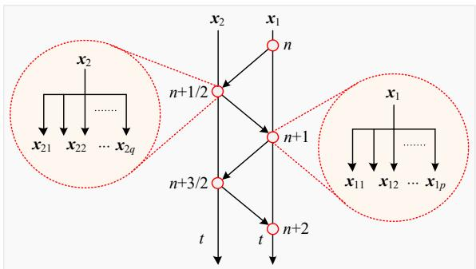  
图C2 并行计算原理示意图  
Fig. C2 Schematic diagram of parallel computing附录 D：

图 1 中， $u _ { \mathrm { A } }$ 、 $u _ { \mathrm { B } }$ 、 $u _ { \mathrm { C } }$ 分别表示 A、B、C 相对地的相电压， $i _ { \mathrm { A } }$ 、 $i _ { \mathrm { B } } .$ 、 $i _ { \mathrm { C } }$ 分别表示 A、B、C 相的相电流； $u _ { \mathrm { d l } }$ 和 $u _ { \mathrm { d } 2 }$ 分别表示直流侧电容接地 VSC 的 2个电容电压； $i _ { \mathrm { c l } }$ 和 $i _ { \mathrm { c } 2 }$ 表示流过这 2个电容的电流；$i _ { \mathrm { d l } }$ 和 $i _ { \mathrm { d } 2 }$ 表示直流侧电容不接地VSC的直流侧输入电流； $u _ { \mathrm { d } }$ 表示直流侧电容不接地 VSC 电容电压， $i _ { \mathrm { c a p } }$ 表示流过这个电容的电流， $i _ { \mathrm { d } }$ 表示直流侧电容不接地 VSC 的直流侧输入电流； $T _ { 1 }$ 和 $T _ { 4 }$ 、 $T _ { 3 }$ 和 $T _ { 6 } .$ 、 $T _ { 5 }$ 和 $T _ { 2 }$ 分别表示 A、B、C 三相上下桥臂 IGBT 与二极管构成的开关组。开关组采用二值电阻模型。

图 3 中， $R _ { \mathrm { e q } }$ 为直流侧电容接地 VSC 桥臂解耦电路交流侧的等效电阻， $U _ { \mathrm { e q } }$ 为解耦电路交流侧受控电压源， $J _ { \mathrm { e q l } }$ 和 $J _ { \mathrm { e q } 2 }$ 分别为桥臂解耦电路直流侧的两个受控电流源， $J _ { \mathrm { e q y } } ^ { \mathrm { n + 1 / 2 } }$ 为在 tn+1/2 时刻受控电流源的值，其中 y1 或 2， $U _ { \mathrm { e q } } ^ { \mathrm { n + 1 } }$ 为 tn+1 时刻受控电流源的值。

图 4 中， $R _ { \mathrm { e q A } }$ 、 $R _ { \mathrm { e q B } }$ 、 $R _ { \mathrm { e q C } }$ 为直流侧电容接地VSC 解耦电路交流侧 A、B、C 相的等效电阻， $U _ { \mathrm { e q A } }$ 、$U _ { \mathrm { e q B } }$ 、 $U _ { \mathrm { e q C } }$ 为解耦电路交流侧 A、B、C 相的受控电压源， $J _ { \mathrm { { e q l s } } }$ 和 $J _ { \mathrm { e q 2 s } }$ 分别为 VSC 解耦电路直流侧的两个受控电流源， $J _ { \mathrm { e q y s } } ^ { \mathrm { n + 1 / 2 } }$ 为在仿真时刻 tn+1/2 受控电流源的值，其中y1或2， $U _ { \mathrm { e q x } } ^ { \mathrm { n + 1 } }$ 为仿真时刻 $\scriptstyle \mathrm { t = n + 1 }$ 时刻受控电流源的值，其中 $\mathbf { x } { = } \mathbf { A }$ 、B、C 相。

图 6 中， $R _ { \mathrm { e q A } }$ 、 $R _ { \mathrm { e q B } }$ 、 $R _ { \mathrm { e q C } }$ 为直流侧电容不接地VSC 解耦电路交流侧 A、B、C 相的等效电阻， $U _ { \mathrm { e q A B } } \cdot$ 、$U _ { \mathrm { e q B C } }$ 为解耦电路交流侧 AB、BC 相间的受控电压源， $J _ { \mathrm { e q s } }$ 为 VSC 解耦电路直流侧的受控电流源，$J _ { \mathrm { e q s } } ^ { \mathrm { n + 1 / 2 } }$ 为在仿真时刻 tn+1/2 受控电流源的值，$U _ { \mathrm { e q x } } ^ { \mathrm { n + 1 } }$ 为 tn+1 时刻受控电流源的值，其中 xAB、BC 相。

# Two-level Voltage Source Converter Decoupling Model for Electromagnetic Transient Simulation

LIU Gang1, ZHANG Chunqiang1, MA Jiahao1, LI Yunhong2, WANG Xiao2, WANG Yan1, LIU Jin1, YAO Shujun1

(1. School of Electrical and Electronic Engineering, North China Electric Power University, Changping District, Beijing 102206,

China; 2. North China Electric Power Research Institute Co., Ltd., Xicheng District, Beijing 100045, China)

KEY WORDS: semi-implicit latency decoupling technology; voltage source converter; electromagnetic transient simulation; constant nodal admittance matrix; parallel simulation

With the rapid development of the high-voltage direct current transmission technology and the new energy power generation technology, the power electronics of the power system is becoming more and more significant. With the advantage of flexible control, the VSC converters are widely used in new energy grid connection and power transmission fields. However, when simulating a large power grid of a large-scale new energy station which contains a large number of converters (such as large-scale wind farms and photovoltaic power plants) with detailed models used for each unit, the simulation speed will be greatly reduced. Therefore, it is necessary to study an efficient VSC converter electromagnetics transient simulation model. This article focuses on the research of the two-level VSC.

In this paper, the semi-implicit latency decoupling and paralleling technology (SILDP) is applied to the research of the voltage source converter (VSC), and a decoupling and fast simulation method is proposed with the simple decoupling circuit, the constant admittance matrix, the easily parallel and high simulation efficiency.

In this paper, a semi-implicit delay decoupling model of the DC-side capacitor-grounded VSC converter and the DC-side capacitor-ungrounded VSC converter are constructed by using the matrix splitting and delay

technique. The decoupling circuits are shown in Fig.1 and Fig.2 respectively.

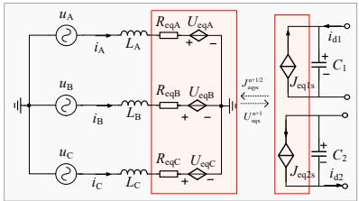  
Fig. 1 Decoupling circuit of capacitor-grounded VSC

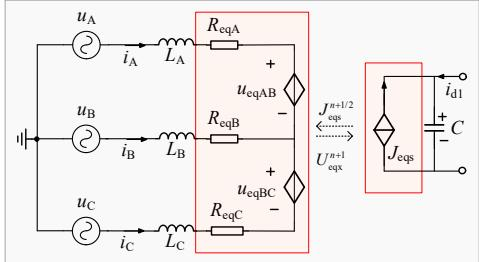  
Fig. 2 Decoupling circuit of VSC with ungrounded capacitor

Finally, the decoupling model of the DC-side capacitor-ungrounded VSC converter is implemented by the C++ programming, and compared with the simulation results of the detailed model PSCAD/ EMTDC. The CPU used in the test is the Intel (core) 6core i5-9600k, and the simulation step is 1μs.The simulation results (Fig.3 and Tab.1) show that the model proposed in this paper has high simulation accuracy.

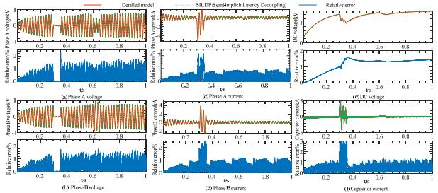  
Fig. 3 Comparison of simulation results

Table 1 Comparison of CPU time with different VSC numbers   

<table><tr><td rowspan="2">VSC numbers</td><td colspan="3">CPU time(s)</td><td rowspan="2">Speedup ratio 1</td><td rowspan="2">Speedup ratio 2</td></tr><tr><td>Detailed Model</td><td>Serial computing</td><td>Parallel computing</td></tr><tr><td>5</td><td>28.53</td><td>14.56</td><td>9.12</td><td>1.96</td><td>3.13</td></tr><tr><td>10</td><td>45.61</td><td>21.41</td><td>10.07</td><td>2.13</td><td>4.53</td></tr><tr><td>50</td><td>150.03</td><td>45.74</td><td>19.71</td><td>3.28</td><td>7.61</td></tr><tr><td>100</td><td>248.72</td><td>68.52</td><td>26.45</td><td>3.63</td><td>9.40</td></tr><tr><td>300</td><td>649.16</td><td>174.51</td><td>53.87</td><td>3.72</td><td>12.05</td></tr><tr><td>500</td><td>1173.28</td><td>303.96</td><td>84.17</td><td>3.86</td><td>13.94</td></tr></table>