# Use of efficient task allocation algorithm for parallel real-time EMT simulation

Boris Bruneda,⁎ , Pierre Raulta , Sébastien Dennetièrea , Ian Menezes Martinsb

a RTE - Réseau de Transport d'Electricité, 69330 Jonage, France   
b RTE - Réseau de Transport d'Electricité, 92800 Puteaux, Paris – La Défense, France

# ARTICLEINFO

Keywords:

Graph partitioning

Hardware-in-the-loop

Optimization

Parallel simulation

Real-time simulation

Task allocation problem

# A B S T R A C T

Real-time EMT (Electromagnetic Transients) simulation relies on multi-cores computers to accelerate the simulation through parallelization. It also increases simulation accuracy by allowing a lower time step. First, the network has to be split into several tasks using a separation technique. Then, each task has to be allocated/ mapped to a processor. This paper focuses on this problem which can be formulated as a TAP (Task Allocation Problem). To find optimal task allocation, operational research techniques can be used. Heuristics such as graph partitioning allow getting fast solutions. Their performances are asserted with very large networks and real-time simulator architectures, both from TSO (Transmission System Operator) grids. Exact resolution methods are used to verify solution quality. The validation of each task mapping strategy is done through a real EMT case study which involves real-time Hardware-in-the-Loop simulation.

# 1. Introduction

The need for real-time EMT simulation has increased with the development of power electronic devices in the transmission network related to the high penetration of wind power farms and High Voltage Direct Current (HVDC) links. Since 2011, the French TSO, RTE, has created his own real-time laboratory SMARTE to study interaction between these new power devices. Hardware-In-the-Loop simulation, which connects a real-time simulator to a replica of the on-site control system, allows performing accurate EMT studies close to on-field phenomena. Otherwise, the utility of replicas is various from maintenance activities to real-time event studies which have occurred on the network [1]. To improve accuracy, detailed networks are used for EMT simulation [2] although interesting network reduction methods based on frequency equivalent [3,4] help in certain cases to accelerate the simulation.

To cope with large networks, real-time EMT tools take advantage of the parallelization offered by multicore computers used as real-time simulators [2]. Indeed, in the real-time environment, it will accelerate the simulation but above all, it will respect the time constraints to be able to interact with a hardware device such as a control replica. The parallelization is automatically performed in two steps. First, the network is separated into several tasks. Then, each network task is mapped to the simulator's processors before starting the parallel simulation. The stability of a real-time simulation depends strongly on the result of this

task mapping. Indeed, if the time step is not respected after the mapping, overruns can be a source of numerical instabilities.

Previous works [2,5] have demonstrated the efficiency of graph partitioning algorithms [6] on some Software-in-the-Loop (SIL) examples. However, no full study has been done to assess performance on industrial cases and the optimality of found solutions. For the first time, this paper proposes a detailed analysis of the use of graph partitioning algorithms in EMT simulation in terms of performance and quality of the solution found. After formulating the Task Allocation Problem (TAP) [7] and presenting heuristic techniques, very large realistic network instances are tested with real architectures to verify algorithms’ performance. Then, a deep analysis of the whole graph partitioning algorithm allows understanding its advantages and limits. Hyper parameter tuning helps to improve real-time performance. Additionally, exact solutions from a linear programming formulation are first used in this paper to assert the quality of solutions found from the graph partitioning algorithms. Lastly, in complement to previous SIL examples, a Hardware-in-the-Loop (HIL) set-up of a three-terminal HVDC grid with DC Circuit Breakers validates the efficiency of the task allocation algorithm and discussed the mapping strategy.

All proposed algorithms have been tested on the real-time EMT tools HYPERSIM [8] which proposes a fully –automatic network parallelization.

# 2. Task allocation problem

# 2.1. Task separation

The first step of parallelization is to split the network into several tasks which will be run in parallel on several cores. Two main separation techniques are used for the split.

The first one relies on a decoupling element such as power lines. If the propagation delay is greater than the simulation time step, tasks can be separated through the lines. The line delay allows transmitting computed value for the next time step. Based on this principle, for realtime, a topology analysis split the network into sub-networks, each time a power line is detected. Otherwise, offline tools perform parallelization directly on the nodal resolution [9,10].

When the decoupling is not possible through power lines like PI-lines, other techniques have to be used. The Compensation Method [11], originally used for linear networks, combined with diakoptics [12] is wellknown to allow the user to split the network without using the natural delay of power lines. Lately, it has been rebranded as the Multi-Area Thévenin Equivalents (MATE) method [13]. The enhancement of the compensation method, Hybrid formulation [14], can both integrate Nodal and State-Space formulation in the network splitting and solve it in parallel [15]. Other purely mathematical techniques, such as Node Tearing [16,17], are based on transforming the admittance matrix into BBD (Bordered Bloc Diagonal) form. Both methods, Compensation and Node Tearing, can be fully automated [17,18].

The second step of parallelization consists in assigning tasks to processors (Task Mapping Problem). It will be introduced in Section 2.2.

# 2.2. Task mapping problem formulation

The Task Allocation Problem, TAP, is a well-known problem in the literature of combinatorial optimization [7,19]. It consists of mapping a network of elements called “tasks” to a set of connected containers called here of “processors”. A task is said to be allocated to a processor when it is mapped uniquely to it.

Each task has ”a cost of allocation”/”an estimated execution time” and each processor has a budget to it, the time-step constraint for realtime simulation. A TAP solution is said to be valid if every task is allocated and there is no budget overflow, i.e., the time-step constraint is respected. An optimal solution is a valid one that minimizes two criteria: the communications cost (the sum of the weighted connections between tasks allocated on different processors) and the load balance among processors. In practice, one of these criteria is kept in the objective function (communication cost), the other one is treated as a weak constraint (load balancing).

Given the NP-complete complexity [18] of the problem, the use of heuristic-based approaches becomes necessary to find good solutions to the problem using a small amount of time. Some of these approaches are already well-known, as shown in [18]. Two of them [5] have been used in the real-time environment.

# 2.3. Heuristic algorithms

# 2.3.1. A* algorithm

Based on the A* algorithm, the first method [20] follows a treeshaped scheme. Each separation is composed of ordered pairs $( T _ { i } , P _ { j } )$ indicating that the task $T _ { i }$ is allocated to the processor $P _ { j } .$ . This tree has as many levels as tasks and as many leaves as combinations of tasks and processors. At each level, a new task is allocated to a processor, as explained in [5], and it halts when all the tasks are allocated. The algorithm tries to minimize the communication cost by choosing the pair that increases the least the following two terms sum $\pmb { \mathrm { g } } ( \pmb { n } ) + \pmb { h } ( \pmb { n } )$ . g(n) is the cost of all allocations until that point (allocation of the task n) . h (n) is an estimation of the cost for allocated all remaining tasks [20].

That means choosing the branch that locally minimizes the communications.

# 2.3.2. Graph partitioning

The second method is based on graph partitioning techniques [6]. These heuristics are commonly used to automatically parallelize EMT simulations [5,17,18]. The goal of the algorithm is to map a “Source Graph”, SG, to a “Target Graph”, TG. It consists of partitioning the former and then mapping the resulting subsets of source vertices to a target vertex. Source edges i, on the other hand, are mapped to a subset ρ of edges in the TG. This subset is the smaller path between two target vertices previously adjacent in the SG. The algorithm minimizes, as an objective function, the weighted sum of the cardinality of the subsets $\rho _ { i }$ the source edges i are mapped to:

$$
\min  \sum_ {i} w _ {i} \left| \rho_ {i} \right| \tag {1}
$$

Where $w _ { i }$ is the weight of the edge i and the operator | · | gives the cardinality of the set ρi.

In other words, the algorithm agglomerates adjacent source vertices with heavy connecting edges in target vertices close to each other, if not in the same. By doing ${ \bf { s o } } ,$ it reduces the size of paths mapped to heavy source edges. Furthermore, it keeps the balance of weights of the target vertices according to a constraint δ [29], the Load Imbalance Ratio, LIR, which will be discussed later. LIR is a weak constraint of the optimization problem (1). One can see the network of tasks as the SG and the “architecture”, the ensemble of processors and its connections, as the TG. The TAP is naturally formulated in this case.

Graph partitioning heuristics [21] can be categorized as follow: the exact method based on mathematical programming, spectral techniques, geometric ones, and multilevel method. Exact methods [7] are generally run on small instances to check the quality of other heuristics (see Section 3.3.1). Geometric techniques [22] rely on coordinates which is not relevant to this TAP formulation. Spectral techniques [23] are based on the computation of the Fielder eigenvector [24] of the Laplacian matrix of the source graph. Its computation can be quite demanding and it has been overcome by multilevel graph partitioning method. Those techniques are quite fast using multilevel and provide high-quality solutions. Multilevel RB (Recursive Bipartitioning) [6] has already demonstrated its efficiency in power systems instances. Recently, multilevel techniques have been enhanced [25] in local search algorithms or seed iteration. However, the multilevel evolutionary algorithm [26] is the new trend. The combination of genetic algorithm principles and multilevel has produced solutions of very high quality.

Nevertheless, the main drawback of those methods is that the time constraint is not strict (a weakly imbalance ratio constraint). For realtime case, this issue has been poorly addressed in the EMT literature. Section 3.1.2 will analyze it.

# 2.4. Performance tests on large instances

To figure out the performance of both algorithms, they have to be tested on very large and realistic networks. It helps to set an upper bound of the task mapping execution time. Large instances come from national transmission networks. For instance in Fig. 1, the whole French transmission network (400kV + 225kV) is split into thousands of tasks (3486 buses, 1056 lines, and 274 transformers). Those networks are imported from planning simulation tools thanks to model exchange standard [27].

As the real-time simulation runs on a single supercomputer (no cluster of pcs), the TG is often complete. All inter-processor communication links exist. However, the TG is not always homogenous (same communication cost between each processor). The SGI UV100 architecture [28] (96 processors in total) is a real-time simulator on RTE real-time laboratory. It contains 4 chassis alternatively with 1 or 2 blades each. A blade contains 2 sockets/CPUs with 8 cores/processors

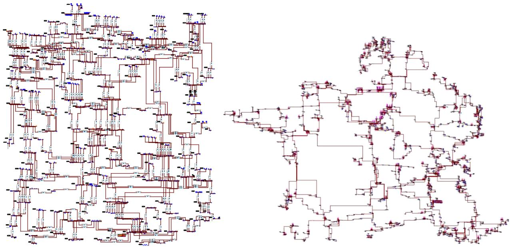  
Fig. 1. French 400 kV (on the left) and 225 kV grid (on the right)

each. The inter-chassis communication cost is different from the interblade one. Then, inter-blade is different from the inter-socket communication and the inter-core one as well. This architecture is heterogeneous.

Two heuristics have been implemented in the real-time environment: the A* algorithm and the multilevel RB integrated from the Scotch library [29]. Then, the multilevel RB will be compared to other graph partitioning heuristics, spectral methods (Chaco solver [30]), enhanced multilevel, and multilevel evolutionary algorithm (KaFFPa and KaFFPaE solvers from KaHIP tool suite [31]) using a homogenous architecture.

Table 1 below presents the performance results for two very large networks for A* heuristic and multilevel RB (Scotch with balance strategy and δ=0.01 as LIR) on the UV100 simulator with a 40μs time step. To set up the performance the following criteria are used: NbTask, The number of tasks; NbProc, The number of processors used; Comm, The total number of communication, i.e., the number of signals multiplying by the communication link cost (respectively 10, 16, 43, and 65 respectively for inter-cores, sockets, blades, and chassis communication links); Var, The processor load variance to measure the load balancing; Time, The execution time of the task mapping in seconds (run on a host with Intel i7-4910MQ CPU @ 2.90GHz).

On large network instances, the graph partitioning technique is faster than the A* algorithm. It also gives better solutions (lower communication costs and better balancing). In absolute terms, the execution time is quite fast (no more than a few seconds).

Table 2 below presents the graph partitioning benchmark results on the French 400kV case composed of 460 tasks. All graph partitioning is fast for this case. However, the spectral solution is overcome by multilevel solution on the solution quality. Multilevel RB is quite performing in the load balancing while having a limited communication cost. Evolutionary is quite promising in terms of communication costs.

Table 1 Performance results for large network instances.   

<table><tr><td>Instance</td><td>NbTask</td><td>Mapping Strategy</td><td>NbProc</td><td>Comm</td><td>Var</td><td>Time</td></tr><tr><td rowspan="2">French 400kV grid</td><td rowspan="2">460</td><td>A*</td><td>16</td><td>15096</td><td>4.93</td><td>0.98</td></tr><tr><td>Scotch</td><td>16</td><td>6960</td><td>0.14</td><td>0.06</td></tr><tr><td rowspan="2">French 400kV + 225 kV grid</td><td rowspan="2">1510</td><td>A*</td><td>79</td><td>148974</td><td>14.35</td><td>81.1</td></tr><tr><td>Scotch</td><td>79</td><td>123216</td><td>0.34</td><td>0.17</td></tr></table>

The rest of the paper analyzes only multilevel RB (Scotch Solution) in detail. It considers only homogeneous architecture in the real-time EMT case.

# 3. Multilevel graph partitioning for an efficient task mapping

# 3.1. A fast graph partitioning algorithm

# 3.1.1. Overview of the algorithm

The graph partitioning algorithm, implemented in Scotch $[ 6 , 2 9 ]$ , contains several routines. The main one is the Recursive Bipartitioning (RB). As the name suggests, this algorithm recursively bipartitions subsets of both SG and TG. It starts with the whole graph until all subsets of the TG have exactly one vertex. A Greedy Graph Partitioning algorithm (GPA) proceeds the bipartition. At each recursive step, a subset of the SG will be partially mapped to a subset of the TG. In the next recursive step, the resulting sub-subsets in both graphs will be mapped according to their parents’ mapping.

Other than the RB, more algorithms and post-processing methods are available. The Multi-level method (ML) is important for performance. It has three distinct phases. First, a coarsening phase applies graph matching algorithms to reduce the graph to a smaller equivalent. Then, a partition phase runs RB and GPA algorithms. Finally, an uncoarsening phase grows back the graph to its original size. Another important method is the Exactifier, EX. It is a post-processing method that balances the partition trying to increase the least the communication cost. Users combine these methods in a “strategy” that agrees with their needs.

Two strategies are proposed by default, “Quality” and “Balance”. The former prioritizes the minimization of the cost function described above. This can result in a slower and more unbalanced partition. The latter prioritizes a balanced partition where all processors have roughly the same charge. This can deteriorate the quality of the partition. Both strategies have the same core structure. An external ML reduces huge graphs to big graphs with 5000 nodes during the first coarsening phase (step 1 in Fig. 2). Then, an RB (step 2), at each subdomain, uses an internal ML coarsening phase to reduce the partitions to tiny graphs with 120 nodes (step 3). It ends with the GPA bipartition (step 4). During the uncoarsening phases (steps 5 and 6), some post-processing methods are used to meet the user's needs. At the end of this process (step 7), in the case of "Balance", the EX method is used to control the LIR.

Table 2 Performance results on graph partitioning techniques benchmark over French 400kV grid.   

<table><tr><td>Task mapping strategy</td><td>Solver</td><td>Configuration</td><td>NbProc</td><td>Comm</td><td>Var</td><td>Time</td></tr><tr><td>Multilevel RB</td><td>Scotch</td><td>Balance strategy + δ = 0.01 (LIR)</td><td>16</td><td>610</td><td>0.07</td><td>0.13</td></tr><tr><td>Spectral</td><td>Chaco</td><td>Lanczos method + Bisection</td><td>16</td><td>1256</td><td>3.04</td><td>0.001</td></tr><tr><td>Enhanced Multilevel</td><td>KaFFPa</td><td>strong configuration</td><td>16</td><td>510</td><td>1.30</td><td>0.20</td></tr><tr><td>Multilevel Evolutionary</td><td>KaFFPaE</td><td>strong configuration</td><td>16</td><td>510</td><td>1.15</td><td>0.36</td></tr></table>

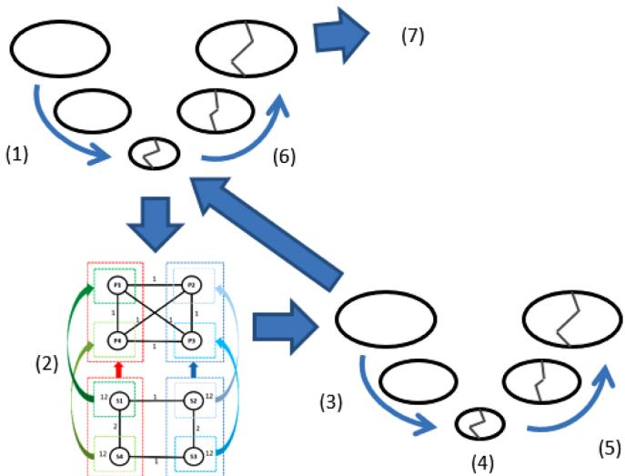  
Fig. 2. Illustrative scheme of the graph partitioning algorithm and its steps.

# 3.1.2. Algorithm limits

As was explained, the mapping is executed by minimizing the cost function. However, there are no restrictions on the total allocation cost in each processor. The time constraint is checked after the mapping. If the time step is not respected in one processor, the mapping has to use an extra processor. Then, the partitioning is rerun with an extra processor in the architecture. This process will repeat until a mapping is valid or there are no more available processors to be added.

A consequence of this validation method is the excessive use of the number of processors to run the simulation. Since a strategy is a particular heuristic combination, it may miss a valid solution. So, it has to increase the number of processors. The use of different strategies may be the difference between finding a solution with fewer processors and not finding one at all.

# 3.2. Hyper parameter tuning

To overcome the weak time constraint, some modifications were proposed. The statistics used to compare the following results are the same as above. A smaller example has been chosen for testing the tuning of hyper parameters. It is a benchmarked network (Fig. 3) derived from 35 buses benchmark duplications (see Fig. 4) with 802 vertices and 2052 edges (332 buses, 513 lines, and 42 transformers). They are mapped into a complete and homogeneous architecture composed by 19 processors. The chosen time step is 40μs. The minimum number of processors required is 16. It corresponds to the tasks’ total weight over the time-step constraint.

# 3.2.1. Load imbalance ration (LIR)

A relevant metric to characterize a partition is its LIR. It measures the total imbalance of charges between processors after the partition. Since the user limits it by the variable $0 < \delta \le 1$ , the LIR is a constraint in the communication minimization problem. Table 3 presents different results obtained when δ varies for both quality and balance strategies. "-" means no solution has been found. Results of the new strategy

(specific) proposed in Section 3.2.2 are also displayed.

As δ decreases, the number of processors used in both strategies also decreases. In particular, using smaller δ than 0.25 allows “Balance” to find a solution with 19 processors or less. The communication, however, increased. This happens because more communicating tasks are forcedly separated into different processors. Since there were fewer attempts, the execution times were reduced as the variance. Because of fewer processors, the tasks were better concentrated.

# 3.2.2. Specific strategy

As it was highlighted previously, the creation of a specific strategy for transmission networks could offer better results than generic ones. It uses the fact that graph partitioning was designed to partition graphs with billions of nodes. Since very large network instances will not exceed thousands of nodes (see Table 1), one could spend more time in certain routines. This will not have a strong influence on the execution time. So the backbone of the quality strategy is kept for the specific strategy adding the EX method for the balancing. Then, the lower bound in the external ML method has been lower to benefit network graph instances in the coarsening phase. Mainly the iterations in the GPA have been increased to improve the quality of the chosen solution. Table 3 shows the results of this new strategy.

Like “Quality”, the new strategy made a partition in all three cases. But, it managed to find solutions with fewer or the same number of processors and with the communication cost of the same magnitude. Its variance is comparable with the one obtained by other strategies.

# 3.2.3. Random seed

Another possible source of optimization is the random seed used in the algorithm. Randomness is used mainly during the GPA when the first node is chosen to start the bipartition. A lucky choice may result in a better bipartition. Currently, there are iterations over the GPA keeping the best partition among them. The random seed generates pseudo-random arrays which are used as a sample. Different seeds generate different arrays resulting in different choices for the first nodes. This idea of seed iteration has been also used by the Iterated Multilevel Algorithm [25].

Iterating over the seed, the algorithm was able to improve some of the partitions made in the standard case. Table 4 shows the results for δ = 0.25:

Differently from the other tables, this one has a column NbIter, the number of iterations before finding the first valid partition. In this example, the random seed was iterated 10 times before restart all over adding a new processor. When NbIter is set to ∅, it is the no iteration case similar to Table 3.

Since the starting point is 16 processors, NbIter = 26 as in the first line means that using the “Quality” strategy, the solution was found after the sixth random seed iteration with 18 processors (26 10 6mod = ). This happens to be better than the no iteration case in all parameters (NbProc, Comm, Var) except Time. It was expected as the heuristic is re-run several times during iterations. Similarly for “Balance”, 32 means that a solution was found in the second random seed iteration with 19 processors. This is a huge improvement from the previous case where no valid partition was found. Finally, for the new strategy, the partition found is the same as before.

Vary the random seed showed to be a relevant optimization. But, its

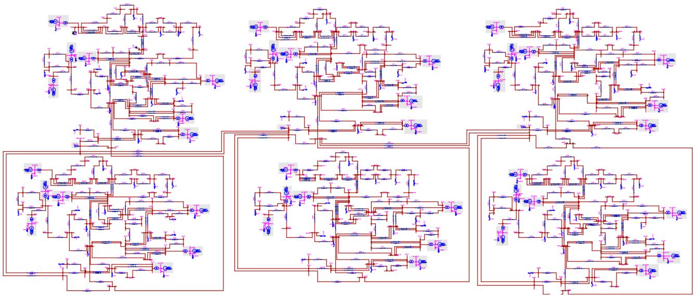  
Fig. 3. Benchmarked example of 802 tasks.

Table 3 Values for δ and strategy comparison.   

<table><tr><td>δ</td><td>Strategy</td><td>NbProc</td><td>Comm</td><td>Var</td><td>Time</td></tr><tr><td rowspan="3">0.25</td><td>Quality</td><td>19</td><td>390</td><td>8.874</td><td>0.036</td></tr><tr><td>Balance</td><td>-</td><td>-</td><td>-</td><td>-</td></tr><tr><td>Specific</td><td>18</td><td>396</td><td>4.979</td><td>0.029</td></tr><tr><td rowspan="3">0.10</td><td>Quality</td><td>18</td><td>390</td><td>4.644</td><td>0.036</td></tr><tr><td>Balance</td><td>18</td><td>402</td><td>4.004</td><td>0.033</td></tr><tr><td>Specific</td><td>18</td><td>384</td><td>3.647</td><td>0.036</td></tr><tr><td rowspan="3">0.01</td><td>Quality</td><td>17</td><td>450</td><td>0.463</td><td>0.023</td></tr><tr><td>Balance</td><td>17</td><td>480</td><td>0.032</td><td>0.018</td></tr><tr><td>Specific</td><td>17</td><td>444</td><td>0.040</td><td>0.026</td></tr></table>

Table 4 Random seed results.   

<table><tr><td>Strategy</td><td>NbProc</td><td>NbIter</td><td>Comm</td><td>Var</td><td>Time</td></tr><tr><td>Quality</td><td>19</td><td>0</td><td>390</td><td>8.874</td><td>0.036</td></tr><tr><td>Quality</td><td>18</td><td>26</td><td>372</td><td>6.435</td><td>0.257</td></tr><tr><td>Balance</td><td>-</td><td>0</td><td>-</td><td>-</td><td>-</td></tr><tr><td>Balance</td><td>19</td><td>32</td><td>396</td><td>12.13</td><td>0.202</td></tr><tr><td>Specific</td><td>18</td><td>0</td><td>396</td><td>4.979</td><td>0.029</td></tr><tr><td>Specific</td><td>18</td><td>21</td><td>396</td><td>5.417</td><td>0.167</td></tr></table>

natural random character prevents this method to guarantee a valid solution.

# 3.3. Validation toward exact solutions

# 3.3.1. Exact solutions formulation

To model the problem described above, two new Boolean variables must be introduced. The first, the allocation variable x is 1 if the task i is allocated to the processor j and 0 otherwise. The second is the dilatation variable $\rho _ { i j } ^ { k l }$ which values 1 if, for a pair of communicating tasks, the task i is allocated to the processor j and the task k is allocated to the processor l, and 0 otherwise. The linear formulation of the problem is:

$$
\left. \min  \frac {1}{T} \left(\sum_ {j} \left| \bar {T} - \frac {1}{\mu} \sum_ {i} t _ {i} x _ {i j} \right|\right) + \left(\sum_ {\{i, k \}} \left(\sum_ {j} \left(\sum_ {l \neq j} w _ {i k} \rho_ {i j} ^ {k l}\right)\right)\right)\right) \tag {2}
$$

Subject to:

$$
\forall i, \sum_ {j} x _ {i j} = 1; \forall j, \sum_ {i} t _ {i} x _ {i j} \leq \mu \tag {3}
$$

$$
\forall \{i, k \}, \forall j, l \mid j \neq l, \rho_ {i j} ^ {k l} \geq x _ {i j} + x _ {k l} - 1 \tag {4}
$$

Where T is the total tasks evaluation time and $\hat { T }$ is the average time per processor. The constant μ is the time constraint, ti is the evaluation time of task i and $w _ { i k }$ is the weight of the communication between tasks i and k.

The main expression has two distinct parts. The first, the sum over the processors, is the LIR. The second one, the triple sum, is the Communication Cost, CC.

$$
L I R = \frac {1}{T} \left(\sum_ {j} \left| \bar {T} - \frac {1}{\mu} \sum_ {i} t _ {i} x _ {i j} \right|\right) \tag {5}
$$

$$
C C = \sum_ {\{i, k \}} \left(\sum_ {j} \left(\sum_ {l \neq j} w _ {i k} \rho_ {i j} ^ {k l}\right)\right) \tag {6}
$$

The subsequent equations are, respectively, the allocation's uniqueness, the time-step constraint, and the relation of both Boolean variables. LP has been already used as an exact method resolution [21]. However, this formulation differs by including the time constraint (realtime simulation) on each processor. The example used to compare the obtained solutions with those of LP is a benchmark model of 35 buses. It is provided by real-time EMT tool [8] as a test system from a real network. It has 103 tasks to be partitioned among 3 processors, resulting in about $1 0 ^ { 4 9 }$ possible combinations.

# 3.3.2. Pareto front

For the problem studied, the two criteria analyzed are the LIR and the CC. On one hand, minimizing the former means restraining more and more the balance among processors. On the other hand, minimizing the latter means trying to keep heavy communicating tasks together neglecting their evaluation times. The Pareto front allows a comparison of both magnitudes and serves as a lower bound for the solutions to the problem. It allows formalizing what a “good-enough” solution is. One way to find the Pareto front using the LP formulation is to vary the proportional weight either magnitude has. Then, solutions are plotted since it has two dimensions to compare. Noticing that this is a discrete problem, there is not a continuum of possible solutions. Indeed, there is no way to allocate half task to a third of a processor, for instance. Varying the proportions $\alpha , \beta$ in (7), subject to strict (3), and (4)

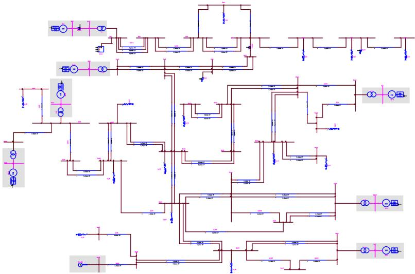  
Fig. 4. 35 buses model

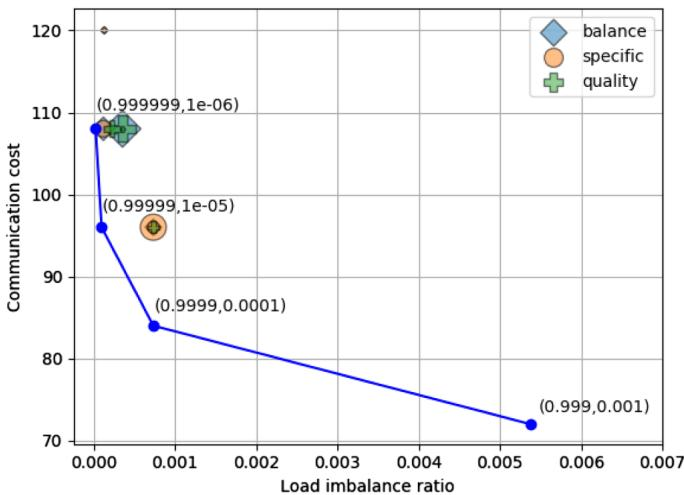  
Fig. 5. Pareto front for the 35 buses model

constraints, through a spectrum of values will result in some exact solutions. The bigger the problem, the more possible the exact solutions there are.

$$
\min  _ {\alpha + \beta = 1} \alpha \times \mathrm {L I R} + \beta \times \mathrm {C C} \tag {7}
$$

To solve the linear problem, the mathematical programming language was AMPL [32] with the parallel FICOTM Xpress solver [33]. A 190 core cluster was used to solve it. Fig. 5 below shows the comparison between the Pareto front and heuristic results. The blue dots forming the line are the exact solutions of the LP. Because of the discrete nature of the problem, the Pareto front only contains four solutions. The values in parenthesis (α, β) are the respective weights of each side of the expression (7). When $\alpha \leq 0 ,$ 999 all exact solutions are represented by the bottom right blue dot. The marker's size represents the chosen δ, being the biggest for δ=0.25 and the smallest for $\delta { = } 0 . 0 1$ . The intermediary ones are $\delta = 0 . 1$ and $\delta { = } 0 . 0 5$ . Each marker's form is associated with one multilevel RB strategy: diamond for balance strategy, circle for specific, cross for quality.

When compared with the Pareto optimal solutions, one can notice that heuristic solutions tend to prioritize the LIR for this case. Indeed, they deteriorate, even if not much, the CC to have the same LIR of an exact solution.

Finally, to measure the distance between the Pareto front and the

Table 5 Distance to the Pareto front for the 35 buses model.   

<table><tr><td>δ</td><td>Balance</td><td>Specific</td><td>Quality</td></tr><tr><td>0.25</td><td>3.30</td><td>6.37</td><td>3.30</td></tr><tr><td>0.10</td><td>0.95</td><td>0.95</td><td>2.01</td></tr><tr><td>0.05</td><td>6.37</td><td>6.37</td><td>6.37</td></tr><tr><td>0.01</td><td>120000</td><td>120000</td><td>3.30</td></tr></table>

Table 6 Task Mapping result for each scotch strategy.   

<table><tr><td>Strategy</td><td>NbProc</td><td>Comm</td><td>Var</td><td>Time</td><td>Max RT ExecTime</td></tr><tr><td>Quality</td><td>6</td><td>375</td><td>18.47</td><td>0.0028</td><td>31.5</td></tr><tr><td>Balance</td><td>6</td><td>524</td><td>0.09</td><td>0.0029</td><td>24.0</td></tr><tr><td>Specific</td><td>6</td><td>522</td><td>0.27</td><td>0.0113</td><td>24.0</td></tr></table>

obtained solutions, the metric used was the smallest Euclidean distance between a heuristic solution v and an exact solution $p \in P F ,$ the Pareto front, that is:

$$
\min  _ {p \in P F} (p - v) \tag {8}
$$

Table 5 shows the measured distance. One must notice the scale used. All distances are in order of $1 0 ^ { - 4 }$ , which one can assume to be close enough.

# 4. Hardware-in-the-loop test case

# 4.1. Test case overview

To illustrate the impact of different mapping strategies, a HIL simulation test case is presented in this paper. This system was developed for the Best Path DEMO#2 [34]. It consists of a three-terminal HVDC grid including DC circuit breakers (DCCBs) [35], as shown in Fig. 6. Converter stations are represented by Model#2 and Model#3 MMC models [36]. The Model#3 models are simulated in CPU while Model#2 model is partly run on CPU and FPGA boards [37]. Two MMCs (Station 2 and 3) are controlled by a generic controller developed in Simulink and implemented in HYPERSIM $[ 5 , 4 ] .$ . The last

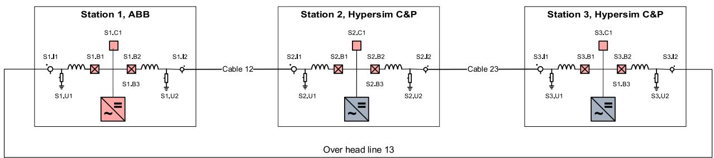  
Fig. 6. Overview of the three terminals DC grid

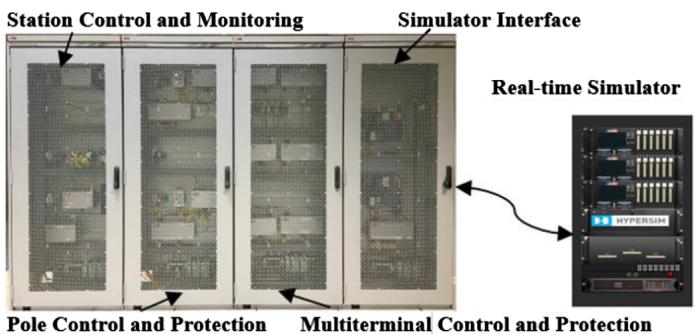  
Fig. 7. Overview of the HIL set-up, replica provided by ABB

converter (Station 1) is controlled through simulator IOs, by industrial controllers provided by ABB. Similarly, the DCCB models are also controlled by ABB control hardware [38]. DC cables (2 sections of 32km and 100km) and the overhead line (40 km) are represented by frequency-dependent line models [39]. All line data are presented in the Appendix.

The objective of this HIL set-up (Fig. 7) is to assess the efficiency of the DC grid protection algorithm as well as the action DCCB control into a DC grid, for different DC faults. Detailed results of the DCCB control can be found in [40].

# 4.2. Task mapping results

The DC grid can be divided into 85 tasks. The main tasks can be listed by load importance as follow:

- 3 converters stations with DC breaker,   
- Control system of 2 converters,   
- 6 DC lines (2 sections for each DC line),   
- The rest is dedicated to the IOs for control replicas (DC breaker and VSC control) and FPGA MMC valve models.

Three scotch strategies, among them the specific one from 3.2.2, have been tested with an imbalance ratio δ=0.01. The time step has been set to 30μs. The last column indicates the steady state execution time of the most loaded processor. The simulations were performed on an OP5031 target with 32 cores (2 CPU Intel Xeon E5-2697A v4 @ 2.60GHz - 16 cores). Only specific and balance strategies succeed to respect the real-time constraint. It has been observed that favoring CPU load balancing instead of task communication deals better with erroneous task time estimates. For the transients’ simulation, the task mapping from the balance strategy is kept for the DCCB validation.

# 4.3. Simulation results

The scenario consists of a permanent negative pole-to-ground fault on the shorter DC cable. The fault event occurs at t=200ms in the

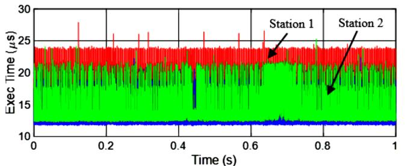

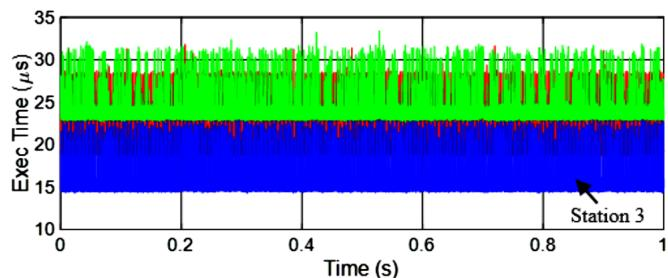  
Fig. 8. Execution time for converters stations during transients, (top: balance strategy – bottom: quality strategy)

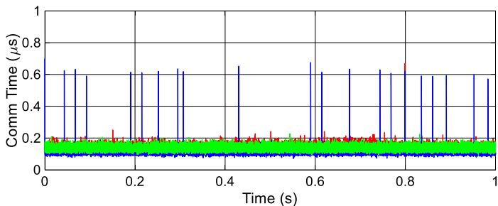  
Fig. 9. Inter-processor communication time for each converter station

following figures. Fig. 8 shows that, during the transients, the 30μs time step constraint is respected in the three most loaded processors (each task corresponds to one converter station, identified by one color). As result, the balance strategy has better performance than quality as observed in steady state.

The last graph shows that inter-task communications are negligible. This confirms that, for this case, balancing the processor loads is more important than minimizing the inter-processor communication. This justifies the choice of balanced strategy. However, this conclusion may not be applicable to heterogeneous architectures on which communication latencies can have a higher impact.

Thanks to the DC grid protection implemented in the control cubicles, the faulty cable is isolated from the rest of the DC grid with DCCBs. After some transients due to the fault and DCCB operation, the DC voltage of each station returns to its operational point +/- 320kV as shown in Fig. 10.

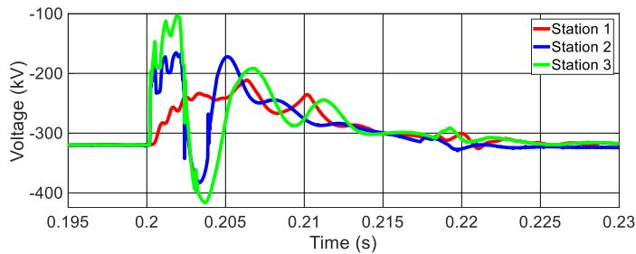  
Fig. 10. Negative pole voltage at each converter station terminal subjected to clearance of permanent DC cable fault

# 5. Conclusions

This paper has highlighted deeply that a multilevel graph partitioning recursive bipartioning algorithm is one of the most efficient heuristics to proceed with an optimal solution of the task mapping problem for real-time EMT simulations. First, tests within an industrial tool over realistic networks have shown a good tradeoff in terms of execution time and quality of the solution. The main drawback for realtime mapping is that the time constraint is weak. However, hyper parameter tuning helps to mitigate it. It allows the engineer to increase the quality of solutions while respecting the time step constraint. Additionally, comparisons with exact methods have strengthened the confidence of finding almost-optimal solutions. Lastly, an industrial real-time Hardware-in-the-Loop simulation has validated the use of this technique where balance strategy should be preferred over the quality one to best deal with erroneous task time estimates.

# CRediT authorship contribution statement

Boris Bruned: Supervision, Conceptualization, Investigation,

# Appendix

DC cable data

Geometrical and electrical parameters are adapted from the cable used in [41]:

- Transmissible power: 1000 MW – 1350 MW   
- Insulation material: XLPE, 320 kV   
- Core conductor: copper, 1800 mm²   
- Cable length: 200 km / 70km

Geometrical and electrical data are shown in Fig. 11 and detailed in Table 7. These data are filled in an offline EMT tool (EMTP [42]) routine which computes the wideband cable model for this cable. The impedance and admittance matrices are computed at 1 MHz, they are shown in Table 8 to Table 11.

Software, Validation, Visualization, Writing - original draft, Writing - review & editing. Pierre Rault: Resources, Writing - original draft, Visualization, Funding acquisition. Sébastien Dennetière: Resources, Writing - original draft, Writing - review & editing. Ian Menezes Martins: Conceptualization, Investigation, Software, Validation, Visualization, Writing - original draft.

# Declaration of Competing Interest

The authors declare that they have no known competing financial interests or personal relationships that could have appeared to influence the work reported in this paper.

# Acknowledgment

First, the authors would like to acknowledge Eric Lemieux and Philippe Le Huy from Hydro-Québec. Discussions on SCOTCH and architecture have fed this paper. Also many thanks for the help provided by optimization experts Dr. Jean Maeght and Dr. Manuel Ruiz from RTE R&D to handle linear programming formulations and solvers. A strong acknowledge to ABB who allows us to publish on the example of HVDC grid set-up which was developed for the Best Paths project (co-funded by the European Union's Seventh Framework Programme for Research, Technological Development, and Demonstration under the grant agreement no. 612748). Lastly, the authors would like to thanks the review process which brings relevant suggestions to improve this paper and a deeper discussion about new trends on Graph Partitioning techniques.

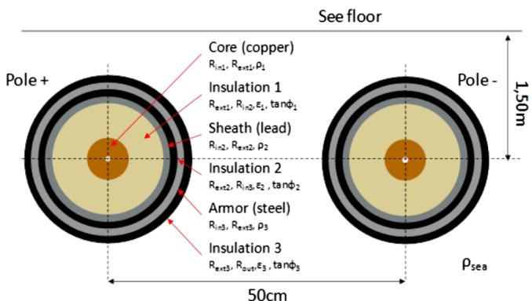  
Fig. 11. DC underwater cable layout

Table 7   
Cable parameters   

<table><tr><td>Rin1</td><td>7.6 mm</td><td>Rext2</td><td>52.125 mm</td><td>ρ3</td><td>2.3</td></tr><tr><td>Rext1</td><td>25.125 mm</td><td>ρ2</td><td>1.172 10-8Ωm</td><td>ε3</td><td>13.8 10-8Ωm</td></tr><tr><td>ρ1</td><td>1.172 10-8Ωm</td><td>ε2</td><td>2.3</td><td>tanφ3</td><td>0.001</td></tr><tr><td>ε1</td><td>2.3</td><td>tanφ2</td><td>0.001</td><td>Rout</td><td>66.725 mm</td></tr><tr><td>tanφ1</td><td>0.0004</td><td>Rin3</td><td>56.125 mm</td><td>ρsea</td><td>0.2 Ωm</td></tr><tr><td>Rin2</td><td>49.125 mm</td><td>Rext2</td><td>61.725 mm</td><td></td><td></td></tr></table>

Table 8   
Series resistance matrix (1 MHz).   

<table><tr><td>R (Ω/km)</td><td></td><td>Pole + Core</td><td>Sheath</td><td>Pole - Core</td><td>Sheath</td></tr><tr><td rowspan="2">Pole +</td><td>Core</td><td>0.95 10-02</td><td></td><td></td><td></td></tr><tr><td>Sheath</td><td></td><td>0.22</td><td></td><td></td></tr><tr><td rowspan="2">Pole -</td><td>Core</td><td></td><td></td><td>0.95 10-02</td><td></td></tr><tr><td>Sheath</td><td></td><td></td><td></td><td>0.22</td></tr></table>

Table 9   
Series inductance matrix (1 MHz).   

<table><tr><td rowspan="2">L (mH/km)</td><td></td><td colspan="2">Pole +</td><td colspan="2">Pole -</td></tr><tr><td></td><td>Core</td><td>Sheath</td><td>Core</td><td>Sheath</td></tr><tr><td rowspan="2">Pole +</td><td>Core</td><td>2.6</td><td>2.4</td><td>1.2</td><td>1.2</td></tr><tr><td>Sheath</td><td>2.4</td><td>2.4</td><td>1.2</td><td>1.2</td></tr><tr><td rowspan="2">Pole -</td><td>Core</td><td>1.2</td><td>1.2</td><td>2.6</td><td></td></tr><tr><td>Sheath</td><td>1.2</td><td>1.2</td><td>2.4</td><td>2.4</td></tr></table>

Table 10   
Shunt conductance matrix (1 MHz).   

<table><tr><td rowspan="2">G (μS/km)</td><td></td><td colspan="2">Pole +</td><td colspan="2">Pole -</td></tr><tr><td></td><td>Core</td><td>Sheath</td><td>Core</td><td>Sheath</td></tr><tr><td rowspan="2">Pole +</td><td>Core</td><td>0.048</td><td>-0.048</td><td>0</td><td>0</td></tr><tr><td>Sheath</td><td>-0.048</td><td>1.1</td><td>0</td><td>0</td></tr><tr><td rowspan="2">Pole -</td><td>Core</td><td>0</td><td>0</td><td>0.048</td><td>-0.048</td></tr><tr><td>Sheath</td><td>0</td><td>0</td><td>-0.048</td><td>1.1</td></tr></table>

Table 11   
Shunt capacitance matrix (1 MHz).   

<table><tr><td rowspan="2">C (μF/km)</td><td></td><td colspan="2">Pole +</td><td colspan="2">Pole -</td></tr><tr><td></td><td>Core</td><td>Sheath</td><td>Core</td><td>Sheath</td></tr><tr><td rowspan="2">Pole +</td><td>Core</td><td>0.19</td><td>-0.19</td><td>0</td><td>0</td></tr><tr><td>Sheath</td><td>-0.19</td><td>1.9</td><td>0</td><td>0</td></tr><tr><td rowspan="2">Pole -</td><td>Core</td><td>0</td><td>0</td><td>0.19</td><td>-0.19</td></tr><tr><td>Sheath</td><td>0</td><td>0</td><td>-0.19</td><td>1.9</td></tr></table>

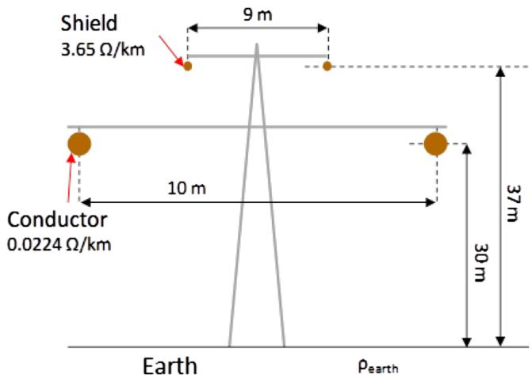  
Fig. 12. DC overhead line layout.

Table 12 Overhead line parameters.   

<table><tr><td rowspan="2">Shield conductor</td><td>DC resistance</td><td>3.65 Ω/km</td></tr><tr><td>Diameter</td><td>9.54 mm</td></tr><tr><td rowspan="2">ACSR conductor</td><td>DC resistance</td><td>0.0224 Ω/km</td></tr><tr><td>Diameter</td><td>47.75 mm</td></tr><tr><td>Pearth</td><td></td><td>500 Ωm</td></tr></table>

Table 13 Series resistance matrix (1 MHz).   

<table><tr><td>R (Ω/km)</td><td>Pole +</td><td>Pole -</td></tr><tr><td>Pole +</td><td>2.24 10-02</td><td>9.7 10-07</td></tr><tr><td>Pole -</td><td>9.7 10-07</td><td>2.24 10-02</td></tr></table>

Table 14 Series inductance matrix (1 MHz).   

<table><tr><td>L (mH/km)</td><td>Pole +</td><td>Pole -</td></tr><tr><td>Pole +</td><td>3.3</td><td>2.1</td></tr><tr><td>Pole -</td><td>2.1</td><td>3.3</td></tr></table>

Table 15 Shunt conductance matrix (1 MHz).   

<table><tr><td>G (μS/km)</td><td>Pole +</td><td>Pole -</td></tr><tr><td>Pole +</td><td>0.0002</td><td>0</td></tr><tr><td>Pole -</td><td>0</td><td>0.0002</td></tr></table>

Table 16 Shunt capacitance matrix (1 MHz).   

<table><tr><td>C (μF/km)</td><td>Pole +</td><td>Pole -</td></tr><tr><td>Pole +</td><td>8 10-3</td><td>-1 10-3</td></tr><tr><td>Pole -</td><td>-1 10-3</td><td>8 10-3</td></tr></table>

# DC overhead line data

Geometrical and electrical parameters are adapted from the line used in [41]. The conductor pair for each pole was replaced by only one to have a transmission capability close to 1000 MW:

- Transmissible power: 1000 MW (1751 A)   
- Conductor: ACSR (Aluminium conductor steel reinforced), 1274 mm²   
- Overhead line length: 40 km

Geometrical and electrical data are shown in Fig. 12 and detailed in Table 12 . These data are filled in an EMTP [42] routine which computes the FD line model for this overhead line. The impedance and admittance matrices are computed at 1 MHz, they are shown in Table 13 to Table 16.

# References

[1] H.Saad, Y. Vernay, S. Dennetiere, P. Rault, B. Clerc, "System dynamic studies of power electronics devices with real-time simulation - a TSO operational experience, " Cigre Paris session, 2018.   
[2] P. Le-Huy, M. Woodacre, S. Guérette, É. Lemieux, Massively parallel real-time simulation of very-large-scale power systems, Proceedings of the IPST conference IPST2017, Seoul, Republic of Korea, 2017 June.   
[3] Y. Vernay, B. Gustavsen, Application of frequency-dependent network equivalents for EMTP simulation of transformer inrush current in large networks, International Conference on Power System Transients (IPST) Conference, Vancouver, Canada, 2013.   
[4] B. Bruned, C. Martin, S. Dennetière, Y. Vernay, Implementation of a unified modelling between EMT tools for network studies, Proceedings of the IPST conference, Seoul, Republic of Korea, 2017 June.   
[5] S. Dennetiere, B. Bruned, H. Saad, E. Lémieux, Task separation for real-time simulation of the CIGRE DC grid benchmark, Proceedings of the PSCC conference

PSCC2018, Dublin, Ireland, 2018.   
[6] F. Pellegrini, J. Roman, "SCOTCH: a software package for static mapping by dual recursive bipartitioning of process and architecture graphs," HPCH’96, Brussels, Belgium, April 15-19, 1996.   
[7] A. Ernst, H. Jiang, M. Krishnamoorthy, A new Lagrangian Heuristic for the task allocation problem, Ind. Math. (2006) 137–158.   
[8] V. Q. Do, J.-C. Soumagne, G. Sybille, G. Turmel, P. Giroux, G. Cloutier, S. Poulin. "Hypersim, an integrated real-time simulator for power networks and control systems," ICDS’99, Vasteras, Sweden, May 25-28, 1999.   
[9] A. Abusalah, O. Saad, J. Mahseredjian, U. Karaagac, L. Gerin-Lajoie, I. Kocar, CPU based parallel computation of electromagnetic transients for large scale power systems, Proceedings of the IPST Conference IPST2017, Seoul, Republic of Korea, 2017.   
[10] Rikido Yonezawa, Taku Noda, A study of solution process parallelization for an EMT analysis program using OpenMP, Proceedings of the IPST Conference IPST2017, Seoul, Republic of Korea, 2017.   
[11] W.F. Tinney, Compensation methods for network solutions by optimally ordered triangular factorization, IEEE Trans. Power Appar. Syst. PAS-91 (1) (1972) 123–127

Jan..   
[12] F.M. Uriarte, On Kron's diakoptics, Electr. Power Syst. Res. 88 (2012) 146–150.   
[13] M.A. Tomim, J.R. Marti, L. Wang, Parallel computation of large power system network solutions using the multi-area Thévenin equivalents (MATE) algorithm, Proceedings of the 16th PSCC Conference, Glasgow, Scotland, 2008.   
[14] L. Chua, Li-Kuan Chen, Diakoptic and generalized hybrid analysis, IEEE Trans. Circuits Syst. 23 (12) (1976) 694–705 December.   
[15] C. Dufour, J. Mahseredjian, J. Belanger, A combined state-space nodal method for the simulation of power system transients, IEEE Trans. Power Delivery 26 (2) (2011) 928–935.   
[16] A. Sangiovanni-Vincentelli, L.-K. Chen and L.O. Chua, "Node-tearing nodal analysis, " Electronics Research Laboratory, University of California, Berkeley, Memo. No. ERL-M582, Sept. 1976.   
[17] S. Fan, H. Ding, A. Kariyawasam, Parallel electromagnetic transients simulation with shared memory architecture computers, IEEE Trans. Power Deliv. 33 (1) (2018) Feb..   
[18] P. Zhang, J.R. Marti, H.W. Dommel, Network partitioning for real-time power system simulation, Proceedings of the IPST Conference IPST’05, Montréal, Canada, 2005 June.   
[19] J. Aguilar, E. Gelenbe, Task assignment and transaction clustering heuristics for distributed systems, Inf. Sci. 199-219 (1997) March.   
[20] T. Wong, Automatic Parallel Task Mapping: Application in the Simulation of Real-Time Power Systems, PhD Thesis Polytechnique Montréal, 1999.   
[21] A. Buluç, H. Meyerhenke, I. Safro, P. Sanders, C. Schulz, Recent advances in graph partitioning, Algorithm Engineering, Springer, 2016, pp. 117–158.   
[22] R.D. Williams, Performance of dynamic load balancing algorithms for unstructured mesh calculations, Concurrency 3 (5) (1991) 457–481.   
[23] B. Hendrickson, R. Leland, An improved spectral graph partitioning algorithm for mapping parallel computations, SIAM, J. Sci. Comput. 16 (1995).   
[24] B. Parlett, D. Scott, The Lanczos algorithm with selective orthogonalization, Math. Comput. 33 (1979) 217–238.   
[25] P. Sanders, C. Schulz, Engineering multilevel graph partitioning algorithms, 19th European Symposium on Algorithms (ESA), 6942 Springer, 2011, pp. 469–480 of LNCS.   
[26] P. Sanders, C. Schulz, Distributed evolutionary graph partitioning, 12th Workshop on Algorithm Engineering and Experimentation (ALENEX), 2012, pp. 16–29.

[27] C. Martin, Y. Fillion, Automation of model exchange between planning and EMT tools, Proceedings of the IPST Conference, Seoul, Republic of Korea, 2017 June.   
[28] SGI® Altix® UV 100 System User's Guide.   
[29] F. Pellegrini, "SCOTCH and LIBSCOTCH 6.0 user's guide," LaBRL, University of Bordeaux, Septembre 2014.   
[30] B. Hendrickson, R. Leland, "The Chaco user's guide version 2.0," Tech. Rep. SAND95-2344, Sandia National Laboratories, Albuquerque, NM, July, 1995.   
[31] Sanders, P.,Schultz, "KaHIP v2.1 Karlsruhe high quality partitioning user guide," 2013.   
[32] R. Fourer, D. Gay, B. Kernighan B, "AMPL—a modelling language for mathematical programming" Thomson Brooks/Cole, Pacific Grove, CA, 2003.   
[33] FICOTM Xpress Optimization Suite (2017) Xpress-optimizer reference manual release 31.10.   
[34] Best paths project online. http://www.bestpaths-project.eu/.   
[35] J. Häfner, B. Jacobson, "Proactive hybrid HVDC breakers - a key innovation for reliable HVDC grids," Cigre Bologna, Paper 0264, 2011.   
[36] H. Saad, S. Dennetière, J. Mahseredjian, On modelling of MMC in EMT-type program, 2016 IEEE 17th Workshop on Control and Modeling for Power Electronics (COMPEL), Trondheim, Norway, 2016 June.   
[37] W. Li, J. Bélanger, An equivalent circuit method for modelling and simulation of modular multilevel converters in real-time HIL test bench, IEEE Trans. Power Delivery 31 (5) (2016) 2401–2409 October.   
[38] N. Johannesson, S. Norrga, C. Wikström, Selective wave-front based protection algorithm for MTDC systems, Proceeding of the DPSP Conference, Edinburgh, UK, 2016.   
[39] B. Clerc, C. Martin, S. Dennetière, Implementation of accelerated models for EMT tools, Proceedings of the IPST Conference IPST2015, Cavtat, Croatia, 2015.   
[40] P. Rault, M. Yazdani, S. Dennetière, C. Wikstrom, H. Saad, Industrial application of DCCB in HVDC grids – modelings and testing with physical controls, submitted to the, IPST conference IPST2019, Perpignan, France, 2019.   
[41] “Guide for the development of models for HVDC converters in a HVDC grid,” CIGRE Brochure 604, Working Group B4.57, December 2014.   
[42] J. Mahseredjian, S. Dennetière, L. Dubé, B. Khodabakhchian, L. Gerin-Lajoie, On a new approach for a simulation of transients in power systems, Electr. Power Syst. Res. 77 (2007) 1514–1520.