Received June 8, 2020, accepted August 11, 2020, date of publication August 20, 2020, date of current version September 1, 2020.

Digital Object Identifier 10.1109/ACCESS.2020.3018323

# Application of Duality-Based Equivalent Circuits for Modeling Multilimb Transformers Using Alternative Input Parameters

MOHAMMAD SHAFIEIPOUR 1 (Member, IEEE), WALDEMAR ZIOMEK2, (Senior Member, IEEE), ROHITHA P. JAYASINGHE 1 , (Member, IEEE), JUAN CARLOS GARCIA ALONSO1, AND ANIRUDDHA M. GOLE3, (Life Fellow, IEEE)

1Manitoba Hydro International Ltd., Winnipeg, MB R3P 1A3, Canada

2PTI Transformers LP, Winnipeg, MB R3T 0L7, Canada

3Department of Electrical and Computer Engineering, University of Manitoba, Winnipeg, MB R3T 2N2, Canada

Corresponding author: Mohammad Shafieipour (mohammad.shafieipour@sestech.com)

ABSTRACT The principle of duality is applied for electromagnetic transient (EMT) modeling of industry scale (i.e. 50, 390 MVA) multilimb transformers. While saturation, hysteresis, deep-saturation, and remanent flux are accounted for, the need for transformer internal design information such as core dimension or material is eliminated. This is achieved by formulating the equivalent circuits with an alternative set of parameters that are either provided by the manufacturer or can be determined using conventional techniques. Open-circuit tests confirm that the models produce accurate excitation currents at different saturation levels when compared with measurement results. Furthermore, the models facilitate correct short-circuit condition with support for arbitrary number of windings. Upon validating the models, inrush current is simulated and the worst-case scenario is determined due to potential remanent flux values. The findings agree with an established EMT simulation model as well as manufacturer analytical approximations. Simulated hysteresis loops are also investigated.   
INDEX TERMS Principle of duality, 3-limb and 5-limb transformer models, miltilimb multiwinding transformers, inrush current, remanent flux, hysteresis loop, electromagnetic transient.

# I. INTRODUCTION

In recent years, the importance of sustainable development has urged the electric power generation industry to rapidly expand investments in environmental-friendly forms of generating electric power such as solar and wind power technologies. Therefore, interest have grown in using power system equipment that facilitates generation, transmission and distribution of electric power resulted from renewable energy. This includes power electronics, solar photovoltaics, inverter transformers, etc. Moreover, grids which carry renewable energy typically consist of a combination of small- and medium-sized inverter-based generators such as solar panels and wind turbines as well as energy storage systems such as batteries and flywheels. As a result, the use of small- and medium-sized power system equipment has

The associate editor coordinating the review of this manuscript and approving it for publication was Mehmet Alper Uslu.

generally increased in recent years. One important example of such equipment are three-phase transformers which are constructed on a single multilimb core as it is economically and logistically more advantageous to build small- and medium-sized transformers on a single core. Such cores are typically 3-legged or 5-legged as depicted in Fig. 1. Consequently in recent years, there has been an increased demand for more accurate and numerically robust three- and five-limb transformer models for wide-band [1] and low-frequency [2] electromagnetic transient (EMT) analysis. Among the available techniques for the latter, the principle of duality has been shown to be accurate and numerically robust for modeling many transformer topologies including multilimb cores [3]–[9]. Such models require internal design information (e.g. core material, core dimensions, number of turns in the windings) or results from unconventional tests (i.e. with open terminals) in order to determine parameters of the magnetizing branches. These parameters are pertinent to

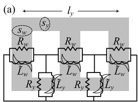

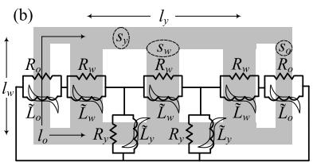  
FIGURE 1. Principle of duality directly applied on the iron core of (a) 3-limb and (b) 5-limb transformers.

open-circuit test condition and heavily influence saturation studies. This is a practical limitation as such information is seldom available. Furthermore, to the best of our knowledge, available multilimb transformer models are limited to 2- and 3-winding cases. This is perhaps due to the difficulties arising in the enforcement of zero-sequence leakage inductances for arbitrary number of windings. Although in this paper we do not provide a solution to this problem and neglect zero-sequence tests, we attempt to clarify this difficulty for future studies. It should be noted that while transformers do not typically have more than three physical windings, inclusion of different tap positions with accessible terminals in EMT simulations requires transformer models to be extended beyond the physical number of windings and thus essential in some EMT studies.

In this paper, we formulate duality-derived models with an alternative set of required input parameters. They are namely; the nameplate data, factory acceptance test (FAT) report, core aspect-ratios, air-core inductance, hysteresis loop width, and the knee voltage. The resulting equivalent circuits fall into the category of gray-box models [3] as they are configured to match the target topology (Fig. 1) with parameters to be determined. Since all the required parameters are traditionally used in EMT computations [10]–[13], they are either provided by the manufacturer or can be obtained via conventional calculation, measurement, or approximation techniques, some of which are reviewed in this paper (Section II-E). Consequently, the models exhibit accurate open-circuit test behavior. In order to ensure correct short-circuit test condition, the method of [14] is applied to multilimb core models with support for arbitrary number of windings. The resulting duality-based equivalent circuits are used to model a 50 MVA 3-limb 3-winding transformer and a 390 MVA 5-limb 2-winding unit. Results are compared against excitation current measurements under several saturation conditions as well as leakage inductance tests. To accommodate the study, sufficient saturation levels of the core have been achieved at the manufacturer’s testing facility despite the industrial scales of the transformers. Subsequently, the models are used for calculating inrush current due to different remanent flux scenarios. Finally, the computed hysteresis loops are studied.

# II. MODELING APPROACH

# A. PRELIMINARIES

The first step towards forming the equivalent circuit of a transformer based on the principle of duality, is to determine

the extent to which different parts of the transformer geometry are to be discretized. That is, how many magnetizing branches (linear or non-linear) are used to model different parts of the iron core and possibly tank, as well as how many linear elements are used to represent the leakage inductances. In this section, the principles that are followed in this paper are discussed. Throughout the paper, discussions are made for both 3- and 5-limb core models where winding limb (w) and yoke (y) apply to both cases, while outer limb (o) is only applicable to the 5-limb case.

# 1) IRON CORE

Different authors have proposed different approaches for modeling the iron core of multilimb transformers based on the principle of duality [3], [5]–[9]. Finer discretizations (i.e. using more non-linear inductors to represent the iron core) are believed to produce more accurate results. However, when forming duality-based transformer models in EMT-type programs, it is not only required to correctly represent the magnetic behavior of the device, it is also imperative to define the circuit parameters based on the available data. Fig. 1 depicts the approach taken in this paper for 3- and 5-limb cases. This is a generalization from linear inductors in [15] to non-linear inductors and linear resistors. That is, in accordance with the guidelines for slow transients [16], the non-linear (hysteresis) inductances model saturation, hysteresis, and deep-saturation phenomena, while linear resistances account for the core eddy current loss. Note that in Fig. 1 and throughout the paper, parameters with a tilde $( \mathrm { e . g . ~ } \tilde { L } )$ have saturable/hysteresis nature, otherwise they are assumed to be linear (e.g. R). It was shown in [15] that discretizing the iron core of 3- and 5-limb transformers as shown in Fig. 1, allows for determining the linear magnetizing parameters. It does not require detail information about the core or unconventional tests. Instead, it ensures the accuracy of EMT simulations for the open-circuit condition based on the core aspect-ratios

$$
r _ {s} = \frac {s _ {y}}{s _ {w}}, \quad r _ {l} = \frac {l _ {y}}{l _ {w}}, \quad r _ {s} ^ {\prime} = \frac {s _ {y}}{s _ {o}}, \quad r _ {l} ^ {\prime} = \frac {l _ {y}}{l _ {o}}. \tag {1}
$$

In (1), the cross-sectional area and the effective length of the winding limbs $( s _ { w } , l _ { w } )$ , yokes $( s _ { y } , l _ { y } )$ , and outer limbs $( s _ { o } , l _ { o } )$ are as shown in Fig. 1. In [15], it was shown that by knowing the magnetizing current $I _ { m }$ along with $r _ { s }$ and $r _ { l }$ of a 3-limb core transformer, it is possible to compute linear inductances for winding limb $L _ { w }$ and yoke $L _ { y }$ with machine precision accuracy. The 5-limb core construction was also discussed where in addition to $r _ { s }$ and $r _ { l }$ , the core aspect-ratios for the outer limb $( \mathrm { i } . \mathrm { e } . \ r _ { s } ^ { \prime }$ and $r _ { l } ^ { \prime } )$ along with $I _ { m }$ could be used to precisely compute linear inductances for the winding limb $L _ { w } ,$ , yoke $L _ { y } ,$ , and outer-limb $L _ { o } .$ . In other words, by knowing the average magnetizing current and core aspect-ratios, one can exactly determine the associated linear inductances for individual core sections of 3-limb and 5-limb transformers. The same concept can be used in determining other linear core parameters from pertinent average values. Table 1 summarizes such parameters useful for the purpose

TABLE 1. Input vs. output parameters for the method of [15].   

<table><tr><td colspan="2">3-limb</td><td colspan="2">5-limb</td></tr><tr><td>Inputs</td><td>Outputs</td><td>Inputs</td><td>Outputs</td></tr><tr><td>Im, rs, rl</td><td>Lw, Ly</td><td>Im, rs, rl, r&#x27;s, r&#x27;l</td><td>Lw, Ly, Lo</td></tr><tr><td>Ic, rs, rl</td><td>Rw, Ry</td><td>Ic, rs, rl, r&#x27;s, r&#x27;l</td><td>Rw, Ry, Ro</td></tr><tr><td>1/λair, rs, rl</td><td>Lairw, Lary</td><td>1/λair, rs, rl, r&#x27;s, r&#x27;l</td><td>Lairw, Lary,λairo</td></tr><tr><td>D, rs, rl</td><td>1/Dw, 1/Dy</td><td>D, rs, rl, r&#x27;s, r&#x27;l</td><td>1/Dw, 1/Dy, 1/Do</td></tr></table>

of this paper. From Table 1, it is realized that one can obtain linear resistances $R _ { w } , R _ { y } , R _ { o }$ from the average core eddy current losses $I _ { c } .$ . Also, the average air-core inductance $L ^ { \mathrm { a i r } }$ can be used to determine air-core inductances for individual core sections $L _ { w } ^ { \mathrm { a i r } } , L _ { y } ^ { \mathrm { a i r } } , L _ { o } ^ { \mathrm { a i r } }$ . Finally, the average hysteresis loop width D can be used to calculate loop widths associated with winding limb $D _ { w }$ , yoke $D _ { y }$ , and outer limb $D _ { o }$ . Note that [15] contains the mathematical proof for the first row of Table 1 (i.e. computing $L _ { w } , L _ { y } , L _ { o } )$ and the other three rows can be proven similarly. As shown in Section II-C3, these parameters can be used to formulate non-linear magnetizing branches and thus eliminating the need for internal design information or unconventional tests.

# 2) LEAKAGE INDUCTANCES

Several methodologies exist when dealing with the leakage inductances of duality models [2]. In this paper, we adopt the mutual couplings approach originally introduced in [8] for 3-winding transformers and generalized to multiwinding transformers in [14]. It is simple and general while being accurate and numerically robust. In addition to the already published work [2], [8], [14], the authors have verified it to be reliable for leakage inductance modeling where up to 12 windings are assumed. Therefore, it is suitable for EMT studies involving multiple tap positions. This includes 3-phase bank as well as 3-limb and 5-limb transformers studied in this paper.

Despite the aforementioned advantages, it should be noted that models based on the method of [14] (including the ones presented in this paper), have two limitations. First, they are inherently ‘‘non-reversible’’ as studied in [18]. Reversible and non-reversible models behave similarly in the linear region and around the knee area. However, in the deep-saturation region, non-reversible models are less accommodating. That is, they are tuned to produce correct deep-saturation results (e.g. inrush current) when energized from a specific winding. Parameter adjustments may be required if energized from different windings. The adjustments are primarily needed for the air-core inductance as deep-saturation results are mostly dependent on this parameter. In contrast, reversible models produce accurate results regardless of which terminal they are energized from [6], [17], [18]. This is achieved by incorporating air-core inductances seen from all terminals into the formulation which typically results in a system of nonlinear algebraic equations. Therefore, reversible models are more computationally expensive and require extra input parameters compared with their non-reversible counterparts. Considering the fact

that most transformers are meant to be energized from a unique terminal, non-reversible models are commonly preferred unless power flow needs to switch direction during operation. Examples include transformers in a storage system and high-frequency transformers in dc-dc converters of dc systems.1 The second limitation of using the method of [14] is that while the resulting n-winding models can enforce $n ( n - 1 ) / 2$ positive-sequence leakage inductances, they do not necessarily ensure all $n ( n - 1 ) / 2$ zero-sequence leakage inductance measurements. For 5-limb core as well as three-phase bank models, this limitation is insignificant as the zero-sequence flux closes its path mainly through the iron core. However, for 3-limb models, considering zero-sequence tests may become important, especially in studies involving unbalanced energizations or unbalanced faults [3], [5]. A 3-limb transformer model that ensures both positive- and zero-sequence leakage inductances with support for arbitrary number of windings will be a subject of future work.

# B. EQUIVALENT CIRCUITS

The equivalent circuits shown in Fig. 2 are applied for modeling multiwinding 3- and 5-limb transformers. The mutual inductances for each phase enforce positive-sequence leakage measurements and allow for arbitrary number of windings $i =$ $1 , \ldots , n .$ As typically done in duality-derived models, ideal transformers are used to isolate the core from the winding terminals where desired connections (i.e. delta, Y, Zigzag) can be configured. The turns ratios for ideal transformers $( N _ { i } { : } N _ { c } )$ are dictated by the single-phase winding voltage $V _ { i }$ and the reference voltage used at the core (i.e. core voltage $V _ { c } )$ . In Section II-D, guidelines for choosing $V _ { c }$ are discussed. The parallel hysteresis inductor-resistor pairs in Fig. 2, are used to represent different parts of the iron cores consistent with the discretizations in Fig. 1. In both equivalent circuits, it is noticed that $R _ { w } | | \tilde { L } _ { w }$ pairs are connected to the mutual inductances where winding 1 is connected. Other windings are separated from the iron core through mutual inductances. Therefore, as indicated in the figure, the specified air-core inductance $L ^ { \mathrm { a i r } }$ is seen from winding 1 only. This makes the models non-reversible as discussed earlier in Section II-A2.

It is important to note that while the equivalent circuits of Fig. 2 are somewhat similar to existing low-frequency multilimb models such as [3], [4], [7]–[9], they have been adequately simplified according to the principles discussed in Section II-A. Such simplifications facilitate formulation with the available set of input parameters while providing support for arbitrary number of windings.

# C. FORMULATION

# 1) LEAKAGE INDUCTANCES

The leakage inductances are typically measured by performing the standard impedance voltage tests [19]. It is based on

1Deep-saturation condition is typically occurred in black-start inrush current studies where the direction of power is inherently known. Thus, non-reversible models are applicable to a wide range of studies even in such applications.

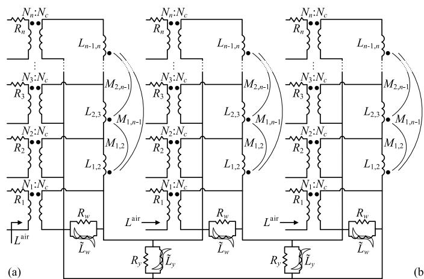

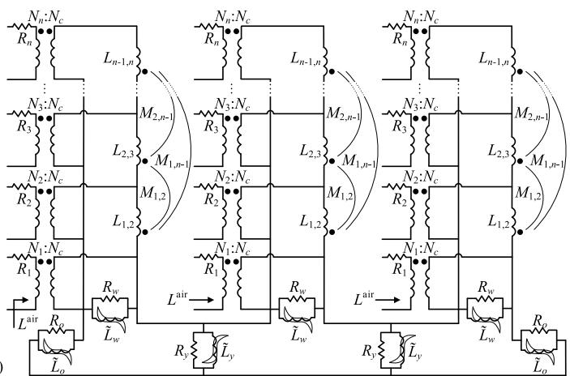  
FIGURE 2. Duality-based equivalent circuits used for modeling multiwinding (a) 3-limb and (b) 5-limb transformers.

short-circuit test between windings i and j, while all other windings are open. Therefore for an n-winding transformer, $n ( n - 1 ) / 2$ short-circuit tests are carried out. The supplied voltage Vi at winding i is increased until about 1 per-unit (pu) current flows through winding i (i.e. Ii ' 1 pu). As winding j is short-circuited, a small voltage at winding i is expected to produce 1 pu current (i.e. $V _ { i } ~ \ll ~ 1 ~ \mathrm { p u } )$ . Subsequently, by neglecting winding resistances, the leakage inductances are computed as

$$
L _ {i, j} = \frac {1}{j \omega} \cdot \frac {V _ {i}}{I _ {i}}, \quad i, j = 1, \dots , n, \quad i \neq j, \tag {2}
$$

where $\omega = 2 \pi f$ with f being the transformer’s operating frequency. The leakage inductances $L _ { i , j }$ in (2) are typically provided by the manufacturer via standard FAT report or nameplate as leakage reactances $X _ { i , j }$ in pu. Note that in terms of real values, inductance L and reactance X are related as a function of frequency $X = j \omega L$ . However, when pu values are considered, they are numerically equivalent and interchangeable. From a total of $n ( n - 1 ) / 2$ leakage inductances, $n - 1$ self inductances $L _ { i , i + 1 }$ can directly be used in the equivalent circuits of Fig. 2. The mutual inductances $M _ { i , j }$ are obtained as [14]

$$
M _ {i, j} = \frac {1}{2} \left(L _ {i, j + 1} + L _ {i + 1, j} - L _ {i, j} - L _ {i + 1, j + 1}\right). \tag {3}
$$

The generality of the above described leakage inductance modeling allows for splitting the physical windings to multiple sub-windings with appropriate voltage levels and leakage inductances. This is typically done when multiple tap positions are to be accessed during EMT simulations.

# 2) LINEAR RESISTANCES

The equivalent circuits of Fig. 2 consist of linear resistors. The copper losses for individual windings are represented using winding resistances $( R _ { 1 } , \ldots , R _ { n } )$ . The linear resistances $R _ { w } , R _ { y }$ , and $R _ { o }$ are included to model core eddy current losses in the winding limbs, yokes, and outer limbs, respectively. As summarized in Table 1, they can be determined

using the method of [15] if the total core eddy current loss $I _ { c }$ is known. As explained in Section II-E3, $I _ { c }$ can be obtained from information in the FAT report or nameplate. Therefore, $R _ { w } , R _ { y }$ , and $R _ { o }$ can be computed.

It should be noted that incorporation of non-linear effects such as anomalous (excess) losses [20] is generally recommended, especially for high-frequency applications and could be introduced in this work too. Nevertheless, assuming linear core eddy current loss is known to be valid for many low-frequency transient applications [16]–[18] which corroborates with our experience including the results presented in this paper. Since inclusion of anomalous losses would require additional input parameters, in this work we have limited the core loss to linear core eddy current loss and hysteresis loss (see also Section II-E3).

# 3) HYSTERESIS INDUCTORS

The hysteresis inductors in the equivalent circuits shown in Fig. 2, represent the non-linear magnetizing currents corresponding to the different parts of the core. Using saturable or hysteresis inductors that would require non-linear characteristic of the core material and dimensions such as B–H data [6] or the Jiles–Atherton method [9] is applicable. However, in this paper our aim is to develop gray-box models that do not require such data. To do so, we start from the asymptotic equation used to model saturation of the core [13] (see also Fig. 2 in [22])

$$
\begin{array}{l} \tilde {i} (\lambda) = \frac {\sqrt {(\lambda - \lambda^ {\prime}) ^ {2} + 4 d L ^ {\mathrm {a i r}}} + \lambda - \lambda^ {\prime}}{2 L ^ {\mathrm {a i r}}} - \frac {d}{\lambda^ {\prime}} \\ \lambda^ {\prime} = k \cdot \lambda_ {c}, \quad \lambda_ {c} = \frac {V _ {c}}{\omega} \\ d = \frac {- b - \sqrt {b ^ {2} - 4 a c}}{2 a}, \quad a = \frac {L ^ {\mathrm {a i r}}}{\lambda^ {\prime 2}} \tag {4} \\ b = \frac {L ^ {\mathrm {a i r}} I _ {m} - \lambda_ {c}}{\lambda^ {\prime}}, \quad c = I _ {m} (L ^ {\mathrm {a i r}} I _ {m} - \lambda_ {c} + \lambda^ {\prime}). \\ \end{array}
$$

All parameters in (4) have already been defined except for the knee voltage k. In order to include the hysteresis effect,

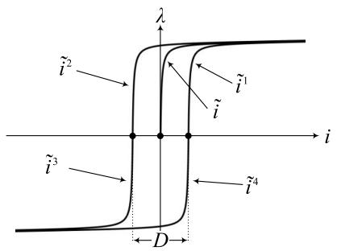  
FIGURE 3. Saturation curve and major hysteresis loop based on (4) and (5).

the first line of (4) is extended to include the hysteresis loop width D [10]

$$
\tilde {t} ^ {q} (\lambda) = \pm \left(\frac {\sqrt {(- \lambda - \lambda^ {\prime}) ^ {2} + 4 d L ^ {\mathrm {a i r}}} - \lambda - \lambda^ {\prime}}{2 L ^ {\mathrm {a i r}}} - \frac {d}{\lambda^ {\prime}}\right) \pm \frac {D}{2}, \quad q = 1, 2, 3, 4 \tag {5}
$$

where $\tilde { i } ^ { 1 }$ to $\tilde { i } ^ { 4 }$ are the hysteresis magnetizing currents for the first to fourth quadrants obtained from all four combinations of ± signs. Fig. 3 plots the saturation curve and major hysteresis loop defined in (4) and (5). Note that if the loop width is zero, (5) reduces to the asymptotic equations modeling only saturation with no hysteresis effect. Such representation of hysteresis/saturation is sometimes referred to as the ‘‘basic hysteresis’’ model [13]. Based on (5), the hysteresis inductance in all quadrants for winding limb $\tilde { L } _ { w } ^ { q } .$ , yoke $\tilde { L } _ { \mathrm { y } } ^ { q }$ , and outer limb $\tilde { L } _ { o } ^ { q }$ can be expressed as

$$
\tilde {L} _ {\alpha} ^ {q} (\lambda) = \frac {V _ {c}}{j \omega}
$$

$$
\begin{array}{l} \cdot \left[ \pm (\frac {\sqrt {(- \lambda - \lambda_ {\alpha} ^ {\prime}) ^ {2} + 4 d _ {\alpha} L _ {\alpha} ^ {\mathrm {a i r}}} - \lambda - \lambda_ {\alpha} ^ {\prime}}{2 L _ {\alpha} ^ {\mathrm {a i r}}} \right. \\ \left. - \frac {d _ {\alpha}}{\lambda_ {\alpha} ^ {\prime}}\right) \pm \left. \frac {D _ {\alpha}}{2} \right] ^ {- 1}, \\ \end{array}
$$

$$
q = 1, 2, 3, 4, \quad \alpha = w, y, o \tag {6}
$$

where the following definitions are used

$$
\begin{array}{l} d _ {\alpha} = \frac {- b _ {\alpha} - \sqrt {b _ {\alpha} ^ {2} - 4 a _ {\alpha} c _ {\alpha}}}{2 a _ {\alpha}}, \quad a _ {\alpha} = \frac {L _ {\alpha} ^ {\mathrm {a i r}}}{\lambda_ {\alpha} ^ {\prime 2}} \\ b _ {\alpha} = \frac {L _ {\alpha} ^ {\mathrm {a i r}} \cdot \frac {V _ {c}}{j \omega L _ {\alpha}} - \lambda_ {c}}{\lambda_ {\alpha} ^ {\prime}} \\ c _ {\alpha} = \frac {V _ {c}}{j \omega L _ {\alpha}} \left(L _ {\alpha} ^ {\text {a i r}} \cdot \frac {V _ {c}}{j \omega L _ {\alpha}} - \lambda_ {c} + \lambda_ {\alpha} ^ {\prime}\right), \quad \alpha = w, y, o. \tag {7} \\ \end{array}
$$

When obtaining the values of hysteresis inductances using (6) and (7), it is realized that $L _ { \alpha } ^ { \mathrm { a i r } } , L _ { \alpha }$ , and $D _ { \alpha }$ , are available from Table 1. In other words, the air-core inductance $( L _ { \alpha } ^ { \mathrm { a i r } } )$ , equivalent linear inductance $( L _ { \alpha }$ at $V = 1$ pu), and the loop width $( D _ { \alpha } )$ for individual core sections $( \alpha ~ = ~ w , y , o )$ are computed using the method of [15]. Subsequently, they are used in (6) and (7) for obtaining the hysteresis inductances associated with different parts of 3-limb and 5-limb cores. Moreover, except for $\lambda _ { \alpha } ^ { \prime }$ , other parameters $( \omega , V _ { c } , \lambda _ { c } )$ are

similar to that of (4) and (5) which can be computed from information available in the FAT report and/or nameplate. In order to derive $\lambda _ { \alpha } ^ { \prime }$ , we start from the classical definition of flux linkage based on the core and winding details [6]

$$
\lambda_ {\alpha} ^ {\prime} = N \cdot B \cdot s _ {\alpha}, \quad \alpha = w, y, o \tag {8}
$$

where N is the number of turns of the energized winding and B is the magnetic flux density. In (8), $s _ { \alpha }$ refers to the core cross-sectional areas for winding limb $s _ { w } ,$ , yoke $s _ { y } ,$ and outer limb $s _ { o }$ as depicted in Fig. 1. Despite simplicity of (8), in many studies, neither N , B, nor $s _ { \alpha }$ are available to system designers and thus (8) has limited application. Alternatively, similar to the definition of $\lambda ^ { \prime }$ in the second line of (4), we can write $\lambda _ { w } ^ { \prime }$ as

$$
\lambda_ {w} ^ {\prime} = k _ {w} \cdot \frac {V _ {c}}{\omega} \tag {9}
$$

where $k _ { w }$ is the knee voltage corresponding to the winding limb. As explained later in Section II-E4, $k _ { w }$ can be obtained or approximated from information provided by the manufacturer. Other parameters $( V _ { c } , \omega )$ are also known and thus $\lambda _ { w } ^ { \prime }$ can be computed using (9). Subsequently, using (1) and (8), it is easy to establish the following relations

$$
\lambda_ {y} ^ {\prime} = r _ {s} \cdot \lambda_ {w} ^ {\prime}, \quad \lambda_ {o} ^ {\prime} = \frac {r _ {s}}{r _ {s} ^ {\prime}} \cdot \lambda_ {w} ^ {\prime}. \tag {10}
$$

This makes all parameters in (6) and (7) available. Thus, the sought-after hysteresis inductances $\tilde { L } _ { \alpha } ^ { q }$ can be evaluated.

It is important to realize that computing the hysteresis inductances as formulated in (6), requires input parameters that are provided by the manufacturer or otherwise can be determined using feasible techniques as exemplified in Section II-E. Therefore, the practically-challenging task of measuring magnetizing parameters with open-terminal tests [7], [8] is circumvented while rarely-available knowledge of the core dimensions or material properties [6], [9] is not required.

Another important characteristic of the hysteresis inductances in (6) should be noted. They provide smooth non-linear functions as opposed to other forms of non-linear functions such as piecewise linear. In other words, the non-linear functions applied for formulating the magnetizing branches in Fig. 2 are smooth as the core saturates and transitions from linear, to saturation, and deep-saturation regions. This is consistent with the physical nature of the saturation and hysteresis phenomena. Evidently, by increasing the number of segments in piecewise linear methods, one can obtain functions that can accurately represent the non-linear nature of the physical phenomena. Therefore, hysteresis-aware techniques based on both types of functions can be shown to produce accurate results. However, this increases the computational complexity of piecewise-linear-based methods and can have negative impact on the simulation speed [23] and numerical stability [24]. Therefore, smooth non-linear functions (such as the ones presented) are preferable in EMT simulations.

# D. IMPLEMENTATION

One of the main advantages of duality models is the fact that they can be effortlessly implemented using standard dragand-drop circuit elements available in EMT-type programs. This is recognized by other authors [2], [6], [8], [14]. Additionally, it is important to realize that electric circuits formed from standard circuit elements available in EMT-type programs are likely to be robust against numerical inaccuracies and instabilities. This is because standard circuit elements are designed for efficient and reliable EMT simulations. Therefore, electric circuits based on such elements are preferred not merely for their ease of implementation but also due to their reliable numerical accuracy and stability under different operating conditions. In this work, the equivalent circuits of Fig. 2 are implemented in the commercial software PSCAD [13]. It provides circuit elements for all electrical components needed to form the equivalent circuits. When implementing duality models, an appropriate core voltage $V _ { c }$ should be chosen. To avoid numerical instability, realistic turns ratios for ideal transformers are required and thus we use $V _ { c } = \mathbf { M i n } ( V _ { i } )$ as suggested in [7]. The above implementation guidelines are followed in this work and the models are available in [25]. In Section III, it is shown through numerical results that building the equivalent circuits as suggested above, ensures accurate and numerically robust models. However, the recommended guidelines should not be considered as restrictions. As such, it is expected that other EMT-type programs are applicable and other reference voltages could be applied or explored.

# E. PARAMETER DETERMINATION

The required input parameters used in formulating the presented equivalent circuits can be categorized into two groups. First, parameters that are readily available from standard FAT report and/or nameplate (e.g. winding voltages, leakage inductances, operating frequency, etc). Second, values which are not part of the standard FAT report or nameplate, but have traditionally been used in EMT studies. Therefore, they may be provided by the manufacturer (initially or upon request) or can be accurately estimated using already existing techniques. Using the first group is straightforward and requires no further discussion. The second group of parameters along with several useful estimation techniques are discussed next.

# 1) CORE ASPECT-RATIOS (rs, rl , r0s, r0l )

The manufacturer may provide core dimensions in which case the ratios can be computed using (1). The ratios can also be approximated quite accurately from dimensionless schematics of the core. This is because only the ratio is needed rather than the actual dimensions. Furthermore, it may be possible to accurately approximate these ratios by merely looking at a dimensionless image of the tank using gray-box approximations such as [26]. A very simple but effective method for approximating 3-limb core aspect-ratios is worth noting; by knowing that 3-limb cores are designed to carry

the same flux from winding limbs to yokes, $s _ { w }$ is usually the same as $s _ { y }$ and thus $r _ { s } = 1$ . The other ratio can simply be approximated from a dimensionless 2-D image of the core or tank as rl = length/height.

# 2) AIR-CORE INDUCTANCE (Lair)

The air-core inductance (like many other electrical parameters), may be accurately computed using rigorous computational electromagnetic techniques such as the finite element method [27] or the method-of-moments [28]. Analytical formulations are also available [29]. However, this requires detail information about the transformer inner design. Although manufacturers rarely provide such detail due to intellectual property concerns, they may provide $L ^ { \mathrm { a i r } }$ if requested. Alternatively, measurement techniques such as [30] are available for accurate and safe measuring of the air-core inductance.

In some studies, rather than the actual air-core inductance of the transformer, a pre-determined inrush current is assumed for a certain condition and its corresponding $L ^ { \mathrm { a i r } }$ is computed for further analysis. This is a common practice when performing sensitivity analysis specially if the transformer has not been built or purchased. Such ‘‘reference inrush current’’ may be due to field data from similar transformers, worst-case scenario calculations such as [31], [32], or even empirical values.2 In such cases, it is possible to run multiple EMT simulations and experimentally adjust $L ^ { \mathrm { a i r } }$ until matching inrush current is simulated. Since the inrush current is primarily impacted by the air-core inductance, other parameters can be left unchanged when running multiple EMT simulations. It is expected that the model behavior in the linear region and around the knee area would not be impacted by different $L ^ { \mathrm { a i r } }$ values. Hence such experimental finding of the air-core inductance is a relatively easy process. Note however that inrush current is highly sensitive to the resistance of the source and the connection cable, the remanence, and the circuit breaker. Hence, care must be taken when setting up such simulation experiments. It is important to note that realistic air-core inductance values are typically in the range of 0.1 pu to 0.3 pu. Too much deviations from this range is a clear indication that $L ^ { \mathrm { a i r } }$ has not been properly computed.

# 3) LOOP WIDTH (D) AND CORE EDDY CURRENT LOSS (Ic)

Standard FAT reports include ‘‘no load loss’’ which is sometimes referred to as ‘‘total core loss’’. The dominating factors contributing to such loss near the fundamental frequency are the core eddy current loss $I _ { c }$ and hysteresis loss $I _ { h } .$ In the presented models, the core eddy current loss is considered using linear resistors parallel with hysteresis inductors. The hysteresis loss is dictated by the loop width $D .$ Therefore, by knowing how much of the total core loss corresponds to the core eddy current loss, the ratio $I _ { c } / ( I _ { c } + I _ { h } )$ is determined and can be used to set the value of the core eddy current loss in the

2In our experience, empirical peak inrush current values are typically in the range of 6 to 12 times the rated current.

model. Subsequently, D can be found by performing multiple EMT experiments until the reported no load loss is produced by the model. Similarly, if the loop width is provided by the manufacturer, one can set the value of D and find the corresponding $I _ { c }$ via EMT experiments. In the case that the ratio $I _ { c } / ( I _ { c } + I _ { h } )$ is not known, a 50% − 50% split between $I _ { c }$ and $I _ { h }$ may be assumed since other non-linear effects such as anomalous losses are neglected.

# 4) WINDING LIMB KNEE VOLTAGE $( k _ { w } )$

Unlike other parameters discussed in this paper, the knee voltage does not have a direct physical meaning. Rather, it is mathematically defined to form asymptotic equations. Nevertheless, the concept of knee voltage has traditionally been used for representing saturation/hysteresis of transformers’ core [13]. Therefore, manufacturers may provide this parameter. For single-phase and three-phase bank transformers, only one knee voltage k is defined (4). For multilimb transformers, the provided knee voltage typically corresponds to winding limb $k _ { w } ,$ which can be used in (9). If $k _ { y }$ or $k _ { o }$ are available, they can be used to obtain $k _ { w }$ using core aspect-ratios similar to (10). In the case that the knee voltage is not provided by the manufacturer, system engineers may rely on optimization techniques to approximate it from saturation characteristic curve (V –I data) [34]. Values in the range of 1 pu to 1.25 pu may be considered realistic but too much deviations from this range is a sign of numerical inaccuracy or inappropriate approximation mechanism.

# III. NUMERICAL RESULTS

The transformers under consideration are designed and manufactured by a Winnipeg transformer plant, PTI Transformers $L P$ and further commissioned in the relevant industry. Due to the industrial scales of the devices (i.e. 50, 390 MVA) and the nature of the study specially saturation experiments, tests have been performed at the company’s testing facility [35] with additional safety measures.

# A. TRANSFORMERS’ DETAIL

Details of the 3-limb transformer are given in Table 2. The air-core reactance $X ^ { \mathrm { a i r } }$ is associated with the 138 kV terminal. As the model is non-reversible, winding 1 is assigned to this terminal. The other two windings are arbitrarily assigned to 13.8 kV and 6.972 kV terminals. Note that the tertiary winding is buried and thus $X _ { 1 , 3 } , X _ { 2 , 3 }$ as well as $R _ { 1 , 3 } , R _ { 2 , 3 }$ are estimated values. The loop width is available as a percentage of the magnetizing current $I _ { m } = \sqrt { I _ { \Phi } ^ { 2 } - I _ { c } ^ { 2 } }$ . Tests have been carried out for the base power rating of 50 MVA.

A 2-winding 5-limb transformer is considered with details given in Table 3. The provided $X ^ { \mathrm { a i r } }$ is for the 238 kV side. Thus, winding 1 is used for this terminal. Tests are performed for the base power rating of 390 MVA.

All parameters in Tables 2 and 3 are supplied by the manufacturer except for the knee voltage and loop width which are determined using the techniques explained in

TABLE 2. Details of the studied 3-limb transformer.   

<table><tr><td>Core material</td><td>Electrical steel [36]</td><td>R2,3</td><td>0.4785 % (est.)</td></tr><tr><td>Power rating</td><td>50/66.67/83.3 MVA</td><td>Xair</td><td>0.255408 pu</td></tr><tr><td>Operating freq.</td><td>60 Hz</td><td>k</td><td>1.12633 pu</td></tr><tr><td>Total core loss</td><td>37.1 kW</td><td>D</td><td>14.29 % of Im</td></tr><tr><td>Vector group</td><td>Ynynd1</td><td>IΦ</td><td>0.140641 %</td></tr><tr><td>V1</td><td>138 kV</td><td>sy</td><td>310045 mm2</td></tr><tr><td>V2</td><td>13.8 kV</td><td>sw</td><td>310045 mm2</td></tr><tr><td>V3</td><td>6.972 kV</td><td>rs</td><td>1</td></tr><tr><td>X1,2</td><td>0.076 pu</td><td>ly</td><td>2370 mm</td></tr><tr><td>X1,3</td><td>0.114 pu (est.)</td><td>lw</td><td>2276 mm</td></tr><tr><td>X2,3</td><td>0.136 pu (est.)</td><td>rl</td><td>1.041301</td></tr><tr><td>R1,2</td><td>0.2674 %</td><td>B</td><td>1.723 Tesla</td></tr><tr><td>R1,3</td><td>0.4011 % (est.)</td><td>N1</td><td>574</td></tr></table>

TABLE 3. Details of the studied 5-limb transformer.   

<table><tr><td>Core material</td><td>Electrical steel [36]</td><td>sy</td><td>464469 mm2</td></tr><tr><td>Power rating</td><td>390/650 MVA</td><td>sw</td><td>832250 mm2</td></tr><tr><td>Operating freq.</td><td>60 Hz</td><td>so</td><td>416125 mm2</td></tr><tr><td>Total core loss</td><td>171.3 kW</td><td>rs</td><td>0.558088</td></tr><tr><td>Vector group</td><td>Yd1</td><td>r&#x27;s</td><td>1.116176</td></tr><tr><td>V1</td><td>238 kV</td><td>ly</td><td>3601.974 mm</td></tr><tr><td>V2</td><td>22.13 kV</td><td>lw</td><td>3382.01 mm</td></tr><tr><td>X1,2</td><td>0.068 pu</td><td>lo</td><td>6221.984 mm</td></tr><tr><td>R1,2</td><td>0.1297 %</td><td>rl</td><td>1.065039</td></tr><tr><td>Xair</td><td>0.210684 pu</td><td>r&#x27;l</td><td>0.57891</td></tr><tr><td>k</td><td>1.08497 pu</td><td>B</td><td>1.741 Tesla</td></tr><tr><td>D</td><td>0.89% of Im</td><td>N1</td><td>338</td></tr><tr><td>IΦ</td><td>0.125743 %</td><td></td><td></td></tr></table>

Section II-E. While most of the information in the tables are needed to build duality-based models of Fig. 2, extra information is added for interested readers. This includes core dimensions $( s _ { w } , l _ { w } , s _ { y } , l _ { y } )$ , nominal magnetic flux density B, number of turns $N _ { 1 }$ , and core material (23ZDKH85 [36]) where details such as B–H data can be extracted.

# B. MODEL VALIDATION

# 1) LEAKAGE INDUCTANCES

The three short-circuit tests for the 3-limb model are simulated and results are compared with the leakage reactances in Table 2. The simulated values are $X _ { 1 , 2 } ~ = ~ 0 . 0 7 6 0 5 5$ pu, $X _ { 1 , 3 } = 0 . 1 1 4 0 3 9 \mathrm { \ p u }$ , and $X _ { 2 , 3 } = 0$ .136033 pu. In all cases, errors less than 0.1% is observed. For the the 5-limb case, the simulated leakage reactance is $X _ { 1 , 2 } = 0 . 0 6 8 4 3$ pu which is accurate according to Table 3.

# 2) EXCITATION CURRENT WITH DIFFERENT SATURATIONLEVELS

Excitation currents are obtained by performing open-circuit test for both 3- and 5-limb transformers where winding 2 is energized and the other terminal(s) are left open. Typically such tests are done at the nominal voltage. However, for the purpose of this study the test was expanded to drive the cores into different saturation levels.

Figs. 4-6 compare excitation current waveforms from simulation and measurement tests for the 3-limb case. The agreement between measurement tests and simulations may be considered satisfactory. This is despite the fact that some deviations between measurement and simulation results exist

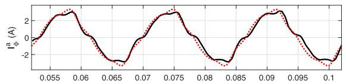

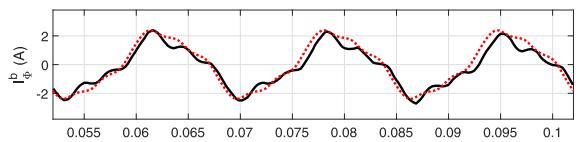

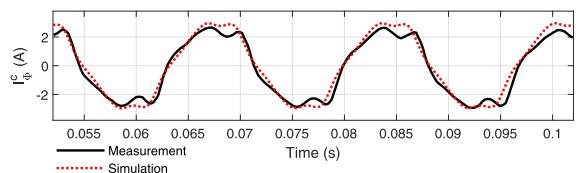  
FIGURE 4. Simulated vs. measured excitation current for the 3-limb transformer energized from winding 2 with $v _ { 2 } = 1 2 . 4 5 2 \mathrm { k W } \simeq \ 0 . 9 \ \mathrm { p }$ u.

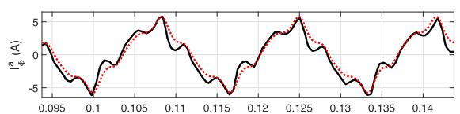

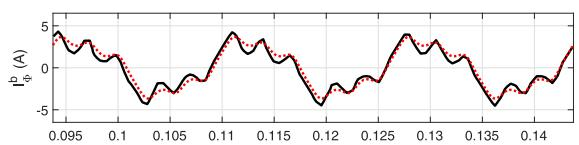

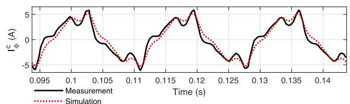  
FIGURE 5. Simulated vs. measured excitation current for the 3-limb transformer energized from winding 2 with $v _ { 2 } = 1 3 . 8 0 8 \mathrm { ~ k V } \simeq \mathrm { ~ 1 ~ p ~ }$ u.

mainly due to measurement under stress. For example in Fig. 6, measurement results for later cycles in phase A are plagued with DC shift and the observed mismatch should not be considered as error in the simulations. Also in Fig. 6, larger discrepancy between simulation and measurement results at the peak values may be explained by the low resolution of the measurement recordings not capturing sharp spikes due to high saturation levels.

For the 5-limb case, the exciting current waveforms are not available. Therefore, we compare the average current magnitude values $I _ { \Phi } = ( | I _ { \Phi } ^ { a } | + | I _ { \Phi } ^ { b } | + | I _ { \Phi } ^ { c } | ) / 3$ as a percentage of the rated current. This comparison may be sufficient in many studies as typically information about the core saturation is only available in terms of a V –I curve. Fig. 7 plots the results. It can be seen that the simulated saturation curve closely follows the behavior of the measured excitation currents.

As demonstrated above for both 3- and 5-limb cases, the non-reversible nature of the models does not prevent them from producing accurate open-circuit test results when energized from a winding other than winding 1. This is consistent

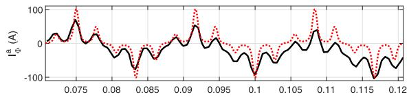

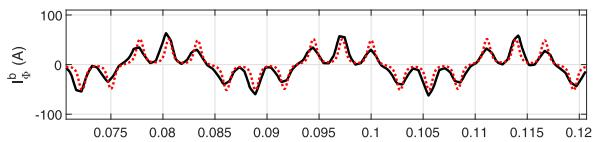

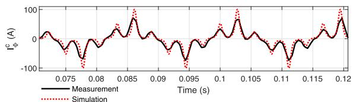  
FIGURE 6. Simulated vs. measured excitation current for the 3-limb transformer energized from winding 2 with $v _ { 2 } = 1 5 . 6 1 2 \mathrm { ~ k V } \simeq \mathrm { ~ 1 . 1 3 ~ }$ pu.

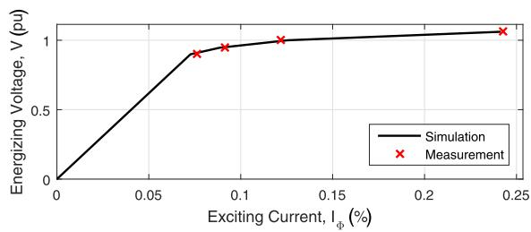  
FIGURE 7. Comparing average excitation currents for the 5-limb transformer.

with the discussion made in Section II-A2. Therefore, excitation current measurements can be used to validate the models regardless of the energized winding.

# C. INRUSH CURRENT CALCULATION

Inrush current is simulated by energizing the transformer from the HV side (winding 1) with 1 pu voltage. Other windings are left unloaded. As discussed earlier in Section II-A2, the models are non-reversible and thus inrush current experiments with energizations from other windings require $X ^ { \mathrm { a i r } }$ to be adjusted. To avoid current limitation by the system impedance, ideal source is applied. The breaker is closed at the zero-crossing of phase A which leads to the maximum current in this phase.

# 1) NO REMANENCE

The inrush current is assumed with no remanent flux in the core. In theory, it is possible to physically perform such test by demagnetizing the transformer before energization. However, such tests are usually not performed unless laboratory size transformers are considered [6], [9]. Reasons include safety concerns, required voltage level, equipment damage, etc. Therefore we resort to validation by numerical convergence. Fig. 8 compares EMT simulation results with time-steps 50, 10, and 1 µs for the 3- and 5-limb cases. It is clear from the figure that both 3- and 5-limb models have numerically converged to their unique solutions. This also demonstrates the numerical robustness of the models against

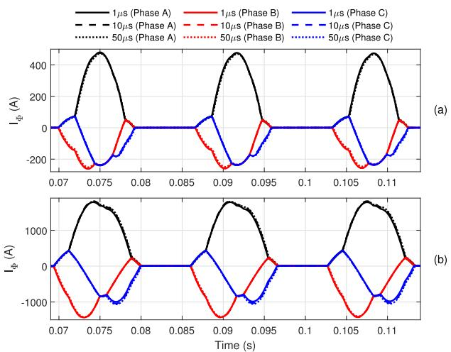  
FIGURE 8. Comparing the simulated inrush current using the (a) 3-limb and (b) 5-limb models with different EMT time-steps.

TABLE 4. Worst-case peak inrush current values computed with different methods.   

<table><tr><td></td><td>3-limb</td><td>5-limb</td></tr><tr><td>Presented duality-based model</td><td>7.49 pu</td><td>9.17 pu</td></tr><tr><td>UMEC model [12], [13]</td><td>7.32 pu</td><td>8.98 pu</td></tr><tr><td>Analytical formula [31] (manufacturer)</td><td>6.73 pu</td><td>9.08 pu</td></tr></table>

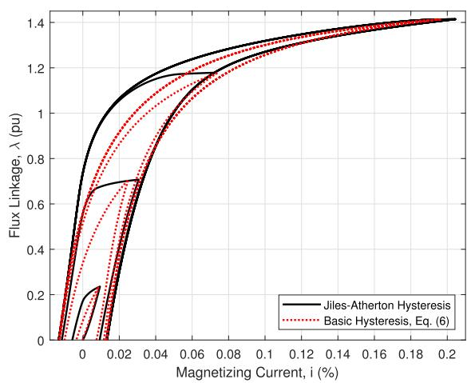  
FIGURE 9. The hysteresis loop for the middle winding-limb of the 3-limb transformer. Due to symmetry and for better clarity, only positive λ is depicted.

increased time-steps when inrush current is simulated. This prevents the models from becoming a time-step bottleneck which can significantly impact runtime in EMT simulation of large systems.

# 2) WORST-CASE REMANENCE

Different potential residual flux values are investigated according to [33]. The worst-case scenario is found to be (0.8,0,-0.8) pu for both 3- and 5-limb cases. Results are summarized in Table 4 in terms of the peak values. For comparison, the table also includes simulation results from the unified magnetic equivalent circuit (UMEC) model [12], [13] as well as the values provided by the manufacturer based on analytical calculations [31]. However, it should be noted that there

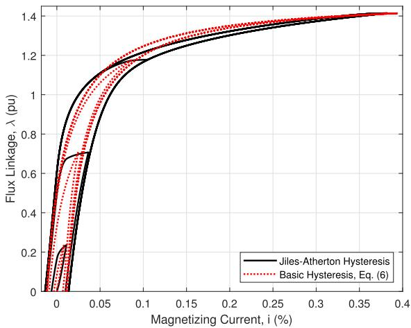  
FIGURE 10. The hysteresis loop for the middle winding-limb of the 5-limb transformer. Due to symmetry and for better clarity, only positive λ is depicted.

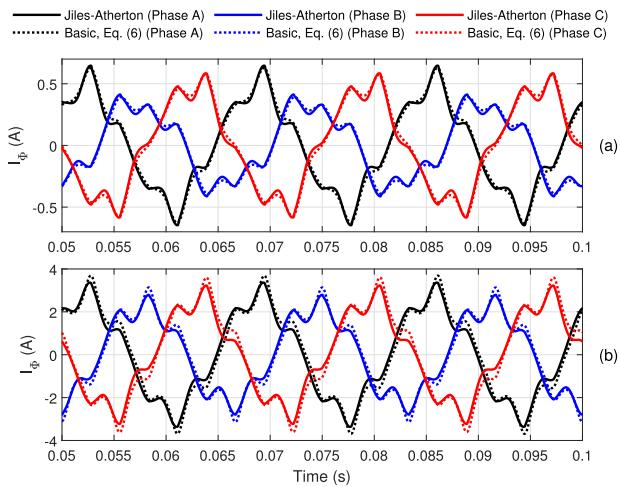  
FIGURE 11. Excitation current simulated using different methods for (a) 3-limb and (b) 5-limb cases. In both cases, winding 1 is energized with $\pmb { v _ { 1 } } = \pmb { 1 }$ pu.

are differences in the modeling and calculation techniques presented in Table 4. For example, the analytical formulas [31] are developed based on single-phase transformers and empirical scaling factors are used to approximate worst-case inrush current. The UMEC model neglects the hysteresis effect and the presence of the buried tertiary winding in the 3-limb case. Moreover, the UMEC model requires manual incorporation of residual flux by injecting DC currents at the line level [37] whereas the presented duality-based models enforce the remanent flux in different sections of the iron core using (6). Nevertheless, there is a general agreement among the results and the findings may be considered satisfactory.

# D. HYSTERESIS LOOP CALCULATION

The λ–i hysteresis loop for different core sections can be computed using (6). As an example, Figs. 9 and 10 plot the open-circuit λ–i results for the middle winding-limb of 3-limb and 5-limb transformers, respectively. Here, winding 1 is energized with $V _ { 1 } = 1$ pu in both 3- and 5-limb cases. For comparison, results from the Jiles–Atherton method are

also included where the magnetizing branches in the equivalent circuits of Fig. 2 are formulated using the magnetic characteristic of the material [21]. While some deviations exist between the simulated hysteresis loops especially in the non-major loops and around the shoulder area, the overall behavior match to a reasonable degree for both 3-limb and 5-limb cases. This is consistent with the results shown in Fig. 11, where it is observed that the methods have produced matching excitation currents. Therefore, the disagreements in Figs. 9 and 10 may be considered tolerable.

# IV. CONCLUSION

In this paper, application of duality-based equivalent circuits for EMT simulation of positive-sequence leakage inductance, excitation current, inrush current, and hysteresis loop pertinent to multilimb multiwinding transformers is presented. Saturation, hysteresis, deep-saturation, and remanent flux are modeled while the required input parameters are either provided by the manufacturer or can be reliably estimated. Several experiments confirm the accuracy of the models. This makes them attractive alternatives for existing low-frequency models particularly when only limited information about the transformer is available or arbitrary number of windings are required. It is important to note that the lack of considering zero-sequence tests in the 3-limb case may impose limitations in its application in unbalance operation, a subject that is left for future work.

# REFERENCES

[1] B. Gustavsen and Y. Vernay, ‘‘Measurement-based frequency-dependent model of a HVDC transformer for electromagnetic transient studies,’’ Electr. Power Syst. Res., vol. 180, Mar. 2020, Art. no. 106141.   
[2] S. Jazebi, S. E. Zirka, M. Lambert, A. Rezaei-Zare, N. Chiesa, Y. Moroz, X. Chen, M. Martinez-Duro, C. M. Arturi, E. P. Dick, A. Narang, R. A. Walling, J. Mahseredjian, J. A. Martinez, and F. de Leon, ‘‘Duality derived transformer models for low-frequency electromagnetic transients—Part I: Topological models,’’ IEEE Trans. Power Del., vol. 31, no. 5, pp. 2410–2419, Oct. 2016.   
[3] S. Jazebi, A. Rezaei-Zare, M. Lambert, S. E. Zirka, N. Chiesa, Y. I. Moroz, X. Chen, M. Martinez-Duro, C. M. Arturi, E. P. Dick, A. Narang, R. A. Walling, J. Mahseredjian, J. A. Martinez, and F. de Leon, ‘‘Duality-derived transformer models for low-frequency electromagnetic transients—Part II: Complementary modeling guidelines,’’ IEEE Trans. Power Del., vol. 31, no. 5, pp. 2420–2430, Oct. 2016.   
[4] J. Zhao, S. E. Zirka, Y. I. Moroz, C. M. Arturi, R. A. Walling, N. Tleis, and O. L. Tarchutkin, ‘‘Topological transient models of three-phase, threelegged transformer,’’ IEEE Access, vol. 7, pp. 102519–102529, 2019.   
[5] A. Rezaei-Zare, ‘‘Enhanced transformer model for low- and mid-frequency transients—Part I: Model development,’’ IEEE Trans. Power Del., vol. 30, no. 1, pp. 307–315, Feb. 2015.   
[6] Q. Wu, S. Jazebi, and F. de Leon, ‘‘Parameter estimation of three-phase transformer models for low-frequency transient studies from terminal measurements,’’ IEEE Trans. Magn., vol. 53, no. 7, pp. 1–8, Jul. 2017.   
[7] J. A. Martinez, R. Walling, B. A. Mork, J. Martin-Arnedo, and D. Durbak, ‘‘Parameter determination for modeling system transients—Part III: Transformers,’’ IEEE Trans. Power Del., vol. 20, no. 3, pp. 2051–2062, Jul. 2005.   
[8] F. de Leon and J. A. Martinez, ‘‘Dual three-winding transformer equivalent circuit matching leakage measurements,’’ IEEE Trans. Power Del., vol. 24, no. 1, pp. 160–168, Jan. 2009.   
[9] N. Chiesa, B. A. Mork, and H. K. Høidalen, ‘‘Transformer model for inrush current calculations: Simulations, measurements and sensitivity analysis,’’ IEEE Trans. Power Del., vol. 25, no. 4, pp. 2599–2608, Oct. 2010.

[10] S. N. Talukdar and J. R. Bailey, ‘‘Hysteresis models for system studies,’’ IEEE Trans. Power App. Syst., vol. PAS-95, no. 4, pp. 1429–1434, Jul. 1976.   
[11] H. W. Dommel, S. Bhattacharya, V. Brandwajn, H. K. Lauw, and L. Martí, Electromagnetic Transients Program Reference Manual (EMTP Theory Book). Portland, OR, USA: Bonneville Power, 1992.   
[12] W. G. Enright, ‘‘Transformer models for electromagnetic transient studies with particular reference to HVdc transmission,’’ Ph.D. dissertation, Dept. Elect. Electron. Eng., Univ. Canterbury, Christchurch, New Zealand, 1996. [Online]. Available: https://ir.canterbury.ac.nz/handle/10092/3279   
[13] Manitoba Hydro International Ltd. (Dec. 4, 2017). PSCAD/EMTDC Manual. [Online]. Available: https://hvdc.ca/pscad/   
[14] C. Alvarez-Marino, F. de Leon, and X. M. Lopez-Fernandez, ‘‘Equivalent circuit for the leakage inductance of multiwinding transformers: Unification of terminal and duality models,’’ IEEE Trans. Power Del., vol. 27, no. 1, pp. 353–361, Jan. 2012.   
[15] M. Shafieipour, J. C. G. Alonso, R. P. Jayasinghe, and A. M. Gole, ‘‘Principle of duality with normalized core concept for modeling multilimb transformers,’’ in Proc. Int. Conf. Power Syst. Transients, Perpignan, France, Jun. 2019, pp. 1–6.   
[16] M. R. Iravani, A. K. S. Chaudhary, W. J. Giesbrecht, I. E. Hassan, A. J. F. Keri, K. C. Lee, J. A. Martinez, A. S. Morched, B. A. Mork, M. Parniani, A. Sharshar, D. Shirmohammadi, R. A. Walling, and D. A. Woodford, ‘‘Modeling and analysis guidelines for slow transients. III. The study of ferroresonance,’’ IEEE Trans. Power Del., vol. 15, no. 1, pp. 255–265, Jan. 2000.   
[17] S. Jazebi, F. de Leon, A. Farazmand, and D. Deswal, ‘‘Dual reversible transformer model for the calculation of low-frequency transients,’’ IEEE Trans. Power Del., vol. 28, no. 4, pp. 2509–2517, Oct. 2013.   
[18] S. Jazebi and F. de León, ‘‘Experimentally validated reversible singlephase multiwinding transformer model for the accurate calculation of lowfrequency transients,’’ IEEE Trans. Power Del., vol. 30, no. 1, pp. 193–201, Feb. 2015.   
[19] IEEE Standard Test Code for Liquid-Immersed Distribution, Power, and Regulating Transformers, IEEE Standard C57.12.90-2015 (Revision of IEEE Std C57.12.90-2010), Mar. 2016, pp. 1–120.   
[20] Y. Gao, Y. Matsuo, and K. Muramatsu, ‘‘Investigation on simple numeric modeling of anomalous eddy current loss in steel plate using modified conductivity,’’ IEEE Trans. Magn., vol. 48, no. 2, pp. 635–638, Feb. 2012.   
[21] U. D. Annakkage, P. G. McLaren, E. Dirks, R. P. Jayasinghe, and A. D. Parker, ‘‘A current transformer model based on the Jiles–Atherton theory of ferromagnetic hysteresis,’’ IEEE Trans. Power Del., vol. 15, no. 1, pp. 57–61, Jan. 2000.   
[22] M. Salimi, A. M. Gole, and R. P. Jayasinghe, ‘‘Improvement of transformer saturation modeling for electromagnetic transient programs,’’ in Proc. Int. Conf. Power Syst. Transients, Vancouver, BC, Canada, Jul. 2013, pp. 1–6.   
[23] F. M. Uriarte, V. A. Centeno, J. De Laree Lopez, and J. Depablos, ‘‘Continuous vs. piecewise hysterisis model of a current transformer,’’ Ph.D. Res. Microelectron. Electron., Otranto, Italy, 2006, pp. 29–32.   
[24] J. R. Lucas, ‘‘Representation of magnetisation curves over a wide region using a non-integer power series,’’ Int. J. Electr. Eng. Educ., vol. 25, no. 4, pp. 335–340, Oct. 1988.   
[25] (May 21, 2020). Custom-Made Duality-Based Transformer Models for PSCAD. [Online]. Available: https://www.pscad.com/knowledgebase/article/597   
[26] S. D. Mitchell and J. S. Welsh, ‘‘Initial parameter estimates and constraints to support gray box modeling of power transformers,’’ IEEE Trans. Power Del., vol. 28, no. 4, pp. 2411–2418, Oct. 2013.   
[27] V. M. Jimenez-Mondragon, R. Escarela-Perez, E. Melgoza, M. A. Arjona, and J. Olivares-Galvan, ‘‘Quasi-3-D finite-element modeling of a power transformer,’’ IEEE Trans. Magn., vol. 53, no. 6, Jun. 2017, Art. no. 7401604.   
[28] M. Shafieipour, Z. Chen, A. Menshov, J. De Silva, and V. Okhmatovski, ‘‘Efficiently computing the electrical parameters of cables with arbitrary cross-sections using the method-of-moments,’’ Electr. Power Syst. Res., vol. 162, pp. 37–49, Sep. 2018.   
[29] R. M. Del Vecchio, B. Poulin, P. T. Feghali, D. M. Shah, and R. Ahuja, Transformer Design Principles, 3rd ed. Boca Raton, FL, USA: CRC Press, Aug. 2017.   
[30] F. de León, S. Jazebi, and A. Farazmand, ‘‘Accurate measurement of the air-core inductance of iron-core transformers with a non-ideal low-power rectifier,’’ IEEE Trans. Power Del., vol. 29, no. 1, pp. 294–296, Feb. 2014.   
[31] T. R. Specht, ‘‘Transformer magnetizing inrush currents,’’ Elect. Eng., vol. 70, no. 4, pp. 324–324, Apr. 1951, doi: 10.1109/EE.1951.6437380.

[32] J. E. Holcomb, ‘‘Distribution transformer magnetizing inrush current,’’ Trans. Amer. Inst. Electr. Eng. III, Power App. Syst., vol. 80, no. 3, pp. 697–702, Apr. 1961.   
[33] Transformer Energization in Power Systems: A Study Guide, CIGRE Working Group, Paris, France, Feb. 2014, pp. 65–66.   
[34] (Feb. 7, 2020). Transformer Saturation Curve Matching in PSCAD/EMTDC. [Online]. Available: https://hvdc.ca/knowledge-base/ read,article/561/transformer-saturation-curve-matching-in-pscademtdc/v:   
[35] PTI Transformers LP, Winnipeg, MB, Canada. (Feb. 2020). Power Transformers. [Online]. Available: https://www.partnertechnologies.net/   
[36] Directional Electromagnetic Steel Strip/Grainoriented Electrical Steel Sheets, Nippon Steel Corp., Tokyo, Japan, Jan. 2020, p. 68. [Online]. Available: https://www.nipponsteel.com/product/catalog_ download/pdf/D004je.pdf   
[37] Applications of PSCAD/EMTDC, Manitoba HVDC Res. Centre, Winnipeg, MB, Canada, 2008, pp. 45–46. [Online]. Available: https:// www.pscad.com/uploads/knowledge_base/application_20guide_202008_ 1.pdf?t=1470241744

MOHAMMAD SHAFIEIPOUR (Member, IEEE) received the B.Eng. (Hons.) and M.Eng.Sc. degrees in electrical and computer engineering from Multimedia University, Cyberjaya, Malaysia, in 2008 and 2010, respectively, and the Ph.D. degree in electrical and computer engineering from the University of Manitoba, Winnipeg, MB, Canada, in 2016.

From 2016 to 2020, he was with the Manitoba Hydro International Ltd., Winnipeg, where

he contributed to the support and development of PSCAD, FACE, and PRSIM software products. He recently joined Safe Engineering Services & Technologies, Laval, QC, Canada, as a Senior Research Scientist of electromagnetics, electromagnetic interference, and electrical engineering.

Dr. Shafieipour is a Registered Professional Engineer in the Province of Manitoba, Canada.

WALDEMAR ZIOMEK (Senior Member, IEEE) received the M.Sc. degree in electrical engineering and the Ph.D. degree in electric power and high voltage engineering from the Poznan University of Technology, Poland, in 1987 and 1992, respectively. In 2013–2015, he worked for CG Power Systems, an International T&D Equipment Company, as a Global Senior Expert, specializing in large power transformers and high voltage insulation. Till 2013, he was employed by CG Power

Systems Canada Inc. (formerly Pauwels Canada Inc.) as a Manager of Engineering. He started with Pauwels Canada in 1997 as a Transformer Electrical Designer, then in 1999 as an Electrical Engineering Manager, and since 2003 as a Manager of Engineering. Since 2001, he has been an Adjunct Professor with the University of Manitoba, Winnipeg, MB, Canada, where previously he worked in 1995–1997 as a Postdoctoral Fellow. In 1995, he was with Stuttgart University, Germany, as a Visiting Researcher. In 1993– 1994, he was a Visiting Researcher with the University of Strathclyde, Glasgow, U.K. Previously, he worked with the Institute of Electrical Power Engineering, Poznan University of Technology, where in 1992–1997, he was an Assistant Professor and in 1987–1992, he was a Teaching Assistant and a Researcher. He has also been working as the Director of the Research and Development for PTI Transformers LP, Canadian Manufacturer of Large Power Transformers, since 2015. He is the author and coauthor of more than 70 scientific and technical articles. He is a member of CSA, IEC, and CIGRE.

ROHITHA P. JAYASINGHE (Member, IEEE) received the B.Sc. (Eng.) degree in electrical engineering from the University of Moratuwa, Sri Lanka, in 1987, and the Ph.D. degree in electrical engineering from the University of Manitoba, Winnipeg, MB, Canada, in 1997.

He is currently with the Manitoba Hydro International Ltd., Winnipeg, and plays a major role in the current developments of the PSCAD/EMTDC simulation program.

Dr. Jayasinghe is a Registered Professional Engineer in the Province of Manitoba, Canada.

JUAN CARLOS GARCIA ALONSO received the bachelor’s degree in electrical engineering from the National University of Colombia, in 1996, and the M.Sc. degree from the University of Manitoba, Winnipeg, MB, Canada, in 2006.

From 2002 to 2005, he worked as a Large Power Transformers Designer with Pauwels Transformers, Winnipeg. Since 2006, he has been with Manitoba Hydro International Ltd., Winnipeg. During this period, he has worked in the development of

transformer, HVDC, MMC, and Wind Farm models. He has also participated in numerous system studies in the same areas. He is currently based in Brisbane, Australia, working in a secondment for Powerlink Queensland. As part of this secondment, he has been working on the development of a PSCAD model for the state of Queensland which is being used to study control interactions as well as the assessment of new connections of Solar and Wind farms.

ANIRUDDHA M. GOLE (Life Fellow, IEEE) is currently a Distinguished Professor and the NSERC Industrial Chair of power systems simulation with the Department of Electrical and Computer Engineering, University of Manitoba. He has over 30 years’ experience in the development of modeling tools for power networks incorporating power-electronic equipment, such as HVDC and FACTS converters. He is one of the original developers of the widely used PSCAD/EMTDC simula-

tion program. He has also made important contributions to the development of the real-time digital simulator RTDS from RTDS Technologies of Winnipeg, Canada.

Dr. Gole is a member of the Long Range Planning Committee of the IEEE Power and Energy Society. He is a Fellow of the Canadian Academy of Engineering. For his contributions to the modeling of Flexible Ac Transmission System (FACTS) devices, he received the IEEE Nari Hingorani FACTS Award in 2007.