# An Efficient Phase Domain Synchronous Machine Model With Constant Equivalent Admittance Matrix

Yue Xia , Ying Chen, Member, IEEE, Yankan Song , Student Member, IEEE, Shaowei Huang, Member, IEEE, Zhendong Tan, and Kai Strunz

Abstract—In this paper, a new synchronous machine model is developed for electromagnetic transients program type simulations. The stator circuit is expressed in the abc phase domain. The machine model is represented as a Norton equivalent with a current source in parallel with a constant Norton admittance. The machine equations are reformulated so that the computational effort required for the modeling of the machine is reduced. Test studies demonstrate the accuracy of the proposed synchronous machine model and show that the proposed model is computationally more efficient than the existing constant conductance phase domain model and voltage-behind-reactance model.

Index Terms—Constant admittance matrix, direct interface, electromagnetic transients program (EMTP), phase domain (PD) model, power system simulation, synchronous machine.

# I. INTRODUCTION

T HE modeling of synchronous machines has been an activetopic of research for many years, a number of models have topic of research for many years,a number of models have been developed for the representation of synchronous machines in power system analysis. The synchronous machine models for the study of transients can be classified into two major categories based on the modeling approaches used: models in state-variable (SV)-based simulators [1]–[5] and models in nodal-analysisbased programs [6]–[13]. This paper focuses on the modeling of synchronous machines for electromagnetic transients program (EMTP)-type simulations based on the nodal-analysisbased simulation approach [14], [15]. To provide a good review of the properties of the relevant state-of-the-art models of synchronous machines using techniques of nodal analysis, various models are summarized in Table I.

In the modeling of synchronous machines, the qd0 transformation is popular. The major advantage of transformation from

Manuscript received June 30, 2018; revised October 20, 2018; accepted January 12, 2019. Date of publication February 18, 2019; date of current version May 22, 2019. This work was supported in part by the National Key Research and Development Plan of China (2018YFB0904500), in part by the National Natural Science Foundation of China under Grant 51477081, and in part by the Technology Project of State Grid Xinjiang Electric Power Company (5230DK16001M). Paper no. TPWRD-00757-2018. (Corresponding author: Yue Xia.)

Y. Xia, Y. Chen, Y. Song, S. Huang, and Z. Tan are with the Department of Electrical Engineering and Applied Electronic Technology, Tsinghua University, Beijing 100084, China (e-mail:, xiayuexiayue@163.com; chen_ying@tsinghua.edu.cn; sykfmlrc@163.com; huangsw@tsinghua.edu.cn; 664183185@qq.com).

K. Strunz is with the SENSE Laboratory, Department of Electrical Engineering and Computer Sciences, Technische Universitat Berlin, Berlin 10587,¨ Germany (e-mail:,kai.strunz@tu-berlin.de).

Color versions of one or more of the figures in this paper are available online at http://ieeexplore.ieee.org.

Digital Object Identifier 10.1109/TPWRD.2019.2897612

TABLE I SUMMARY OF RELEVANT STATE-OF-THE-ART MODELS OF SYNCHRONOUS MACHINES BASED ON NODAL ANALYSIS TECHNIQUE   

<table><tr><td>Models</td><td>Coordinates of the stator circuit</td><td>Equivalent admittance matrix</td></tr><tr><td>qd0 model [6]–[8]</td><td>qd0</td><td>Constant</td></tr><tr><td>PD model [9], [18]</td><td>abc</td><td>Variable</td></tr><tr><td>VBR model [10]</td><td>abc</td><td>Variable</td></tr><tr><td>CC-PD model [13]</td><td>abc</td><td>Constant</td></tr><tr><td>Proposed model</td><td>abc</td><td>Constant</td></tr></table>

the stator phase variables to the qd0 variables is that it results in constant inductances [16], [17]. However, the inverse qd0 transformation is required when the qd0 model is interfaced with the network model which is expressed in phase domain [6]–[8], [11]. In [9] and [18], the phase domain (PD) synchronous machine models were proposed for EMTP-type solution. The stator circuits are represented in the abc phase coordinates. In [10], the voltage-behind-reactance (VBR) synchronous machine model which also represents the stator circuit in the abc phase coordinates was developed. The admittance matrices of the PD and VBR models mentioned above depend on the rotor positions. It is, therefore, necessary to modify the machine admittance matrix when the rotor positions change.

Achieving constant admittance matrix for the PD and VBR synchronous machine models is very challenging due to the structure of synchronous machine equations [10]. In [13], a constant conductance phase domain (CC-PD) synchronous machine model was developed by adding an artificial damper winding. The equivalent admittance matrix of the CC-PD model is constant and independent of the rotor positions. However, the parameters of the additional artificial damper winding need to be carefully selected. The effect of additional winding may become significant during high-frequency transients.

The work presented in this paper leads to a new synchronous machine model. Two major contributions are elaborated upon. Firstly, a synchronous machine model in the phase domain is developed. The model is represented as a controlled current source in parallel with a constant Norton admittance. Thanks to the constant admittance, the modification of the entire network admittance matrix is avoided. Secondly, the machine equations are reformulated, and the expression for the controlled current source is simplified considerably. The number of mathematical operations required for modeling the synchronous machine is

reduced, resulting in savings in computation time. Furthermore, three tests are performed to examine the accuracy and efficiency of the proposed model versus several state-of-the-art models.

In Section II, the conventional PD synchronous machine model is reviewed. A constant machine resistance matrix is formulated for the PD model in Section III. The prediction and calculation of machine stator currents are presented in Section IV. In Section V, the machine equations are reformulated to improve the computational efficiency of the machine model. In Section VI, the synchronous machine is represented by a Norton equivalent. The implementation of the proposed synchronous machine model is described in Section VII. In Section VIII, the computational efficiency of the proposed model is evaluated. In Section IX, the proposed synchronous machine model is applied and validated. Conclusions are drawn in Section X.

# II. PHASE DOMAIN MODEL

In this paper, a three-phase synchronous machine is considered in accordance with the machine model described in [17]. The rotor is equipped with a field winding and three damper windings. Without loss of generality, the saturation effects are not considered [10], [13]. To simplify the notations, all rotor variables are referred to the stator side using an appropriate turn ratio. Because the synchronous machine is generally operated as a generator, it is assumed that the positive direction of a stator winding current is out of the terminals of the machine.

# A. Machine Equations in Phase Domain

The voltage equations of a synchronous machine in the phase domain may be expressed as [17]:

$$
\left[ \begin{array}{l} \boldsymbol {v} _ {\mathrm {a b c s}} (t) \\ \boldsymbol {v} _ {\mathrm {q d r}} (t) \end{array} \right] = \frac {\mathrm {d}}{\mathrm {d} t} \left[ \begin{array}{l} \boldsymbol {\lambda} _ {\mathrm {a b c s}} (t) \\ \boldsymbol {\lambda} _ {\mathrm {q d r}} (t) \end{array} \right] + \left[ \begin{array}{c c} \boldsymbol {R} _ {\mathrm {s}} & 0 \\ 0 & \boldsymbol {R} _ {\mathrm {r}} \end{array} \right] \left[ \begin{array}{l} - \boldsymbol {i} _ {\mathrm {a b c s}} (t) \\ \boldsymbol {i} _ {\mathrm {q d r}} (t) \end{array} \right], \tag {1}
$$

with

$$
\boldsymbol {v} _ {\mathrm {q d r}} (t) = \left[ v _ {\mathrm {k q 1}} (t), v _ {\mathrm {k q 2}} (t), v _ {\mathrm {f d}} (t), v _ {\mathrm {k d}} (t) \right], \tag {2}
$$

$$
\boldsymbol {i} _ {\mathrm {q d r}} (t) = \left[ i _ {\mathrm {k q 1}} (t), i _ {\mathrm {k q 2}} (t), i _ {\mathrm {f d}} (t), i _ {\mathrm {k d}} (t) \right], \tag {3}
$$

$$
\lambda_ {\mathrm {q d r}} (t) = \left[ \lambda_ {\mathrm {k q} 1} (t), \lambda_ {\mathrm {k q} 2} (t), \lambda_ {\mathrm {f d}} (t), \lambda_ {\mathrm {k d}} (t) \right], \tag {4}
$$

where ${ \pmb v } _ { \mathrm { a b c s } } ( t ) , i _ { \mathrm { a b c s } } ( t )$ , and $\lambda _ { \mathrm { a b c s } } ( t )$ represent stator voltages, currents and flux linkages respectively; ${ \pmb v } _ { \mathrm { q d r } } ( t ) , i _ { \mathrm { q d r } } ( t )$ , and $\lambda _ { \mathrm { q d r } } ( t )$ represent rotor voltages, currents and flux linkages respectively; $R _ { \mathrm { s } }$ represents the constant stator resistance matrix; $R _ { \mathrm { r } }$ represents the constant rotor resistance matrix; subscript fd indicates variables associated with the field winding; subscripts kq1, kq2, and kd indicate variables associated with the damper windings kq1, kq2, and kd, respectively.

The expression for the flux linkages is given as follows:

$$
\left[ \begin{array}{l} \boldsymbol {\lambda} _ {\mathrm {a b c s}} (t) \\ \boldsymbol {\lambda} _ {\mathrm {q d r}} (t) \end{array} \right] = \left[ \begin{array}{c c} \boldsymbol {L} _ {\mathrm {s}} \left(\theta_ {\mathrm {r}} (t)\right) & \boldsymbol {L} _ {\mathrm {s r}} \left(\theta_ {\mathrm {r}} (t)\right) \\ \frac {2}{3} \boldsymbol {L} _ {\mathrm {r s}} \left(\theta_ {\mathrm {r}} (t)\right) & \boldsymbol {L} _ {\mathrm {r}} \end{array} \right] \left[ \begin{array}{c} - \boldsymbol {i} _ {\mathrm {a b c s}} (t) \\ \boldsymbol {i} _ {\mathrm {q d r}} (t) \end{array} \right], \tag {5}
$$

where $\theta _ { \mathrm { r } } ( t )$ represents the rotor positions; ${ \cal L } _ { \mathrm { s } } ( \theta _ { \mathrm { r } } ( t ) )$ represents the time-varying matrix of stator inductance; ${ \pmb { L } } _ { \mathrm { s r } } ( \theta _ { \mathrm { r } } ( t ) )$ and ${ \cal L } _ { \mathrm { r s } } ( \theta _ { \mathrm { r } } ( t ) )$ represent time-varying matrices of the mutual inductances between stator winding and rotor winding; $\scriptstyle { L _ { \mathrm { r } } }$ is the constant matrix of rotor inductance. The matrices ${ \cal L } _ { \mathrm { s } } ( \theta _ { \mathrm { r } } ( t ) )$ , $L _ { \mathrm { s r } } ( \theta _ { \mathrm { r } } ( t ) ) , L _ { \mathrm { r s } } ( \theta _ { \mathrm { r } } ( t ) )$ , and $\scriptstyle { L _ { \mathrm { r } } }$ are listed in Appendix A.

The equations of motion of the synchronous machine are:

$$
\frac {\mathrm {d} \omega_ {\mathrm {r}} (t)}{\mathrm {d} t} = \frac {p}{2 J} \left(T _ {\mathrm {m}} (t) - T _ {\mathrm {e}} (t)\right), \tag {6}
$$

$$
\frac {\mathrm {d} \theta_ {\mathrm {r}} (t)}{\mathrm {d} t} = \omega_ {\mathrm {r}} (t), \tag {7}
$$

where J is the machine inertia; p is the number of poles in the machine; $T _ { \mathrm { m } } ( t )$ and $T _ { \mathrm { e } } ( t )$ are the mechanical and electromagnetic torques, respectively. The electromagnetic torque $T _ { \mathrm { e } } ( t )$ may be expressed in the phase domain as [17]:

$$
\begin{array}{l} T _ {\mathrm {e}} (t) = \frac {p}{2} \left[ - \frac {1}{2} \left(\boldsymbol {i} _ {\mathrm {a b c s}} (t)\right) ^ {\mathrm {T}} \frac {\partial}{\partial \theta_ {\mathrm {r}}} \left(\boldsymbol {L} _ {\mathrm {s}} \left(\theta_ {\mathrm {r}} (t)\right) - L _ {\mathrm {l s}} \boldsymbol {I}\right) \boldsymbol {i} _ {\mathrm {a b c s}} (t) \right. \\ \left. + \left(\boldsymbol {i} _ {\mathrm {a b c s}} (t)\right) ^ {\mathrm {T}} \frac {\partial}{\partial \theta_ {\mathrm {r}}} \left(\boldsymbol {L} _ {\mathrm {s r}} \left(\theta_ {\mathrm {r}} (t)\right)\right) \boldsymbol {i} _ {\mathrm {q d r}} (t) \right], \tag {8} \\ \end{array}
$$

where $L _ { \mathrm { l s } }$ is the leakage inductance of the stator windings; I is the identity matrix; superscript T denotes the transpose of a matrix.

# B. Discretized Phase Domain Model for EMTP Solution

The stator voltage equation in the first row of (1) is discretized by applying the trapezoidal integration method:

$$
\boldsymbol {v} _ {\mathrm {a b c s}} (k) = - \boldsymbol {R} _ {\mathrm {s}} \boldsymbol {i} _ {\mathrm {a b c s}} (k) + \frac {2}{\tau} \boldsymbol {\lambda} _ {\mathrm {a b c s}} (k) + \boldsymbol {e} _ {\mathrm {s h}} (k), \tag {9}
$$

with

$$
\boldsymbol {e} _ {\mathrm {s h}} (k) = - \boldsymbol {R} _ {\mathrm {s}} \boldsymbol {i} _ {\mathrm {a b c s}} (k - 1) - \frac {2}{\tau} \boldsymbol {\lambda} _ {\mathrm {a b c s}} (k - 1) - \boldsymbol {v} _ {\mathrm {a b c s}} (k - 1), \tag {10}
$$

where k is the time-step counter; τ is the time-step size; and $e _ { \mathrm { s h } }$ is the stator history term.

Substitution of the expression for $\lambda _ { \mathrm { a b c s } }$ given by (5) in (9) gives:

$$
\begin{array}{l} \boldsymbol {v} _ {\mathrm {a b c s}} (k) = - \left(\boldsymbol {R} _ {\mathrm {s}} + \frac {2}{\tau} \boldsymbol {L} _ {\mathrm {s}} \left(\theta_ {\mathrm {r}} (k)\right)\right) \boldsymbol {i} _ {\mathrm {a b c s}} (k) \tag {11} \\ + \frac {2}{\tau} \boldsymbol {L} _ {\mathrm {s r}} \left(\theta_ {\mathrm {r}} (k)\right) \boldsymbol {i} _ {\mathrm {q d r}} (k) + \boldsymbol {e} _ {\mathrm {s h}} (k). \\ \end{array}
$$

Discretizing the rotor voltage equation in the second row of (1) using trapezoidal integration and substituting for $\lambda _ { \mathrm { q d r } }$ from (5) yields the following expression for the rotor currents:

$$
\begin{array}{l} \boldsymbol {i} _ {\mathrm {q d r}} (k) = \left(\boldsymbol {R} _ {\mathrm {r}} + \frac {2}{\tau} \boldsymbol {L} _ {\mathrm {r}}\right) ^ {- 1} \\ \left(\boldsymbol {v} _ {\mathrm {q d r}} (k) + \frac {2}{\tau} \frac {2}{3} \boldsymbol {L} _ {\mathrm {r s}} \left(\theta_ {\mathrm {r}} (k)\right) \boldsymbol {i} _ {\mathrm {a b c s}} (k) + \boldsymbol {e} _ {\mathrm {r h}} (k)\right), \tag {12} \\ \end{array}
$$

with

$$
\begin{array}{l} \boldsymbol {e} _ {\mathrm {r h}} (k) = \left(- \boldsymbol {R} _ {\mathrm {r}} + \frac {2}{\tau} \boldsymbol {L} _ {\mathrm {r}}\right) \boldsymbol {i} _ {\mathrm {q d r}} (k - 1) \\ - \frac {2}{\tau} \frac {2}{3} \boldsymbol {L} _ {\mathrm {r s}} \left(\theta_ {\mathrm {r}} (k - 1)\right) \boldsymbol {i} _ {\mathrm {a b c s}} (k - 1) + \boldsymbol {v} _ {\mathrm {q d r}} (k - 1), \tag {13} \\ \end{array}
$$

where $e _ { \mathrm { r h } }$ is the rotor history term.

Inserting (12) into (11) gives:

$$
\boldsymbol {v} _ {\text {a b c s}} (k) = \boldsymbol {R} _ {\text {e q}} (k) \boldsymbol {i} _ {\text {a b c s}} (k) + \boldsymbol {e} _ {\mathrm {h}} (k), \tag {14}
$$

with

$$
\begin{array}{l} \boldsymbol {R} _ {\mathrm {e q}} (k) = - \boldsymbol {R} _ {\mathrm {s}} - \frac {2}{\tau} \boldsymbol {L} _ {\mathrm {s}} (\theta_ {\mathrm {r}} (k)) \\ + \frac {8}{3 \tau^ {2}} \boldsymbol {L} _ {\mathrm {s r}} \left(\theta_ {\mathrm {r}} (k)\right) \left(\boldsymbol {R} _ {\mathrm {r}} + \frac {2}{\tau} \boldsymbol {L} _ {\mathrm {r}}\right) ^ {- 1} \boldsymbol {L} _ {\mathrm {r s}} \left(\theta_ {\mathrm {r}} (k)\right), \tag {15} \\ \end{array}
$$

and

$$
\begin{array}{l} \boldsymbol {e} _ {\mathrm {h}} (k) = \frac {2}{\tau} \boldsymbol {L} _ {\mathrm {s r}} \left(\theta_ {\mathrm {r}} (k)\right) \left(\boldsymbol {R} _ {\mathrm {r}} + \frac {2}{\tau} \boldsymbol {L} _ {\mathrm {r}}\right) ^ {- 1} \left(\boldsymbol {v} _ {\mathrm {q d r}} (k) + \boldsymbol {e} _ {\mathrm {r h}} (k)\right) \\ + e _ {\mathrm {s h}} (k), \tag {16} \\ \end{array}
$$

where $R _ { \mathrm { e q } }$ and $e _ { \mathrm { h } }$ are the equivalent resistance matrix and the three-phase history voltage source, respectively. As seen from (15), the expression for the equivalent resistance matrix $R _ { \mathrm { e q } }$ consists of three terms: $- R _ { \mathrm { s } } , \ - \frac { 2 } { \tau } L _ { \mathrm { s } } ( \theta _ { \mathrm { r } } ( k ) )$ , and $\begin{array} { r } { \frac { 8 } { 3 \tau ^ { 2 } } L _ { \mathrm { s r } } ( \theta _ { \mathrm { r } } ( k ) ) \left( R _ { \mathrm { r } } + \frac { 2 } { \tau } L _ { \mathrm { r } } \right) ^ { - 1 } L _ { \mathrm { r s } } ( \theta _ { \mathrm { r } } ( k ) ) } \end{array}$ . The first term is constant due to the constant resistance matrix $\scriptstyle { R _ { \mathrm { s } } }$ . The second term and the third term are time-variant, as they involve the matrices ${ \pmb L } _ { \mathrm { s } } ( \theta _ { \mathrm { r } } ( k ) ) , { \pmb L } _ { \mathrm { s r } } ( \theta _ { \mathrm { r } } ( k ) )$ and ${ \cal L } _ { \mathrm { r s } } ( \theta _ { \mathrm { r } } ( k ) )$ which are rotor-positiondependent. Therefore, $R _ { \mathrm { e q } }$ has to be recalculated when changes in the rotor position $\theta _ { \mathrm { r } }$ occur.

# III. CONSTANT EQUIVALENT RESISTANCE MATRIX

In [13], a synchronous machine model with a constant equivalent resistance matrix is developed by adding an artificial damper winding. However, the parameters of the additional winding have to be carefully chosen depending on the frequency range of interest. When simulating high-frequency transients, the accuracy of the synchronous machine model may be affected due to the extra winding. Furthermore, the additional winding does increase the dimensions of inductance matrices, resulting in an increase in computational costs. In this section, the equivalent resistance matrix of the discretized synchronous machine model in (15) is expressed as a constant term plus a rotor-positiondependent term. A constant machine equivalent resistance matrix is formed by moving the rotor-position-dependent term to the history voltage source.

According to [17], the following relations hold in the rotor reference frame:

$$
\boldsymbol {L} _ {\mathrm {s}} \left(\theta_ {\mathrm {r}} (k)\right) = \boldsymbol {K} ^ {- 1} \left(\theta_ {\mathrm {r}} (k)\right) \boldsymbol {L} _ {\mathrm {s}} ^ {\mathrm {r}} \boldsymbol {K} \left(\theta_ {\mathrm {r}} (k)\right), \tag {17}
$$

$$
\boldsymbol {L} _ {\mathrm {s r}} \left(\theta_ {\mathrm {r}} (k)\right) = \boldsymbol {K} ^ {- 1} \left(\theta_ {\mathrm {r}} (k)\right) \boldsymbol {L} _ {\mathrm {s r}} ^ {\mathrm {r}}, \tag {18}
$$

$$
\frac {2}{3} \boldsymbol {L} _ {\mathrm {r s}} \left(\theta_ {\mathrm {r}} (k)\right) = \boldsymbol {L} _ {\mathrm {r s}} ^ {\mathrm {r}} \boldsymbol {K} \left(\theta_ {\mathrm {r}} (k)\right), \tag {19}
$$

where the matrices $\mathbf { \mathit { L } } _ { \mathrm { s } } ^ { \mathrm { r } } , \mathbf { \mathit { L } } _ { \mathrm { s r } } ^ { \mathrm { r } }$ and $L _ { \mathrm { r s } } ^ { \mathrm { r } }$ are constant. They are defined in Appendix A. The matrix $\pmb { K } ( \theta _ { \mathrm { r } } ( k ) )$ represents the Park’s transformation and is given in Appendix B.

By inserting (17), (18) and (19) into (15), (15) may be rearranged as:

$$
\boldsymbol {R} _ {\mathrm {e q}} (k) = - \boldsymbol {R} _ {\mathrm {s}} + \boldsymbol {K} ^ {- 1} \left(\theta_ {\mathrm {r}} (k)\right) \boldsymbol {R} _ {\mathrm {a b}} \boldsymbol {K} \left(\theta_ {\mathrm {r}} (k)\right), \tag {20}
$$

with

$$
\boldsymbol {R} _ {\mathrm {a b}} = - \frac {2}{\tau} \boldsymbol {L} _ {\mathrm {s}} ^ {\mathrm {r}} + \frac {4}{\tau^ {2}} \boldsymbol {L} _ {\mathrm {s r}} ^ {\mathrm {r}} \left(\boldsymbol {R} _ {\mathrm {r}} + \frac {2}{\tau} \boldsymbol {L} _ {\mathrm {r}}\right) ^ {- 1} \boldsymbol {L} _ {\mathrm {r s}} ^ {\mathrm {r}}. \tag {21}
$$

The matrix $R _ { \mathrm { a b } }$ are constant, and may be expressed as the sum of two terms as follows:

$$
\boldsymbol {R} _ {\mathrm {a b}} = \boldsymbol {R} _ {\mathrm {a}} + \boldsymbol {R} _ {\mathrm {b}}, \tag {22}
$$

with

$$
\boldsymbol {R} _ {\mathrm {a}} = \operatorname {d i a g} \left[ R _ {\mathrm {a} 1}, R _ {\mathrm {a} 1}, R _ {\mathrm {a} 2} \right], \tag {23}
$$

$$
\boldsymbol {R} _ {\mathrm {b}} = \operatorname {d i a g} [ 0, R _ {\mathrm {b}}, 0 ], \tag {24}
$$

where the constant coefficients $R _ { \mathrm { a 1 } } , R _ { \mathrm { a 2 } }$ and $R _ { \mathrm { b } }$ are given in Appendix C.

Insertion of (22) into (20) gives:

$$
\begin{array}{l} \boldsymbol {R} _ {\mathrm {e q}} (k) = - \boldsymbol {R} _ {\mathrm {s}} + \boldsymbol {K} ^ {- 1} \left(\theta_ {\mathrm {r}} (k)\right) \boldsymbol {R} _ {\mathrm {a}} \boldsymbol {K} \left(\theta_ {\mathrm {r}} (k)\right) \tag {25} \\ + \boldsymbol {K} ^ {- 1} \left(\theta_ {\mathrm {r}} (k)\right) \boldsymbol {R} _ {\mathrm {b}} \boldsymbol {K} \left(\theta_ {\mathrm {r}} (k)\right). \\ \end{array}
$$

Inserting (23) and (70) into $K ^ { - 1 } ( \theta _ { \mathrm { r } } ( k ) ) R _ { \mathrm { a } } K ( \theta _ { \mathrm { r } } ( k ) )$ yields:

$$
\begin{array}{l} \boldsymbol {K} ^ {- 1} \left(\theta_ {\mathrm {r}} (k)\right) \boldsymbol {R} _ {\mathrm {a}} \boldsymbol {K} \left(\theta_ {\mathrm {r}} (k)\right) \\ = \frac {2}{3} \left[ \begin{array}{c c c} R _ {\mathrm {a} 1} + \frac {R _ {\mathrm {a} 2}}{2} & - \frac {R _ {\mathrm {a} 1}}{2} + \frac {R _ {\mathrm {a} 2}}{2} & - \frac {R _ {\mathrm {a} 1}}{2} + \frac {R _ {\mathrm {a} 2}}{2} \\ - \frac {R _ {\mathrm {a} 1}}{2} + \frac {R _ {\mathrm {a} 2}}{2} & R _ {\mathrm {a} 1} + \frac {R _ {\mathrm {a} 2}}{2} & - \frac {R _ {\mathrm {a} 1}}{2} + \frac {R _ {\mathrm {a} 2}}{2} \\ - \frac {R _ {\mathrm {a} 1}}{2} + \frac {R _ {\mathrm {a} 2}}{2} & - \frac {R _ {\mathrm {a} 1}}{2} + \frac {R _ {\mathrm {a} 2}}{2} & R _ {\mathrm {a} 1} + \frac {R _ {\mathrm {a} 2}}{2} \end{array} \right]. \tag {26} \\ \end{array}
$$

As seen from (26), the term $K ^ { - 1 } ( \theta _ { \mathrm { r } } ( k ) ) R _ { \mathrm { a } } K ( \theta _ { \mathrm { r } } ( k ) )$ is constant and unvarying with time. Nonetheless, the term $K ^ { - 1 } ( \theta _ { \mathrm { r } } ( k ) ) R _ { \mathrm { b } } K ( \theta _ { \mathrm { r } } ( k ) )$ in (25) still depends on the rotor positions. After insertion of (25) into (14), a constant equivalent resistance matrix could potentially be achieved by moving the rotor-position-dependent term $K ^ { - 1 } ( \theta _ { \mathrm { r } } ( k ) ) { \cal R } _ { \mathrm { b } } K ( \theta _ { \mathrm { r } } ( k ) ) i _ { \mathrm { a b c s } }$ to the history voltage source $e _ { \mathrm { h } }$ . The equation of the resulting model with constant resistance matrix is:

$$
\boldsymbol {v} _ {\text {a b c s}} (k) = \boldsymbol {R} _ {\text {e q , c o n s t}} \boldsymbol {i} _ {\text {a b c s}} (k) + \boldsymbol {e} _ {\mathrm {h}} ^ {\mathrm {r}} (k), \tag {27}
$$

with

$$
\boldsymbol {R} _ {\text {e q , c o n s t}} = - \boldsymbol {R} _ {\mathrm {s}} + \boldsymbol {K} ^ {- 1} \left(\theta_ {\mathrm {r}} (k)\right) \boldsymbol {R} _ {\mathrm {a}} \boldsymbol {K} \left(\theta_ {\mathrm {r}} (k)\right), \tag {28}
$$

and

$$
\boldsymbol {e} _ {\mathrm {h}} ^ {\mathrm {r}} (k) = \boldsymbol {e} _ {\mathrm {h}} (k) + \boldsymbol {K} ^ {- 1} \left(\theta_ {\mathrm {r}} (k)\right) \boldsymbol {R} _ {\mathrm {b}} \boldsymbol {K} \left(\theta_ {\mathrm {r}} (k)\right) \boldsymbol {i} _ {\mathrm {a b c s}} (k), \tag {29}
$$

where $R _ { \mathrm { e q , c o n s t } }$ is the constant equivalent resistance matrix, $e _ { \mathrm { h } } ^ { \mathrm { r } }$ is the history voltage source of the model which has a constant resistance matrix.

# IV. PREDICTION AND CORRECTION OF STATOR CURRENTS

# A. Prediction of Stator Currents

In order to calculate $e _ { \mathrm { h } } ^ { \mathrm { r } } ( k )$ in (29), the stator currents ${ i _ { \mathrm { a b c s } } ( k ) }$ must be predicted at every time-step. By inserting (16) into (29) and transforming phase variables ${ i _ { \mathrm { a b c s } } ( k ) }$ into ${ \dot { \imath } _ { \mathrm { q d 0 s } } ( k ) }$ , the history voltage source $e _ { \mathrm { h } } ^ { \mathrm { r } } ( k )$ may be expressed as:

$$
\begin{array}{l} \boldsymbol {e} _ {\mathrm {h}} ^ {\mathrm {r}} (k) = \frac {2}{\tau} \boldsymbol {L} _ {\mathrm {s r}} \left(\theta_ {\mathrm {r}} (k)\right) \left(\boldsymbol {R} _ {\mathrm {r}} + \frac {2}{\tau} \boldsymbol {L} _ {\mathrm {r}}\right) ^ {- 1} \left(\boldsymbol {v} _ {\mathrm {q d r}} (k) + \boldsymbol {e} _ {\mathrm {r h}} (k)\right) \\ + \boldsymbol {e} _ {\mathrm {s h}} (k) + \boldsymbol {K} ^ {- 1} \left(\theta_ {\mathrm {r}} (k)\right) \boldsymbol {R} _ {\mathrm {b}} \tilde {\boldsymbol {i}} _ {\mathrm {q d 0 s}} (k), \tag {30} \\ \end{array}
$$

where the symbol $^ { 6 6 } \sim ^ { 5 9 }$ indicates predicted values. The transformation of the phase variables $i _ { \mathrm { a b c s } }$ into the qd0 variables $i _ { \mathrm { q d 0 } \mathrm { s } }$ results in the following advantages:

Since the qd0 variables ${ i _ { \mathrm { q d 0 s } } ( k ) }$ change slower than the phase variables ${ i _ { \mathrm { a b c s } } ( k ) }$ during the period of slow transients and steady state, using the prediction of ${ i _ { \mathrm { q d 0 s } } ( k ) }$ rather than the prediction of ${ \dot { \imath } } _ { \mathrm { a b c s } } ( k )$ is a better choice.   
- The matrix $R _ { \mathrm { b } }$ given by (24) has only one element. Substituting (24) and (70) in the term $\begin{array} { r } { \pmb { K } ^ { \mathrm { - } \mathrm { i } } ( \theta _ { \mathrm { r } } ( k ) ) \mathbf { R } _ { \mathrm { b } } \tilde { \pmb { i } } _ { \mathrm { q d 0 s } } ( k ) } \end{array}$ gives:

$$
\begin{array}{l} \boldsymbol {K} ^ {- 1} \left(\theta_ {\mathrm {r}} (k)\right) \boldsymbol {R} _ {\mathrm {b}} \tilde {\boldsymbol {i}} _ {\mathrm {q d 0 s}} (k) = R _ {\mathrm {b}} \tilde {\boldsymbol {i}} _ {\mathrm {d s}} (k) \\ \left[ \sin \left(\theta_ {\mathrm {r}} (k)\right), \sin \left(\theta_ {\mathrm {r}} (k) - \frac {2 \pi}{3}\right), \sin \left(\theta_ {\mathrm {r}} (k) + \frac {2 \pi}{3}\right) \right] ^ {\mathrm {T}}, \tag {31} \\ \end{array}
$$

where $\tilde { i } _ { \mathrm { d s } } ( k )$ is the direct component of the stator currents. It is noted that the prediction of $i _ { \mathrm { d s } } ( k )$ is required only. It can be predicted by using a linear three-point prediction with smoothing [14]:

$$
\begin{array}{l} \tilde {i} _ {\mathrm {d s}} (k) = 1. 2 5 i _ {\mathrm {d s}} (k - 1) + 0. 5 i _ {\mathrm {d s}} (k - 2) \\ - 0. 7 5 i _ {\mathrm {d s}} (k - 3). \tag {32} \\ \end{array}
$$

The predictor formula described above has been successfully used to predict qd stator currents in the qd0 synchronous machine model [14], [19] and the VBR induction model [20]. As verified through test cases in [19], [20], the predictions are sufficiently accurate.

# B. Correction of Stator Currents

The machine stator currents $i _ { \mathrm { a b c s } }$ may be calculated based on (27). However, this may introduce the error in calculating $i _ { \mathrm { a b c s } }$ due to the prediction of $i _ { \mathrm { d s } }$ . To mitigate the impact of the prediction error of $i _ { \mathrm { d s } }$ , the stator currents $i _ { \mathrm { a b c s } }$ are corrected by using (14) that does not contain the prediction of machine electrical variables.

Rearranging (14) gives:

$$
\boldsymbol {i} _ {\text {a b c s}} (k) = \left(\boldsymbol {R} _ {\text {e q}} (k)\right) ^ {- 1} \left(\boldsymbol {v} _ {\text {a b c s}} (k) - \boldsymbol {e} _ {\mathrm {h}} (k)\right). \tag {33}
$$

As discussed in Section III, the equation of the machine model is expressed by (27) instead of (14) and (33) in order to achieve a constant machine admittance matrix. The matrix $R _ { \mathrm { e q } } ( k )$ and the term $e _ { \mathrm { h } } ( k )$ are not used in (27) and thus are unknown. As shown in the following, the stator current currents $i _ { \mathrm { a b c s } }$ in (33) are computed by using the terms and matrices appearing in (27).

Insertion of (25) and (28) into (33) yields:

$$
\begin{array}{l} \boldsymbol {i} _ {\text {a b c s}} (k) = \left(\boldsymbol {R} _ {\text {e q , c o n s t}} + \boldsymbol {K} ^ {- 1} \left(\theta_ {\mathrm {r}} (k)\right) \boldsymbol {R} _ {\mathrm {b}} \boldsymbol {K} \left(\theta_ {\mathrm {r}} (k)\right)\right) ^ {- 1} \tag {34} \\ \left(\boldsymbol {v} _ {\text {a b c s}} (k) - \boldsymbol {e} _ {\mathrm {h}} (k)\right). \\ \end{array}
$$

Comparing (16) with (30) gives:

$$
\boldsymbol {e} _ {\mathrm {h}} (k) = \boldsymbol {e} _ {\mathrm {h}} ^ {\mathrm {r}} (k) - \boldsymbol {K} ^ {- 1} \left(\theta_ {\mathrm {r}} (k)\right) \boldsymbol {R} _ {\mathrm {b}} \tilde {\boldsymbol {i}} _ {\mathrm {q d 0 s}} (k). \tag {35}
$$

Inserting (35) into (34) gives:

$$
\begin{array}{l} \boldsymbol {i} _ {\mathrm {a b c s}} (k) = \left(\boldsymbol {R} _ {\mathrm {e q , c o n s t}} + \boldsymbol {K} ^ {- 1} \left(\theta_ {\mathrm {r}} (k)\right) \boldsymbol {R} _ {\mathrm {b}} \boldsymbol {K} \left(\theta_ {\mathrm {r}} (k)\right)\right) ^ {- 1} \\ \left(\boldsymbol {v} _ {\mathrm {a b c s}} (k) - \boldsymbol {e} _ {\mathrm {h}} ^ {\mathrm {r}} (k) + \boldsymbol {K} ^ {- 1} \left(\theta_ {\mathrm {r}} (k)\right) \boldsymbol {R} _ {\mathrm {b}} \tilde {\boldsymbol {i}} _ {\mathrm {q d 0 s}} (k)\right), \tag {36} \\ \end{array}
$$

where $R _ { \mathrm { b } } , R _ { \mathrm { e q , c o n s t } } .$ , and $e _ { \mathrm { h } } ^ { \mathrm { r } } ( k )$ are used in (27), and are given by (24), (28), and (30), respectively. The correction of stator currents is accomplished by using (36), and other machine variables are calculated based on the corrected stator currents. This contributes to the improvement of accuracy of the proposed machine model.

# V. EFFICIENT REPRESENTATION OF PHASE DOMAIN SYNCHRONOUS MACHINE MODEL

The matrices $L _ { \mathrm { s r } } ( \theta _ { \mathrm { r } } )$ and $L _ { \mathrm { r s } } ( \theta _ { \mathrm { r } } )$ included in the calculation of $i _ { \mathrm { q d r } }$ r and $e _ { \mathrm { h } } ^ { \mathrm { r } }$ given by (12) and (30) are full matrices. To enhance the computational efficiency of the model, rotor currents ${ i _ { \mathrm { q d r } } }$ and the history voltage source $e _ { \mathrm { h } } ^ { \mathrm { r } }$ are reformulated. Accordingly, certain matrices used for computing ${ i _ { \mathrm { q d r } } }$ and $e _ { \mathrm { h } } ^ { \mathrm { r } }$ are sparse. Then, the number of mathematical operations required for modeling the machine is reduced.

Substituting for $L _ { \mathrm { s r } } ( \theta _ { \mathrm { r } } ( k ) )$ from (18), the history voltage source $e _ { \mathrm { h } } ^ { \mathrm { r } }$ in (30) is reformulated as follows:

$$
\begin{array}{l} \boldsymbol {e} _ {\mathrm {h}} ^ {\mathrm {r}} (k) = \frac {2}{\tau} \boldsymbol {K} ^ {- 1} \left(\theta_ {\mathrm {r}} (k)\right) \boldsymbol {L} _ {\mathrm {s r}} ^ {\mathrm {r}} \left(\boldsymbol {R} _ {\mathrm {r}} + \frac {2}{\tau} \boldsymbol {L} _ {\mathrm {r}}\right) ^ {- 1} \left(\boldsymbol {v} _ {\mathrm {q d r}} (k) + \boldsymbol {e} _ {\mathrm {r h}} (k)\right) \\ + \boldsymbol {e} _ {\mathrm {s h}} (k) + \boldsymbol {K} ^ {- 1} \left(\theta_ {\mathrm {r}} (k)\right) \boldsymbol {R} _ {\mathrm {b}} \tilde {\boldsymbol {i}} _ {\mathrm {q d 0 s}} (k). \tag {37} \\ \end{array}
$$

Substitution of the expression for ${ \scriptstyle \frac { 2 } { 3 } } \pmb { L } _ { \mathrm { r s } } ( \theta _ { \mathrm { r } } ( k ) )$ from (19) in (13), followed by transformation of phase variables $i _ { \mathrm { a b c s } } \left( k - 1 \right)$ into qd0 components ${ \dot { \pmb { \imath } } _ { \mathrm { q d 0 s } } } \left( \boldsymbol { k } - 1 \right)$ , yields the following expression for the term ${ \pmb v } _ { \mathrm { q d r } } ( k ) + { \pmb e } _ { \mathrm { r h } } ( k )$ :

$$
\begin{array}{l} \boldsymbol {v} _ {\mathrm {q d r}} (k) + \boldsymbol {e} _ {\mathrm {r h}} (k) = \boldsymbol {v} _ {\mathrm {q d r}} (k) + \left(- \boldsymbol {R} _ {\mathrm {r}} + \frac {2}{\tau} \boldsymbol {L} _ {\mathrm {r}}\right) \boldsymbol {i} _ {\mathrm {q d r}} (k - 1) \\ - \frac {2}{\tau} \boldsymbol {L} _ {\mathrm {r s}} ^ {\mathrm {r}} \boldsymbol {i} _ {\mathrm {q d 0 s}} (k - 1) + \boldsymbol {v} _ {\mathrm {q d r}} (k - 1). \tag {38} \\ \end{array}
$$

Inserting (38) into (37) and rearranging gives:

$$
\begin{array}{l} \boldsymbol {e} _ {\mathrm {h}} ^ {\mathrm {r}} (k) = \boldsymbol {K} ^ {- 1} \left(\theta_ {\mathrm {r}} (k)\right) \left(\boldsymbol {M} _ {\mathrm {a}} \boldsymbol {e} _ {\mathrm {r h}} ^ {\mathrm {r}} (k) - \boldsymbol {R} _ {\mathrm {f}} \boldsymbol {i} _ {\mathrm {q d 0 s}} (k - 1)\right) \tag {39} \\ + \boldsymbol {e} _ {\mathrm {s h}} (k) + \boldsymbol {K} ^ {- 1} \left(\theta_ {\mathrm {r}} (k)\right) \boldsymbol {R} _ {\mathrm {b}} \tilde {\boldsymbol {i}} _ {\mathrm {q d 0 s}} (k) \\ \end{array}
$$

with

$$
\boldsymbol {M} _ {\mathrm {a}} = \frac {2}{\tau} \boldsymbol {L} _ {\mathrm {s r}} ^ {\mathrm {r}} \left(\boldsymbol {R} _ {\mathrm {r}} + \frac {2}{\tau} \boldsymbol {L} _ {\mathrm {r}}\right) ^ {- 1}, \tag {40}
$$

$$
\boldsymbol {R} _ {\mathrm {f}} = \frac {4}{\tau^ {2}} \boldsymbol {L} _ {\mathrm {s r}} ^ {\mathrm {r}} \left(\boldsymbol {R} _ {\mathrm {r}} + \frac {2}{\tau} \boldsymbol {L} _ {\mathrm {r}}\right) ^ {- 1} \boldsymbol {L} _ {\mathrm {r s}} ^ {\mathrm {r}}, \tag {41}
$$

$$
\begin{array}{l} \boldsymbol {e} _ {\mathrm {r h}} ^ {\mathrm {r}} (k) = \boldsymbol {v} _ {\mathrm {q d r}} (k) + \boldsymbol {v} _ {\mathrm {q d r}} (k - 1) \\ + \left(- \boldsymbol {R} _ {\mathrm {r}} + \frac {2}{\tau} \boldsymbol {L} _ {\mathrm {r}}\right) \boldsymbol {i} _ {\mathrm {q d r}} (k - 1). \tag {42} \\ \end{array}
$$

Substituting for $\mathbf { { L } } _ { \mathrm { { s r } } } ^ { \mathrm { { r } } }$ and $L _ { \mathrm { r s } } ^ { \mathrm { r } }$ from (67) and (68) in (40) and (41) gives:

$$
\boldsymbol {M} _ {\mathrm {a}} = \left[ \begin{array}{c c c c} M _ {\mathrm {a} 1} & M _ {\mathrm {a} 2} & 0 & 0 \\ 0 & 0 & M _ {\mathrm {a} 3} & M _ {\mathrm {a} 4} \\ 0 & 0 & 0 & 0 \end{array} \right], \tag {43}
$$

$$
\boldsymbol {R} _ {\mathrm {f}} = \left[ \begin{array}{c c c} R _ {\mathrm {f} 1} & 0 & 0 \\ 0 & R _ {\mathrm {f} 2} & 0 \\ 0 & 0 & 0 \end{array} \right], \tag {44}
$$

where the coefficients $M _ { \mathrm { a 1 } } , M _ { \mathrm { a 2 } } , M _ { \mathrm { a 3 } } , M _ { \mathrm { a 4 } } , R _ { \mathrm { f 1 } }$ , and $R _ { \mathrm { f 2 } }$ are constant. They are given in Appendix C.

Inserting (13) into (12), substituting for ${ \scriptstyle \frac { 2 } { 3 } } \pmb { L } _ { \mathrm { r s } } ( \theta _ { \mathrm { r } } ( k ) )$ from (19), and transforming $i _ { \mathrm { a b c s } }$ into $i _ { \mathrm { q d 0 s } }$ , the current $\pmb { i } _ { \mathrm { q d r } } ( k - 1 )$ in (42) is written as:

$$
\begin{array}{l} \boldsymbol {i} _ {\mathrm {q d r}} (k - 1) = \left(\boldsymbol {R} _ {\mathrm {r}} + \frac {2}{\tau} \boldsymbol {L} _ {\mathrm {r}}\right) ^ {- 1} \left(\boldsymbol {e} _ {\mathrm {r h}} ^ {\mathrm {r}} (k - 1) \right. \\ \left. + \frac {2}{\tau} \boldsymbol {L} _ {\mathrm {r s}} ^ {\mathrm {r}} \left(\boldsymbol {i} _ {\mathrm {q d 0 s}} (k - 1) - \boldsymbol {i} _ {\mathrm {q d 0 s}} (k - 2)\right)\right). \tag {45} \\ \end{array}
$$

By grouping terms involving $K ^ { - 1 } ( \theta _ { \mathrm { r } } ( k ) )$ , (39) becomes:

$$
\begin{array}{l} \boldsymbol {e} _ {\mathrm {h}} ^ {\mathrm {r}} (k) = \boldsymbol {K} ^ {- 1} \left(\theta_ {\mathrm {r}} (k)\right) \left(\boldsymbol {M} _ {\mathrm {a}} \boldsymbol {e} _ {\mathrm {r h}} ^ {\mathrm {r}} (k) - \boldsymbol {R} _ {\mathrm {f}} \boldsymbol {i} _ {\mathrm {q d 0 s}} (k - 1) \right. \\ \left. + \boldsymbol {R} _ {\mathrm {b}} \tilde {\boldsymbol {i}} _ {\mathrm {q d 0 s}} (k)\right) + \boldsymbol {e} _ {\mathrm {s h}} (k) \tag {46} \\ \end{array}
$$

Note that the history voltage source $e _ { \mathrm { h } } ^ { \mathrm { r } } ( k )$ is expressed in the form of (30) in Section III. Equation (30) uses $e _ { \mathrm { r h } } ( k )$ in (13) and $\dot { \pmb { \imath } } _ { \mathrm { q d r } } ( k )$ in (12). In this section, the history voltage source $e _ { \mathrm { h } } ^ { \mathrm { r } } ( k )$ is reformulated. The reformulated history voltage source is given by (46). Equation (46) uses $e _ { \mathrm { r h } } ^ { \mathrm { r } } ( k )$ in (42) and $\dot { \pmb { \imath } } _ { \mathrm { q d r } } ( k )$ in (45). Comparing (46) with (30), it is interesting to note that the full matrix $\mathbf { } _ { L _ { \mathrm { s r } } } ( \theta _ { \mathrm { r } } )$ does not appear in the history voltage source equation (46). The advantage of using (42), (45) and (46) is that fast solution of $e _ { \mathrm { h } } ^ { \mathrm { r } } ( k )$ can be obtained with sparse matrices M a and $R _ { \mathrm { f } }$ .

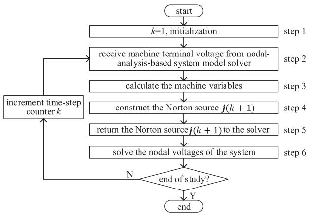  
Fig. 1. Flowchart for the implementation of the E-PD model.

# VI. FORMULATION OF NORTON EQUIVALENT

Equation (27) can be expressed in the form of a Norton equivalent as follows:

$$
\boldsymbol {G} _ {\text {e q , c o n s t}} \boldsymbol {v} _ {\text {a b c s}} (k) = \boldsymbol {i} _ {\text {a b c s}} (k) + \boldsymbol {j} (k), \tag {47}
$$

with

$$
\boldsymbol {G} _ {\text {e q , c o n s t}} = \left(\boldsymbol {R} _ {\text {e q , c o n s t}}\right) ^ {- 1} \tag {48}
$$

and

$$
\boldsymbol {j} (k) = \boldsymbol {G} _ {\text {e q , c o n s t}} \boldsymbol {e} _ {\mathrm {h}} ^ {\mathrm {r}} (k), \tag {49}
$$

where $G _ { \mathrm { e q , c o n s t } }$ represents the equivalent admittance, and $j$ represents the current source injection. With resistance matrix $R _ { \mathrm { e q , c o n s t } }$ constant, $G _ { \mathrm { e q , c o n s t } }$ is constant. The current source injection j is calculated by using the efficient formulation of $e _ { \mathrm { h } } ^ { \mathrm { r } }$ given by (46). An efficient phase domain (E-PD) synchronous machine model with a controlled current source in parallel with a constant Norton admittance is developed on the basis of (47). The information regarding the equivalent admittance $G _ { \mathrm { e q , c o n s t } }$ and the current source injection j is provided to the system model solver to solve the nodal voltages of the overall system. Since the admittance matrix $G _ { \mathrm { e q , c o n s t } }$ is constant, it is unnecessary to modify the admittance matrix of the overall system; this adds to the efficiency of the proposed model.

# VII. MODEL IMPLEMENTATION

For the purpose of discussion of the machine implementation procedure, the proposed E-PD model is assumed to be interfaced with a network. The voltages ${ \pmb v } _ { \mathrm { a b c s } } ( k )$ are known. They are provided by the nodal-analysis-based system model solver. The flow chart of the implementation of the proposed model is shown in Fig. 1.

In step 1, the machine initial conditions are calculated. Because the machine admittance matrix is constant, it is calculated before entering the main time-step loop. In step 2, the exchange of information between the E-PD model and the system model solver takes place. The E-PD model receives its terminal voltages ${ \pmb v } _ { \mathrm { a b c s } } ( k )$ from the system model solver.

In step 3, the electrical and mechanical variables of the E-PD model at time-step k are computed as follows:

1) Compute stator current ${ i _ { \mathrm { a b c s } } ( k ) }$ using (36).   
2) Compute stator current ${ i _ { \mathrm { q d 0 s } } ( k ) }$ :

$$
\boldsymbol {i} _ {\mathrm {q d 0 s}} (k) = \boldsymbol {K} \left(\theta_ {\mathrm {r}} (k)\right) \boldsymbol {i} _ {\mathrm {a b c s}} (k). \tag {50}
$$

3) Compute rotor current ${ i _ { \mathrm { q d 0 r } } ( k ) }$ using (45).   
4) Compute stator flux $\lambda _ { \mathrm { q d 0 s } } ( k )$ using (65).   
5) Compute stator flux $\lambda _ { \mathrm { a b c s } } ( k )$ :

$$
\boldsymbol {\lambda} _ {\mathrm {a b c s}} (k) = \boldsymbol {K} ^ {- 1} \left(\theta_ {\mathrm {r}} (k)\right) \boldsymbol {\lambda} _ {\mathrm {q d 0 s}} (k). \tag {51}
$$

6) Compute electromagnetic torque $T _ { \mathrm { e } } ( k )$ [17]:

$$
T _ {\mathrm {e}} (k) = \frac {3 p}{4} \left(\lambda_ {\mathrm {d s}} (k) i _ {\mathrm {q s}} (k) - \lambda_ {\mathrm {q s}} (k) i _ {\mathrm {d s}} (k)\right), \tag {52}
$$

where $i _ { \mathrm { q s } } ( k )$ is the quadrature component of the stator currents; $\lambda _ { \mathrm { q s } } ( k )$ and $\lambda _ { \mathrm { d s } } ( k )$ are the quadrature and direct components of the stator fluxes, respectively.

7) Compute rotor speed $\omega _ { \mathrm { r } } ( k )$ by discretizing (6) with the trapezoidal method:

$$
\begin{array}{l} \omega_ {\mathrm {r}} (k) = \omega_ {\mathrm {r}} (k - 1) + \frac {p}{2} \frac {\tau}{J} \\ \left(T _ {\mathrm {m}} (k) + T _ {\mathrm {m}} (k - 1) - T _ {\mathrm {e}} (k) - T _ {\mathrm {e}} (k - 1)\right). \tag {53} \\ \end{array}
$$

8) Compute rotor position $\theta _ { \mathrm { r } } ( k )$ by discretizing (7) with the trapezoidal method:

$$
\theta_ {\mathrm {r}} (k) = \theta_ {\mathrm {r}} (k - 1) + \frac {\tau}{2} (\omega_ {\mathrm {r}} (k) + \omega_ {\mathrm {r}} (k - 1)). \tag {54}
$$

In step 4, the rotor angle and the direct component of the stator currents are predicted. Then, the Norton source is computed. The following are procedures involved:

1) Predict rotor speed $\omega _ { \mathrm { r } } ( k + 1 )$ at time-step $k + 1 { : }$

$$
\tilde {\omega} _ {\mathrm {r}} (k + 1) = 2 \omega_ {\mathrm {r}} (k) - \omega_ {\mathrm {r}} (k - 1). \tag {55}
$$

2) Predict rotor angle $\theta _ { \mathrm { r } } ( k + 1 )$ ) using (54).   
3) Predict $i _ { \mathrm { d s } } ( k + 1 )$ using (32).   
4) Compute stator history term $e _ { \mathrm { s h } } ( k + 1 )$ using (10).   
5) Compute rotor history term $e _ { \mathrm { r h } } ^ { \mathrm { r } } ( k + 1 )$ using (42).   
6) Compute history voltage source $e _ { \mathrm { h } } ^ { \mathrm { r } } ( k + 1 )$ using (46).   
7) Compute Norton source $j ( k + 1 )$ using (49).

In step 5, the information on the Norton source $j ( k + 1 )$ is provided to the system model solver. The latter can proceed with updating the nodal voltages of the system in step 6. Finally, the time-step counter k is incremented, and the termination condition is checked. If the termination condition is not satisfied, the loop is entered again at step 2.

# VIII. ANALYSIS OF EFFICIENCY OF THE E-PD MODEL

The computational costs of the CC-PD model, VBR model and proposed E-PD model are evaluated by using floating point operations (flops) and trigonometric functions (trigs) per timestep. One addition, subtraction, multiplication, or division of two floating point numbers is considered as one flop [21]. The computational cost of a trigonometric function depends on both hardware and software. The studies performed on a personal computer (PC) with a Microsoft Windows Operating System show that a trigonometric function requires about 20 times

TABLE II FLOPS AND TRIGONOMETRIC FUNCTIONS COUNTS PER TIME-STEP   

<table><tr><td colspan="3">VBR model</td><td colspan="3">CC-PD model</td><td colspan="3">E-PD model</td></tr><tr><td>Term</td><td>flops</td><td>trigs</td><td>Term</td><td>flops</td><td>trigs</td><td>Term</td><td>flops</td><td>trigs</td></tr><tr><td>L&#x27;&#x27;abs(θr)Ks(θr)Ks-1(θr)</td><td>27</td><td>2</td><td>Ls(θr(k))Lsr(θr(k))Lrs(θr(k))</td><td>33</td><td>2</td><td>Ks(θr)Ks-1(θr)</td><td>8</td><td>2</td></tr><tr><td>Req</td><td>76</td><td>0</td><td>Req</td><td>0</td><td>0</td><td>Req, const</td><td>0</td><td>0</td></tr><tr><td>eh</td><td>105</td><td>0</td><td>eh</td><td>144</td><td>0</td><td>erh(see Table III)</td><td>100</td><td>0</td></tr><tr><td>λqdr</td><td>46</td><td>0</td><td>iqdr</td><td>47</td><td>0</td><td>iqdr (45)</td><td>23</td><td>0</td></tr><tr><td>Te</td><td>4</td><td>0</td><td>Te</td><td>52</td><td>0</td><td>Te (52)</td><td>4</td><td>0</td></tr><tr><td>Total</td><td>258</td><td>2</td><td>Total</td><td>276</td><td>2</td><td>Total</td><td>135</td><td>2</td></tr></table>

TABLE III FLOPS AND TRIGONOMETRIC FUNCTIONS REQUIRED BY $e _ { \mathrm { h } } ^ { \mathrm { r } }$ IN THE E-PD MODEL   

<table><tr><td>Process of calculating rh</td><td>flops</td><td>trigs</td></tr><tr><td>iqd0s(k) (50)</td><td>15</td><td>0</td></tr><tr><td>λqd0s(k) (65)</td><td>12</td><td>0</td></tr><tr><td>λabs(k) (51)</td><td>12</td><td>0</td></tr><tr><td>idss(k) (32)</td><td>5</td><td>0</td></tr><tr><td>esh(k+1) (10)</td><td>12</td><td>0</td></tr><tr><td>erh(k+1) (42)</td><td>20</td><td>0</td></tr><tr><td>erh(k+1) (46)</td><td>24</td><td>0</td></tr><tr><td>Total</td><td>100</td><td>0</td></tr></table>

more CPU time than a single flop. As shown in Section III and Appendix B, the proposed E-PD model requires the evaluation of trigonometric functions cos $\left( \theta _ { \mathrm { r } } \right)$ , cos $\textstyle ( \theta _ { \mathrm { r } } \pm { \frac { 2 \pi } { 3 } } )$ , sin(θr ), and sin $\begin{array} { r l r } {  { ( \theta _ { \mathrm { r } } \pm \frac { 2 \pi } { 3 } ) } } \end{array}$ for the calculation of $K ( \theta _ { \mathrm { r } } )$ and $K ^ { - 1 } ( \theta _ { \mathrm { r } } )$ . The VBR model in [10] and CC-PD model in [13] require the evaluation of trigonometric functions cos $\left( \theta _ { \mathrm { r } } \right)$ , cos $\textstyle ( \theta _ { \mathrm { r } } \pm { \frac { 2 \pi } { 3 } } )$ , sin(θr ), sin $\begin{array} { r } { \mathfrak { \ i } ( \theta _ { \mathrm { r } } \pm \frac { 2 \pi } { 3 } ) , \cos ( 2 \theta _ { \mathrm { r } } ) , \cos ( 2 \theta _ { \mathrm { r } } \pm \frac { 2 \pi } { 3 } ) } \end{array}$ , and sin $( 2 \theta _ { \mathrm { r } } )$ for the calculation of resistance matrix, history terms, and electromagnetic torque. Because the computation time of a trigonometric function is much more than that of a single flop, an efficient method for the evaluation of trigonometric functions, which is presented in [13], is applied to the above models to minimize the computational effort. The method is not described here due to limited space. The reader may refer to [13] for a more detailed description.

In this section, a steam turbine synchronous machine is used to analyze the efficiency of different synchronous machine models. The machine parameters are obtained from [17] and listed in Appendix D. The rotor of the machine is equipped with a field winding fd and three damper windings kd, kq1, and kq2. The detailed description of VBR model can be found in [10]. The CC-PD model is described in [13] with one additional damper winding kq3. The number of flops and trigonometric functions required for VBR and CC-PD models is summarized in Table II. The number of flops and trigonometric functions required for the E-PD model is given in Table II and Table III. The computational cost of a trigonometric function is equivalent to that of twenty flops. Consequently, the VBR model requires $2 5 8 + 2 \cdot 2 0 = 2 9 8$ flops; the CC-PD model requires $2 7 6 + 2 \cdot 2 0 = 3 1 6$ flops; the proposed E-PD model

requires 135 + 2  20 = 175 flops. The proposed model requires fewer flops per time step compared to the CC-PD and VBR models. The improvement of efficiency of the E-PD model results from the efficient calculations of history voltage source $e _ { \mathrm { h } } ^ { \mathrm { r } }$ and rotor currents $i _ { \mathrm { q d 1 } }$ which are presented in Section V. Furthermore, the proposed E-PD model has a constant resistance matrix. This is an important property for the modeling of synchronous machines, as it removes the need for modifying the admittance matrix of the entire network every time-step.

It should be noted that the number of flops for the CC-PD model reported in [13] is 255, while the number in Table II is 276. This difference is due to the different numbers of damper windings. The numbers of flops and trigonometric functions for the VBR model reported in [10] are also different from that given in Table II. This is because the efficient method for the evaluation of trigonometric functions presented in [13] is applied to the VBR model in this paper.

# IX. CASE STUDIES

In order to validate the proposed E-PD model, three tests are performed in this paper. In Section IX-A, a test system comprised of a 845 MVA cylindrical rotor synchronous machine which is directly connected to an ideal voltage source is considered. The study performed on this test system is intended to analyze the numerical properties of the individual machine model. In Section IX-B, it is shown that the proposed machine model is effective in describing the electrical performance of a salient pole synchronous machine. In Section IX-C, the IEEE 39-bus system comprising 10 synchronous generators has been used to further demonstrate the effectiveness of the proposed machine model. In Section IX-D, a discussion of the advantageous properties of the proposed model is presented.

# A. Simulation of the Single Cylindrical Rotor Synchronous Machine Model

In this section, the transient study of a single-phase-to-ground fault is performed to evaluate the accuracy and efficiency of the proposed machine model. Initially, the machine is operating steadily with a fixed input mechanical torque $T _ { \mathrm { m } }$ of $1 . 8 8 7 \times 1 0 ^ { 6 }$ N·m and a fixed field excitation voltage $v _ { \mathrm { f d } }$ of 30.3 V. $\mathbf { A } \mathbf { t } \ t =$ 0.04 s, phase a of the machine is shorted to ground. The fault is cleared at $t = 0 . 3 4 ~ \mathrm { s }$ . The synchronous machine parameters are obtained from [17] and given in Appendix D. For the purpose of comparison, a qd0 synchronous machine model has been implemented in MATLAB/Simulink. This model is solved using the trapezoidal method with a small time-step of 1 $. \mu \mathrm { s }$ to obtain a very accurate solution. This solution is considered as a reference. The VBR and CC-PD models are also included in the simulation. Fig. 2 and Fig. 3 show the responses produced by various models using different time-step sizes.

The stator currents $i _ { \mathrm { a s } } , \ : i _ { \mathrm { b s } }$ and $i _ { \mathrm { c s } }$ are shown in Fig. 2(a), Fig. 2(b) and Fig. 2(c), respectively. The electromagnetic torque $T _ { \mathrm { e } }$ is shown in Fig. 2(d). The curves for the stator currents do not reveal visible differences. The same is true for the curves of electromagnetic torque. All models produce accurate results

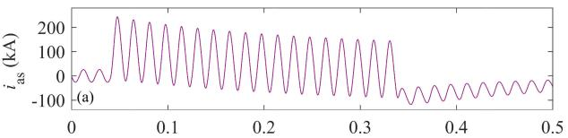

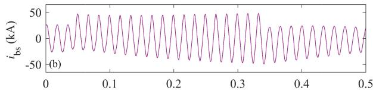

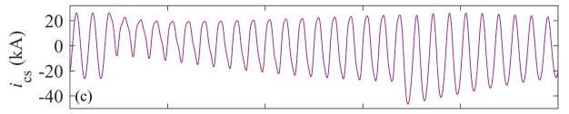

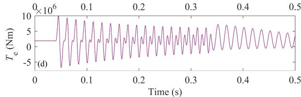  
Fig. 2. Simulation results for a cylindrical rotor synchronous machine model with the time-step size of 50 μs; solid line: reference solution; dashed line: solution for the VBR model; dotted line: solution for the CC-PD model; dashdotted line: solution for the E-PD model; (a) phase a stator current $i _ { \mathrm { a s } } ; ( \boldsymbol { \mathsf { b } } )$ phase b stator current $i _ { \mathrm { b s } } ; ( \mathrm { c } )$ phase c stator curren $i _ { \mathrm { c s } } ;$ ; (d) electromagnetic torque $T _ { \mathrm { e } }$ .

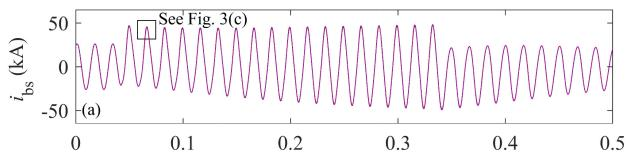

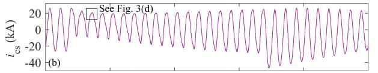

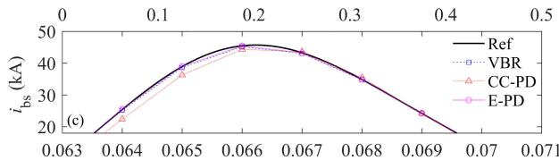

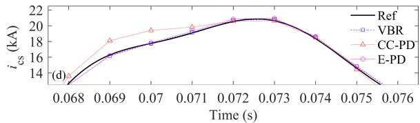  
Fig. 3. Simulation results for a cylindrical rotor synchronous machine model with the time-step size of 1 ms; solid line: reference solution; dashed line: solution for the VBR model; dotted line: solution for the CC-PD model; dash-dotted line: solution for the E-PD model; (a) phase b stator current $i _ { \mathrm { b s } } ;$ (b) zoomed-in view of stator current $i _ { \mathrm { b s } } ;$ (c) phase c stator current $i _ { \mathrm { c s } } ;$ (d) zoomed-in view of stator current $i _ { \mathrm { c s } }$ .

that are close to the reference solutions. The results presented in Fig. 2 demonstrate that all models are accurate when a small time-step size of $5 0 \mu \mathrm { s }$ is used.

The time-step size plays an important role in the accuracy and efficiency of simulation. A larger time-step size results in a faster simulation speed. However, the speed is increased at the

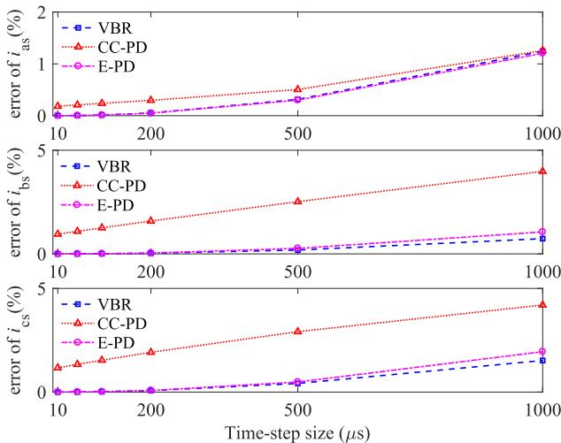  
Fig. 4. 2-norm errors for the single-phase-to-ground fault study using different time-step sizes.

expense of accuracy of the simulation. To study the impact of the time-step size on the accuracy of the responses of various models, the same study is repeated with a larger time-step of 1 ms. The stator currents $i _ { \mathrm { b s } }$ and $i _ { \mathrm { c s } }$ are shown in Fig. 3(a) and Fig. 3(b), respectively. To provide a better view of the comparison, zoomed-in views of $i _ { \mathrm { b s } }$ and $i _ { \mathrm { c s } }$ are shown in Fig. 3(c) and Fig. 3(d), respectively. It can be seen that the results produced by VBR and E-PD models are closer to the reference solution than that produced by the CC-PD model.

To further examine the accuracies of various models, the 2-norm cumulative errors are used [22]:

$$
\varepsilon (x) = \frac {\left\| x _ {\text {ref}} - x \right\| _ {2}}{\left\| x _ {\text {ref}} \right\| _ {2}} \times 100 \% \tag{56}
$$

where x represents the solution obtained from a given model; $x _ { \mathrm { r e f } }$ represents the reference solution; $\| x _ { \mathrm { r e f } } \| _ { 2 }$ represents 2-norm of $x _ { \mathrm { r e f } }$ .

The 2-norm errors of three models with various time-step sizes are shown in Fig. 4. As expected, the errors of all models increase with the time-step size. As is evident from Fig. 4, the accuracies of the VBR model and the E-PD model are nearly equal for small time-step sizes and the E-PD model is slightly less accurate than the VBR model for large time-step sizes. The errors of the CC-PD model are higher than that of the VBR model and E-PD model for a given time-step size. Even with a small time-step size of $1 0 \mu \mathrm { s } .$ , the CC-PD model has slight errors in the stator currents with the highest error being on the order of 1.17%. Although the introduction of an artificial winding for CC-PD model results in a constant equivalent admittance matrix, it could lead to errors in solving the synchronous machine model during high-frequency transients.

To assess the computational speed, the proposed E-PD, VBR and CC-PD models were implemented using standard C language. The models were executed on a personal computer with an Intel Core i7-7700K, 4.20-GHz processor and 16 GB RAM. The CPU times per time-step required by the three models are summarized in Table IV. The E-PD model required 0.4204 μs per time-step. The computational speed of the E-PD model was $( 0 . 7 8 0 4 ~ \mu s ) / ( 0 . 4 2 0 4 ~ \mu s ) \approx 1 . 9$ times higher than that of the

TABLE IV COMPARISON OF CPU TIMES PER TIME-STEP   

<table><tr><td>Models</td><td>CPU time per step (μs)</td></tr><tr><td>VBR</td><td>0.7804</td></tr><tr><td>CC-PD</td><td>0.7158</td></tr><tr><td>E-PD</td><td>0.4204</td></tr></table>

VBR model and (0.7158 $\mu s ) / ( 0 . 4 2 0 4 ~ \mu s ) \approx 1 . 7$ times higher than that of the CC-PD model.

In this case study, the CC-PD model requires less CPU time per time-step compared with the VBR model. However, as shown in Table II, the number of flops for the CC-PD model is larger than that for the VBR model. That is because the flops required by the matrix inversions of the various models have not been included in the count in Table II. The existence of timevariant terms in the equivalent resistance matrix of the VBR model could lead to increases in computation time required by the calculation of admittance matrix involving the inversion of the resistance matrix.

# B. Simulation of the Single Salient Pole Synchronous Machine Model

As a further validation of the proposed model, a low-speed hydro turbine generator is considered. Information regarding this salient pole synchronous machine is given in Appendix D. Since the single-phase-to-ground fault can even trigger higher frequency transients compared to the three-phase-to-ground fault [13], the single-phase-to-ground fault study is chosen in this section. The machine is connected directly to an ideal voltage source and initially delivering rated MVA at rated power factor. It provides the real and reactive power of 276 MW and 171 MVAr under steady-state rated condition. Then, a singlephase-to-ground fault occurs at the machine terminal (phase a). The machine transient performance is studied by using various models with a time-step size of 1 ms. As in Section IX-A, the reference solution is obtained by using the qd0 model with a very small time-step size of 1 μs.

Fig. 5 shows the dynamic behavior of the hydro turbine generator following a single-phase-to-ground fault at the terminal. Initially the machine is operating in steady-state. The real power and reactive power are maintained at the rated values, as shown in Fig. 5(b) and Fig. 5(c). At t = 0.05 s, phase a of the machine is shorted to ground. The single-phase fault causes the operating condition to change significantly from rated conditions. Throughout the simulation, the results obtained by the VBR, CC-PD, and E-PD models are in good agreement with the reference solution.

# C. Simulation of the Multimachine System

In order to further validate the proposed machine model, the New England power system consisting of 39 buses and 10 generators is considered. The one-line diagram of the system is depicted in Fig. 6. Parameters of the machines, transformers, and loads in the test system can be found in [23]. Initially the test system is in the steady state. A three-phase-to-ground

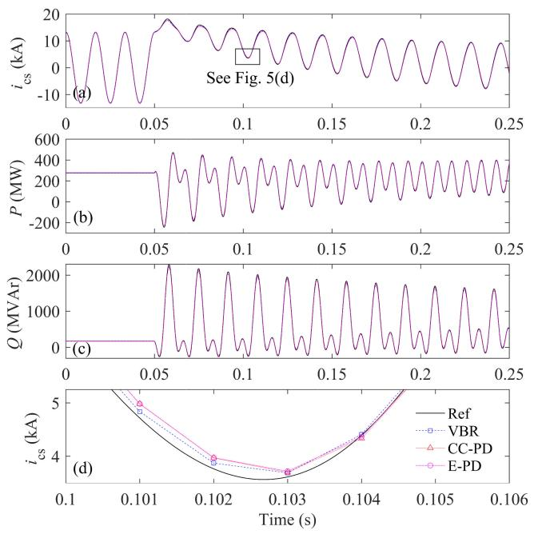  
Fig. 5. Simulation results for a salient pole synchronous machine with the time-step size of 1 ms; solid line: reference solution; dashed line: solution for the VBR model; dotted line: solution for the CC-PD model; dash-dotted line: solution for the E-PD model; (a) phase c stator current $i _ { \mathrm { c s } } ; ( \mathbf { b } )$ active power of the machine; (c) reactive power of the machine; (d) zoomed-in view of stator current $i _ { \mathrm { c s } }$ .

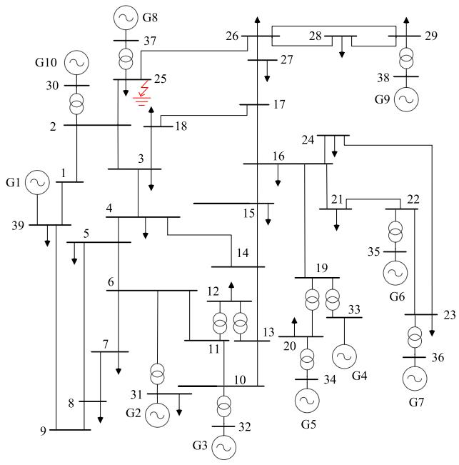  
Fig. 6. One-line diagram of 10-machine New England power system.

fault is applied at bus 25 at t = 0.5 s. The fault is cleared after 0.2 s. The VBR, CC-PD, and E-PD models are used in the simulation. For comparison, the reference solution is obtained using the conventional PD model and a small step-size of $1 0 \ \mu \mathbf { s } .$ . The 2-norm errors in phase a voltage of bus 37 are presented in Table V. They show that the proposed E-PD model yields similar numerical errors to the VBR and CC-PD models. This is also evidenced by Fig. 7. All models produce

TABLE V 2-NORM ERRORS OF PHASE A VOLTAGE OF BUS 37   

<table><tr><td>Time-step size</td><td>VBR</td><td>CC-PD</td><td>E-PD</td></tr><tr><td>200 μs</td><td>1.6026 %</td><td>1.7030 %</td><td>1.6246 %</td></tr><tr><td>500 μs</td><td>2.4966 %</td><td>2.8668 %</td><td>2.7230 %</td></tr></table>

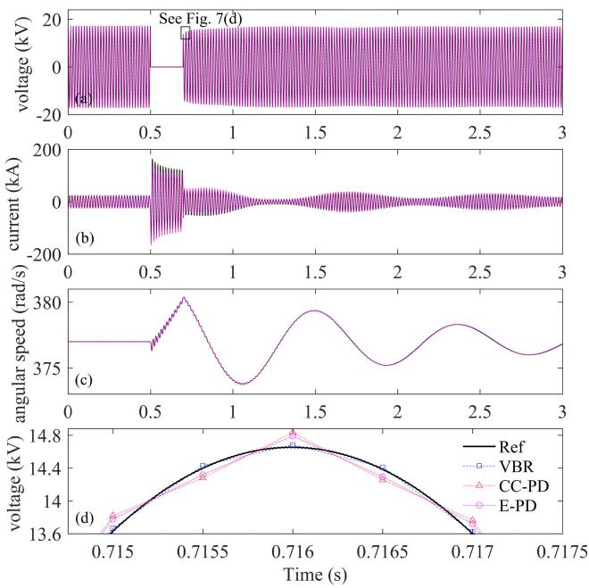  
Fig. 7. Simulation results for the 10-machine New England power system with a time-step size of 500 $\mu \mathrm { s } ;$ solid line: reference solution; dashed line: solution using the VBR model; dotted line: solution using the CC-PD model; dash-dotted line: solution using the E-PD model; (a) phase a voltage at bus 37; (b) phase a stator current of G8; (c) angular speed of G8; (d) zoomed-in view of phase a voltage at bus 37.

TABLE VI COMPUTATION TIME IN PER UNIT BASED ON THE VBR MODEL   

<table><tr><td>Time-step size</td><td>VBR</td><td>CC-PD</td><td>E-PD</td></tr><tr><td>200 μs</td><td>1 p.u.</td><td>0.7669 p.u.</td><td>0.7312 p.u.</td></tr><tr><td>500 μs</td><td>1 p.u.</td><td>0.7693 p.u.</td><td>0.7386 p.u.</td></tr></table>

accurate and convergent simulation results over the entire simulated scenario.

The computation time is presented in Table VI in per unit with the base value equal to the time required for the VBR model. It is noted from Table VI that the computational speeds with the CC-PD and E-PD models are higher than that with the VBR model. This is because the VBR model has a time-variant conductance matrix, and the conductance matrix of the whole network has to be updated at each time-step. The simulation using the E-PD model is faster than that using the CC-PD model. This is due to the efficient formulation of the E-PD model. The computational efficiency advantage of the E-PD model will be more apparent when performing simulations over long time intervals.

# D. Discussion

Accuracy and efficiency are two important considerations in the modeling of synchronous machines. The main objective of

any model implementation is to provide rapid solution with good accuracy. As shown in this paper, the method used in the implementation of the E-PD model not only reduces the number of mathematical operations significantly, compared to the implementations of the CC-PD model and VBR model, but it also gives results of a high degree of accuracy. Furthermore, the E-PD model has the added advantage that it has a constant equivalent admittance matrix. Thanks to the constant admittance matrix, the modification of the network admittance matrix is avoided. Although several types of constant-parameter VBR synchronous machine models are proposed in [3]–[5], [24] based on the SV-based approach, the machine admittance matrices change with the rotor positions when these models are discretized for EMTP-type solutions.

# X. CONCLUSION

In this paper, a new synchronous machine model is developed, implemented and validated. The model has a constant equivalent admittance matrix, and the stator circuit is represented in the abc phase domain. Thanks to the constant admittance matrix, it is unnecessary to change the network admittance matrix when the rotor positions change. Furthermore, the machine equations are reformulated. The advantage of the reformulation is that the number of mathematical operations required for modeling the machine is reduced. The performance of the proposed model is assessed by considering computational efficiency as well as accuracy. Case studies show that the proposed E-PD model preserves high levels of accuracy and is computationally more efficient than the CC-PD model and the VBR model.

# APPENDIX

# A. Coefficient Matrices in the PD Model

The stator resistance matrix $\scriptstyle { R _ { \mathrm { s } } }$ and the rotor resistance matrix $R _ { \mathrm { r } }$ are given as follows:

$$
\boldsymbol {R} _ {\mathrm {s}} = \operatorname {d i a g} \left[ r _ {\mathrm {s}}, r _ {\mathrm {s}}, r _ {\mathrm {s}} \right], \tag {57}
$$

$$
\boldsymbol {R} _ {\mathrm {r}} = \operatorname {d i a g} \left[ r _ {\mathrm {k q} 1}, r _ {\mathrm {k q} 2}, r _ {\mathrm {f d}}, r _ {\mathrm {k d}} \right], \tag {58}
$$

where $r _ { \mathrm { s } }$ is the resistance of the stator windings; $r _ { \mathrm { k q 1 } } , r _ { \mathrm { k q 2 } } , r _ { \mathrm { f d } }$ , $r _ { \mathrm { k d } }$ are the resistances of the windings kq1, kq2, fd, and kd, respectively.

The stator inductance matrix $L _ { \mathrm { s } } ( \theta _ { \mathrm { r } } )$ and the mutual inductance matrix $\mathbf { } _ { L _ { \mathrm { s r } } } ( \theta _ { \mathrm { r } } )$ are given, respectively, in (59) and $( 6 0 )$ , shown at the bottom of this page. The coefficients $L _ { \mathrm { { A } } }$ and $L _ { \mathrm { B } }$

are given as follows:

$$
L _ {\mathrm {A}} = \frac {L _ {\mathrm {m d}} + L _ {\mathrm {m q}}}{3}, \tag {61}
$$

$$
L _ {\mathrm {B}} = \frac {L _ {\mathrm {m d}} - L _ {\mathrm {m q}}}{3}, \tag {62}
$$

where $L _ { \mathrm { m q } }$ and $L _ { \mathrm { m d } }$ are the mutual inductances. The mutual inductance matrix $L _ { \mathrm { r s } } ( \theta _ { \mathrm { r } } )$ is given by:

$$
\boldsymbol {L} _ {\mathrm {r s}} \left(\theta_ {\mathrm {r}}\right) = \frac {2}{3} \boldsymbol {L} _ {\mathrm {s r}} ^ {\mathrm {T}} \left(\theta_ {\mathrm {r}}\right). \tag {63}
$$

The rotor inductance matrix $L _ { \mathrm { r } }$ is as follows:

$$
L _ {\mathrm {r}} =
$$

$$
\left[ \begin{array}{c c c c} L _ {\mathrm {l k q 1}} + L _ {\mathrm {m q}} & L _ {\mathrm {m q}} & 0 & 0 \\ L _ {\mathrm {m q}} & L _ {\mathrm {l k q 2}} + L _ {\mathrm {m q}} & 0 & 0 \\ 0 & 0 & L _ {\mathrm {l f d}} + L _ {\mathrm {m d}} & L _ {\mathrm {m d}} \\ 0 & 0 & L _ {\mathrm {m d}} & L _ {\mathrm {l k d}} + L _ {\mathrm {m d}} \end{array} \right], \tag {64}
$$

where $L _ { \mathrm { l k q 1 } } , L _ { \mathrm { l k q 2 } } , L _ { \mathrm { l f d } }$ , and $L _ { \mathrm { l k d } }$ are the leakage inductances of the windings kq1, kq2, fd, and kd, respectively.

Substituting (17) and (18) for $L _ { \mathrm { s } } ( \theta _ { \mathrm { r } } ( k ) )$ and $L _ { \mathrm { s r } } ( \theta _ { \mathrm { r } } ( k ) )$ in (5), transforming ${ i _ { \mathrm { a b c s } } ( t ) }$ into $i _ { \mathrm { q d 0 s } } ( t )$ , and multiplying by the Park’s transformation $\pmb { K } ( \theta _ { \mathrm { r } } ( k ) )$ yield the stator flux linkage $\lambda _ { \mathrm { q d 0 s } } ( t )$ :

$$
\boldsymbol {\lambda} _ {\mathrm {q d 0 s}} (t) = - \boldsymbol {L} _ {\mathrm {s}} ^ {\mathrm {r}} \boldsymbol {i} _ {\mathrm {q d 0 s}} (t) + \boldsymbol {L} _ {\mathrm {s r}} ^ {\mathrm {r}} \boldsymbol {i} _ {\mathrm {q d 0 r}} (t), \tag {65}
$$

with

$$
\boldsymbol {L} _ {\mathrm {s}} ^ {\mathrm {r}} = \operatorname {d i a g} \left[ L _ {\mathrm {l s}} + L _ {\mathrm {m q}}, L _ {\mathrm {l s}} + L _ {\mathrm {m d}}, L _ {\mathrm {l s}} \right], \tag {66}
$$

$$
\boldsymbol {L} _ {\mathrm {s r}} ^ {\mathrm {r}} = \left[ \begin{array}{c c c c} L _ {\mathrm {m q}} & L _ {\mathrm {m q}} & 0 & 0 \\ 0 & 0 & L _ {\mathrm {m d}} & L _ {\mathrm {m d}} \\ 0 & 0 & 0 & 0 \end{array} \right], \tag {67}
$$

where $L _ { \mathrm { s } } ^ { \mathrm { r } }$ and $\pmb { L } _ { \mathrm { s r } } ^ { \mathrm { r } }$ are constant matrices.

The matrix $L _ { \mathrm { r s } } ^ { \mathrm { r } }$ is given by:

$$
\boldsymbol {L} _ {\mathrm {r s}} ^ {\mathrm {r}} = \left(\boldsymbol {L} _ {\mathrm {s r}} ^ {\mathrm {r}}\right) ^ {\mathrm {T}}. \tag {68}
$$

# B. Park’s Transformation

The transformation from the phase variables $S _ { \mathrm { a b c } } =$ $( S _ { \mathrm { a } } \ S _ { \mathrm { b } } \ S _ { \mathrm { c } } ) ^ { \mathrm { T } }$ to the qd0 variables $\boldsymbol { S } _ { \mathrm { q d 0 } } = ( S _ { \mathrm { q } } \ S _ { \mathrm { d } } \ S _ { 0 } ) ^ { \mathrm { T } }$ can be written in the following form [17]:

$$
\boldsymbol {S} _ {\mathrm {q d 0}} = \boldsymbol {K} \left(\theta_ {\mathrm {r}}\right) \boldsymbol {S} _ {\mathrm {a b c}} \tag {69}
$$

$$
\boldsymbol {L} _ {\mathrm {s}} \left(\theta_ {\mathrm {r}}\right) = \left[ \begin{array}{c c c} L _ {\mathrm {l s}} + L _ {\mathrm {A}} - L _ {\mathrm {B}} \cos 2 \theta_ {\mathrm {r}} & - \frac {1}{2} L _ {\mathrm {A}} - L _ {\mathrm {B}} \cos 2 \left(\theta_ {\mathrm {r}} - \frac {\pi}{3}\right) & - \frac {1}{2} L _ {\mathrm {A}} - L _ {\mathrm {B}} \cos 2 \left(\theta_ {\mathrm {r}} + \frac {\pi}{3}\right) \\ - \frac {1}{2} L _ {\mathrm {A}} - L _ {\mathrm {B}} \cos 2 \left(\theta_ {\mathrm {r}} - \frac {\pi}{3}\right) & L _ {\mathrm {l s}} + L _ {\mathrm {A}} - L _ {\mathrm {B}} \cos 2 \left(\theta_ {\mathrm {r}} - \frac {2 \pi}{3}\right) & - \frac {1}{2} L _ {\mathrm {A}} - L _ {\mathrm {B}} \cos 2 \left(\theta_ {\mathrm {r}} + \pi\right) \\ - \frac {1}{2} L _ {\mathrm {A}} - L _ {\mathrm {B}} \cos 2 \left(\theta_ {\mathrm {r}} + \frac {\pi}{3}\right) & - \frac {1}{2} L _ {\mathrm {A}} - L _ {\mathrm {B}} \cos 2 \left(\theta_ {\mathrm {r}} + \pi\right) & L _ {\mathrm {l s}} + L _ {\mathrm {A}} - L _ {\mathrm {B}} \cos 2 \left(\theta_ {\mathrm {r}} + \frac {2 \pi}{3}\right) \end{array} \right] \tag {59}
$$

$$
\boldsymbol {L} _ {\mathrm {s r}} \left(\theta_ {\mathrm {r}}\right) = \left[ \begin{array}{l l l l} L _ {\mathrm {m q}} \cos \theta_ {\mathrm {r}} & L _ {\mathrm {m q}} \cos \theta_ {\mathrm {r}} & L _ {\mathrm {m d}} \sin \theta_ {\mathrm {r}} & L _ {\mathrm {m d}} \sin \theta_ {\mathrm {r}} \\ L _ {\mathrm {m q}} \cos \left(\theta_ {\mathrm {r}} - \frac {2 \pi}{3}\right) & L _ {\mathrm {m q}} \cos \left(\theta_ {\mathrm {r}} - \frac {2 \pi}{3}\right) & L _ {\mathrm {m d}} \sin \left(\theta_ {\mathrm {r}} - \frac {2 \pi}{3}\right) & L _ {\mathrm {m d}} \sin \left(\theta_ {\mathrm {r}} - \frac {2 \pi}{3}\right) \\ L _ {\mathrm {m q}} \cos \left(\theta_ {\mathrm {r}} + \frac {2 \pi}{3}\right) & L _ {\mathrm {m q}} \cos \left(\theta_ {\mathrm {r}} + \frac {2 \pi}{3}\right) & L _ {\mathrm {m d}} \sin \left(\theta_ {\mathrm {r}} + \frac {2 \pi}{3}\right) & L _ {\mathrm {m d}} \sin \left(\theta_ {\mathrm {r}} + \frac {2 \pi}{3}\right) \end{array} \right] \tag {60}
$$

with

$$
\boldsymbol {K} \left(\theta_ {\mathrm {r}}\right) = \frac {2}{3} \left[ \begin{array}{c c c} \cos \theta_ {\mathrm {r}} & \cos \left(\theta_ {\mathrm {r}} - \frac {2 \pi}{3}\right) & \cos \left(\theta_ {\mathrm {r}} + \frac {2 \pi}{3}\right) \\ \sin \theta_ {\mathrm {r}} & \sin \left(\theta_ {\mathrm {r}} - \frac {2 \pi}{3}\right) & \sin \left(\theta_ {\mathrm {r}} + \frac {2 \pi}{3}\right) \\ \frac {1}{2} & \frac {1}{2} & \frac {1}{2} \end{array} \right]. \tag {70}
$$

# C. Coefficients of the E-PD Model

Insertion of (64), (66), (67) and (68) into (21), $R _ { \mathrm { a b } }$ may be expressed in terms of matrices $R _ { \mathrm { a } }$ and $R _ { \mathrm { b } }$ . Coefficients in matrices $\pmb { R } _ { \mathrm { a } }$ and $R _ { \mathrm { b } }$ are given as follows:

$$
R _ {\mathrm {a l}} = \frac {4}{\tau^ {2}} L _ {\mathrm {m q}} ^ {2} \frac {a + b - 2 e}{a b - e ^ {2}} - \frac {2}{\tau} \left(L _ {\mathrm {l s}} + L _ {\mathrm {m q}}\right), \tag {71}
$$

$$
R _ {\mathrm {a} 2} = - \frac {2}{\tau} L _ {\mathrm {l s}}, \tag {72}
$$

$$
R _ {\mathrm {b}} = \frac {4}{\tau^ {2}} L _ {\mathrm {m d}} ^ {2} \frac {c + d - 2 f}{c d - f ^ {2}} - \frac {2}{\tau} \left(L _ {\mathrm {l s}} + L _ {\mathrm {m d}}\right) - R _ {\mathrm {a l}}, \tag {73}
$$

with

$$
a = r _ {\mathrm {k q} 1} + \frac {2}{\tau} \left(L _ {\mathrm {l k q} 1} + L _ {\mathrm {m q}}\right), \tag {74}
$$

$$
b = r _ {\mathrm {k q} 2} + \frac {2}{\tau} \left(L _ {\mathrm {l k q} 2} + L _ {\mathrm {m q}}\right), \tag {75}
$$

$$
c = r _ {\mathrm {f d}} + \frac {2}{\tau} \left(L _ {\mathrm {l f d}} + L _ {\mathrm {m d}}\right), \tag {76}
$$

$$
d = r _ {\mathrm {k d}} + \frac {2}{\tau} \left(L _ {\mathrm {k d}} + L _ {\mathrm {m d}}\right), \tag {77}
$$

$$
e = \frac {2}{\tau} L _ {\mathrm {m q}}, \tag {78}
$$

$$
f = \frac {2}{\tau} L _ {\mathrm {m d}}. \tag {79}
$$

Insertion of (67) and (68) into (40) and (41) gives:

$$
M _ {\mathrm {a} 1} = \frac {b e - e ^ {2}}{a b - e ^ {2}}, \tag {80}
$$

$$
M _ {\mathrm {a} 2} = \frac {a e - e ^ {2}}{a b - e ^ {2}}, \tag {81}
$$

$$
M _ {\mathrm {a} 3} = \frac {d f - f ^ {2}}{c d - f ^ {2}}, \tag {82}
$$

$$
M _ {\mathrm {a} 4} = \frac {c f - f ^ {2}}{c d - f ^ {2}}, \tag {83}
$$

$$
R _ {\mathrm {f} 1} = e \left(M _ {\mathrm {a} 1} + M _ {\mathrm {a} 2}\right), \tag {84}
$$

$$
R _ {\mathrm {f} 2} = f \left(M _ {\mathrm {a} 3} + M _ {\mathrm {a} 4}\right). \tag {85}
$$

# D. Synchronous Machine Parameters

The parameters of synchronous machines used in Section IX-A and Section IX-B are listed in Table VII. Following the approach used in [13] and [25], the parameters of the additional winding of the CC-PD model are given as follows:

835 MVA cylindrical rotor synchronous machine

$\mathrm { 1 ) } \ \tau = 1 0 \mu s , r _ { \mathrm { k q 3 } } = 3 . 3 2 9 3 \Omega , X _ { \mathrm { l k q 3 } } = 0 . 1 0 1 7 \Omega .$   
$\begin{array} { r } { \mathrm { ~ 2 ) ~ } \tau = 5 0 \mu s , r _ { \mathrm { k q 3 } } = 2 . 9 0 8 9 \Omega , X _ { \mathrm { l k q 3 } } = 0 . 0 8 0 7 \Omega . } \end{array}$   
$3 ) \ \tau = 1 0 0 \mu s , r _ { \mathrm { k q 3 } } = 2 . 5 1 2 9 \Omega , X _ { \mathrm { l k q 3 } } = 0 . 0 6 0 9 \Omega .$   
$4 ) \ \tau = 2 0 0 \mu s , r _ { \mathrm { k q 3 } } = 1 . 9 7 6 2 \Omega , X _ { \mathrm { l k q 3 } } = 0 . 0 3 4 1 \Omega .$

TABLE VII PARAMETERS OF SYNCHRONOUS MACHINES [17]   

<table><tr><td>Symbols</td><td>Quantities</td><td colspan="2">Values</td></tr><tr><td>S (MVA)</td><td>rated power</td><td>835</td><td>325</td></tr><tr><td>ωb (r/min)</td><td>rated speed</td><td>3600</td><td>112.5</td></tr><tr><td>Vn (kV)</td><td>line-to-line voltage</td><td>26</td><td>20</td></tr><tr><td>cosφ</td><td>power factor</td><td>0.85</td><td>0.85</td></tr><tr><td>rs (Ω)</td><td>stator resistance</td><td>0.00243</td><td>0.00234</td></tr><tr><td>Xls (Ω)</td><td>stator leakage reactance</td><td>0.1538</td><td>0.1478</td></tr><tr><td>Xq (Ω)</td><td>q-axis reactance</td><td>1.457</td><td>0.5911</td></tr><tr><td>rkq1 (Ω)</td><td>resistance of the kq1 winding</td><td>0.00144</td><td>-</td></tr><tr><td>Xlkq1 (Ω)</td><td>leakage reactance of the kq1 winding</td><td>0.6578</td><td>-</td></tr><tr><td>rkq2 (Ω)</td><td>resistance of the kq2 winding</td><td>0.00681</td><td>0.01675</td></tr><tr><td>Xlkq2 (Ω)</td><td>leakage reactance of the kq2 winding</td><td>0.07602</td><td>0.1267</td></tr><tr><td>Xd (Ω)</td><td>d-axis reactance</td><td>1.457</td><td>1.0467</td></tr><tr><td>rfd (Ω)</td><td>resistance of the fd winding</td><td>0.00075</td><td>0.00050</td></tr><tr><td>Xlfd (Ω)</td><td>leakage reactance of the fd winding</td><td>0.1145</td><td>0.2523</td></tr><tr><td>rkd (Ω)</td><td>resistance of the kd winding</td><td>0.01080</td><td>0.01736</td></tr><tr><td>Xlkd (Ω)</td><td>leakage reactance of the kd winding</td><td>0.06577</td><td>0.1970</td></tr><tr><td>J (J·s2)</td><td>inertia of machine</td><td>0.0658 × 10^6</td><td>35.1 × 10^6</td></tr><tr><td>p</td><td>number of poles</td><td>2</td><td>64</td></tr></table>

$$
\begin{array}{l} 5) \tau = 5 0 0 \mu s, r _ {\mathrm {k q} 3} = 1. 2 0 7 7 \Omega , X _ {\mathrm {l k q} 3} = - 0. 0 0 4 4 \Omega . \\ 6) \tau = 1 0 0 0 \mu s, r _ {\mathrm {k q} 3} = 0. 7 3 6 6 \Omega , X _ {\mathrm {l k q} 3} = - 0. 0 2 7 9 \Omega . \\ \end{array}
$$

325 MVA salient pole synchronous machine

$$
\tau = 1 0 0 0 \mu s, r _ {\mathrm {k q} 3} = 3 8. 1 3 3 5 \Omega , X _ {\mathrm {l k q} 3} = 1. 8 0 8 1 \Omega .
$$

In accordance with [13] and [25], the fitting frequency used in the CC-PD model is set to 120 Hz. Depending on the timestep size τ , the leakage reactances of the additional winding can be negative.

# REFERENCES

[1] S. D. Pekarek, O. Wasynczuk, and H. J. Hegner, “An efficient and accurate model for the simulation and analysis of synchronous machine/converter systems,” IEEE Trans. Energy Convers., vol. 13, no. 1, pp. 42–48, Mar. 1998.   
[2] D. Logue and P. T. Krein, “Simulation of electric machinery and power electronics interfacing using MATLAB/SIMULINK,” in Proc. 7th Workshop Comput. Power Electron., 2000, pp. 34–39.   
[3] M. Chapariha, L. Wang, J. Jatskevich, H. W. Dommel, and S. D. Pekarek, “Constant-parameter RL-branch equivalent circuit for interfacing AC machine models in state-variable-based simulation packages,” IEEE Trans. Energy Convers., vol. 27, no. 3, pp. 634–645, Sep. 2012.   
[4] M. Chapariha, F. Therrien, J. Jatskevich, and H. W. Dommel, “Explicit formulations for constant-parameter voltage-behind-reactance interfacing of synchronous machine models,” IEEE Trans. Energy Convers., vol. 28, no. 4, pp. 1053–1063, Dec. 2013.   
[5] M. Chapariha, F. Therrien, J. Jatskevich, and H. W. Dommel, “Constantparameter circuit-based models of synchronous machines,” IEEE Trans. Energy Convers., vol. 30, no. 2, pp. 441–452, Jun. 2015.   
[6] V. Brandwajn, “Synchronous generator models for the analysis of electromagnetic transients,” Ph.D. dissertation, Dept. Elect. Eng., Univ. British Columbia, Vancouver, BC, Canada, 1977.   
[7] H. K. Lauw and W. S. Meyer, “Universal machine modeling for the representation of rotating electric machinery in an electromagnetic transients program,” IEEE Trans. Power App. Syst., vol. PAS-101, no. 6, pp. 1342– 1351, Jun. 1982.   
[8] A. M. Gole, R. Menzies, P. Turanli, and D. Woodford, “Improved interfacing of electrical machine models to electromagnetic transients programs,” IEEE Trans. Power App. Syst., vol. PAS-103, no. 9, pp. 2446–2451, Sep. 1984.   
[9] J. R. Mart´ı and K. W. Louie, “A phase-domain synchronous generator model including saturation effects,” IEEE Trans. Power Syst., vol. 12, no. 1, pp. 222–229, Feb. 1997.

[10] L. Wang and J. Jatskevich, “A voltage-behind-reactance synchronous machine model for the EMTP-type solution,” IEEE Trans. Power Syst., vol. 21, no. 4, pp. 1539–1549, Nov. 2006.   
[11] L. Wang, J. Jatskevich, and H. W. Dommel, “Re-examination of synchronous machine modeling techniques for electromagnetic transient simulations,” IEEE Trans. Power Syst., vol. 22, no. 3, pp. 1221–1230, Aug. 2007.   
[12] L. Wang and J. Jatskevich, “Magnetically-saturable voltage-behindreactance synchronous machine model for EMTP-type solution,” IEEE Trans. Power Syst., vol. 26, no. 4, pp. 2355–2363, Nov. 2011.   
[13] L. Wang and J. Jatskevich, “A phase-domain synchronous machine model with constant equivalent conductance matrix for EMTP-type solution,” IEEE Trans. Energy Convers., vol. 28, no. 1, pp. 191–202, Mar. 2013.   
[14] H. W. Dommel, EMTP Theory Book. Vancouver, BC, Canada: Microtran Power System Analysis Corporation, May 1992.   
[15] K. Strunz and E. Carlson, “Nested fast and simultaneous solution for timedomain simulation of integrative power-electric and electronic systems,” IEEE Trans. Power Del., vol. 22, no. 1, pp. 277–287, Jan. 2007.   
[16] P. Kundur, Power System Stability and Control. New York, NY, USA: McGraw-Hill, 1993.   
[17] P. C. Krause, O. Wasynczuk, and S. D. Sudhoff, Analysis of Electric Machinery and Drive Systems, 2nd ed. Piscataway, NJ, USA: IEEE Press, 2002.   
[18] L. Wang et al., “Methods of interfacing rotating machine models in transient simulation programs,” IEEE Trans. Power Del., vol. 25, no. 2, pp. 891–903, Apr. 2010.   
[19] X. Cao, A. Kurita, H. Mitsuma, Y. Tada, and H. Okamoto, “Improvements of numerical stability of electromagnetic transient simulation by use of phase-domain synchronous machine models,” Electr. Eng. Jpn., vol. 128, no. 3, pp. 53–62, Apr. 1999.   
[20] F. Therrien, L. Wang, M. Chapariha, and J. Jatskevich, “Constantparameter interfacing of induction machine models considering main flux saturation in EMTP-type programs,” IEEE Trans. Energy Convers., vol. 31, no. 1, pp. 12–26, Mar. 2016.   
[21] C. van Loan, Computational Frameworks for the Fast Fourier Transform. Philadelphia, PA, USA: SIAM, 1992.   
[22] W. Gautschi, Numerical Analysis: An Introduction. Boston, MA, USA: Birkhauser, 1997.   
[23] M. A. Pai, Energy Function Analysis for Power System Stability. Norwell, MA, USA: Kluwer, 1989.   
[24] Y. Huang, M. Chapariha, F. Therrien, J. Jatskevich, and J. R. Mart´ı, “A constant-parameter voltage-behind-reactance synchronous machine model based on shifted-frequency analysis,” IEEE Trans. Energy Convers., vol. 30, no. 2, pp. 761–771, Jun. 2015.   
[25] S. D. Pekarek and E. A. Walters, “An accurate method of neglecting dynamic saliency of synchronous machines in power electronic based systems,” IEEE Trans. Energy Convers., vol. 14, no. 4, pp. 1177–1183, Dec. 1999.

Yankan Song (S’14) received the B.Sc. degree in electrical engineering from Shandong University, Jinan, China, in 2013, and the Ph.D. degree in electrical engineering from Tsinghua University, Beijing, China, in 2018.

He is currently a Postdoc Researcher with Tsinghua University and the R&D Manager with the Research Center of Cloud Simulation and Intelligent Decision-Making, Tsinghua-Sichuan Energy Internet Research Institute, Chengdu, China. His research interests include power system modeling and electro-

magnetic transients simulation, parallel computing, and hybrid simulation of interconnected ac–dc systems.

Shaowei Huang (M’11) received the B.S. and Ph.D. degrees from the Department of Electrical Engineering, Tsinghua University, Beijing, China, in July 2006 and June 2011, respectively.

From 2011 to 2013, he was a Postdoctoral with the Department of Electrical Engineering, Tsinghua University, where he is currently an Associate Professor. His research interests include power systems modeling and simulation, power system parallel and distributed computing, complex systems and its application in power systems, and artificial intelligence.

Zhendong Tan received the B.E. degree in electrical engineering in 2018 from Tsinghua University, Beijing, China, where he is currently working toward the M.A.Eng. degree.

His research interest mainly includes modeling and simulation of power system transients.

Yue Xia received the B.S. and M.S. degrees in electrical engineering from China Agricultural University, Beijing, China, in 2009 and 2011, respectively, and the Ph.D. degree in electrical engineering from Technische Universitat Berlin, Berlin, Germany, in ¨ 2016.

He is currently a Postdoctoral with the Department of Electrical Engineering and Applied Electronic Technology, Tsinghua University, Beijing, China. His research interests include power electronic systems, electrical machines, wind power, and modeling and simulation of power system transients.

Ying Chen (M’07) received the B.E. and Ph.D. degrees in electrical engineering from Tsinghua University, Beijing, China, in 2001 and 2006, respectively.

He is currently an Associate Professor with the Department of Electrical Engineering and Applied Electronic Technology, Tsinghua University. His research interests include parallel and distributed computing, electromagnetic transient simulation, cyber-physical system modeling, and cyber security of smart grid.

Kai Strunz received the Dipl.-Ing. and Dr.-Ing. (summa cum laude) degrees from Saarland University, Saarbrucken, Germany, in 1996 and 2001,¨ respectively.

He was with Brunel University, London, U.K., from 1995 to 1997. From 1997 to 2002, he was with the Division Recherche et Developpement of Elec- ´ tricite de France, Paris, France. From 2002 to 2007, ´ he was an Assistant Professor of Electrical Engineering with the University of Washington, Seattle, WA, USA. Since 2007, he has been a Professor with Sus-

tainable Electric Networks and Sources of Energy, Technische Universitat (TU) ¨ Berlin, Berlin, Germany.

Dr. Strunz was the Chairman of the Conference IEEE PES Innovative Smart Grid Technologies, TU Berlin, in 2012. He is a Chairman of the IEEE Power and Energy Society Subcommittee on Distributed Energy Resources and the Past Chairman of the Subcommittee on Research in Education. On behalf of the Intergovernmental Panel on Climate Change, he acted as a Review Editor for the Special Report on Renewable Energy Sources and Climate Change Mitigation. He received the IEEE PES Prize Paper Award in 2015 and the Journal of Emerging and Selected Topics in Power Electronics First Prize Paper Award 2015.