# New multiphase mode domain transmission line model

M.C. Tavaresa,*, J. Pissolatob,1, C.M. Portelac,2

a Sa˜o Carlos Engineering School, Sa˜o Paulo University, Av. Dr. Carlos Botelho 1465, P.O. Box 359, Sa˜o Carlos, Sa˜o Paulo 13560-250, Brazil

b Faculdade de Engenharia Ele´trica e de ComputaC¸ a˜o, UNICAMP, State Univerisity of Campinas, C.P. 6101, Campinas 13081-970, Brazil

c COPPE, Federal University of Rio de Janeiro, Rua Eng. Cesar Grillo, Rio de Janeiro 22640-150, Brazil

Received 26 February 1998; received in revised form 9 April 1999; accepted 20 April 1999

# Abstract

This article presents a new model to represent transmission lines including the frequency dependence of longitudinal parameters. The model uses exact modes, for ideally transposed lines, and “quasi-modes” for non-transposed lines. The line is represented through a cascade of p-circuits, with one p-circuit for each mode. The transformation matrix used is real and it is modeled with ideal transformers. The model is described for three-phase lines, dc lines, double three-phase lines and six-phase lines. An ATP-EMTP implementation of a 440 kV threephase transmission line is performed to illustrate the model and a comparison with two frequency dependent ATP line models are made, the Semlyen and JMarti ones. q 1999 Elsevier Science Ltd. All rights reserved.

Keywords: Transmission line model; Frequency dependence; Mode domain; Electromagnetic transients

# 1. Introduction

One of the main difficulties when dealing with transient simulation studies in a digital simulator program like ATP [1] is the correct representation of transmission lines. The ATP works in the time domain and the line is generally represented by its phase quantities. Nevertheless, the transmission line parameters, namely the longitudinal parameters, vary with distance and frequency.

The former is represented through the hyperbolic function in the distributed parameter model or through p-circuits. With the last, the line is represented by cascading the p-circuit, and some care should be taken with the p-length. The number of cascaded elements can become very large if the line is too long.

To model the frequency dependence, it is more complex. First, the impedance matrix varies with frequency, which means that there is one full matrix for each frequency. The impedance matrix is a full one due to the phase (and ground wire) coupling. As a program like ATP works in time domain the frequency dependence of an element is not a straightforward model.

It is proposed then to work not with phase but with modes and therefore deal with diagonal rather than full matrix. In mode domain there is no coupling and the frequency dependence of the impedance can be properly represented with synthetic circuits. Nevertheless, there is the transformation matrix, which makes the link between phase and mode domain, which also varies with frequency.

In the present model a real transformation matrix is used as the unique transformation matrix for the entire frequency range. As the matrix elements are real ones they can be represented in a time domain program like ATP using ideal transformers. This is implemented making the proper connections with the transformers, using their ratios and polarities.

This model can be implemented in any digital program that has ideal transformer components or in an analog simulator (TNA). This means that with any digital program it is possible to have a good representation of a multiphase transmission line, even if the program only has a single-phase transmission line model or resistor, inductors and capacitors (used to make the p-sections of each mode), but has ideal transformer elements.

The theory is described for a three-phase line, dc, double three-phase and six-phase line. A 440 kV three-phase transmission line illustrates the model and a comparison with two frequency dependent ATP-EMTP line models is made, the Semlyen [2] method and the JMarti [3] model, both incorporated in ATP-EMTP. The line is supposed both transposed and non-transposed. First the modes are analyzed,

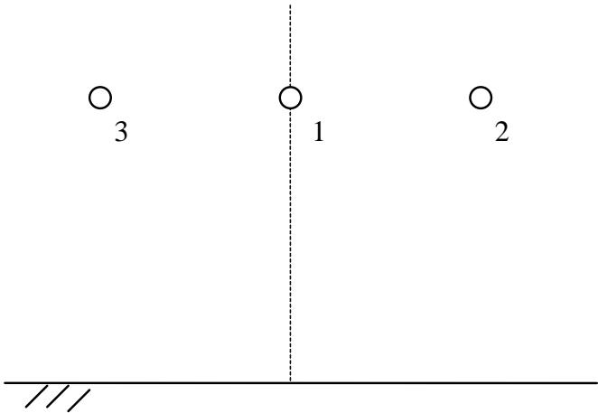  
Fig. 1. Schematic representation of a single three-phase line.

supposing a step in the generation end. Then a transient phenomenon, the line energization, is studied. A statistical energization is performed and the worst case is reproduced. To conclude, a frequency scan analysis is done, pointing out the differences between the two models.

# 2. Transmission line electrical parameters calculation

Once the transmission line configuration is established, it is possible to calculate its electrical longitudinal and transversal parameters, using the formulae for the electromagnetic behavior in the frequency range of 10 Hz to 1 MHz.

These parameters are calculated in phase domain. For each frequency there is a full longitudinal and transversal impedance matrix. Nevertheless, it is difficult to work with these full matrices and it is proposed to transform them into mode matrices, which are diagonal matrices, where the main characteristics of the line are easier to deal with.

For calculating the electrical parameters in phase domain classical Carson’s formulae were used. It must be emphasized that the proposed method allows other consistent formulations of the line parameters to be considered, namely soil electric permitivity, soil conductivity and

permitivity frequency dependence, non uniform soil, e.g. with layers of different electric parameters.

# 3. Mode domain

Once the electrical parameters (longitudinal and transversal impedance) have been properly calculated in phase domain, the line can be represented to start the desired simulations. It is proposed then to work with mode components.

The transformation matrix is unique for each impedance matrix, which means that for a defined line there is one impedance matrix for each frequency. This seems to make the mode determination very complex. It is usual to make some simplifications as in both Semlyen and JMarti ATP model, where a single transformation matrix calculated for a chosen frequency is used for the entire frequency range.

In the proposed model, for three-phase transmission lines with the vertical symmetry plane restriction there is a real and frequency independent matrix which separates exactly two groups of modes, the Clarke transformation matrix [4,5]. In one group there is the exact mode and in the other the two quasi-modes, that may be treated as a good approximation of the exact modes. For an ideally transposed line the quasi-modes are exact modes. If the line has no symmetry plane the quasi-modes model will still give a good representation of the transmission line.

The transformation matrix used is real and constant, frequency independent. It is obtained from the line geometry. Once the transformation is a real one it can be modeled in a program like ATP by using ideal transformers.

For three-phase lines, Clarke’s transformation [6] is applied and for double three-phase and six-phase lines first a media/antimedia (m/a) transformation, which sums and makes differences, is applied and then Clarke again is used [7,8]. For dc lines only m/a transformation is necessary [7].

The model is presented for the three-phase line and then it is explained for the other lines. After obtaining the transformation matrix the modal impedance is calculated and the frequency dependence can easily be seen. This dependence is then synthesized with series and parallel resistors and inductors.

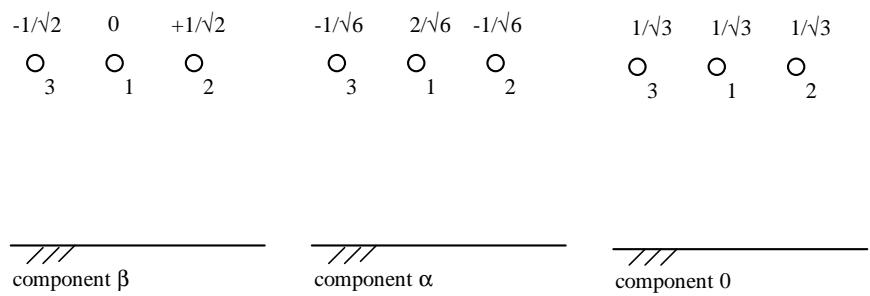  
Fig. 2. Current in the conductors, for Clarke’s components, in rationalized form.

# 4. Three-phase transmission line model

Suppose a three-phase transmission line with the ground wire already reduced, as shown in Fig. 1.

In phase domain

$$
- \frac {\partial u}{\partial x} = Z i, \tag {1}
$$

$$
- \frac {\partial i}{\partial x} = Y u. \tag {2}
$$

The impedance matrix in phase components is:

$$
Z = \left[ \begin{array}{l l l} A & D & D \\ D & B & F \\ D & F & B \end{array} \right]. \tag {3}
$$

Due to the vertical symmetry axis, Clarke’s transformation can be applied and the currents in the conductors are divided as shown in Fig. 2, for each component:

The transformation matrix is

$$
T _ {\mathrm {C l}} = \left[ \begin{array}{c c c} 2 / \sqrt {6} & - 1 / \sqrt {6} & - 1 / \sqrt {6} \\ 0 & 1 / \sqrt {2} & - 1 / \sqrt {2} \\ 1 / \sqrt {3} & 1 / \sqrt {3} & 1 / \sqrt {3} \end{array} \right]. \tag {4}
$$

Applying this matrix to current in phase there comes:

$$
\left[ \begin{array}{l} i _ {\alpha} \\ i _ {\beta} \\ i _ {0} \end{array} \right] = T _ {\mathrm {C l}} \cdot \left[ \begin{array}{l} i _ {\mathrm {a}} \\ i _ {\mathrm {b}} \\ i _ {\mathrm {c}} \end{array} \right] \tag {5}
$$

and

$$
i _ {\mathrm {a b c}} = T _ {\mathrm {C l}} ^ {- 1} i _ {\alpha \beta 0}. \tag {6}
$$

Using these equations in Eq. (1) we have

$$
- \frac {\partial}{\partial x} \left(T _ {\mathrm {C l}} ^ {- 1} u _ {\alpha \beta 0}\right) = Z T _ {\mathrm {C l}} ^ {- 1} i _ {\alpha \beta 0}, \tag {7}
$$

$$
- \frac {\partial}{\partial x} u _ {\alpha \beta 0} = T _ {\mathrm {C l}} Z T _ {\mathrm {C l}} ^ {- 1} i _ {\alpha \beta 0}, \tag {8}
$$

which makes

$$
Z _ {\alpha \beta 0} = T _ {\mathrm {C l}} Z T _ {\mathrm {C l}} ^ {- 1} \tag {9}
$$

and the same for the admittance matrix results in:

$$
Y _ {\alpha \beta 0} = T _ {\mathrm {C l}} Y T _ {\mathrm {C l}} ^ {- 1}. \tag {10}
$$

Applying Eq. (9) in Eq. (3) there comes:

$$
Z _ {\alpha \beta 0} = \left[ \begin{array}{c c c} z _ {\alpha} & 0 & z _ {\alpha 0} \\ 0 & z _ {\beta} & 0 \\ z _ {0 \alpha} & 0 & z _ {0} \end{array} \right] \tag {11}
$$

where

$$
z _ {\alpha} = \frac {1}{3} ((2 A + B) - (4 D - F)), \tag {12}
$$

$$
z _ {\beta} = B - F, \tag {13}
$$

$$
z _ {\alpha 0} = z _ {0 \alpha} = \frac {\sqrt {2}}{3} ((A - B) + (D - F)), \tag {14}
$$

$$
z _ {0} = \frac {1}{3} (A + 2 B + 4 D + 2 F). \tag {15}
$$

The b component is a real mode, as there is no coupling between it and the others. The same is not true for a and 0 components. However, the mutual terms are formed by the sum of the difference of the self impedance terms plus the difference of the mutual impedance terms.

For non-transposed lines the self impedance terms are almost the same. The mutual impedance terms, although different, are also similar, and the difference is small in the frequency range of transient analysis. Therefore, the coupling term $( \mathbf { z } _ { \alpha 0 } )$ can be discarded and the components a and 0 can be treated as quasi-modes for non-transposed lines with the restriction of a vertical symmetry plane [9]. This model can be applied, also, to lines without the symmetry plane. In this case the almost mode $\beta$ is not an exact mode, and has some coupling with almost a and almost 0 quasi-modes. So, there is an additional approximation, in comparison with the symmetry case. The additional error, that depends on specific geometry and soil parameters, is typically small, and may be accepted for most applications, of course considering accuracy requirements.

If the line is ideally transposed, with transposition sections short when compared with a quarter of wave length, then both self and mutual impedance terms are equal, which results in null coupling between a and 0 components, that in this case are exact modes. For ideally transposed lines there are only two distinct modes, a equal b, and 0. Any linear combination of a–b modes is also one mode, such as positive and negative components.

The impedance matrix is:

$$
Z _ {\mathrm {f}} = \left[ \begin{array}{l l l} Z _ {\mathrm {p}} & Z _ {\mathrm {m}} & Z _ {\mathrm {m}} \\ Z _ {\mathrm {m}} & Z _ {\mathrm {p}} & Z _ {\mathrm {m}} \\ Z _ {\mathrm {m}} & Z _ {\mathrm {m}} & Z _ {\mathrm {p}} \end{array} \right] \tag {16}
$$

and

$$
Z _ {\mathrm {p}} - \text {s e l f t e r m s m e d i a}, Z _ {\mathrm {p}} = (A + 2 B) / 3,
$$

$$
Z _ {\mathrm {m}} - \text {m u t u a l} Z _ {\mathrm {m}} = (F + 2 D) / 3,
$$

which makes

$$
Z _ {\alpha \beta 0} = \left[ \begin{array}{c c c} Z _ {\mathrm {p}} - Z _ {\mathrm {m}} & 0 & 0 \\ 0 & Z _ {\mathrm {p}} - Z _ {\mathrm {m}} & 0 \\ 0 & 0 & Z _ {\mathrm {p}} + 2 Z _ {\mathrm {m}} \end{array} \right]. \tag {17}
$$

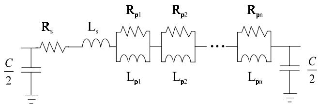  
Fig. 3. p-circuit for a mode.

The Eq. (15) related to homopolar quasi-mode can be rewritten as:

$$
z _ {0} = \frac {(A + 2 B)}{3} + 2 \cdot \frac {(F + 2 D)}{3} \tag {18}
$$

or

$$
z _ {0} = z _ {\mathrm {p}} + 2 z _ {\mathrm {m}} \tag {19}
$$

that is, the quasi-mode 0-sequence impedance (for nontransposed line) is equal to the 0-sequence impedance of the transposed line. This is due to the simplification of applying Clarke matrix as the transformation matrix [10].

The line can be modeled through a cascade of p-circuits, one for each mode. The frequency dependence of longitudinal parameters can be synthesized with series and parallel resistors and inductors, as shown in Fig. 3 [8]. This resulted in a very accurate representation for both transposed and non-transposed lines, as presented in Figs. 4 and 5.

The system represented in a transient simulation study is generally described in phase components, such as the case

of the generation equivalent, the switches, arresters, loads, transformers, among others. To use the transmission line model, represented in mode domain, there will be phase and mode elements, connected by the transformation matrix. The transformation matrix is modeled through ideal transformers and the line is represented through a cascade of pcircuits, one for each mode, as shown in Fig. 6 [7].

The transformation matrix used in the proposed model is the Clarke one. This matrix is real, that is, all its elements are real. To model it a group of ideal transformers is used. They are connected in a way that they reproduce the relation between the phases and modes currents and voltages, as it is presented in Figs. 7–10. As the matrix is composed of only real elements, they can be represented by the transformer’s ratio and polarity.

This can easily be implemented in a time domain program like ATP just using simple ideal transformers, as shown.

An ATP file is presented to help to describe the matrix representation (one transformer per phase).

# 5. DC line model

The dc transmission line can also be represented through exact modes in a transient program using a unique, real, frequency independent transformation matrix, for the entire frequency range studied. If the line has a vertical symmetry plane there is no simplification implied.

Suppose a dc line with the ground wire already reduced, as shown in Fig. 11.

For the dc line only a media/antimedia (m/a)

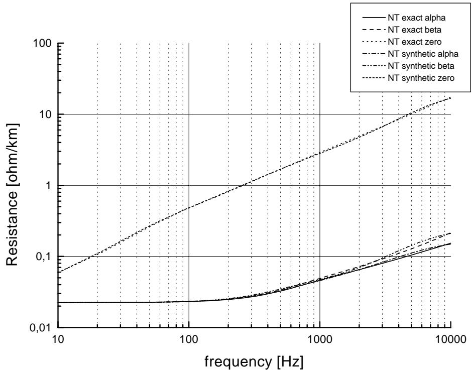  
Fig. 4. Per unit resistance—non-transposed line—exact x synthetic results.

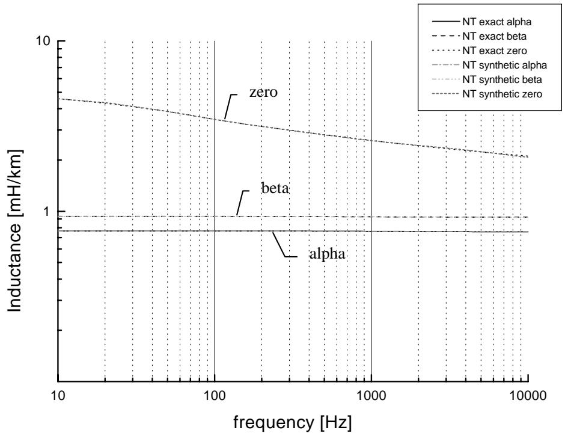  
Fig. 5. Per unit inductance—non-transposed line—exact x synthetic results.

```txt
C transformer between phase A and modes TRANSFORMER AV1 1.00+6 9999   
1JAGA .001 1.0000   
2 AL1P1 .001 .40825   
3BE1P1 .001 .70711   
4HO1P1 .001 .57735   
C   
C transformer between phase B and modes TRANSFORMER BV1 1.00+6 9999   
1JAGB .001 1.0000   
2AL1P2 AL1P1 .001 .81650   
3HO1P2 HO1P1 .001 .57735   
C   
C transformer between phase C and modes TRANSFORMER AV1 CV1 1.00+6   
1JAGC   
2AL1P2 AL1010   
3BE1P1 BE1010   
4HO1010HO1P2   
C 
```

transformation, formed by the sum and difference, is necessary to diagonalize the impedance matrix. The currents in the conductors can be decomposed as shown in Fig. 12, for each component.

The currents in m/a components can be described as:

$$
i _ {\mathrm {m}} = \frac {1}{\sqrt {2}} \left(i _ {1} + i _ {2}\right), \tag {20}
$$

$$
i _ {\mathrm {a}} = \frac {1}{\sqrt {2}} \left(i _ {1} - i _ {2}\right). \tag {21}
$$

The impedance matrix in pole, or phase, components and in mode turns in:

$$
Z _ {\mathrm {p}} = \left[ \begin{array}{l l} A & D \\ D & A \end{array} \right], \tag {22}
$$

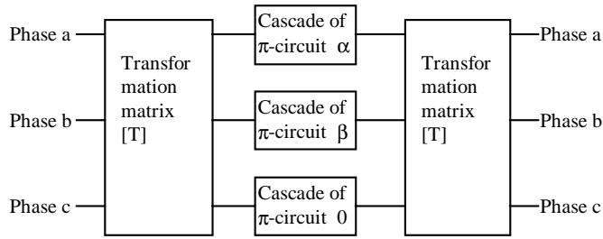  
Fig. 6. Schematic representation of three-phase line in ATP.

$$
Z _ {\mathrm {m a}} = \left[ \begin{array}{c c} Z _ {\mathrm {m}} & 0 \\ 0 & Z _ {\mathrm {a}} \end{array} \right], \tag {23}
$$

where

$$
z _ {\mathrm {m}} = A + D, \tag {24}
$$

$$
z _ {\mathrm {a}} = A - D. \tag {25}
$$

Again there will be pole or phase, and mode elements in the circuit, and the link between them is done by the transformation matrix, represented through ideal transformers in ATP. The network is simulated in pole or phase domain,

representing in the usual way the arresters, switches, sources and so on, while the transmission is represented in mode domain, with one cascade of p-circuit for each mode. They are uncoupled and it is possible to synthesize the frequency dependence through series and parallel resistors and inductors. In Fig. 13 it is shown how to represent m/a transformation matrix.

# 6. Double three-phase and six-phase line model

# 6.1. Double three-phase transmission line

In Fig. 14 a schematic representation of a double threephase transmission line is presented, with its ground wire already reduced. One circuit is formed by conductors 2 3 4 and the other by conductors 1 6 5.

This line is transformed in two uncoupled “media” and “antimedia” lines because of its geometrical properties. The currents in m/a components can be written as:

$$
i _ {\mathrm {m} 1} = \frac {1}{\sqrt {2}} \left(i _ {1} + i _ {2}\right), \tag {26}
$$

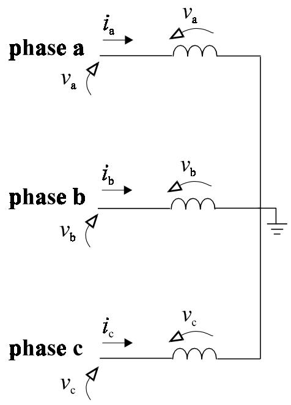

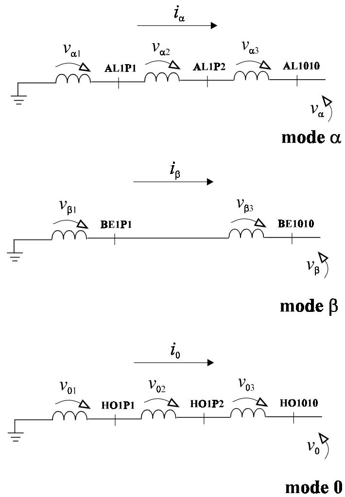  
Fig. 7. Transformation matrix phase to phase diagram.

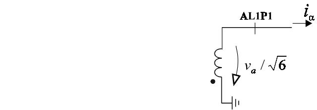

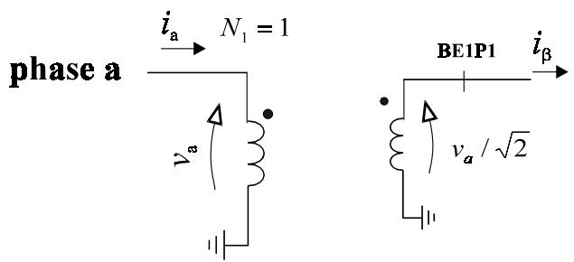

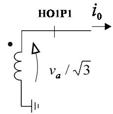  
Fig. 8. Transformer from phase a to modes.

$$
i _ {\mathrm {m} 2} = \frac {1}{\sqrt {2}} \left(i _ {3} + i _ {6}\right), \tag {27}
$$

$$
i _ {\mathrm {m} 3} = \frac {1}{\sqrt {2}} \left(i _ {5} + i _ {4}\right), \tag {28}
$$

$$
i _ {\mathrm {a l}} = \frac {1}{\sqrt {2}} \left(i _ {1} - i _ {2}\right), \tag {29}
$$

$$
i _ {\mathrm {a} 2} = \frac {1}{\sqrt {2}} \left(i _ {3} - i _ {6}\right), \tag {30}
$$

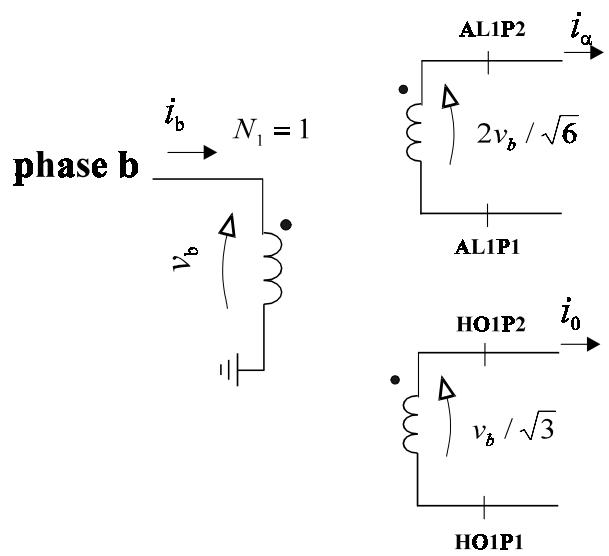  
Fig. 9. Transformer from phase b to modes.

$$
i _ {\mathrm {a} 3} = \frac {1}{\sqrt {2}} \left(i _ {5} - i _ {4}\right). \tag {31}
$$

Note that the new currents are formed by sum and difference of opposite conductors’ currents. The impedance matrix, in phase components for non-transposed line, can be described as:

$$
Z = \left[ \begin{array}{c c c c c c} A & D & E & C & G & H \\ D & A & H & G & C & E \\ E & H & B & J & L & M \\ C & G & J & I & N & L \\ G & C & L & N & I & J \\ H & E & M & L & J & B \end{array} \right]. \tag {32}
$$

Applying the m/a transformation the impedance matrix in new components is:

$$
Z _ {\mathrm {m a}} = \left[ \begin{array}{l l} Z _ {\mathrm {m}} & [ 0 ] \\ [ 0 ] & Z _ {\mathrm {a}} \end{array} \right] \tag {33}
$$

where

$$
Z _ {\mathrm {m}} = \left[ \begin{array}{c c c} A + D & E + H & G + C \\ E + H & B + M & L + J \\ G + C & L + J & I + N \end{array} \right], \tag {34}
$$

$$
Z _ {\mathrm {a}} = \left[ \begin{array}{l l l} A - D & E - H & G - C \\ E - H & B - M & L - J \\ G - C & L - J & I - N \end{array} \right]. \tag {35}
$$

The double non-transposed three-phase line has been separated in two uncoupled three-phase lines, the “media” and the “antimedia” ones [8]. This has been achieved due to the geometrical properties of the line that has a vertical symmetry axis, and has nothing to do with line transposition.

This is an important fact since no approximation has been done until now. The new “lines” can be modeled in any power system program which works with three-phase lines.

If the double three-phase line is transposed in a way that each circuit is completely transposed, but there is a coupling between both circuits, then the impedance matrix can be written as:

$$
Z = \left[ \begin{array}{c c c c c c} A & D & D & D & H & H \\ D & A & H & H & D & D \\ D & H & A & H & D & D \\ D & H & H & A & D & D \\ H & D & D & D & A & H \\ H & D & D & D & H & A \end{array} \right]. \tag {36}
$$

Applying both transformations, m/a and Clarke, the new

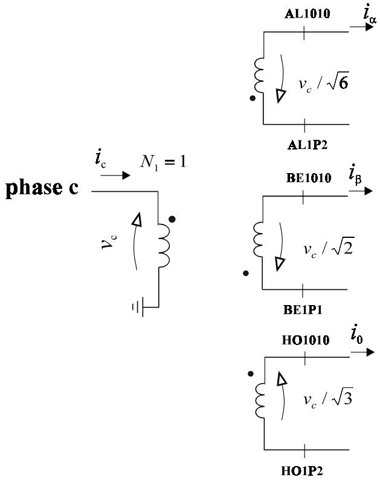  
Fig. 10. Transformer from phase c to modes.

impedance matrices are:

$$
Z _ {\mathrm {m} \alpha \beta 0} = \left[ \begin{array}{c c c} A - H & 0 & 0 \\ 0 & A - H & 0 \\ 0 & 0 & A + 3 D + 2 H \end{array} \right], \tag {37}
$$

$$
Z _ {\mathrm {a} \alpha \beta 0} = \left[ \begin{array}{c c c} \frac {3 A - 8 D + 5 H}{3} & 0 & \frac {2 \sqrt {2}}{3} (D - H) \\ 0 & A - H & 0 \\ \frac {2 \sqrt {2}}{3} (D - H) & 0 & \frac {3 A - D - 2 H}{3} \end{array} \right]. \tag {38}
$$

For the media “line” the modes are exact, while for the antimedia one there is a coupling term between $\ " { \bf { \alpha } } \cdot \bf { { \sigma } } \alpha \prime \prime$ and $ { { } ^ { 6 } }  { 0 ^ { 9 } }$ quasi-modes, just like the non-transposed three-phase line.

The complete transformation matrix (m/a and Clarke) is done with the help of ideal transformers, as shown for single three-phase line and dc transmission line.

# 6.2. Six-phase transmission line

The six-phase transmission line can be modeled in the same way the double three-phase line is. The tower configuration is also the same as the double three-phase one, shown in Fig. 14. All the assumptions made for the previous line are valid, the six-phase line is transformed into two

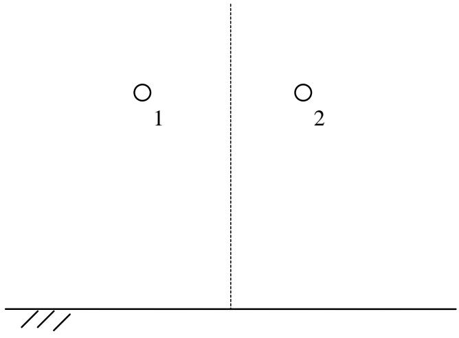  
Fig. 11. Schematic representation of a dc line.

uncoupled three-phase line, “media” and “antimedia” ones, and then Clarke’s transformation is used to obtain six-quasi-uncoupled modes [11].

If the double three-phase line is ideally transposed, noting that the six-phase line transposition is the rotating one, since the conductors must keep the same relative position, the impedance matrix in phase component is [8,11]:

$$
Z _ {\mathrm {f}} = \left[ \begin{array}{l l l l l l} Z _ {\mathrm {p}} & Z _ {\mathrm {m} 1} & Z _ {\mathrm {m} 2} & Z _ {\mathrm {m} 3} & Z _ {\mathrm {m} 2} & Z _ {\mathrm {m} 1} \\ Z _ {\mathrm {m} 1} & Z _ {\mathrm {p}} & Z _ {\mathrm {m} 1} & Z _ {\mathrm {m} 2} & Z _ {\mathrm {m} 3} & Z _ {\mathrm {m} 2} \\ Z _ {\mathrm {m} 2} & Z _ {\mathrm {m} 1} & Z _ {\mathrm {p}} & Z _ {\mathrm {m} 1} & Z _ {\mathrm {m} 2} & Z _ {\mathrm {m} 3} \\ Z _ {\mathrm {m} 3} & Z _ {\mathrm {m} 2} & Z _ {\mathrm {m} 1} & Z _ {\mathrm {p}} & Z _ {\mathrm {m} 1} & Z _ {\mathrm {m} 2} \\ Z _ {\mathrm {m} 2} & Z _ {\mathrm {m} 3} & Z _ {\mathrm {m} 2} & Z _ {\mathrm {m} 1} & Z _ {\mathrm {p}} & Z _ {\mathrm {m} 1} \\ Z _ {\mathrm {m} 1} & Z _ {\mathrm {m} 2} & Z _ {\mathrm {m} 3} & Z _ {\mathrm {m} 2} & Z _ {\mathrm {m} 1} & Z _ {\mathrm {p}} \end{array} \right], \tag {39}
$$

where $Z _ { \mathrm { p } }$ is the self impedance; $Z _ { \mathrm { m l } }$ , the adjacent phases impedance; $Z _ { \mathrm { m } 2 } .$ , the alternate phases impedance; and $Z _ { \mathrm { m } 3 } ,$ , the opposite phases impedance.

Applying m/a transformation and Clarke transformation there comes:

$$
Z _ {\mathrm {m} \alpha \beta 0} = \left[ \begin{array}{c c c} z _ {\mathrm {m} \alpha} & 0 & 0 \\ 0 & z _ {\mathrm {m} \beta} & 0 \\ 0 & 0 & z _ {\mathrm {m} 0} \end{array} \right] \tag {40}
$$

$$
\begin{array}{c c c c} + 1 / \sqrt {2} & + 1 / \sqrt {2} & + 1 / \sqrt {2} & - 1 / \sqrt {2} \\ \mathsf {O} _ {1} & \mathsf {O} _ {2} & \mathsf {O} _ {1} & \mathsf {O} _ {2} \end{array}
$$

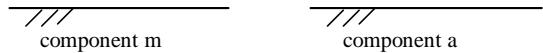  
Fig. 12. Conductor’s current, for components media/antimedia, in rationalized form.

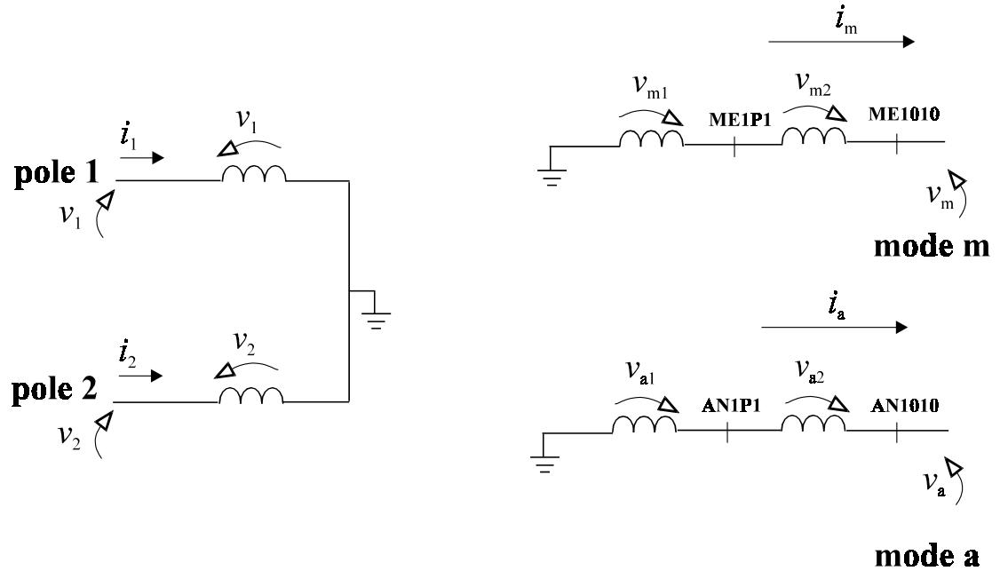  
Fig. 13. m/a transformation matrix phase to phase diagram.

and

$$
Z _ {\mathrm {a} \alpha \beta 0} = \left[ \begin{array}{c c c} z _ {\mathrm {a} \alpha} & 0 & 0 \\ 0 & z _ {\mathrm {a} \beta} & 0 \\ 0 & 0 & z _ {\mathrm {a} 0} \end{array} \right] \tag {41}
$$

where

$$
Z _ {\mathrm {m} \alpha} = Z _ {\mathrm {a} \beta} = Z _ {\mathrm {p}} - Z _ {\mathrm {m} 1} - Z _ {\mathrm {m} 2} + Z _ {\mathrm {m} 3}, \tag {42}
$$

$$
Z _ {\mathrm {m} \beta} = Z _ {\mathrm {a} \alpha} = Z _ {\mathrm {p}} + Z _ {\mathrm {m} 1} - Z _ {\mathrm {m} 2} - Z _ {\mathrm {m} 3}, \tag {43}
$$

$$
Z _ {\mathrm {m} 0} = Z _ {\mathrm {p}} + 2 Z _ {\mathrm {m} 1} + 2 Z _ {\mathrm {m} 2} + Z _ {\mathrm {m} 3}, \tag {44}
$$

$$
Z _ {\mathrm {a} 0} = Z _ {\mathrm {p}} - 2 Z _ {\mathrm {m} 1} + 2 Z _ {\mathrm {m} 2} - Z _ {\mathrm {m} 3}. \tag {45}
$$

Note that there will be two pairs of equal modes, but each

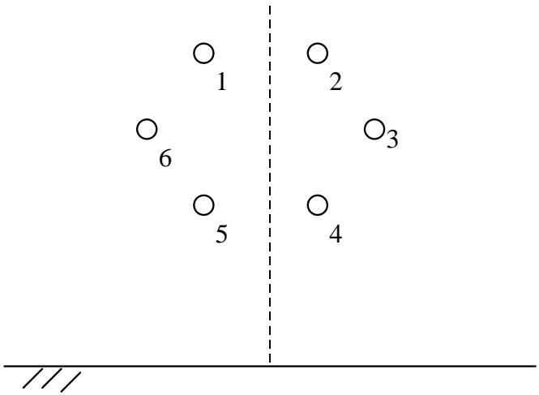  
Fig. 14. Schematic representation of a double three-phase transmission line.

one belongs to each “line”, which makes their determination easier [8]. Any linear combination of the modes is also a mode, for instance [12]:

• six-phase direct and inverse coordinates are real modes, corresponding to the aa and mb;   
double three-phase direct and inverse coordinates are real modes, corresponding to ma and ab.

As an approximation, these four different modes could be reduced to three different modes, as modes mb and ma are very similar [8]. As only real and frequency independent linear transformation has been used, again the transformation matrix can be represented through ideal transformers. There will be phase domain elements and the transmission line can be modeled in mode domain, with a more accurate representation of the frequency dependence.

# 7. Three-phase line application

In Fig. 15 the data of the three-phase line used to illustrate the model are presented.

The line parameters were calculated in the range of 10 Hz to 10 kHz. As it is a single line, to represent its modes (exact ones for transposed line and quasi-modes for non-transposed line) Clarke’s transformation matrix was applied, as explained. With the longitudinal and transversal impedance in mode domain, the synthetic circuits were calculated. The line parameters were modeled with one cascade of p-circuits for each mode, each with 10 km length. The line was studied in ATP, with the real and frequency independent transformation matrix represented through ideal transformers.

The line was treated as transposed and non-transposed. It

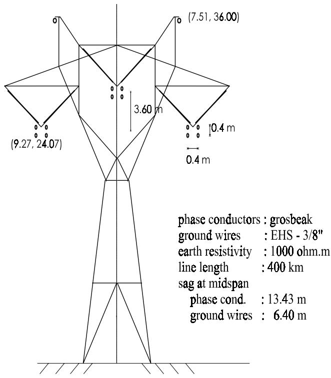  
Fig. 15. Schematic representation of the 440 kV three-phase line.

was also represented in ATP using both Semlyen and JMarti internal ATP models. Four tests were then applied.

# 7.1. Mode Analysis

The first test performed with the proposed model was to verify the natural mode behavior for a single three-phase transmission line, supposing it ideally transposed and nontransposed. To do so some simulations were performed with all three models with ATP.

The simulation consisted of applying a 1 V pulse of 1 ms to verify the model behavior to transients in the frequency range of the normal switching phenomenon. In Fig. 16 the diagram of the studied system is shown.

To represent the modes the pulse voltages were inputted as described in Table 1. The receiving end was opened. The simulated cases were: transposed and non-transposed lines; quasi-mode, Semlyen and JMarti models.

The mode behavior should be coherent with the analysis performed before, where the intrinsic simplification of quasi-mode model of using Clarke transformation as the unique transformation for the entire frequency range was shown.

Analyzing the theory it is expected that:

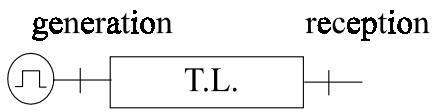  
Fig. 16. Simulated system for mode analysis.

the mode behavior for the three modes should be similar for transposed and non-transposed lines;   
• the homopolar mode (0-sequence) should have identical result in quasi-mode model for both lines as shown in Eq. (17) and similar results for the other two models;   
the mode b is an exact one, for both transposed and nontransposed lines. This mode is not the same, but very similar, for the two lines. The distinction between them is the difference between the self terms for transposed and non-transposed lines and the difference between the mutual terms for both lines, which are very small;   
• the mode a is a quasi-mode for the non-transposed line and exact mode for the transposed line. Again the difference among the lines should not be very high;   
• modes a and b should be equal for the transposed lines and, although different, should be similar for non-transposed lines.

In Figs. 17–23 some results of the mode analysis are presented.

Analyzing the results it can be seen that the proposed model had a very coherent result, as detailed below:

• modes a and b had very similar results for transposed and non-transposed lines;   
• the homopolar (0) mode had equal results due to model simplification;   
comparing the modes a and b for the same line, for the transposed line the result is identical and for the nontransposed line the result is similar.

The Semlyen model presented the following characteristics:

• the mode a had similar behavior for both lines;   
• the mode b presents some differences for higher frequencies, between both lines;   
• when comparing modes a and b for the same line, for the transposed line the result is equal, as it should be. For the non-transposed line the result is quite different, which indicates a model inaccuracy.

The JMarti model presented the following characteristics:

• the modes a and b had similar behavior for both lines;   
• when comparing modes a and b for the same line, for the

Table 1 Steps to represent the modes   

<table><tr><td>Mode</td><td>Phase</td><td>Voltage (V)</td></tr><tr><td rowspan="3">α</td><td>a</td><td>-0.5</td></tr><tr><td>b (central)</td><td>1.0</td></tr><tr><td>c</td><td>-0.5</td></tr><tr><td rowspan="3">β</td><td>a</td><td>1.0</td></tr><tr><td>b</td><td>0</td></tr><tr><td>c</td><td>-1.0</td></tr><tr><td rowspan="3">0</td><td>a</td><td>1.0</td></tr><tr><td>b</td><td>1.0</td></tr><tr><td>c</td><td>1.0</td></tr></table>

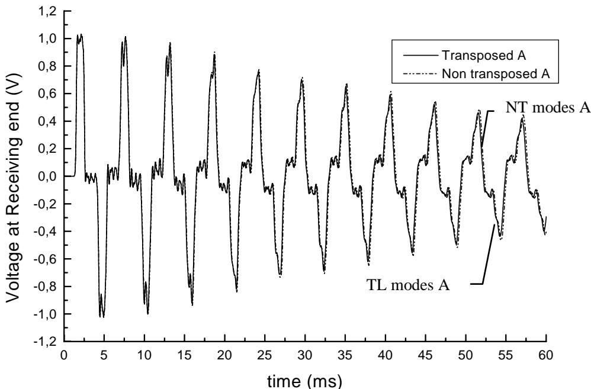  
Fig. 17. Step response for mode b for Quasi-modes model—transposed x non-transposed line—receiving end.

transposed line the result is equal, as it should be. For the non-transposed line the result is quite different, which indicates a model inaccuracy.

# 7.2. Frequency analysis

In order to identify the reason for such different results a frequency scan analysis was performed for all three models. The sending terminal had a 1 V source and the receiving end was opened. The relations between the line ends were

analyzed in the range of 10 Hz to 10 kHz. An exact calculation, in what concerns the aspects compared in the paper, was also realized so the models could be more properly confronted, as shown in Fig. 24. This so called exact calculation was performed by computing the line quadripole for each frequency in mode domain and obtaining the exact eigenvectors to transform the mode quantities into phase.

The results for both lines were similar, and the main characteristics can be summarized:

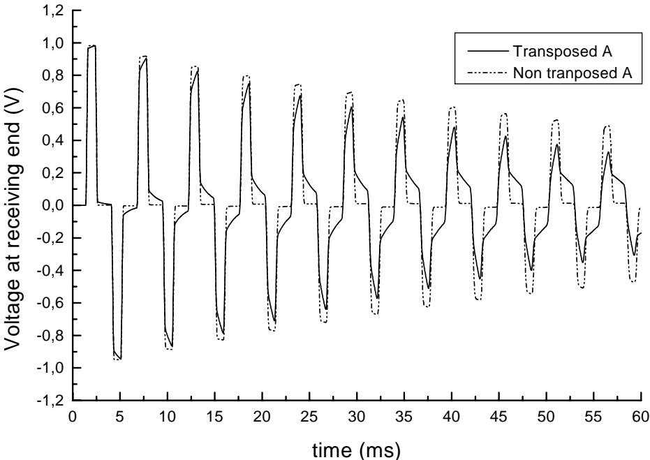  
Fig. 18. Step response for mode b for Semlyen model—transposed x non-transposed line—receiving end.

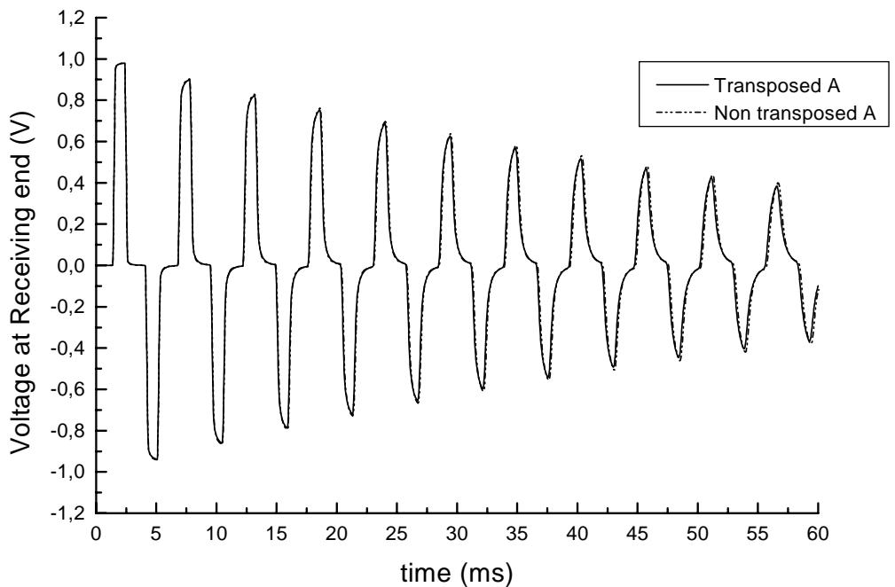  
Fig. 19. Step response for mode b for JMarti model—transposed x non-transposed line—receiving end.

• the positive sequence response was very similar for all models and the exact case;   
• the 0-sequence response for quasi-mode model was quite equal to the exact response, while the Semlyen and JMarti were too much dampen.

An advantage of our method is to allow direct control of frequency accuracy of line model. In conditions in which resonance or almost resonance occurs, and which may originate very high overvoltages (e.g. ferro resonance), it is very

important to have an accurate frequency representation near critical frequencies.

# 7.3. Statistical simulation

To verify model performance for a transient phenomenon a statistical energization was simulated, with 500 shots and the same seed. The system configuration was:

• receiving end opened;

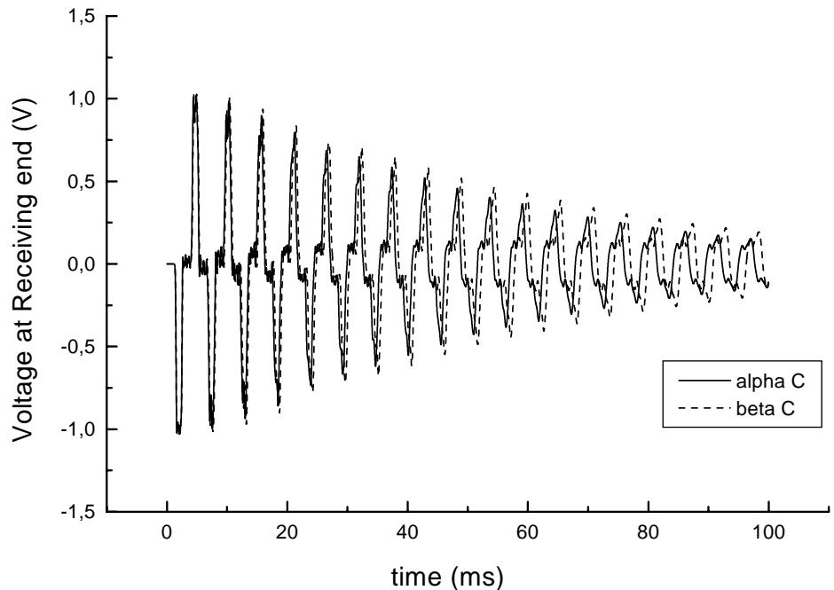  
Fig. 20. Step response for mode a and b for Quasi-modes model—non-transposed line—receiving end.

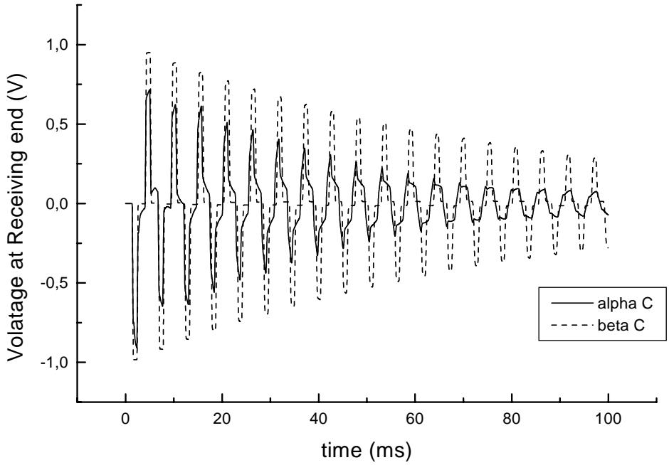  
Fig. 21. Step response for mode a and b for Semlyen model—non-transposed line—receiving end.

• generation voltage: 0.95 pu;   
• base power: 170 MVA;   
• X (generator 1 transformer): 0.3618 pu;   
• X/R: 11.4; X1/X0: 4.41;   
• pre-insertion resistor: 300 V.

The configuration of the simulated system is presented in Fig. 25.

The results for the transposed line should be similar for all models, while, for non-transposed line, as the mode behavior showed so many differences, they are not expected to

be so similar. In Figs. 26 and 27 the results for transposed and non-transposed lines are shown.

Note that for both lines there are differences between the models. Comparing the proposed model with Semlyen, the results in lower maximum values around 0.1 pu for the transposed line and 0.2 pu for the non-transposed line. For the latter, this is a notable difference that can affect an optimized line project and its costs.

The difference for the non-transposed line was expected from the mode analysis. Also, from the 0 mode response some discrepancies were expected for all lines.

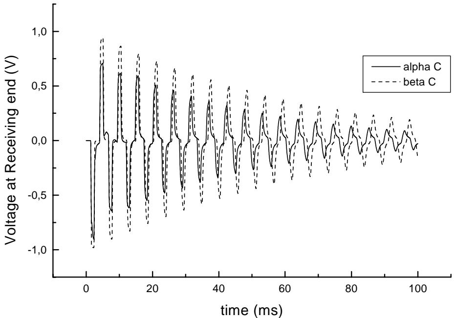  
Fig. 22. Step response for mode a and b for JMarti model—non-transposed line—receiving end.

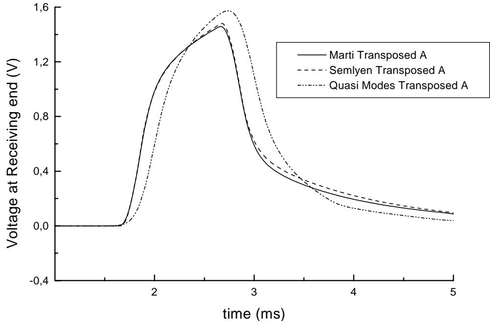  
Fig. 23. Step response for 0 mode—receiving end.

# 7.4. Worst case energization

From the results obtained from the statistical analysis, the worst case was reprocessed, both for transposed and for nontransposed lines, for all models.

The results are presented in Figs. 28 and 29 for the models for non-transposed line.

The wave forms are similar, but the proposed model has lower results for all lines.

# 8. Conclusions

This paper presents a new model to represent transmission lines including the frequency dependence of longitudinal parameters. The model uses exact modes, for ideally transposed lines, and quasi-modes for nontransposed lines.

The longitudinal impedance is represented in the mode domain through synthetic circuits, and the frequency

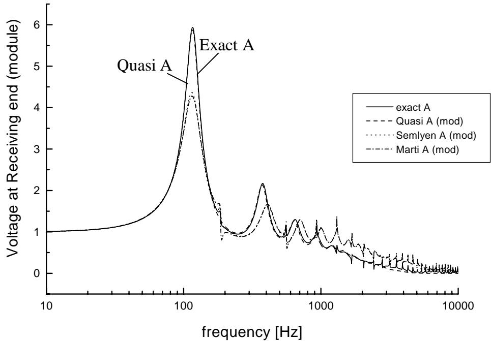  
Fig. 24. 0-Sequence—non-transposed line.

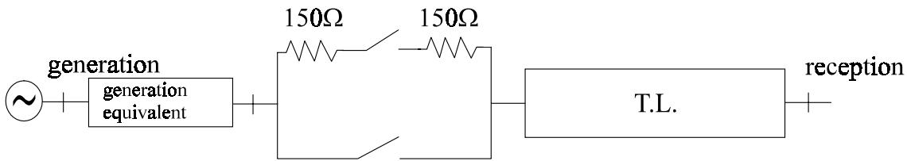  
Fig. 25. Studied system diagram.

dependence can be modeled with high accuracy. The line is represented through p-circuits, with one cascade of p-circuit for each mode.

For a single three-phase line only Clarke transformation is necessary to obtain quasi modes for a non-transposed line with a vertical symmetry plane or exact modes for ideally transposed lines, which do not have to respect this symmetry.

For double three-phase lines, taking advantage of the line geometry, a former transformation from phase to media/antimedia modes is made, uncoupling the phases in two “lines”, with a real, constant transformation matrix. For transposed circuits with a coupling among them, Clarke’s transformation is applied and again the matrix is real and constant, what means that it does not vary with frequency.

It is proposed to represent the transformation matrix in a time domain program like ATP using ideal transformers. As the matrix elements are real ones they can be represented by ideal transformers, with adequate ratio and polarity. It is shown that Clarke transformation can be used for the entire

frequency spectrum of a transient study as the unique transformation matrix for a single three-phase transmission line. This is an exact solution for transposed lines and a good approximation for non-transposed lines with a vertical symmetry plane.

A 440 kV three-phase transmission line illustrates the model and a comparison with two frequency dependent ATP-EMTP line models is made, the Semlyen and JMarti models. In typical large frequency spectrum transient conditions, for several examples, with non-transposed lines, the results obtained, with the proposed method and with the others methods, have shown important differences. For some examples analyzed in detail, the proposed method has shown some advantages.

For a typical frequency spectrum of switching transients, the quasi mode method is a better average which avoids the “amplification” of a particular frequency behavior, that can happen with a single frequency. Of course, for some particular conditions, a frequency analysis may be justified, but, anyhow, avoiding one “a priori” and somehow arbitrary choice of a particular frequency.

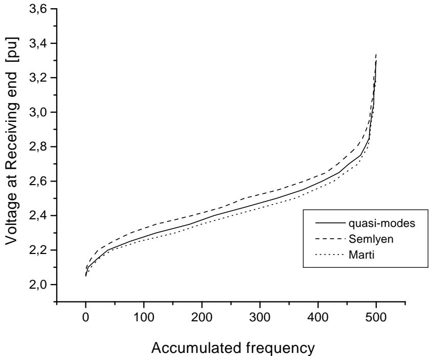  
Fig. 26. Statistical energization of transposed line—receiving end voltage—accumulated frequency—500 shots.

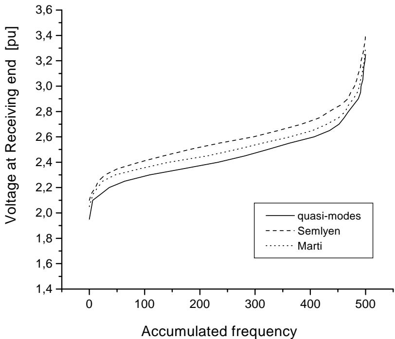  
Fig. 27. Statistical energization of non-transposed line—receiving end voltage—accumulated frequency—500 shots.

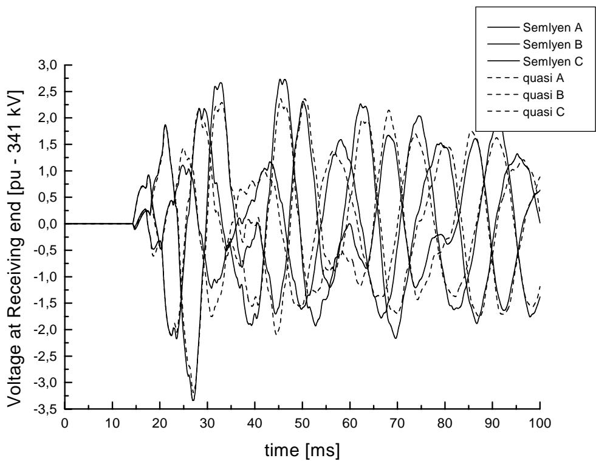  
Fig. 28. Worst case energization of non-transposed line—Semlyen and Quasi-modes model—receiving end voltage.

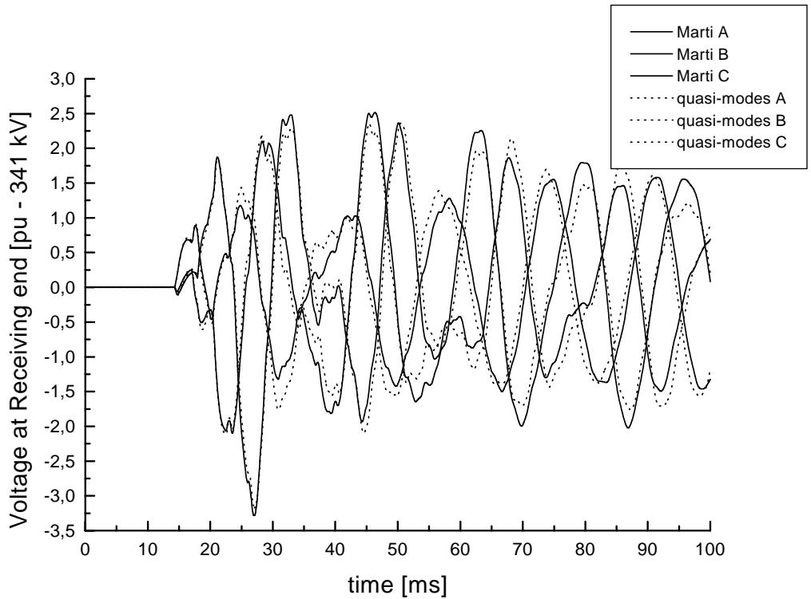  
Fig. 29. Worst case energization of non-transposed line JMarti and Quasi-modes model—receiving end voltage.

# Acknowledgements

The authors thank the support received from FAPESP-Fundac¸a˜o de Amparo a` Pesquisa do Estado de Sa˜o Paulo.

# References

[1] Leuven EMTP Centre. Alternative transients program rule book. July, 1987.   
[2] Semlyen A, Dabuleanu A. Fast and accurate switching transient calculations on transmission lines with ground return using recursive convolution. IEEE Trans PAS 1975;94(2):561–571.   
[3] Marti JR. Accurate modeling of frequency-dependent transmission lines in electromagnetic transients simulations. IEEE Trans PAS 1982;101(1):147–157.   
[4] Clarke E. Circuit analysis of AC power systems, 1. New York: Wiley, 1950.   
[5] Branda˜ O, Faria JA, Bricefio Mendez J. On the modal analysis of asymmetrical three phase transmission lines using standard transformation matrices, Paper 97WMIEEE-PES, IEEE Winter Meeting, 1997.

[6] Tavares MC, Pissolato J, Portela CM. New mode-domain representation of transmission line-Clarke transformation analysis. In: 1998 IEEE International Symposium on Circuits and Systems (ISCAS’ 98), pp. III 497–500, Monterey, California, USA, 1998.   
[7] Tavares MC, Pissolato J, Portela CM. Quasi-modes multiphase transmission line model. Electric Power Systems Research 1999;49:159– 167.   
[8] Portela CM, Tavares MC. Six phase transmission line-propogation characteristics and new three phase representation. IEEE Trans Power Delivery 1993;8(3):1470–1483.   
[9] Tavares MC, Pissolato J, Portela CM. Mode domain multiphase transmission line-use in transient studies, Paper PE-430-PWRD-0-04- 1988, IEEE Summer Meeting, San Diego, USA, July 1998.   
[10] Branda˜o Faria JA, Bricen˜o Mendez J. Modal analysis of untransposed bilateral three phase lines—a perturbation approach, Paper 96SM438-2PWRD, IEEE Summer Meeting, Denver, USA, July, 1996.   
[11] Portela CM, Tavares MC, Azeved RM. New line representation for transient studies—application to a six phase transmission line.   
[12] Semlyen A, Wilson RL, Gelopulos D. Paper discussion of component transformations—eigenvalue analysis succintly defines their relationships. IEEE Trans PAS 1982;101:405–406.