# Improving numerical efficiency of frequency dependent transmission line models for EMT simulations

H.M.Jeewantha De Silva * , Yi Zhang

RTDS Technologies Inc., Winnipeg, MB, Canada

# A R T I C L E I N F O

Keywords:

Frequency dependent transmission line model

Modal Truncation

Balanced Truncation

Underground cables

# A B S T R A C T

This paper compares two model order reduction techniques for frequency dependent transmission line models to enhance numerical performance for large cable or overhead line systems. The Modal Truncation and Balanced Truncation methods are applied to reduce the order of propagation matrix. The simulation examples involving underground cable systems are presented for comparison. Time domain simulation results with linear terminations are presented.

# 1. Introduction

THE frequency dependent transmission line models are widely used in electromagnetic transient studies. In these models, frequency dependent characteristics, such as propagation (A(ω)) or characteristic admittance (Yc(ω)) functions, are approximated using rational functions in the frequency domain [1]. Techniques such as Vector-Fitting can be used to obtain such approximations [2,1]. The order of the rational function is determined such that the approximation error is below a specified tolerance.

Typically, the A(ω) and Yc(ω) functions can be approximated using low order rational functions. The optimal order of approximation for a frequency-dependent function is influenced by its characteristics and desired accuracy. However, in some cases, the order of the A(ω) function can be significantly high, particularly for complex cable systems, which necessitates significant computational effort.

In popular frequency dependent wideband models, such as the Universal Line Model, the rational function approximation (curvefitting) is accomplished in two steps. First, the modal elements of the A (ω) matrix (Amodes(ω)) are independently curve-fitted using a common error tolerance [1]. Next, the elements of the phase A(ω) matrix are approximated with a common set of poles (i.e. poles of Amodes(ω) with corresponding modal delays). This process is iterated until the desired accuracy of the phase function is achieved. For some cable systems, since a common error tolerance is used to approximate Amodes(ω), some modes may be overfitted with a higher-order than necessary resulting in a higher-order phase A(ω) function.

A higher-order function requires greater computational resources

and memory in time domain simulations (i.e. to evaluate recursive convolution algorithm) and more critically, is prone to passivity violations arising from over-fitting [3–6].

Wide-area modeling of power systems is a growing trend in countries such as Australia, UK, and US. One major problem is that the detailed EMT wide-area modeling can significantly slow down simulations. The offshore wind farms connect to onshore grid or substation via underground cables. The multi-circuit cable systems in close proximity are modelled as mutually coupled cables in EMT simulations to accurately consider the mutual coupling between them.

The computational complexity associated with large transmission line systems, such as multi-circuit cable systems, can significantly degrade simulation performance. This is especially critical in real time simulations, which can also lead to time step overshoot.

This paper compares two methods to enhance the numerical efficiency of the transmission line models by reducing the order of the A(ω) function for multi-circuit cable systems. Model order reduction techniques (MOR) can be used to obtain reduced-order systems while ensuring a small approximation error. Some techniques offer additional benefits, such as numerical efficiency, the presence of a priori error bounds, and ensuring properties like stability and passivity. Modal order reduction is a well-studied subject and applied in many application areas, including modelling of semiconductor devices and MIMO macromodels of high-speed VLSI interconnects, etc. MOR methods can be classified into two main classes: Krylov-based methods and truncationbased methods [7–9]. The popular truncation-based methods are Modal Truncation (MT) and Balanced Truncation (BT).

The BT reduction was first introduced by Mullis and Roberts (1976)

[10] and later in the systems and control literature by Moore (1981) [11]. In 1984, the Hankel-norm reduction technique was introduced by Glover [12]. The BT method is based on the solution of the Lyapunov equation of the dynamic system. The solutions are the reachability and the observability gramians. The basis is that the states that are difficult to reach are simultaneously difficult to observe. Then, the reduced model is obtained by truncating the states that have this property.

In the MT method, the state-space system is truncated by eliminating non-dominant eigenvalues after reordering them based on the magnitude of the eigenvalues of the system matrix A.

The first method related to Krylov subspaces was introduced in 1990. Some of the popular Krylov-based methods include Asymptotic Waveform Evaluation, the Pad´e Via Lanczos Method (PVL), the Arnoldi Method, the Passive Reduced-order Interconnect Macromodeling Algorithm (PRIMA Method), and the Laguerre Method [7–9].

# 2. Rational function approximation of propagation function

In frequency dependent transmission line models, the $\mathbf { A } ( \omega )$ function is approximated (curve-fitted) in two stages. In the first stage, the modal delays of A(ω) matrix are computed. The unwound modes of A(ω) matrix (Amodes(ω)) are curve-fitted using rational functions, as shown in (1), employing techniques such as Vector Fitting [2]. The order of each mode is determined by the common modal error tolerance, ensuring sufficient accuracy for all modes.

$$
f _ {\text {m o d e l} j} (s) = \sum_ {k = 1} ^ {N _ {j}} \frac {\bar {c} _ {j k} e ^ {- s \tau_ {j}}}{s - a _ {j k}} \tag {1}
$$

Where, $f _ { m o d e l _ { j } } , N _ { j } , a _ { j k } , \overline { { \mathbf { c } } } _ { j k }$ and $\tau _ { j }$ are $j ^ { \mathrm { t h } }$ mode of $\mathbf { A } ( \mathfrak { o } )$ matrix, order of the function, pole, residue and modal delay respectively with $s = j \omega$ . The fitting error of Amodes(ω) is,

$$
\varepsilon_ {1} = \left\| f _ {\text {m o d e l} j} (s) - f _ {\text {m o d e l} j} (s) ^ {\text {a c t u a l}} \right\| \tag {2}
$$

In the second step, using modal delays $( \tau _ { j } ^ { \prime } s )$ and poles (aj’s), the elements of phase A(ω) matrix are approximated as shown in (3)

$$
f (s) _ {(p, q)} = \sum_ {j = 1} ^ {M} \sum_ {k = 1} ^ {N _ {j}} \frac {c _ {j k} e ^ {- s \tau_ {j}}}{s - a _ {j k}} \tag {3}
$$

Where, M is the number of modes. The fitting error of phase A(ω) matrix is

$$
\varepsilon = \left\| f (s) _ {(p, q)} - f (s) ^ {\text {a c t u a l}} \right\| \tag {4}
$$

If the fitting error of phase A(ω) matrix exceeds the maximum phase error specified $( \varepsilon _ { m a x } ) _ { \scriptscriptstyle m }$ , the first and second steps are repeated with a reduced modal error tolerance $\varepsilon _ { 1 } ~ = ~ ( \alpha \varepsilon _ { 1 } , ~ \alpha < 1 )$ . This process is continued iteratively until the phase error is within the acceptable limits (ε < εmax ). $( \varepsilon < \varepsilon _ { \mathrm { m a x } } )$

# 3. Model order reduction of propagation function

In general, A(ω) and Yc(ω) functions can be accurately represented with low order rational functions. However, in specific cases, particularly for multi-circuit underground cable systems, the order can become excessively high.

As discussed in section II, each Amodes(ω) function is fitted with a common fitting tolerance $( \varepsilon _ { 1 } ) .$ . It is possible that some of the modes are fitted with a higher order transfer function than normally required (over-fitting). Higher-order transfer functions can increase the computational burden associated with evaluating the recursive convolution algorithm and may potentially lead to passivity violations due to overfitting.

This paper discusses two methods to enhance the numerical efficiency of the transmission line models by reducing the order of A(ω) function.

# 3.1. Modal truncation (MT)

This is one of the oldest MOR techniques. In general, the MT is based on projecting the state space system on the subspace of the pencil λI − A for some subset of eigenvalues [7–9].

The reduced order system is obtained by eliminating the nondominant eigenvalues (eigenvalues with smallest real part). In case of rational functions expressed as residue pole form, for some small enough tolerance (tol), the reduced order system represents the condition,

$$
\frac {\left\| c _ {k} \right\|}{\left| a _ {k} \right|} > t o l \tag {5}
$$

Let’s assumed that the first ℓ terms $( l \le N )$ satisfy the above condition (i.e. the terms with small residue/pole ratios are removed) and hence the truncated transfer function is,

$$
f _ {\text {m o d e l} j} (s) = \sum_ {k = 1} ^ {l j} \frac {c _ {j k} e ^ {- s \tau_ {j}}}{s - a _ {j k}} \tag {6}
$$

For a complex pole pair, the condition is,

$$
\left| \frac {c _ {k}}{s _ {k} - a _ {k}} + \frac {c _ {k + 1}}{s _ {k} - a _ {k + 1}} \right| > t o l
$$

$$
S _ {k} = i m a g \left(a _ {k}\right)
$$

Once the rational function approximation is completed, the order of phase A(ω) function (see Eq. (3)) can be reduced directly by applying the MT technique. However, this does not give satisfactory results for the studied examples. Instead, the following procedure is applied to reduce the order after the curve-fitting.

(1) Compute residue/pole ratios of each mode (see Eq. (1)) and sort them in ascending order   
(2) remove corresponding small residue/pole ratio terms in each mode below a small tolerance (tol)   
(3) using the remaining modal poles, curve-fit the phase A(ω) matrix again and calculate the error (ε)   
(4) if the error is less than the desired tolerance (ε ), then iterate (1) to (3) with a reduced tolerance $( { \mathrm { t o l } } = k \times { \mathrm { t o l } } , k < 1 . 0 )$ .

# 3.2. Balanced truncation (BT)

The BT is one of the well-studied model reduction methods. The application of BT to frequency dependent transmission line modelling is novel. One advantage of the BT method is that the asymptotic stability of the reduced order system is guaranteed. Another advantage is the availability of a priori error bounds, which facilitates the determination of the appropriate order for the reduced-order model.

The application of BT method to a rational function is discussed in Appendix A. The state space form (A1a, A1b in Appendix A) of the Amodes(ω) function can be converted into a real block diagonal form using a block diagonal transformation matrix S [7–9].

$$
A = S ^ {- 1} A S \tag {7a}
$$

$$
B = S ^ {- 1} B \tag {7b}
$$

$$
C = C S \tag {7c}
$$

For a given tolerance (tol), the reduced order dynamic system (representing $\tilde { A } , \ \tilde { B } , \tilde { C }$ matrices) is computed by deleting small Hankel eigenvalues $( \sigma _ { 1 } < t o l )$ . Since $\widetilde { A }$ is a full real matrix, the poles of the reduced transfer function are found by calculating the eigenvalues of A matrix. Finally using the new set of poles of the Amodes(ω) function and the corresponding modal delays, the entries of phase A(ω) matrix are curve-

fitted (see section II). An iterative procedure is designed to gradually reduce the order until an acceptable level of accuracy is achieved.

Since Yc(ω) can be typically approximated with low order transfer function (typically <20 poles), it is not necessary to apply model reduction methods for Yc(ω) function.

# 4. Simulation example I

The order reduction techniques on transmission line models are demonstrated with an example case involving a double circuit 30 km 3- phase underground cable system (flat configuration) as shown in Fig. 1. The summary of the cable data can be found in Table 1. For both simulation examples, the per unit length transmission line parameters (e.g. series impedance and shunt admittance) are calculated based on [13] and [14]. The frequency dependency of soil parameters such as soil resistivity, soil permittivity is neglected. The direct numerical integration is used to compute earth return impedance [15].

As discussed in section II, Universal Line Model (ULM) first calculates and approximates Amodes(ω) function as an intermediate step [1]. For rational function approximation, the maximum order for Amodes(ω) or Yc(ω) is limited to 20 and the maximum fitting error for the phase A(ω) function is 0.5 %.

In ULM, the modes with close delays are [1] combined and hence effectively there are eight delay groups as shown in Table 2. The modes corresponding to 1,3,4,5,6 and 7 delay groups have reached or closed to the maximum order limit. Since the poles of Amodes(ω) function are used to approximate the phase elements, the order of A(ω) matrix is 128 (i.e. sum of modal orders).

# (a) Order reduction using MT method

The MT method is applied to reduce the complexity of the A(ω) matrix. Table 3 (second column) summarizes the order of each mode using MT method. The order of phase A(ω) matrix is reduced from 128 to 70. The number of convolutions to be evaluated numerically is reduced by $1 8 , 7 9 2 \left( = 5 8 \times N \times N , \right.$ where N = number of conductors, 18) in each time step of the time domain simulation. Fig. 2 shows the first column of the phase A(ω) function after and before MT method ensuring the accuracy of the curve-fitting. The maximum fitting error for the phase A(ω) matrix is 0.28 %, which is less than the maximum allowed (0.5 %).

# (b) Order reduction using BT method

The BT method is applied to achieve reduced order for each mode. The Hankel singular values for the PQ matrix are shown in the Fig. 3. The states corresponding to small Hankel singular values are neglected and Table 3 (third column) summarizes the reduced order of the modes. The order of phase A(ω) matrix becomes 77 (40 % less than the original order). Compared to the original solution, the number of convolutions to be evaluated numerically is reduced by 16,524 (= 51 × N × N) in each time step of the time domain simulation.

The Amodes(ω) functions after and before BT are shown in Fig. 4 and the reduced functions are in a close agreement with the original function. Using the poles and delays associated with the reduced order modes, the phase A(ω) function is approximated. Fig. 5 compares the magnitudes of the first column of the original and reduced phase A(ω) matrix. The maximum fitting error for the phase A(ω) matrix is 0.31 %,

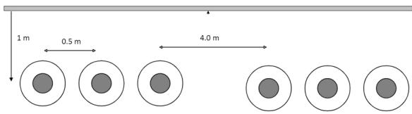  
Fig. 1. Underground cable system example I.

Table 1   
Cable data.   

<table><tr><td>Inner conductor radius</td><td>22 mm</td></tr><tr><td>Sheath inner radius</td><td>39.5 mm</td></tr><tr><td>Sheath outer radius</td><td>39.95 mm</td></tr><tr><td>Armour inner radius</td><td>43.45 mm</td></tr><tr><td>Armour outer radius</td><td>44.1 mm</td></tr><tr><td>Cable outer radius</td><td>49.3 mm</td></tr><tr><td>Resistivity of conductor</td><td>6.99e-8 Ohm.m</td></tr><tr><td>Resistivity of sheath</td><td>5.1667e-8 Ohm.m</td></tr><tr><td>Resistivity of armour</td><td>8.223e-8 Ohm.m</td></tr><tr><td>Relative permittivity of 1st insulation layer</td><td>3.156</td></tr><tr><td>Relative permittivity of 2nd insulation layer</td><td>2.3</td></tr><tr><td>Relative permittivity of 3rd insulation layer</td><td>2.3</td></tr><tr><td>Ground resistivity</td><td>100 Ohm.m</td></tr></table>

Table 2   
Time delay and Order of the modal function.   

<table><tr><td>Delay group</td><td>Time delay (ms)</td><td>Order of the transfer function</td></tr><tr><td>1</td><td>0.240345</td><td>18</td></tr><tr><td>2</td><td>0.296956</td><td>8</td></tr><tr><td>3</td><td>1.191263</td><td>18</td></tr><tr><td>4</td><td>1.194583</td><td>18</td></tr><tr><td>5</td><td>1.446850</td><td>20</td></tr><tr><td>6</td><td>1.458000</td><td>19</td></tr><tr><td>7</td><td>2.500259</td><td>20</td></tr><tr><td>8</td><td>4.304765</td><td>6</td></tr></table>

Table 3   
Order of the reduced modal function.   

<table><tr><td>Delay group</td><td>Order with MT</td><td>Order with BT</td></tr><tr><td>1</td><td>14</td><td>10</td></tr><tr><td>2</td><td>5</td><td>8</td></tr><tr><td>3</td><td>8</td><td>12</td></tr><tr><td>4</td><td>7</td><td>11</td></tr><tr><td>5</td><td>9</td><td>10</td></tr><tr><td>6</td><td>10</td><td>11</td></tr><tr><td>7</td><td>12</td><td>10</td></tr><tr><td>8</td><td>4</td><td>5</td></tr></table>

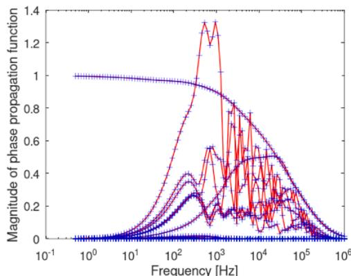  
Fig. 2. First column of the phase A(ω) function after and before MT (originalsolid line and the approximate ‘+’ line).

which is less than the maximum allowed (0.5 %).

Time domain simulation is carried out for the network shown in Fig. 6 using PSCAD/EMTDC commercial software. The conductor C1 is energized with step voltage and the other conductors are connected to a ground through resistances. The outer layers (Sheaths and Armour, not shown in the diagram) are connected to the ground through 1 mΩ resistance. The circuit breaker is open at 0.1 s. Fig. 7 shows the sending end current. The two methods are in close agreement with original

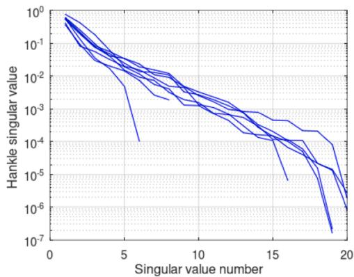  
Fig. 3. Hankel singular values for the modes.

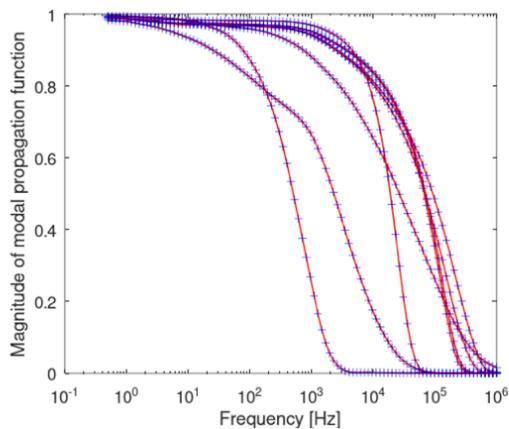  
Fig. 4. Modes of propagation matrix before and after BT reduction (original - solid line and the approximate ‘+’ sign).

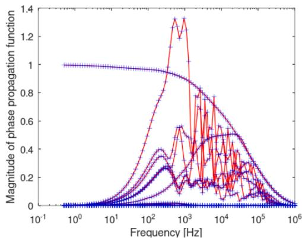  
Fig. 5. First column of the phase propagation function after and before BT (original- solid line and the approximate ‘+’ line).

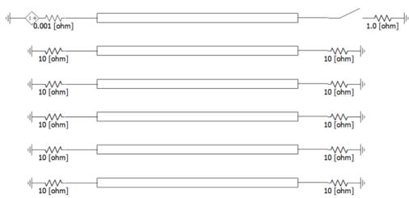  
Fig. 6. Cable network.

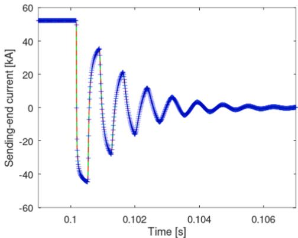  
Fig. 7. Sending-end current (solid green line-original, dotted red line-BT and blue ‘+’ line-MT).

solution, thereby confirming that both BT and MT methods give accurate results.

# 5. Simulation example II

A double circuit underground coaxial cable system (tre-foil configuration) is shown in Fig. 8 with cable data in Table 4.

In this example, there are seven delay groups as shown in Table 5. The maximum order for A(ω) function and Yc(ω) is limited to 20 and the maximum fitting error for the phase A(ω) function is allowed to 0.2 %. The order of phase A(ω) matrix is 105.

# (c) Order reduction using MT method

Using MT method, the transfer function can be reduced as shown in Table 6 (column 2). The order of the reduced A(ω) function is 76 (26.7 % less than the original order) for the maximum phase fitting error 0.2 %. The number of convolutions associated with A(ω) function is reduced from 15,120 (= 105 × N × N, N = 12) to 10,944 (=76×N × N) in each time step. Fig. 9 shows the first column of the phase A(ω) matrix after and before MT method conforming the accuracy after reduction.

# (d) Order reduction using BT method

A reduced order model is obtained through BT method. The Hankel singular values for the system are shown in Fig. 10.

After removing the Hankel singular values below a small tolerance, the order of each Amodes(ω) function is shown in Table 6 (column 3). Compared to the original, the order of the phase A(ω) function is decreased from 105 to 71. The computational effort to evaluate convolutions associated with A(ω) function is reduced from 15,120 (= 105 × N × N, N = 12) to 10,224 (= 71 × N × N) for each time step in the time domain simulation.

Fig. 11 shows the magnitude of Amodes(ω) function before and after model order reduction and Fig. 12 compares the magnitudes of the first column of the phase A(ω) matrix. Reduced functions are in a close agreement with the original functions. Fig. 13 shows the sending-end current for the same setup in example I. The time domain results from

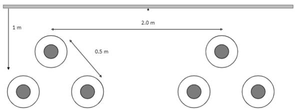  
Fig. 8. Underground coaxial cable example II.

Table 4 Cable data.   

<table><tr><td>Inner conductor radius</td><td>22 mm</td></tr><tr><td>Sheath inner radius</td><td>39.5 mm</td></tr><tr><td>Sheath outer radius</td><td>44 mm</td></tr><tr><td>Cable outer radius</td><td>47.5 mm</td></tr><tr><td>Resistivity of conductor</td><td>6.9944e-8 Ohm.m</td></tr><tr><td>Resistivity of sheath</td><td>5.4301e-8 Ohm.m</td></tr><tr><td>Capacitance insulation layer</td><td>0.3 uF/km</td></tr><tr><td>Relative permittivity of 2nd insulation layer</td><td>2.3</td></tr><tr><td>Ground resistivity</td><td>100 Ohm.m</td></tr></table>

Table 5 Order of the modes of propagation function.   

<table><tr><td>Delay group</td><td>Time delay (ms)</td><td>Order of the transfer function</td></tr><tr><td>1</td><td>0.178039</td><td>11</td></tr><tr><td>2</td><td>0.843530</td><td>20</td></tr><tr><td>3</td><td>0.846600</td><td>20</td></tr><tr><td>4</td><td>0.856592</td><td>15</td></tr><tr><td>5</td><td>0.858305</td><td>18</td></tr><tr><td>6</td><td>1.394449</td><td>13</td></tr><tr><td>7</td><td>2.793333</td><td>8</td></tr></table>

Table 6 Order of the modes of propagation function after br.   

<table><tr><td>Delay group</td><td>Order with MT</td><td>Order with BT</td></tr><tr><td>1</td><td>9</td><td>8</td></tr><tr><td>2</td><td>14</td><td>10</td></tr><tr><td>3</td><td>14</td><td>13</td></tr><tr><td>4</td><td>11</td><td>10</td></tr><tr><td>5</td><td>12</td><td>12</td></tr><tr><td>6</td><td>9</td><td>10</td></tr><tr><td>7</td><td>7</td><td>8</td></tr></table>

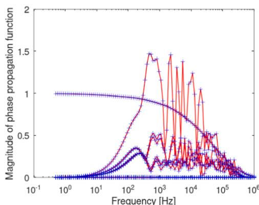  
Fig. 9. First column of the phase A(ω) function after and before MT (originalsolid line and the approximate ‘+’ line).

MT and BT methods are in a close agreement with the original solution.

# 6. Comparison between MT and BT methods

It is observed that both reduction methods successfully reduce the order for large cable systems with a higher order propagation function.

In a range of cases investigated (not presented in this paper), the BT method exhibited better performance (in terms of reduced order) compared to the MT method. Also, BT has other advantages such as preserving asymptotic stability.

However, in practical situations, BT method requires significant computation time compared to MT. For one iteration in example II, the

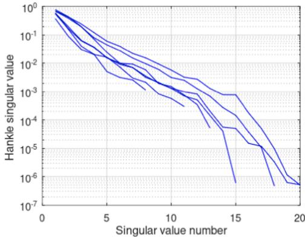  
Fig. 10. Hankel singular values for the modes.

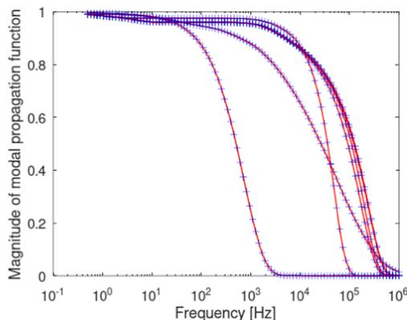  
Fig. 11. Modes of propagation matrix before and after reduction (original - solid line and the approximate ‘+’ sign).

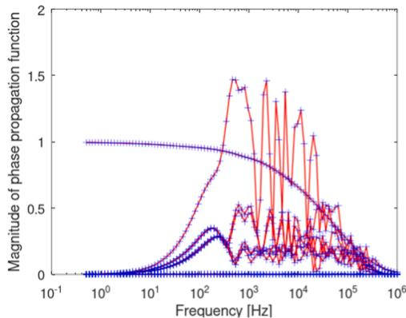  
Fig. 12. First column of the phase propagation function after and before BT (original- solid line and the approximate dotted line).

BT and MT methods require 2.64 s, 0.34 s respectively (2.5 GHz, 32 GB RAM laptop computer and using Matlab commercial software). Note that the model order reduction is performed only once at the beginning of the time domain simulation.

The BT method is a very complicated method (involves state space transformation, real matrix transformation, solving Lyapunov equations, gramian calculations) and requires many modifications to existing transmission line programs. In contrast, the MT method is easy and straightforward to implement and provides satisfactory results.

# 7. Conclusion

This paper demonstrates the application of BT and MT methods to

  
Fig. 13. Sending-end current (solid green line-original, dotted red line-BT and blue ‘+’ line-MT).

frequency dependent transmission line models, enhancing the efficiency of time-domain simulation. Both methods successfully reduced the order

of the propagation function while maintaining fitting accuracy. The reduced order model reduces the computational effort and hence leads to fast simulations.

The BT method requires complicated mathematical calculations and significant computational effort. MT method is easy to implement in existing transmission line programs and provide reasonable results.

# CRediT authorship contribution statement

H.M.Jeewantha De Silva: Funding acquisition, Investigation, Software, Project administration, Resources, Writing – original draft, Methodology, Conceptualization, Validation, Data curation. Yi Zhang: Supervision, Writing – review & editing.

# Declaration of competing interest

The authors declare that they have no known competing financial interests or personal relationships that could have appeared to influence the work reported in this paper.

# Appendix A

The rational function in (1) can be expressed into state space form as shown below.

$$
\dot {x} = A x + B u \tag {A1a}
$$

$$
y = C x \tag {A2b}
$$

Where, diagonal A matrix with the poles $\left( a _ { i } ^ { \prime } s \right)$ in diagonals and B is a vector of ones and C is a vector of residues. Where

$$
\boldsymbol {A} \in \mathbb {R} ^ {n, m}, \boldsymbol {B} \in \mathbb {R} ^ {n, m}, \boldsymbol {C} \in \mathbb {R} ^ {n, m} \tag {A3}
$$

The objective of the model order reduction is to find a reduced order of the transfer function (r < Nj) for each j, such that the approximation error || $y = \mathrm { y } _ { \mathrm { r e d u c e d } } | |$ is small.

It is assumed that the dynamic system (5a and 5b in section II) is asymptotically stable (the Vector-fitting algorithm enforces that all the poles of the system be located in the left-half plane; hence this condition is satisfied). The BT is related to the positive semi definite solutions of the Lyapunov equations,

$$
A P + P A ^ {T} = - B B ^ {T} \tag {A4a}
$$

$$
A ^ {T} Q + A Q = - C ^ {T} C \tag {A4b}
$$

Where, P and Q are controllability and observability Gramians. Using the Gramians of the Lyapunov equations, the Hankel eigenvalues can be computed as the square roots of the eigenvalues of the PQ matrix,

$$
\sigma_ {i} = \sqrt {\lambda_ {i}} (P Q) \tag {A5}
$$

The Hankel eigenvalues of the system is a measure of the significance of the state variables of the dynamic system. The Hankel eigenvalues are ordered in a decreasing magnitude. The reduced order system can be calculated by eliminating the weak states corresponding to small Hankel singular values [7–9].

Truncation procedure to eliminate small Hankel singular values

(1) The Cholesky factors R (P=RRT) and $\operatorname { L } \left( Q = \operatorname { L T L } \right)$ of the Gramians of the Lyapunov equations are calculated   
(2) Singular value decomposition is performed for the matrix LR

$$
L R = \left[ U _ {1}, U _ {2} \right] \left[ \begin{array}{l l} \Sigma_ {1} & 0 \\ 0 & \Sigma_ {2} \end{array} \right] \left[ \begin{array}{l} V _ {1} \\ V _ {2} \end{array} \right] \tag {A6}
$$

Where, the $\Sigma _ { 1 } = d i a g ( \sigma _ { 1 } , . . . , \sigma _ { l } ) , \Sigma _ { 2 } = d i a g ( \sigma _ { l + 1 } , . . . , \sigma _ { n } )$ and $U _ { 1 } , U _ { 2 } , V _ { 1 }$ and $V _ { 2 }$ are orthogonal matrices.

(3) The reduced order system can be calculated as

$$
\widetilde {A} = W ^ {T} A T
$$

$$
\widetilde {\boldsymbol {B}} = \boldsymbol {W} ^ {T} \boldsymbol {B}
$$

$$
\widetilde {C} = C T \tag {A7}
$$

Where, W and T are projection matrices

$$
W = L ^ {T} U _ {1} \Sigma^ {- 0. 5}
$$

$$
T = R V _ {1} \Sigma^ {- 0. 5} \tag {A8}
$$

The $H _ { i n f }$ norm error bound is $[ 7 , 8 ]$

$$
\| \widetilde {f} (s) - f (s) \| \leq 2 \left(\sigma_ {l + 1}, \dots , \sigma_ {n}\right) \tag {A9}
$$

# Data availability

No data was used for the research described in the article.

# References

[1] A. Morched, B. Gustavsen, M. Tartibi, A universal model for accurate calculation of electromagnetic transients on overhead lines and underground cables, IEEE Trans. Power Deliv. 14 (3) (1999) 1032–1038.   
[2] B. Gustavsen, A. Semlyen, Rational approximation of frequency domain responses by vector fitting, IEEE Trans. Power Deliv. 14 (3) (1999) 1052–1061. July.   
[3] B. De Schutter, Minimal state-space realization in linear system theory: an overview, in: Journal of Computational and Applied Mathematics - Special issue on numerical analysis in the 20th century 121, 2000. Sept. 1.   
[4] F. Ebert, T. Stykel, Rational interpolation, Minimal Realization and Model Reduction, DFG Research Center Matheon, 2010. Technical report t 371-2007.   
[5] B. Peter, F. Heike, Model order reduction: techniques and tools, Encycl. Syst. Control (2014). ISBN 978-1-4471-5102-9.   
[6] A.J. Laub, M.T. Heath, C.C. Paige, R.C. Ward, Computation of system balancing transformations and other applications of simultaneous diagonalization algorithms, IEEE Trans. Autom. Control (1987) 115–122. AC-32.

[7] F. Ebert, T. Stykel, Rational interpolation, Minimal Realization and Model Reduction, DFG Research Center Matheon, TU Berlin, 2007. Preprint 371.   
[8] S. Gugercin, A.C. Antoulas, A survey of model reduction by balanced truncation and some new results, Int. J. Control 77 (iss. 8) (2004) 748–766.   
[9] A. Ramirez, Vector fitting-based calculation of frequency-dependent network equivalents by frequency partitioning and model-order reduction, IEEE Trans. Power Deliv. 24 (1) (2009) 410–415. Jan.   
[10] C.T. Mullis, R.A. Roberts, Synthesis of minimum round off noise fixed point digital filters, IEEE Trans. Circuits Syst. CAS-23 (1976) 551–562. Sep.   
[11] B. Moore, Principal component analysis in linear systems: controllability, observability, and model reduction, IEEE Trans. Autom. Contr. AC-26 (1) (1981) 17–32. Feb.   
[12] K. Glover, All optimal Hankel-norm approximations of linear multivariable systems and their L-error bounds, Int. J. Control 39 (6) (1984) 1115–1193. Jun.   
[13] M. Wedepohl, D.J. Wilcox, Transient Analysis of Underground Power-Transmission Systems-System-Model and Wave-Propagation Characteristics, 120, Proc. Of Institute of Electrical Engineers, 1973, pp. 253–260, feb.   
[14] L.M. Wedepohl, D.J. Wilcox, Transient analysis of Underground power Transmission systems, in: Proc. IEE 120, 1973. February.   
[15] G.K. Papagiannis, D.A. Tsiamitros, D.P. Labridis, P.S. Dokopoulos, Direct numerical evaluation of earth return path impedances of underground cables, IEE Proc. - Gener. Transm. Distrib. 152 (2) (2005) 261–266. March.