# Modeling a voltage source converter assisted resonant current DC breaker for real time studies

Seyed Sattar Mirhosseinia,b , Siyuan Liua,c , Jose Chavez Muroa , Zhou Liud , Sadegh Jamalib , Marjan Popova,⁎

a Delft University of Technology, Faculty of EEMCS, Delft, the Netherlands   
b Iran University of Science and Technology, School of Electrical Engineering, Tehran, Iran   
c Xi’an Jiaotong University, Department of Electrical Engineering, State Key Laboratory of Electrical Insulation and Power Equipment, Xi’an, China   
d Aalborg University, Department of Energy Technology, Aalborg, Denmark

# A R T I C L E I N F O

Keywords:

VARC DC circuit breaker

MTDC grid

Circuit breaker performance

RTDS model

# A B S T R A C T

In order to test protection performance of future multi-terminal HVDC grids where DC circuit breakers (DC CBs) play an important role, a DC CB model in real time test environment should be developed. It is well known that a DC CB needs to interrupt DC faults very quickly in order to avoid converter damages and to ensure security of supply. The total current interruption time consists of a fault detection time, which is needed for the DC protection to provide a trip command to the DC CB, and a DC CB interruption time. Thus, it is necessary to demonstrate the performance of associated protective devices through real time simulations, before these devices can be implemented and commissioned in practice. This paper presents a detailed modeling of the voltage source converter assisted resonant current DC circuit breaker (VARC DC CB) in real time simulation environment based on RTDS. The proposed model provides sufficient representation of the circuit breaker for system level studies. External current-voltage characteristics of the proposed VARC DC CB models replicate the ones of the device in the real world. The proposed model of the breaker is tested in a simple test circuit including a DC voltage source and a T-scheme HVDC cable. Additionally, a case study has been presented by making use of a protection algorithm in a multi-terminal HVDC grid with frequency dependent parameters of the HVDC cables to show both protection performance and current interruption.

# 1. Introduction

Voltage source converter based Multi-Terminal HVDC (MTDC) grid is emerging as a prospective technology for interconnecting renewable energy resources especially offshore wind farms. It provides advantages such as independent control of active and reactive power, interconnection of weak AC systems, and it also improves the flexibility, security and reliability of power transmission [1]. However, there are several technical challenges for the development of the MTDC grid. The protection system, which is responsible for the discrimination and the isolation of faulted line/segment, is one of the main challenges. Regarding the protection system, one of the barriers is lack of reliable, fast, low loss and cost effective HVDC circuit breakers (DC CBs) [2].

Since there is no natural current zero in the DC current, the development of DC CBs is different from that of AC circuit breakers. Based on the technology deployed, the DC CBs can be classified as: (1) Mechanical DC CBs including active [3,4] and passive [5] circuit

breakers, (2) Hybrid DC CBs [6,7] and (3) Solid State DC CBs [8,9].

Mechanical HVDC CBs use an interrupter to interrupt the current at artificial current zero created by a current injection circuit. Hybrid HVDC CBs integrate controllable solid-state semiconductor-based switches with mechanical switches and disconnectors. Solid State HVDC CBs interrupt the fault current by means of controllable solidstate semiconductor-based switches. Compared to the solid state DC CBs, an advantage of mechanical DC CBs is lower cost and conduction losses. However, the long operation time of spring based actuators cannot meet the requirements of fast fault interruption in MTDC grids. Recently, the development of ultra-fast actuators based on electromagnetic repulsion mechanisms has made mechanical DC CBs capable of clearing fault current within a few milliseconds [10,11]. The hybrid DC CBs make a tradeoff between the advantages of fast fault interruption and low conduction losses. However, during the fault current interruption, the semiconductor devices need to withstand a very high voltage, which imply utilisation of expensive components for hybrid DC

CBs. The newly emerging VARC DC CB proposed in [12,13], is a promising solution that make use of an ultra-fast actuator together with a voltage source converter (VSC) and a resonant circuit. It combines the advantages of mechanical and Hybrid DC CBs to achieve less operation time, low conduction loss and cost-effectiveness.

Some mechanical DC CB models have been proposed in [14]. The complexity level of these models changes based on their applications. More simplistic models, such as the model presented in [15,16], are conceived to be used for system level studies. The models proposed in [17,18] demonstrate the physical performance, the interactions and stresses between internal components.

An EMTP (electromagnetic transient program) based mechanical DC CB model for transmission applications is presented in [19,20]. The model includes the main hardware components (ideal switches with delay, resonant circuit, surge arrester) and the control logic. It also interlocks between sub-components, and implements self-protection feature in case of failures of the DC protection scheme. The model is proved to be robust for a large range of operating conditions including DC fault clearing, reclosing after fault clearance, reclosing into DC fault and self-protection.

All the aforementioned models are realized using different software packages that do not operate in real time. A system level real time model of an active current injection mechanical DC CB is presented in [21]. The model is realized using RTDS real time simulation environment, and it is verified by comparative studies with the PSCAD model. The application of the model is demonstrated for DC fault interruption in an MTDC grid. Compared to the mechanical DC CB, the VARC DC CB includes a VSC, which implies different structure, operation principles and control logic. These features necessitate an individual real time model of VARC DC CB for real time system level studies.

In an MTDC grid, DC CBs must interrupt DC faults very quickly in order to avoid converter damages and to ensure security of supply. The total current interruption time consists of a fault detection time, a time needed for the DC protection to provide trip command, and DC CB interruption time. Thus, it is necessary to demonstrate the system performance with the associated protective devices before these devices can be implemented and commissioned in practice. Due to the needs for high voltage and current, it is not possible to use DC CB as a real equipment in MTDC grid studies. Therefore, the solution to test the performance of features such as protection schemes and relays in MTDC grids where DC CBs play an important role [19], is to use a real time model of a DC CB. This paper presents a robust system level detailed model for the VARC DC CB based on RTDS. The proposed model is demonstrated in a simple test circuit, and in an MTDC grid modeled in RTDS environment. The paper is organized as follows: The structure and operation principles of the VARC DC CB are described in Section 2. The implementation of the model in RTDS environment is explained in Section 3. The model verification is presented in Section 4. Section 5 deals with the model application and finally, the model limitations and the conclusions are presented in Sections 6 and 7, respectively.

# 2. VARC DC CB structure and operation principles

The general structure of the VARC DC CB is depicted in Fig. 1. The breaker contains a vacuum interrupter denoted as MB in the main branch. The auxiliary branch includes a resonant LC circuit excited by an H-bridge VSC, and a surge arrester (SA). The SA determines the maximum voltage across MB during current interrupting process. In order to force the line current down to zero, the SA clamping voltage is typically 1.5–1.6 times the nominal peak voltage of DC system. A residual circuit breaker (RCB), is connected in series with the main and auxiliary branches. It operates only at low or zero current, and it is deployed for physical separation and to eliminate the voltage across the resonant circuit and the SA. A current limiting inductor LDC, which determines the rate of rise of the fault current is connected in series with the breaker.

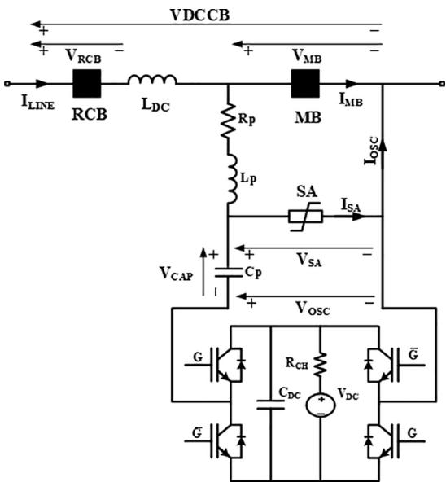  
Fig. 1. The structure of VARC DC CB.

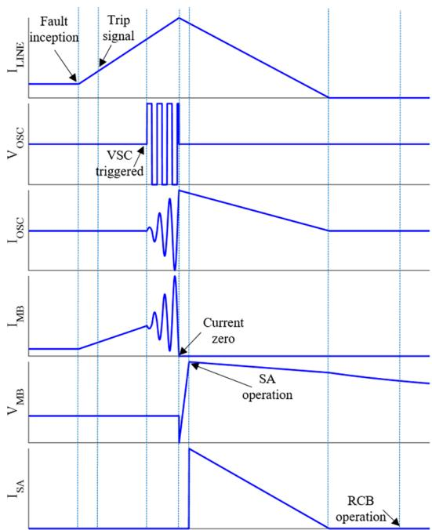  
Fig. 2. The operation process of VARC DC CB.

The operation process of VARC DC CB is illustrated in Fig. 2 using typical waveforms. After receiving a trip signal from the protection system, successive changes take place on the voltage polarity at the output of the VSC. Besides, the amplitude of the oscillating current, I , increases and passes through the resonant circuit and the MB. Shortly after this, I reaches the magnitude of the line/fault current, and then creates a current zero inside the MB. Thereafter, the MB opens and the fault current is commutated into the SA, where it is suppressed. During a successful interruption, the breaker and the faulted line are fully disconnected by means of the RCB.

# 3. Modelling and operational principles of VARC DC CB

The VARC DC CB RTDS model is composed of the following main parts:

• Electrical circuit of a VARC DC CB

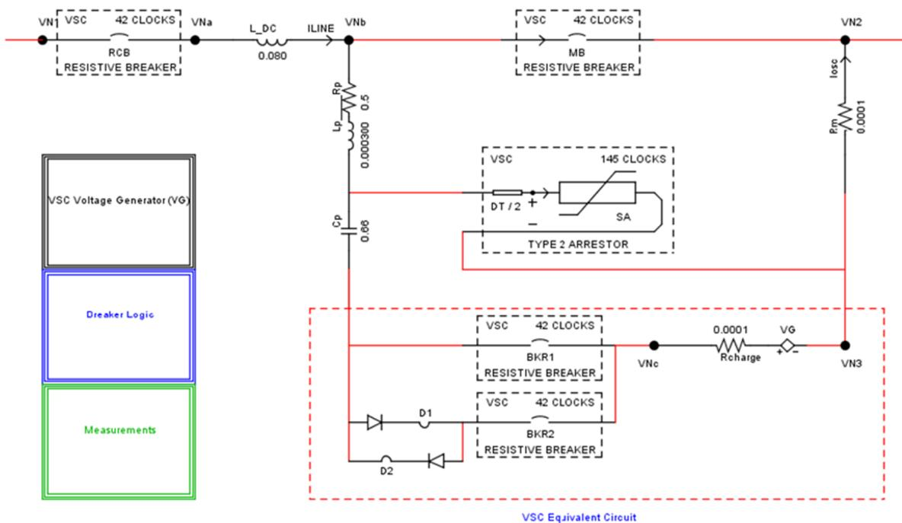  
Fig. 3 shows the electrical circuit of the RTDS model of VARC DC CB with the associated control logic, VSC voltage generator and measurement blocks. A brief description of the model is given in the subsequent parts.

Fig. 3. The VARC DC CB model in RTDS small time step environment.

• VSC voltage generator   
• Control logic of VARC DC CB

A. Electrical Circuit of VARC DC CB RTDS Model

As shown in Fig. 3, the VARC DC CB consists of a vacuum interrupter MB, a residual circuit breaker RCB, a resonance circuit, a SA and a current limiting reactor L_DC. Both MB and RCB have open and close resistances of $1 0 ^ { \bar { 8 } } \Omega$ and 1 mΩ, respectively. All the electrical elements are identical to Fig. 1 except the VSC equivalent circuit, which is considered to model the H-bridge VSC. This is due to the limitation of RTDS in modelling IGBTs.

B. VSC Voltage Generator

In EMT software packages such as PSCAD, the switch is modelled as an ideal resistance switch, which changes the admittance matrix whenever the switch state changes. The response of such a model to changing signals is smooth without any time delays. However, there are some limitations or assumptions for the method used in RTDS small time step environment. As shown in Fig. 4, when the switch is in $" 0 \boldsymbol { \mathrm { n } } ^ { \prime \prime }$ state, it is represented as an inductor (L) branch and when it is in “off” state, it is represented as a series resistor-capacitor (RC) branch. This technique allows freely configurable circuit topology in small time step sub-network blocks, and the admittance matrix of the whole power circuit does not need to be recalculated in order to obtain a nodal solution. The value of R in the RC branch should be carefully selected so that when the RC branch is connected in series with the L branch, there will be a series RLC branch with a user-defined damping factor of δ. The parameters R, C and L are computed by RTDS based on user-defined rated voltage, current and damping factor δ for the switch. In order to minimize the energy loss during transition between “off” and $" 0 \boldsymbol { \mathrm { n } } ^ { \prime \prime }$ states, for the computation of R, C and L a constraint is also applied, so that the energy in the capacitor (CV2 /2) should be equal to the energy

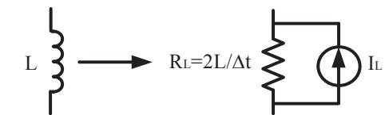  
a) On state

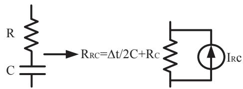  
b) Off state   
Fig. 4. Switch model in small time step in RTDS.

in the inductor $( \mathrm { L I } ^ { 2 } / 2 )$ . This method does not allow using small values for R, C and L at the same time. In other words, a small value of L corresponds to a high value of C and vice versa.

Based on the above discussion, when the IGBT is in “on” state, it behaves as a small inductance, and when it is in “off” state, acts as a small capacitance in series with a resistance. These L and RC branches affect the resonance circuit. In order to avoid this effect, the VSC is modelled using a voltage source branch instead of IGBTs. According to Fig. 5, the VSC Voltage Generator block is used to generate a square voltage VG at the output of the VSC. While the deblock signal OscEn is high, the output voltage is generated by comparing the oscillating current $\mathrm { I _ { O S C } }$ with zero. In order to attain the minimum possible time step, this block is implemented using small time step elements.

C. Control logic of VARC DC CB RTDS Model

Based on the requirements of the switching sequence, the control logic of the DC CB is implemented in RTDS as shown in Fig. 6. The implemented logic includes fault inception logic FAULT and a trip signal generation logic TRIP LOGIC. The SR flip-flop blocks are applied to simulate the open/close status of the breakers and VSC output deblock signal OscEn. The fault is simulated by an ideal switch BKFAULT

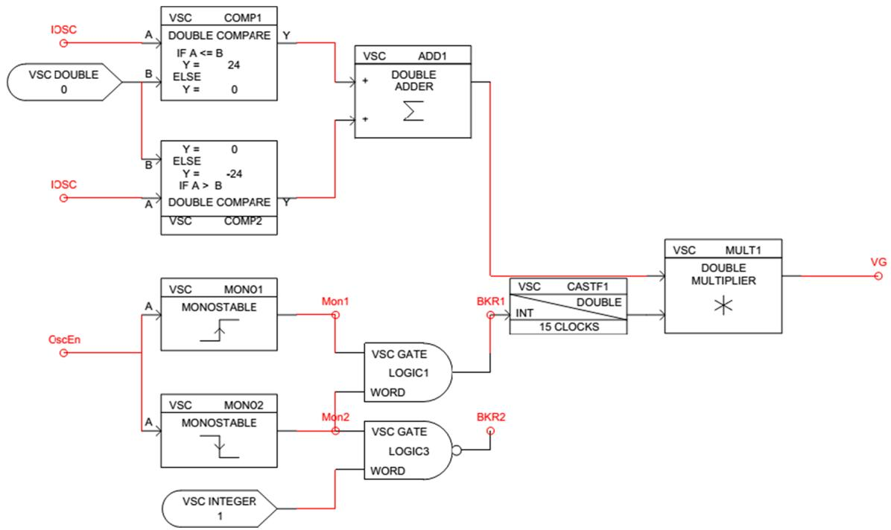  
Fig. 5. VSC Voltage Generator.

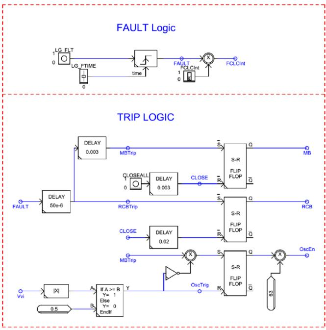  
Fig. 6. RTDS control logic of VARC DC CB.

connected to ground in the electrical circuit. During normal conditions, the breaker resistance is ${ 1 0 } ^ { 9 }$ Ω, whilst during a fault, is equal to the fault resistance. The fault duration can also be controlled by this switch. After starting the simulation using RTDS RUNTIME page, the vacuum interrupter MB and the residual circuit breaker switch RCB are closed by CLOSEALL push button and a load current flows through the system. In the next step, the fault is incepted by using an LG_FLT push button with a specified duration determined by LG_FTIME. After the fault inception, trip commands MB and RCB are sent to their corresponding breakers, and VSC output deblock signal OscEn is sent to VSC Voltage Generator block. It is also possible to simulate load current or fault current interruption by using FCLCInt switch. When a load current interruption is simulated, there will be no fault, and trip commands are just sent to the MB and RCB to interrupt the load current.

# 4. Demonstration of the RTDS model

In order to validate the proposed RTDS model of VARC DC CB, the real time simulation results are plotted versus scaled version of the PSCAD model of VARC DC CB prototype used in [22]. The PSCAD model in [22] has been confirmed by comparing simulation results with the experimental results performed on a VARC DC CB prototype with a designed current interruption capability of 10 kA constructed by SCi-Break for testing within the PROMOTioN EU-project. The tests have been carried out at DNV GL KEMA laboratories. The RTDS model is validated using a simple test circuit consist of a constant DC voltage source and T-line model of HVDC cable for forward and reverse fault

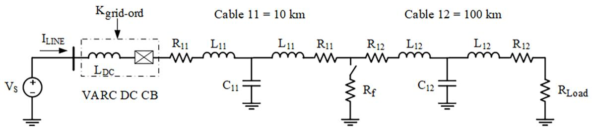  
Fig. 7. DC CB test circuit.

Table 1 DC cable data [21].   

<table><tr><td>DC cable data</td><td>R [Ω/km]</td><td>L [mH/km]</td><td>C [uF/km]</td></tr><tr><td>DC cable ± 400 kV</td><td>0.0095</td><td>2.1120</td><td>0.1906</td></tr><tr><td>DC cable ± 200 kV</td><td>0.0095</td><td>2.1110</td><td>0.2104</td></tr></table>

Table 2 VARC DC CB ratings.   

<table><tr><td>Parameter</td><td>Value</td></tr><tr><td>Rated voltage</td><td>320 kV</td></tr><tr><td>Rated continuous current</td><td>2 kA</td></tr><tr><td>Rated interrupting current</td><td>16 kA</td></tr></table>

Table 3 VARC DC CB parameters in PSCAD and RTDS models.   

<table><tr><td>Parameter</td><td>PSCAD</td><td>RTDS</td></tr><tr><td>SA clamping voltage</td><td>480 kV</td><td>480 kV</td></tr><tr><td>NsaAct (Number of SA stacks)</td><td>1</td><td>NA</td></tr><tr><td>Lp (Resonance branch inductance)</td><td>380 uH</td><td>300 uH</td></tr><tr><td>Cp (Resonant branch capacitance)</td><td>660 nF</td><td>660 nF</td></tr><tr><td>Rp (Resonant branch resistance)</td><td>500 mΩ</td><td>500 mΩ</td></tr><tr><td>RCH (DC-link charging resistor)</td><td>72 kΩ</td><td>NA</td></tr><tr><td>VDC (DC-link voltage)</td><td>24 kV</td><td>24 kV</td></tr><tr><td>CDC (DC-link capacitance)</td><td>1 mF</td><td>NA</td></tr><tr><td>tAux (Actuation time of residual breaker, both open and close)</td><td>20 ms</td><td>20 ms</td></tr><tr><td>tMB (Actuation time of main breaker, both open and close)</td><td>3 ms</td><td>3 ms</td></tr><tr><td>LDC (Current limiting reactor)</td><td>80 mH</td><td>80 mH</td></tr><tr><td>Simulation time step</td><td>1 us</td><td>1.75, 14 us</td></tr></table>

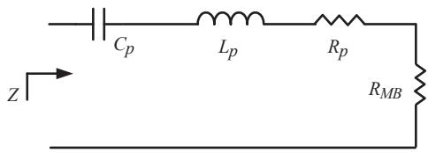  
(a)

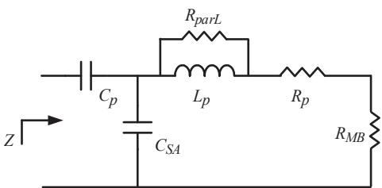  
(b)   
Fig. 8. Resonance branch seen from output of the VSC (a) PSCAD model, (b) RTDS model.

current interruption, as well as load current interruption.

# A. Test circuit

Fig. 7 shows the simulation test circuit. The cables are modelled using simple T-line model in order to avoid the complexity of modelling the cables. Reference [21] provides T-model data for ± 200 kV and ± 400 kV cable, which are repeated here in Table 1. It is seen that there is not much difference between ± 200 kV and ± 400 kV cables. Therefore, the ± 400 kV cable data have been selected for the 320 kV cable used in the test circuit.

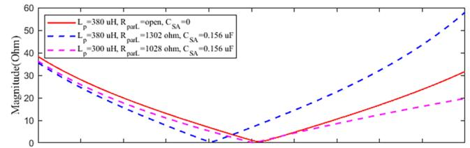

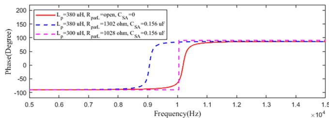  
Fig. 9. The equivalent impedance of the resonance branch for PSCAD (solid line) and RTDS (dashed lines) models.

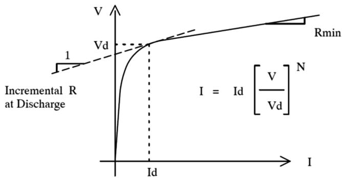  
Fig. 10. Typical V-I characteristic of the surge arrester in RTDS.

Table 4 VARC DC CB rated current interruption simulation conditions.   

<table><tr><td>Parameter</td><td>Value</td></tr><tr><td>Fault resistance</td><td>0.1 Ω</td></tr><tr><td>Fault inception time</td><td>0.1 s</td></tr><tr><td>Trip time</td><td>0.103 s</td></tr><tr><td>Current limiting reactor</td><td>80 mH</td></tr></table>

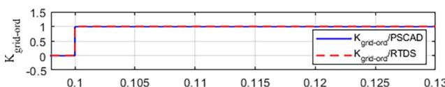

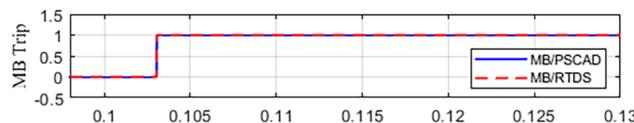

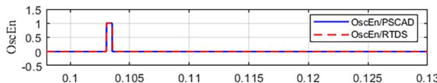

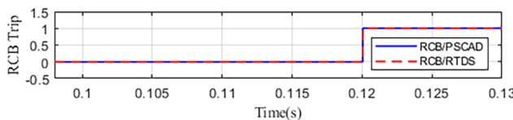  
Fig. 11. Logic commands of VARC DC CB in RTDS and PSCAD models – fault current interruption.

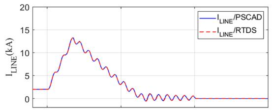

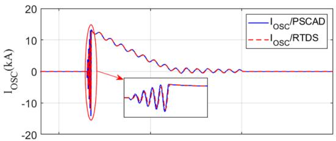

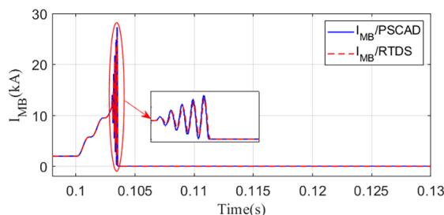

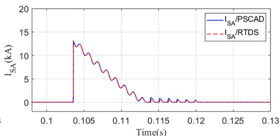  
Fig. 12. VARC DC CB currents in RTDS and PSCAD models – fault current interruption.

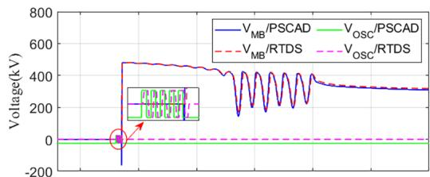

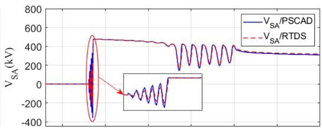

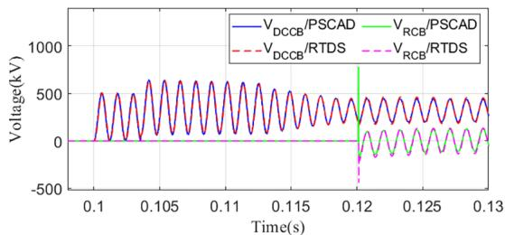

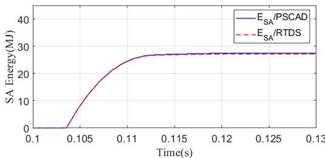  
Fig. 13. VARC DC CB voltages in RTDS and PSCAD models – fault current interruption.

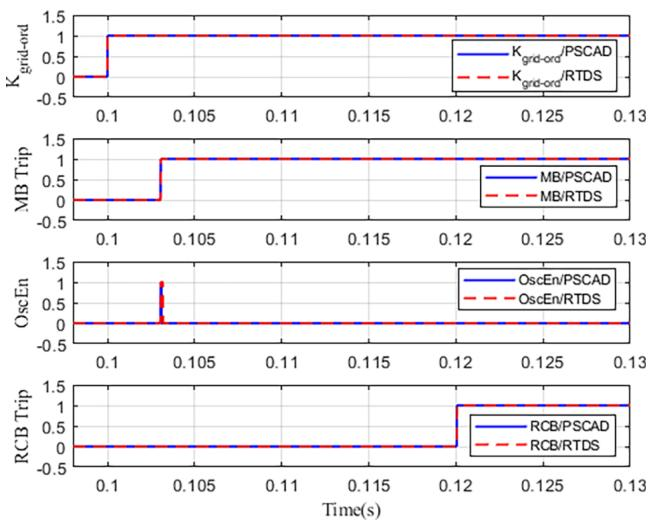  
Fig. 14. Logic commands of VARC DC CB in RTDS and PSCAD models – load current interruption.

Note that the values of capacitors $\mathrm { C } _ { 1 1 } \& \ \mathrm { C } _ { 1 2 }$ are two times the capacitor value in Table $^ { 1 , }$ because the data are for the equivalent capacitor between the positive and negative poles but there is only one pole in this study. It should also be noted that R and L of the line are halved. Hence, the parameters of cable11 with a length of 10 km are

$\mathrm { R _ { 1 1 } } = 0 . 0 4 7 5 \Omega , \mathrm { L _ { 1 1 } } = 1 0 . 5 6$ mH and $\mathrm { C } _ { 1 1 } = 3 . 8 1 2 \ : \mathrm { u F } ,$ , and for cable12 with a length of 100 km are $\begin{array} { r } { \mathrm { R } _ { 1 2 } = 0 . 4 7 5 \Omega . } \end{array}$ , $\mathrm { L } _ { 1 2 } = 1 0 5 . 6$ mH and $\mathrm { C _ { 1 2 } } = 3 8 . 1 2$ uF.

The breaker ratings and its parameters in PSCAD and RTDS models are given in Table 2 and Table 3, respectively.

The resonance branch inductance is 380 uH in the PSCAD model while it is 300 uH in the RTDS model. In order to solve the network equations, RTDS modifies the conductance matrix of the simulated circuit by automatically adding a resistor parallel to $\mathrm { L _ { p } \ ( R _ { p a r L } ) }$ and a capacitor parallel to the surge arrester $\left( \mathsf { C } _ { \mathsf { S A } } \right)$ . The values of these elements depend on the values of the element to which they are paralleled. These elements are not shown in the circuit diagram and are entered in the conductance matrix during compiling of the circuit by RTDS. Fig. 8 shows the resonance branch seen from the output of the VSC for both the PSCAD and the RTDS model. Another difference is that SA branch in RTDS is automatically provided with a snubber capacitance. This additional components make difference in the resonance circuit structure in RTDS. The harmonic impedances of the branches for the PSCAD and the RTDS model are shown in Fig. 9. When $\mathrm { L } _ { \mathrm { p } }$ is 380 uH in PSCAD model, the resonance frequency is around 10 kHz. However, when $\mathrm { L } _ { \mathrm { p } }$ is 380 uH in RTDS model, the resonance frequency is around 9 kHz. As shown, to modify the effect of the capacitor parallel to the SA and the resistor parallel to $\mathrm { L } _ { \mathrm { p } }$ on the resonance frequency in RTDS model, the value of $\mathrm { L } _ { \mathrm { p } }$ should be changed from 380 uH to 300 uH.

RTDS makes use of the following equation-based V-I characteristics for SAs:

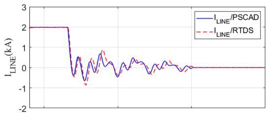

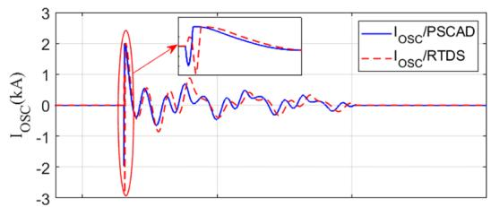

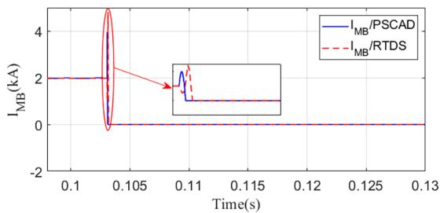

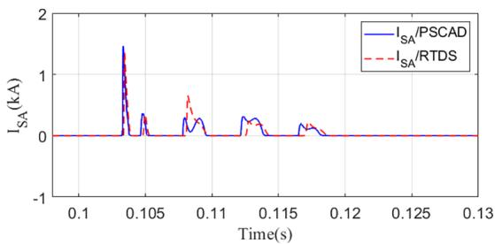  
Fig. 15. VARC DC CB currents in RTDS and PSCAD models – load current interruption.

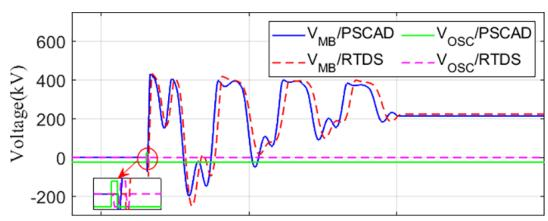

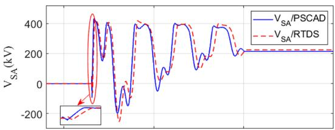

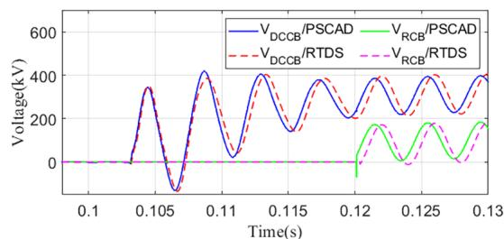

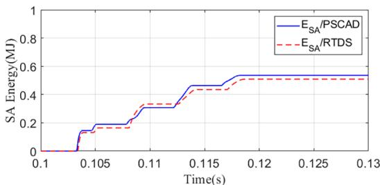  
Fig. 16. VARC DC CB voltage in RTDS and PSCAD models – load current interruption.

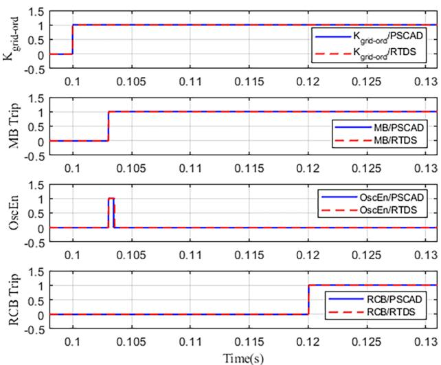  
Fig. 17. Logic commands of VARC DC CB in RTDS and PSCAD models – reverse fault current interruption.

$$
I = I _ {d} \left(\frac {V}{V _ {d}}\right) ^ {N} \tag {1}
$$

where $\mathrm { I _ { d } }$ and $\mathrm { V _ { d } }$ are the current and the clamping voltage, and N is an integer constant. Fig. 10 shows the typical characteristics of the SA. In

order to obtain a similar V-I characteristics for the SAs in both the RTDS and the PSCAD models, the PSCAD SA characteristic is fitted to the RTDS SA characteristic using Matlab fitting toolbox. The fitted parameters are N = 23, $\mathrm { V _ { d } } = 4 8 0 \mathrm { k V }$ and $\mathrm { I _ { d } } = 1 6 ~ \mathrm { k A }$ .

# B. Interrupting Fault Current

This simulation case demonstrates the DC CB performance when interrupting a fault current of 13.5 kA. The simulation conditions are shown in Table 4 and the RTDS simulations are verified by PSCAD simulations.

Fig. 11 through 13 show a comparison of this case with the one presented in PSCAD. The logic commands, the currents, the voltages and the dissipated energy in the SA simulated in RTDS are compared by those simulated in PSCAD. It can be seen that the simulation results performed in RTDS are in good agreement with those performed in PSCAD.

Fig. 11 shows logic commands of VARC DC CB. The Kgrid-ord is the grid trip signal. A logic “1″ means that the protection system detects a fault. The MB and RCB are the status signals of the vacuum interrupter and the residual breaker, respectively. A logic $^ { \mathfrak { s } } \mathbf { 1 } ^ { \mathfrak { p } }$ means the switch is open. The OscEn is deblock signal of VSC voltage generator. A logic “1” means the VSC is connected to the rest of the circuit and produces a voltage at its output. When the logic is $" 0 ^ { \dag }$ , the VSC is isolated from the circuit and its output voltage is zero. It is seen that the signals in both RTDS and PSCAD are almost coinciding with each other. In fact, there is

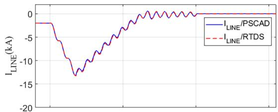

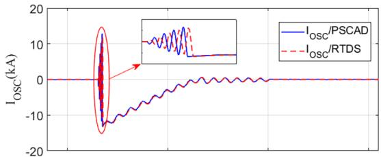

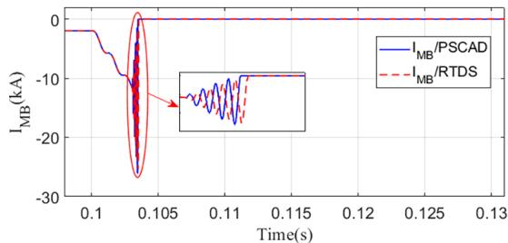

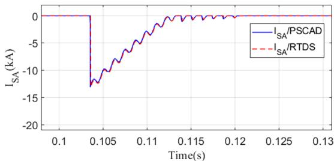  
Fig. 18. VARC DC CB currents in RTDS and PSCAD models – reverse fault current interruption.

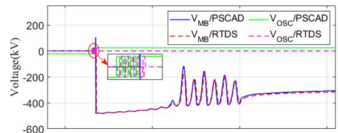

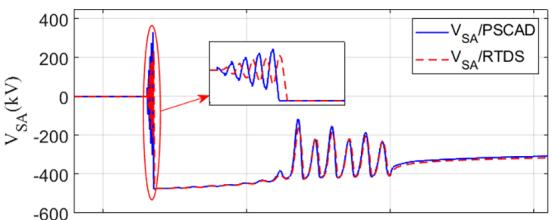

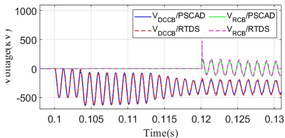

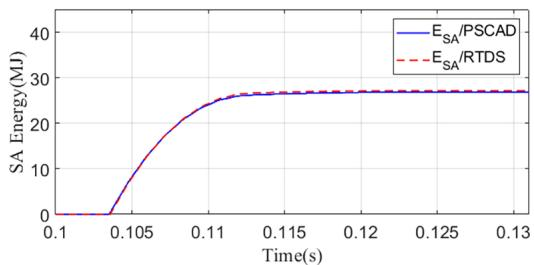  
Fig. 19. VARC DC CB voltages in RTDS and PSCAD models – reverse fault current interruption.

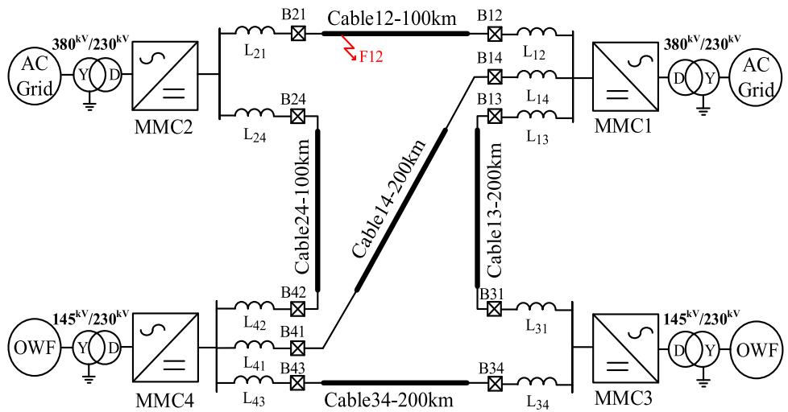  
Fig. 20. The MTDC grid test system.

a very small delay about several microseconds between the signals of both models. This is because the control logic of the RTDS model is implemented using large time step (14 us), whilst the PSCAD control logic has been implemented using a time step of 1 us. Fig. 12 shows the line current $\mathrm { I _ { L I N E } } ,$ the oscillating current $\mathrm { I _ { O S C } } ,$ the vacuum interrupter current $\mathrm { I } _ { \mathbf { M B } }$ and the current passing through the surge arrester $\mathrm { I } _ { \mathrm { S A } } .$ . There

is a very small delay (about several us) and difference between $\mathrm { I _ { O S C } }$ and I in RTDS and PSCAD models. The reason for this is: (1) the mentioned delay between control signals in the models, (2) the difference between resonance branch impedances, and the difference between SA characteristics in the models, (3) the use of large time step for plotting the RTDS model results (even though its electrical circuit and VSC

Table 5 The MMCs parameters.   

<table><tr><td>Parameter</td><td>Converter</td></tr><tr><td>DC voltage</td><td>± 160 kV</td></tr><tr><td>Converter AC voltage</td><td>230 kV</td></tr><tr><td>Rated Power</td><td>800 MW</td></tr><tr><td>Number of SMs per arm</td><td>160</td></tr><tr><td>Arm resistance Rarm</td><td>0.08 Ω</td></tr><tr><td>Arm reactor Larm</td><td>29 mH</td></tr><tr><td>Arm capacitance Carm</td><td>31 uF</td></tr><tr><td>Transformer leakage reactance</td><td>0.18 p.u.</td></tr></table>

Table 6 The XLPE cable parameters.   

<table><tr><td>Parameter</td><td>Outer radius (mm)</td><td>ρ (Ω.m)</td><td>εrel (-)</td><td>μrel (-)</td></tr><tr><td>Copper Core</td><td>25.125</td><td>2.2 * 10-8</td><td>-</td><td>1</td></tr><tr><td>Insulation Layer 1</td><td>49.125</td><td>-</td><td>2.3</td><td>1</td></tr><tr><td>Sheath</td><td>52.125</td><td>2.74 * 10-7</td><td>-</td><td>1</td></tr><tr><td>Insulation Layer 2</td><td>56.125</td><td>-</td><td>2.3</td><td>1</td></tr><tr><td>Armor</td><td>61.725</td><td>1.815 * 10-7</td><td>-</td><td>10</td></tr><tr><td>Insulation Layer 3</td><td>66.725</td><td>-</td><td>2.3</td><td>1</td></tr></table>

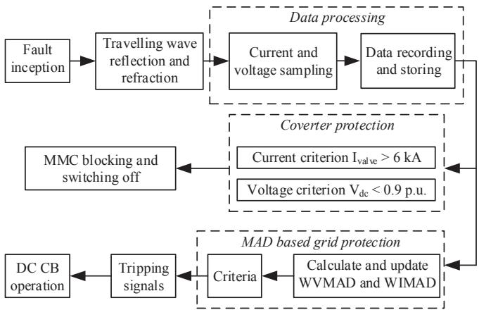  
Fig. 21. Schematic of DC fault protection.

voltage generator are implemented using small time step of 1.75 us).

Fig. 13 shows the vacuum interrupter voltage $\mathrm { V } _ { \mathrm { M B } } ,$ the surge arrester voltage $\mathrm { V } _ { S \mathrm { A } } ,$ the residual circuit breaker voltage ${ \mathrm { V } } _ { { \mathrm { R C B } } } ,$ the voltage across whole the breaker ${ \mathrm { V } } _ { \mathrm { D C C B } } ,$ , and the dissipated energy in the surge arresters $\operatorname { E } _ { S \mathbf { A } }$ . The aforementioned delay and difference between

resonance branches and SA characteristics lead to small differences between the simulated voltages and SA energies in RTDS and PSCAD models.

# C. Interrupting Load Current

This simulation case demonstrates the DC CB performance during load current interruption of 2 kA. The results are shown in Figs. 14 through 16. It is seen that all the results of the RTDS and the PSCAD models are in a good agreement. However, there are small differences between the results of the two models because of the reasons mentioned in part B.

# D. Interrupting Reverse Fault Current

This simulation case demonstrates the DC CB performance during interruption of a reverse fault current of 13.5 kA. The same test as in part B has been performed with a reverse line voltage polarity. The results are shown in Fig. 17 through 19. It can be seen that the results of the RTDS and the PSCAD models are in a relatively good agreement. The $\mathrm { I _ { O S C } }$ and I in the two models are slightly more different compared to the results of part B. This is because of the differences between the modelling of VSC output voltage in the models. In the RTDS model, the VSC output voltage polarity at the instant of deblocking is determined due to the direction of $\operatorname { I } _ { \mathrm { O S C } } .$ The direction of $\mathrm { I _ { O S C } }$ is changed by changing voltage polarity of the HVDC system. However, in the PSCAD model, the VSC output voltage polarity at the instant of deblocking is constant because the VSC is modelled using a capacitor and IGBTs, which turn on in a determined pattern regardless of the HVDC system voltage polarity.

# 5. Application of the DC CB model in MTDC grid

In order to demonstrate the applicability of the proposed DC CB model, an MTDC grid as shown in Fig. 20 is developed and implemented in RTDS by applying DC CBs. The MTDC grid, connects two offshore wind farms to the main AC grids using half bridge modular multilevel converters (MMCs) and transmission cables. The grid and the cable parameters are listed in Table 5 and Table 6. The converters are modelled by a detailed Thevenin equivalent model of the arms. In order to identify the faulted cable, the median absolute deviation (MAD) based grid protection algorithm proposed in [23] is implemented in RTDS software environment. The description of the protection algorithm is illustrated in Fig. 21. Here, two protection workflows can be seen, i.e. converter protection and MAD based grid protection. When a fault occurs, travelling waves will be generated. Thereafter, the

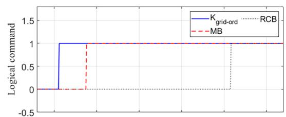

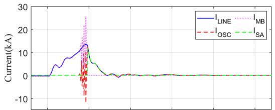

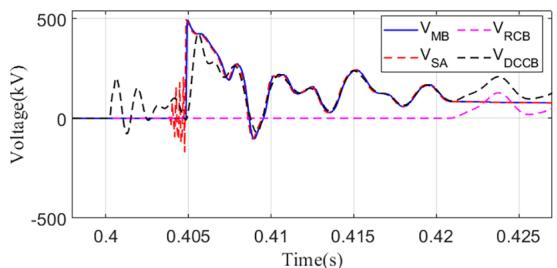

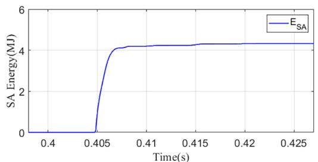  
Fig. 22. The waveforms for DC breaker B21.

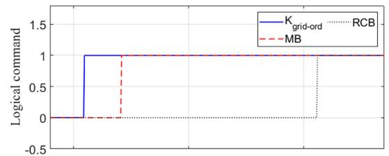

  
Fig. 23. The waveforms for DC breaker B12.

travelling waves reach each bus in which a reflection and a refraction take place. The bus current and the bus voltage are sampled and processed continuously. For the converter protection, the fault detection is based on the thresholds of the converter arm currents and the DC bus voltages. An arm current threshold of 6 kA and a DC bus voltage threshold of 0.9 p.u. are considered for the converter protection. Once the fault is detected, MMC receives the operation signals from the protection algorithm to block the converter. For the grid protection and the DC CB operation, the MAD based detection algorithm is applied. After receiving the trip signal by the grid protection algorithm, the DC CBs will operate and disconnect the faulted line.

At t = 0.4 s a bolted pole to pole fault is incepted on Cable 12, 10 km away from DC breaker B21. Fig. 22 shows the results for B12. After the fault occurrence, the grid protection algorithm identifies the faulted cable and sends the trip signal Kgrid-ord to the DC CB in less than 1 ms. Then, the MB signal which is sent 3 ms after the trip signal, opens the MB, and the VSC inside the DC CB starts to inject IOSC. At t = 0.405 s, when $\mathrm { I _ { L I N E } }$ reaches about 13.5 kA and $\mathrm { I } _ { \mathrm { M B } }$ goes to zero. At this instant, the MB opens and the fault current is commutated to the SA, which further begins to decrease. At = 0.421 s, the RCB opens and the fault current is interrupted. Compared to the results of the simple test circuit in Section $^ { 4 , }$ there are differences between transient voltages and currents due to the presence of the MMCs and their control systems. Moreover, the energy dissipated in the surge arrester is 4.3 MJ. Fig. 23 shows the results for DC breaker B12 in which the fault current is interrupted at 8.7 kA.

# 6. Model limitations

This section explains the functionality of the VARC DC CB model in RTDS environment. As it is mentioned in the modelling and demonstration sections, the minimum time step is 1.75 us for small time step simulations and 14 us for large time step simulations. Due to the modelling of the switches as L and RC branches in RTDS and the interference of these elements with the oscillation circuit, the VSC is modelled using a voltage source branch in a different way than it is normally done in PSCAD, i.e. without using IGBT model. The PSCAD SA model is significantly different than the RTDS SA model (which is related to the library SA model in RTDS environment). It should also be pointed that when compiling the simulations, RTDS adds a resistor parallel to the resonance branch inductance and a capacitor parallel to the SA in conductance matrix. Therefore, in order to have the same or at least the similar behaviour of the resonance branch both PSCAD and RTDS models, the value of $\mathrm { L } _ { \mathrm { p } }$ should be modified in RTDS model. This study reveals that some procedure needs to be followed in order to find

the best parameters, which result in a good agreement of the voltages, currents and SA energy absorption. Another limitation is that only seven switches can be used in each small time step VSC box. This is particularly important in case of using this model within a larger network with other switches simulated in the same small time step VSC box.

# 7. Conclusions

In order to pave the way of protection system testing in multiterminal HVDC grids where DC CBs play an important role, the model of VARC DC CB is developed in RTDS environment. The DC CB circuit and its converter switching signals are modelled with small time steps whilst its control logic is modelled using large time step simulations. The model is tested using a simple test circuit and it is also verified by PSCAD simulation. The control logic signals match well with the PSCAD signals. The current and voltage waveforms in RTDS and PSCAD models present the same behaviour in amplitude and time execution. It should be pointed out that the user should introduce slight differences for some parameters due to the different way of modelling of the VSC and the SA and different time steps in RTDS and PSCAD environments in order to achieve expected results. Moreover, the performance of the developed model in MTDC grid is tested using a four terminal HVDC gird by applying a powerful MAD based grid protection algorithm in RTDS software environment.

# Declaration of Competing Interest

The authors declare that they have no known competing financial interests or personal relationships that could have appeared to influence the work reported in this paper.

# Acknowledgment

This work has received funding from the European Commission under project 691714 – PROMOTioN (Progress on Meshed HVDC Offshore Transmission Networks) through Horizon 2020 program.

# References

[1] Chaudhuri N, Chaudhuri B, Majumder R, Yazdani A. Multi-terminal direct-current grids. Wiley; 2014.   
[2] Belda NA, Plet CA, Smeets RPP. Analysis of faults in multiterminal HVDC grid for definition of test requirements of HVDC circuit breakers. IEEE Trans Power Delivery 2017;33(1):403–11.   
[3] Tahata K, El Oukaili S, Kamei K, Yoshida D, Kono Y, Yamamoto R, et al. February).

HVDC circuit breakers for HVDC grid applications. 11th IET international conference on AC and DC power transmission. 2015. p. 1–9.   
[4] Sander R, Suriyah M, Leibfried T. Characterization of a countercurrent injectionbased HVDC circuit breaker. IEEE Trans Power Electron 2017;33(4):2948–56.   
[5] Pauli B, Mauthe G, Ruoss E, Ecklin G, Porter J, Vithayathil J. Development of a high current HVDC circuit breaker with fast fault clearing capability. IEEE Trans Power Delivery 1988;3(4):2072–80.   
[6] Wen W, Huang Y, Cheng T, Gao S, Chen Z, Zhang X, et al. Research on a current commutation drive circuit for hybrid dc circuit breaker and its optimisation design. IET Gener Transm Distrib 2016;10(13):3119–26.   
[7] Steurer M, Frohlich K, Holaus W, Kaltenegger K. A novel hybrid current-limiting circuit breaker for medium voltage: principle and test results. IEEE Trans Power Delivery 2003;18(2):460–7.   
[8] Sano K, Takasaki M. A surgeless solid-state DC circuit breaker for voltage-sourceconverter-based HVDC systems. IEEE Trans Ind Appl 2013;50(4):2690–9.   
[9] Magnusson J, Saers R, Liljestrand L, Engdahl G. Separation of the energy absorption and overvoltage protection in solid-state breakers by the use of parallel varistors. IEEE Trans Power Electron 2013;29(6):2715–22.   
[10] Zhang B, Ren L, Ding JG, Wang J, Liu Z, Geng Y, et al. A relationship between minimum arcing interrupting capability and opening velocity of vacuum interrupters in short-circuit current interruption. IEEE Trans Power Delivery 2018;33(6):2822–8.   
[11] Tsukima M, Takeuchi T, Koyama K, Yoshiyasu H. Development of a high-speed electromagnetic repulsion mechanism for high-voltage vacuum circuit breakers. Electr Eng Jpn 2008;163(1):34–40.   
[12] Ängquist L, Baudoin A, Modeer T, Nee S, Norrga S. VARC–a cost-effective ultrafast DC circuit breaker concept. 2018 IEEE power & energy society general meeting (PESGM). 2018. p. 1–5.   
[13] Ängquist L, Nee S, Modeer T, Baudoin A, Norrga S, Belda NA. Design and test of VSC assisted resonant current (VARC) DC circuit breaker.In. the 15th IET international

conference on AC and DC power transmission. 2019. p. 1–6.   
[14] Yanushkevich A, Scharrenberg R, Kell M, Smeets RPP. Switching phenomena of HVDC circuit breaker in multi-terminal system. 11th IET international conference on AC and DC power transmission. 2015. p. 1–6.   
[15] Shi ZQ, Zhang YK, Jia SL, Song XC, Wang LJ, Chen M. Design and numerical investigation of a HVDC vacuum switch based on artificial current zero. IEEE Trans Dielectr Electr Insul 2015;22(1):135–41.   
[16] Lin W, Jovcic D, Nguefeu S, Saad H. Modelling of high power mechanical DC circuit breaker. In 2015 IEEE PES Asia-Pacific Power and Energy Engineering Conference (APPEEC). 2015. p. 1–5.   
[17] Rao BK, Gajjar G. Development and application of vacuum circuit breaker model in electromagnetic transient simulation. 2006 IEEE power India conference. 2006. p. 1–7.   
[18] Helmer J, Lindmayer M. Mathematical modeling of the high frequency behavior of vacuum interrupters and comparison with measured transients in power systems. In: Proceedings of 17th international symposium on discharges and electrical insulation in vacuum, vol. 1; 1996. p. 323–31).   
[19] Liu S, Popov M. Development of HVDC system-level mechanical circuit breaker model. Int J Electr Power Energy Syst 2018;103:159–67.   
[20] Greenwood AN, Lee TH. Theory and application of the commutation principle for HVDC circuit breakers. IEEE Trans Power Apparatus Syst 1972;4:1570–4.   
[21] Liu S, Liu Z, de Jesus Chavez J, Popov M. Mechanical DC circuit breaker model for real time simulations. Int J Electr Power Energy Syst 2019;107:110–9.   
[22] Liu S, Popov M, Mirhosseini SS, Nee S, Modeer T, Ängquist L, et al. Modelling, experimental validation and application of VARC HVDC circuit breakers. IEEE Trans Power Delivery 2019. https://doi.org/10.1109/TPWRD.2019.2947544.   
[23] Naglic M, Liu L, Tyuryukanov I, Popov M, van der Meijden MAMM, Terzija V. Synchronized measurement technology supported AC and HVDC online disturbance detection. Electr Power Syst Res 2018;160:308–17.