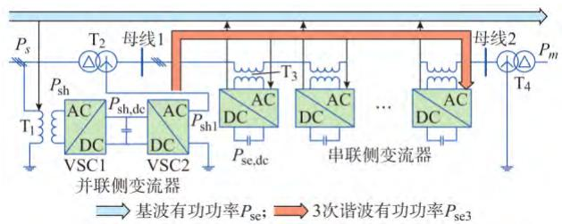
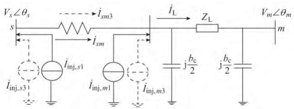
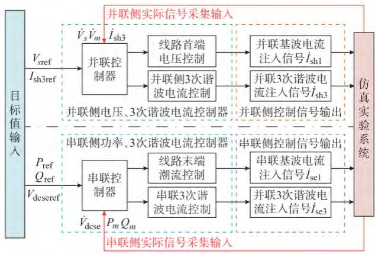
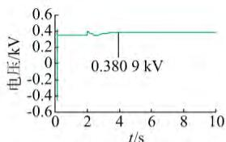
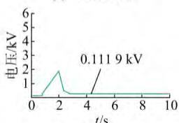
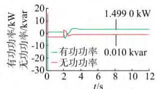
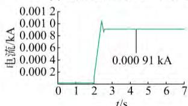
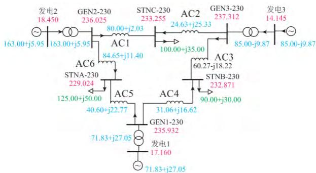
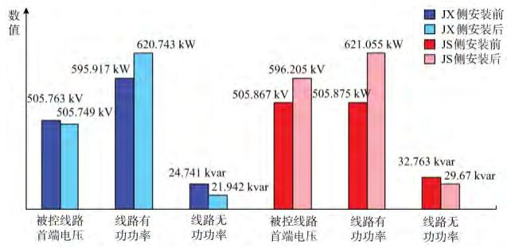

# 协调分布式潮流控制器串并联变流器能量交换的等效模型

唐爱红1， 高梦露1， 黄 涌2， 赵红生2， 徐秋实2， 郑 旭2

（1．武汉理工大学自动化学院 湖北省武汉市430070； 2．国网湖北省电力公司经济技术研究院 湖北省武汉市430070）

摘要 由分布式潮流控制器的特性出发 建立了反映内部3次谐波能量动态交换的基于电流注入法和功率解耦控制法的分布式潮流控制器等效数学模型 设计了以3次谐波能量平衡为基础的串并联控制器 基于电力系统全数字仿真装置（ADPSS）的电磁暂态仿真功能和用户自定义模型功能 分别建立了分布式潮流控制器的仿真平台 基于该电磁暂态实验平台 通过分布式潮流控制器等效模型与电磁暂态模型仿真结果的对比分析 验证了所建分布式潮流控制器等效数学模型的正确性；基于机电暂态中用户自定义模型功能 ，在 WSCC9系统和某500kV实际电网进行了稳态功率调控实验 证明了所建模型的有效性

关键词 分布式潮流控制器 3次谐波 电流注入法 内部能量交换 电力系统全数字仿真装置

# 0 引言

分布式潮流控制器（DPFC）［1－2］是一种结合分布式静止串联补偿器 （DSSC）［3］ 与统一潮流控制器（UPFC）［4］特点的柔性交流输电系统（FACTS） 并联侧三相变流器 VSC1主要与系统进行基波功率交换 所交换的无功功率用于对系统母线电压进行控制 所交换的有功功率用于维持并联侧直流电容电压为目标值 并联侧变流器 VSC2主要用于与串联侧变流器进行3次谐波有功功率的交换 以保证串联侧变流器直流电容电压恒定 DPFC串联侧变流器一方面从系统吸收并联侧传输过来的3次谐波有功功率 用于维持本身直流电容电压为目标值 另一方面 根据系统潮流调控的需要 向系统注入幅值和相角均可调的基波电压 DPFC采用小容量单相串联变流器组分散布置 ，提高了控制的灵活性 ，有效降低了成本［5］ ；去除了 UPFC串并联侧间公共直流电容 提高了装置的可靠性 DPFC具有对电力系统的电抗 电压 功率等结构参数和运行参数进行调节的特性，能够提高电网输电能力 ，抑制电力系统功率振荡 增强电力系统稳定性［6］ 且具有不平衡度补偿电能质量治理等特点［7］ DPFC同时适用于输 配电网 与 UPFC相比 DPFC的优势［5］ 在于 DPFC串联侧采用小容量低价格的电力电子器件 方便批

量生产 制造成本低 制造周期短 便于拆卸和异地重装 可根据电力需求逐年分批建设 减少初始投资和占地面积 且单个换流器故障时装置仍可继续工作 可靠性更高

为研究DPFC对大电网机电特性的影响 建立DPFC等效数学模型尤为重要 国内外专家学者对其进行了大量研究 文献［8］研究了 DPFC阻尼功率振荡的能力 介绍了 DPFC的电流注入等效模型，目的是设计功率振荡阻尼辅助控制器。 文献［9］提出了DPFC基于等效电压源的等效数学模型 其中包括基频网络和3次谐波网络 并对其内部能量守恒进行了分析 但都未提及适用于电网潮流计算的数 学 模 型 文 献 ［10］ 中 采 用 基 于 PSCAD／EMTDC的DPFC详细开关器件电磁暂态模型 时间常数在微秒级 仿真精度高 但所能实现的仿真系统规模较小 且受算法的限制 该详细开关模型不能直接应用于电网潮流计算 无法验证 DPFC对大电网潮流的调节效果

本文将研究适用于电网潮流计算 反映 DPFC内部3次谐波能量动态交换的等效数学模型 ； 基于电流注入法和功率解耦控制法 设计以3次谐波能量平衡为基础的串并联控制器 基于电力系统全数字仿真装置（ADPSS）进行仿真实验 验证DPFC等效数学模型的正确性和有效性

# 1 DPFC的功率特性分析

由傅里叶分析可知 非正弦电压和电流可表示为振幅和频率都不相同的正弦函数 其有功功率可

表示为 ：

$$
\begin{array}{l} P = \int_ {0} ^ {T} V _ {i} \cos (i \omega t + \varphi_ {i}) I _ {k} \cos k \omega t d t = \\ V _ {i} I _ {k} \int_ {0} ^ {T} \cos (i \omega t + \varphi_ {i}) \cos k \omega t d t = \\ \frac {1}{2} V _ {i} I _ {k} \int_ {0} ^ {T} (\cos ((i + k) \omega t + \varphi_ {i}) + \\ \cos ((i - k) \omega t + \varphi_ {i})) \mathrm {d} t \tag {1} \\ \end{array}
$$

式中 i 和 k 为谐波次数 $V _ { i }$ 为谐波电压幅值 I 为谐波电流幅值 $\mathbf { \nabla } ; \varphi _ { i }$ 为 i 次谐波中电压 Vi 与电流 Ii之间的初始相角差

当 $i \neq k$ 时，有

$$
\begin{array}{l} P = \frac {1}{2} V _ {i} I _ {k} \left(\frac {\sin ((i + k) \omega t + \varphi_ {i})}{(i + k) \omega} \right| _ {0} ^ {T} + \\ \left. \frac {\sin ((i - k) \omega t + \varphi_ {i})}{(i - k) \omega} \right| _ {0} ^ {T}\left. \right) = 0 \tag {2} \\ \end{array}
$$

当 i＝k 时，有

$$
\begin{array}{l} P = \frac {1}{2} V _ {i} I _ {i} \left( \right.\frac {\sin (2 i \omega t + \varphi_ {i})}{2 i \omega} \left. \right| _ {0} ^ {T} + T \cos \varphi_ {i}\left. \right) = \\ \frac {T}{2} V _ {i} I _ {i} \cos \varphi_ {i} \tag {3} \\ \end{array}
$$

由式（2）和式（3）可知 不同频率的电压和电流得到的有功功率有效值为零 ；同一频率的电压 电流得到的有功功率和其他频率的有功功率相互独立因此 不带电源的变流器 不计损耗时 可以吸收某一频率的有功功率 并产生其他频率的有功功率在三相交流系统中 每相内只有3的倍数次谐波是彼此独立的，且三相电流大小相等、方向相同， 在远程传输中可不考虑三相间的同步问题 且传输线路是感性阻抗 阻抗大小正比于谐波次数 在所有3的倍数次谐波中3次谐波对应最小阻抗 因此选用3次谐波进行DPFC串并联侧有功功率的交换 又由于星形—三角形变压器的三角侧对零序分量而言是开路 即零序分量能被阻断而不流入装置所在线路之外的系统 同时还能通过星形侧的中性线接地形成回路 可省略滤波器 降低装置成本

# 2 DPFC数学模型

如图1所示为DPFC拓扑结构 根据 DPFC的工作原理［1－2，5，10］ 可将 DPFC并联侧变流器 VSC1等效为电压源 $V _ { \mathrm { s h } }$ 并联侧变流器 VSC2等效为3次谐波电压源 $V _ { \mathrm { s h 3 } }$ DPFC串联侧变流器可等效为基频电压源 $V _ { \mathrm { s e l } }$ 与3次谐波电压源 $V _ { \mathrm { s e 3 } }$ 的并联组合［11］ 因此 DPFC 的等效电压源模型如附录 A图A1所示

不计线路和换流器损耗 含 DPFC装置的系统满足以下有功平衡方程 ：

$$
P _ {s} - P _ {\mathrm {s h}} + P _ {\mathrm {s e}} = P _ {\mathrm {m}} \tag {4}
$$

式中 ${ \mathrm { : } } P _ { s }$ 为线路首端的有功功率 ； $\boldsymbol { \cdot } \boldsymbol { P } _ { \mathrm { s h } }$ 为DPFC并联侧变流器吸收的有功功率； $P _ { \mathrm { ~ s ~ } }$ e为DPFC串联侧变流器向系统注入的有功功率； $P _ { { ~ m ~ } }$ 为 DPFC所在线路末端的有功功率 ，如图1所示

  
图1 DPFC拓扑结构  
Fig．1 TopologystructureofDPFC

考虑DPFC直流电容上的功率以及3次谐波传输的功率 DPFC串并联侧内部功率流动如下

$$
\begin{array}{l} P _ {\mathrm {s h}} = P _ {\mathrm {s h} 1} + P _ {\mathrm {s h}, \mathrm {d c}} (5) \\ P _ {\mathrm {s h} 1} = P _ {\mathrm {s e} 3} + P _ {\mathrm {s e}, \mathrm {d c}} (6) \\ P _ {\mathrm {s e} 3} = P _ {\mathrm {s e} 1} (7) \\ \end{array}
$$

式中 $P _ { \mathrm { { s h } } }$ 为DPFC并联侧基波有功功率； $P _ { \mathrm { { s e 3 } } }$ 为串联侧3次谐波功率； $P _ { \mathrm { { s h , d c } } }$ 和 $P _ { \mathrm { \ s e , d c } }$ 分别为串 并联侧直流电容上的有功功率 ； $P _ { \mathrm { s e l } }$ 为串联侧变流器注入线路中的基波功率

由式（5）至式（7）有如下关系 ：

$$
P _ {\mathrm {s h}} - P _ {\mathrm {s e l}} = P _ {\mathrm {s h , d c}} + P _ {\mathrm {s e , d c}} \tag {8}
$$

即DPFC并联侧从系统吸收的功率与串联侧注入系统的基波功率之差为串并联侧直流电容上消耗的功率 $P _ { \mathrm { s h , d c } } + P _ { \mathrm { s e , d c } }$ ， 因此可得3次谐波用于串并联变流器间的有功率交换 仅在DPFC内部流动

采用电流注入法［12］ 建立 DPFC的等效数学模型，电流注入法的特点为 ： 在潮流控制过程中 ， 无需改变DPFC两侧接入点的节点类型 不增加节点导纳矩阵的阶数 控制简单灵活 DPFC的电流注入模型如图2所示

  
图2 DPFC的电流注入模型  
Fig．2 CurrentinjectionmodelofDPFC

在图 2 中 DPFC 的电流注入模型中 ， $\dot { I } _ { \mathrm { \ i n j , } s 3 }$ ，$\dot { I } _ { \mathrm { \scriptsize ~ i n j , } m 3 } , \dot { I } _ { \mathrm { \scriptsize ~ s m 3 } }$ 表示3次谐波电流在DPFC装置及系统内部流动的过程 用虚线表示 V 和 $V _ { m }$ 分别为线

路首 末端电压幅值； $\dot { I } _ { \perp }$ L 为线路电流

分析DPFC的基波电流的电压源模型 DPFC串联侧注入系统的基波电流为 ：

$$
\dot {I} _ {\mathrm {s e l}} = \frac {\dot {V} _ {s} - \dot {V} _ {m}}{\mathrm {j} X _ {\mathrm {s e}}} + \frac {\dot {V} _ {\mathrm {s e l}}}{\mathrm {j} X _ {\mathrm {s e}}} \tag {9}
$$

式中 ： $X ,$ se为串联侧等效阻抗； $\dot { V } _ { \mathrm { s e l } }$ 为 DPFC串联侧注入线路的基波电压相量

令

$$
\dot {I} _ {\mathrm {s e l}} ^ {\prime} = \frac {\dot {V} _ {\mathrm {s e l}}}{\mathrm {j} X _ {\mathrm {s e}}} \tag {10}
$$

则DPFC向节点 s 注入的基波电流为 ：

$$
\dot {I} _ {\mathrm {s l}} = - \left(\dot {I} _ {\mathrm {s h l}} + \dot {I} _ {\mathrm {s e l}} ^ {\prime}\right) - \frac {\dot {V} _ {s} - \dot {V} _ {m}}{\mathrm {j} X _ {\mathrm {s e}}} \tag {11}
$$

$$
\dot {I} _ {\mathrm {s h l}} = \frac {\dot {V} _ {\mathrm {s h l}}}{\mathrm {j} X _ {\mathrm {s h}}} \tag {12}
$$

式中 $: \dot { V } _ { \mathrm { s h } 1 }$ 为 DPFC 并联侧注入线路的基波电压相 量 。

由等效电压源模型过渡到电流注入模型 即由附录 A图A1转换到图2 由式（9）至式（12）推导可得 DPFC向节点 s m 注入的基波电流分别为

$$
\left\{ \begin{array}{l} \dot {I} _ {\text {i n j}, s 1} = - \left(\dot {I} _ {\text {s h l}} + \dot {I} _ {\text {s e l}} ^ {\prime}\right) \\ \dot {I} _ {\text {i n j}, m 1} = \dot {I} _ {\text {s e l}} ^ {\prime} \end{array} \right. \tag {13}
$$

式中 ： $\dot { I } _ { \mathrm { \ s h l } }$ 为 DPFC 并联侧注入线路的基波电流相 量 。

分析DPFC的3次谐波电流的电压源模型 线路中的3次谐波电流为 ：

$$
\dot {I} _ {3} = \frac {\dot {V} _ {\mathrm {s h} 3}}{\mathrm {j} X _ {\mathrm {s h} 3}} + \frac {\dot {V} _ {\mathrm {s e} 3}}{\mathrm {j} X _ {\mathrm {s e} 3}} \tag {14}
$$

式中 ： $X _ { \mathrm { s h 3 } }$ 为并联侧3次谐波等效阻抗 $; X _ { \mathrm { s e 3 } }$ 为串联侧3次谐波等效阻抗； $\dot { \cdot } \dot { V } _ { \mathrm { s h 3 } }$ 和 $\dot { V } _ { \mathrm { s e 3 } }$ 分别为DPFC并联和串联侧注入线路的3次谐波电压相量

转换到电 流注入模型中， 将式 （14） 等效为DPFC向被控线路两端 s m 注入的3次谐波电流

$$
\left\{ \begin{array}{l} \dot {I} _ {\text {i n j}, s 3} = - \frac {\dot {V} _ {\mathrm {s e} 3}}{\mathrm {j} X _ {\mathrm {s e} 3}} \\ \dot {I} _ {\text {i n j}, m 3} = \frac {V _ {\mathrm {s e} 3}}{\mathrm {j} X _ {\mathrm {s e} 3}} \end{array} \right. \tag {15}
$$

# 3 控制器设计

# 3．1 3次谐波电流控制器

由DPFC工作原理［1－2，5，10］ 知 DPFC的能量交换遵循有功功率平衡原则 并联侧注入线路的3次谐波功率与串联侧吸收3次谐波后注入系统的基波

功率大小相等 ，即有 $P _ { \mathrm { s h 3 } } = P _ { \mathrm { s e l } }$ 。

由此 $P _ { \mathrm { \ s h 3 } }$ 可表示为 ：

$$
P _ {\mathrm {s h} 3} = P _ {\mathrm {s e l}} = V _ {\mathrm {s e l}} I _ {\mathrm {L}} \cos \theta_ {\mathrm {s e}} \tag {16}
$$

式中 $: \theta _ { s }$ e为串联侧等效电压源相角

用于串并联变流器能量交换的3次谐波电流可表示为 ：

$$
\dot {I} _ {3} = \sqrt {\frac {P _ {\mathrm {s h} 3}}{3 X _ {\mathrm {s h}}}} = \sqrt {\frac {\alpha \left(P _ {\mathrm {r e f}} - P _ {m}\right) I _ {\mathrm {L}} \cos \left(\beta \left(Q _ {\mathrm {r e f}} - Q _ {m}\right)\right)}{3 X _ {\mathrm {s h} 3}}} \tag {17}
$$

式中 ： $P _ { \mathrm { r e f } }$ 和 $Q _ { \mathrm { r e f } }$ 分别为线路潮流有功和无功功率目标值 $; \alpha = K _ { \mathrm { p } } + K _ { \mathrm { i } } / s , \beta = K _ { \mathrm { p } } ^ { \prime } + K _ { \mathrm { i } } ^ { \prime } / s$ ， 其 中 $K _ { \mathrm { \Delta p } }$ 和$K _ { \mathrm { ~ p ~ } } ^ { \mathrm { ~ \prime ~ } }$ 为比例系数， $K _ { \mathrm { i } }$ 和 $K _ { \mathrm { ~ i ~ } } ^ { \prime }$ 为积分系数。

由式（17）可知，3次谐波电流正比于线路潮流有功功率和无功功率目标值 改变潮流目标值可以改变并联单相变流器注入线路的3次谐波电流

# 3．2 DPFC并联侧控制器

根据瞬时功率理论［13］ 经 $d { - } q$ 变换实现 DPFC并联侧有功功率和无功功率的解耦控制［14－16］ 稳态时，DPFC并联变流器由系统吸收的有功功率等于串联变流器向系统发出的有功功率 则有

$$
\begin{array}{l} I _ {\mathrm {s h}, d} = \frac {\operatorname {R e} \left(\dot {V} _ {\mathrm {s e l}} \dot {I} _ {\mathrm {L}} ^ {*}\right)}{V _ {s}} = \\ \frac {1}{V _ {s}} \left(V _ {\text {s e l}, x} \frac {P _ {m} \cos \theta_ {m} + Q _ {\mathrm {L}} \sin \theta_ {m}}{V _ {m}} - \right. \\ V _ {\text {s e l}, y} \frac {Q _ {m} \cos \theta_ {m} - P _ {\mathrm {L}} \sin \theta_ {m}}{V _ {m}} \Bigg) \tag {18} \\ \end{array}
$$

式中 $: \theta _ { m }$ 为线路末端电压相角

由式（18）可知 通过控制并联基波电流的 q 轴分量 $I _ { \mathrm { \ s h } , q }$ 可以控制无功功率Q， 进而控制 DPFC接入点的交流母线电压 $I _ { \mathrm { { s h } } , q } > 0$ 时，并联变流器发出无功功率，提升受控母线电压； $I _ { \mathrm { \ s h } , q } < 0$ 时，并联变流器吸收无功功率， 降低受控母线电压 $I _ { \mathrm { \ s h } , q }$ 可表示为 ：

$$
I _ {\mathrm {s h}, q} = \left(K _ {\mathrm {p}} + \frac {K _ {\mathrm {i}}}{s}\right) \left(V _ {\mathrm {s r e f}} - V _ {s}\right) \tag {19}
$$

式中 $\cdot V _ { s \mathrm { r e f } }$ 为DPFC并联接入点母线电压目标值

由式（18）和式（19）可知 利用坐标变换 计算出并联基波电流在 x－y 轴坐标下的实部分量 $I _ { \mathrm { \ s h } } ,$ 和虚部分量 $I _ { \mathrm { \sinh } } ,$ 分别为 ：

$$
\left\{ \begin{array}{l} I _ {\mathrm {s h}, x} = I _ {\mathrm {s h}, d} \cos \theta_ {s} - I _ {\mathrm {s h}, q} \sin \theta_ {s} \\ I _ {\mathrm {s h}, y} = I _ {\mathrm {s h}, d} \sin \theta_ {s} + I _ {\mathrm {s h}, q} \cos \theta_ {s} \end{array} \right. \tag {20}
$$

式中 $: \theta ,$ 为母线电压 $V _ { s }$ 的相位

因此 得到DPFC并联侧三相变流器注入被控线路的基波电流 $\dot { I } _ { \mathrm { ~ s h ~ } }$ 为

$$
\dot {I} _ {\mathrm {s h}} = I _ {\mathrm {s h}, x} + \mathrm {j} I _ {\mathrm {s h}, y} \tag {21}
$$

# 3．3 DPFC串联侧控制器

DPFC串联侧变流器通过吸收线路上的3次谐波电流 $\dot { I }$ 以维持直流电容电压为目标值 并向系统注入电压 $\dot { V } _ { \mathrm { s e } }$ 来控制线路潮流，电压 $\dot { V } _ { \mathrm { s e } }$ 为基波电压 $\dot { V } _ { \mathrm { s e l } }$ 和3次谐波电压 $\dot { V } _ { \mathrm { s e 3 } }$ 的线性叠加 即

$$
\dot {V} _ {\mathrm {s e}} = \dot {V} _ {\mathrm {s e 1}} + \dot {V} _ {\mathrm {s e 3}} \tag {22}
$$

串联侧变流器直流电压的变化反映变流器与输电线路有功功率交换的变化 而变流器有功功率由3次谐波电流提供 因此可将串联侧3次谐波电压$\dot { V } _ { \mathrm { s e 3 } }$ 分解为与 $\dot { I } _ { \mathrm { ~ 3 ~ } }$ 同相位的横分量和与 $\dot { I } _ { \mathrm { ~ 3 ~ } }$ 垂直的纵分量，即

$$
\left\{ \begin{array}{l} V _ {\mathrm {s e 3}, d} = \left(K _ {\mathrm {p}} + \frac {K _ {\mathrm {i}}}{s}\right) \left(V _ {\mathrm {d c s e r e f}} - V _ {\mathrm {d c s e}}\right) \\ V _ {\mathrm {s e 3}, q} = 0 \end{array} \right. \tag {23}
$$

式中 $\colon V _ { \mathrm { d c s e r e f } }$ 为DPFC串联侧直流电容电压目标值 ；$V _ { \mathrm { d c s e } }$ 为串联侧直流电容电压。

串联变流器注入系统的基波电压 $\dot { V } _ { \mathrm { s e l } }$ 可分解为与 $\dot { V } _ { s }$ 同相位的纵分量 $V _ { \mathrm { s e l } , d }$ 和与 $\dot { V } _ { s }$ 正交的横分量$V _ { \mathrm { s e l } , q }$ ，纵分量 $V _ { \mathrm { s e l } , d }$ 主要影响线路末端电压的幅值，横分量 $V _ { \mathrm { s e l } , q }$ 主要影响线路末端电压的相位 因此改变 $V _ { \mathrm { s e l } , d }$ 能控制线路上无功功率， 改变 $V _ { \mathrm { s e l } , q }$ 能控制线路上有功功率 因此 $V _ { \mathrm { s e l } , d }$ 和 $V _ { \mathrm { s e l } , q }$ 可表示为 ：

$$
\left\{ \begin{array}{l} V _ {\text {s e l}, d} = \left(K _ {\mathrm {p}} + \frac {K _ {\mathrm {i}}}{s}\right) \left(Q _ {\text {r e f}} - Q _ {m}\right) \\ V _ {\text {s e l}, q} = \left(K _ {\mathrm {p}} + \frac {K _ {\mathrm {i}}}{s}\right) \left(P _ {\text {r e f}} - P _ {m}\right) \end{array} \right. \tag {24}
$$

由式（23）和式（24）可得， 串联侧变流器注入线路的电压 $\dot { V } _ { \mathrm { s e } }$ 的 $d q$ 轴分量为

$$
\left\{ \begin{array}{l} V _ {\mathrm {s e}, d} = \left(K _ {\mathrm {p}} + \frac {K _ {\mathrm {i}}}{s}\right) \left(Q _ {\mathrm {r e f}} - Q _ {m}\right) + \\ \left(K _ {\mathrm {p}} + \frac {K _ {\mathrm {i}}}{s}\right) \left(V _ {\mathrm {d c s e r e f}} - V _ {\mathrm {d c s e}}\right) \\ V _ {\mathrm {s e}, q} = \left(K _ {\mathrm {p}} + \frac {K _ {\mathrm {i}}}{s}\right) \left(P _ {\mathrm {r e f}} - P _ {m}\right) \end{array} \right. \tag {25}
$$

取DPFC并联接入点母线电压与同步坐标轴 d轴重合 经坐标变换后 x－y 坐标轴下串联注入基波电压 $\dot { V } _ { \mathrm { s e } }$ 的实部和虚部分量分别为

$$
\left\{ \begin{array}{l} V _ {\mathrm {s e}, x} = V _ {\mathrm {s e}, d} \cos \theta_ {s} - V _ {\mathrm {s e}, q} \sin \theta_ {s} \\ V _ {\mathrm {s e}, y} = V _ {\mathrm {s e}, d} \sin \theta_ {s} + V _ {\mathrm {s e}, q} \cos \theta_ {s} \end{array} \right. \tag {26}
$$

将串联注入3次谐波电压变换到 $x ^ { - } y$ 坐标轴下，可得 ：

$$
\left\{ \begin{array}{l} V _ {\mathrm {s e} 3, x} = V _ {\mathrm {s e} 3, d} \cos 3 \theta_ {s} - V _ {\mathrm {s e} 3, q} \sin 3 \theta_ {s} \\ V _ {\mathrm {s e} 3, y} = V _ {\mathrm {s e} 3, d} \sin 3 \theta_ {s} + V _ {\mathrm {s e} 3, q} \cos 3 \theta_ {s} \end{array} \right. \tag {27}
$$

因此 串联侧注入被控线路末端的基波电流为

$$
\dot {I} _ {\mathrm {s e l}} ^ {\prime} = \frac {V _ {\mathrm {s e} , x} + \mathrm {j} V _ {\mathrm {s e} , y}}{\mathrm {j} X _ {\mathrm {s e}}} \tag {28}
$$

串联侧注入被控线路末端的3次谐波电流为 ：

$$
\dot {I} _ {\mathrm {s e 3}} = \frac {V _ {\mathrm {s e 3} , x} + \mathrm {j} V _ {\mathrm {s e 3} , y}}{\mathrm {j} X _ {\mathrm {s e 3}}} \tag {29}
$$

基于电流注入法的 DPFC等效数学模型 可以确定DPFC装置对被控线路两端注入电流的大小 ，不增加节点导纳矩阵的阶数 采用比例—积分 （PI）控制 实现DPFC对并联接入点母线电压和被控线路潮流的控制 综上 DPFC总控制框图见图3

  
图3 DPFC总控制框图  
Fig．3 OverallcontrolblockdiagramofDPFC

# 4 仿真分析

# 4．1 仿真实验思路及仿真软件ADPSS

由式（8）所示 3次谐波数学模型以及3次谐波控制器均是DPFC内部能量交互过程的描述 属于电磁暂态范畴；要验证 DPFC对大电网的潮流调节作用 属于机电暂态范畴 在仿真软件选择中应兼顾这两个范畴 经调研 ADPSS具有机电和电磁仿真的能力

ADPSS是由中国电力科学研究院研发的基于高性能PC机群的全数字仿真系统［17］ ADPSS分为电磁 暂 态 仿 真 （ETSDAC） 和 机 电 暂 态 仿 真（PSASP）两部分 ETSDAC可进行计及开关动作的详细 电 磁 暂 态 仿 真 ； PSASP 可 实 现 5000～20000个节点系统的大规模交直流混合电力系统机电暂态实时 超实时仿真 其用户自定义程序（UD）在无须了解程序内部结构和编程设计的条件下 用户可按自己计算分析的需要 用工程技术人员熟悉的概念和容易掌握的方法 设计各种模型 使其在原则上可以灵活模拟任何系统原件 自动装置和控制功能［18］ ETSDAC和PSASP两者集合可实现大规模电力系统机电暂态和电磁暂态混合仿真 因此，仿真思路如下

在ETSDAC中进行涉及3次谐波的相关实验研究， 主要包括 DPFC等效数学模型的正确性验证，在相同实验条件下与PSCAD／EMTDC仿真数据进行比较 验证DPFC等效数学模型准确性

在PSASP中验证DPFC对大电网潮流的跟踪调节效果，包括在 WSCC9系统和某500kV实际电网中 给定潮流控制目标 观察 DPFC的调节效果分析影响 DPFC调节效果的因素 此时忽略内部3次谐波的影响

# 4．2 DPFC等效数学模型与DPFC电磁暂态模型的 对比分析

为验 证 DPFC 等 效 数 学 模 型 的 正 确 性 将DPFC模型应用于单机无穷大系统［19］ （采用的是按照500kV和220kV电网等比例缩小的“电力系统综合实验台”动态模拟实验系统） 附录 A图A2所示为DPFC应用于PSCAD仿真系统示意图， 系统电压等级为0．38kV， 发电端电源电压为0．38kV，电压相角为 $8 . 7 ^ { \circ }$ 内阻为1Ω 电感为0．1H；受电端电源电压为0．38kV 电压相角为0°；两线路阻抗均为0．279＋j3．99Ω，变压器变比均为1∶1，且均为星形—三角形；线路末端接有电阻为0．5Ω 的电阻

基于以上对 DPFC 数学模型的推导结果 在ETSDAC中建立DPFC的等效数学模型，在相同仿真条件下 给定相同目标值进行仿真实验 将仿真结果与基于PSCAD／EMTDC的DPFC电磁暂态仿真结果进行对比分析 控制目标均为首端电压0．38kV 线路末端有功潮流为1．5kW 无功潮流为0kvar 比较DPFC两个模型的仿真结果如附录 A图A3和图4所示

  
(a)线路首端电压   
(c)串联侧注人电压

  
(b)线路末端有功和无功功率

  
(d)线路中3次谐波电流   
图4 ETSDAC中DPFC等效模型仿真波形  
Fig．4 SimulationwaveformsofDPFC equivalentmodelinETSDAC

附录A图A3为DPFC电磁暂态数学模型的仿真波形 波形依次为线路首端电压 $E _ { \mathrm { a } }$ 被控线路末端潮流 $P _ { \mathrm { ~ L ~ } } , Q _ { \mathrm { ~ L ~ } }$ 以及DPFC两串联变流器注入系统的电压 $E _ { \mathrm { s e l a } } \mathrm { ~ , ~ } E _ { \mathrm { s e 2 a } }$ PSCAD 中 DPFC电磁暂态模

型在0s时投入系统 2s时给控制目标值 经1．6s， 系 统 潮 流 稳 定， 被 控 线 路 首 端 电 压 为0．3819kV，与电压目标值的误差为0．5％， 末端有功潮流为1．4981kW 与有功功率目标值的误差为0．1267％ 无功潮流为－0．1146kvar 接近无功功率目标值0kvar； 各串联变流器注入系统的电压为0．110kV；线路中的3次谐波电流为0．00089kA

图4为 DPFC等效数学模型基于ETSDAC的仿真波形，ETSDAC中 DPFC等效模型0s投入，2s给定电压以及潮流目标值 经1．0s波形稳定 被控线路首端电压为0．3809kV 与目标值的误差为0．2368％， 末端有功潮流为1．4990kW， 无功潮流为0．010kvar 有功功率的误差为0．0667％ 串联侧注入电压为0．1119kV 此时线路中3次谐波电流为0．00091kA DPFC 等 效 模 型 仿 真 结 果 与PSCAD／EMTDC的 DPFC 模型的仿真结果相接近，证明了所建DPFC等效数学模型的正确性

# 4．3 大电网潮流调控实验

# 4．3．1 WSCC9系统仿真实验

为验证所建 DPFC 数学模型的有效性， 采用WSCC9系统进行仿真 所选取的系统基准容量为100MVA 仿真系统拓扑结构及初始潮流如附录 A图A4所示

DPFC串联侧安装在线路 AC6上 并联侧安装在GEN2－230端 为验证DPFC对线路有功功率的调节能力 被控线路有功潮流的目标值设定为80．00kW 无 功 潮 流 和 被 控 线 路 母 线 电 压 维 持－0．8kvar和235．937kV不变 此时 WSCC9系统潮流如图5所示 图中 ：红色数字表示母线电压 单位为 $\operatorname { k V } ;$ 蓝色数字表示潮流 绿色数字表示负荷其中有功部分单位为kW，无功部分单位为kvar。

  
图5 安装DPFC后 WSCC9系统潮流  
Fig．5 PowerflowofWSCC9systemwithDPFC

图 5 中 被 控 线 路 AC1 的 有 功 潮 流 为80．00kW 与目标值的误差为0 说明DPFC能够很好 地 跟 踪 有 功 功 率 的 目 标 值 无 功 潮 流 为2．03kvar 母线 GEN2230电压为236．025kV 与

未加DPFC时线路的无功功率以及母线 GEN2－230电压稍有差距，可能是由于有功功率控制和无功功率控制之间存在耦合关系 有功功率变化时会引起无功功率和母线电压波动 即 DPFC多目标间交互影响

DPFC对无功潮流以及母线电压的调节能力仿真实验数据如附录B所示 DPFC能够跟踪调节被控线路的有功潮流和无功潮流 维持被控线路的电压在目标值附近 ，表明本文所提 DPFC的机电暂态模型对系统潮流调控是有效的

# 4．3．2 某500kV电网仿真实验

为验证DPFC对大电网潮流的调控效果 在某500kV电网仿真实验中，经选址将DPFC的自定义模型安装在JX－JS500kV 支路上， 并联侧安装在JX侧 附录A图A5为某500kV电网的部分线路图，方框处为被控线路上DPFC安装位置。

被控线路潮流的目标值为 ： P＝630MW，Q＝20MvarV＝505．76kV 在被控线路JS－JX线上加入DPFC自定义模型前后线路潮流数据对比如图6所示。

  
图6 500kV电网安装DPFC前后被控线路潮流  
Fig．6 Lineflowof500kVpowergrid withandwithoutDPFC

经DPFC调节后被控线路末端JS侧的潮流 有功功率由505．88 MW 变为620．74 MW 提高了22．7％ 与目标值630MW 的差距为1．5％ 无功功率由32．76Mvar变为29．67Mvar 无功功率减少了9．5％ 与目标值20Mvar的差距为48．35％； 首端JX侧的电压由505．76kV变为505．75kV 减少了0．002％ 505．76kV 0．002％近似认为首端电压不变

仿真结果说明了 DPFC具有良好的潮流调控能力 可准确迅速地调节系统潮流分布 提高输电断面的传输容量 改善系统运行状况 被控线路并联侧母线电压 被控线路有功功率的调节效果较好但是无功功率的调节效果不尽理想 可能是由于DPFC有功功率和无功功率控制器之间存在交互影响

# 5 结论

1）建立了反映内部谐波能量动态交换的3次谐波等效数学模型 基于电流注入法和功率解耦控制法，设计了以3次谐波能量平衡为基础的串并联控制 器 。  
2）将DPFC在ETSDAC中的仿真结果与同仿真条件下PSCAD／EMTDC详细电磁暂态模型的仿真结果进行对比 两者实验数据相接近 误差在1％以内 等效模型精度满足要求 验证了所建 DPFC等效数学模型的正确性  
3）经 WSCC9系统和某500kV 电网功率调控实验，DPFC对被控线路首端电压以及线路潮流均有较理想的调控效果 但无功功率的控制效果不尽理想 可能是由于有功功率控制和无功功率控制间存在耦合关系

下一步研究方向是 DPFC多控制目标交互影响分析 基于 ADPSS的 DPFC机电电磁混合仿真研究，为DPFC样机研制奠定基础。

附 录 见 本 刊 网 络 版 （http： ／／www．aeps－infocom／aeps／ch／index．aspx） 。

# 参 考 文 献

［1］ 唐爱红 ，闫召进 ， 袁玮 ， 等．一种分布式潮流控制方法研究［J］．电力系统保护与控制 201139（16） 8994  
TANGAihong， YANZhaojin， YUAN Wei， etal．Studyonanewdistributedpowerflowcontrolmethod［J］．PowerSystemProtectionandControl 2011 39（16） 89－94  
［2］ 唐爱红 卢俊 宣俭 等．分布式潮流控制器对系统功率控制的研究［J］．电力系统保护与控制 201240（16） ：15－20  
TANGAihong， LUJun， XUANJian， etal．Studyofthepowercontrolabilityofthedistributedpowerflow controller［J］PowerSystemProtectionandControl 2012 40（16） 1520  
［3］ GAIGOWALS R RENGE M M．Distributed powerflow controllerusingsinglephaseDSSCtorealizeactivepowerflow controlthroughtransmissionline［C］／／ 2016 International ConferenceonComputationofPower， EnergyInformationand Communication April2021 2016 ChennaiIndia 747751   
［4］ 赵渊 杨晓嵩 谢开贵．UPFC对电网可靠性的灵敏度分析及优化配置［J］．电力系统自动化 201236（1） 55－60  
ZHAO Yuan YANG Xiaosong XIE Kaigui．SensitivityanalysisandoptimalconfigurationofUPFCforpowernetworkreliability［J］．AutomationofElectricPowerSystems 201236（1） ： 55－60  
［5］ 袁玮．分布式潮流控制器的控制特性研究［D］．武汉 武汉理工大学 2013  
［6］ KRISHNABV， PRASHANTHBV， ANJANEYULUKSRDesigningofmultilevelDPFCtoimprovepowerquality［C］／／International Conference on Electrical Electronics andOptimizationTechniques， March3－5， 2016， Chennai， India：4129－4133  
［7］ RAJASEKHARAN V V， BABU M N．Harmonicsreduction

and power quality improvement by using DPFC ［ C］／／International Conference on Electrical， Electronics， andOptimizationTechniques， March3－5， 2016， Chennai， India：1754－1758  
［8］ YUANZhihui， de HAAN S W H， FERREIRA B．Utilizingdistributedpowerflowcontroller（DPFC） forpoweroscillationdamping［C］／／IEEEPower＆EnergySocietyGeneralMeeting，July26－30， 2009， Calgary， Canada： 1－5  
［9］ RAMYA K RAJAN D C CrA．AnalysisandregulationofsystemparametersusingDPFC［C］／／InternationalConferenceonAdvancesinEngineering ScienceandManagement March30－31， 2012， Nagapattinam， India： 505－509  
［10］ 卢俊．分布式潮流控制器的可靠性研究［D］．武汉 武汉理工大学 ，2013．  
［11］ YUAN Zhihui de HAAN S W H BRAHAM F．DPFCcontrolduringshuntconverterfailure［C］／／ EnergyConversionCongressandExposition， September20－24， 2009， SanJose，USA： 2727－2732  
［12］ 李滨 潘国超 陈碧云 等．满足电能质量限值的分布式光伏极限峰值容量计算 ［J］．电力系统自动化 201640（14） 4350DOI10．7500／AEPS20150929004  
LIBin， PAN Guochao， CHEN Biyun， etal．Limitpeakcapacitycalculation ofdistributed photovoltaic with powerqualityconstraints［J］．AutomationofElectricPowerSystems，2016， 40（14） ： 43－50．DOI： 10．7500／AEPS20150929004  
［13］ 陈伟 邹旭东 唐健 等．三相电压型 PWM 整流器直接功率控制调制机制［J］．中国电机工程学报 201030（3） 35－41  
CHEN Wei， ZOU Xudong， TANGJian， etal．Directpowercontrol modulation mechanism ofthethree－phase voltagesourcePWM rectifier［J］．ProceedingsoftheCSEE， 2010，30（3） ： 35－41  
［14］ 赵晋泉 孙晓明 龚成明 等．含FACTS元件的电力系统电压稳定评估［J］．电力系统自动化 201135（16） 21－26

ZHAOJinquan， SUN Xiaoming， GONG Chengming， etalVoltagestabilityassessmentofahybridpowersystem withFACTSdevice［J］．AutomationofElectricPowerSystems，2011 35（16） ： 21－26  
［15］ 姚志垒 肖岚 陈良亮．三相SVPWM 并网逆变器的改进解耦控制方法［J］．电力系统自动化 201236（20） ：99－103  
YAO Zhilei， XIAO Lan， CHEN Liangliang．Animproveddecoupling control method for three－phase grid－connectedinverterswithSVPWM ［J］．AutomationofElectricPowerSystems 2012 36（20） 99－103  
［16］ 阎博 江道灼 吴兆麟 等．具有短路限流功能的统一潮流控制器设计［J］．电力系统自动化 201236（4） 6973  
YANBo， JIANG Daozhuo， WU Zhaolin， etal．Designofunifiedpowerflowcontrollerwithfaultcurrentlimiting［J］AutomationofElectricPowerSystems 2012 36（4） 69－73  
［17］ 中国电力科学研究院．电力系统全数字仿真装置用户手册v2．0［R］．2014  
［18］ 中国电力科学研究院．电力系统分析综合程序7．1版用户自定义（UD）模型用户手册［R］．2013  
「19]唐爱红.统一潮流控制器运行特性及其控制的仿真和实验研究［D］．武汉 华中科技大学 2007

（编辑 孔丽蓓）

# EquivalentModelofCoordinatingEnergyExchangeforSeriesand ShuntConvertersinDistributedPowerFlowController

TANG Aihong1 ,GAO Menglu1 ,HUANG Yong² ,ZHAO Hongsheng² ,XU Qiushi² ,ZHENG Xu²

（1．SchoolofAutomation， WuhanUniversityofTechnology， Wuhan430070， China；

2．EconomicResearchInstituteofStateGridHubeiElectricPowerCompany， Wuhan430070， China）

Abstract Basedonthecharacteristicsofthedistributedpowerflowcontroller theestablishedequivalentmathematicalmodel reflectstheinner3rdharmonicpower， whichreliesonthecurrentinjectionandthepowerdecouplingcontrol．Seriesandshunt controllerswiththefundamentalofthe3rdharmonicpowerbalancearedesigned．Withthehelpofelectromagnetictransient simulationfunctionanduserdefinitionmodelfunctioninadvanceddigitalpowersystemsimulator （ADPSS）， thesimulation platformsarerespectively establishedfor distributed powerflow controller．Based on the electromagnetictransient experimentalplatform， thesimulationresultsarecomparedbetweentheequivalentmodelandtheelectromagnetictransient model， whichverifiesthecorrectnessoftheequivalentmathematicalmodelofthedistributedpowerflowcontroller．Finally， basedontheuserdefinitionfunctioninelectromechanicaltransientmodel，thevalidityofthemodelisprovedbythesteadystate powercontrolexperimentsinthestandardWSCC9systemandsome500kVpowergridsystem．

ThisworkissupportedbyNationalNaturalScienceFoundationofChina （No．51177114）andStateGridCorporationof China （No．52150016000Y）

Keywords：distributedpowerflowcontroller； 3rdharmonic； currentinjectionmethod； internalenergyexchange； advanceddigitalpowersystemsimulator （ADPSS）