# A Wideband Equivalent Model of Type-3 Wind Power Plants for EMT Studies

Dalia N. Hussein, Member, IEEE, Mahmoud Matar, Senior Member, IEEE, and Reza Iravani, Fellow, IEEE

Abstract—This paper presents the development and validation of an accurate and computationally efficient wideband reduced-order dynamic equivalent model for the Type-3-based wind power plant (WPP). The proposed Type-3 WPP equivalent model reproduces the dynamic behavior of the WPP in response to an electromagnetic transient in the host power system and is composed of two parts: 1) a static frequency-dependent network equivalent model which represents the response of all passive components of the WPP in a wideband frequency range, and 2) a dynamic low-frequency equivalent model that represents the aggregated dynamic model of the doubly-fed asynchronous generator (which is also referred to as doubly-fed induction generator) wind turbine generators, their local controls, and the WPP supervisory control. The proposed model significantly reduces the hardware/software computational burden and the computation time, as compared to the WPP detailed models, without compromising the accuracy of the simulation results. The proposed model is incorporated as a software module in the PSCAD/EMTDC environment and its computational efficiency and accuracy are verified based on comparing the results with those of a detailed model.

Index Terms—Collector system, doubly-fed asynchronous generator, dynamic equivalent, electromagnetic transients, modeling, type-3 WTG, vector fitting, wind power plants.

# NOMENCLATURE

WPP Wind power plant.

FDNE Frequency-dependent network equivalent.

DLFE Dynamic low-frequency equivalent.

DFAG Doubly-fed asynchronous generator.

WTG Wind turbine generator.

EMT Electromagnetic transient.

RSC Rotor-side converter.

GSC Grid-side converter.

PCC Point of common coupling.

PLL Phase-locked loop.

FRT Fault-ride through.

DVR Dynamic voltage restorer.

VSC Voltage-sourced converter.

VF Vector fitting.

# I. INTRODUCTION

W ITH the wide use and increased capacity of the Type-3wind power plants (WPPs), it is necessary to develop wind power plants (WPPs), t is necessary todevelop

Manuscript received May 31, 2015; revised January 21, 2016; accepted March 18, 2016. Date of publication April 6, 2016; date of current version September 21, 2016. Paper no. TPWRD-00655-2015.

D. N. Hussein and R. Iravani are with the University of Toronto, Toronto, ON Canada (e-mail: dalia.hussein@ieee.org; iravani@ecf.utoronto.ca).

M. Matar is with the Centre for Applied Power Electronics, the University of Toronto, Toronto, ON, Canada, and also with Ain Shams University, Cairo, Egypt (e-mail: mahmatar@ieee.org).

Color versions of one or more of the figures in this paper are available online at http://ieeexplore.ieee.org.

Digital Object Identifier 10.1109/TPWRD.2016.2551287

appropriate models to analyze their response to the wide range of phenomena in the power system. For EMT studies, the fullorder models based on differential equations of the components of the WPP are used for time-domain simulation which require a small integration time-step. The small integration time-step and the large number of differential equations due to the complex configuration of the doubly-fed asynchronous generator (DFAG)1 and the large number of DFAG units within the WPP result in a significant computational burden and prohibitively prolong the simulation time.

This paper presents a novel wideband dynamic equivalent model that overcomes the aforementioned limitation. The proposed equivalent model is simple yet accurate in modeling the electromagnetic transients (EMTs) behavior of the Type-3 based WPP to EMTs in the host power system, external to the WPP, within a wide frequency range. The salient features of the proposed equivalent model are:

1) It represents the dynamic behavior of the WPP components including: (i) the WPP collector network and passive components, (ii) the WPP supervisory control, and (iii) WTGs and their local controls.   
2) It is computationally efficient, i.e., significantly reduces the hardware/software computational burden as compared to the WPP detailed model.   
3) It accurately mimics the terminal response of the WPP with respect to the power system EMTs over a wideband of the frequency spectrum.   
4) It represents the fault-ride through behavior of the WPP which is a mandatory requirement of the grid codes.   
5) It is suitable for real-time simulation based on practically available computational resources.

This paper introduces the proposed equivalent model and its implementation in the time-domain simulation platform (PSCAD/EMTDC) for off-line EMT analysis. The paper also validates the accuracy of the proposed equivalent model with respect to a detailed model of a benchmark system of a Type-3 based WPP.

The remainder of this paper is organized as follows. Section II describes the DFAG unit as the building block of the Type-3 WPP. Section III presents the general structure of the proposed equivalent model. Section IV presents the structure of the DLFE. Sections V–VII present the modules of the DLFE, i.e., the equivalent model of the wind turbines, the WPP supervisory control, and the equivalent model of the generators and their converters systems. The accuracy of the

1Although a Type-3 machine is commonly referred to as DFIG, however, it has to be noted that Type-3 machine is not an induction machine, but rather an asynchronous machine in which rotor and stator winding are excited by AC sources at different frequencies.

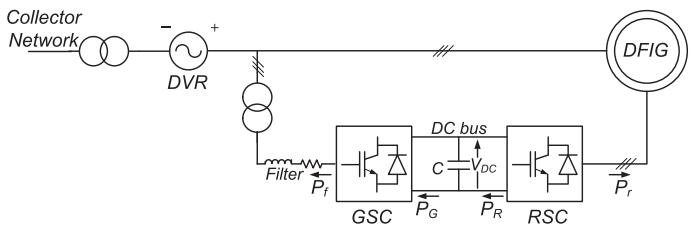  
Fig. 1. Schematic Diagram of the Doubly-Fed Asynchronous Generator (DFAG) Unit, Grid-Side Converter (GSC), Rotor-Side Converter (RSC).

developed model is demonstrated through several case studies, using the PSCAD/EMTDC in Sections VIII and IX. Discussion of the study results and the conclusions are in Sections X and XI, respectively.

# II. BACKGROUND

The DFAG-based WTG, Fig. 1 is widely used in the existing WPPs [1] where each DFAG unit is connected to the collector network directly through its stator while its rotor is interfaced to the network through a back-to-back converter system, Fig. 1. The converter system allows independent control of the active power delivery and the reactive power exchange with the grid. The rotor-side converter (RSC) often controls the stator power flow based on a smaller percentage of power injected into the rotor circuit; therefore, the back-to-back converter is typically rated to 30–40% of the machine rated power. The reduced size of the converter translates to a reduced cost of both the converter and its filter. In addition, it reduces converter losses, compared to a full rated converter [2], [3].

There are various control schemes for a DFAG-based WTG in a WPP [4]. The equivalent model of this paper is based on the DFAG detailed model of Appendix A where the RSC controls the generator torque and the stator reactive power flow and the grid-side converter (GSC) controls the DC-link voltage and the reactive current at the machine terminal. The GSC and RSC controls utilize decoupled current-controllers with inner dq current control loops. The detailed model is also used as a benchmark to validate the accuracy of the developed equivalent model. It has to be noted that the proposed model can readily accommodate other control strategies as well.

The DFAG-based WPP is required to meet the fault-ridethrough (FRT) requirements [1], [5]–[7]. This paper adopts a dynamic voltage restoration mechanism [6], [7] to assist in boosting the unit terminal voltage during transients and thus enable the DFAG unit and the WPP to provide ride-through capability.

# III. DYNAMIC EQUIVALENT MODEL OF TYPE-3 WPP

Unlike the detailed WPP model which explicitly models each of the individual components of a WPP, i.e., the WTG units and their power electronic converters, local controllers, the collector network, and the WPP supervisory controller, the proposed equivalent emulates the collective terminal behavior of the WPP at the PCC using a reduced-order wideband model. The proposed equivalent model consists of two main parts, Fig. 2:

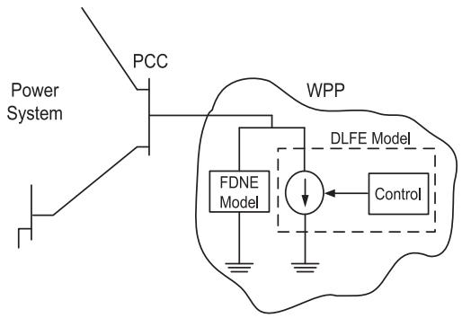  
Fig. 2. Structure of the Wide-band Equivalent Model of a Type-3 WTGs-based WPP.

1) A frequency-dependent network equivalent (FDNE) model [8] that represents the frequency response of the passive components within the WPP, e.g., the collector network, transformers, passive loads, and capacitor banks over the desired frequency spectrum. The Vector Fitting (VF) technique [8] is used to fit the frequency response to a rational function representation of the form

$$
f _ {f i t} (s) = \sum_ {i = 1} ^ {n} \frac {c _ {i}}{s - a _ {i}} + d + s h \tag {1}
$$

where residues $c _ { i }$ and poles $a _ { i }$ are either real or complex numbers while d and $h$ are real. The fitting process estimates the parameters of (1) such that a least square approximation of $f _ { f i t } \left( s \right)$ is obtained over the frequency range of interest.

The VF technique solves the nonlinear problem of (1) sequentially in two stages. Based on an initial set of poles, each stage is mathematically formulated as a linear problem with a known set of poles [8]. To interface the FDNE with the electrical network model, the companion circuit approach is adopted [9]–[11]. Based on the bilinear transformation each of the rational functions of (1) is represented by a conductance and a current source whose value depends on the circuit solution from the previous time-step.

2) A dynamic low frequency equivalent (DLFE) model that represents the aggregated dynamic model of the DFAG-WTGs, their local controls, and the WPP supervisory control, typically, in a frequency range of 0 up to 20 Hz. The DLFE is interfaced to the electrical network model through a three-phase current-controlled current source.

The combined FDNE model and the DLFE model constitute the net model of the WPP with respect to its host power system at the PCC in the desired wide frequency range. As demonstrated in [12], neither the FDNE model nor the DLFE model individually can accurately represent the WPP. Both the FDNE model and the DLFE model have to be jointly used to provide an accurate model of the WPP.

It has to be noted that the proposed model is not a valid representation if the disturbance is within the WPP. The main assumption in the development and applications of the

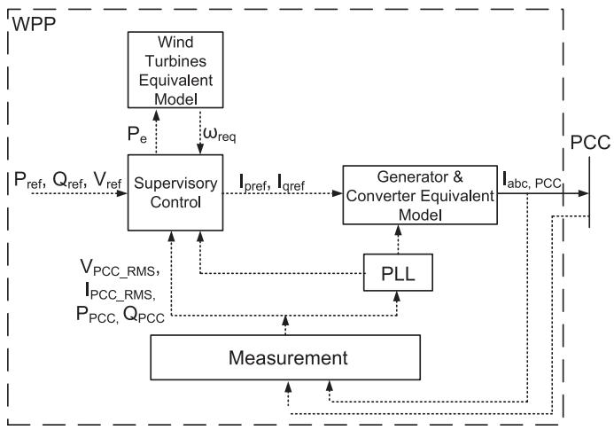  
Fig. 3. Dynamic Low-Frequency Equivalent of Type-3 WPP.

proposed model is that the imposed disturbances are outside of the WPP and thus the configuration of the WPP remains unchanged. Therefore, the FDNE accurately represents the collector system and passive components of the WTG units. The FDNE only represents linear components.

The second part of the proposed equivalent model represents the WTG units, the WTG unit controls, and the supervisory control of the WPP. Any of these three entities is subject to mathematical/physical nonlinearities. However, these nonlinearities are included in the DLFE part of the model.

# IV. STRUCTURE OF THE DYNAMIC LOW-FREQUENCY EQUIVALENT MODEL OF THE TYPE-3 WPP

The DLFE model of the Type-3 based WPP, Fig. 3, represents the dynamics of the aggregated WTG units and the natural modes of controls. Based on the DFAG structure and its components, described in Appendix A, the DLFE of Fig. 3 is proposed. The DLFE constitutes a complete equivalent of the DFAG-based WPP low-frequency dynamics.

The measurement block represents the functions of the measuring devices of the WPP. It acquires instantaneous three-phase PCC voltage and the WPP net current (at the HV-side of WPP substation transformer) and generates the required signals for control and phase-locked loop (PLL) blocks. The PLL provides synchronization to the positive-sequence PCC voltages. The wind turbines equivalent block represents the dynamics of the aggregated wind turbines. It determines the WPP equivalent mechanical power that corresponds to the wind speed, taking into consideration the wind turbine characteristics. This block also includes an equivalent drive-train model that computes the equivalent angular frequency $\omega _ { \mathrm { r e q } } , \mathrm { F i g } . 3$ .

The supervisory control block represents the functions of the WPP supervisory control which includes the control of active and reactive power components injected by the WPP into the system [13], [14]. This block determines the $d -$ and q-current references corresponding to the WPP $P$ and $Q$ reference values. The FRT control function is also represented in this block. The FRT control provides the reference currents to enable the WPP

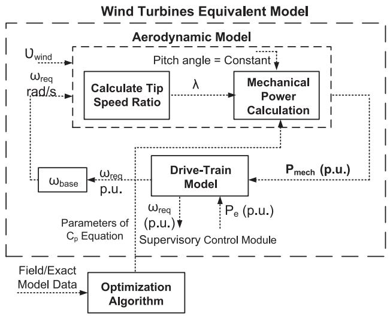  
Fig. 4. Wind Turbine Equivalent Model.

fault ride-through subsequent to transients [15], [16]. The generators and converters equivalent block represents the dynamics of the aggregated machines, converters, and their local controllers. This block injects currents into the system at the PCC, in response to the current references generated by the supervisory control. The following sections elaborate on the details of each block.

# V. EQUIVALENT MODEL OF WIND TURBINES

This model is an equivalent of the WPP wind turbines rotating mechanical system. This model provides transformation of the wind energy into mechanical power and the aggregated dynamic behavior of the drive-trains and is composed of two main parts, Fig. 4:

1) The aerodynamic-equivalent model that determines the mechanical power harnessed from the wind based on the wind speed and the power coefficient $\left( C _ { p } \right)$ .   
2) The drive-train model that determines the equivalent generator and turbine angular speeds $\omega _ { \mathrm { r e q } }$ and $\omega _ { \mathrm { t e q } }$ respectively.

The following subsections elaborate on the components of the wind turbines equivalent model.

# A. Aerodynamic Equivalent Model

This equivalent model computes the mechanical power $d P _ { \mathrm { m e c h } }$ extracted from the wind, [17], as a function of the wind speed and the turbine power coefficient $C _ { p }$

$$
P _ {\text {m e c h}} = \frac {1}{2} \rho A v _ {\text {w i n d}} ^ {3} C _ {p} (\lambda , \beta) / S _ {\text {b a s e}} ^ {W T G} \tag {2}
$$

where $\rho , A , v _ { \mathrm { w i n d } } , \lambda , \beta$ and $S _ { \mathrm { b a s e } } ^ { W T G }$ are the air density in $\mathrm { k g / m ^ { 3 } }$ , the area of the rotor blades in $m ^ { 2 }$ , the wind speed in $m / s$ , the blade tip speed ratio, the blade pitch angle, and the base power of one WTG respectively; the output $P _ { \mathrm { { m e c l } } }$ h is in per unit. λ is

the ratio between the speed at the blade tip and the wind speed

$$
\lambda = \frac {v _ {\text {t i p}}}{v _ {\text {w i n d}}} = \frac {\left(\omega_ {\text {r e q}} / G\right) . r}{v _ {\text {w i n d}}} \tag {3}
$$

where r is the blade radius and G is the gearbox ratio. The turbine power coefficient $C _ { p } \left( \lambda , \beta \right)$ is usually represented by a set of curves; each curve relates $C _ { p }$ and λ for a certain pitch angle β. Typically these curves are mathematically represented by [17], [18]:

$$
\begin{array}{l} C _ {p} (\lambda , \beta) = c _ {1} \left(\frac {c _ {2}}{\lambda_ {i}} - c _ {3} \beta - c _ {4} \beta^ {c _ {5}} - c _ {6}\right) \exp \left(\frac {- c _ {7}}{\lambda_ {i}}\right), (4) \\ \lambda_ {i} = \left[ \left(\frac {1}{\lambda + c _ {8} \beta}\right) - \left(\frac {c _ {9}}{\beta^ {3} + 1}\right) \right] ^ {- 1} \tag {5} \\ \end{array}
$$

where constants $c _ { 1 }$ to $c _ { 9 }$ are determined such that the resulting equation/curves represent the performance of the actual turbine [18]–[20]. An optimization algorithm, described in Sub-Section V-B is used to determine these constants based on the simulation results or field measurements. $P _ { m e c h }$ of one WTG unit (2) is then scaled to all the units within the WPP.

Typically, all units within the WPP are of the same size and type; therefore, the per unit mechanical power calculated from (2), based on the WTG unit MVA, also provides the total power of the WPP when multiplied by the WPP base MVA. If the units within the WPP are of different sizes or have different turbine characteristics, each set of identical units can be aggregated as a sub-group. The total mechanical power of each sub-group is calculated as described before and then the WPP’s total power is the summation of those sub-groups. If the units experience different wind speeds with small deviations, then

$$
v _ {e q} = \frac {1}{n} \sum_ {i = 1} ^ {n} v _ {i} \tag {6}
$$

where $\boldsymbol { v } _ { e q }$ is the WPP equivalent wind speed, n is the number of WTG units, and $v _ { i }$ is the wind speed at unit i. If wind units are exposed to noticeably different wind speeds, then the WPP equivalent speed is calculated using the WPP power curve [21] as follows.

i) For each unit, based on its wind speed, the WTG output power $P _ { i }$ is obtained using the WTG power curve and the total WPP output power is the summation of power components of all units $\begin{array} { r } { P _ { W P P } = \sum _ { i = 1 } ^ { n } P _ { i } } \end{array}$ .   
ii) An equivalent WPP power curve is obtained by summing the individual WTG units power curves. This is done by summing the powers of the individual WTG units for each incoming wind speed.   
iii) From the curve of (ii), the WPP equivalent wind speed, corresponding to the WPP power of (i) is obtained.

# B. Parameter Estimation of Wind Turbine Equivalent Model

If the wind turbine manufacturers data is not available, an optimization algorithm is used to identify the parameters for the wind turbine model. This is based on the results from simulation of the detailed model or the field measurements.

The constants $c _ { 1 }$ to $c _ { 9 }$ of (4) need to be determined to minimize deviation between $P _ { m e c h }$ of the equivalent model (2) and

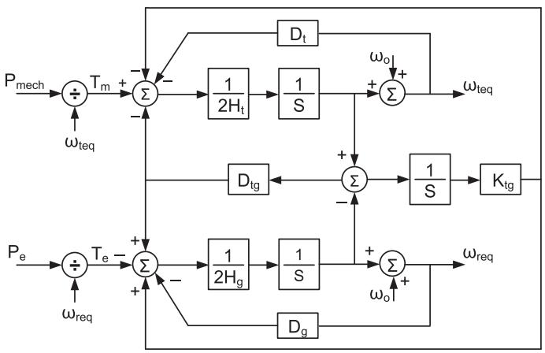  
Fig. 5. Block diagram of the Two-Mass Drive-Train Model.

that of the original WTG unit $( P _ { m . o r g } )$ . This requires measurements results or detailed simulation results of $P _ { m \_ o r g }$ , υw in d , $\beta ,$ and $\omega _ { r }$ . Based on this data and a least square minimization process, an optimization with the objective function

$$
F = \frac {\left\| P _ {m e c h} - P _ {m \_ o r g} \right\|}{\left\| P _ {m \_ o r g} \right\|}, \tag {7}
$$

is constructed. The MATLAB optimization toolbox is used for minimizing (7) [22].

# C. Drive-Train Mechanical Model

This paper adopts the widely accepted approach of representing the wind turbine drive-train with two rigid masses [23], [24] representing the turbine and the the generator inertias

$$
\begin{array}{l} \left[ \begin{array}{l} 2 H _ {t} \\ 2 H _ {g} \end{array} \right] \left[ \begin{array}{l} \frac {d \omega_ {t e q}}{d t} \\ \frac {d \omega_ {r e q}}{d t} \end{array} \right] + \left[ \begin{array}{l l} D _ {t} + D _ {\mathrm {t g}} & - D _ {\mathrm {t g}} \\ - D _ {\mathrm {t g}} & D _ {g} + D _ {\mathrm {t g}} \end{array} \right] \left[ \begin{array}{l} \omega_ {\mathrm {t e q}} \\ \omega_ {\mathrm {r e q}} \end{array} \right] \\ + \left[ \begin{array}{l} K _ {\mathrm {t g}} - K _ {\mathrm {t g}} \\ - K _ {\mathrm {t g}} K _ {\mathrm {t g}} \end{array} \right] \left[ \begin{array}{l} \theta_ {t} \\ \theta_ {r} \end{array} \right] = \left[ \begin{array}{l} T _ {m} \\ - T _ {e} \end{array} \right], \tag {8} \\ \end{array}
$$

where

$$
\frac {d \theta_ {t}}{d t} = \omega_ {t}, \frac {d \theta_ {r}}{d t} = \omega_ {r}, \tag {9}
$$

and $T _ { m }$ and $T _ { e }$ are the mechanical and electrical torques respectively. H, D, and K are the inertia constant, damping coefficient, and stiffness coefficient respectively. θ is the angular position. Subscripts t and g refer to the turbine and generator respectively. Fig. 5 illustrates a block diagram model of the the drive-train. The inputs to the model are the equivalent mechanical and electrical power components from the aerodynamic model and the WPP supervisory control, respectively. The outputs of the model are the turbine and generator equivalent angular frequencies. It is to be noted that this model represents the low-frequency dynamics of aggregated WTG units drive-trains in a frequency range up to about 3 Hz [14].

The model of (8) can be further simplified to a single-mass model in which the inertia constant $\left( H _ { t } + H _ { g } \right)$ and the damping coefficient represents the net damping of the drive-train,

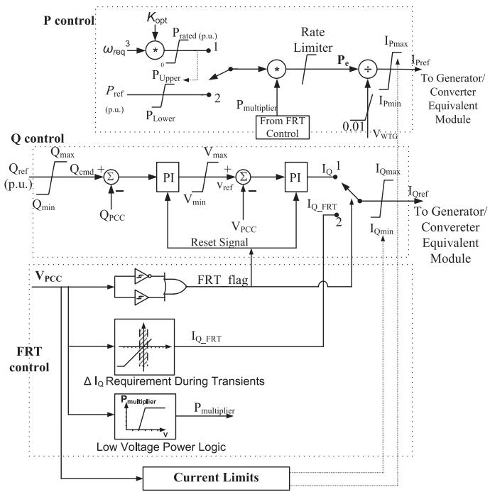  
Fig. 6. Block Diagram of the Supervisory Control Module.

[14], [25], [26],

$$
2 \left(H _ {t} + H _ {g}\right) \frac {d \omega}{d t} = T _ {m} - T _ {e} - D \omega . \tag {10}
$$

# VI. WPP SUPERVISORY CONTROL

The supervisory control constitutes a part of the WPP DLFE equivalent model, Fig. 3, and represents the operation of the WPP central control. It includes (i) P control, (ii) Q control, (iii) fault-ride through (FRT) control, and (iv) current limits calculations. The functions of this equivalent module include:

1) Generation of the dq-current references to satisfy the grid requirements corresponding to P and Q and/or to satisfy certain control objectives, e.g., PCC voltage control, taking into consideration feedback signals from the PCC.   
2) Representing the active and reactive power generation availability of WTG units, taking into consideration the available wind and the units generation limits.   
3) Enabling the FRT control based on the grid requirements.   
4) Enabling the limits that should be imposed on the WTG units reference currents/power based on the operation requirements.

The above functions are implemented through the control structure of Fig. 6. The P control block, Fig. 6, can be switched between two modes:

1) Maximum Power Tracking Mode—The maximum power that can be extracted from the wind is calculated from $P _ { \mathrm { r e f } } = K _ { \mathrm { o p t } } \omega _ { \mathrm { r e q } } ^ { 3 }$ . This power set point is limited to the rated power of the WPP to avoid over loading.   
2) Operator Requirement Mode—The active power set point $P _ { \mathrm { r e f } }$ is received from the operator. $P _ { \mathrm { r e f } }$ is limited to the power value at point 1, Fig. 6, to guarantee that the control set point does not exceed either the WPP rating or the power available from the wind.

The Q control, Fig. 6, is a coordinated Q/V controller that determines the reactive current command $I _ { \mathrm { Q r e f } }$ to satisfy the requirements of both $Q _ { r e f }$ and voltage control at the PCC. $Q _ { \mathrm { r e f } }$ is determined based on either the PCC voltage control, power factor control, or the PCC reactive power control.

During transients, e.g., faults, that are accompanied with voltage fluctuations at the PCC, the FRT should retain the WPP in service and enable ride through the fault [15], [16]. Based on the voltage at the WPP terminals, the FRT control determines the value of the supplied $I _ { \mathrm { Q r e f } }$ during the ride-through process [27]. It also coordinates the increase in reactive current/reactive power injected by the WPP with a decrease in real current/power injection through the less than unity $P _ { \mathrm { m u l t i p l i e r } }$ , Fig. 6, to avoid overload conditions.

The limits applied on $Q _ { \mathrm { r e f } }$ represent the WTG limits with respect to the reactive power generation/absorption. The limits on $I _ { \mathrm { P r e f } }$ and $I _ { \mathrm { Q r e f } }$ are applied such that their net effect does not exceed the total current limit of the aggregated WTG units. The priority of generation may be given to the active or the reactive current based on the steady state/transient operation. The outputs of the supervisory control module are: (i) the dq-current references for the module of the generators and converters equivalent model, and (ii) the electrical power $P _ { e }$ , Fig. 6, for the wind turbines equivalent module.

# VII. EQUIVALENT MODEL OF THE GENERATORS ELECTRICAL SIDE AND CONVERTERS

This section presents the dynamic equivalent model of the DFAG units, their converters, and local controls. This equivalent model represents the response of the WTG units to commands from the WPP supervisory control, Fig. 3. The equivalent model of one WTG unit is developed in per unit on the unit base values. By scaling the base values, the equivalent model is used to approximate the response of all units within the WPP. The equivalent model is deduced based on the detailed model of the DFAG unit, (16)–(19), Appendix A, as follows.

By substituting $i _ { s }$ in (19) from (18)

$$
\vec {\psi} _ {r} = \frac {L _ {m}}{L _ {s}} \overrightarrow {\psi_ {s}} + \left(L _ {r} - \frac {L _ {m} ^ {2}}{L _ {s}}\right) \overrightarrow {i _ {r}}. \tag {11}
$$

Defining $\begin{array} { r } { \sigma = 1 - \left( \frac { L _ { m } ^ { 2 } } { L _ { s } L _ { r } } \right) , \sigma _ { s } = \frac { L _ { s } } { L _ { m } } - 1 } \end{array}$ Ls − 1, and σr = Lm $\begin{array} { r } { \sigma _ { r } = \frac { L _ { r } } { L _ { m } } - 1 } \end{array}$ L r − 1, Lm from (11) we deduce

$$
\vec {\psi} _ {r} = \left(\frac {1}{1 + \sigma_ {s}}\right) \overrightarrow {\psi_ {s}} + \sigma (1 + \sigma_ {r}) L _ {m} \overrightarrow {i _ {r}}. \tag {12}
$$

By differentiating (12) and substituting for $\frac { d \vec { \psi _ { r } } } { d t }$ from (17)

$$
\sigma \left(1 + \sigma_ {r}\right) L _ {m} \frac {d \vec {i} _ {r}}{d t} = \vec {V} _ {r} - R _ {r} \vec {i} _ {r} - j \Delta \omega \vec {\psi} _ {r}. \tag {13}
$$

Note that the stator flux derivative is neglected, i.e., $\begin{array} { r } { \frac { d \vec { \psi } _ { s } } { d t } = 0 } \end{array}$ [4], [13], [28], [29]. This assumption is valid because of the voltage restoration mechanism which limits the stator voltage

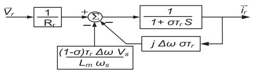  
Fig. 7. Block Diagram of DFAG Equations.

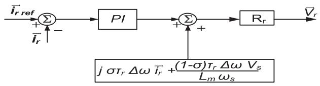  
Fig. 8. RSC Current Control.

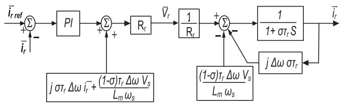

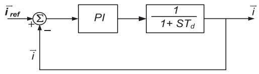  
Fig. 9. DFAG Model and RSC Control.   
Fig. 10. Equivalent Model of the Generator and Converter.

variations. Substituting $\vec { \psi _ { r } }$ from (12) in (13) and dividing by $R _ { r }$

$$
\sigma \tau_ {r} \frac {d \vec {i _ {r}}}{d t} = \frac {\vec {V _ {r}}}{R _ {r}} - \vec {i _ {r}} - j \Delta \omega \left(\frac {\vec {\psi_ {s}}}{(1 + \sigma_ {s}) R _ {r}} + \sigma \tau_ {r} \vec {i _ {r}}\right), \tag {14}
$$

where $\begin{array} { r } { \tau _ { r } = \frac { ( 1 + \sigma _ { r } ) L _ { m } } { R _ { r } } } \end{array}$ (1+σr )Lm . Re-arranging (14) results in (15) R r

$$
\sigma \tau_ {r} \frac {d \vec {i _ {r}}}{d t} + \vec {i} _ {r} = \frac {\vec {V} _ {r}}{R _ {r}} - j \frac {(1 - \sigma) \tau_ {r}}{L _ {m}} \Delta \omega \vec {\psi_ {s}} - j \Delta \omega \sigma \tau_ {r} \vec {i} _ {r}. \tag {15}
$$

and illustrated in Fig. 7. The inputs to the block diagram of Fig. 7 are the rotor voltages Vr and the outputs are the rotor currents. $\vec { V _ { r } }$ is controlled by the RSC control as described in Appendix B. The RSC inner control, Fig. 17, can be represented as shown in Fig. 8. Figs. 7 and 8 provide the DFAG model depicted in Fig. 9. To further simplify the model and present it in a form that relates the inputs and outputs of the WTG unit, independent of the internal parameters, the following can be considered [13]:

1) The feedback and the cross coupling terms in the machine model, Fig. 9, are canceled out by a similar terms in the RSC control model.   
2) The magnetizing current is assumed to be negligible; thus, the per unitized rotor currents are replaced with the per unitized stator currents.

Considering the above simplifications, the resultant machine and converter equivalent model is composed of one P I controller and one first-order function as depicted in Fig. 10. This model can be used to represent the entire WTG; however, in this case, the parameters of the equivalent model are no longer

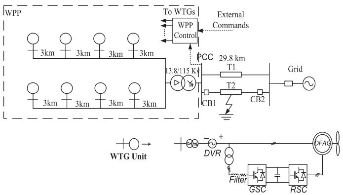  
Fig. 11. Schematic Diagram of the Type-3 WPP Test System.

directly related to the WTG parameters. These parameters can be directly obtained from an optimization process that minimizes the error between the responses of the equivalent model and a detailed DFAG model [30].

# VIII. TEST SYSTEM

The system of Fig. 11 is used to validate the accuracy of the proposed WPP equivalent model in representing the dynamic response of Type-3 based WPPs. The WPP is composed of (i) one 13.8/115-kV transformer, (ii) a 13.8-kV collector system, (iii) 2.3-kV DFAG WTG units and their local controllers that are connected to the collector system through dynamic voltage restorers (DVRs) and 2.3/13.8-kV $\mathrm { Y g } / \Delta$ transformers, and (iv) the WPP supervisory control. The WPP includes eight 1.7 MW Type-3 units. The transmission lines and WTG unit parameters are available in [12].

The AC-side terminal of each grid-side converter is connected to a three-phase RL filter and a three-phase 0.6/2.3-kV Y/Δ transformer. Each converter is equipped with a dq-current controller that regulate its $i _ { p }$ and $i _ { q }$ current injection. The WPP supervisory control provides reference values for each WTG unit to meet the grid power requirements and FRT requirements during transients. The adopted FRT characteristics are described in [15], [27].

# IX. STUDY RESULTS

A set of case studies are performed on the system of Fig. 11 to demonstrate the performance and verify the accuracy of the WPP equivalent model. The test cases cover different types of faults at different locations in the system with respect to the PCC. The test cases also include (i) symmetrical and asymmetrical fault scenarios and (ii) successful and unsuccessful autoreclosure of circuit breakers. For each case study, the power system (right-side of the PCC of Fig. 11) is modeled in the PSCAD/EMTDC environment and the WPP (left-side of the PCC of Fig. 11) is represented once by its detailed model, and once by its equivalent model. Due to page limitation, only the results for two case studies are presented and the reader is referred to [12] for more test cases.

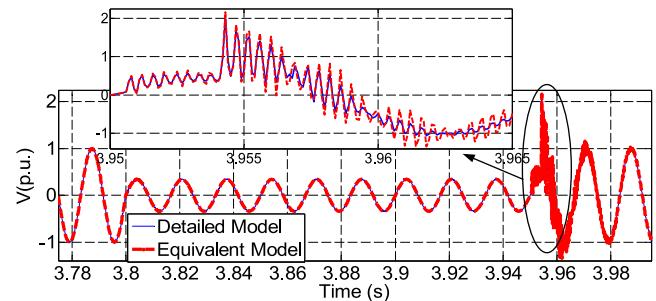

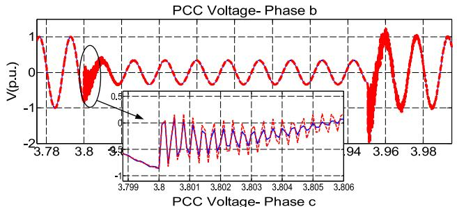

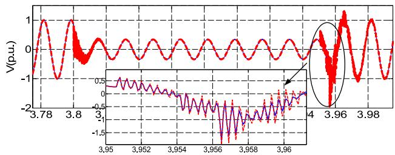  
Fig. 12. PCC Voltages of the Detailed and the Equivalent Models, Case I.

# A. Case I

The system is subjected to a 150-ms temporary L-L-L-G fault, 15-km from the PCC on line T2 at t = 3.8 s. Prior to the fault, the system is under steady-state conditions and the WPP delivers 12 MW to the system at PCC. Figs. 12––14 show the system response to the fault based on the detailed model and the equivalent model of the WPP.

Fig. 12 shows the instantaneous PCC voltages prior, during, and immediately after the fault and illustrates close agreement between the results of the equivalent model and the detailed model. Fig. 13 shows the injected currents by the WPP into the system (at the WPP transformer HV-side) during and after the fault clearance and also indicates close agreement between the results of the two models.

Fig. 14 shows real and reactive power and current components and the PCC rms voltage. Fig. 14 also illustrates the PCC voltage FRT characteristic [15]. Fig. 14 indicates that during the fault, the WPP remains in service even when the PCC voltage, Fig. 14(e), drops to 35% of its nominal value. Figs. 14(c) and 14(d) show the WPP output reactive current increases to 1.0 p.u. while the active current drops to zero when the voltage drop.

# B. Case II

This case study is similar to Case I except that the fault type is changed to L-G fault. Figs. 15 and 16 show the PCC voltages and the WPP output currents, respectively, based on the detailed model and the equivalent model of the WPP. Figs. 15 and 16

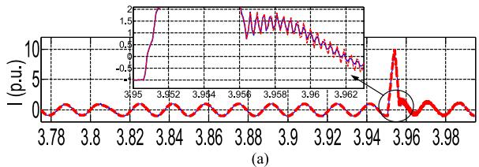

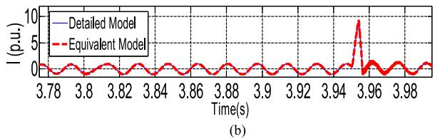

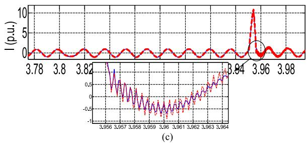  
Fig. 13. PCC Output Currents of the Detailed and the Equivalent Models— Case I. (a) Phase a (b) Phase b (c) Phase c.

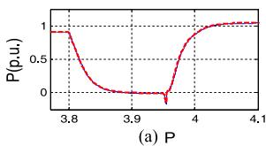

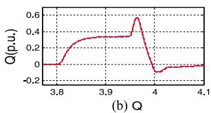

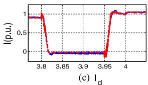

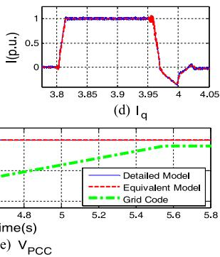

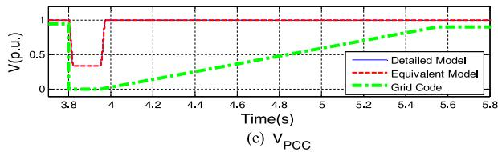  
Fig. 14. WPP Outputs (a) Active Power (b) Reactive Power (c) Active Current (d) Reactive Current (e) PCC Voltage of the Detailed and the Equivalent Models.

demonstrate also close agreement between the results of the detailed and the equivalent models underunbalanced conditions.

# X. DISCUSSIONS

The close agreement between the time-domain simulation results obtained from the detailed and the equivalent models of the WPP verifies the accuracy of the proposed equivalent model for EMT-type studies external to the WPP. In addition, the variety of the simulation scenarios that cover (i) different types of faults at different locations outside the WPP and (ii) multiple switching transients demonstrate the accuracy of the proposed model subject to symmetrical/asymmetrical faults regardless of their location, even when they occur at the PCC.

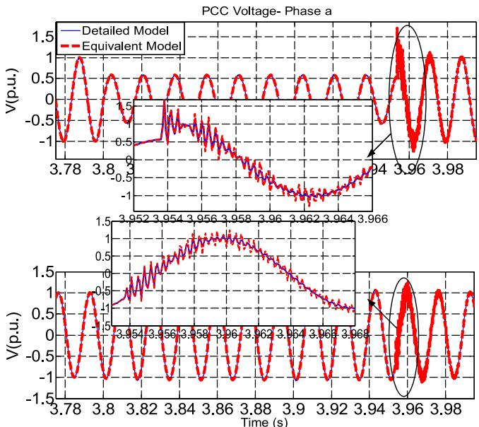

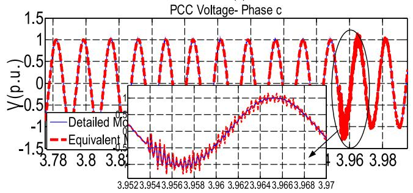  
Fig. 15. PCC Voltages of the Detailed and the Equivalent Models, Case II.

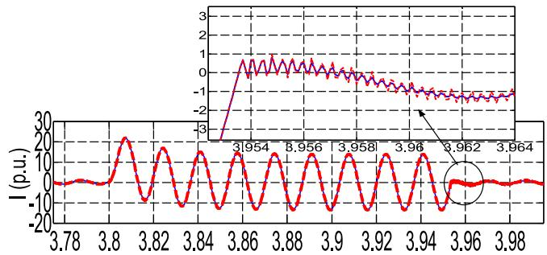

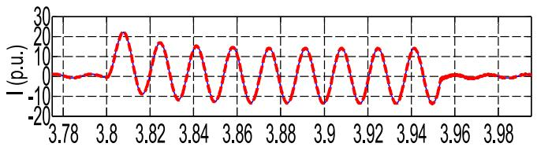  
(a)   
(b)

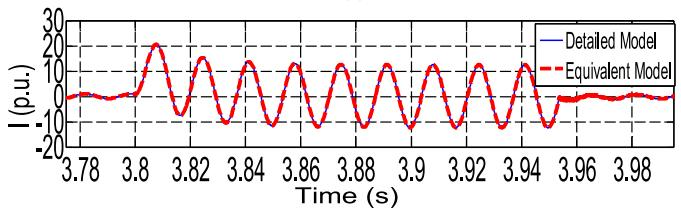  
（c）  
Fig. 16. PCC Output Currents of the Detailed and the Equivalent Models— Case II. (a) Phase a (b) Phase b (c) Phase c.

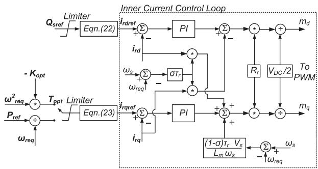  
Fig. 17. Block Diagram of the Rotor Side Converter Control.

The proposed equivalent model significantly reduces the computational time and resources and hence enables comprehensive time-domain simulation studies of the system transients, e.g., statistical EMT-type studies to identify and evaluate worst case fault scenarios, e.g., fault instant on the voltage waveform. The time required to conduct a 5-second real-time simulation run, with a 5 μs time-step, using the detailed system model, corresponding to Fig. 11, requires approximately 31 hours and 34 minutes using a quad-core Intel 3.07 GHz i7 computer with 6 GB of memory. The proposed equivalent model reduces the computational time for the same case study (and with the same simulation time-step) to about 45.12 seconds, i.e., a reduction in computation time by a factor of 2480. The computational efficiency of the equivalent model makes it a prime choice when it is required to conduct large-scale EMT-type studies for systems with multiple WPPs or for the use within a real-time simulation environment.

# XI. CONCLUSION

This paper presents a reduced-order dynamic equivalent model that represents the Type-3-based wind power plant for the analysis of electromagnetic transients external to the plant, within the desired frequency bandwidth. To evaluate the computational efficiency and validate the numerical accuracy of the proposed equivalent model, the adopted test system transients are simulated in the PSCAD/EMTDC environment once based on the WPP detailed model and once based on the WPP equivalent model and the corresponding time-domain simulation results are compared. The studies show close agreement between the corresponding results. The study results show that the proposed equivalent WPP model can reduce computational time by a factor of 2480, e.g., from 31 hours and 34 minutes to 45.12 seconds.

# APPENDIX A

The differential equations that describe the performance of the DFAG in the synchronous reference frame [4], [28] are

$$
\vec {V} _ {s} = R _ {s} \vec {i} _ {s} + \frac {d \vec {\psi} _ {s}}{d t} + j \omega_ {s} \vec {\psi} _ {s}, \tag {16}
$$

$$
\vec {V} _ {r} = R _ {r} \vec {i} _ {r} + \frac {d \vec {\psi} _ {r}}{d t} + j (\omega_ {s} - \omega_ {r}) \vec {\psi} _ {r} \tag {17}
$$

where $\vec { V _ { s } }$ and $\vec { V _ { r } }$ are the stator and rotor voltages; $\vec { i } _ { s }$ and $\vec { i } _ { r }$ are the stator and rotor currents; $\vec { \psi _ { s } }$ and $\vec { \psi _ { r } }$ are the stator and rotor fluxes; $R _ { s }$ and $R _ { r }$ are the stator and rotor resistances respectively. $\omega _ { s }$ is the stator synchronous frequency; and $\omega _ { r }$ is the angular frequency of the rotor. All parameters of the above equations are referred to the stator side of the DFAG. The stator and rotor fluxes are given by [4], [28]

$$
\vec {\psi} _ {s} = L _ {s} \vec {\mathrm {i}} _ {s} + L _ {m} \vec {\mathrm {i}} _ {r}, \tag {18}
$$

$$
\vec {\psi} _ {r} = L _ {m} \vec {\mathrm {i}} _ {s} + L _ {r} \vec {\mathrm {i}} _ {r}, \tag {19}
$$

$$
L _ {s} = L _ {\sigma s} + L _ {m}, \tag {20}
$$

$$
L _ {r} = L _ {\sigma r} + L _ {m} \tag {21}
$$

where $L _ { m }$ is the magnetizing inductance; $L _ { \sigma } ,$ s and $L _ { \sigma r }$ are the stator and rotor winding leakage inductances respectively. The rotor dynamics are represented by

$$
\frac {d \omega_ {r}}{d t} = \frac {1}{2 H} \left(T _ {m} - T _ {e}\right), \tag {22}
$$

where $T _ { m }$ and $T _ { e }$ are the mechanical and electrical torques respectively and H is the inertia constant.

The RSC and the GSC are three-phase two-level VSCs. The RSC and GSC local controls are developed in a synchronously rotating dq-frame of reference. The RSC with the decoupled current controller controls the amplitude and frequency of rotor voltages to control the generator torque and stator reactive power. The GSC controls its output voltages to maintain the dc-link voltage and to control the reactive power exchange with the network.

# APPENDIX B

The local control of the RSC controls the generator torque and the stator reactive power flow through an inner and outer control loops. In the outer control loop, the torque and reactive power references are translated to a corresponding dq current references. The current references are then sent to the RSC inner decoupled current control loop [4], [28]. The control of the RSC is derived in a synchronously rotating dq-reference frame synchronized with the stator flux. Based on (16)–(22), the stator reactive power and the electromagnetic torque are [28]

$$
Q _ {s} = \left(\frac {3}{2}\right) \frac {\hat {V} _ {s} ^ {2}}{\left(1 + \sigma_ {s}\right) L _ {m} \omega_ {s}} - \left(\frac {3}{2}\right) \frac {1}{\left(1 + \sigma_ {s}\right)} \hat {V} _ {s} i _ {r d}, \tag {23}
$$

$$
T _ {e} = \frac {P _ {e}}{\omega_ {r}} = - \left(\frac {3}{2}\right) \frac {\hat {V} _ {s}}{\left(1 + \sigma_ {s}\right) \omega_ {s}} i _ {r q} \tag {24}
$$

where

$$
\hat {V} _ {s} = \sqrt {V _ {d} ^ {2} + V _ {q} ^ {2}}, \text {a n d} \sigma_ {s} = \frac {L _ {s}}{L _ {m}} - 1. \tag {25}
$$

The reference currents determined by (23) and (24) are sent to the RSC inner current controller, Fig. 17. σ and τ refer to the machine parameters, i.e., $\sigma = 1 - \left( L _ { m } ^ { 2 } / \left( L _ { s } L _ { r } \right) \right)$ and $\tau _ { r } =$ $L _ { r } / R _ { r }$ .

# REFERENCES

[1] J. Lopez, E. Gubia, E. Olea, J. Ruiz, and L. Marroyo, “Ride through of wind turbines with doubly fed induction generator under symmetrical voltage dips,” IEEE Trans. Ind. Electron., vol. 56, no. 10, pp. 4246–4254, Oct. 2009.   
[2] S. Muller, M. Deicke, and R. De Doncker, “Doubly fed induction generator systems for wind turbines,” IEEE Ind. Appl. Mag., vol. 8, no. 3, pp. 26–33, May/Jun. 2002.   
[3] IEEE PES Wind Plant Collector System Design Working Group, “Characteristics of wind turbine generators for wind power plants,” presented at the IEEE Power Energy Soc. Gen. Meeting, Calgary, AB, pp. 1–5, 2009.   
[4] G. Abad, J. Lopez, M. A. Rodriguez, P. Guez, L. Marroyo, and G. Iwanski, Dynamic Modeling of the Doubly Fed Induction Machine. Hoboken, NJ, USA: Wiley, 2011.   
[5] D. Xiang, L. Ran, P. Tavner, and S. Yang, “Control of a doubly fed induction generator in a wind turbine during grid fault ridethrough,” IEEE Trans. Energy Convers., vol. 21, no. 3, pp. 652–662, Sep. 2006.   
[6] A. Ibrahim, T. Nguyen, L. D, and S. Kim, “A fault ride-through technique of DFIG wind turbine systems using dynamic voltage restorers,” IEEE Trans. Energy Convers., vol. 26, no. 3, pp. 871–882, Sep. 2011.   
[7] C. Wessels, F. Gebhardt, and F. Fuchs, “Fault ride-through of a dfig wind turbine using a dynamic voltage restorer during symmetrical and asymmetrical grid faults,” IEEE Trans. Power Electron., vol. 26, no. 3, pp. 807–815, Mar. 2011.   
[8] B. Gustavsen and A. Semlyen, “Rational approximation of frequency domain responses by vector fitting,” IEEE Trans. Power Del., vol. 14, no. 3, pp. 1052–1061, Jul. 1999.   
[9] B. Gustavsen and O. Mo, “Interfacing convolution based linear models to an electromagnetic transients program,” in Proc. Int. Conf. Power Syst. Transients, Jun. 2007, pp. 1–6.   
[10] M. Matar, M. Abd-El-Rahman, and A. Soliman, “Developing an FPGA coprocessor for real time simulation of power systems,” presented at the ICEEC, Cairo, Egypt, Aug. 2004.   
[11] M. Matar and R. Iravani, “FPGA implementation of a modified two-layer network equivalent for real-time simulation of electromagnetic transients,” in International Conference on Power Systems Transients, 2009.   
[12] D. N. Hussein, A wide-band dynamic equivalent model of wind power plants for the analysis of electromagnetic transients in power systems, Ph.D. dissertation, Dept. Elect. Comput. Eng. University of Toronto, Toronto, Canada, ON, 2014.   
[13] J. Fortmann, S. Engelhardt, J. Kretschmann, C. Feltes, M. JanBen, T. Neumann, and I. Erlich, “Generic simulation model for DFIG and full size converter based wind turbines,” in IEEE PES General Meeting, Detroit, MI, USA, pp. 1–8, 2011.   
[14] K. Clark, N. W. Miller, and J. J. Sanchez-Gasca, “Modeling of GE wind turbine-generators for grid studies,” Version 4.5, Apr. 2010.   
[15] , The Wind Generation Task Force (WGTF), The Technical Basis for the New Wecc Voltage Ride-Through (VRT) Standard a White Paper Developed by the Wind Generation Task Force1 (WGTF), 2007 Tech. Rep., [Online]. Available: www.wecc.bi3/Realibility/VoltageRide Through white Paper.pdf   
[16] I. Erlich, W. Winter, and A. Dittrich, “Advanced grid requirements for the integration of wind turbines into the german transmission system,” presented at the IEEE Power Eng. Soc. Gen. Meeting, Montreal, QC, 2006.   
[17] S. Heier, Grid Integration of Wind Energy Conversion Systems. New York, USA: Wiley, 1998.   
[18] O. Wasynczuk, D. T. Man, and J. P. Sullivan, “Dynamic behavior of a class of wind turbine generators during random wind fluctuations,” IEEE Trans. Power App. Syst., vol. PAS-100, no. 6, pp. 2837–2845, Jun. 1981.   
[19] P. Anderson and A. Bose, “Stability simulation of wind turbine systems,” IEEE Trans. Power App. Syst., vol. PAS-102, no. 12, pp. 3791–3795, Dec. 1983.   
[20] J. Slootweg, S. W. H. De Haan, H. Polinder, and W. Kling, “General model for representing variable speed wind turbines in power system dynamics simulations,” IEEE Trans. Power Syst., vol. 18, no. 1, pp. 144–151, Feb. 2003.   
[21] L. Fernndeza, C. Garcaa, J. Saenza, and F. Juradob, “Equivalent models of wind farms by using aggregated wind turbines and equivalent winds,” Energy Convers. Manage., vol. 50, pp. 691–704, 2009.   
[22] Matlab Optimization Toolbox—User’s Guide, The Math Works Inc.   
[23] Wind Power in Power Systems. T. Ackermann, Eds., Hoboken, NJ, USA: Wiley, 2005.

[24] M. Singh and S. Santoso, “Dynamic model for full-converter wind turbines employing permanent magnet alternators,” in Proc. IEEE Power Energy Soc. Gen. Meeting, 2011, pp. 1–7.   
[25] A. Perdana, Dynamic models of wind turbines, Ph.D. dissertation, Chalmers University of Technology, Gothenburg, Sweden, 2008.   
[26] I. Hiskens, “Dynamics of type-3 wind turbine generator models,” IEEE Trans. Power Syst., vol. 27, no. 1, pp. 465–474, Feb. 2012.   
[27] E. on Netz Grid Code, Apr. 2006. http://www.pvupscale.org/img/pdf.   
[28] A. Yazdani and R. Iravani, Voltage-Sourced Converter in Power Systems. Piscataway, NJ, USA: IEEE/Wiley, 2010.   
[29] I. Erlich, J. Kretschmann, J. Fortmann, S. Mueller-Engelhardt, and H. Wrede, “Modeling of wind turbines based on doubly-fed induction generators for power system stability studies,” IEEE Trans. Power Syst., vol. 22, no. 3, pp. 909–919, Jul. 2007.   
[30] A. Gole, S. Filizadeh, R. Menzies, and P. Wilson, “Electromagnetic transients simulation as an objective function evaluator for optimization of power system performance,” presented at IPST, New Orleans, LA, USA, 2003.

Dalia N. Hussein (M’16) received the B.Sc. and M.Sc. degrees in electrical engineering from Cairo University, Cairo, Egypt, in 2002 and 2006, respectively, and the Ph.D. degree in electrical engineering from the University of Toronto, Toronto, ON, Canada, in 2014.

Her research interests include modeling, power system dynamics, and distributed generation.

Mahmoud Matar (S’00–M’10–SM’12) received the B.Sc. and M.Sc. degrees in electrical engineering from Ain Shams University, Cairo, Egypt, in 2001 and 2004, respectively, and the Ph.D. degree in electrical engineering from the University of Toronto, Toronto, ON, Canada, in 2009.

His research interests include modeling and realtime simulation of power systems and power electronics.

Reza Iravani (M’85–SM’00–F’03) received the B.Sc. degree in electrical engineering from Tehran Polytechnic University, Tehran, Iran, in 1976, and the M.Sc. and Ph.D. degrees in electrical engineering from the University of Manitoba, Winnipeg, MB, Canada, in 1981 and 1985, respectively.

Currently, he is a Professor at the University of Toronto, Toronto, ON, Canada. His research interests include power electronics and power system dynamics and control.