# Generalized Formulation and Surge Analysis on Overhead Lines: Impedance / Admittance of A Multi-Layer Earth

Haoyan Xue, Member, IEEE, Jean Mahseredjian, Fellow, IEEE, Akihiro Ametani, Life Fellow, IEEE, Jesus Morales, Member, IEEE and Ilhan Kocar, Member, IEEE

Abstract—A generalized formulation of earth-return impedance and admittance for overhead lines above a multi-layer earth is derived. An equivalent homogeneous earth method (EHEM) and a Method of Moments - Surface Admittance Operator (MoM-SO) method with modified earth-return Green function considering an N-layer earth are also proposed. The frequency responses of wave propagation characteristics are evaluated by the newly proposed formulas and compared to those found from existing formulas in software used for the simulation of electromagnetic transients. Transient simulations performed in an electromagnetic transient (EMT) type simulation tool are also presented. It is shown that the proposed generalized formulas, the EHEM and the modified MoM-SO method, are in agreement, validating and verifying the results found in this paper.

Index Terms— Overhead lines, earth-return impedance / admittance, multi-layer earth, wave propagation, transient, EMTP

# I. INTRODUCTION

urge analysis in power transmission systems requires S accurate calculations of earth-return parameters. Earthreturn impedance and admittance are significantly influenced by the characteristics of earth models. In reality, earth has a layered structure and generally consists of three to five layers [1], [2] with different electromagnetic properties. In the references [3]-[12], the exact and approximate formulations of earth-return impedance for overhead lines above a multi-layer earth have been derived and investigated. An alternative exact formulation which includes the earth-return impedance and admittance formulas for overhead lines above a 2-layer earth has been proposed in [13], [14]. However, a 2-layer earth model with the complete solutions of earth-return impedance and admittance [13], [14] cannot always represent a practical layered earth as it is demonstrated in [2].

In addition to the above-mentioned exact formulations of earth-return parameters, an equivalent homogeneous earth method (EHEM) that considers a representation of an equivalent 2-layer earth resistivity is proposed in [15]. Recently, the EHEM has been extended to an N-layer earth in [2]. In comparison to the exact formulas in [3]-[14], the EHEM has several remarkable advantages, such as satisfactory accuracy,

simplification of formulas and high computational efficiency. However, the existing EHEM [2], [15] only considers the calculations of the earth-return impedance, and the formula is based on the Carson’s assumption [16]. As it is well known, the Carson’s assumption neglects the intrinsic propagation constant of air, earth permittivity and earth-return admittance, therefore, the displacement current of earth and the phenomenon of high frequency are excluded in the wave propagations and transient simulations [17]-[19]. An effort to account for earth permittivity and earth-return admittance in the EHEM is presented in [20], however, the formulation is still limited to a 2-layer earth case. Furthermore, the computational accuracy of impedance using the method in [2], [15] strongly depends on frequency and earth parameters, and is generally accurate below a few kHz, as pointed out in [2]. Therefore, considering the advantages of EHEM, it is necessary to improve and enhance its accuracy. Also, the generalization of EHEM with earthreturn admittance which contributes to earth-return propagation mode needs more investigations. As a result, an improved EHEM up to an N-layer earth which can adapt to a wide range of frequencies (from Hz to MHz) can become a very useful tool in addition to exact approaches.

Numerical electromagnetic methods can be also used for calculating overhead transmission line parameters with a multilayer earth. The finite-element method (FEM) has been adopted in [9], [21]-[23] for the calculation of impedance matrices in different conductor configurations. The major difficulties of FEM are in application complexity and computational performance. Recently, a remarkable approach using Method of Moments - Surface Admittance Operator (MoM-SO) technique [24], [25] has significantly improved computational efficiency for impedance calculations of generalized conductors with different earth conditions. Furthermore, a possible numerical instability of MoM-SO for the treatment of overhead lines on a homogeneous earth has been fixed in [26]. It seems possible to extend and further investigate MoM-SO to model overhead lines above a multi-layer earth.

Based on the above-mentioned facts, a generalized and exact formulation of earth-return impedance and admittance of overhead lines above a 4-layer earth is derived in Section II of this paper. A 4-layer earth model is considered to be sufficient

for the most surge transient simulations in power systems [2], [5]. Also, the concept of equivalent propagation constant is proposed to improve EHEM, and the formulation is extended to N-layer earth considering earth permittivity and earth-return admittance. Moreover, a modified earth-return Green function for overhead lines above an N-layer earth using MoM-SO is derived and presented in Section II. In Section III, examples of series impedances, shunt admittances and wave propagation characteristics of overhead lines are calculated using the proposed methods based on different multi-layer earth scenarios. The newly proposed EHEM is validated with different earth models. Section IV performs transient simulations and analysis using the proposed new formulas in EMTP [27].

# II. GENERALIZED FORMULATION OF EARTH-RETURN IMPEDANCE AND ADMITTANCE

The configuration of overhead conductors above a 4-layer earth is illustrated in Fig. 1, where the radii of conductors are $r _ { i }$ and $r _ { j }$ , respectively. The depths of earth layers are given by $d _ { i }$ and the depth of the lowest layer extends to infinity. The permeability and permittivity of air are $\mu _ { 0 }$ and $\varepsilon _ { 0 }$ . The permeability, resistivity and permittivity of the 4-layer earth are characterised by $\mu _ { n } \ , \rho _ { n }$ (conductivity $\sigma _ { n } = 1 / \rho _ { n } )$ and $\varepsilon _ { n }$ where  to 4. The conductor heights are $h _ { i }$ and $h _ { j }$ , and the horizontal distance between two conductors is $y _ { i j }$ . Also, the reference of voltage is set to -∞ in the earth.

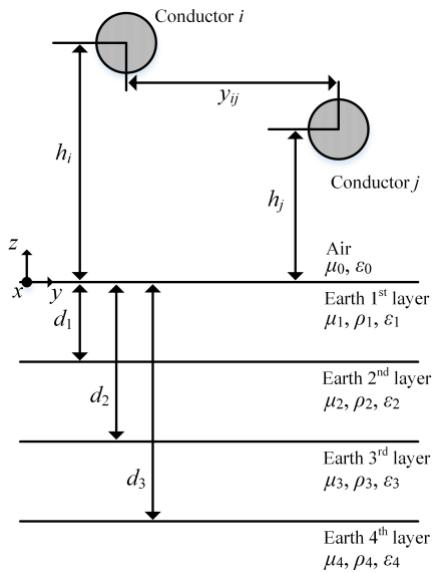  
Fig. 1 Overhead lines above a 4-layer earth.

A. Derivation of exact earth-return impedance and admittance formulas

The formulas of earth-return impedance and admittance for Fig. 1 are derived based on the techniques of Hertzian vector components [5], [14]. Also, the non-homogenous assumption of propagation constant in axial direction is adopted into the following formulations. Solving the boundary conditions of electromagnetic field equations between different layers, results into the following earth-return impedance and admittance formulas:

$$
Z _ {e i j} = \frac {j \omega \mu_ {0}}{2 \pi} \left[ \ln \left(\frac {D _ {2}}{D _ {1}}\right) + \int_ {0} ^ {+ \infty} F (s) e ^ {- s \left(h _ {i} + h _ {j}\right)} \cos \left(s y _ {i j}\right) d s \right] (1)
$$

where s is the integral variable, ω is the angular frequency, $D _ { 1 }$ , $D _ { 2 }$ and $F \left( s \right)$ are given by

$$
D _ {1} = \sqrt {y _ {i j} ^ {2} + \left(h _ {i} - h _ {j}\right) ^ {2}}, D _ {2} = \sqrt {y _ {i j} ^ {2} + \left(h _ {i} + h _ {j}\right) ^ {2}} \tag {2}
$$

$$
F (s) = \frac {A _ {1} \left(T _ {5} - T _ {1}\right) + A _ {2} \left(T _ {6} - T _ {3}\right)}{A _ {1} T _ {2} + A _ {2} T _ {4}} \tag {3}
$$

$$
\mathbf {Y} _ {\mathbf {e i j}} = j \omega \mathbf {P} _ {\mathbf {e i j}} ^ {- 1} \tag {4}
$$

where the diagonal and non-diagonal elements of earth-return potential coefficient matrix $\mathbf { P _ { e i j } }$ [14], [18] is

$$
P _ {e i j} = \frac {1}{2 \pi \varepsilon_ {0}} \left[ \ln \left(\frac {D _ {2}}{D _ {1}}\right) + \int_ {0} ^ {+ \infty} G (s) e ^ {- s \left(h _ {i} + h _ {j}\right)} \cos \left(s y _ {i j}\right) d s \right] \tag {5}
$$

with ( ) ( )  ' ' '1 2 4'T T T G s F s += + $G { \big ( } s { \big ) } = F { \big ( } s { \big ) } + { \frac { T _ { 1 } ^ { ' } + T _ { 2 } ^ { ' } T _ { 4 } ^ { ' } } { T _ { 3 } ^ { ' } } }$ (6)

The irrationals in (3) and (6) are given in Appendix A1 Appendix A2, respectively. The variables in (2) are referred to Fig. 1. The acronym EF (exact formulas) is used hereinafter when referring to formulas (1) and (5).

B. Derivation of earth-return impedance and admittance formulas based on an EHEM

It is clear that EF involves very complicated irrationals which represent the electromagnetic characteristics between different layers of earth. EHEM can be used to approximate the earth-return parameters of overhead lines above a multi-layer earth. A significant advantage of EHEM is in the simplification of formulas while maintaining satisfactory accuracies in comparison to (1) and (5).

Using Wise’s formulas of earth-return impedance and potential coefficient for overhead lines above a homogenous earth [18], the earth-return impedance and potential coefficient formulas using EHEM for an N-layer earth, can be derived by adopting a method similar to [2], [15]. The following new approximated expressions are found

$$
Z _ {e i j} \approx \frac {j \omega \mu_ {0}}{2 \pi} \left[ \ln \left(\frac {D _ {2}}{D _ {1}}\right) + 2 \int_ {0} ^ {+ \infty} \frac {e ^ {- s \left(h _ {i} + h _ {j}\right)} \cos \left(s y _ {i j}\right)}{s + \sqrt {s ^ {2} + \gamma_ {e q} ^ {2}}} d s \right] \tag {7}
$$

$$
P _ {e i j} \approx \frac {1}{2 \pi \varepsilon_ {0}} \left[ \ln \left(\frac {D _ {2}}{D _ {1}}\right) + 2 \int_ {0} ^ {+ \infty} \frac {e ^ {- s \left(h _ {i} + h _ {j}\right)} \cos \left(s y _ {i j}\right)}{\frac {\gamma_ {e q} ^ {2}}{\gamma_ {0} ^ {2}} s + \sqrt {s ^ {2} + \gamma_ {e q} ^ {2}}} d s \right] \tag {8}
$$

where $\gamma _ { e q }$ is the newly derived equivalent propagation constant of an N-layer earth and is given in Appendix A3.

It should be noted that (7) and (8) have removed the Carson’s assumption which has incomplete expression of earth propagation constant due to lack of earth permittivity. Also, because of the concept of equivalent propagation, the limit due to complex number of equivalent resistivity shown in [2] and [15] is removed. Based on the Wise’s method, equations (7) and (8) can deal with arbitrary earth electromagnetic properties and the earth-return admittance.

C. Derivation of modified earth-return Green function of overhead lines for MoM-SO

A modified earth-return Green function of overhead lines above a homogeneous earth has been adopted in [26], and possible numerical instabilities have been removed. Following the approach of [26], and based on (1), a modified earth-return Green function of overhead lines or overhead cables above an N-layer earth is deduced using the recursive method in [9]:

$$
G _ {r e i j} = \frac {1}{2 \pi} \left[ \ln \left(\frac {D _ {2}}{D _ {1}}\right) + \int_ {0} ^ {+ \infty} F _ {G r} (s) e ^ {- s \left(h _ {i} + h _ {j}\right)} \cos \left(s y _ {i j}\right) d s \right] \tag {9}
$$

where the irrational $F _ { G r } \left( s \right)$ is given in Appendix A4.

Equation (9) can be used as a multi-layer earth-return Green function for modeling overhead lines or overhead cables by adopting MoM-SO technique [24], [25] with the removal of numerical instabilities at high frequencies [26]. If $N \mathbf { \Phi } = \mathbf { \Phi } 1$ (homogeneous earth) is assumed in (9), it gives the same results when calculated by (16) in [26]. The term MoM-SO will be used hereinafter when referring to the above modified MoM-SO.

# III. ANALYSIS OF WAVE PROPAGATION CHARACTERISTICS

In this section, the series impedances, shunt admittances and wave propagation characteristics of a typical three-phase untransposed horizontal overhead line shown in Fig. 2 (adopted from [7]) are investigated based on the proposed earth-return impedance and admittance formulas for multi-layer earth of Section II. The adopted multi-layer earth models are given in TABLE A5.1 (See Appendix A5).

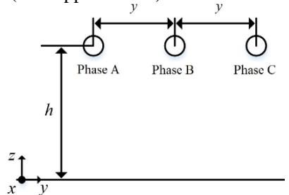  
Fig. 2 A three-phase untransposed horizontal overhead line, $h = 2 5$ m, $y = 1 4$ m, conductor radius $r _ { c } = 1$ cm and conductor resistivity $\rho _ { c } = 3 . 7 8 { \times } 1 0 ^ { - 8 }$ Ωm.

# A. Influence of multi-layer earth

# 1) Series impedance and shunt admittance

Fig. 3 shows the calculated series impedance $Z _ { 1 1 }$ of Phase A by derived formulas EF, EHEM and by MoM-SO. The results with the derived formulas agree very well with those of MoM-SO for all earth model cases. No significant influence of multilayer earth in $R _ { 1 1 }$ is observed for $f \leq 1$ kHz. Also, the multilayer earth has significant influence on $L _ { 1 1 }$ for $f \le 1  { \mathrm { M H z } }$ . Moreover, EHEM using the newly proposed equivalent propagation constant (see (7)), significantly improves accuracy for calculated resistance when compared to results with the equivalent method in [2] and [15]. All other entries in the impedance matrix have been validated by (1), (7) and MoM-SO, although the results are not shown in this paper.

Fig. 4 shows the calculated admittance $Y _ { 1 1 }$ of Phase A using EF, EHEM and different formulas taken from [14], [18]. It is clear that the multi-layer earth has important effects on the

conductance $G _ { 1 1 }$ and capacitance $C _ { 1 1 }$ in comparison to the results calculated for the case C4 which represents the homogeneous earth with the parameters of the first layer of case C1. $C _ { 1 1 }$ is nearly the same as the space capacitance in the low frequency. The earth models in the cases C1 to C3 show minor effects on the admittance. Also, the admittances calculated by EHEM generally match well EF.

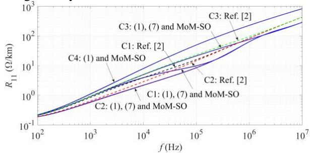

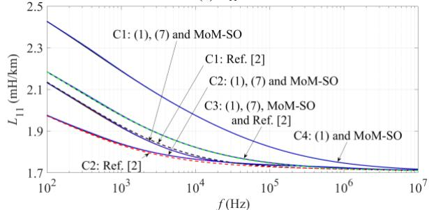  
(a) R11   
$( \mathbf { b } ) L _ { 1 1 }$

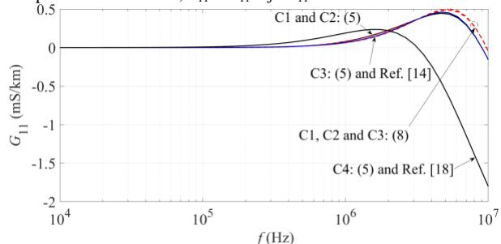  
Fig. 3 Impedance of Phase $\mathrm { A } , Z _ { 1 1 } = R _ { 1 1 } + j \omega L _ { 1 1 }$

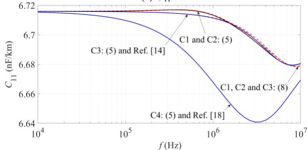  
(a) G11   
(b) C11   
Fig. 4 Admittance of Phase A, $Y _ { 1 1 } = G _ { 1 1 } + j \omega C _ { 1 1 }$ .

# 2) Propagation constants

Fig. 5 shows the calculated propagation constants of earthreturn mode by adopting EF, EHEM, MoM-SO and Mode Analysis of FEM in COMSOL Multiphysics software [29]. It is observed that the phase velocity of earth-return mode is more sensitive to multi-layer earth up to 1 MHz. The influence of multi-layer earth on the attenuation constant of earth-return mode is observed between Hz and 5 MHz. Also, the propagation constants evaluated for C2, C3 and C4 become the same as frequency increases, and it is because the penetration

depth of earth decreases as frequency increases. Thus, the propagation of electromagnetic waves move to the upper layers of earth.

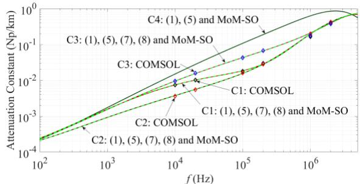

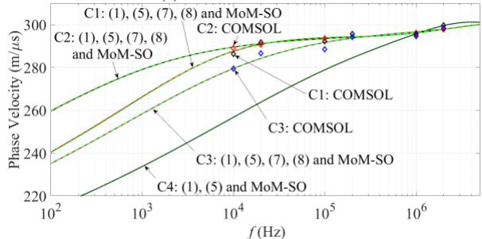  
(a) Attenuation constant   
(b) Phase velocity

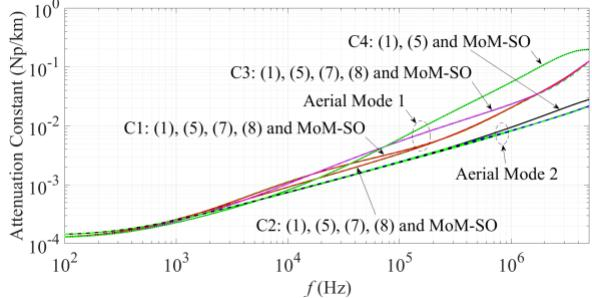  
Fig. 5 Propagation constant of earth-return mode for cases C1-C4.   
(a) Attenuation constant

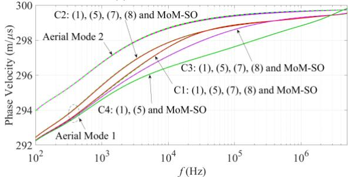  
Fig. 6 Propagation constant of aerial modes for cases C1-C4.

Furthermore, the propagation constants of aerial modes are calculated and shown in Fig. 6. Only minor influence of multilayer earth is observed for attenuation constant of aerial mode 1 above several hundreds of kHz.

# B. Validation of proposed EHEM

The propagation constants of earth-return mode using the newly derived EHEM are calculated and compared with EF and MoM-SO. The overhead line shown in Fig. 2 and the multilayer earth models shown in TABLE A5.1 are used.

As shown in Fig. 7, earth permittivity shows negligible influence on propagation constant of earth-return mode.

Fig. 8 to Fig. 10 show further validations of the proposed EHEM using practical multi-layer earth models [1], [2]. In general, the results evaluated by the proposed EHEM show satisfactory agreements with the results calculated by the exact

methods. It should be noted that the propagation constants of aerial modes using the proposed EHEM have been also calculated and validated by the exact methods, and no significant differences are observed, therefore, the results are not shown in this section.

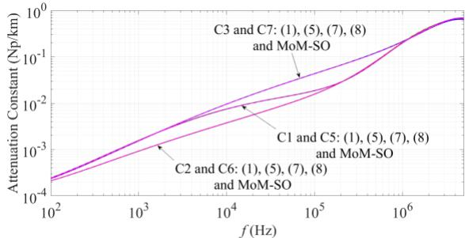

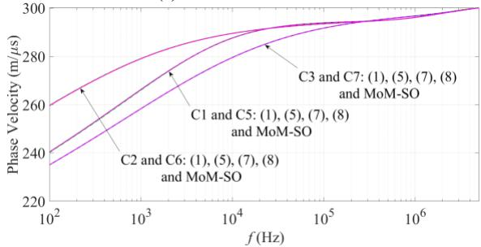  
(a) Attenuation constant   
(b) Phase velocity

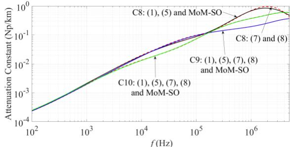  
Fig. 7 Propagation constant of earth-return mode for cases C1-C3 and C5-C7.

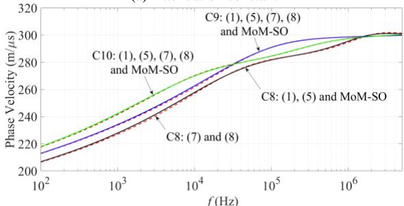  
(a) Attenuation constant   
(b) Phase velocity

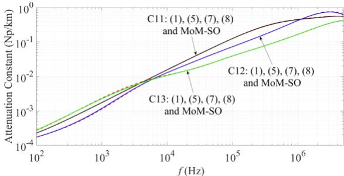  
Fig. 8 Propagation constant of earth-return mode for 4-layer earth cases C8- C10.   
(a) Attenuation constant

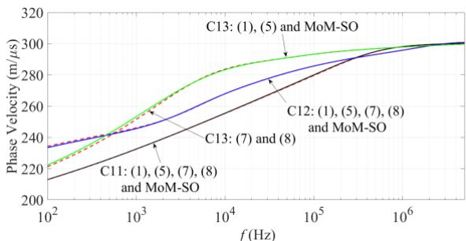  
(b) Phase velocity

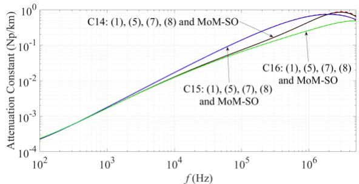  
Fig. 9 Propagation constant of earth-return mode for 3-layer earth cases C11- C13.

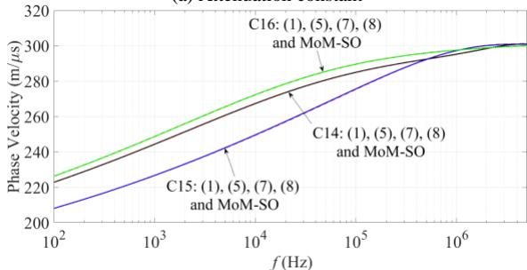  
(a) Attenuation constant   
(b) Phase velocity   
Fig. 10 Propagation constant of earth-return mode for 2-layer earth cases C14- C16.

C. Numerical performances due to non-coherence of formulas

Fig. 11 shows the calculated attenuation constant of earthreturn mode by adopting different combinations of proposed and existing earth-return impedance and admittance formulas for overhead lines above multi-layer or homogeneous earth. The case C17 is a practical 3-layer earth model discussed in [7]. The EF is taken as reference.

It is clear that visible differences are observed for the calculated attenuation constants above 100 kHz. The attenuation constant is smaller than the results found by the other methods if only the space admittance is considered, i.e. $G { \bigl ( } s { \bigr ) } = 0$ . Also, the Cable Constant routine [30] which has been adopted into the existing EMT-type simulation tools only considers the space admittance.

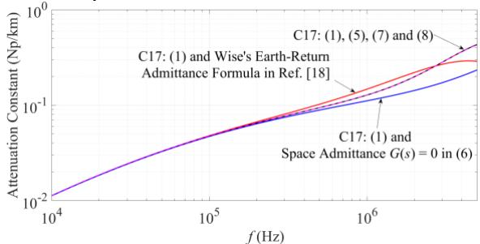  
Fig. 11 Propagation constant of earth-return mode for case C17.

A possible improvement of the Cable Constant routine [30] is a combination of the multi-layer earth-return impedance with the homogeneous earth-return admittance which uses the first layer parameter of the multi-layer earth, i.e. the red line shown in Fig. 11. However, due to the non-coherence of the formulas, instable characteristics have been observed above 300 kHz. Again, the proposed EHEM agrees well with EF up to 5 MHz.

The application limit of frequency for overhead conductors above a lossy earth may violate the transmission line approach conditions shown in [31] due to frequency, configuration of conductors, earth resistivity and penetration depth of soil. Therefore, it is suggested to check the transmission line application conditions used in [31] for each frequency domain study.

# IV. TRANSIENT SIMULATIONS

A. Surge energization of earth-return mode

Fig. 12 illustrates an overhead line test system. The overhead line geometry is given in Fig. 2. The wideband model of EMTP [27], [28] is adopted in these simulations.

Fig. 13 shows the voltage at the receiving end for the observation time $1 0 0 \mu \mathrm { s } ,$ , when a step voltage of 1 kV is applied to the three phases which are short-circuited at the sending end. The simulation time step is set to 0.1 μs. It is clear that the waveforms evaluated with the earth-return admittance have less damping effects in comparison to results calculated without the earth-return admittance.

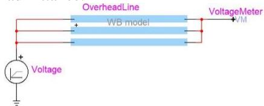  
Fig. 12 Surge simulation of earth-return mode for the overhead line in Fig. 2.

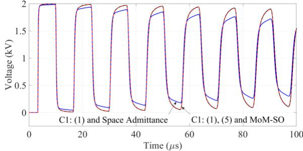  
Fig. 13 Voltage at the receiving end for earth-return mode energization with line length of 1 km.

No significant influence of earth-return admittance is observed when the line length is increased to 10 km due to the lower frequency component. The reason comes from that the dominant transient frequency $f _ { t }$ of the circuit shown in Fig. 12 with the line length x and propagation velocity $c _ { \nu }$ can be defined as $f _ { t } = 1 / 4 \tau$ , where $\tau = x / c _ { \nu }$ [32]. Thus, the dominant transient frequency becomes lower as the length becomes longer. Also, similar results have been observed for overhead distribution lines shown in [33].

B. Transient simulations of a 400 kV overhead line

Fig. 14 shows a test circuit for transient simulations of a 400 kV overhead line. The configuration and parameters of conductors of the line are given in [26]. The line L4 is

disconnected at  ms and the breaker D1 is reclosed into trapped charge at  ms for Phase A, at  ms for Phase B and  ms for Phase C. The simulation time step is 1 μs. The overhead lines are using the wideband model [28] with parameters calculated by EF, EHEM and MoM-SO.

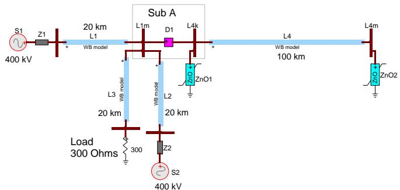

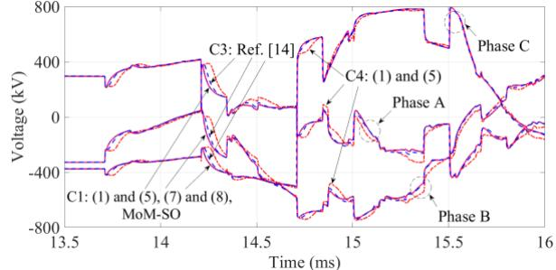  
Fig. 14 A 400 kV overhead line with surge arresters.   
Fig. 15 Three phase voltages at bus L4m in Fig. 14 with cases C1, C3 and C4.

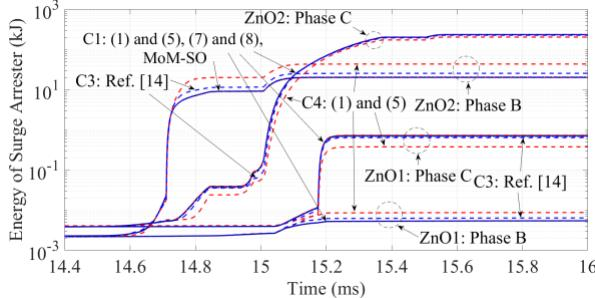

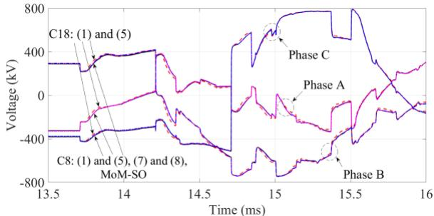  
Fig. 16 Energies of ZnO1 and ZnO2 arresters in Fig. 14 with cases C1, C3 and C4.   
Fig. 17 Three phase voltages at bus L4m in Fig. 14 with cases C8 and 18.

Fig. 15 shows the energized three phase voltages at the bus L4m by different methods and earth models. In comparison to the homogeneous earth case C4, the 4-layer earth model case C1 has noticeable influences on the transient waveforms. Fig. 16 illustrates the energies absorbed by ZnO1 and ZnO2 surge arresters at both ends of line L4. The Phase C of ZnO2 shows the maximum absorbed energy after  ms. At  ms, the energies of Phase C of ZnO2 evaluated for the cases C1 and C4 are 235.3 kJ and 203.1 kJ, respectively. It gives a deviation of 13.7% which can have practical implications. Furthermore, the results calculated based on the case C3 using the method shown in [14] are added in Fig. 15 and Fig. 16. The energy of

Phase C of ZnO2 evaluated using the case C3 with method in [14] is 226.1 kJ at  t = 15.6 ms. Fig. 17 shows the three phase voltages of Fig. 15 for the earth model cases C8 and C18. The three phase voltages are now less affected for the case C8 in comparison to C18. EHEM shows satisfactory agreement with the exact solutions in all cases.

It should be noted that the overhead line in Fig. 14 has 14 conductors. For the case C1, EF ((1)) and MoM-SO need around 1.34 s (computing time on a typical computer) for impedance calculation per frequency point. EF ((5)) requires 24.3 s per frequency point. However, EHEM takes only 0.18 and 0.32 s for impedance and admittance calculations per frequency point, respectively. Based on above facts, for a system with a large number of conductors above a multi-layer earth, EHEM offers a good option for computational efficiency and accuracy.

# V. CONCLUSIONS

This paper discusses the formulations, wave propagation characteristics and transient simulations of overhead lines above a multi-layer earth. It has the following general conclusions.

First of all, three theoretical contributions are summarized. A generalized and exact formulation (EF) of earth-return impedance and admittance for overhead lines above a 4-layer earth has been proposed. An enhanced and improved equivalent homogeneous earth method (EHEM) which can represent arbitrary earth electromagnetic properties and earth-return admittance is derived. Also, the MoM-SO method with a modified earth-return Green function is presented.

Next, in the wave propagation and frequency domain studies, the multi-layer earth models show significant influences on the series impedances, shunt admittances and propagation constants. The results calculated by the proposed three methods are compared and validated using various practical earth models and parameters. It is demonstrated that the maximum error of impedance calculation using proposed EHEM is less than 4% up to 5 MHz. Also, the maximum error of propagation constant of earth-return mode calculated by proposed EHEM is below 5% up to 1 MHz. In comparison to the current methods, the accuracy of impedance calculation using the proposed EHEM has been significantly improved. Moreover, a possible numerical instability has been removed by adopting the proposed multi-layer earth-return Green function in the MoM-SO technique.

Transient simulations using the three methods are performed with EMTP. A practical energization case for a 400 kV line shows the importance of the multi-layer earth model. EHEM offers high computational efficiency for lines with many conductors. Simulations with MoM-SO together with the newly produced formulas show identical results.

# APPENDIX

# A1. Expression of irrationals in (3)

The irrationals in (3) are given by

$$
T _ {1} = P _ {2 3} \Delta_ {1} + Q _ {2 3} \Delta_ {3}, T _ {2} = P _ {2 3} \Delta_ {2} + Q _ {2 3} \Delta_ {4} \tag {A.1}
$$

$$
T _ {3} = W _ {2 3} \Delta_ {1} + V _ {2 3} \Delta_ {3}, T _ {4} = W _ {2 3} \Delta_ {2} + V _ {2 3} \Delta_ {4} \tag {A.2}
$$

$$
T _ {5} = \frac {1}{s} \left(P _ {2 3} \Delta_ {2} + Q _ {2 3} \Delta_ {4}\right), T _ {6} = \frac {1}{s} \left(W _ {2 3} \Delta_ {2} + V _ {2 3} \Delta_ {4}\right) \tag {A.3}
$$

$$
A _ {1} = \left(1 - \frac {\mu_ {4} a _ {3}}{\mu_ {3} a _ {4}}\right) e ^ {- a _ {3} d _ {3}}, A _ {2} = \left(1 + \frac {\mu_ {4} a _ {3}}{\mu_ {3} a _ {4}}\right) e ^ {a _ {3} d _ {3}} \tag {A.4}
$$

where

$$
\Delta_ {1} = \frac {1}{2} \left(P _ {1 2} S _ {0 1} + Q _ {1 2} S _ {0 1} ^ {\prime}\right), \Delta_ {2} = \frac {s}{2} \left(P _ {1 2} S _ {0 1} ^ {\prime} + Q _ {1 2} S _ {0 1}\right) \tag {A.5}
$$

$$
\Delta_ {3} = \frac {1}{2} \left(W _ {1 2} S _ {0 1} + V _ {1 2} S _ {0 1} ^ {\prime}\right), \Delta_ {4} = \frac {s}{2} \left(W _ {1 2} S _ {0 1} ^ {\prime} + V _ {1 2} S _ {0 1}\right) \tag {A.6}
$$

$$
S _ {n m} = \frac {\gamma_ {n} ^ {2}}{\gamma_ {m} ^ {2}} \left(1 + \frac {\mu_ {m} s}{\mu_ {n} a _ {m}}\right), S _ {n m} ^ {\prime} = \frac {\gamma_ {n} ^ {2}}{\gamma_ {m} ^ {2}} \left(1 - \frac {\mu_ {m} s}{\mu_ {n} a _ {m}}\right) \tag {A.7}
$$

with $P _ { n m } = \frac { \gamma _ { n } ^ { 2 } } { 2 \gamma _ { m } ^ { 2 } } \left( 1 + \frac { \mu _ { m } } { \mu _ { n } } \frac { a _ { n } } { a _ { m } } \right) E X P _ { P n m }$ nmP na PnmEXP (A.8)

$$
Q _ {n m} = \frac {\gamma_ {n} ^ {2}}{2 \gamma_ {m} ^ {2}} \left(1 - \frac {\mu_ {m}}{\mu_ {n}} \frac {a _ {n}}{a _ {m}}\right) E X P _ {Q n m} \tag {A.9}
$$

$$
W _ {n m} = \frac {\gamma_ {n} ^ {2}}{2 \gamma_ {m} ^ {2}} \left(1 - \frac {\mu_ {m}}{\mu_ {n}} \frac {a _ {n}}{a _ {m}}\right) E X P _ {W n m} \tag {A.10}
$$

$$
V _ {n m} = \frac {\gamma_ {n} ^ {2}}{2 \gamma_ {m} ^ {2}} \left(1 + \frac {\mu_ {m}}{\mu_ {n}} \frac {a _ {n}}{a _ {m}}\right) E X P _ {V n m} \tag {A.11}
$$

$$
E X P _ {P n m} = e ^ {\left(- a _ {n} + a _ {m}\right) d _ {n}}, E X P _ {Q n m} = e ^ {\left(a _ {n} + a _ {m}\right) d _ {n}} \tag {A.12}
$$

$$
E X P _ {W n m} = e ^ {- \left(a _ {n} + a _ {m}\right) d _ {n}}, E X P _ {V n m} = e ^ {\left(a _ {n} - a _ {m}\right) d _ {n}} \tag {A.13}
$$

and $a _ { n } = \sqrt { s ^ { 2 } + \gamma _ { n } ^ { 2 } - \gamma _ { 0 } ^ { 2 } } \ , \ \gamma _ { 0 } ^ { 2 } = j \omega \mu _ { 0 } j \omega \varepsilon _ { 0 }$ (A.14)

$$
\gamma_ {n} ^ {2} = j \omega \mu_ {n} \left(\sigma_ {n} + j \omega \varepsilon_ {n}\right) \text {w i t h} n = 1 \tag {A.15}
$$

The term $\gamma _ { n }$ represents the propagation constant of each layer of the 4-layer earth shown in Fig. 1. It should be noted that if the earth is extended to the N-layer, the term $\gamma _ { N }$ is the propagation constant of the N-th layer of the earth, as shown in (A.40).

# A2. Expression of irrationals in (6)

The irrationals in (6) are given by

$$
\begin{array}{l} T _ {1} ^ {\prime} = \left(T _ {1} - a _ {3} \Delta_ {1 4} - \frac {\gamma_ {3} ^ {2}}{\gamma_ {4} ^ {2}} T _ {1} + \frac {\gamma_ {3} ^ {2} \mu_ {4}}{\gamma_ {4} ^ {2} \mu_ {3}} a _ {4} \Delta_ {1 4}\right) e ^ {- a _ {3} d _ {3}} \tag {A.16} \\ + \left(T _ {3} + a _ {3} \Delta_ {1 1} - \frac {\gamma_ {3} ^ {2}}{\gamma_ {4} ^ {2}} T _ {3} + \frac {\gamma_ {3} ^ {2} \mu_ {4}}{\gamma_ {4} ^ {2} \mu_ {3}} a _ {4} \Delta_ {1 1}\right) e ^ {a _ {3} d _ {3}} \\ \end{array}
$$

$$
\begin{array}{l} T _ {2} ^ {\prime} = \left(T _ {5} - a _ {3} \Delta_ {1 5} - \frac {\gamma_ {3} ^ {2}}{\gamma_ {4} ^ {2}} T _ {5} + \frac {\gamma_ {3} ^ {2} \mu_ {4}}{\gamma_ {4} ^ {2} \mu_ {3}} a _ {4} \Delta_ {1 5}\right) e ^ {- a _ {3} d _ {3}} \tag {A.17} \\ + \left(T _ {6} + a _ {3} \Delta_ {1 2} - \frac {\gamma_ {3} ^ {2}}{\gamma_ {4} ^ {2}} T _ {6} + \frac {\gamma_ {3} ^ {2} \mu_ {4}}{\gamma_ {4} ^ {2} \mu_ {3}} a _ {4} \Delta_ {1 2}\right) e ^ {a _ {3} d _ {3}} \\ \end{array}
$$

$$
\begin{array}{l} T _ {3} ^ {\prime} = \left(a _ {3} \Delta_ {1 6} - \frac {\gamma_ {3} ^ {2} \mu_ {4}}{\gamma_ {4} ^ {2} \mu_ {3}} a _ {4} \Delta_ {1 6}\right) e ^ {- a _ {3} d _ {3}} - \left(a _ {3} \Delta_ {1 3} + \frac {\gamma_ {3} ^ {2} \mu_ {4}}{\gamma_ {4} ^ {2} \mu_ {3}} a _ {4} \Delta_ {1 3}\right) e ^ {a _ {3} d _ {3}} (A.18) \\ T _ {4} ^ {\prime} = - \frac {A _ {1} T _ {1} + A _ {2} T _ {3}}{A _ {1} T _ {5} + A _ {2} T _ {6}} (A.19) \\ \end{array}
$$

$$
\begin{array}{l} \Delta_ {1 1} = V G _ {2 3} \Delta_ {8} - W G _ {2 3} \Delta_ {5} + \frac {E X P _ {W 2 3}}{2 a _ {3}} \Delta_ {1} + \frac {E X P _ {V 2 3}}{2 a _ {3}} \Delta_ {3} \tag {A.20} \\ - \frac {T _ {1}}{2 a _ {3}} e ^ {- 2 a _ {3} d _ {2}} - \frac {T _ {3}}{2 a _ {3}} \\ \end{array}
$$

$$
\begin{array}{l} \Delta_ {1 2} = V G _ {2 3} \Delta_ {9} - W G _ {2 3} \Delta_ {6} + \frac {E X P _ {W 2 3}}{2 a _ {3} s} \Delta_ {2} + \frac {E X P _ {V 2 3}}{2 a _ {3} s} \Delta_ {4} \tag {A.21} \\ - \frac {T _ {5}}{2 a _ {3}} e ^ {- 2 a _ {3} d _ {2}} - \frac {T _ {6}}{2 a _ {3}} \\ \end{array}
$$

$$
\Delta_ {1 3} = V G _ {2 3} \Delta_ {1 0} - W G _ {2 3} \Delta_ {7}, \Delta_ {1 6} = P G _ {2 3} \Delta_ {7} - Q G _ {2 3} \Delta_ {1 0} (A. 2 2)
$$

$$
\begin{array}{l} \Delta_ {1 4} = P G _ {2 3} \Delta_ {5} - Q G _ {2 3} \Delta_ {8} - \frac {E X P _ {P 2 3}}{2 a _ {3}} \Delta_ {1} - \frac {E X P _ {Q 2 3}}{2 a _ {3}} \Delta_ {3} \tag {A.23} \\ + \frac {T _ {3}}{2 a _ {3}} e ^ {2 a _ {3} d _ {2}} + \frac {T _ {1}}{2 a _ {3}} \\ \end{array}
$$

$$
\begin{array}{l} \Delta_ {1 5} = P G _ {2 3} \Delta_ {6} - Q G _ {2 3} \Delta_ {9} - \frac {E X P _ {P 2 3}}{2 a _ {3} s} \Delta_ {2} - \frac {E X P _ {Q 2 3}}{2 a _ {3} s} \Delta_ {4} \tag {A.24} \\ + \frac {T _ {6}}{2 a _ {3}} e ^ {2 a _ {3} d _ {2}} + \frac {T _ {5}}{2 a _ {3}} \\ \end{array}
$$

with

$$
\begin{array}{l} \Delta_ {5} = \frac {A _ {3}}{2} \left(P G _ {1 2} + Q G _ {1 2}\right) + \frac {S _ {0 1}}{4 a _ {2}} \left(P _ {1 2} + W _ {1 2} e ^ {2 a _ {2} d _ {1}} - E X P _ {P 1 2}\right) \\ + \frac {S _ {0 1} ^ {\prime}}{4 a _ {2}} \left(Q _ {1 2} + V _ {1 2} e ^ {2 a _ {2} d _ {1}} - E X P _ {Q 1 2}\right) \tag {A.25} \\ \end{array}
$$

$$
\begin{array}{l} \Delta_ {6} = \frac {A _ {3}}{2} \left(P G _ {1 2} + Q G _ {1 2}\right) + \frac {S _ {0 1}}{4 a _ {2}} \left(Q _ {1 2} + V _ {1 2} e ^ {2 a _ {2} d _ {1}} - E X P _ {Q 1 2}\right) \\ + \frac {S _ {0 1} ^ {\prime}}{4 a _ {2}} \left(P _ {1 2} + W _ {1 2} e ^ {2 a _ {2} d _ {1}} - E X P _ {P 1 2}\right) \tag {A.26} \\ \end{array}
$$

$$
\Delta_ {7} = \frac {1}{2} \left(P G _ {1 2} B _ {0 1} ^ {\prime} - Q G _ {1 2} B _ {0 1}\right) \tag {A.27}
$$

$$
\begin{array}{l} \Delta_ {8} = - \frac {A _ {3}}{2} \left(W G _ {1 2} + V G _ {1 2}\right) - \frac {S _ {0 1}}{4 a _ {2}} \left(W _ {1 2} + P _ {1 2} e ^ {- 2 a _ {2} d _ {1}} - E X P _ {W 1 2}\right) \\ - \frac {S _ {0 1} ^ {\prime}}{4 a _ {2}} \left(V _ {1 2} + Q _ {1 2} e ^ {- 2 a _ {2} d _ {1}} - E X P _ {V 1 2}\right) \tag {A.28} \\ \end{array}
$$

$$
\begin{array}{l} \Delta_ {9} = - \frac {A _ {3}}{2} \left(V G _ {1 2} + W G _ {1 2}\right) - \frac {S _ {0 1}}{4 a _ {2}} \left(V _ {1 2} + Q _ {1 2} e ^ {- 2 a _ {2} d _ {1}} - E X P _ {V 1 2}\right) \\ - \frac {S _ {0 1} ^ {\prime}}{4 a _ {2}} \left(W _ {1 2} + P _ {1 2} e ^ {- 2 a _ {2} d _ {1}} - E X P _ {W 1 2}\right) \tag {A.29} \\ \end{array}
$$

$$
\Delta_ {1 0} = \frac {1}{2} \left(V G _ {1 2} B _ {0 1} - W G _ {1 2} B _ {0 1} ^ {\prime}\right) \tag {A.30}
$$

and

$$
A _ {3} = \frac {1}{a _ {1}} \left(\frac {\gamma_ {0} ^ {2}}{\gamma_ {1} ^ {2}} - 1\right), B _ {n m} = \frac {\gamma_ {n} ^ {2} \mu_ {m}}{\gamma_ {m} ^ {2} \mu_ {n}} + \frac {s}{a _ {m}}, B _ {n m} ^ {\prime} = \frac {\gamma_ {n} ^ {2} \mu_ {m}}{\gamma_ {m} ^ {2} \mu_ {n}} - \frac {s}{a _ {m}} \tag {A.31}
$$

where

$$
P G _ {n m} = \frac {1}{2} \left(\frac {a _ {n}}{a _ {m}} + \frac {\mu_ {m} \gamma_ {n} ^ {2}}{\mu_ {n} \gamma_ {m} ^ {2}}\right) E X P _ {P n m} \tag {A.32}
$$

$$
Q G _ {n m} = \frac {1}{2} \left(\frac {a _ {n}}{a _ {m}} - \frac {\mu_ {m} \gamma_ {n} ^ {2}}{\mu_ {n} \gamma_ {m} ^ {2}}\right) E X P _ {Q n m} \tag {A.33}
$$

$$
W G _ {n m} = \frac {1}{2} \left(\frac {a _ {n}}{a _ {m}} - \frac {\mu_ {m} \gamma_ {n} ^ {2}}{\mu_ {n} \gamma_ {m} ^ {2}}\right) E X P _ {W n m} \tag {A.34}
$$

$$
V G _ {n m} = \frac {1}{2} \left(\frac {a _ {n}}{a _ {m}} + \frac {\mu_ {m} \gamma_ {n} ^ {2}}{\mu_ {n} \gamma_ {m} ^ {2}}\right) E X P _ {V n m} \tag {A.35}
$$

A3. Expression of equivalent propagation constant of an Nlayer earth

The $\gamma _ { e q }$ has the following expression for an N-layer earth. The earth permeability is assumed to be the vacuum permeability.

$$
\gamma_ {e q} = \gamma_ {e 1} \frac {\gamma_ {e 1} + \gamma_ {e q 2 , 3} - \left(\gamma_ {e 1} - \gamma_ {e q 2 , 3}\right) e ^ {- 2 | d _ {1} | \gamma_ {e 1}}}{\gamma_ {e 1} + \gamma_ {e q 2 , 3} + \left(\gamma_ {e 1} - \gamma_ {e q 2 , 3}\right) e ^ {- 2 | d _ {1} | \gamma_ {e 1}}} \tag {A.36}
$$

where

$$
\gamma_ {e q 2, 3} = \gamma_ {e 2} \frac {\gamma_ {e 2} + \gamma_ {e q 3 , 4} - \left(\gamma_ {e 2} - \gamma_ {e q 3 , 4}\right) e ^ {- 2 | d _ {2} - d _ {1} | \gamma_ {e 2}}}{\gamma_ {e 2} + \gamma_ {e q 3 , 4} + \left(\gamma_ {e 2} - \gamma_ {e q 3 , 4}\right) e ^ {- 2 | d _ {2} - d _ {1} | \gamma_ {e 2}}} \tag {A.37}
$$

$$
\begin{array}{c} \gamma_ {e q 3, 4} = \gamma_ {e 3} \frac {\gamma_ {e 3} + \gamma_ {e 4 , 5} - \left(\gamma_ {e 3} - \gamma_ {e 4 , 5}\right) e ^ {- 2 | d _ {3} - d _ {2} | \gamma_ {e 3}}}{\gamma_ {e 3} + \gamma_ {e 4 , 5} + \left(\gamma_ {e 3} - \gamma_ {e 4 , 5}\right) e ^ {- 2 | d _ {3} - d _ {2} | \gamma_ {e 3}}} \\ \vdots \end{array}
$$

$$
\gamma_ {e q N - 1, N} = \gamma_ {e N - 1} \frac {\gamma_ {e N - 1} + \gamma_ {e N} - \left(\gamma_ {e N - 1} - \gamma_ {e N}\right) e ^ {- 2 | d _ {N - 1} - d _ {N - 2} | \gamma_ {e N - 1}}}{\gamma_ {e N - 1} + \gamma_ {e N} + \left(\gamma_ {e N - 1} - \gamma_ {e N}\right) e ^ {- 2 | d _ {N - 1} - d _ {N - 2} | \gamma_ {e N - 1}}} \tag {A.38}
$$

with

$$
\gamma_ {e 1} = \sqrt {\gamma_ {1} ^ {2} - \gamma_ {0} ^ {2}}, \gamma_ {e 2} = \sqrt {\gamma_ {2} ^ {2} - \gamma_ {0} ^ {2}}, \gamma_ {e 3} = \sqrt {\gamma_ {3} ^ {2} - \gamma_ {0} ^ {2}} \tag {A.39}
$$

$$
\gamma_ {e N - 1} = \sqrt {\gamma_ {N - 1} ^ {2} - \gamma_ {0} ^ {2}}, \gamma_ {e N} = \sqrt {\gamma_ {N} ^ {2} - \gamma_ {0} ^ {2}} \tag {A.40}
$$

A4. Expression of irrational in (9)

The irrational in (9) of an N-layer earth has

$$
F _ {G r} (s) = \frac {F _ {G (1)} (s) + F _ {T (1)} (s)}{(s + \mu_ {0} b _ {1}) F _ {G (1)} (s) + (s - \mu_ {0} b _ {1}) F _ {T (1)} (s)} \tag {A.41}
$$

$$
F _ {G (N - 1)} (s) = b _ {N - 1} + b _ {N}
$$

$$
\begin{array}{c} F _ {T (N - 1)} \big (s \big) = \big (b _ {N - 1} - b _ {N} \big) e ^ {- 2 a _ {N - 1} d _ {N - 1}} \\ \vdots \end{array}
$$

$$
F _ {G (m)} (s) =
$$

$$
\begin{array}{l} \left(b _ {m} + b _ {m + 1}\right) F _ {G (m + 1)} (s) + \left(b _ {m} - b _ {m + 1}\right) F _ {T (m + 1)} (s) e ^ {2 a _ {m + 1} d _ {m}} \\ F _ {T (m)} (s) = \left[ \left(b _ {m} - b _ {m + 1}\right) F _ {G (m + 1)} (s) \right. \\ \left. + \left(b _ {m} + b _ {m + 1}\right) F _ {T (m + 1)} (s) e ^ {2 a _ {m + 1} d _ {m}} \right] e ^ {- 2 a _ {m} d _ {m}} \tag {A.42} \\ \end{array}
$$

where $1 \leq m \leq N - 2 , d _ { m } = d _ { 1 } \cdots d _ { N - 2 } , b _ { n } = a _ { n } / \mu _ { n }$ (A.43)

The terms $a _ { n }$ and $\mu _ { n }$ are given in (A.14) with $n = 1 \cdots N$

A5. Earth models in the calculations

TABLE A5.1 gives the different multi-layer earth models adopted into the calculations in the Sections III and IV. The earth parameters used in the cases C1, C8-C17 are from the experimental or measured results shown in [1], [2], [7].

The relative permittivity and relative permeability of each layer of earth are assumed to be 1 for the cases C1-C4, C8-C19. The earth layer resistivities for the cases C5-C7 are the same as those for cases C1-C3.

TABLE A5.1 EARTH MODELS   

<table><tr><td rowspan="2">Case</td><td colspan="3">Depth of Layer (m)</td><td colspan="4">Resistivity (Ωm)</td></tr><tr><td>d1</td><td>d2</td><td>d3</td><td>ρ1</td><td>ρ2</td><td>ρ3</td><td>ρ4</td></tr><tr><td>C1</td><td>0.9</td><td>3.5</td><td>5</td><td>461</td><td>35</td><td>2</td><td>22</td></tr><tr><td>C2</td><td>0.9</td><td>3.5</td><td>∞</td><td>461</td><td>35</td><td>2</td><td>-</td></tr><tr><td>C3</td><td>0.9</td><td>∞</td><td>-</td><td>461</td><td>35</td><td>-</td><td>-</td></tr><tr><td>C4</td><td>∞</td><td>-</td><td>-</td><td>461</td><td>-</td><td>-</td><td>-</td></tr><tr><td rowspan="2">Case</td><td colspan="3">Depth of Layer (m)</td><td colspan="4">Relative Permittivity</td></tr><tr><td>d1</td><td>d2</td><td>d3</td><td>εr1</td><td>εr2</td><td>εr3</td><td>εr4</td></tr><tr><td>C5</td><td>0.9</td><td>3.5</td><td>5</td><td>10</td><td>20</td><td>50</td><td>100</td></tr><tr><td>C6</td><td>0.9</td><td>3.5</td><td>∞</td><td>10</td><td>20</td><td>50</td><td>-</td></tr><tr><td>C7</td><td>0.9</td><td>∞</td><td>-</td><td>10</td><td>20</td><td>-</td><td>-</td></tr><tr><td rowspan="2">Case</td><td colspan="3">Depth of Layer (m)</td><td colspan="4">Resistivity (Ωm)</td></tr><tr><td>d1</td><td>d2</td><td>d3</td><td>ρ1</td><td>ρ2</td><td>ρ3</td><td>ρ4</td></tr><tr><td>C8</td><td>1.2</td><td>6.53</td><td>27.59</td><td>235</td><td>3571</td><td>205</td><td>1515</td></tr><tr><td>C9</td><td>0.3</td><td>2.7</td><td>7.3</td><td>19</td><td>42</td><td>524</td><td>571</td></tr><tr><td>C10</td><td>4.5</td><td>12.52</td><td>35.19</td><td>122</td><td>835</td><td>75</td><td>334</td></tr><tr><td>C11</td><td>3.1</td><td>18.1</td><td>∞</td><td>128</td><td>1923</td><td>521</td><td>-</td></tr><tr><td>C12</td><td>3.36</td><td>121.8</td><td>∞</td><td>222</td><td>137</td><td>14</td><td>-</td></tr><tr><td>C13</td><td>1.06</td><td>22.18</td><td>∞</td><td>33</td><td>26</td><td>284</td><td>-</td></tr><tr><td>C14</td><td>2.69</td><td>∞</td><td>∞</td><td>373</td><td>145</td><td>-</td><td>-</td></tr><tr><td>C15</td><td>2.14</td><td>∞</td><td>∞</td><td>247</td><td>1064</td><td>-</td><td>-</td></tr><tr><td>C16</td><td>1.65</td><td>∞</td><td>∞</td><td>57</td><td>97</td><td>-</td><td>-</td></tr><tr><td>C17</td><td>0.6</td><td>1.5</td><td>∞</td><td>50</td><td>10</td><td>54</td><td>-</td></tr><tr><td>C18</td><td>∞</td><td>-</td><td>-</td><td>235</td><td>-</td><td>-</td><td>-</td></tr></table>

A6. Study of relative error based on EHEM

Considering the importance of newly proposed EHEM in Section II - B, the studies of impedance and propagation constant with relative errors are presented in this section.

1) Relative error of mutual impedance

In order to further validate the error conditions of the proposed EHEM (7) in comparison to the existing methods in [2], [15], the relative errors of mutual impedance of Figs. 6 to 10 shown in [2] are reproduced below by adopting (7) with the same earth models and overhead lines in [2]. The reference for the following calculations is the modified MoM-SO in (9) which can deal with an N-layer earth, also the results are double checked with the N-layer formula in [2], [9].

Note that the model numbers shown in Figs A6.1 to A6.5 are matched to the Figs. 6 to 10 shown in [2]. It is clear that the accuracies of impedance calculations are significantly improved by adopting the newly proposed EHEM (7). The maximum relative error is below 4% for full frequency spectrum from 1 Hz to 5 MHz. The maximum errors in Models 2, 4, 7, 12, 17, 18 and 19 are reduced from 8%, 13%, 16%, 19%, 14%, 15% and 14% in [2] to 0.7%, 1%, 3.8%, 2.6%, 3%, 2.6% and 1.3%, respectively, by adopting the newly proposed EHEM (7). In general, the above accuracies of impedance calculation have been improved over 7 times in comparison to the results shown in [2]. An explanation for frequency and earth parameter dependent errors in the method of [2], is the complex number issue of equivalent resistivity due to variations of frequency [15]. This limit has been avoided by using the proposed concept of equivalent propagation constant in Section II - B.

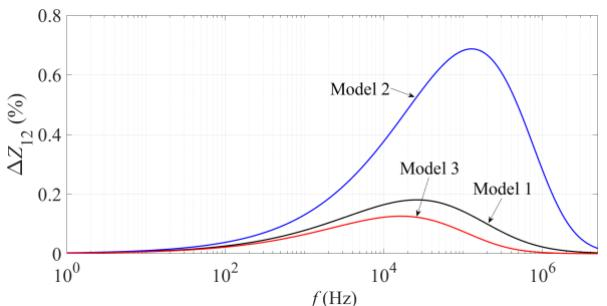

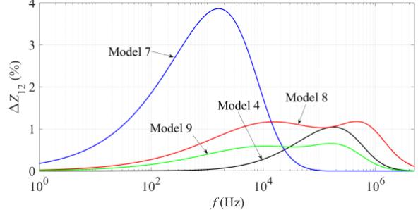  
Fig A6.1 Relative errors of mutual impedance based on 2-layer earth models.   
Fig A6.2 Relative errors of mutual impedance based on 3-layer earth models.

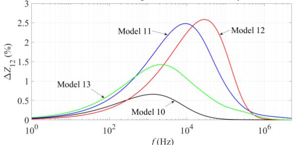

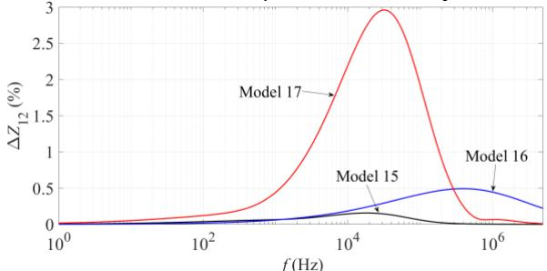  
Fig A6.3 Relative errors of mutual impedance based on 4-layer earth models.

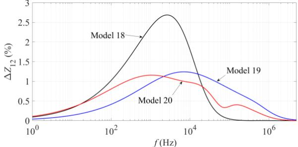  
Fig A6.4 Relative errors of mutual impedance based on 5-layer earth models.   
Fig A6.5 Relative errors of mutual impedance based on 6-layer earth models. 2) Relative error of propagation constant of earth-return mod

The relative errors of propagation constant of earth-return mode are calculated and shown in Figs A6.6 to A6.11. The calculations are performed based on the proposed EHEM (7) and (8), and the existing method in [2] with space admittance. The reference is set to the proposed EF (1) and (5). It is calculated by the following formulas.

$$
\Delta \alpha_ {0} = \left| \frac {\alpha_ {0 (\mathrm {E H E M o r R e f .} [ 2 ])} - \alpha_ {0 (\mathrm {E F})}}{\alpha_ {0 (\mathrm {E F})}} \right| \times 1 0 0 \tag {A.44}
$$

$$
\Delta v _ {0} = \left| \frac {v _ {0 (\mathrm {E H E M o r R e f .} [ 2 ])} - v _ {0 (\mathrm {E F})}}{v _ {0 (\mathrm {E F})}} \right| \times 1 0 0 \tag {A.45}
$$

In general, the calculated phase velocities of earth-return mode using the EHEM and the method in [2] have minor errors referred to the results evaluated by the EF. The maximum error of phase velocity in the full frequency spectrum by the two methods is less than 3%.

The major differences are observed for attenuation constant of earth-return mode calculated by the two equivalent methods. The maximum error is less than 5% for all cases below 1 MHz, if the proposed EHEM ((7) and (8)) is adopted into the calculations. The cases C1, C9, C11, C12, C13 and C15 show relative high errors using the method in [2] with consideration of frequency up to 1 MHz. It is worth mentioning that the method in [2] is accurate for power frequency and the transients up to a few kHz, as pointed out in [2]. However, the proposed EHEM generalizes the frequency band up to 1 MHz with the maximum relative error being below 5% by considering the equivalent propagation constant based earth-return impedance and admittance formulas.

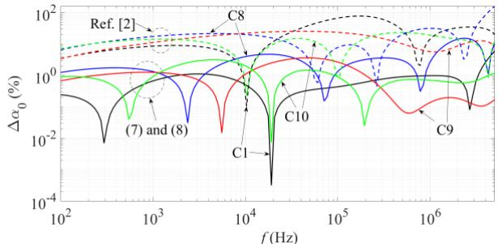

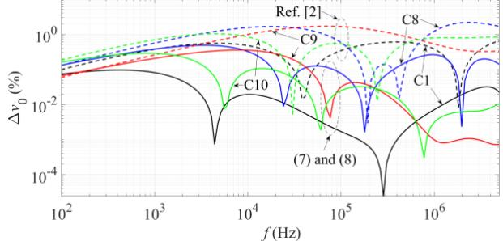  
Fig A6.6 Relative errors of attenuation constant based on Fig. 8 (a).   
Fig A6.7 Relative errors of phase velocity based on Fig. 8 (b).

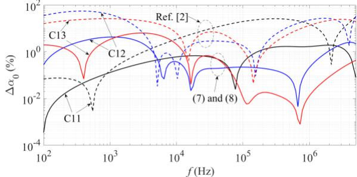  
Fig A6.8 Relative errors of attenuation constant based on Fig. 9 (a).

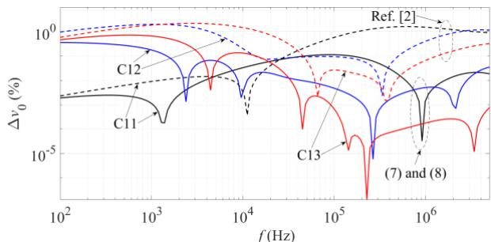

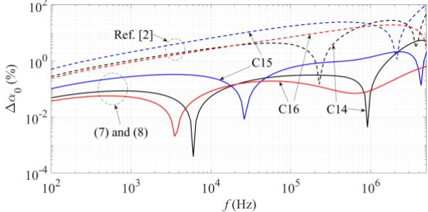  
Fig A6.9 Relative errors of phase velocity based on Fig. 9 (b).

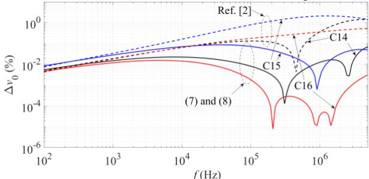  
Fig A6.10 Relative errors of attenuation constant based on Fig. 10 (a).   
Fig A6.11 Relative errors of phase velocity based on Fig. 10 (b).

# REFERENCES

[1] J. He, R. Zeng, and B. Zhang, Methodology and Technology for Power System Grounding. Singapore: John Wiley & Sons Singapore. Ltd., 2013.   
[2] A. G. Martins-Britto, F. V. Lopes and S. R. M. J. Rondineau, "Multi-layer earth structure approximation by a homogeneous conductivity soil for ground return impedance calculations," IEEE Trans. Power Del., vol. 35, pp. 881-891, 2020.   
[3] L. M.Wedepohl and R. G.Wasley, "Wave propagation in multiconductor overhead lines - Calculation of series impedance for multilayer earth," Proc. IEE, vol. 113, pp. 627-632, 1966.   
[4] E. D. Sunde, Earth conduction effects in transmission systems, New York: Dover, 1968.   
[5] M. Nakagawa, A. Ametani, and K. Iwamoto, "Further studies on wave propagation in overhead lines with earth return: Impedance of Stratified Earth," Proc. IEE, vol. 120, pp. 1521-1528, 1973.   
[6] A. Ametani and R. Schinzinger, "Equations for surge impedance and propagation constant of transmission lines above stratified earth," IEEE Trans. PAS, vol. PAS-95 pp. 773-781, 1976.   
[7] A. Ametani, "Stratified earth effects on wave propagation-frequency dependent parameters, "IEEE Trans. PAS, vol. PAS-93, pp.1233-1239, 1974.   
[8] I. S. Moghram, "Effects of earth stratification on impedances of power transmission lines," Eur. Trans. Elect. Power, vol. 8, pp. 445-449, 1998.   
[9] G. K. Papagiannis, D. A. Tsiamitros, D. P. Labridis, and P. S. Dokopoulos, "A systematic approach to the evaluation of the influence of multi-layered earth on overhead power transmission lines," IEEE Trans. Power Del., vol. 20, no. 4, pp. 2594-2601, 2005.   
[10] D. A. Tsiamitros, G. C. Christoforidis, G. K.Papagiannis, D. P. Labridis, and P. S. Dokopoulos, "Earth conduction effects in systems of overhead and underground conductors in multi-layered soils," IET Proc. Generation, Transmission, Distrib., vol. 153, no. 3, pp. 291-299, 2006.   
[11] D. A. Tsiamitros, G. K. Papagiannis, and P. S. Dokopoulos, "Earth return impedances of conductor arrangements in multi-layer soils-Part I: Theoretical model," IEEE Trans. Power Del., vol. 23, pp.2392-2400, 2008.

[12] D. A. Tsiamitros, G. K. Papagiannis, and P. S. Dokopoulos, "Earth return impedances of conductor arrangements in multi-layer soils-Part II: Numerical results," IEEE Trans. Power Del., vol. 23, pp.2401-2408. 2008.   
[13] A. Ametani, N. Nagaoka, R. Koide, "Wave propagation characteristics on an overhead conductor above snow," Trans. Inst. Electr. Eng. Jpn., vol. 134, pp. 26-33, 2001.   
[14] T. A. Papadopoulos, G. K. Papagiannis and D. P. Labridis, "A generalized model for the calculation of the impedances and admittances of overhead power lines above stratified earth," Electric Power Systems Research, vol. 80, pp. 1160-1170, 2010.   
[15] D. A. Tsiamitros, G. K. Papagiannis, and P. S. Dokopoulos, "Homogenous earth approximation of two-layer earth structures: An equivalent resistivity approach," IEEE Trans. Power Del., vol. 22, pp. 658-666, 2007.   
[16] J. R. Carson, "Wave propagation in overhead wires with ground return," Bell Syst. Tech. J., no. 5, pp. 539-554, 1926.   
[17] H. Xue, A. Ametani, and J. Mahseredjian, "Very fast transients in a 500 kV gas-insulated substation," IEEE Trans. Power Del, vol. 34, pp. 627- 637, 2019.   
[18] A. Ametani, Y. Miyamoto, Y. Baba, and N. Nagaoka, "Wave propagation on an overhead multiconductor in a high frequency region," IEEE Trans. Electromag. Compat, vol. 56, pp. 1638-1648, 2014.   
[19] H. Xue, A. Ametani, J. Mahseredjian, Y. Baba, F. Rachidi and I. Kocar, “Transient Responses of Overhead Cables due to Mode Transition in High Frequencies”, IEEE Trans. Electromag. Compat, vol. 60, no. 3, pp.785- 794, 2018.   
[20] Z. Belganche, A. Maaouni, A. Mzerd and A. Bouziane, "Equivalent model from two layers stratified media to homogeneous media for overhead lines," Progress In Electromag. Research M, vol. 41, pp. 63-72, 2015.   
[21] G. K. Papagiannis, D. G. Triantafyllidis, and D. P. Labridis, "A one-step finite element formulation for the modeling of single and double circuit transmission lines," IEEE Trans. Power Syst., vol. 15, pp. 33-38, 2000.   
[22] G. C. Christoforidis, D. P. Labridis, and P. S. Dokopoulos,"A hybrid method for calculating the inductive interference caused by faulted power lines to nearby pipelines,"IEEE Trans. Power Del., vol.20, pp.1465-1473, 2005.   
[23] G. C. Christoforidis, D. P. Labridis, and P. S. Dokopoulos, "Inductive interference on pipelines buried in multilayer soil, due to magnetic fields from nearby faulted power lines," IEEE Trans. Electromagn. Compat., vol. 47, pp. 254-262, 2005.   
[24] U. R. Patel, B. Gustavsen and P. Triverio, "An equivalent surface current approach for the computation of the series impedance of power cables with inclusion of skin and proximity effects," IEEE Trans. Power Del, vol. 28, no. 4, pp. 2474-2482, 2013.   
[25] U. R. Patel and P. Triverio, "Accurate impedance calculation for underground and submarine power cables using MoM-SO and a multilayer ground model," IEEE Trans. Power Del, vol. 31, pp.1233- 1241, 2016.   
[26] H. Xue, A. Ametani, J. Mahseredjian, I. Kocar, "Computation of overhead line / underground cable parameters with improved MoM-SO method," Power Systems Computation Conference (PSCC), Dublin, Ireland, 2018.   
[27] J. Mahseredjian, S. Dennetière, L. Dubé, B. Khodabakhchian and L. Gérin-Lajoie, "On a new approach for the simulation of transients in power systems," Electric Power Systems Research, Vol. 77, Issue 11, September 2007, pp. 1514-1520.   
[28] I. Kocar and J. Mahseredjian, "Accurate frequency dependent cable model for electromagnetic transients," IEEE Trans. Power Del, vol. 31, pp.1281- 1288, 2016.   
[29] COMSOL Multiphysics 5.5 Reference Manual, COMSOL, 2019.   
[30] A. Ametani, Cable Constants, Bonneville Power Administration, 1976.   
[31] F. Rachidi, S. Tkachenko, Electromagnetic Field Interaction with Transmission Lines From Classical Theory to HF Radiation Effects, WIT Press / Computational Mechanics, 2008.   
[32] A. Ametani, T. Ohno and N. Nagaoka, Cable System Transients: Theory, Modeling and Simulation, Wiley-IEEE Press, 2015.   
[33] T. A. Papadopoulos, A. I. Chrysochos, C. K. Traianos and G. Papagiannis, "Closed-form expressions for the analysis of wave propagation in overhead distribution lines," Energies, 13(17), 4519, 2020.

Haoyan Xue (S’16-M’20) Haoyan Xue was born in China. He received the B. Eng. of Electrical Engineering and Its Automation from Hunan University, China in 2010. He completed the M. Sc. of Electrical Engineering at Delft University of Technology, the Netherlands in 2012. From 2013 to 2015 he was employed by State Grid Corporation of China (SGCC) in Yinchuan. Co, where he worked on protections, relays and SCADA systems of substations. From 2015 to 2018, he was with the Department of

Electrical Engineering, Polytechnique Montréal, Canada, where he obtained the Ph.D. of Electrical Engineering. Currently, he is working at the African Office of Global Energy Interconnection Development and Cooperation Organization (GEIDCO), and he is also a Research Associate at Polytechnique Montréal, Canada.

Jean Mahseredjian (Fellow, IEEE) received the Ph.D. degree in electrical engineering from Polytechnique Montréal, Montréal, QC, Canada, in 1991. From 1987 to 2004, he was at IREQ (Hydro-Québec), Montréal, QC, Canada, working on research and development activities related to the simulation and analysis of electromagnetic transients. In December 2004, he joined the Faculty of Electrical Engineering at Polytechnique Montréal.

Akihiro Ametani (M’71-SM’83-F’92-LF’10) received the Ph.D. from

UMIST, Manchester, U.K., in 1973 and the D.Sc. from the University of Manchester, Manchester, in 2010. He was with Bonneville Power Administration, Portland, OR to develop Electromagnetic Transients Program from 1976 to 1981. He was a Professor with Doshisha University, Kyoto, until March 2014, and with Polytechnique Montréal from 2014 to 2018. Currently, he is a professor at University of Manitoba, Winnipeg, Canada. He was the chairman of the Doshisha Council

from 2011 to 2014. He served as a Vice-President of the IEE Japan in 2003 and 2004.

Jesus Morales received the B.Sc. degree from Instituto Tecnológico de Orizaba, Veracruz, Mexico in 2011, the M.Sc. degree from CINVESTAV Campus Guadalajara, Jalisco, Mexico in 2014, and the Ph.D. degree from Polytechnique de Montréal, QC, Canada in 2019. All degrees in electrical engineering with specialization in power systems. He is currently working at PGSTech as research and development specialist for the EMTP software in Montreal, Canada. His research is mainly focused to modeling and simulation of transmission lines, Frequency-Dependent Network Equivalents, curve fitting and passivity.

Ilhan Kocar received his B.S. and M.Sc. in EE from Orta Doğu Teknik Üniversitesi, Ankara, Turkey, in 1998 and 2003, respectively, and Ph.D. from Polytechnique Montréal, Canada, in 2009. He is currently a full professor at Polytechnique Montreal. He worked as a project engineer in power electronics at Aselsan Defense Electronics Inc., Ankara (1998-2004). He worked as a Distribution Software R&D Engineer at CYME International T&D, St-Bruno, Canada (2009-2011). He joined the faculty at Polytechnique Montreal in 2011.