# MULTIPPROCESSOR BASED GENERATOR MODULE FOR A REAL-TIME POWER SYSTEM SIMULATOR

Y. KOKAI, Member, IEEE I. MATORI, Member, IEEE J. KAWAKAMI, Member, IEEE

Hitachi Research Laboratory Hitachi, Ltd., Japan

Keywords: Multiprocessor, Microcomputer, Power system, Generator, Simulator, Parallel processing, EMTP

Abstract - A new generator simulation module was developed for an electrical power system simulator. This simulator is on an analog simultaneous base. Therefore the module has to simulate a generator behavior precisely. Furthermore, it is required to be able to use the analog simulator as easily as an offline simulation program. To meet the requirement, the developed generator module adopts a multiprocessor consisting of microprocessors and an analog three-phase sinusoidal oscillator. Any type of generator can be easily simulated only by changing the program of the microprocessors. However, the accuracy of this module depends on the simulation time interval since this module simulates the behavior of a generator digitally. To make the simulation time interval small enough for the analog simultaneous base, four microprocessors solve differential equations representing the generator dynamics in parallel, and floating point arithmetic is used to avoid numerical errors. A parallel processing method for the multiprocessor to solve the differential equations is described. The accuracy of the generator module is validated by comparisons with the off-line simulation program EMTP (Electro Magnetic Transients Program).

# INTRODUCTION

Analog simulators have been used to analyze phenomena in electrical power systems [1],[2]. These analog simulators use many operational amplifiers to solve differential equations which represent behavior of generators included in the power system. These analog simulation modules are superior to conventional miniature generators [3] from viewpoints of accuracy and compactness. However, they still require much time to change and adjust parameters of the modules. This disadvantage is not negligible when large numbers of generators are simulated.

On the other hand, digital computers have been used to analyze generator dynamics by off-line simulations and they have good flexibility. Then, new generator modules, which use a digital microprocessor to simulate the behavior of a generator, have been developed [4][5][6]. As described therein, a precise simulation requires a small simulation time interval and high precision arithmetic method to solve the differential equations.

In this paper, a new technique which uses a multiprocessor to lessen the simulation time interval is

88 WM 181-0 A paper recommended and approved by the IEEE Power System Engineering Committee of the IEEE Power Engineering Society for presentation at the IEEE/PES 1988 Winter Meeting, New York, New York, January 31 - February 5, 1988. Manuscript submitted August 27, 1987; made available for printing January 15, 1988.

described. The multiprocessor calculates next-timestep variables of the differential equations in parallel, and the simulation time interval can be made small enough for the analog simultaneous base. The precision of the newly developed simulation module is evaluated by comparison with the off-line simulation program EMTP [7].

# CONFIGURATION OF SIMULATOR

Figure 1 shows the configuration of the newly developed electrical power system simulator[5][6]. In this simulator, the generator module is composed of a multiprocessor. The other parts of the simulator such as transmission line modules or transformer modules are composed of analog circuits with ohmic loss compensation circuits: Reverse voltage sources, inserted in series with the analog modules, cancel the extra ohmic losses. This simulator is easier to handle than conventional all analog-type simulators because the rated voltage and current are low, i.e. $20\mathrm{V}$ and $0.2\mathrm{A}$ . Furthermore, the generator simulation model can be easily modified by only changing the program of the multiprocessor. Main components of this simulator developed at present are 4 generator units, 4 AC transmission line units, 4 DC transmission line units, 12 transformer units, 4 AC/DC converter units, filter units and load units.

The generator modules are connected to transmission line modules through transformer modules and/or circuit breaker modules. Since a generator module consists of microprocessors, the initial condition of the simulator can be easily determined: For example, the host computer calculates the load flow before the simulation to obtain the initial condition, and the microprocessors set up their initial values of the memory in accordance with the data from the host computer. The host computer also controls the operation sequences of the generator modules, circuit breaker modules, measuring units and so on.

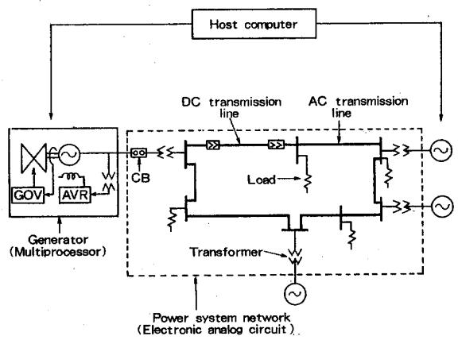  
Fig.1 Configuration of real-time simulator

# GENERATOR SIMULATION MODULE

Figure 2 shows the configuration of the generator simulation module [5]. This module generates three-phase analog voltages which are applied to the network modules. It works as follows: The three-phase voltages and currents at the generator terminal are measured every simulation time interval and they are converted into digital signals through the A/D converter. Based on the measured voltages and currents, the multiprocessor calculates the next-time-step state variables of the differential equations which represent the generator behavior. The equations are described in the next chapter in detail. The references such as the frequency, the phase angle and the internal voltage references are changed every simulation time interval, and they are sent to the three-phase sinusoidal oscillator circuit shown in Figure 3 [8]. This oscillator circuit is an analog voltage generator which generates three-phase sinusoidal voltages given by,

Ea" $\equiv$ E"sin(2πft+θ) (1)

Ee" $\equiv$ E"sin(2πft+θ-2/3π) (2)

Ec" $\equiv$ E"sin(2πft+θ+2/3π) (3)

where $f$ is the frequency reference, $\theta$ is the phase angle reference and $E''$ is the internal voltage reference. The three-phase sinusoidal oscillator makes smooth sinusoidal waves every 0.1 ms in accordance with the data stored in the ROM's even though the references from the microprocessors are kept constant during the simulation time interval. In order to obtain more accurate simulation results, however, it is necessary to make the simulation time interval as small as possible and to use a more precise simulation model. We developed a new method in which a multiprocessor is used to simulate a generator behavior by using a precise simulation model.

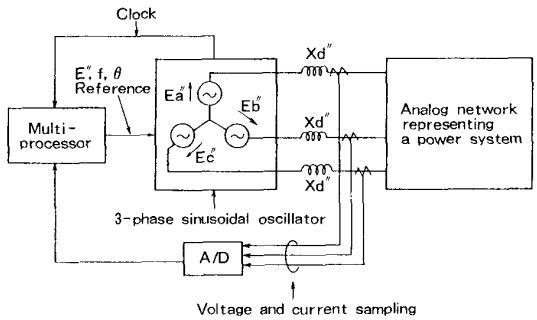  
Fig.2 Generator module

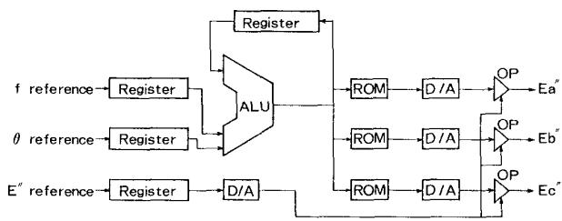  
Fig.3 Three-phase sinusoidal oscillator circuit

# GENERATOR SIMULATION WITH MULTIPPROCESSOR

# Simulation Program of Generator Module

The generator module simulates a generator behavior in accordance with the following equations explained in [9]. A symmetric-rotor case is assumed.

Rotor circuit:

$$
\psi a d = X ^ {\prime \prime} a d (- 1 d + \psi f d / X f d + \psi 1 d / X 1 d) \tag {4}
$$

$$
\psi a q = X ^ {\prime \prime} a q (- 1 q + \psi 1 q / X 1 q) \tag {5}
$$

$$
I f d = (\psi f d - \psi a d) / X f d \tag {6}
$$

$$
I I d = (\psi 1 d - \psi a d) / X 1 d \tag {7}
$$

$$
! 1 q = \left\langle \psi 1 q - \psi a q \right\rangle / X! q \tag {8}
$$

$$
\frac {\mathrm {d} \psi f d}{\mathrm {d} t} = R f d (F f d / X a d - I f d) \tag {9}
$$

$$
\frac {d \psi 1 d}{d t} = - R \left[ d \cdot I \right] d \tag {10}
$$

$$
\frac {d \psi 1 a}{d t} \quad R [ q, I ] q \tag {11}
$$

$$
E ^ {\prime \prime} d = X ^ {\prime \prime} a q (\psi 1 q, X 1 q) \tag {12}
$$

$$
\mathrm {E} ^ {\prime \prime} \mathrm {q} = \mathrm {X} ^ {\prime \prime} \mathrm {a d} (\psi \mathrm {f d} / \mathrm {X f d} + \psi \mathrm {l d} / \mathrm {X l d}) \tag {13}
$$

$$
E ^ {\prime \prime} = \text {F e d} ^ {\prime \prime} - E d ^ {\prime \prime} - E q ^ {\prime \prime} - E q ^ {\prime \prime} \tag {14}
$$

where $\operatorname{Id}$ , $\operatorname{Iq} = \operatorname{d}-$ and q-axis armature current

Ifd, Ild, Ilq = field, d- and q-axis damper current

Efd, E''d, E''q = field voltage, d- and q-axis component of E''

Rfd, Rld, R1q = field, d- and q-axis damper registance

Xad, Xfd, Xld, X1q = air gap flux, field, d- and q-axis damper reactance

X"ad, X"aq = d- and q-axis air gap flux subtransient reactance

$\psi \mathrm{ad},\psi \mathrm{aq} = \mathrm{d - }$ and q-axis air gap flux

$\psi \text{ed}, \psi \text{ld}, \psi \text{lq} = \text{field}, \text{d- and q-axis damper flux}$

Motion equation:

$$
\frac {\mathrm {M} \cdot \mathrm {d} \omega}{\omega \cdot \mathrm {d} t} = \mathrm {T m} - \mathrm {T e} - \mathrm {P d} \omega \tag {15}
$$

$$
\begin{array}{l} \mathrm {d} \delta \\ \mathrm {d} t \end{array} + \omega
$$

where $M =$ moment of inertia

$\omega_0 =$ rated angular velocity

$\omega =$ angular velocity

Tm = mechanical torque

Te = electromagnetic torque

$\delta =$ phase angle

Pd = mechanical damping constant

One example of the control system blocks is shown in Figure 4. The excitation control system AVR has three first-order lag blocks and the speed control system GOV has a first-order lag block.

The trapezoidal method is used as a solution method [5]. A differential equation $\mathrm{dx} / \mathrm{dt} = \mathrm{Ax} + \mathrm{Bu}$ is solved by

$$
x (t + \Delta t) = C x (t) + D [ u (t) + u (t + \Delta t) ] \tag {17}
$$

where

x: State vector, u: Input vector

A,B: Constant coefficient matrix

$$
C = (I - \frac {1}{2} \Delta t A) ^ {- 1} (I + \frac {1}{2} \Delta t A)
$$

$$
D = \frac {1}{2} \Delta t (I - \frac {1}{2} \Delta t A) ^ {- 1} B
$$

I: Unit matrix

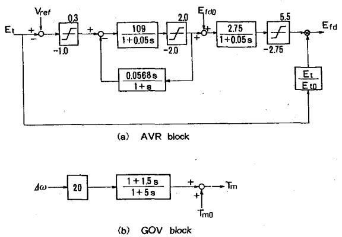  
Fig.4 Control system of generator

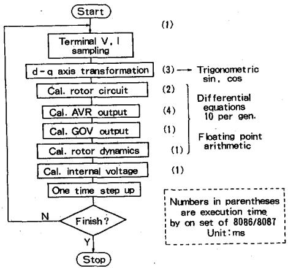  
Fig.5 Flow chart of generator simulation program

The trapezoidal method is a good solution method as for the number of solution steps and the solution stability [10].

Figure 5 shows the program flow chart that should be executed in the multiprocessor system of the generator module [5][9]. This program consists of the following six steps.

1) Measuring terminal voltages and currents and transforming them into those in the d-q axis coordinates.   
2) Rotor circuit calculation: Currents in d-axis, q-axis and the damper circuits are calculated by equations (4)-(11).   
3) AVR calculation: Output of the excitation system Efd is calculated based on the generator terminal voltage Et.   
4) Governor calculation: Output of the rotor speed control system $T_m$ is calculated based on the deviation of the angular velocity $\Delta \omega$ .   
5) Rotor dynamics calculation: The motion equation of the rotor is solved by equations (15),(16).   
6) Internal voltage calculation: Internal voltage reference $\mathbf{E}^{\prime \prime}$ is calculated by equations (12)-(14).

The above steps must be finished within one simulation time interval. But the transformation to the d-q axis coordinates requires trigonometrical functions such as $\sin(.)$ and $\cos(.)$ . Therefore, it takes a lot of time to execute step 1. The AVR and Governor simulation models, carried out in steps 3 and 4, have to be detailed in the case of long term dynamic simulations. Therefore, the number of differential equations for one generator is more than ten, and the execution of the program in Figure 5 may be rather time consuming even if a 16-bit microprocessor is used.

On the other hand, to obtain a precise simulation result, the simulation time interval must be smaller than the minimum time constant among those of the simulated generator system. In reference [5], the simulation time interval could be a maximum of 20 ms as for a long term dynamics simulation. However, in the case of an imbalanced fault in the AC transmission lines, double frequency components occur on the basic frequency component of the voltage and current. Therefore, sampling rate of the voltage and current must be larger than 200 Hz that is four times the speed of the basic frequency 50 Hz. Eventually, the simulation time interval has to be smaller than 5 ms.

As described in reference [4], fixed point arithmetic is preferable to lessen the simulation time interval, but it introduces a problem such as fixed point limit cycle effect. This problem is caused by the lack of effective digits of integer type variables. The problem becomes serious when simulating a generator behavior for a long time to analyze power system stability. To cope with the problem, we developed a new approach where several processors solve the equations in parallel by using floating point arithmetic. It is expected that the simulation time interval can be made smaller by the parallel processing, and that the numerical errors can be also reduced by using the floating point arithmetic.

# Parallel Processing in Generator Simulation

As microprocessors of the multiprocessor system, Intel's 16-bit microprocessor 8086 is adopted and the co-processor 8087 is also used to facilitate the floating point arithmetic [11]. The execution time of the one step of the program in Figure 5 was about 13 ms on the system of one set of the 8086 and 8087. Then, the parallel processing method was implemented to reduce the execution time to less than 5 ms.

To let the microprocessors run in parallel efficiently, the following approximation was adopted: Although all equations of the blocks in Figure 5 should be solved simultaneously, some inputs of the blocks can be substituted by previous-time-step values. The reason for this approximation is as follows: When adopting a small simulation time interval, the deviation of the state variables of the differential equations is very small. Therefore, no big numerical error takes place even though some previous-time-step variables are used. This approximation can be considered reasonable if the solution method of different equations is the trapezoidal method [10].

Before implementing the parallel processing, the input and output relations between each two blocks in Figure 5 were checked first. Then, for the sake of reducing the simulation time interval, the flow chart in Figure 5 was divided into four parts to be executed on four processors. Figure 6 shows the parallel processing method for the four processors. The execution orders are changed to satisfy the restriction of the execution time, of less than 5 ms. As described above, previous-time-step inputs are used in the rotor circuit calculation block and the rotor dynamics calculation block of the slave processor 3.

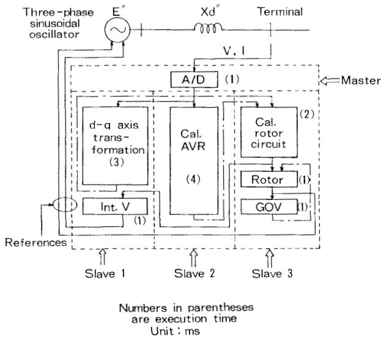  
Fig.6 Parallel processing on four processors

In accordance with the modified flow in the Figure 6, the tasks that should be executed on each processor were determined as shown in Figure 7. The master processor plays the role of a supervisor which checks the process of the slave processors and it also measures the terminal voltages and currents as well as communicates to the host computer system about the conditions and results of the simulation. On the other hand, each slave processor solves differential equations representing the behavior of the generator. Slave processor 1 carries out the d-q axis coordinates transformation and the internal voltage calculation. Slave processor 2 calculates only the excitation system output because the excitation system is represented by many differential equations. Slave processor 3 calculates the rotor circuit dynamics, the motion equation and the governor system output.

# Synchronization of Parallel Processing

The most difficult problem to run the four processors in parallel was synchronization of the processors. Those four processors must run in cooperation with each other. Therefore, this system adopts semaphores to synchronize the processors [12][13]. The semaphores are located in a common memory. Each processor has access to the common memory to check the value of the semaphore. The following three semaphores are used:

1)Semaphore S1 : Synchronizing the master and slave processor 1   
2) Semaphore S2 : Synchronizing the master and slave processor 2   
3) Semaphore S3 : Synchronizing the master and slave processor 3

These semaphores are integer type variables and they are free to be accessed from any processors.

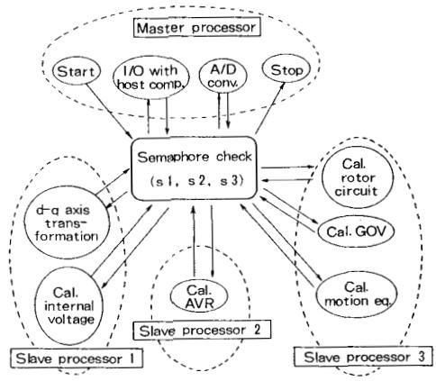  
Fig.7 Task assignment of each processor

The process state of each processor is determined by the values of these semaphores. As an example, a sequence of the slave processor 3 is explained in Figure 7. Semaphore S3 is used to synchronize the master processor and the slave processor 3. The slave processor 3 executes its program in accordance with the value of semaphore S3. Semaphore S3 is usually initialized to 0 and the slave processor 3 is assumed to be in an idle state. The master processor requests the slave processor 3 execute the procedures: The slave processor 3 begins calculation of the rotor circuit if the master sets semaphore S3 to 1. After finishing the rotor circuit calculation, the slave processor 3 resets semaphore S3 to 0. Then the master processor changes semaphore S3 to 2 in order to allow slave processor 3 to begin calculation of the governor system. These sequences continue to the end of one simulation period. The master processor judges the contents of the three semaphores and it controls the sequences of the three slave processors.

Figure 8 shows the configuration of the multiprocessor system in the generator module. The master processor unit and the slave processor units are connected to a common memory unit through a common bus. Since the contentions to common resources decrease the performance of the multiprocessor system, the memory area assignment of the program code and variables was carried out carefully. Each processor unit has its own local memory to reduce access times of the common memory. The program code as well as the local variables are stored on the local memory to avoid access contentions to the common bus and common memory.

The master processor unit has an interface adapter to communicate with the host computer system and it also has an A/D converter to obtain digital signals of the measured analog voltages and currents. The resolution of the A/D converter is 12 bits for the sake of high accuracy. The slave processor units have parallel interface adapters to send the references to the three-phase sinusoidal oscillator circuit.

Fig.8 Configuration of multiprocessor system   
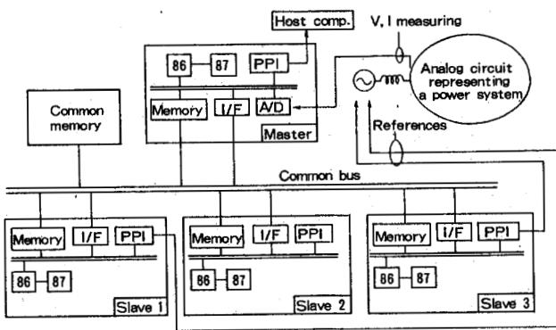  
86: Intel 8086   
I/F: Bus interface   
87: Intel 8087   
PPI: Peripheral interface

# COMPARISON OF SIMULATION RESULTS

To evaluate the new generator module, a three-line-to-ground fault without load was simulated first. Then, several simulations have been carried out on several AC network conditions to evaluate the accuracy of the whole system of the developed real-time simulator. These results were compared with off-line ones simulated with the well-known program EMTP. The simulation time interval used in EMTP was 0.1 ms for all simulation cases.

# Results of Three-line-to-ground Fault without Load

Figure 9 shows the results of a three-line-to-ground fault without load. Two figures of the d-axis open-circuit transient time constant Tdo' were tested. Since this generator module consists of the multi-processor, the parameter Tdo' was easily changed by modifying the data of the program. The peak value of the terminal currents is 2.5 p.u. just after the 3LG fault occurs, and the terminal currents decrease in accordance with the parameter Tdo' in both cases. In case (a), the currents decrease to a steady-state value, 0.85 p.u. soon after the fault because the Tdo' is small. On the other hand, the currents in case (b) have not reached to the steady-state value in this figure.

Figure 10 shows the EMTP simulation results. Every behavior of the current in this figure agrees with that of Figure 9. Particularly, the peak value and the steady-state value of the current coincide with those of Figure 9. However, in Figure 9, low frequency components of the currents are overriding on the transient currents for several cycles just after the fault. This phenomenon may be caused by the sampling time delay of the generator module: As the closed loop through the A/D converter is discrete in Figure 2, there exists a low frequency component among the roots of the closed loop. Higher sampling rate may be required in this case.

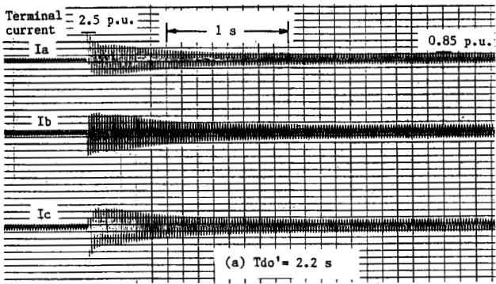

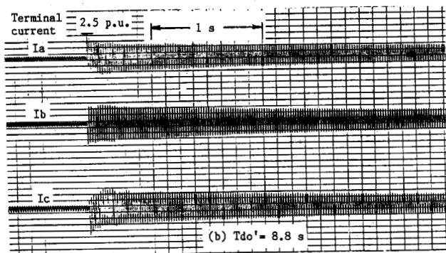  
Fig.9 3LG fault without load (Simulator)

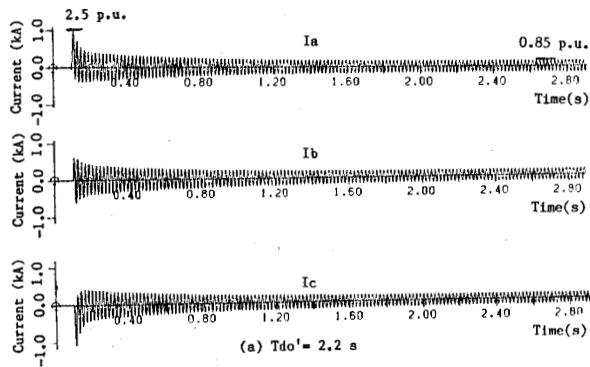

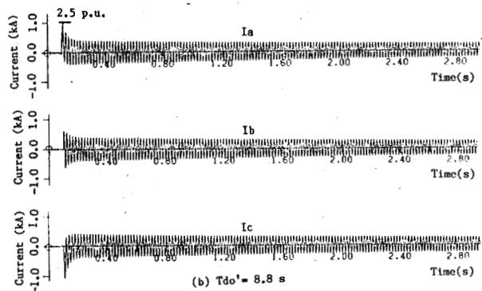  
Fig.10 3LG fault without load (EMTP)

A single-line-to-ground fault on $500\mathrm{kV}$ AC transmission lines was simulated in the model network shown in Figure 11. The ground fault was assumed to continue for 70 ms, i.e. 3.5 cycles on a $50\mathrm{Hz}$ basis. Figure 12 shows the simulation results by the real-time simulator. During the fault, the AC voltage is about 0.7 p.u., and the generator power includes a double frequency $(100\mathrm{Hz})$ component caused by the imbalanced voltage and current. The average power during the fault is lower than the pre-fault one. Therefore, the generator is accelerated and the frequency goes up to $50.21\mathrm{Hz}$ .

Figure 13 shows the off-line simulation results which correspond to those of Figure 12. In Figure 13, the terminal voltages are decreased during the fault and $100\mathrm{Hz}$ component is included in the generator power and the generator frequency goes up by $0.20\mathrm{Hz}$ . Figure 13 is similar to Figure 12 as for the lower frequency components, i.e. lower than $100\mathrm{Hz}$ . However, there exists disagreement in the higher frequency phenomena.

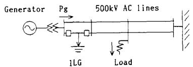  
Fig.11 Model network (No.1)

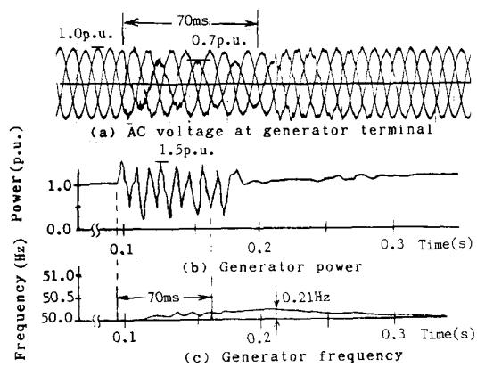

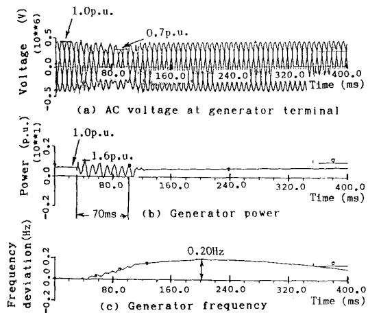  
Fig.12 1LG fault (Simulator)   
Fig.13 1LG fault (EMTP)

# Results of Three-line-to-ground Fault

A three-line-to-ground fault was simulated in the network model shown in Figure 14. The fault on the 1000 kV AC lines was assumed to continue for 270 ms. This fault period was determined as sufficient to evaluate the accuracy of frequency change.

Figure 15 shows the real-time simulation results. Before the fault takes place, the powers and frequencies of the generator G1 and G2 show no change in the figure. This indicates that the initial conditions of the two generators were set up appropriately. The terminal voltage of the generator decreases to about 0.5 p.u. during the fault. The power of the generator G1 lowers and its frequency goes up to $50.42\mathrm{Hz}$ during the fault period. On the other hand, the power of the generator G2 also becomes slightly lower, but the frequency change is small compared with that of generator G1. After the clearance of the fault, the power of generator G1 increases and the power of generator G2 decreases to restore the phase difference which widened during the fault.

EMTP simulation results are shown in Figure 16. Comparing the figures 15 and 16, the deviations of the generator powers are similar, but the transient currents just after the fault show disagreement. This is because the loss compensation circuit of the analog circuit was not tuned sufficiently.

Other case studies were also carried out by using the developed simulator and the off-line program EMTP. Most results of the real-time simulations agreed to those of the off-line simulations. But there were still some cases in which higher sampling rate was required.

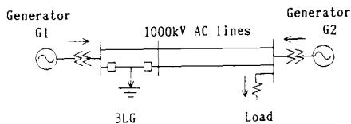  
Fig.14 Model network (No.2)

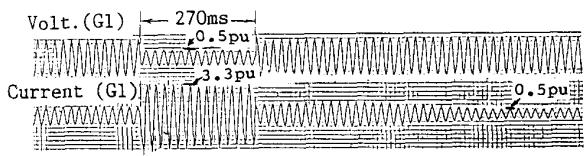

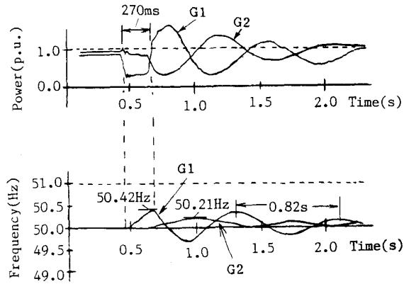  
Fig.15 3LG fault (Simulator)

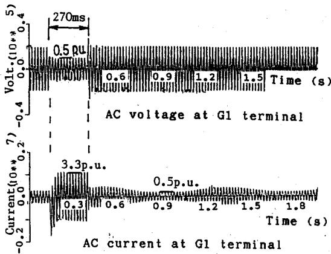

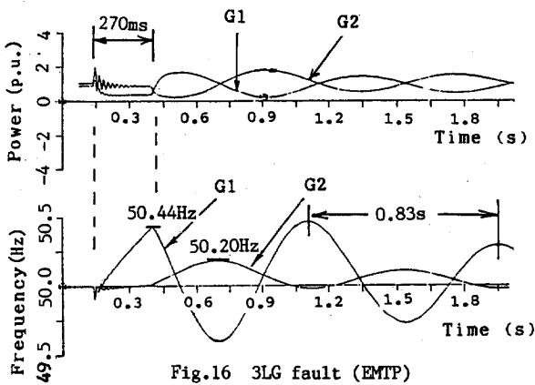  
REFERENCES

CONCLUSIONS

A new generator module for a real-time power system simulator was developed. In this simulation module, a multiprocessor and an analog three-phase sinusoidal oscillator are used to simulate the generator behavior. The multiprocessor consisting of four microprocessors solves the differential equations in parallel to lessen the simulation time interval, and it uses floating point arithmetic to obtain high accuracy of the simulations.

Any type of generator can be simulated by using the developed module since the parameters of the generator are easily modified only by changing the data of the program of the multiprocessors. The initial condition of the power system simulator is automatically set up by a host computer. These features give us a lot of advantages when simulating a power system which involves many generators.

Being evaluated by the off-line program EMTP, the accuracy of the simulator was considered as reasonable as for the phenomenon whose frequency was lower than 100 Hz because of the sampling frequency. In order to simulate higher frequency phenomena, further development with more powerful microprocessors will be continued.

[1] G. Jasmin, et al., "Electronic Simulation of a Hydro-generator with Static Excitation", IEEE PAS-100, No.9 1981   
[2] M. Gavrilovic, et al., "Evaluation of protective Relays and System with IREQ's Power System Simulator", SM of Canadian Electrical Association March, 1985

[3] M. Goto, et al., "Transient Behaviors of Synchronous Machine with Thyristor Converter Loads." Trans. IEE of Japan Vol.99-B, Sept., 1979   
[4] S. Macminn, et al., "Microprocessor Simulation of Synchronous Machine Dynamics in Real-time", IEEE PICA, pp.281-286, 1985   
[5] Y. Kokai, et al., "A New Real-time Generator Simulation Method for an Electrical Power System Simulator", Japan Society for Simulation Technology Conference, pp.487-492, July 1986   
[6] H. Konishi, et al., "Analog/Digital Hybrid Simulator for AC/DC Power Transmission System", IEEE Montech 1986   
[7] Bonneville Power Administration, Electro Magnetic Transients Program (EMTP) User's Manual, 1983   
[8] N. Mutoh, et al., "High Response Digital Speed-Control System for Induction Motors", IEEE Transactions on Industrial Electronics, Vol. IE-33, No.1, 1986   
[9] C. Concordia, Synchronous Machines, G.E. 1951   
[10] K. Saikawa, et al., "Real-time Simulation System of Large-scale Power System Dynamics for a Dispatcher Training Simulator", IEEE PAS-103 No.12, 1984   
[11] Intel, Component Data Catalog, 1982   
[12] R.Filman, et al., Coordinated Computer, Tools and Techniques for Distributed Software, McGraw-Hill, 1984   
[13] K.Hwang, et al., Computer Architecture and Parallel Processing, pp.557-642, McGraw-Hill, 1984

# BIOGRAPHIES

Yutaka Kokai was born in Niigata Prefecture, Japan on Feb. 14, 1957. He received the B.S. and M.S. degrees in electrical engineering from Yokohama National University in 1979 and 1981, respectively.

In 1981, he joined Hitachi Research Laboratory, Hitachi, Ltd., where he has been engaged in the field of power system control and analysis.

He is a member of IEEE and IEE of Japan.

Iwao Matori was born in Nagasaki Prefecture, Japan on Aug. 30, 1950. He received the B.S. and M.S. degrees in electronics engineering from the University of Kyushu in 1973 and 1975, respectively.

In 1975, he joined Hitachi Research Laboratory, Hitachi, Ltd., where he is a senior researcher and he has been engaged in the field of power system control and analysis.

He is a member of IEEE, IEE and IEICE of Japan.

Junzo Kawakami was born in Miyagi Prefecture, Japan on July 29, 1944. He received the B.S. and PhD degrees in electrical engineering from the University of Tokyo in 1968 and 1973, respectively. He was an associate professor of the University of Tokyo.

In 1982, he joined Hitachi Research Laboratory, Hitachi, Ltd., where he is a senior researcher and he has been engaged in the field of power system control and analysis.

He is a member of IEEE, AAAI, IEE and SICE of Japan.