# High-accuracy EMT simulations through pole-residue compensation

A. A. Kida a,∗, A.C.S. Lima b, F. A. Moreira c, F. M. Vasconcellos c

a Federal Institute of Bahia, Salvador, BA, Brazil   
b Department of Electrical Engineering, COPPE/UFRJ, Federal University of Rio de Janeiro, Rio de Janeiro, Brazil   
c Department of Electrical and Computer Engineering, Federal University of Bahia, Salvador, BA, Brazil

# a r t i c l e i n f o

Keywords:

Rational approximation

Pole-residue formulation

Time-frequency analysis

Frequency warping

Simulation accuracy

# a b s t r a c t

This paper addresses the frequency warping error in frequency-dependent equivalents to improve the accuracy of Electromagnetic Transient (EMT) simulations. This numerical error, intrinsic to all linear multi-step integration methods, such as the trapezoidal rule, distorts frequency response and degrades time-domain simulation accuracy. This work introduces the Pole-Residue Frequency Warping Compensation (PRFWC) algorithm to mitigate the frequency warping in rational approximations with the pole-residue formulation. Performance validation of the proposed algorithm is conducted through two case studies: a transmission line and a distribution system. Numerical results show that the PRFWC improves simulation accuracy by two orders of magnitude over uncompensated models, with minimal computational burden.

# 1. Introduction

The increasing complexity of power systems are accelerated by the energy transition from fossil-based to low-carbon and renewable sources [1]. As a result, in-depth analysis of new dynamic interactions between their components and subsystems is paramount [2]. In this context, Electromagnetic Transient (EMT) simulations are an essential tool that can be tuned to provide sufficient accuracy to anticipate these interactions, ensuring reliable and efficient power system planning and operation.

Accurate yet efficient simulations can be achieved by preserving the frequency characteristics of subsystems using frequency-dependent equivalents [3,4]. A common approach is to represent these equivalents using rational functions derived from data-driven curve-fitting techniques [5–7]. Vector Fitting (VF) stands out among the curvefitting techniques for its computational efficiency, accuracy, straightforward formulation, versatility, and open-source availability [5]. Additionally, it is embedded in various EMT-type simulators, including EMTP-ATP [8], EMTDC/PSCAD [9], and EMTP [10].

Time-domain simulations require careful consideration regarding discretization techniques. The trapezoidal rule is widely employed in commercial EMT-type simulators [11] as it is the most accurate among linear multi-step integration methods with A-stability [12].

The continuous-time domain transfer function of the integrator is

$$
\frac {b (s)}{u (s)} = \frac {1}{s}, \tag {1}
$$

where ??(??) and ??(??) are the output and the input of the integrator in s-domain, respectively; ?? is the complex frequency variable in the sdomain.

Applying the trapezoidal rule to derive the transfer function of (1) in the discrete-time domain yields:

$$
\frac {B [ z ]}{U [ z ]} = \frac {h}{2} \frac {\left(1 + z ^ {- 1}\right)}{\left(1 - z ^ {- 1}\right)}, \tag {2}
$$

where ??[??] and ?? [??] are the Z-transforms of ??(??) and ??(??), respectively, obtained using the trapezoidal rule; ?? is the complex variable in the Z-domain.

By equating (1) and (2), then solving for ??, yields the bilinear transformation (also known as the Tustin method) [13]:

$$
z = \frac {1 + 0 . 5 s h}{1 - 0 . 5 s h}. \tag {3}
$$

The mapping between the analog (continuous-time) frequency ???? and its corresponding digital frequency ?? is derived by substituting ?? = ?????? and ?? = exp (????ℎ) into (3), where ℎ is the integration time-step.

Solving for $\omega _ { a }$ yields:

$$
\omega_ {a} = \frac {2}{h} \tan \left(\frac {\omega h}{2}\right). \tag {4}
$$

The nonlinear frequency mapping between $\omega _ { a }$ and ?? in (4) compresses the discrete-time frequency scale, introducing a numerical error known as frequency warping [14]. This error is not unique to the trapezoidal rule but is inherent to all linear multi-step integration methods [13].

Strategies for frequency warping mitigation mainly involve adjusting the ℎ size, pre-warping, or relying on non-standard solution techniques.

Pre-warping techniques are mostly considered in the context of digital filter design $[ 1 5 \substack { - } 1 7 ]$ . For instance, a digital frequency specification, such as its cutoff frequency, is prewarped using (4) to build the analog prototype low-pass filter specification, which is then transformed into the desired filter transfer function [15]. Applications of pre-warping for frequency-dependent equivalent (FDE) and power systems are scarce in the literature. In that regard, the author in [18] pre-warped the input frequency response data for a given ℎ before the fitting process. However, this approach cannot be applied to the existing rational approximation, necessitating a model recalculation for different ℎ values.

Concerning ℎ adjustments, adaptive ℎ methods based on energy balance were developed in [19,20]. However, reducing ℎ might lead to excessive computational overhead. Additionally, Marti and Lin [21] proposed the following guideline for ℎ:

$$
h \leq \frac {1}{1 0 f _ {\text {m a x}}}, \tag {5}
$$

where $f _ { \mathrm { m a x } }$ is the highest frequency of interest. However, the authors in [22] showed that frequency warping can still be significant for extended simulation durations, even when ℎ satisfies the criterion in (5).

Non-standard solution techniques, such as the high-order integration method based on the Obreshkov formula, can be applied to mitigate frequency warping [23]. In [14], the authors showed that although the harmonic balance method may encounter convergence issues and performance degradation for signals containing many harmonics, it does not exhibit frequency warping. The main concern with non-standard discretization methods is their lack of extensive documentation, which may lead to unpredictable or undocumented behavior. In contrast, techniques based on the trapezoidal rule are favored for their reliability, stability, and straightforward implementation.

The main contribution of this work is a novel strategy to compensate for the frequency warping caused by the trapezoidal rule, employing rational models based on the pole-residue formulation. Additionally, this work demonstrates how pre-warping inductances and capacitances affect a rational approximation. Finally, the impact of frequency warping on time-domain simulations of frequency-dependent equivalents is highlighted.

This paper is structured as follows. Section 2 provides the theoretical background for rational approximations, while also complementing the concepts of frequency warping and pre-warping introduced earlier in this paper. Section 3 details the proposed algorithm. Section 4 presents numerical results based on two test cases, providing insights into the performance of the proposed technique. Lastly, key conclusions are drawn in Section 5.

# 2. Discretization effect of inductances and capacitances in a pole-residue formulation

An ??-port nodal admittance matrix $\mathbf { Y } ( s ) \in \ \mathbb { C } ^ { N \times N }$ can be approximated by a rational function $\mathbf { \overline { { Y } } } ( s ) \in \mathbb { C } ^ { N \times N }$ . Hence,

$$
\mathbf {Y} (s) \approx \overline {{\mathbf {Y}}} (s) = \sum_ {i = 1} ^ {N _ {p}} \frac {\mathbf {r} _ {\mathrm {i}}}{s - p _ {i}} + \mathbf {D}, \tag {6}
$$

where $i \in \{ 1 , \ldots , N _ { p } \} ; s = j \omega ;$ ?? is the angular frequency in rad∕s; $N _ { p }$ is the number of poles or model order; $ { \mathbf { D } } \in \mathbb { R } ^ {  { N } \times  { N } }$ is the constant term

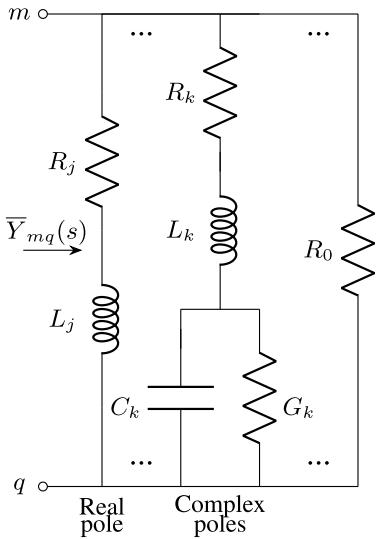  
Fig. 1. Electrical network synthesis. Adapted from [3].

(positive definite matrix); $p _ { i }$ is the ??th pole; $\mathbf { r } _ { i } \in \mathbb { C } ^ { N \times N }$ is the associated ??th residue matrix.

A single entry ??, ?? of $\overline { { \mathbf { Y } } } ( s ) , \overline { { Y } } _ { m q } ( s ) ,$ can be synthesized using basic circuit components such as resistors, inductors and capacitors [3], as depicted in Fig. 1. Therefore,

$$
\begin{array}{l} \bar {Y} _ {m q} (s) = \underbrace {\frac {1}{R _ {0}}} _ {D} + \underbrace {\sum_ {j = 1} ^ {N _ {R P}} \frac {1}{R _ {j} + s L _ {j}}} _ {\text {R e a l p o l e s}} (7) \\ + \underbrace {\sum_ {k = 1} ^ {N _ {C P}} \frac {1}{R _ {k} + s L _ {k} + \frac {1}{s C _ {k} + G _ {k}}}} _ {\text {C o m p l e x p o l e s}}, (8) \\ \end{array}
$$

where ?? is the constant term; $N _ { R P } , N _ { C P }$ are the number of real and complex poles of the model, respectively.

# 2.1. Frequency-warping

If the differential network equations are solved using the trapezoidal rule, the capacitances and inductances in (7) become frequencydependent due to the frequency warping [24]. Therefore,

$$
L _ {D T} (\omega) = \Psi (\omega) L, \tag {9}
$$

$$
C _ {D T} (\omega) = \Psi (\omega) C, \tag {10}
$$

$$
\Psi (\omega) = \frac {2}{\omega h} \tan \left(\frac {\omega h}{2}\right), \tag {11}
$$

where $L _ { D T } ( \omega )$ and $C _ { D T } ( \omega )$ are the discretized inductance ?? and capacitance ??, respectively; the frequency warping error is numerically represented as $\Psi ( \omega )$ .

# 2.2. Pre-Warping

In the discrete-time domain, the expected (analog) behavior of inductors and capacitors for a pre-warping frequency ??′ can be retrieved by scaling $L _ { D T } ( \omega ^ { \prime } ) \left( 9 \right)$ and $C _ { D T } ( \omega ^ { \prime } )$ (10) for a factor $\xi ( \omega ^ { \prime } )$ . Hence,

$$
\xi \left(\omega^ {\prime}\right) = \frac {1}{\Psi \left(\omega^ {\prime}\right)} = \frac {\omega^ {\prime} h}{2} \cot \left(\frac {\omega^ {\prime} h}{2}\right), \tag {12}
$$

$$
L ^ {\prime} \left(\omega^ {\prime}\right) = \xi \left(\omega^ {\prime}\right) L _ {D T} \left(\omega^ {\prime}\right) = \frac {\omega^ {\prime} h L _ {D T}}{2} \cot \left(\frac {\omega^ {\prime} h}{2}\right), \tag {13}
$$

$$
C ^ {\prime} \left(\omega^ {\prime}\right) = \xi \left(\omega^ {\prime}\right) C _ {D T} \left(\omega^ {\prime}\right) = \frac {\omega^ {\prime} h C _ {D T}}{2} \cot \left(\frac {\omega^ {\prime} h}{2}\right), \tag {14}
$$

where $L ^ { \prime } ( \omega ^ { \prime } )$ and $C ^ { \prime } ( \omega ^ { \prime } )$ are the frequency-warped-compensated inductance and capacitance, respectively.

Consider the complex pole-residue modeled using an RLCG branch [3] depicted in Fig. 1. Therefore, frequency warping can be mitigated by updating $L \gets L ^ { \prime } ( \omega ^ { \prime } ) \left( 1 3 \right)$ and $C  C ^ { \prime } ( \omega ^ { \prime } ) ( 1 4 )$ ). Thus,

$$
\begin{array}{l} Y (s) = \frac {1}{R _ {1} + s L _ {1} + \frac {1}{s C _ {1} + G _ {1}}}, \tag {15} \\ = \frac {s C _ {1} + G _ {1}}{s ^ {2} L _ {1} C _ {1} + s (R _ {1} C _ {1} + L _ {1} G _ {1}) + R _ {1} G _ {1} + 1}, \\ \end{array}
$$

The roots of ?? (??) in (15) are its poles $p ,$ thus

$$
p = \frac {- K \pm \sqrt {K ^ {2} - 4 L _ {1} C _ {1} \left(R _ {1} G _ {1} + 1\right)}}{2 L _ {1} C _ {1}}, \tag {16}
$$

where $K = R _ { 1 } C _ { 1 } + L _ { 1 } G _ { 1 }$

The corresponding residue ?? of (15)

$$
\begin{array}{l} r = \lim  _ {s \to p} (s - p) Y (s), \\ = \lim  _ {s \rightarrow p} (s - p) \frac {s C _ {1} + G _ {1}}{s ^ {2} L _ {1} C _ {1} + s K + R _ {1} G _ {1} + 1}, \tag {17} \\ \end{array}
$$

When ?? approaches $p ,$ both numerator and denominator of ?? in (17) approaches zero. Thus,

$$
\begin{array}{l} r = \lim  _ {s \rightarrow p} \frac {\frac {d}{d s} [ (s - p) (s C _ {1} + G _ {1}) ]}{\frac {d}{d s} \left(s ^ {2} L _ {1} C _ {1} + s K + R _ {1} G _ {1} + 1\right)}, \tag {18} \\ = \lim  _ {s \rightarrow p} \frac {(s - p) C _ {1} + (s C _ {1} + G _ {1})}{2 s L _ {1} C _ {1} + K} = \frac {p C _ {1} + G _ {1}}{2 p L _ {1} C _ {1} + K}. \\ \end{array}
$$

A frequency-warped-compensated version of (15), denoted as $Y ^ { \prime } ( s ) _ { i }$ , can be obtained by substituting $L _ { 1 }$ and $C _ { 1 }$ with their corresponding prewarped versions. Hence,

$$
Y ^ {\prime} (s) = \frac {1}{R _ {1} + s L _ {1} ^ {\prime} (\omega^ {\prime}) + \frac {1}{s C _ {1} ^ {\prime} (\omega^ {\prime}) + G _ {1}}}, \tag {19}
$$

By substituting (13) and (14) in (19) and dropping $\omega ^ { \prime }$ to simplify notation, leads to

$$
\begin{array}{l} Y ^ {\prime} (s) = \frac {1}{R _ {1} + s \xi L _ {1} + \frac {1}{s \xi C _ {1} + G _ {1}}}, \tag {20} \\ = \frac {s \xi C _ {1} + G _ {1}}{s ^ {2} \xi^ {2} L _ {1} C _ {1} + s \xi K + R _ {1} G _ {1} + 1}. \\ \end{array}
$$

The poles $p ^ { \prime }$ of $Y ^ { \prime } ( s )$ are the roots of its denominator, hence

$$
\begin{array}{l} p ^ {\prime} = \frac {- \xi K \pm \sqrt {(\xi K) ^ {2} - 4 \xi^ {2} L _ {1} C _ {1} \left(R _ {1} G _ {1} + 1\right)}}{2 \xi^ {2} L _ {1} C _ {1}}, \tag {21} \\ = \frac {- K \pm \sqrt {K ^ {2} - 4 L _ {1} C _ {1} (R _ {1} G _ {1} + 1)}}{2 \xi L _ {1} C _ {1}}. \\ \end{array}
$$

Thus, by expressing (21) in terms of (16) and recovering the suppressed notation results in

$$
p ^ {\prime} = \frac {p}{\xi \left(\omega^ {\prime}\right)}. \tag {22}
$$

The corresponding residue $r ^ { \prime }$ associated with $p ^ { \prime }$ is

$$
\begin{array}{l} \begin{array}{c}r ^ {\prime} = \lim  _ {s \rightarrow p ^ {\prime}} (s - p ^ {\prime}) Y ^ {\prime} (s),\\(s - p ^ {\prime}) (s ^ {z} C _ {-} + G _ {+}).\end{array}(23) \\ = \lim  _ {s \rightarrow p ^ {\prime}} \frac {(s - p ^ {\prime}) \left(s \xi C _ {1} + G _ {1}\right)}{s ^ {2} \xi^ {2} L _ {1} C _ {1} + s \xi K + R _ {1} G _ {1} + 1}. (23) \\ \end{array}
$$

Therefore,

$$
\begin{array}{l} r ^ {\prime} = \lim  _ {s \rightarrow p ^ {\prime}} \frac {\frac {d}{d s} \left[ (s - p ^ {\prime}) (s \xi C _ {1} + G _ {1}) \right]}{\frac {d}{d x} \left(s ^ {2} \xi^ {2} L _ {1} C _ {1} + s \xi K + R _ {1} G _ {1} + 1\right)}, \\ = \lim  _ {s \rightarrow p ^ {\prime}} \frac {\left(s - p ^ {\prime}\right) C _ {1} + \left(s \xi C _ {1} + G _ {1}\right)}{2 s \xi^ {2} L _ {1} C _ {1} + \xi K}, \tag {24} \\ = \frac {p ^ {\prime} \xi C _ {1} + G _ {1}}{2 p ^ {\prime} \xi^ {2} L _ {1} C _ {1} + \xi K}. \\ \end{array}
$$

By substituting (22) in (24) results in

$$
r ^ {\prime} = \frac {p C _ {1} + G _ {1}}{2 p \xi L _ {1} C _ {1} + \xi K}. \tag {25}
$$

Finally, replacing (18) in (25) and recovering the suppressed notation leads to:

$$
r ^ {\prime} = \frac {r}{\xi \left(\omega^ {\prime}\right)}. \tag {26}
$$

The scaling of $L _ { 1 }$ and $C _ { 1 }$ by $\xi ( \omega ^ { \prime } ) ,$ implies scaling of $p ^ { \prime }$ and $r ^ { \prime }$ by $1 / \xi ( \omega ^ { \prime } ) .$ . A similar inference applies to the real pole case (RL branch) using the same methodology outlined in this section.

The pre-warped version of $\overline { { \mathbf { Y } } } ( s )$ , denoted as $\overline { { \mathbf { Y } ^ { \prime } } } ( s ) \in \mathbb { C } ^ { N \times N }$ , is expressed as

$$
\overline {{\mathbf {Y} ^ {\prime}}} (s) = \sum_ {n = 1} ^ {N _ {p}} \frac {\mathbf {r} _ {\mathbf {i}} ^ {\prime}}{s - p _ {i} ^ {\prime}} + \mathbf {D}, \tag {27}
$$

where $p _ { i } ^ { \prime }$ and $\bf { r _ { i } ^ { \prime } }$ represent the ??th pre-warped pole (22) and the matrices of pre-warped residues (26), respectively.

# 3. The proposed algorithm

Choosing an appropriate value for ??′ is essential for effective frequency warping mitigation. In the ideal case, the simulated signal contains a single frequency component, allowing ??′ to be set to this value, eliminating the frequency warping. However, this scenario is seldom encountered in EMT simulations. Furthermore, the precise values of the frequency components in a transient phenomenon are typically unknown before the simulation. Therefore, a more general approach is preferable.

Frequency warping manifests as a disturbance of the original linearized eigenvalues of the simulated system [14]. Although these eigenvalues are typically unknown, frequency response data sampled between ports can be acquired through measurements or simulations. As a result, the equivalent system and its eigenvalues can be approximated (or identified) with a rational approximation through data-driven curvefitting techniques [5]. The well-known VF [25–27] approximates the frequency response using a set of poles and residues.

Once the system is identified, the proposed Pole-Residue Frequency Warping Compensation (PRFWC) algorithm pre-warps the pole-residue rational approximation to address the eigenvalue perturbations introduced by frequency warping. The framework for achieving frequencywarped-compensated results with PRFWC as a post-fitting step is shown in Fig. 2. The proposed approach offers an alternative mapping between discrete and continuous-time domains. The algorithm outlined in Pseudocode 1 utilizes the contribution of the imaginary component of each pole in characterizing the oscillatory behavior of a given transfer function. Accordingly, each $p _ { i }$ (22) and ${ \bf r _ { i } }$ (26) is scaled based on the prewarping frequency $\omega _ { i } ^ { \prime } ,$ such that

$$
\omega_ {i} ^ {\prime} = \operatorname {I m} \left(p _ {i}\right), \tag {28}
$$

where $\mathrm { I m } ( p _ { i } )$ is the imaginary frequency component of $p _ { i } .$

The proposed algorithm applies strictly to proper rational functions $( 6 ) ,$ , which does not include the ??-proportional capacitance term in ??(??). This results from the fact that no single value of $\omega ^ { \prime }$ can adequately prewarp this term across the entire frequency range.

# 4. Numerical results and discussion

The performance of the PRFWC is validated using two frequencydependent equivalents: a transmission line (Case A) and a distribution

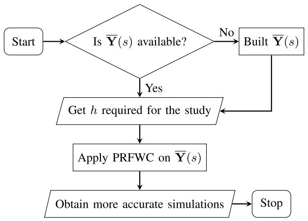  
Fig. 2. Proposed framework of PRFWC.

Algorithm 1 The PRFWC algorithm.   

<table><tr><td colspan="2">1: for all i do</td><td>▷ All poles</td></tr><tr><td colspan="2">2: ωi&#x27; ← Im(pi)</td><td>▷ Eq. (28)</td></tr><tr><td colspan="2">3: if |ωi&#x27;| &lt; π/h then</td><td>▷ Nyquist limit</td></tr><tr><td colspan="2">4:ξi ← (ωi&#x27;h/2)cot (ωi&#x27;h/2)</td><td>▷ Eq. (12)</td></tr><tr><td colspan="2">5:pi&#x27; ← pi/ξi</td><td>▷ Eq. (22)</td></tr><tr><td colspan="2">6:r&#x27;i&#x27; ← ri/ξi</td><td>▷ Eq. (26)</td></tr><tr><td colspan="2">7: end if</td><td></td></tr><tr><td colspan="2">8: i ← i + 1</td><td></td></tr><tr><td colspan="2">9: end for</td><td></td></tr></table>

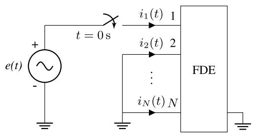  
Fig. 3. Test-circuit configuration.

network (Case B). The frequency response data used in this work are publicly available on the SINTEF website [28].

The following considerations apply to both cases. The test circuit configuration is illustrated in ${ \mathrm { F i g . ~ } } 3 ,$ with all ports grounded except for port 1. A single voltage source $e ( t ) = \cos ( 2 \pi f _ { e } t )$ pu applied at port 1 at ?? = 0 s. High-frequency transients are simulated with five scenarios, consisting of excitation frequencies $f _ { e }$ varying from 10 kHz to 90 kHz in 20 kHz intervals. The bandwidth of the input frequency response is 10 Hz to 100 kHz. FDEs are obtained with the VF considering 50 poles. The outputs are the currents $i _ { j } ( t )$ for $j = 1 , \dots , N$ , following the terminology of the original data in [28], entering the terminals as depicted in Fig. 3. These currents are obtained by convolving the voltage input vector with the FDE and discretizing it using the trapezoidal rule.

In all scenarios of a given case, $h = 1$ µs unless otherwise specified. This value complies with the criterion (5), considering that $f _ { \mathrm { m a x } } =$ 100 kHz is the highest frequency component of the frequency response data used to build the rational approximation.

In the absence of an analytical solution, a reference waveform $i _ { r e f } ( t )$ is generated by simulating the system with $h = 1 \mu \mathrm { s } / 1 0 0 0 0 = 1 0 0 \mathrm { p s } ,$ as the frequency warping is negligible for such small ℎ.

The accuracy of the proposed algorithm is accessed through two metrics: the relative root mean square error (RRMSE) $I _ { \mathrm { R R M S E } }$ and the normalized max absolute error (NMAE) $I _ { \mathrm { N M A E } }$ . The former is a normalized and dimensionless metric of the overall accuracy of the simulation. The

latter quantifies the significance of the largest deviation between the simulated and reference signals, normalized by the maximum magnitude of the reference signal. Thus,

$$
I _ {\text {R R M S E}} = \sqrt {\frac {\sum_ {n = 1} ^ {N _ {T}} | i (n) - i _ {r e f} (n) | ^ {2}}{N _ {T} \sum_ {n = 1} ^ {N _ {T}} | i _ {r e f} (n) | ^ {2}}}, \tag {29}
$$

$$
I _ {\mathrm {N M A E}} = \frac {\max  \left(\left| i (n) - i _ {r e f} (n) \right|\right)}{\max  \left(\left| i _ {r e f} (n) \right|\right)}, \tag {30}
$$

where $n = t / h$ and $N _ { T }$ is the total number of simulation steps.

The frequency responses presented in this work are directly computed by performing a frequency sweep from 10 Hz to 100 kHz on the s-domain rational models $\overline { { \mathbf { Y } } } ( s )$ and $\overline { { { \bf Y } ^ { \prime } } } ( s )$ .

# 4.1. Case a: Transmission line

The first case involves the modeling of a 132 kV overhead threephase transmission line, illustrated in Fig. 4. The transmission line is modeled as a three-port frequency-dependent equivalent, with measurements taken at the sending-end of the line while the receiving-end of the line is open-circuited. The dc resistance per unit length is 0.121 Ω km−1 for the phase wire and $0 . 3 5 9 \Omega \mathrm { k m } ^ { - 1 }$ for the ground wire. The line length is 12 km. The diameters of the phase and ground wires are 21.66 mm and 12.33 mm, respectively. The soil resistance is 100 Ω m. The output is the current at port 1 $i _ { 1 } ( t ) ,$ , considering the configuration shown in Fig. 3.

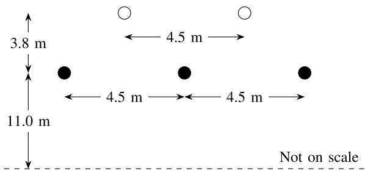  
Fig. 4. 132 kV three-phase transmission line conductor configuration, Case A. The ground and phase wires are represented as white and black circles, respectively. Adapted from [29].

PRFWC altered the original frequency response in the frequency domain to compensate for the distortion imposed by frequency warping as depicted in Fig. 5. The most noticeable differences between the frequency responses manifest at higher frequencies, where the frequency warping exerts a more substantial compressing effect. Likewise, poles with larger imaginary parts underwent significant pre-warping, as illustrated in Fig. 6.

Table 1 provides quantitative evidence of the substantial error reduction through the simulation achieved in all tested scenarios by the

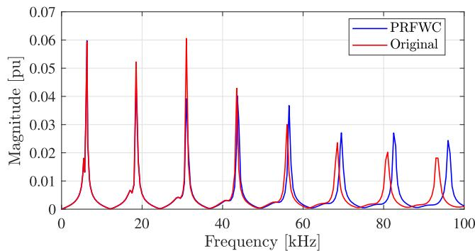  
Fig. 5. Magnitude of frequency responses, Case A.

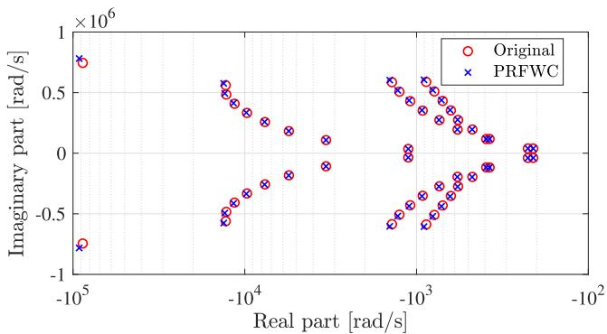  
Fig. 6. Pole placement of the rational approximations, Case A.

Table 1 RRMSE values for time-domain simulations across all scenarios in Case A.   

<table><tr><td>fe(kHz)</td><td>PRFWC(%)</td><td>Original(%)</td><td>Ratioa</td></tr><tr><td>10</td><td>2.89 × 10-2</td><td>7.37 × 10-1</td><td>3.92 × 10-2</td></tr><tr><td>30</td><td>3.87 × 10-2</td><td>5.67 × 10-1</td><td>6.82 × 10-2</td></tr><tr><td>50</td><td>1.71 × 10-1</td><td>3.05</td><td>5.61 × 10-2</td></tr><tr><td>70</td><td>9.96 × 10-2</td><td>3.48</td><td>2.86 × 10-2</td></tr><tr><td>90</td><td>3.60 × 10-1</td><td>1.20 × 101</td><td>2.99 × 10-2</td></tr></table>

a RRMSE of PRFWC over original.

Table 2 RRMSE values for time-domain simulations across all scenarios in Case A, using a reduced time-step for the original simulation.   

<table><tr><td>fe(kHz)</td><td>PRFWC(%)</td><td>Originala(%)</td><td>Ratiob</td></tr><tr><td>10</td><td>2.89 × 10-2</td><td>3.89 × 10-2</td><td>7.43 × 10-1</td></tr><tr><td>30</td><td>3.87 × 10-2</td><td>2.01 × 10-2</td><td>1.93</td></tr><tr><td>50</td><td>1.71 × 10-1</td><td>1.22 × 10-1</td><td>1.40</td></tr><tr><td>70</td><td>9.96 × 10-2</td><td>1.77 × 10-1</td><td>5.63 × 10-1</td></tr><tr><td>90</td><td>3.60 × 10-1</td><td>3.48 × 10-1</td><td>1.03</td></tr></table>

a With ℎ reduced from 1 µs to 250 ns.   
b RRMSE of PRFWC over original with ℎ = 250 ns.

Table 3 NMAE for time-domain simulations across all scenarios in Case A..   

<table><tr><td>fe(kHz)</td><td>PRFWC(%)</td><td>Original(%)</td><td>Ratioa</td></tr><tr><td>10</td><td>2.61</td><td>25.17</td><td>1.04 × 10-1</td></tr><tr><td>30</td><td>1.35</td><td>23.53</td><td>5.74 × 10-2</td></tr><tr><td>50</td><td>5.26</td><td>73.91</td><td>7.12 × 10-2</td></tr><tr><td>70</td><td>4.32</td><td>89.71</td><td>4.82 × 10-2</td></tr><tr><td>90</td><td>10.71</td><td>249.26</td><td>4.30 × 10-2</td></tr></table>

a NMAE of PRFWC over original.

proposed method. The accuracy improvement is of two orders of magnitude across all evaluated scenarios. The RRMSE of the PRFWC with $h = 1 \mu \mathrm { s }$ is comparable to the original (uncompensated) signal with $h = 1 \mu \mathrm { s } / 4 = 2 5 0$ ns, as presented in Table 2. Table 3 demonstrates that the PRFWC method reduced the worst-case deviation by one to two orders of magnitude across all scenarios, as quantified by the NMAE metric. Notably, the uncompensated waveforms exhibited NMAE values as high as 249.26 %, whereas the PRFWC methodology achieved a significantly lower value of 10.71 %.

On the qualitative side, the time-domain waveforms for $f _ { e }$ values of 50 kHz and 90 kHz are displayed in Figs. 7 and $^ { 8 , }$ respectively. It is clear that, even for the same ℎ, the original waveform exhibited

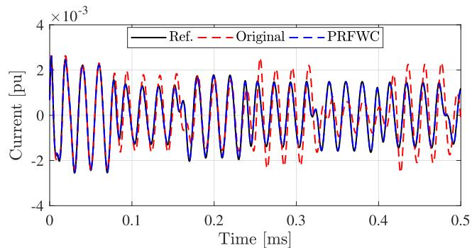

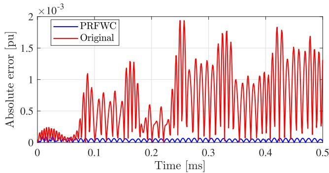  
Fig. 7. Time-domain responses of the reference, original and PRFWC waveforms (top), along with their absolute error (bottom) with $f _ { e } = 5 0 \mathrm { k H z } ,$ , Case A.

significant deviations from the reference, whereas the PRFWC results closely matched the reference.

For the 50 kHz source, the frequency warping increased the amplitude of the original waveform in Fig. 7 around 0.15 ms, 0.30 ms and 0.45 ms. In contrast, the amplitude of the original signal was reduced around 0.35 ms. This behavior can be understood by analyzing the spectrum near 50 kHz in Fig. 5. Depending on the frequency, the amplitude of the original frequency response may be either lower or higher than that obtained with PRFWC. Lastly, Fig. 8 demonstrates that for $f _ { e } = 9 0 \mathrm { k H z } ,$ , frequency warping led to significant amplitude errors of the original signal after 0.1 s. This effect can be interpreted as the result of the mapping imposed by frequency warping, which shifts the original resonance peak with the highest frequency in Fig. 5 to a value closer to $f _ { e } .$ .

# 4.2. Case b: Distribution network

The second case, illustrated in Fig. 9 represents a two three-phase buses (A and B) distribution network modeled as a six-port FDE. ??(??) is computed regarding both bus-bars. The output is evaluated as the current at port $2 \ i _ { 2 } ( t )$ , following the configuration shown in Fig. 3.

As illustrated in Fig. 10, the PRFWC approach modified the original frequency response to alleviate the compression effects induced by frequency warping. As expected, the spectral components at higher frequencies underwent more significant pre-warping. This trend is further validated by analyzing the pole placement generated by the proposed algorithm in Fig. 11.

The PRFWC attained an accuracy improvement of two orders of magnitude across all scenarios, as outlined in Table 4. Moreover, the uncompensated signal only reached a comparable level of accuracy to the PRFWC when ℎ was decreased from 1 µs to 250 ns as shown in Table 5. For Case B, Table 6 highlights that the PRFWC method decreased the NMAE by one to two orders of magnitude across all scenarios. Remarkably, uncompensated waveforms showed NMAE values reaching 128.54 %, whereas the proposed approach achieved a significantly lower value of 14.10 %.

Time-domain waveforms for $f _ { e } = 1 0 \mathrm { k H z }$ and $f _ { e } = 9 0 \mathrm { k H z }$ are shown in Figs. 12 and 13, respectively. Although the PRFWC and the original

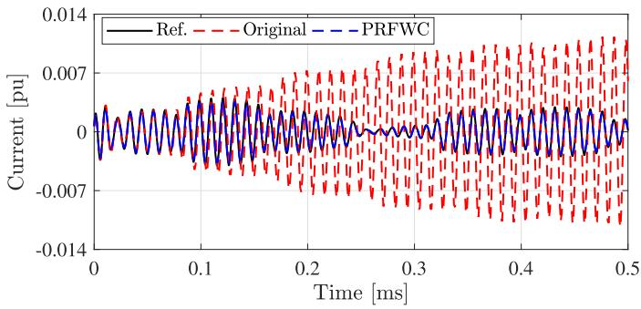

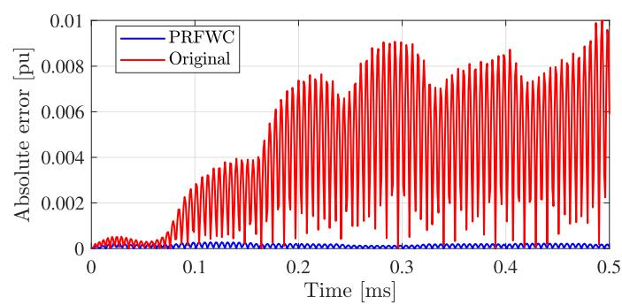  
Fig. 8. Time-domain responses of the reference, original and PRFWC waveforms (top), along with their absolute error (bottom) with $f _ { e } = 9 0 \mathrm { k H z } ,$ , Case A.

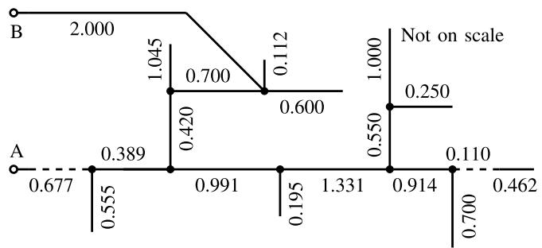  
Fig. 9. Single-line diagram of the three-phase distribution system, Case B. The numbers are the line length in km. Continuous and dashed lines are overhead lines and underground cables, respectively. Adapted from [30].

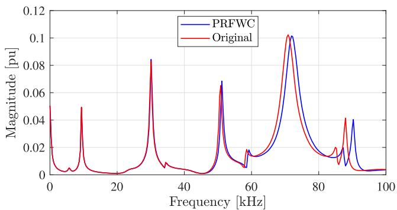  
Fig. 10. Magnitude of frequency responses, Case B.

magnitude frequency response in Fig. 10 match well around 10 kHz, the time-domain response in Fig. 12 shows a noticeable deviation from the reference between 0.1 ms and 0.3 ms. In contrast, Fig. 13 shows a significant distortion of the original waveform, particularly between 0.2 ms and 0.3 ms, while the PRFWC signal closely matches the reference. This discrepancy is caused by the frequency warping shifting the original resonance peak with the highest frequency in Fig. 10 to a value lower than the excitation frequency.

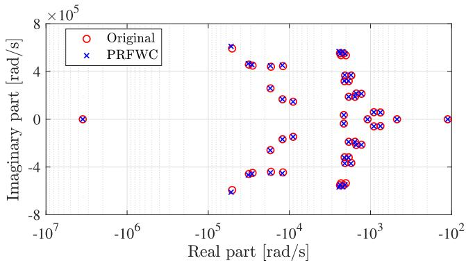  
Fig. 11. Pole placement of the rational approximation, Case B.

Table 4 RRMSE values for time-domain simulations across all scenarios in Case B.   

<table><tr><td>fe(kHz)</td><td>PRFWC(%)</td><td>Original(%)</td><td>Ratioa</td></tr><tr><td>10</td><td>5.03 × 10-2</td><td>6.04 × 10-1</td><td>8.33 × 10-2</td></tr><tr><td>30</td><td>3.50 × 10-2</td><td>4.83 × 10-1</td><td>7.26 × 10-2</td></tr><tr><td>50</td><td>8.56 × 10-2</td><td>2.18</td><td>3.93 × 10-2</td></tr><tr><td>70</td><td>2.30 × 10-1</td><td>5.24</td><td>4.40 × 10-2</td></tr><tr><td>90</td><td>2.74 × 10-1</td><td>4.53</td><td>6.04 × 10-2</td></tr></table>

a RRMSE of PRFWC over original.

Table 5 RRMSE values for time-domain simulations across all scenarios in Case B, using a reduced time-step for the original simulation.   

<table><tr><td>fe(kHz)</td><td>PRFWC(%)</td><td>Originala(%)</td><td>Ratiob</td></tr><tr><td>10</td><td>5.03 × 10-2</td><td>6.20 × 10-2</td><td>8.12 × 10-1</td></tr><tr><td>30</td><td>3.50 × 10-2</td><td>2.01 × 10-2</td><td>1.74</td></tr><tr><td>50</td><td>8.56 × 10-2</td><td>1.22 × 10-1</td><td>7.02 × 10-1</td></tr><tr><td>70</td><td>2.30 × 10-1</td><td>1.77 × 10-1</td><td>1.30</td></tr><tr><td>90</td><td>2.74 × 10-1</td><td>3.48 × 10-1</td><td>7.87 × 10-1</td></tr></table>

a With ℎ reduced from 1 µs to 250 ns.   
b RRMSE of PRFWC over original with ℎ = 250 ns.

Table 6 NMAE values for time-domain simulations across all scenarios in Case B.   

<table><tr><td>fe(kHz)</td><td>PRFWC(%)</td><td>Original(%)</td><td>Ratioa</td></tr><tr><td>10</td><td>9.14</td><td>14.68</td><td>6.23 × 10-1</td></tr><tr><td>30</td><td>3.07</td><td>11.80</td><td>2.60 × 10-1</td></tr><tr><td>50</td><td>4.69</td><td>62.41</td><td>7.51 × 10-2</td></tr><tr><td>70</td><td>5.50</td><td>128.54</td><td>4.28 × 10-2</td></tr><tr><td>90</td><td>14.10</td><td>124.96</td><td>1.13 × 10-1</td></tr></table>

a NMAE of PRFWC over original.

# 4.3. Discussion

The numerical results show that frequency warping can significantly affect EMT solutions, even when ℎ satisfies (5), particularly for the frequency responses with resonance peaks. The oscillation of the absolute error arises from the amplitude error, which is more pronounced at peak values and less severe near zero values.

PRFWC consistently reduced the frequency warping, enhancing accuracy by two orders of magnitude in all scenarios. The uncompensated waveform required a much smaller $h ,$ with a 1:4 ratio compared to the ℎ used for the PRFWC, to achieve comparable results to those obtained

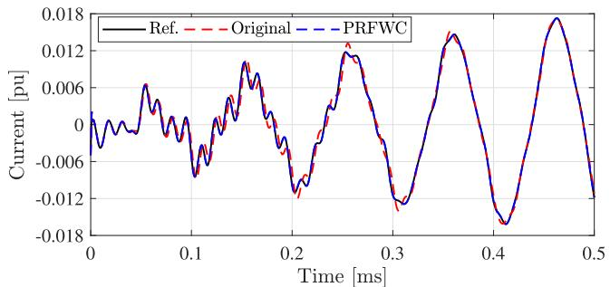

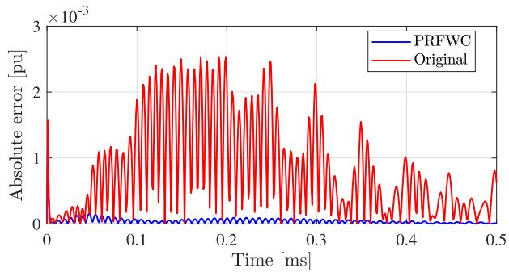  
Fig. 12. Time-domain responses of the reference, original, and PRFWC waveforms (top), along with their absolute error (bottom) with $f _ { e } = 1 0 \mathrm { k H z } ,$ , Case B.

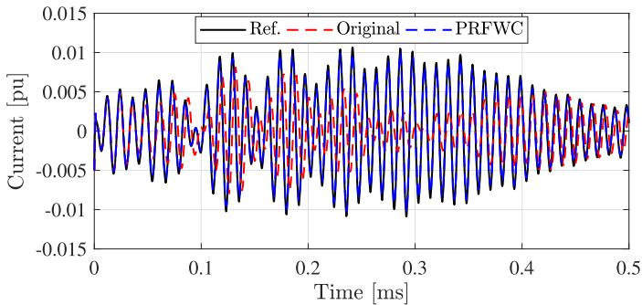

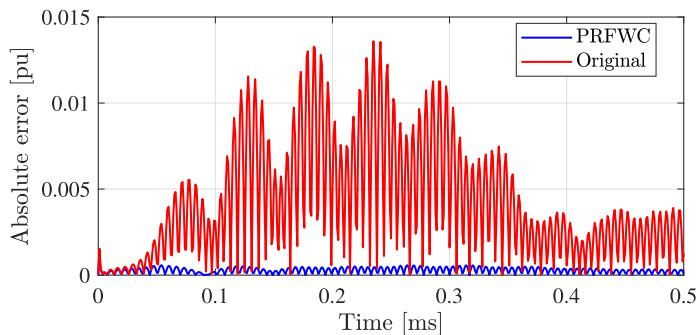  
Fig. 13. Time-domain responses of the reference, original, and PRFWC waveforms (top), along with their absolute error (bottom) with $f _ { e } = 9 0 \mathrm { k H z } ,$ , Case B.

with the proposed method. Consequently, the uncompensated simulation needed at least four times as many numerical model evaluations as those obtained with PRFWC. Notably, this improvement incurs negligible computational overhead, as the scaling factors are computed only once per pole and residue.

# 5. Conclusions

This paper examined the numerical error known as frequency warping in electromagnetic transient simulations of frequency-dependent equivalents. The Pole-Residue Frequency Warping Compensation (PRFWC) method effectively improves the accuracy of rational

approximations based on the pole-residue formulation. With its negligible computational overhead, the PRFWC provides a more efficient alternative to reducing the time-step size to improve simulation accuracy. Its simple implementation, high computational efficiency, and enhanced accuracy make it well-suited for integration in data-driven curve-fitting techniques as a post-processing routine.

# CRediT authorship contribution statement

A. A. Kida: Writing – original draft, Software, Visualization, Methodology, Formal analysis, Investigation, Data curation, Writing – review & editing, Validation, Resources, Conceptualization; A.C.S. Lima: Writing – review & editing, Funding acquisition, Software, Methodology, Formal analysis, Conceptualization, Visualization, Supervision, Writing – original draft, Validation, Resources, Project administration, Investigation, Data curation; F. A. Moreira: Project administration, Visualization, Supervision, Methodology, Resources, Funding acquisition, Writing – original draft, Software, Data curation, Conceptualization, Writing – review & editing, Validation, Investigation, Formal analysis; F. M. Vasconcellos: Investigation, Data curation, Writing – review & editing.

# Data availability

No data was used for the research described in the article.

# Declaration of competing interest

The authors declare the following financial interests/personal relationships which may be considered as potential competing interests:

Antonio Carlos Siqueira de Lima reports financial support was provided by Coordenação de Aperfeiçoamento de Pessoal de Nível Superior. Antonio Carlos Siqueira de Lima reports financial support was provided by Conselho Nacional de Desenvolvimento Científico e Tecnológico. Antonio Carlos Siqueira de Lima reports financial support was provided by Fundação de Amparo à Pesquisa do Estado de Minas Gerais. Antonio Carlos Siqueira de Lima reports financial support was provided by Instituto Nacional de Energia Elétrica. If there are other authors, they declare that they have no known competing financial interests or personal relationships that could have appeared to influence the work reported in this paper.

# Acknowledgment

This research was supported in part by Coordenação de Aperfeiçoamento de Pessoal de Nível Superior (CAPES) under 001, Conselho Nacional de Desenvolvimento Científico e Tecnológico (CNPq) under 404068/2020-0 and 400851/2021-0, Fundação de Amparo à Pesquisa do Estado de Minas Gerais (FAPEMIG) under APQ-03609-17, and Instituto Nacional de Energia Elétrica (INERGE).

# References

[1] F.M. Gonzalez-Longatt, Activation schemes of synthetic inertia controller on full converter wind turbine (type 4) (2015) 1–5. https://doi.org/10.1109/PESGM.2015. 7286430   
[2] Y. Ji, Y. Xing, Highly accurate and efficient time integration methods with unconditional stability and flexible numerical dissipation, Mathematics 11 (3) (2023). https://doi.org/10.3390/math11030593   
[3] B. Gustavsen, Rational approximation of frequency-dependent admittance matrices, IEEE Trans. Power Delivery 17 (4) (2002) 1093–1098.   
[4] T. Noda, Identification of a multiphase network equivalent for electromagnetic transient calculations using partitioned frequency response, IEEE Trans. Power Delivery 20 (2) (2005) 1134–1142.   
[5] S. Grivet-Talocia, B. Gustavsen, Passive Macromodeling: Theory and Applications, 239 of Wiley Series in Microwave and Optical Engineering, John Wiley & Sons, New York, US, New York, US, 2015.   
[6] T.M. Campello, F.N.F. Dicler, S.L. Varricchio, H.M. de Barros, C.O. Costa, A.C.S. Lima, G.N. Taranto, Reviewing the large electrical network equivalent methods under development for electromagnetic transient studies in the Brazilian interconnected power system, Int. J. Electr. Power Energy Syst. 151 (2023) 109033. https://doi.org/10.1016/j.ijepes.2023.109033

[7] B. Salarieh, H.M.J. De Silva, Review and comparison of frequency-domain curve-fitting techniques: vector fitting, frequency-partitioning fitting, matrix pencil method and Loewner matrix, Electr. Power Syst. Res. 196 (2021) 107254. https://doi.org/10.1016/j.epsr.2021.107254   
[8] H.K. Hoidalen, ATPDraw news, 2024, https://www.atpdraw.net/news.php.   
[9] B. Gustavsen, J. Nordstrom, Pole identification for the universal line model based on trace fitting, IEEE Trans. Power Delivery 23 (1) (2008) 472–479. https://doi.org/ 10.1109/TPWRD.2007.911186   
[10] J.L. Naredo, J. Mahseredjian, J.A. Gutierrez-Robles, O. Ramos-Leaños, C. Dufour, J. Belánger, Improving the numerical performance of transmission line models in EMTP, in: Proceedings of the International Conference on Power Systems Transients, 2011, pp. 1–8.   
[11] A. Ametani, Numerical Analysis of Power System Transients and Dynamics, Energy Engineering, Institution of Engineering and Technology, UK, UK, 2015.   
[12] G.G. Dahlquist, A special stability problem for linear multistep methods, BIT 3 (1) (1963) 27–43. https://doi.org/10.1007/BF01963532   
[13] W.Y. Yang, T.G. C. I.H. Song, Y.S. C.J. Heo, W.G. Jeon, J.W. L. J.K. Kim, Springer, Signals and Systems with MATLAB, Springer, Berlin, Heidelberg, Berlin, Heidelberg, 2009. https://doi.org/10.1007/978-3-540-92954-3   
[14] A. Brambilla, G. Storti-Gajani, Frequency warping in time-domain circuit simulation, IEEE Trans. Circuits Syst. I Fundam. Theory Appl. 50 (7) (2003) 904–913. https: //doi.org/10.1109/TCSI.2003.813984   
[15] L. Tan, Digital Signal Processing: Fundamentals and Applications, Academic Press, Decatur, Georgia, 1 edition, Decatur, Georgia, 2008.   
[16] L.L. Presti, Prewarping techniques in filter simulation by bilinear transformation, Signal Process. 5 (6) (1983) 523–529. https://doi.org/10.1016/0165-1684(83) 90083-X   
[17] W. Teng, X. Zhang, Y. Zhang, L. Yang, Iterative tuning notch filter for suppressing resonance in ultra-precision motion control, Adv. Mech. Eng. 8 (11) (2016) 1687814016674097.   
[18] F. Dicler, Contributions to the FPGA and CPU Implementation of Frequency-Dependent Network Equivalents for Real-Time and Offline Electromagnetic Transient Power System Simulators, Master’s thesis, PEE/COPPE/UFRJ, 2021.

[19] A.G. Gheorghe, F. Constantinescu, M. Nitescu, Error control in circuit transient analysis, in: 2009 16th IEEE International Conference on Electronics, Circuits and Systems - (ICECS 2009), 2009, pp. 207–210. https://doi.org/10.1109/ICECS.2009. 5410972   
[20] F. Constantinescu, A.G. Gheorghe, M. Ni¸tescu, The energy balance error for circuit transient analysis, Rev. Roum. Des Sci. Techn. Série Électrotechnique et Énergétique 54 (3) (2010) 243–250.   
[21] J.R. Marti, J. Lin, Suppression of numerical oscillations in the EMTP, IEEE Trans. Power Syst. 4 (2) (1989) 739–747. https://doi.org/10.1109/59.193849   
[22] A.A. Kida, A.C.S. Lima, F.A. Moreira, J.R. Martí, J. Tarazona, Inaccuracies due to the frequency warping in simulation of electrical systems using combined state-space nodal analysis, Electr. Power Syst. Res. 223 (2023) 109657. https://www.sciencedirect.com/science/article/pii/S0378779623005461. https:// doi.org/10.1016/j.epsr.2023.109657   
[23] K. Gao, A Study in the Frequency Warping of Time-Domain Methods, Master, University of Ottawa, Ottawa, 2015.   
[24] H.W. Dommel, Electromagnetic Transients Program Reference Manual (EMTP Theory Book), Branch of System Engineering - Bonneville Power Administration, 1995.   
[25] B. Gustavsen, A. Semlyen, Rational approximation of frequency domain responses by vector fitting, IEEE Trans. Power Delivery 14 (3) (1999) 1052–1061. https://doi. org/10.1109/61.772353   
[26] B. Gustavsen, Improving the pole relocation properties of vector fitting, IEEE Trans. Power Delivery 21 (3) (2006) 1587–1592.   
[27] D. Deschrijver, M. Mrozowski, T. Dhaene, D. De Zutter, Macromodeling of multiport systems using a fast implementation of the vector fitting method, IEEE Microwave Wireless Compon. Lett. 18 (6) (2008) 383–385.   
[28] B. Gustavsen, The vector fitting website, 2008, https://www.sintef.no/projectweb/vectorfitting/.   
[29] B. Gustavsen, Fast passivity enforcement for pole-residue models by perturbation of residue matrix eigenvalues, IEEE Trans. Power Delivery 23 (4) (2008) 2278–2285. https://doi.org/10.1109/TPWRD.2008.919027   
[30] D. Deschrijver, B. Gustavsen, T. Dhaene, Advancements in iterative methods for rational approximation in the frequency domain, IEEE Trans. Power Delivery 22 (3) (2007) 1633–1642. https://doi.org/10.1109/TPWRD.2007.899584