# A State Variables Elimination-Based EMTP-Type Constant Admittance Equivalent Modeling Method for Power Electronic Converters

Mingwang Xu , Member, IEEE, Wei Gu , Senior Member, IEEE, Yang Cao , Graduate Student Member, IEEE, Shuaixian Chen, Student Member, IEEE, Fei Zhang , and Wei Liu , Senior Member, IEEE

Abstract—Currently, a multitude of power electronic devices are connected to the grid, and the safe and stable operation of the grid depends on the analysis of electromagnetic transient (EMT) simulation technology. This paper proposes a state variables elimination-based EMTP-type constant admittance equivalent modeling method for power electronic converters. The method employs a three-layer architecture consisting of ‘network-nodal voltages-historical current source’. The low-order equivalent nodal voltage equation is generated by using matrix splitting and adding output equations. The proposed method is distinguished by a constant admittance matrix and the consideration of internal characteristics, which facilitates straightforward access to external circuit, low time-complexity, and uncomplicated modeling procedures in comparison with the classical node elimination method (NEM). Furthermore, it exhibits a degree of generality regarding modular and unitized electrical equipment. The accuracy of the proposed method is validated by comparison with the off-line EMT simulation and experiments. The test results demonstrate that the proposed method exhibits high accuracy and efficiency in a variety of scenarios.

Index Terms—EMT equivalent modeling and simulation, state variables elimination, power electronic converters, simulation accuracy and efficiency.

# I. INTRODUCTION

# A. Motivation

HE expansion of new type power systems has resulted in T a heightened integration of power electronic equipment within power systems. The precise delineation of the dynamic behavior of power electronic devices is inextricably linked to the electromagnetic transient (EMT) simulation technology, given their rapid dynamic characteristics [1], [2]. The EMT simulation

Received 4 June 2024; revised 9 October 2024; accepted 1 February 2025. Date of publication 6 February 2025; date of current version 20 March 2025. This work was supported by the Jiangsu Industry Outlook and Key Technology Research under Project BE2023093-3. Paper no. TPWRD-00944-2024. (Corresponding author: Wei Gu.)

Mingwang Xu, Wei Gu, Yang Cao, Shuaixian Chen, and Fei Zhang are with the School of Electrical Engineering, Southeast University, Nanjing 210096, China (e-mail: 230228745@seu.edu.cn; wgu@seu.edu.cn; 230228738@seu.edu.cn; 220232912@seu.edu.cn; zhangfei@seu.edu.cn).

Wei Liu is with the School of Automation, Nanjing University of Science and Technology, Nanjing 210094, China (e-mail: wliu@njust.edu.cn).

Color versions of one or more figures in this article are available at https://doi.org/10.1109/TPWRD.2025.3539334.

Digital Object Identifier 10.1109/TPWRD.2025.3539334

represents the primary means for evaluating stable and secure operation concerns in power systems [3].

The use of detailed models for the simulation of complex systems is often hindered by efficiency issues [4]. For instance, the off-line simulation software PSCAD/EMTDC is unable to simulate a 100-megawatt photovoltaic power plant (PVPP) for 1 second with a 10 μs simulation time-step without exceeding the 3-hour mark, thereby reducing research efficiency. Therefore, it is crucial to investigate efficient and accurate EMT equivalent modeling and simulation methods.

# B. Literature Review

In the field of converter modeling, a general modeling method based on response matching is proposed in [5], which performs well in real-time simulation. Besides, a compensation current source is proposed to be used in [6]. These models all concentrate on the modeling of power electronic switches. The [7], [8] and [9] proposed equivalent low-dimensional models of modular multilevel converter (MMC) and power electronic transformer (PET) have been demonstrated to achieve a noteworthy reduction in node size when solving intricate power electronic topologies, and to have a considerable acceleration effect. Nevertheless, none of these models exhibits a constant admittance matrix.

In the field of cluster modeling, the approach considers accuracy and simplification, providing a practical reference for the construction of a simplified equivalent model of PVPP. The basic idea is to group PV generators with similar dynamic characteristics into the same cluster [10], [11], [12]. However, this kind of method is not sufficiently refined and does not fully consider the internal dynamic characteristics of converter.

The traditional average model (AVM) is a method of constructing the state equation of a voltage source converter (VSC) by averaging the switching period [13], [14]. This approach ignores the switching action, which can greatly improve the simulation efficiency. However, its accuracy is not high and it can only describe the average external characteristics. In order to enhance the AVM, a novel approach has been proposed in [15] which involves the utilization of frequency-dependent averaged models for DC-DC converters. These models can improve the accuracy of the steady-state. In addition, a piecewise averagevalue model of PWM two-level VSC is proposed in [16]. A VSC

model based on pulse voltage-current source pair is proposed in [17], and the corresponding solution algorithm is designed. However, the diverse topologies of converter are not considered. In general, the above models are unable to reflect device-level issues and meet the requirements of simulation accuracy in various scenarios.

In [18], a parametric AVM is proposed which can provide high accuracy, numerical stability, and a relatively large time-step without decoupling. However, the admittance matrix of the model is time-varying. The event-driven simulation framework is proposed in [19], which is a novel simulation mechanism and has advantages in terms of simulation efficiency and hardware resource occupation. Furthermore, the [20], [21], [22] propose large time-step simulation methods based on shifted frequency. Nevertheless, all those large time-step methods cannot exhibit a constant admittance. The advent of high-performance parallel computing technology has led to the proposal of some parallel algorithms for EMT simulation of large-scale AC/DC grids [23], [24], [25], which can dramatically improve efficiency. In [26], semi-analytical solution methods for the coarse operator of parareal algorithm are proposed in power system simulation. The parallelization of these algorithms can significantly enhance EMT simulation efficiency.

In contrast to the aforementioned methods, the [27] proposed a nested fast and simultaneous solution (NFSS) algorithm, also known as the node elimination method (NEM), which achieves order reduction by eliminating internal nodes. This results in a significant improvement in simulation speed while retaining internal node information. The authors of [28] and [29] propose equivalent models for MMC and PET systems using this method. They then present a low-order equivalent circuit that achieves high simulation accuracy and efficiency. Similarly, the [30] employs this method to create equivalent models for large-scale offshore wind farms, and the simulation results demonstrate the effectiveness of this approach. However, all the above research studies exhibit a high degree of serialization, despite demonstrating high levels of simulation accuracy and efficiency.

The three principal solving algorithms are the nodal analysis method (NAM), the state-space method (SSM), and the statespace nodal (SSN) method. Each method has its own distinctive advantages. The NAM equations are relatively simple, the SSM is highly versatile, and the SSN is highly effective in reducing the size of the node admittance matrix, thereby making it more efficient to solve power electronic systems. The main system is decomposed into different subsystems at the nodes, which are described using state space equations. These equations are then converted into the node analysis method, which is used to solve the global solution of the total system [31]. In contrast to the above three methods, this paper establishes a relationship between node voltages and state variables. It incorporates the advantages of each of the three methods and is suitable for EMT simulation with power electronic converters.

# C. Contribution and Organization

This paper proposes an EMTP-type constant admittance equivalent modeling approach based on the elimination of state

variables. The method employs a three-layer architecture consisting of ‘network-nodal voltages-historical current source’. This architecture offers the advantages of easy equivalent circuits generation and updating of historical current sources. The proposed method comprises three aspects: generating the state-space equation, generating the port equivalent equation, and solving for the inverse of the state variables. This paper makes the following contributions:

- A novel EMTP-type constant admittance equivalent modeling method based on state variables elimination is proposed. This method offers a straightforward approach to modeling and the generation of low-order circuits.   
- The computational operations and time-complexity of the proposed method are all lower than that of the NEM, which is more efficient.   
- In contrast to the NEM, the proposed model does not necessitate the reverse solving of the internal branches in order to update the historical current sources. Instead, it is possible to update the historical current source directly by reversing the state variables.   
The generation of state-space equations for a single module or unit of modular or unitized electrical equipment is relatively straightforward. Consequently, this method has a certain degree of generality.

This paper is organized as follows. The proposed method is illustrated in Section II. In Section III, the advantages of the proposed method are analyzed. In Section IV, the proposed method is applied to PVPP and PET, and the EMT equivalent models of them are derived. The simulation accuracy and efficiency of the proposed model in various scenarios are fully verified in Section V. In the end of this paper, the conclusions are drawn in Section VI.

# II. THE PROPOSED METHOD

# A. Description of the Proposed Method

The NAM employs highly serial solving process with a threelayer architecture comprising the ‘network-branch-historical current source’, yet it also has a highly serial solving process. Similarly, the SSM utilizes a three-layer architecture comprising the ‘network-state variables-historical current source’, yet generating a low-order equivalent circuit is challenging. The proposed method combines the advantages of both approaches, thereby overcoming their respective disadvantages. This results in an equivalent circuit that is straightforward to generate and historical current source that is simple to update, as illustrated in Fig. 1.

The proposed method commences with the utilization of the state-space equation of the rewritten system. The voltage of the external port node is employed as the input matrix, while the injection current of the external port node serves as the output matrix. The external equivalent node voltage equation is derived by establishing the relationship between the voltage of the external port node and the injection current of the network. This equation is subsequently employed to form a low-order equivalent circuit that accurately identifies the characteristics of the original circuit. The historical current source can be updated

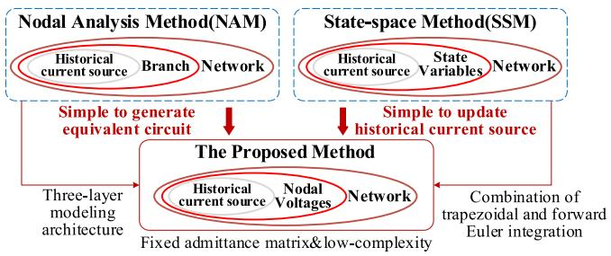  
Fig. 1. The difference between NAM, SSM and the proposed method.

directly through the port node voltage inverse solution system state variable process.

By combination of the trapezoidal and forward Euler integration method and the three-layer modeling architecture, this method has the advantages of simplicity and universality, with fewer serial procedures.

# B. Modeling Procedures of the Proposed Method

This section outlines the modeling procedures of the proposed method from three perspectives: generating the state equation, generating the port equivalent equation and solving for the inverse of the state variables.

1) Generating the State Equation: In a linear system that includes an inductor and capacitor, the state equation can be expressed in the following form.

$$
\left[ \begin{array}{c c} \boldsymbol {C} & \\ \dots & \dots \\ & \boldsymbol {L} \end{array} \right] \left[ \begin{array}{c} \dot {\boldsymbol {u}} _ {\mathrm {C}} (t) \\ \hline \dot {\boldsymbol {i}} _ {\mathrm {L}} (t) \end{array} \right] = \left[ \begin{array}{c c} \boldsymbol {A} _ {1 1} & \boldsymbol {A} _ {1 2} \\ \hline \boldsymbol {A} _ {2 1} & \boldsymbol {A} _ {2 2} \end{array} \right] \left[ \begin{array}{c} \boldsymbol {u} _ {\mathrm {C}} (t) \\ \hline \dot {\boldsymbol {i}} _ {\mathrm {L}} (t) \end{array} \right] + \boldsymbol {U} \tag {1}
$$

The state variables for (1) are typically the capacitor voltage $u _ { \mathrm { C } }$ and the inductor current iL (or the quantity of electric charge Q and flux linkage Ψ). In (1), the matrices C and L contain capacitance and inductance, respectively, while $\mathbf { \pmb { u } } _ { \mathrm { { C } } }$ represents the matrix of capacitor voltage and $i _ { \mathrm { { L } } }$ the matrix of inductor current. A is the state matrix of one system and U the input matrix of the state equation.

In the event that capacitor elements are present at the DC port of the network, the equation in (1) is rewritten and the injection current matrix $i _ { \mathrm { d } }$ of the DC port is added. The rewritten state equation is shown in (2).

$$
\begin{array}{l} \left[ \begin{array}{c c c} \boldsymbol {C} & & \\ \hline & \boldsymbol {L} & \\ \hline & & \boldsymbol {0} \end{array} \right] \left[ \begin{array}{c} \dot {\boldsymbol {u}} _ {\mathrm {C}} (t) \\ \hline \dot {\boldsymbol {i}} _ {\mathrm {L}} (t) \\ \hline \dot {\boldsymbol {i}} _ {\mathrm {d}} (t) \end{array} \right] = \left[ \begin{array}{c c c} \boldsymbol {A} _ {1 1} & \boldsymbol {A} _ {1 2} & \boldsymbol {I} \\ \hline \boldsymbol {A} _ {2 1} & \boldsymbol {A} _ {2 2} & \boldsymbol {0} \\ \hline \boldsymbol {I} & \boldsymbol {0} & \boldsymbol {0} \end{array} \right] \left[ \begin{array}{c} \boldsymbol {u} _ {\mathrm {C}} (t) \\ \hline \boldsymbol {i} _ {\mathrm {L}} (t) \\ \hline \boldsymbol {i} _ {\mathrm {d}} (t) \end{array} \right] \\ + \left[ \begin{array}{l} \boldsymbol {B} _ {1} \\ \dots \dots \dots \dots \dots \dots \dots \dots \dots \dots \dots \dots \dots \dots \dots \dots \dots \dots \dots \dots \dots \dots \dots \dots \dots \dots \dots \dots \dots \end{array} \right] \boldsymbol {u} _ {\mathrm {n}} (t) \tag {2} \\ \end{array}
$$

The (2) can be expressed in an equivalent form as (3) by means of matrix splitting.

$$
\left\{ \begin{array}{l} M \dot {\boldsymbol {x}} (t) = \left(\boldsymbol {A} _ {\alpha} + \boldsymbol {A} _ {\beta}\right) \boldsymbol {x} (t) + \boldsymbol {B} \boldsymbol {u} _ {\mathrm {n}} (t) \\ \boldsymbol {A} _ {\alpha} = \left[ \begin{array}{c c c} \boldsymbol {A} _ {1 1} & \boldsymbol {0} & \boldsymbol {I} \\ \boldsymbol {0} & \boldsymbol {A} _ {2 2} & \boldsymbol {0} \\ \boldsymbol {I} & \boldsymbol {0} & \boldsymbol {0} \end{array} \right], \boldsymbol {A} _ {\beta} = \left[ \begin{array}{c c c} \boldsymbol {0} & \boldsymbol {A} _ {1 2} & \boldsymbol {0} \\ \boldsymbol {A} _ {2 1} & \boldsymbol {0} & \boldsymbol {0} \\ \boldsymbol {0} & \boldsymbol {0} & \boldsymbol {0} \end{array} \right] \end{array} \right. \tag {3}
$$

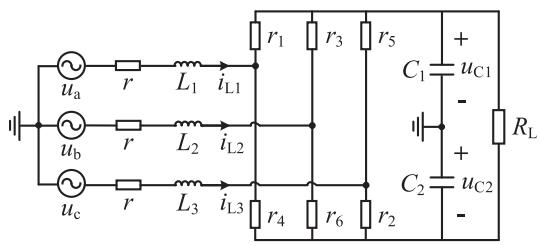  
Fig. 2. Topology of two-level voltage source converter.

where B is the input matrix, x denotes the modified state matrix, I is a coefficient matrix composing either 0 or 1 elements, $\mathbf { \delta u } _ { \mathrm { n } }$ is the nodal voltage matrix of the external ports, $A _ { \alpha }$ is a constant matrix, whereas the time-varying matrix $A _ { \beta }$ indicates the on/offstate of power electronic switches.

The equation in (4) represents the relationship between the injection current of the port and the state matrix.

$$
\boldsymbol {i} _ {\mathrm {s}} (t + \Delta t) = \boldsymbol {P} \boldsymbol {x} (t + \Delta t) \tag {4}
$$

where $i _ { \mathrm { s } }$ is the matrix of external port injection current, and P is a coefficient matrix composing either 0 or 1 elements.

Finally, the state equation is rewritten in the form of (1) to (3).

Taking the two-level voltage source converter illustrated in Fig. 2 as an example, which uses the binary resistors model of power electronic switches. $r _ { k } ( k = 1 , 2 . . . , 6 )$ represent the on/off-state resistors of switches.

The matrix elements in the state equation of the converter in Fig. 2 can be expressed as

$$
\left\{ \begin{array}{l} \boldsymbol {M} = \operatorname {d i a g} \left(L _ {1}, L _ {2}, L _ {3}, C _ {1}, C _ {2}\right) \\ \boldsymbol {x} = \left[ i _ {\mathrm {L} 1}, i _ {\mathrm {L} 2}, i _ {\mathrm {L} 3}, u _ {\mathrm {C} 1}, u _ {\mathrm {C} 2} \right] ^ {T} \\ \boldsymbol {A} _ {1 1} = \operatorname {d i a g} (- r, - r, - r), \boldsymbol {A} _ {2 2} = - \frac {1}{R _ {\mathrm {L}}} \operatorname {d i a g} (1, 1) \\ \boldsymbol {A} _ {2 1} = \left[ \begin{array}{c c c} \frac {r _ {4}}{r _ {\text {s u m}}} & \frac {r _ {6}}{r _ {\text {s u m}}} & \frac {r _ {2}}{r _ {\text {s u m}}} \\ \frac {- r _ {1}}{r _ {\text {s u m}}} & \frac {- r _ {3}}{r _ {\text {s u m}}} & \frac {- r _ {5}}{r _ {\text {s u m}}} \end{array} \right], \boldsymbol {A} _ {1 2} = - \boldsymbol {A} _ {2 1} ^ {T} \end{array} \right. \tag {5}
$$

where $r _ { \mathrm { s u m } }$ represents the sum of upper and lower bridge resistors, which is typically a fixed value.

2) Generating the Port Equivalent Equation: The (3) is discretized using a combination of the trapezoidal and forward Euler integration method, resulting in the following:

$$
\begin{array}{l} \int_ {\mathfrak {t}} ^ {t + \Delta t} \boldsymbol {M} \dot {\boldsymbol {x}} (t) d t = \int_ {\mathfrak {t}} ^ {t + \Delta t} (\boldsymbol {A} _ {\alpha} + \boldsymbol {A} _ {\beta}) \boldsymbol {x} (t) + \boldsymbol {B} \boldsymbol {u} _ {\mathfrak {n}} (t) \mathrm {d} t \\ \approx \frac {\Delta t}{2} \boldsymbol {A} _ {\alpha} (\boldsymbol {x} (t + \Delta t) + \boldsymbol {x} (t)) + \Delta t \boldsymbol {A} _ {\beta} \boldsymbol {x} (t) \\ + \frac {\Delta t}{2} \boldsymbol {B} \left(\boldsymbol {u} _ {\mathrm {n}} (t + \Delta t) + \boldsymbol {u} _ {\mathrm {n}} (t)\right) \tag {6} \\ \end{array}
$$

By combining the (4) and (6), while maintaining the electrical variables of the port, and eliminating the matrix ${ \pm } ( t { + } \Delta t )$ , we can derive the (7).

$$
\boldsymbol {i} _ {\mathrm {s}} (t + \Delta t) = \boldsymbol {Y} _ {\mathrm {n}} \boldsymbol {u} _ {\mathrm {n}} (t + \Delta t) + \boldsymbol {i} _ {\mathrm {h}} (t) \tag {7}
$$

TABLE IDIFFERENT PARAMETERS OF THE SYSTEM  

<table><tr><td>Parameters</td><td>L/mH</td><td>C/μF</td><td>RL/Ω</td><td>Δt/μs</td><td>max(abs(eig(φ)))</td></tr><tr><td rowspan="3">Values</td><td>1~10</td><td>1000</td><td>10</td><td>0~560</td><td>&lt;1</td></tr><tr><td>1</td><td>100~8000</td><td>10</td><td>0~112</td><td>&lt;1</td></tr><tr><td>1</td><td>1000</td><td>5~100</td><td>0~505</td><td>&lt;1</td></tr></table>

where

$$
\left\{ \begin{array}{l} Y _ {\mathrm {n}} = \frac {\Delta t}{2} P Q B, i _ {\mathrm {h}} (t) = P Q R x (t) + \frac {\Delta t}{2} P Q B u _ {\mathrm {n}} (t) \\ Q = \left(M - \frac {\Delta t}{2} A _ {\alpha}\right) ^ {- 1}, R = \left(M + \frac {\Delta t}{2} A _ {\alpha} + \Delta t A _ {\beta}\right) \end{array} \right. \tag {8}
$$

According to the (7) and (8), the low-order equivalent circuit can be derived indirectly. In particular, the admittance between each pair of nodes can be calculated from $\mathbf { Y } _ { \mathrm { n } } ,$ while the injection current of each node can be derived from $\dot { \iota _ { \mathrm { h } } }$ .

We can obtain the state matrix $\varphi$ in (9) of the discrete system using the proposed method for discretization.

$$
\varphi = Q R \tag {9}
$$

A sufficient and necessary condition for the stability of a discrete system is that the eigenvalues of the state matrix $\varphi$ have a modulus less than one, that is to say, the spectral radius $\rho$ is less than one, as expressed in (10).

$$
\rho (\varphi) <   1 \tag {10}
$$

In order to determine the impact of circuit parameters on the numerical stability of the discrete system, we have analyzed the spectral radius for different parameters, as shown in Table I.

As evidenced in Table I, the capacitor constraint on the time-step is more pronounced than the inductor and load. The simulation time-step of no more than $1 1 2 ~ \mu \mathrm { s }$ is sufficient to ensure stability within the specified parameter range.

3) Inverse Solution of the State Variables: The matrix of node voltage $\mathbf { \delta u } _ { \mathrm { n } }$ in (7) can be solved by combining it with any type of external circuits in a simulation platform such as the PSCAD/EMTDC.

Furthermore, the state variable matrix ${ \pmb x } ( t { + } \Delta t )$ can be solved using the (11) after solving the external node voltages.

$$
\boldsymbol {x} (t + \Delta t) = K \boldsymbol {u} _ {\mathrm {n}} (t + \Delta t) + \varphi (t) \tag {11}
$$

where

$$
\left\{ \begin{array}{l} \varphi (t) = Q R x (t) + \frac {\Delta t}{2} Q B u _ {\mathrm {n}} (t) \\ K = \frac {\Delta t}{2} Q B \end{array} \right. \tag {12}
$$

In accordance with the (12), the historical current source is comprised of x(t) and ${ \mathbf { } } u _ { \mathrm { n } } ( t )$ . Consequently, the solved ${ \boldsymbol { x } } ( t { + } \Delta t )$ and ${ \pmb u } _ { \mathrm { n } } ( t + \Delta t )$ in (7) and (11) can be directly incorporated into the historical current source of the subsequent simulation time-step. It should be noted that the matrix x may include the matrix $i _ { \mathrm { d } } .$ , and that the inverse solution to the state variables need only focus on matrices $\mathbf { \pmb { u } } _ { \mathrm { { C } } }$ and $\dot { \pmb { \imath } } _ { \mathrm { L } }$ .

In general, the modeling process of the proposed method does not require inverting the variable admittance matrix. Instead, the changing part is only reflected in the matrixR. To ensure

simulation efficiency, it is possible to store the variable matrix R prior to the commencement of the simulation.

4) Constant Admittance Matrix: From (7) and (8), we can get that $Y _ { \textrm { n } }$ is a fixed matrix, given that the matrices P, Q and B are constant once the topology of the converter is known.

Furthermore, the (11) has a similar form to the nodal voltage equation, and the matrix K is also constant. Consequently, the inverse solution of the state variable matrix ${ \boldsymbol { x } } ( t { + } \Delta t )$ also guarantees a constant admittance matrix.

# C. Numerical Oscillation Analysis

The phenomenon of numerical oscillations is rooted in the abruptness of the non-state variables. The implicit integration method is based on the premise that the non-state variables at the moment t-Δt appear in the difference equation, and thus a sudden change in the non-state variables can result in an irrational source of equivalent injected currents.

When the numerical oscillations are detected, the original integration algorithm needs to be switched to the backward Euler method which can effectively suppress oscillations.

The (3) is discretized using the back Euler integration method, resulting in the following:

$$
\begin{array}{l} \int_ {t} ^ {t + \Delta t} M \dot {\boldsymbol {x}} (t) d t = \int_ {t} ^ {t + \Delta t} A \boldsymbol {x} (t) + B \boldsymbol {u} _ {n} (t) d t \\ \approx \Delta t A \boldsymbol {x} (t + \Delta t) + \Delta t B \boldsymbol {u} _ {\mathrm {n}} (t + \Delta t) \tag {13} \\ \end{array}
$$

By combining the (4) and (13), while maintaining the electrical variables of the port, and eliminating the matrix ${ \pmb x } ( t { + } \Delta t )$ , we can derive the nodal voltage equation as in (7).

# D. Blocking Mode Analysis

The blocking mode of converter represents the control system ceases to apply trigger pulses to the converter, all gating signals are set to zero, and only the diode connected in parallel with the switches conducts. The switching state of the diodes can be determined from the previous state and the current through the diode or the voltage difference between the two sides of the diode, which is expressed as follows

$$
\begin{array}{l} S _ {\text {d i o d e}} (t) = \\ \left\{ \begin{array}{l} S _ {\mathrm {d i o d e}} (t - \Delta t) = 1 \& I _ {\mathrm {d i o d e}} > 0, r _ {\text {o f f}} / r _ {\text {s u m}} \\ S _ {\mathrm {d i o d e}} (t - \Delta t) = 0 \& U _ {\mathrm {d i o d e}} > 0, r _ {\text {o f f}} / r _ {\text {s u m}} \end{array} , r _ {\text {o f f}} = 1 e ^ {6} \Omega \right. \tag {14} \\ \end{array}
$$

Once the converter is blocking, the switch state in (5) such as $r _ { 1 } / r _ { \mathrm { s u m } }$ will be updated using $S _ { \mathrm { d i o d e } }$ in (14), allowing for the calculation of the historical current sources. The blocking and normal operation can switch seamlessly without the introduction of additional diodes or alterations to the equivalent circuits shown in Figs. 6 and 9.

# E. Differences and Improvements With Existing Methods

In this section, the differences and improvements between the proposed method and three existing constant admittance

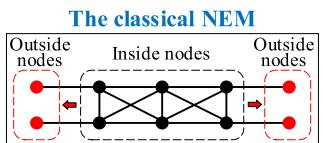  
Step 1: node elimination

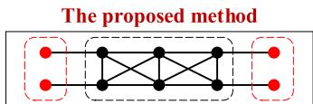  
Step 1: generating state equation

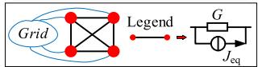  
Step 2: EMT solving

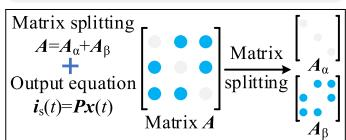  
constant elementOtime-varying element

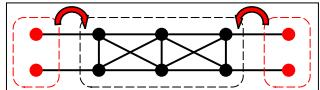  
Step 2: generating equivalent equation

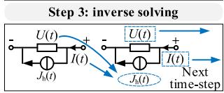  
Step 4: updating historical current

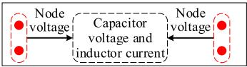  
Step 3: inverse solving   
Fig. 3. Modeling procedures of the NEM and the proposed method.

modeling methods are analyzed and discussed. The following details are provided:

1) L/C switch model: In contrast to the L/C model, the proposed method employs binary resistors for modeling, thereby obviating the introduction of virtual power losses that could render it unfeasible at high switching frequencies.   
2) The proposed model in [5]: Although the model proposed in [5] effectively addresses the virtual power loss issue, the system admittance matrix dimensions remain considerable as the converter scale increases, so there is still acceleration room.   
3) Switch function model based on time-delay in [17]: The model presented in [17] employs switching functions and time-delay to achieve constant admittance modeling. However, the switching function model cannot reflect switch conduction losses. Besides, the use of time-delay leads to interface errors and numerical stability issues.

# III. ADVANTAGES OF THE PROPOSED METHOD

This section presents a comparative analysis of the advantages of the proposed method in comparison to the classical NEM. The proposed method is demonstrated to have a simpler modeling procedure, fewer computational operations and lower time-complexity.

# A. Modeling Procedures of the NEM and Proposed Method

The modeling procedures of the proposed method and the NEM are illustrated in Fig. 3.

The classical NEM typically involves 4 main processes: 1) writing the nodal voltage equation of the system required for equivalence; 2) eliminating the internal electrical nodes and forming the external nodal voltage equation; 3) solving for the internal node voltages in reverse; 4) solving the voltage and current in the branch where the capacitors and inductors are located. After which, the historical current sources are updated.

Furthermore, the NEM necessitates the inversion of the changing admittance matrix, which can result in a significant computational burden.

The proposed method comprises only 3 main processes and does not require the inversion of the changing admittance matrix: 1) generating the state equation of the original system; 2) generating an equivalent equation by matrix splitting and adding the output equation; 3) inverse solving of state variables.

The Fig. 3 illustrates that the proposed method has a more straightforward modeling process than the NEM.

# B. Complexity Analysis of the Proposed Method

The time-complexity of an algorithm is typically quantified by its execution time. This is determined by the number of times the algorithm is executed, denoted as T(x). The function f(x) is obtained by retaining only the highest term of $T ( x )$ and ignoring the coefficients of the other terms. The time-complexity of the algorithm is then expressed using the O representation method as $O ( f ( x ) )$ . The procedure for evaluating the complexity of algorithms consists of 3 steps: (1) determining the frequency of the most commonly executed instructions to estimate the complexity; (2) considering only the highest power of the algorithm and ignoring coefficients of lower and higher powers; (3) expressing the number of algorithm executions in the form of the O notation.

In the NEM modeling procedures, the nodal voltage equation can be expressed as (15) for a system with m+n nodes.

$$
\left[ \begin{array}{l l} \mathbf {Y} _ {1 1} & \mathbf {Y} _ {1 2} \\ \mathbf {Y} _ {2 1} & \mathbf {Y} _ {2 2} \end{array} \right] \left[ \begin{array}{l} \mathbf {U} _ {\mathrm {o}} \\ \mathbf {U} _ {\mathrm {i}} \end{array} \right] = \left[ \begin{array}{l} \mathbf {J} _ {\mathrm {o}} \\ \mathbf {J} _ {\mathrm {i}} \end{array} \right] + \left[ \begin{array}{l} \mathbf {I} _ {\mathrm {o}} \\ \mathbf {0} \end{array} \right] \tag {15}
$$

where $U _ { \mathrm { o } }$ and $\scriptstyle { I _ { \mathrm { o } } }$ are the matrix of external node voltages and injection current of external ports.

In accordance with the NEM solution procedures, it is necessary to solve the variables $Y _ { \mathrm { ~ o ~ } }$ and $J _ { \mathrm { s } }$ , which represent the matrix of equivalent admittance and equivalent injection historical current sources of the external electrical nodes, respectively. Furthermore, the internal node voltages, represented by $U _ { \mathrm { i } }$ , must be solved in reverse, as shown in (16).

$$
\left\{ \begin{array}{l} \boldsymbol {Y} _ {\mathrm {o}} = \boldsymbol {Y} _ {1 1} - \boldsymbol {Y} _ {1 2} \boldsymbol {Y} _ {2 2} ^ {- 1} \boldsymbol {Y} _ {2 1} \\ \boldsymbol {J} _ {\mathrm {s}} = \boldsymbol {J} _ {\mathrm {o}} - \boldsymbol {Y} _ {1 2} \boldsymbol {Y} _ {2 2} ^ {- 1} \boldsymbol {J} _ {\mathrm {i}} \\ \boldsymbol {U} _ {\mathrm {i}} = \boldsymbol {Y} _ {2 2} ^ {- 1} \left(\boldsymbol {J} _ {\mathrm {i}} - \boldsymbol {Y} _ {2 1} \boldsymbol {U} _ {\mathrm {o}}\right) \end{array} \right. \tag {16}
$$

The time-complexity and computational operations of the NEM can be calculated using the (17), as stated in (15) and (16).

$$
T _ {\text {s u m}} ^ {\mathrm {N E M}} = \frac {2}{3} n ^ {3} + (2 m + 3) n ^ {2} + 4 n m ^ {2} + n m - \frac {2}{3} n \sim O \left(n ^ {3}\right) \tag {17}
$$

where m and n represent the number of external/internal electrical nodes, respectively. For illustrative purposes, $u _ { 1 } , u _ { 2 } , u _ { 3 }$ and $u _ { 4 }$ are treated as external node voltages in Fig. 8(a).

The total number of computational operations and the timecomplexity of the NEM can be quantified in (18) for the circuit in Fig. 8(a), with m = 4 and n = 6, as there are 4 external nodes and 6 internal nodes.

$$
T _ {\text {s u m}} ^ {\mathrm {N E M}} = 4 8 8 \sim O \left(4 ^ {3}\right) \tag {18}
$$

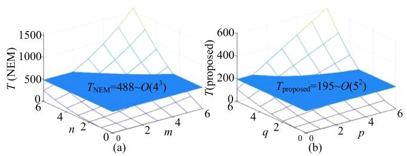  
Fig. 4. Complexity analysis diagram: (a) The NEM; (b) the proposed method.

TABLE II COMPARISONS BETWEEN THE NEM AND PROPOSED METHOD   

<table><tr><td>Comparative item</td><td>NEM</td><td>Proposed method</td></tr><tr><td>Accuracy</td><td>high</td><td>high</td></tr><tr><td>Time-complexity</td><td>high</td><td>low</td></tr><tr><td>Computational burden</td><td>heavy</td><td>light</td></tr><tr><td>Modeling procedure</td><td>complicated</td><td>not too complicated</td></tr><tr><td>Generality</td><td>strong</td><td>strong</td></tr><tr><td>Admittance matrix</td><td>varying</td><td>constant</td></tr></table>

In consideration of the time-complexity and the number of computational operations inherent to the proposed method, we can derive the (19).

$$
T _ {\text {s u m}} ^ {\text {p r o p o s e d}} = (2 p + 3) q ^ {2} + 2 p q \sim O \left(q ^ {2}\right) \tag {19}
$$

where q is the sum of number of elements of modified state matrix $x , p$ is the number of capacitors in the DC ports.

The total number of computational operations and the timecomplexity of the proposed method can be quantified in (20) for the circuit in Fig. 8(a), with $p = 1 , q = 6 ,$ , as there is 1-capacitor element at the DC port of the network and 5-state variables.

$$
T _ {\text {s u m}} ^ {\text {p r o p o s e d}} = 1 9 5 \sim O \left(5 ^ {2}\right) \tag {20}
$$

As previously stated, the comparison of time-complexity and the number of computational operations is displayed intuitively in Fig. 4. Furthermore, the time-complexity is reduced from cubic to square level, as no inverse of the varying admittance matrix is required.

As illustrated in Fig. 4, the computational operations and timecomplexity of the proposed method are all lower than that of the NEM. This demonstrates that the proposed method is more efficient than the NEM in terms of solving.

The proposed method is compared with the NEM in Table II. It has high precision, strong generality and constant admittance. In terms of time-complexity, computational burden, modeling procedures and so on, it offers more advantages than the NEM.

# IV. APPLICATION OF THE PROPOSED METHOD

# A. Equivalent Circuit of PV Power Generation Unit

A photovoltaic power generation unit (PVPGU) is typically composed of a DC/DC converter, a DC/AC converter, a filter and a three-phase transformer. The circuits of each component are cascaded to form the PVPGU, as illustrated in Fig. 5. The equivalent circuit of the PVPGU can be derived according to the proposed method presented in this section.

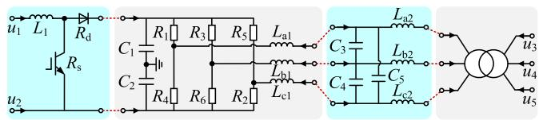  
Fig. 5. Topology of the PVPGU.

The state equation of a PVPGU can be expressed as (21), based on its topology.

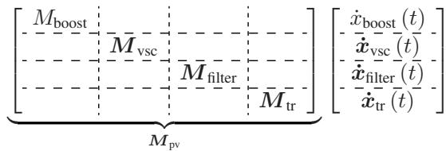

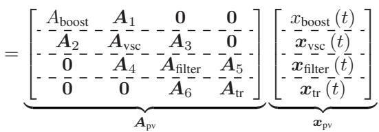

$$
+ \underbrace {\left[ \begin{array}{l l} B _ {\text {b o o s t}} & B _ {\text {v s c}} \end{array} ; B _ {\text {f i l t e r}} \end{array} ; B _ {\text {t r}} \right]} _ {B _ {\mathrm {p v}}} ^ {\mathrm {T}} u _ {\mathrm {n} _ {-} \mathrm {p v}} (t) \tag {21}
$$

where $M _ { \mathrm { b o o s t } } , M _ { \mathrm { v s c } } , M _ { \mathrm { f i l t e r } }$ and $M _ { \mathrm { t r } }$ matrices contain the coefficients for the capacitors and inductors corresponding to the four parts of the circuit; the $A _ { \mathrm { p v } }$ matrix contains the admittance values for the circuit; the $B _ { \mathrm { T } }$ is a coefficient matrix composed of 0 or 1; the ${ \pmb u } _ { \mathrm { n \_ p v } }$ matrix represents the external nodal voltage; the $\scriptstyle { \mathbf { { \mathit { x } } } _ { \mathrm { { p v } } } }$ matrix contains the state variables.

The (21) can be expressed in an equivalent form as

$$
\left\{ \begin{array}{l} \boldsymbol {M} _ {\mathrm {p v}} \dot {\boldsymbol {x}} _ {\mathrm {p v}} (t) = \boldsymbol {A} _ {\mathrm {p v}} \boldsymbol {x} _ {\mathrm {p v}} (t) + \boldsymbol {B} _ {\mathrm {p v}} \boldsymbol {u} _ {\mathrm {n} - \mathrm {p v}} (t) \\ \boldsymbol {u} _ {\mathrm {n} - \mathrm {p v}} ^ {\mathrm {T}} (t) = \left[ \begin{array}{c c c c c} u _ {1} & u _ {2} & u _ {3} & u _ {4} & u _ {5} \end{array} \right] ^ {\mathrm {T}} \end{array} \right. \tag {22}
$$

Besides, the additional output equation is provided in (23).

$$
\boldsymbol {i} _ {\mathrm {s} - \mathrm {p v}} (t) = \boldsymbol {P} _ {\mathrm {p v}} \boldsymbol {x} _ {\mathrm {p v}} (t) \tag {23}
$$

where $\dot { \iota } _ { \mathrm { s \_ p v } }$ is the matrix of injection current of external nodes, $P _ { \mathrm { p v } }$ is composed of 0 or 1 elements, which reflects the relationship between theis $\mathbf { \Pi } _ { - \mathrm { p v } }$ and $\scriptstyle { \mathbf { { \mathit { x } } } _ { \mathrm { { p v } } } }$ .

The port equivalent equation, as shown in (24), can be obtained by combining the (22) and (23).

$$
\boldsymbol {i} _ {\mathrm {s} _ {- \mathrm {p v}}} (t + \Delta t) = \boldsymbol {Y} _ {\mathrm {n} _ {- \mathrm {p v}}} \boldsymbol {u} _ {\mathrm {n} _ {- \mathrm {p v}}} (t + \Delta t) + \boldsymbol {j} _ {\mathrm {h} _ {- \mathrm {p v}}} (t) \tag {24}
$$

where

$$
\left\{ \begin{array}{l} j _ {\mathrm {h} - \mathrm {p v}} (t) = P _ {\mathrm {p v}} Q _ {\mathrm {p v}} R _ {\mathrm {p v}} x _ {\mathrm {p v}} (t) + \frac {\Delta t}{2} P _ {\mathrm {p v}} Q _ {\mathrm {p v}} B _ {\mathrm {p v}} u _ {\mathrm {n} - \mathrm {p v}} (t) \\ Y _ {\mathrm {n} - \mathrm {p v}} = \frac {\Delta t}{2} P _ {\mathrm {p v}} Q _ {\mathrm {p v}} B _ {\mathrm {p v}} \end{array} \right. \tag {25}
$$

where $Q _ { \mathrm { p v } }$ and $R _ { \mathrm { p v } }$ can be derived according to the (8).

The (25) can be expressed in further detail as follows:

$$
\left\{ \begin{array}{l} \boldsymbol {j} _ {\mathrm {h} _ {-} \mathrm {p v}} (t) = \left[ \begin{array}{l l l l l} j _ {1, 6} & j _ {2, 6} & j _ {3, 6} & j _ {4, 6} & j _ {5, 6} \end{array} \right] ^ {T} \\ \boldsymbol {Y} _ {\mathrm {n} _ {-} \mathrm {p v}} = \boldsymbol {Y} _ {\mathrm {n} _ {-} \mathrm {p v}, i j} + \operatorname {d i a g} \left(\boldsymbol {Y} _ {\mathrm {n} _ {-} \mathrm {p v}}\right) \\ y _ {i, j} = \left| \boldsymbol {Y} _ {\mathrm {n} _ {-} \mathrm {p v}, i j} \right|, i <   = 5, j <   = 5, i \neq j \end{array} \right. \tag {26}
$$

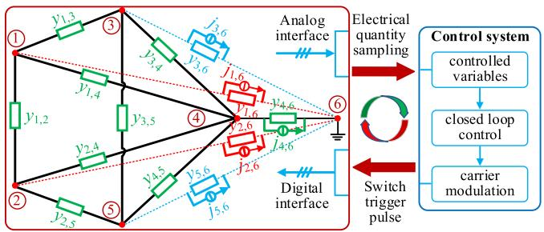  
Fig. 6. The equivalent circuit of PVPGU.

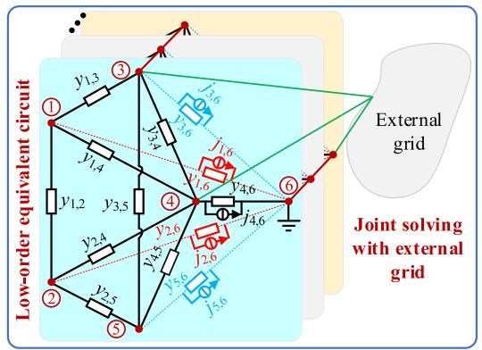  
Fig. 7. The equivalent circuit of multiple PVPGUs.

As indicated in Fig. 6, the equivalent circuit of a PVPGU can be deduced.

In detail, the admittance between each node is dependent on the mutual admittance of matrix $Y _ { \mathrm { n _ { \mathrm { - } } p v } }$ . Furthermore, there is an injected historical current source between each node and the grounding point.

In Fig. 7, the equivalent circuits of a PVPGU and multiple PVPGUs are all obtained. The equivalent admittance matrix of a PVPGU is reduced by 10 dimensions compared with that of the original circuit. For a hundred-megawatt large-scale PVPP, the dimension of the admittance matrix will be reduced by more than 1000, which indicates an advantage of high efficiency.

# B. Equivalent Circuit of CHB-DAB Module

The cascaded H-bridge (CHB) PET has a modular structure and is widely used in medium and high voltage distribution networks. The high voltage side H-bridge converter employs a cascaded H-bridge converter, while the intermediate isolation stage typically comprises a dual active bridge (DAB) converter. The operating frequency is typically in the tens of kHz range.

In order to ascertain the suitability of the proposed method for high-frequency converters, the equivalent circuit derived in this section following the application of the proposed method to the CHB-DAB module. The CHB-DAB module is comprised of a DAB converter and a H-bridge converter, as illustrated in Fig. 8(a).

Firstly, the state equation of the transformer is derived. Supposing the transformer ratio is $N _ { \mathrm { T } }$ , ignoring copper, iron loss

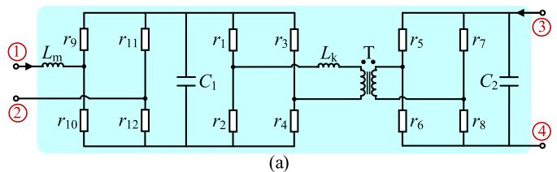

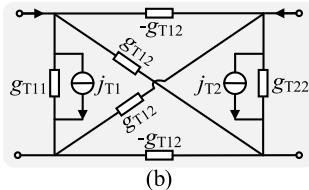

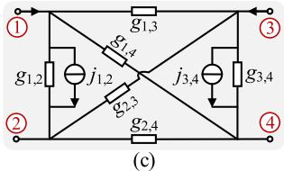  
Fig. 8. Application in CHB-DAB module: (a) The topology of CHB-DAB; (b) the equivalent circuit of transformer; (c) the equivalent circuit of CHB-DAB.

and core saturation characteristics, the voltage and current at the transformer port satisfy (27).

The (27) is discretized by the trapezoidal integration method, resulting in the (28). The equivalent circuit of the transformer is depicted in Fig. 8(b).

$$
\left[ \begin{array}{l} v _ {\mathrm {T 1}} (t) \\ v _ {\mathrm {T 2}} (t) \end{array} \right] = \left[ \begin{array}{c c} L _ {1} + L _ {\mathrm {m}} + L _ {\mathrm {k}} & L _ {\mathrm {m}} / N _ {\mathrm {T}} \\ L _ {\mathrm {m}} / N _ {\mathrm {T}} & L _ {\mathrm {m}} / N _ {\mathrm {T}} ^ {2} + L _ {2} \end{array} \right] \left[ \begin{array}{c} \frac {\mathrm {d} i _ {\mathrm {T 1}} (t)}{\mathrm {d} t} \\ \frac {\mathrm {d} i _ {\mathrm {T 2}} (t)}{\mathrm {d} t} \end{array} \right] \tag {27}
$$

where $v _ { \mathrm { T 1 } }$ , vT2, iT1, $i _ {  { \mathrm { T } } 2 }$ are the voltage and current of the primary and secondary port respectively; $L _ { 1 }$ and $L _ { 2 }$ are leakage inductance; $L _ { \mathrm { m } }$ is the excitation inductance.

$$
\begin{array}{l} \left[ \begin{array}{l} i _ {\mathrm {T} 1} (t) \\ i _ {\mathrm {T} 2} (t) \end{array} \right] = G _ {\mathrm {T}} \left[ \begin{array}{l} v _ {\mathrm {T} 1} (t) + v _ {\mathrm {T} 1} (t - \Delta t) \\ v _ {\mathrm {T} 2} (t) + v _ {\mathrm {T} 2} (t - \Delta t) \end{array} \right] \\ + \left[ \begin{array}{l} i _ {\mathrm {T} 1} (t - \Delta t) \\ i _ {\mathrm {T} 2} (t - \Delta t) \end{array} \right] \tag {28} \\ \end{array}
$$

where

$$
\left\{ \begin{array}{l} \boldsymbol {G} _ {\mathrm {T}} = \frac {\Delta t}{2 \Gamma} \left[ \begin{array}{c c} L _ {\mathrm {m}} / N ^ {2} + L _ {2} & - L _ {\mathrm {m}} / N \\ - L _ {\mathrm {m}} / N & L _ {1} + L _ {\mathrm {m}} + L _ {\mathrm {k}} \end{array} \right] \triangleq \left[ \begin{array}{c c} g _ {\mathrm {T 1 1}} & g _ {\mathrm {T 1 2}} \\ g _ {\mathrm {T 2 1}} & g _ {\mathrm {T 2 2}} \end{array} \right] \\ \Gamma = \left(L _ {\mathrm {m}} / N ^ {2} + L _ {2}\right) \left(L _ {1} + L _ {\mathrm {m}} + L _ {\mathrm {k}}\right) - L _ {\mathrm {m}} / N ^ {2} \\ \left[ \begin{array}{l} j _ {\mathrm {T 1}} (t) \\ j _ {\mathrm {T 2}} (t) \end{array} \right] = \boldsymbol {G} _ {\mathrm {T}} \left[ \begin{array}{l} v _ {\mathrm {T 1}} (t - \Delta t) \\ v _ {\mathrm {T 2}} (t - \Delta t) \end{array} \right] + \left[ \begin{array}{l} i _ {\mathrm {T 1}} (t - \Delta t) \\ i _ {\mathrm {T 2}} (t - \Delta t) \end{array} \right] \end{array} \right. \tag {29}
$$

where $G _ { \mathrm { T } }$ is the port admittance matrix; gT11, gT12, gT21 and gT22 are mutual admittance between terminals; Γ is the determinant of $G _ { \mathrm { T } } ;$ jT1 and $j _ { \mathrm { T 2 } }$ are history current source.

The state equation of the CHB-DAB can be expressed as (30).

$$
\begin{array}{l} \left[ \begin{array}{c c c} M _ {\mathrm {t r}} & & \\ \hline & M _ {\mathrm {C}} & \\ \hline & & M _ {\mathrm {L}} \end{array} \right] \left[ \begin{array}{c} \dot {\boldsymbol {x}} _ {\mathrm {t r}} (t) \\ \hline \dot {\boldsymbol {x}} _ {\mathrm {C}} (t) \\ \hline \dot {\boldsymbol {x}} _ {\mathrm {L}} (t) \end{array} \right] \\ = \left[ \begin{array}{c c c} \boldsymbol {A} _ {\mathrm {t r}} & \boldsymbol {\beta} _ {1} & \boldsymbol {0} \\ \hline \boldsymbol {\beta} _ {2} & \boldsymbol {A} _ {\mathrm {C}} & \boldsymbol {\beta} _ {3} \\ \hline \boldsymbol {0} & \boldsymbol {\beta} _ {4} & \boldsymbol {A} _ {\mathrm {L}} \end{array} \right] \left[ \begin{array}{c} \boldsymbol {x} _ {\mathrm {t r}} (t) \\ \hline \boldsymbol {x} _ {\mathrm {C}} (t) \\ \hline \boldsymbol {x} _ {\mathrm {L}} (t) \end{array} \right] \\ + \left[ \begin{array}{l} 0 \\ \dots \dots \dots \dots \\ B _ {C} \\ \dots \dots \dots \dots \\ B _ {L} \end{array} \right] u _ {\mathrm {n} _ {-} \mathrm {C H B} - \mathrm {D A B}} (t) \tag {30} \\ \end{array}
$$

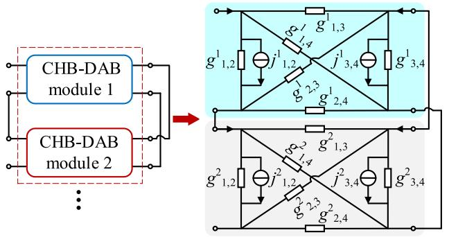  
Fig. 9. The equivalent circuit of a 2-module CHB-DAB converter.

where $M _ { \mathrm { t r } } , M _ { \mathrm { C } }$ and $M _ { \mathrm { L } }$ are coefficient matrix containing capacitance and inductance; $\beta _ { 1 } , \ \beta _ { 2 } , \ \beta _ { 3 }$ and $\beta _ { 4 }$ are matrix containing varying elements; $\mathbf { \delta u } _ { \mathrm { n } }$ _CHB - DAB represents the nodal voltage of external ports, the following equations denote the angle scale CHB-DAB as γ.

The derivation process of port equivalent equation is no longer repeated, as shown in (31) in the form of nodes, can be obtained, which is identical to the PVPGU.

$$
\boldsymbol {i} _ {\mathrm {s} _ {-} \gamma} (t + \Delta t) = \boldsymbol {G} _ {\mathrm {n} _ {-} \gamma} \boldsymbol {u} _ {\mathrm {n} _ {-} \gamma} (t + \Delta t) + \boldsymbol {j} _ {\mathrm {h} _ {-} \gamma} (t) \tag {31}
$$

The (31) can be expressed in further detail as follows:

$$
\left\{ \begin{array}{l} j _ {\mathrm {h} _ {-} \gamma} (t) = \left[ j _ {1, 2} ^ {k} - j _ {1, 2} ^ {k} j _ {3, 4} ^ {k} - j _ {3, 4} ^ {k} \right] ^ {T} \\ \boldsymbol {G} _ {\mathrm {n} _ {-} \gamma} = \boldsymbol {G} _ {\mathrm {n} _ {-} \gamma , m n} + \operatorname {d i a g} \left(\boldsymbol {G} _ {\mathrm {n} _ {-} \gamma}\right) \\ g _ {m, n} ^ {k} = \left| \boldsymbol {G} _ {\mathrm {n} _ {-} \gamma , m n} \right|, m <   = 4, n <   = 4, m \neq n \end{array} \right. \tag {32}
$$

As indicated in (31), the equivalent circuit of the CHB-DAB converter in Fig. 8(c) can be deduced. In detail, the admittance between each node depends on the mutual admittance of matrix $G _ { \mathrm { n } _ { - } \gamma } .$ , and there is an injected historical current source between each node and the grounding point.

The topology of a PET is typically formed by cascading multiple CHB-DAB modules. The external port can be connected to the next module in series or parallel. This paper considers the connection mode of input side series and output side parallel as an illustrative example to obtain the equivalent circuit of a 2-module PET, as shown in Fig. 9. It is pertinent to highlight that the upper right corner labels k of the conductor g and the history current source j represent the number of modules of the CHB-DAB.

In contrast to the concept of port-equivalent modeling [32], the proposed method enables the determination of the voltage or current of the switching arm or the voltage of the transformer port by solving the state variables, as derived in (33).

$$
u _ {\mathrm {C} 1} (t) = v _ {\mathrm {T} 1} (t) + \frac {r _ {2} - r _ {1}}{r _ {1} + r _ {2}} i _ {\mathrm {L k}} (t) \cdot 2 r _ {\mathrm {o n}}, r _ {\mathrm {o n}} = 0. 0 1 \tag {33}
$$

# C. Flowchart of the Proposed Method

The flowchart of the proposed method is illustrated in Fig. 10. The implementation process is as follows:

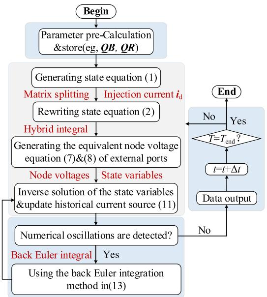  
Fig. 10. Flowchart of the proposed method.

1) Parameters Pre-Calculation and Store: The process entails the storage of the constant matrix, and certain parameters within the calculation process. Additionally, the precomputation of certain parameters prior to the commencement of the simulation allows for their direct utilization within the simulation process.   
2) Generation of Equivalent Circuit: The objective of this process is to derive and deform the state equation in order to obtain the network equivalent equation through the application of the (3) and (4). This is followed by the generation of the equivalent circuit according to the equivalent equation shown in (6).   
3) Joint Solution With External Grid: The objective of this process is to jointly solve the equivalent circuit generated by the previous process (2) after connecting with the external grid. The equivalent circuit formed in Figs. 7 and 9 can be packaged into a modular port-containing component after programming. This component can then be directly dragged and connected to the external grid for solving.   
4) Inverse Solution of State Variables: The inverse solution of the state variables through the voltage of external nodes (8) is the first step in the process. The obtained state variables can then be used directly to update the historical current source, after which the next time-step can be simulated.

# V. MODEL VALIDATION

This section validates the proposed equivalent model (EM) in a variety of scenarios and assesses its simulation efficiency. The reference model (RM) constructed in the PSCAD/EMTDC based on detailed components serves as a point of comparison.

# A. Comparisons With Experiments of Physical Platform

A low-power physical experimental platform is constructed to validate the efficacy of the EM in this section, as depicted

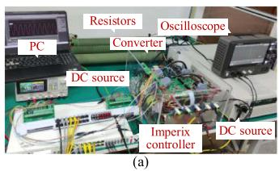

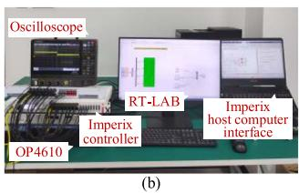  
Fig. 11. The physical experimental platform: (a) Physical experimental platform; (b) HIL real-time simulation platform.

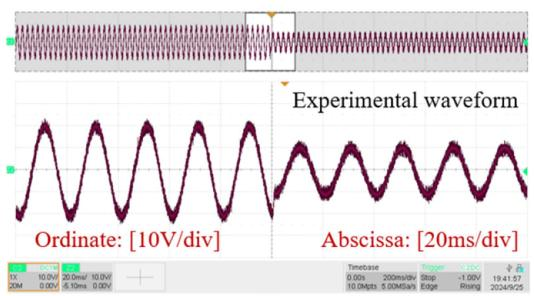

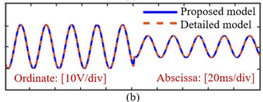  
  
Fig. 12. Test results: (a) Experimental results of A-phase load voltage; (b) simulation results of A-phase load voltage.

in Fig. 11(a). The V/F control strategy is employed in order to achieve the constant voltage/frequency control of the load, which simulates an islanding operation of the converter.

The parameters of the two-level VSC: the input DC voltage is 50 V, the DC-side capacitor is $1 3 6 0 \mu \mathrm { F } ,$ the switching frequency is 5 kHz and the AC-side inductor is 5 mH.

Changing the load voltage reference from 20 V to 10 V, the test results are displayed in Fig. 12. The Fig. 12(a) and (b) show the experimental and simulation results of the phase-A load voltage, respectively. The results indicate that the proposed model exhibits high precision and its operating characteristics align with those of the actual converter and detailed model.

Setting up the A-phase upper bridge arm switch trigger pulse loss, the test results are displayed in Fig. 13.

The Fig. 13(a) and (b) show the experimental and simulation results of the phase-A load voltage, respectively. The test results demonstrate that the proposed model displays a high degree of precision and exhibits operational characteristics that are consistent with those observed in the actual converter.

# B. HIL Real-Time Simulation Verification

The RT-LAB real-time simulation platform is illustrated in Fig. 11(b). The single phase-shift control strategy is adopted to achieve positive power transfer. The proposed algorithm has been implemented on the platform, and a real-time simulation

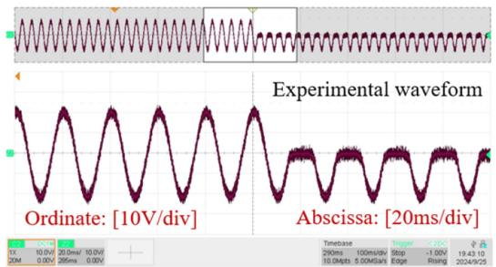

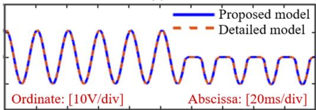  
  
  
Fig. 13. Test results: (a) Experimental results of load A-phase voltage; (b) simulation results of load A-phase voltage.

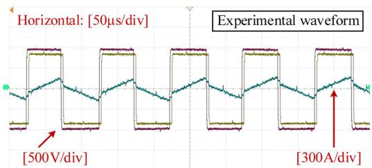

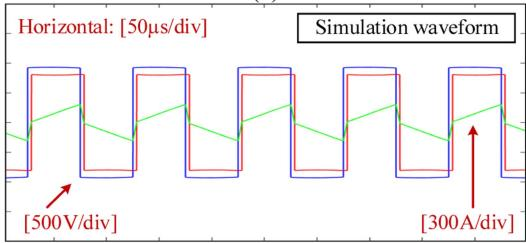  
(a)   
  
Fig. 14. Test results of primary/secondary voltage and primary current of transformer: (a) Experimental results; (b) simulation results.

model has been established. The real-time simulation test has been carried out with a time-step of 1 μs.

The parameters of the DAB: the input DC voltage is 1000 V, the DC-side capacitor is $1 0 0 \mu \mathrm { F } ,$ the switching frequency is 10 kHz, the load is 10 Ω, the primary and secondary leakage inductor of the transformer is $5 \mu \mathrm { H } .$ the magnetization inductor is 1 H. The test results are displayed in Fig. 14.

The Fig. 14 demonstrates that the results of HIL simulation align with those of the offline simulation, thereby substantiating the viability of the proposed algorithm for real-time simulators.

# C. Performance of the EM in Multi-Module Converter Systems

1) Validation of Simulation Accuracy: The effectiveness of the EM is verified by constructing a three-converter parallel system 1, as depicted in Fig. 15(a), and a five-module PET

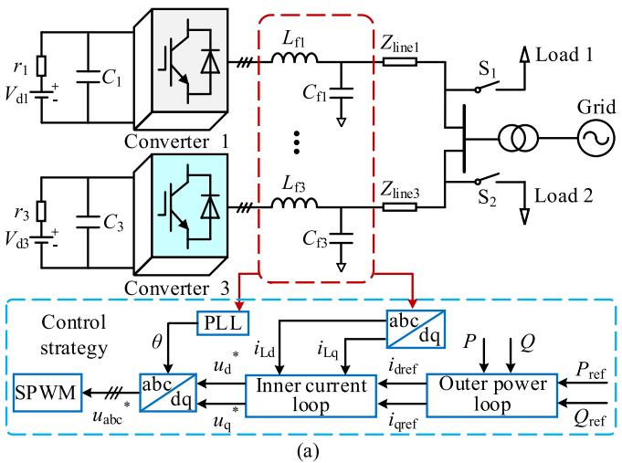

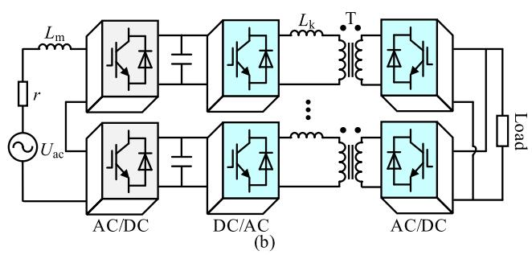  
Fig. 15. Test systems: (a) Three-converter parallel system 1; (b) five-module PET system 2.

TABLE III PARAMETERS OF THE TEST SYSTEMS   

<table><tr><td>System</td><td>Parameter</td><td>Value</td></tr><tr><td rowspan="10">System 1: three-converter parallel system</td><td>DC voltage (kV)</td><td>25, 50, 22</td></tr><tr><td>Internal resistor (Ω)</td><td>1</td></tr><tr><td>AC/DC-side capacitor (μF)</td><td>200, 50</td></tr><tr><td>AC-side inductor (H)</td><td>0.05</td></tr><tr><td>Line inductor (H)</td><td>2e-4</td></tr><tr><td>Line resistor (Ω)</td><td>1</td></tr><tr><td>Load 1 impedance (Ω)</td><td>10+jω0.01</td></tr><tr><td>Load 2 impedance (Ω)</td><td>15+jω0.01</td></tr><tr><td>Short-circuit reactance of transformer/p.u.</td><td>0.1</td></tr><tr><td>Short-circuit resistor of transformer/p.u.</td><td>0.001</td></tr><tr><td rowspan="9">System 2: five-module PET system</td><td>AC-source voltage (kV)</td><td>6</td></tr><tr><td>Internal resistor (Ω)</td><td>1</td></tr><tr><td>Operation frequency (kHz)</td><td>10</td></tr><tr><td>AC-side inductor (H)</td><td>2e-4</td></tr><tr><td>DC capacitor (μF)</td><td>2000, 50</td></tr><tr><td>Short-circuit reactance/p.u.</td><td>0.02</td></tr><tr><td>Ratio of transformer</td><td>1:1</td></tr><tr><td>Rated capacity (MVA)</td><td>10</td></tr><tr><td>Load resistor (Ω)</td><td>30</td></tr></table>

system 2, as illustrated in Fig. 15(b), on the PSCAD/EMTDC simulation platform. System 1 employs P/Q control strategy, while system 2 utilizes single phase-shift control strategy with a phase-shift angle of 45°. The system parameters are presented in Table III.

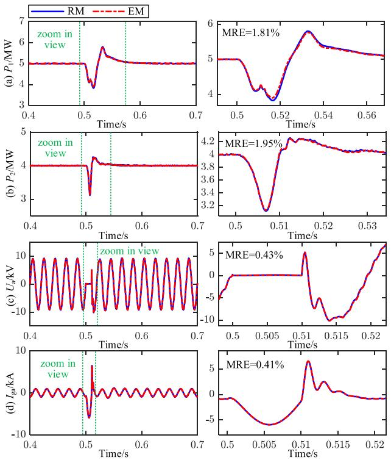  
Fig. 16. Simulations results: (a) Output active power $P _ { 1 }$ of converter 1; (b) output active power $P _ { 2 }$ of converter 2; (c) phase-A voltage $U _ { \mathrm { a } }$ of AC-bus; (d) phase-A current $I _ { \mathrm { { g a } } }$ of the grid.

The EM is compared with RM to verify its simulation accuracy. System 1 sets the simulation time-step to 10 $\mu \mathrm { s }$ and the simulation time to 2 s. The condition setting is as follows:

1) At 0.5 s, the A-phase of the AC-bus is grounded for a fault duration of 0.01 s;   
2) At 0.9 s, the DC-side short circuit fault of converter 3 disappears after 0.05 s;   
3) At 1.5 s, the circuit breaker S2 is disconnected, the load is reduced, and the fault is restored after 0.1 s.

The simulation results are presented in Figs. 16, 17 and 18, and the maximum relative errors (MRE) of the different results are also calculated.

The Fig. 16 shows that during the short-circuit fault, $P _ { 1 }$ and $P _ { 2 }$ decreased, $U _ { \mathrm { a } }$ dropped to 0, and $I _ { \mathrm { g a } }$ increased. The test results have an MRE of less than 1.95%, indicating that the EM has high simulation accuracy. The Fig. 17 illustrates the response of the converter 3 circuitry to a short circuit on the DC side. The results indicate a sharp decline of $P _ { 3 } ,$ , a slight reduction in the amplitude of $U _ { \mathrm { a } } ,$ , a decrease in the $I _ { \mathrm { g a } }$ current, and a corresponding drop in the $P _ { \mathrm { l o a d } }$ . The MRE of the test results is below 1.41%, which indicates a high degree of accuracy in the EM simulation. The Fig. 18 illustrates that $P _ { \mathrm { l o a d } }$ declines while $I _ { \mathrm { g a } }$ remains unaltered following a reduction in load. The change in load exerts no influence on the grid-connected current. The test results demonstrate that EM exhibits high simulation accuracy, with a MRE of 0.23%.

The five module PET system 2 sets the simulation time-step to 1 $\mu \mathrm { s }$ and the simulation time to 2 s. At 1.5 s, the DC-side is grounded, and the fault is eliminated after 0.02 s.

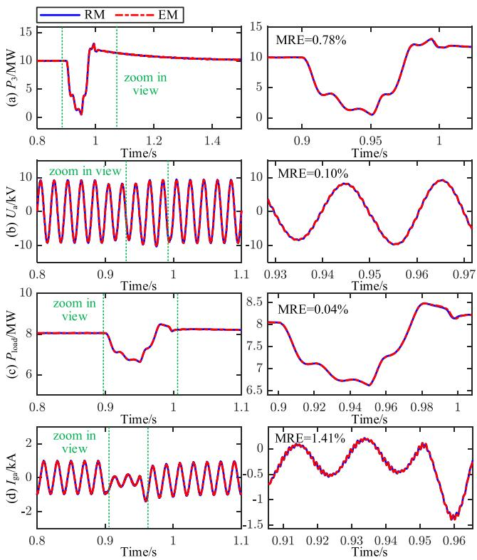  
Fig. 17. Simulations results: (a) Output active power $P _ { 3 }$ of converter 3; (b) phase-A voltage $U _ { \mathrm { a } }$ of AC-bus; (c) active power $P _ { \mathrm { l o a d } }$ of load; (d) phase-A current $I _ { \mathrm { g a } }$ of grid.

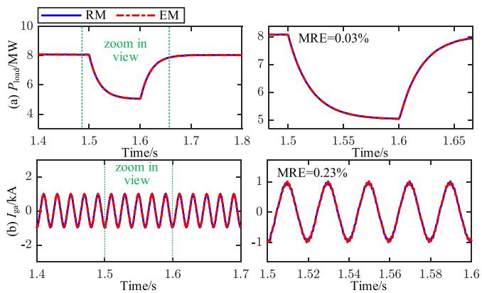  
Fig. 18. Simulations results: (a) Active power $P _ { \mathrm { l o a d } }$ of load; (d) phase-A current $I _ { \mathrm { { g a } } }$ of grid.

The simulation results are presented in Fig. 19, which illustrates that during the short-circuit fault, $U _ { \mathrm { d c } }$ and $U _ { \mathrm { T 2 } }$ dropped to 0, and $i _ { \mathrm { T 1 } }$ decreased, the test results exhibit an MRE of less than 1.48%.   
2) Validation of Simulation Efficiency: In order to assess the simulation efficiency of the EM, a system is constructed with varying numbers of converters, as illustrated in Fig. 15(a). The PC is configured with a 12th Gen Intel (R) Core (TM) i5-12600K, 3.70 GHz, 16GB RAM.

The simulation times of RM, NEM, and EM are tested individually, and the speed-up ratios (SR) are calculated. SR1 represents the ratio of simulation time of RM to EM, and SR2 represents

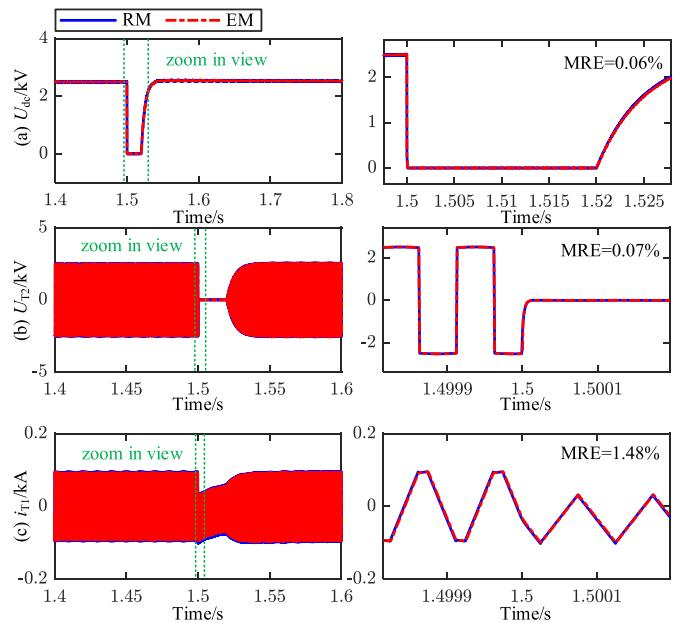  
Fig. 19. Simulations results: (a) DC-side voltage $U _ { \mathrm { d c } }$ of load; (b) secondary side voltage $U _ { \mathbf { a } }$ of transformer; (c) primary side current $i _ { \mathrm { T 1 } }$ of transformer.

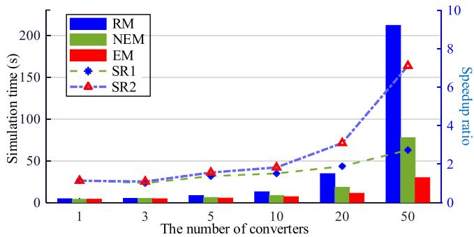  
Fig. 20. The test of simulation efficiency.

the ratio of simulation time of RM to NEM. The test results are presented in Fig. 20.

The Fig. 20 illustrates that when there are 50 converters in a system, SR1 exceeds 7 and SR2 is close to 3. The simulation efficiency of EM is more than twice that of the NEM and more than 7 times that of the RM. As the number of converters increases, SR also increases, making the EM highly efficient.

The high efficiency of the EM is attributable to the fact that the simulation process does not necessitate the inversion of the varying admittance matrix and more straightforward modeling procedures, thereby reducing the number of calculations.

3) Performance of the EM in Modified IEEE 118-Node System: The performance of the EM is tested by modifying the IEEE 118-node system. The generators are replaced by several large-scale PVPPs [33], as illustrated in Fig. 21.

The output power of each PVPP is equivalent to that of the original generators; therefore, it is reasonable to assume that the integration of PVPPs will not alter the power flow of the existing system. The aggregate output power of the PVPPs amounts to 260+j122.74 MVA.

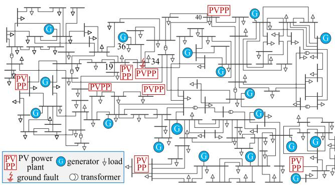  
Fig. 21. Topology of the modified IEEE 118-node system.

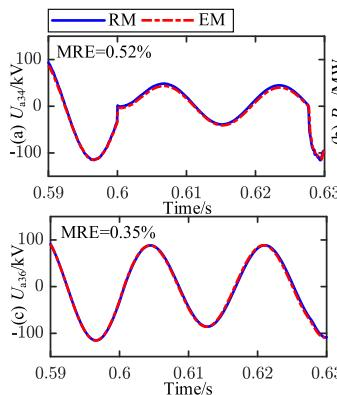

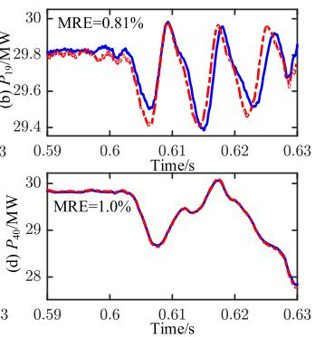  
Fig. 22. Simulations results: (a) A-phase voltage at node-34; (b) active power at node-19; (c) A-phase voltage at node-36; (d) active power at node-40.

TABLE IV SIMULATION TIME AT DIFFERENT SWITCHING FREQUENCY   

<table><tr><td rowspan="2">Switching frequency</td><td colspan="3">Simulation time/s</td><td rowspan="2">RM/NEM (SR1)</td><td rowspan="2">RM/EM (SR2)</td></tr><tr><td>RM</td><td>NEM</td><td>EM</td></tr><tr><td>f=2 kHz</td><td>5310.223</td><td>2095.589</td><td>801.221</td><td>2.534</td><td>6.628</td></tr><tr><td>f=5 kHz</td><td>8762.267</td><td>2266.494</td><td>1058.855</td><td>3.866</td><td>8.275</td></tr></table>

1) single-phase to ground fault at node-34: A-phase of node-34 occurs ground fault at 0.6 s, with a duration of 0.02 s and a ground resistance of 1 Ω. The simulation results of the PVPP and generator at node-34 or in the vicinity of node-34 are presented in Fig. 21.

The Fig. 22 illustrates that a short-circuit fault affects its adjacent nodes, resulting in fluctuations in active power and voltage. The MRE of the EM, when compared with the RM, is 0.52%, 0.81%, 0.35%, and 1.0% respectively.

2) simulation efficiency at different switching frequencies: In order to ascertain the simulation efficiency of the EM in a system at varying switching frequencies, a series of tests are conducted to assess the simulation time of the RM, NEM and EM at 2 kHz and 5 kHz. The results are presented in Table IV, with a simulation time of 1 s.

The Table IV illustrated that the simulation time of the three models increases as the switching frequency increases. The speedup ratio of the EM at 2 kHz is less than that of the EM at 5 kHz. This is due to the fact that the number of electrical

nodes of the EM is considerably smaller than that of the RM. Consequently, the increased simulation time is less than that of the RM. The test results demonstrate the advantages of the EM at high frequencies.

Furthermore, SR2 is greater than SR1, indicating that the simulation efficiency of EM is higher than that of NEM. This further verifies the advantages of the proposed method in simulation efficiency.

# VI. CONCLUSION

This paper presents a constant admittance method for modeling power electronic converters using a state variables elimination-based EMTP-type approach. The method utilizes a three-layer architecture, comprising of network, nodal voltages, and historical current sources. By matrix splitting and addition of the output equation, a low-order equivalent nodal voltage equation is derived. The following conclusions are reached:

1) In comparison to the classical NEM, the EM exhibits lower time-complexity, fewer computational operations, a simpler modeling procedure, and does not require inverting the time-varying admittance matrix during simulation.   
2) The proposed method displays a certain degree of versatility, particularly in the context of modular or unitized electrical equipment, such as the PVPP and PET.   
3) For a system comprising 50 converters, the simulation efficiency is twice as high as that of the NEM and more than 7 times that of the RM. As the number of converters increases, the SR also increases, resulting in the EM being highly efficient.   
4) The simulation results demonstrate that the EM exhibits high accuracy in a multitude of example scenarios. In a modified IEEE 118-node system, the enhanced efficiency of the EM at high frequency is demonstrated.

The principle of the proposed method show promise for further development in other scenarios and have the potential to be extended to a wider range of modeling studies in future work, including the modeling of large-scale AC systems and generators.

# REFERENCES

[1] F. Li et al., “Review of real-time simulation of power electronics,” J. Modern Power Syst. Clean Energy., vol. 8, no. 4, pp. 796–808, Jul. 2020.   
[2] A. M. Gole, “Electromagnetic transient simulation of power electronic equipment in power systems: Challenges and solutions,” in Proc. IEEE Power Eng. Soc. Gen. Meeting, Montreal, Que., 2006, pp. 1–6.   
[3] J. T. Bialasiewicz, “Renewable energy systems with photovoltaic power generators: Operation and modeling,” IEEE Trans. Ind. Electron., vol. 55, no. 7, pp. 2752–2758, Jul. 2008.   
[4] W. Xiao, F. F. Edwin, G. Spagnuolo, and J. Jatskevich, “Efficient approaches for modeling and simulating photovoltaic power systems,” IEEE J. Photovolt., vol. 3, no. 1, pp. 500–508, Jan. 2013.   
[5] K. Wang, J. Xu, G. Li, N. Tai, A. Tong, and J. Hou, “A generalized associated discrete circuit model of power converters in real-time simulation,” IEEE Trans. Power Electron., vol. 34, no. 3, pp. 2220–2233, Mar. 2019.   
[6] Q. Mu, J. Liang, X. Zhou, Y. Li, and X. Zhang, “Improved ADC model of voltage-source converters in DC grids,” IEEE Trans. Power Electron., vol. 29, no. 11, pp. 5738–5748, Nov. 2014.   
[7] M. Feng, C. Gao, J. Xu, C. Zhao, and G. Li, “A novel decoupled EMT approach and parallel simulation framework for modularized solid-state transformers,” IEEE Trans. Power Del., vol. 38, no. 5, pp. 3285–3295, Oct. 2023.

[8] S. Gao, Y. Chen, Y. Song, Z. Yu, and Y. Wang, “An efficient half-bridge MMC model for EMTP-type simulation based on hybrid numerical integration,” IEEE Trans. Power Syst., vol. 39, no. 1, pp. 1162–1177, Jan. 2024.   
[9] J. Xu, S. Fan, C. Zhao, and A. M. Gole, “High-speed EMT modeling of MMCs with arbitrary multiport submodule structures using generalized Norton equivalents,” IEEE Trans. Power Del., vol. 33, no. 3, pp. 1299–1307, Jun. 2018.   
[10] D. Remon, A. M. Cantarellas, and P. Rodriguez, “Equivalent model of large-scale synchronous photovoltaic power plants,” IEEE Trans. Ind. Appl., vol. 52, no. 6, pp. 5029–5040, Nov. 2016.   
[11] F. Li et al., “Research on clustering equivalent modeling of large-scale photovoltaic power plants,” Chin. J. Elect. Eng., vol. 4, no. 4, pp. 80–85, Dec. 2018.   
[12] H. Wu, J. Zhang, C. Luo, and B. Xu, “Equivalent modeling of photovoltaic power station based on Canopy-FCM clustering algorithm,” IEEE Access, vol. 7, pp. 102911–102920, 2019.   
[13] S. Chiniforoosh et al., “Definitions and applications of dynamic average models for analysis of power systems,” IEEE Trans. Power Del., vol. 25, no. 4, pp. 2655–2669, Oct. 2010.   
[14] A. Yazdani and R. Iravani, “A generalized state-space averaged model of the three-level NPC converter for systematic DC-voltage-balancer and current-controller design,” IEEE Trans. Power Del., vol. 20, no. 2, pp. 1105–1114, Apr. 2005.   
[15] B. Lehman and R. M. Bass, “Switching frequency dependent averaged models for PWM DC-DC converters,” IEEE Trans. Power Electron., vol. 11, no. 1, pp. 89–98, Jan. 1996.   
[16] Y. Xu, Y. Chen, C. Liu, and H. Gao, “Piecewise average-value model of PWM converters with applications to large-signal transient simulations,” IEEE Trans. Power Electron., vol. 31, no. 2, pp. 1304–1321, Feb. 2016.   
[17] S. Yu, S. Zhang, Y. Han, Y. Wei, and S. Zou, “A pulse-source-pair-based AC/DC interactive simulation approach for multiple-VSC grids,” IEEE Trans. Power Del., vol. 36, no. 2, pp. 508–521, Apr. 2021.   
[18] S. Ebrahimi, H. Atighechi, S. Chiniforoosh, and J. Jatskevich, “Direct interfacing of parametric average-value models of AC–DC converters for nodal analysis-based solution,” IEEE Trans. Energy Convers., vol. 37, no. 4, pp. 2408–2418, Dec. 2022.   
[19] J. Zheng, Z. Zhao, Y. Zeng, B. Shi, and Z. Yu, “An event-driven real-time simulation for power electronics systems based on discrete hybrid timestep algorithm,” IEEE Trans. Ind. Electron., vol. 70, no. 5, pp. 4809–4819, May 2023.   
[20] S. Gao, Y. Chen, Y. Song, Y. Xia, and Z. Tan, “Determination of optimal shift frequency for shifted frequency-based simulation,” IEEE Trans. Power Syst., vol. 36, no. 5, pp. 4824–4827, Sep. 2021.   
[21] P. Zhang, J. R. Marti, and H. W. Dommel, “Induction machine modelling based on shifted frequency analysis,” IEEE Trans. Power Syst., vol. 24, no. 1, pp. 157–164, Feb. 2009.   
[22] D. Shu, V. Dinavahi, X. Xie, and Q. Jiang, “Shifted frequency modeling of hybrid modular multilevel converters for simulation of MTDC grid,” IEEE Trans. Power Del., vol. 33, no. 3, pp. 1288–1298, Jun. 2018.   
[23] T. Cheng, N. Lin, and V. Dinavahi, “Hybrid parallel-in-time-and-space transient stability simulation of large-scale AC/DC grids,” IEEE Trans. Power Syst., vol. 37, no. 6, pp. 4709–4719, Nov. 2022.   
[24] T. Cheng, T. Duan, and V. Dinavahi, “Parallel-in-time object-oriented electromagnetic transient simulation of power systems,” IEEE Open Access J. Power Energy, vol. 7, pp. 296–306, 2020, doi: 10.1109/OA-JPE.2020.3012636.   
[25] N. Lin, S. Cao, and V. Dinavahi, “Comprehensive modeling of large photovoltaic systems for heterogeneous parallel transient simulation of integrated AC/DC grid,” IEEE Trans. Energy Convers., vol. 35, no. 2, pp. 917–927, Jun. 2020.   
[26] B. Park, K. Sun, A. Dimitrovski, Y. Liu, and S. Simunovic, “Examination of semi-analytical solution methods in the coarse operator of parareal algorithm for power system simulation,” IEEE Trans. Power Syst., vol. 36, no. 6, pp. 5068–5080, Nov. 2021.   
[27] K. Strunz and E. Carlson, “Nested fast and simultaneous solution for time domain simulation of integrative power-electric and electronic systems,” IEEE Trans. Power Del., vol. 22, no. 1, pp. 277–287, Jan. 2007.   
[28] U. N. Gnanarathna, A. M. Gole, and R. P. Jayasinghe, “Efficient modeling of modular multilevel HVDC converters (MMC) on electromagnetic transient simulation programs,” IEEE Trans. Power Del., vol. 26, no. 1, pp. 316–324, Jan. 2011.   
[29] J. Xu et al., “High-speed electromagnetic transient (EMT) equivalent modelling of power electronic transformers,” IEEE Trans. Power Del., vol. 36, no. 2, pp. 975–986, Apr. 2021.

[30] M. Zou, Y. Wang, C. Zhao, J. Xu, X. Guo, and X. Sun, “Integrated equivalent model of permanent magnet synchronous generator-based wind turbine for large-scale offshore wind farm simulation,” J. Modern Power Syst. Clean Energy, vol. 11, no. 5, pp. 1415–1426, Sep. 2023, doi: 10.35833/MPCE.2022.000495.   
[31] C. Dufour, J. Mahseredjian, and J. Bélanger, “A combined state-space nodal method for the simulation of power system transients,” IEEE Trans. Power Del., vol. 26, no. 2, pp. 928–935, Apr. 2011.   
[32] C. Gao et al., “Portal analysis approach used for the efficient electromagnetic transient (EMT) simulation of power electronic systems,” IEEE Trans. Power Del., vol. 38, no. 6, pp. 4213–4225, Dec. 2023.   
[33] M. Xu et al., “Low-dimensional equivalent models and multithreadingbased parallel EMT simulation method for multi-converter systems,” IEEE Trans. Energy Convers., early access, Jul. 2024, doi: 10.1109/TEC.2024.3422080.

Mingwang Xu (Member, IEEE) received the B.S. and M.S. degrees in power engineering from North China Electric Power University, Beijing, China, in 2019 and 2022, respectively. He is currently working toward the Ph.D. degree in electrical engineering with Southeast University, Nanjing, China. His research interests include modeling and real-time simulation of power electronic systems.

Wei Gu (Senior Member, IEEE) received the B.S. and Ph.D. degrees in electrical engineering from Southeast University, Nanjing, China, in 2001 and 2006, respectively. From 2009 to 2010, he was a Visiting Scholar with the Department of Electrical Engineering, Arizona State University, Tempe, AZ, USA. He is currently a Professor with the School of Electrical Engineering, Southeast University. He is also the Director of the Institute of Distributed Generations and Active Distribution Networks. His research interests include distributed generations and

microgrids, integrated energy systems. He is an Editor for IEEE TRANSACTIONS ON POWER SYSTEMS, IET Energy Systems Integration, and Automation of Electric Power Systems (China).

Yang Cao (Graduate Student Member, IEEE) received the B.S. and M.S. degrees in power engineering in 2018 and 2021, respectively from Southeast University, Nanjing, China, where he is currently working toward the Ph.D. degree in electrical engineering. His research interests include modeling, control, and real-time simulation of power electronic systems.

Shuaixian Chen (Student Member, IEEE) received the B.S. degree in power engineering from the China University of Mining and Technology, Xuzhou, China, in 2023. He is currently working toward the M.S. degree in electrical engineering from Southeast University, Nanjing, China. His research interests include modeling, and real-time simulation of power electronic systems.

Fei Zhang received the B.S. and M.S. degrees in electrical engineering from Tsinghua University, Beijing, China, in 2009 and 2012, respectively, and the Ph.D. in electrical engineering from McGill University, Montreal, QC, Canada, 2018. From 2018 to 2020, he was an Electrical Simulation and Modelling Specialist with the Flexible DC Transmission division of OPAL-RT Technologies in Montreal, Canada. He is currently an Associate Professor in electrical engineering with Southeast University, Nanjing, China. His research interests include modular multilevel con-

verter, power electronic transformer, and power system simulation.

Wei Liu (Senior Member, IEEE) received the M.Eng. and Ph.D. degrees in electrical engineering from Southeast University, Nanjing, China, in 2011 and 2015, respectively. From 2015 to 2017, he was a Postdoctoral Fellow with the School of Automation, Southeast University. He is currently an Associate Professor with the Department of Electrical Engineering, School of Automation, Nanjing University of Science and Technology, Nanjing. His research interests include distributed control, optimization, and real-time simulation of microgrids and smart distribution systems.