# 一种用于LCC-HVDC系统小干扰稳定性分析的改进动态相量模型

贺永杰1, 向往1, 赵静波2, 周家培3, 鲁晓军1, 倪斌业1, 文劲宇1

(1. 强电磁工程与新技术国家重点实验室(华中科技大学), 湖北省 武汉市 430074;

2.国网江苏省电力有限公司电力科学研究院，江苏省南京市211103;

3. 先进输电技术国家重点实验室(全球能源互联网研究院有限公司), 北京市 昌平区 102209)

# Modified Dynamic Phasor Model for Small-signal Stability Analysis of LCC-HVDC System

HE Yongjie1, XIANG Wang1, ZHAO Jingbo2, ZHOU Jiapei3, LU Xiaojun1, NI Binye1, WEN Jinyu1

(1. State Key Laboratory of Advanced Electromagnetic Engineering and Technology (Huazhong University of Science and Technology),

Wuhan 430074, Hubei Province, China;

2. Electric Power Research Institute of State Grid Jiangsu Electric Power Co., Ltd., Nanjing 211103, Jiangsu Province, China;

3. State Key Laboratory of Advanced Power Transmission Technology (Global Energy Interconnection Research Institute Co., Ltd.),

Changping District, Beijing 102209, China)

ABSTRACT: With the widespread use of line commutated converter based high voltage direct current (LCC-HVDC) technology, and the couplings between AC and DC systems or the sending and receiving ends becoming more complicated, the stability of hybrid AC/DC power grids is becoming increasingly prominent. The small-signal stability analysis based on the linearized model is an important method to study the stability of hybrid AC/DC power grids. As the key equipment to connect AC and DC in hybrid AC/DC power grids, the linearized model of LCC converter is significant. Most existing literature derive the time-domain linearized model of LCC converter based on the quasi-steady assumption, which may introduce errors into the model. Therefore, this paper proposes a modified dynamic phasor model of LCC converter, which takes into account the actual sinusoidal variation of valve current during the commutation process. Firstly, a time-domain linearized model of a typical unipolar 12-pulse LCC-HVDC system is established based on the modified model. And then, it is validated by the electromagnetic transient simulation. Finally, the influence of the parameters of the rectifier-side controller, the inverter-side controller and the phase-locked loop (PLL) on the small-signal stability of the system is analyzed. Simulation and analysis show that the improved dynamic phasor model proposed in this

paper has a better improvement effect than the unimproved model.

KEY WORDS: LCC-HVDC; dynamic phasor; small-signal stability

摘要：随着基于线路换相换流器的高压直流输电(line commutated converter based high voltage direct current, LCC-HVDC)技术的广泛应用，交流和直流、送端和受端之间的耦合日益紧密，交直流混联电网的稳定性问题日益突出。基于线性化模型的小干扰稳定性分析是研究交直流混联电网稳定性的重要手段。作为交直流混联电网中连接交直流的关键设备，LCC换流器的线性化模型十分重要。已有文献大多基于准稳态假设推导LCC换流器的时域线性化模型，这会在模型中引入误差。为此，提出了一种LCC换流器的改进动态相量模型，其考虑了换相过程中阀电流的实际正弦变化规律。首先基于该模型建立了典型的单极12脉动LCC-HVDC系统的时域线性化模型，然后通过电磁暂态仿真验证了模型的正确性，最后分析了整流侧控制器参数、逆变侧控制器参数和锁相环(phase-locked loop，PLL)参数对系统小干扰稳定性的影响。仿真和分析表明文中所提的改进动态相量模型相对未改进模型有较好的改进效果。

关键词：LCC-HVDC；动态相量；小干扰稳定性

DOI: 10.13335/j.1000-3673.pst.2020.0226

# 0 引言

我国的能源基地和负荷中心在空间上呈现逆向分布的特点， $80\%$ 以上的能源分布在西部和北部地区，而 $75\%$ 以上的负荷却又集中在中部和东部地区[1]。这一特点促生了大范围能源资源优化配置的

迫切需求。由于具备大容量远距离输电的优势，LCC-HVDC技术自20世纪70年代以来得到了广泛应用。自云南—广东±800kV和向家坝—上海±800kV两回特高压直流示范工程投运以来，我国又陆续投运了锦屏—苏南±800kV、哈密南—郑州±800kV等10余回特高压直流工程[2]，其中2019年投运的准东—皖南±1100kV特高压直流工程更是世界上电压等级最高、输送容量最大、输送距离最远、技术水平最先进的特高压直流工程。随着LCC-HVDC工程的不断投运，受端电网形成了多回直流密集馈入的格局，西南电网—华东电网甚至出现了5回特高压直流“同送同受”的局面。以上导致了受端多回直流之间以及送端与受端之间的耦合愈发紧密[3]，对交直流混联电网稳定性问题研究的需求也愈发迫切。鉴于交直流混联电网是一个高度非线性的系统，直接对其研究不仅十分困难而且也不利于稳定性机理的深入挖掘，因此基于其线性化模型的小干扰稳定性分析成为了研究交直流混联电网稳定性问题最基本、最重要的手段[4-6]。

作为交直流混联电网中连接交直流的关键设备，LCC换流器有着十分复杂的非线性特性，其线性化模型一直是研究热点之一。文献[7]通过引入转换函数(conversion functions)的概念来计算LCC-HVDC系统中电流控制回路的传递函数并获得系统的频率响应。文献[8-9]通过对交流电流和直流电压波形的分段线性化表示推导出LCC换流器的频域线性化模型。文献[10-11]使用空间矢量传递函数(space vector transfer function)得到LCC-HVDC系统的频域线性化模型。文献[12]基于无限6脉动LCC-HVDC换流器的假设，提出了一种改进的LCC换流器频域线性化模型，模型中考虑了换相电感的动态特性以及传输延迟的影响，触发角和关断角的测量采样也被考虑在内。

上述LCC换流器的线性化模型均为频域模型，然而小干扰稳定性分析中常用的模态分析法需要LCC换流器的时域线性化模型。文献[13-15]基于LCC换流器的准稳态特性，建立了系统时域线性化模型。其中文献[13]研究了PLL动态对系统稳定性的影响，文献[14]研究了交流系统参数对系统稳定性的影响，文献[15]研究了多馈入LCC-HVDC之间的交互影响。文献[16]基于质量-弹簧-阻尼概念提出了一种LCC-HVDC系统的时域线性化模型，该模型可以帮助研究人员直观地理解和解释系统的分析或仿真结果。文献[17-18]借助开关函数模型描述LCC换流器交直流侧电压电流变换关系，建立

了LCC逆变站的时域线性化模型，并研究了PLL对系统小干扰稳定性的影响。文献[19]基于LCC换流器的准稳态模型建立了特高压直流分层接入的时域线性化模型，并探讨了模态分析方法在特高压直流分层接入的稳定量化评估中的可行性。

上述LCC换流器的时域线性化模型大多基于准稳态假设，对于换相过程中阀电流的变化进行线性近似[20]，这会在模型中引入误差。为了消除这一误差，本文提出了一种LCC换流器的改进动态相量模型，通过考虑换相过程中阀电流的实际正弦变化规律，该模型可以有效减小误差，提高分析精度。

本文首先基于LCC换流器的改进动态相量模型建立典型的单极12脉动LCC-HVDC系统的时域线性化模型，然后通过与在PSCAD/EMTDC平台上搭建的电磁暂态模型对比验证模型的正确性，最后分析整流侧控制器参数、逆变侧控制器参数和PLL参数对系统小干扰稳定性的影响。

# 1 LCC改进动态相量模型

现有LCC-HVDC系统按照直流电压等级的不同，分为单极12脉动、双极12脉动以及双极双12脉动等几种类型，6脉动LCC换流器是其基本组成单元。本节首先将给出6脉动LCC换流器的动态相量模型[21]，然后以此为基础提出其改进动态相量模型。

# 1.1 LCC动态相量模型

6 脉动 LCC 换流器的等效电路如图 1 所示。图中: $u_{\mathrm{a}} 、 u_{\mathrm{b}} 、 u_{\mathrm{c}}$ 为换流母线三相交流电压; $i_{\mathrm{a}} 、 i_{\mathrm{b}} 、 i_{\mathrm{c}}$ 为换流母线流入换流器的三相交流电流; $u_{\mathrm{dc}}$ 为换流器直流电压; $i_{\mathrm{dc}}$ 为换流器直流电流; $\mathrm{VT}_{1} \sim \mathrm{VT}_{6}$ 为晶闸管阀。

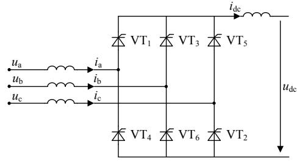  
图16脉动LCC换流器等效电路  
Fig. 1 Equivalent circuit of 6-pulse LCC converter

设 $S_{\mathrm{va}}$ 、 $S_{\mathrm{vb}}$ 、 $S_{\mathrm{vc}}$ 为三相交流电压与直流电压之间的开关函数， $S_{\mathrm{ia}}$ 、 $S_{\mathrm{ib}}$ 、 $S_{\mathrm{ic}}$ 为直流电流与三相交流电流之间的开关函数，则6脉动LCC换流器交直流侧的电压电流变换关系[22]可以表示为

$$
v _ {\mathrm {d c}} = v _ {\mathrm {a}} S _ {\mathrm {v a}} + v _ {\mathrm {b}} S _ {\mathrm {v b}} + v _ {\mathrm {c}} S _ {\mathrm {v c}} \tag {1}
$$

$$
\left\{ \begin{array}{l} i _ {\mathrm {a}} = i _ {\mathrm {d c}} S _ {\mathrm {i a}} \\ i _ {\mathrm {b}} = i _ {\mathrm {d c}} S _ {\mathrm {i b}} \\ i _ {\mathrm {c}} = i _ {\mathrm {d c}} S _ {\mathrm {i c}} \end{array} \right. \tag {2}
$$

其中： $S_{\mathrm{va}}$ 和 $S_{\mathrm{ia}}$ 的波形如图2所示(以晶闸管阀 $\mathrm{VT}_{1}$ 的自然导通点作为时间零点)； $S_{\mathrm{vb}}$ 和 $S_{\mathrm{ib}}$ 、 $S_{\mathrm{vc}}$ 和 $S_{\mathrm{ic}}$ 的波形可以分别由 $S_{\mathrm{va}}$ 和 $S_{\mathrm{ia}}$ 的波形移相 $2\pi /3$ 和 $4\pi /3$ 获得。

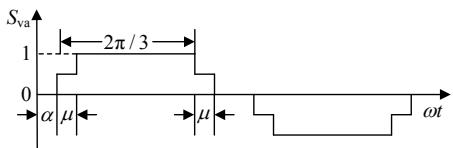  
(a) $S_{\mathrm{va}}$ 波形图

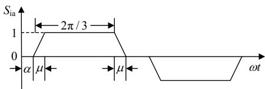  
(b) $S_{\mathrm{ia}}$ 波形图  
图2 开关函数波形  
Fig. 2 Waveform of switch function

对于直流变量，仅考虑其直流分量，对应0阶动态相量；对于交流变量，仅考虑其基频分量，对应一阶动态相量。根据动态相量理论[23]，由式(1)和式(2)可得

$$
U _ {\mathrm {d c}} = \frac {3 \sqrt {3}}{\pi} U \cos \frac {\mu}{2} \cos \left(\alpha + \frac {\mu}{2}\right) \tag {3}
$$

$$
\dot {I} = \frac {2 \sqrt {3}}{\pi} I _ {\mathrm {d c}} \frac {\sin (\mu / 2)}{(\mu / 2)} \mathrm {e} ^ {- \mathrm {j} \left(\frac {\pi}{3} + \alpha + \frac {\mu}{2}\right)} \tag {4}
$$

式中： $U_{\mathrm{dc}}$ 、 $I_{\mathrm{dc}}$ 分别为换流器直流电压、直流电流的动态相量； $U$ 为换流母线交流电压的动态相量的幅值； $\dot{I}$ 为换流母线流入换流器的交流电流的动态相量； $\alpha$ 、 $\mu$ 分别为换流器的触发延迟角和换相重叠角。

其中 $\mu$ 的计算公式为

$$
\mu = - \alpha + \cos^ {- 1} \left(\cos \alpha - \frac {2 X _ {\mathrm {T}} I _ {\mathrm {d c}}}{\sqrt {3} U}\right) \tag {5}
$$

式中 $X_{\mathrm{T}}$ 为换相电抗。基于换流母线a相电压，对 $\dot{I}$ 进行 $dq$ 分解(d轴定位于换流母线a相电压， $q$ 轴超前于 $d$ 轴 $90^{\circ}$ ，可以得到

$$
\left\{ \begin{array}{l} I _ {d} = \frac {2 \sqrt {3}}{\pi} I _ {\mathrm {d c}} \frac {\sin (\mu / 2)}{(\mu / 2)} \cos \left(\alpha + \frac {\mu}{2}\right) \\ I _ {q} = - \frac {2 \sqrt {3}}{\pi} I _ {\mathrm {d c}} \frac {\sin (\mu / 2)}{(\mu / 2)} \sin \left(\alpha + \frac {\mu}{2}\right) \end{array} \right. \tag {6}
$$

其中 $I_{d} 、 I_{q}$ 分别为 $\dot{I}$ 的 $d$ 轴分量和 $q$ 轴分量。式(3)和式(6)即为 6 脉动 LCC 换流器的动态相量模型。

# 1.2 LCC改进动态相量模型

由图2(b)可知，在换相重叠期间，直流电流 $i_{\mathrm{dc}}$ 与换流母线流入换流器的a相交流电流 $i_{\mathrm{a}}$ 之间的开关函数 $S_{\mathrm{ia}}$ 为一条斜率为 $\pm 1 / \mu$ 的直线，这表明在阀导

通/关断的过程中，阀电流的上升/下降是线性的。

然而，在实际换相过程中，伴随着阀的导通/关断，阀电流的上升/下降是按照正弦规律变化的。现有文献对换相过程中阀电流的变化采取线性近似，会在模型中引入误差。分析表明[10]，当换流器运行于正常条件下时 $(\mu \approx 20^{\circ})$ ，动态相量幅值的误差约为 $1\%$ ，同时根据换流器运行于整流状态或逆变状态的不同，动态相量相角也会产生超前误差或滞后误差。

考虑实际换相过程中阀电流的正弦变化规律，可得修正之后的 $i_{\mathrm{dc}}$ 与 $i_{\mathrm{a}}$ 之间的开关函数 $S_{\mathrm{ia}}^{\prime}$ ，其波形如图3所示。从图3可以看出，在换相重叠期间， $S_{\mathrm{ia}}^{\prime}$ 为正弦曲线的一部分，这表明在阀导通/关断的过程中，阀电流是按照正弦规律上升/下降的。下面将根据 $S_{\mathrm{ia}}^{\prime}$ ，推导修正之后的换流母线流入换流器的交流电流的动态相量 $\dot{I}^{\prime}$ 的表达式。

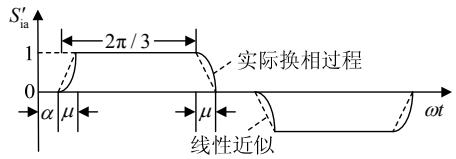  
图3 $S_{\mathrm{in}}^{\prime}$ 波形  
Fig.3 Waveform of $S_{\mathrm{ia}}^{\prime}$

由于 $S_{\mathrm{ia}}^{\prime}$ 的对称性，只考虑 $S_{\mathrm{ia}}^{\prime}$ 曲线的正半周 $(0\leq \omega t\leq \pi)$ 。在曲线的上升沿 $(\alpha \leq \omega t\leq \alpha +\mu)$ ， $S_{\mathrm{ia}}^{\prime}$ 的表达式为

$$
S _ {\mathrm {i a}} ^ {\prime} = \frac {\cos \alpha - \cos \omega t}{\cos \alpha - \cos (\alpha + \mu)} \tag {7}
$$

在曲线的下降沿 $(\alpha + 2\pi / 3 \leq \omega t \leq \alpha + \mu + 2\pi / 3)$ ， $S_{\mathrm{ia}}'$ 的表达式为

$$
S _ {\mathrm {i a}} ^ {\prime} = 1 - \frac {\cos \alpha - \cos (\omega t - 2 \pi / 3)}{\cos \alpha - \cos (\alpha + \mu)} \tag {8}
$$

根据动态相量理论， $\dot{I}^{\prime}$ 的 $d$ 轴分量 $I_{d}^{\prime}$ 的表达式为

$$
\begin{array}{l} I _ {d} ^ {\prime} = \frac {2}{\pi} \int_ {0} ^ {\pi} S _ {\mathrm {i a}} ^ {\prime} \cos (\omega t - \frac {\pi}{3}) \mathrm {d} (\omega t) \cdot I _ {\mathrm {d c}} = \\ \frac {2 \sqrt {3}}{\pi} I _ {\mathrm {d c}} \frac {\cos \alpha + \cos (\alpha + \mu)}{2} \tag {9} \\ \end{array}
$$

同理可得， $\dot{I}^{\prime}$ 的 $q$ 轴分量 $I_{q}^{\prime}$ 的表达式为

$$
\begin{array}{l} I _ {q} ^ {\prime} = - \frac {2}{\pi} \int_ {0} ^ {\pi} S _ {\mathrm {i a}} ^ {\prime} \sin (\omega t - \frac {\pi}{3}) \mathrm {d} (\omega t) \cdot I _ {\mathrm {d c}} = \\ - \frac {2 \sqrt {3}}{\pi} I _ {\mathrm {d c}} \frac {\sin 2 \alpha - \sin 2 (\alpha + \mu) + 2 \mu}{4 [ \cos \alpha - \cos (\alpha + \mu) ]} \tag {10} \\ \end{array}
$$

因此， $\dot{I}^{\prime}$ 的表达式为

$$
\begin{array}{l} \dot {I} ^ {\prime} = \frac {2 \sqrt {3}}{\pi} I _ {\mathrm {d c}} \left(\frac {\cos \alpha + \cos (\alpha + \mu)}{2} - \right. \\ \left. \mathrm {j} \frac {\sin 2 \alpha - \sin 2 (\alpha + \mu) + 2 \mu}{4 [ \cos \alpha - \cos (\alpha + \mu) ]}\right) \tag {11} \\ \end{array}
$$

式(3)、式(9)和式(10)即为6脉动LCC换流器

的改进动态相量模型。

# 2 LCC-HVDC时域线性化模型

本节将根据上一节中推导的6脉动LCC换流器的改进动态相量模型建立典型的单极12脉动LCC-HVDC系统的时域线性化模型，方便起见，所有的修正动态相量在表示时均省略了代表修正的上标“。”。单极12脉动LCC-HVDC系统的结构如图4所示。

图中整流站和逆变站中的换流器均为12脉动LCC换流器，整流站与逆变站之间通过直流输电线路连接，直流输电线路采用T型等效电路， $L_{\mathrm{dcr}}$ 和 $L_{\mathrm{dc}}$ 、 $R_{\mathrm{dcr}}$ 和 $R_{\mathrm{dc}}$ 分别为整流侧和逆变侧的电感、电阻， $C_{\mathrm{dc}}$ 为中点对地电容， $L_{\mathrm{dcr}}$ 和 $L_{\mathrm{dc}}$ 是综合了换流器直流侧平波电抗器和直流输电线路电感的结果。换流器通过换流变压器与交流系统连接， $T_{\mathrm{r}}:1$ 和 $T_{\mathrm{i}}:1$ 分别为整流站换流变压器和逆变站换流变压器的变比。整流侧和逆变侧换流母线均连接有完善的交流滤波器与无功补偿装置，如图中 $F_{\mathrm{r}}$ 、 $F_{\mathrm{i}}$ 所示，以滤除换流器注入交流系统的谐波以及为换流器提供正常运行所需要的无功功率。 $\dot{U}_{\mathrm{sr}}$ 、 $Z_{\mathrm{sr}}$ 和 $\dot{U}_{\mathrm{si}}$ 、 $Z_{\mathrm{si}}$ 分别为整流侧交流系统和逆变侧交流系统的等效电压动态相量和等效阻抗。 $\dot{U}_{\mathrm{r}}$ 为整流侧换流母线电压动态相量， $P_{\mathrm{dcr}}$ 、 $Q_{\mathrm{dcr}}$ 和 $\dot{I}_{\mathrm{r}}$ 为整流侧换流母线流入整流器的有功功率、无功功率和电流动态相量。 $\dot{U}_{\mathrm{i}}$ 为逆变侧换流母线电压动态相量， $P_{\mathrm{dci}}$ 、 $Q_{\mathrm{dci}}$ 和 $\dot{I}_{\mathrm{i}}$ 为逆变器流入逆变侧换流母线的有功功率、无功功率和电流动态相量。 $U_{\mathrm{dcr}}$ 和 $I_{\mathrm{dcr}}$ 为整流侧直流电压和直流电流动态相量， $U_{\mathrm{dci}}$ 和 $I_{\mathrm{dci}}$ 为逆变侧直流电压和直流电流动态相量。整流侧控制为定直流电流控制， $I_{\mathrm{dref}}$ 为其参考值，控制器输出的触发角指令值 $\alpha_{\mathrm{ord}}$ 和锁相环输出的 $\theta_{\mathrm{PLLr}}$ 经触发环节生成整流器延迟触发角 $\alpha$ 。逆变侧控制为定关断角控制， $\gamma_{\mathrm{ref}}$ 为其指令值，控制器输出触发角指令值 $\beta_{\mathrm{ord}}$ 和锁相环输出

相角 $\theta_{\mathrm{PLL_i}}$ 经触发环节生成逆变器超前触发角 $\beta$

# 2.1 LCC时域线性化模型

根据上一节中所推导的6脉动LCC换流器的改进动态相量模型，可以直接写出12脉动LCC换流器的改进动态相量模型。

其中整流器的改进动态相量模型为

$$
U _ {\mathrm {d c r}} = \frac {3 \sqrt {3} N _ {\mathrm {B}}}{\pi T _ {\mathrm {r}}} U _ {\mathrm {r}} \cos \frac {\mu_ {\mathrm {r}}}{2} \cos \left(\alpha + \frac {\mu_ {\mathrm {r}}}{2}\right) \tag {12}
$$

$$
\left\{ \begin{array}{l} I _ {\mathrm {r d}} = \frac {2 \sqrt {3} N _ {\mathrm {B}}}{\pi T _ {\mathrm {r}}} I _ {\mathrm {d c r}} \frac {\cos \alpha + \cos \left(\alpha + \mu_ {\mathrm {r}}\right)}{2} \\ I _ {\mathrm {r q}} = - \frac {2 \sqrt {3} N _ {\mathrm {B}}}{\pi T _ {\mathrm {r}}} I _ {\mathrm {d c r}} \frac {\sin 2 \alpha - \sin 2 \left(\alpha + \mu_ {\mathrm {r}}\right) + 2 \mu_ {\mathrm {r}}}{4 \left[ \cos \alpha - \cos \left(\alpha + \mu_ {\mathrm {r}}\right) \right]} \end{array} \right. \tag {13}
$$

整流器的改进动态相量模型的输入变量为 $[U_{\mathrm{r}}, I_{\mathrm{dcr}}, \alpha]^{\mathrm{T}}$ ，输出变量为 $[U_{\mathrm{dcr}}, I_{\mathrm{rd}}, I_{\mathrm{rq}}]^{\mathrm{T}}$ 。

$\mu_{\mathrm{r}}$ 的计算公式为

$$
\mu_ {\mathrm {r}} = - \alpha + \cos^ {- 1} \left(\cos \alpha - \frac {2 X _ {\mathrm {T r}} I _ {\mathrm {d c r}} T _ {\mathrm {r}}}{\sqrt {3} U _ {\mathrm {r}}}\right) \tag {14}
$$

上述诸式中， $N_{\mathrm{B}} = 2$ 为12脉动LCC换流器中6脉动LCC换流器的级联个数， $U_{\mathrm{r}}$ 为 $\dot{U}_{\mathrm{r}}$ 的幅值， $I_{\mathrm{rd}}$ 和 $I_{\mathrm{rq}}$ 分别为 $\dot{I}_{\mathrm{r}}$ 的 $d$ 轴分量和 $q$ 轴分量， $\mu_{\mathrm{r}}$ 为整流器换相重叠角， $X_{\mathrm{Tr}}$ 为整流侧换相电抗。

同理可得逆变器的改进动态相量模型为

$$
U _ {\mathrm {d c i}} = \frac {3 \sqrt {3} N _ {\mathrm {B}}}{\pi T _ {\mathrm {i}}} U _ {\mathrm {i}} \cos \frac {\mu_ {\mathrm {i}}}{2} \cos \left(\beta - \frac {\mu_ {\mathrm {i}}}{2}\right) \tag {15}
$$

$$
\left\{ \begin{array}{l} I _ {\mathrm {i d}} = \frac {2 \sqrt {3} N _ {\mathrm {B}}}{\pi T _ {\mathrm {i}}} I _ {\mathrm {d c i}} \frac {\cos (\beta - \mu_ {\mathrm {i}}) + \cos \beta}{2} \\ I _ {\mathrm {i q}} = \frac {2 \sqrt {3} N _ {\mathrm {B}}}{\pi T _ {\mathrm {i}}} I _ {\mathrm {d c i}} \frac {\sin 2 (\beta - \mu_ {\mathrm {i}}) - \sin 2 \beta + 2 \mu_ {\mathrm {i}}}{4 [ \cos (\beta - \mu_ {\mathrm {i}}) - \cos \beta ]} \end{array} \right. \tag {16}
$$

$$
\gamma = \beta - \mu_ {\mathrm {i}} \tag {17}
$$

逆变器的改进动态相量模型的输入变量为 $[U_{\mathrm{i}}, I_{\mathrm{dc i}}, \beta]^{\mathrm{T}}$ ，输出变量为 $[U_{\mathrm{dc i}}, I_{\mathrm{id}}, I_{\mathrm{iq}}, \gamma]^{\mathrm{T}}$ 。

$\mu_{\mathrm{i}}$ 的计算公式为

$$
\mu_ {\mathrm {i}} = \beta - \cos^ {- 1} \left(\cos \beta + \frac {2 X _ {\mathrm {T i}} I _ {\mathrm {d c i}} T _ {\mathrm {i}}}{\sqrt {3} U _ {\mathrm {i}}}\right) \tag {18}
$$

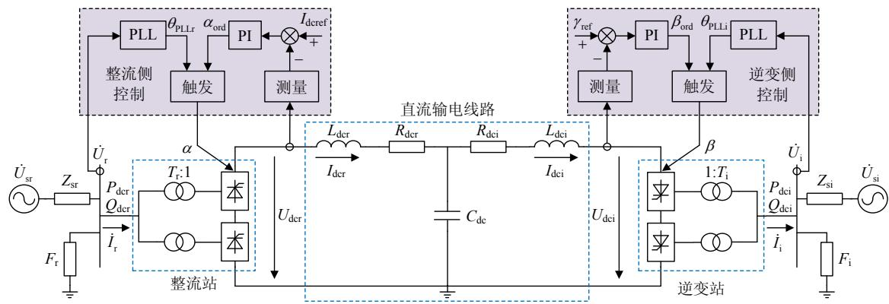  
图4 单极12脉动LCC-HVDC系统结构  
Fig. 4 Structure diagram of unipolar 12-pulse LCC-HVDC system

式中： $U_{\mathrm{i}}$ 为 $\dot{U}_{\mathrm{i}}$ 的幅值； $I_{\mathrm{id}}$ 和 $I_{\mathrm{iq}}$ 分别为 $\dot{I}_{\mathrm{i}}$ 的 $d$ 轴分量和 $q$ 轴分量； $\gamma$ 为逆变器关断角； $\mu_{\mathrm{i}}$ 为逆变器换相重叠角； $X_{\mathrm{Ti}}$ 为逆变侧换相电抗。

对整流器的改进动态相量模型线性化可得整流器的时域线性化模型为

$$
\left[ \begin{array}{l} \Delta U _ {\mathrm {d c r}} \\ \Delta I _ {\mathrm {r d}} \\ \Delta I _ {\mathrm {r q}} \end{array} \right] = \left[ \begin{array}{l l l} K _ {1} ^ {\mathrm {r}} & K _ {2} ^ {\mathrm {r}} & K _ {3} ^ {\mathrm {r}} \\ K _ {4} ^ {\mathrm {r}} & K _ {5} ^ {\mathrm {r}} & K _ {6} ^ {\mathrm {r}} \\ K _ {7} ^ {\mathrm {r}} & K _ {8} ^ {\mathrm {r}} & K _ {9} ^ {\mathrm {r}} \end{array} \right] \left[ \begin{array}{l} \Delta U _ {\mathrm {r}} \\ \Delta I _ {\mathrm {d c r}} \\ \Delta \alpha \end{array} \right] \tag {19}
$$

同理可得逆变器的时域线性化模型为

$$
\left[ \begin{array}{l} \Delta U _ {\mathrm {d c i}} \\ \Delta I _ {\mathrm {i d}} \\ \Delta I _ {\mathrm {i q}} \\ \Delta \gamma \end{array} \right] = \left[ \begin{array}{l l l} K _ {1} ^ {\mathrm {i}} & K _ {2} ^ {\mathrm {i}} & K _ {3} ^ {\mathrm {i}} \\ K _ {4} ^ {\mathrm {i}} & K _ {5} ^ {\mathrm {i}} & K _ {6} ^ {\mathrm {i}} \\ K _ {7} ^ {\mathrm {i}} & K _ {8} ^ {\mathrm {i}} & K _ {9} ^ {\mathrm {i}} \\ K _ {1 0} ^ {\mathrm {i}} & K _ {1 1} ^ {\mathrm {i}} & K _ {1 2} ^ {\mathrm {i}} \end{array} \right] \left[ \begin{array}{l} \Delta U _ {\mathrm {i}} \\ \Delta I _ {\mathrm {d c i}} \\ \Delta \beta \end{array} \right] \tag {20}
$$

其中 $K_{1}^{\mathrm{r}}\sim K_{9}^{\mathrm{r}}$ 和 $K_{1}^{\mathrm{i}}\sim K_{12}^{\mathrm{i}}$ 均为常数。

# 2.2 交流网络时域线性化模型

整流侧交流网络的等效电路如图5所示。整流侧交流网络包含了交流系统、交流滤波器和无功补偿装置。其中交流系统采用戴维宁等效电路、交流滤波器和无功补偿装置的结构与CIGRE直流输电第一标准测试系统[24]中的相同，由C型阻尼滤波器、高通滤波器和固定电容器组成。

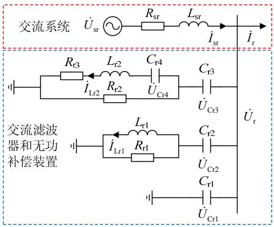  
图5 整流侧交流网络等效电路  
Fig. 5 Equivalent circuit of rectifier-side AC network

整流侧交流网络所有的动态相量均基于交流系统a相等效电压分解，为了与上文中的 $dq$ 分解区别开来，分解得到的直轴分量和交轴分量分别用下标“ $x$ ”和“ $y$ ”表示（ $x$ 轴定位于交流系统a相电压， $y$ 轴超前于 $x$ 轴 $90^{\circ}$ ）。

整流侧交流网络的状态变量 $\mathbf{x}_{\mathrm{acr}} = [I_{\mathrm{srx}}, I_{\mathrm{sry}}, U_{\mathrm{Crlx}}, U_{\mathrm{Cr1y}}, U_{\mathrm{Cr2x}}, U_{\mathrm{Cr2y}}, U_{\mathrm{Cr3x}}, U_{\mathrm{Cr3y}}, U_{\mathrm{Cr4x}}, U_{\mathrm{Cr4y}}, I_{\mathrm{Lrlx}}, I_{\mathrm{Lrly}}, I_{\mathrm{Lr2x}}, I_{\mathrm{Lr2y}}]^{\mathrm{T}}$ ，输入变量 $\mathbf{u}_{\mathrm{acr}} = [I_{\mathrm{rx}}, I_{\mathrm{ry}}]^{\mathrm{T}}$ ，输出变量 $\mathbf{y}_{\mathrm{acr}} = [U_{\mathrm{rx}}, U_{\mathrm{ry}}]^{\mathrm{T}}$ 。整流侧交流网络线性化之后的状态空间方程(时域线性化模型)为

$$
\left\{ \begin{array}{l} \Delta \dot {\boldsymbol {x}} _ {\mathrm {a c r}} = \boldsymbol {A} _ {\mathrm {a c r}} \Delta \boldsymbol {x} _ {\mathrm {a c r}} + \boldsymbol {B} _ {\mathrm {a c r}} \Delta \boldsymbol {u} _ {\mathrm {a c r}} \\ \Delta \boldsymbol {y} _ {\mathrm {a c r}} = \boldsymbol {C} _ {\mathrm {a c r}} \Delta \boldsymbol {x} _ {\mathrm {a c r}} \end{array} \right. \tag {21}
$$

式中 $A_{\mathrm{acr}}$ 、 $B_{\mathrm{acr}}$ 和 $C_{\mathrm{acr}}$ 分别为状态矩阵、输入矩阵和

输出矩阵。

逆变侧交流网络线性化之后的状态空间方程与整流侧类似，只需将式(21)中表示整流侧的下标“r”替换为表示逆变侧的下标“i”即可得到，此处不再赘述。

为了便于跟系统其他部分接口，整流侧交流网络的输出变量 $y_{\mathrm{acr}} = [U_{\mathrm{rx}}, U_{\mathrm{ry}}]^{\mathrm{T}}$ 需要转换成幅值 $U_{\mathrm{r}}$ 和相角 $\theta_{\mathrm{r}}$ 的形式，转换方程如下

$$
\left\{ \begin{array}{l} U _ {\mathrm {r}} = \sqrt {U _ {\mathrm {r x}} ^ {2} + U _ {\mathrm {r y}} ^ {2}} \\ \theta_ {\mathrm {r}} = \tan^ {- 1} \frac {U _ {\mathrm {r y}}}{U _ {\mathrm {r x}}} \end{array} \right. \tag {22}
$$

线性化之后为

$$
\left[ \begin{array}{l} \Delta U _ {\mathrm {r}} \\ \Delta \theta_ {\mathrm {r}} \end{array} \right] = \left[ \begin{array}{l l} \frac {U _ {\mathrm {r x 0}}}{U _ {\mathrm {r 0}}} & \frac {U _ {\mathrm {r y 0}}}{U _ {\mathrm {r 0}}} \\ - \frac {U _ {\mathrm {r y 0}}}{U _ {\mathrm {r 0}} ^ {2}} & \frac {U _ {\mathrm {r x 0}}}{U _ {\mathrm {r 0}} ^ {2}} \end{array} \right] \left[ \begin{array}{l} \Delta U _ {\mathrm {r x}} \\ \Delta U _ {\mathrm {r y}} \end{array} \right] \tag {23}
$$

式中下标“0”代表稳态值。

同时注意到， $\dot{I}_{\mathrm{r}}$ 在整流器模型中采用 $dq$ 坐标系分解，而在整流侧交流网络模型中采用 $xy$ 坐标系分解，二者之间的转换方程[6]为

$$
\left\{ \begin{array}{l} I _ {\mathrm {r x}} = I _ {\mathrm {r d}} \cos \theta_ {\mathrm {r}} - I _ {\mathrm {r q}} \sin \theta_ {\mathrm {r}} \\ I _ {\mathrm {r y}} = I _ {\mathrm {r d}} \sin \theta_ {\mathrm {r}} + I _ {\mathrm {r q}} \cos \theta_ {\mathrm {r}} \end{array} \right. \tag {24}
$$

线性化之后为

$$
\begin{array}{l} \left[ \begin{array}{l} \Delta I _ {\mathrm {r x}} \\ \Delta I _ {\mathrm {r y}} \end{array} \right] = \left[ \begin{array}{l l} \cos \theta_ {\mathrm {r 0}} & - \sin \theta_ {\mathrm {r 0}} \\ \sin \theta_ {\mathrm {r 0}} & \cos \theta_ {\mathrm {r 0}} \end{array} \right] \left[ \begin{array}{l} \Delta I _ {\mathrm {r d}} \\ \Delta I _ {\mathrm {r q}} \end{array} \right] + \\ \left[ \begin{array}{c} - I _ {\mathrm {r d} 0} \sin \theta_ {\mathrm {r} 0} - I _ {\mathrm {r q} 0} \cos \theta_ {\mathrm {r} 0} \\ I _ {\mathrm {r d} 0} \cos \theta_ {\mathrm {r} 0} - I _ {\mathrm {r q} 0} \sin \theta_ {\mathrm {r} 0} \end{array} \right] \Delta \theta_ {\mathrm {r}} \tag {25} \\ \end{array}
$$

# 2.3 直流输电线路时域线性化模型

直流输电线路的等效电路如图6所示。图中，整流侧等效电感 $L_{\mathrm{eqr}} = L_{\mathrm{dcr}} + L_{\mathrm{cr}}$ ，为将整流侧等效换相电感 $L_{\mathrm{cr}}$ 考虑在内的结果，逆变侧等效电感 $L_{\mathrm{eqi}}$ 类似。 $L_{\mathrm{cr}}$ 的计算公式[15]为

$$
L _ {\mathrm {c r}} = N _ {\mathrm {B}} \left(2 - \frac {3 \mu_ {\mathrm {r}}}{2 \pi}\right) L _ {\mathrm {T r}} \tag {26}
$$

式中 $L_{\mathrm{Tr}}$ 为整流侧换相电感。

直流输电线路的状态变量 $\pmb{x}_{\mathrm{dc}} = [U_{\mathrm{dc}},I_{\mathrm{dcr}},I_{\mathrm{dcj}}]^{\mathrm{T}}$ 输入变量 $\pmb{u}_{\mathrm{dc}} = [U_{\mathrm{dcr}},U_{\mathrm{dcj}}]^{\mathrm{T}}$ ，输出变量 $\pmb{y}_{\mathrm{dc}} = [I_{\mathrm{dcr}},I_{\mathrm{dcj}}]^{\mathrm{T}}$ 直流输电线路线性化之后的状态空间方程为

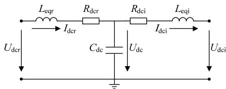  
图6 直流输电线路等效电路  
Fig. 6 Equivalent circuit of DC transmission line

$$
\left\{ \begin{array}{l} \Delta \dot {\mathbf {x}} _ {\mathrm {d c}} = \left[ \begin{array}{c c c} 0 & \frac {1}{C _ {\mathrm {d c}}} & - \frac {1}{C _ {\mathrm {d c}}} \\ - \frac {1}{L _ {\mathrm {e q r}}} & - \frac {R _ {\mathrm {d c r}}}{L _ {\mathrm {e q r}}} & 0 \\ \frac {1}{L _ {\mathrm {e q i}}} & 0 & - \frac {R _ {\mathrm {d c i}}}{L _ {\mathrm {e q i}}} \end{array} \right] \Delta \mathbf {x} _ {\mathrm {d c}} + \left[ \begin{array}{c c} 0 & 0 \\ 1 & 0 \\ 0 & - 1 \end{array} \right] \Delta \mathbf {u} _ {\mathrm {d c}} \\ \Delta \mathbf {y} _ {\mathrm {d c}} = \left[ \begin{array}{c c c} 0 & 1 & 0 \\ 0 & 0 & 1 \end{array} \right] \Delta \mathbf {x} _ {\mathrm {d c}} \end{array} \right. \tag {27}
$$

# 2.4 整流侧控制器时域线性化模型

整流侧控制器的控制框图如图7所示。图中： $I_{\mathrm{dcrm}}$ 为 $I_{\mathrm{dcr}}$ 的测量值； $x_{\mathrm{conr}}$ 为控制器内部状态变量； $G_{\mathrm{mr}}$ 和 $T_{\mathrm{mr}}$ 分别为测量环节的增益和时间常数； $K_{\mathrm{pconr}}$ 和 $K_{\mathrm{iconr}}$ 分别为控制器的比例增益和积分增益。

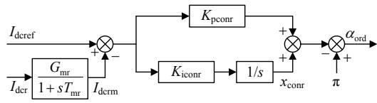  
图7 整流侧控制器示意图  
Fig. 7 Schematic diagram of rectifier-side controller

整流侧控制器的状态变量 $x_{\mathrm{conr}} = [I_{\mathrm{dcrm}}, x_{\mathrm{conn}}]^{\mathrm{T}}$ ，输入变量 $\mathbf{u}_{\mathrm{conr}} = [I_{\mathrm{dcref}}, I_{\mathrm{dcr}}]^{\mathrm{T}}$ ，输出变量 $y_{\mathrm{conn}} = \alpha_{\mathrm{ord}}$ 。整流侧控制器线性化之后的状态空间方程为

$$
\left\{ \begin{array}{l} \Delta \dot {\boldsymbol {x}} _ {\text {c o n r}} = \left[ \begin{array}{l l} - \frac {1}{T _ {\mathrm {m r}}} & 0 \\ - K _ {\text {i c o n r}} & 0 \end{array} \right] \Delta \boldsymbol {x} _ {\text {c o n r}} + \left[ \begin{array}{l l} 0 & \frac {G _ {\mathrm {m r}}}{T _ {\mathrm {m r}}} \\ K _ {\text {i c o n r}} & 0 \end{array} \right] \Delta \boldsymbol {u} _ {\text {c o n r}} \\ \Delta y _ {\text {c o n r}} = \left[ K _ {\text {p c o n r}} - 1 \right] \Delta \boldsymbol {x} _ {\text {c o n r}} + \left[ - K _ {\text {p c o n r}} \quad 0 \right] \Delta \boldsymbol {u} _ {\text {c o n r}} \end{array} \right. \tag {28}
$$

# 2.5 逆变侧控制器时域线性化模型

逆变侧控制器的控制框图如图8所示。图中： $\gamma_{\mathrm{m}}$ 为 $\gamma$ 的测量值； $x_{\mathrm{coni}}$ 为控制器内部状态变量； $G_{\mathrm{mi}}$ 和 $T_{\mathrm{mi}}$ 分别为测量环节的增益和时间常数； $K_{\mathrm{pcori}}$ 和 $K_{\mathrm{iconi}}$ 分别为控制器的比例增益和积分增益。

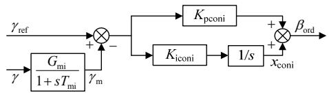  
图8 逆变侧控制器示意图  
Fig. 8 Schematic diagram of inverter-side controller

逆变侧控制器的状态变量 $x_{\mathrm{coni}} = [\gamma_{\mathrm{m}}, x_{\mathrm{coni}}]^{\mathrm{T}}$ ，输入变量 $\boldsymbol{u}_{\mathrm{coni}} = [\gamma_{\mathrm{ref}}, \gamma]^{\mathrm{T}}$ ，输出变量 $y_{\mathrm{coni}} = \beta_{\mathrm{ord}}$ 。逆变侧控制器线性化之后的状态空间方程为

$$
\left\{ \begin{array}{l} \Delta \dot {\boldsymbol {x}} _ {\text {c o n i}} = \left[ \begin{array}{l l} - \frac {1}{T _ {\mathrm {m i}}} & 0 \\ - K _ {\text {i c o n i}} & 0 \end{array} \right] \Delta \boldsymbol {x} _ {\text {c o n i}} + \left[ \begin{array}{l l} 0 & \frac {G _ {\mathrm {m i}}}{T _ {\mathrm {m i}}} \\ K _ {\text {i c o n i}} & 0 \end{array} \right] \Delta \boldsymbol {u} _ {\text {c o n i}} \\ \Delta y _ {\text {c o n i}} = \left[ \begin{array}{l l} - K _ {\text {p c o n i}} & 1 \end{array} \right] \Delta \boldsymbol {x} _ {\text {c o n i}} + \left[ \begin{array}{l l} K _ {\text {p c o n i}} & 0 \end{array} \right] \Delta \boldsymbol {u} _ {\text {c o n i}} \end{array} \right. \tag {29}
$$

# 2.6 PLL时域线性化模型

整流侧PLL的控制框图如图9所示。图中： $x_{\mathrm{PLLr}}$

为PLL 内部状态变量； $K_{\mathrm{pPLLr}}$ 和 $K_{\mathrm{iPLLr}}$ 分别为PLL的比例增益和积分增益。

整流侧PLL的状态变量 $x_{\mathrm{PLLr}} = [x_{\mathrm{PLLr}}, \theta_{\mathrm{PLLr}}]^{\mathrm{T}}$ 输入变量 $u_{\mathrm{PLLr}} = \theta_{\mathrm{r}}$ ，输出变量 $y_{\mathrm{PLLr}} = \theta_{\mathrm{PLLr}}$ 。整流侧PLL线性化之后的状态空间方程为

$$
\left\{ \begin{array}{l} \Delta \dot {\mathbf {x}} _ {\mathrm {P L L r}} = \left[ \begin{array}{c c} 0 & - K _ {\mathrm {i P L L r}} \\ 1 & - K _ {\mathrm {p P L L r}} \end{array} \right] \Delta \mathbf {x} _ {\mathrm {P L L r}} + \left[ \begin{array}{c} K _ {\mathrm {i P L L r}} \\ K _ {\mathrm {p P L L r}} \end{array} \right] \Delta u _ {\mathrm {P L L r}} \\ \Delta y _ {\mathrm {P L L r}} = [ 0 \quad 1 ] \Delta \mathbf {x} _ {\mathrm {P L L r}} \end{array} \right. \tag {30}
$$

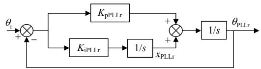  
图9 整流侧PLL示意图  
Fig. 9 Schematic diagram of rectifier-side PLL

逆变侧PLL线性化之后的状态空间方程与整流侧类似，只需将式(30)中表示整流侧的下标“r”替换为表示逆变侧的下标“i”即可得到。此处不再赘述。

整流侧实际滞后触发角 $\alpha$ （超前触发角 $\beta$ 与触发角指令值 $\alpha_{\mathrm{ord}}(\beta_{\mathrm{ord}})$ 、换流母线电压相角 $\theta_{\mathrm{r}}(\theta_{\mathrm{i}})$ 和PLL输出相角 $\theta_{\mathrm{PLL}\mathrm{r}}(\theta_{\mathrm{PLL}\mathrm{i}})$ 之间的关系[16]为

$$
\alpha = \alpha_ {\mathrm {o r d}} + \left(\theta_ {\mathrm {r}} - \theta_ {\mathrm {P L L}, \mathrm {r}}\right) = \alpha_ {\mathrm {o r d}} + \delta_ {\mathrm {r}} \tag {31}
$$

$$
\beta = \beta_ {\mathrm {o r d}} - \left(\theta_ {\mathrm {i}} - \theta_ {\mathrm {P L L} \mathrm {i}}\right) = \beta_ {\mathrm {o r d}} - \delta_ {\mathrm {i}} \tag {32}
$$

线性化之后为

$$
\Delta \alpha = \Delta \alpha_ {\mathrm {o r d}} + \Delta \delta_ {\mathrm {r}} \tag {33}
$$

$$
\Delta \beta = \Delta \beta_ {\mathrm {o r d}} - \Delta \delta_ {\mathrm {i}} \tag {34}
$$

# 2.7 LCC-HVDC时域线性化模型

将组成系统各部分的时域线性化模型连接起来，即可得到单极12脉动LCC-HVDC系统的时域线性化模型，如

$$
\Delta \dot {\boldsymbol {x}} = \boldsymbol {A} \Delta \boldsymbol {x} + \boldsymbol {B} \Delta \boldsymbol {u} \tag {35}
$$

系统的阶数为39阶，系统的状态变量 $\Delta x = [\Delta x_{\mathrm{acr}}^{\mathrm{T}}, \Delta x_{\mathrm{dc}}^{\mathrm{T}}, \Delta x_{\mathrm{aci}}^{\mathrm{T}}, \Delta x_{\mathrm{conr}}^{\mathrm{T}}, \Delta x_{\mathrm{coni}}^{\mathrm{T}}, \Delta x_{\mathrm{PLLr}}^{\mathrm{T}}, \Delta x_{\mathrm{PLLi}}^{\mathrm{T}}]^{\mathrm{T}}$ ，系统的输入变量 $\Delta u = [\Delta I_{\mathrm{dref}}, \Delta \gamma_{\mathrm{ref}}]^{\mathrm{T}}$ 。 $A$ 、 $B$ 分别为系统的状态矩阵和输入矩阵。LCC-HVDC系统的时域线性化模型如图10所示。

# 3 LCC-HVDC时域线性化模型验证

基于上一节中的内容，在MATLAB/Simulink平台上搭建了单极12脉动LCC-HVDC系统的时域线性化模型，同时在PSCAD/EMTDC平台上搭建了相应的电磁暂态模型，对比时域线性化模型的计算结果与电磁暂态模型的时域仿真结果，以验证时域线性化模型的正确性。同时为了体现本文所提的LCC换流器的改进动态相量模型的改进效果，亦基于未改进的动态相量模型在MATLAB/Simulink平

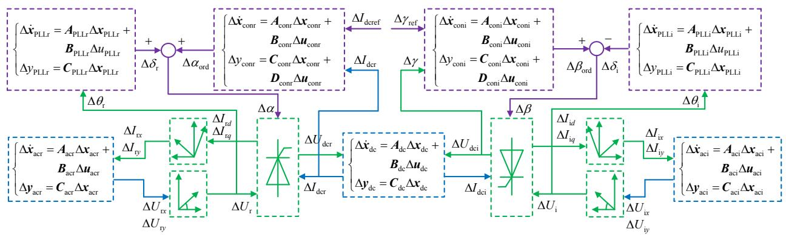  
图10 LCC-HVDC时域线性化模型示意图  
Fig. 10 Schematic diagram of time-domain linearized model of LCC-HVDC system

台上搭建了系统的时域线性化模型。以下将系统的电磁暂态模型简称为EMT，将基于未改进的动态相量模型搭建的系统时域线性化模型简称为SS1，将基于本文所提的改进动态相量模型搭建的系统时域线性化模型简称为SS2。

# 3.1 系统参数

根据CIGRE直流输电第一标准测试系统，可得单极12脉动LCC-HVDC的系统参数如表1所示。篇幅所限，交流滤波器与无功补偿装置的参数未在表中列出。

表 1 LCC-HVDC 系统参数  
Table 1 Parameters of LCC-HVDC system   

<table><tr><td>类别</td><td>参数</td><td>整流侧</td><td>逆变侧</td></tr><tr><td rowspan="4">交流系统</td><td>额定容量/MVA</td><td>1000</td><td>1000</td></tr><tr><td>额定电压/kV</td><td>345</td><td>230</td></tr><tr><td>短路比</td><td>2.5</td><td>2.5</td></tr><tr><td>阻抗角/(°)</td><td>84</td><td>75</td></tr><tr><td rowspan="3">换流变压器</td><td>额定容量/MVA</td><td>598</td><td>598</td></tr><tr><td>变比</td><td>345/211.42</td><td>230/211.42</td></tr><tr><td>短路阻抗/pu</td><td>0.18</td><td>0.18</td></tr><tr><td rowspan="3">换流器</td><td>直流功率/MW</td><td>1010</td><td>990</td></tr><tr><td>直流电压/kV</td><td>505</td><td>495</td></tr><tr><td>直流电流/kA</td><td>2</td><td>2</td></tr><tr><td rowspan="3">直流输电线路</td><td>电阻/Ω</td><td>2.5</td><td>2.5</td></tr><tr><td>电感/H</td><td>0.5968</td><td>0.5968</td></tr><tr><td>电容/μF</td><td colspan="2">26</td></tr><tr><td rowspan="2">PLL</td><td>比例增益</td><td>10</td><td>10</td></tr><tr><td>积分增益</td><td>50</td><td>50</td></tr><tr><td rowspan="2">测量环节</td><td>增益</td><td>0.5</td><td>1</td></tr><tr><td>时间常数/s</td><td>0.0012</td><td>0.01</td></tr><tr><td rowspan="2">控制器</td><td>比例增益</td><td>1.0989</td><td>0.7506</td></tr><tr><td>积分增益</td><td>91.5751</td><td>18.3824</td></tr></table>

# 3.2 模型验证

为了验证时域线性化模型的正确性，设计了2种验证工况。

1) 验证工况 1:0s 时, 系统处于稳定运行状态, 0.5s 时, 整流侧控制器参考值 $I_{\mathrm{dref}}$ 从 1.0pu (2.0kA) 向下阶跃至 0.95pu (1.9kA), 1.5s 时恢复至 1.0pu。  
2) 验证工况 2:0s 时, 系统处于稳定运行状态,

0.5s 时, 逆变侧控制器指令值 $\gamma_{\mathrm{ref}}$ 从 $1.0 \mathrm{pu} (15^{\circ})$ 向下阶跃至 $0.95 \mathrm{pu} (14.25^{\circ})$ , $1.5 \mathrm{~s}$ 时恢复至 $1.0 \mathrm{pu}$ 。

验证工况1的结果如图11所示，验证工况2的结果如图12所示。每种验证工况下均对比了整流侧电流 $I_{\mathrm{dc}}$ 、逆变侧电压 $U_{\mathrm{dc}}$ 、整流侧换流母线电压 $U$ 、逆变侧有功功率 $P_{\mathrm{dc}}$ 这4个电气量的小干扰动态响应。图中蓝色实线代表EMT时域仿真结果，黑色实线代表SS1计算结果，红色虚线代表SS2计算结果。

从图中可以看出，SS2 的计算结果与 EMT 的

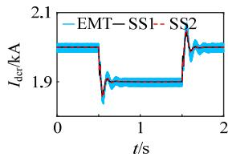  
(a)整流侧直流电流

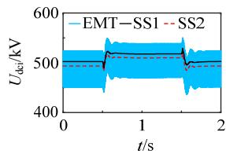  
(b) 逆变侧直流电压

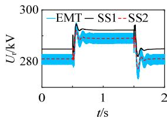  
(c) 整流侧换流母线电压

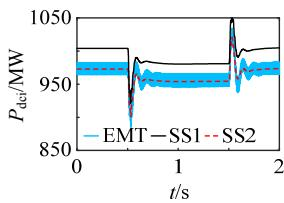  
(d)逆变侧有功功率

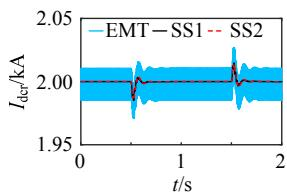  
图11 验证工况1  
Fig. 11 Validation condition 1   
(a) 整流侧直流电流

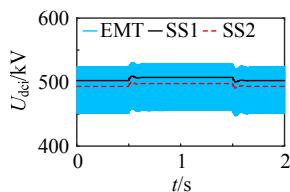  
(b) 逆变侧直流电压

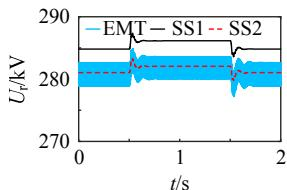  
(c) 整流侧换流母线电压

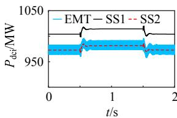  
(d) 逆变侧有功功率   
图12 验证工况2   
Fig. 12 Validation condition 2

时域仿真结果保持了很好的一致性，验证了基于本文所提的LCC换流器的改进动态相量模型搭建的系统时域线性化模型的正确性。由于EMT的时域仿真结果包含所有频率成分，所以较SS2的计算结果有较大的波动，但是其平均值与SS2的计算结果保持一致。

同时可以看出，SS1 的计算结果不能与 EMT 的时域仿真结果很好地保持一致，表明了本文所提的 LCC 换流器的改进动态相量模型有很好的改进效果。

# 4 小干扰稳定性分析

本节将分析整流侧控制器参数、逆变侧控制器参数和PLL参数对系统小干扰稳定性的影响，并对比SS1和SS2分析结果的不同。

# 4.1 整流侧控制器参数对LCC-HVDC系统小干扰稳定性的影响

# 4.1.1 比例增益对系统小干扰稳定性的影响

保持系统其他参数不变，逐渐增大整流侧定电流控制器的比例增益 $K_{\mathrm{pcorr}}$ 从 $0.1 \sim 5.0$ ，步长为 0.1，系统的根轨迹如图 13(a) 和图 13(b) 所示。

对比图 13(a)和图 13(b)可知，基于 SS1 得到的系统的根轨迹和基于 SS2 得到的系统的根轨迹是类似的。随着 $K_{\mathrm{pcorr}}$ 的逐渐增大，系统的主导模式

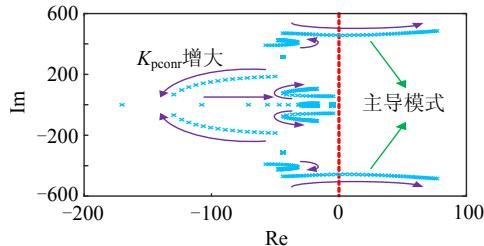

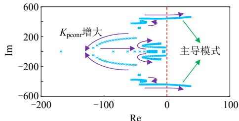  
(a) SS1根轨迹   
(b) SS2根轨迹

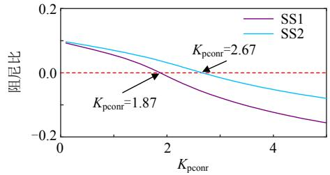  
(c) 系统主导模式的阻尼比  
图13 $K_{\mathrm{pcorr}}$ 变化时特征值分析  
Fig. 13 Eigenvalue analysis with $K_{\mathrm{pcorr}}$ varying

逐渐向虚轴靠近，系统的稳定裕度逐渐下降，小干扰稳定性逐渐减弱，最终系统的主导模式越过虚轴进入右半平面，系统发生小干扰失稳。进一步比较系统主导模式的阻尼比随 $K_{\mathrm{pconr}}$ 的变化情况，如图13(c)所示。

由图可知，随着 $K_{\mathrm{pcorr}}$ 的逐渐增大，基于SS1和基于SS2得到的系统主导模式的阻尼比均逐渐减小，但是二者确定的 $K_{\mathrm{pcorr}}$ 的临界值(对应主导模式的阻尼比由正变负)不相同，SS1确定的 $K_{\mathrm{pcorr}}$ 的临界值为1.87，SS2确定的 $K_{\mathrm{pcorr}}$ 的临界值为2.67。为了确定哪一个临界值更加接近实际值，在EMT中分别令 $K_{\mathrm{pcorr}}$ 从1.1(标准值)跳变至2.6和2.7，系统响应如图14所示。

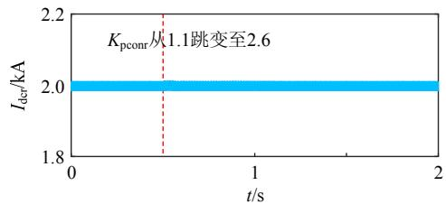

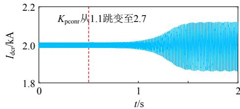  
(a) $K_{\mathrm{pcorr}}$ 从1.1跳变至2.6  
(b) $K_{\mathrm{pcorr}}$ 从1.1跳变至2.7  
图14 $K_{\mathrm{pcorr}}$ 跳变时系统响应  
Fig. 14 System response when $K_{\mathrm{pconr}}$ steps

由图可知，当 $K_{\mathrm{pcorr}}$ 从1.1跳变至2.6时，系统响应曲线没有发散，系统保持稳定，当 $K_{\mathrm{pcorr}}$ 从1.1跳变至2.7时，系统响应曲线发散，系统小干扰失稳。因此，基于SS2确定的 $K_{\mathrm{pcorr}}$ 的临界值是更加接近实际值的。

进一步分析基于SS1和基于SS2得到的系统的振荡频率哪一个更加接近系统的实际振荡频率。在EMT中将 $K_{\mathrm{pconr}}$ 的值设置为3.0，使得系统发生振荡，系统振荡波形如图15所示。

由图15可知，系统的实际振荡频率为 $f = 1 \div 73.31 \times 5 \times 10^{3} \mathrm{Hz} = 68.2 \mathrm{Hz}$ 。而基于SS1和SS2得到的

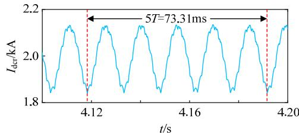  
图15 系统振荡波形  
Fig. 15 Oscillation wave of system

系统的振荡频率分别为 $73.8 \mathrm{~Hz}$ 和 $70.6 \mathrm{~Hz}$ , 可见基于 SS2 得到的系统的振荡频率更加接近系统的实际振荡频率。

# 4.1.2 积分增益对系统小干扰稳定性的影响

保持系统其他参数不变，逐渐增大整流侧定电流控制器的积分增益 $K_{\mathrm{iconr}}$ 从 $10\sim 500$ ，步长为10，系统的根轨迹如图16(a)和图16(b)所示。

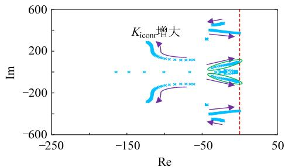

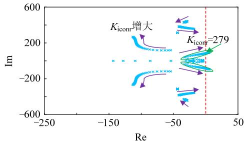  
(a) SS1根轨迹   
(b) SS2根轨迹   
图16 $K_{\mathrm{iconr}}$ 变化时特征值分析  
Fig. 16 Eigenvalue analysis with $K_{\mathrm{iconr}}$ varying

由图16(b)基于SS2得到的系统根轨迹可知，随着 $K_{\mathrm{iconr}}$ 的逐渐增大，系统发生小干扰失稳， $K_{\mathrm{iconr}}$ 的临界值为279。而由图16(a)基于SS1得到的系统根轨迹可知，随着 $K_{\mathrm{iconr}}$ 的逐渐增大，系统始终保持稳定。在EMT中令 $K_{\mathrm{iconr}}$ 从92(标准值)跳变至280，系统响应如图17所示。

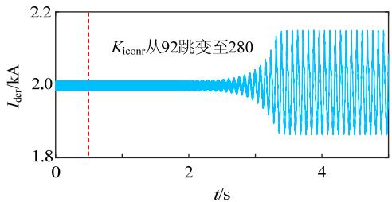  
图17 $K_{\mathrm{iconr}}$ 跳变时系统响应  
Fig. 17 System response when $K_{\mathrm{iconr}}$ steps

由图可知，当 $K_{\mathrm{iconr}}$ 从92跳变至280时，系统响应曲线发散，系统小干扰失稳。可见，基于SS1不能准确预测 $K_{\mathrm{iconr}}$ 增大所导致的系统小干扰失稳现象。

# 4.2 逆变侧控制器参数对LCC-HVDC系统小干扰稳定性的影响

# 4.2.1 比例增益对系统小干扰稳定性的影响

保持系统其他参数不变，逐渐增大逆变侧定关

断角控制器的比例增益 $K_{\mathrm{pconi}}$ 从 $0.1 \sim 5.0$ ，步长为0.1，系统的根轨迹如图18(a)、图18(b)所示。

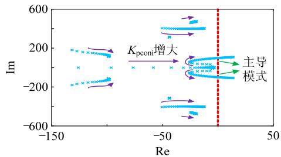

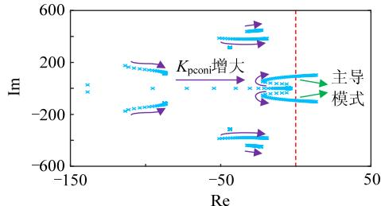  
(a) SS1根轨迹   
(b) SS2根轨迹

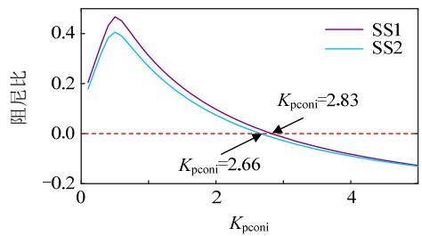  
(c)SS2主导模式的阻尼比  
图18 $K_{\mathrm{pconi}}$ 变化时特征值分析  
Fig. 18 Eigenvalue analysis with $K_{\mathrm{pconi}}$ varying

对比图18(a)和图18(b)可知，基于SS1得到的系统的根轨迹和基于SS2得到的系统的根轨迹类似，随着 $K_{\mathrm{pconi}}$ 的逐渐增大，系统小干扰失稳。进一步比较系统主导模式的阻尼比随 $K_{\mathrm{pconi}}$ 的变化情况，如图18(c)所示。

由图可知，随着 $K_{\mathrm{pconi}}$ 的逐渐增大，SS1和SS2主导模式的阻尼比均先增大后减小，二者确定的 $K_{\mathrm{pconi}}$ 的临界值分别为2.83和2.66。在EMT中令 $K_{\mathrm{pconi}}$ 从0.75跳变至2.6，系统响应如图19所示。

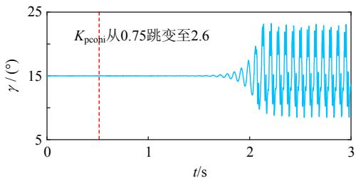  
图19 $K_{\mathrm{pconi}}$ 跳变时系统响应  
Fig. 19 System response with $K_{\mathrm{pconi}}$ steps

由图可知，当 $K_{\mathrm{pconi}}$ 从0.75跳变至2.6时，系统响应曲线发散，系统小干扰失稳。可见，SS1和SS2确定的 $K_{\mathrm{pconi}}$ 的临界值均相对乐观，其中SS2确定的临界值更加接近实际的临界值。

# 4.2.2 积分增益对系统小干扰稳定性的影响

保持系统其他参数不变，逐渐增大逆变侧定关断角控制器的积分增益 $K_{\mathrm{iconi}}$ 从 $10\sim 500$ ，步长为10，系统的根轨迹如图20(a)和图20(b)所示。

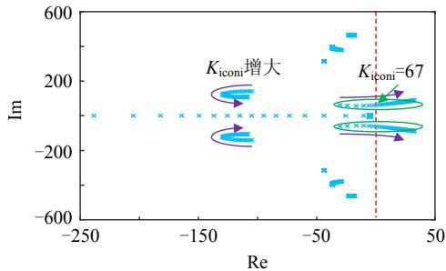  
(a) SS1根轨迹

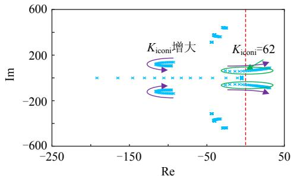  
(b) SS2根轨迹   
图20 $K_{\mathrm{iconi}}$ 变化时特征值分析  
Fig. 20 Eigenvalue analysis with $K_{\mathrm{iconi}}$ varying

对比图20(a)和图20(b)可知，基于SS1得到的系统的根轨迹和基于SS2得到的系统的根轨迹类似，随着 $K_{\mathrm{iconi}}$ 的逐渐增大，系统小干扰失稳。SS1和SS2确定的 $K_{\mathrm{iconi}}$ 的临界值分别为67和62。在EMT中令 $K_{\mathrm{iconi}}$ 从18(标准值)跳变至60，系统响应如图21所示。

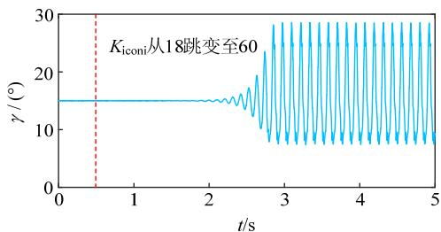  
图21 $K_{\mathrm{iconi}}$ 跳变时系统响应  
Fig. 21 System response with $K_{\mathrm{iconi}}$ steps

由图可知，当 $K_{\mathrm{iconi}}$ 从18跳变至60时，系统响应曲线发散，系统小干扰失稳。可见，SS1和SS2确定的 $K_{\mathrm{pconi}}$ 的临界值均相对乐观，其中SS2确定的临界值更加接近实际的临界值。

# 4.3 PLL参数对LCC-HVDC系统小干扰稳定性的影响

保持系统其他参数不变，分别逐渐增大整流侧PLL的比例增益 $K_{\mathrm{pPLLr}}$ ( $K_{\mathrm{iPLLr}} = 5K_{\mathrm{pPLLr}}$ ) 和逆变侧PLL的比例增益 $K_{\mathrm{pPLLi}}$ ( $K_{\mathrm{iPLLi}} = 5K_{\mathrm{pPLLi}}$ ) 从 $10\sim 1000$ ，步长为10，系统的根轨迹如图22—23所示。

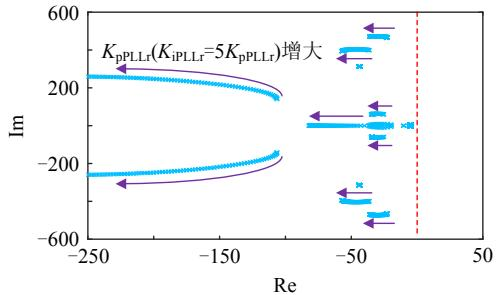  
(a) SS1根轨迹

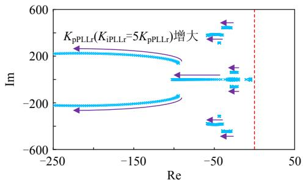  
(b) SS2根轨迹   
图22 $K_{\mathrm{pPLLr}}$ ( $K_{\mathrm{iPLLr}} = 5K_{\mathrm{pPLLr}}$ ) 变化时特征值分析

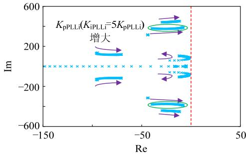  
Fig.22 Eigenvalue analysis with $K_{\mathrm{pPLlr}}$ $(K_{\mathrm{iPLlr}} = 5K_{\mathrm{pPLlr}})$ varying   
(a) SS1根轨迹

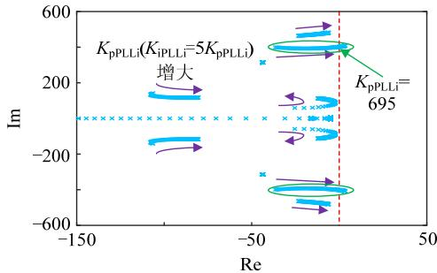  
(b) SS2根轨迹   
图23 $K_{\mathrm{pPLL,i}}(K_{\mathrm{iPLL,i}} = 5K_{\mathrm{pPLL,i}})$ 变化时特征值分析  
Fig.23 Eigenvalue analysis with $K_{\mathrm{pPLLi}}$ $(K_{\mathrm{iPLi}} = 5K_{\mathrm{pPLi}})$ varying

对比图22(a)和图22(b)可知，基于SS1得到的系统的根轨迹和基于SS2得到的系统的根轨迹类似，随着 $K_{\mathrm{pPLr}}$ 的增大，系统的小干扰稳定性逐渐增强。

由图23(b)基于SS2得到的系统根轨迹可知，随着 $K_{\mathrm{pPLi}}$ 的逐渐增大，系统发生小干扰失稳， $K_{\mathrm{pPLi}}$ 的临界值为695。而由图23(a)基于SS1得到的系统根轨迹可知，随着 $K_{\mathrm{pPLi}}$ 的逐渐增大，系统始终保持稳定。在EMT中令 $K_{\mathrm{pPLi}}$ 从10(标准值)

跳变至 700，系统响应如图 24 所示。可见，基于 SS1 不能准确预测 $K_{\mathrm{pPLi}}$ 增大导致的系统小干扰失稳现象。

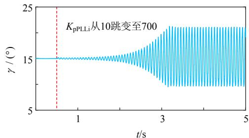  
图24 $K_{\mathrm{pPLLi}}$ 跳变时系统响应  
Fig. 24 System response with $K_{\mathrm{pPLL.i}}$ steps

# 5 结论

本文通过考虑换相过程中阀电流的实际正弦变化规律，提出了一种LCC换流器改进动态相量模型，并基于该模型建立了典型的单极12脉动LCC-HVDC系统的时域线性化模型，然后通过与电磁暂态模型对比验证了时域线性化模型的正确性，最后分析了整流侧控制器参数、逆变侧控制器参数和PLL参数对系统小干扰稳定性的影响。主要结论如下：

1）本文提出的改进动态相量模型相比未改进的动态相量模型，能够更好地吻合电磁暂态模型，具有很好的改进效果。  
2）随着定电流控制器比例增益的增大，系统发生小干扰失稳，本文提出的改进动态相量模型相比未改进的动态相量模型更加接近比例增益的实际值。  
3）随着定电流控制器积分增益的增大，系统发生小干扰失稳，相比本文提出的改进动态相量模型，未改进的动态相量模型不能准确预测积分增益增大导致的系统小干扰失稳现象。  
4）随着定关断角控制器比例增益/积分增益的增大，系统发生小干扰失稳，本文提出的改进动态相量模型和未改进的动态相量模型确定的比例增益/积分增益的临界值均相对乐观，其中改进动态相量模型确定的临界值更加接近实际的临界值。  
5）随着整流侧PLL增益的增大，系统小干扰稳定性增强。随着逆变侧PLL增益的增大，系统发生小干扰失稳，相比本文提出的改进动态相量模型，未改进的动态相量模型不能准确预测逆变侧PLL增益增大导致的系统小干扰失稳现象。

本文提出的LCC换流器改进动态相量模型应用于多馈入LCC-HVDC系统和“同送同受”LCC-HVDC系统进行小干扰稳定性分析有待于进一步的研究。

# 参考文献

[1] 汤广福，庞辉，贺之渊．先进交直流输电技术在中国的发展与应用[J].中国电机工程学报，2016，36(7)：1760-1771. Tang Guangfu，Pang Hui，He Zhiyuan.R&D and application of advanced power transmission technology in China[J].Proceedings of the CSEE，2016，36(7)：1760-1771(in Chinese).  
[2] 杨睿璋，向往，饶宏，等．一种适用于大容量功率馈入和异步电网互联的级联换流阀[J]. 中国电机工程学报，2019，39(17)：5182-5194+5299.  
Yang Ruizhang, Xiang Wang, Rao Hong, et al. A cascaded converter dedicated for large capacity power infeed and asynchronous interconnection[J]. Proceedings of the CSEE, 2019, 39(17): 5182-5194+5299(in Chinese).   
[3] 李明节．大规模特高压交直流混联电网特性分析与运行控制[J].电网技术，2016，40(4)：985-991.  
Li Mingjie. Characteristic analysis and operational control of large-scale hybrid UHV AC/DC power grids[J]. Power System Technology, 2016, 40(4): 985-991(in Chinese).   
[4] 付强，杜文娟，王海风．交直流混联电力系统小干扰稳定性分析综述[J].中国电机工程学报，2018，38(10)：2829-2840.  
Fu Qiang, Du Wenjuan, Wang Haifeng. Small signal stability analysis of AC/DC hybrid power system: an overview[J]. Proceedings of the CSEE, 2018, 38(10): 2829-2840(in Chinese).   
[5] 鲁晓军，林卫星，文劲宇，等．直流电网模块式小信号建模方法[J].中国电机工程学报，2016，36(11)：2880-2889.  
Lu Xiaojun, Lin Weixing, Wen Jinyu, et al. Modularized small signal modelling method for DC grid[J]. Proceedings of the CSEE, 2016, 36(11): 2880-2889(in Chinese).   
[6] 鲁晓军，林卫星，向往，等. 基于模块化多电平换流器的直流电网小信号建模[J]. 中国电机工程学报，2018，38(4)：1143-1156+1292.  
Lu Xiaojun, Lin Weixing, Xiang Wang, et al. Small signal modeling of MMC-based DC grid[J]. Proceedings of the CSEE, 2018, 38(4): 1143-1156+1292(in Chinese).   
[7] Persson E. Calculation of transfer functions in grid-controlled converter systems[J]. Proceedings of the Institution of Electrical Engineers, 1970, 117(5): 989-997.   
[8] Osauskas C, Hume D, Wood A. Small signal frequency domain model of an HVDC converter[J]. IEE Proceedings - Generation, Transmission and Distribution, 2001, 148(6): 573-578.   
[9] Osauskas C, Wood A. Small-signal dynamic modeling of HVDC systems[J]. IEEE Transactions on Power Delivery, 2003, 18(1): 220-225.   
[10] Toledo P, Angquist L, Nee H. Frequency domain model of an HVDC link with a line-commutated current-source converter. Part I: fixed overlap[J]. IET Generation, Transmission & Distribution, 2009, 3(8): 757-770.   
[11] Toledo P, Angquist L, Nee H. Frequency domain model of an HVDC link with a line-commutated current-source converter. Part II: varying overlap[J]. IET Generation, Transmission & Distribution, 2009, 3(8): 771-782.   
[12] Qi Y, Zhao H, Fan S, et al. Small signal frequency-domain model of a LCC-HVDC converter based on an infinite series-converter approach[J]. IEEE Transactions on Power Delivery, 2019, 34(1): 95-106.   
[13] Jovcic D, Pahalawaththa N, Zavahir M. Analytical modelling of HVDC-HVAC systems[J]. IEEE Transactions on Power Delivery, 1999, 14(2): 506-511.   
[14] Jovcic D, Pahalawaththa N, Zavahir M. Small signal analysis of HVDC-HVAC interactions[J]. IEEE Transactions on Power Delivery,

1999，14(2)：525-530.  
[15] Karawita C, Annakkage U D. Multi-infeed HVDC interaction studies using small-signal stability assessment[J]. IEEE Transactions on Power Delivery, 2009, 24(2): 910-918.   
[16] Zhang M, Yuan X. Modeling of LCC HVDC system based on mass-damping-spring concept[C]/IEEE Power and Energy Society General Meeting. Boston, USA, 2016.   
[17] 郭春义，宁琳如，王虹富，等．基于开关函数的LCC-HVDC换流站动态模型及小干扰稳定性[J].电网技术，2017，41(12)：3862-3870.  
Guo Chunyi, Ning Linru, Wang Hongfu, et al. Switching-function based dynamic model of LCC-HVDC station and small signal stability analysis[J]. Power System Technology, 2017, 41(12): 3862-3870(in Chinese).   
[18] Guo C, Zhao C, Iravani R, et al. Impact of phase-locked loop on small-signal dynamics of the line commutated converter-based high-voltage direct-current station[J]. IET Generation, Transmission & Distribution, 2017, 11(5): 1311-1318.   
[19] 王晓辉，陈庆军，张彦涛，等．特高压直流分层接入的稳定性模态分析方法[J]. 电网技术，2018，42(9)：2869-2878. Wang Xiaohui，Chen Qingjun，Zhang Yantao，et al. Modal analysis on system stability of UHVDC hierarchical connection to AC grid[J]. Power System Technology，2018，42(9)：2869-2878(in Chinese).  
[20] 贺杨烊，郑晓冬，郜能灵，等．交直流混联电网LCC-HVDC换流器建模方法综述[J].中国电机工程学报，2019,39(11):3119-3130. He Yangyang，Zheng Xiaodong，Tai Nengling，etal.A review of modeling methods for LCC-HVDC converter in AC/DC hybrid power

grid[J]. Proceedings of the CSEE, 2019, 39(11): 3119-3130(in Chinese).   
[21] 威庆茹，焦连伟，严正，等．高压直流输电动态相量建模与仿真[J].中国电机工程学报，2003，23(12)：31-35.  
Qi Qingru, Jiao Lianwei, Yan Zheng, et al. Modeling and simulation of HVDC with dynamic phasors[J]. Proceedings of the CSEE, 2003, 23(12): 31-35(in Chinese).   
[22] Daryabak M, Filizadeh S, Jatskevich J, et al. Modeling of LCC-HVDC systems using dynamic phasors[J]. IEEE Transactions on Power Delivery, 2014, 29(4): 1989-1998.   
[23] 赵云灏. 高压直流系统动态相量建模与控制策略研究[D]. 北京：华北电力大学，2017.  
[24] Szechtman M, Wess T, Thio C. A benchmark model for HVDC system studies[C]/International Conference on AC and DC Power Transmission. London, UK, 1991.

  
贺永杰

在线出版日期：2020-08-03。

收稿日期：2020-03-30。

作者简介：

贺永杰(1995)，男，硕士研究生，研究方向为直流输电技术，E-mail: yjhe1002@foxmail.com;

向往(1990)，男，博士，通信作者，研究方向为直流输电技术，E-mail: xiangwang1003@foxmail.com。

（责任编辑 王晔）