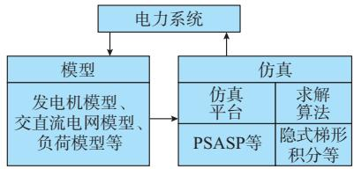
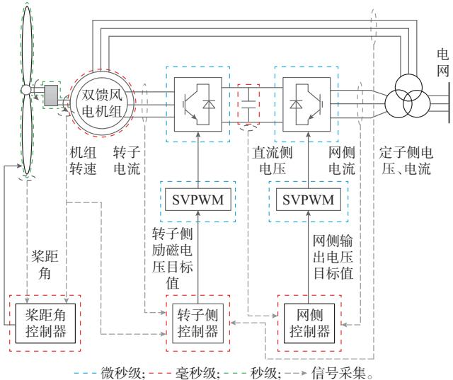
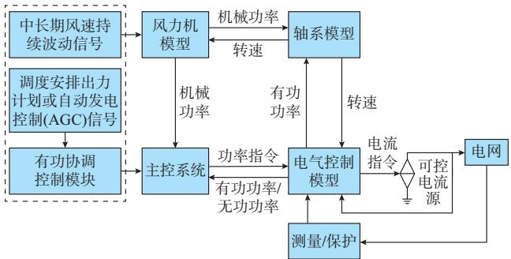
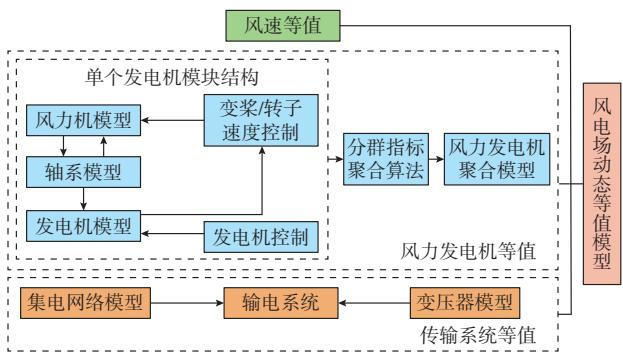
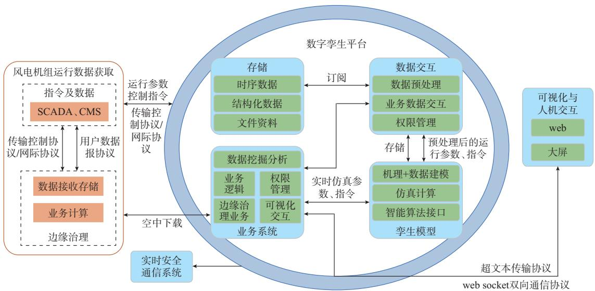

# 电力系统风力发电建模与仿真研究综述

洪国庆1 ，吴国旸2 ，金宇清1 ，谢 欢3 ，鞠 平1 ，梁倍华3

（1. 河海大学电气与动力工程学院，江苏省南京市 211100；2. 中国电力科学研究院有限公司，北京市 100192；

3. 国网冀北电力有限公司电力科学研究院，北京市 100045）

摘要：对于大规模风电并网的电力系统安全稳定分析，构建合适准确的风电场模型至关重要。首先，梳理了现有风电机组的模型结构以及风电场的动态等值，阐述了风力发电系统的参数辨识方法。其次，介绍了电力系统中风力发电系统常用的时域仿真分析技术，主要综述了电磁暂态仿真、机电暂态仿真、中长期动态仿真、机电-电磁暂态混合仿真和数模混合仿真技术。然后，简述了风力发电系统建模与仿真的新进展。最后，分析了电力系统中风力发电系统的建模及其仿真技术面临的挑战与瓶颈，并结合新型电力系统的需求，对其建模与仿真技术进行了展望。

关键词：风力发电；风电场；建模；仿真分析；电磁暂态；机电暂态

# 0 引 言

面向未来新型电力系统的构建需求，中国电力绿色低碳化转型不断加速。中国幅员辽阔、风力资源丰富，风电将成为主体电源之一，是助力实现“碳达峰·碳中和”战略目标的重要一环。截至 2022年底，中国风电装机容量 3 500 GW，占总装机规模的14%；风力发电量800 TW·h，占总发电量的9%［1-3］ 。可以预见，风电在未来将会得到快速发展：中国西部地区大型风电基地建设持续推进、陆上和海上风电举头并进、风电技术将持续创新［3-5］ 。

然而，大规模风电并网将对电力系统产生深刻影响。建立合理准确的风电场仿真模型是研究其动态特性的重要基础，也是提升新型电力系统分析认知能力的关键途径。由于风电场中存在大量的电力电子元件，风电并网系统的动态行为将呈现出多时间尺度特性［6］ 。电力电子元件的动态特性在时间尺度上属于电磁暂态的范畴，而对于风电并网的电力系统模型，其电磁暂态、机电暂态和中长期动态时间尺度深度耦合，动态行为复杂多变。一方面，若仅对其进行机电暂态建模，仿真结果的精确性难以得到保证；另一方面，若建立风电场的全阶电磁暂态模型，并对电力电子元件进行精细化建模，现有的仿真技术难以支撑这种高比例新能源并网的快速仿真计算。此外，现有研究主要关注风电并网系统的暂态

特性，对其中长期动态模型研究较少。电力系统中的风电场在模型精度与仿真速度之间存在矛盾，未来亟须研发电力系统安全稳定仿真分析及其高效运行技术，以满足新型电力系统仿真分析的需求。

目前，电力系统常用的时域仿真分析技术主要包括电磁暂态仿真、机电暂态仿真、中长期动态仿真、机电-电磁暂态混合仿真以及数模混合仿真等［7-8］ 。不同的仿真技术适用于不同的分析场景，不同场景所属的时间尺度有所不同。仿真时模型的繁简程度要与研究对象所属的时间尺度匹配，但是，得到的仿真结果仍有所差异［9-10］ 。当前单一的仿真软件难以兼顾电力电子元件的动态特性和交流电网的精确化模拟，往往需要进行混合仿真，以模拟电力系统中的多时间尺度响应特性［11-12］ 。

本文针对电力系统中风力发电建模与仿真分析的需求，梳理了风力发电系统的模型结构特征及其仿真技术；主要阐述了风力发电系统的模型和参数辨识方法以及常用的 5种时域仿真计算方法；简述了风力发电系统建模与仿真的新发展，分析了大规模风电并网对系统建模与仿真的挑战，并以此展望了未来风力发电建模与仿真的发展方向。

# 1 电力系统中风力发电系统的建模

电力系统中模型与仿真的关系如图1所示。电力系统是研究对象，模型能够反映系统的本质特征，是进行电力系统研究的重要基础。仿真则是利用模型进行模拟实验的方法，需借助仿真平台和数值求解算法对实际电力系统进行模拟，从而揭示电力系

统的动态行为与内在规律［13］ 。

  
图1 电力系统模型与仿真的关系示意图  
Fig. 1 Schematic diagram of relationship between power system model and simulation

作为一个实际系统，风力发电系统可以通过搭建合适的模型并对模型进行模拟实验以达到系统研究分析的目的。本文主要关注电力系统中风力发电的暂态过程，根据不同的研究需求，建立风电机组的电磁暂态模型、机电暂态模型或中长期动态模型。基于单台风电机组的模型，阐述了风电场模型的等值过程，最后给出了模型参数辨识常用的方法。

# 1. 1　风电机组模型

在电磁暂态时间尺度方面，对风电机组内各单元进行精确化的建模即可得到其全阶电磁暂态模型。目前，主流的风电机组包括双馈风电机组和直驱风电机组，以双馈风电机组为例，其结构如图2所示。图中：灰色虚线表示信号采集；蓝色、红色、绿色虚线分别表示不同时间尺度的划分；SVPWM表示空间矢量脉宽调制。

  
图2 双馈风电机组的结构示意图  
Fig. 2 Schematic diagram of structure of doubly-fed wind turbine

双馈风电机组的全阶电磁暂态模型结构主要包括风力机模型、感应发电机模型、轴系模型、变流器模型和控制系统模型等［14-15］ 。直驱风电机组模型与双馈风电机组类似，但有以下区别：1）无增速齿轮箱，传动轴的扭转可以忽略，可将轴系模型等效为单

质量块；2）无需励磁控制，转子由永磁材料构成；3）定子侧直接通过变流器并网，对变流器的容量要求较高，变流器控制与双馈风电机组略有不同。

风电机组的电磁暂态模型适用于研究机组内部的控制技术、变流技术、谐波分析等。当前，对风电机组电磁暂态模型的研究已经比较完善。由国际大电网会议（CIGRE）发布的技术手册详述了风电机组空气动力学、传动系统、发电机和变换器的建模方法，推动了风电机组的建模工作［14］ 。一些研究尝试开发风电机组通用电磁暂态模型，文献［16-17］对建立通用化的风电机组电磁暂态模型具有一定的启发性。文献［18］基于现场实测数据，总结出直驱风电机组的通用故障穿越特性曲线，以此建立了含故障穿越全过程的风电机组通用电磁暂态模型，并将仿真结果与现场实测数据进行对比，验证了模型的正确性与适用性。然而，精细化的风电机组模型具有微秒级的电力电子元件动态过程、毫秒级的电气动态过程和秒级的机械动态过程。仿真时仿真步长较小（如 50 μs）、仿真速度受到限制，难以满足实时性的要求。

在机电暂态时间尺度方面，通过将风电机组电磁暂态模型中时间常数较小、求解费时的元件进行简化处理，以达到模型降阶的目的。风电机组在不同时间尺度下的简化推荐模型如表1所示。

表1 风电机组的简化模型  
Table 1 Simplified model of wind turbines   

<table><tr><td rowspan="2">类型</td><td colspan="3">仿真模型</td></tr><tr><td>电磁暂态</td><td>机电暂态</td><td>中长期动态</td></tr><tr><td>风速</td><td>不考虑</td><td>不考虑</td><td>风速模型</td></tr><tr><td>风力机</td><td rowspan="2">输出机械转矩设为恒定</td><td>代数模型</td><td>代数模型</td></tr><tr><td>轴系系统</td><td>双/单质量块</td><td>单质量块</td></tr><tr><td>发电机</td><td>双馈风电机组计及定转子动态,直驱风电机组计及定子动态</td><td>双馈风电机组只计及转子动态,直驱风电机组可用稳态模型</td><td>稳态模型</td></tr><tr><td>变流器</td><td>详细模型</td><td>只计及电容动态</td><td>稳态模型</td></tr><tr><td>桨距角控制</td><td>不考虑</td><td>变桨控制</td><td>变桨控制</td></tr><tr><td>网侧变流器控制</td><td>详细模型</td><td>详细模型(双馈风电机组可忽略网侧控制器动态)</td><td>稳态模型(保留控制功能)</td></tr><tr><td>机侧变流器控制</td><td>详细模型</td><td>详细模型</td><td>详细模型</td></tr></table>

为提高仿真效率，变流器的平均值模型、开关函数模型及动态相量模型等已被应用于仿真分析中［19］ 。当前，对风电机组机电暂态模型的研究比较完善，美国西部电力协调委员会（WECC）于2009年提出了风电机组第一代通用机电暂态模型［20］。然

而，第一代的通用模型存在一定的缺陷［21］：1）通用模型中类型 1 和 2 的风力机控制模块过于简单；2）难以证明类型 3的风力机适用于大量的控制策略；3）类型4的风力机有功控制模块过于简单，而无功控制模块难以适用于各种无功注入方案。基于此，WECC、国际电工委员会（IEC）和电气与电子工程师协会（IEEE）等机构共同开发了第二代风电机组通用机电暂态模型［22-23］ 。根据 IEC 发布的技术标准，双馈风电机组通用化的机电暂态模型（虚线框以外的部分）见图3。与电磁暂态模型相比，双馈风电机组通用化机电暂态模型的简化主要包括：1）风力机模型，机电暂态的空气动力学模型采用的是线性模型；2）发电机-变流器模型，机电暂态模型将发电机-变流器整体等效为可控电流源，忽略了其电磁动态过程；3）发电机-变流器控制模型，机电暂态模型仅保留了机侧控制器的有功/无功解耦控制，忽略了网侧控制器的动态过程。尽管WECC、IEC等给出了风电机组通用的机电暂态模型，但这些模型本质上是正序模型，难以用于三相不对称故障的仿真研究［24］ 。针对这一问题，文献［25］对通用的机电暂态模型做了部分改进，增强了模型的实用性。此外，WECC和IEC通过与实测数据对比，在一定程度上验证了第二代通用模型的有效性和适用性［26］ 。

  
图3 双馈风电机组模型示意图  
Fig. 3 Schematic diagram of doubly-fed wind turbine model

风电机组的机电暂态模型主要适用于大电网的暂态电压、暂态功角等稳定性分析。此外，风电机组的机电暂态模型忽略了电力电子元件的高频动作过程，在仿真时可以选取更大的仿真步长（如半个周期，即 10 ms），从而能够显著提高其仿真速度。由于做了一定的简化处理，风电机组机电暂态模型的仿真精度有所降低［27］ 。

在中长期动态时间尺度方面，现有对风电机组中长期动态模型的研究较少。文献［28-29］直接忽略了风电机组的中长期动态过程，将其等效为负电阻，以此研究并网风电机组对电网的影响。这一等

效方法不能反映风电机组的长期功率波动特性，在进行中长期动态仿真时误差较大。文献［30-31］则建立了风电机组的准稳态模型，能够在一定程度上反映风电机组有功功率的长期波动特性的影响。文献［32-33］建立了适用于中长期动态仿真的风电机组有功控制模型。文献［32］的模型如图3中虚线框内的部分所示，该模型能够较好地模拟风电机组对AGC指令的响应过程以及长时间风速波动的影响。此外，文献［34］所搭建模型还考虑了无功功率的调节作用，可用于中长期电压稳定性的研究。未来，需进一步研究建立风电机组通用的中长期动态模型，以便分析风电机组中长期动态波动特性的影响以及含风电并网的网源协调配合过程。

# 1. 2　风电场的动态等值模型

现有的风电场模型可以分为详细模型和等值模型［35-36］。风电场详细模型的阶数较高，使用时易出现“维数灾”的问题。随着风电场规模的扩大，使用风电场详细模型进行仿真分析变得愈加困难，甚至会出现仿真不收敛的情况。目前普遍采用风电场动态等值模型进行仿真分析，包括降阶法和聚合法［37］ 。前者基于风电场的数学模型，采用纯数学方法降低模型的阶数，得到风电场的降阶简化模型。文献［38］应用奇异摄动理论将风电场分解为快、慢两部分以实现模型降阶，仿真验证了降阶模型能够与原模型的暂态响应相匹配。文献［39］将分岔分析和选择性模态分析应用到风电场模型降阶中，基于风电场线性化模型，通过保留主导变量实现了模型降阶，仿真发现降阶模型具有较高的精度。文献［40］基于实际风电场模型演示了模型降阶技术的应用效果，对比分析了平衡截断法、基于交替方向隐式的平衡截断法、有理 Krylov算法、迭代有理 Krylov算法和优势极点法的适用性和有效性。然而，由降阶法得到的简化模型的物理意义不明晰，不能反映风电场的实际运行原理，现在已很少被采用。

聚合法基于风电场的详细模型，将风电场整体等值为单台或多台风电机组，从而简化了风电场的规模［36］。这一方法得到的聚合模型结构与单台风电机组的模型近似且物理意义明晰，因而被广泛采用。典型的风电场聚合过程如图 4所示，主要包括风速等值、风力发电机等值以及传输系统等值。当建立风电场等值模型时，需要进行风速的聚合，由于风速和风电功率之间是三次方的关系，普遍采用风速的三次方进行聚合，得到等值风速［41］ 。

对于风力发电机模型，若采用单机等值，则可直接将整个风电场等值为单台风电机组，常用的方法包括单机倍乘法和容量加权法［42-43］ 。单机倍乘法主

  
图4 风电场动态等值流程图  
Fig. 4 Flow chart of wind farm dynamic equivalent

要用于场站内机组型号相同（机组模型结构和参数相同）的场景；容量加权法主要用于机组类型相同（机组模型结构相同、参数可以不同）的场景。当风电场内机组间的运行状态差距较大时，单机等值的仿真精度较低，此时需要进行多机动态等值，通常将风电场等值为 1~4台风电机组［44］。在进行多机等值时，分群指标的选取和聚类算法的选择尤为重要，不同的分群指标及聚类算法将会产生不同的分群结果。常用的指标有机组类型、安装位置、输入风速、表征机组状态的特征量等单一分群指标以及它们组合而成的多分群指标［45-46］ 。常用的聚类算法主要是k-means聚类算法［46］ ，但机组分群结果受k值影响较大。然而，现有的风电场动态等值模型往往只能保证在某一运行点或某一特定环境下具有较高的等值精度，难以兼顾风电场整个动态过程的仿真精度。如何确定简单实用的分群指标和分群数量仍有待进一步研究。

对于传输系统模型，风电场内部各个风电机组经变压器和集电网络联系在一起，将电力传输到公共并网点上。实际应用的风电机组出口电压大都是0.69 kV，需经升压变压器接入 10 kV 或 35 kV 的电网中。通常采用单台风电机组配备单台变压器的形式，也可采用多台机组配备单台变压器的形式。一般用单台变压器表征同群机组内的所有变压器，等值后的变压器数量取决于机组分群的数量。目前，集电网络的拓扑结构主要有干线式和放射式两种连接方式，通常用等值阻抗代替，按照等值前后线路损耗相等或等值前后机组机端电压的相位和幅值不变的原则进行参数计算［47］ 。然而，这两种等值方式均是在稳态情况下进行的，当研究系统动态时必然会产生误差。此外，复杂的线路拓扑是影响集电网络等值模型精度的关键因素。在进行多机等值时，若对任意位置的机组进行聚合，集电网络的等值将变得十分复杂，等值的精度也将有所降低。区别于陆上风电场，海上风电场的集电网络大多由海缆或架

空线和陆缆混合构成，聚合时需要考虑电缆充电电容的影响，这对集电网络的等值精度提出了更高的要求。

此外，当系统内存在多个风电场时，可以用类似单一风电场等值的方法对风电场群进行动态等值，以降低模型阶数。尽管风电场同群机组聚合后的模型是单台风电机组的模型，二者在模型结构上具有相似性，但存在一些差别：当采用容量加权法时，聚合模型的容量是经过单机容量倍乘后的数值，其余大部分标幺值参数（如电气参数、控制器参数等）均保持不变。对于涉及故障穿越动态响应的聚合模块与单台风电机组的模型有所差异：由于风电场发生故障时，场站内不同机组受故障影响程度不同，其故障穿越特性有所差异。风电场聚合模型需综合考虑这一差异，对等值模型的故障穿越部分进行合理聚合［42］ 。当进行参数辨识时，一般将非主导参数用典型参数表示，通过对比风电场实测数据与仿真数据辨识得到主导参数。此外，风电场聚合后的模型还考虑了场站内集电网络、变压器的影响。模型的选取与所研究问题的时间尺度密切相关，应根据研究需要选取合适的仿真模型。

# 1. 3　风力发电系统的参数辨识

准确的模型参数是确保仿真结果正确性的关键之一。在搭建好风电机组不同时间尺度的模型结构后，下一步的工作就是获取准确的模型参数。对于风电机组的参数辨识，主要集中在风电机组本体的电气参数和控制系统的参数两方面［48-49］；对于电气参数的辨识，常用的激励输入方法是一次侧故障；对于控制系统参数的辨识，可以为输入变量叠加伪随机序列或者在参考值处设置阶跃扰动［50］。辨识算法可以分为经典辨识算法和基于人工智能的现代辨识算法。这些辨识算法在风电机组的参数辨识中均有应用，但经典辨识算法对非线性系统的适用性较差，现在往往采用人工智能算法对风力发电系统进行参数辨识。文献［ ］搭建了双馈风电机组转子侧换流器模型，并以二次侧量测信号叠加三相M序列为激励源，采用基于正余弦优化算法的辨识算法实现了对转子侧变流器控制系统参数的辨识。文献［51］建立了永磁直驱风电机组网侧变流器模型，并以一次侧三相短路故障为激励，运用基于寻优算法的参数分步辨识策略实现了对网侧变流器控制系统参数的辨识。文献［52］搭建了双馈风电机组仿真模型，并以三相短路故障为激励，基于轨迹灵敏度证明了风电机组电气参数的可分辨性。利用基于信息共享策略的自适应灰狼算法精确识别了风电机组电气参数，并将仿真结果与实际风电机组输出数据进

行了对比，验证了辨识方法的有效性。

对于风电场等值模型，其等值参数的求取主要分为容量加权和参数辨识两部分。前者的等值参数由机组容量加权求和得到，因操作简单得到了广泛应用。后者基于扰动数据辨识得到的等值参数往往具有较高的精度［53］。文献［54］针对风电场模型采用典型参数进行仿真时会出现过于乐观或悲观的问题，基于同步相量测量单元（PMU）的实际量测数据采用改进的遗传算法辨识得到风电场模型的等效电抗、惯性时间常数、桨距角比例-积分（PI）控制系数等主导参数。文献［55］采用自适应扩展卡尔曼滤波算法对直驱风电场等值模型的电气参数进行辨识，该方法具有良好的收敛性和较高的计算效率。文献［56］根据风电场内部和并网点的 PMU 数据，采用基于启发式算法的三级分层参数辨识方法，识别了含不同类型机组的风电场等值模型的电气参数和控制参数。

# 2 电力系统中风力发电仿真技术

仿真需求促进着模型开发，模型建立服务于仿真分析。风力发电模型主要用于含风电并网的电力系统暂态稳定性分析。目前，含风电场的电力系统的暂态分析方法主要基于传统的电力系统暂态分析技术，即直接法和时域仿真法等［57］。其中，时域仿真法的物理意义明确、仿真结果清晰直观，是验证理论分析的重要手段，因而广泛应用于并网风电影响的研究中。

电力系统常用的时域仿真分析技术主要包括电磁暂态仿真、机电暂态仿真、中长期动态仿真、机电-电磁暂态混合仿真以及数模混合仿真等技术。最初发展起来的电力系统动态模拟仿真技术已难以应用于日益复杂、规模庞大的新型电力系统的仿真分析中。数模混合仿真技术主要用于并网电力电子控制器控制特性的研究。借助数模混合仿真技术，将电力电子元件用实际物理装置表征，电网其余部分则用数字仿真装置模拟，能够有效解决不明机理元件数字仿真建模困难的问题。现在，不依赖于物理仿真技术的全数字仿真技术得到了迅速发展。其中，机电暂态仿真技术在国内的电力系统仿真分析中较为常用，相应的软件已开发得比较完善。机电暂态过程与中长期动态过程互有影响。因此，中长期动态仿真也是研究电网安全稳定的重要分析工具。机电-电磁暂态混合仿真技术主要应用于交直流电网的仿真分析中。面向新型电力系统的仿真分析需求，全电磁暂态仿真技术已成为必需；伴随着先进计算技术的发展和先进理论的提出，仿真分析软件的

计算算力得以增强，全电磁暂态仿真技术将成为可能，是未来精确模拟新型电力系统动态特性的主要技术手段之一。

# 2. 1　电磁暂态仿真技术

电磁暂态仿真技术基于瞬时值，通常采用数值积分方法求解系统中的代数、微分以及偏微分方程组，能够表征基波及更宽频率范围的物理动态过程，可以更为精准地描述电力系统中风力发电系统的动态响应特征。电磁暂态时域仿真分析方法可分为节点分析法和状态变量分析法［58］。前者以电磁暂态仿 真 程 序（EMTP）为 代 表 ，后 者 以 MATLAB/Simulink软件为代表。EMTP一般采用定步长的隐式梯形法进行求解。为解决网络拓扑变化时使用梯形法导致的数值振荡等问题，临界阻尼调整法被用于仿真求解，其在网络拓扑发生变化时采用后向欧拉法代替梯形法［59］。近年来，一些新型积分算法（块广义向后差分法、根匹配技术等）被相继提出并得以应用［60-61］ 。然而，传统的 EMTP 多用于求解确定性系统的动态过程，在求解随机系统动态过程方面具有局限性［62］。文献［63］借助 EMTP实现了利用半隐式后向欧拉法对随机差分方程的求解。文献［64］建立了参数迁移元件的动态伴随电路模型，并提出了适用于随机电磁暂态仿真的数值方法。

随着电力电子元件的增多，新型电力系统的混杂特性凸显，其仿真求解费时等问题突出。为定位电力电子开关的动作时刻，传统上通常采用插值算法，检测到离散切换事件后即可判断事件发生的时间区间，并通过定位电气量的过零时间获得离散事件的发生时刻［65］ 。近些年，文献［66］提出了状态离散和事件驱动的求解框架，以状态离散而非传统的时间离散来触发仿真求解，有效地对连续状态和离散事件进行了协调控制，实现了对含高比例电力电子装备的电力系统的高效求解。这一状态离散事件驱动的仿真方法对提高风力发电系统的电磁暂态仿真效率具有一定意义。

目前，国内外可以用于风电机组电磁暂态仿真的 软 件 主 要 有 PSModel、ADPSS、CloudPSS、DIgSILENT、PSCAD/EMTDC、RTDS、MATLAB等。国产软件PSModel和ADPSS都研发了含有故障穿越的风电机组模型，对变流器进行了精细化的建模。其模型准确、仿真能力强。此外，全电磁暂态仿真软件 CloudPSS 计算高效、云边融合、性能优越，能够较好地适应新型电力系统的仿真需求［67］。当前已有大量文献借助仿真软件搭建了风力发电系统的电磁暂态详细模型，并在此基础上进一步研究分析［68-70］。其中，文献［69］在 MATLAB 中搭建了

双馈风电机组电磁暂态模型，理论分析了控制系统对风电机组故障穿越性能的影响，通过现场试验数据与仿真结果的对比验证了所提控制方案的有效性。文献［70］提出了一种结构保留的风电场动态等值方法，并通过 PSCAD/EMTDC仿真建模和实际风电场数据验证了风电场等值模型的准确性。

除了上述快速定位离散事件的方法外，寻求电力系统的其他电磁暂态快速仿真计算方法也是当前的研究热点。现有的方法通常采用并行计算技术将系统划分成多个子系统，子系统间通过通信技术进行信息交互，最后并行运算得到仿真结果。并行计算技术主要分为基于子网解耦的并行算法和基于延迟插入法的细粒度并行算法［71］。针对风电机组快速电磁暂态仿真计算模型，既可以从原理入手对风电机组结构进行优化建模，也可以通过改进求解算法来加快模型仿真速度，还可以挖掘高性能计算机设备的计算能力，实现其快速电磁暂态仿真计算。文献［72-73］均从风电机组模型本身出发，在满足精度的前提下对模型进行了简化降阶处理，提高了仿真速度。但受仿真精度的限制，模型的简化程度以及仿真速度的提升有限。文献［74-75］则通过子网解耦、移频变换等先进算法提高了风电场的电磁暂态仿真速度。先进的并行算法离不开高性能计算设备的协助，文献［76］充分调动众核图形处理器（GPU）、现场可编程门阵列（FPGA）等硬件资源，实现了风电场的快速电磁暂态仿真计算。

除了上述快速电磁暂态仿真方法外，如果考虑到风电场的多时间尺度特性，将电力系统中的风电场进行子网解耦后，不同的子网采用不同的仿真步长，实现多速率并行仿真计算，也能够提高风电场的仿真速度。现在研究较多、应用较广的是机电-电磁暂态混合仿真技术，这本质上是对含风电场的电力系统模型仿真精度与仿真速度的平衡。

# 2. 2　机电暂态仿真技术

相较于电磁暂态仿真技术，机电暂态仿真技术则基于基频正弦，系统用基波相量表征，适用于毫秒级步长的交流电网的基频特性仿真。其主要通过联立求解电力系统的微分、代数方程组进而得到相应的时域解。其中，求解微分方程组常用的数值积分算法有隐式梯形积分法、Runge-Kutta法等；求解代数方程组的方法主要是牛顿法。根据系统微分、代数方程的求解顺序，可分为联立求解和交替求解两种方案［77］。前者将微分方程离散化处理后同代数方程一起求解，通常采用牛顿法进行求解；后者先用隐式梯形积分等数值算法求解微分方程，而后将结果代入代数方程并求解。此外，已有文献探讨了适

用于机电暂态仿真的并行算法以及用于随机机电暂态仿真的数值求解算法［77-78］ 。

如前文所述，国内外的研究机构对风电机组的通用化机电暂态模型展开了大量研究，且相关成果已在实际仿真中得到了应用。目前，国内外可以用于风电机组机电暂态仿真的软件主要有 PSD-ST、PSASP、PSS/E 等。其中，国内广泛使用的 PSD-ST软件提供了 GE风电机组模型以及含故障穿越的双馈风电机组和直驱风电机组模型［79］ ；而PSASP软件则开发了通用的8型风电机组模型，10、11型风电机组模型以及含故障穿越的12、13型风电机组模型等［80］。PSD-ST 和 PSASP 这两种软件通常采用隐式梯形积分数值算法进行解算，且涵盖了国内多个制造商的风电机组模型，通用性较好、风电机组模型准确度高、数值求解稳定性强。由于 PSD-ST和PSASP软件在开发第二套风电机组模型时，部分模型未统一，导致同一场景下计算结果可能会出现不一致的情况。为了实现PSD-ST、PSASP软件中的风电机组模型统一结构、统一参数、统一接口，由此开发了第三套风电机组模型。第三套风电机组模型对两种软件的风电机组模型进行了统一，在计算过程中能够相互验证。目前，该风电机组模型已经获得应用，将向全国推广应用。在建立风电场模型时，PSD-ST 和 PSASP这两种软件均采用单机倍乘的方式进行等值建模，能够较好地反映故障下风电机组基频正序特性，适用于电力系统中风电场的基本暂态稳定分析的研究。目前已有大量文献借助仿真软件搭建了风力发电系统的机电暂态模型：文献［57］提出了一种考虑转子动力学的双馈风电机组简化模型，借助PSS/E软件搭建并验证了该模型与软件自带模型相比，在暂态稳定性研究中具有更高的精度；文献［81］理论分析了风电场经特高压直流送出系统对电网的影响，并在 PSD-ST软件中搭建了实际电网的风电场及特高压直流系统模型进行理论验证。

随着新型电力系统的形成，并网风电场以及含风电场的直流送端电网规模不断扩大，这些系统的动态响应受其内部大量电力电子元件开关动作和快速控制保护逻辑的影响，机电暂态仿真难以准确表征，此时需要考虑更为详实的电磁暂态仿真技术，以在更小的时间尺度上研究电力电子元件的动态特性［82］ 。

# 2. 3　机电-电磁暂态混合仿真技术

机电-电磁暂态混合仿真技术的基本思想是将电力系统根据研究需求分为机电暂态子系统和电磁暂态子系统，二者借助仿真接口技术实现系统状态

的信息交互［12］。网络通常的划分方法以及两类子系统的区别如表 2所示。其中，电磁暂态子系统主要由柔性交流输电装置、直流系统以及风电场等各类电力电子系统组成，以便对系统内部电力电子元件的高频动作响应进行精准化模拟。接口模型、求解算法、位置选择是机电-电磁暂态混合仿真的关键。

表2 机电-电磁暂态混合仿真中子系统的区别 Table 2 Differences between subsystems in electromechanical-electromagnetic transient hybrid simulation   

<table><tr><td>类型</td><td>电磁暂态子系统</td><td>机电暂态子系统</td></tr><tr><td>电网模型</td><td>abc三相、瞬时值模型</td><td>相量模型,用负序、零序表示不对称情况</td></tr><tr><td>电网划分</td><td>换流器、直流输电系统、柔性交流输电系统、风电机组等</td><td>发电机、变压器、交流网络、负荷等</td></tr><tr><td>等值模型</td><td>诺顿等值、功率源、电流源</td><td>戴维南等值</td></tr><tr><td>仿真步长</td><td>微秒级</td><td>毫秒级</td></tr><tr><td>数值算法</td><td>隐式梯形积分法,状态空间解算法等</td><td>隐式梯形积分法、吉尔法等</td></tr></table>

目前，普遍采用的接口模型是在电磁侧仿真时，对机电暂态子系统进行戴维南等值；在机电侧仿真时，对电磁暂态子系统进行诺顿等值或等值为功率源和电流源模型。接口交互时序主要分为串行和并行。前者在仿真时机电和电磁子系统求解需相互等待，因而仿真效率低，但仿真精度高；后者在仿真时机电和电磁子系统同时进行求解，但在电磁侧仿真求解时，机电子系统等值模型的数据信息存在一个机电暂态步长的延时，计算结果存在误差，仿真精度受限［83］ 。在接口位置选择方面，目前主要分为交直分网和交交分网。前者将接口位置选为换流器的交流母线处，此时子系统间的等值较为简单，但当电网发生非对称故障时，仿真结果将产生较大误差［84］。后者将接口位置延伸至交流系统内部，有效减缓了接口处的波形畸变程度，但增加了复杂性［85］ 。而机电暂态子系统并未考虑电磁部分的非基波因素，故机电-电磁暂态混合仿真技术不能取代电磁暂态仿真技术。

在对电力系统进行机电-电磁暂态混合仿真分析 时 ，常 用 的 仿 真 分 析 软 件 主 要 有 ADPSS、PSModel、RTDS等。目前，机电-电磁暂态混合仿真分析主要应用于交直流大电网中，针对风电场的分析研究较少。文献［86］在 PSModel平台上搭建了基于双馈风电机组的风电场电磁暂态模型，风电场侧进行电磁暂态计算时将电网侧进行戴维南等值，电网侧进行机电暂态计算时将风电场侧等值为

电流源，由此实现了风电场的混合仿真计算。文献［87］将中国吉林省电网作为机电暂态主网，大岗子风电场作为电磁暂态网络，利用 ADPSS软件研究了大规模风电并网对继电保护的影响，仿真过程兼顾了仿真规模和仿真速度。因含风电场的电力系统本身具有多时间尺度特性，机电-电磁暂态混合仿真技术可将电网在空间上进行子网划分，有助于并网风电场的快速仿真分析。未来，需重点研究该混合仿真技术在风电场仿真中的应用，以实现风电场的高效率、高精度仿真。

# 2. 4　中长期动态仿真技术

同机电暂态仿真技术一样，中长期动态仿真技术基于基波正弦，需要采用数值算法求解微分代数方程组得到系统的时域解，仿真步长通常在毫秒级与秒级之间［88］ 。由于电力系统为典型的刚性系统，一般采用隐式积分算法进行求解。为加快仿真速度，仿真软件常采用自动变步长的算法，如 Gear算法、隐式Runge-Kutta算法以及组合算法。

国内外常用的中长期动态仿真软件主要有PSD-FDS、EUROSTAG 和 SIMPOW 等。其中，国内软件PSD-FDS采用的是隐式梯形积分法和Gear法的组合数值算法。其风电机组模型考虑了风速的长时间变化特性，具备AGC、自动电压控制（AVC）等场站级控制，可以有效模拟风电机组的中长期动态特性。目前，中长期动态仿真技术在风电机组的应用案例较少，文献［89］在 PSD-FDS 软件中搭建了风电机组的全过程动态仿真模型，能够反映风速中长期波动特性的影响和风电机组的有功控制过程。面向新型电力系统需求，需进一步研究风电机组中长期动态过程与电网的交互影响，重点关注风电机组参与系统调峰、调频的潜力，促进风电成为传统煤电的安全可靠替代。

# 2. 5　数模混合仿真技术

数模混合仿真技术又称为硬件在环技术，是用数字仿真装置和物理仿真装置共同模拟电力系统，并借助相应的软硬件接口实现二者的联合仿真［90］ 。接口算法是数模混合仿真的关键，其主要思想是基于电路替代原理，将数字侧和物理侧进行等效处理，如理想变压器模型、阻尼阻抗法、时变一阶线性近似法等［91］ 。为确保数模混合仿真的实时性，需采用模型解耦和并行计算等方法提高仿真效率。由于数模混合仿真技术可以进行全过程实时仿真研究，在研究交直流电网的运行特性、电力电子元件的控制特性、新能源并网的影响特性方面具有广泛的适用性。目前，数模混合仿真技术常用的全数字实时仿 真 系 统 主 要 有 ADPSS、HYPERSIM、RTDS、

ARENE 和 RT-LAB 等。

数模混合仿真技术在交直流输配电系统仿真中得到了普遍应用，但随着新能源渗透率的增加，其应用范围也变得更加广泛。文献［92］借助 RTDS实现了对风电机组的信号型数模混合仿真，其中，变流器控制系统由实际硬件平台和控制软件构成，风电机组的其余部分在RTDS平台中搭建，适用于风电机组控制器的测试整定。但这种信号型数模混合仿真的物理系统不能外挂一次设备，只能用于二次设备的研究与测试。而功率型数模混合仿真的物理系统与数字系统直接在一次回路连接，能够充分发挥二者的优势。文献［93］基于 RT-LAB平台进行了风电并网功率型数模混合仿真，其中，双馈风电机组整体为实际的物理设备，电网部分在RT-LAB平台搭建，仿真观测了风电与电网的相互影响特性。文献［94］提出了改善风电机组功率硬件在环仿真平台的稳定性与精度的方法，采用相位补偿降低了滤波器的时延影响，并通过对风电机组惯性控制的仿真验证了方法的有效性与可行性。

上述5种常用的时域仿真分析技术大都采用单一的仿真平台实现对风电场的模拟分析。然而，单一的仿真平台不免存在局限性，若能在仿真时联合多个平台，将充分发挥各平台的优势，实现电力系统中风电场的跨平台/多平台的高效仿真分析。风电场跨平台/多平台的联合仿真主要包括两个方面：一是基于多平台建立风电场各单元的详细模型，实现对风电场模型更为精细化的建模，以此研究风电场本身的控制策略和运行性能等；二是基于多平台对风电场和电网分别进行建模，用于研究风电并网的影响。目前，前者研究较多，后者研究较少，需要深入挖掘各平台特征，创新处理接口交互技术，实现风电并网多平台联合仿真的推广应用。文献［95］基于RT-LAB 和 FAST 平台建立了风电场的精细化模型，利用RT-LAB平台搭建了风电机组电气部分和变流器控制系统模型，利用FAST平台搭建了风电机组的机械部分，二者联合仿真，提高了仿真精度。文献［96］根据各仿真平台特点，在RT-LAB平台中搭建了风电场模型，在 HYPERSIM 平台中搭建了交直流电网模型，并应用改进的输电线路接口算法进行二者的交互，实现了风电并网的联合仿真。

综上，随着电力系统仿真技术的演变更新，风电场的仿真分析手段更加多样、仿真规模更加庞大、仿真模型更加精细、仿真效率更加快速。各仿真技术有各自的特色，适用于不同的分析场景，实际应用中应充分挖掘各仿真技术的优势，并根据研究需求加以选用。

# 3 风力发电系统建模与仿真新发展

新技术的发展为风力发电系统的建模与仿真注入了新鲜活力。GPU、FPGA 等新型计算芯片的计算能力不断被挖掘。基于 CPU、GPU 和 FPGA 等异构众核处理器的仿真并行算法有效提高了风电场的仿真效率。运用云计算和边缘计算可以对数据进行高效处理，实现数据挖掘的实时性。借助智能传感、5G等技术，可以对风电场运行状态数据进行低延时的精细化采样与高效可靠传输，增强对风电场全状态运行信息的广域智能感知能力。结合大数据分析与人工智能，构建风电场数字化智能化平台，通过对场站测风塔数据、气象数据、机组运行数据等海量数据的计算分析，可以实现风电功率预测、状态监测、故障诊断、风资源评估及微观选址等功能，以此助力风电场智能运营与管理。

近年来，数字孪生技术备受关注并逐步被应用于各个领域。数字孪生通过数字化的方式对物理实体构建相应的动态虚拟模型，以此仿真物理实体在真实环境中全生命周期的属性与行为，可以实现物理空间和信息空间的无缝集成与实时映射［97］。不同于以往基于机理模型对电力系统进行建模，数字孪生技术更侧重于构建机理与数据的融合驱动模型，从而可以构建更为精准的仿真模型。文献［98］构建了风电机组的数字孪生系统，实现了实际风电机组与数字孪生模型的实时映射与精确模拟，该文献所提的风电机组数字孪生系统整体构架如图5所示。该系统主要包括风电机组运行数据获取、数字孪生平台和可视化与人机交互三部分。数字孪生平台是整个系统的核心，其通过数据采集与监控（SCADA）系统和状态监测系统（CMS）实时获取风电机组的关键运行参数，实现对风电机组运行状态的全面实时感知。其中，存储系统主要存储获得的风电机组运行数据；数据交互系统可以对存储系统中的源数据进行预处理，并负责存储系统、业务系统和孪生模型间的数据交换；业务系统根据应用需求实现机组状态检测、故障预警等功能；孪生模型采用机理分析与数据修正的方法进行构建。

对于风电机组的数字孪生模型，文献［98］首先对机组关键部件进行了建模，包括基于叶素动量理论的叶片机理模型、基于有限元分析的塔筒机理模型、双质块传动系统模型以及闭环控制系统。通过对机理模型和控制系统的修正，实现模型的验证与数据的修正。首先，对风电机组本体模型进行修正：先利用制造商给定的参数建立风电机组的机理模型，之后应用频率响应法对模型输出进行处理，通过

  
图5 风电机组的数字孪生系统  
Fig. 5 Digital twins system of wind turbine

比较理论与所搭建模型的响应特性，对有限元模型进行参数修正。其次，对控制系统进行修正：基于修正后的本体模型，加入控制器构成风电机组闭环控制系统。以实际量测数据为输入，对风电机组数字孪生系统的全工况进行闭环仿真，得到风电机组关键参数的动态特性。通过与实际运行数据的比较，对控制系统的结构和参数进行迭代修正。

借助该风电机组数字孪生平台，风电机组的运行状态等数据通过传输控制协议/网际协议（TCP/IP）等协议传输到存储系统，风电机组数字孪生模型通过数据治理模块实时订阅预处理后的实时运行数据，以此实现与实际风电机组的同步仿真。

# 4 风力发电系统建模与仿真的挑战与展望

风电场内包含了大量的电力电子元件，是一个多时间尺度、多动态耦合、多时空交互、离散与连续交织的复杂系统。深入研究风电场错综复杂的机理特性，建立风电场高效精准的模型结构，创新风电场普遍适用的仿真技术，研发风电场友好交互的仿真平台是未来风电场建模与仿真的重中之重。

# 4. 1　风力发电系统建模与仿真的挑战

风力发电系统的模型精度与仿真技术的发展紧密相连。虽然已经利用各种仿真技术模拟风电场的动态行为特性，但当前的仿真技术水平仍难以满足风电场精确高效的仿真需求。风力发电系统的建模与仿真仍然面临着新的挑战与诸多瓶颈，主要包括以下3点：

1）风力发电系统模型难以普遍适用、整体统一。风力发电系统模型在系统运行调度、规划设计和科研学习等方面具有重要应用，其仿真模型共享

与开放的需求激增。然而，因制造商知识产权和保密等原因，风力发电系统模型的通用性较差。此外，未来新型电力系统的随机性、不确定性增加，系统的运行场景更加复杂多变，对风电场建模提出了更高的要求。为便于未来海量场景下风电场模型的高效搭建及其精确仿真分析，如何有效建立既具有通用性，又能将其电磁暂态特性、机电暂态特性和中长期动态特性统一的风电场模型具有挑战性。

2）仿真规模、仿真精度和仿真速度相互制约，矛盾加剧。风力发电系统的动态时间尺度涵盖了从电力电子开关瞬态的微秒级暂态过程到原动机的秒级动态过程，是典型的刚性系统。此外，离散的电力电子开关事件与连续变化的电磁量相互作用，使其混杂特性凸显。风力发电系统这一多时间尺度混杂特性对电力系统的仿真分析提出更高的要求。随着新型电力系统建设的不断推进，风电场数量急剧扩大，现有的仿真技术难以满足大规模风电场的精准快速仿真需求。  
3）风电场仿真分析技术存在不足。长期以来，风电场各仿真技术间相互独立，各仿真软件间数据对接困难，机电、电磁仿真数据不能高效转换。各仿真软件中风电场模型库储备不完善，部分模型参数准确度不高，部分平台操作复杂、使用困难。更为精细化的风电场模型往往需要多平台联合仿真，各平台接口技术有待进一步提高。现有仿真平台难以智能自动构建风电场的各类运行场景及故障场景。各仿真平台主要适用于某一时间尺度的仿真分析，难以满足含风电场的电力系统的多时间尺度、全时域动态仿真需求。

# 4. 2　风力发电系统建模与仿真的展望

针对风力发电系统建模与仿真面临的新挑战、新需求，需要开展具有精确性、统一性、适用性的风电建模研究，探索面向新型电力系统的先进高效安全仿真新技术，研发适用于海量场景下风力发电系统多时间尺度仿真平台，协调平衡风力发电系统模型规模、模型精度、仿真速度间的矛盾。为此，提出以下几点不成熟的建议供研讨参考。

1）不同风电机组分类统一建模，参数实测建库。风电机组多种多样，如果针对不同风电机组建立不同模型，无法实际应用。风电机组大体上可以分为动力部分、发电机部分、控制器部分和变流器部分。对于动力部分，现有模型基本上是统一的；对于发电机部分也只需要分为两三类；对于控制器部分，可以参考汽轮机和水轮机分为数类；对于变流器部分，也可以统一为少数几类。对于每一类，建立统一等效模型，选择典型机组实测参数，建立模型参数数据库，供仿真时选用。  
2）探索多时间尺度混杂系统仿真新技术。由于仿真需求和研究关注的时间尺度的不同，全部采用精细化模型应用于所有场景，计算任务巨大而且也无必要。进行单一时间尺度仿真分析时，往往根据所研究的动态过程对应的时间尺度，可对其他动态行为进行适当简化降阶。但当对风力发电系统进行全过程动态仿真或更为精确化模拟时，需要兼顾多时间尺度仿真的高效性与准确性。此外，风力发电系统是典型的混杂系统，传统的数值算法、仿真技术难以满足仿真精度与效率的要求，亟须探索混杂系统仿真新技术。  
3）提高风电场仿真计算效率，加快发展快速仿真计算技术。从数值计算上优化现有数值积分算法，深入研究混杂系统机理特性，寻求适用于求解含高比例电力电子装备的电力系统的新型数值算法。持续推进分网解耦、元件解耦的并行计算技术创新，提高通信效率与并行度，实施风电场大小步长混合仿真和大步长仿真分析，提升风电场高效率并行计算算力。基于新型计算设备进行异构联合计算，实现风电场的细粒度并行计算、全电磁暂态多速率仿真分析。  
4）促进风电场仿真分析技术的协同发展，实现不同仿真平台互通。各类仿真技术、仿真平台具有不同的适用场景，需明确各类仿真技术的优点，实现仿真平台间的优势互补。未来，需加强对 5种仿真技术的比较研究，确保各平台仿真结果可相互验证，并重点研究同一模型在不同仿真平台上参数、接口

的统一与兼容。此外，单一的仿真平台难以满足风电场多样性仿真需求，亟须构建适用于多时间尺度混杂系统仿真需求的用户友好型平台，重点提升仿真平台快速构建复杂算例的能力。

# 5 结语

随着风电场接入电力系统中的容量越来越大，对大规模并网风电场进行精细化建模以及高效仿真分析是研究其动态特性的重要基础。本文总结了当前常用的风电场仿真模型、参数辨识、动态等值方法以及适用于风电场的时域仿真分析技术。风力发电系统的模型应进行规范化、标准化建模，重视仿真模型的开放共享，提高风电机组模型的通用性。研究多时间尺度混杂系统的求解新算法，借助先进计算设备提高仿真算力，缓解风力发电系统仿真效率与仿真精度间的矛盾。未来，借助智能传感技术，构建基于机理和数据融合驱动的风力发电系统的数字孪生体，可实现对风力发电系统的实时模拟、精准映射与仿真推演。

# 参 考 文 献

［1］LIU L B，WANG Y，WANG Z， et al. Potential contributionsof wind and solar power to China’s carbon neutrality［J］.Resources， Conservation and Recycling，2022，180：106155.  
［2］Global Wind Energy Council. Global wind report—annual marketupdate 2023［R］. Brussels， Belgium： Global Wind EnergyCouncil，2023.  
［3］国家能源局 . 新型电力系统发展蓝皮书［EB/OL］.［2023-10- 10］.http：//www.nea.gov.cn/2023-06/02/c_1310724249.htm. National Energy Administration. Blue book on the development of new power system［EB/OL］.［2023-10-10］. http：//www.nea. gov.cn/2023-06/02/c_1310724249.htm.   
［4］ROGA S， BARDHAN S， KUMAR Y， et al. Recenttechnology and challenges of wind energy generation： a review［J］. Sustainable Energy Technologies and Assessments，2022，52：102239.  
［5］ZHOU B W， ZHANG Z B， LI G D， et al. Review of keytechnologies for offshore floating wind power generation［J］.Energies，2023，16（2）：710.  
［6］郭琦，卢远宏.新型电力系统的建模仿真关键技术及展望［J］.电力系统自动化，2022，46（10）：18-32.GUO Qi， LU Hongyuan. Key technologies and prospects ofmodeling and simulation of new power system ［J］. Automationof Electric Power Systems，2022，46(10):18-32.  
［7］汤涌.电力系统数字仿真技术的现状与发展［J］.电力系统自动化， ，（ ）： -TANG Yong. Present situation and development of powersystem simulation technologies［J］. Automation of Electric PowerSystems，2002，26（17）：66-70.  
［ ］汤涌 交直流电力系统多时间尺度全过程仿真和建模研究新进

展［J］. 电网技术，2009，33（16）：1-8.  
TANG Yong. New progress in research on multi-time scale unified simulation and modeling for AC/DC power systems［J］. Power System Technology，2009，33（16）：1-8.   
［9］张琛，李征，蔡旭，等 .面向电力系统暂态稳定分析的双馈风电机组动态模型［J］.中国电机工程学报，2016，36（20）：5449-5460.ZHANG Chen， LI Zheng， CAI Xu， et al. Dynamic model ofDFIG wind turbines for power system transient stability analysis［J］. Proceedings of the CSEE，2016，36（20）：5449-5460.  
［10］KAYIKCI M， MILANOVIC J V. Assessing transientresponse of DFIG-based wind plants—the influence of modelsimplifications and parameters ［J］. IEEE Transactions onPower Systems，2008，23（2）：545-554.  
［11］董雪涛，冯长有，朱子民，等.新型电力系统仿真工具研究初探［J］. 电力系统自动化，2022，46（10）：53-63.DONG Xuetao， FENG Changyou， ZHU Zimin， et al.Preliminary study on simulation tool for new power system［J］.Automation of Electric Power Systems，2022，46（10）：53-63.  
［12］HEFFERNAN M D，TURNER K S，ARRILLAGA J， et al.Computation of AC-DC system disturbances： Part Ⅰinteractive coordination of generator and convertor transientmodels［J］. IEEE Power Engineering Review，1981，1（11）：15-16.  
［13］李亚楼.电力系统仿真技术［M］.北京：中国电力出版社，2021.LI Yalou. Power system simulation technology［M］. Beijing：China Electric Power Press，2021.  
［14］HATZIARGYRIOU N，DONNELLY M，PAPATHANASSIOUS， et al. Modeling new forms of generation and storage［R］.Paris， France： CIGRE，2000.  
［15］BLAABJERG F， YANG Y H， KIM K A， et al. Powerelectronics technology for large-scale renewable energygeneration［J］. Proceedings of the IEEE， 2023， 111（4）：335-355.  
［16］KARAAGAC U，MAHSEREDJIAN J，GAGNON R， et al.A generic EMT-type model for wind parks with permanentmagnet synchronous generator full size converter wind turbines［J］. IEEE Power and Energy Technology Systems Journal，2019，6（3）：131-141.  
［17］TREVISAN A S，EL-DEIB A A，GAGNON R， et al. Field validated generic EMT-type model of a full converter wind turbine based on a gearless externally excited synchronous generator［J］. IEEE Transactions on Power Delivery，2018， 33（5）：2284-2293.   
［18］QI J L，LI W X，CHAO P P， et al. Generic EMT modelingmethod of type-4 wind turbine generators based on detailedFRT studies［J］. Renewable Energy，2021，178：1129-1143.  
［ ］张树卿，唐绍普，于思奇，等 变流器组网多时间尺度特性及其模型分细度仿真应用［J］.清华大学学报（自然科学版），2023，63（1）：78-93.ZHANG Shuqing， TANG Shaopu， YU Siqi， et al. Multipletime scale characteristics of converter network and simulationapplication of its different fineness models ［J］. Journal ofTsinghua University （Science and Technology），2023，63（1）：78-93.  
［20］WECC Renewable Energy Modeling Task Force. WECC wind

power plant dynamic modeling guide［R］. Palo Alto， USA：EPRI，2010.  
［21］POURBEIK P. Model validation for wind and solar PVgeneration： technical update［R］. Palo Alto， USA： EPRI，2011.  
［22］WECC Renewable Energy Modeling Task Force. WECCsecond generation of wind turbine models guidelines［R］. PaloAlto， USA： EPRI，2014.  
［23］ Wind energy generation systems-Part 27-2： electricalsimulation models-model validation： IEC 61400-27-2： 2020［S］. Geneva， Switzerland： IEC，2020.  
［24］HONRUBIA-ESCRIBANO A， GÓMEZ-LÁZARO E，FORTMANN J， et al. Generic dynamic wind turbine modelsfor power system stability analysis： a comprehensive review［J］.Renewable and Sustainable Energy Reviews，2018，81：1939-1952.  
［25］MIRNEZHAD H， RAVANJI M H， PARNIANI M.Improved generic model of variable speed wind turbines fordynamic studies ［J］. IEEE Transactions on SustainableEnergy，2020，11（4）：2162-2173.  
［26］POURBEIK P，SANCHEZ-GASCA J J，SENTHIL J， et al. Generic dynamic models for modeling wind power plants and other renewable technologies in large-scale power system studies ［J］. IEEE Transactions on Energy Conversion，2017，32（3）： 1108-1116.   
［27］纪泰鹏，赵伟，李永达，等.基于能量函数法的含虚拟惯性控制直驱风电场内部暂态同步稳定性分析［］电力系统保护与控制，2022，50（22）：38-48.JI Taipeng， ZHAO Wei， LI Yongda， et al. Transientsynchronization stability analysis of PMSG-based wind farmwith virtual inertial control based on an energy function method［J］. Power System Protection and Control，2022，50（22）：38-48.  
［28］CASTRO R M G， FERREIRA L A F M. A comparisonbetween chronological and probabilistic methods to estimatewind power capacity credit［J］. IEEE Transactions on PowerSystems，2001，16（4）：904-909.  
［29］于强，孙华东，汤涌，等.双馈风电机组接入对电力系统功角稳定性的影响［J］. 电网技术，2013，37（12）：3399-3405.YU Qiang， SUN Huadong， TANG Yong， et al. Impact onangle stability of power system with doubly fed inductiongenerators connected to grid［J］. Power System Technology，2013，37（12）：3399-3405.  
［ ］丁立，乔颖，鲁宗相，等 高比例风电对电力系统调频指标影响的定量分析［J］.电力系统自动化，2014，38（14）：1-8.DING Li， QIAO Ying， LU Zongxiang， et al. Impact onfrequency regulation of power system from wind power withhigh penetration［J］. Automation of Electric Power Systems，2014，38（14）：1-8.  
［ ］史文博，顾伟，柳伟，等 结合模型切换和变步长算法的双馈风电建模及仿真［J］. 中国电机工程学报，2019，39（22）：6592-6600.SHI Wenbo， GU Wei， LIU Wei， et al. DFIG wind turbinemodel and simulation based on the combination of modelswitching and variable step size algorithm［J］. Proceedings of the

CSEE，2019，39（22）：6592-6600.  
［32］刘涛，叶小晖，吴国旸，等.适用于电力系统中长期动态仿真的风电机组有功控制模型［J］.电网技术，2014，38（5）：1210-1215.LIU Tao， YE Xiaohui， WU Guoyang， et al. An active powercontrol model of wind power generating unit suitable formedium- and long-term dynamic simulation of power grid［J］.Power System Technology，2014，38（5）：1210-1215.  
［33］VARZANEH S G，ABEDI M，GHAREHPETIAN G B. A new simplified model for assessment of power variation of DFIG-based wind farm participating in frequency control system ［J］. Electric Power Systems Research，2017，148：220-229.   
［34］LONDERO R R，DE MATTOS AFFONSO C，VIEIRA J PA. Long-term voltage stability analysis of variable speed windgenerators［J］. IEEE Transactions on Power Systems，2015，30（1）：439-447.  
［35］KIM D E，EL-SHARKAWI M A. Dynamic equivalent modelof wind power plant using parameter identification［J］. IEEETransactions on Energy Conversion，2016，31（1）：37-45.  
［36］鞠平.可再生能源发电系统的建模与控制［M］.北京：科学出版社，2014.JU Ping. Modeling and control of renewable power generationsystems［M］. Beijing： Science Press，2014.  
［37］李先允，陈小虎，唐国庆 .大型风力发电场等值建模研究综述［J］.华北电力大学学报，2006，33（1）：42-46.LI Xianyun， CHEN Xiaohu， TANG Guoqing. Review onequivalent modeling for large-scale wind power field［J］. Journalof North China Electric Power University，2006，33（1）：42-46.  
［38］CASTRO R M G，FERREIRA DE JESUS J M. A wind parkreduced-order model using singular perturbations theory［J］.IEEE Transactions on Energy Conversion， 1996， 11（4）：735-741.  
［39］PULGAR-PAINEMAL H A，SAUER P W. Towards a windfarm reduced-order model ［J］. Electric Power SystemsResearch，2011，81（8）：1688-1695.  
［40］ALI H R， KUNJUMUHAMMED L P， PAL B C， et al.Model order reduction of wind farms： linear approach［J］. IEEETransactions on Sustainable Energy，2019，10（3）：1194-1205.  
［41］JIN Y Q，JU P，REHTANZ C， et al. Equivalent modeling of wind energy conversion considering overall effect of pitch angle controllers in wind farm［J］. Applied Energy， 2018， 222： 485-496.   
［42］LI W X，CHAO P P，LIANG X D， et al. An improved singlemachine equivalent method of wind power plants by calibrating power recovery behaviors［J］. IEEE Transactions on Power Systems，2018，33（4）：4371-4381.   
［43］LIU F， MA J J， ZHANG W D， et al. A comprehensive survey of accurate and efficient aggregation modeling for high penetration of large-scale wind farms in smart grid［J］. Applied Sciences，2019，9（4）：769.   
［ ］周吴磊，晁璞璞，李甘，等 数据-模型混合驱动的风电场聚合等值建模方法［J］.电力系统自动化，2022，46（15）：66-74.WU Lei， CHAO Pupu， LI Gan， et al. Hybrid data-modeldriven aggregation equivalent modeling method for wind farm［J］. Automation of Electric Power Systems，2022，46（15）：

66-74.   
［45］LI W X， CHAO P P， LIANG X D， et al. A practicalequivalent method for DFIG wind farms ［J］. IEEETransactions on Sustainable Energy，2018，9（2）：610-620.  
［46］ZOU J X， PENG C， XU H B， et al. A fuzzy clusteringalgorithm-based dynamic equivalent modeling method for windfarm with DFIG ［J］. IEEE Transactions on EnergyConversion，2015，30（4）：1329-1337.  
［47］陈磊，郑燊聪，蒋禹齐，等.基于改进混沌布谷鸟算法的风电场多机等值参数辨识方法［J］.电力系统保护与控制，2023，51（20）：99-106.  
CHEN Lei， ZHENG Shencong， JIANG Yuqi， et al.Identifying multi-machine equivalent parameters of wind farmsbased on an improved chaotic cuckoo search algorithm［J］.Power System Protection and Control，2023，51（20）：99-106.  
［48］JIN Y Q，LU C J，JU P， et al. Probabilistic preassessmentmethod of parameter identification accuracy with an applicationto identify the drive train parameters of DFIG ［J］. IEEETransactions on Power Systems，2020，35（3）：1769-1782.  
［49］WU L L，LIU H，ZHANG J A， et al. Identification of controlparameters for converters of doubly fed wind turbines based onhybrid genetic algorithm［J］. Processes，2022，10（3）：567.  
［50］许饶琪，彭晓涛，秦世耀，等.基于M序列的双馈风机变流器参数辨识方法研究［J］.电网技术，2022，46（2）：578-586.XU Raoqi， PENG Xiaotao， QIN Shiyao， et al. Parameteridentification of doubly-fed induction generator converter basedon M-sequence［J］. Power System Technology，2022，46（2）：578-586.  
［ ］秦继朔，贾科，孔繁哲，等 基于寻优算法的永磁风机并网逆变器故障穿越控制参数分步辨识［J］.中国电机工程学报，2021，41（增刊 1）：59-69.  
QIN Jishuo， JIA Ke， KONG Fanzhe， et al. Step-by-stepidentification of fault ride-through control parameters of grid-connected inverter with permanent magnet fan based onoptimization algorithm［J］. Proceedings of the CSEE，2021，41（Supplement 1）：59-69.  
［52］YANG F J，ZENG Y，QIAN J， et al. Parameter identificationof doubly-fed induction wind turbine based on the ISIAGWOalgorithm［J］. Energies，2023，16（3）：1355.  
［53］ZHOU Y H， ZHAO L， LEE W J. Robustness analysis ofdynamic equivalent model of DFIG wind farm for stability study［J］. IEEE Transactions on Industry Applications，2018，54（6）：5682-5690.  
［54］WANG Y F， LU C， ZHU L P， et al. Comprehensivemodeling and parameter identification of wind farms based onwide-area measurement systems［J］. Journal of Modern PowerSystems and Clean Energy，2016，4（3）：383-393.  
［55］WANG T， HUANG S L， GAO M Y， et al. Adaptiveextended Kalman filter based dynamic equivalent method ofPMSG wind farm cluster［J］. IEEE Transactions on IndustryApplications，2021，57（3）：2908-2917.  
［56］ZHOU Y H， ZHAO L， HSIEH T Y， et al. A multistage dynamic equivalent modeling of a wind farm for the smart grid development［J］. IEEE Transactions on Industry Applications，

2019，55（5）：4451-4461.  
［57］KIM D J，MOON Y H，NAM H K. A new simplified doublyfed induction generator model for transient stability studies［J］.IEEE Transactions on Energy Conversion， 2015， 30（3）：1030-1042.  
［58］MAHSEREDJIAN J， DINAVAHI V， MARTINEZ J A.Simulation tools for electromagnetic transients in powersystems： overview and challenges［J］. IEEE Transactions onPower Delivery，2009，24（3）：1657-1669.  
［59］LIN J M，MARTI J R. Implementation of the CDA procedurein the EMTP［J］. IEEE Transactions on Power Systems，1990，5（2）：394-402.  
［60］MARTI J R，LIN J. Suppression of numerical oscillations inthe EMTP power systems［J］. IEEE Transactions on PowerSystems，1989，4（2）：739-747.  
［61］WATSON N R，IRWIN G D. Comparison of root-matchingtechniques for electromagnetic transient simulation［J］. IEEETransactions on Power Delivery，2000，15（2）：629-634.  
［62］陈鹏伟，刘奕泽，阮新波，等.电力电子化电力系统随机电磁暂态仿真算法［J］.中国电机工程学报，2021，41（11）：3829-3841.CHEN Pengwei， LIU Yize， RUAN Xinbo， et al. Stochasticelectromagnetic transient simulation algorithm applied to powerelectronics dominated power system［J］. Proceedings of theCSEE，2021，41（11）：3829-3841.  
［63］CHEN P W，ZHAO P P，LU L， et al. Dynamic phasor-basedstochastic transient simulation method for MTDC distributionsystem ［J］. IEEE Transactions on Industrial Electronics，2023，70（11）：11516-11526.  
［64］CHEN P W，LU L，RUAN X B， et al. A testing tool forconverter-dominated power system： stochastic electromagnetictransient simulation ［J］. IEEE Journal of Emerging andSelected Topics in Power Electronics，2022，10（5）：5304-5317.  
［65］王成山，李鹏，黄碧斌，等.一种计及多重开关的电力电子时域仿真插值算法［J］.电工技术学报，2010，25（6）：83-88.WANG Chengshan， LI Peng， HUANG Bibin， et al. Aninterpolation algorithm for time-domain simulation of powerelectronics circuit considering multiple switching events［J］.Transactions of China Electrotechnical Society，2010，25（6）：83-88.  
［66］SHI B C，ZHAO Z M，ZHU Y C， et al. A numerical convex lens for the state-discretized modeling and simulation of megawatt power electronics systems as generalized hybrid systems［J］. Engineering，2021，7（12）：1766-1777.   
［67］SONG Y K，CHEN Y，YU Z T， et al. CloudPSS： a high-performance power system simulator based on cloud computing［J］. Energy Reports，2020，6：1611-1618.  
[68]JAUCHC，SORENSENP，NORHEIMI，et al.Simulationof the impact of wind power on the transient fault behavior of theNordic power system［J］. Electric Power Systems Research，2007，77（2）：135-144.  
［69］TRILLA L，GOMIS-BELLMUNT O，JUNYENT-FERRE A， et al. Modeling and validation of DFIG 3 MW wind turbine using field test data of balanced and unbalanced voltage sags［J］.

IEEE Transactions on Sustainable Energy， 2011， 2（4）：509-519.  
［70］LI W， KAFFASHAN I， GOLE A M， et al. Structurepreserving aggregation method for doubly-fed inductiongenerators in wind power conversion［J］. IEEE Transactions onEnergy Conversion，2022，37（2）：935-946.  
［71］徐晋，汪可友，李国杰 .电力电子设备及含电力电子设备电力系统实时仿真研究综述［］电力系统自动化， ， （ ）：3-17.XU Jin， WANG Keyou， LI Guojie. Review of real-timesimulation of power electronic devices and power systemsintegrated with power electronic devices［J］. Automation ofElectric Power Systems，2022，46（10）：3-17.  
［72］刘其辉，韩贤岁.双馈风电机组模型简化的主要步骤和关键技术分析［J］. 华东电力，2014，42（5）：839-845.LIU Qihui， HAN Xiansui. Main steps and key technology of thesimplified model for doubly-fed induction generator［J］. EastChina Electric Power，2014，42（5）：839-845.  
［73］穆世霞，侯俊贤，王虹富，等.双馈风力发电机组快速电磁暂态仿真模型［J］.电力系统自动化，2019，43（9）：147-153.MU Shixia， HOU Junxian， WANG Hongfu， et al. Fastelectromagnetic transient simulation model of doubly-fedinduction generator based wind turbine ［J］. Automation ofElectric Power Systems，2019，43（9）：147-153.  
［74］姚蜀军，刘刚，曾子文，等.直驱风力发电单元的电磁暂态半隐式延迟解耦与仿真方法［J］.中国电机工程学报，2022，42（16）：6053-6063.YAO Shujun， LIU Gang， ZENG Ziwen， et al.Electromagnetic transient semi-implicit latency decoupling andsimulation technology for direct-drive wind power generationunit［J］. Proceedings of the CSEE，2022，42（16）：6053-6063.  
［75］XIA Y，CHEN Y，SONG Y K， et al. Multi-scale modelingand simulation of DFIG-based wind energy conversion system［J］. IEEE Transactions on Energy Conversion，2020，35（1）：560-572.  
［76］YANG G R，LI Y H，HAO Z H， et al. Multi-rate parallelreal-time simulation method for doubly fed wind power systems- ［］ ， ， （ ）：  
［77］ TYLAVSKY D J， BOSE A， ALVARADO F， et al.Parallel processing in power systems computation［J］. IEEETransactions on Power Systems，1992，7（2）：629-638.  
［78］DONG Z Y，ZHAO J H，HILL D J. Numerical simulation forstochastic transient stability assessment［J］. IEEE Transactionson Power Systems，2012，27（4）：1741-1749.  
［79］汤涌，卜广全，印永华，等 .PSD-BPA 暂态稳定程序用户手册［M］.北京：中国电力科学研究，2018.TANG Yong， BU Guangquan， YIN Yonghua， et al. PSD-BPA transient stability program user manual［M］. Beijing：China Electric Power Research Institute，2018.  
［ ］ 版动态元件库用户手册［ ］北京：中国电力科学研究院，2020.PSASP7 dynamic component library user manual［M］. Beijing：China Electric Power Research Institute，2020.  
［81］ZHANG Y， DING M， HAN P P， et al. Analysis of the

interactive influence of the active power recovery rates of DFIG and UHVDC on the rotor angle stability of the sending-end system［J］. IEEE Access，2019，7：79944-79958.   
［82］訾鹏，李轶群，谭贝斯，等.大电网仿真工具现状及其在华北电网推广应用的思考［J］.电力自动化设备，2019，39（9）：199-205.ZI Peng， LI Yiqun， TAN Beisi， et al. Current situation oflarge-scale power grid simulation tools and their popularizationand application in North China power grid［J］. Electric PowerAutomation Equipment，2019，39（9）：199-205.  
［83］李伟，杨洋，陈鹏伟，等 .电磁-机电暂态混合仿真误差传递机理分析［J］.南方电网技术，2015，9（9）：92-97.LI Wei， YANG Yang， CHEN Pengwei， et al. Analysis onerror mechanism for electromagnetic-electromechanical transienthybrid simulation［J］. Southern Power System Technology，2015，9（9）：92-97.  
［84］刘文焯，侯俊贤，汤涌，等.考虑不对称故障的机电暂态-电磁暂态混合仿真方法［J］.中国电机工程学报，2010，30（13）：8-15.LIU Wenzhuo， HOU Junxian， TANG Yong， et al.Electromechanical transient/electromagnetic transient hybridsimulation method considering asymmetric faults ［J］.Proceedings of the CSEE，2010，30（13）：8-15.  
［85］REEVE J，ADAPA R. A new approach to dynamic analysis ofAC networks incorporating detailed modeling of DC systemsⅠ ： principles and implementation［J］. IEEE Transactions onPower Delivery，1988，3（4）：2005-2011.  
［86］顾卓远，汤涌，刘文焯，等.双馈风力发电机组的电磁暂态-机电暂态混合仿真研究［J］.电网技术，2015，39（3）：615-620.GU Zhuoyuan， TANG Yong， LIU Wenzhuo， et al.Electromechanical transient-electromagnetic transient hybridsimulation of doubly-fed induction generator［J］. Power SystemTechnology，2015，39（3）：615-620.  
［ ］刘宸，王小林，冯艳秋，等 基于 的大规模风电接入系统的机电-电磁暂态混合仿真研究［J］.吉林电力，2015，43（2）：16-18.LIU Chen， WANG Xiaolin， FENG Yanqiu， et al. Research onthe electromechanical and electromagnetic transient hybridsimulation of a power system with large-scale wind power basedon ADPSS［J］. Jilin Electric Power，2015，43（2）：16-18.  
［88］宋新立，汤涌，刘文焯，等.电力系统全过程动态仿真的组合数值积分算法研究［J］.中国电机工程学报，2009，29（28）：23-29.SONG Xinli， TANG Yong， LIU Wenzhuo， et al. Mixednumerical integral algorithm for full dynamic simulation of thepower system［J］. Proceedings of the CSEE，2009，29（28）：23-29.  
［ ］刘涛，戴汉扬，宋新立，等 适用于电力系统全过程动态仿真的风电机组典型模型［］电网技术， ，（ ）： -LIU Tao， DAI Hanyang， SONG Xinli， et al. A typical windpower generation set model of suitable for full dynamicsimulation of power grid［J］. Power System Technology，2015，39（3）：609-614.  
［ ］朱艺颖 新型电力系统电磁暂态数模混合仿真技术及应用［M］.北京：中国电力出版社，2022.ZHU Yiying. New hybrid simulation technology of

electromagnetic transient in power system and its application ［M］. Beijing： China Electric Power Press，2022.   
［91］李亚楼，张星，胡善华，等.含高比例电力电子装备电力系统安全稳定分析建模仿真技术［J］. 电力系统自动化，2022，46（10）：33-42.LI Yalou， ZHANG Xing， HU Shanhua， et al. Modeling andsimulation technology for stability analysis of power system withhigh proportion of power electronics［J］. Automation of ElectricPower Systems，2022，46（10）：33-42.  
［92］刘其辉，李万杰.双馈风力发电及变流控制的数/模混合仿真方案分析与设计［J］.电力系统自动化，2011，35（1）：83-86.LIU Qihui， LI Wanjie. Analysis and design of digital/physicalhybrid simulation scheme for doubly-fed induction generatorwind turbine and its converter control ［J］. Automation ofElectric Power Systems，2011，35（1）：83-86.  
［93］毕大强，常方圆，党克，等.基于RT-LAB的风电并网混合仿真系统［J］. 电源学报，2014，12（6）：36-41.BI Daqiang， CHANG Fangyuan， DANG Ke， et al. Grid-connected wind power hybrid simulation system based on RT-LAB［J］. Journal of Power Supply，2014，12（6）：36-41.  
［94］LUO K，SHI W H，CHI Y N， et al. Stability and accuracy considerations in the design and implementation of wind turbine power hardware in the loop platform［J］. CSEE Journal of Power and Energy Systems，2017，3（2）：167-175.   
［95］LI B，ZHAO H R，DIAO J C， et al. Design of real-time cosimulation platform for wind energy conversion system［J］. Energy Reports，2020，6：403-409.   
［96］刘水，王鸿，王海群，等.基于跨平台联合仿真技术的接口算法研究［J］. 电测与仪表，2019，56（2）：70-74.LIU Shui， WANG Hong， WANG Haiqun， et al. Research oninterface algorithm based on cross-platform joint simulationtechnology ［J］. Electrical Measurement & Instrumentation，2019，56（2）：70-74.  
［97］TAO F，ZHANG H，LIU A， et al. Digital twin in industry：state-of-the-art ［J］. IEEE Transactions on IndustrialInformatics，2019，15（4）：2405-2415.  
［98］房方，姚贵山，胡阳，等.风力发电机组数字孪生系统［J］.中国科学：技术科学，2022，52（10）：1582-1594.FANG Fang， YAO Guishan， HU Yang， et al. Digital twinsystem of a wind turbine［J］. Scientia Sinica （Technologica），2022，52（10）：1582-1594.

（编辑 鲁尔姣）

# Review on Research of Modeling and Simulation for Wind Power Generation in Power System

HONG Guoqing1 ， WU Guoyang2 ， JIN Yuqing1 ， XIE Huan3 ， JU Ping1 ， LIANG Beihua3

(1. School of Electrical and Power Engineering, Hohai University, Nanjing 211100, China;

2. China Electric Power Research Institute, Beijing 100192, China;   
3. State Grid Jibei Electric Power Research Institute, Beijing 100045, China)

Abstract: For the security and stability analysis of power systems with large-scale wind farms, it is crucial to construct appropriate and accurate wind farm models. Firstly, the existing model structure of wind turbines and the dynamic equivalence for wind farms are sorted out, and the parameter identification methods of wind power generation systems are elaborated. Secondly, the commonly used time-domain simulation analysis techniques for wind power generation systems in power systems are introduced, which mainly summarizes electromagnetic transient simulation, electromechanical transient simulation, medium- and long-term dynamic simulation, electromechanical electromagnetic transient hybrid simulation, and digital analog hybrid simulation techniques. Then, the new progress in modeling and simulation of wind power generation systems is briefly described. Finally, the challenges and bottlenecks faced by the modeling and simulation techniques of wind power generation systems in power systems are analyzed, and combined with the requirements of the new power system, the modeling and simulation techniques are prospected.

This work is supported by State Grid Corporation of China (No. SGJBDK00DZJS2250142).

Key words: wind power generation; wind farm; modeling; simulation analysis; electromagnetic transient; electromechanical transient

