# Accuracy assessment of analytical expressions for the ground return impedance of underground cables✩,✩✩

Alberto De Conti a ,∗, Antonio C.S. Lima b

a Department of Electrical Engineering, Universidade Federal de Minas Gerais (UFMG), Belo Horizonte, MG, 31270-901, Brazil   
b Universidade Federal do Rio de Janeiro, Rio de Janeiro, RJ, 21945-970, Brazil

# A R T I C L E I N F O

Keywords:

Approximate expressions

Electromagnetic transients

Ground return impedance

Underground cables

# A B S T R A C T

The uncertainties about the soil parameters are far more pronounced than the other aspects of an underground circuit. Therefore, calculating transients may be hindered by inaccuracies in either the knowledge of the soil parameters or the numerical performance of the ground return impedance evaluation. This work investigates the performance of two closed-form expressions to calculate the ground return impedance and their sensitivity regarding ground parameter variations. One is the well-known Saad–Gaba–Giroux expression, and the other is a recently proposed expression by De Conti and Lima. The performance of both expressions for the wide cable separations found in double-circuit cable systems is compared to that of the integral equations of Sunde and Xue–Magalhães. An error analysis demonstrates the greater accuracy of the De Conti-Lima expression up to 10 MHz, which is the practical validity limit of the quasi-transverse electromagnetic (TEM) field propagation. Transient simulations confirm this finding and demonstrate that the newly proposed expression leads to more stable and accurate simulations than the Saad–Gaba–Giroux expression.

# 1. Introduction

Different formulations are available for the calculation of the ground return impedance of underground cables [1]. The integral equations proposed by Magalhães et al. [2] and Xue et al. [3], later demonstrated to be equivalent by De Conti et al. [4], are believed to be the most rigorous expressions for calculating this parameter within the limits of transmission line theory. Nevertheless, despite the validity of these equations, their computation requires the solution of improper integrals. This becomes inconvenient, especially when dealing with wideband cable models, which require the per-unit-length cable parameters to be calculated for many frequency samples covering a wide frequency range. For this reason, simplified expressions like series expansions or closed-form approximations are often used in electromagnetic transient (EMT) simulation tools. As an example, the Line and Cable Constants (LCC) calculation tool available in the Alternative Transients Program (ATP) [5] relies on a series expansion of Carson’s integral to calculate Pollaczek’s integral [6]. The internal calculation module implemented in ATPDraw [7] is based on the Saad– Gaba–Giroux approximate formula [8]. The approximate expression of

Wedepohl and Wilcox [9] is the default expression used in the cable parameter calculation tool available in PSCAD-EMTDC [10].

The fact that the Saad–Gaba–Giroux [8] and the Wedepohl and Wilcox [9] equations remain a valuable resource for calculating the per-unit-length parameters of underground cables indicates the convenience of using simplified expressions for such a task. Nonetheless, these equations were initially proposed for closely spaced cables, which limits their use to single-circuit cable configurations. In addition, both equations were originally proposed as an approximation to Pollaczek’s integral [6], which is only valid for low-frequency studies in lowresistivity soils [11,12]. Although a simple modification can be made in the Saad–Gaba–Giroux expression to make it compatible with Sunde’s equation [13], which is more general and accurate than Pollaczek’s equation, it remains to be demonstrated if this expression could be used to reproduce the more rigorous results provided by the quasi-TEM integral equations of Magalhães et al. [2] and Xue et al. [3]. Similar comment could be made regarding the Wedepohl and Wilcox equation [9], but the extension of this expression to the high-frequency range is impossible due to the very nature of the approximation used in its derivation.

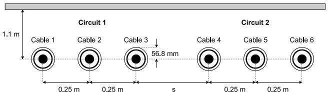  
Fig. 1. Double-circuit underground cable configuration [17].

In recent years, new simplified expressions have been proposed to avoid the calculation of the improper integrals associated with the ground return impedance computation [14–16]. One of these expressions, proposed by De Conti et al. [4], is a direct approximation of the equations of Magalhães et al. [2] and Xue et al. [3]. However, it is limited to closely spaced cables and frequencies up to few MHz. Another expression, recently proposed by De Conti and Lima [16], approximates Sunde’s integral equation [13] in a wide frequency range. Compared to the equation De Conti et al. [4], this expression is valid for greater cable separations and a higher upper frequency limit. However, Sunde’s equation is not as complete as the more general expressions of Magalhães et al. [2] and Xue et al. [3]. As a result, a systematic error is expected with its utilization. The impact of this systematic error on the transient performance of underground cable systems remains to be investigated.

In this paper, a detailed study is presented about the accuracy of the De Conti-Lima [16] and Saad–Gaba–Giroux [8] equations for the calculation of the ground return impedance of underground cables. It is shown that the De Conti-Lima equation [16] leads to better performance than the Saad-Gaba Giroux equation [8] for a wide range of cable separations in a wide frequency range, taking as a reference not only Sunde’s equation [13], but also the equations of Magalhães et al. [2] and Xue et al. [3]. This is confirmed by transient simulations performed with a double-circuit underground cable system.

This paper is organized as follows. In Section 2, the equations of De Conti and Lima [16] and Saad, Gaba, and Giroux [8] are presented. Section 3 presents an error analysis of both expressions regarding cable separation. Section 4 illustrates the application of the tested equations in calculating the transient performance of a double-circuit underground cable system. Conclusions are presented in Section 5.

# 2. Ground return impedance expressions

The calculation of the series impedance per unit length of an underground cable system requires determining the ground return impedance $Z _ { g }$ . A generalized form for $Z _ { g }$ derived assuming a quasi-TEM structure for the electromagnetic fields around an infinitely long cable can be written as [4]

$$
Z _ {g} = \frac {j \omega \mu_ {0}}{2 \pi} \left[ K _ {0} (\gamma_ {1} d) - K _ {0} (\gamma_ {1} D) + \Theta \right] \tag {1}
$$

where

$$
\Theta = 2 \int_ {0} ^ {\infty} \frac {e ^ {- H \sqrt {\lambda^ {2} + \gamma_ {1} ^ {2}}}}{\sqrt {\lambda^ {2} + \gamma_ {0} ^ {2}} + \sqrt {\lambda^ {2} + \gamma_ {1} ^ {2}}} \cos (r \lambda) d \lambda \tag {2}
$$

In (1) and $( 2 ) , K _ { 0 }$ is the modified Bessel function of the second type and order zero, $\gamma _ { 0 } ~ = ~ j \omega \sqrt { \mu _ { 0 } \varepsilon _ { 0 } }$ and $\gamma _ { 1 } ~ = ~ \sqrt { j \omega \mu _ { 1 } \left( \sigma _ { 1 } + j \omega \varepsilon _ { 1 } \right) }$ are the intrinsic propagation constants of the air and the ground, respectively, $\mu _ { 0 }$ and $\varepsilon _ { 0 }$ are the vacuum permeability and permittivity, respectively, $\sigma _ { 1 }$ is the ground conductivity, $\mu _ { 1 } ~ = ~ \mu _ { 0 }$ is the ground permeability, $\varepsilon _ { 1 } = \varepsilon _ { r 1 } \varepsilon _ { 0 }$ is the ground permittivity, $\varepsilon _ { r 1 }$ is the dielectric constant of the ground, ?? is the angular frequency, $H = h _ { m } + h _ { n }$ , where ${ \boldsymbol { h } } _ { m }$ and $h _ { n }$ are the burial depths of cables ?? and $n , \ d \ = \ \sqrt { \left( h _ { m } - h _ { n } \right) ^ { 2 } + r ^ { 2 } } ;$ , $D = \sqrt { H ^ { 2 } + r ^ { 2 } } .$ , and ?? is the horizontal separation between the cables.

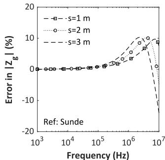

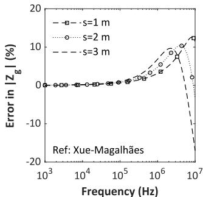

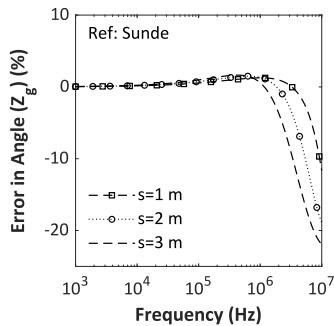

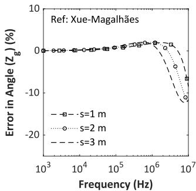  
  
Fig. 2. Relative error in the calculation of the mutual ground return impedance between cables 1 and 6 of Fig. 1 with the Saad–Gaba–Giroux equation (3) taking as reference either Sunde’s equation (left column) or the Xue–Magalhães equation (right column), considering constant soil parameters with 100-Ωm resistivity and relative permittivity of 10.

The main diagonal elements of $Z _ { g }$ are calculated assuming $h _ { m } = h _ { n }$ and taking ?? as the external cable radius.

The integral in (2) was first proposed by Magalhes et al. [2] and was shown by De Conti et al. [4] to be equivalent to the equation later proposed by Xue et al. [3]. For this reason, Eq. (1) is referred to in the rest of the paper as the Xue-Magalhães equation. If $\gamma _ { 0 } = 0$ is assumed in (2), it reduces to the integral equation of Sunde [13]. Therefore, Sunde’s equation can be viewed as a particular case of the Xue-Magalhães quasi-TEM equation.

# 2.1. Saad–Gaba–Giroux equation

In [8], Saad, Gaba, and Giroux proposed the following equation to calculate the elements of $Z _ { g }$

$$
Z _ {g} \approx \frac {j \omega \mu_ {0}}{2 \pi} \left[ K _ {0} \left(\gamma_ {1} d\right) + \frac {2}{4 + \gamma_ {1} ^ {2} r ^ {2}} e ^ {- H \gamma_ {1}} \right] \quad . \tag {3}
$$

Eq. (3) was originally derived from Pollaczek’s equation [6], which is a low-frequency approximation that can be obtained assuming $\gamma _ { 0 } = 0$ and $\gamma _ { 1 } ~ \approx ~ \sqrt { j \omega \mu _ { 1 } \sigma _ { 1 } }$ in (2). By considering $\gamma _ { 1 } ~ = ~ \sqrt { j \omega \mu _ { 1 } \left( \sigma _ { 1 } + j \omega \varepsilon _ { 1 } \right) }$ , equation (3) becomes an approximation to the Sunde expression [13]. The Saad–Gaba–Giroux expression in (3) with the complete expression for $\gamma _ { 1 }$ is currently implemented in the internal calculation routine available in ATPDraw [7]. Eq. (3) is valid for closely spaced cables found in single-circuit cable systems [8].

# 2.2. De Conti-Lima equation

In [16], De Conti and Lima proposed the following closed-form expression to calculate the elements of $Z _ { g }$

$$
\begin{array}{l} Z _ {g} \approx \frac {j \omega \mu_ {0}}{2 \pi} \left\{K _ {0} \left(\gamma_ {1} d\right) + \left(\frac {H ^ {2} - r ^ {2}}{D ^ {2}}\right) \left[ K _ {2} \left(\gamma_ {1} D\right) \right. \right. \tag {4} \\ \left. - \frac {2 e ^ {- \gamma_ {1} H}}{\gamma_ {1} ^ {2} D ^ {2}} \left(1 + \gamma_ {1} H\right) \right] - \frac {2 r H e ^ {- \gamma_ {1} D}}{D ^ {2}} \sum_ {n = 1} ^ {3} I _ {n} \Bigg \}, \\ \end{array}
$$

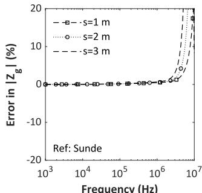

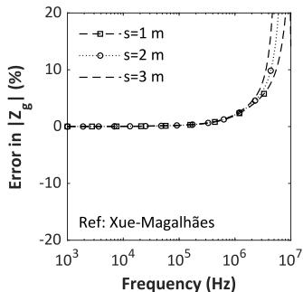  
(b)

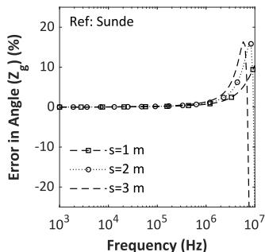  
(c)

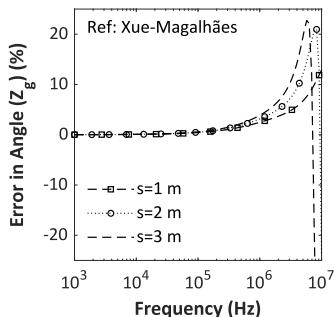  
(d)   
Fig. 3. Relative error in the calculation of the mutual ground return impedance between cables 1 and 6 of Fig. 1 with the Saad–Gaba–Giroux equation (3) taking as reference either Sunde’s equation (left column) or the Xue–Magalhães equation (right column), considering constant soil parameters with 1000-Ωm resistivity and relative permittivity of 10.

where $\begin{array} { r } { I _ { 1 } = \left( H - \frac { 8 } { \gamma _ { 1 } } \right) \frac { r } { D ^ { 2 } } , I _ { 2 } = 4 \frac { \left( 2 - \gamma _ { 1 } D \right) } { \left( \gamma _ { 1 } D / 2 \right) ^ { 2 } } \arctan \left( \frac { r } { H + D } \right) } \end{array}$ , and

$$
I _ {3} = - \frac {\left(8 - 8 \gamma_ {1} D + \gamma_ {1} ^ {2} D ^ {2}\right)}{\left(\gamma_ {1} D / 2\right) ^ {2} \sqrt {1 - \gamma_ {1} D}} \arctan \left(\frac {r \sqrt {1 - \gamma_ {1} D}}{H + D}\right).
$$

Eq. (4) was shown in [16] to be accurate for horizontal separations typically found in single and double-circuit cable systems. For vertical cable arrangements for which $h _ { m } \neq h _ { n }$ and $r \ = \ 0 ,$ , it becomes the exact solution to Sunde’s integral equation [13]. However, no transient calculations were shown to demonstrate its performance. Also, it is still not clear how advantageous it would be compared to the expression in the Saad–Gaba–Giroux formulation [8].

# 3. Error analysis in the frequency domain

This section investigates the performance of De Conti-Lima and Saad–Gaba–Giroux equations in the frequency domain taking as reference (1) with either $\gamma _ { 0 } = 0$ (Sunde’s equation) or $\gamma _ { 0 } \neq 0$ (Xue–Magalhães equation) in (2). In the analysis, the double-circuit underground cable system shown in Fig. 1 is considered [17]. The cable parameters were calculated in MATLAB considering either a constant parameter (CP) soil or the frequency-dependent (FD) soil model of Alipio and Visacro [18] for different separations ?? between circuits. Further details about the simulated cable system can be found in [17].

# 3.1. Constant soil parameters

To demonstrate the influence of ?? on the accuracy of the analytical expressions (3) and (4) for the case of constant soil parameters, the deviations in the calculation of the mutual ground return impedance between cables 1 and 6 of Fig. 1 are presented considering either Sunde’s or the Xue-Magalhães equation as reference. Three different values were considered for ??, namely ?? = 1, 2, and 3 m. Since greater errors are expected for greater cable separations, only the mutual impedance between cables 1 and 6 is presented.

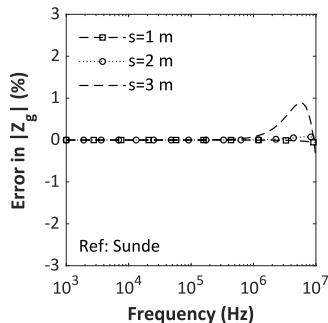

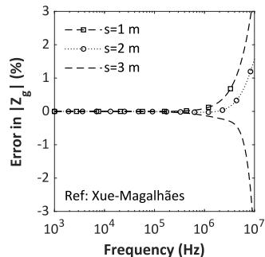

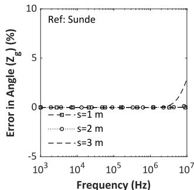  
(c）

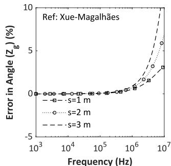  
  
Fig. 4. Relative error in the calculation of the mutual ground return impedance between cables 1 and 6 of Fig. 1 with the De Conti-Lima equation (4) taking as reference either Sunde’s equation (left column) or the Xue–Magalhães equation (right column), considering constant soil parameters with 100-Ωm resistivity and relative permittivity of 10.

Figs. 2 and 3 illustrate the relative errors calculated considering the Saad–Gaba–Giroux equation (3) for soil resistivities of 100 Ωm and 1000 Ωm, respectively. The results obtained for the De Conti-Lima equation (4) are presented in Figs. 4 and 5. Each figure presents, on the left-hand side column, the relative errors (magnitude and phase angle) calculated with reference to Sunde’s equation. The right-hand side column of each figure presents the relative errors calculated with reference to the Xue–Magalhães equation. It is observed that the relative errors increase with increasing value of ??, and that the deviations associated with the De Conti-Lima equation are lower than those of the Saad–Gaba–Giroux equation in all tested conditions. For example, if Sunde’s equation is taken as a reference, the errors associated with the De Conti-Lima equation do not exceed 2.5% up to 10 MHz, even for ?? = 3 m, which amounts to a total separation of 4 m between cables 1 and 6. On the other hand, the Saad–Gaba–Giroux equation leads to errors exceeding 10% and 20% for the 100-Ωm and 1000-Ωm soils, respectively, in the same frequency range.

If now the Xue–Magalhães equation is taken as reference (right column of Figs. 2–5), the deviations associated with the application of the De Conti-Lima equation present an increase above 1 MHz. Nevertheless, they are limited to the 5%–10% range even for a separation of 3 m between the two circuits of Fig. 1. Given the accuracy of the De Conti-Lima equation in reproducing Sunde’s formula, the observed deviation can be directly related to the systematic error associated with assuming $\gamma _ { 0 } ~ = ~ 0$ in the derivation of (4). Regarding the Saad– Gaba–Giroux equation, errors exceeding 10% and 20% are observed for the 100-Ωm and 1000-Ωm soils, respectively. The better performance of the De Conti-Lima equation compared to the Saad–Gaba–Giroux equation can be explained by the fact that only the last term of (4) results from an approximation, being all remaining terms exact [16]. On the other hand, in the Saad–Gaba–Giroux equation (3), an exponential term replaces both $K _ { 0 } ( \gamma _ { 1 } D )$ and ?? found in (1). This approximation is only valid for small cable separations and low frequencies, which explains the poor performance of (3) above 1 MHz in the tested conditions.

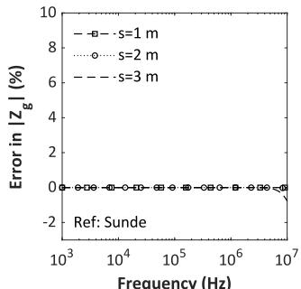

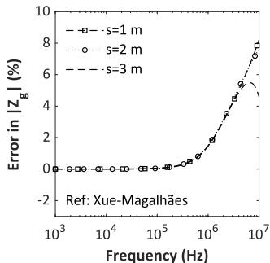

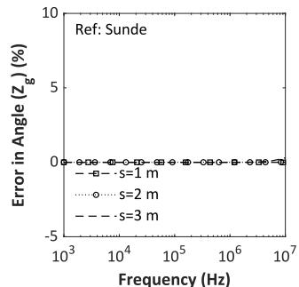

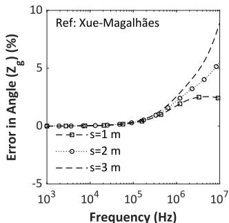  
  
Fig. 5. Relative error in the calculation of the mutual ground return impedance between cables 1 and 6 of Fig. 1 with the De Conti-Lima equation (4) taking as reference either Sunde’s equation (left column) or the Xue–Magalhães equation (right column), considering constant soil parameters with 1000-Ωm resistivity and relative permittivity of 10.

# 3.2. Frequency-dependent soil parameters

The analysis of the previous section is now repeated, considering the more realistic case of FD soil parameters. In the analysis, the soil model of Alipio and Visacro [18] was considered. The results obtained with the Saad–Gaba–Giroux equation for 100-Ωm and 1000-Ωm soils are shown in Fig. 6 and Fig. 7, respectively. In Fig. 8 and Fig. 9, the results obtained for the De Conti and Lima equation are presented for the same conditions. Once again, only the mutual impedance between cables 1 and 6 is shown.

The results shown in Figs. 6–9 follow the same the trend observed for the CP soil, with the Saad-Gaba–Giroux equation leading to greater deviations than the De Conti-Lima equation, especially above 1 MHz. For example, the relative errors associated with the Saad–Gaba–Giroux equation exceed 10% for the 100-Ωm soil and 50% for the 1000-Ωm soil. On the other hand, the relative errors do not exceed 10% for the De Conti-Lima equation, being limited to 5% if the separation between the two circuits of Fig. 1 is less than 2 m. Compared to the CP soil case, the deviations do not change significantly.

# 3.3. Mean absolute percentage error

To further investigate the performance of the Saad–Gaba–Giroux and De Conti-Lima equations, the mean absolute percentage error (MAPE) given by

$$
\frac {1}{N _ {s}} \sum_ {k = 1} ^ {N _ {s}} \left| \frac {Z _ {g , k} ^ {\text {a p p}} - Z _ {g , k} ^ {\text {r e f}}}{Z _ {g , k} ^ {\text {r e f}}} \right| \times 1 0 0 \tag {5}
$$

was calculated for the results shown in Figs. 2–9. In this equation, $Z _ { g , k } ^ { \mathrm { a p p } }$ is the ground return impedance calculated with one of the approximate expressions at the ??th frequency, $Z _ { g , k } ^ { \mathrm { r e f } }$ ??,?? is the ground return impedance calculated with either Sunde’s or the Xue–Magalhães equation, and $N _ { s }$ is the number of frequency samples. The calculation was performed from 10 Hz to either 1 MHz or 10 MHz considering 20 points per

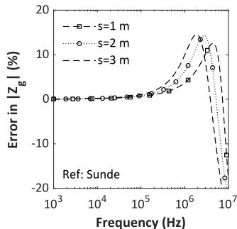

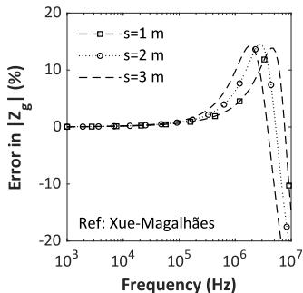

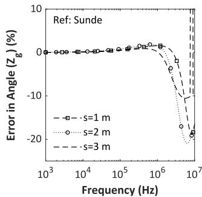

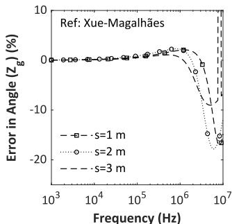

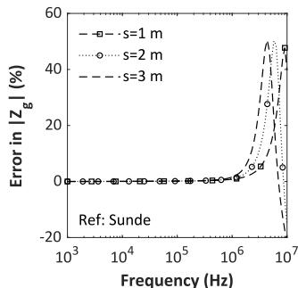  
Fig. 6. Relative error in the calculation of the mutual ground return impedance between cables 1 and 6 of Fig. 1 with the Saad–Gaba–Giroux equation (3) taking as a reference either Sunde’s equation (left column) or the Xue–Magalhães equation (right column), considering FD soil parameters with 100-Ωm.

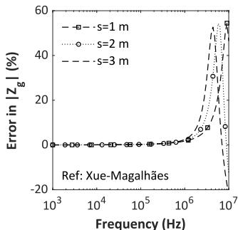

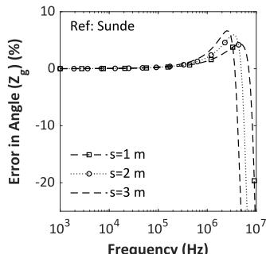  
(c)

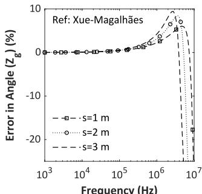  
(d)   
Fig. 7. Relative error in the calculation of the mutual ground return impedance between cables 1 and 6 of Fig. 1 with the Saad–Gaba-Giroux equation (3) taking as a reference either Sunde’s equation (left column) or the Xue–Magalhães equation (right column), considering FD soil parameters with 1000-Ωm.

decade. The results with reference to the equations of Sunde and Xue– Magalhães for the CP soil are shown in Tables 1 and $^ { 2 , }$ respectively. The results for the FD soil are shown in Tables 3 and 4.

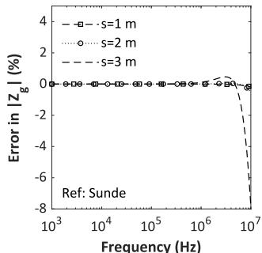

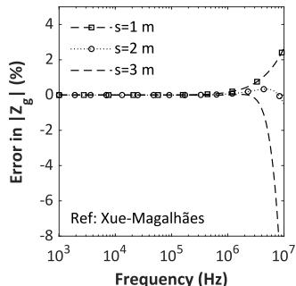  
(b)

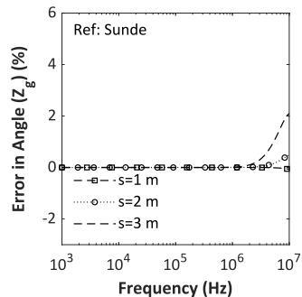  
(c)

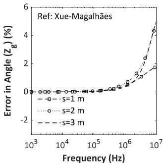  
(d)

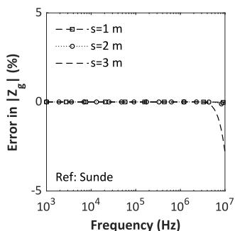  
Fig. 8. Relative error in the calculation of the mutual ground return impedance between cables 1 and 6 of Fig. 1 with the De Conti-Lima equation (4) taking as reference either Sunde’s equation (left column) or the Xue–Magalhães equation (right column), considering FD soil parameters with 100-Ωm.   
（a)

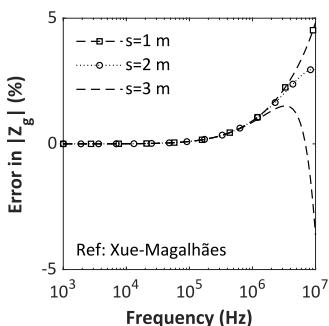

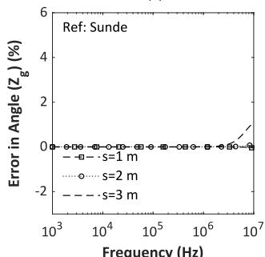  
(c)

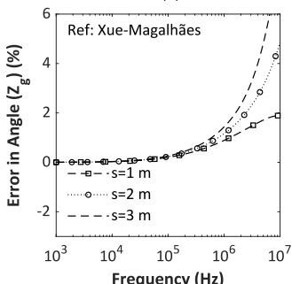  
  
Fig. 9. Relative error in the calculation of the mutual ground return impedance between cables 1 and 6 of Fig. 1 with the De Conti-Lima equation (4) taking as a reference either Sunde’s equation (left column) or the Xue–Magalhães equation (right column), considering FD soil parameters with 1000-Ωm.

The analysis of Tables 1–4 confirms that the accuracy of both approximate expressions is greater for frequencies below 1 MHz. Also, that the loss of accuracy above 1 MHz is greater for the Saad–Gaba– Giroux expression, and that increasing the cable separation reduces the

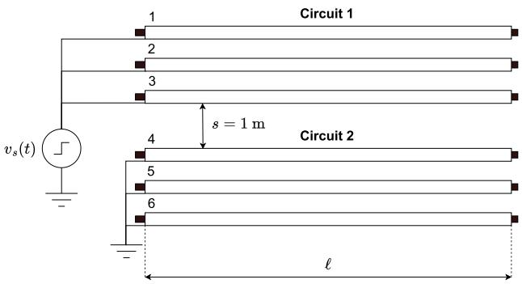  
Fig. 10. Simulated ground-mode excitation.

accuracy of both expressions. It is also shown that considering CP or FD soils do not change the overall performance of the tested equations substantially. It is apparent that the De Conti-Lima equation presents better performance than the Saad–Gaba–Giroux expression in all cases, with errors 2 to 3 orders of magnitude lower if Sunde’s equation is taken as reference, and 2 to 10 times lower if the Xue–Magalhães equation is considered instead. The greater errors with respect to the Xue–Magalhães equation are caused by the lack of $\gamma _ { 0 }$ in (3) and (4). However, as confirmed in the analysis presented in the next section, neglecting ?? in the derivation of $Z _ { g }$ has minimal influence in the calculation of transients in cable systems.

Given the accuracy of the De Conti-Lima equation in reproducing Sunde’s equation [16], the former can be taken as an indirect measure of how the latter departs from the equation of Xue–Magalhães, especially in the high-frequency range. In fact, nearly identical results would have been obtained in Tables 2 and 4 had Sunde’s equation been used instead of the De Conti-Lima equation in the MAPE calculations.

One advantage of the Saad–Gaba–Giroux equation is its simplicity compared to the De Conti-Lima equation. However, both equations present comparable performances, requiring negligible time for calculating the ground return impedance required in each case presented in Tables 1–4.

# 4. Transient responses

The analysis presented in the previous section indicates that the De Conti-Lima equation (4) leads to reduced errors compared to the Saad–Gaba–Giroux equation (3). In this section, it is investigated whether the errors in the high-frequency range associated with the application of both equations might impair the accuracy of time-domain simulations with focus on the ground-mode excitation, which is the one that is mostly affected by $Z _ { g }$ .

The tested configuration is shown in Fig. 10. In all cases, a unitstep voltage was applied at the sending end of the sheath of the three cables of circuit 1 (cables 1, 2, and 3) with the receiving end open. The sheaths of cables 4, 5, and 6 pertaining to circuit 2 were grounded at the sending end and left open at the receiving end. The cores of all circuits remained open-circuited at both cable ends. The aim is to determine the core and sheath voltages at the receiving end of both circuits. A separation ?? = 1 m was assumed between the circuits as in [17].

The cable parameters were calculated in MATLAB, considering both constant and frequency-dependent soil parameters. The cable parameters were calculated from 0.1 Hz to 10 MHz with 20 points per decade considering different expressions for the ground return impedance, namely the De Conti-Lima equation (4), the Saad–Gaba–Giroux equation (3), and the Xue–Magalhães integral equation (1). In all cases, the ground return admittance was calculated with the integral equation of Xue et al. [3] written in compact form as in [4]. The characteristic admittance and the propagation function of the cable configuration

Table 1 MAPE calculated with reference to Sunde’s equation considering a CP soil (%).   

<table><tr><td>Model</td><td colspan="4">Saad-Gaba-Giroux [8]</td><td colspan="4">De Conti-Lima [16]</td></tr><tr><td>Soil resistivity</td><td colspan="2">100 Ωm</td><td colspan="2">1000 Ωm</td><td colspan="2">100 Ωm</td><td colspan="2">1000 Ωm</td></tr><tr><td>s (m)</td><td>≤1 MHz</td><td>≤10 MHz</td><td>≤1 MHz</td><td>≤10 MHz</td><td>≤1 MHz</td><td>≤10 MHz</td><td>≤1 MHz</td><td>≤10 MHz</td></tr><tr><td>1</td><td>0.572</td><td>1.840</td><td>0.159</td><td>1.300</td><td>7.1 × 10-5</td><td>2.8 × 10-3</td><td>1.9 × 10-6</td><td>5.8 × 10-4</td></tr><tr><td>2</td><td>0.771</td><td>2.825</td><td>0.197</td><td>4.292</td><td>22.4 × 10-5</td><td>12.1 × 10-3</td><td>4.8 × 10-6</td><td>15.7 × 10-4</td></tr><tr><td>3</td><td>1.008</td><td>3.780</td><td>0.242</td><td>5.912</td><td>418.5 × 10-5</td><td>188.8 × 10-3</td><td>89.4 × 10-6</td><td>255.3 × 10-4</td></tr></table>

Table 2 MAPE calculated with reference to the Xue–Magalhães equation considering a CP soil (%).   

<table><tr><td>Model</td><td colspan="4">Saad-Gaba-Giroux [8]</td><td colspan="4">De Conti-Lima [16]</td></tr><tr><td>Soil resistivity</td><td colspan="2">100 Ωm</td><td colspan="2">1000 Ωm</td><td colspan="2">100 Ωm</td><td colspan="2">1000 Ωm</td></tr><tr><td>s (m)</td><td>≤1 MHz</td><td>≤10 MHz</td><td>≤1 MHz</td><td>≤10 MHz</td><td>≤1 MHz</td><td>≤10 MHz</td><td>≤1 MHz</td><td>≤10 MHz</td></tr><tr><td>1</td><td>0.623</td><td>1.977</td><td>0.469</td><td>2.553</td><td>0.069</td><td>0.503</td><td>0.314</td><td>1.235</td></tr><tr><td>2</td><td>0.823</td><td>2.456</td><td>0.555</td><td>5.963</td><td>0.087</td><td>0.761</td><td>0.362</td><td>1.497</td></tr><tr><td>3</td><td>1.048</td><td>3.032</td><td>0.643</td><td>7.343</td><td>0.105</td><td>1.202</td><td>0.405</td><td>1.764</td></tr></table>

Table 3 MAPE calculated with reference to Sunde’s equation considering a FD soil (%).   

<table><tr><td>Model</td><td colspan="4">Saad-Gaba-Giroux [8]</td><td colspan="4">De Conti-Lima [16]</td></tr><tr><td>Soil resistivity</td><td colspan="2">100 Ωm</td><td colspan="2">1000 Ωm</td><td colspan="2">100 Ωm</td><td colspan="2">1000 Ωm</td></tr><tr><td>s (m)</td><td>≤1 MHz</td><td>≤10 MHz</td><td>≤1 MHz</td><td>≤10 MHz</td><td>≤1 MHz</td><td>≤10 MHz</td><td>≤1 MHz</td><td>≤10 MHz</td></tr><tr><td>1</td><td>0.629</td><td>2.828</td><td>0.237</td><td>2.886</td><td>9.7 × 10-5</td><td>7.8 × 10-3</td><td>7.6 × 10-6</td><td>2.4 × 10-3</td></tr><tr><td>2</td><td>0.871</td><td>4.037</td><td>0.308</td><td>4.570</td><td>30.7 × 10-5</td><td>32.3 × 10-3</td><td>20.3 × 10-6</td><td>7.4 × 10-3</td></tr><tr><td>3</td><td>1.176</td><td>5.233</td><td>0.399</td><td>5.648</td><td>569.2 × 10-5</td><td>422.5 × 10-3</td><td>376.0 × 10-6</td><td>106.6 × 10-3</td></tr></table>

Table 4 MAPE calculated with reference to the Xue–Magalhães equation considering a FD soil (%).   

<table><tr><td>Model</td><td colspan="4">Saad-Gaba-Giroux [8]</td><td colspan="4">De Conti-Lima [16]</td></tr><tr><td>Soil resistivity</td><td colspan="2">100 Ωm</td><td colspan="2">1000 Ωm</td><td colspan="2">100 Ωm</td><td colspan="2">1000 Ωm</td></tr><tr><td>s (m)</td><td>≤1 MHz</td><td>≤10 MHz</td><td>≤1 MHz</td><td>≤10 MHz</td><td>≤1 MHz</td><td>≤10 MHz</td><td>≤1 MHz</td><td>≤10 MHz</td></tr><tr><td>1</td><td>0.678</td><td>2.828</td><td>0.433</td><td>3.594</td><td>0.061</td><td>0.361</td><td>0.197</td><td>0.713</td></tr><tr><td>2</td><td>0.923</td><td>3.779</td><td>0.537</td><td>5.020</td><td>0.078</td><td>0.578</td><td>0.229</td><td>0.906</td></tr><tr><td>3</td><td>1.216</td><td>4.873</td><td>0.658</td><td>5.785</td><td>0.095</td><td>1.185</td><td>0.259</td><td>1.183</td></tr></table>

Table 5 Total RMS error associated with the time-domain results of Figs. 11–14.   

<table><tr><td rowspan="3"></td><td colspan="4">\( \ell = {100}\mathrm{\;m} \)</td><td colspan="4">\( \ell = {1000}\mathrm{\;m} \)</td></tr><tr><td colspan="2">CP soil</td><td colspan="2">FD soil</td><td colspan="2">CP soil</td><td colspan="2">FD soil</td></tr><tr><td>100 Ωm</td><td>1000 Ωm</td><td>100 Ωm</td><td>1000 Ωm</td><td>100 Ωm</td><td>1000 Ωm</td><td>100 Ωm</td><td>1000 Ωm</td></tr><tr><td>Saad-Gaba-Giroux [8]</td><td>0.80</td><td>∞</td><td>0.20</td><td>\( {7.34} \times {10}^{-3} \)</td><td>0.15</td><td>0.57</td><td>0.12</td><td>\( {2.92} \times {10}^{-3} \)</td></tr><tr><td>De Conti-Lima [16]</td><td>\( {3.84} \times {10}^{-4} \)</td><td>\( {9.16} \times {10}^{-3} \)</td><td>\( {3.52} \times {10}^{-3} \)</td><td>\( {7.33} \times {10}^{-3} \)</td><td>0.15</td><td>\( {10.36} \times {10}^{-3} \)</td><td>0.12</td><td>\( {2.65} \times {10}^{-3} \)</td></tr></table>

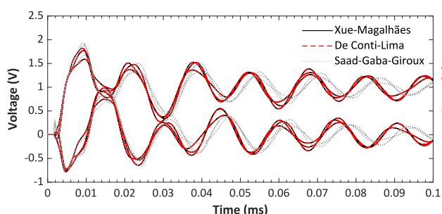  
(a)100Ωm

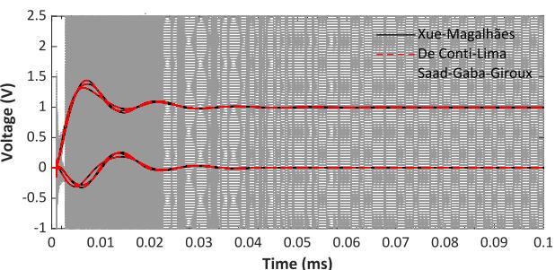  
(b)1000 Ωm   
Fig. 11. Voltages at the receiving for the case shown in Fig. 10 with a cable length of 100 m and a constant soil parameter.

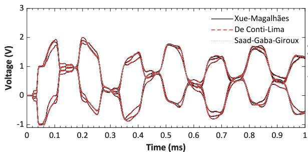  
(a) 100Ωm

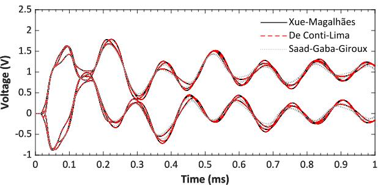  
(b) 1000Ωm

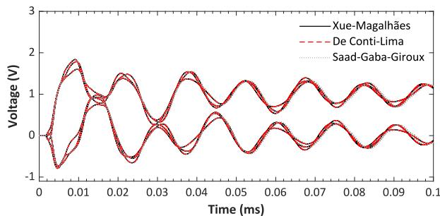  
Fig. 12. Voltages at the receiving for the case shown in Fig. 10 with a cable length of 1 km and a constant soil parameter.   
(a) 100 Ωm

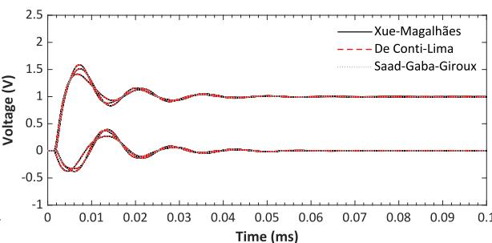  
(b)1000 Ωm

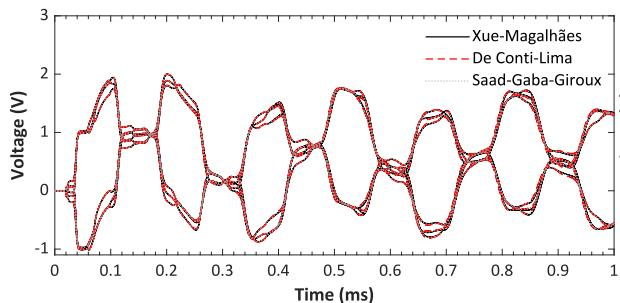  
Fig. 13. Voltages at the receiving for the case shown in Fig. 10 with a cable length of 100 m and FD soil parameters.   
(a)100 Ωm

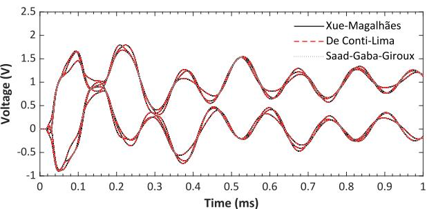  
(b)1000Ωm   
Fig. 14. Voltages at the receiving for the case shown in Fig. 10 with a cable length of 1 km and FD soil parameters.

shown in Fig. 1 were calculated and fitted in MATLAB with the vector fitting technique [19]. The fitted functions were plugged into the foreign-model implementation of the universal line model (ULM) [20] in ATP using the Read PCH file tool of ATPDraw [7].

Figs. 11 and 12 show the results obtained for cable lengths of 100 m and 1 km, respectively, considering CP soils of 100 Ωm and 1000 Ωm. In all cases, the voltage waveforms calculated with the De Conti-Lima equation accurately reproduce those obtained for the Xue–Magalhães equation. This confirms that neglecting $\gamma _ { 0 }$ does not affect the performance of the De Conti-Lima equation compared to the Xue–Magalhães equation. The Saad–Gaba–Giroux equation leads similar performance for the 1-km-long cable, but for the 100-m long cable the results become inaccurate or unstable. This happens because of the poor performance of the Saad–Gaba–Giroux in the high-frequency range, as discussed in Section 3. This affects both the fitting of the model parameters and the cable response when the natural frequencies are shifted toward the higher end of the spectrum in case of short cables.

Figs. 13 and 14 show the results obtained for the same conditions as before, but now assuming a FD soil. In this particular case, the De Conti-Lima and Saad–Gaba–Giroux equations present similar performance, both closely following the overall characteristics of the waveforms obtained with the Xue–Magalhães equation. This time, no instability

or loss of accuracy was verified in the calculations performed with the Saad–Gaba–Giroux equation.

For a more rigorous assessment of the model performances, the RMS errors of each of the waveforms shown in Figs. 11–14 were calculated with respect to the results obtained with the Xue–Magalhães equation. The sum of the RMS errors of each case is shown in Table 5. Although both approximate equations present comparable performances in some cases, the RMS errors associated with the application of the De Conti-Lima equation are generally lower.

# 5. Conclusions

This paper demonstrates that an analytical equation recently proposed by De Conti and Lima [16] can be used with sufficient accuracy in the calculation of the ground return impedance of underground cables. If Sunde’s equation is taken as a reference, the deviations do not exceed a few percent up to 10 MHz. If the more complete Xue– Magalhães integral equation is taken as a reference, greater deviations are observed above 1 MHz but limited to 10% in the tested conditions. The De Conti-Lima equation is also shown to be more accurate than the well-known Saad–Gaba–Giroux equation [8], leading to more reliable and stable performance when plugged into a wideband cable model.

The better performance of the De Conti-Lima equation is demonstrated for both constant and frequency-dependent soil parameters, different cable lengths, and large cable separations found in double-circuit cable systems.

# CRediT authorship contribution statement

Alberto De Conti: Software, Methodology, Writing – review & editing, Investigation, Writing – original draft, Conceptualization, Formal analysis. Antonio C.S. Lima: Investigation, Writing – review & editing, Formal analysis, Methodology, Conceptualization.

# Declaration of competing interest

The authors declare that they have no known competing financial interests or personal relationships that could have appeared to influence the work reported in this paper.

# Data availability

Data will be made available on request.

# References

[1] H. Wohlfarth, Calculation of ground impedances, IEEE Trans. Power Deliv. 39 (4) (2024) 2113–2124.   
[2] A.P.C. Magalhães, J.C.L.V. Silva, A.C.S. Lima, M.T. Correia de Barros, Validation limits of Quasi-TEM approximation for buried bare and insulated cables, IEEE Trans. Electromagn. Compat. 57 (6) (2015) 1690–1697.   
[3] H. Xue, A. Ametani, J. Mahseredjian, I. Kocar, Generalized formulation of earthreturn impedance/admittance and surge analysis on underground cables, IEEE Trans. Power Deliv. 33 (6) (2018) 2654–2663.   
[4] A. De Conti, N. Duarte, R. Alipio, Closed-form expressions for the calculation of the ground-return impedance and admittance of underground cables, IEEE Trans. Power Deliv. 38 (4) (2023) 2891–2900.

[5] Alternative Transients Program (ATP) Rule Book, Canadian/American EMTP User Group, USA, 2016.   
[6] F. Pollaczek, Sur le champ produit par un conducteur simple infiniment long parcouru par un courant alternatif, Rev. Gen. L’Electricité 29 (22) (1931) 851–867.   
[7] H.K. Hoidalen, L. Prikler, F. Peñaloza, ATPDRAW version 7.5 for windows users’ manual, 2023.   
[8] O. Saad, G. Gaba, M. Giroux, A closed-form approximation for ground return impedance of underground cables, IEEE Trans. Power Deliv. 11 (3) (1996) 1536–1545.   
[9] L.M. Wedepohl, D.J. Wilcox, Transient analysis of underground powertransmission system – system model and wave propagation characteristics, Proc. Inst. Electr. Eng. 120 (3) (1973) 253–260.   
[10] EMTDC - Transient Analysis for PSCAD Power System Simulation User’s Guide, Manitoba Hydro International Ltd, 2018.   
[11] N.F. Duarte, A. De Conti, R. Alipio, Extension of Vance’s closed-form approximation to calculate the ground admittance of multiconductor underground cable systems, Electr. Power Syst. Res. 196 (2021) 107252.   
[12] N. Duarte, A. De Conti, R. Alipio, Assessment of ground-return impedance and admittance equations for the transient analysis of underground cables using a full-wave FDTD method, IEEE Trans. Power Deliv. 37 (5) (2022) 3582–3589.   
[13] E.D. Sunde, Earth Conduction Effects in Transmission Systems, Dover Publications, New York, 1968.   
[14] A.C. Lima, C. Portela, Closed-form expressions for ground return impedances of overhead lines and underground cables, Int. J. Electr. Power Energy Syst. 38 (1) (2012) 20–26.   
[15] A. De Conti, N. Duarte, R. Alipio, O.E. Leal, Small-argument analytical expressions for the calculation of the ground-return impedance and admittance of underground cables, Electr. Power Syst. Res. 220 (2023) 109299.   
[16] A. De Conti, A.C.S. de Lima, A closed-form approximation for Sunde’s groundreturn expression based on a Padé approximant, IEEE Trans. Electromagn. Compat. 66 (3) (2024) 993–1000.   
[17] I. Kocar, J. Mahseredjian, Accurate frequency dependent cable model for electromagnetic transients, IEEE Trans. Power Deliv. 31 (3) (2016) 1281–1288.   
[18] R. Alipio, S. Visacro, Modeling the frequency dependence of electrical parameters of soil, IEEE Trans. Electromagn. Compat. 56 (5) (2014) 1163–1171.   
[19] B. Gustavsen, A. Semlyen, Rational approximation of frequency domain responses by vector fitting, IEEE Trans. Power Deliv. 14 (3) (1999) 1052–1061.   
[20] F.O. Zanon, O.E. Leal, A. De Conti, Implementation of the universal line model in the alternative transients program, Electr. Power Syst. Res. 197 (2021) 107311.