# Data-Driven Parameter Calibration of Power System EMT Model Based on Sobol Sensitivity Analysis and Gaussian Mixture Model

Yuhong Wang , Senior Member, IEEE, Bingjie Zhai , Shilin Gao , Member, IEEE, Yitan Guo, Chen Shen , Senior Member, IEEE, Ying Chen , Senior Member, IEEE, Zongsheng Zheng, Senior Member, IEEE, and Yankan Song

Abstract—The parameters of power system electromagnetic transient (EMT) model have great influences on the accuracy of EMT simulation. This paper proposes a data-driven parameter calibration method based on Sobol sensitivity analysis and Gaussian mixture model (GMM) to calibrate the parameters of the power system EMT models. First, the dominant parameters of the power system EMT model are derived based on the derivative-free Sobol sensitivity analysis method. Then, the GMM that describes the relationship between the dominant parameters and the EMT simulation errors is established and solved. Finally, an improved particle swarm optimization algorithm is adopted to optimize the EMT simulation errors and the values of the parameters are obtained according to the minimum error and the conditional probability invariance of GMM. The test results on four different systems show that the proposed method can accurately calibrate all dominant parameters of the EMT models of the various power systems.

Index Terms—Conditional probability, data-driven, EMT simulation model, GMM, parameter calibration, posterior distribution.

# I. INTRODUCTION

W ITH the development of power electronics and renew-able energies in modern power systems, the dynamic able energies in modern power systems, the dynamic characteristics of the power systems are becoming increasingly complex and traditional electromechanical transient simulation is difficult to meet the accuracy requirements of power system

Manuscript received 21 December 2023; revised 7 May 2024; accepted 8 June 2024. Date of publication 18 June 2024; date of current version 27 December 2024. This work was supported by the National Key R&D Program of China Response-driven intelligent enhanced analysis and control for bulk power system stability under Grant 2021YFB2400800. Paper no. TPWRS-01997-2023. (Corresponding author: Shilin Gao.)

Yuhong Wang, Bingjie Zhai, Shilin Gao, and Zongsheng Zheng are with the College of Electrical Engineering, Sichuan University, Chengdu 610065, China (e-mail: yuhongwang@scu.edu.cn; zhaibingjie1@stu.scu.edu.cn; gaoshilin@ scu.edu.cn; zongshengzheng@scu.edu.cn).

Yitan Guo is with the State Grid Corporation of China, Beijing 100031, China (e-mail: 276632482@qq.com).

Chen Shen and Ying Chen are with the Department of Electrical Engineering, Tsinghua University, Beijing 100084, China (e-mail: shenchen@mail. tsinghua.edu.cn; chen_ying@tsinghua.edu.cn).

Yankan Song is with the Sichuan Energy Internet Research Institute, Tsinghua University, Chengdu 610042, China (e-mail: songyankan@cloudpss.net).

Color versions of one or more figures in this article are available at https://doi.org/10.1109/TPWRS.2024.3416177.

Digital Object Identifier 10.1109/TPWRS.2024.3416177

analyses. For the design, operation and control of modern power systems, the electromagnetic transient (EMT) simulation is of great significance. In the EMT simulation of a power system, the parameter is one of the most important factors that influence the accuracy of simulation results. However, the parameters of the power system will change over time. In order to ensure that the simulation results accurately characterize the physical objects, the parameters have to be adjusted to the changes of the parameters of the real-life power systems, which is defined as parameter calibration [1].

The commonly-used parameter calibration methods mainly include the heuristic algorithm [2], least squares (LS) method [3], [4], gradient method [5], [6], Kalman filter [7], [8], [9], [10], [11], [12] and Bayesian analysis [13], [14], [15], etc. The heuristic algorithms are mostly constructed based on intuition or experience, which provide a feasible solution to the optimization problem. As a kind of heuristic algorithm, the particle swarm optimization (PSO) algorithm is used in the parameter calibration of battery in [2]. However, the computational efficiency of this method is very low when the solution space is high-dimensional. The LS method is widely used in various regression problems. Its basic idea is to minimize the sum of squares of estimation errors. A robust recursive LS algorithm is proposed for the parameter identification of the Lithium-ion battery model in [3]. In [4], the LS method has also been used for the parameter calibration of transmission line. Nevertheless, the LS method is difficult to solve the parameter calibration problem of nonlinear models, and its calculation efficiency is very low when the amount of sample data is large. The optimization algorithms based on gradient calculations have been proposed for the parameter calibration of synchronous generators in [5], [6], but the results of this method have the risk of the local optima. Kalman filter is widely used for the parameter calibration of the model with noise [7]. The traditional Kalman filter method estimates the system state for the linear system based on the observation. Therefore, the extended Kalman filter is developed for the parameter identification of the nonlinear models in [8], [9]. However, this method remains inapplicable for highly nonlinear models. To address this, a parameter estimation method based on advanced ensemble Kalman filter is proposed in [10], which can circumvent the

linearization process but has the problem of slow convergence. A robust generalized maximum-likelihood unscented Kalman filter (UKF) is proposed to address the unknown statistics of the system process and measurement noises when estimating the state of the power system in [11]. However, the UKF suffers from the curse of dimensionality, especially when there are high degree of nonlinearities in the equations that describe the state-space model [12]. In contrast to the aforementioned methods, the Bayesian analysis-based parameter calibration method is to infer unknown parameters by using the prior probability, sample information and Bayesian formula. Owing to the need of sample-based estimation of the likelihood, the Bayesian analysis is frequently combined with statistical simulation methods such as Markov Chain Monte Carlo [13], [14], [15]. A Bayesian analysis approach utilizing a surrogate based on polynomial chaos expansion is proposed for the parameter calibration of the power system in [13]. Nevertheless, the surrogate model may become unreliable when large parameter errors occur. To address this problem, a Bayesian analysis parameter calibration method based on adaptive importance sampling is proposed for more accurate results in [15]. However, the performance of the method may diminish when dealing with high-dimensional power systems.

To overcome the problems existing in the above methods, this paper proposes a data-driven parameter calibration method based on Sobol sensitivity analysis and Gaussian mixture model (GMM). It aims to accurately identify and calibrate the dominant parameters of the model using actual fault waveform. The dominant parameters selection based on the Sobol method is first proposed. The parameters corresponding to large Sobol indexes are regarded as the dominant parameters of the power system EMT model. Second, the relationship between the dominant parameters and the EMT simulation errors is modeled using a GMM. Then, the posterior distributions of the dominant parameters are computed based on the conditional probability invariance characteristic of GMM and an improved particle swarm optimization (IPSO) method. Finally, the values of the dominant parameters are obtained by calculating the mean value of the conditional probability of the dominant parameters.

The main contributions of this paper are threefold. 1) A dominant parameter selection method is proposed based on Sobol global sensitivity analysis. It is derivative-free and adaptable for various of power systems. 2) The relationship between the parameters and the EMT simulation errors is modeled as a GMM. It has a good accuracy of fitting and can be implemented for high-dimensional systems. Besides, the GMM has a characteristic of conditional probability invariance, which makes it readily to estimate the posterior distributions of the parameters. Furthermore, the proposed method is data-driven, which means that the precise EMT simulation model structure and the probability distribution of the parameters are not necessary. 3) The proposed method has versatility and is easy to be adopted on various of power system EMT simulation models.

The remainder of this paper is organized as follows. Section II discusses the problem statement and describes the proposed solution framework. Section III presents the dominant parameter selection method. The modeling of the relationship between

dominant parameters and EMT simulation errors is derived based on GMM in Section IV. In Section V, the optimization of errors based on IPSO is introduced. Section VI validates the accuracy of the proposed method on various power systems. Section VII concludes the paper.

# II. PROBLEM STATEMENT AND SOLUTION FRAMEWORK

# A. Power System Model and Parameter Calibration

A power system EMT simulation model can be represented as:

$$
y = f (\boldsymbol {x}) \tag {1}
$$

with

$$
\boldsymbol {x} = \left[ x _ {1}, x _ {2}, \dots , x _ {m} \right] ^ {\mathrm {T}} \tag {2}
$$

where x and y represent m input parameters and the simulation result of the power system EMT model, respectively. f (·) denotes the mapping between x and y.

The parameter calibration of a power system EMT simulation model is to find a set of parameters that correspond to a given reference result y∗ (e.g., fault waveform recording). Here multiple sets of parameters can be generated and the corresponding simulation results can be obtained. Then, the parameters corresponding to the simulation result with the smallest error between the reference result can be regarded as the best-calibrated parameters. In this paper, the error between a simulation result and the reference result can be calculated by:

$$
V _ {\mathrm {F}} = \sqrt {\frac {1}{W} \sum \left(y ^ {*} - y\right) ^ {2}} \tag {3}
$$

where W represents the number of sampling points and y∗ represents the reference results of the power system EMT model. Therefore, the parameter calibration can be modeled as an optimization problem. The optimization process is to continuously adjust the parameters of the power system EMT model until the error between the simulation result and the reference result reaches a minimum.

Considering that the analytical expression of power system EMT models are hard to obtain and there may be black-box models in the power system EMT simulation models, it is difficult to derive the accurate parameter set by analytic method. Thus, a data-driven solution to parameter calibration is meaningful and is explored in this paper.

# B. Proposed Solution Framework

Intuitively, the accurate parameter set of the EMT simulation model can be obtained by traversing solution space. However, the computational burden will be unacceptable. To obtain the parameters from the EMT simulation error efficiently, the GMM and an optimization method can be adopted in the parameter calibration. The GMM is used to describe the reverse mapping from the errors to the parameters based on the idea of randomization of parameters in Bayesian analysis [16]. According to the conditional probability invariance of GMM, the posterior distribution of parameters can be directly obtained when the

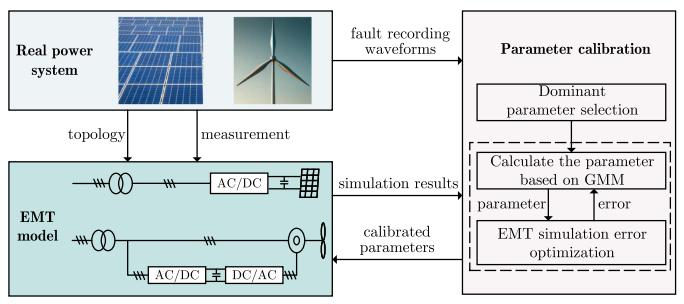  
Fig. 1. Framework of the proposed data-driven parameter calibration method for power system EMT model.

errors are known. Simultaneously, an optimization method is used to find the minimum error for the GMM. To further improve the efficiency, only the dominant parameters can be calibrated. If all parameters are calibrated, the efficiency of parameter calibration will be greatly reduced and the complexity of parameter calibration will be increased.

According to the basic idea above, a solution framework of power system parameter calibration can be proposed. The framework of the proposed data-driven parameter calibration method is illustrated in Fig. 1. Based on the fault recording waveforms in real power system and the simulation results of the corresponding EMT model, the parameters of the EMT model can be calibrated with the proposed parameter calibration framework. The proposed parameter calibration method contains three modules: dominant parameter selection, parameter calculation and the EMT simulation error optimization. In the dominant parameter selection, the global sensitivity analysis methods can be used to analyze the influences of parameters on the simulation results and select the dominant parameters. In the parameter calculation, GMM is adopted to fit the relationship between the dominant parameters and the errors, which is beneficial to calculate the values of the parameters according to the errors. In the EMT simulation error optimization, since the power system EMT simulation model is nonlinear and may be black-box, the heuristic method can be considered.

# III. DOMINANT PARAMETERS SELECTION BASED ON THE SOBOL METHOD

In the analyses of key factors, the Sobol global sensitivity analysis based on variance is a widely-used method. Its core idea is to decompose the target model into a function of the combination of parameters. Then, the influence of a single parameter or parameters on the output of the power system EMT model can be analyzed based on the variance of a single parameter or parameter set. The principle of Sobol global sensitivity analysis is described as follows.

The power system EMT simulation model in Section II can be represented as:

$$
\begin{array}{l} y = f _ {0} + \sum_ {i = 1} ^ {m} f _ {i} (x _ {i}) + \sum_ {i <   j} f _ {i j} (x _ {i}, x _ {j}) + \dots \\ + f _ {1 2 \dots m} \left(x _ {1}, x _ {2}, \dots , x _ {m}\right) \tag {4} \\ \end{array}
$$

where $f _ { 0 }$ is a constant, $f _ { i }$ is the effect function when $x _ { i }$ changes independently, $f _ { i j }$ is the effect function when $x _ { i }$ and $x _ { j }$ change simultaneously, $f _ { 1 2 \cdots m }$ is the effect function when all parameters change simultaneously. The functions in (4) are obtained from [17]:

$$
\left\{ \begin{array}{l} f _ {0} = E (y) \\ f _ {i} \left(x _ {i}\right) = E _ {\boldsymbol {x} _ {- i}} \left(y \mid x _ {i}\right) - f _ {0} \\ f _ {i j} \left(x _ {i}, x _ {j}\right) = E _ {\boldsymbol {x} _ {- i, j}} \left(y \mid x _ {i}, x _ {j}\right) - f _ {0} - f _ {i} - f _ {j} \end{array} \right. \tag {5}
$$

and similarly for higher orders. $\mathbf { x } _ { - i }$ represents the vector of all variables except $x _ { i }$ .

Since the power system EMT model $y = f ( { \boldsymbol { x } } )$ is squareintegrable [18], the variance of y can be expressed as follows:

$$
V (y) = \sum_ {i = 1} ^ {m} V _ {i} + \sum_ {i <   j} ^ {m} V _ {i j} + \dots + V _ {1 2 \dots m} \tag {6}
$$

with

$$
\left\{ \begin{array}{l} V _ {i} = V _ {x _ {i}} \left(E _ {\boldsymbol {x} _ {- i}} (y \mid x _ {i})\right) \\ V _ {i j} = V _ {x _ {i, j}} \left(E _ {\boldsymbol {x} _ {- i, j}} (y \mid x _ {i}, x _ {j})\right) - V _ {i} - V _ {j} \end{array} \right. \tag {7}
$$

where $V _ { i }$ and $V _ { i j }$ are the variance of the corresponding conditional expected value.

Based on the variance expression of the power EMT model, the influence of model input variables x on the output y can be expressed with the Sobol index, which is derived as follows.

The Sobol indexes based on variance are typically used to represent the sensitivity of each input variable [19]. The firstorder Sobol index is to measure the contribution of individual input to the output variance while the total index can measure the overall importance of each input, including its first-order effects and all higher-order interactions. According to the above definitions, it is obvious that the input variables with larger Sobol indexes have higher sensitivity.

The 1st-order Sobol index $S _ { i }$ can be expressed as:

$$
S _ {i} = \frac {V _ {x _ {i}} \left(E _ {\boldsymbol {x} _ {- i}} (y \mid x _ {i})\right)}{V (y)}. \tag {8}
$$

The total index $S _ { \mathrm { T } i }$ can be expressed as:

$$
S _ {\mathrm {T} i} = \frac {E _ {\boldsymbol {x} _ {- i}} \left(V _ {x _ {i}} \left(y \mid \boldsymbol {x} _ {- i}\right)\right)}{V (y)}. \tag {9}
$$

In order to obtain the above two Sobol indices, the Monte Carlo method is used. In the Monte Carlo simulations, the inputs of the Sobol method are all parameters in the power system EMT model. The output of the Sobol method is the simulation result of the EMT model corresponding to the fault recording waveform of the real power system. The variances can be calculated by

$$
V _ {x _ {i}} \left(E _ {\boldsymbol {x} _ {- i}} (y \mid x _ {i})\right) \approx \frac {1}{N} \sum_ {j = 1} ^ {N} f (\boldsymbol {B}) _ {j} \left(f \left(\boldsymbol {A} _ {B} ^ {i}\right) _ {j} - f (\boldsymbol {A}) _ {j}\right) \tag {10}
$$

$$
E _ {\boldsymbol {x} _ {- i}} \left(V _ {x _ {i}} (y \mid \boldsymbol {x} _ {- i})\right) \approx \frac {1}{2 N} \sum_ {j = 1} ^ {N} \left(f (\boldsymbol {A}) _ {j} - f \left(\boldsymbol {A} _ {B} ^ {i}\right) _ {j}\right) ^ {2} \tag {11}
$$

where A and B in the (10) and (11) are sample matrices. Due to page limitation, the calculation process is not described in detail.

# IV. MODELING OF PARAMETER-ERROR RELATIONSHIP AND SOLUTION TO PARAMETERS

After determining the dominant parameters in the EMT model, a large amount of simulation data, including the parameters and the EMT simulation errors, can be obtained by randomly selecting the parameter combination within calibration range. Then, the relationship between the dominant parameters and the EMT simulation errors is modeled using the GMM. Furthermore, the values of the dominant parameters are obtained by solving the GMM.

# A. Modeling Parameter-Error Relationship With GMM

The parameters and the errors are inherently highdimensionally correlated and can be expressed using the joint probability density. According to the theory of Bayesian statistics, there exists a probability distribution for the dominant parameters [13]. Let $X _ { \mathrm { p } }$ denote the parameter vector and $Y _ { \mathrm { { p } } }$ denote the EMT simulation error vector. Then, to ensure the consistency of the solution space, $X _ { \mathrm { p } }$ and $Y _ { \mathrm { ~ p ~ } }$ are normalized as follows:

$$
X _ {i} = \frac {X _ {\mathrm {p i}} - X _ {\mathrm {m i n}}}{X _ {\mathrm {m a x}} - X _ {\mathrm {m i n}}}, Y _ {i} = \frac {Y _ {\mathrm {p i}} - Y _ {\mathrm {m i n}}}{Y _ {\mathrm {m a x}} - Y _ {\mathrm {m i n}}} \tag {12}
$$

where $X _ { \mathrm { m i n } }$ and $X _ { \mathrm { m a x } }$ are the lower and upper limits of the parameter calibration range, respectively; $Y _ { \mathrm { m i n } }$ and $Y _ { \mathrm { m a x } }$ denote the minimum and maximum values of the EMT simulation errors, respectively. Then, the combined random variable can be represented by $\boldsymbol { Z } = [ \boldsymbol { X } , \boldsymbol { Y } ]$ , which is described in the form of GMM.

As a commonly used probabilistic model, GMM is composed of a finite number of Gaussian components according to the weight [20]. Assume that the GMM contains K Gaussian components and the weights of the Gaussian components can be defined as $\omega = [ \omega _ { 1 } \quad \omega _ { 2 } \quad \cdot \cdot \cdot \quad \omega _ { K } ]$ , the GMM is defined as:

$$
f (\boldsymbol {Z}) = \sum_ {k = 1} ^ {K} \omega_ {k} N _ {k} \left(\boldsymbol {Z} \mid \boldsymbol {\mu} _ {k}, \boldsymbol {\sigma} _ {k}\right) \tag {13}
$$

with

$$
\sum_ {k = 1} ^ {K} \omega_ {k} = 1, \omega_ {k} > 0 \tag {14}
$$

$$
N _ {k} \left(\boldsymbol {Z} \mid \boldsymbol {\mu} _ {k}, \boldsymbol {\sigma} _ {k}\right) = \frac {\mathrm {e} ^ {- \frac {1}{2} \left(\boldsymbol {Z} - \boldsymbol {\mu} _ {k}\right) ^ {\mathrm {T}} \boldsymbol {\sigma} _ {k} {} ^ {- 1} \left(\boldsymbol {Z} - \boldsymbol {\mu} _ {k}\right)}}{\left(2 \pi\right) ^ {S / 2} \det \left(\boldsymbol {\sigma} _ {k}\right) ^ {1 / 2}} \tag {15}
$$

where $f ( Z )$ is the joint probability density function of Z. The parameter set in GMM is $\Omega = \{ \omega _ { k } , \mu _ { k } , \pmb { \sigma } _ { k } ; k = 1 , \ldots , K \}$ , where $\mu _ { k } , \sigma _ { k }$ and $\omega _ { k }$ represent the mean vector, covariance matrix and weight of the Gaussian component, respectively. S is the dimension of the random variable $Z , N _ { k }$ is a multidimensional normal distribution. det represents the matrix determinant.

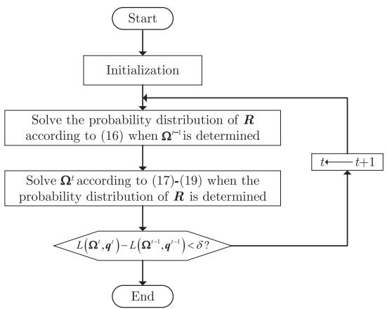  
Fig. 2. Flowchart of the EM algorithm.

# B. Solution to the GMM

In order to solve the GMM that describes the relationship between the EMT model dominant parameters and EMT simulation errors, the GMM parameter set Ω should be estimated first. Then, the number of Gaussian components is determined.

1) Solution to the Parameter Set Ω: The Expectation Maximization (EM) algorithm is widely used to compute the parameter set of GMM [21], which is also adopted in this paper. The flowchart of EM algorithm is illustrated in Fig. 2. In the initialization, let $\mathbf { \Gamma } \Gamma = [ Z _ { 1 } , Z _ { 2 } , Z _ { 3 } , \ldots , Z _ { N } ]$ ] denote N sample data and $\Omega ^ { 0 }$ denote the initial value of Ω. Apart from this, a hidden variable R also needs to be defined. Its probability distribution $q ( { R _ { c j } } )$ represents the probability that data point $Z _ { j }$ belongs to cth Gaussian component. After initialization, EM algorithm estimates Ω through iterative computation. Each iteration includes two steps.

- Step 1: Solve the distribution of R that maximizes the likelihood function.

$$
\begin{array}{l} q ^ {t} \left(\boldsymbol {R} _ {c j}\right) = p \left(\boldsymbol {R} _ {c j} \mid \boldsymbol {Z} _ {j}, \boldsymbol {\Omega} ^ {t - 1}\right) \\ = \frac {p \left(\boldsymbol {Z} _ {j} \mid \boldsymbol {R} _ {c j} , \boldsymbol {\Omega} ^ {t - 1}\right) p \left(\boldsymbol {R} _ {c j} \mid \boldsymbol {\Omega} ^ {t - 1}\right)}{p \left(\boldsymbol {Z} _ {j} \mid \boldsymbol {\Omega} ^ {t - 1}\right)} \\ = \frac {\omega_ {c} N \left(\mathbf {Z} _ {j} \mid \boldsymbol {\mu} _ {c} , \boldsymbol {\sigma} _ {c}\right)}{\sum_ {n = 1} ^ {K} \omega_ {n} N \left(\mathbf {Z} _ {j} \mid \boldsymbol {\mu} _ {c} , \boldsymbol {\sigma} _ {c}\right)} \tag {16} \\ \end{array}
$$

where t is the number of iterations, $p ( Z _ { j } | \Omega )$ denotes the probability of getting data point $Z _ { j }$ in this probability model when the GMM parameter set Ω is determined.

- Step 2: The parameter set $\Omega ^ { t }$ is solved:

$$
\boldsymbol {\mu} _ {c} ^ {t} = \frac {\sum_ {j = 1} ^ {N} q ^ {t} \left(\boldsymbol {R} _ {c j}\right) \boldsymbol {Z} _ {j}}{\sum_ {j = 1} ^ {N} q ^ {t} \left(\boldsymbol {R} _ {c j}\right)} \tag {17}
$$

$$
\boldsymbol {\sigma} _ {c} ^ {t} = \frac {\sum_ {j = 1} ^ {N} q ^ {t} \left(\boldsymbol {R} _ {c j}\right) \left(\boldsymbol {Z} _ {j} - \boldsymbol {\mu} _ {c} ^ {t}\right) ^ {2}}{\sum_ {j = 1} ^ {N} q ^ {t} \left(\boldsymbol {R} _ {c j}\right)} \tag {18}
$$

$$
\omega_ {c} ^ {t} = \frac {\sum_ {j = 1} ^ {N} q ^ {t} \left(\boldsymbol {R} _ {c j}\right)}{N}. \tag {19}
$$

The iteration converges when $L ( \Omega ^ { t } , q ^ { t } ) - L ( \Omega ^ { t - 1 } , q ^ { t - 1 } ) <$ $\delta ,$ where $L ( \Omega ^ { t } , q ^ { t } )$ and $L ( \Omega ^ { t - 1 } , q ^ { \dot { t } - 1 } )$ represent the likelihood function values of $Z$ at tth iteration and $( t - 1 ) \mathfrak { t }$ h iteration, respectively. It is worth noting that EM algorithm is based on the premise that $K$ is known. In the following, a method to determine K is proposed.

2) Determination of the Number of Gaussian Components: Theoretically, the more Gaussian components, the better fitting effect. However, excessive Gaussian components will lead to the risk of overfitting and reduce computation efficiency. Moreover, for the power system EMT models with different scales, the demand for the number of Gaussian components is also different. Therefore, a reasonable evaluation standard for quantifying the impact of increasing the number of Gaussian components is needed. In this paper, the Bayesian information criterion (BIC) is used as the criterion to find the optimal number of Gaussian components of GMM [22]. BIC offers a comprehensive assessment of both model complexity and its fitting effect based on the BIC index $V _ { \mathrm { B I C } } ,$ which can be calculated as:

$$
V _ {\mathrm {B I C}} = k _ {\mathrm {f p}} \ln (N) - 2 \ln (L) \tag {20}
$$

where N represents the number of sampling points and $k _ { \mathrm { f p } }$ is the number of free parameters in Ω. It is calculated as follows.

Since the sum of the weights of the Gaussian components is 1, ω contains $K - 1$ free parameters. As the expectation of each Gaussian component, μ contains K S-dimensional vectors. σ represents the covariance matrix of each Gaussian component, which is a symmetric matrix. The number of free parameters in $\sigma$ is S(S+1)2 . Therefore, kfp can be represented as: $\frac { S ( S + 1 ) } { 2 }$ $k _ { \mathrm { f p } }$

$$
k _ {\mathrm {f p}} = K - 1 + K S + \frac {S (S + 1)}{2}. \tag {21}
$$

When the range of the number of Gaussian components is given, BIC index corresponding to each K is calculated. Then, the minimum BIC index $V _ { \mathrm { B I C } } ^ { \mathrm { m i n } }$ is selected and the K corresponding to $V _ { \mathrm { B I C } } ^ { \mathrm { m i n } }$ is selected as the number of Gaussian components.

# C. Determination of Parameters of Power System EMT Model Based on GMM

According to the characteristic of conditional probability invariance of GMM [23], when the error $Y = y$ , the conditional probability distribution for the parameter X is still a GMM and can be expressed as:

$$
f _ {X \mid Y} (\boldsymbol {x} \mid \boldsymbol {y}) = \sum_ {l = 1} ^ {K} \omega_ {l} ^ {\prime} N _ {l} (\boldsymbol {x} \mid \boldsymbol {y}; \boldsymbol {\mu} _ {l} ^ {\boldsymbol {x} \cdot \boldsymbol {y}}, \boldsymbol {\sigma} _ {l} ^ {\boldsymbol {x x} \cdot \boldsymbol {y}}) \tag {22}
$$

with

$$
\omega_ {l} ^ {\prime} = \omega_ {l} \frac {N _ {l} \left(\boldsymbol {y} ; \boldsymbol {\mu} _ {l} ^ {\boldsymbol {y}} , \boldsymbol {\sigma} _ {l} ^ {\boldsymbol {y y}}\right)}{\sum_ {p = 1} ^ {K} \omega_ {p} N _ {p} \left(\boldsymbol {y} ; \boldsymbol {\mu} _ {p} ^ {\boldsymbol {y}}, \boldsymbol {\sigma} _ {p} ^ {\boldsymbol {y y}}\right)} \tag {23}
$$

$$
\boldsymbol {\mu} _ {l} ^ {\boldsymbol {x} \cdot \boldsymbol {y}} = \boldsymbol {\mu} _ {l} ^ {\boldsymbol {x}} + \sigma_ {l} ^ {\boldsymbol {x y}} \left(\sigma_ {l} ^ {\boldsymbol {y y}}\right) ^ {- 1} (\boldsymbol {y} - \boldsymbol {\mu} _ {l} ^ {\boldsymbol {y}}) \tag {24}
$$

$$
\boldsymbol {\sigma} _ {l} ^ {x x \cdot y} = \boldsymbol {\sigma} _ {l} ^ {x x} - \boldsymbol {\sigma} _ {l} ^ {x y} \left(\boldsymbol {\sigma} _ {l} ^ {y y}\right) ^ {- 1} \boldsymbol {\sigma} _ {l} ^ {y x} \tag {25}
$$

$$
\boldsymbol {\mu} _ {l} = \left[ \begin{array}{c} \boldsymbol {\mu} _ {l} ^ {x} \\ \boldsymbol {\mu} _ {l} ^ {y} \end{array} \right], \boldsymbol {\sigma} _ {l} = \left[ \begin{array}{c c} \boldsymbol {\sigma} _ {l} ^ {x x} & \boldsymbol {\sigma} _ {l} ^ {x y} \\ \boldsymbol {\sigma} _ {l} ^ {y x} & \boldsymbol {\sigma} _ {l} ^ {y y} \end{array} \right] \tag {26}
$$

where $\omega _ { l } ^ { \prime } , \mu _ { l } ^ { x \cdot y }$ x· y and σxx·yl r ${ \pmb { \sigma } } _ { l } ^ { x x \cdot y }$ epresent the weight, mean and covariance matrix of each Gaussian component in the conditional probability, respectively. Once the conditional distribution of the errors Y is obtained, the conditional distribution of parameters X can be calculated according to (22), i.e. $p ( \boldsymbol { X } | \boldsymbol { Y } , \boldsymbol { \Omega } )$ . Then, the actual parameter values can be estimated based on statistical method and the details are elaborated as follows.

Ideally, $p ( { X } | { Y } = 0 , \pmb { \Omega } )$ can be directly obtained, which means the distribution of parameters when the simulation results of the power system EMT model are completely consistent with the reference results. In this case, the mean value of this conditional probability is considered as the estimated value of the parameter:

$$
\boldsymbol {X} = \operatorname {E} \left(f _ {\boldsymbol {X} | \boldsymbol {Y}} (\boldsymbol {x} \mid \boldsymbol {y} = \mathbf {0})\right) = \sum_ {l = 1} ^ {K} \omega_ {l} ^ {\prime} \boldsymbol {\mu} _ {l} ^ {\boldsymbol {x} \cdot \boldsymbol {y}}. \tag {27}
$$

For practical engineering problems, the simulation results of the power system EMT models are difficult to be completely consistent with the real-life results due to the limitations of the simulation model and the existence of random events. Therefore, it is unreasonable to set the EMT simulation error to zero and the error can only be optimized to near zero. To search for the minimum error, an improved PSO (IPSO) algorithm is used.

# V. EMT SIMULATION ERROR OPTIMIZATION BASED ON IMPROVED PSO

The PSO algorithm is adopted in the EMT simulation error optimization. It has high optimization accuracy and simple steps. However, the conventional PSO suffers from a lack of guidance on weights as well as premature convergence. Therefore, an improved PSO algorithm is considered.

# A. Improvements on the PSO

In the EMT simulation error optimization, the particle position represents the normalized value of the EMT simulation error $\mathbf { \mathit { Y } } ,$ and the particle velocity represents the change of $\mathbf { Y }$ during the optimization process. To obtain better optimization results, the following two improvements on traditional PSO are made.

1) Adaptive Weight: In PSO algorithm, w represents the inertia weight. In the traditional method, the value of w mostly grows linearly or non-linearly with the number of iterations, which lacks guidance and is prone to fall into local optimum. This paper intends to use the distance between the particle and the global optimal particle to guide the value of $w .$ . When the distance is large, the value of $w$ should be large to ensure a better global search effect of particles. On the contrary, when the distance is small, the value of w should be small to enhance the local search ability of the particle. The distance $D _ { i } ^ { k }$ between the ith particle and the global optimal particle at the kth iteration can be calculated by:

$$
D _ {i} ^ {k} = \frac {1}{x _ {\operatorname* {m a x}} - x _ {\operatorname* {m i n}}} \frac {1}{V} \sum_ {d = 1} ^ {V} \left| g _ {d} ^ {k} - x _ {i d} ^ {k} \right| \tag {28}
$$

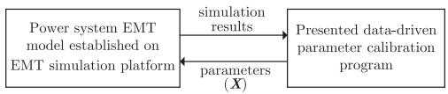  
Fig. 3. The interface and data-exchange between the EMT model and the parameter calibration program.

where V is the dimension of the normalized EMT simulation error $Y ; x _ { \mathrm { m a x } }$ and $x _ { \mathrm { m i n } }$ represent the maximum and minimum values of $\mathbf { Y }$ , respectively; $g _ { d } ^ { k }$ and $x _ { i d } ^ { k }$ represent the dth item of the global optimal particle and the ith particle at the kth iteration, respectively. Then, the weight $w _ { i } ^ { k }$ of the ith particle at the kth iteration can be calculated by [24]:

$$
w _ {i} ^ {k} = w _ {\mathrm {s}} - \left(w _ {\mathrm {s}} - w _ {\mathrm {e}}\right) \left(D _ {i} ^ {k} - 1\right) ^ {2} \tag {29}
$$

where $w _ { \mathrm { s } }$ and $w _ { \mathrm { e } }$ represent the initial value and end value of $w ,$ respectively.

2) Cross Mutation: Aiming at the premature convergence problem of PSO algorithm, the cross mutation in the genetic algorithm is introduced into the PSO algorithm. The specific steps are as follows:

- Determine the minimum value $D _ { \mathrm { m i n } }$ of the distance $D _ { i } ^ { k }$ the cross rate $p _ { \mathrm { c } } .$ , and the mutation rate $p _ { \mathrm { m } }$ .   
- In the kth iteration, the value of $D _ { i } ^ { k }$ is calculated. If $D _ { i } ^ { k } <$ $D _ { \mathrm { m i n } } .$ , this particle is cross-mutated.   
Select a random number $r _ { i d }$ between 0 and 1 for the dth item of the ith particle. If $r _ { i d } < p _ { \mathrm { m } }$ , the dth item of the ith particle should be initialized by:

$$
x _ {i d} = x _ {\min } + \left(x _ {\max } - x _ {\min }\right) r \tag {30}
$$

where r is a random number between 0 and 1.

After the particle is mutated, the cross-operation is performed. If $r _ { i d } < p _ { \mathrm { c } }$ , the dth item of the ith particle is which means crossed with the dth item of the global optimal particle, $x _ { i d } ^ { k } = g _ { d } ^ { k }$ .

# B. Optimization of the EMT Simulation Error Based on IPSO

The EMT simulation error optimization process is combined with the solution to the posterior distribution of parameter and the parameter calibration in the GMM. Firstly, the particle position is generated according to the IPSO algorithm. Then, the posterior distributions of parameters are obtained based on the particle position and the conditional probability invariance characteristic of GMM. Next, the values of the dominant parameters are calculated according to (27) and the particle position. Finally, the actual distance between the simulation result corresponding to the calculated dominant parameters and the reference result is used as the fitness function of IPSO to realize closed-loop calibration. The interface and data-exchange between the proposed method and the power system EMT model is shown in Fig. 3. In each iteration of the optimization process, the proposed method inputs the calculated parameters into the EMT simulation model and extracts the corresponding simulation results. The EMT simulation errors are then calculated according to (3), which is considered as the fitness value.

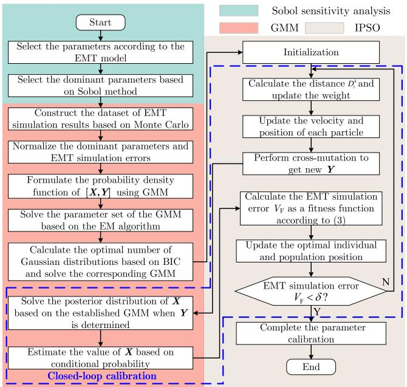  
Fig. 4. Flowchart of the proposed parameter calibration method.

# C. Flowchart of the Data-Driven Parameter Calibration Based on Sobol, GMM and IPSO

The overall flowchart of the proposed parameter calibration method is illustrated in Fig. 4. Specifically, a Sobol sensitivity analysis-based method is first used for selecting the dominant parameters of the EMT models of the power systems. Then, a large number of simulation results are generated based on random dominant parameters combinations. Furthermore, GMM is used for fitting the relationship between the dominant parameters and the EMT simulation errors. It allows for estimating the posterior distribution of the dominant parameters based on the conditional probability invariance of GMM when the errors are determined. Next, the errors in the GMM are optimized by IPSO. Last, the values of the dominant parameters corresponding to the minimum error are calculated according to the mean value of posterior distribution of the parameters.

# VI. CASE STUDIES

To validate the effectiveness of the proposed method, four power systems with different scales and complexities are built on the EMT simulation platform and their parameters are calibrated. All simulations are carried out on a desktop PC with 32G-RAM and 2.10 GHz Intel Core i7-13700. The proposed method is implemented based on the EMT simulation software CloudPSS [25], [26] and python 3.8.

# A. Real Experimental Base for Distribution Power System

A real experimental base for distribution power system is first considered to validate the accuracy of the proposed method in the fault inversion of real power system. The simplified schematic diagram of the real experimental base system is shown in Fig. 5. The value ranges of the parameters in the network are given in Table I, where the transformer tap k has five options. For this test

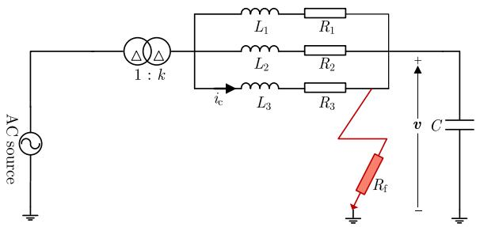  
Fig. 5. Simplified schematic diagram of the real experimental base.

TABLE I REAL EXPERIMENTAL BASE SYSTEM PARAMETERS TO BE CALIBRATED AND THEIR CALIBRATION RANGES   

<table><tr><td>Parameter</td><td>Calibration range</td><td>Parameter</td><td>Calibration range</td></tr><tr><td>C</td><td>0-4 μF</td><td>R1</td><td>0-3 Ω</td></tr><tr><td>L1</td><td>0-180 mH</td><td>R2</td><td>0-3 Ω</td></tr><tr><td>L2</td><td>0-180 mH</td><td>R3</td><td>0-3 Ω</td></tr><tr><td>L3</td><td>0-180 mH</td><td>Rf</td><td>400-600 Ω</td></tr><tr><td>k</td><td>0.95,0.975,1,1.025,1.05</td><td></td><td></td></tr></table>

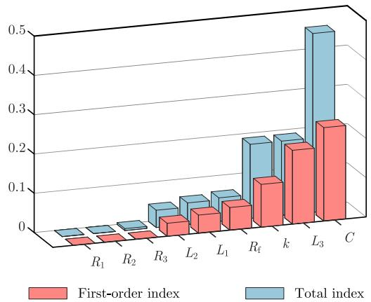  
Fig. 6. Sobol indexes for the parameters in the real experimental base of distribution system.

system, the fault recording waveforms of the three-phase nodal voltage v and branch current $i _ { \mathrm { c } }$ are considered as the reference and the EMT simulation errors are calculated according to them.

First, the Sobol indexes of different parameters with respect to the reference nodal voltages and branch current are calculated to obtain the dominant parameters. The Sobol indexes of the parameters are shown in Fig. 6. It can be seen from the histogram that $C , L _ { 1 } , L _ { 2 } , L _ { 3 }$ , k and $R _ { \mathrm { f } }$ have higher Sobol indexes compared to other parameters. Thus, these six parameters are selected as dominant parameters.

After selecting the dominant parameters, the value of each parameter is randomly generated within the calibration range and 3000 different values are generated for each parameter to obtain a training set. Then, the EMT simulation errors are calculated according to these parameters. Next, each piece of data is treated as a ten-dimensional random variable Z, where the first six items are the parameters and the last four items are the EMT simulation errors. Besides, to facilitate optimization,

TABLE II BIC INDEXES CORRESPONDING TO THE NUMBER OF GAUSSIAN COMPONENTS   

<table><tr><td>The number of Gaussian components</td><td>BIC(×105)</td><td>The Number of Gaussian components</td><td>BIC(×105)</td></tr><tr><td>40</td><td>-2.005</td><td>50</td><td>-2.041</td></tr><tr><td>41</td><td>-2.036</td><td>51</td><td>-2.020</td></tr><tr><td>42</td><td>-2.029</td><td>52</td><td>-2.021</td></tr><tr><td>43</td><td>-2.014</td><td>53</td><td>-2.058</td></tr><tr><td>44</td><td>-2.013</td><td>54</td><td>-2.028</td></tr><tr><td>45</td><td>-2.028</td><td>55</td><td>-2.021</td></tr><tr><td>46</td><td>-2.020</td><td>56</td><td>-2.030</td></tr><tr><td>47</td><td>-2.027</td><td>57</td><td>-2.023</td></tr><tr><td>48</td><td>-2.022</td><td>58</td><td>-2.050</td></tr><tr><td>49</td><td>-2.034</td><td>59</td><td>-2.050</td></tr></table>

TABLE III VALUES OF IPSO ALGORITHM PARAMETERS SETTING   

<table><tr><td>Parameter</td><td>Value</td><td>Parameter</td><td>Value</td></tr><tr><td>Number of iterations</td><td>30</td><td>Dmin</td><td>0.1</td></tr><tr><td>Number of particles</td><td>25</td><td>pc</td><td>0.04</td></tr><tr><td>ws</td><td>1</td><td>pm</td><td>0.12</td></tr><tr><td>we</td><td>0.4</td><td></td><td></td></tr></table>

TABLE IV VALUES OF EACH DOMINANT PARAMETER AFTER PARAMETER CALIBRATION   

<table><tr><td>Parameter</td><td>Real value</td><td>Calibrated value</td></tr><tr><td>C</td><td>2.1 μF</td><td>2.036 μF</td></tr><tr><td>L1</td><td>85 mH</td><td>90.526 mH</td></tr><tr><td>L2</td><td>85 mH</td><td>90.936 mH</td></tr><tr><td>L3</td><td>85 mH</td><td>83.453 mH</td></tr><tr><td>k</td><td>1</td><td>1</td></tr><tr><td>Rf</td><td>500 Ω</td><td>500.08 Ω</td></tr></table>

all parameters and errors are normalized into the range of 0.9-1.1 according to (12). After Z is normalized, the number of Gaussian components can be determined based on the BIC index in (20). As a rule of thumb, the number of Gaussian components is reasonable between 10 and 60 [27]. For this model, GMM has a poor fit when the number of Gaussian components is between 10 and 39. The BIC indexes corresponding to 40 to 59 Gaussian components are listed in Table II. It shows that the optimal number of Gaussian components is 53 for this test system. Next, a GMM with 53 Gaussian components is used to fit the relationship between the dominant parameters and the errors. The GMM parameter set Ω is calculated based on the EM algorithm. Then, the IPSO algorithm is used for the optimization of the errors and the parameters of the IPSO are listed in Table III. The final calibration results are shown in Table IV.

To validate the accuracy of the calibrated parameters in Table IV, simulations are conducted with the calibrated parameters and the simulation results are compared with the fault recording waveforms. The nodal voltages and the branch current are illustrated in Fig. 7 and the fault recording waveforms start at about $t = 0 . 0 7 \ s$ s. Besides, parameters of this test system are

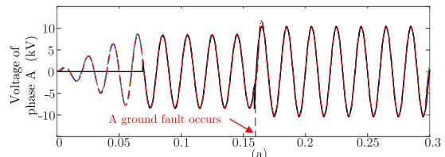

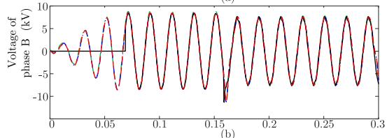

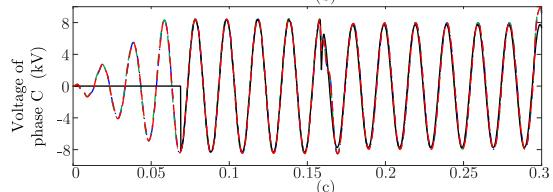

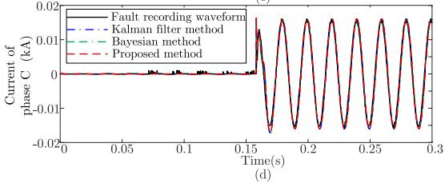  
Fig. 7. Comparison of fault recording waveforms and simulation results after parameter calibration. (a)-(c) Nodal voltages of phase A, B and C, respectively. (d) Branch current of phase C (the currents of phase A and phase B are near zero).

calibrated using Kalman filter and Bayesian inference in [15]. The simulation results obtained with these two methods are also shown in Fig. 7. As can be observed, the calibrated results of the proposed method and two other methods are all generally consistent with the fault waveform collected from the scene. This validates that the accuracy of the proposed method is near to the classic parameter calibration methods for this test system. However, the performance of the Bayesian approach in [15] may degrade in high-dimensional cases and the Kalman filter and Bayesian inference-based parameter calibration methods are difficult to implement in nonlinear, high-dimensional and more complex power system models. In contrast, it is readily for the proposed method to deal with the power system EMT models with such characteristics, which will be validated in the following.

# B. Energy Storage System

The parameters of an energy storage system are calibrated in this section. The schematic diagram of the energy storage system is shown in Fig. 8, which is composed of energy storage battery, AC/DC converter, AC source and converter control system. The converter control system consists of outer-loop power control, inner-loop current control, PLL and modulation. The details and the parameters of the energy storage system are presented in [28]. For this energy storage system, the active power, reactive power and the root mean square (RMS) value of the AC-side current are

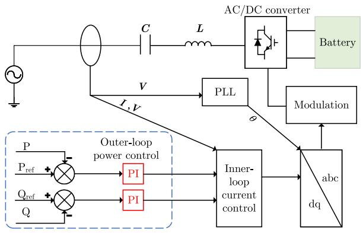  
Fig. 8. The schematic diagram of the energy storage system.

TABLE V TOTAL RESPONSE INDEXES FOR THE PARAMETERS IN THE ENERGY STORAGE SYSTEM   

<table><tr><td>Parameter</td><td>Total index(×10-3)</td><td>Parameter</td><td>Total index(×10-3)</td></tr><tr><td>L3</td><td>413.22</td><td>C1</td><td>3.53</td></tr><tr><td>L2</td><td>391.14</td><td>C2</td><td>2.91</td></tr><tr><td>L1</td><td>263.08</td><td>Kqp1</td><td>2.11</td></tr><tr><td>Kdi</td><td>152.7</td><td>C3</td><td>1.71</td></tr><tr><td>Kdi1</td><td>7.54</td><td>Kqi1</td><td>1.23</td></tr><tr><td>Kqp</td><td>5.321</td><td>Kqi</td><td>0.301</td></tr><tr><td>Kdp1</td><td>3.61</td><td>Kdp</td><td>0.0173</td></tr></table>

TABLE VI BIC VALUE OF THE NUMBER OF EACH GAUSSIAN COMPONENT   

<table><tr><td>The number of Gaussian components</td><td>BIC(×105)</td><td>The number of Gaussian components</td><td>BIC(×105)</td></tr><tr><td>10</td><td>-1.794</td><td>20</td><td>-2.171</td></tr><tr><td>11</td><td>-1.789</td><td>21</td><td>-1.782</td></tr><tr><td>12</td><td>-2.243</td><td>22</td><td>-1.803</td></tr><tr><td>13</td><td>-1.711</td><td>23</td><td>-1.815</td></tr><tr><td>14</td><td>-1.814</td><td>24</td><td>-1.680</td></tr><tr><td>15</td><td>-1.795</td><td>25</td><td>-1.768</td></tr><tr><td>16</td><td>-1.804</td><td>26</td><td>-1.814</td></tr><tr><td>17</td><td>-1.811</td><td>27</td><td>-1.701</td></tr><tr><td>18</td><td>-2.087</td><td>28</td><td>-1.711</td></tr><tr><td>19</td><td>-1.690</td><td>29</td><td>-1.795</td></tr></table>

measured as the reference results. The EMT simulation errors are calculated based on these three measurement results for parameter calibration.

The Sobol indexes of parameters are listed in Table V, where $K _ { \mathrm { d p } } , K _ { \mathrm { d i } } , K _ { \mathrm { q p } }$ and $K _ { \mathrm { q i } }$ are the PI parameters of the outer-loop power control, $K _ { \mathrm { d p 1 } } , K _ { \mathrm { d i 1 } } , K _ { \mathrm { q p 1 } }$ and $K _ { \mathrm { q i 1 } }$ are the PI parameters of the inner-loop current control. It can be found that the dominant parameters are $K _ { \mathrm { d i } } , L _ { 1 } , L _ { 2 }$ and $L _ { 3 }$ .

Due to the reduction in the amount of simulation data compared to the previous example, the range of the number of Gaussian components is set between 10 and 30. After the calculation, the BIC values under different numbers of Gaussian components

TABLE VII VALUES OF EACH DOMINANT PARAMETER AFTER PARAMETER CALIBRATION   

<table><tr><td>Parameter</td><td>Calibration range</td><td>Real value</td><td>Calibrated value</td></tr><tr><td>Kdi</td><td>0-0.1</td><td>0.051</td><td>0.0501</td></tr><tr><td>L1</td><td>0-10 mH</td><td>4.95 mH</td><td>5.06 mH</td></tr><tr><td>L2</td><td>0-10 mH</td><td>5 mH</td><td>4.96 mH</td></tr><tr><td>L3</td><td>0-10 mH</td><td>4.92 mH</td><td>4.99 mH</td></tr></table>

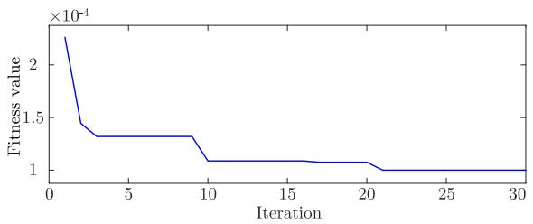  
Fig. 9. The convergence curve of IPSO in 30 iterations.

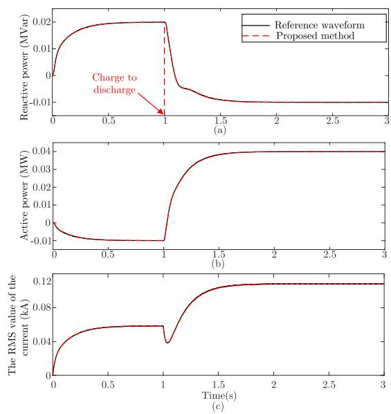  
Fig. 10. Simulation results obtained with the calibrated parameters. (a) Reactive power. (b) Active power. (c) The RMS value of the AC-side current.

are listed in Table VI, which shows that the optimal number of Gaussian components is 12.

Finally, using IPSO and GMM described in Section V, the calibrated parameters are calculated and shown in Table VII. The optimization process is illustrated in Fig. 9. It can be seen that the fitness value converges as the number of iteration increases. In order to verify the accuracy of the calibrated parameters, the EMT simulation results with the calibrated parameters are calculated and compared with the reference waveform in Fig. 10. It can be found that the simulation results obtained from the proposed method are coincident with the reference waveforms. In addition, the 2-norm cumulative relative errors for the three waveforms are 0.063%, 0.252% and 0.225%, respectively. The errors of the results obtained from the proposed parameter calibration method are completely acceptable.

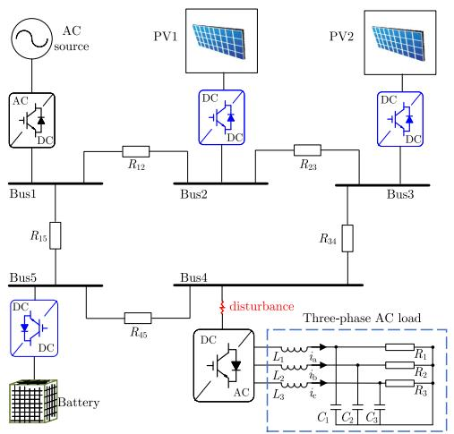  
Fig. 11. Schematic diagram of a DC microgrid system.

TABLE VIII TOTAL RESPONSE INDEXES FOR THE PARAMETERS IN THE DC MICROGRID   

<table><tr><td>Parameter</td><td>Total index(×10-3)</td><td>Parameter</td><td>Total index(×10-3)</td></tr><tr><td>L3</td><td>463.07</td><td>Ki3</td><td>2.78</td></tr><tr><td>L2</td><td>392.48</td><td>C3</td><td>2.47</td></tr><tr><td>R3</td><td>338.79</td><td>C2</td><td>1.47</td></tr><tr><td>R1</td><td>253.34</td><td>Kp1</td><td>0.14</td></tr><tr><td>L1</td><td>244.18</td><td>C1</td><td>0.11</td></tr><tr><td>R2</td><td>118.47</td><td>Kp2</td><td>0.044</td></tr><tr><td>Ki1</td><td>4.09</td><td>Kp3</td><td>0.028</td></tr><tr><td>Ki4</td><td>3.24</td><td>Kp4</td><td>0.011</td></tr><tr><td>Ki2</td><td>3.08</td><td></td><td></td></tr></table>

# C. DC Microgrid System

A DC microgrid system is also considered, whose schematic diagram is shown in Fig. 11. The system contains a solid state transformer, an energy storage system, two photovoltaic systems and a three-phase inverter with the loads. Detailed parameters of this test system can be found in [25]. For the DC microgrid system, the EMT simulation errors are calculated according to $i _ { \mathrm { a } } , i _ { \mathrm { b } }$ and $i _ { \mathrm { c } }$ .

To validate the effectiveness of the proposed method in the DC microgrid system, the load parameters and the control parameters of the DC/AC converter are considered as the parameters to be calibrated. A disturbance is applied to the DC side of the inverter of Bus4 at $t = 0 . 2 ~ \mathrm { s }$ and the fault is cleared at $t = 0 . 2 2 5 \mathrm { ~ s ~ }$ . The Sobol indexes of the parameters are then calculated and listed in Table VIII. As can be observed from the table, the resistance and inductance parameters are the dominant parameters.

After generating a large amount of simulation data using the Monte Carlo method, the BIC values corresponding to the number of Gaussian components are calculated and shown in Table IX. The optimal number of Gaussian components is 55. Then, an appropriate GMM is constructed and the parameters can be calibrated by the IPSO as described in Section V. The calibrated parameters are listed in Table X. It can be seen from

TABLE IX BIC VALUE CORRESPONDING TO THE NUMBER OF GAUSSIAN COMPONENTS   

<table><tr><td>The number of Gaussian components</td><td>BIC(×105)</td><td>The number of Gaussian components</td><td>BIC(×105)</td></tr><tr><td>40</td><td>-1.261</td><td>50</td><td>-1.267</td></tr><tr><td>41</td><td>-1.262</td><td>51</td><td>-1.258</td></tr><tr><td>42</td><td>-1.249</td><td>52</td><td>-1.271</td></tr><tr><td>43</td><td>-1.257</td><td>53</td><td>-1.265</td></tr><tr><td>44</td><td>-1.263</td><td>54</td><td>-1.267</td></tr><tr><td>45</td><td>-1.268</td><td>55</td><td>-1.273</td></tr><tr><td>46</td><td>-1.270</td><td>56</td><td>-1.268</td></tr><tr><td>47</td><td>-1.264</td><td>57</td><td>-1.264</td></tr><tr><td>48</td><td>-1.265</td><td>58</td><td>-1.272</td></tr><tr><td>49</td><td>-1.262</td><td>59</td><td>-1.266</td></tr></table>

TABLE XVALUES OF EACH DOMINANT PARAMETER AFTER PARAMETER CALIBRATIONIN DC MICROGRID SYSTEM WITH BALANCED LOAD  

<table><tr><td>Parameter</td><td>Calibration range</td><td>Real value</td><td>Calibrated value</td></tr><tr><td>L1</td><td>0-10 mH</td><td>5 mH</td><td>4.96 mH</td></tr><tr><td>L2</td><td>0-10 mH</td><td>5 mH</td><td>5.09 mH</td></tr><tr><td>L3</td><td>0-10 mH</td><td>5 mH</td><td>4.99 mH</td></tr><tr><td>R1</td><td>0-4 Ω</td><td>2 Ω</td><td>1.993 Ω</td></tr><tr><td>R2</td><td>0-4 Ω</td><td>2 Ω</td><td>2.076 Ω</td></tr><tr><td>R3</td><td>0-4 Ω</td><td>2 Ω</td><td>1.935 Ω</td></tr></table>

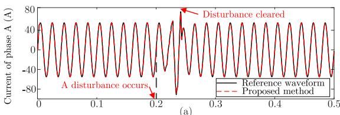

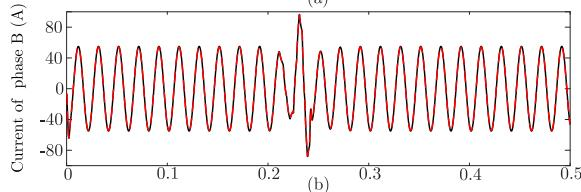

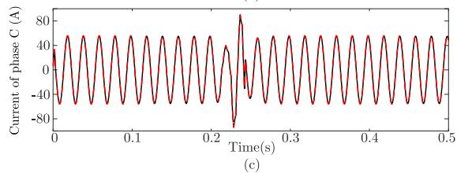  
Fig. 12. Simulation results obtained with the calibrated parameters when the load is balanced.

the table that the values of calibrated parameters are close to the real values.

Next, to further illustrate the accuracy of the calibrated parameters, an EMT simulation is conducted with the calibrated parameters and compared with the reference results in Fig. 12. It is obvious that the simulation results demonstrate a perfect agreement between the proposed method and the reference

TABLE XIVALUES OF EACH DOMINANT PARAMETER AFTER PARAMETER CALIBRATIONIN DC MICROGRID SYSTEM WITH UNBALANCED LOAD  

<table><tr><td>Parameter</td><td>Real value</td><td>Calibrated value</td></tr><tr><td>L1</td><td>3 mH</td><td>3.14 mH</td></tr><tr><td>L2</td><td>5 mH</td><td>5.07 mH</td></tr><tr><td>L3</td><td>6 mH</td><td>6.21 mH</td></tr><tr><td>R1</td><td>2 Ω</td><td>2.054 Ω</td></tr><tr><td>R2</td><td>2.5 Ω</td><td>2.495 Ω</td></tr><tr><td>R3</td><td>1.5 Ω</td><td>1.508 Ω</td></tr></table>

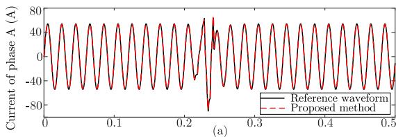

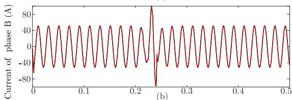

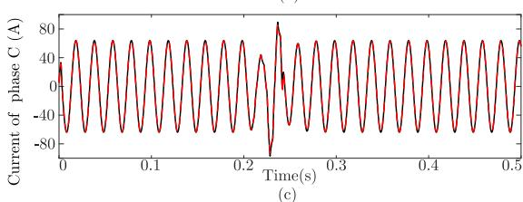  
Fig. 13. Simulation results obtained with the calibrated parameters when the load is unbalanced.

results. Besides, the mean square values (MSE) for the three waveforms are 0.12, 0.12 and 0.108, respectively, which are all tiny.

In addition to the balanced condition, the parameter calibration is also applied to an unbalanced load. The parameter settings of the load and calibrated results are shown in Table XI. The EMT simulations are conducted with real parameters and the calibrated parameters, respectively. The simulation results are compared and illustrated in Fig. 13. It shows once again that the proposed parameter calibration method is accurate.

To better demonstrate the accuracy of the proposed method, multiple sets of data are randomly generated and calibrated with the proposed method for the parameters listed in Table XI. The mean values of MSE for different calibration scenarios are listed in Table XII. As can be seen from the table, the MSE values for different calibration scenarios are all very small.

# D. A Large-Scale Hybrid AC/DC System

The proposed parameter calibration method is also tested on a large-scale hybrid AC/DC system to better demonstrate its scalability. The schematic diagram of the system is shown in Fig. 14. It has a total of 197 nodes. Fig. 14 mainly shows the

TABLE XIITHE MSE VALUES FOR DIFFERENT CALIBRATION SCENARIOS IN DCMICROGRID SYSTEM  

<table><tr><td>Number of calibration scenarios</td><td>IA</td><td>IB</td><td>IC</td></tr><tr><td>1</td><td>0.333</td><td>0.412</td><td>0.086</td></tr><tr><td>10</td><td>0.194</td><td>0.229</td><td>0.109</td></tr><tr><td>100</td><td>0.129</td><td>0.153</td><td>0.134</td></tr></table>

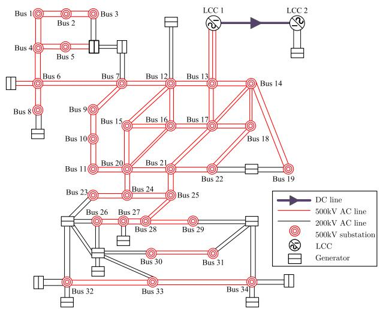  
Fig. 14. Schematic diagram of the large-scale hybrid AC/DC system.

500 kV network and some 220 kV transmission lines. Assume that the parameters of the DC transmission system need to be calibrated. It mainly consists of converter stations, DC lines, transformers and control devices, etc. The parameters in the DC system can be divided into electrical parameters (EP) and control parameters. Among them, some parameters can be set according to the actual system conditions and do not require calibration. Therefore, this section primarily focuses on the calibration of the system’s parameters that may change.

The electrical parameters mainly include $R _ { \mathrm { l } } , L _ { \mathrm { l } } , L _ { \mathrm { i } }$ and $L _ { \mathrm { j } } ,$ where $R _ { 1 }$ and $L _ { \mathrm { l } }$ represent the resistance and inductance of the DC transmission line, respectively; $L _ { \mathrm { i } }$ and $L _ { \mathrm { j } }$ represent the sum of the smoothing reactor inductance and the grounding inductance on both sides, respectively. In condition to the electrical parameters, many parameters in the control system affect the system response. As illustrated in Fig. 15, the control system of DC system is composed of nine modules. The four electrical parameters and all parameters in the nine modules are selected for sensitivity calculation. In the simulation, a three-phase fault that lasts 0.06 s is applied to transmission line 12-13 at t = 5 s. $V _ { \mathrm { d c } 1 } , \ V _ { \mathrm { d c } 2 }$ and $I _ { \mathrm { d c } }$ between 4.5 s and 6.5 s are determined as the reference and the EMT simulation errors are also calculated based on them.

After the Sobol sensitivity analysis, the Sobol indexes of the parameters are listed in Table XIII. It is clear that the first ten parameters are dominant parameters for their higher total indexes. According to these dominant parameters, 5000 simulation scenarios are generated using the Monte Carlo method and the corresponding results can be obtained after the simulation.

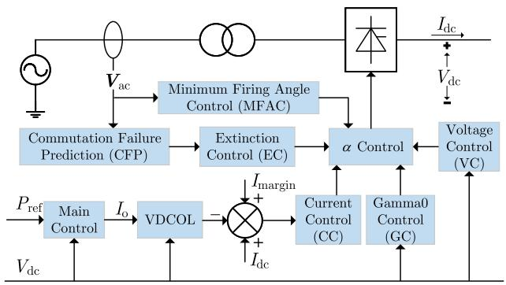  
Fig. 15. Component modules of LCC-HVDC control system.

TABLE XIII SOBOL INDEXES FOR THE PARAMETERS TO BE CALIBRATED IN THE DC CONTROL SYSTEM   

<table><tr><td>Symbol</td><td>Quantity</td><td>Calibration range</td><td>Total index(×10-3)</td></tr><tr><td>Gain(CC)</td><td>total gain</td><td>0-40</td><td>724.413</td></tr><tr><td>Tji(CC)</td><td>integration time constant</td><td>0-0.02 s</td><td>643.157</td></tr><tr><td>Kpi(CC)</td><td>control proportional gain</td><td>0-5</td><td>136.621</td></tr><tr><td>Lj(EP)</td><td>inductance of inverter side</td><td>200-400 mH</td><td>38.405</td></tr><tr><td>Li(EP)</td><td>inductance of rectifier side</td><td>200-400 mH</td><td>36.556</td></tr><tr><td>Rl(EP)</td><td>resistance of DC line</td><td>0-30 Ω</td><td>28.358</td></tr><tr><td>Ll(EP)</td><td>inductance of DC line</td><td>1000-2500 mH</td><td>24.486</td></tr><tr><td>Tivca(VC)</td><td>integration time constant</td><td>0-0.02 s</td><td>17.828</td></tr><tr><td>Tup(VDCOL)</td><td>voltage rising filter time constant</td><td>0-0.03 s</td><td>11.387</td></tr><tr><td>Tdn(VDCOL)</td><td>voltage drop filter time constant</td><td>0-0.1 s</td><td>9.09</td></tr><tr><td>Kpvca(VC)</td><td>control proportional gain</td><td>0-20</td><td>0.003</td></tr><tr><td>decr(MFAC)</td><td>angular descent rate</td><td>0-3</td><td>0</td></tr><tr><td>Gamax(EC)</td><td>control gain</td><td>0-0.5</td><td>0</td></tr><tr><td>Tamax(EC)</td><td>time constant</td><td>0-0.02 s</td><td>0</td></tr><tr><td>Tga(GC)</td><td>start delay time</td><td>0-0.1 s</td><td>0</td></tr><tr><td>Gcf(CFP)</td><td>prediction gain</td><td>0-1</td><td>0</td></tr><tr><td>Kcf(CFP)</td><td>angle fall time constant</td><td>0-1</td><td>0</td></tr></table>

TABLE XIV VALUES OF EACH DOMINANT PARAMETER AFTER PARAMETER CALIBRATION   

<table><tr><td>Parameter</td><td>Real value</td><td>Calibrated value</td></tr><tr><td>Rl</td><td>15 Ω</td><td>14.13 Ω</td></tr><tr><td>Ll</td><td>2000 mH</td><td>1945 mH</td></tr><tr><td>Li</td><td>300 mH</td><td>298 mH</td></tr><tr><td>Lj</td><td>300 mH</td><td>291.8 mH</td></tr><tr><td>Tup</td><td>0.015 s</td><td>0.0147 s</td></tr><tr><td>Td n</td><td>0.04 s</td><td>0.04015 s</td></tr><tr><td>Tivca</td><td>0.0011 s</td><td>0.0014 s</td></tr><tr><td>Gain</td><td>20</td><td>18.3</td></tr><tr><td>Kpi</td><td>2.8</td><td>3.05</td></tr><tr><td>Tii</td><td>0.014 s</td><td>0.01328 s</td></tr></table>

Then, the corresponding BIC values are calculated when the range of the number of Gaussian components is set between 30 and 70. The selected optimal number of Gaussian components is 46 according to the calculated BIC values. After that, the proposed parameter calibration method is performed and the final calibration results are listed in Table XIV. It can be seen that the difference between the calibrated values and the real values

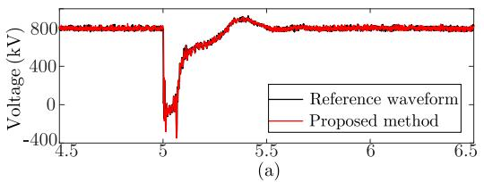

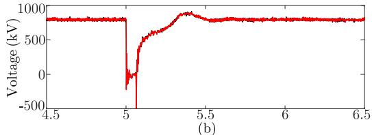

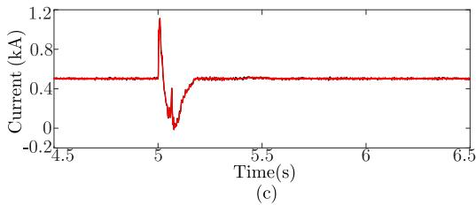  
Fig. 16. Simulation results obtained with the calibrated parameters. (a) DC voltage of rectifier. (b) DC voltage of inverter. (c) DC current of rectifier.

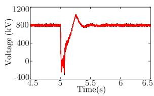

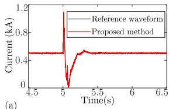

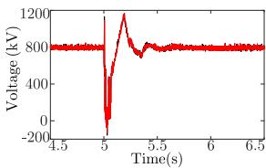

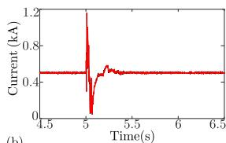

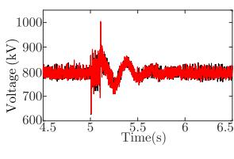

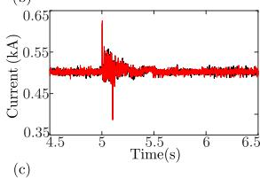  
Fig. 17. Simulation results obtained with the real parameters and the calibrated parameters under three different faults. (a) Phase-to-phase fault. (b) Phase-toground fault. (c) Blocking of positive pole converter.

is very small. The result fully demonstrates the feasibility and scalability of the proposed method for the large power system EMT model.

Furthermore, the simulation results based on the calibrated parameters are illustrated in Fig. 16. It shows that the simulation waveforms obtained from the proposed method align closely with the reference waveforms. Besides, the 2-norm cumulative relative errors for the waveforms are all tiny, which are 2.2%, 1.5% and 1.3%, respectively.

Actually, the true model parameters are usually unknown in real application. It is possible that for different faults the

proposed method may obtain different parameters. The engineering judgment and experience are often used for selecting the accurate parameters in this case. In addition to these methods, one method is to calibrate the parameters based on one fault and use other faults to verify the obtained parameters. Here three fault recording waveforms are assumed to be available. Fig. 17 shows the simulation results under three faults with the calibrated parameters. It can be seen that the simulation results from the calibrated parameters are coincident with the recording waveforms for three faults, which well demonstrates the accuracy of the calibrated parameters.

In summary, it can be seen that the proposed calibration method is effective and accurate in various of operational conditions and test systems.

# VII. CONCLUSION

A data-driven parameter calibration method of power system EMT model is proposed based on Sobol sensitivity analysis and GMM. Theoretical analyses and experimental tests demonstrate that the proposed method is accurate and adaptable for various of power systems. The test results show that the simulation errors obtained with the calibrated parameters are smaller than 5%, which is completely allowable. Besides, the proposed method is promising in more complex power system EMT models. In future research, due to the advantages of the proposed parameter calibration framework, the proposed method will be further extended in the aspect of EMT simulation error optimization and the parallel computing.

# REFERENCES

[1] J. Mahseredjian, V. Dinavahi, and J. A. Martinez, “Simulation tools for electromagnetic transients in power systems: Overview and challenges,” IEEE Trans. Power Del., vol. 24, no. 3, pp. 1657–1669, Jul. 2009.   
[2] Z. Yu, L. Xiao, H. Li, X. Zhu, and R. Huai, “Model parameter identification for lithium batteries using the coevolutionary particle swarm optimization method,” IEEE Trans. Ind. Electron., vol. 64, no. 7, pp. 5690–5700, Jul. 2017.   
[3] Z. Cui, N. Cui, C. Wang, C. Li, and C. Zhang, “A robust online parameter identification method for lithium-ion battery model under asynchronous sampling and noise interference,” IEEE Trans. Ind. Electron., vol. 68, no. 10, pp. 9550–9560, Oct. 2021.   
[4] K. V. Khandeparkar, S. A. Soman, and G. Gajjar, “Detection and correction of systematic errors in instrument transformers along with line parameter estimation using PMU data,” IEEE Trans. Power Syst., vol. 32, no. 4, pp. 3089–3098, Jul. 2017.   
[5] A. Mohamed, A. Hussain, S. M. Zali, and A. Ariffin, “A systematic approach in estimating the generator parameters,” Elect. Power Compon. Syst., vol. 30, no. 3, pp. 301–313, 2002.   
[6] A. Bobo ´n, A. Noco ´n, S. Paszek, and P. Pruski, “Determination of synchronous generator nonlinear model parameters based on power rejection tests using a gradient optimization algorithm,” Bull. Polish Acad. Sci. Tech. Sci., vol. 65, no. 4, pp. 479–488, 2017.   
[7] G. Du and P. Zhang, “Online serial manipulator calibration based on multisensory process via extended Kalman and particle filters,” IEEE Trans. Ind. Electron., vol. 61, no. 12, pp. 6852–6859, Dec. 2014.   
[8] X. Li and R. Kennel, “General formulation of Kalman-filter-based online parameter identification methods for VSI-fed PMSMs,” IEEE Trans. Ind. Electron., vol. 68, no. 4, pp. 2856–2864, Apr. 2021.   
[9] Y. Wang, Y. Sun, Z. Wei, and G. Sun, “Parameters estimation of electromechanical oscillation with incomplete measurement information,” IEEE Trans. Power Syst., vol. 33, no. 5, pp. 5016–5028, Sep. 2018.   
[10] R. Huang et al., “Calibrating parameters of power system stability models using advanced ensemble Kalman filter,” IEEE Trans. Power Syst., vol. 33, no. 3, pp. 2895–2905, May 2018.

[11] J. Zhao and L. Mili, “Robust unscented Kalman filter for power system dynamic state estimation with unknown noise statistics,” IEEE Trans. Smart Grid, vol. 10, no. 2, pp. 1215–1224, Mar. 2019.   
[12] J. Qi, K. Sun, J. Wang, and H. Liu, “Dynamic state estimation for multi-machine power system by unscented Kalman filter with enhanced numerical stability,” IEEE Trans. Smart Grid, vol. 9, no. 2, pp. 1184–1196, Mar. 2018.   
[13] Y. Xu et al., “Response-surface-based Bayesian inference for power system dynamic parameter estimation,” IEEE Trans. Smart Grid, vol. 10, no. 6, pp. 5899–5909, Nov. 2019.   
[14] Y. Xu, L. Mili, X. Chen, M. Korkali, and L. Min, “A Bayesian approach to real-time dynamic parameter estimation using phasor measurement unit measurement,” IEEE Trans. Power Syst., vol. 35, no. 2, pp. 1109–1119, Mar. 2020.   
[15] Y. Xu, L. Mili, M. Korkali, and X. Chen, “An adaptive Bayesian parameter estimation of a synchronous generator under gross errors,” IEEE Trans. Ind. Informat., vol. 16, no. 8, pp. 5088–5098, Aug. 2020.   
[16] S. R. Khazeiynasab and J. Qi, “Generator parameter calibration by adaptive approximate Bayesian computation with sequential monte carlo sampler,” IEEE Trans. Smart Grid, vol. 12, no. 5, pp. 4327–4338, Sep. 2021.   
[17] G. Damblin and A. Ghione, “Adaptive use of replicated latin hypercube designs for computing sobol’sensitivity indices,” Reliab. Eng. Syst. Saf., vol. 212, 2021, Art. no. 107507.   
[18] K. Ye, J. Zhao, C. Huang, N. Duan, Y. Zhang, and T. E. Field, “A datadriven global sensitivity analysis framework for three-phase distribution system with PVs,” IEEE Trans. Power Syst., vol. 36, no. 5, pp. 4809–4819, Sep. 2021.   
[19] I. M. Sobol, “Global sensitivity indices for nonlinear mathematical models and their monte carlo estimates,” Math. Comput. Simul., vol. 55, no. 1–3, pp. 271–280, 2001.

[20] R. Li, Z. Wang, C. Gu, F. Li, and H. Wu, “A novel time-of-use tariff design based on gaussian mixture model,” Appl. Energy, vol. 162, pp. 1530–1536, 2016.   
[21] R. Singh, B. C. Pal, and R. A. Jabr, “Statistical representation of distribution system loads using Gaussian mixture model,” IEEE Trans. Power Syst., vol. 25, no. 1, pp. 29–37, Feb. 2010.   
[22] J. Ding, V. Tarokh, and Y. Yang, “Bridging AIC and BIC: A new criterion for autoregression,” IEEE Trans. Inf. Theory, vol. 64, no. 6, pp. 4024–4043, Jun. 2018.   
[23] Z. Wang, C. Shen, F. Liu, J. Wang, and X. Wu, “An adjustable chanceconstrained approach for flexible ramping capacity allocation,” IEEE Trans. Sustain. Energy, vol. 9, no. 4, pp. 1798–1811, Jun. 2018.   
[24] X. Wu, Z. Liu, L. Tian, D. Ding, and S. Yang, “Energy storage device locating and sizing for distribution network based on improved multiobjective particle swarm optimizer,” Power System Technol., vol. 38, no. 12, pp. 3405–3411, 2014.   
[25] S. Gao, Y. Song, Y. Chen, Z. Yu, and R. Zhang, “Fast simulation model of voltage source converters with arbitrary topology using switch-state prediction,” IEEE Trans. Power Electron., vol. 37, no. 10, pp. 12167–12181, Oct. 2022.   
[26] Y. Song, Y. Chen, Z. Yu, S. Huang, and C. Shen, “CloudPSS: A highperformance power system simulator based on cloud computing,” Energy Rep., vol. 6, pp. 1611–1618, 2020.   
[27] R. Cirigliano and F. Resende, “Optimization of the number of gaussian components for speaker identification,” in Proc. IEEE Int. Telecommun. Symp., 2006, pp. 422–425.   
[28] Tsinghua University, “Energy storage averaging model,” Dec. 2023. [Online]. Available: https://cloudpss.net/model/CloudPSS/Bat_Averaged#/ design/diagram/canvas/canvas_1