# 小波奇异熵在线路暂态保护和全线相继速动保护中的应用

刘青，王增平，郑振华

（华北电力大学电力系统保护与动态安全监控教育部重点实验室，河北省保定市071003）

摘要：利用小波信息熵的特点，将小波熵之一的小波奇异熵用于输电线路单端暂态量保护和全线相继速动保护中，提出了基于小波奇异熵的新型输电线路单端暂态量保护和全线相继速动保护方案。PSCAD/EMTDC仿真结果证明，文中提出的利用小波奇异熵构成的单端暂态量保护判据，不受故障位置、故障类型、过渡电阻及故障时刻的影响，具有良好的适应性和灵敏性。基于小波奇异熵的相继速动判据，克服了小波模极大值判据受被分析信号幅值的影响，具有更高的灵敏度，证明了小波信息熵技术在电力系统继电保护领域具有良好的应用前景。

关键词：继电保护；单端量暂态保护；相继速动；小波奇异熵

中图分类号：TM773

# 0 引言

近年来，小波技术的发展推动了电力系统继电保护的发展，为暂态保护的实现提供了技术基础和保障[1-4]。然而小波变换结果中包含大量的小波分解信息和数据，将小波分析用于大量的信息提取还需要研究恰当的数据挖掘方法。

小波熵理论于1998年提出，Blanco等人基于小波变换定义了小波熵[5-6]。由于小波变换是一种时频分析方法，具有多分辨分析的特点，而信息熵对信息具有较强的表征能力，因此小波熵结合了小波变换在处理不规则异常信号中的独特优势以及信息熵对信号复杂程度的统计特性，将其应用于电力系统暂态信号的分析和处理，具有很好的应用前景。目前，小波熵理论已应用于电力系统的故障检测[7-9]和故障选相[10-11]。由于小波熵能更为有效地分析突变信号，并且能够从定量上对突变信号加以区分，为暂态保护的实现提供了技术条件，可望在暂态保护领域得到较好的应用。

本文在近来相关研究工作的基础上，将小波熵之一的小波奇异熵用于输电线路单端暂态量保护和全线相继速动保护中。分析了小波奇异熵在故障暂态和扰动暂态(断路器跳闸)时的特征，提出了基于小波奇异熵的新型输电线路单端暂态保护和全线相继速动保护方案，仿真结果表明小波熵技术在继电保护领域具有良好的应用前景。

# 1 小波熵在线路单端暂态保护中的应用

# 1.1 区内外故障暂态信号特征分析

电力系统故障时将产生附加的暂态分量，这些

故障分量包含丰富的故障信息并分布于从直流分量到高频分量的广阔频谱范围内，而且高频分量中包含着比工频分量更多的故障信息。由于超高压输电线路两端母线杂散电容和阻波器的存在，使得在被保护线路区内、外故障时在单端测得的电压、电流暂态量存在差异[4]。当区内各点发生故障时，这一瞬间阶跃信号在频域中包含整个频谱，反映为较宽频带的高频分量；当区外发生故障时，由于母线杂散电容以及阻波器的影响而大量衰减，且频率越高衰减越严重，因此其频率分布范围将大为缩小。根据小波奇异熵具有分析信号越简单熵值越小、信号越复杂熵值越大的特点，则保护安装处所感受到的区内、外故障时频率分布的不同，反映到小波奇异熵就是奇异熵值的不同。即在区内故障时故障电流信号的小波奇异熵就比较大，区外故障时的故障电流信号的小波奇异熵就比较小。

# 1.2 基于小波熵的故障暂态信号特征仿真

利用小波奇异熵对图1所示 $500\mathrm{kV}$ 系统中的 $M$ 侧保护进行分析。 $F_{1},F_{2}$ 为区内故障， $F_{3},F_{4},F_{5}$ 为区外故障，分别对各种故障类型情况下的不同故障位置进行了大量仿真。

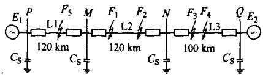  
图1 $500\mathrm{kV}$ 超高压输电线路模型  
Fig.1 Structure of $500\mathrm{kV}$ EHV transmission line

由于篇幅所限，本文只给出单相接地故障时区内 $F_{1}$ 点和区外 $F_{4}$ 点的故障电流 $I_{\mathrm{A}}$ 、频谱分布 $D_{1}$ ， $D_{2}, D_{3}$ 和小波奇异熵 $W_{\mathrm{se}}$ 的仿真波形图，分别如图2

和图3所示。其故障时刻是在第4000个采样点（采样频率 $200\mathrm{kHz}$ ）。

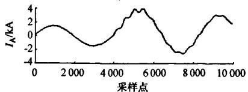

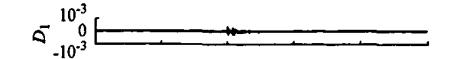  
（a）故障电流波形

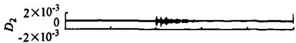

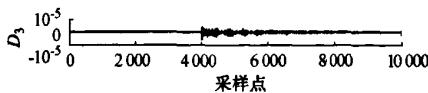  
（b）频谱分布波形

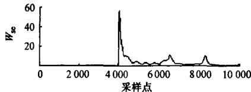  
（c）小波奇异熵波形  
图2区内故障时的电流频谱和小波奇异熵波形

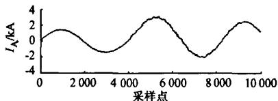  
Fig. 2 Waveform analysis of internal fault   
(a)故障电流波形

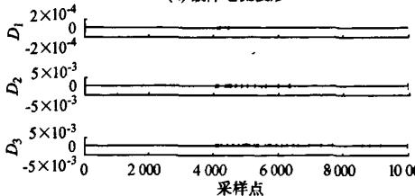

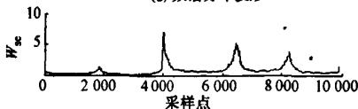  
(b)频谱分布波形  
(c)小波奇异熵波形   
图3 区外故障时的电流和小波奇异熵波形  
Fig. 3 Waveform analysis of external fault

由仿真结果比较可知，区内故障时的频谱分布范围宽，信号复杂，而区外故障时的高频分量明显衰减，频谱分布范围缩小。小波奇异熵波形结果表明，不论是区内故障还是区外故障，在故障时刻其熵值都显著增加，由此可以判断故障的发生。而且区内故障与区外故障时的小波熵值相比，区内故障时的熵值要大很多。

# 1.3 基于小波熵的单端暂态保护判据

根据故障时小波奇异熵的特征分析，当系统中发生故障时，利用故障暂态电流的小波奇异熵值会有突变，可作为暂态保护的启动判据。利用区内、外故障时小波奇异熵值的大小差异，可以构成区分区内、外故障的判据。

1)启动判据

$$
W _ {\mathrm {s e}} > \alpha \tag {1}
$$

为避免扰动时保护误动作，其门槛值 $\alpha$ 应加可靠系数。

# 2)保护跳闸判据

判别区内故障的判据为：

$$
W _ {\mathrm {s e}} > k _ {\mathrm {s e s e t}} \tag {2}
$$

区内故障时， $W_{\mathrm{sc}}$ 大于定值 $k_{\mathrm{set}}$ ，保护动作于跳闸；区外故障时， $W_{\mathrm{sc}}$ 小于定值 $k_{\mathrm{set}}$ ，保护闭锁。门槛值的选择必须大于区外故障时的最大值，小于区内故障时的最小值。

# 1.4 仿真算例

系统仿真见图1。 $MN$ 段为区内，长度 $120\mathrm{km}$ ，PM和 $NQ$ 段为区外，长度为 $120\mathrm{km},100\mathrm{km}$ ，线路参数为 $Z_{1} = (0.01808 + \mathrm{j}0.27747)\Omega /\mathrm{km},Z_{0} = (0.23084 + \mathrm{j}0.9728)\Omega /\mathrm{km},C_{1} = 0.0131\mu \mathrm{F / km},$ $C_0 = 0.0081161\mu \mathrm{F / km}$ 。小波函数采用DB4小波，4层分解。小波奇异熵的数据窗宽 $\pmb{\omega}$ 取为100。仿真中的故障点 $F_{1},F_{2},F_{3},F_{4},F_{5}$ 分别为 $M$ 侧保护正方向 $10\mathrm{km},119.5\mathrm{km}$ ，正向区外 $0.5\mathrm{km}$ ，正向区外 $50~\mathrm{km}$ ，反向区外 $0.5\mathrm{km}$ 处发生故障。分别对不同故障类型、不同故障位置、不同过渡电阻、不同故障时刻和不同母线电容进行仿真，仿真结果如表 $1\sim$ 表4所示。

表 1 不同故障类型时的小波奇异熵值  
Table 1 $W_{\mathrm{sc}}$ of different fault types   

<table><tr><td rowspan="2">故障类型</td><td colspan="2">区内故障</td><td colspan="3">区外故障</td></tr><tr><td>F1</td><td>F2</td><td>F3</td><td>F4</td><td>F5</td></tr><tr><td>A相接地</td><td>41.10</td><td>21.08</td><td>4.75</td><td>1.34</td><td>4.79</td></tr><tr><td>BC短路</td><td>68.76</td><td>29.12</td><td>6.35</td><td>2.76</td><td>8.50</td></tr><tr><td>三相短路</td><td>71.12</td><td>34.50</td><td>6.77</td><td>2.39</td><td>8.98</td></tr><tr><td>BC接地</td><td>69.88</td><td>28.90</td><td>6.11</td><td>2.65</td><td>7.90</td></tr></table>

表 2 不同过渡电阻时的小波奇异熵值  
Table 2 $W_{\mathrm{sc}}$ of different fault resistance   

<table><tr><td rowspan="2">过渡电阻/Ω</td><td colspan="2">区内故障</td><td colspan="3">区外故障</td></tr><tr><td>F1</td><td>F2</td><td>F3</td><td>F4</td><td>F5</td></tr><tr><td>0</td><td>41.10</td><td>21.08</td><td>4.75</td><td>1.34</td><td>4.79</td></tr><tr><td>50</td><td>33.57</td><td>19.36</td><td>3.21</td><td>1.21</td><td>2.46</td></tr><tr><td>100</td><td>28.58</td><td>17.11</td><td>2.45</td><td>1.15</td><td>1.33</td></tr><tr><td>200</td><td>23.04</td><td>13.68</td><td>1.99</td><td>1.03</td><td>0.93</td></tr><tr><td>300</td><td>19.83</td><td>11.44</td><td>1.40</td><td>0.80</td><td>0.74</td></tr></table>

表 3 不同故障初始角时的小波奇异熵值  
Table 3 $W_{\star}$ of different fault angle   

<table><tr><td rowspan="2">故障初 始角/(°)</td><td colspan="2">区内故障</td><td colspan="3">区外故障</td></tr><tr><td>F1</td><td>F2</td><td>F3</td><td>F4</td><td>F5</td></tr><tr><td>0</td><td>32.74</td><td>17.18</td><td>4.71</td><td>1.74</td><td>5.74</td></tr><tr><td>30</td><td>41.10</td><td>21.08</td><td>4.75</td><td>1.34</td><td>4.79</td></tr><tr><td>45</td><td>33.44</td><td>14.38</td><td>3.23</td><td>0.93</td><td>3.66</td></tr><tr><td>60</td><td>24.94</td><td>12.48</td><td>2.54</td><td>0.69</td><td>2.77</td></tr><tr><td>90</td><td>17.01</td><td>10.80</td><td>1.80</td><td>0.48</td><td>1.72</td></tr></table>

表 4 不同母线电容时的小波奇异熵值  
Table 4 $W_{\mathrm{se}}$ of different bus capacitance   

<table><tr><td rowspan="2">母线电容/μF</td><td colspan="2">区内故障</td><td colspan="3">区外故障</td></tr><tr><td>F1</td><td>F2</td><td>F3</td><td>F4</td><td>F5</td></tr><tr><td>0.015</td><td>23.69</td><td>15.91</td><td>6.42</td><td>4.73</td><td>8.94</td></tr><tr><td>0.1</td><td>35.01</td><td>21.08</td><td>2.27</td><td>1.23</td><td>6.72</td></tr><tr><td>1</td><td>37.44</td><td>24.38</td><td>0.64</td><td>0.57</td><td>3.66</td></tr></table>

表1给出了不同故障类型下且不同故障位置的区内、外小波奇异熵值的仿真结果。可以发现区内外小波熵值差别明显，表明保护判据不受故障类型和故障位置的影响，在各种故障情况下都能够正确区分故障线路和非故障线路。

表2给出了不同过渡电阻和不同故障位置时的小波奇异熵值（以单相接地为例）。可以看出，不论过渡电阻大小，区内的 $F_{1}, F_{2}$ 点的奇异熵值明显大于区外的 $F_{3}, F_{4}, F_{5}$ 点的值。尤其是区内末端 $F_{2}$ 点与正向区外首端 $F_{3}$ 点、反向区外首端 $F_{5}$ 点的值区别明显，所以该判据能有效区分区内末端与区外出口短路。

表3是在不同故障初始角下典型位置故障的小波奇异熵值。数据表明判据均不受故障初始时刻的影响，且当电压过零点时刻发生故障时，保护判据仍然可以有效地区分区内外故障。

表4是改变母线对地电容大小时的小波奇异熵值。仿真结果表明在不同母线对地电容的条件下，保护判据可以正确识别故障线路和非故障线路。但在仿真过程中发现，若母线对地电容小于 $500\mathrm{kV}$ 变电站母线对地总的等效电容最小值为 $0.015\mu \mathrm{F}$ 时，保护将不能正确区分线路末端和反向出口故障。由于母线对地电容对高频电流的衰减的作用是随着频率的增大而增大，可以通过提高采样频率来保证保护的可靠性，这也是本文采用 $200\mathrm{kHz}$ 采样频率的原因。

由以上分析可以得出，基于小波奇异熵值的暂态保护判据区内外差别明显，且不受故障位置、故障类型及故障初始角的影响。其定义简洁明了，计算量小，具有较高的灵敏度和自适应性。

# 2 小波熵在全线相继速动保护中的应用

# 2.1 全线相继速动保护

相继速动原理在 $110\mathrm{kV}$ 甚至 $220\mathrm{kV}$ 线路保护中具有应用前景。因此，相继速动保护是学术界研究的重点。文献[12]利用小波检测零、负序电流的第2次突变量作为相继速动的加速量，提出了判断区内、外故障的判据，加快了保护的动作速度。文献[13]提出了利用双正交小波变换检测线路对侧开关跳闸时序电流的暂态突变量以加速本侧跳闸的方法，但是采用小波变换的模极大值的大小与短路电流的幅值成正比，不同情况下的短路故障，模极大值都有不同，因此基于小波模极大值的判据受被分析信号幅值的影响。本文利用小波熵对断路器跳闸操作时的暂态信号进行分析。当断路器跳闸后，由于分布电容的存在，电容电流将有一个微弱的变化，体现为一个高频暂态分量叠加在正弦稳态波形上。此时利用小波熵能够检测信号的微弱变化的特点，可以将这个小突变检测出来，为解决这一问题提供了良好的手段。

# 2.2 基于小波熵的断路器跳闸信号特征分析

利用小波奇异熵对图1所示系统进行相继动作的仿真分析。仍以 $M$ 侧保护元件为例，0.2s时发生故障， $100\mathrm{ms}$ 后对侧断路器跳闸，跳闸前、后的电流和小波奇异熵波形如图4所示。

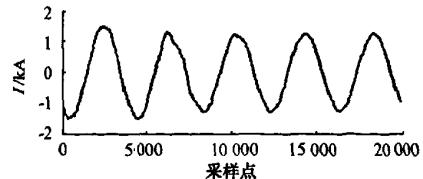

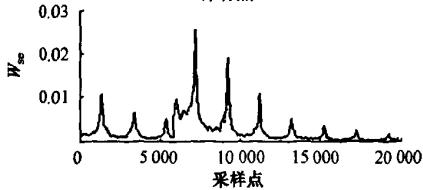  
图4 断路器跳闸时的电流和小波奇异熵波形  
Fig.4 Waveform analysis of switch trip

仿真结果表明，跳闸前、后电流波形的变化非常微弱，不能检测出断路器是否跳闸；但小波熵值在跳闸前、后的变化却非常明显，奇异熵值在跳闸后瞬间明显增大，因此利用这种特征可以构成相继速动的判据。

# 2.3 基于小波熵的全线相继速动保护原理

根据断路器跳闸时小波熵的变化特征，提出全线相继速动保护的原理为：发生故障且本侧保护判断为Ⅱ段后，在故障后第3个周期开始计算电流的

小波熵值（防止故障后前2个周期暂态分量的影响），并在第3个周期内找出小波熵的最大值，将此最大值作为基准值，乘以可靠系数作为相继速动的动作阈值。以后计算的每个小波熵值与动作阈值相比较，若大于动作阈值，就判为对侧断路器跳闸，启动相继速动；小于动作阈值，就判为无断路器跳闸，相继速动不启动。

仿真结果证明，小波熵在检测故障线路被断路器跳开后序电流变化很小的情况下，具有足够的灵敏度。因此，基于小波熵的相继速动判据克服了小波模极大值判据受被分析信号幅值影响这一弊端，能可靠地加速保护动作，有效地减小故障切除时间。而且本文提出的相继速动判据只使用单端电流量，构造简单。

# 3 结语

本文利用小波熵的特点，将小波熵之一的小波奇异熵用于输电线路单端暂态量保护和全线相继速动保护中，提出了基于小波奇异熵的新型输电线路单端暂态量保护和全线相继速动保护方案。仿真结果证明，基于小波奇异熵的单端量暂态保护判据既能实现故障的检测，又能够正确区分区内、外故障，定义简单，且不受故障初始角、故障类型和过渡电阻的影响。基于小波奇异熵的全线相继速动保护判据克服了小波模极大值判据受被分析信号幅值的影响这一弊端，具有更好的自适应性。表明小波信息熵技术在继电保护领域具有良好的应用前景。

# 参考文献

[1] 苏斌, 董新洲, 孙元章. 基于小波变换的行波差动保护. 电力系统自动化, 2004, 28(18): 25-29, 35.  
SU Bin, DONG Xinzhou, SUN Yuanzhang. Traveling wave differential protection based on wavelet transform. Automation of Electric Power Systems, 2004, 28(18): 25-29, 35.   
[2]吕延洁，张保会，哈恒旭.基于暂态量超高速线路保护的发展与展望.电力系统自动化，2001,25(5):56-61.  
LU Yanjie, ZHANG Baohui, HA Hengxu. Development and prospect of ultra-high speed protection for EHV transmission systems based on fault-generated transients. Automation of Electric Power Systems, 2001, 25(5): 56-61.   
[3] 罩剑, 彭莉萍, 王和春. 基于小波变换技术的输电线路单端行波故障测距. 电力系统自动化, 2005, 29(19): 62-65, 86.  
QIN Jian, PENG Liping, WANG Hechun. Single terminal methods of traveling wave fault location in transmission line using wavelet transform. Automation of Electric Power Systems, 2005, 29(19): 62-65, 86.   
[4]董杏丽，葛耀中，董新洲.基于小波变换的无通道全线速动行波保护.电力系统自动化，2001,25(10)：18-22.  
DONG Xingli, GE Yaozhong, DONG Xinzhou. A wavelet and traveling wave based non-communication high speed

transmission line protection. Automation of Electric Power Systems, 2001, 25(10): 18-22.   
[5] BLANCO S, FIGLIOSA A, QUIAN Q R, et al. Time-frequency analysis of electroencephalogram series (Ⅲ): information transfer function and wavelets packets. Physical Review E, 1998, 57(1): 932-940.   
[6] ROSSON O A, BLANCO S, YORDANOVA J, et al. Wavelet entropy: a new tool for analysis of short duration brain electrical signals. Journal of Neuroscience Methods, 2001, 105(1): 65-75.   
[7]何正友，蔡玉梅，钱清泉.小波熵理论及其在电力系统故障检测中的应用研究.中国电机工程学报，2005，25(5)：38-43.  
HE Zhengyou, CAI Yumei, QIAN Qingquan. A study of wavelet entropy theory and its application in electric power system fault detection. Proceedings of the CSEE, 2005, 25(5): 38-43.   
[8] 何正友, 钱清泉. 多分辨信息熵的计算及在故障检测中的应用. 电力自动化设备, 2001, 21(5): 9-11.  
HE Zhengyou, QIAN Qingquan. The computation of multi-resolution entropy and its application in EHV transmission line fault detection. Electric Power Automation Equipment, 2001, 21(5): 9-11.   
[9] 张文涛, 王成山. 基于小波熵的电容器扰动识别和定位. 电力系统自动化, 2007, 31(7): 71-74, 89.  
ZHANG Wentao, WANG Chengshan. Recognition and locating of wavelet entropy based capacitor switching disturbance. Automation of Electric Power Systems, 2007, 31(7): 71-74, 89.   
[10] 何正友, 陈小勤, 罗国敏, 等. 基于小波熵权的输电线路故障选相方法. 电力系统自动化, 2006, 30(21): 39-43.  
HE Zhengyou, CHEN Xiaoqin, LUO Guomin, et al. Faulted phase selecting method of transmission lines based on wavelet entropy weight of transient current. Automation of Electric Power Systems, 2006, 30(21): 39-43.   
[11] 何正友, 符玲, 麦瑞坤, 等. 小波奇异熵及其在高压输电线路故障选相中的应用. 中国电机工程学报, 2007, 27(1): 31-36.  
HE Zhengyou, FU Ling, MAI Ruikun, et al. Study on wavelet singular entropy and its application to faulty phase selection in HV transmission lines. Proceedings of the CSEE, 2007, 27(1): 31-36.   
[12] 侯喆, 张艳霞, 戴剑锋. 基于小波理论的全线相继速动保护方案. 电力系统自动化, 2003, 27(9):54-57.  
HOU Zhe, ZHANG Yanxia, DAI Jianfeng. Accelerated trip scheme for the whole transmission line based on wavelet transform. Automation of Electric Power Systems, 2003, 27(9):54-57.   
[13] 石铁洪, 张昊, 刘沛. 小波变换在全线相继速动保护中的应用. 电力系统自动化, 2001, 25(2): 36-39.  
SHI Tiehong, ZHANG Hao, LIU Pei. Optimization of accelerated trip scheme based on wavelet analysis. Automation of Electric Power Systems, 2001, 25(2): 36-39.

王增平（1964—），男，教授，博士生导师，主要研究方向：微机保护、变电站综合自动化。

郑振华(1984—), 男, 硕士研究生, 主要研究方向: 电力系统继电保护。

# Application of Wavelet Singular Entropy Theory in Transient Protection and Accelerated Trip of Transmission Line Protection

LIU Qing, WANG Zengping, ZHENG Zhenhua

(Key Laboratory of Power System Protection and Dynamic Security Monitoring and Control of Ministry of Education, North China Electric Power University, Baoding 071003, China)

Abstract: Combined with the characteristic of wavelet entropy, the theory of wavelet entropy is presented in the non-unit transient protection and accelerated trip of transmission line protection. A new scheme of two applications of protection based on the concept of wavelet singular entropy is presented. The PSCAD/EMTDC simulation results show that the scheme of non-unit transient protection is insensitive to fault type, fault location, fault resistance and fault inception angle. The protection arithmetic is with favorable adaptability and sensitiveness. Compared with the criterion of wavelet model maximum, the criterion of accelerated trip overcame the influence of signal magnitude. The technique of wavelet entropy shows good prospects in the field of power system protection.

Key words: protection relay; non-unit transient protection; accelerated trip; wavelet singular entropy

（上接第52页 continued from page 52）

[5] 钱锋, 唐国庆, 顾全. 基于 CIM 标准和 SVG 的分散式网模合并. 电力系统自动化, 2007, 31(5):84-89.  
QIAN Feng, TANG Guoqing, GU Quan. Composition of decentralized graphics and model based on CIM and SVG. Automation of Electric Power Systems, 2007, 31(5):84-89.   
[6] 米为民, 韦凌霄, 钱静, 等. 基于 CIM XML 的电网模型合并方法在北京电力公司调度系统中的应用. 电网技术, 2008, 32(10): 33-37.  
MI Weimin, WEI Lingxiao, QIAN Jing, et al. Application of CIM & XML based combination method of power network models in dispatching system of Beijing Electric Power

Corporation. Power System Technology, 2008, 32(10): 33-37.

李晓露(1971—),女,通信作者,博士,高级工程师,主要研究方向:电力企业信息的集成技术。E-mail:lixiaolu@dongfang-china.com  
黄明辉(1973—)，男，工程师，主要研究方向：电力调度自动化系统的开发。

韦凌霄(1974—),男,高级工程师,主要研究方向:电网自动化运行管理。

# Multi-Regional Power Network Model Online Splicing and Merging

LI Xiaolu1, HUANG Minghui1, WEI Lingxiao2, LIU Runsheng2, ZHAO Yong1, WU Haiyong1, ZHOU Jieying2   
(1. Yantai Dongfang Electronics Information Industry Co. Ltd., Yantai 264000, China;   
2. Beijing Electric Power Company, Beijing 100031, China)

Abstract: A description is made of an online multi-regional model splicing and merging method based on the CIM/XML power system models and SVG graphs and with the tie lines as modeling boundaries for the power ensured automation system. In view of the teed tie lines between regional systems, tee grouping is presented to merge the tee connections from several models and prevent frequent modification of the line information due to non-unified naming of virtual substations. As for the incremental model update, apart from updating the attributes of devices on the basis of unified naming, the connection between equipments will be updated by binding the connectivity of the operating system to that of the model to be imported. By means of the model's online splicing and merging, the power ensured automation system developed will be capable of retrieving a power supply path for important customers from $380\mathrm{V}$ to all upper level power sources through the network topology. Thus the requirement of "the whole chain" network monitoring can be met, guaranteeing as much as possible reliable power supply to important customers.

Key words: power ensured; multi-region; model merging; boundary definition; tee grouping; binding of connectivity; incremental update