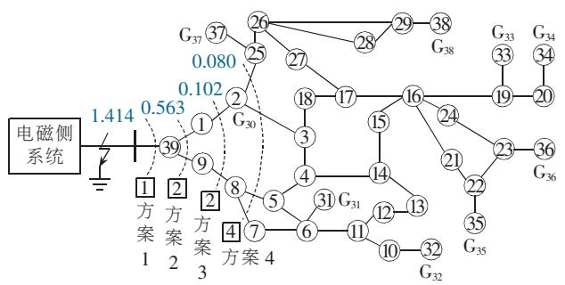
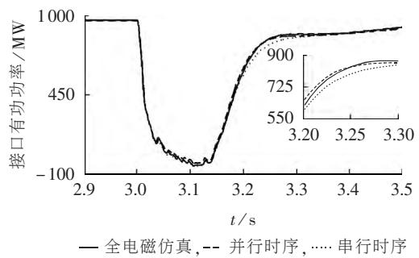
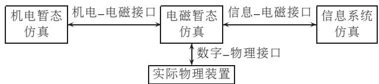

# 电力系统数字混合仿真技术综述及展望

杨 洋 1 肖 湘 宁 1 王 昊 2 刘 学 忠 3 吴 磊 4

（1. 华北电力大学 新能源电力系统国家重点实验室 北京 102206 2. 中国电力科学研究院 北京 100192

3. 国网北京顺义供电公司 北京 101300；4. 国网天津市电力公司电力科学研究院 天津 300000）

摘要 论述了混合仿真技术的发展历史和现状 对国内外现有的混合仿真平台进行了全面的技术总结和比较在此基础上 从等值模型 相量提取算法 接口位置选择和交互时序 4 个方面对混合仿真接口技术进行了详细讨论 论述了各方面技术的内涵 方案和面临的主要问题 结合智能电网的发展和“源-网-荷”互动模式 提出将电磁侧系统通过交互接口与信息系统仿真平台相连 构成信息-电磁-机电混合仿真系统 为混合仿真技术的进一步发展提供了可能的方向

关键词 电力系统 机电暂态 电磁暂态 混合仿真 接口技术 等值模型 相量提取 交互时序 电力-信息系统

中图分类号 ： TM 743

文献标识码： A

DOI ： 10.16081 ／ j.issn.1006－6047.2017.03.032

# 0 引言

随着以风电 光伏为代表的可再生能源在电力系统发电侧和用户侧的大量接入以及柔性交流输电系统（FACTS）装置在电网中的规模化应用 电力系统的强非线性特性日益突出 三相不平衡 谐波 间谐波以及阻尼弱化问题已不容忽视［1］ 交直流之间强耦合 互作用的效果逐渐凸显 传统机电暂态仿真对高压直流（HVDC）等电力电子装置的建模采用准稳态模型 不能精确模拟系统在非对称条件下电力电子装置的动态特性及强非线性特性［2］ 电磁暂态仿真由于模型求解方法的限制 其对计算资源要求较高 对于中长期的动态电力系统仿真而言 单纯采用全电磁暂态仿真的适用性尚存争议［3］

机电-电磁暂态混合仿真技术综合了机电暂态仿真和电磁暂态仿真各自的优势 其提出之初是为了提升包含 HVDC 换流器在内的交直流机电暂态仿真在故障期间的仿真精度 随后的混合仿真方案基本延续了 2 种技术思路 第一种是在成熟的机电或电磁暂态仿真软件中开发相应模块实现混合仿真［4］第二种是在 2 类成熟的仿真程序之间建立适当接口以实现数据的转化和传递［5-6］ 其中 第二种思路突破了电磁和机电暂态仿真软件在各自框架内的建模

限制 具有较好的灵活性 但无论采用何种混合仿真方案 接口技术均是混合仿真技术的关键［7］

本文首先对混合仿真发展的历史和现状进行概述 然后重点从等值形式 相量提取方法 接口位置选择和交互时序 4 个方面对混合仿真接口技术进行讨论 最后对电力系统数字混合仿真技术做出展望

# 1 混合仿真发展历史和现状

机电-电磁暂态混合仿真最早提出于 1982 年新西兰电力公司 （ New Zealand Electricity ） 的 Heffer-nan［8］ 及坎特伯雷大学的 Arrillaga 为了研究直流换流器发生故障后的动态恢复特性 在机电暂态程序中引入电磁暂态计算过程 电磁侧发生故障之后 直流系统的电磁暂态程序启动 利用其仿真结果对机电程序对应的直流部分进行修正 从而提高了故障期间的仿真精度 麦格劳-爱迪生电力系统公司（McGraw-Edison Power Systems Cooper Industries ） 的 Reeve 和加拿大滑铁卢大学的 Adapa 把接口位置延伸到交流系统内部 从而可以防止接口处电流波形畸变过于严重 但是增加了混合仿真接口的复杂程度［9］ 新西兰铝冶炼公司 （ New Zealand Aluminium SmeltersLtd. ） 的 Anderson 和坎特伯雷大学的 Watson 等人将频率相关等值 （FDNE）技术引入混合仿真中 在没有显著增大电磁侧计算量的前提下较好地解决了接口处波形畸变的问题［10］ 早期的混合仿真所采用的串行时序限制了仿真的实时性 香港理工大学的 SuHongtian［11］ 提出了并行时序 在机电侧的迭代过程中引入电磁侧传递的非整数周期信息 单个交互周期内机电侧迭代的精度随着仿真的进行逐渐提升从而满足了实时性的要求

清华大学的郑三立等人采用 NETOMATIC 与实

时数字仿真器 RTDS （ Real Time Digital Simulator ）建立了交直流电网实时混合仿真平台 较早地提出采用成熟的仿真软件进行并联运行的方案［12］ 天津大学的鄂志君等人提出将机电暂态仿真软件与成熟的电磁暂态仿真软件 PSCAD／EMTDC 进行 混 合 仿真［13］ 清华大学的柳勇军［14］ 和中国电科院的岳程燕［15］系统地研究了混合仿真相关问题 在等值电路方面均考虑了外部等值电路正序和负序等值阻抗不等所引起的不对称等值导纳矩阵的求解 分别采用戴维南电势补偿及节点分裂法进行解决 考虑到仿真的实时性要求 二者均采用了并行交互时序 在当时的硬件条件（处理器运算速度以及通信系统）限制下 所提出的方案尚不能达到真正的实时性 此外 电磁侧对直流输电系统的元件建模和控制系统建模略显不足 难以满足直流输电系统研究的需要

中国电力研究院率先在国内建立了一套具有自主知识产权的电力系统实时仿真工具（ADPSS）［16］ 电磁侧电力电子元件和控制模块的不断丰富和机电侧丰富的开发经验使 ADPSS 具备良好的机电-电磁暂态仿真基础 基于 ADPSS 的机电-电磁仿真环境能满足实时 离线方面的仿真需要［17］

RTDS 作为电力系统实时仿真领域起步最早的实时仿真器 因其丰富的模型库而受到研究者的青睐 为了研究交直流混联输电情况下电网的动态特性 南方电网科学研究院和华北电力大学肖湘宁教授及其团队在国内率先开展了基于 RTDS 的交直流电网混合仿真的研究［18］ 系统地解决了机电程序编制［19］ 信息交互时序和接口电路实现［4］ 等关键技术难题 采用 RTDS 提供的 CBuilder 自定义建模技术 建立基于 RTDS 的混合仿真平台 并结合典型交直流系统算例进行可行性和计算精度方面的验证

通过引入发电机同调技术［20］可在一定程度上扩

大机电侧系统的仿真规模 但受限于 RTDS／CBuilder的计算能力 单纯采用 RTDS 不能完全满足大规模电网的实际仿真需求 清华大学提出采用并行计算机与 RTDS 进行实时混合仿真 通过高精度的通信接口实现并行机与 RTDS 的信息交互 具备对大规模交直流电力系统进行实时仿真的能力 南方电网科学研究院 清华大学合作开发了“RTDS+并行计算机”的电磁-机电混合实时仿真平台 （SMRT） ［21-22］

在商业软件方面 RTDS 公司结合 FDNE 技术提出了电磁-机电暂态混合仿真方案 该方案首先对整个网络进行全电磁建模 然后采用曲线拟合得到以有理式形式表达的外部系统频域等值电路［23］

总结归纳上述 4 个混合仿真平台的主要技术和特点 见表 1 比较可知 华北电力大学和 RTDS 公司的方案在非对称故障处理方面有所不足 主要是因为电磁侧接口电路建模未考虑负序 零序等值阻抗对于仿真规模而言 ADPSS 和 SMRT 均达到 10000个节点以上的仿真规模 受限于 RTDS 的处理能力其他 2 种方案暂时无法达到该仿真规模

# 2 混合仿真接口技术

混合仿真的基本原理是广泛应用的替代定理通过采用电压源或者电流源替代电网中的一部分以减少建模量并取得与替代之前相似的仿真结果其基本思路是在一侧计算出电压或者电流 在数据交互期间进行数据传递 完成下一交互步长计算 周而复始 混合仿真接口技术主要涉及 4 个方面 等值方式 相量提取方法 接口位置选择及交互时序

# 2.1 等值方式

# 2.1.1 机电侧等值

对于电磁侧的仿真而言 机电侧的等值一般采用基于基频的多端口诺顿或戴维南电路 基于基频

表 1 4 个混合仿真平台的主要技术和特点  
Table 1 Main technologies and characteristics of four hybrid simulation platforms   

<table><tr><td>混合仿真平台</td><td>等值方式</td><td>接口位置</td><td>相量提取算法</td><td>机电程序仿真规模</td><td>非对称故障处理能力</td><td>是否考虑机电侧故障</td><td>存在的主要不足</td></tr><tr><td>ADPSS</td><td>机电侧为戴维南电路等值;电磁侧为诺顿电路等值</td><td>直流换流母线</td><td>离散傅里叶算法</td><td>1000台发电机,10000个节点</td><td>具备</td><td>考虑</td><td>-</td></tr><tr><td>华北电力大学交直流电网混合仿真平台</td><td>机电侧为戴维南电路等值;电磁侧为功率源等值</td><td>由换流母线向交流网络进行一定延伸后的交流母线</td><td>dq-120变换法[18]</td><td>18台发电机[20],100个节点</td><td>非对称工况准确性不足</td><td>不考虑</td><td>仿真规模受限</td></tr><tr><td>SMRT</td><td>机电侧为考虑内阻抗的受控电压源电路等值;电磁侧为三序功率源等值</td><td>直流换流母线</td><td>离散傅里叶算法</td><td>上千台发电机,上万节点</td><td>具备</td><td>考虑</td><td>-</td></tr><tr><td>RTDS公司混合仿真方案</td><td>机电侧为电流源+FDNE技术;电磁侧为电流源等值</td><td>没有具体要求</td><td>曲线拟合法</td><td>100个节点</td><td>非对称工况准确性不足</td><td>不考虑</td><td>机电侧不同工况的适应性不足</td></tr></table>

的单端口戴维南等值以及考虑机电侧系统宽频特性的 FDNE 等 尽管在混合仿真发展早期有些方案也采用电压源等值［24］ 但由于电压源等值难以适应电磁侧的暂态变化 尤其不能反映系统强度或短路水平 因此后续的研究逐渐采用戴维南（诺顿）等值

多端口戴维南等值的基本思路是对外部系统包括发电机贡献在内的网络在接口母线处进行化简［25］ 在导纳矩阵上表现为将外部系统进行高斯消去 在接口母线位置对外部系统的三序网络进行缩减 可以得到从接口向外部系统看入的三序戴维南等值电路 将其应用于混合仿真 可以满足电磁侧对非对称故障仿真的需求［2，5］ 表 1 中的 ADPSS 和华北电力大学基于 RTDS 的实时混合仿真平台的机电侧即采用了这种等值方式 多端口戴维南等值的主要技术难点在于等值电路在电磁侧的实现方法 首先当端口数目较多且计及各序等值阻抗时 等值电路的规模较为庞杂 如果计及正序和负序等值阻抗的不等 则会导致电磁侧等值导纳矩阵不对称 这与电磁暂态仿真原理相悖［14］ 其次 由于电力系统负荷对高斯消去过程的影响 得到的等值互联支路的电阻并非全都是正值 对于阻值为负的电阻的仿真在目前的电磁暂态仿真环境中尚不能实现［26］

单端口戴维南等值的基本思路是多个端口在机电侧耦合而在电磁侧自然解耦［3］ 戴维南等值电路的内阻抗为从接口母线向机电侧系统看入的自阻抗 在每个交互周期内 机电侧借助接口电压 接口电流和自阻抗完成戴维南等值电势的计算并传递给电磁侧 表 1 中 SMRT 的机电侧即采用该等值方式单端口戴维南等值的思路简化了电磁侧的接口建模过程 在稳态时可以得到与多端口戴维南等值完全一致的结果 单独考虑机电侧故障 单端口戴维南等值方式不会造成过大误差 对电磁侧故障而言 在一个交互周期内 如果其中某个接口的电压或者注入电流因为故障而发生变化 由混合仿真的原理可知 在该交互周期内这一变化不会及时反映到其他端口 因此单端口戴维南等值方式减弱了端口之间的电气互作用 对分析如多馈入直流系统逆变侧换相失败［27-28］等场合会产生不利影响

多端口和单端口戴维南等值在建模过程中均采用外部系统基频等值信息 所建立的等值电路只有在基频下才与原外部系统的特性一致 而对于除基频以外的其他频率的响应则存在不同程度的失真 因而多端口和单端口戴维南等值方式对谐波的处理能力不足 相比而言 FDNE 方式对外部系统在多个频率下的等值网络进行多次类似多端口戴维南等值电路的参数计算 然后将多个频率的参数进行拟合［23］

因而能够在一定的频率范围内模拟外部系统的宽频特性 FDNE 方法的主要难点在于参数求取和电磁侧的仿真实现 除了存在与多端口戴维南等值电路类似的多端口 正负序等值阻抗不等和负电阻问题FDNE 还需要解决等值电路的无源性问题［29］ 即保证除电压源或电流源之外的等值电路不向外发出有功 解决这一问题主要采用的方法是在表现为有源的频率点处进行更为详细的频率扫描 这就使 FDNE的参数获取过程较为繁琐费力 另外 FDNE 参数的准确提取有赖于已知系统各回线路的物理参数（包括线路间距 尺寸等） 而这些参数往往难以获得 如果采用电力系统运行部门常见的 PSS／E 或 BPA 数据进行近似的 FDNE 参数计算 则会丧失对外部系统进行拟合的精确程度 这都使得 FDNE 方法只能作为一种研究小范围交直流系统的手段 难以实际应用于大规模电网的研究

当考虑机电侧故障时 理论上机电侧在电磁侧的等值电路应该发生变化 等值电路切换的难点在于如何避免切换过程中引起的数值振荡 文献［30］研究了机电侧发生故障后采用基于“热备用”思路进行等值电路切换的方法 并给出了不需进行电磁侧等值电路切换的故障位置到接口母线的电气距离参考值 然而 这种预先设置电路进行故障切换的方法无疑限制了在单次仿真中机电侧可设置的故障数目和类型 丧失了混合仿真的灵活性

无论是多端口 单端口戴维南等值还是 FDNE都是外部系统在接口处的线性等值 传统方案中戴维南等值电势（或诺顿等值电流）的幅值和相位在每个交互步长期间保持不变 无法反映外部系统在此期间的变化过程 文献［31 ］对戴维南电势在电磁侧进行“一阶”线性保持 体现了戴维南电势在交互过程期间的变化 从而在一定程度上提升了仿真精度

需要指出的是 对于考虑电磁侧多回直流馈入后的机电侧等值电路形式 直接的思路是对所有直流换流母线在电磁侧进行耦合 这就导致电磁侧的等值电路可能十分复杂 对应的等值电路导纳矩阵维数过高 从而影响混合仿真的仿真效率 可行的思路是对与其他直流换流母线电气距离较远的直流落点在电磁侧进行解耦 仅将耦合关系密切的直流换流母线在电磁侧耦合 从而可以节省建模规模和计算开支 然而具体的解耦指标研究尚没有开展

# 2 1 2 电磁侧等值

电磁侧在机电侧一般等值为诺顿等值电路 功率源和电流源等

诺顿等值［14- 15］电路是一种电力系统常见的等值形式 其优点是可以将外部系统和电磁侧系统的系

统特性通过诺顿支路联系在一起 尤其对于电磁侧为纯交流系统的情况 采用诺顿等值可以较合理地反映整个系统的阻尼特性和动态行为 适用于通过对系统在时域上进行小干扰稳定分析以获取包括系统振荡模态和阻尼比在内的参数的情形 然而 诺顿等值的主要缺点在于 ：等值电路参数获取困难 尤其对于电磁侧包含 HVDC 等电力电子装置的情况对电磁侧的故障情况适应性不足 当电磁侧发生对称或者非对称故障时 诺顿等值电路理论上应该进行切换 但根据接口处电压和电流的时域仿真波形获取电磁侧尤其是大扰动期间戴维南（诺顿）等值参数算法的精度尚需改善［32］

功 率 源 等 值 ［7 ， 10 - 1 1 ， 18 ， 24 ］ 是 目 前 机 电 - 电 磁 暂 态 混合仿真中最为常见的电磁侧等值方式 在传统的机电暂态程序中 对直流线路的模拟是通过电压-功率迭代方式进行的 因此在混合仿真尤其是电磁侧为直流系统的混合仿真方案中 采用功率源进行电磁侧等值可以方便与机电暂态程序的剩余部分结合 功率源等值具有一定内在优势 功率源等值不存在相位问题 混合仿真一旦启动 可以在系统潮流没有发生明显变化的情况下较快进入稳定 功率源等值能够体现能量变化 而机电暂态分析的实质就是分析能量变化对发电机转子运动的扰动过程［33］ 这与机电暂态仿真的初衷相符 功率源等值的主要问题在于机电侧从电磁侧接收的功率信息在一定程度上模糊了接口边界条件 当电磁侧发生故障等较大的扰动之后 机电侧可能存在唯一解［34］

电流源等值［2，9］在 3 种等值方式中最为直接 其基本思路是量测出接口各序基波电流相量后直接传递给机电侧 这种方式相比于诺顿等值和功率源等值简化了接口信息的获取及转化［2］ 可得到物理概念明确的三序等值电流源参与机电侧网络的求解电流源等值的基本原理是对整个网络进行分割求解 而网络分割求解的计算准确程度取决于接口电流的仿真精度［35］ 在电力系统并行计算领域 往往通过联立 2 个子系统［36］或经过若干次迭代［37］得到 2个子系统之间接口电流的准确结果 而在混合仿真过程中 电磁侧作为电流源在机电侧进行等值 并假定在一个交互过程中不变 这与电网分割求解的过程相悖 其误差在所难免［38］ 另外 电流源等值以电流相量的形式直接引入机电侧进行网络求解 求解的结果对电流的相位十分敏感 混合仿真启动后可能因为潮流计算得到的接口电流初始值与实际电磁侧仿真计算得到的接口电流值存在的微小偏差而出现较大扰动 暂态期间的仿真也会因为相量提取算法的动态偏差而引入误差

# 2 2 相量提取方法

相量提取方法作为机电侧获取电磁侧信息的主要手段 其精度和动态性能是决定混合仿真准确程度的重要因素 较好的相量提取方法应该满足提取结果的准确性 提取过程的鲁棒性以及采样数据的节约性要求。 文献［ 15］采用离散傅里叶变换（DFT）递推算法进行相量提取 但在频率变化波动时存在频谱泄漏和栅栏效应［39-40］ 影响相量提取效果 文献［ 14］采用基于最小二乘法的曲线拟合方法 该方法对数据窗长没有特定的要求 可有效滤除整数次谐波 但对于故障期间存在的直流分量 可能的非整数次谐波 则由于预设模型的限制而不能有效滤除文献［41 ］比较了目前的几种相量提取方法 结果显示矩阵束方法在各种工况下具备相对较好的准确度 并提出了一种改进简化的矩阵束相量提取方法d -120 方法因为其计算量小 适用于实时计算而被文献 ［ 4 34 42- 43 ］ 所采用 文献 ［ 44 ］ 分析了故障发生后故障电流存在的直流分量给 $d q - 1 2 0$ 方法引入误差的机理 进而结合 Prony 算法［45］ 提出一种改进的 $d q { - } 1 2 0$ 算法 该算法在故障发生 5 个采样点后就可以准确提取出接口电气量的基波分量 能够显著提升电磁侧接近接口处发生故障后的仿真精度

# 2 3 接口位置选择

机电暂态仿真的目的在于分析发电机的动态行为 因此传统的机电暂态程序只计及正序分量并假设电压 电流波形为基波正序分量 即使网络发生非对称故障 负序和零序网络也只是等效为附加阻抗并入正序网络中进行求解［46］ 电磁暂态仿真采用分相建模的方式 可以准确模拟各相电气量的变化 对于由电力开关设备投切 电力电子器件开断 变压器过励磁等引起的各类谐波 直流分量及三相电气量的非对称现象均有详细模拟 传统混合仿真方案为了减少电磁侧的建模量 往往将接口位置设定在直流的换流母线处［2，17，47］ 电磁侧故障可能产生的非对称非周期分量将破坏接口处的电压 电流为对称的基波正序分量的假设条件 从而给混合仿真精度带来不利影响 因此 文献［ 17］建议将接口母线向机电侧延伸并选择在不对称度低的位置进行分网并以一回国际大电网会议 （ CIGRE ） 标准直流模型 + IEEE 39节点交直流系统为例进行说明 直流逆变侧接入 39号节点 原 39 号节点所连发电机停运 直流系统在电磁侧仿真 剩余部分在机电侧仿真 以直流逆变侧换流母线为接口母线 考虑在电磁侧接口母线设置 AB 相间短路故障 4 种可能的接口位置见图 1

图 1 显示了 4 种接口方案以及在接口母线发生

  
图 1 4 种接口方案  
Fig.1 Four interfacing schemes

AB 相间短路故障之后的各方案的平均电压不平衡度（如图中加粗数据所示 平均电压不平衡度定义为$S _ { U } = \sqrt { \mid U _ { 2 } \mid ^ { 2 } + \mid U _ { 0 } \mid ^ { 2 } }$ ／ $U _ { 1 } \mid$ 其中 $U _ { 2 \setminus U _ { 0 } }$ 和 $U _ { 1 }$ 分别为接口处负序 零序和正序电压幅值）和接口电路的接口数目（图中方框中数据） 分别采用 4 种接口方案对该系统进行机电-电磁暂态混合仿真 机电-电磁暂态混合仿真采用 PSCAD+C 的形式［34］ 电磁侧采用 PSCAD／EMTDC 进行仿真 机电侧采用 C 语言建立的机电暂态程序进行仿真 二者通过程序接口在每个交互周期内进行数据传递 采用 PSCAD／EMTDC 进行全电磁仿真 选取电磁侧接口有功功率作为精度评估对象 以特征选择验证（FSV）方法中的全局差异量 （GDM） ［48］ 作为精度评估指标 GDM值越小 表示混合仿真结果与全电磁暂态仿真越接近 4 种方案的精度对比如表 2 所示

表 2 4 种接口方案的仿真精度对比  
Table 2 Comparison of simulation accuracy among four interfacing schemes   

<table><tr><td>方案</td><td>电压不平衡度</td><td>接口数目/个</td><td>GDM</td></tr><tr><td>1</td><td>1.414</td><td>1</td><td>0.1207</td></tr><tr><td>2</td><td>0.563</td><td>2</td><td>0.0900</td></tr><tr><td>3</td><td>0.102</td><td>2</td><td>0.0525</td></tr><tr><td>4</td><td>0.080</td><td>4</td><td>0.0933</td></tr></table>

从表 2 可见 随着电压不平衡度减小 仿真精度升高 在方案 3 处达到最佳 接口位置向机电侧进一步延伸 接口数目不可避免地增多 此时 由相量提取算法 接口建模复杂度引起的误差逐渐累积 混合仿真整体的仿真精度开始下降 比较可知 接口位置的选择受接口电压不平衡度 接口数目和接口建模复杂度的综合影响 在选择接口位置时不仅需要考虑电磁侧的建模规模和接口不对称度 也需要考虑接口数目和建模复杂度 因此接口位置的选择是一个优化求最优解的问题

# 2.4 交互时序

机电暂态仿真和电磁暂态仿真的步长不同 因此需要交互时序来协调二者等值信息的交互 混合仿真的接口交互时序分为串行时序和并行时序［49］ 2种 采用串行时序的机电侧仿真在进行迭代计算时

电磁侧计算处于停顿状态直到机电侧本步计算完毕 相比而言 并行时序允许一侧计算时另一侧的计算继续进行 因此并行时序适用于机电程序和电磁程序并行实时运行的情况

对于机电侧而言 并行时序和串行时序的主要差异在于戴维南等值电势形成的先后 串行时序下 当本交互步长计算接近结束时 机电侧根据本步长计算的结果形成戴维南电势 并行时序下 戴维南电势在本次机电侧迭代计算之前形成 根据电磁侧的注入电流和上一机电步长计算得到的接口电压计算本交互步长的戴维南电势并传递给电磁侧

对于时刻 t 的戴维南电势 有 ${ \pmb U } _ { \mathrm { d w n } } ( t ) { = } { \pmb Z } _ { \mathrm { l s } } { \pmb I } _ { \mathrm { S } } ( t )$ 其中 $\mathbf { { Z } _ { \mathrm { { s } } } }$ 为接口-发电机节点互阻抗矩阵 $\mathbf { \nabla } , I _ { \mathrm { s } } ( t )$ 为发电机节点在时刻 t 的注入电流 并行时序下 戴维南电势的形成实际由发电机上一个交互步长的注入电流决定 此时 ${ \pmb U } _ { \mathrm { d w n } } ^ { \prime } ( t ) { = } { \pmb Z } _ { \mathrm { I s } } { \pmb I } _ { \mathrm { S } } ( t { - } \Delta t )$ 由并行时序引入的戴维南电势求取偏差为 $\Delta \boldsymbol { U } _ { \mathrm { d w n } } ( t ) = \boldsymbol { Z } _ { \mathrm { I s } } [ \boldsymbol { I } _ { \mathrm { S } } ( t ) - \boldsymbol { I } _ { \mathrm { S } } ( t - \Delta t ) ] _ { \mathrm { ~ c ~ } }$ 当系统处于稳态时 $, I _ { \mathrm { S } } ( t ) - I _ { \mathrm { S } } ( t - \Delta t ) \approx 0$ 采用并行时序不会引起误差；当系统处于暂态 动态过程时 $\mathbf { \nabla } , I _ { \mathrm { s } } ( t )$ 与 $I _ { \mathrm { s } } ( t { - } \Delta t )$ 不能再认为相等 如果仍然采用并行时序 则可能引起偏差 对图 1 中的方案 3 分别采串行时序和并行时序进行仿真 设置 $t = 3 \mathrm { ~ s ~ }$ 时直流逆变侧发生 AB 两相短路故障 直流功率如图 2 所示

  
图 2 并行时序和串行时序下电磁侧直流功率对比  
Fig.2 Comparison of DC power at electromagnetic side between parallel sequence and serial sequence

从图 2 可见 在故障期间对于不同时序 电磁侧的直流功率并没有明显差异 在故障清除后的动态过程中 串行时序的仿真结果更接近全电磁仿真

由于串行时序在处理动态过程时的精度优势一些混合仿真方案提出一种混合时序 即在稳态运行时采用并行时序以提高仿真效率 而在暂态和动态波动过程中采用串行时序以提高仿真精度［5］ 这种混合时序在实现过程中需要解决扰动发生判断时序切换以及延迟时间等问题

# 3 电力-信息系统混合仿真

随着智能电网技术的发展 传统电力系统由电力能源跟踪负荷的运行模式逐渐发展为“源-网-荷”

柔性互动的运行模式 发电侧新能源大规模接入 输电侧交直流混合输电方式引入及负荷侧电动汽车分布式电源和智能家居的普及均有赖于信息通信技术［50］ 能量流和信息流在物理特性上的差异体现为仿真手段上是连续系统和基于事件的离散系统建模［51］ 这一差异推动了信息-物理系统混合仿真技术的发展 目前 国内外学者对信息-物理混合仿真系统进行了初步研究并提出了 3 类解决方案 联立仿真方案 非实时混合仿真方案和实时混合仿真方案［52］笔者认为 借助适当软件接口将成熟的信息系统仿真环境 （如网络仿真器 （NS2） 最优网络工程工具（OPNET）［53］等）与机电-电磁暂态混合仿真的电磁侧仿真环境互联 进一步拓宽现有的机电-电磁暂态混合仿真构架 构成信息-电磁-机电数字混合仿真系统 如图 3 所示 在电磁侧引入信息仿真系统与电磁仿真的接口 从而可以分析信息系统对电力系统的影响 进一步扩展机电-电磁暂态混合范畴 在信息-电磁-机电数字混合仿真系统框架下 如果电磁暂态仿真采用实时仿真器（如 RTDS RTlab 等） 则实际物理装置可与电磁暂态仿真系统进一步连接 并构成数字-物理闭环仿真系统 该系统不仅可单独分析信息系统 电磁暂态系统之间的交互影响 还可以电磁暂态仿真为媒介 进一步分析信息系统与机电暂态系统 信息系统与实际物理装置之间的交互影响 既能分析小范围内信息系统对电力系统的影响也可进一步分析信息系统对大规模电力系统暂态特性的影响 因而将具有长远的研究价值和现实意义

  
图 3 信息-电磁-机电数字混合仿真系统  
Fig.3 Information-electromagnetic-electromechanical digital hybrid simulation system

# 4 结论

概括了电力系统机电-电磁暂态混合仿真的发展历史和现状 综合比较了目前较为成熟的机电-电磁暂态混合仿真方案 从等值方式 相量提取 接口位置和交互时序 4 个方面对混合仿真的接口技术加以讨论 论述了各个技术方面的主要技术难题 最后结合智能电网的发展 提出了一种信息-电磁-机电的数字-物理混合仿真方案 为混合仿真的进一步发展指明了可能的方向

# 参考文献

［1］ 肖湘宁. 新一代电网中多源多变换复杂交直流系统的基础问题［ J ］ . 电工技术学报 2015 30 （15 ） 1-14.

XIAO Xiangning. Basic problems of the new complex AC-DCpower grid with multiple energy resources and multipleconversions ［ J ］ . Transactions of China Electrotechnical Society ，2015 ， 30 （15 ） ： 1-14.  
［2］ 刘文焯 侯俊贤 汤涌 等. 考虑不对称故障的机电暂态-电磁暂态混合仿真方法 ［ J ］ . 中国电机工程学报 2010 30 （13 ） 8-15.LIU Wenzhuo HOU Junxian TANG Yong et al. Electromechanicaltransient ／ electromagnetic transient hybrid simulation methodconsidering asymmetric faults ［ J ］ . Proceedings of the CSEE ，2010 30 （13 ） ： 8-15.  
［3］ 李亚楼 张星 李勇杰 等. 交直流混联大电网仿真技术现状及面临挑战 ［ J ］ . 电力建设 2015 36 （12 ） ： 1-8.LI Yalou ZHANG Xing LI Yongjie et al. Present situation andchallenges of AC ／ DC hybrid large-scale power grid simulationtechnology ［ J ］ . Electric Power Construction 2015 36 （ 12 ） ： 1-8.  
［4］ 贾旭东 李庚银 赵成勇 等. 基于 RTDS／CBuilder 的电磁-机电暂态混合实时仿真方法 ［ J ］ . 电网技术 2009 33 （11 ） ： 33-38.JIA Xudong ， LI Gengyin ， ZHAO Chengyong ， et al. Electromagnetictransient and electromechanical transient hybrid real-timesimulation method based on RTDS ／ CBuilder ［ J ］ . Power SystemTechnology 2009 33 （11 ） ： 33-38.  
［ 5 ］ HUANG Qiuhua ， VITTAL V. Application of electromagnetictransient-transient stability hybrid simulation to FIDVR study ［ J ］ .IEEE Transactions on Power Systems 2016 31 （ 4 ） ： 2634-2646.  
［6］ 胡一中 吴文传 张伯明. 采用频率相关网络等值的 RTDS-TSA异构混合仿真平台开发 ［J］. 电力系统自动化 2014 38（16） 88-93.HU Yizhong WU Wenchuan ZHANG Boming. Develpopment ofa frequency depedent network equivalent based RTDS-TSAhybrid transient simulation platform with heterogeneousarchitecture ［ J ］ . Automation of Electric Power Systems 2014 38（16 ） 88-93.  
［7］ 张树卿 童陆园 薛巍 等. 基于数字计算机和 RTDS 的实时混合仿真 ［ J ］ . 电力系统自动化 2009 33 （18 ） 61-66.ZHANG Shuqing TONG Luyuan XUE Wei et al. Digitalcomputer and RTDS based real time hybrid simulation ［ J ］ .Automation of Electric Power Systems 2009 33 （ 18 ） 61-66.  
［8 ］ HEFFERNAN D M TURNER S K ARRILLAGA J et al.Computation of AC-DC system disturbances part I ： interactivecoordination of generator and converter transient models ［ J ］ .IEEE Power Engineering Review 1981 1 （11 ） 15-16.  
［ 9 ］ REEVE J ADAPA R. A new approach to dynamic analysis ofAC networks incorporating detailed modeling of DC systems I ：principles and implementation ［ J ］ . IEEE Transactions on PowerDelivery 1988 3 （4 ） ： 2012-2019.  
［10 ］ ANDERSON G W J WATSON N R ARNOLD C P et al. A new hybrid algorithm for analysis of HVDC and FACTS systems ［C ］ ∥1995 International Conference on Energy Management and Power Delivery. ［ S.l. ］ IEEE 1995 462-467.   
［ 11 ］ SU H ， CHAN K W ， SNIDER L A ， et al. A parallel implementa-tion of electromagnetic electromechanical hybrid simulationprotocol ［ C ］ ∥ 2004 IEEE International Conference on ElectricUtility Deregulation Restructuring and Power Technologies.［ S.l. ］ ： IEEE 2004 ： 151-155.  
［12］ 郑三立 韩英铎 雷宪章 等. NETOMAC 在电力系统实时仿真中的应用 ［ J ］ . 电网技术 2003 27 （1 ） 18-21.

ZHENG Sanli HAN Yingduo LEI Xianzhang et al. Applicationof NETOMAC in real-time simulation of power systems ［ J ］ .Power System Technology ， 2003 ， 27 （ 1 ） ： 18-21.  
［13］ 鄂志君 房大中 王立伟 等. 基于 EMTDC 的混合仿真算法研究 ［ J ］ . 继电器 2005 33 （8 ） ： 47-51.E Zhijun FANG Dazhong WANG Liwei et al. Research onhybrid simulation algorithm based on EMTDC ［J］. Relay 2005 33（ 8 ） ： 47-51.  
［14］ 柳勇军. 电力系统机电暂态和电磁暂态混合仿真技术的研究［ D ］ . 北京 ： 清华大学 2006.LIU Yongjun. Study on power system electromechanicaltransient and electromagnetic transient hybrid simulation ［ D ］ .Beijing ： Tsinghua University ， 2006.  
［15］ 岳程燕. 电力系统电磁暂态与机电暂态混合实时仿真的研究［D］. 北京 ：中国电力科学研究院 2005.YUE Chengyan. Study of power system electromagnetictransient and electromechanical transient real-time hybridsimulation ［ D ］ . Beijing ： China Electric Power Research Institute2005.  
［16］ 田芳 宋瑞华 周孝信 等. 全数字实时仿真装置与直流输电控制保护装置的闭环仿真试验及分析 ［J］. 电网技术 2010 34（12 ） ： 57-62.TIAN Fang SONG Ruihua ZHOU Xiaoxin el al. Method forclosed-loop simulation of advanced digital power systemsimulator and HVDC control and protection devices ［ J ］ . PowerSystem Technology 2010 34 （12 ） ： 57-62.  
［17］ 朱旭凯 周孝信 田芳 等. 基于电力系统全数字实时仿真装置的大电网机电暂态-电磁暂态混合仿真［J］. 电网技术 2011 35（ 3 ） ： 26-31.ZHU Xukai ZHOU Xiaoxin TIAN Fang et al. Hybridelectromechanical-electromagnetic simulation to transient processof large -scale power grid on the basis of ADPSS ［ J ］ . PowerSystem Technology 2011 35 （3 ） 26-31.  
［18］ 李秋硕 张剑 肖湘宁 等. 基于 RTDS 的机电电磁暂态混合实时仿真及其在 FACTS 中的应用 ［J］. 电工技术学报 2012 27（3）219-226.LI Qiushuo ， ZHANG Jian ， XIAO Xiangning ， et al. Electro-mechanical-electromagnetic transient real-time simulation basedon RTDS and its application to FACTS ［ J ］ . Transactions ofChina Electrotechnical Society 2012 27 （ 3 ） ： 219-226.  
［19］ 边宏宇 张海波 安然然 等. RTDS 上机电暂态仿真自定义模块的研究与开发 ［ J ］ . 电力系统自动化 2009 33 （22 ） ： 61-65.BIAN Hongyu ZHANG Haibo AN Ranran et al. Research anddevelopment of power system transient stability simulationusing object oriented technique ［J ］. Automation of Electric PowerSystems 2009 33 （22 ） 61-65.  
［20］ 安娜. 基于 RTDS 的机电暂态仿真及其接口模型优化的研究［D ］. 北京 华北电力大学 2011.AN Na. Research on optimization of electromechanical transientmodel and interfaces model based on Real-Time DigitalSimulator （ RTDS ） ［ D ］ . Beijing North China Electric PowerUniversity 2011.  
［21］ 郭琦 曾勇刚 李伟 等. 交直流大电网混合实时仿真（SMRT）平台研发与工程应用 ［ J ］ . 南方电网技术 2015 9 （1 ） ： 33-38.GUO Qi ZENG Yonggang LI Wei et al. Development andengineering application of Super Mixed Real-Time simulation（ SMRT ） platform for AC-DC hybrid bulk power systems ［ J ］ .

Southern Power System Technology ， 2015 ， 9 （ 1 ） ： 33-38.  
［22］ 欧开健 张树卿 童陆园 等. 基于并行计算机／RTDS 的混合实时仿真不对称故障接口交互与实现［J］. 电工技术学报 2016 31（2 ） ： 178-185.OU Kaijian ， ZHANG Shuqing ， TONG Luyuan ， et al. Interfacemethod and implementation for asymmetric fault simulation onparallel computer／RTDS-based hybrid simulator ［J ］. Transactionsof China Electrotechnical Society 2016 31 （ 2 ） ： 178-185.  
［ 23 ］ LIN X ， GOLE A M ， YU M. A wide-band multi-port systemequivalent for real - time digital power system simulators ［ J ］ .IEEE Transactions on Power Systems 2009 24 （ 1 ） ： 237-249.  
［24］ 王栋 童陆园 洪潮. 数字计算机机电暂态与 RTDS 电磁暂态混合实时仿真系统 ［ J ］ . 电网技术 2008 32 （6 ） 42-46.WANG Dong ， TONG Luyuan ， HONG Chao. Digital computerelectromechanical transient and RTDS electromagnetic transienthybrid real-time simulation system ［J］. Power System Technology ，2008 32 （6 ） ： 42-46.  
［25］ 张伯明 陈寿孙 严正. 高等电力网络分析［M］. 2 版. 北京 清华大学出版社 2007 125-129.  
［26］ 吴晔 殷威扬. 用于直流系统动态性能研究的等值计算［J］. 高电压技术 2004 30 （11 ） ： 18-20.WU Ye YIN Weiyang. Equivalent calculation for study of thedynamic performance of DC system ［J］. High Voltage Engineering ，2004 30 （11 ） ： 18-20.  
［27］ 郭利娜 刘天琪 李兴源. 抑制多馈入直流输电系统后续换相失败措施研究 ［ J ］ . 电力自动化设备 2013 33 （11 ） 95-99.GUO Lina LIU Tianqi LI Xingyuan. Measures inhibitingfollow-up commutation failures in multi-infeed HVDC system［ J ］ . Electric Power Automation Equipment 2013 33 （ 11 ） 95-99.  
［28］ 向博 罗隆福 许加柱 等. 采用滤波换相换流器的多馈入直流输电系统中换相失败问题的研究［J］. 电力自动化设备 2012 32（9 ） 117-121.XIANG Bo LUO Longfu XU Jiazhu et al. Commutation failureof multi-infeed HVDC transmission system with FCC ［ J ］ .Electric Power Automation Equipment 2012 32 （9 ） ： 117-121.  
［29］ 张怡 吴文传 张伯明 等. 电磁-机电暂态混合仿真中的频率相关网络等值 ［ J ］ . 中国电机工程学报 2012 32 （13 ） 61-68.ZHANG Yi WU Wenchuan ZHANG Boming et al. Frequencydependent network equivalent for electromagnetic and electro-mechanical hybrid simulation ［ J ］ . Proceedings of the CSEE2012 32 （13 ） ： 61-68.  
［30］ 张怡 吴文传 张伯明 等. 电磁-机电暂态混合仿真中机电侧故障的仿真方法 ［ J ］ . 中国电机工程学报 2012 32 （19 ） 81-88.ZHANG Yi WU Wenchuan ZHANG Boming et al. Simulationmethod of faults on electromechanical side in electromagneticand electromechanical hybrid simulation ［ J ］ . Proceedings of theCSEE 2012 32 （19 ） 81-88.  
［31］ MEER A A V D GIBESCU M MART A M M et al. Advancedhybrid transient stability and EMT simulation for VSC-HVDCsystems ［J ］. IEEE Transactions on Power Delivery 2015 30 （ 3 ） ：1057-1066.  
［32］ 汤涌 易俊 侯俊贤 等. 基于时域仿真的戴维南等值参数跟踪计算方法 ［ J ］ . 中国电机工程学报 2010 30 （34 ） ： 63-68.TANG Yong YI Jun HOU Junxian et al. Calculation methodfor thevenin equivalent parameters based on time domainsimulation ［ J ］ . Proceedings of the CSEE 2010 30 （ 34 ） 63-68.  
［ 33 ］ ZHANG S TONG L LIANG X et al. A novel real-time hybrid

simulator base on two personal computers and analog interfacesfor data exchange ［ C ］ ∥ 2009 IEEE Power & Energy SocietyGeneral Meeting. Calgary AB USA ： IEEE 2009 ： 1-7.  
［34］ 杨洋 肖湘宁 陶顺 等. 混合仿真电磁侧功率源等效误差原理分析及改进 ［ J ］ . 电力系统自动化 2015 39 （24 ） 104-109.  
YANG Yang ， XIAO Xiangning ， TAO Shun ， et al. Electromagneticside power source equivalent error principle analysis and itsimprovement for hybrid simulation ［ J ］ . Automation of ElectricPower Systems ， 2015 ， 39 （24 ） ： 104-109.  
35 陈鹏伟 陶顺 杨洋 等. 电磁-机电暂态混合仿真接口交互信息限制性分析 ［ J ］ . 电工电能新技术 2016 35 （5 ） ： 1-7.  
CHEN Pengwei TAO Shun YANG Yang et al. Analysis oftransinformation limit for electromagnetic-electromechanicalhybrid simulation ［ J ］ . Advanced Technology of Electrical Engi-neering and Energy 2016 35 （ 5 ） ： 1-7.  
［36］ 周孝信 田芳 李亚楼 等. 电力系统并行计算与数字仿真［M］.北京 清华大学出版社 2014 44-58.  
［ 37 ］ HUANG Shaowei CHEN Ying SHEN Chen et al. A novel hybrid dynamic simulation algorithm based on iterative coordination ［C］ ∥IEEE PES Innovative Smart Grid Technologies. Istanbul Turkey ： IEEE PES 2015 ： 1-5.   
［38］ 肖湘宁 杨洋 陶顺 等. 混合仿真电流源等值误差机理分析及改进 ［ J ］ . 电力建设 2016 37 （6 ） ： 38-42.  
XIAO Xiangning YANG Yang TAO Shun et al. Electromagnetic side current source equivalent error principle analysis and its improvement for hybrid simulation ［ J ］ . Electric Power Construction 2016 37 （6 ） 38-42.   
［39］ 许珉 王玺 程凤鸣. 基于加 Hanning 窗递推 DFT 算法的测频方法 ［ J ］ . 电力自动化设备 2010 30 （11 ） 73-74.  
XU Min ， WANG Xi ， CHENG Fengming. Frequency measuringbased on Hanning windowed recursive DFT algorithm ［ J ］ .Electric Power Automation Equipment 2010 30 （ 11 ） ： 73-74.  
［40］ 黄翔东 王兆华. 全相位 DFT 抑制谱泄漏原理及其在频谱校正中的应用 ［ J ］ . 天津大学学报 2007 40 （7 ） 882-886.  
HUANG Xiangdong ， WANG Zhaohua. Principle of all phaseDFT restraining spectral leakage and the application incorrecting spectrum ［ J ］ . Journal of Tianjin University 2007 40（7 ） ： 882-886.  
［41］ 杨洋 肖湘宁 陈鹏伟 等. 一种快速矩阵束相量提取方法的研究 ［ J ］ . 电工电能新技术 2016 35 （2 ） 1-6.  
YANG Yang XIAO Xiangning CHEN Pengwei et al. Research on fast matrix pencil method for phasor extraction ［ J ］ . Advanced Technology of Electrical Engineering and Energy ， 2016 35 （2 ） 1-6.   
［42］ 张怡 吴文传 张伯明 等. 基于频率相关网络等值的电磁-机电暂态解耦混合仿真 ［J］. 中国电机工程学报 2012 32（16）107-114.  
ZHANG Yi ， WU Wenchuan ， ZHANG Boming ， et al. Frequencydependent network equivalent based electromagnetic andelectromechanical decoupled hybrid simulation ［ J ］ . Proceedingsof the CSEE 2012 32 （16 ） ： 107-114.  
［43］ 王哲. 基于 RTDS 的电磁-机电暂态混合实时仿真接口研究［D ］. 北京 华北电力大学 2010.  
WANG Zhe. Research of interfaces based on Real-Time Digital Simulator （ RTDS ） for hybrid real - time simulation of electro - magnetic-electromechanical transient process ［ D ］ . Beijing ： North China Electric Power University 2010.   
［44］ 杨洋 肖湘宁 陶顺 等. 考虑衰减直流分量的 d -120 改进算法

及其在混合仿真中的应用 ［ J ］ . 电力建设 2016 37 （6 ） 43- 48.  
YANG Yang XIAO Xiangning TAO Shun et al. An improved dq -120 algorithm considering decaying DC component and its application in hybrid simulation ［J ］. Electric Power Construction 2016 37 （6 ） ： 43-48.   
［45］ 任龙飞 郝治国 张保会 等. 继电保护抗 TA 暂态饱和改进Prony 算法 ［ J ］ . 电力自动化设备 2014 34 （5 ） ： 126-132.  
REN Longfei HAO Zhiguo ZHANG Baohui et al. Improved Prony algorithm against transient CT saturation for relay protection ［ J ］ . Electric Power Automation Equipment 2014 34 （5 ） ： 126-132.   
［46］ 倪以信. 动态电力系统的理论和分析［M］. 北京 清华大学出版社 2002 ： 156-158.  
［47 ］ SU H T CHAN K W SNIDER L A et al. Recent advancementsin electromagnetic and electromechanical hybrid simulation ［C ］ ∥2004 International Conference on Power System Technology.［ S.l. ］ ： IEEE 2004 ： 1479-1484.  
［48］ 张进. 电力系统动态仿真可信度研究［D］. 北京 华北电力大学2005.  
ZAHNG Jin. Research on validation of power system dynamicsimulation ［ D ］ . Beijing ： North China Electric Power University ，2005.  
［ 49 ］ SU H T CHAN K W SNIDER L A. Parallel interaction protocolfor electromagnetic and electromechanical hybrid simulation ［ J ］ .IEE Proceedings-Generation Transmission & Distribution 2005152 （3 ） ： 406-414.  
［ 50 ］ METS K ， OJEA J A ， DEVELDER C. Combining power andcommunication network simulation for cost-effective smart gridanalysis ［J ］. IEEE Communications Surveys & Tutorials 2014 16（3 ） ： 1771-1796.  
［51］ 王云 刘东 陆一鸣. 电网信息物理系统的混合系统建模方法研究 ［ J ］ . 中国电机工程学报 2016 36 （6 ） ： 1464-1470.  
WANG Yun LIU Dong LU Yiming. Research on hybrid systemmodeling method of cyber physical system for power grid ［ J ］ .Proceedings of the CSEE 2016 36 （6 ） ： 1464-1470.  
［52］ 汤奕 王琦 倪明 等. 电力和信息通信系统混合仿真方法综述［ J ］ . 电力系统自动化 2015 39 （23 ） ： 33-42.  
TANG Yi WANG Qi NI Ming et al. Review on the hybrid simulation methods for power and communication system ［ J ］ . Automation of Electric Power Systems 2015 39 （ 23 ） 33-42.   
［53］ 方晓洁 季夏轶 卢志刚. 基于 OPNET 的数字化变电站继电保护通信网络仿真研究［J］. 电力系统保护与控制 2010 38（23） ：137-140.  
FANG Xiaojie JI Xiayi LU Zhigang. Study on relaying protection communication network in digital substation using OPNET simulation ［ J ］ . Power System Protection and Control 2010 38 （23 ） 137-140.

作者简介

  
杨 洋

杨 洋（1989— ） 男 河北邢台人 博士研究生 主要研究方向为电力系统分析和机电-电磁暂态混合仿真 （ E-mail ： yyang8958@126.com ） ；

肖湘宁 （1953— ） 男 湖南澧县人 教授 博士研究生导师 研究方向为新能源电网中的电力电子技术 电力系统电能质量等（ E-mail ： xxn@ncepu.edu.cn ）

（ 下转第 223 页 continued on page 223 ）

CSEE 2011 31 （Supplement ） ： 55-59．  
［8］ 王松 ， 陆承宇． 数字化变电站继电保护的 GOOSE 网络方案 ［J］ ．电力系统自动化 2009 33 （3 ） ： 51-54 103  
WANG Song ， LU Chengyu. A GOOSE network scheme for relayprotection in digitized substations ［J ］. Automation of Electric PowerSystems 2009 33 （3 ） ： 51-54 103．  
［9］ 徐科 宋国旺 康宁 等. 基于电压等级划分 VLAN 的 GOOSE 网络配置方法 ： 200910069844.0 ［ P ］ . 2010 － 04 － 07．  
［10］ 丁腾波 林亚男 赵萌 智能变电站虚拟局域网逻辑结构划分方案的研究 ［ J ］ 电力系统保护与控制 2012 40 （1 ） 115-119 155  
DING Tengbo LIN Yanan ZHAO Meng． Research of thevirtual local area network in smart substation ［ J ］ ． Power SystemProtection and Control 2012 40 （1 ） ： 115-119 155  
［11］ 丁津津 高博 刘宁宁 等 智能变电站网络结构分析与 VLAN划分方式探讨［J］. 合肥工业大学学报（自然科学版） 2013 36（3 ） ： 287-291  
DING Jinjin GAO Bo LIU Ningning et al． Research on network structure and VLAN division plan for smart substation ［ J ］ ． Journal of Hefei University of Technology （Natural Science） 2013

36 （3 ） ： 287-291．  
［12］ 王海柱 蔡泽祥 张延旭 等 提升智能变电站信息流实时性和可靠性的定质交换技术 ［J］ 电力自动化设备 2014 34（5） ：156-162 ， 168．  
WANG Haizhu ， CAI Zexiang ， ZHANG Yanxu ， et al． Customswitching technology to improve reliability and real-timeperformance of information flow in smart substation ［ J ］ ． ElectricPower Automation Equipment ，2014 ，34（5） ：156-162 ， 168．

作者简介 ：

  
李 辉

李 辉（1983— ） 男 山东泰安人 高级工程师 博士 主要研究方向为高压直流输电 电力系统继电保护及自动化技术（ E-mail ：lihui4219@sina.com ） ；

刘海峰（1980— ） 男 山东莱州人 高级工程师 硕士 主要研究方向为电力系统继电保护及自动化技术 电力系统工程技术管理 （ E-mail ： lhfseawind@163.com ）

# Improved process-level networking scheme of smart substation

LI Hui ， LIU Haifeng ， ZHAO Yongsheng ， LI Zhenwen ， CHEN Hong

（ State Grid Hunan Electric Power Corporation Research Institute ， Changsha 410007 ， China ）

Abstract ： An improved process-level networking scheme of smart substation is proposed. The virtual local area network technology is used not only to realize the precise control of network messages and ensure the transmission performance of process-level network ， but also to transfer the data to the network recording analyzers and fault-wave recorders via several optical interfaces according to the total network data traffic and the data reception capacity recommended for single optical interface of these recording devices ， which effectively realizes the reliable data reception of these recording devices when the network traffic of smart substation is larger ， especially when the network traffic is bigger than the reception capacity of 100 M Ethernet optical interface. Compared with the existing solutions ， the proposed scheme fully takes advantage of information sharing in smart substation to effectively avoid the large investment increase and the large consumption of directly-connected fibers and optical receiving modules which has been widely applied in Hunan power grid.

Key words ： smart substation ； virtual local area network ； process level ； networking ； data transmission

（ 上接第 210 页 continued from page 210 ）

# Review and prospect of power system digital hybrid simulation technology

YANG Yang1 ， XIAO Xiangning1 ， WANG Hao2 ， LIU Xuezhong3 ， WU Lei4

（ 1. State Key Laboratory of Alternate Electrical Power System with Renewable Energy Sources North China Electric

Power University ， Beijing 102206 ， China ； 2. China Electric Power Research Institute ， Beijing 100192 ， China ；

3. State Grid Beijing Shunyi Power Supply Company ， Beijing 101300 ， China ；

4. Power Research Institute of State Grid Tianjin Power Supply Company ， Tianjin 300000 ， China ）

Abstract ： The developmental history and current situation of hybrid simulation technology are discussed and the existing domestic and foreign hybrid simulation platforms are comprehensively and technically summarized and compared ， based on which ， the interfacing technology of hybrid simulation is discussed in four aspects ： equivalent model ， phasor extraction algorithm ， interfacing location selection and interaction sequence. The connotation ， schemes and main problems of each aspect are introduced. Combined with the development of smart grid and the generation-grid-load interaction mode ， it is proposed to connect the system at electromagnetic side with the simulation platform of information system via interaction interfaces to form an information-electromagnetic-electromechanical hybrid simulation system ， which provides a possible direction for the further development of hybrid simulation technology.

Key words ： electric power systems ； electromechanical transient ； electromagnetic transient ； hybrid simulation ；interface technology ； equivalent models ； phasor extraction ； interaction sequence ； electric power-informationsystem