# 能量回馈型电力电子负载的控制方法

单任仲，肖湘宁，尹忠东，刘乔

(电力系统保护与动态安全监控教育部重点实验室(华北电力大学), 北京市 昌平区 102206)

# Control Method of Energy Feedback Power Electronic Load

SHAN Ren-zhong, XIAO Xiang-ning, YIN Zhong-dong, LIU Qiao

(Key Laboratory of Power System Protection and Dynamic Security Monitoring and Control (North China Electric Power

University), Ministry of Education, Changping District, Beijing 102206, China)

ABSTRACT: This paper proposed a novel main circuit topology of energy feedback power electronic load based on voltage source converter. The main circuits compose of back-to-back H-bridges, the load side converter adopt H-bridges series connected to improve voltage rating. The grid side converter adopt H-bridges parallel connected by multi windings transformer to enlarger current capacitor. The two side converters is decoupling controlled, the load side converter is controlled by active power and reactive power decoupling control to simulate the power consumed by load. The gird side converter is adopted DC voltage stable and unit power factor grid-connected control, and feedback the active power absorbed from the load side to the grid side. The simulation model of power electronic load is fulfilled by the platform of PSCAD/EMTDC, and the low voltage $400\mathrm{V} / 100\mathrm{kVA}$ prototype is controlled and designed for experimental research. The simulation and experimental results verify that the proposed main circuit topology and control strategy is effective for controllable power electronic load.

KEY WORDS: voltage source converter (VSC); power electronic load (PEL); control method; decoupling control

摘要：提出一种新颖的基于电压源型变流器(voltage source converter，VSC)能量回馈型电力电子负载主电路拓扑。其由背靠背H桥构成，负荷侧变流器采用H桥级联以提高电压等级，并网侧变流器采用H桥并联以提高电流容量。网侧变流器和负荷侧变流器采用解耦控制方法，负荷侧变流器采用PQ解耦控制模拟负载消耗功率；网侧变流器采用直流电压稳定并保证并单位功率因数并网，并将负荷侧吸收的有功功率馈送回电网。建立基于PSCAD/EMTDC软件的电力

电子负载仿真模型，设计制作一台 $400\mathrm{V} / 100\mathrm{kVA}$ 低压原理样机进行实验验证，仿真和实验结果表明提出的电力电子负载的主电路拓扑和控制方法是有效可行的。

关键词：电压源变流器；电力电子负载；控制方法；解耦控制

# 0 引言

大功率电力电子装置在电力系统的应用日益增加，特别是柔性交流输电设备(flexible AC transmission system, FACTS)[1-10]。为了对电力电子装置进行带负载实验，目前最常见的线性负载有阻性负载、感性负载和容性负载；非线性负载为整流型负载，包括不控整流和相控整流负载。上述这些负载一旦设计定型之后，其电压、电流、容量等指标都被固定，只能适用于某一具体电压等级，其局限性可想而知。另外，阻性负载必将消耗大量的电能，目前大多数场合这部分能量通过发热消耗掉，造成电能的大量浪费，因此电力电子负载应运而生。

目前有不少文献对电力电子负载进行研究和分析，文献[11]研究了基于电流型脉宽调制(pulse width modulation，PWM)整流器的直流负载模拟系统的研究，主要应用于中小功率开关电源实验系统中。文献[12]研究了基于电压源型变流器(voltage source converter，VSC)的单相背靠背H桥电力电子负载模拟系统，但其为单相系统，且输入输出电压范围有限。本文提出一种新颖的能量回馈型电力电子主电路拓扑，利用全控型VSC变流器构成电力电子负载的主拓扑结构，利用数字控制技术来实现负载特性的模拟，具有电压等级适用范围宽、功率变化范围大，且能够实现能量回馈，将消耗的能量回馈给电网，保证了装置运行过程中只消耗小部分

有功功率。

# 1 主电路拓扑

能量回馈型电力电子负载主电路拓扑如图1所示，本拓扑由四象限变流器构成，网侧采用并联的结构用以提高电流等级；负荷侧采用串联结构以提高电压等级，而且本拓扑是一个完全可逆的结构，能够实现功率的双向流动，其适用范围更广。

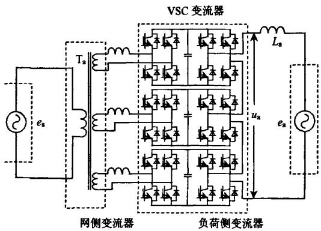  
图1单相交流电子负载主拓扑  
Fig.1 Main topology of single phase AC electrical load

三相大容量可控交流PEL由结构完全一致的单相交流PEL构成，并采用分相控制，具有不平衡负载能力强的特点。主电路拓扑结构主要包括：单相多绕组整流变压器，PWM整流滤波电抗，单相PWM整流桥，直流储能电容，单相逆变H桥和并网连接电抗器。为了降低变压器的容量，电网侧交流器即PWM整流侧采用单位功率因数控制方法，保证变压器只承担装置的有功功率容量。负荷侧变流器即逆变器侧采用有功功率和无功功率解耦控制，用以模拟线性负荷条件下负荷消耗的功率。

# 2 变流器控制方法分析

# 2.1 网侧变流器PWM整流控制方法分析

网侧变流器的主要功能是将负荷侧变流器吸收的有功功率回馈给电网，同时保证直流侧母线电压为稳定值。因此，为了提高装置容量和降低损耗，并降低整流变压器的容量，网侧变流器采用单位功率因数并网控制[13-14]，单相全桥PWM整流器电路如图2(a)所示。由于单相全桥电压型PWM整流器开关管状态及开关函数 $\mathbf{S}_{\mathrm{ai}}$ 如表1所示。根据开关函数可以得到PWM整流器等效电路，如图2(b)所示，由于本装置中采用的是单相多绕组变压接入方式，可以得到 $S_{\mathrm{a}} = S_{\mathrm{a1}} + S_{\mathrm{a2}} + S_{\mathrm{a3}}$ ，除了能提供独立直流母线电压之外，同时网侧变流器采用载波移相控

表1 全桥PWM整流器开关状态  
Tab 1 Switch states of full bridge PWM rectifier   

<table><tr><td colspan="2">IGBT 状态</td><td>Sn1、Sn2、Sn3</td></tr><tr><td>S1S4</td><td>开</td><td rowspan="2">1</td></tr><tr><td>S2S3</td><td>关</td></tr><tr><td>S2S4</td><td>开</td><td rowspan="2">0</td></tr><tr><td>S2S4</td><td>关</td></tr><tr><td>S1S3</td><td>开</td><td rowspan="2">0</td></tr><tr><td>S1S3</td><td>关</td></tr><tr><td>S2S3</td><td>开</td><td rowspan="2">-1</td></tr><tr><td>S1S4</td><td>关</td></tr></table>

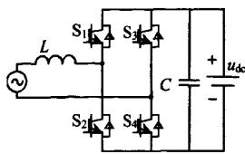  
(a) 单相全桥PWM整流电路

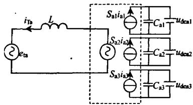  
(b) 单相PWM整流器等效电路  
图2网侧变流器等效电路  
Fig.2 Grid side converter equivalent circuit

制，用以减少变压器原边电流纹波。

网侧变流器的主要功能是将负荷侧变流器吸收的有功功率回馈给电网，或者是提供负荷侧变流器需要的有功功率。其中间环节是通过对直流母线电压的稳定控制自动实现能量的回馈与提供，控制框图如图3所示。

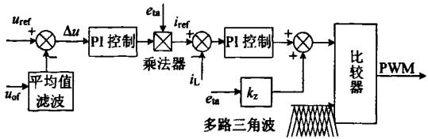  
图3网侧变流器控制方法框图  
Fig. 3 Grid side converter control strategy blocks

# 2.2 负荷侧变流器消耗功率分析

负荷变流器的主要功能是模拟实际负荷消耗的有功功率和无功功率，控制负荷侧变流器输出电流 $i_{\mathrm{a1}}$ 的大小和相位，负荷侧变流器采用载波移相控制，用以提高等效开关频率改善波形质量[15-19]，等效电路如图4所示。

根据基波等效电路， $Z_{s} < Z_{a}$ ，可得到负荷侧变流器进行功率调节时的向量图，如图5所示，其中 $\pmb{\theta}$ 为逆变器输出电压与系统电压的相角。

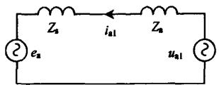  
图4负荷侧变流器等效电路

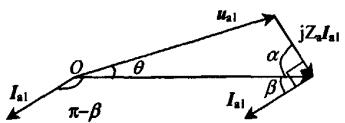  
Fig. 4 Load side converter equivalent circuit   
图5装置有功功率调节向量图  
Fig. 5 Active power regulate vector graphic

装置注入系统的无功和有功功率可表示为

$$
\left\{ \begin{array}{l} Q = E _ {\mathrm {a}} I _ {\mathrm {a l}} \sin (\pi - \beta) = E _ {\mathrm {a}} I _ {\mathrm {a l}} \sin \beta \\ P = E _ {\mathrm {a}} I _ {\mathrm {a l}} \cos (\pi - \beta) = - E _ {\mathrm {a}} I _ {\mathrm {a l}} \cos \beta \end{array} \right. \tag {1}
$$

$$
\sin \beta = \cos \alpha = \frac {E _ {\mathrm {a}} ^ {2} + Z _ {\mathrm {a}} ^ {2} I _ {\mathrm {a l}} ^ {2} - U _ {\mathrm {a l}} ^ {2}}{2 E _ {\mathrm {a}} Z _ {\mathrm {a}} I _ {\mathrm {a l}}} \tag {2}
$$

通过控制逆变器输出基波电压相位 $\theta$ 和有效值 $U_{\mathrm{al}}$ ，假设 $U_{\mathrm{a1}} = kE_{\mathrm{a}}$ ，得到

$$
\left\{ \begin{array}{l} Q = \frac {E _ {\mathrm {a}} ^ {2}}{Z _ {\mathrm {a}}} (1 - k \cos \theta) \\ P = - \frac {k E _ {\mathrm {a}} ^ {2}}{Z _ {\mathrm {a}}} \sqrt {1 - \cos^ {2} \theta} \end{array} \right. \tag {3}
$$

根据式(3)，可得到装置的功率与相角 $\theta$ 和幅值比 $k$ 之间的关系曲线，如图6所示，其中图6(a)为装置无功功率曲线，图6(b)为装置有功功率曲线，并且为装置向系统注入有功的曲线。

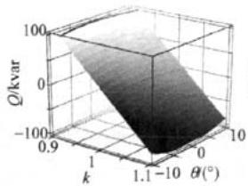  
(a) 无功功率曲线

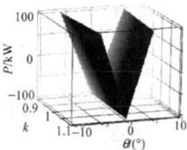  
(b) 有功功率曲线  
图6装置功率与相角和电压幅值的关系曲线  
Fig. 6 Power curve between phase angle $\theta$ and magnitude ratio $k$

# 2.3 负荷侧变流器PQ闭环解耦控制分析

为了实现功率的精确控制，本节提出了基于负荷侧变流器输出电流 $i_{d}$ 、 $i_{q}$ 闭环的PQ解耦控制，在保证PQ解耦控制的前提下，还能实现对功率及功率因数的精确控制。由于本装置采用星型连接方式并带有中性线，不能直接采用瞬时无功理论的 $i_{d}$ 、 $i_{q}$ 检测法[2]，该方法要求三相电流之和为零。解决方法是先求出零序电流分量，将零序分量从各相电流中剔除，检测框图及控制方法如图7所示。

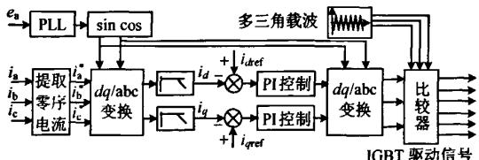  
图7 $i_d$ 和 $i_q$ 检测及控制方法框图  
Fig. 7 $i_{d}$ $i_{q}$ measure and control strategy blocks

三相四线制系统中，变流器三相电流 $i_{\mathrm{a}}$ 、 $i_{\mathrm{b}}$ 、 $i_{\mathrm{c}}$ 中所包含的零序分量电流为

$$
i _ {Z} = \left(i _ {a} + i _ {b} + i _ {c}\right) / 3 \tag {4}
$$

将零序分量 $i_{Z}$ 从三相电流中剔除，则有

$$
\left\{ \begin{array}{l} i _ {\mathrm {a}} ^ {*} = i _ {\mathrm {a}} - i _ {\mathrm {Z}} \\ i _ {\mathrm {b}} ^ {*} = i _ {\mathrm {b}} - i _ {\mathrm {Z}} \\ i _ {\mathrm {c}} ^ {*} = i _ {\mathrm {c}} - i _ {\mathrm {Z}} \end{array} \right. \tag {5}
$$

$$
i _ {\mathrm {a}} ^ {*} + i _ {\mathrm {b}} ^ {*} + i _ {\mathrm {c}} ^ {*} = 0 \tag {6}
$$

将 $i_{\mathrm{a}}^{*}$ 、 $i_{\mathrm{b}}^{*}$ 、 $i_{\mathrm{c}}^{*}$ 进行 $dq$ 变换，再经低通滤波器滤波，得到直流分量 $i_d$ 、 $i_q$ ，为了实现对本装置输出功率及功率因数的精确控制，检测计算得到的 $i_d$ 、 $i_q$ 必须与给定的 $i_{\mathrm{dref}}$ 、 $i_{\mathrm{qref}}$ 进行闭环PI控制，之后再将PI输出量经 $dq$ 逆变换，得到abc坐标系下的指令信号，再经三角载波控制之后得到IGBT开关管的驱动信号，其控制框图如图7所示。

# 3 仿真分析

利用PSCAD/EMTDC仿真软件建立了三相电力电子负载的仿真模型，主要仿真参数如表2所示。

表 2 关键仿真参数  
Tab. 2 Key simulation parameter   

<table><tr><td>参数</td><td>取值</td></tr><tr><td>接入电压等级/V</td><td>380</td></tr><tr><td>变压器变比n</td><td>380:150</td></tr><tr><td>逆变器开关频率f/kHz</td><td>3</td></tr><tr><td>连接电抗器L2/mH</td><td>0.5</td></tr><tr><td>负荷给定条件/A</td><td>idref=50, igref=100</td></tr></table>

基于 $i_d$ 、 $i_q$ 闭环的PQ解耦控制方法下的三相可控交流电子负载模拟系统的仿真波形如图8、9所示，图8为负荷侧变流器仿真波形，图9为网侧变流器仿真波形。其中图8(a)为负荷侧变流器输出 $i_d$ 、 $i_q$ 电流，与给定值完全相等，此时负荷容量为 $S = 53.87\mathrm{kVA}$ ，功率因数为0.44(滞后)。图8(b)为负荷侧变流器输出三相电流波形 $i_{\mathrm{a}}$ 、 $i_{\mathrm{b}}$ 、 $i_{\mathrm{c}}$ 和A相负荷电压波形 $e_{\mathrm{a}}$ ，其中三相电流失真度分别小于 $2\%$ 表明该装置能够很好的模拟线性负荷特性。

图9(a)为A相三单元直流母线电压波形，分别为 $u_{\mathrm{dca1}}$ 、 $u_{\mathrm{dca2}}$ 、 $u_{\mathrm{dca3}}$ ，直流母线电压均良好稳定在

250V左右，纹波电压小于 $1\%$ 。图9(b)为网侧变流器中A相变压器原边电压 $e_{\mathrm{Ta}}$ 和并网电流 $i_{\mathrm{Ta}}$ ，此时并网功率因数为0.986，仿真波形表明：对网侧变流器的控制很好地实现了单位功率因数并网，保证网侧变流器只传输有功功率，降低并网电流；同时并网电流 $i_{\mathrm{Ta}}$ 具有良好的正弦度，三相并网电流谐波失真度分别都小于 $2\%$ 。

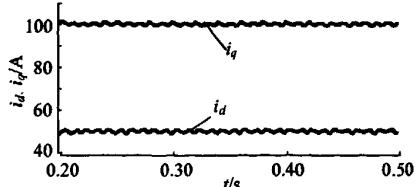  
(a) 负荷侧变流器输出 $i_{d}$ 、 $i_{q}$ 电流波形

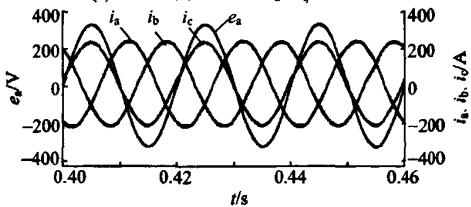  
(b) 负荷侧A相电压 $e_{\mathrm{a}}$ 和 $i_{\mathrm{a}}, i_{\mathrm{b}}, i_{\mathrm{c}}$ 三相电流波形  
图8 负荷侧变流器仿真波形

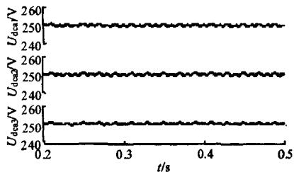  
Fig. 8 Load side converter simulation waveforms

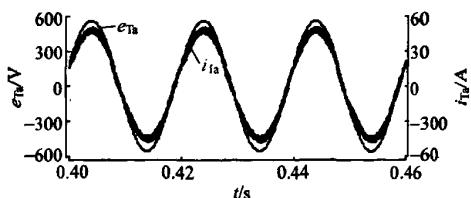  
(a) A 相 $u_{\mathrm{dca1}}$ 、 $u_{\mathrm{dca2}}$ 、 $u_{\mathrm{dca3}}$ 三单元直流电压波形  
(b) 变压器原边电压 $e_{\mathrm{TA}}$ 和 $i_{\mathrm{TA}}$ 电流波形  
图9 网侧变流器仿真波形  
Fig. 9 Grid side converter simulation waveforms

# 4 实验分析

设计制作了一套低压 $400\mathrm{V} / 100\mathrm{kVA}$ 三相PEL样机，样机参数如表3所示，负荷侧IGBT容量为 $600\mathrm{V}$ ，450A；网侧IGBT容量为 $600\mathrm{V}$ ，100A；实验中采用的是同一个电网。

模拟不同负荷特性时的实验波形如图10所示，分别给出了电阻性负荷、电容性负荷和功率因数超前、滞后(0.54)时的4种特性负荷，依次如图10(a)、

表 3 关键实验参数  
Tab. 3 Key experimental parameter   

<table><tr><td>参数</td><td>取值</td></tr><tr><td>负荷侧变流器容量S/kVA</td><td>100</td></tr><tr><td>网侧变流器容量P/kW</td><td>45</td></tr><tr><td>直流母线电压Udc/V</td><td>250</td></tr><tr><td>网侧开关频率f/kHz</td><td>6</td></tr><tr><td>负荷侧开关频率f/kHz</td><td>3</td></tr><tr><td>网侧连接电抗器L/mH</td><td>0.4</td></tr><tr><td>负荷侧连接电抗器L/mH</td><td>0.5</td></tr><tr><td>变压器变比n</td><td>380:150</td></tr><tr><td>变压器容量S/kVA</td><td>50</td></tr></table>

(b)、(c)和(d)所示。图10(a)中的波形分别为电网电压波形 $e_{\mathrm{a}}$ 、PWM整流变压器原边电流波形 $i_{\mathrm{Ta}}$ 、模拟负荷电流波形 $i_{\mathrm{a}}$ 。PWM整流输入功率为 $P_{\mathrm{in}} = 40.8 \mathrm{kW}$ ，逆变回馈功率为 $P_{\mathrm{o}} = 36.4 \mathrm{kW}$ ，装置运行效率 $\eta = 89.2\%$ ，此时PWM整流功率因数为0.98，逆变回馈功率因数为0.99。图10(b)、(c)和(d)给出的是系统电压波形及模拟负荷电流波形，其中10(b)为容性电流 $i_{\mathrm{a}} = 137 \mathrm{~A}$ ，电流失真度 $\mathrm{THD}_{\mathrm{i}} = 3.5\%$ ，图10(c)为功率因数滞后(0.54)的实验波形 $i_{\mathrm{a}} = 112 \mathrm{~A}$ ，电流失真度 $\mathrm{THD}_{\mathrm{i}} = 3.8\%$ ，图10(d)为功率因数超前(0.54)的实验波形 $i_{\mathrm{a}} = 112 \mathrm{~A}$ ，电流失真度 $\mathrm{THD}_{\mathrm{i}} = 3.7\%$ 。

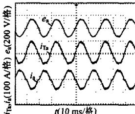  
(a) 纯电阻负荷

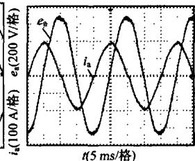  
(b) 纯电容负荷

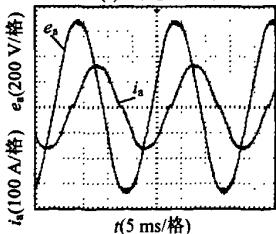  
(c) 功率因数滞后

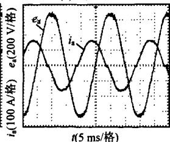  
(d) 功率因数超前   
图10 不同负荷特性模拟实验波形  
Fig. 10 Experimental waveforms of different load simulation

装置输出容量从0 kvar阶跃到25 kvar时的实验波形如图11所示， $e_{\mathrm{a}}$ 为负荷侧电压波形， $i_{\mathrm{a}}$ 为装置输

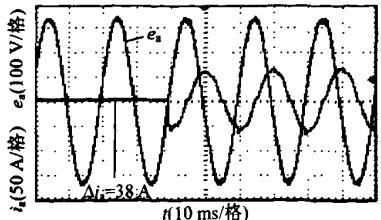  
图11动态响应实验波形  
Fig. 11 Experimental waveforms of dynamic performance

出电流波形，输出电流 $i_{\mathrm{a}}$ 从0A阶跃到38A过渡时间小于1/4周期，并且没有超调量，实验波形表明装置具有良好的动态性能。

# 5 结论

本文提出了一种宽电压范围等级的交流三相能量回馈型电力电子负载的主电路拓扑结构和控制方法，为电力电子设备实验提供了一种新颖的负载，可以大量节约电能消耗，同时也避免了传统负载容量小、发热大等问题。此外还具有以下特点：

1）主电路拓扑两侧采用串并联不同的连接方式，适用于两侧电压等级不同、容量不等场合。  
2）采用单相方式构成组合式三相输出，具有不平衡输出能力强的特点，适用于单相和三相场合。  
3）负荷侧变流器采用PQ解耦控制，可以实现功率因数0~1可调，能够模拟任意功率因数下的线性负载特性。  
4）两侧变流器均采用载波移相控制，保证了两侧变流器输出电流低纹波含量。

# 参考文献

[1] Chaturvedi D K, Mali O P. Neurofuzzy power system stabilizer[J]. IEEE Trans. on Energy Conversion, 2008, 23(3): 887-894.   
[2] Mithulananthan N, Canizares C A, Reeve J, et al. Comparison of PSS, SVC, and STATCOM controllers for damping power system oscillations[J]. IEEE Trans. on Power Systems, 2003, 18(2): 786-792.   
[3] Mishra S. Neural-network-based adaptive UPFC for improving transient stability performance of power system[J]. IEEE Trans. on Neural Networks, 2006, 17(2): 461-470.   
[4] Haque M H. Evaluation of first swing stability of a large power system with various FACTS devices[J]. IEEE Trans. on Power Systems, 2008, 23(3): 1144-1151.   
[5] Varma R K, Auddy S, Semsedini Y. Mitigation of subsynchronous resonance in a series-compensated wind farm using FACTS controllers[J]. IEEE Trans. on Power Delivery, 2008, 23(3): 1645-1654.   
[6] Chong Han, Huang A Q, Baran M E, at al. STATCOM impact study on the integration of a large wind farm into a weak loop power system[J]. IEEE Trans. on Energy Conversion, 2008, 23(1): 226-233.   
[7] Hochgraf C, Lasseter R H. Statcom controls for operation with unbalanced voltages[J]. IEEE Trans. on Power Delivery, 1998, 13(2): 538-544.   
[8] Griffin A, Lauria D. Two-leg three-phase inverter control for STATCOM and SSSC applications[J]. IEEE Trans. on Power Delivery, 2008, 23(1): 361-370.   
[9] Srivastava K N, Srivastava S C. Elimination of dynamic bifurcation and chaos in power system using FACTS devices[J]. IEEE Trans. on Fundamental Theory and Applications, 1998, 45(1): 72-78.   
[10] Varma R K, Auddy S, Semsedini Y. Mitigation of subsynchronous resonance in a series-compensated wind farm using FACTS controllers[J]. IEEE Trans. on Power Delivery, 2008, 23(3): 1645-1654.   
[11] 刘志刚，和敬函．基于电流型PWM整流器的电子模拟负载系统研究[J].电工技术学报，2004，19(6)：74-77.

Liu Zhigang, He Jinghan. Design and realization of energy feedback type electronic power load based on current-Type PWM rectifier[J]. Transactions of China Electrotechnical Society, 2004, 19(6): 74-77 (in Chinese).   
[12] 赵剑锋，潘诗锋，王浔．大功率能量回馈型交流电子负载及其在电力系统动模实验中的应用[J].电工技术学报，2006,21(4):35-39. Zhao Jianfeng, Pan Shifeng, Wang Xun. High power energy feedback AC electronic load and its application in power system dynamic physical simulation[J]. Transactions of China Electrotechnical Society, 2006, 21(4):35-39(in Chinese).   
[13] 王久和，李华德，王立明. 电压型PWM整流器直接功率控制系统[J]. 中国电机工程学报，2006，26(18)：54-60.  
Wang Jiuhe, Li Huade, Wang Liming. Direct power control system of three phase Boost type PWM rectifiers[J]. Proceedings of the CSEE, 2006, 26(18): 54-60 (in Chinese).   
[14] 王久和，李华德．一种新的电压型PWM整流器直接功率控制方法[J].中国电机工程学报，2005，25(16)：47-52.  
Wang Jiuhe, Li Huade. A new direct power control strategy of three phase boost type PWM rectifiers[J]. Proceedings of the CSEE, 2005, 25(16): 47-52(in Chinese).   
[15] 江有华，曹以龙，龚幼民. 基于载波相移角度的级联型多电平变频器输出特性能的研究[J]. 中国电机工程学报，2007, 27(1): 76-81. Jiang Youhua, Cao Yilong, Gong Youmin. Research on the cascade multilevel inverter based on different carrier phase-shifted angle[J]. Proceedings of the CSEE, 2007, 27(1): 76-81(in Chinese).   
[16] 王毅，李和明，石新春，等．多电平PWM逆变电路谐波分析与输出滤波器设计[J].中国电机工程学报，2003，23(10)：78-82. Wang Yi, Li Heming, Shi Xinchun, et al. Harmonic analysis and output filter design for multilevel PWM inverters[J]. Proceedings of the CSEE，2003，23(10):78-82(in Chinese).  
[17] 费万民, 目征宇, 姚文熙. 多电平逆变器特定谐波消除脉宽调制方法的仿真研究[J]. 中国电机工程学报, 2004, 24(1): 102-106. Fei Wanming, Lu Zhengyu, Yao Wenxi. Research of selected harmonic elimination PWM technique applicable to multilevel voltage inverter[J]. Proceedings of the CSEE, 2004, 24(1): 102-106(in Chinese).   
[18] 王鸿雁，陈阿莲. 基于控制自由度组合的多电平逆变器载波PWM控制方法[J]. 中国电机工程学报，2004，24(1)：131-135.  
Wang Hongyan, Chen A lian. Multilevel inverter carrier-based PWM method based on control degrees of freedom combination [J]. Proceedings of the CSEE, 2004, 24(1): 131-135(in Chinese).   
[19] 吴洪洋，何湘宁．级联型多电平变换器PWM控制方法的仿真研究[J].中国电机工程学报，2001，21(8)：42-46.  
Wu Hongyang, He Xiangning, Research on PWM control of cascade multilevel converter[J]. Proceedings of the CSEE, 2001, 21(8): 42-46(in Chinese).

  
单任仲

收稿日期：2010-04-06。

作者简介：

单任仲(1982一)，男，博士研究生，研究方向为电力电子技术在电力系统中的应用、功率变换技术，srz19820521@sohu.com;

肖湘宁(1953—)，男，教授，博士生导师，主要研究方向为电能质量、柔性交流输电；

尹忠东(1968—)，男，博士，副教授，主要研究方向为FACTS技术、新能源发电及储能技术；

刘乔(1987一)，男，硕士研究生，研究方向为电力电子技术在电力系统中的应用。

(编辑 呂鲜艳)