# 直流机电暂态与电磁暂态模型在低频振荡分析中的比较

王天钰，李龙源，和 鹏，王晓茹

（西南交通大学电气工程学院，四川 成都 610031）

摘要：对交直流混合运行系统进行低频振荡分析时，直流系统通常采用机电暂态仿真模型。介绍了直流系统的机电暂态和电磁暂态两种仿真模型，在电力系统全数字仿真装置（ADPSS）平台上建立了EPRI36系统和某实际电网系统的机电暂态模型和机电-电磁暂态混合仿真模型，分别用于低频振荡分析。采用基于总体最小二乘-旋转不变技术的信号参数估计（TLS-ESPRIT）算法，分析故障后的振荡功率信号。提取低频振荡主导振荡频率、阻尼比等信息进行模态分析，并对分别利用两种仿真模型进行仿真得到的低频振荡分析的结果进行比较。结果表明，直流线路分别采取两种仿真模型时，仿真结果较为吻合，低频振荡分析的结果基本相同，机电暂态模型具有较高的实用价值。

关键词：交直流系统；低频振荡分析；机电暂态模型；电磁暂态模型；ADPSS；混合仿真

# Comparison between electromechanical transient model and electromagnetic transient model of DC in low frequency oscillation analysis

WANG Tian-yu, LI Long-yuan, HE Peng, WANG Xiao-ru

(School of Electrical Engineering, Southwest Jiaotong University, Chengdu 610031, China)

Abstract: For AC and DC operating system Low Frequency Oscillation (LFO) Analysis, DC system usually adopts electromechanical transient model. This paper introduces the DC electromechanical transient and electromagnetic transient model, and then establishes the electromechanical transient model and the electromechanical-electromagnetic transient hybrid simulation model on the Advanced Digital Power System Simulator (ADPSS) platform for the LFO analysis respectively. Adopting the total least squares method-rotational invariance techniques of signal parameter estimation (TLS-ESPRIT) algorithm, the oscillation power after failure is analyzed. After extracting the LFO dominant oscillation frequency and damping ratio for making the modal analysis, it compares the LFO analysis results of the two simulation models. Results of the EPRI36 standard test system and a practical power system simulation show that the simulation results of two simulation models are tallied, besides, the LFO analysis result is basically the same. The electromechanical transient model has a high practical value.

Key words: AC and DC systems; low frequency oscillation analysis; electromechanical transient model; electromagnetic transient model; ADPSS; hybrid simulation

中图分类号： TM731 文献标识码：A 文章编号： 1674-3415(2013)19-0017-07

# 0 引言

低频振荡（LFO）问题已经成为制约电网传输能力的主要因素之一[1]。在对交直流混合运行的电力系统[2]进行低频振荡分析时，直流系统通常采用机电暂态仿真模型，目前已有文献[3-4]比较过当直流系统分别采用机电恒功率模型和机电准稳态模型进行仿真时系统低频振荡分析的结果。机电暂态模型对直流换流器做了稳态等值简化处理，在交流系统不对称故障、换相失败时其仿真精度有限；而电磁暂态仿真模型建立了换流器、线路以及控制系统

等的详细模型，理论上对系统发生不对称故障时直流系统的暂态特性分析更为精确。文献[5]在直流系统换相失败等三个方面对两种模型进行仿真研究并比较结果。但目前在低频振荡分析领域，还没有文献对机电暂态模型和电磁暂态模型的仿真结果进行比较。

中国电力科学研究院研发的电力系统全数字仿真装置（ADPSS）不仅具有机电-电磁暂态混合仿真的功能，而且可以对10 000节点规模的交直流混合运行系统进行机电-电磁暂态混合实时仿真。本文在 ADPSS平台上，建立了EPRI36标准测试系统和

某实际电网系统的机电暂态仿真模型和混合仿真模型，分别用于低频振荡分析。选取故障后的功率信号为分析对象，利用基于总体最小二乘法-旋转不变技术的信号参数估计（TLS-ESPRIT）算法[6]，分别提取采用机电暂态模型[7-8]和机电-电磁暂态混合模型[9]仿真时系统低频振荡主导振荡模式、阻尼比等信息，进行模态分析，并比较二者计算结果，为在低频振荡分析时直流系统仿真模型的选取提供依据。

# 1 直流输电系统建模

# 1.1 直流准稳态模型

高压直流（HVDC）输电准稳态模型是指，在直流系统稳定运行时，以换流站交流母线电压为换相电压，以变压器漏抗作为换相电抗，忽略交流系统对直流侧影响的仿真模型[4]。稳态运行时每个12脉动换流器模型表示如图 1。

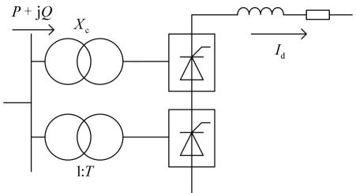  
图1 准稳态电路换流器模型  
Fig. 1 Quasi steady state model of converter

稳态运行方程式可表示为式（1）。

$$
\left\{ \begin{array}{l} V _ {\mathrm {d} 0} = \frac {3 \sqrt {2}}{\pi} B T V \\ V _ {\mathrm {d}} = V _ {\mathrm {d} 0} \cos \alpha - \frac {3}{\pi} X _ {\mathrm {c}} I _ {\mathrm {d}} B \\ P = V _ {\mathrm {d}} I _ {\mathrm {d}} \\ Q = P \tan \phi \\ \phi = \arccos  \frac {V _ {\mathrm {d}}}{V _ {\mathrm {d} 0}} = \theta_ {\mathrm {V}} - \theta_ {\mathrm {I}} \\ I = \frac {\sqrt {6}}{\pi} B T I _ {\mathrm {d}} \end{array} \right. \tag {1}
$$

式中：V 为换流母线电压；T 为换流变压器变比；$X _ { \mathrm { { c } } }$ 为换相电抗；B为同一极换流器串联个数；P、Q 、 I 分别为换流母线注入换流器的有功、无功和电流； $V _ { \mathrm { d } }$ 、 $I _ { \mathrm { d } }$ 分别为直流电压、电流。

对直流系统各部分进行线性化[3-4]，可以形成直流系统的准稳态等值电路，如图 2所示。文献[8]对换流变压器基本参数进行了推导。文献[9]以不同强度交流系统为对象，对这种模型的有效性进行了验证。

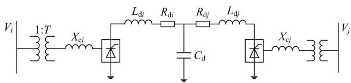  
图2 准稳态等值电路  
Fig. 2 Equivalent circuit of quasi steady state model

图中： $V _ { i }$ 、 $V _ { j }$ 为换流母线电压； $L _ { \mathrm { d } }$ 、 $R _ { \mathrm { d } }$ 、 $C _ { \mathrm { d } }$ 分别为直流线路等效电感、电阻、对地电容。

# 1.2 直流电磁暂态仿真模型

电磁暂态仿真过程是对电路中电阻电感及电容元件的微分方程进行求解的过程，可以实现对电力电子器件的详细模拟。在仿真中，直流系统的模拟主要是对换流器、直流线路、直流控制及保护设备的模型进行模拟。

# （1）换流器数学模型

换流器模型[10-11]是由晶闸管等元件组成的电子电路。在 ADPSS电磁暂态计算平台上，6 脉冲换流器采用三相暂态模型模拟，每个阀臂由一晶闸管元件和 R-C缓冲电路并联而成，晶闸管的导通用阻值很小的电阻模拟，其等值模型如图 3(a)所示。将电容的微分方程化为差分方程后，可以得到用等值电阻 $R _ { \mathrm { R C } }$ 和等值电流源 $I _ { \mathrm { R C } } \left( t ^ { - } \Delta t \right)$ 表示的暂态等值计算电路，如图 3(b)所示，其中等值电流源是与历史时刻相关的项[12]。

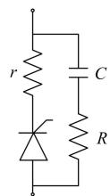  
(a)实际电路

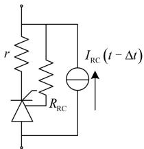  
(b)暂态等值计算电路  
图3 换流阀臂的电磁暂态模型  
Fig. 3 Electromagnetic transient model of converter valve arm

对电感电阻元件用同样的方法进行等值，可以得到图 4。

12 脉冲换流器由两个6 脉冲换流器串联而成，其各自相连的换流变压器分别采用Y-Y-0 接、Y-∆-1接法，如图 5所示。将所有的换流阀臂由图3(b)表

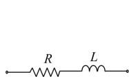  
(a)实际电路

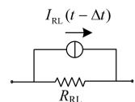  
(b)暂态等值计算电路  
图4 电阻电感元件电磁暂态模型  
Fig. 4 Electromagnetic transient model of R and L

示，所有的电阻电感电路由图 4(b)表示，列出节点导纳矩阵 $Y _ { \mathrm { c o n } }$ 和节点注入电流矩阵 I ，根据节点电压方程公式 $Y U { = } I$ ，阀的连接关系及阀的导通关断状态，最终可得到换流器的节点电压方程为

$$
\boldsymbol {Y} _ {\text {c o n}} \boldsymbol {U} _ {\text {c o n}} = \boldsymbol {H} _ {\text {c o n}} + n _ {1} \boldsymbol {P} _ {\text {c o n} 1} \boldsymbol {i} _ {\alpha 1} + \frac {1}{\sqrt {3}} n _ {2} \boldsymbol {P} _ {\text {c o n} 2} \boldsymbol {i} _ {\alpha 2} + \boldsymbol {P} _ {\text {c o n} \beta} \boldsymbol {i} _ {\beta} \tag {2}
$$

式中： $n _ { 1 } .$ 、 $n _ { 2 }$ 分别为图中Y-Y-0 接、Y-∆-1 接换流变压器变比； $Y _ { \mathrm { { c o n } } }$ 、 $U _ { \mathrm { c o n } }$ 分别为 12 脉冲换流器的节点导纳矩阵、节点电压向量； $\pmb { H } _ { \mathrm { c o n } }$ 为与某节点相连的暂态等值电流源向量； $i _ { \mathrm { { a l } } }$ =[ $i _ { \mathrm { a l a } } ,$ iα1b, $i _ { \mathrm { a l c } }$ ]T 为 Y-Y-0接换流变压器一次侧三相电流； $\dot { \pmb { l } } _ { 0 2 } = \rvert$ [ $i _ { \mathrm { { o 2 a } } } , i _ { \mathrm { { o 2 b } } } , i _ { \mathrm { { o 2 c } } }$ ]T为 Y-∆-1 接换流变压器一次侧三相电流； $i _ { \beta }$ 为注入该换流器的直流电流； $P _ { \mathrm { c o n 1 } }$ 、 $P _ { \mathrm { c o n } 2 }$ 分别为反映该换流器某一节点与 $i _ { \mathrm { a l } }$ 、 $i _ { \mathrm { a } 2 }$ 关联关系的矩阵，其中元素为 0、1 或-1； $P _ { \mathrm { c o n \beta } }$ 为反映该换流器某一节点与 $i _ { \beta }$ 关联关系的矩阵，其中元素为 0 或 1。

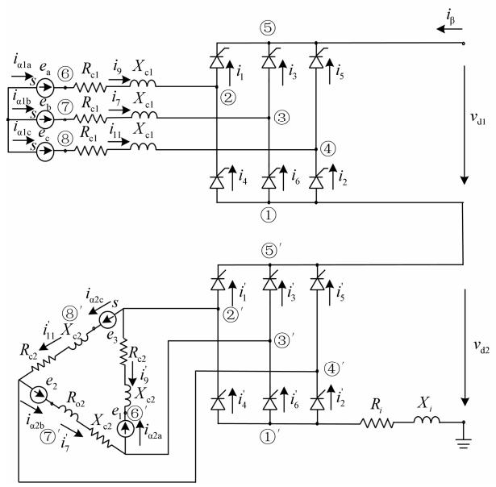  
图5 12脉冲换流器电路图  
Fig. 5 Circuit of 12 pulse converter

# （2）直流线路数学模型

对于直流线路模型，通常有集中参数π 型等效电路、分布式参数 Bergeron 模型[13-14]。ADPSS 软件中采用的是T型集中参数线路模型，如图 6(a)所示，图中 $R _ { l } , \ L _ { l }$ 和 $C _ { l }$ 分别为直流线路的电阻、电感和电容。将其中电容、电阻、电感元件的微分方程用隐式梯形积分法[12]化为差分方程后，可得到其暂态等值计算电路如图 6(b)所示。

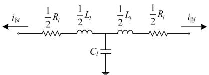  
(a)实际电路

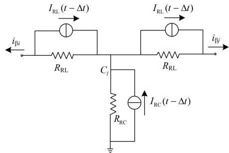  
(b)暂态计算等值电路  
图 6 直流线路 T 型等值电路  
Fig. 6 T-type equivalent circuit of the DC line

对于双极直流线路，可得其节点电压方程为

$$
\boldsymbol {Y} _ {\mathrm {d c}} \boldsymbol {U} _ {\mathrm {d c}} = \boldsymbol {H} _ {\mathrm {d c}} + \boldsymbol {P} _ {\mathrm {d c} 1} i _ {\beta 1 i} + \boldsymbol {P} _ {\mathrm {d c} 2} i _ {\beta 1 j} + \boldsymbol {P} _ {\mathrm {d c} 3} i _ {\beta 2 i} + \boldsymbol {P} _ {\mathrm {d c} 4} i _ {\beta 2 j} \tag {3}
$$

其中： $Y _ { \mathrm { d c } }$ 、 $\pmb { U } _ { \mathrm { d c } }$ 、 $\pmb { H } _ { \mathrm { d c } }$ 分别为直流网络的节点导纳矩阵、节点电压及等值电流源； $i _ { \beta 1 i \cdot }$ 、 $i _ { \beta 1 j }$ 为从直流网络极 1 流向 I 侧、J 侧换流器的电流；iβ2i、 $i _ { \beta 2 j }$ 为从直流网络极 2 流向 I 侧、J 侧换流器的电流； $\pmb { P } _ { \mathrm { d c l } }$ 、$\mathbf { \nabla } P _ { \mathrm { d c } 2 } .$ 、 $\pmb { P } _ { \mathrm { d c } 3 }$ 、 $ { P _ { \mathrm { d c 4 } } }$ 为反映某一直流节点与 $i _ { \beta 1 i \setminus }$ 、iβ1j、iβ2i、$i _ { \beta 2 j }$ 关联关系的关联矩阵，其中元素为 0、1 或-1。

平波电抗器[13]、交直流滤波器组[15可以根据实际运行参数进行建模。

# 2 系统的机电暂态-电磁暂态混合仿真

机电暂态仿真以研究电力系统受到扰动后的稳定性为目标，电磁暂态仿真以研究元件中电压和电流的变化过程为目标，而混合仿真则集中了两者的优点，它将系统的仿真分为并行的两部分，对HVDC/FACTS 或需要详细模拟的部分用电磁暂态仿真，对不需详细模拟的部分用机电暂态仿真[16]。

直流工程由以下几个主要部分构成：换流变压器、换流器、平波电抗器、交直流滤波器、直流控制器及接地极[17]。在 ADPSS 的电磁暂态计算平台上搭建 EPRI36 系统双极运行直流线的每一部分元件模型[18]，构成整个直流输电系统，如图7 所示。对系统其他部分搭建机电暂态仿真模型，如图8。

该系统直流线双极运行，直流电压为250 kV，单极传输150 MW电力。整流侧采用定电流、低压限流控制方式，逆变侧采用定熄弧角、定电压、定电流、低压限流控制方式。

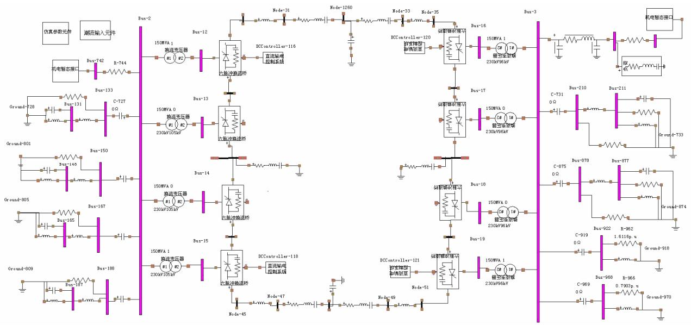  
图7 直流系统电磁暂态模型

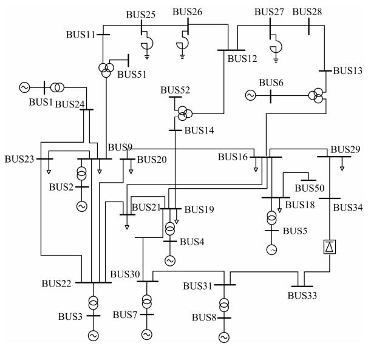  
Fig. 7 Electromagnetic transient model of HVDC  
图8 EPRI36系统机电暂态仿真模型  
Fig. 8 Quasi steady state model of EPRI36 system

在混合仿真过程中，按照计算结果和经验值设置直流系统的运行参数，并且利用电磁暂态程序中的数学元件搭建 UD 模块测量直流系统正常运行所需无功以及机电部分所提供无功，对其差值在接口处用感性或容性无功负荷进行无功补偿，帮助实现对系统的机电-电磁暂态混合仿真。系统在无故障情况下的仿真结果如图9 所示。从图中可以看出，混合仿真的系统趋于平稳运行状态，直流电压电流稳定于 1 p.u.。

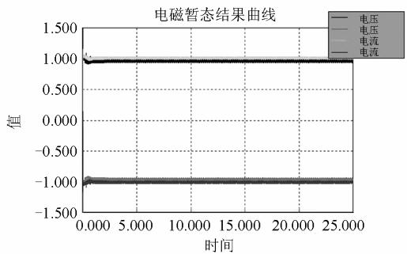  
图9 直流电压和电流  
Fig. 9 Voltage and current of DC line

# 3 算例分析

# 3.1 EPRI36 系统低频振荡分析

EPRI36 系统图如图 8 所示。设置 BUS24 与BUS9 间交流线在第 1 s 发生单相瞬时接地短路故障，接地电阻0.1 Ω，经过 0.1 s故障消失。得到发电机 G2 到 G6 相对 G1 的相对功角曲线，仿真结果如图 10所示。

传统 Prony 算法对噪声信号敏感，影响其辨识精度。本文选用 TLS-ESPRIT 算法对功率信号进行分析。该算法是一种基于子空间的高分辨率信号分析方法，直接以测量数据构成的数据矩阵为基础，把信号空间分解为信号子空间和噪声子空间，能够高精度地辨识电力系统低频振荡的模式[6,19]。对发电机相对功角曲线进行分析，选取能量较高的振荡频率，结果如表 1 所示。

从图 10 中可以看出，在两种仿真模型下的发电机功角曲线趋势相同。分析表1 中数据，机电暂态仿真结果表明，各发电机都以0.357 Hz 的主导振荡频率振荡，而在机电-电磁暂态仿真结果中，各发电机以 0.37 Hz 的主导振荡频率振荡，在两种仿真模型下，系统的主导振荡频率比较接近，其各自的阻尼比相差 0.3%以内。机电暂态仿真可以在一定程度上反映系统低频振荡特征。

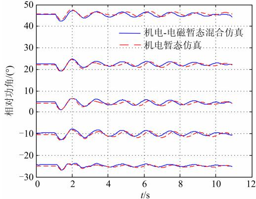  
图10 发电机功角曲线对比图  
Fig. 10 Comparison chart of generator power angle curve

表1 两种仿真模型下发电机功角低频振荡数据  
Table 1 LFO data of generator in two simulation models   

<table><tr><td></td><td>类型</td><td>幅值</td><td>衰减因子</td><td>频率</td><td>阻尼比</td></tr><tr><td rowspan="2">G1-G2</td><td>机电暂态</td><td>0.733 3</td><td>0.036 96</td><td>0.356 7</td><td>0.017 48</td></tr><tr><td>混合仿真</td><td>0.810 5</td><td>0.047 17</td><td>0.370 7</td><td>0.020 67</td></tr><tr><td rowspan="2">G1-G3</td><td>机电暂态</td><td>1.25</td><td>0.036 38</td><td>0.356 7</td><td>0.016 23</td></tr><tr><td>混合仿真</td><td>1.46</td><td>0.046 40</td><td>0.370 5</td><td>0.019 93</td></tr><tr><td rowspan="2">G1-G4</td><td>机电暂态</td><td>1.676 4</td><td>0.035 65</td><td>0.356 7</td><td>0.016 59</td></tr><tr><td>混合仿真</td><td>1.643 9</td><td>0.046 17</td><td>0.369 9</td><td>0.018 64</td></tr><tr><td rowspan="2">G1-G5</td><td>机电暂态</td><td>1.240 4</td><td>0.037 19</td><td>0.356 8</td><td>0.016 59</td></tr><tr><td>混合仿真</td><td>1.578 2</td><td>0.043 43</td><td>0.370 8</td><td>0.018 64</td></tr><tr><td rowspan="2">G1-G6</td><td>机电暂态</td><td>1.193 2</td><td>0.036 34</td><td>0.356 7</td><td>0.016 21</td></tr><tr><td>混合仿真</td><td>1.418 6</td><td>0.042 52</td><td>0.370 3</td><td>0.018 27</td></tr></table>

# 3.2 实际电网低频振荡分析

该电网系统含 9 个厂站，6 000 多条母线，700多台发电机；电压等级从6.3 kV到 800 kV；含有三条直流线。本文选取一条起联络线作用的直流线进行分析。分别对交流系统故障和直流系统故障引起的低频振荡现象进行分析，监测主网线路传输功率，比较其在混合仿真和机电暂态仿真模型下各自的低频振荡特点。

# （1）交流系统故障

仿真故障为某一交流线发生单相瞬时接地短路、重合闸成功。监测故障后主网交流传输线上功率变化情况。仿真结果如图11所示，数据见表2。

分析图 11、表 2 中数据可以得出，机电-电磁暂态混合仿真对故障后功率变化描述更详细，两种模型下的仿真结果曲线趋势一致。系统低频振荡的主导频率较接近，其各自的阻尼比略有差距，相差在 0.1%以内。其他交流线路的仿真结果与所列结果相似，文中不再列出。

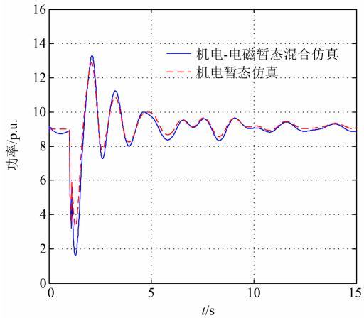

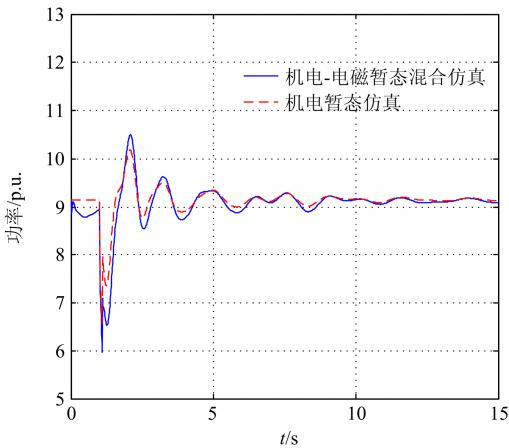  
图11两种仿真模型下交流线功率对比  
Fig. 11 Comparison chart of AC line power in two simulation models

表2 交流线路低频振荡数据  
Table 2 LFO data of AC line in two simulation models   

<table><tr><td></td><td>类型</td><td>幅值</td><td>衰减因子</td><td>频率</td><td>阻尼比</td></tr><tr><td rowspan="2">线路1</td><td>机电暂态</td><td>0.0531</td><td>0.1467</td><td>0.35882</td><td>0.06492</td></tr><tr><td>混合仿真</td><td>0.0349</td><td>0.1364</td><td>0.33986</td><td>0.06373</td></tr><tr><td rowspan="2">线路2</td><td>机电暂态</td><td>0.0158</td><td>0.0857</td><td>0.40787</td><td>0.0334</td></tr><tr><td>混合仿真</td><td>0.0211</td><td>0.0832</td><td>0.40085</td><td>0.0330</td></tr></table>

# （2）直流系统故障

仿真故障为直流线路第一极断线，监测主网交流线路上的功率振荡情况。在两种仿真模型下的仿真结果如图12，数据分析见表3。

从图 12 可以看出，在直流故障的情况下，详

细的直流模型对故障后暂态过程描述更为详细，机电暂态仿真可以给出总体振荡趋势，分析出振荡频率。分析表中数据也可以得出，机电暂态仿真模型下的阻尼比偏大，其计算结果更为乐观。

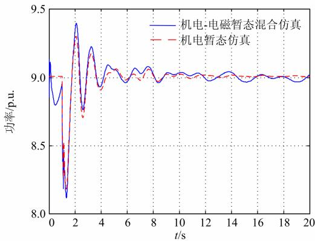  
图12 两种仿真模型下交流线路功率对比  
Fig. 12 Comparison chart of AC line power in two simulation models

表3交流线路低频振荡数据  
Table 3 LFO data of AC line in two simulation models   

<table><tr><td>类型</td><td>幅值</td><td>衰减因子</td><td>频率</td><td>阻尼比</td></tr><tr><td rowspan="2">机电暂态</td><td>0.37550</td><td>0.29592</td><td>0.3522</td><td>0.13253</td></tr><tr><td>0.25192</td><td>0.38454</td><td>0.4605</td><td>0.13172</td></tr><tr><td rowspan="2">混合仿真</td><td>0.2088</td><td>0.28007</td><td>0.4430</td><td>0.10012</td></tr><tr><td>0.1720</td><td>0.21718</td><td>0.3538</td><td>0.09723</td></tr></table>

# 4 结论

本文在 ADPSS 的仿真平台上，建立了详细的直流电磁暂态模型，针对 EPRI36 标准测试系统和某实际电网系统，选取了发电机功角曲线、发电机有功功率以及交流线路传输的功率等功率振荡信号为分析对象，分析在直流线路采取普通的机电暂态仿真模型和精确的电磁暂态仿真模型时，对系统的低频振荡分析结果的影响，主要结论如下：

（1）当系统的低频振荡非直流线路故障引发时，直流线采取机电暂态仿真模型和详细的电磁暂态仿真模型，系统低频振荡分析的结果基本相同。机电暂态模型计算量小，在仿真中较容易实现，工程上可以接受直流线采取机电暂态模型进行低频振荡分析。  
（2）当系统的低频振荡由直流线路故障引发时，直流线路机电暂态模型无法仿真换流阀等电力电子装置的暂态过程，其分析结果偏乐观，因此应对直流线进行电磁暂态建模。

# 参考文献

[1] 石辉, 张勇军, 徐涛. 我国智能电网背景下的低频振荡应对研究综述[J]. 电力系统保护与控制, 2010,38(24): 242-247.  
SHI Hui, ZHANG Yong-jun, XU Tao. Survey of response to LFO under the background of China smart grid[J]. Power System Protection and Control, 2010, 38(24): 242-247.   
[2] Kundur P. Power system stability and control[M]. Mo-Graw-Hillne, 2004.   
[3] 杨帆, 陈陈, 金小明, 等. HVDC 恒功率与准稳态模型在低频振荡分析中的比较[J]. 电力系统自动化, 2008,32(6): 9-13.  
YANG Fan, CHEN Chen, JIN Xiao-ming, et al. Comparison between constant PQ model and quasi steady state model of HVDC in low frequency oscillation analysis[J]. Automation of Electric Power Systems, 2008, 32(6): 9-13.   
[4] 彭波, 陈陈. 交直流混合运行电力系统动态稳定分析中直流准稳态线性化模型的研究[J]. 广东电力, 2008,21(3): 1-3.  
PENG Bo, CHEN Chen. Study of linearized HVDC quasi-steady-state model used for dynamic stability analysis of AC/ DC hybrid power system[J]. Guangdong Electric Power, 2008, 21(3): 1-3.   
[5] 朱旭凯, 周孝信, 田芳, 等. 基于电力系统全数字实时仿真装置的大电网机电暂态–电磁暂态混合仿真[J].电网技术, 2011, 35(3): 26-31.  
ZHU Xu-kai, ZHOU Xiao-xin, TIAN Fang, et al. Hybrid electromechanical-electromagnetic simulation to transient process of large-scale power grid on the basis of ADPSS[J]. Power System Technology, 2011, 35(3): 26-31.   
[6] 张静, 徐政, 王峰, 等. TLS-ESPRIT 算法在低频振荡分析中的应用[J]. 电力系统自动化, 2007, 31(20):84-88.  
ZHANG Jing, XU Zheng, WANG Feng, et al. TLS2ESPRIT based method for low frequency oscillation analysis in power system[J]. Automation of Electric Power Systems, 2007, 31(20): 84-88.   
[7] 张桂斌, 徐政, 王广柱. 基于 VSC 的直流输电系统的稳态建模及其非线性控制[J]. 中国电机工程学报,2002, 22(1): 17-22.  
ZHANG Gui-bin, XU Zheng, WANG Guang-zhu. Steady-state model and its nonlinear control of

VSC-HVDC system[J]. Proceedings of the CSEE, 2002, 22(1): 17-22.   
[8] 王峰, 徐政, 薛英林. 高压直流输电换流变压器参数确定方法 [J]. 电力系统保护与控制, 2011, 39(22):98-102, 107.WANG Feng, XU Zheng, XUE Ying-lin. Calculation ofconverter transformer’s parameters for HVDCtransmission[J]. Power System Protection and Control,2011, 39(22): 98-102, 107.  
[9] 周长春, 徐政. 直流输电准稳态模型有效性的仿真验证[J]. 中国电机工程学报, 2003, 23(12): 33-36.  
ZHOU Chang-chun, XU Zheng. Simulation validity test of the HVDC quasi-steady-state model[J]. Proceedings of the CSEE, 2003, 23(12): 33-36.   
[10] 王冠, 蔡晔, 张桂斌, 等. 高压直流输电电压源换流器的等效模型及混合仿真技术[J]. 电网技术, 2003, 27(2):4-8.  
WANG Guan, CAI Ye, ZHANG Gui-bin, et al. Equivalent model of HVDC-VSC and its hybrid simulation technique[J]. Power System Technology, 2003, 27(2): 4-8.   
[11] 岳程燕. 电力系统电磁暂态与机电暂态混合实时仿真的研究[D]. 北京: 中国电力科学研究院, 2004.  
[12] Dommel H W. 电力系统电磁暂态计算理论[M]. 李永庄, 林集明, 曾昭华, 译. 北京: 水利电力出版社,1991.  
[13] 陈水明, 余占清, 谢海滨, 等. 互联系统电磁暂态交互作用: 直流侧设备电磁暂态模型[J]. 高电压技术, 2011,37(2): 395-403.  
CHEN Shui-ming, YU Zhan-qing, XIE Hai-bin, et al. Transient interaction of HVAC and HVDC in converter station in HVDC, I: electromagnetic transient model of equipments in DC side[J]. High Voltage Engineering, 2011, 37(2): 395-403.   
[14] Arrillaga J, Enright W, Watson N R, et al. Improved simulation of HVDC converter transformers in electromagnetic transient programs[J]. IEEE Proceedings-

Generation, Transmission and Distribution, 1997, 144(2): 100-106.   
[15] 惠慧, 王庆平, 马进. 换流站实时电磁暂态仿真中的滤波器建模[J]. 电网技术, 2011, 35(2): 53-57.  
HUI Hui, WANG Qing-ping, MA Jin. Modeling of filters in real-time electromagnetic transient simulation for converter substation[J]. Power System Technology, 2011, 35(2): 53-57.   
[16] 柳勇军, 闵勇, 梁旭. 电力系统数字混合仿真技术综述[J]. 电网技术, 2006, 30(13): 38-43.  
LIU Yong-jun, MIN Yong, LIANG Xu. Overview on power system digital hybrid simulation[J]. Power System Technology, 2006, 30(13): 38-43.   
[17] 赵畹君. 高压直流输电工程技术[M]. 2版. 北京: 中国电力出版社, 2011.  
[18] 赵学强. 基于 RTDS 的直流输电系统电磁暂态建模和实时仿真研究[J]. 华东电力, 2008, 36(7): 51-55.  
ZHAO Xue-qiang. Electromagnetic transient modeling and real-time simulation for HVDC based on RTDS[J]. East China Electric Power, 2008, 36(7): 51-55.   
[19] 董超, 刘涤尘, 廖清芬, 等. 基于数学形态学滤波技术和 TLS-ESPRIT 算法的低频振荡模式辨识研究[J]. 电力系统保护与控制, 2012, 40(3): 114-118, 123.  
DONG Chao, LIU Di-chen, LIAO Qing-fen, et al. Research on identifying low frequency oscillation modes based on mathematical morphology filtering technique and TLS-ESPRIT algorithm[J]. Power System Protection and Control, 2012, 40(3): 114-118, 123.

收稿日期：2012-12-12

作者简介：

王天钰（1990-），女，硕士研究生，研究方向为电力系统保护与安全稳定控制，E-mail：Lucky.wty@gmail.com

李龙源（1993-），男，硕士研究生，研究方向为电力系统保护与安全稳定控制；

和 鹏（1988-），男，硕士研究生，研究方向为电力系统保护与安全稳定控制。