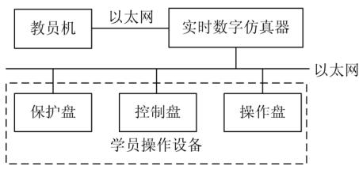
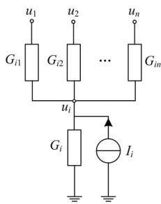
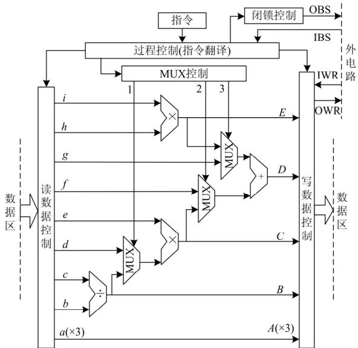
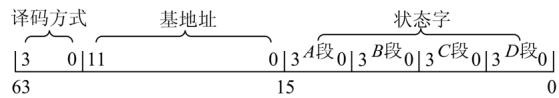
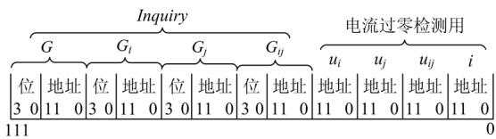
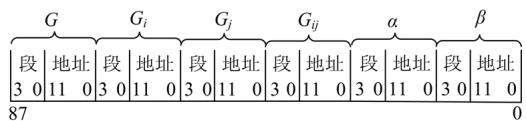
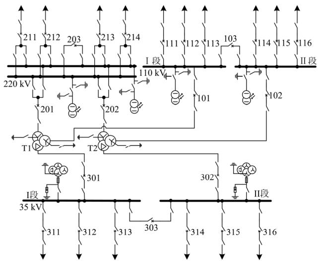
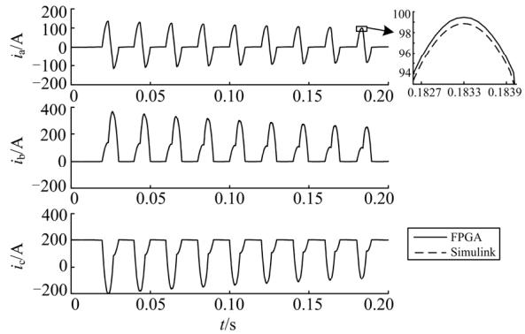
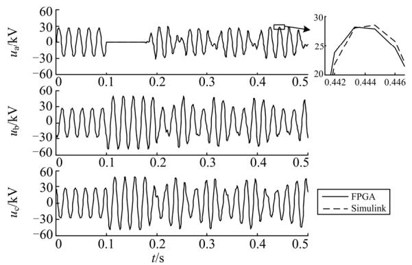

# 基于 FPGA 的变电站实时仿真培训系统

张炳达，王岚禹

(智能电网教育部重点实验室(天津大学)，天津 300072)

摘要：为降低变电站仿真培训系统的建设成本，提高变电站实时数字仿真的质量，提出了一种基于FPGA的变电站实时仿真培训系统。采用最小度最大独立集法安排节点消去和电压计算的顺序，较好地兼顾了运算量和运算并行度。采用多输入多输出的指令流运算器实现细粒度的并行计算，提高了FPGA资源利用率。利用状态字和影响字间接完成仿真参数的修改，减少了仿真计算时间和节约了数据存储空间。实例表明，采用最小度最大独立集法、指令流运算器及仿真参数间接修改方法，一个具有542节点的仿真变电站能以40 μs仿真步长在一块EP4CGX150芯片上正常运行。

关键词：变电站；仿真培训；电磁暂态；实时仿真；现场可编程门阵列

# Real-time simulation training system for substation based on FPGA

ZHANG Bingda, WANG Lanyu

(Key Laboratory for Smart Grid of the Ministry of Education, Tianjin University, Tianjin 300072, China)

Abstract: Real-time simulation training system for substation based on field-programmable gate array (FPGA) is proposed in order to reduce the construction cost of substation simulation training system and enhance the quality of real-time digital simulation. A minimum degree maximum independent set method is adopted to arrange the sequence of nodes elimination and voltage computation, which has a good balance of computation burden and degree of parallelism. Fine granularity parallel computing is realized by adopting a multi-input and multi-output instruction stream arithmetic unit, therefore improving FPGA resource utilization. The simulation parameters are indirectly modified by the status word and effect word, thus reducing the simulation time and saving data memory space. Simulation example shows that a simulation substation with 542 nodes could be processed in an EP4CGX150 chip with 40 μs simulation step, according to the proposed minimum degree maximum independent set method, instruction stream arithmetic unit and indirect modification method for simulation parameters.

This work is supported by National Natural Science Foundation of China (No. 51477114) and Tianjin Science and Technology Program (No. 13TXSYJC40400).

Key words: substation; simulation training; electromagnetic transients; real-time simulation; field-programmable gate array (FPGA)

# 0 引言

对变电站运行人员进行技术培训是一项保证电力安全生产的重要措施。数字-物理混合型变电站仿真系统是一种高性价比的培训工具，已被电力培训部门广泛使用[1-3]。

为能在变电站仿真系统上进行各种各样的倒闸

操作和事故处理训练，变电站实时数字仿真模型应涉及隔离开关、挂地线点、故障设置点等[4-5]。同时，为了与瞬时值电压电流为输入数据的继电保护、自动控制装置等真实设备连接，应采用电磁暂态仿真算法实现变电站实时数字仿真[6-7]。因此，规模不大的变电站实时数字仿真也需要较高级的计算机来承担。

基于微机群的变电站实时数字仿真具备硬件扩展性好，软件开发方便，且性价比高等特点，但受微机的通信速率的约束，难以胜任规模较大或步长

较短的变电站实时数字仿真。变电站实时数字仿真也可采用加拿大RTDS 公司的商业实时仿真装置[8-10]，它的仿真步长小至微秒级，甚至亚微秒级，但其成本高和扩展性差。

现场可编程门阵列(Field-Programmable GateArray, FPGA)具有高度并行性和深度流水线的特点，在电力系统仿真领域已成为一种有效的算法加速器件[11-15]。文献[16-17]将 RLC 无源元件、线路、开关、分布式电源等元件形成不同的 FPGA单元模块，通过单元模块的组合完成电力系统仿真计算。这种方法的优势在于单元模块的功能明确，且可方便增减，但这些模块在大部分时间内处于闲置状态，造成 FPGA硬件资源的浪费。

本文在使用最小度最大独立集法安排节点消去和电压计算顺序的基础上，设计一种多输入多输出的指令流运算器，给出相应的判断数据有效性和读写数据冲突的准则，使 FPGA的硬件资源得到充分利用。为能从开关位置、故障设置、变压器磁饱和状态快速地确定各种仿真参数，提出一种同时节约计算时间和存储空间的仿真参数间接修改方法。在此基础上，实现了基于FPGA的变电站实时数字仿真。

# 变电站仿真培训系统组成

变电站仿真培训系统主要包括教员机、学员操作设备、实时数字仿真器等，如图1所示。

  
图1 变电站仿真培训系统  
Fig. 1 Simulation training system for substation

教员机不仅为教员提供仿真参数调整，故障设置等操作手段，而且能够记录并评判学员的操作过程。

为尽量贴近实际变电站的工作环境，学员操作设备采用真实的数字式保护盘、控制盘以及模拟一次系统现场的操作盘。

基于FPGA的实时数字仿真器是变电站仿真培训系统的核心，负责变电站一次系统的实时数字仿真计算。实时数字仿真器接收来自教员机的变电站一次系统仿真程序和故障设置以及数字式保护盘、控制盘、操作盘上的设备状态，并将一次系统的运行状态反送给数字式保护盘、控制盘、操作盘。

# 2 变电站一次系统仿真过程

为对变电站一次系统进行电磁暂态仿真，对变电站模型中的元件采用梯形法进行差分化处理，形成等效电导和历史电流源并联形式的伴随电路。对于具有磁饱和特性的变压器励磁电感，采用分段线性化的方式描述非线性特性。

用各个伴随电路替代原电路元件，并将节点多个注入电流用一个理想电流源表示，形成新的电路网络。这样，网络中的所有节点，均可表示为如图2的形式，其中 I 是节点i的理想电流源， $G _ { i }$ 是节点i 的对地电导， $G _ { i j }$ 是节点 i 与节点 j 之间的互电导。

  
图2 电路网络节点  
Fig. 2 Circuit network node

消去节点i后，在与节点i相邻的节点j处需分别添加理想电流源 $I _ { j } ^ { ' }$ ，对地电导 $G _ { j } ^ { ' }$ ，以及与节点 k的互电导 $\boldsymbol { G } _ { j k } ^ { ' }$ 。 。

$$
\left\{ \begin{array}{l} I _ {j} ^ {\prime} = - I _ {i} G _ {i j} / \left(G _ {i} + \sum_ {p = 1} ^ {n} G _ {i p}\right) \\ G _ {j} ^ {\prime} = G _ {i} G _ {i j} / \left(G _ {i} + \sum_ {p = 1} ^ {n} G _ {i p}\right) \\ G _ {j k} ^ {\prime} = G _ {i k} G _ {i j} / \left(G _ {i} + \sum_ {p = 1} ^ {n} G _ {i p}\right) k = 1, 2, \dots , n; k \neq j \end{array} \right. \tag {1}
$$

整理化简节点消去后的电路网络，使所有节点再次变为如图2所示的形式。

若图 2 中的 $u _ { 1 } , u _ { 2 } , \cdots , u _ { n }$ 已知，则节点 i 的电压为

$$
u _ {i} = \left(I _ {i} + \sum_ {p = 1} ^ {n} G _ {i p} u _ {p}\right) / \left(G _ {i} + \sum_ {p = 1} ^ {n} G _ {i p}\right) \tag {2}
$$

由以上分析可看出，节点消去和节点电压的计算量随相邻节点个数n(即节点度)的增加而增加。因此，为减少网络节点电压求解的运算量，应优先选择度最小的节点进行消去运算。

消去某一节点的运算过程，仅对与此节点相邻的节点有影响，而与其余节点无关。因此，有必要

寻找出可同时进行节点消去的所有节点，即最大节点独立集，以提高运算并行度。

综合以上两点，采用最小度最大独立集法安排网络节点的消去次序。即选取度最小的节点作为起始消去节点，将与它相邻的节点标记为已访问，再在未被访问的节点中选取度最小的节点作为下一个消去节点，直到留下的节点都是已访问为止。这些消去节点形成一个最大节点独立集。在留下的节点中，采用同样的方法找出下一个最大节点独立集，直到所有节点都被安排为止。

通过最小度最大独立集法得到最简网络，在计算最简网络的节点电压后，按照节点消去相反的次序求出其余的节点电压。

# 3 FPGA 计算平台

# 3.1 指令流运算器

变电站一次系统的仿真计算过程中，各个计算步骤具有强烈的数据依赖性，没有必要为它们设计各自专用的运算电路。

由于某些运算公式的运算量不确定(如节点注入电流)，设计一种能将运算公式中各运算数据一次性给定的深度流水线运算电路是不可取的。针对运算公式 $b / c { \times } e + g$ 和 $d \times e + h \times i$ 在变电站仿真模型中大量使用这一特点，本文设计了一种图3所示的运算器。通过对图 3 中选择器 MUX 的控制，该运算器不仅可以实现 b c/ , d e × , f + g , / b c e g × + ,$d \times e + h \times i$ 等单输出运算，而且还可以完成( /b c,$b / c \times e , b / c \times e + g )$ ， $( d \times e , h \times i )$ 等多输出运算。

  
图 3 指令流运算器  
Fig. 3 Instruction stream arithmetic unit

对 MUX、读数据、写数据的控制，可根据变电站一次系统的仿真计算步骤编入过程控制模块中。这样，每当修改计算步骤时就需重新编写过程控制模块，维护成本太高。为此，把可能对 MUX、读数据、写数据的控制归纳成一条条指令，通过指令流形式描述计算步骤。由于指令格式是自定义的，指令流的编写与 FPGA编程语言无关，用户可方便地对指令流进行修改。为降低指令流的存储空间，采用不超过16个8位2进制数表示各种指令。这样，过程控制模块的主要任务从给出计算步骤演变成指令翻译。

为保证指令流运算器之间快速地交换信息，在指令流运算器上设置了用于指令同步的 16 位字宽的 OBS和 IBS端口，用于数据传递的64位字宽的OWR 和 IWR 端口。

# 3.2 数据存储与代码缓冲

FPGA资源可分为6种，可编程输入/输出单元、基本可编辑逻辑单元、嵌入式块RAM、布线资源、底层嵌入功能单元和内嵌专用硬核。

一般来说，对于经常访问的小块数据或临时数据，用基本可编辑逻辑单元中的寄存器存储为宜；而对于顺序访问或较少访问的大块数据，用嵌入式RAM配置而成的双端口RAM存储为宜。因此，将图 3 中的数据区分为寄存器区和双端口 RAM 区。为充分发挥寄存器的优势，当需要频繁访问某个双端口 RAM 时，事先将该 RAM 中的数据转移到指定寄存器中。为使寄存器区与双端口 RAM 区之间能够快速交换数据，在图3 中设置了3 条数据直通线a-A。同时，让这数据直通线关联到OWR，实现各指令流运算器之间的数据交互。

图 3中的读数据控制、写数据控制和数据区都是 1 级流水线，而乘法器是 5 级流水线，除法器是10 级流水线，加法器是7级流水线。为保证数学运算的正确性，为 9 个读数据口、6 个写数据口和 3个 MUX各自配备1个 FIFO，其长度列于表1。

表 1 FIFO 长度  
Table 1 Length of FIFO   

<table><tr><td>名称</td><td>a(×3)</td><td>b</td><td>c</td><td>d</td><td>e</td><td>f</td><td>g</td><td>h</td><td>i</td></tr><tr><td>长度</td><td>1</td><td>1</td><td>1</td><td>11</td><td>11</td><td>16</td><td>16</td><td>11</td><td>11</td></tr><tr><td>名称</td><td>A(×3)</td><td>B</td><td>C</td><td>D</td><td>E</td><td>IWR</td><td>1</td><td>2</td><td>3</td></tr><tr><td>长度</td><td>2</td><td>12</td><td>17</td><td>24</td><td>17</td><td>2</td><td>11</td><td>16</td><td>16</td></tr></table>

数据缓冲方式要求更早的数据更新，故采用代码缓冲方式。初始化时用“无操作”代码把 FIFO充满，且每个时钟周期都从 FIFO 读出 1 个代码和

向 FIFO 写入 1 个代码。读出的代码用于对读数据口、写数据口和 MUX 的当前控制，写入的代码是从当前指令中翻译出的将要对读数据口、写数据口和 MUX的控制。这种代码缓冲机制使得检查读写冲突的对象不再是单条指令，而是从 9个读数据口FIFO、6 个写数据口 FIFO 中读出的代码。若对同一地址有多个写操作，或对同一 RAM 块超过两个地址读写操作，则判为读写冲突。

在节点电压方程的顺序消去和逆序回代计算块中，或者将一个计算公式拆分成多条指令时，很容易出现前面指令的输出数据进入数据区前被作为后面指令的输入数据的无效数据现象。为防止发生无效数据现象，不容许从读数据口 FIFO 得到的代码出现在上个时钟周期的写数据口 FIFO 之中，同时也不容许与上个时钟周期从写数据口 FIFO 读出的代码相同。

# 4 仿真参数间接修改方法

在变电站一次系统仿真计算中，用两值电阻支路来模拟开关和故障，开关开位和无故障时，电阻取很大的阻值，开关合位和有故障时，电阻取很小的阻值。对于变压器磁饱和特性，用 3个不同的电感值描述。

仿真计算中的节点导纳、伴随电路历史电流源等仿真参数与开关状态、故障设置和变压器磁饱和状态有关。若根据开关状态、故障设置和变压器磁饱和状态直接计算出相应的仿真参数，则需要耗费很长的计算时间。因此，本文提前存入可能的仿真参数的实际值，采用状态字译码的查询方式读取实际值。当开关状态、故障设置和变压器磁饱和状态变化时，通过其影响字修改状态字，间接地改变了仿真参数。

# 4.1 状态字

为采用查询方式得到仿真参数，将仿真参数值分为查询值 Inquiry 和数据值 Data。Inquiry 存放与仿真参数有关的两值电阻、磁化工作段的取值(简称状态字)，Data 存放仿真参数可能的实际值，且同一仿真参数所有实际值连续存放。为使状态字与实际值对应，将仿真参数分成若干类，给每类都赋予一种特别的译码方式。这样，Inquiry 中除状态字外，还包含译码方式和基地址，其位置安排见图4。

  
图 4 查询值结构  
Fig. 4 Structure of inquiry value

仿真参数实际值的寻找过程：按 Inquiry 的译码方式将 Inquiry 中的状态字翻译成偏移量，在 Inquiry的基地址上加偏移量得到 Data的物理地址，最后从该物理地址读取仿真参数的实际值。

以下是 2 种典型的状态字规定及偏移量计算方法。

(1) 对于母线节点，规定自导纳的状态字：A、B 段为母线点所连刀闸或开关的状态，C 段为母线点金属性故障的状态，D 段为母线点非金属性故障的状态。偏移量的计算公式为

$$
P = \left(Y _ {1} + Y _ {2}\right) C _ {\max } D _ {\max } + Y _ {3} D _ {\max } + Y _ {4} \tag {3}
$$

式中： $Y _ { 1 } , Y _ { 2 } , Y _ { 3 } , Y _ { 4 }$ 分别是 A, B, C, D 段中位为 1 的个数； $C _ { \mathrm { m a x } }$ 为可设置的金属性故障总数+1； $D _ { \mathrm { m a x } }$ 为可设置的非金属性故障总数+1。

(2) 对于变压器中性点，规定自导纳的状态字：A, B, C 段为变压器各相的磁饱和状态(用 0、1、2表示)，D段为变压器中性点刀闸状态(用0、1表示)。偏移量的计算公式为

$$
P = \left(2 Y _ {3} + Y _ {2} \left(Y _ {2} + 1\right) + Y _ {1} \left(Y _ {1} + 1\right) \left(2 Y _ {1} + 4\right) / 6\right) + D \tag {4}
$$

式中： $Y _ { 1 } , Y _ { 2 } , Y _ { 3 }$ 分别是 A, B, C段中最大值、中间值、最小值。

因为某些节点的自导纳和互导纳具有相同的取值可能性，所以将其查询值的基地址设为相同。这样，仅需存储一套可能的仿真参数的实际值，减少了对存储空间的占用。

# 4.2 影响字

用影响字描述开关位置、故障设置、变压器磁饱和状态对有关状态字的影响。显然，影响字中有支路电导G以及支路关联节点i、j的自电导和互电导 $G _ { i } , G _ { j } , G _ { i j }$ 。

一般来说，故障消失和拉开开关引起的支路电阻变大在电流过零时才发生，而发生故障和闭合开关引起的电阻变小在任何时刻都可以发生。为避免不必要的支路电流计算，在开关位置、故障设置的影响字中增加节点电压 $u _ { i } , u _ { j }$ 以及支路电压 $u _ { i j }$ 、支路电流 i，其位置安排见图 5。其中，“位”存储对仿真参数查询值的第几位有影响，其取值范围是 0~15。

  
图5 开关位置、故障设置的影响字  
Fig. 5 Effecting word of switch state and fault setting

变压器磁饱和状态还对计算伴随电路等效电流源中的参数α, β有影响，其影响字的位置安排如图 6 所示。其中，“段”存储对仿真参数查询值中A, B, C, D 哪段有影响。

  
图 6 磁化区段的影响字  
Fig. 6 Effecting word of magnetization zone

# 5 仿真实例

Altera 公司的 EP4CGX150 芯片共有约 150K 个逻辑单元、360 个 18×18 内嵌乘法器、6480 Kbit容量的片内 RAM、8 个 3.125-Gbps 收发器。本文在EP4CGX150 芯片上开发了一个针对变电站培训仿真的实时仿真框架。仿真框架包括6 个图3 所示的指令流运算器以及仿真参数修改模块、时钟锁相环、外部通信模块等，占用 EP4CGX150 片上 41%的逻辑资源、56%的乘法器资源、52%的存储资源。经TimeQuest 工具实际验证，仿真框架可在 200 MHz时钟频率下稳定运行。

仿真变电站主接线如图 7 所示，2 台主变压器均为 SFPSZ7-120000/220，220 kV 侧双母线、4 回馈线，110 kV 和 35 kV 侧均为单母分段、6 回馈线。其仿真模型在母线、变压器出口、断路器与隔离开关间、电压互感器出口、高压保险与隔离开关间都可设置相间和对地短路故障，将馈线分成3段，段之间可设置断线故障，每段的首尾也都可设置相间和对地短路故障，节点总数达542个。采用最小度

  
图 7 仿真变电站主接线  
Fig. 7 Main connection of substation

最大独立集法确定节点消去和电压计算顺序，并生成实现电磁暂态仿真的指令流。经估计，该指令流的执行时间为34.5 μs。然后，由于继电保护、自动控制装置投资很大，故在变电站培训仿真系统中将其部分设备软件化。

为验证本文所述基于FPGA的变电站实时仿真的准确性，在 Matlab/Simulink 离线仿真工具中搭建具有相同参数的变电站仿真模型。仿真步长均设为 40 μs。

主变压器 T1 空载合闸时，由于合闸前后铁芯中的磁通不能突变，各相磁通可看作为稳态交流分量和衰减直流分量的叠加，直流分量大小与合闸瞬间的相位有关。磁通与励磁电流具有非线性关系，当磁通超过磁饱和特性曲线阈值时，产生的励磁电流幅值相当大。实验中的合闸时间点选在B 相和 C相的相电压瞬时值近似相等的时刻。图8 给出了主变压器 T1 空载合闸时的电流波形，现象与理论分析一致。

  
图8 空载合闸电流波形  
Fig. 8 Current waveforms of no-load closing

电压互感器 PT 同样具有非线性的励磁特性。在中性点不接地系统正常运行时，每相的 PT 励磁感抗远大于每相对地电容容抗，而在发生单相接地故障后，某两相的电压增加，使 PT 铁芯饱和，励磁感抗减小，容易出现铁磁谐振现象。图9给出了311 馈线 2 km 处 A 相接地消失时 35 kV I 段母线的三相电压(适当增加了线路对地电容)。图 9 中三相电压的波形畸变，且有一定的规律性。查看此时 PT励磁电感可知，励磁电感大部分时间处在饱和状态，故图9是一种铁磁谐振现象。

从图 8 和图 9 的局部放大可以看出，与 Matlab/Simulink 离线仿真结果相比，基于 FPGA 的实时仿真结果误差在 5%以内，可以满足一定的仿真精度要求。

  
图 9 铁磁谐振电压波形  
Fig. 9 Voltage waveforms of ferroresonance

# 6 结论

(1) 指令流运算器不仅方便实现细粒度的并行计算，而且能够通过下载指令流的方式随意改变运算对象。  
(2) 通过状态字和影响字间接修改仿真参数的方法能够同时减少仿真计算时间和存储资源占用。  
(3) 基于 FPGA 平台可实现较大规模和较小步长的变电站实时数字仿真，提高了数字仿真质量，并降低了变电站仿真培训系统的建设成本。

# 参考文献

[1] 韩念杭, 王苏, 张惠刚, 等. 面向维护人员的变电站自动化技术培训系统[J]. 电力系统自动化, 2007, 31(2):88-90, 106.  
HAN Nianhang, WANG Su, ZHANG Huigang, et al. Maintainers oriented substation automation technique training system[J]. Automation of Electric Power Systems, 2007, 31(2): 88-90, 106.   
[2] 张炳达, 袁奎. 一种基于自适应预测控制的电流型数字 功 率 放 大 器 [J]. 电 工 技 术 学 报 , 2015, 30(16):219-226.  
ZHANG Bingda, YUAN Kui. A current digital power amplifier based on self-adaptive predictive control[J]. Transactions of China Electrotechnical Society, 2015, 30(16): 219-226.   
[3] 梁旭, 张萍, 胡明亮, 等. 基于实时仿真技术的变电站数字物理混合仿真与培训系统[J]. 电力系统自动化,2005, 29(10): 79-81, 96.  
LIANG Xu, ZHANG Ping, HU Mingliang, et al. Hybrid simulating and training system of substation based of real-time simulation technology[J]. Automation of Electric Power Systems, 2005, 29(10): 79-81, 96.

[4] 黄文涛, 魏文辉, 吴季浩, 等. 基于变电站数字物理混合仿真技术的多级联合仿真培训系统[J]. 电网技术,2008, 32(23): 95-98, 102.  
HUANG Wentao, WEI Wenhui, WU Jihao, et al. A multilevel joint simulation training system based on digital physical hybrid simulating technology of substation[J]. Power System Technology, 2008, 32(23): 95-98, 102.   
[5] 何志鹏, 郑永康, 李迅波, 等. 智能变电站二次设备仿真培训系统可视化研究[J]. 电力系统保护与控制,2016, 44(6): 111-116.  
HE Zhipeng, ZHENG Yongkang, LI Xunbo, et al. Visualization research on secondary equipments simulation training system for smart substation[J]. Power System Protection and Control, 2016, 44(6): 111-116.   
[6] 刘东, 张炳达. 一种适合并行计算的仿真变电站一次系统模型[J]. 电力系统自动化, 2010, 34(20): 71-76.  
LIU Dong, ZHANG Bingda. A primary system model of simulation substation suitable for parallel computing[J]. Automation of Electric Power Systems, 2010, 34(20): 71-76.   
[7] 赵帅, 贾宏杰, 李建设，等. 一种考虑多重开关动作的变步长电磁暂态仿真算法[J]. 电工技术学报, 2016,31(12): 177-183, 192.  
ZHAO Shuai, JIA Hongjie, LI Jianshe, et al. Variable step integration method on power system transient simulation with multiple switching events[J]. Transactions of China Electrotechnical Society, 2016, 31(12): 177-183, 192.   
[8] 欧开建, 张树卿, 童陆园，等. 基于并行计算机/RTDS的混合实时仿真不对称故障接口交互与实现[J]. 电工技术学报, 2016, 31(2): 178-185.  
OU Kaijian, ZHANG Shuqing, TONG Luyuan, et al. Interface method and implementation for asymmetric fault simulation on parallel computer/RTDS-based hybrid simulator[J]. Transactions of China Electrotechnical Society, 2016, 31(2): 178-185.   
[9] 陈德辉, 王丰, 杨志宏. 智能变电站二次系统通用测试平台方案[J]. 电力系统保护与控制, 2016, 44(1):139-143.  
CHEN Dehui, WANG Feng, YANG Zhihong. Unified test platform for smart substation secondary system[J]. Power System Protection and Control, 2016, 44(1): 139-143.   
[10] 戴光武, 谢华, 徐晓春, 等. 基于区域电网信息的变电站二次直流失电保护系统[J]. 电力系统保护与控制,2016, 44(6): 117-121.

DAI Guangwu, XIE Hua, XU Xiaochun, et al. Protection system of substation’s secondary DC power loss based on regional power grid information[J]. Power System Protection and Control, 2016, 44(6): 117-121.   
[11] CHEN Y, DINAVAHI V. FPGA-based real-time EMTP[J]. IEEE Transactions on Power Delivery, 2009, 24(2): 892-902.   
[12] CHEN Y, DINAVAHI V. Multi-FPGA digital hardware design for detailed large-scale real-time electromagnetic transient simulation of power systems[J]. IET Generation, Transmission & Distribution, 2013, 7(5): 451-463.   
[13] MATAR M, IRAVANI R. FPGA implementation of the power electronic converter model for real-time simulation of electromagnetic transients[J]. IEEE Transactions on Power Delivery, 2010, 25(2): 852-860.   
[14] CHEN Y, DINAVAHI V. Digital hardware emulation of universal machine and universal line models for real-time electromagnetic transient simulation[J]. IEEE Transactions on Industrial Electronics, 2012, 59(22): 1300-1309.   
[15] 王潇, 张炳达, 陈雄. 电力系统实时仿真中细粒度并行实现[J]. 天津大学学报(自然科学与工程技术版),2016, 49(5): 513-519.  
WANG Xiao, ZHANG Bingda, CHEN Xiong. Implementation of fine granularity parallelization in power system real-time simulation[J]. Journal of Tianjin University (Science and Technology), 2016, 49(5): 513-519.

[16] 王成山, 丁承第, 李鹏, 等. 基于 FPGA 的配电网暂态实时仿真研究(一): 功能模块实现[J]. 中国电机工程学报, 2014, 34(1): 161-167.  
WANG Chengshan, DING Chengdi, LI Peng, et al. Realtime transient simulation for distribution systems based on FPGA, part I: module realization[J]. Proceedings of the CSEE, 2014, 34(1): 161-167.   
[17] 王成山, 丁承第, 李鹏, 等. 基于 FPGA 的配电网暂态实时仿真研究(二): 系统架构与算例验证[J]. 中国电机工程学报, 2014, 34(4): 628-634.  
WANG Chengshan, DING Chengdi, LI Peng, et al. Realtime transient simulation for distribution systems based on FPGA, part II: system architecture and algorithm verification[J]. Proceedings of the CSEE, 2014, 34(4): 628-634.

收稿日期：2016-03-29； 修回日期：2016-06-06作者简介：

张炳达(1959-)，男，教授，博士生导师，主要研究方向为电能质量监测与控制、变电站培训仿真、配电网络等；E-mail: bdzhang@tju.edu.cn

王岚禹(1990-)，男，硕士研究生，研究方向为变电站培训仿真。E-mail: lanyu1010@126.com

(编辑 周金梅)