# Modeling Nonuniform Transmission Lines for Time Domain Simulation of Electromagnetic Transients

Abner I. Ramirez, Member, IEEE, Adam Semlyen, Life Fellow, IEEE, and Reza Iravani, Senior Member, IEEE

Abstract—Transmission lines with nonparallel conductors or significant sags and vertical structures, such as towers, can be viewed and modeled as nonuniform lines (NULs). The parameters of NULs are distance dependent. This paper presents a mathematical model for time domain simulation of electromagnetic transients in multiphase NULs taking into account the frequency dependence of the parameters. The model is based on the traveling wave phenomenon and accommodates any NUL geometry. In addition, the model can be interfaced with time domain programs such as the EMTP. The proposed methodology is validated by comparing the results with those obtained from a frequency domain model using the numerical Laplace Transform (LT), the method of characteristics (MC), and also with test results reported by other investigators.

Index Terms—Electromagnetic transients, frequency dependence, nonuniform line.

# I. INTRODUCTION

IMULATION of electromagnetic transients in a transmission line is usually performed assuming that the conductors are parallel to ground, and thus, the parameters are uniform. There are however cases of nonuniform lines (NULs), where the line parameters have strong longitudinal variation. Examples are lines crossing rivers or entering substations and even towers may be considered in this category.

There have been several approaches for handling NULs. One is based on traveling waves and Bewley’s Lattice Diagram for single-phase lossless lines [1]. There also exist models for single-phase transmission lines for which parameters are assumed to vary exponentially; a frequency domain method is described in [2], and a time domain method in [3]. A model for towers is described in [4] for which the parameters are obtained from measurements.

Alternative models based on finite difference methods are used to solve the partial differential equations of the propagation phenomenon disregarding the frequency dependence of the parameters [5], [6].

In [7], a single-phase model is proposed in the frequency domain. In this model, a transmission line is represented as a two-port network and its transfer matrix is obtained from the multiplication of the chain matrices of the line’s subsegments. There exists also a multiphase frequency dependent model in

Manuscript received June 6, 2001; revised July 5, 2002. This work was supported in part by the Science and Technology Council of Mexico (CONACYT) Project No. 34698-A and in part by the University of Toronto. The authors are with the Department of Electrical and Computer Engineering, University of Toronto, Toronto, ON M5S 3G4 Canada (e-mail: abner@power.ele.utoronto.ca; adam.semlyen@utoronto.ca; iravani@ecf.utoronto.ca). Digital Object Identifier 10.1109/TPWRD.2003.813877

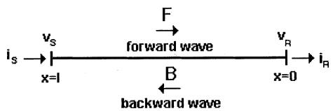  
Fig. 1. Notation and reference directions.

which the NUL is subdivided and each subdivision is represented by a lossless uniform line [8]. References [9] and [10] also address the topic of modeling a NUL, assuming however constant line parameters.

Most of the methods mentioned before deal with a lossless single-phase line and a particular variation of the line parameters is considered. In this paper, a more general methodology for the time domain simulation of electromagnetic transients in NULs is presented. The proposed new approach overcomes the above mentioned limitations of existing methods. The methodology can be applied to multiphase lines where the frequency dependence of the parameters is taken into account. The proposed model has a continuous representation of the NUL and can be applied for any geometrical configuration, such as towers. In addition, the model can be interfaced with existing programs, for instance the EMTP.

# II. TERMINAL RELATIONS IN FREQUENCY DOMAIN FOR NUL

In the frequency domain, expression (1) represents the relation between voltages and currents at the two ends of the single-phase or the multiphase line of Fig. 1 [5], [11]

$$
\begin{array}{l} \left[ \begin{array}{l} v _ {S} \\ i _ {S} \end{array} \right] = \left[ \begin{array}{l l} A & B \\ C & D \end{array} \right] \left[ \begin{array}{l} v _ {R} \\ i _ {R} \end{array} \right] \\ = \left[ \begin{array}{l l} W _ {F v} & W _ {B v} \\ W _ {F i} & W _ {B i} \end{array} \right] \left[ \begin{array}{l l} \Lambda_ {F} & \\ & \Lambda_ {B} \end{array} \right] \\ \times \left[ \begin{array}{c c} W _ {F v} & W _ {B v} \\ W _ {F i} & W _ {B i} \end{array} \right] ^ {- 1} \left[ \begin{array}{c} v _ {R} \\ i _ {R} \end{array} \right] \tag {1} \\ \end{array}
$$

where the matrix is numerically calculated by solving

$$
\begin{array}{l} \frac {d}{d x} \left[ \begin{array}{c c} A (x) & B (x) \\ C (x) & D (x) \end{array} \right] = \left[ \begin{array}{c c} 0 & Z (x) \\ Y (x) & 0 \end{array} \right] \left[ \begin{array}{c c} A (x) & B (x) \\ C (x) & D (x) \end{array} \right] \\ \left[ \begin{array}{l l} A (0) & B (0) \\ C (0) & D (0) \end{array} \right] = I _ {2 n \times 2 n}. \tag {2} \\ \end{array}
$$

In (2), is the identity matrix, is the number of phases, and and are the impedance and the admittance matrices of the line calculated analytically or obtained from measurement. If and are calculated analytically, the matrix is obtained by chain multiplication of matrices for line segments. In the

present work, the concept of complex depth is used to calculate parameters of lines and towers [12], [13].

Equation (1) contains the modal (eigenvalue/eigenvector) decomposition of the matrix. This gives the following relation between the forward and the backward waves and the propagation functions $\Lambda _ { F } , \Lambda _ { B }$ in the forward and the backward directions

$$
\left[ \begin{array}{l} u _ {F, S} \\ u _ {B, S} \end{array} \right] = \left[ \begin{array}{c c} \Lambda_ {F} & \\ & \Lambda_ {B} \end{array} \right] \left[ \begin{array}{l} u _ {F, R} \\ u _ {B, R} \end{array} \right]. \tag {3}
$$

Equation (3) relates variables of the traveling wave formulation. The transformation to phase domain quantities, valid for both ends of the line, is given by

$$
\left[ \begin{array}{c} v \\ i \end{array} \right] = \left[ \begin{array}{c c} W _ {F v} & W _ {B v} \\ W _ {F i} & W _ {B i} \end{array} \right] \left[ \begin{array}{c} u _ {F} \\ u _ {B} \end{array} \right]. \tag {4}
$$

The relation between the forward and the backward propagation functions is

$$
\Lambda_ {B} = \Lambda_ {F} ^ {- 1}. \tag {5}
$$

The following inverse transformation matrix for (4) is defined

$$
\left[ \begin{array}{l l} W _ {F v} ^ {\prime} & W _ {F i} ^ {\prime} \\ W _ {B v} ^ {\prime} & W _ {B i} ^ {\prime} \end{array} \right] = \left[ \begin{array}{l l} W _ {F v} & W _ {B v} \\ W _ {F i} & W _ {B i} \end{array} \right] ^ {- 1}. \tag {6}
$$

Definitions for the characteristic admittances in the forward and the backward directions for (4) are

$$
Y _ {C, F} = W _ {F i} W _ {F v} ^ {- 1} \tag {7a}
$$

$$
Y _ {C, B} = W _ {B i} W _ {B v} ^ {- 1}. \tag {7b}
$$

Particular examples of propagation functions are presented in Appendix A.

# III. TIME DOMAIN MODEL FOR NUL

The following provides the derivation of the time domain model in the forward direction (see Fig. 1). An analogous procedure can also be applied for the backward direction.

Eliminating from (4) and using (7b) yield

$$
Y _ {C, B} v _ {R} - i _ {R} = \left(W _ {B i} W _ {B v} ^ {- 1} W _ {F v} - W _ {F i}\right) u _ {F, R}. \tag {8}
$$

Substituting (3) into (8) gives

$$
Y _ {C, B} v _ {R} - i _ {R} = T _ {F} \Lambda_ {B} u _ {F, S} \tag {9}
$$

where

$$
T _ {F} = W _ {B i} W _ {B v} ^ {- 1} W _ {F v} - W _ {F i} \tag {10}
$$

and, from (4) and (6)

$$
u _ {F, S} = W _ {F v} ^ {\prime} v _ {S} + W _ {F i} ^ {\prime} i _ {S}. \tag {11}
$$

We have thus obtained by (9) the “Norton-type” relation between the receiving end voltages and currents needed in the calculation of transients.

We approximate the parameters $Y _ { C , B } , T _ { F } , \Lambda _ { B } , W _ { F v } ^ { \prime } ,$ and $W _ { F i } ^ { \prime } ,$ , by rational functions and use state-space realizations to solve (9) and (11) in the time domain [14]. For this solution, the corresponding expression for the terminal conditions of the

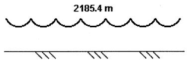  
Fig. 2. Symmetrical, flat, three-phase NUL.

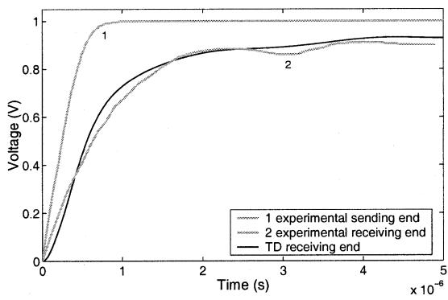  
Fig. 3. Time domain simulation and experimental results for the line of Fig. 2.

line (node in Fig. 1) must be taken into account together with numerical solution of the state-space approximations. As mentioned earlier, similar equations are derived for the backward direction and used for the sending end.

# IV. APPLICATIONS

In this section, three applications of the model described before are presented. Also, comparisons with the results obtained from other methods are shown.

# A. Symmetrical Three-Phase Line

Fig. 2 shows the configuration of a flat three-phase NUL consisting of seven equal segments. Each segment has a length of 312.2 m, maximum height of 26.2 m at the tower, and minimum height of 15.24 m at midspan. Each phase consists of one conductor with radius of $r = 2 . 5 4$ cm. The ground resistivity is assumed to be 100 -m. The configuration of the line in Fig. 2 is similar to the one used in [15] for measurements of voltage and current propagating along the line.

Three identical voltage waveforms reported in [15] are simultaneously injected in all phases at the sending end when the receiving end is open. The sending end voltage and the corresponding receiving end voltage are shown in Fig. 3, which illustrates both the experimental [15] and the simulation results. The simulation result is obtained based on the proposed time domain (TD) model. For this application, the receiving end voltage is plotted as half of its actual magnitude, as is done in [15], to remove the doubling due to the open circuit. In addition to the comparison with the experimental results, the TD model is also validated by comparing the result with those obtained from a frequency domain methodology using the numerical Laplace Transform (LT) [16], Fig. 4. In the comparison with LT, a voltage wave $v ( t ) = K ( e ^ { - t / t _ { o } } - e ^ { - t / t _ { 1 } } )$ is applied using the same terminal conditions as in the preceding case, with $K = - 1 . 0 0 1 7 \ : \mathrm { V } , t _ { o } = 0 . 2 0 5 \ : \mu \mathrm { s }$ and $t _ { 1 } = 1 1 8 2 \mu \mathrm { s } . \mathrm { F i g s } . 3$ and 4 demonstrate that the results obtained from the TD model closely agree with the measurement results and are almost

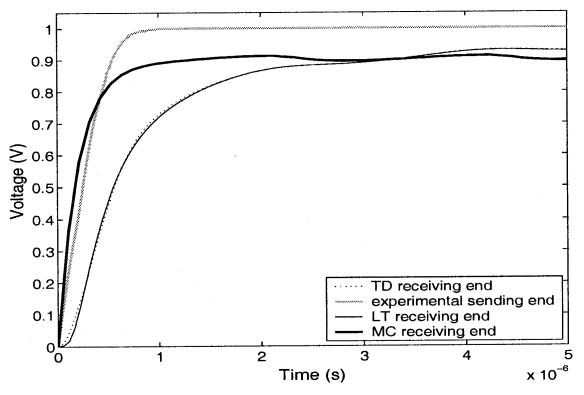  
Fig. 4. Comparison between TD, LT, MC simulations for the line of Fig. 2.

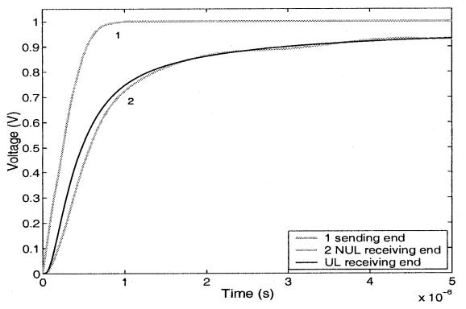  
Fig. 5. Comparison between the NUL and the equivalent UL results for the line of Fig. 2.

identical to those obtained from the LT approach. The reason for the fluctuation in the voltage waveform is discussed in Section V.

In Fig. 4, the results obtained with the proposed TD approach and the LT method are compared with those obtained using the method of characteristics (MC) with constant parameters [6]. Fig. 4 shows that there exists a significant difference between the traces obtained with full representation of frequency dependence (i.e., LT and TD), and the one with constant parameters using MC. Clearly, the representation of the frequency dependence of the line parameters is important in the case of not very short NULs.

An additional comparison for this application is made between results obtained with the proposed TD method for NUL and those obtained by an existing traditional method for a fully frequency dependent uniform line (UL) with an average height of 18.9 m. The comparison between this “equivalent” UL and the corresponding NUL is shown in Fig. 5. It is noted in Fig. 5 that results from the UL do not present any wobbles for the NUL, seen also in Figs. 3 and 4.

# B. Vertical Structure

The vertical structure, Fig. 6, examined in this example is the one introduced in [1]. The structure is used to represent a tower. It has a circular cross-section with radius of 0.7 m. In our study, we use the equations given in [13] to calculate the characteristic impedance. The selected radius results in a value for the characteristic impedance at the top of the tower equal to

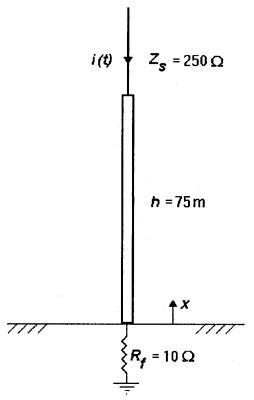  
Fig. 6. Vertical structure.

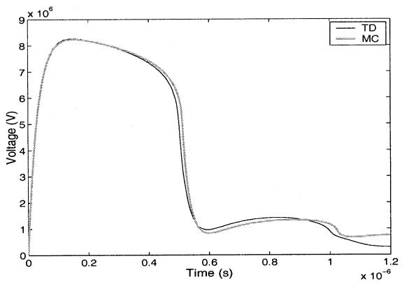  
Fig. 7. Voltage at the top of vertical structure.

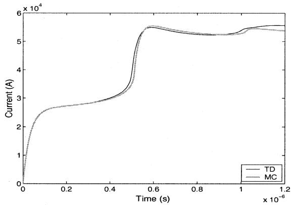  
Fig. 8. Current at the top of vertical structure.

that obtained from $Z _ { c } = 5 0 + 3 5 \sqrt { x }$ used in [1], [2], [5]. The ground resistivity is assumed to be 30 -m.

The lightning stroke in Fig. 6 is modeled as a double-exponential Norton current source given by $i ( t ) = K ( e ^ { - t / t _ { o } } -$ $\bar { e } ^ { - t / t _ { 1 } } )$ with $K = 6 2 \mathrm { k A } , t _ { o } = 1 7 . 6 3 \mu \mathrm { s }$ , and $t _ { 1 } = 0 . 0 3 1 6 \mu s$ [2], [5]. A more advanced model of the lightning stroke is given in [17]. The voltage and the current at the top of the structure are shown in Figs. 7 and 8, respectively. The voltage at the bottom is shown in Fig. 9. The results from Figs. 7–9 agree with those reported in [2]. In contrast to the longer NUL of Fig. 4, the results obtained with TD and MC are very close. This is due to the fact that frequency dependence in the case of short lines does not have a significant effect.

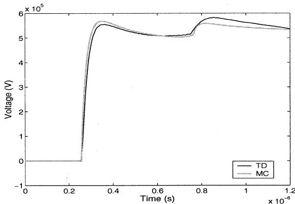

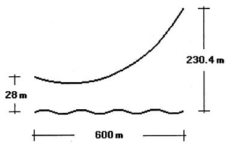  
Fig. 9. Voltage at the bottom of vertical structure.   
Fig. 10. Profile of river crossing.

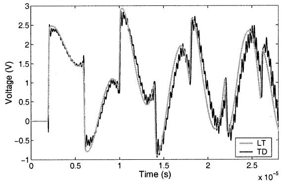  
Fig. 11. Voltage at the receiving end phases 1 and 3 for the line of Fig. 10.

# C. River Crossing

Another example of a strongly nonuniform line is a river crossing (e.g., the configuration presented in Fig. 10). The threephase line is formed by parallel conductors with 2.54-cm radius and 10-m horizontal separation; the resistivity of the water is assumed to be 10 -m.

The sending end is at the elevation of 28 m. A unit step voltage is applied to the conductors at the sending end when the receiving end is open. The voltage waveform resulting from the simulation based on the TD method is presented in Fig. 11. Fig. 11 also shows the results obtained based on the LT method. Fig. 11 shows that the TD method presents oscillations in the waveform resulting from the simulation. The frequency of these oscillations is closely related with the maximum frequency used to calculate the line parameters. Further explanation regarding the oscillations is given in Section V.

Fig. 12 shows the comparison between TD results and those obtained by considering two fully frequency dependent equivalent ULs with heights of 77.7 and 27.7 m. The first value was

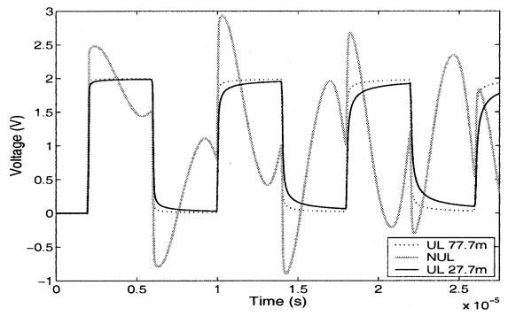  
Fig. 12. Comparison between TD and UL results for the line of Fig. 10.

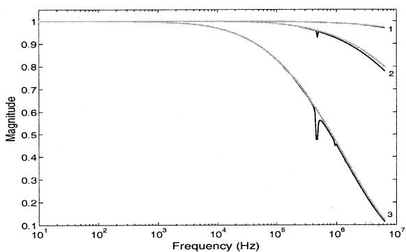  
Fig. 13. Modal backward propagation functions (modes 1, 2, and 3) for the three-phase symmetrical line of Fig. 2 NUL UL.

obtained using the average height of the conductor. The second value corresponds to the height giving the smallest error when comparing the magnitude of the propagation functions for both UL and NUL. The results from Fig. 12 show a remarkable difference in the transient when nonuniformities are considered.

# V. DISCUSSION OF RESULTS

As described in Appendix A and illustrated in Fig. 13, the parameters of the line of Fig. 2 present spikes, regularly spaced in the frequency domain. The first spike appears at the fundamental frequency $f _ { o } = c / 2 l$ related to the length of the line , and the light velocity . Additional spikes appear at frequencies harmonically related to $f _ { o }$ .

These spikes translate into superimposed small fluctuations in time domain as can be seen in the results presented in Figs. 3 and 4 for the symmetrical line of Fig. 2. In this application, $f _ { o } \cong 4 8 0 . 4 6  { ~ \mathrm { k H z } } ,$ corresponding to the frequency of fluctuations shown in Figs. 3 and 4. Fig. 13 shows that only the first spike is of considerable magnitude.

Fig. 14 shows the propagation function for the river crossing line of Fig. 10. Increasing nonuniformity by asymmetry results in larger magnitudes of the spikes (as compared to those of Fig. 13) as shown in Fig. 14. An analogous remark is that a smaller ground resistivity increases the magnitudes of the spikes (see Fig. 14).

To compute transients in time domain, the range of frequencies must be finite. Frequency truncation can introduce spurious oscillations or even instability in the time domain simulations when the spikes, in frequencies higher than $f _ { \mathrm { m a x } } .$ , are

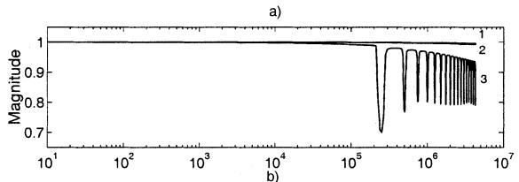

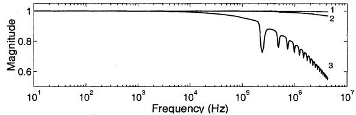  
Fig. 14. Modal backward propagation functions (modes 1, 2, and 3) for the three-phase river crossing. (a) $\rho _ { g } = 1 0 $ -m. (b) $\begin{array} { r } { \rho _ { g } = 1 0 0 0 \Omega . } \end{array}$ -m.

of considerable magnitude. This phenomenon represents Gibbs oscillations that can be diminished in a frequency domain program (e.g., numerical Laplace Transform), by using windows to smooth the effect of truncation. In this paper, the trapezoidal rule (TR) is initially used to discretize the state-space realizations mentioned before. However, depending on the nonuniformity and ground resistivity, the backward Euler method (BE) is used to act as a filter in time domain simulations instead of TR to eliminate the spurious oscillations like those shown in Fig. 11. Using BE effectively damps out the natural oscillations due to the frequency truncation as described in Appendix B.

# VI. CONCLUSIONS

This paper introduces and develops a time domain methodology to compute electromagnetic transients in single-phase and multiphase nonuniform lines. The term “nonuniform line” encompasses line geometries where the line parameters have longitudinal variations (e.g., lines crossing rivers, lines entering substations, and vertical tower structures). The proposed formulation is based on the concept of travelling waves and takes into account the frequency dependence of the line parameters. The model is used to compute electromagnetic transients for three different nonuniform geometries and its accuracy is demonstrated by comparing the results with those obtained from the method of characteristics, Laplace Transform, and measurement results reported by other investigators. In addition, the results obtained with the proposed method are compared with those obtained from an “equivalent” uniform line showing that nonuniformities can be important for propagation of transient waves. A salient feature of the methodology is that it can be readily included in time domain simulation packages (e.g., the EMTP).

# APPENDIX A

# A. Propagation Functions in Frequency Domain

The backward propagation functions for the symmetrical line (Fig. 2), the river crossing (Fig. 10), and the vertical structure (Fig. 6) applications presented in this paper are shown in Figs. 13–16. Fig. 13 corresponds to the symmetrical line and its equivalent UL of 18.9-m height. Figs. 14 and 15 correspond

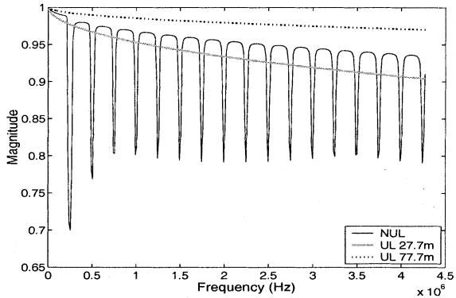  
Fig. 15. Modal backward propagation function (mode 3) for the three-phase river crossing $\rho _ { g } = 1 0 ~ \Omega \mathrm { - m }$ .

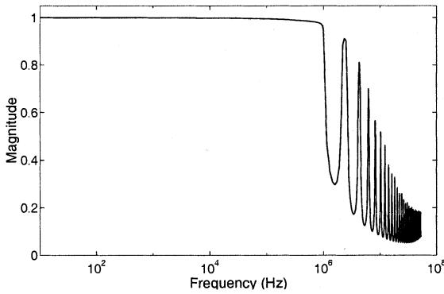  
Fig. 16. Backward propagation function for the single-phase vertical structure.

to the river crossing. Fig. 14 shows the impact of ground resistivity on the propagation function. Fig. 15 corresponds to the river crossing with $\rho _ { g } = 1 0 \Omega \cdot$ -m and its two equivalent ULs, of 77.7-m and 27.7-m heights. In Fig. 15, a linear horizontal scale was used and only mode 3 is shown. Fig. 16 corresponds to the vertical structure.

# APPENDIX B

# A. Damping Effect of Backward Euler Integration

The damping effect of the Backward Euler (BE) method is described in [18]. Here a simple example is shown for illustration. Consider the homogeneous ODE with the natural frequency

$$
\dot {x} = j \omega x \tag {12}
$$

and its analytical solution (with initial value )

$$
x = e ^ {j \omega t}. \tag {13}
$$

The solution given by (13) represents a circle in the complex plane and corresponds to an undamped solution in the time domain. Applying BE to (12) results in the following expression:

$$
x - x ^ {\mathrm {o l d}} = j \omega h x \tag {14}
$$

where is the time step. The following continuous solution is assumed for the recursion (14):

$$
x = e ^ {s t}. \tag {15}
$$

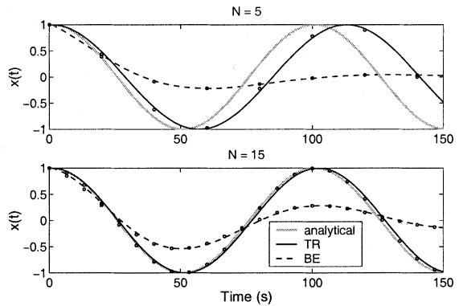  
Fig. 17. Example for damping, time domain.

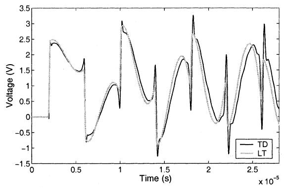  
Fig. 18. Voltage at the receiving end phases 1 and 3 for the line of Fig. 10 using BE.

Substituting (15) in (14), such that $x ^ { \mathrm { o l d } } = e ^ { s ( t - h ) }$ , the parameter is obtained as

$$
s = - \frac {1}{h} \log (1 - j \omega h). \tag {16}
$$

Similarly, using trapezoidal integration method (TR) to solve (12), the parameter becomes

$$
s = - \frac {1}{h} \log \left(\frac {1 - \frac {j \omega h}{2}}{1 + \frac {j \omega h}{2}}\right). \tag {17}
$$

The analytical solution in the time domain is compared with those obtained from BE and TR in Fig. 17 taking 1.5 periods and using and steps per period. In Fig. 17, the discrete solution of (13) is presented by points corresponding to steps and the continuos solution joining these discrete points is added for clarity.

Fig. 17 shows that the damping introduced by BE is significant even when a larger number of time steps is used. TR has no damping effect in terms of the magnitude of oscillations and the discretization error is visible only in the frequency of the oscillations.

Using the above feature, the simulation for the river crossing is repeated by using BE and the results are shown in Fig. 18 in

which the spurious oscillations (Fig. 11) are not present in the TD results.

# REFERENCES

[1] C. Menemenlis and Z. T. Chun, “Wave propagation on nonuniform lines,” IEEE Trans. Power Apparat. Syst., vol. PAS-101, pp. 833–839, Apr. 1982.   
[2] E. A. Oufi, A. S. Alfuhaid, and M. M. Saied, “Transient analysis of lossless single-phase nonuniform transmission lines,” IEEE Trans. Power Delivery, vol. 9, pp. 1694–1700, July 1994.   
[3] H. V. Nguyen, H. W. Dommel, and J. R. Marti, “Modeling of singlephase nonuniform transmission lines in electromagnetic transient simulations,” IEEE Trans. Power Delivery, vol. 12, pp. 916–921, Apr. 1997.   
[4] M. Ishii, T. Kawamura, T. Kouno, E. Ohsaki, K. Murotani, and T. Higuchi, “Multistory transmission tower model for lightning surge analysis,” IEEE Trans. Power Delivery, vol. 6, pp. 1327–1335, July 1991.   
[5] M. T. C. de Barros and M. E. Almeida, “Computation of electromagnetic transients on nonuniform transmission lines,” IEEE Trans. Power Delivery, vol. 11, pp. 1082–1091, Apr. 1996.   
[6] J. A. Gutierrez, J. L. Naredo, L. Guardado, and P. Moreno, “Transient analysis of nonuniform transmission lines through the method of characteristics,” in Proc. 11th Int. Symp. High Voltage Eng., vol. 2, London, U.K, Aug. 23–27, 1999.   
[7] M. S. Mamis and M. Koksal, “Lightning surge analysis using nonuniform, single-phase line model,” Proc. Inst. Elect. Eng.-Gen. Transm. Dist., vol. 148, no. 1, pp. 85–90, Jan. 2001.   
[8] A. Ametani and M. Aoki, “Line parameters and transients of a nonparallel conductor system,” IEEE Trans. Power Delivery, vol. 4, pp. 1117–1125, Apr. 1989.   
[9] W. Bandurski, “Simulation of single and coupled transmission lines using time-domain scattering parameters,” IEEE Trans. Circuits Syst I, vol. 47, pp. 1224–1234, Aug. 2000.   
[10] J.-F. Mao and O. Wing, “Time-Domain transmission matrix of lossy transmission lines,” IEEE Microwave Guided Wave Lett., vol. 8, pp. 90–92, Feb. 1998.   
[11] A. Semlyen, “Some frequency domain aspects of wave propagation on nonuniform lines,” IEEE Trans. Power Delivery, to be published.   
[12] A. Deri, G. Tevan, A. Semlyen, and A. Castanheira, “The complex ground return plane: A simplified model for homogeneous and multi-layer earth return,” IEEE Trans. Power Apparat. Syst., vol. PAS-100, pp. 3686–3693, Aug. 1981.   
[13] J. A. Gutierrez, P. Moreno, J. L. Naredo, and L. Guardado, “Nonuniform line tower model for transient studies,” in Proc. Int. Power Syst. Transients Conf., vol. II, Rio de Janeiro, Brazil, June 2001, pp. 535–540.   
[14] B. Gustavsen and A. Semlyen, “Simulation of transmission line transients using vector fitting and modal decomposition,” IEEE Trans. Power Delivery, vol. 13, pp. 605–614, Apr. 1998.   
[15] C. F. Wagner, I. W. Gross, and B. L. Lloyd, “High-voltage impulse test on transmission lines,” Amer. Inst. Elect. Eng. Trans., pt. III-A, vol. 73, pp. 196–210, Apr. 1954.   
[16] L. M. Wedepohl, “Power system transients: Errors incurred in the numerical inversion of the laplace transform,” in Proc. 26th Midwest Symp. Circuits Syst., Aug. 1983, pp. 174–178.   
[17] V. Shostak, W. Janischewskyj, and A. M. Hussein, “Expanding the modified transmission line model to account for reflections within the continuously growing lightning return stroke channel,” IEEE Power Eng. Soc. Summer Meeting, vol. 4, pp. 2589–2602, 2000.   
[18] J. R. Marti and J. Lin, “Suppression of numerical oscillations in the EMTP,” IEEE Trans. Power Syst., vol. 4, pp. 739–747, May 1989.

Abner I. Ramirez (M’96) received the B.Sc. degree from Universidad de Guanajuato, Mexico, in 1996, the M.Sc. degree from Universidad de Guadalajara, Mexico, in 1998, and the Ph.D. degree from CINVESTAV-Unidad Guadalajara, Mexico, in 2001.

Currently, he is a Postdoctoral Fellow in the Department of Electrical and Computer Engineering at the University of Toronto, ON, Canada. His interests are electromagnetic transient analysis in power systems and numerical analysis of electromagnetic fields.

Adam Semlyen (LF’97) was born in 1923 in Rumania. He received the Dipl. Ing. degree from the Polytechnic Institute of Timisoara, Rumania, and the Ph.D. degree in Iasi, Rumania.   
Currently, he is a Professor in the Department of Electrical and Computer Engineering, emeritus since 1988, at the University of Toronto, ON, Canada, where he has been since 1969. He began his career with the electric power utility and held academic positions at the Polytechnic Institute of Timisoara. His research interests include steady state and dynamic analysis as well as computation of electromagnetic transients in power systems.

Reza Iravani (SM’00) received the B.Sc. degree in electrical engineering from Tehran Polytechnique University, Iran, in 1976. He received the M.Sc. and Ph.D. degrees in electrical engineering from the University of Manitoba, Winnipeg, Canada, in 1981 and 1985, respectively.   
Currently, he is a Professor at the University of Toronto, ON, Canada. He began his career as a Consulting Engineer with Tehran Polytechnique University. His research interests include power electronics and power system dynamics and control.