# Faster-Than-Real-Time Hardware Emulation of Extensive Contingencies for Dynamic Security Analysis of Large-Scale Integrated AC/DC Grid

Shiqi Cao , Graduate Student Member, IEEE, Ning Lin , Member, IEEE, and Venkata Dinavahi , Fellow, IEEE

Abstract—The rapid expansion of modern power systems has brought a tremendous computational challenge to dynamic security analysis (DSA) tools which consequently need to process extensive contingencies. In this work, hardware emulation is investigated to accelerate the DSA solution of a large-scale AC/DC system deployed on the field-programmable gate arrays (FPGAs) faster-than-realtime (FTRT) execution. Electromagnetic transient (EMT) modeling of the DC grid is conducted since the fast converter dynamics require a small time-step for accuracy; in contrast, the transient stability (TS) simulation is applicable to the AC grid which tolerates a much larger step size. To coordinate the 2 different types of simulation, an interface based on dynamic voltage injection is proposed to integrate the AC and DC grids, in addition to maintaining a low hardware latency. An emulation platform consisting of multiple FPGA boards is established so that with a proper allocation it has a sufficient capacity to accommodate the system under study which has 6 ACTIVSg 500-bus systems interconnected by a 6-terminal DC grid. The efficacy of the proposed FTRT hardware emulation platform is demonstrated by 2 case studies with more than 5500 contingencies analyzed in total, where an FTRT ratio of more than 208 is achieved for the hybrid AC/DC grid, while it is over 277 times for a single 500-bus system. Furthermore, the FTRT dynamic emulation results, including the security indices, are validated by the simulation tool DSATools/TSAT.

Index Terms—AC/DC grid, dynamic security analysis, faster than real time, field-programmable gate arrays (FPGAs), parallel processing, power system security, power system stability, real-time systems, synchronous generator.

# I. INTRODUCTION

D YNAMIC security analysis (DSA) is necessary in assess-ing the ability of a power system to withstand cascading failures or contingencies in a specified time span to ensure that the power grid is at a secure operating point. In the last few decades, power transmission networks have been expanding significantly including the integration of high voltage direct current

Manuscript received 14 October 2021; revised 17 January 2022; accepted 19 March 2022. Date of publication 28 March 2022; date of current version 22 December 2022. This work was supported by the Natural Sciences and Engineering Research Council of Canada (NSERC). Paper no. TPWRS-01607-2021. (Corresponding author: Shiqi Cao.)

The authors are with the Department of Electrical and Computer Engineering, University of Alberta, Edmonton, AB T6G 2V4, Canada (e-mail: sc5@ualberta.ca; ning3@ualberta.ca; dinavahi@ualberta.ca).

Color versions of one or more figures in this article are available at https://doi.org/10.1109/TPWRS.2022.3161561.

Digital Object Identifier 10.1109/TPWRS.2022.3161561

(HVDC) systems, making the modeling, simulation, protection, and control of the network significantly more complex. The increasing scale of a power system also demands that more contingency scenarios be taken into consideration during DSA. To mitigate the adverse impacts of a variety of disturbances on the actual power system, online DSA is widely utilized to continuously monitor the grid and take remedial actions [1], [2].

The contingency screening type is a major factor that influences the speed of DSA. A typical contingency analysis applies the power flow calculation or state estimation, which only provides a single-state security index for contingency ranking [2], [3]. Due to the relatively low computational burden, the power-flow based contingency analysis methods are widely utilized in high-speed DSA [4]-[6]. However, more stringent criteria have been proposed by the North American Electric Reliability Corporation (NERC) [7], which brings many challenges for conducting fast contingency analysis. Since it is computational onerous to evaluate all the contingencies at a time, a subset is usually selected for analysis in traditional contingency screening methods such as the performance index contingency ranking [8]. However, when a larger subset is required for the contingency analysis of a large-scale grid, it is difficult to achieve real-time execution. Meanwhile, the power-flow based contingency ranking methods fall short of provision of subsequent dynamic process after a disturbance, and are hence excluded for predictive control in an energy control center. Therefore, the transient stability (TS) simulation is adopted for DSA purpose. It enables the representation of the dynamic characteristics of all power system components in time-domain, which is a direct and precise method attributing to the utilization of detailed dynamic models [9]-[11].

The processing hardware is another aspect that limits the performance of DSA tools, which nowadays are usually supported by high-performance CPUs or multiprocessors for efficient simulation or even real-time execution [12]-[14]. Although presently CPU-based commercial DSA simulators are prevalent in stability analysis, the massive scale of the target power system, as well as the huge number of contingencies to be analyzed, always poses a significant challenge to the simulation efficiency. The utilization of the multiprocessors or supercomputers is a straightforward solution for real-time DSA due to the sufficient hardware resources and high processing frequency [15]. However, as many as 24,000 CPU cores may

be needed to realize a near real-time simulation of a real power grid containing 3,000 generators [14], which is inconvenient and expensive for commercial use. Although parallel algorithms are utilized for accelerating transient stability simulation [16]-[21], the execution time will still increase along with the dimension of the admittance matrix [22], [23].

In this work, a multi-FPGA-based DSA platform is proposed to provide fast and accurate contingency screening data for a large-scale AC/DC grid by faster-than-real-time (FTRT) emulation. Compared with currently available commercial real-time (RT) simulation tools, the FPGA-based platform has the following advantages. The most straightforward difference between an FTRT emulation platform and RT simulators is the computation speed. RT simulation implies that the hardware must solve the model equations within an interval of the time-step. On the other hand, FTRT is stricter in terms of hardware latency, and the platform runs at least several times faster than a RT simulator. FTRT emulation can meet all the requirements of RT simulation, while the RT simulation tools are unable to reach FTRT due to their scalability and computational speed limits. Secondly, the capability and scalability of the FPGA-based FTRT emulation platform are better than RT simulators. For example, the 141-bus system with 38 generators is simulated using the RTDS simulator, and 4 PB5 racks were needed [24]. In order to reduce the hardware resources and reduce the cost, only 5 buses and 2 generators were simulated on RTDS , while the rest of the system parts were simulated on FPGA boards. As shown later in this paper, two 500-bus systems with 180 generators in total can be executed on a single Xilinx VCU128 board, which demonstrates the FPGA’s capability in emulating a large power system. The reconfigurability and the sufficient hardware resources allow the entire grid to be deployed on the platform after proper system partitioning and allocation. Meanwhile, a specific AC/DC grid interface using dynamic voltage injection is proposed to maintain a constant admittance matrix despite the HVDC converter outputs being time-varying, which consequently reduces hardware resources utilization and expedite the emulation. As a result, the FTRT DSA emulation is more than 208 times faster than real-time.

Since the FTRT emulation enables a high computation speed above real-time, the grid can be emulated much faster and therefore it can accelerate planning schedules, predict the upcoming disturbances, and help in devising new control strategies. The proposed FTRT emulation can also be used in the energy control center to provide sufficient time to take remedial actions, recommend an optimal control strategy to mitigate adverse impacts, and enhance the overall stability and security of the system.

The rest of the paper is organized as follows: Section II introduces transient stability simulation, including modeling and solution of the AC grid. The DC grid modeling and its interfacing technique are specified in Section III. Section IV illustrates the hardware design on the proposed multiple FPGA based platform. The emulation results of more than 5500 contingencies, as well as their analysis and validation, are provided in Section V. Section VI presents the conclusion and prospective work.

# II. AC GRID MODEL FOR DYNAMIC SECURITY ANALYSIS

# A. Transient Stability Problem

The transient stability simulation for DSA is based on a set of differential algebraic equations (DAEs). The dynamic processes of the synchronous generators in a power transmission system can be summarized as

$$
\dot {\mathbf {x}} (t) = F (\mathbf {x}, \mathbf {u}, t), \tag {1}
$$

$$
\mathbf {x} _ {0} = \mathbf {x} \left(t _ {0}\right). \tag {2}
$$

The network including transmission lines, transformers, and various loads are represented by the algebraic equation (3).

$$
G (\mathbf {x}, \mathbf {u}, t) = \mathbf {0}, \tag {3}
$$

where x refers to the vector of state variables of the synchronous generator, u represents the vector of the inputs, such as the mechanical torque $( T _ { m } )$ from governor, and field voltages $( E _ { f d } )$ calculated in the exciter model. (2) provides the initial conditions of the synchronous machines, which can be obtained from the solution of the power flow data.

The accuracy of the transient stability simulation is highly dependent on the solution strategies of the DAEs, which can be roughly classified into two categories: implicit and explicit integration methods. The former is essentially iterative methods such as Newton-Raphson, which has a higher accuracy under large time-steps. However, a large dimension of the DAEs may lead to more iterations in every single time-step and consequently extra execution time. Furthermore, due to the inherently sequential iterations until convergence, the iterative method is not suitable for parallel processing in FPGAs. Therefore, the explicit method 4th-order Runge-Kutta (RK4) is adopted in the hardware emulation for the high efficiency and low hardware resource demand, as given below

$$
\mathbf {R} \mathbf {K} _ {1} = h \cdot F \left(\mathbf {x} _ {n}, \mathbf {u} _ {n}, t _ {n}\right), \tag {4}
$$

$$
\mathbf {R K} _ {2} = h \cdot F \left(\mathbf {x} _ {n} + \mathbf {R K} _ {1} / 2, \mathbf {u} _ {n}, t _ {n} + h / 2\right), \tag {5}
$$

$$
\mathbf {R K} _ {3} = h \cdot f \left(\mathbf {x} _ {n} + \mathbf {R K} _ {2} / 2, \mathbf {u} _ {n}, t _ {n} + h / 2\right), \tag {6}
$$

$$
\mathbf {R} \mathbf {K} _ {4} = h \cdot f \left(\mathbf {x} _ {n} + \mathbf {R} \mathbf {K} _ {3}, \mathbf {u} _ {n}, t _ {n} + h\right), \tag {7}
$$

$$
\mathbf {x} _ {n + 1} = \mathbf {x} _ {n} + \frac {1}{6} \left(\mathbf {R K} _ {1} + 2 \mathbf {R K} _ {2} + 2 \mathbf {R K} _ {3} + \mathbf {R K} _ {4}\right), \tag {8}
$$

where $\mathbf x _ { n + 1 }$ represents the vector of state variables for next timestep, and h refers to the emulation time-step, which is defined as 1 ms in this work.

# B. Formulation of Synchronous Generators

To achieve high fidelity, a detailed $9 ^ { t h }$ -order synchronous generator model, which includes two mechanical equations, four electrical equations containing 2 windings on the d-axis and 2 damping windings on the q-axis, and an excitation system, is applied for dynamic security analysis.

The 2 mechanical and 4 electrical equations describing the generator are given as

$$
\dot {\delta (t)} = \omega_ {R} \cdot \Delta \omega (t), \tag {9}
$$

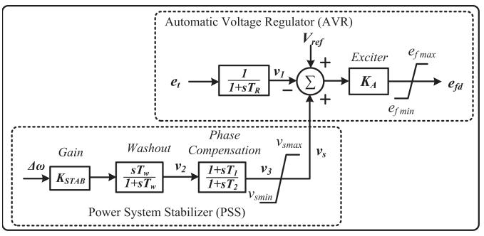  
Fig. 1. Excitation system of the synchronous generator.

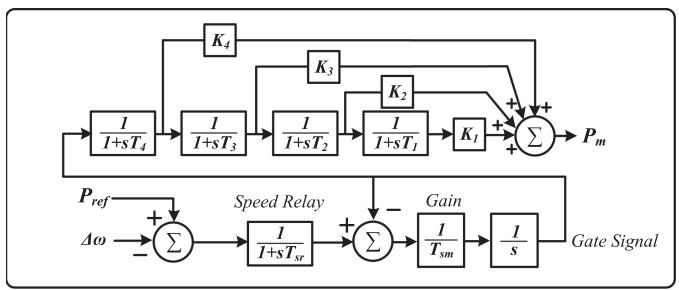  
Fig. 2. Turbine governor system of the synchronous generator.

$$
\Delta \dot {\omega} (t) = \frac {\left[ T _ {m} (t) - T _ {e} (t) - D \cdot \Delta \omega (t) \right]}{2 H}, \tag {10}
$$

$$
\dot {\psi} _ {f d} (t) = \omega_ {R} \cdot \left[ e _ {f d} (t) - R _ {f d} i _ {f d} (t) \right], \tag {11}
$$

$$
\dot {\psi} _ {1 d} (t) = - \omega_ {R} \cdot R _ {1 d} i _ {1 d} (t), \tag {12}
$$

$$
\dot {\psi} _ {1 q} (t) = - \omega_ {R} \cdot R _ {1 q} i _ {1 q} (t), \tag {13}
$$

$$
\dot {\psi} _ {2 q} (t) = - \omega_ {R} \cdot R _ {2 q} i _ {2 q} (t), \tag {14}
$$

and the excitation system model given in Fig. 1 is comprised of the following power system stabilizer (PSS) and automatic voltage regulator (AVR) equations

$$
\dot {v} _ {1} (t) = \frac {\left[ v _ {t} (t) - v _ {1} (t) \right]}{T _ {R}}, \tag {15}
$$

$$
\dot {v} _ {2} (t) = K _ {s t a b} \cdot \Delta \dot {\omega} (t) - \frac {v _ {2} (t)}{T _ {\omega}}, \tag {16}
$$

$$
\dot {v} _ {3} (t) = \frac {\left[ T _ {1} \dot {v} _ {2} (t) + v _ {2} (t) - v _ {3} (t) \right]}{T _ {2}}. \tag {17}
$$

As an expansion of (1), the time-varying quantities in (9)-(17) contribute to vectors u and x, and the remaining coefficients such as $\omega _ { R } , H , D , R _ { f d } , R _ { 1 d } , R _ { 1 q } , R _ { 2 q } , T _ { R } , K _ { s t a b } , T _ { \omega } , T _ { 1 }$ , and $T _ { 2 }$ are constant parameters of generators and the excitation system.

The detailed mechanical equations and swing equations of a synchronous machine are given above. In a practical power transmission system, the mechanical power is provided by the turbine governing system. In order to obtain a higher accuracy of the dynamic security analysis results, a four-stage governor system is also included as given in Fig. 2. To reduce the computational burden and execution time of the hardware emulation, the governor system equations are solved by Forward Euler with

a time-step of 1 ms, which are not included in the $9 ^ { t h }$ -order DAEs.

# C. AC Network Equations

The AC network mainly comprises transmission lines, transformers, loads, and shunt capacitors. The transmission lines and the transformers are represented as lumped π models. The fixed loads and shunt capacitors are treated as the admittance which is associated with the buses, given as

$$
Y _ {L o a d} = \frac {P _ {L o a d} + j Q _ {L o a d}}{V _ {B u s} ^ {2}}, \tag {18}
$$

where $V _ { B u s }$ refers to the voltage of the local bus, $P _ { L o a d }$ is the active power of the load, and $Q _ { L o a d }$ represents the reactive power of the load or the shunt capacitor. Following the derivation of the admittance matrix of the AC network, the output current of the generators can be solved by the following matrix equations:

$$
\left[ \begin{array}{l} \mathbf {I} _ {\mathrm {N}} \\ \mathbf {I} _ {\mathrm {R}} \end{array} \right] = \left[ \begin{array}{l l} \mathbf {Y} _ {\mathrm {N N}} & \mathbf {Y} _ {\mathrm {N R}} \\ \mathbf {Y} _ {\mathrm {R N}} & \mathbf {Y} _ {\mathrm {R R}} \end{array} \right] \left[ \begin{array}{l} \mathbf {U} _ {\mathrm {N}} \\ \mathbf {U} _ {\mathrm {R}} \end{array} \right], \tag {19}
$$

where the subscription N and R refer to the generator nodes and the remaining nodes, respectively. Due to the absence of current injections to the non-generator buses, the current vector $\mathbf { I } _ { \mathbf { R } } = [ \mathbf { 0 } ]$ . The relationship of the generator output voltages and currents can also be derived by the network equations in (19), given as:

$$
\mathbf {I} _ {\mathrm {N}} = \mathbf {Y} _ {\text {r e d u c e d}} \cdot \mathbf {U} _ {\mathrm {N}}, \tag {20}
$$

where $\mathbf { Y _ { r e d u c e d } } = \mathbf { Y _ { N N } } - \mathbf { Y _ { N R } } \mathbf { Y _ { R R } ^ { - 1 } } \mathbf { Y }$ RN is the reduced admittance matrix of $n \times n$ dimension. The vectors IN, UN and $\mathbf { U _ { R } }$ in (19) are not yet known. The algebraic equations (21) and (22) provide the relationship between IN and ${ \bf { U } } _ { \bf { N } }$ by expressing voltages $e _ { d }$ and $e _ { q }$ as functions of the known state variables and the components of the currents.

$$
e _ {d} = - r _ {a} i _ {d} + \left(i _ {q} \left(X _ {a q} ^ {\prime \prime} + X _ {l}\right) - X _ {a q} ^ {\prime \prime} \left(\frac {\psi_ {1 q}}{X _ {1 q}} + \frac {\psi_ {2 q}}{X _ {2 q}}\right)\right), \tag {21}
$$

$$
e _ {q} = - r _ {a} i _ {q} - \left(i _ {d} \left(X _ {a d} ^ {\prime \prime} + X _ {l}\right) - X _ {a d} ^ {\prime \prime} \left(\frac {\psi_ {f d}}{X _ {f d}} + \frac {\psi_ {1 d}}{X _ {1 d}}\right)\right), \tag {22}
$$

where $r _ { a } , X _ { a q } ^ { \prime \prime } , X _ { 1 q } , X _ { 2 q } , X _ { a d } ^ { \prime \prime } , X _ { f d } .$ , and $X _ { 1 d }$ are constant parameters of the synchronous machine. After solving the $\mathbf { I _ { N } }$ and ${ \bf { U } } _ { \bf { N } }$ by combining (21)-(20), the non-generator bus voltages group in vector $\mathbf { U _ { R } }$ can be calculated directly.

# III. HVDC GRID MODELING AND INTEGRATION

# A. HVDC Converter Average Value Model

The configuration of a 3-phase (N+1)-level modular multilevel converter (MMC) interconnecting the AC grid and DC grid is given in Fig. 3(a), where each phase contains 2 arms and each arm has N half-bridge submodules (HBSMs) and an arm inductor. In order to reveal the dynamics of the MMCs, the electromagnetic transient (EMT) simulation with a time-step of $2 0 0 \mu s$ is selected for emulating the HVDC grid, which can meet the requirements of DSA. The time-step of 200μs also leads to

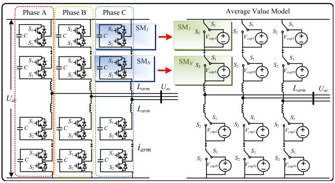  
Fig. 3. Illustration of modular multilevel converter modeling: (a) three-phase topology, (b) average value model.

a higher FTRT emulation speed than a regular time-step used in EMT simulation.

The FPGA-based hardware FTRT emulation prefers the models that induce low latency, and therefore, the average value model (AVM) of MMCs is adopted for contingency screening due to its simplicity in addition to the capability of being interactive with a basic converter controller to study its impact on the primary system. The HBSMs are simplified into controlled voltage sources as shown in Fig. 3(b). When the upper switch $S _ { 1 }$ is turned on, the capacitor is inserted; while it is bypassed when $S _ { 2 }$ is turned on. Assuming that the capacitor voltages are well balanced in each arm, which means the average values of capacitor voltages are equal, given as

$$
v _ {c a p 1} = v _ {c a p 2} = \dots = v _ {c a p N} = \frac {U _ {d c}}{N}, \tag {23}
$$

the equivalent voltage source of an arbitrary submodule (SMi) can be expressed as

$$
v _ {S M i} = \frac {U _ {d c}}{N} \cdot S _ {i}, \tag {24}
$$

where $S _ { i }$ refers to the switching function that takes the value 1 when the submodule capacitor is inserted and 0 when the SM is bypassed. As a result, the arm voltage can eventually be derived by the switching functions given as

$$
v _ {a r m} = \frac {U _ {d c}}{N} \cdot \sum_ {i = 1} ^ {N} S _ {i} + L _ {a r m} \frac {d i _ {a r m}}{d t}. \tag {25}
$$

Since the well-balanced condition in the AVM yields no circulating current, the differential term in (25) can be neglected and the AC side output voltage is formulated as

$$
v _ {a r m} = \frac {U _ {d c}}{N} \cdot \left(\sum_ {i = 1} ^ {N} S _ {u i} + \sum_ {i = 1} ^ {N} S _ {l i}\right), \tag {26}
$$

where $S _ { u i }$ and $S _ { l i }$ represent the switching functions of upper and lower arms, respectively.

In the HVDC grid, the reactive components such as the capacitor and inductor expressed by ordinary differential equations should be discretized for EMT simulation. The one-step integration method Trapezoidal rule is adopted for HVDC grid numerical calculation so that a discrete-time Norton equivalent

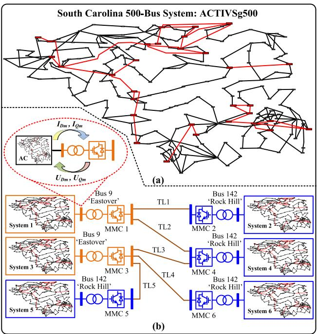  
Fig. 4. Topology of hybrid AC/DC grid: (a) transient stability simulation part: South Carolina 500-bus system (ACTIVSg500), (b) EMT simulation part: sixterminal HVDC grid.

circuit is utilized. The impedance of the capacitor and inductor take the form of $Z _ { C } = \Delta t / 2 C$ and $Z _ { L } = 2 L / \Delta t$ , respectively. The corresponding current sources of the Norton equivalent circuit are given as

$$
I _ {C e q} (t) = - i _ {C} (t - \Delta t) - \frac {2 C}{\Delta t} v _ {C} (t - \Delta t), \tag {27}
$$

$$
I _ {L e q} (t) = i _ {L} (t - \Delta t) + \frac {\Delta t}{2 L} v _ {L} (t - \Delta t). \tag {28}
$$

Since the small time-step $\Delta t$ guarantees the accuracy of EMT emulation, higher order integration methods are not adopted to reduce the computational burden.

# B. AC-DC Grid Interface

The single-line diagram of the hybrid AC/DC grid is shown in Fig. 4, where the 6 ACTIVSg 500-bus systems [25] connect with a 6-terminal (6-T) HVDC system. MMC 1 and MMC 2 operate as inverter stations and connect with AC System 1 and 2 via Bus 9, respectively, while the remaining four terminals, all acting as rectifier stations, each delivers 100 M W active power from the connected AC grid via Bus 142. Since the AC grid undergoes transient stability simulation with a time-step of 1 ms, and the EMT emulation with a time-step of 200μs is applied to the HVDC system, the latter part should be calculated five times more frequent than the former before data synchronization to keep numerical stability. Furthermore, the distinct emulation strategies prompts an interface based on dynamic voltage injection strategy which enables the two types of simulations to be compatible in one program, in addition to maintaining a constant admittance matrix that results in acceleration of the hardware emulation.

The synchronous machines can not only be represented in detail by Park’s equation as given in (9)-(14), but also constant voltage sources in the $D – Q$ frame when their dynamics are not concerned. The HVDC converter stations in the EMT simulation can be treated as time-varying voltage injections to the AC grid, which are equivalent to the non-detailed machines in transient stability simulation. The dynamic voltages $\mathbf { U _ { D m } }$ and $\mathbf { U } _ { \mathbf { Q m } }$ in Fig. 4(b) of the HVDC converter stations are directly delivered to the AC grid and integrated with the AC network equations without updating the admittance matrix. Due to the voltage injection method, (20) can be expanded as:

$$
\left[ \begin{array}{l} \mathbf {I} _ {\mathrm {n}} \\ \mathbf {I} _ {\mathrm {m}} \end{array} \right] = \left[ \begin{array}{l l} \mathbf {Y} _ {\mathrm {n n}} & \mathbf {Y} _ {\mathrm {n m}} \\ \mathbf {Y} _ {\mathrm {m n}} & \mathbf {Y} _ {\mathrm {m m}} \end{array} \right] \left[ \begin{array}{l} \mathbf {U} _ {\mathrm {n}} \\ \mathbf {U} _ {\mathrm {m}} \end{array} \right], \tag {29}
$$

where the subscription n refers to the synchronous machine nodes represented by the detailed Park’s equations, m are the nodes where converter stations locate, and $n + m$ denotes the N generator nodes in (20).

As the voltages calculated by the HVDC system are in D- and Q- axis, (29) which is based on complex numbers yields 4 real matrix equations:

$$
\mathbf {I} _ {\mathrm {D n}} = \mathbf {G} _ {\mathrm {n n}} \mathbf {U} _ {\mathrm {D n}} - \mathbf {B} _ {\mathrm {n n}} \mathbf {U} _ {\mathrm {Q n}} + \mathbf {G} _ {\mathrm {n m}} \mathbf {U} _ {\mathrm {D m}} - \mathbf {B} _ {\mathrm {n m}} \mathbf {U} _ {\mathrm {Q m}}, \tag {30}
$$

$$
\mathbf {I} _ {\mathrm {Q n}} = \mathbf {G} _ {\mathrm {n n}} \mathbf {U} _ {\mathrm {Q n}} + \mathbf {B} _ {\mathrm {n n}} \mathbf {U} _ {\mathrm {D n}} + \mathbf {G} _ {\mathrm {n m}} \mathbf {U} _ {\mathrm {Q m}} - \mathbf {B} _ {\mathrm {n m}} \mathbf {U} _ {\mathrm {D m}}, \tag {31}
$$

$$
\mathbf {I} _ {\mathrm {D m}} = \mathbf {G} _ {\mathrm {m n}} \mathbf {U} _ {\mathrm {D n}} - \mathbf {B} _ {\mathrm {m n}} \mathbf {U} _ {\mathrm {Q n}} + \mathbf {G} _ {\mathrm {m m}} \mathbf {U} _ {\mathrm {D m}} - \mathbf {B} _ {\mathrm {m m}} \mathbf {U} _ {\mathrm {Q m}}, \tag {32}
$$

$$
\mathrm {I} _ {\mathrm {Q m}} = \mathrm {G} _ {\mathrm {m n}} \mathrm {U} _ {\mathrm {Q n}} + \mathrm {B} _ {\mathrm {m n}} \mathrm {U} _ {\mathrm {D n}} + \mathrm {G} _ {\mathrm {m m}} \mathrm {U} _ {\mathrm {Q m}} - \mathrm {B} _ {\mathrm {m m}} \mathrm {U} _ {\mathrm {D m}}, \tag {33}
$$

where G and B refer to the real part and the imaginary part of the corresponding Y matrix. Following the solution of DC grid, the components $\mathbf { U _ { D m } }$ and $\mathbf { U } _ { \mathbf { Q m } }$ in the above equations are known, while the values of $\mathbf { U _ { D n } }$ and $\mathbf { U } _ { \mathbf { Q } \mathbf { n } }$ associated with the detailed synchronous machines are not directly known. After each step of integration, the synchronous voltages can be evaluated by the state variables. Since the values of $\mathbf { U _ { D n } }$ and $\mathbf { U } _ { \mathbf { Q } \mathbf { n } }$ are available after (30) and (31) are solved, the subsequent equation (32) and (33) can then be solved. Meanwhile, the calculated current vectors $\mathbf { I _ { D m } }$ and $\mathbf { I } _ { \mathbf { Q m } }$ in D-Q frame are sent to the HVDC system for its next time-step emulation, as given in Fig. 4(b).

# IV. HARDWARE EMULATION ON MULTI-FPGA PLATFORM

The proposed hybrid AC/DC grid is implemented on the integrated Xilinx Virtex UltraScale+TM FPGA platform, which includes 2 VCU118 boards equipped with XCVU9P FPGA and 2 VCU128 boards containing XCVU37P FPGA. System 1 and 2in Fig. 4(b) are deployed on the 2 VCU118 boards, respectively. Due to abundant hardware resources of VCU128 boards, System 3 and 4 including the 6-T HVDC system are implemented on VCU128 Board 1, while the remaining 2 AC systems (System 5 and 6) are calculated on VCU128 Board-2. The reconfigurability of the FPGAs enables each circuit part or subsystem to be designed as a hardware module, and allows programming its

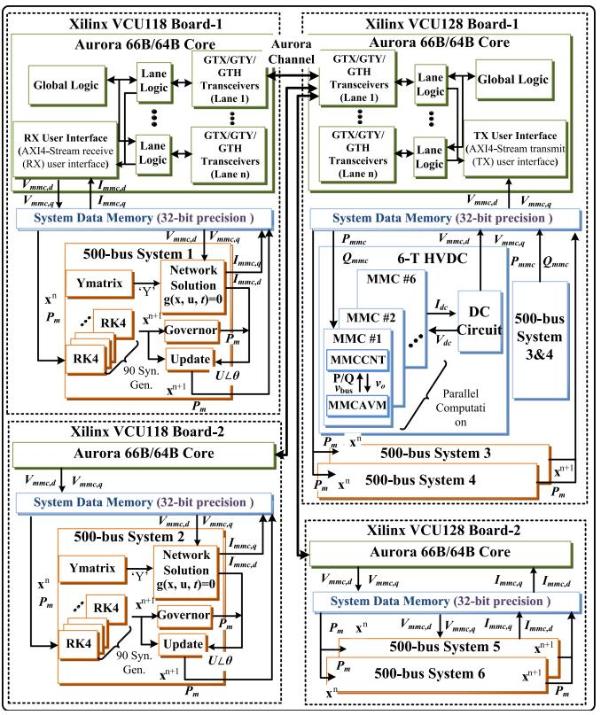  
Fig. 5. Hardware implementation block design for the proposed FTRT DSA platform.

function according to the application. After linking the hardware modules and designing the parallel components properly, the integrated AC/DC grid can be executed on the proposed platform.

The subsystems and functions which consist of the proposed integrated AC/DC grid written in C/C++ code are transformed into hardware modules by Xilinx Vivado high-level synthesis (HLS) tool. Then they, termed as IP cores, are imported into Vivado for block-level design. Due to the dynamic voltage injection strategy, the PCC voltages in the D-Q frame are chosen as the communication data among different FPGA boards, which is realized by the build-in IP Aurora 66B/64B core. The hardware block diagram along with the data stream is given in Fig. 5.

Table I provides the latency and the hardware resource utilization of each circuit part in the proposed integrated AC/DC system, where the latency is defined in clock cycles which is 10 ns under the FPGA frequency of 100 MHz. The total latency of the AC grid can be calculated as $2 9 + 1 9 6 + 1 1 4 + 2 1 = 3 6 0 T _ { c l k }$ , with a transient stability time-step of 1 ms, the FTRT ratio of the AC system is over $\textstyle { \frac { 1 m s } { 3 6 0 \times 1 0 n s } } = 2 7 7$ . Since the hardware modules PQcontrol, MMCAVM, and MMCCNT can be solved in parallel, the overall hardware delay is determined by their maximum latency which is 96 T clk, resulting in an FTRT ratio of $\frac { 2 0 0 \mu s } { 9 6 \times 1 0 n s } = 2 0 \dot { 8 }$ . Thus, the overall FTRT ratio of the hybrid ×AC/DC grid as Case I is determined by the EMT emulation part, which gives a final 208 times speedup over real-time. In contrast, if a single ACTIVSg 500-bus system without DC grid is analyzed as Case II, the FTRT ratio of the pure AC grid is more than 277,

TABLE ISPECIFICS OF MAJOR AC/DC GRID HARDWARE MODULES  

<table><tr><td>Module</td><td>Latency</td><td>BRAM</td><td>DSP</td><td>FF</td><td>LUT</td></tr><tr><td colspan="6">ACTIVSg 500-bus system on VCU128 (100MHz)</td></tr><tr><td>RK4</td><td>29 Tclk</td><td>0</td><td>18</td><td>1939</td><td>2045</td></tr><tr><td>Network</td><td>196 Tclk</td><td>16</td><td>678</td><td>48921</td><td>54732</td></tr><tr><td>Governor</td><td>114 Tclk</td><td>0</td><td>19</td><td>4046</td><td>4132</td></tr><tr><td>Update</td><td>21 Tclk</td><td>0</td><td>35</td><td>3639</td><td>3970</td></tr><tr><td colspan="6">HVDC system on VCU128 (100MHz)</td></tr><tr><td>PQcontrol</td><td>45 Tclk</td><td>0</td><td>62</td><td>4398</td><td>5372</td></tr><tr><td>MMCAVM</td><td>96 Tclk</td><td>0</td><td>16</td><td>2582</td><td>5270</td></tr><tr><td>MMCCNT</td><td>86 Tclk</td><td>0</td><td>62</td><td>5829</td><td>6320</td></tr><tr><td>HVDCNetwork</td><td>73 Tclk</td><td>0</td><td>20</td><td>2488</td><td>3710</td></tr><tr><td>Total_VCU128</td><td>-</td><td>0.79%</td><td>93.15%</td><td>42.82%</td><td>97.46%</td></tr><tr><td>Total_VCU118</td><td>-</td><td>0.37%</td><td>59.11%</td><td>25.00%</td><td>51.99%</td></tr><tr><td colspan="6">Available hardware resources</td></tr><tr><td>VCU128</td><td>-</td><td>4032</td><td>9024</td><td>2607360</td><td>1303680</td></tr><tr><td>VCU118</td><td>-</td><td>4320</td><td>6840</td><td>2364480</td><td>1182240</td></tr></table>

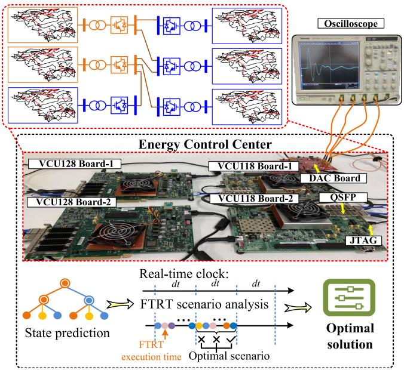  
Fig. 6. Hardware implementation platform for FTRT DSA emulation and scenario analysis in the energy control center.

where six 500-bus systems can be executed concurrently in the integrated FPGA boards.

Fig. 6 provides the hardware platform for FTRT emulation. The functions which represent the target power transmission system and the initial conditions of the synchronous generators are downloaded from the host computer via the Joint Test Action Group (JTAG) interface. Since multiple FPGA boards are assembled, data communication among them is also a challenge in emulating such a complex system. The Xilinx Virtex UltraScale+TM series FPGA boards provide efficient communication ports, such as Quad Small Form-factor Pluggable (QSFP), Samtec FireFly interfaces, which can significantly accelerate the communication speed, since both interfaces can provide a maximum bidirectional communication rate of 4 28 Gbps, which can be utilized for delivering the current operating conditions from real power transmission system or other FPGA boards, making the proposed FTRT emulation suitable for online DSA in the energy control center. Once a disturbance is detected,

the real-time operation data from the field will be delivered to the control center. Meanwhile, there could be hundreds of scenarios being emulated in the FTRT emulation platform for a comprehensive study. Since a more than 208 FTRT ratio can be achieved, the power control center has sufficient time to come up with optimal strategies for contingencies in various subsystems that help maintain the stability of the entire system.

The scalability of the proposed FTRT emulation is demonstrated by interconnecting four FPGA boards in realizing the FTRT emulation, and more FPGA boards can be connected along with a further expansion of the AC/DC grid. Table I indicates that the hardware resources such as DSP and LUT of VCU128 board are nearly full for two 500-bus systems with 180 generators. Although the Network module will increase along with the size of the system, its influence can be neglected if multiple synchronous generators are included since the Network module is only calculated once in a single time-step. The hardware resource utilization is proportional to the synchronous generators, and therefore, a Xilinx VCU128 board is able to accommodate about 180 generators with excitation and governor system in parallel. With a larger power system scale, the multiple FTRT emulators can be employed in the dynamic security assessment for HIL emulation or predictive control.

# V. CONTINGENCY SCREENING RESULTS AND VALIDATION

# A. Dynamic Security Index

The contingency screening for dynamic security analysis is based on the system in Fig. 4. The transient stability analysis focuses on the rotor angle stability, voltage stability, and frequency stability, and the rotor angle stability is described as the power angle-based stability margin (ASM), which is defined as follows for each AC grid in the system.

$$
A S M = \frac {3 6 0 - \delta_ {\text {m a x}}}{3 6 0 + \delta_ {\text {m a x}}} \times 1 0 0, \tag {34}
$$

where $\delta _ { m a x }$ is the maximum angle separation of any two generators in the same AC subsystem at the same time in the post-fault response, which is illustrated in Fig. 7(a). The transient stability index of a contingency is chosen as the smallest index among all 6 AC grids. ASM is directly proportional to rotor angle separation so it provides an indication of severity of a disturbance. A smaller-than-zero ASM indicates that the $\delta _ { m a x }$ is larger than 360 unit, which means the generators lose synchronism and the system is under unstable condition, while ASM>0 corresponds to a secure system status.

# B. Case 1: Hybrid AC/DC Grid

At t = 1 s a three-phase-to-ground fault lasting 180 ms occurs at Bus 16in System 1, the imminent impacts including severe disturbances to the rotor angles, bus voltages, and frequencies, as shown in Fig. 7(a), (b), and (c). Fig. 7(a) demonstrates that the maximum angle separation $( \delta _ { m a x } )$ is less than 360 unit, and therefore, the system is under secure condition. Although one of the frequencies exceeds the 1% threshold after the three-phase fault, it restores to the normal operation eventually. Fig. 7(d), (e), and (f) provide the emulation results after a long-term over-load.

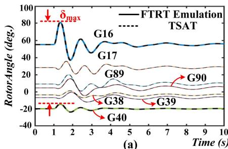

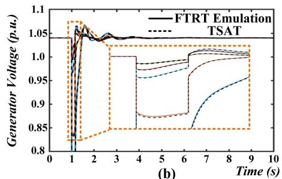

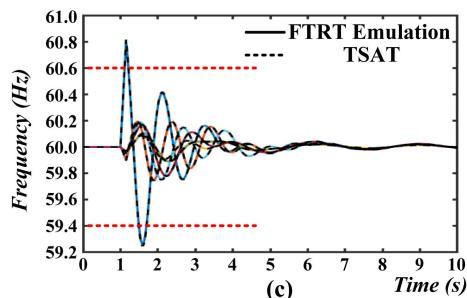

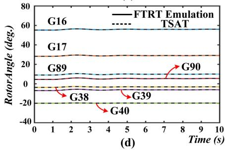

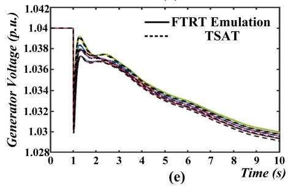

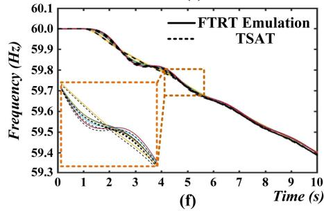  
Fig. 7. FTRT emulation results: (a) generator rotor angles under three phase fault, (b) generator output voltages under three phase fault, (c) generator frequencies under three phase fault, (d) generator rotor angles under long term over-load, (e) generator output voltages under long term over-load, (f) generator frequencies under long term over-load.

At 1 s, a 90% over-load occurs to the load at Bus 392in System 1. There are no significant impacts on the rotor angles of the synchronous generators as given in Fig. 7(d). However, the bus voltages and the frequencies of the generators keep decreasing after the over-load disturbance and cannot be recovered by the generators’ control system. The whole system enters the unstable condition at around 9 s when the frequencies reach below 59.4 Hz. The dashed lines represent the results calculated from the simulation tool TSAT , while the solid lines refer to the FTRT emulation results from FPGA boards. The zoomed-in plots in Fig. 7(b) and (f) demonstrate that the accuracy of the proposed FTRT emulation since the waveforms of the hardware emulation are identical to TSAT off-line simulation results.

Fig. 8(a) provides ASM results calculated from FTRT emulation under 1890 three-phase-to-ground fault contingencies in System 1. The x-axis denotes the fault duration ranging from 100 ms to 300 ms, and the y-axis is the fault locations at Bus 1 to 90, which are generator buses. As mentioned, the ASM results below zero represent the unstable conditions, and therefore, the whole system may come to an insecure state if a three-phase-to-ground fault lasting more than 250 ms occurs at Bus 17. Fig. 8(b) demonstrates the frequencies after 9 s of the overload happening on the load number 1 to 90 with various overload percentages. It shows that the entire system is insecure regardless of which bus is overloaded by more than 80% for 9 s.

Aiming at demonstrating the accuracy of the proposed FTRT emulation, Table II gives the contingency screening results and errors for 90 300-ms three-phase-to-ground faults at each generator bus. The relative errors given in Table II are calculated by the following formula:

$$
\epsilon = \frac {\operatorname {abs} \left(AS M _ {F T R T} - A S M _ {T S A T}\right)}{\operatorname {abs} \left(A S M _ {T S A T}\right)} \times 100 \% \tag{35}
$$

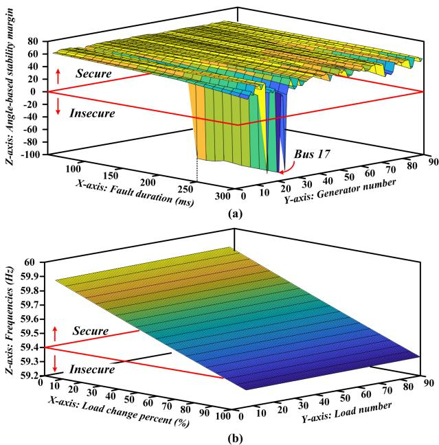  
Fig. 8. Dynamic security indices of extensive contingencies: (a) ASM results of three phase fault contingencies, (b) frequencies of long term over-load contingencies.

The maximum relative error among the 90 contingencies is 0.49 %, which thoroughly demonstrates the accuracy of the proposed method.

# C. Case 2: Purely AC Grid

In Case 2, the 6-T HVDC system is omitted, and a single ACTIVSg 500-bus system is taken into consideration. The utilization of the integrated FPGA platform enable six contingencies to run concurrently in the FTRT emulation platform with

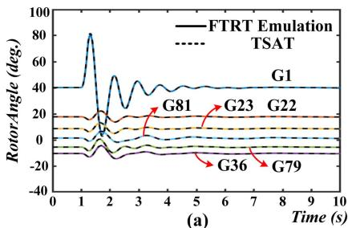

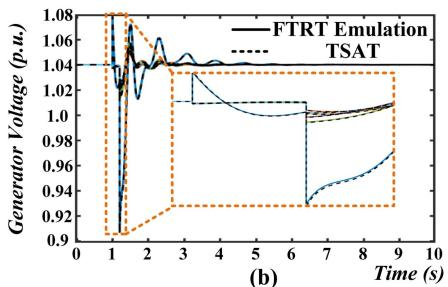

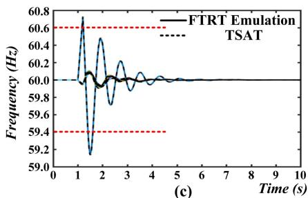

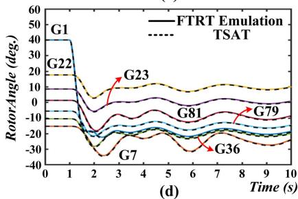

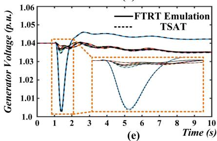

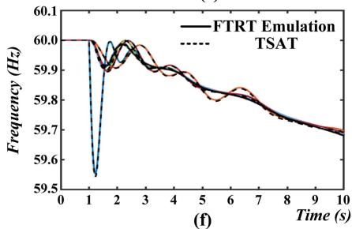  
Fig. 9. FTRT emulation results: (a) generator rotor angles under open circuit on Bus 1, (b) generator output voltages under open circuit on Bus 1, (c) generator frequencies under open circuit on Bus 1, (d) generator rotor angles under generation reduction on Generator 1, (e) generator output voltages under generation reduction on Generator 1, (f) generator frequencies under generation reduction on Generator 1.

TABLE IICONTINGENCY SCREENING RESULTS AND ERRORS FOR 300MSTHREE-PHASE-TO-GROUND FAULTS IN SYSTEM 1  

<table><tr><td>Fault Gen.</td><td>ASM FTRT</td><td>ASM TSAT®</td><td>Error (%)</td><td>Fault Gen.</td><td>ASM FTRT</td><td>ASM TSAT®</td><td>Error (%)</td><td>Fault Gen.</td><td>ASM FTRT</td><td>ASM TSAT®</td><td>Error (%)</td></tr><tr><td>17</td><td>-86.64</td><td>-86.52</td><td>0.14</td><td>22</td><td>52.40</td><td>52.34</td><td>0.11</td><td>37</td><td>59.06</td><td>58.92</td><td>0.24</td></tr><tr><td>11</td><td>-85.42</td><td>-85.31</td><td>0.13</td><td>61</td><td>52.78</td><td>52.80</td><td>0.04</td><td>45</td><td>59.60</td><td>59.48</td><td>0.2</td></tr><tr><td>20</td><td>-85.34</td><td>-85.27</td><td>0.08</td><td>30</td><td>53.37</td><td>53.24</td><td>0.24</td><td>76</td><td>59.72</td><td>59.60</td><td>0.2</td></tr><tr><td>16</td><td>-85.23</td><td>-85.16</td><td>0.08</td><td>47</td><td>53.45</td><td>53.41</td><td>0.07</td><td>51</td><td>59.75</td><td>59.63</td><td>0.2</td></tr><tr><td>19</td><td>36.42</td><td>36.55</td><td>0.36</td><td>3</td><td>53.50</td><td>53.58</td><td>0.15</td><td>81</td><td>59.77</td><td>59.68</td><td>0.15</td></tr><tr><td>21</td><td>37.75</td><td>37.91</td><td>0.42</td><td>8</td><td>53.77</td><td>53.80</td><td>0.06</td><td>46</td><td>60.07</td><td>59.81</td><td>0.43</td></tr><tr><td>71</td><td>38.89</td><td>39.00</td><td>0.28</td><td>62</td><td>53.91</td><td>53.96</td><td>0.09</td><td>34</td><td>60.13</td><td>59.99</td><td>0.23</td></tr><tr><td>74</td><td>40.64</td><td>40.72</td><td>0.2</td><td>89</td><td>54.09</td><td>54.08</td><td>0.02</td><td>36</td><td>60.15</td><td>60.13</td><td>0.03</td></tr><tr><td>18</td><td>40.92</td><td>40.96</td><td>0.1</td><td>63</td><td>54.29</td><td>54.17</td><td>0.22</td><td>65</td><td>60.40</td><td>60.26</td><td>0.23</td></tr><tr><td>1</td><td>41.16</td><td>41.22</td><td>0.15</td><td>58</td><td>55.10</td><td>55.10</td><td>0.00</td><td>64</td><td>60.55</td><td>60.29</td><td>0.43</td></tr><tr><td>73</td><td>43.05</td><td>43.05</td><td>0.00</td><td>31</td><td>55.27</td><td>55.23</td><td>0.07</td><td>87</td><td>60.56</td><td>60.48</td><td>0.13</td></tr><tr><td>72</td><td>44.56</td><td>44.56</td><td>0.00</td><td>77</td><td>56.62</td><td>56.47</td><td>0.27</td><td>70</td><td>60.61</td><td>60.53</td><td>0.13</td></tr><tr><td>25</td><td>44.57</td><td>44.63</td><td>0.13</td><td>32</td><td>56.86</td><td>56.58</td><td>0.49</td><td>78</td><td>60.87</td><td>60.80</td><td>0.12</td></tr><tr><td>75</td><td>44.64</td><td>44.70</td><td>0.13</td><td>38</td><td>56.93</td><td>56.71</td><td>0.39</td><td>82</td><td>60.89</td><td>60.81</td><td>0.13</td></tr><tr><td>14</td><td>44.74</td><td>44.73</td><td>0.02</td><td>59</td><td>57.26</td><td>57.14</td><td>0.21</td><td>68</td><td>60.98</td><td>60.83</td><td>0.25</td></tr><tr><td>84</td><td>45.06</td><td>45.12</td><td>0.13</td><td>56</td><td>57.31</td><td>57.21</td><td>0.17</td><td>60</td><td>61.38</td><td>61.30</td><td>0.13</td></tr><tr><td>12</td><td>45.76</td><td>45.81</td><td>0.11</td><td>57</td><td>57.41</td><td>57.27</td><td>0.24</td><td>67</td><td>61.39</td><td>61.32</td><td>0.11</td></tr><tr><td>4</td><td>46.27</td><td>46.30</td><td>0.06</td><td>55</td><td>57.53</td><td>57.36</td><td>0.3</td><td>9</td><td>61.50</td><td>61.38</td><td>0.2</td></tr><tr><td>2</td><td>46.59</td><td>46.58</td><td>0.02</td><td>80</td><td>57.67</td><td>57.57</td><td>0.17</td><td>27</td><td>61.59</td><td>61.44</td><td>0.24</td></tr><tr><td>43</td><td>47.56</td><td>47.52</td><td>0.08</td><td>49</td><td>57.71</td><td>57.63</td><td>0.14</td><td>86</td><td>61.64</td><td>61.50</td><td>0.23</td></tr><tr><td>85</td><td>47.57</td><td>47.63</td><td>0.13</td><td>79</td><td>57.92</td><td>57.92</td><td>0.00</td><td>7</td><td>61.74</td><td>61.66</td><td>0.13</td></tr><tr><td>26</td><td>48.38</td><td>48.39</td><td>0.02</td><td>69</td><td>58.19</td><td>57.96</td><td>0.40</td><td>66</td><td>61.80</td><td>61.72</td><td>0.13</td></tr><tr><td>29</td><td>48.54</td><td>48.57</td><td>0.06</td><td>90</td><td>58.26</td><td>58.20</td><td>0.10</td><td>88</td><td>61.96</td><td>61.78</td><td>0.29</td></tr><tr><td>28</td><td>48.55</td><td>48.59</td><td>0.08</td><td>40</td><td>58.31</td><td>58.24</td><td>0.12</td><td>50</td><td>62.45</td><td>62.40</td><td>0.08</td></tr><tr><td>52</td><td>48.92</td><td>48.96</td><td>0.08</td><td>39</td><td>58.38</td><td>58.31</td><td>0.12</td><td>23</td><td>62.68</td><td>62.55</td><td>0.21</td></tr><tr><td>13</td><td>49.24</td><td>49.21</td><td>0.06</td><td>6</td><td>58.60</td><td>58.43</td><td>0.29</td><td>5</td><td>62.82</td><td>62.78</td><td>0.06</td></tr><tr><td>24</td><td>50.04</td><td>50.03</td><td>0.02</td><td>33</td><td>58.78</td><td>58.65</td><td>0.22</td><td>35</td><td>62.87</td><td>62.80</td><td>0.11</td></tr><tr><td>53</td><td>50.71</td><td>50.73</td><td>0.04</td><td>44</td><td>58.83</td><td>58.75</td><td>0.14</td><td>10</td><td>62.96</td><td>62.82</td><td>0.22</td></tr><tr><td>15</td><td>50.77</td><td>50.75</td><td>0.04</td><td>83</td><td>58.84</td><td>58.85</td><td>0.02</td><td>41</td><td>63.04</td><td>62.86</td><td>0.29</td></tr><tr><td>54</td><td>51.39</td><td>51.44</td><td>0.10</td><td>42</td><td>58.92</td><td>58.92</td><td>0.00</td><td>48</td><td>63.91</td><td>63.90</td><td>0.02</td></tr></table>

277 FTRT ratios. The dynamic emulation results are provided in Fig. 9, where Fig. 9(a), (b), and (c) refer to an open circuit lasting 180 ms occurs at 1 s on generator Bus 1. The emulation results indicate that the system is under stable condition after the fault is cleared. Meanwhile, Fig. 9(d), (e), and (f) show the emulation results of 90% generation reduction on Generator 1. Fig. 9(f) indicates that the frequencies of synchronous generators keep decreasing and cannot be restored.

Fig. 10(a) gives the ASM results for 1890 open circuit contingencies that occur on each generator bus under various fault duration, which demonstrates that the entire system is more likely to be insecure with a longer fault. Fig. 10(b) provides 900

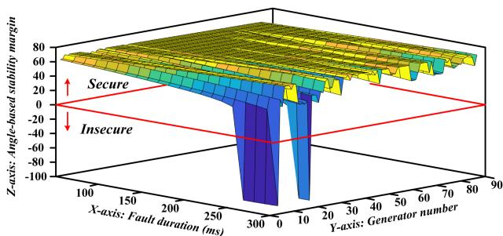

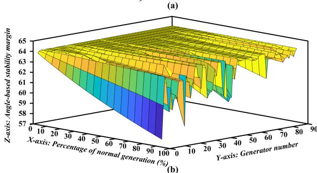  
Fig. 10. Dynamic security indices of extensive contingencies: (a) ASM results of open circuit contingencies, (b) frequencies of generation reduction contingencies.

ASM results for various generation reduction percentages of each generator. Although the ASM results show that the system is secure, the frequencies after the generation reduction will not be restored without extra power injection as given in Fig. 9(f). It indicates that the proposed DSA platform may reveal more potential risks with the utilization of time-domain emulation. The contingency screening results for 90 open circuit faults are given in Table III. The maximum relative error is merely 0.81%, which demonstrates that the accuracy of the proposed FTRT emulation is suitable for online DSA in the energy control center.

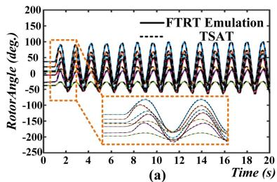

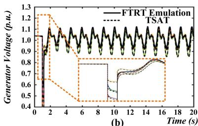

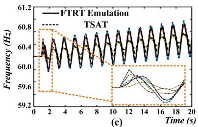

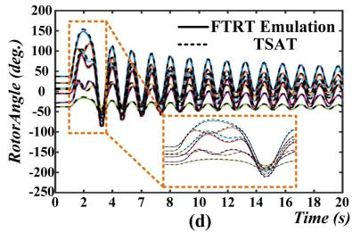

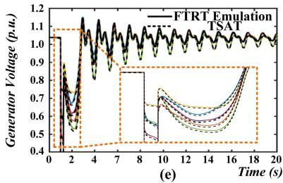

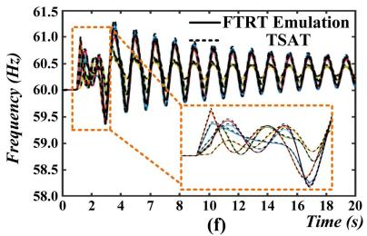  
Fig. 11. Three-phase-to-ground fault for underdamped synchronous generators: (a) generator rotor angles, (b) generator output voltages, (c) generator frequencies; FTRT emulation results of three-phase-to-ground fault lasting 249 ms: (d) generator rotor angles, (e) generator output voltages, (f) generator frequencies.

TABLE III CONTINGENCY SCREENING RESULTS AND ERRORS FOR 300MS OPEN CIRCUIT FAULTS ON GENERATORS IN SYSTEM 1   

<table><tr><td>Fault Gen.</td><td>ASM FTRT</td><td>ASM TSAT®</td><td>Error (%)</td><td>Fault Gen.</td><td>ASM FTRT</td><td>ASM TSAT®</td><td>Error (%)</td><td>Fault Gen.</td><td>ASM FTRT</td><td>ASM TSAT®</td><td>Error (%)</td></tr><tr><td>2</td><td>-88.18</td><td>-87.66</td><td>0.59</td><td>26</td><td>55.46</td><td>55.48</td><td>0.04</td><td>38</td><td>67.52</td><td>67.53</td><td>0.01</td></tr><tr><td>16</td><td>-86.96</td><td>-87.34</td><td>0.44</td><td>81</td><td>56.32</td><td>56.16</td><td>0.28</td><td>58</td><td>67.52</td><td>67.54</td><td>0.03</td></tr><tr><td>1</td><td>-86.17</td><td>-86.88</td><td>0.82</td><td>64</td><td>56.41</td><td>56.34</td><td>0.12</td><td>56</td><td>67.54</td><td>67.56</td><td>0.03</td></tr><tr><td>20</td><td>38.51</td><td>38.61</td><td>0.26</td><td>79</td><td>56.85</td><td>56.8</td><td>0.09</td><td>55</td><td>67.54</td><td>67.56</td><td>0.03</td></tr><tr><td>14</td><td>39.42</td><td>39.36</td><td>0.15</td><td>83</td><td>57.53</td><td>57.55</td><td>0.03</td><td>57</td><td>67.54</td><td>67.57</td><td>0.04</td></tr><tr><td>12</td><td>40.07</td><td>40.11</td><td>0.10</td><td>82</td><td>58.35</td><td>58.23</td><td>0.21</td><td>59</td><td>67.55</td><td>67.57</td><td>0.03</td></tr><tr><td>4</td><td>40.99</td><td>41.03</td><td>0.10</td><td>52</td><td>59.06</td><td>58.83</td><td>0.39</td><td>65</td><td>67.56</td><td>67.59</td><td>0.04</td></tr><tr><td>13</td><td>42.25</td><td>42.13</td><td>0.28</td><td>53</td><td>59.65</td><td>59.39</td><td>0.44</td><td>76</td><td>67.59</td><td>67.61</td><td>0.03</td></tr><tr><td>11</td><td>42.67</td><td>42.73</td><td>0.14</td><td>54</td><td>59.88</td><td>59.6</td><td>0.47</td><td>60</td><td>67.6</td><td>67.61</td><td>0.01</td></tr><tr><td>15</td><td>43.09</td><td>42.96</td><td>0.30</td><td>34</td><td>60.54</td><td>60.8</td><td>0.43</td><td>87</td><td>67.64</td><td>67.66</td><td>0.03</td></tr><tr><td>30</td><td>43.32</td><td>43.25</td><td>0.16</td><td>8</td><td>61.68</td><td>61.82</td><td>0.23</td><td>40</td><td>67.66</td><td>67.67</td><td>0.01</td></tr><tr><td>62</td><td>46.85</td><td>46.79</td><td>0.13</td><td>45</td><td>62.17</td><td>62.36</td><td>0.30</td><td>86</td><td>67.67</td><td>67.67</td><td>0.00</td></tr><tr><td>61</td><td>46.99</td><td>46.91</td><td>0.17</td><td>77</td><td>63.0</td><td>62.88</td><td>0.19</td><td>39</td><td>67.67</td><td>67.67</td><td>0.00</td></tr><tr><td>63</td><td>47.29</td><td>47.26</td><td>0.06</td><td>43</td><td>63.54</td><td>63.56</td><td>0.03</td><td>44</td><td>67.67</td><td>67.7</td><td>0.04</td></tr><tr><td>19</td><td>48.48</td><td>48.41</td><td>0.14</td><td>88</td><td>63.63</td><td>63.96</td><td>0.52</td><td>46</td><td>67.7</td><td>67.7</td><td>0.00</td></tr><tr><td>71</td><td>48.95</td><td>48.92</td><td>0.06</td><td>28</td><td>64.24</td><td>64.03</td><td>0.33</td><td>27</td><td>67.7</td><td>67.71</td><td>0.01</td></tr><tr><td>74</td><td>49.28</td><td>49.29</td><td>0.02</td><td>29</td><td>64.25</td><td>64.03</td><td>0.34</td><td>36</td><td>67.74</td><td>67.74</td><td>0.00</td></tr><tr><td>17</td><td>49.37</td><td>49.37</td><td>0.00</td><td>84</td><td>64.46</td><td>64.43</td><td>0.05</td><td>78</td><td>67.74</td><td>67.75</td><td>0.01</td></tr><tr><td>18</td><td>49.57</td><td>49.58</td><td>0.02</td><td>23</td><td>64.74</td><td>64.54</td><td>0.31</td><td>9</td><td>67.75</td><td>67.75</td><td>0.00</td></tr><tr><td>47</td><td>49.83</td><td>49.8</td><td>0.06</td><td>32</td><td>64.97</td><td>65.07</td><td>0.15</td><td>50</td><td>67.75</td><td>67.75</td><td>0.00</td></tr><tr><td>73</td><td>49.86</td><td>49.87</td><td>0.02</td><td>37</td><td>65.41</td><td>65.56</td><td>0.23</td><td>51</td><td>67.75</td><td>67.75</td><td>0.00</td></tr><tr><td>72</td><td>50.29</td><td>50.3</td><td>0.02</td><td>85</td><td>65.56</td><td>65.66</td><td>0.15</td><td>24</td><td>67.75</td><td>67.75</td><td>0.00</td></tr><tr><td>75</td><td>50.31</td><td>50.33</td><td>0.04</td><td>31</td><td>65.72</td><td>65.74</td><td>0.03</td><td>70</td><td>67.75</td><td>67.75</td><td>0.00</td></tr><tr><td>22</td><td>50.51</td><td>50.45</td><td>0.12</td><td>90</td><td>66.5</td><td>66.48</td><td>0.03</td><td>33</td><td>67.76</td><td>67.75</td><td>0.01</td></tr><tr><td>3</td><td>50.62</td><td>50.58</td><td>0.08</td><td>42</td><td>66.94</td><td>66.88</td><td>0.09</td><td>10</td><td>67.76</td><td>67.76</td><td>0.00</td></tr><tr><td>21</td><td>52.67</td><td>52.58</td><td>0.17</td><td>5</td><td>67.01</td><td>67.15</td><td>0.21</td><td>35</td><td>67.76</td><td>67.76</td><td>0.00</td></tr><tr><td>89</td><td>52.84</td><td>52.85</td><td>0.02</td><td>6</td><td>67.1</td><td>67.19</td><td>0.13</td><td>48</td><td>67.76</td><td>67.76</td><td>0.00</td></tr><tr><td>69</td><td>53.9</td><td>53.82</td><td>0.15</td><td>41</td><td>67.23</td><td>67.32</td><td>0.13</td><td>68</td><td>67.76</td><td>67.76</td><td>0.00</td></tr><tr><td>80</td><td>54.01</td><td>53.92</td><td>0.17</td><td>49</td><td>67.27</td><td>67.4</td><td>0.19</td><td>67</td><td>67.76</td><td>67.76</td><td>0.00</td></tr><tr><td>25</td><td>54.44</td><td>54.42</td><td>0.04</td><td>7</td><td>67.51</td><td>67.49</td><td>0.03</td><td>66</td><td>67.77</td><td>67.77</td><td>0.00</td></tr></table>

# D. Accuracy Validation

In order to validate the the accuracy of the proposed modeling and hardware implementation approaches, an underdamped case is emulated. Fig. 11(a), (b), and (c) provide the emulation results for an underdamped excitation system, where the PSSs for all synchronous generators have been removed. At t = 1s, a three-phase-to-ground fault lasting 180 ms occurs on Bus 17, the generator rotor angles start to oscillate without recovery. The zoomed-in plots in Fig. 11(a), (b), and (c) demonstrate that the FTRT emulation results are matched well with the results calculated from TSAT in an underdamped system.

Furthermore, the emulation results are also provided to validate the accuracy of the proposed FTRT emulation under

TABLE IVASM RESULTS FOR THREE-PHASE-TO-GROUND FAULTS CLEARED NEAR THECCT  

<table><tr><td colspan="4">Fault Bus (Bus 17)</td><td colspan="4">Fault Bus (Bus 20)</td></tr><tr><td>Fault Dur.</td><td>ASM FTRT</td><td>ASM TSAT®</td><td>Error (%)</td><td>Fault Dur.</td><td>ASM FTRT</td><td>ASM TSAT®</td><td>Error (%)</td></tr><tr><td>248 ms</td><td>39.09</td><td>39.15</td><td>-0.10</td><td>295 ms</td><td>39.22</td><td>39.22</td><td>0.00</td></tr><tr><td>249 ms</td><td>36.22</td><td>36.28</td><td>-0.16</td><td>296 ms</td><td>36.62</td><td>36.61</td><td>0.03</td></tr><tr><td>250 ms</td><td>-83.92</td><td>-83.78</td><td>0.17</td><td>297 ms</td><td>-85.16</td><td>-85.12</td><td>0.05</td></tr><tr><td>251 ms</td><td>-85.41</td><td>-85.35</td><td>0.07</td><td>298 ms</td><td>-86.12</td><td>-86.07</td><td>0.07</td></tr></table>

a three-phase-to-ground fault which is cleared near the critical clearing time (CCT), as given in Fig. 11(d), (e), and (f). As Fig. 8(a) shows the CCT of the three-phase-to-ground fault at the bus of Bus 17 is 250 ms. Therefore, Fig. 11(d), (e), and (f) provides the emulation results of a three-phase-to-ground fault lasting 249ms at Bus 17. Fig. 11(d), (e), and (f) indicate that the fault causes a severe oscillation including rotor angles, bus voltages, and frequencies. The zoomed-in plots demonstrated the accuracy of the proposed FTRT emulation can still be guaranteed even when the fault is cleared near the CCT. Meanwhile, the ASM results for two serious three-phase-to-ground faults calculated from FTRT emulation and TSAT are provided in Table IV, which indicates that the accuracy of the proposed method can be guaranteed for the contingencies that are cleared around the CCT.

The emulation time-step Δt is another important factor, which could influence the performance and accuracy of the FTRT emulation. As mentioned, 1 ms is utilized in the AC grid for DSA, while the time-step of 200μs is adopted in the HVDC part for EMT emulation. The adoption of 200μs is justified by the type of study in this work, where the converter system-level dynamics such as output power and reactive power, instead of the converter electromagnetic transient details, are the main focus. In the dynamic security assessment, the commonly used time-step ranges from 1 ms to 10 ms. A dramatic computational advantage can be achieved with the time-step of 200μs, and

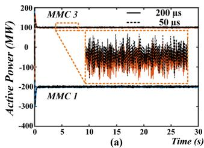

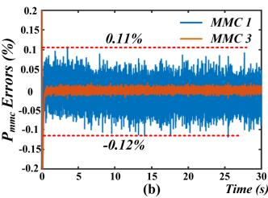  
Fig. 12. FTRT emulation results: (a) active power of MMC 1 and 3 under different time-steps, (b) relative errors.

a $\frac { 2 0 0 \mu s } { 9 6 \times 1 0 n s } = 2 0 8$ FTRT ratio can be obtained. On the other hand, with the time-step of $5 0 \mu s$ , the FTRT emulation can still be achieved, given as $\frac { 5 0 \mu s } { 9 6 \times 1 0 n s } = 5 2$ . The emulation results of output active power of the MMC 1 and 3 under various time-steps and relative errors are given in Fig. 12.

Fig. 12(b) indicates that there is no significant improvement in emulation accuracy under the time-step of $5 0 \mu s$ . However, the acceleration has a significant drop if 50μs is adopted. Therefore, after a trade-off between the emulation accuracy and computational speed, the 200μs is selected as the emulation time-step of the HVDC grid.

# VI. CONCLUSION

This paper proposed a screening strategy of extensive contingencies in faster-than-real-time mode of execution for a comprehensive dynamic security analysis of large-scale integrated AC/DC grid. Due to the pipelined hardware design method and parallelism of AC/DC grid modules, the EMT and TS co-simulation is introduced to provide more detailed operation conditions of the integrated AC/DC grid for dynamic security analysis. A dynamic voltage injection interface for AC/DC grid is proposed, which enables the EMT and TS co-simulation executing as one program without updating the admittance matrix in every time-step. The proposed interface strategy is also suitable for the data communication among FPGA boards as its less data transferred, which can further accelerate the FTRT emulation by reducing the communication delay. An FTRT ratio of 208 can be obtained for the hybrid AC/DC grid, while the FTRT ratio is over 277 times for a pure AC system. The contingency screening results of the more than 5500 contingencies from the FTRT DSA hardware emulation platform are well matched with those of TSAT off-line simulation. Therefore, a guaranteed accuracy and execution speed of the proposed FTRT emulation methodology suggest its importance in planning and operation of a practical power system in scenarios such as online DSA.

# REFERENCES

[1] K. Morison, L. Wang, and P. Kundur, “Power system security assessment,” IEEE Power Energy Mag., vol. 2, no. 5, pp. 30–39, Sep. 2004.   
[2] T. Liu et al., “A bayesian learning based scheme for online dynamic security assessment and preventive control,” IEEE Trans. Power Syst., vol. 35, no. 5, pp. 4088–4099, Sep. 2020.   
[3] S. Huang and V. Dinavahi, “Real-time contingency analysis on massively parallel architectures with compensation method,” IEEE Access, vol. 6, pp. 44519–44530, 2018.   
[4] G. Zhou et al., “GPU-accelerated batch-ACPF solution for N-1 static security analysis,” IEEE Trans. Smart Grid, vol. 8, no. 3, pp. 1406–1416, May 2017.

[5] I. Konstantelos et al., “Implementation of a massively parallel dynamic security assessment platform for large-scale grids,” IEEE Trans. Smart Grid, vol. 8, no. 3, pp. 1417–1426, May 2017.   
[6] X. Li, F. Li, H. Yuan, H. Cui, and Q. Hu, “GPU-based fast decoupled power flow with preconditioned iterative solver and inexact Newton method,” IEEE Trans. Power Syst., vol. 32, no. 4, pp. 2695–2703, Jul. 2017.   
[7] NERC, “Standard TPL-002-0b–System performance following loss of a single bulk electric system element,” NERC, Jan. 2016. [Online]. Available: http://www.nerc.com/files/TPL-002-0b.pdf   
[8] X. Wang, Y. Song, and M. Irving, Modern Power Systems Analysis. New York, NY, USA: Springer, 2008.   
[9] B. Wang, B. Fang, Y. Wang, H. Liu, and Y. Liu, “Power system transient stability assessment based on Big Data and the core vector machine,” IEEE Trans. Smart Grid, vol. 7, no. 5, pp. 2561–2570, Sep. 2016.   
[10] Q. Zhu et al., “A deep end-to-end model for transient stability assessment with PMU data,” IEEE Access, vol. 6, pp. 65474–65487, 2018.   
[11] P. Kundur, Power System Stability Control. New York, NY, USA: McGraw-Hill, 1994.   
[12] X. Yang, C. Liu, and J. Wang, “Large-scale branch contingency analysis through master/slave parallel computing,” J. Mod. Power Syst. Clean Energy, vol. 1, no. 2, pp. 159–166, Sep. 2013.   
[13] T. Cui, R. Yang, G. Hug, and F. Franchetti, “Accelerated AC contingency calculation on commodity multi-core SIMD CPUs,” in Proc. IEEE PES Gen. Meeting Conf. Expo., 2014, pp. 1–5.   
[14] R. Dai, G. Liu, and X. Zhang, “Transmission technologies and implementations: Building a stronger, smarter power grid in China,” IEEE Power Energy Mag., vol. 18, no. 2, pp. 53–59, Mar.-Apr. 2020.   
[15] S. Jin, Z. Huang, R. Diao, D. Wu, and Y. Chen, “Comparative implementation of high performance computing for power system dynamic simulations,” IEEE Trans. Smart Grid, vol. 8, no. 3, pp. 1387–1395, May 2017.   
[16] J. Shu, W. Xue, and W. Zheng, “A parallel transient stability simulation for power systems,” IEEE Trans. Power Syst., vol. 20, no. 4, pp. 1709–1717, Nov. 2005.   
[17] L. Yalou, Z. Xiaoxin, W. Zhongxi, and G. Jian, “Parallel algorithms for transient stability simulation on PC cluster,” in Proc. Int. Conf. Power Syst. Technol., 2002, pp. 1592–1596.   
[18] G. Gurrala, A. Dimitrovski, S. Pannala, S. Simunovic, and M. Starke, “Parareal in time for fast power system dynamic simulations,” IEEE Trans. Power Syst., vol. 31, no. 3, pp. 1820–1830, May 2016.   
[19] V. Jalili-Marandi and V. Dinavahi, “Instantaneous relaxation-based realtime transient stability simulation,” IEEE Trans. Power Syst., vol. 24, no. 3, pp. 1327–1336, Aug. 2009.   
[20] J. Shi, B. Sullivan, M. Mazzola, B. Saravi, U. Adhikari, and T. Haupt, “A relaxation-based network decomposition algorithm for parallel transient stability simulation with improved convergence,” IEEE Trans. Parallel Distrib. Syst., vol. 29, no. 3, pp. 496–511, Mar. 2018.   
[21] S. Zadkhast, J. Jatskevich, and E. Vaahedi, “A multi-decomposition approach for accelerated time-domain simulation of transient stability problems,” IEEE Trans. Power Syst., vol. 30, no. 5, pp. 2301–2311, Sep. 2015.   
[22] S. Cao, N. Lin, and V. Dinavahi, “Flexible time-stepping dynamic emulation of AC/DC grid for faster-than-SCADA applications,” IEEE Trans. Power Syst., vol. 36, no. 3, pp. 2674–2683, May 2021.   
[23] V. Dinavahi and N. Lin, Real-Time Electromagnetic Transient Simulation of AC-DC Networks. Hoboken, NJ, USA: Wiley, 2021.   
[24] C. Yang, Y. Xue, X. -P. Zhang, Y. Zhang, and Y. Chen, “Real-time FPGA-RTDS co-simulator for power systems,” IEEE Access, vol. 6, pp. 44917–44926, 2018.   
[25] Texas A&M University College of Engineering. [Online]. Available: https: //electricgrids.engr.tamu.edu/electric-grid-test-cases/activsg500/

Shiqi Cao (Graduate Student Member, IEEE) received the B.Eng. degree in electrical engineering and automation from the East China University of Science and Technology, Shanghai, China, in 2015, and the M.Eng. degree in power system from Western University, London, ON, Canada, in 2017. He is currently working toward the Ph.D. degree in electrical and computer engineering with the University of Alberta, Edmonton, AB, Canada. His research interests include transient stability analysis, power electronics, and field programmable gate arrays.

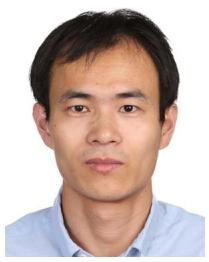

Ning Lin (Member, IEEE) received the B.Sc. and M.Sc. degrees in electrical engineering from Zhejiang University, Hangzhou, China, in 2008 and 2011, respectively, and the Ph.D. degree in electrical and computer engineering from the University of Alberta, Edmonton, AB, Canada, in 2018. From 2011 to 2014, he was an Engineer on a flexible AC transmission system (FACTS) and high-voltage direct current (HVDC) transmission. His research interests include electromagnetic transient simulation, transient stability analysis, real-time simulation, device-level mod-

eling, integrated AC/DC grids, massively parallel processing, heterogeneous high-performance computing of power systems, and power electronics.

Venkata Dinavahi (Fellow, IEEE) received the B.Eng. degree in electrical engineering from the Visvesvaraya National Institute of Technology (VNIT), Nagpur, Nagpur, India, in 1993, the M.Tech. degree in electrical engineering from the Indian Institute of Technology (IIT) Kanpur, Kanpur, India, in 1996, and the Ph.D. degree in electrical and computer engineering from the University of Toronto, Toronto, ON, Canada, in 2000. He is currently a Professor with the Department of Electrical and Computer Engineering, University of Alberta, Edmonton, AB,

Canada. His research interests include real-time simulation of power systems and power electronic systems, electromagnetic transients, devicelevel modeling, large-scale systems, and parallel and distributed computing. He is a Fellow of the Engineering Institute of Canada.