Published in IET Generation, Transmission & Distribution

Received on 5th July 2012

Revised on 9th December 2012

Accepted on 21st December 2012

doi: 10.1049/iet-gtd.2012.0374

  
ISSN 1751-8687

# Multi-FPGA digital hardware design for detailed large-scale real-time electromagnetic transient simulation of power systems

Yuan Chen1, Venkata Dinavahi2

1 RTDS Technologies Inc., 100-150 Innovation Drive, Winnipeg, Manitoba, Canada R3T 2E1   
2 Department of Electrical and Computer Engineering, University of Alberta, Edmonton, Alberta, Canada T6G 2V4 E-mail: dinavahi@ece.ualberta.ca

Abstract: Large-scale electromagnetic transient simulation of power systems in real-time using detailed modelling is computationally very demanding. This study introduces a multi-field programmable gate array (FPGA) hardware design for this purpose. A functional decomposition method is proposed to map FPGA hardware resources to system modelling. This systematic method lends itself to fully pipelined and parallel hardware emulation of individual component models and numerical solvers, while preserving original system characteristics without the need for extraneous components to partition the system. Proof-of-concept is provided in terms of a 3-FPGA and 10-FPGA real-time hardware emulation of a three-phase 42-bus and 420-bus power systems using detailed modelling of various system components and iterative non-linear solution on a 100 MHz FPGA clock. Real-time results are compared with offline simulation results, and conclusions are derived on the performance and scalability of this multi-FPGA hardware design.

# 1 Introduction

In the wake of increased load growth, interconnectivity and stressful operating conditions, many utilities worldwide are employing large-scale real-time electromagnetic transient (EMT) simulators for planning, operation and control of the grid with adequate security and reliability [1–5]. Real-time EMT simulators are widely employed for such applications as testing of advanced protective schemes for lines and generators, testing closed-loop control systems either for conventional power systems or for power electronic-based applications such as high voltage direct current (HVDC), flexible AC transmission systems (FACTs) and distributed generation, and for the training of system operators under realistic scenarios [6–12]. Examples of commercial large-scale real-time EMT simulators include RTDS® [1, 2], ARENE® [13], HYPERSIM® [14], NETOMAC® [15] and RT-LAB® [16]. At their core, these simulators employ sequential processors for model calculation such as digital signal processors (DSPs) or PowerPC® processors in RTDS® and general purpose multi-core x86 central processing units (CPUs) in RT-LAB®. All these simulators are highly extensible by adding additional racks or cluster nodes to existing simulator infrastructure.

In large-scale real-time EMT simulators accuracy and computational efficiency are conflicting requirements that have ramifications in terms of simulator hardware and cost. A realistic reproduction of high-frequency transients requires detailed modelling of power system components and a small simulation time-step. Thus, large system size

entails excessive computational burden. To lower computational burden using simplified modelling or a large time-step would lower fidelity of the simulation. For transient simulation the most pervasive computationally demanding power system components are transmission lines, electrical machines and non-linear elements on account of their frequency dependency, higher model order and iterative algorithmic nature; whereas power electronic apparatus also constitute a higher computational burden (because of higher number of switches) and require smaller time-steps (because of high switching frequency and the need for accounting the switching signals accurately), they tend to be more localised and not as ubiquitous as the other three types of components. Inevitably, to meet real-time constraints and to accommodate large system sizes, a compromise is needed in component model complexity to curtail simulator cost at the expense of accuracy. In such cases simplified modelling of system components is tolerated. Simplified models [17] include Π or travelling wave representation for lines and cables, Thévénin equivalent representation for machines and switched piece-wise linear approximation for non-linear elements.

Parallel processing is extensively used in existing real-time simulators to execute large-scale system models cooperatively on multiple sequential processors. It relies on the fundamental premise that a power system can be decomposed into smaller subsystems because of the natural travel time delay of the transmission line or cable which provides the decoupling necessary for the subsystem calculations to occur without timing conflict [1, 2, 13–20]; thus one or more subsystems

can be assigned to multiple sequential processors which share the computational workload, subject to the condition that the simulation time-step is less than the travel time on the link lines. However, this method has some limitations:

1. If there is no real transmission line or cable connecting any two subsystems or if two neighbouring subsystems are tightly coupled, fictitious lines or cables with travel time are necessary to partition the network. Such artificial lines introduce errors in the frequency response of the simulated transient; although the errors can be compensated or minimised, the location and the length of the link lines still need to be carefully chosen to maintain accuracy.   
2. After executing their respective calculation the sequential processors need to exchange subsystem data with each other at the cost of extra communication latency within the time-step, which limits the achievable bandwidth of the real-time simulator.   
3. The partitioning scheme to divide the original system into smaller subsystems is arbitrary at best, usually based on the experience and the specific requirements of the user, albeit some simulators such as HYPERSIM have an automatic partitioning method.   
4. Based on a given network topology it is quite possible to find a large subsystem, which cannot be decomposed further, leading to uneven computational workload for the processors. In such cases, the overall computational bandwidth of the real-time simulator is limited by the speed of the processor to which the largest subsystem is assigned.

The traditional method for accommodating large network sizes on limited simulator hardware was to use a frequency-dependent network equivalent [21–24], where the original system was divided into a study zone (modelled in detail) and an external system (modelled as lumped RLCG groups derived from approximating the frequency response of the external system at the interfacing port). Although network equivalents are still used in some offline and real-time simulators, the prevailing requirement is to represent the original system in full detail without using simplified equivalents.

Digital hardware emulation of large-scale networks has the potential to alleviate all of the above compromises and uncertainties inherent in large-scale real-time EMT simulation, using the FPGA as the core simulator hardware. The FPGA is increasingly becoming the mainstream hardware for a wide variety of applications [25–29]. This paper proposes a multi-FPGA hardware design for detailed real-time EMT simulation of large-scale systems. Prior work on the modelling and implementation of system transients on FPGAs was limited to a small scale and on a single FPGA; the application of multiple FPGAs for detailed large-scale real-time EMT simulation has not been reported in the literature. A ‘functional decomposition’ method is introduced for allocating the system model calculation to the multi-FPGA hardware resource. The proposed multi-FPGA hardware design for real-time EMT simulation includes detailed models for various components, full Newton solution for non-linear elements and IEEE 32-bit floating-point number representation for high accuracy. The paper is organised as follows: Section 2 describes the system functional components for hardware emulation. Section 3 provides the details of multi-FPGA-based hardware design using functional decomposition for real-time EMT simulation with two case studies. The real-time simulation results are validated using

the offline EMTP software. The performance and scalability analysis for the proposed multi-FPGA hardware design is also given in Section 3. Section 4 presents the conclusions.

# 2 Functional components for hardware emulation of power systems

# 2.1 Functional decomposition method

This method of power system decomposition relies on systematically clustering the model calculation of system components on individual hardware based on the component functionality. As seen in Fig. 1, a generic power system is composed of lines, generators, non-linear elements, loads, buses, circuit breakers etc. In the hardware emulation, the model calculations of each type of system components can be processed in their own processing hardware (PH) simultaneously. For example, all transmission lines are simulated in the specified PH2 hardware module, concurrently with the machines models being simulated in $\mathrm { P H } _ { 3 } .$ . Meanwhile, multiple components of the same type can be pipelined through each PH to increase the throughput for accommodating large system size, allowing a trade-off between hardware resource area and processing speed (simulation time-step). Thus, functional decomposition lends itself to the full exploitation of pipelining and hardware parallelism inherent in an FPGA. Conventional network partitioning using transmission line links is no longer required to simulate a large-scale system. It does not require artificial lines or cables of fixed latency to be inserted, rendering the hardware emulation true to the original system. Since it is independent of the network topology, it removes the uncertainty related to partition boundaries, while allowing detailed modelling of all system components with an even distribution of computational workload. Since system components of the same type are clustered together, this method naturally allows multi-rate simulation, where multiple time-steps can be chosen for various functional types to account for model complexity or to increase computational efficiency.

# 2.2 Components for EMT simulation

The most commonly used components in power systems for EMT simulation are transmission lines/cables, electrical machines, transformers, loads, breakers and non-linear components. This section provides a summary of

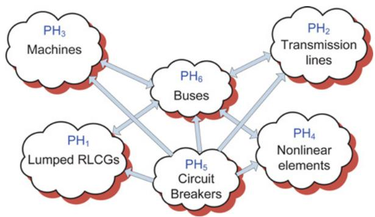  
Fig. 1 Functional decomposition of a power system for hardware emulation

discrete-time equivalents and solution method for these functional components for hardware emulation.

2.2.1 Linear lumped elements: The linear lumped R, L, C elements are used to represent loads, transformers and other equivalent impedances. By applying the trapezoidal rule of integration, the R, L, C, G and their combinations such as RC, RL, LC and RLCG etc. are represented by a common discrete-time model [30], as shown in Fig. 2a, whose v–i characteristic is given as

$$
i (t) = G v (t) + i _ {\mathrm {h R L C G} (t - \Delta t)} \tag {1}
$$

where G is equivalent conductance, and $i _ { \mathrm { h R L C G } } ( t - \Delta t )$ is equivalent history current which is updated at each time-step.

# 2.2.2 Transmission lines and cables

The transmission lines and cables are modelled using the frequency-dependant phase-domain universal line model (ULM) [30, 31]. The ULM is recognised as the most accurate and robust model for both overhead line and underground cable under symmetrical and unsymmetrical

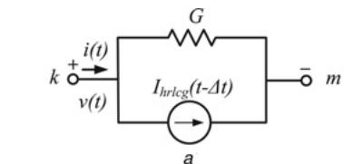

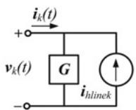

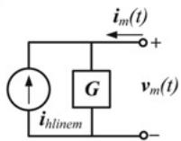

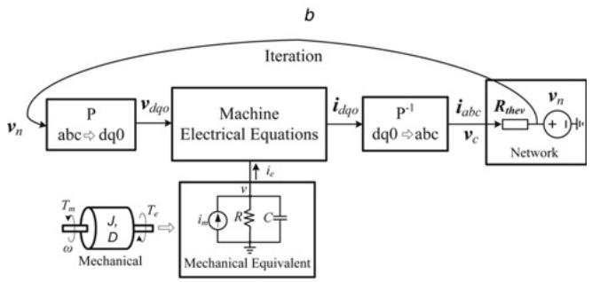

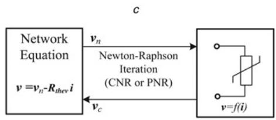

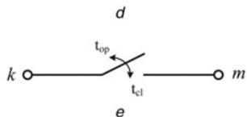  
Fig. 2 Discrete-time equivalents for system functional components

a Lumped elements   
b Universal line model   
c UM model   
d Non-linear element model   
e Switch model

operating conditions. This model is first formulated in the frequency-domain through the characteristic admittance matrix $\dot { Y _ { \mathrm { c } } }$ and propagation function matrix H. In order to implement the model in time-domain, the elements of $Y _ { \mathrm { c } }$ and H are approximated using finite-order rational functions. The (i, j ) element of $Y _ { \mathrm { c } }$ is expressed as

$$
\boldsymbol {Y} _ {\mathrm {c}, (i, j)} (s) = \sum_ {m = 1} ^ {N _ {\mathrm {p}}} \frac {\boldsymbol {r} _ {\boldsymbol {Y} _ {\mathrm {c}} , (i , j)} (m)}{s - \boldsymbol {p} _ {\boldsymbol {Y} _ {\mathrm {c}}} (m)} + \boldsymbol {d} _ {(i, j)} \tag {2}
$$

where $N _ { \mathfrak { p } }$ is the number of poles; $r _ { Y _ { \mathrm { c } } } , p _ { Y _ { \mathrm { c } } } ,$ , and d are the residues, poles, and proportional terms, respectively. The $( i , j )$ element of H is expressed as

$$
\boldsymbol {H} _ {(i, j)} (s) = \sum_ {k = 1} ^ {N _ {g}} \left(\sum_ {n = 1} ^ {N _ {\mathrm {p}, k}} \frac {\boldsymbol {r} _ {\boldsymbol {H} , (i , j) , k} (n)}{s - \boldsymbol {p} _ {\boldsymbol {H} , k} (n)}\right) \mathrm {e} ^ {- s \tau_ {k}} \tag {3}
$$

where $N _ { g }$ denotes the number of propagation modes; $N _ { \mathfrak { p } , k }$ and $\tau _ { k }$ are the number of poles and time delays used for fitting the kth mode; $r _ { H  { k } }$ and $p _ { H } \mathbf { \Omega } _ { k }$ are residues and poles for the kth propagation mode.

The resulting time-domain model of the ULM is given as follows and shown in Fig. 2b

$$
\boldsymbol {i} _ {k} (t) = \boldsymbol {G} \boldsymbol {v} _ {k} (t) - \boldsymbol {i} _ {\text {h l i n e} _ {k}} \tag {4a}
$$

$$
\boldsymbol {i} _ {m} (t) = \boldsymbol {G} \boldsymbol {v} _ {m} (t) - \boldsymbol {i} _ {\text {h l i n e} _ {m}} \tag {4b}
$$

where G is equivalent conductance matrix, and ihline , ihline $\pmb { G }$ $\pmb { i } _ { \mathrm { h l i n e } _ { k } } , \pmb { i } _ { \mathrm { h l i n e } _ { m } }$ are the history currents at sending-end $\cdot _ { k } ,$ k mand receiving-end $\cdot _ { m } ,$ of the line, which are calculated as follows

$$
\boldsymbol {i} _ {\mathrm {h l i n e} _ {k}} = Y _ {\mathrm {c}} * \boldsymbol {v} _ {\mathrm {k}} (\mathrm {t}) - 2 H * \boldsymbol {i} _ {\mathrm {m}} (\mathrm {t} - \tau) \tag {5a}
$$

$$
\boldsymbol {i} _ {\mathrm {h l i n e} _ {m}} = \boldsymbol {Y} _ {\mathrm {c}} * \boldsymbol {v} _ {\mathrm {m}} (\mathrm {t}) - 2 \boldsymbol {H} * \boldsymbol {i} _ {\mathrm {k}} (\mathrm {t} - \tau) \tag {5b}
$$

where the symbol ‘*’ denotes the matrix–vector convolution.

2.2.3 Electrical machines: The rotating machine is modelled using the universal machine (UM) model [32]. The UM model is a sufficiently generalised machine model, which can accurately represent several types of rotating machines for EMT studies. The number of windings on the stator and rotor, and the mechanical parts are fully customisable to model any specific machine. In this paper, an eighth-order UM model is employed. The discrete-time equation for the machine electrical side in the synchronously rotating $d q 0$ frame is given as

$$
\boldsymbol {v} _ {d q 0} (t) = - \boldsymbol {R i} _ {d q 0} (t) - \frac {2}{\Delta t} \boldsymbol {\lambda} _ {d q 0} (t) + \boldsymbol {u} (t) + \boldsymbol {v} _ {\text {h i s t}} \tag {6}
$$

where $\nu _ { d q 0 } , \ i _ { d q 0 } , \ \lambda _ { d q 0 } ,$ , R and u are vectors of voltages, currents, flux linkages, resistances and speed voltages of the windings; Δt is the simulation time-step and $\nu _ { \mathrm { h i s t } }$ is the voltage history term. The mechanical dynamics for the UM are given as

$$
T _ {m} = J \frac {\mathrm {d} \omega}{\mathrm {d} t} + D \omega + T _ {e} \tag {7}
$$

where $J , D , \omega , T _ { m } ,$ and $T _ { e }$ are the moment of inertia, damping coefficient, rotor speed, load torque, and air gap torque, respectively. In the UM the mechanical part is modelled by

an equivalent electric network using lumped $R , L ,$ C elements, as seen in Fig. 2c. The UM model is interfaced with the EMT network solution using the compensation method [17, 28]. As shown in Fig. 2c, when the node voltage vn without machines is ready, it is transferred into the $d q 0$ frame and the machine equations are solved. Then the machine currents are transferred back into the abc frame and superimposed into the network to iteratively solve for the compensated voltage v . The iteration process terminates when the difference between the calculated and predicted ω is within the given tolerance.

2.2.4 Non-linear elements: The common non-linear elements in power systems are non-linear inductances and surge arresters [33]. Based on the different application requirements, the non-linearity can be represented using either a piece-wise linear approximation or direct analytical non-linear function. In both cases, Newton–Raphson (NR) method can be used in a piece-wise manner or continuously to iteratively arrive at the solution [29]. The compensation method is also employed here to solve the linear (10) and non-linear (11) simultaneously, as shown in Fig. 2d

$$
\boldsymbol {v} = v _ {\mathrm {n}} - \boldsymbol {R} _ {\text {t h e v}} \boldsymbol {i} \tag {8a}
$$

$$
\boldsymbol {v} = \boldsymbol {f} (\boldsymbol {i}) \tag {8b}
$$

where $\nu _ { \mathrm { n } }$ is the node voltage computed without the non-linear elements, $R _ { \mathrm { t h e v } }$ is the Thévénin equivalent resistance seen from non-linear elements’ port and f is the non-linear function relating v and i.

Applying the NR method to (8), the current i is solved using

$$
J \left(\boldsymbol {i} ^ {k + 1} - \boldsymbol {i} ^ {k}\right) = v _ {\mathrm {n}} - R _ {\text {t h e v}} \boldsymbol {i} ^ {k} - f \left(\boldsymbol {i} ^ {k}\right) \tag {9}
$$

where J is Jacobian matrix, and $i ^ { k + 1 }$ and $i ^ { k }$ are the current vectors at the (k + 1)th and kth iterations, respectively. To solve (9), a parallel Gauss–Jordan elimination method is employed [34]. After the current i has been obtained, it is superimposed on the linear network to solve for the compensated voltage $\nu _ { \mathrm { c } } .$

2.2.5 Switches: The circuit breaker in the power system is modelled as an ideal time-controlled switch. It opens at time $t _ { \mathrm { o p } }$ or closes at time $t _ { \mathrm { c l } } ,$ as shown in Fig. 2e.

2.2.6 Network solver: The admittance matrix Y of the system is assembled based on the discrete-time equivalents of all the system functional components. Then, the system nodal equation

$$
Y v _ {\mathrm {n}} = i \tag {10}
$$

is solved at every simulation time-step Δt for the node voltage

vector $\nu _ { \mathrm { n } }$ (without the machines and non-linear elements). The current injection vector i is assembled from ${ \dot { \pmb { \imath } } } _ { \mathrm { h l i n e } }$ and ${ \dot { q } } _ { \mathrm { n r l c g } } .$ For computational efficiency of the solution of a large set of linear algebraic equations in real-time, the node voltages were calculated by multiplying the precalculated inverse system nodal admittance matrix $\mathbf { \check { Y } } ^ { - 1 }$ (for various switching events in the system) with the current injections i. Given enough hardware resources, a real-time linear solution based on LU decomposition and forward/backward substitution is also feasible. Meanwhile, since the Y and $Y ^ { - 1 }$ matrices are very sparse for power systems, sparse matrix methods are employed in the matrix–vector multiplication, which reduces memory utilisation and increases the calculation efficiency significantly.

# 2.3 Parallelism and pipelining in functional module hardware emulation

The hardware modules corresponding to the system functional components were implemented in the 65 nm Stratix™ III EP3SL340 FPGA from Altera®, whose logic resources include 270 400 combinational adaptive look-up table (ALUT) (equivalent 340 000 logic elements), 16 272 kbits block memory, 576 18-bit multipliers, 12 phase-locked loops (PLL) and maximum 1104 user input/ output (I/O) pins. The emulated modules include the RLCG module for lumped RLCG elements and transformers, the ULM module for transmission lines and cables, the UM module for machines, the NR module for non-linear elements, the Switch module for circuit breakers, and the Network Solver module was realised solving the network (10). In addition, a Control module was implemented to coordinate the calculations of all the other modules. Since each module is hardware independent with respect to the other, the parallelism between various functional modules is achieved naturally. This means that the processing in all modules can be carried out simultaneously. This is ‘system-level’ parallelism existing in the FPGA-based real-time EMT emulator. Parallelism also exists within each of the functional modules. For example, in the ULM module [28], the calculations at both sending-end and receiving-end was conducted fully in parallel. For multi-phase transmission lines the calculation in each phase was also executed simultaneously. This is ‘module-level’ parallelism.

Table 1 lists the main logic resources utilised by each functional module in the design. As can be seen the ULM module utilises the most logic resources. To emulate a large-scale power system network in real time, hardware parallelism and pipelining need to be exploited on a larger scale, which can be realised by using multiple hardware functional modules; however, as seen from Table 1, this is hard to achieve on a single FPGA because of the limitations of its logic resources. Multiple FPGAs have to be employed

Table 1 FPGA resources utilised by individual system functional modules   

<table><tr><td>Functional module</td><td>Combinational ALUTs</td><td>DSP 18-bit multipliers</td><td>Memory, kbits</td></tr><tr><td>RLCG</td><td>3701 (1.36%)</td><td>8 (1.39%)</td><td>123.16 (0.76%)</td></tr><tr><td>ULM</td><td>44 610 (16.49%)</td><td>96 (16.67%)</td><td>707.27 (4.35%)</td></tr><tr><td>UM</td><td>24 679 (9.12%)</td><td>88 (15.27%)</td><td>870.74 (5.35%)</td></tr><tr><td>NR</td><td>11 729 (4.33%)</td><td>16 (2.78%)</td><td>217.39 (1.33%)</td></tr><tr><td>switch</td><td>124 (0.05%)</td><td>0 (0%)</td><td>0 (0%)</td></tr><tr><td>N/W solver</td><td>2151 (0.79%)</td><td>4 (0.69%)</td><td>43.8 (0.27%)</td></tr><tr><td>control</td><td>200(0.07%)</td><td>0 (0%)</td><td>0 (0%)</td></tr></table>

Fig. 3 Parallelism and pipelining in functional module hardware emulation   
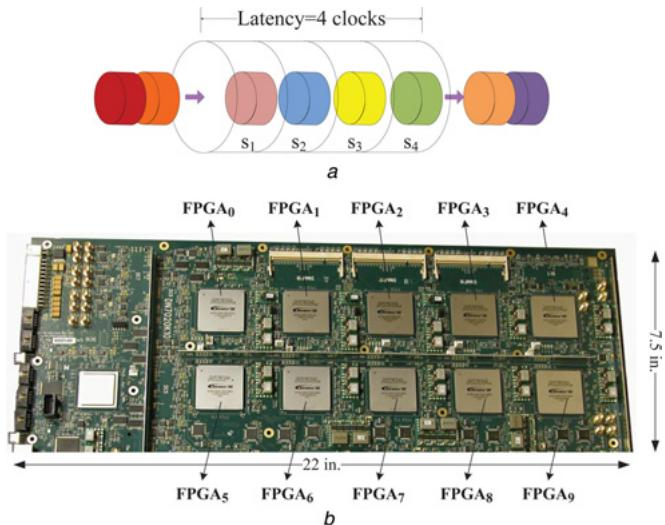  
a Pipeline example with four stages b Multi-FPGA prototyping board

invariably to enable massive parallelism and pipelining for large-scale systems.

Pipelining is another key strategy employed in the proposed design to maximise data throughout. In a pipelined scheme, an implemented function is divided into n stages. Registers are then inserted between these stages to separate the operations within the function, so that data in different stages can be processed simultaneously. After n clock cycles, one result comes out of the pipeline at every clock cycle. If m data are being sent into the pipeline, the total processing time is $( n + m )$ clock cycles. The latency of the pipeline is defined by the number of stages n in terms of clock cycles. An example is shown in Fig. 3, where n is 4 clock cycles and m is 8. In a non-pipelined scheme, the execution time would be $( m \times n )$ clock cycles. In the proposed design, all the hardware modules for the various functional components are deeply pipelined to meet real-time constraints.

# 3 Multiple FPGA-based hardware design for large-scale real-time EMT simulation

Based on the hardware resource utilisation of the individual functional modules, the number of modules of a specific type to replicate and the number of pipelined components per module were decided in the multi-FPGA design. From the EMT user viewpoint there are three main variables for real-time simulation: (i) the simulation time-step Δt, (ii) number of nodes in the modelled system, and (iii) the number of FPGAs employed. These variables influence specific aspects of the real-time EMT simulation: the time-step Δt influences the maximum frequency and accuracy of the simulated transient; the number of nodes influences the size or scale of the system simulated; and the number of FPGAs influences the hardware cost. Accordingly, there are three questions a hardware designer is faced with:

1. For a given system size and hardware configuration, what is the minimum time-step $\Delta t _ { \mathrm { m i n } }$ achievable for real-time EMT simulation?

2. For a given system size and a specified time-step Δt, what is the minimum number of FPGAs required for real-time simulation?   
3. For a fixed hardware configuration and a specified time-step Δt, what is the largest power system network that can be simulated in real time?

The hardware designs presented in this section attempt to reveal the answers to these questions.

The DN7020k10 multi-FPGA board from The Dini $\mathrm { G r o u p } ^ { \textregistered }$ was utilised to realise these designs. This board was populated with ten Altera Stratix III EP3SL340 FPGAs arranged in a 2 × 5 matrix as shown in Fig. 3. Taken together $\mathrm { F P G A _ { 0 }  – F P G A _ { 9 } }$ provide 3 380 000 equivalent logic elements, 162 720 memory kbits and 5760 18-bit multipliers. Ample pin connections are also provided between adjacent FPGAs; each pair of adjacent FPGAs share a maximum of 220 pins for high-speed bidirectional data transfer. A 48-pin bus (MainBus) is connected to all FPGAs. The FPGA interconnects are either single-ended or low voltage digital signal (LVDS). The multi-FPGA board has programmable clock synthesisers (2 kHz–710 MHz), and global clock networks that reach every FPGA. The hardware designs were performed in very highspeed integrated circuit (VHSIC) hardware description language (VHDL) on the host personal computer (PC) using the Altera Quartus II environment. The designs were then compiled, which include synthesis, mapping, placing and routing, on the multi-FPGA architecture. The configuration files (bitstreams) were downloaded from the host PC into the individual FPGAs using the JTAG interface through a USB cable. A 125MSPS digital-to-analogue converter (DAC) board is connected through a high-speed QSE connector to the multi-FPGA board to enable the capture of real-time results on the oscilloscope.

# 3.1 Case study I: 3-FPGA hardware design

This case study shows the design details of a 3-FPGA functionally decomposed real-time EMT simulator. As can be seen in Fig. 4, FPGA0 is fully employed to realise five ULM hardware modules; FPGA1 is used to implement six UM and two NR modules, whereas $\mathrm { F P G A } _ { 2 }$ implements other modules which includes 16 Network Solver, 8 RLCG, 1 Switch and 1 Control modules. This arrangement of the various modules into the three FPGAs minimises the interconnected signals between FPGAs. This is important because on the one hand, the limited FPGA pins cannot support massively parallel data I/O, whereas on the other hand, a multi-FPGA board only neighbouring FPGAs are usually interconnected and support high-speed data transfer, for example, the 225 MHz data transfer for single-ended signals on adjacent FPGAs on the DN7020k10 board. To minimise the I/O bandwidth between FPGAs, the following guidelines employed in the design: (i) fewer FPGAs each with higher logic resource capacity should be used rather than more FPGAs each with small logic resources; (ii) the same type of modules need to be placed in the same FPGA, so the type and the volume of interface signals of each FPGA can be minimised; (iii) the closely related modules are placed in the adjacent FPGAs; and (iv) the data transfer between non-adjacent FPGAs is done via the adjacent FPGAs.

In the 3-FPGA hardware configuration the transferred signals include the node voltages $\nu _ { \mathrm { n } }$ that are calculated in the Network Solver modules in FPGA and are sent to $\mathrm { F P G A } _ { 1 }$ and $\mathrm { F P G A _ { 0 } ; }$ the compensated voltages vc that are

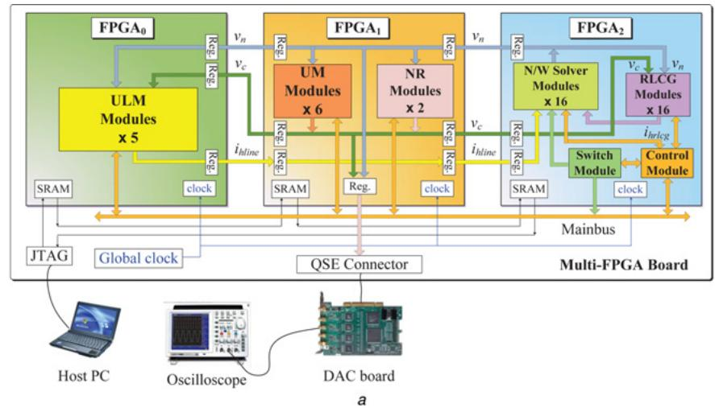

Fig. 4 Case study of a 3-FPGA functionally decomposed real-time EMT simulator   
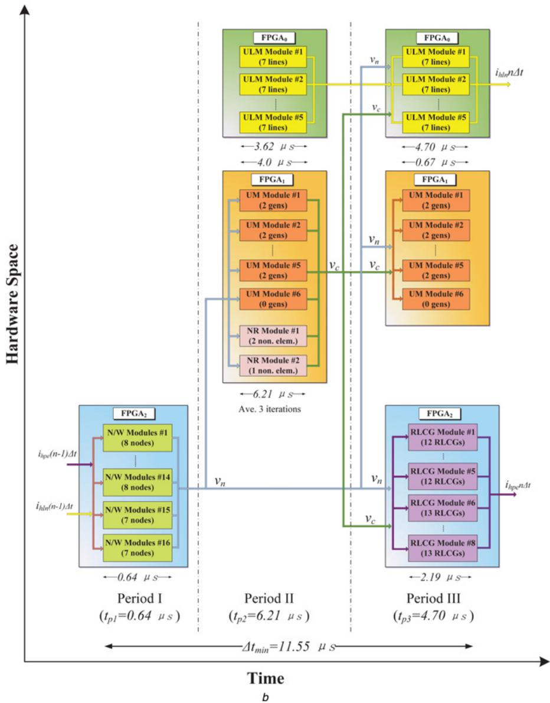  
a 3-FPGA hardware architecture for real-time EMT simulation in Case study I   
b Spatiotemporal design workflow for the 3-FPGA real-time EMT simulator for Case study I

calculated in the UM and NR modules in FPGA and are sent to $\mathrm { F P G A } _ { 0 }$ and $\mathrm { F P G A } _ { 2 } ;$ and the line history currents ${ \dot { \pmb { t } } } _ { \mathrm { h l i n e } }$ that are calculated in the ULM modules in $\mathrm { F P G A _ { 0 } }$ and are sent to

$\mathrm { F P G A } _ { 2 }$ via $\mathrm { F P G A } _ { 1 }$ . Buffer registers are inserted for signal input and output between the three FPGAs. The MainBus is used by the Control module in FPGA to send control

Table 2 Resource utilisation for the 3-FPGA hardware design   

<table><tr><td></td><td>FPGA0</td><td>FPGA1</td><td>FPGA2</td></tr><tr><td>logic utilisation</td><td>96%</td><td>80%</td><td>35%</td></tr><tr><td>combinational ALUTs</td><td>84%</td><td>64%</td><td>27%</td></tr><tr><td>dedicated logic registers</td><td>44%</td><td>37%</td><td>14%</td></tr><tr><td>DSP block 18-bit elements</td><td>83%</td><td>97%</td><td>22%</td></tr><tr><td>block memory bits</td><td>22%</td><td>35%</td><td>17%</td></tr><tr><td>PLLs</td><td>8%</td><td>8%</td><td>8%</td></tr><tr><td>Pins</td><td>13%</td><td>32%</td><td>52%</td></tr><tr><td>fmax, MHz</td><td>100.4</td><td>136.9</td><td>170.8</td></tr></table>

signals and receive acknowledge signals. The Switch module in FPGA2 also uses it to send switch status signals. The logic resource utilisation for this 3-FPGA design is shown in Table 2. As can be seen the hardware space for $\mathrm { F P G A _ { 0 } }$ and $\mathrm { F P G A } _ { 1 }$ are filled to capacity with modules of the specific functional components with little room for further expansion, whereas $\mathrm { F P G A } _ { 2 }$ still has leftover capacity. Table 2 also shows the $f _ { \mathrm { m a x } }$ of each FPGA. The $f _ { \mathrm { m a x } }$ is the maximum clock frequency that the designed hardware can operate at, and it is calculated based on the longest signal path latency in the design. It is obvious that higher the resource utilisation of the FPGA, the lower is the $\breve { f } _ { \mathrm { m a x } } ,$ that is, $f _ { \mathrm { m a x } 0 } < f _ { \mathrm { m a x } 1 } < f _ { \mathrm { m a x } 2 }$ . Although multi-rate simulation could alleviate this situation to some extent in various modules, for simplicity a 100 MHz clock frequency is chosen for all FPGAs in this design.

To test the 3-FPGA hardware design, a 42-bus sample power system shown in Fig. 5 was modelled. It is a modified version of

the IEEE 39-bus New England test system. The parameters of this test system are given in the Appendix. This system consists of 35 three-phase transmission lines modelled using the ULM, 10 three-phase generators modelled using the UM model, 19 three-phase loads modelled using RLCG elements, 11 three-phase transformers modelled using equivalent RLCG elements and 3 series compensation capacitors, resulting in a total of 99 lumped RLCG elements and 3 three-phase non-linear surge arresters which protect 3 series compensation capacitors. The total number of nodes in the network is 126.

The spatiotemporal design workflow to model this system in real-time on the 3-FPGA hardware design is shown in Fig. 4b. As can be seen, the 35 lines are allocated to the five ULM modules with 7 lines pipelined through each module. The ten generators are allocated to the five UM modules with two generators pipelined per module and with one module empty. The 99 RLCG elements are allocated into 8 RLCG modules (12 RLCGs each for the first 5 modules and 13 RLCGs each for the remaining 3 modules). The three surge arresters are allocated to the two NR modules (two in the first module and one in the second). The 126 node voltages are solved in 16 Network Solver modules (8 nodes each in first 14 modules and 7 nodes each in the other 2 modules). Fig. 4b also shows the constitution of a simulation time-step in the 3-FPGA real-time EMT simulator. One simulation time-step Δt has three periods: Period I in which the node voltages $\nu _ { \mathrm { n } }$ (without taking into account the electric machines and non-linear elements) are solved in Network Solver module; Period II in which the UM and NR modules start to solve

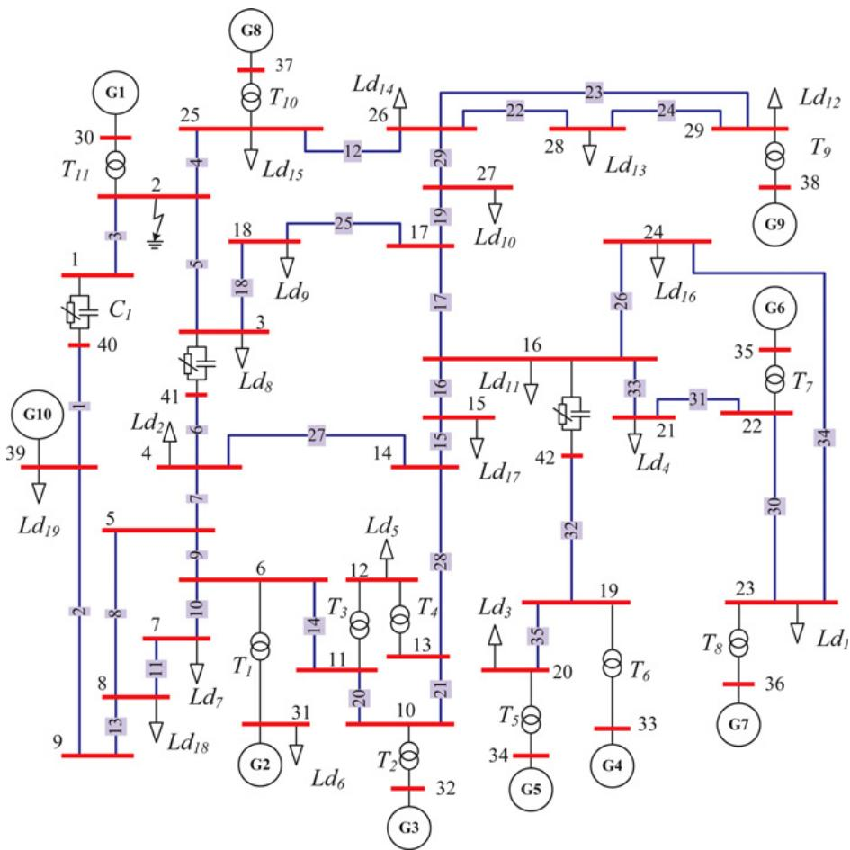  
Fig. 5 Single-line diagram of the power system modelled in Case study I

their respective equations and the compensated voltages $\nu _ { \mathrm { c } }$ are calculated; meanwhile, the ULM modules compute part of their convolutions; and Period III in which the RLCG, UM, and ULM modules update their history terms. The minimum time-step Δt achieved for modelling the system in Fig. 5 in the 3-FPGA hardware design is 11.55 μs, with Period I taking the minimum execution time of 0.64 μs for the Network Solver modules, and Period II taking the maximum execution time of 6.21 μs for the NR modules for an average three iterations for the non-linear solution. In Period II, the execution time is determined by the NR module in $\mathrm { F P G A _ { 1 } , }$ whereas in Period III the execution time is determined by the ULM module in FPGA0. In comparison, the execution time per simulation step of this system modelled in EMTP-RV with Δt = 12 μs running on a PC (AMD Phenom II 955 CPU, 3.2 GHz, 4 cores, 16 GB system memory) is 192 μs.

A three-phase-to-ground fault at Bus 2, which occurs at $t = 0 . 0 5$ s was emulated in the 3-FPGA hardware design. Fig. 6a shows the three-phase voltages waveforms at Bus 1 captured from a real-time oscilloscope connected to the 125MSPS DAC board. The voltage transient lasts about two cycles and its peak value falls from 20 to 15 kV. Similar behaviour can be observed from Fig. 6b, which shows the offline EMTP-RV simulation.

# 3.2 Case study II: 10-FPGA hardware design

This case study utilised all the ten FPGAs to exploit maximum hardware space on the multi-FPGA board. The 10-FPGA hardware architecture is shown in Fig. 8. $\mathrm { F P G A _ { 0 } } ,$ FPGA1 and FPGA2 remain the same as in Case study I. FPGA3 is employed for realising the UM and NR modules as FPGA1. FPGA4 through $\mathrm { F P G A } _ { 9 }$ are employed for realising ULM modules. In Fig. 8, $\nu _ { \mathrm { c l } } , ~ { \nu _ { \mathrm { c } 3 } }$ denote the compensated voltages computed in FPGA1 and FPGA3, respectively, and $\tilde { i _ { F k } } \ \{ k = \stackrel { \cdot } { 0 , } \ 4 , \ 5 , \ 6 , \ 7 , \ 8 , \ 9 \}$ are history current vectors calculated in $\mathrm { F P G A } _ { k } .$ .

A 420-bus large-scale power system shown in Fig. 7 was used to test the 10-FPGA real-time EMT simulator. This system was constructed by replicating the Case study I system ten times and interconnecting using transmission lines. The augmented system consists of:

376 Three-phase transmission lines modelled using the ULM.   
100 Three-phase generators modelled using the UM model.   
190 Three-phase loads modelled using RLCG elements.   
† 110 Three-phase transformers modelled using equivalent RLCG elements with a total 990 lumped RLCG elements.

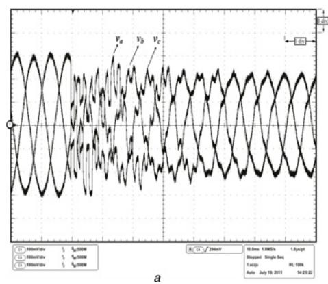

Fig. 6 Three-phase-to-ground fault at Bus 2 in the 3-FPGA hardware design   
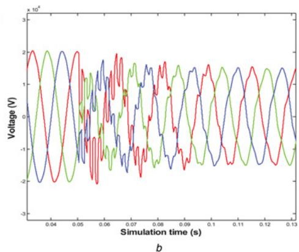  
a Real-time oscilloscope traces and   
b Offline simulation results from EMTP-RV of Bus 1 voltages for a three-phase fault at Bus 2   
Scale: x-axis: 1 div. = 10 ms, y-axis: 1 div. = 6.5 kV

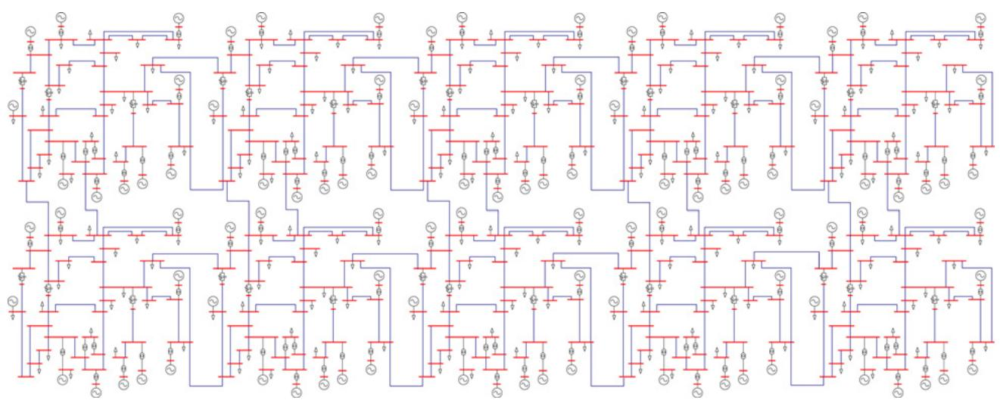  
Fig. 7 Single-line diagram of the power system modelled in Case study II

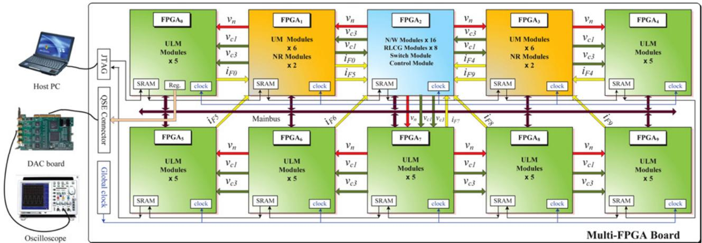  
a

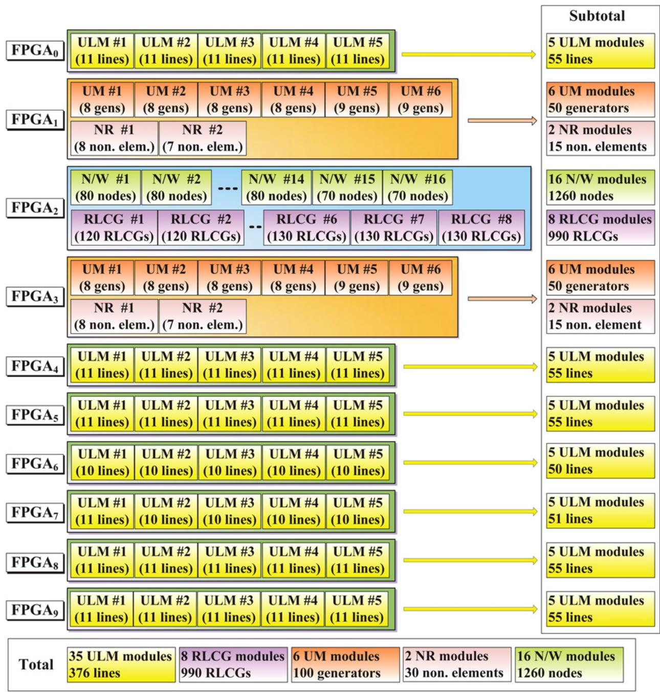  
b   
Fig. 8 Allocation of all system components into the 10-FPGA design a 10-FPGA hardware architecture for real-time EMT simulation in Case study II b Allocation of components of Case study II in the 10-FPGA design

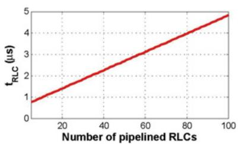

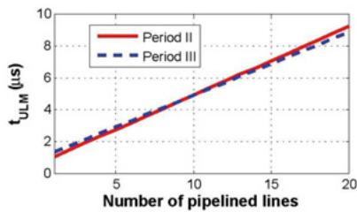

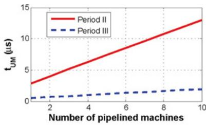

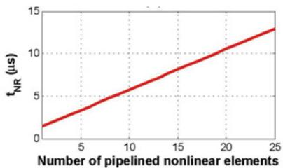

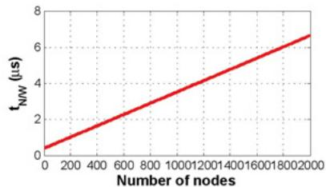  
a

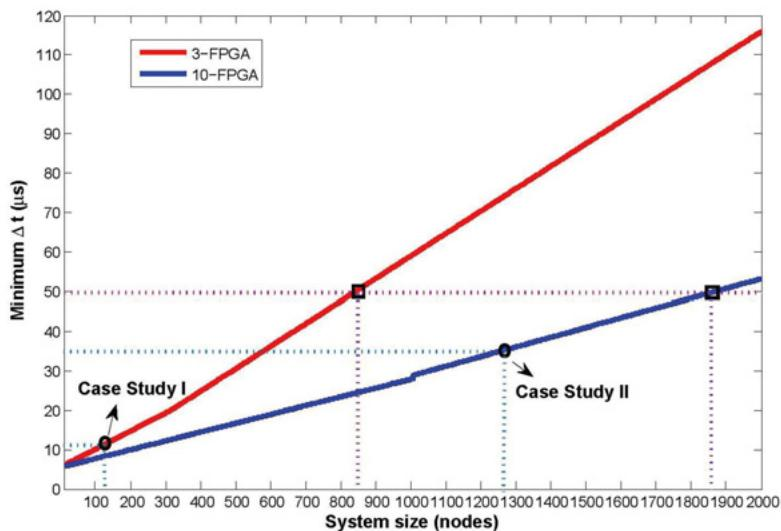  
b

C   
Fig. 9 Performance and scalability of the multi-FPGA real-time hardware emulator   
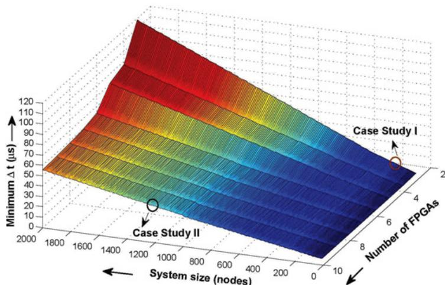  
a Execution time of each functional module with respect to the number of pipelined elements per module in the multi-FPGA real-time EMT simulator b Minimum time-step in the 3-FPGA and 10-FPGA hardware designs for real-time EMT simulation   
c Variation of number of FPGAs with system size and the time-step in the multi-FPGA hardware design

† 30 Three-phase non-linear surge arresters which protect 30 series compensation capacitors.

The number of network nodes in this system is 1260. The allocation of all system components into the 10-FPGA design is shown in Fig. 8 The overall clock frequency driving all FPGAs for the 10-FPGA hardware design was 100 MHz. The achieved minimum time-step Δt for real-time simulation in the 10-FPGA hardware design is 36.12 μs. The execution time per simulation step of EMTP-RV offline simulation is 2120 μs.

# 3.3 Performance and scalability of the multi-FPGA real-time hardware emulator

To answer the three questions posed in Section 3, first a detailed analysis of the time-step is in order. As shown in Figs. 3 and 8b, the simulation time-step Δt can be determined as

$$
\Delta t = t _ {\mathrm {p} 1} + t _ {\mathrm {p} 2} + t _ {\mathrm {p} 3} \tag {11}
$$

where $t _ { \mathrm { p } 1 } , t _ { \mathrm { p } 2 } ,$ and $t _ { \mathrm { p 3 } }$ are the execution times in Periods I, II and III, respectively, which are calculated as

$$
t _ {\mathrm {p} 1} = t _ {\mathrm {N W}} \tag {12a}
$$

$$
t _ {\mathrm {p} 2} = \max  \left\{t _ {\mathrm {U L M}}, t _ {\mathrm {U M}}, t _ {\mathrm {N R}} \right\} _ {\mathrm {p} 2} \tag {12b}
$$

$$
t _ {\mathrm {p} 3} = \max  \left\{t _ {\mathrm {U L M}}, t _ {\mathrm {U M}}, t _ {\mathrm {R L C G}} \right\} _ {\mathrm {p} 3} \tag {12c}
$$

where tNW, tULM, tUM, tNR, tRLCG are execution times for Network Solver module, ULM module, UM module, NR module and RLCG module, respectively. The execution time for each module is calculated according to the total hardware latency of the module and pipelined components fed into the module. For example, $t _ { \mathrm { U L M } }$ in Period II can be determined as

$$
t _ {\mathrm {U L M}} = (3 4 + 8 * N _ {\mathrm {l i n e}}) * T _ {\mathrm {f}} \tag {13}
$$

where the number $\cdot 3 4 ^ { \cdot }$ denotes the total hardware latency in terms of clock cycles; $N _ { \mathrm { l i n e } }$ is the number of lines pipelined into the module and $T _ { \mathrm { f } }$ is the working clock period of FPGA (10 ns in this design). The number $\cdot _ { 8 } \cdot $ is related to the assumption that each transmission line has a 9th-order $( N _ { \mathrm { p } } { = } 9$ in (2)) fitted rational functions for the characteristic admittance matrix and the total 13th order $( N _ { p , 1 } = 4$ and $N _ { \mathfrak { p } , 2 } = 9$ in (3)) of fitted rational functions in $2 \ ( N _ { g } = 2$ i n (3)) propagation modes for the propagation function matrix. The execution time of the ULM module in Periods II and III with respect to the number of lines pipelined through the module is plotted in Fig. 9a. Similarly, Fig. 9a shows tRLCG with respect to the number of RLCG elements; $t _ { \mathrm { U M } }$ with respect to the number of machines; $t _ { \mathrm { N R } }$ with respect to the number of non-linear elements; and t with respect to the number of network nodes.

The performance of the proposed multi-FPGA hardware design was investigated by the minimum time-step with respect to the simulated system size. Case study I test system (Fig. 5) is used as a reference system to determine the number of RLCG elements, transmission lines, machines, and non-linear elements with respect to the system size quantified in terms of the number of network

nodes. Based on this information, the minimum time-step was calculated for a given size of power system, as shown in Fig. 9b. As can be seen in this figure, the minimum time-step of 11.55 and 36.12 μs are achieved for Case study I for a system of 126 nodes in the 3-FPGA design and Case study II for a system of 1260 nodes in the 10-FPGA design, respectively. Fig. 9c also shows the largest system size that can be simulated with a specified time-step. For example, with a 50 μs time-step using detailed modelling a system of 850 nodes can be simulated on the 3-FPGA design, whereas a system of 1860 nodes can be simulated on the 10-FPGA hardware design. Note that with simplified models much larger systems can be simulated with the same time-step.

The number of FPGAs required to carry out real-time EMT simulation varies with the specific time-step and the given system size. Fig. 9c shows the surface plot of the variation of number of FPGAs required with respect to system size, and the minimum time-step achieved. This plot shows the possible combinations of these three variables, and the two case studies presented before represent two extremities of this three-dimensional surface. Clearly, the variation of the minimum time-step is non-linear with respect to the system size and the number of FPGAs used.

The slope of $\Delta t _ { \mathrm { m i n } }$ against system size curve tends to decrease as the number of FPGAs increases. In general, for a fixed large-scale system size employing more FPGAs would allow to achieve a lower time-step for real-time EMT simulation but with diminishing returns. Nevertheless, the achieved time-step would be so small as to allay any concerns related to detailed system modelling. Meanwhile, larger and faster FPGAs would allow more parallel functional modules to be emulated, and would also raise the maximum frequency $( f _ { \mathrm { m a x } } )$ of the design, which will ultimately lead to further reduction of time-step.

# 4 Conclusions

Hardware emulation on FPGAs makes it possible to overcome many of the limitations related to the real-time EMT simulation of large-scale power systems by allowing the user to achieve such level of detail that is seldom achieved on traditional sequential processors. This paper proposed a multi-FPGA design based on the functional decomposition methodology for hardware emulation of systems using detailed modelling of the individual components. The functional decomposition method circumvents the need for artificial lines for dividing the system, reduces subsystem communication latencies and is independent of a specific partitioning scheme. Furthermore, this method is suited for achieving full parallelism and pipelining in the implemented system modules on the FPGAs. Although a single time-step is chosen to illustrate this method, multi-rate simulation with multiple time-steps for various functional components is clearly possible. Two case studies involving a three-phase 42-bus and a 420-bus power systems are presented to analyse the performance of the proposed hardware design with detailed modelling of the power system components. The achieved minimum time-steps for these systems are 11.55 and 36.12 μs on the 3-FPGA and the 10-FPGA hardware designs, respectively, on a clock frequency of 100 MHz. Smaller time-steps and even larger system sizes can be easily achieved as the design is fully scalable and extensible for an FPGA cluster. Every new generation of FPGA technology features devices

with significant increase in logic resource count and clock speed, which should satisfy even the most demanding real-time EMT simulation.

# 5 Acknowledgment

Financial support from the Natural Science and Engineering Research Council of Canada (NSERC) is gratefully acknowledged.

# 6 References

1 McLaren, P.G., Kuffel, R., Wierckx, R., Giesbrecht, J., Arendt, L.: ‘A real time digital simulator for testing relays’, IEEE Trans. Power Deliv., 1992, 7, pp. 207–213   
2 Kuffel, R., Giesbrecht, J., Maguire, T., Wierckx, R.P., McLaren, P.: ‘RTDS-a fully digital power system simulator operating in real time’. Proc. First Int. Conf. Digital Power System Simulators (ICDS 1995), April 1995, pp. 19   
3 Jakominich, D., Krebs, R., Retzmann, D., Kumar, A.: ‘Real time digital power system simulator design considerations and relay performance evaluation’, IEEE Trans. Power Deliv., 1999, 14, pp. 773–781   
4 Luz, G.S., de Macedo, N.P., de Oliveira, V.R.: ‘FURNAS TCSC-an example of using different simulation tools for performance analysis’. Proc. of the IPST’2001, Rio de Janeiro, June 2001, pp. 1–6   
5 Kuffel, R., Wierckx, R., Kim, T.-K.: ‘Development and testing of a large scale digital power system simulator at KEPCO’. Proc. Int. Power Systems Transients Conf. (IPST’2001), Rio de Janeiro, Brazil, June 2001, pp. 704–709   
6 Brandt, D., Wachal, R., Valiquette, R., Wierckx, R.: ‘Closed loop testing of a joint VAR controller using a digital real-time simulator’, IEEE Trans. Power Syst., 1991, 6, (3), pp. 1140–1146   
7 Dinavahi, V., Iravani, R., Bonert, R.: ‘Real-time digital simulation of power electronic apparatus interfaced with digital controllers’, IEEE Trans. Power Deliv., 2001, 16, (4), pp. 775–781   
8 Forsyth, P., Maguire, T., Kuffel, R.: ‘Real time digital simulation for control and protection system testing’. Proc. of the IEEE 35th Power Electronics Specialists Conf. (PESC 2004), June 2004, vol. 1, pp. 329–335   
9 Li, H., Steurer, M., Woodruff, S., Shi, L., Zhang, D.: ‘Development of a unified design, test, and research platform for wind energy systems based on hardware-in-the-loop real-time simulation’, IEEE Trans. Ind. Electron., 2006, 53, (4), pp. 1144–1151   
10 Parma, G.G., Dinavahi, V.: ‘Real-time digital hardware simulation of power electronics and drives’, IEEE Trans. Power Deliv., 2007, 22, (2), pp. 1235–1246   
11 Forsyth, P., Kuffel, R.: ‘Utility applications of a RTDS simulator’. Proc. Int. Power Electronics Specialists Conf. (IPEC’2007), December 2007, pp. 112–117   
12 Pak, L.-F., Dinavahi, V.: ‘Real-time simulation of a wind energy system based on the doubly-fed induction generator’, IEEE Trans. Power Syst., 2009, 24, (3), pp. 1301–1309   
13 Devaux, O., Levacher, L., Huet, O.: ‘An advanced and powerful real-time digital transient network analyzer’, IEEE Trans. Power Deliv., 1998, 13, pp. 421–426   
14 Do, V.Q., Soumagne, J.C., Sybille, G., et al.: ‘HYPERSIM, an integrated real-time simulator for power network and control systems’. Proc. Int. Conf. Digital Power System Simulators (ICDS 1999), Vasteras, Sweden, May 1999, pp. 1–6   
15 Krebs, R., Ruhle, O.: ‘NETOMAC real-time simulator – a new generation of standard test modules for enhanced relay testing’, Proc. IEEE Int. Conf. on Development in Power System Protection, April 2004, vol. 2, pp. 669–674   
16 Bélanger, J., Snider, L.A., Paquin, J.N., Pirolli, C., li, W.: ‘A modern and open real-time digital simulator of contemporary power systems’. Proc. Int. Conf. on Power Systems Transients (IPST’2009), Kyoto, Japan, June 2009, pp. 1–10   
17 Dommel, H.W.: ‘EMTP theory book’ (BPA, 1984)   
18 Wang, X., Woodford, D.A., Kuffel, R., Wierckx, R.: ‘A real-time transmission line model for a digital TNA’, IEEE Trans. Power Deliv., 1996, 11, (2), pp. 1092–1097   
19 Hollman, J.A., Marti, J.R.: ‘Real-time network simulation with PC-cluster’, IEEE Trans. Power Syst., 2003, 18, (2), pp. 563–569   
20 Forsyth, P.A., Maguire, T.L., Shearer, D., Rydmell, D.: ‘Testing firing pulse controls for a VSC-based HVDC scheme with a real time timestep < 3 μs’. Proc. Int. Conf. on Power Systems Transients (IPST’2009), Kyoto, Japan, June 2009, pp. 1–5

21 Abdel-Rahman, M., Semlyen, A., Iravani, R.: ‘Two-layer network equivalent for electromagnetic transients’, IEEE Trans. Power Deliv., 2003, 18, (4), pp. 1328–1335   
22 Nie, X., Chen, Y., Dinavahi, V.: ‘Real-time transient simulation based on a robust two-layer network equivalent’, IEEE Trans. Power Syst., 2007, 22, (4), pp. 1771–1781   
23 Xi, L., Gole, A.M., Yu, M.: ‘A wide-band multi-port system equivalent for real-time digital power system simulators’, IEEE Trans. Power Syst., 2009, 24, (1), pp. 237–249   
24 Matar, M., Iravani, R.: ‘A modified multiport two-layer network equivalent for the analysis of electromagnetic transients’, IEEE Trans. Power Deliv., 2010, 25, (1), pp. 434–441   
25 Chen, Y., Dinavahi, V.: ‘FPGA-based real-time EMTP’, IEEE Trans. Power Deliv., 2009, 24, (2), pp. 892–902   
26 Myaing, A., Dinavahi, V.: ‘FPGA-based real-time emulation of power electronic systems with detailed representation of device characteristics’, IEEE Trans. Ind. Electron., 2011, 58, (1), pp. 358–368   
27 Monmasson, E., Idkhajine, L., Naouar, M.W.: ‘FPGA-based controllers’, IEEE Ind. Electron. Mag., 2011, 5, (1), pp. 14–26   
28 Chen, Y., Dinavahi, V.: ‘Digital hardware emulation of universal machine and universal line models for real-time electromagnetic transient simulation’, IEEE Trans. Ind. Electron., 2012, 59, (2), pp. 1300–1309   
29 Chen, Y., Dinavahi, V.: ‘An iterative real-time nonlinear electromagnetic transient solver on FPGA’, IEEE Trans. Ind. Electron., 2011, 58, (6), pp. 2547–2555   
30 Dommel, H.W.: ‘Digital computer solution of electromagnetic transients in single and multiphase networks’, IEEE Trans. Power Appar. Syst., 1969, 88, (4), pp. 388–399   
31 Morched, A., Gustavsen, B., Tartibi, M.: ‘A universal model for accurate calculation of electromagnetic transients on overhead lines and underground cables’, IEEE Trans. Power Deliv., 1999, 14, (3), pp. 1032–1038   
32 Lauw, H.K., Scott Meyer, W.: ‘Universal machine modeling for the representation of rotating electric machinery in an electromagnetic transients program’, IEEE Trans. Power Appar. Syst., 1982, 101, (6), pp. 1342–1350   
33 Dommel, H.W.: ‘Nonlinear and time-varying elements in digital simulation of electromagnetic transients’, IEEE Trans. Power Appar. Syst., 1971, 90, (4), pp. 2561–2567   
34 Chen, Y.: ‘Large-scale real-time electromagnetic transient simulation of power systems using hardware emulation on FPGAs’. PhD Dissertation, University of Alberta, March 2012, pp. 1–129

# 7 Appendix

The parameters for the power system in Fig. 5 are given below:

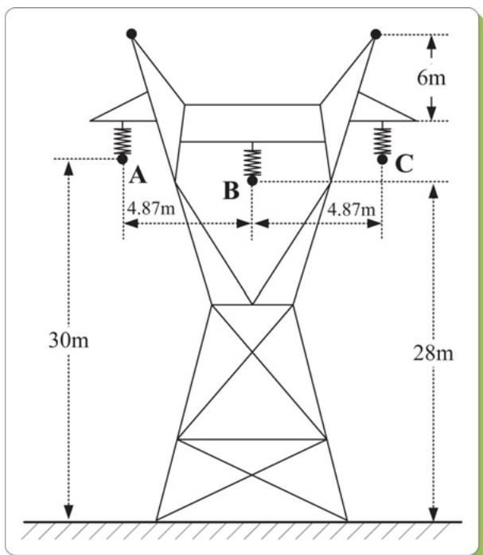  
Fig. 10 Tower geometry of transmission lines in the case studies

1. ULM transmission line (Line1–Line35) parameters: three conductors, resistance: 0.0583/km, diameter: 3.105 cm, line length: 50 km (line 5, 6, 7, 8, 15, 16, 18, 19, 23, 27, 29, 30, 31, 35), 150 km (line 2, 3, 4, 9, 10, 11, 13, 14, 20, 21, 22, 24, 25, 26, 32, 33) and 500 km (line 1, 12, 17, 28, 34). Y and H are 3 × 3 matrices, whose elements are approximated with 9th-order and 13th-order rational functions respectively. The tower geometry is shown in Fig. 10.   
2. UM synchronous machine (G1–G10) parameters: 1000 MVA, 22 kV, Y-connected, field current: 2494 A, two

poles, 60 Hz, moment of inertia: $5 . 6 2 8 \times 1 0 ^ { 4 }$ kg·m2 /rad and damping: $6 . 7 8 0 \times 1 0 ^ { 3 }$ kg·m/s/rad. The winding resistances and leakage reactances (Ω) are listed in Table 3.

3. Surge arresters: These are non-linear resistors characterised by the equation $i { = } p ( ( \nu ) / ( V _ { \mathrm { r e f } } ) ) ^ { q }$ where q is the exponent, and $V _ { \mathrm { r e f } }$ and p are arbitrary reference values. $q = 6 , \stackrel { \cdot } { V } _ { \mathrm { r e f } } = 8 1 9 2 \mathrm { V } , p = 6 0 0 \mathrm { A }$ .   
4. Loads and transformer parameters: load parameters R = 500Ω, L = 0.05H, C = 1 μF, and transformer leakage impedance $R _ { \mathrm { T } } { = } 0 . 5 \Omega , L _ { \mathrm { T } } { = } 0 . 0 3 \mathrm { H }$ .

Table 3 UM machine parameters   

<table><tr><td>Rd</td><td>9.680 × 10-4</td><td>Rq</td><td>9.680 × 10-4</td><td>R0</td><td>9.680 × 10-4</td></tr><tr><td>Rf</td><td>1.111</td><td>RD1</td><td>3.499</td><td>RD2</td><td>5.571</td></tr><tr><td>RO1</td><td>7.627 × 10-1</td><td>RO2</td><td>1.227</td><td>RO3</td><td>2.096 × 102</td></tr><tr><td>Xd</td><td>6.747 × 10-1</td><td>Xq</td><td>6.549 × 10-1</td><td>X0</td><td>9.099 × 10-2</td></tr><tr><td>Xf</td><td>2.392 × 102</td><td>XD1</td><td>2.067 × 102</td><td>XD2</td><td>5.571</td></tr><tr><td>Xdf</td><td>8.821</td><td>XdD1</td><td>8.821</td><td>XdD2</td><td>8.821</td></tr><tr><td>XD1D2</td><td>2.066 × 102</td><td>Xfd1</td><td>2.066 × 102</td><td>Xfd2</td><td>2.099 × 102</td></tr><tr><td>XQ1</td><td>4.453 × 102</td><td>XQ2</td><td>2.218 × 102</td><td>XQ3</td><td>2.096 × 102</td></tr><tr><td>XqQ1</td><td>8.521</td><td>XqQ2</td><td>8.521</td><td>XqQ3</td><td>8.521</td></tr><tr><td>XQ2Q3</td><td>1.577 × 102</td><td>XQ1Q2</td><td>1.577 × 102</td><td>XQ1Q3</td><td>1.577 × 102</td></tr></table>