# Comprehensive Full-Scale Converter Wind Park Initialization for Electromagnetic Transient Studies

Juan Antonio Ocampo-Wilches , Member, IEEE, Jean Mahseredjian , Life Fellow, IEEE, Keijo Jacobs , Ahda G. Pavani , Senior Member, IEEE, and Haoyan Xue , Senior Member, IEEE

Abstract—This paper proposes a comprehensive method for initializing the electromagnetic transient models of full-scale converter wind parks. The method uses the ac load-flow solution to initialize the mechanical model, the electrical components, the machine, the converter and the control systems. The effectiveness of the method is demonstrated through EMT simulations of three different power system benchmarks: an aggregated WP connected to a small transmission grid, a detailed WP model with wind turbines connected to a small transmission grid, and a large-scale transmission grid with ten different aggregated WPs. The results show that the proposed method reduces computing times required to reach steady-state and consequently accelerates overall simulations.

Index Terms—Initialization, full-size converter, wind park, large-scale power system, steady-state, electromagnetic transients.

# I. INTRODUCTION

R ECENTLY, power system oscillations originating fromthe interaction of wind parks (WPs) with other system components, have compromised the stable operation of transmission grids [1]. The growing number of WPs connected to power systems necessitates fast and accurate electromagnetic transient (EMT-type) simulation models to ensure their safe and reliable operation [2]. There are ongoing efforts to develop generic, non-proprietary, EMT-type models for WPs, that can capture all performance aspects as detailed as manufacturerspecific models [3], [4].

The initial conditions of most grid component models can be derived from the load-flow (LF) solution [5], [6], [7]. The EMT models can be used to directly provide a multiphase and unbalanced load-flow solution [8], [9], and techniques such as the modified-augmented nodal analysis (MANA) have proven to be generic and efficient multiphase load-flow solution methods for such applications [9], [10].

Received 16 July 2024; revised 27 December 2024; accepted 9 March 2025. Date of publication 3 April 2025; date of current version 19 May 2025. Paper no. TPWRD-01168-2024. (Corresponding author: Juan Antonio Ocampo-Wilches.)

Juan Antonio Ocampo-Wilches, Jean Mahseredjian, Keijo Jacobs, and Haoyan Xue are with the Department of Electrical Engineering, Polytechnique Montreal, Montreal, QC H3T1J4, Canada (e-mail: juan-antonio.ocampo-wilche s@polymtl.ca; jean.mahseredjian@polymtl.ca; keijo.jacobs@polymtl.ca; haoy an.xue@polymtl.ca).

Ahda G. Pavani is with the Federal University of ABC (UFABC), Santo André 09280-560, Brazil (e-mail: ahda.pavani@ufabc.edu.br).

Color versions of one or more figures in this article are available at https://doi.org/10.1109/TPWRD.2025.3551546.

Digital Object Identifier 10.1109/TPWRD.2025.3551546

However, the initialization can be challenging for power electronic grid components with complex control systems, such as WPs. Incorrect initial conditions can lead to erroneous steadystate operation modes, delays in achieving the desired steadystate operating point, improper activation of protection devices, and sometimes, saturation or lasting oscillations before reaching the desired operating point [11].

The comprehensive initialization of the full-scale converter (FSC) WP EMT model has not been thoroughly addressed in previous studies. The steady-state conditions for the converter control system, the mechanical and electrical machine models cannot be derived directly from the load-flow solution, and additional computations are necessary. Most methods in the literature do not account for practical and realistic WP systems, including detailed converter and wind park controllers (WPC).

In [12], a WT initialization method is proposed for electromechanical stability simulations. However, the presented technique does not consider the converter model, filters, wind park control or external components. Besides, the initialization of the generator is described based on the model equations. However, complete access to the variables of the generator is not always given.

The initialization methods for DFIG-based WP models presented in [13] and [14] are based on the analytical solution of a set of equations, including the induction machine, turbine, and converter equations. The initialization proposed in [15] uses the load-flow solution with an iterative method to compute the steady-state values. However, these methods do not address essential constraints imposed by realistic WP systems and commercial EMT-simulation software, as they do not include the initialization of control systems, converters, and the wind park controller (WPC). Thus, the existing initialization methods for DFIG WP systems do not offer solutions that can be adapted to FSC WP systems.

For PV parks, an initialization technique based on a chain matrix is proposed in [16]. The method is not directly applicable or compatible with typical solutions employed in EMT-simulation tools, since a secondary iterative method will be required to calculate the equivalent model at the point of interconnection (POI) increasing the computing time. In [17], a procedure to compute the steady-state solution for portions of the electric circuit and the control system of PV systems is presented. This paper, however, does not provide details on the converter initialization. Furthermore, it does not consider unbalanced LF considerations, and it requires different implementations for

each outer control mode, i.e., it is not generic. In [18], a backward propagation method that calculates the internal parameters of the controllers based on the POI parameters for the initialization of a modular multilevel converter (MMC) is proposed. However, additional work is required to apply the method to WPs.

An existing initialization solution used for FSC-WP is the LF and source initialization (LFSI) [19]. In this technique, the WP is disconnected from the power grid that is temporarily connected to an ideal voltage source during the initialization. Critical control systems, such as the PLL and the grid-side controller, are initialized by a backward propagation method based on the method proposed in [18] for initializing MMC. The LFSI solution is practical and effective in allowing WP initialization without inducing large transients to the power grid. Besides, it does not need to access the internal variables of the electrical machine model, which may not be available in models provided by commercial software. However, the initialization of the converter and the electrical machine requires several time-points in time-domain simulation to achieve steady-state. Consequently, the initialization technique has room for improvement, particularly regarding the converter initialization.

In this paper, a novel comprehensive initialization method, called the Full Control Initialization (FCI) method, is proposed for FSC WPs. This method is designed for a generic FSC WP EMT-model. It encompasses the WPC, the wind turbine controller (WTC), the machine, the mechanical model, and various electrical components such as the collector grid, filter, and converter. The approach utilizes backward propagation to initialize the controllers. Furthermore, a unique technique is employed for the converters and permanent-magnet synchronous machine (PMSM). In addition, to its suitability for generic models, the proposed method is easily adaptable for various EMT-type simulation tools, as it does not require access to internal variables of the electrical machine model. The proposed technique is compared to the existing LFSI method through EMT simulation of three power system models with varying WPs, detail and scale.

This paper is organized as follows. Section II explains the WP model configuration and control system. Section III is allocated to presenting the LFSI and the proposed initialization methods. Finally, Section IV compares the performance of the proposed method with the currently available method LFSI.

# II. FULL-SCALE CONVERTER WIND PARK MODEL

The generic EMT-model of FSC WP [3], depicted in Fig. 1, is adopted as a reference in this paper. It uses an aggregated representation, i.e., all WTs in the park are considered by one single model, and the filters and the collector grid are averaged and scaled to fit the WP rating. The model consists of the

- mechanical model of the wind turbine   
- PMSM   
ac-dc-ac converter, consisting of the machine-side converter (MSC) and the grid-side converter (GSC) using the average-value model (AVM),   
- filter and the collector grid [20], [21] and   
- pitch control, described in [22], [23],

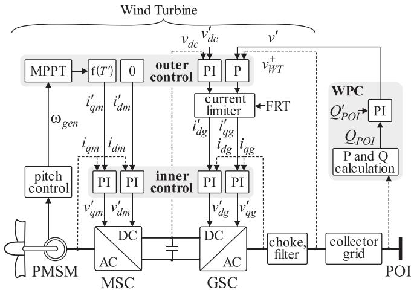  
Fig. 1. FSC WP model (frame transformations of signals are omitted).

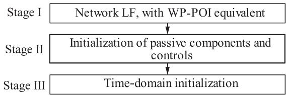  
Fig. 2. Wind Park initialization procedure.

- inner and outer control of MSC and GSC,   
- central WPC.

The WPC is responsible for reactive power output regulation at the POI. It can be configured in either voltage- (V), reactive power- (Q), power factor- (PF) or Q-V curve control, depending on the requirements of the grid [23], [24]. The requirement will result in a reference of reactive power $( Q _ { P O I } ^ { \prime } )$ for the WPC, which is used to provide a reference for voltage (v- ) for the WTC. The voltage and the frequency are monitored by the WPC using a phase-locked loop (PLL).

The WTC, consisting of outer and inner control for the MSC and the GSC, is implemented as vector control. The MSC controls the PMSM speed to reduce mechanical wear and controls the active power depending on the wind speed. The GSC control q-frame handles the reactive power or grid voltage [3], and the d-frame maintains the dc-link voltage.

# III. WIND PARK INITIALIZATION

The initialization can be divided into three stages, as presented in Fig. 2.

Stage I performs the LF solution, determining the steady-state operating condition of the grid and the WP. The LF results provide the required phasors everywhere in the studied system. The WPs and other active sources are modeled as LF constraints.

Stage II uses the results from the LF solution to perform a steady-state solution where the LF constraints are replaced by lumped models. The WPs are modeled as ideal voltage sources and some other sources (synchronous machines, for

example) are given their equivalent steady-state models. At this stage all passive components are initialized. The control systems are initialized according to required steady-state conditions. Initialization is performed by setting all history terms in models for their following time-domain equivalents.

Stage III performs the time-domain simulation to achieve the system’s steady-state response as soon as possible. The computed steady-state voltage and power values are used to determine the converter currents in different axes (dq decomposition), which are then used for initializing the WP controls.

In both initialization methods presented in this paper, all initial values are derived from an LF solution. As the LF method is not the subject of this work, further details can be found in [9] and [10]. The LF solution provides the voltage, active and reactive powers at POI without the internal components of the wind park model that are disconnected from the system before the time-domain simulation, which enables to compute the converter currents in the different axes. Then, these values are used for the initialization of controls.

The challenge in initializing controllers arises from the time the integrators require to reach a steady-state value, which is at least a period. However, this usually requires significantly more time in practice since erroneous initial conditions (setting initial integrator values to zero, for example) immediately affect MSC and GSC. Therefore, even if electrical components are initialized correctly, the control action will deviate from the LF initialization values. The integrators should be initialized at their steady-state values to avoid this condition. The initial value for the integrator is called history term H, and can be calculated using the backward propagation method [18].

Another challenge is the initialization of the mechanical system and the PMSM. As the internal variables of PMSM models and other machine models available in EMT-type simulation tools are inaccessible, their initialization requires a time-domain initialization stage.

Two methods are described below. The first method is named LFSI, and is currently used to initialize FSC WPs in EMTP [5]. It is important to emphasize that although the LFSI method has never been described before in detail and constitutes also a contribution in this paper. The FCI method is the main new contribution in this paper, as explained below.

# A. LF and Source Initialization (LFSI)

In the LFSI method [19], during the initialization, the WP is disconnected from the power grid and temporarily connected to an ideal voltage source for a time $t _ { i n i t 2 }$ , with magnitude and angle values found from the LF solution. The general scheme for the LFSI is presented in Fig. 3. The voltage source connected to the power system prevents the transients from the WP from propagating to the power system.

Firstly, in Stage II, the initialization of grid-side control systems, including the PLL, is performed. Since the system is assumed to be in steady-state at the beginning of the time-domain simulation, all time derivatives in the control equation are set to

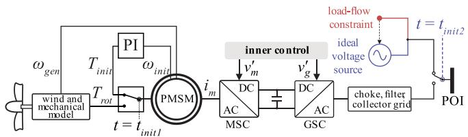  
Fig. 3. LF and source initialization for the LFSI technique.

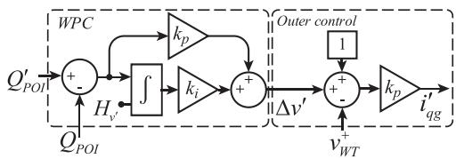  
Fig. 4. Control diagram of WPC and WTC, including initialization with history term $H _ { v ^ { \prime } }$ .

zero [12]. The history terms are initialized as further described in subsections 1 to 4.

In Stage III, as it is not possible to impose a current value on the internal variables of the PMSM model, the PMSM rotor is initialized via an auxiliary PI controller loop, as shown in Fig. 3. The initial torque, $T _ { i n i t }$ , applied to the generator is calculated from an initial nominal speed, $\omega _ { i n i t }$ based on the characteristics of the WT parameters and the wind speed, as explained in [25]. The auxiliary PI controller is active for the predefined time, $t < t _ { i n i t 1 }$ , and at $t _ { i n i t 1 }$ the mechanical system is connected to the PMSM rotor. This procedure minimizes the transients due to the mechanical system’s connection to the PMSM.

The last step for this method is the WP reconnection to the power system at $t _ { i n i t 2 }$ by switching from the ideal voltage source. At this point, the variables are closer to the steady-state values, and minimum transients are observed due to the reconnection. The delays $t _ { i n i t 1 }$ and $t _ { i n i t 2 }$ are typically defined as 300 ms and 400 ms, respectively. It is important to note that the GSC and the PLL control systems are initialized in Stage II of Fig. 2, as described below.

1) WPC Initialization: The WPC primary purpose is to control the WP reactive power. This control is performed by a PI controller, which provides the reference voltage variation $\Delta v ^ { \prime }$ of the q-frame GSC component to the outer control layer of the WT. The WPC controller configuration and its WTC connection are presented in Fig. 4. In steady-state condition, the output signal from the proportional term is zero, and a history term should be included in the integrator of the PI-controller. The history term is calculated using backward propagation from the WTC outer control. First, the output of the WPC PI regulator (Δv- ) is calculated by:

$$
\Delta v ^ {\prime} = \left(\frac {i ^ {\prime} q g}{k _ {p}}\right) + v _ {W T} ^ {+} - 1, \tag {1}
$$

where the reference current $i ^ { \prime } { } _ { q g }$ is equal to the calculated current using the LF solution at the converter terminals, and the positive sequence wind turbine voltage $v _ { W T } ^ { + }$ is equal to the steady-state voltage at the harmonic filter terminals.

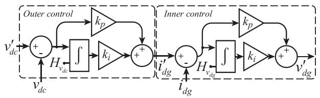  
Fig. 5. Control diagram of the GSC d-axis, including initialization with history terms Hvdc and Hvdg . $H _ { v _ { d c } }$ ${ { H } _ { { { v } _ { d } } _ { g } } }$

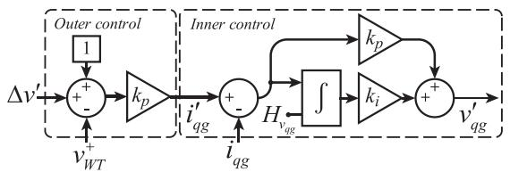  
Fig. 6. Control diagram of the GSC q-axis, including initialization with history term Hvqg . $H _ { v _ { q g } }$

Then, the history term $H _ { v ^ { \prime } }$ is calculated as follows:

$$
H _ {v ^ {\prime}} = \frac {\Delta v ^ {\prime}}{k _ {i}} \tag {2}
$$

where $k _ { i }$ in the integrator gain of the WPC PI is presented in Fig. 4.

2) GSC Outer $V _ { d c }$ Control Initialization: In steady-state conditions, the generated WP power is equal to the power transferred to the grid, and the DC-link voltage is equal to its nominal value. Thus, the integrator history term in the PI-controller can be calculated from the d-frame transformed three-phase currents $( i _ { d g } )$ at the GSC side, assuming $i _ { d g } = i ^ { \prime } _ { d g }$ . Fig. 5 illustrates the detailed block diagram of the $v _ { d c }$ outer control loop and the d-axis inner control loop. This control configuration will maintain the dc bus voltage at its nominal value. The history term of the outer $v _ { d c }$ control loop $H _ { v _ { d c } }$ is calculated using

$$
H _ {v _ {d c}} = \frac {i ^ {\prime} {} _ {d g}}{k _ {i}}, \tag {3}
$$

where the parameter $k _ { i }$ is defined in [3].

3) GSC Inner Current Control Initialization: As shown in Fig. 6, the inner current control system provides the VSC dq-frame voltage signals. For the GSC, the history terms for the PI-controller of the d-axis and q-axis inner control loop are calculated as follows:

$$
H _ {v _ {d g}} = v ^ {\prime} _ {d g} / k _ {i} \tag {4}
$$

$$
H _ {v _ {q g}} = v ^ {\prime} _ {q g} / k _ {i} \tag {5}
$$

$$
v _ {d g} ^ {\prime} = v _ {d - c h o k e} + \omega L _ {c h o k e} i _ {q g} - v _ {d - r e f} \tag {6}
$$

$$
v _ {q g} ^ {\prime} = v _ {q - c h o k e} - \omega L _ {c h o k e} i _ {d g} - v _ {q - r e f} \tag {7}
$$

where $v _ { d q - c h o k e }$ and $i _ { d q g }$ are the dq-frame steady-state voltage and current, respectively, calculated at the choke terminals based on the LF results. $L _ { c h o k e }$ is the inductance of the choke filter, ω is the nominal angular frequency, and $v _ { d q - r e f }$ is the dq-frame reference voltage obtained from the LF solution.

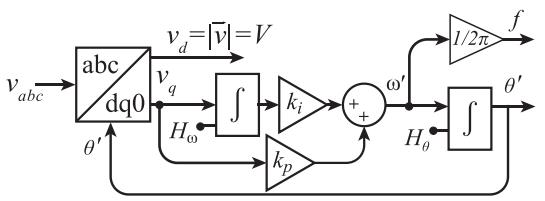  
Fig. 7. Control diagram of the PLL including initialization with history terms $\bar { H _ { \omega } }$ and $H _ { \theta }$ .

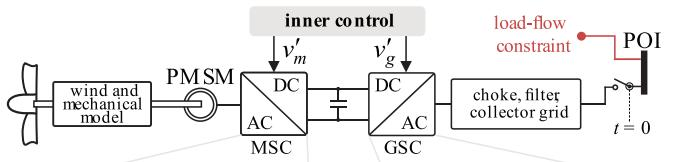

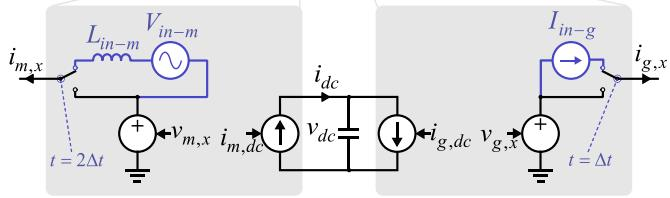  
Fig. 8. Initialization during stage i (red) using LF constraint, and initialization of MSC and GSC during stage iiI (blue), FCI method.

4) Phase-Locked Loop Initialization: An accurate grid phase angle is required to determine the grid voltage phase angle and frequency in grid-connected power converters. For this case, a synchronous reference frame PLL, shown in Fig. 7, provides the continuous measure of the phase-angle and the fundamental voltage frequency. The accuracy of the PLL is crucial for implementing vector-based controllers [26].

To initialize the integrators of the PLL, the history terms of the angular frequency and the phase angle, $H _ { \omega }$ and $H _ { \theta }$ are calculated by

$$
H _ {\omega} = \frac {\omega}{k _ {i}} \tag {8}
$$

$$
H _ {\theta} = \tan^ {- 1} \left(\frac {v _ {\beta}}{v _ {\alpha}}\right), \tag {9}
$$

where $\omega$ is the nominal angular velocity, $k _ { i }$ the PLL integral constant magnitude, $v _ { \alpha }$ and $v _ { \beta }$ are the αβ-frame components of the calculated voltage.

# B. Full Control Initialization (FCI)

The proposed FCI method for FSC-WP is based on the initialization of all control systems and on a specific scheme in the time-domain simulation stage to initialize the converters and the PMSM. The main scheme of the method is presented in Fig. 8. As can be seen, in FCI, the auxiliary voltage source is moved inside the converter model during the initialization process, as well as the auxiliary PI controller of the PMSM is eliminated.

All control systems, including the mechanical system, are initialized in Stage II, as further detailed in this section. However, even though all the control systems are correctly initialized in

Stage II, the measured quantities used as a reference to the controllers are null at $t = 0$ . These transients, resulting from the controller initialization, can propagate through other elements, i.e., choke, filter, and collector grid models, increasing the delay to reach steady-state conditions. Thus, a specific scheme is proposed in the time-domain simulation, stage III, to initialize the MSC, GSC, and PMSM, as illustrated in Fig. 8.

An AC current $( I _ { i n - g } )$ source is connected in series to the GSC, as shown in blue in Fig. 8. The current source provides the steady-state current required for grid-side elements, i.e., choke, filter, and collector grid. On the other side it sets the GSC voltage. This is necessary to set the initial voltage output of the dependent source $v _ { g , x }$ (x is a, b or c for the phase character). The LF solution at the POI provides the voltage phasor at the POI. The choke, filter and collector grid are then solved in steady-state to find the phasor $I _ { i n - g } .$ .

The initialization of the MSC must include the PMSM. The MSC should impose a current $i _ { m , x }$ on the PMSM terminals, with the magnitude and angle computed from the LF solution to force a fast time-domain initialization. This current is applied by using a voltage source $V _ { i n - m }$ and a dummy inductance $L _ { i n - m }$ (with initialized current, initial condition) in series with the converter, for setting the initial voltage at $v _ { m , x } ,$ as illustrated in Fig. 8. The value of $L _ { i n - m }$ is selected as 1/10th of the PMSM stator inductance to guarantee that it does not affect its time-domain behavior. The magnitude for the voltage source $V _ { i n - m }$ is the nominal voltage of the system with an angle 0. The dummy inductance in this case is defined as $L _ { i n - m } = 5 7$ nH. This initialization approach is used to accommodate a black-box type PMSM model for the generic case. In reality, it is possible also to initialize PMSM equations automatically in EMTP.

As a result, the following steps are required for the timedomain stage of the FCI, with numerical integration time-step $\Delta t \colon$

$t = 0$ The PMSM model initializes with zero current. MSC and GSC are initialized with the voltage and current sources, as illustrated in Fig. 8.

$t = \Delta t$ The PMSM current adjusts precisely to the MSC current $i _ { m , x }$ . The GSC current source is disconnected from the converter (see switch at $t = \Delta t$ in Fig. 8).

$t = 2 \Delta t$ The auxiliary elements connected to the MSC are switched to regular operation (see switch at $t = 2 \Delta t$ in Fig. 8).

This interval of 2Δt is required to maintain/force the $L _ { i n - m }$ currents (initial conditions on phases a, b and c) for at least one time-step (Δt), since otherwise it will drop to zero and have no impact on the PMSM initialization.

The $v _ { d c }$ voltage is initialized to its nominal value. The dc currents $i _ { m , d c }$ and $i _ { g , d c }$ are not initialized.

Thus, the steps needed to set the converter to the correct initial values are completed in the first two time-steps. In addition to the control systems initialized at Stage II for the LFSI method, in the FCI method, the system controls of the mechanical model and MSC are also initialized as presented.

1) MSC Inner Current Control Initialization: For the MSC, only the inner controllers need to be initialized. For the outer control, the d-axis is set to zero, while the q-axis depends on the

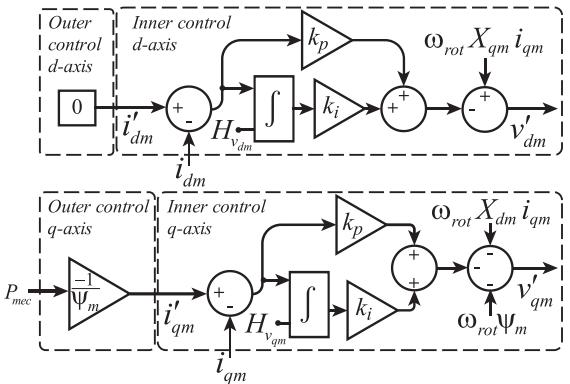  
Fig. 9. Control diagram of the outer and inner MSC, including the initialization with the history terms $H _ { v _ { d m } }$ and $H _ { v _ { q m } }$ .

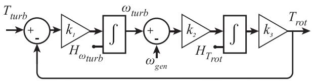  
Fig. 10. Mechanical model (two-mass model) of the WT.

mechanical model and the MPPT function and is calculated as discussed in [3]. Fig. 9 shows the d and q branches of the MSC. The main difference compared to the GSC is the inclusion of the decoupling factors for the two branches. The history terms are given by

$$
H _ {v _ {d m}} = \frac {\omega_ {r o t} X _ {q m} i _ {q m} - v _ {d m}}{k _ {i}}, \tag {10}
$$

$$
H _ {v q m} = \frac {- \omega_ {r o t} X _ {d m} i _ {d m} - v _ {q m} - \omega_ {r o t} \psi_ {m}}{k _ {i}} \tag {11}
$$

where $v _ { d q m }$ and $i _ { d q m }$ are the calculated voltages and currents of the machine, $X _ { d q m }$ is the machine inductance, $\psi _ { m }$ is the mutual flux, and $\omega _ { r o t }$ is the angular rotor frequency.

2) Mechanical Model Initialization: The diagram of the mechanical model is shown in Fig. 10. The history terms for the turbine speed and torque, $H _ { \omega _ { t u r b } }$ and $H _ { T _ { r o t } }$ , are calculated by

$$
H _ {\omega_ {t u r b}} = \frac {v _ {w i n d} \lambda_ {i n i t}}{k _ {s p e e d}} \tag {12}
$$

$$
H _ {T _ {\text {r o t}}} = \frac {P _ {\text {m e c}}}{H _ {\omega_ {\text {t u r b}}}} \tag {13}
$$

where $v _ { w i n d }$ is the initial output of the wind model, $\lambda _ { i n i t } \mathrm { i }$ s the tip-speed, $k _ { s p e e d }$ is the coefficient of the gear box and the tip-speed, and $P _ { m e c }$ is the mechanical power. The mechanical model, including the constants $k _ { 1 }$ , k2 and $k _ { 3 }$ , is also explained in [21].

# IV. SIMULATION RESULTS

In this section, the performances of the FCI and LFSI methods are compared. The case without any initialization (noinitialization, NI) is also presented. The initialization methods are compared regarding their time-domain power waveforms

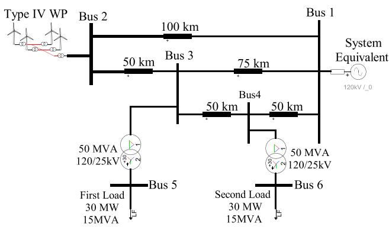  
Fig. 11. Test-case-1, EPRI benchmark with aggregated WP model.

at the POI, simulation time needed to reach steady-state in the time-domain, and computing times for reaching steady-state. For this purpose, a WP is considered in a steady-state when the active and reactive powers at the POI are within a range of 1%of the calculated steady-state value. The measurements require one fundamental cycle to compute the active and reactive powers. All currents and voltages, however, are fully initialized for t ≥ 2Δt.

Three different test cases are used for demonstration:

Test-case-1: Small system with an aggregated WP model.

Test-case-2: A small offshore system with a detailed WP consisting of 45 distinct WT models.

Test-case-3: Large-scale system with 22 sub-transmission networks, 10 aggregated FSC WPs, and 16 power plants with 35 synchronous generators.

In all WPs, the converters are modelled by AVMs and the WPC is included. The use of detailed converter models is described in [27]. It does not affect the performance of the initialization method presented in this paper. The numerical integration time-step is 50 μs. All simulations are performed in the EMTP software [5], and an Intel i7-8550U 1.80 GHz processor.

# A. Test-Case-1: System With Aggregated WP

Fig. 11 depicts the 120 kV, 60 Hz EPRI benchmark system [28]. A WP with a nominal power of 75 MW is connected to a system with two loads, and five transmission lines modelled as constant parameters (CP) lines. The WP model is aggregated, and the system’s characteristics are detailed in [28].

Fig. 12 presents the active and reactive powers at the POI for Test-case-1 for NI simulation. The NI simulation exhibits multiple cycles of power reversals, activating limiter blocks and reaching steady-state conditions at 8.57 s. Since it is evident that NI simulations demonstrate unsuitable behavior, only the time required to reach a steady-state solution with NI will be included in the tables for the subsequent test cases.

The simulation results for LFSI and FCI are shown in Fig. 13, where the active and reactive powers at the POI are compared. For the LFSI method, the power at the WP is also included,

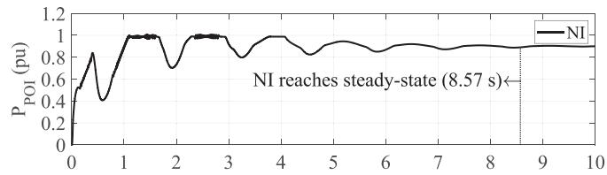

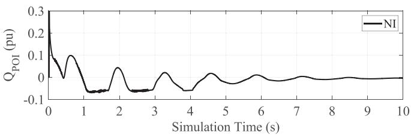  
Fig. 12. Active and reactive power at the POI for NI test-case-1.

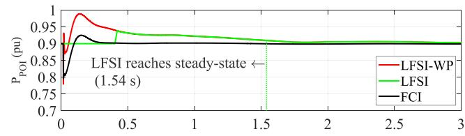

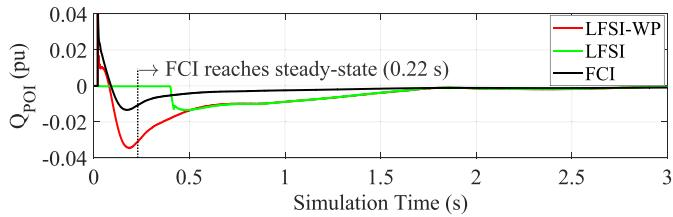  
Fig. 13. Active and reactive power at the POI for test-case-1.

TABLE I TIME UNTIL STEADY-STATE FOR TEST-CASE-1   

<table><tr><td>Initialization method</td><td>Simulation time (s)</td><td>Computation time (s)</td></tr><tr><td>NI</td><td>8.57</td><td>62.06</td></tr><tr><td>LFSI</td><td>1.54</td><td>7.51</td></tr><tr><td>FCI</td><td>0.22</td><td>0.87</td></tr></table>

which differs from power at the POI until the WP is reconnected to the grid. Both methods considerably improve the initialization compared to the NI simulation. For the LFSI, it is possible to notice a power variation at 0.4 s when the WP is reconnected to the power system. The steady-state is reached at 1.54 s. The FCI method was able to reach steady-state at 0.22 s. Additionally, by comparing the WP power for the LFSI with the results for the FCI, it is evident that the FCI method is more effective in initializing the converters and machine.

Table I compares the simulation and computing times required to reach steady-state, and the instances where the models reach the steady-state margin are highlighted in the figures. The computational cost of FCI is reduced by shortening the transient period required to achieve steady- state.

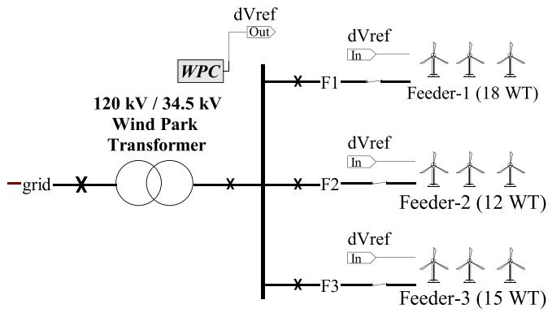  
Fig. 14. EPRI test feeder with distributed WP benchmark, test-case-2.

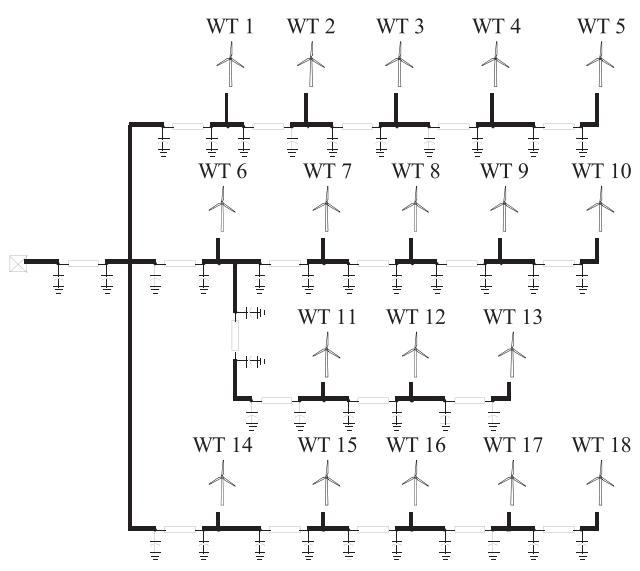  
Fig. 15. Test-case-2, detailed WP model of the EPRI benchmark with 18 independent WTs.

# B. Test-Case-2: System With Detailed WP Model

This case aims to demonstrate the effectiveness of the proposed FCI method for individual and unbalanced WT initialization. The WP model of Test-case-1 is now replaced with an offshore WP of 75 MW consisting of 45 individually modelled WTs. The WTs are grouped in three feeders, with eighteen (30 MVA), twelve (20 MVA), and fifteen turbines (25 MVA), as shown in Fig. 14. A WPC is used to dispatch control reference to the wind turbines shown in Fig. 15. The WPC sets the reactive power control to zero at the POI in time-domain simulations.

Each WT is initialized starting from a PQ constraint (LF solution) with reactive power being zero.

The collector grid is modeled in detail using pi-section submarine cable models. The cable’s cross-section is shown in Fig. 16. All data on this XLPE cable is available in the Appendix. The cable manufacturer is [30]. The soil modeling data is also given in the Appendix. The network beyond the POI remains the same as in Test-case-1.

Figs. 17 and 18 present the active and reactive powers of the three feeders, respectively. The measurements are performed

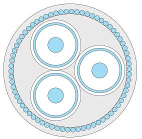  
Fig. 16. Cross-section 35kV, 3-core submarine cable.

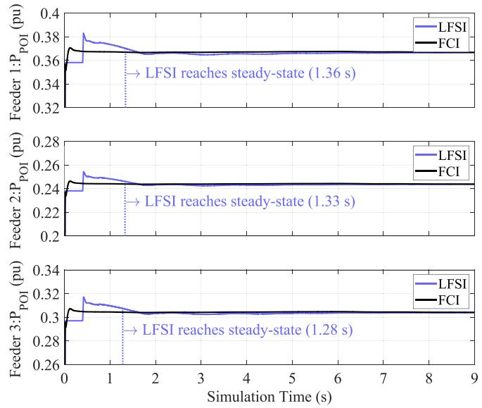  
Fig. 17. Active powers in feeder 1, feeder 2, and feeder 3 for test-case-2.

TABLE II TIME UNTIL STEADY STATE FOR TEST-CASE-2   

<table><tr><td>Initialization Method</td><td>Simulation time (s)</td><td>Computation time (s)</td></tr><tr><td>NI</td><td>9.83</td><td>5725.14</td></tr><tr><td>LFSI</td><td>1.36</td><td>1107.95</td></tr><tr><td>FCI</td><td>0.24</td><td>104.95</td></tr></table>

at the points F1, F2 and F3 of Fig. 14. The initialization and computing times are given in Table II.

As shown in Table II, the simulation of the disaggregated model of the WP requires a longer computation time for initialization compared to the previous case. As observed the NI method now requires much more computing time than for the case of aggregated WP (Test-case-1) due to the number of WTs. The LFSI gains by 5.16 times, whereas FCI achieves a much significant gain of 54.6.

# C. Test-Case-3: Large-Scale System

The T0-benchmark power system model, described in [29], is selected as the most complex test system used here. The singleline diagram of the system is shown in Fig. 19. It comprehends a 400/154 kV system operating at 50 Hz. It includes two types of WPs, seven WPs with 35 WTs and three WPs with 50 WTs,

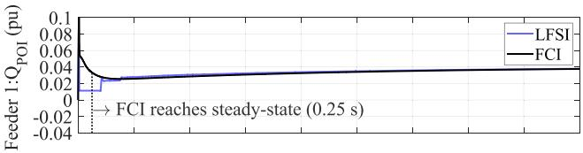

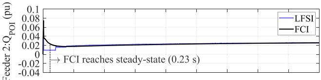

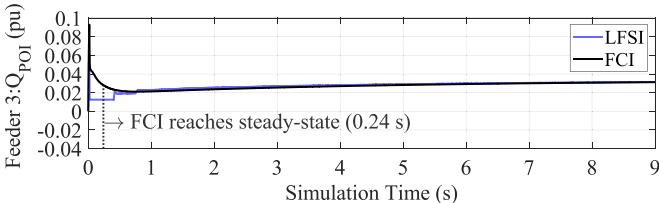  
Fig. 18. Reactive powers in feeder 1, feeder 2, and feeder 3 for test-case-2.

TABLE III INITIALIZATION AND COMPUTATION TIMES FOR THE WPS, TEST-CASE-3   

<table><tr><td>Wind Park Location</td><td>No. of WTs</td><td>LFSI (s)</td><td>FCI (s)</td></tr><tr><td>AO 1 (WP-A)</td><td>35 WT/ 75MW</td><td>1.41</td><td>0.14</td></tr><tr><td>ADA150 (WP-B)</td><td>50 WT/ 100MW</td><td>1.40</td><td>0.15</td></tr><tr><td>AI 1</td><td>35 WT/ 75MW</td><td>1.42</td><td>0.11</td></tr><tr><td>AI 2</td><td>35 WT/ 75MW</td><td>1.40</td><td>0.13</td></tr><tr><td>AI 3</td><td>35 WT/ 75MW</td><td>1.41</td><td>0.14</td></tr><tr><td>AO 2</td><td>35 WT/ 75MW</td><td>1.43</td><td>0.13</td></tr><tr><td>CH 1</td><td>35 WT/ 75MW</td><td>1.42</td><td>0.12</td></tr><tr><td>SB 1</td><td>35 WT/ 75MW</td><td>1.44</td><td>0.09</td></tr><tr><td>ER50 1</td><td>50 WT/ 100MW</td><td>1.47</td><td>0.07</td></tr><tr><td>ER50 2</td><td>50 WT/ 100MW</td><td>1.46</td><td>0.08</td></tr><tr><td colspan="2">Computation time * *2559.3 at 13 s simulation time for NI</td><td>380.30</td><td>36.65</td></tr></table>

all operating in Q-mode with zero reactive power reference. The synchronous machine models include control systems (exciters and governors), as documented in [29]. The transmission system lines are constant-parameter (CP) models, whereas the lines in the sub-transmission networks are PI-section models. Furthermore, transformer and synchronous machines saturation is considered.

In this case, two aggregated WPs are chosen for detailed study, WP-A (35 WTs) and WP-B (50 WTs), due to their different power generation levels. The results for the other WPs, which are modelled in the same way as WP-1 and WP-2, do not provide additional insights and are, therefore, not presented in detail. However, a summary of initialization times for all WPs is given in Table III.

The NI method presented problems converging to a steadystate solution. As both the active and reactive powers could not reach steady-state within the simulated time-frame, this case is classified as non-convergent.

Fig. 20 presents the active and reactive powers at the POI of WP-A. The initialization time for WP-A using LFSI is 1.41 s. With FCI, this is reduced to 0.15 s.

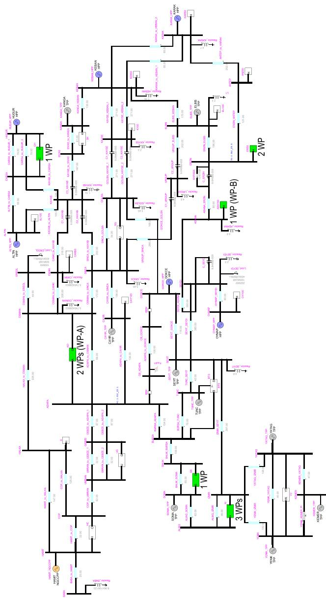  
Fig. 19. Test-case-3, single line diagram.

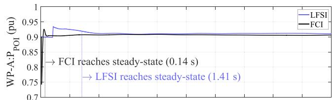

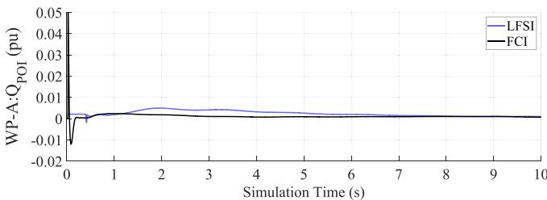  
Fig. 20. WP-A active and reactive power at the POI.

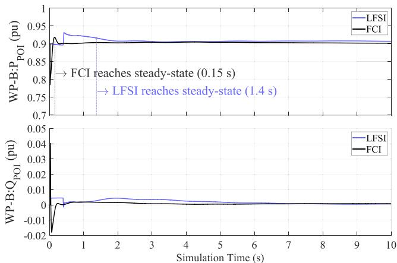  
Fig. 21. WP-B active and reactive power at the POI.

WP-B exhibits a similar behavior, as shown in Fig. 21. The simulation with LFSI has an initialization time of 1.40 s. In comparison, the FCI leads to a reduction of the initialization time to 0.15 s.

Table III shows the initialization times for all ten WPs of Testcase-3. The computation times are 380.3 s and 36.65 s for LFSI and FCI, respectively, corresponding to a reduction of 90%. The computation time is measured when all WPs reach steady-state, i.e., at a simulation time of 1.47 s for LFSI and a simulation time of 0.15 s for FCI.

# V. CONCLUSION

This paper proposes a practical and effective method for fast initialization of full-scale converter WP EMT generic models. The method uses the load-flow solution and backward propagation to initialize passive components and control systems. Furthermore, a specific scheme is proposed to initialize the converters and the PMSM. The proposed method is designed for the generic model of FSC WP, making it a practical solution for models in commercially available EMT-simulation tools.

The effectiveness of the proposed method is demonstrated using three power system models of different scales and complexity, including both balanced and unbalanced systems. The solution is then compared to an existing initialization method. In all cases, the proposed method shows a superior performance, reducing the computation time by 90%. For the computationally intensive case of a detailed WP with distinct WT models, the proposed technique reduces the simulation time for initialization transients from 95 minutes (non-initialized) to over 18 minutes (existing load-flow and source initialization) to under 2 minutes when a tolerance of one percent is considered.

# APPENDIX

The parameters of the cable shown in Fig. 16 and its layout in the offshore WP shown in Fig. 14, are summarized in the following tables:

TABLE IV PARAMETERS OF SEAWATER AND SEABED   

<table><tr><td>Parameter</td><td>Seawater</td><td>Seabed</td></tr><tr><td>Depth (m)</td><td>15</td><td>\( 1 \times 10^{15} \)</td></tr><tr><td>Resistibility (Ωm)</td><td>0.2</td><td>5</td></tr><tr><td>Relative permittivity \( (\varepsilon_{\mathrm {r}}) \)</td><td>80</td><td>15</td></tr><tr><td>Relative permeability \( (\mu_{\mathrm {r}}) \)</td><td>1</td><td>1</td></tr></table>

TABLE V PARAMETERS OF PIPE-TYPE CABLE   

<table><tr><td>Number of cores</td><td>3</td><td>Relative permittivity (εr)</td><td>1</td></tr><tr><td>Horizontal position (m)</td><td>0</td><td>Relative permeability (μr)</td><td>600</td></tr><tr><td>Vertical position (m)</td><td>16.5</td><td>Resistivity (Ωm)</td><td>2.48x10-7</td></tr><tr><td>Pipe outer radius (cm)</td><td>4.578</td><td>Number of stranded wires</td><td>66</td></tr><tr><td>Pipe inner radius (cm)</td><td>4.228</td><td>Total radius (cm)</td><td>2.3</td></tr><tr><td>Inner insulator relative permittivity (εr)</td><td>2.3</td><td>Outer insulator relative permittivity (εr)</td><td>4.978</td></tr></table>

TABLE VI PARAMETERS OF PIPE-TYPE CABLE CORES   

<table><tr><td>Core</td><td>1</td><td>2</td><td>3</td></tr><tr><td>Distance from center (cm)</td><td>2.154</td><td>2.154</td><td>2.154</td></tr><tr><td>Angle (deg)</td><td>0</td><td>120</td><td>240</td></tr><tr><td>Outer radius (cm)</td><td>1.865</td><td>1.865</td><td>1.865</td></tr><tr><td>Number of conductors</td><td>2</td><td>2</td><td>2</td></tr></table>

TABLE VII PARAMETERS OF CONDUCTORS/INSULATORS PER CORE   

<table><tr><td>Parameter</td><td>Conductor 1</td><td>Conductor 2</td></tr><tr><td>Inner radius (cm)</td><td>0</td><td>1.505</td></tr><tr><td>Outer radius (cm)</td><td>0.575</td><td>1.675</td></tr><tr><td>Number of stranded wires</td><td>1</td><td>1</td></tr><tr><td>Conductor resistivity (Ωm)</td><td>1.678x10-8</td><td>2.198x10-7</td></tr><tr><td>Conductor relative permeability (μr)</td><td>1</td><td>1</td></tr><tr><td>Conductor relative permittivity (εr)</td><td>1</td><td>1</td></tr><tr><td>Insulator relative permittivity (εr)</td><td>2.5</td><td>2.3</td></tr></table>

# REFERENCES

[1] Y. Cheng et al., “Real-world subsynchronous oscillation events in power grids with high penetrations of inverter-based resources,” IEEE Trans. Power Syst., vol. 38, no. 1, pp. 316–330, Jan. 2023, doi: 10.1109/TP-WRS.2022.3161418.   
[2] IEEE PES Modeling and Simulation of Large Power Systems Taskforce, “PES-TR113: Simulation methods, models, and analysis techniques to represent the behavior of bulk power system connected inverter-based resources,” Sep. 2023, [Online]. Available: https://resourcecenter.ieeepes.org/publications/technical-reports/pes_tp_tr113_psdp_91823   
[3] U. Karaagac et al., “A generic EMT-type model for wind parks with permanent magnet synchronous generator full size converter wind turbines,” IEEE Power Energy Technol. Syst. J., vol. 6, no. 3, pp. 131–141, Sep. 2019, doi: 10.1109/JPETS.2019.2928013.   
[4] Working Group on CIGRE Study Committee C4, “Generic EMT-type modelling of inverter-based resources for long term planning studies” CIGRE study committee C4,” Accessed: Mar. 19, 2024. [Online]. Available: https://www.cigre.org/article/GB/news/the_latest_news/ cigre-active-working-groups-call-for-experts   
[5] J. Mahseredjian, S. Dennetière, L. Dubé, B. Khodabakhchian, and L. Gérin-Lajoie, “On a new approach for the simulation of transients in power systems,” Electric Power Syst. Res., vol. 77, no. 11, pp. 1514–1520, Sep. 2007, doi: 10.1016/j.epsr.2006.08.027.   
[6] S. Li, T. A. Haskew, K. A. Williams, and R. P. Swatloski, “Control of DFIG wind turbine with direct-current vector control configuration,” IEEE Trans. Sustain. Energy, vol. 3, no. 1, pp. 1–11, Jan. 2012, doi: 10.1109/TSTE.2011.2167001.

[7] M. Tsili and S. Papathanassiou, “A review of grid code technical requirements for wind farms,” Int. Eng. Technol. Renewable Power Gener., vol. 3, no. 3, pp. 308–320, Sep. 2009, doi: 10.1049/iet-rpg.2008.0070.   
[8] J. Mahseredjian, I. Kocar, and U. Karaagac, “Solution techniques for electromagnetic transients in power systems,” in Transient Analysis of Power Systems: Solution Techniques, Tools and Applications, Hoboken, NJ, USA: Wiley, 2015, pp. 9–38, doi: 10.1002/9781118694190.ch2.   
[9] U. K. Kocar, J. Mahseredjian, and B. Cetindag, “Multiphase loadflow solution and initialization of induction machines,” IEEE Trans. Power Syst., vol. 33, no. 2, pp. 1650–1658, Mar. 2018, doi: 10.1109/TP-WRS.2017.2721547.   
[10] N. Rashidirad, J. Mahseredjian, I. Kocar, U. Karaagac, and O. Saad, “MANA-based load-flow solution for islanded AC microgrids,” IEEE Trans. Smart Grid, vol. 14, no. 2, pp. 889–898, Mar. 2023, doi: 10.1109/TSG.2022.3199762.   
[11] Y. Coughlan, P. Smith, A. Mullane, and M. O’Malley, “Wind turbine modelling for power system stability analysis-A system operator perspective,” IEEE Trans. Power Syst., vol. 22, no. 3, pp. 929–936, Aug. 2007, doi: 10.1109/TPWRS.2007.901649.   
[12] J. G. Slootweg, H. Polinder, and W. L. Kling, “Initialization of wind turbine models in power system dynamics simulations,” in Proc. IEEE Porto Power Tech Proc. (Cat. No. 01EX502), Porto, Portugal, 2001, vol. 4, p. 6, doi: 10.1109/PTC.2001.964827.   
[13] M. Wu and L. Xie, “Calculating steady-state operating conditions for DFIG-based wind turbines,” IEEE Trans. Sustain. Energy, vol. 9, no. 1, pp. 293–301, Jan. 2018, doi: 10.1109/TSTE.2017.2731661.   
[14] J. F. M. Padron and A. E. F. Lorenzo, “Calculating steady-state operating conditions for doubly-fed induction generator wind turbines,” IEEE Trans. Power Syst., vol. 25, no. 2, pp. 922–928, May 2010, doi: 10.1109/TP-WRS.2009.2036853.   
[15] Y. Dong et al., “A novel electromagnetic transient simulation method of large-scale AC power system with high penetrations of DFIG-based wind farms,” IEEE Access, vol. 10, pp. 53188–53199, 2022, doi: 10.1109/AC-CESS.2022.3175891.   
[16] A. Ramirez and G. C. Lazaroiu, “Fast steady-state computation of electrical networks involving nonlinear and photovoltaic components,” IEEE Trans. Smart Grid, vol. 12, no. 4, pp. 3107–3114, Jul. 2021, doi: 10.1109/TSG.2021.3053488.   
[17] G. C. Leandro and T. Noda, “A steady-state initialization procedure for generic voltage-source converters in electromagnetic transient simulations,” Electric Power Syst. Res., vol. 221, May 2023, Art. no. 109404, doi: 10.1016/j.epsr.2023.109404.   
[18] A. Stepanov, H. Saad, H. Saad, and J. Mahseredjian, “Initialization of modular multilevel converter models for the simulation of electromagnetic transients,” IEEE Trans. Power Del., vol. 34, no. 1, pp. 290–300, Feb. 2019, doi: 10.1109/TPWRD.2018.2872883.   
[19] U. Karaagac, J. Mahseredjian, H. Gras, H. Saad, J. Peralta, and L. D. Bellomo, “Simulation models for wind parks with variable speed wind turbines in EMTP,” Polytech. Montréal, 2023.   
[20] E. Muljadi, S. Pasupulati, A. Ellis, and D. Kosterov, “Method of equivalencing for a large wind power plant with multiple turbine representation,” in Proc. IEEE Power Eng. Soc. Gen. Meeting Convers. Del. Elect. Energy 21st Century, 2008, pp. 1–9, doi: 10.1109/PES.2008.4596055.   
[21] O. Anaya-Lara, N. Jenkins, J. B. Ekanayake, P. Cartwright, and M. Hughes, Wind Energy Generation: Modelling and Control. Hoboken, NJ, USA: Wiley, 2009.   
[22] J. Brochu, C. Larose, and R. Gagnon, “Validation of single- and multiple-machine equivalents for modeling wind power plants,” IEEE Trans. Energy Convers., vol. 26, no. 2, pp. 532–541, Jun. 2011, doi: 10.1109/TEC.2010.2087337.   
[23] Analytic Methods for Power Systems Committee Transient, Analysis and Simulations Subcommittee Wind SSO Task Force, “PES-TR80: Wind energy systems sub-synchronous oscillations: Events and modeling,” 2020. Accessed: Mar. 19, 2024. [Online]. Available: https://resourcecenter.ieeepes.org/publications/technical-reports/pes_tp_tr80_amps_wsso_070920   
[24] M. Sarkar, M. Altin, P. E. Sørensen, and A. D. Hansen, “Reactive power capability model of wind power plant using aggregated wind power collection system,” Energies, vol. 12, no. 9, pp. 1607–1615, Apr. 2019, doi: 10.3390/en12091607.   
[25] N. W. Miller, J. J. Sanchez-Gasca, W. W. Price, and R. W. Delmerico, “Dynamic modeling of GE 1.5 and 3.6 Mw wind turbine-generators for stability simulations,” in Proc. IEEE Power Eng. Soc. Gen. Meeting, 2003, pp. 1977–1983, doi: 10.1109/PES.2003.1267470.   
[26] R. Teodorescu, M. Liserre, and P. Rodriguez, Grid Converters for Photovoltaic and Wind Power Systems. Hoboken, NJ, USA: Wiley, 2011, doi: 10.1002/9780470667057.

[27] J. A. Ocampo-Wilches, A. Ramirez, K. Jacobs, J. Mahseredjian, and A. G. Pavani, “Full-control initialization of photovoltaic park models for electromagnetic transient simulations,” in Proc. 50th Annu. Conf. IEEE Ind. Electron. Soc., 2024, pp. 1–8, doi: 10.1109/IECON55916.2024.10905292.   
[28] A. Haddadi, I. Kocar, U. Karaagac, J. Mahseredjian, and E. Farantatos, EPRI Technical Report: Impact of Renewables on System Protection: Wind/PV Short-Circuit Phasor Model Library and Guidelines for System Protection Studies, no. 3002002810, EPRI, Dic, 2016.   
[29] CIGRE Working Group C4.503, “Power system test cases for EMT-type simulation studies,” CIGRE Technical Report, Aug. 2018. Accessed: Mar. 19, 2024. [Online]. Available: https://www.ecigre.org/publications/detail/736-power-system-test-cases-for-emttype-simulation-studies.html   
[30] “Caledonian cable,” Accessed: Jul. 09, 2024. [Online]. Available: http: //www.caledoniancable.com/English/index.htm

Juan Antonio Ocampo-Wilches (Member, IEEE) received the first B.S. degree in electronic engineering , and the second B.S. degree in electrical engineering, and the M.Sc. degree in electrical engineering from the Universidad Nacional de Colombia, Bogotá, Colombia, in 2016, in 2017, and 2020, respectively. He is currently working toward the Ph.D. degree with Polytechnique Montréal, Montreal, QC, Canada, focusing on the initialization of inverter-based resources and their modeling. His research interests include renewable energy integration into the electric grid and power system modeling.

Jean Mahseredjian (Life Fellow, IEEE) received the Ph.D. degree from Polytech nique Montreal, Montreal, QC, Canada, in 1991. From 1987 to 2004, he was with IREQ (Hydro-Quebec), Montreal, working on research and development activities related to the simulation and analysis of electromagnetic transients. In 2004, he joined the Faculty of Electrical Engineering, Polytechnique Montreal. He has more than 30 years of experience in modeling, simulation, and analysis of power systems. He is the Creator and Lead Developer of the EMTP software. He is an IEEE Fellow for his contributions to computation and modeling of power systems transients.

Keijo Jacobs received the B.Sc. degree in electrical engineering, information technology, and computer engineering, the M.Sc. degree in electrical power engineering from RWTH Aachen University, Aachen, Germany, in 2011 and 2015, respectively, and the Ph.D. degree in electrical engineering from the KTH Royal Institute of Technology, Stockholm, Sweden, with a focus on Voltage Source Converter (VSC) HVDC converter technology using SiC semiconductor devices. He is currently a Postdoctoral Fellow with Polytechnique Montréal, Montreal, QC, Canada, where his research centers on modeling and stability analysis of voltage-source converter-based power systems, with a particular emphasis on measurement-based stability assessment methods. His work explores the intersection of power electronics and modern power systems, aiming to advance the integration of innovative converter technologies into the grid.

Ahda P. Grilo-Pavani (Senior Member, IEEE) received the Ph.D. degree in electrical engineering from the University of Campinas, Campinas, Brazil, in 2008. She was a Visiting Scholar with the University of Alberta, Edmonton, AB, Canada, in 2013, and a Visiting Professor with Polytechnique Montréal, Montreal, QC, Canada, in 2024. She is currently an Associate Professor with Federal University of ABC (UFABC), Santo André, Brazil. Her research interests include power system stability and control, the integration of wind and PV power plants into power systems, and smart grids.

Haoyan Xue (Senior Member, IEEE) was born in China. He received the B.Eng. degree in electrical engineering and its automation from Hunan University, Changsha, China, in 2010, the M.Sc. degree in electrical engineering from the Delft University of Technology, Delft, The Netherlands, in 2012, and the Ph.D. degree in electrical engineering from the Department of Electrical Engineering, Polytechnique Montréal, Montreal, QC, Canada. From 2013 to 2015, he was with the State Grid Corporation of China, Yinchuan, China, where he worked on protections, relays, and SCADA systems of substations. From 2015 to 2018, he was also with the Department of Electrical Engineering, Polytechnique Montréal. He is currently with Global Energy Interconnection Group Company, Ltd., Beijing, China, and Global Energy Interconnection Development and Cooperation Organization (GEIDCO).