# 大规模海上风电场电磁暂态受控源解耦加速模型

邹 明，王 焱，许建中，赵成勇

（新能源电力系统全国重点实验室（华北电力大学），北京市 102206）

摘要：随着风电装机容量及占比越来越大，大规模风电场电磁暂态仿真速度极慢的问题愈加凸显。针对现有建模方法复杂、无法反映风电场内部特性、灵活性不足等问题，提出一种大规模海上风电场电磁暂态受控源解耦加速模型。该方法通过受控源传递端口间电压和电流信息，实现风电机组内部元件之间以及不同风电机组之间端口的解耦，从而将系统解算过程中高阶矩阵分解为多个小矩阵以实现快速仿真。基于节点分析法和基尔霍夫定律证明了该方法的有效性。所提出的受控源解耦加速模型建模方法简单，通过仿真软件中现有模块拖拽即可搭建，可以准确仿真风电场的各种暂稳态工况，并且提速效果明显。同时，所提受控源解耦加速模型可与现有文献所提方法互补，扩展其灵活性。最后，在PSCAD/EMTDC中搭建了不同机组数量的风电场模型，验证了受控源解耦加速模型的仿真精度及加速效果。结果表明，所提受控源解耦加速模型可实现1~2个数量级的加速效果，且相比详细模型具有较高的仿真精度。

关键词：海上风电场；风电机组；电磁暂态仿真；受控源解耦加速模型；等效建模

# 0 引 言

中国海上风电累计装机容量逐年提升，装机容量占比也越来越大，使得电网面临更大的稳定性风险［1］ 。电磁暂态（electromagnetic transient，EMT）仿真是支撑系统分析、设计、控制和运行的重要基础工具［2］ 。然而，大规模海上风电场（wind farm，WF）通常由上百台风电机组（wind turbine，WT）组成，每台机组都包含各种电气设备和电力电子开关器件，这极大地增加了系统节点数量，导致仿真效率极低［3］ 。

使用详细风电机组模型仿真虽然可以充分反映诸多动态过程，但模型太过复杂，需要耗费大量计算机资源，难以平衡仿真规模和仿真时间之间的矛盾［4］ 。现有文献中，为解决风电场EMT仿真困难的方法主要有以下几类：部分机组元件简化［5-6］、聚合等值法［7-9］ 、戴维南/诺顿等效建模［10-11］ 和系统拆分解耦［12-14］ 。文献［5］通过忽略风电机组机侧系统（包括发电机和机侧换流器）来简化机组复杂度，然而，简化模型忽略了机-网耦合关系，会导致系统动态分析过程的误差。文献［6］构建了基于开关函数的机组

换流器平均值模型，该模型虽然可以提高计算效率，但仿真精度有所降低。文献［7］提出一种风电场参数聚合单机等值方法，该方法原理简单、仿真效率高，但精度较低、应用场景较为有限，无法反映风电场内部电气特性。为了克服单机等值法的问题，文献［8］提出一种多机等值方法，相较于单机等值法仿真精度得到了提升，但随着风速、运行工况发生变化，需要实时对分群指标进行聚类，计算量大。文献［9］基于实际受扰轨迹的动态量测数据进行参数辨识聚合，这种聚合法精度较高，但存在量测较难获取、参数辨识准确度较低的问题。文献［10-11］提出一种风电场戴维南/诺顿等效模型，该方法具有极高的仿真精度且可显著缩短仿真时间，但其建模过程较为复杂，当机组拓扑发生变化时，等效电路需重新定义，灵活性不足。基于半隐式延迟解耦原理，文献［12］构建了风力发电单元的解耦模型以提高仿真速度，但该方法需要对递推格式反复迭代，且半个步长的延时带来了时序设计的问题。文献［ - ］从另一个角度利用传输线解耦分割，实现了大系统等价拆解，但在仿真步长一定的情况下，该解耦方法需要传输线长度大于一定距离，灵活性受限。文献［ - ］基于受控源的映射关系，对模块化多电平换流器（modular multilevel converter，MMC）和直流变压器（DC transformer，DCT）进行解耦，但缺乏交流

端口的应用，且解耦方法的有效性分析未考虑时间延迟的问题。

上述建模方法分别从不同切入点对风电场建模和加速仿真开展了有益的研究，但仍存在建模方法复杂、无法反映风电场内部特性、灵活性不足等问题。为降低建模复杂度，在保留风电机组内部电气特性的基础上提高仿真效率，同时提高模型搭建的灵活性、可延展性及可移植性，本文提出一种大规模海 上 风 电 场 电 磁 暂 态 受 控 源 解 耦 加 速 模 型（controlled source based decoupling accelerationmodel，CS-DAM）。所提解耦模型建模方法简单，便于修改且灵活性高，可以准确仿真风电场的启动、换流器解闭锁、次同步振荡及短路故障等工况，风电场级层面有功功率误差不超过 5.86%，可实现 1~2个数量级的加速比。所提模型可与现有文献所提方法相互补充，扩展其灵活性。

# 1 直驱风电场系统结构和参数

永 磁 同 步 发 电 机 （permanent magnetsynchronous generator，PMSG）因 其 较 好 的 低 电 压穿越性能、无励磁绕组、效率高、便于维护等优点，被广泛应用于国内在建海上风电场［17］ 。图1给出了直驱风电场结构图。图中 $: u _ { \mathrm { W F } }$ 和 $i _ { \mathrm { W F } }$ 分别为风电场公共 连 接 点（point of common coupling，PCC）处 的 交流电压和电流； $\div u _ { \mathrm { L } { j } }$ 和 $i _ { \mathrm { L } j }$ 分别为第 $j$ 条链路的端电压和输出电流，j=1，2，…， $N ; { u } _ { k }$ 和 $i _ { \mathrm { g } k }$ 分别为该链路中第 k台风电机组的端电压和输出电流， $k { = } 1 , 2 , \cdots$ ，$n _ { \mathrm { o } }$ 。由图1可知，n台风电机组以链式连接方式汇集到 35 kV集电线路上构成一条链路，N条链路以并联方式连接，再通过35 kV/230 kV联接变压器接入交流系统。场内各设备参数见附录A表A1。

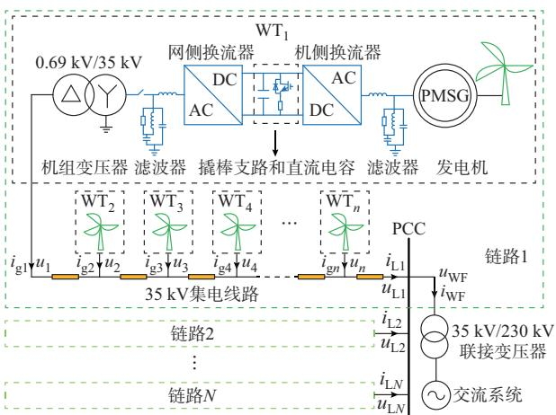  
图1 直驱风电场结构图  
Fig. 1 Structure diagram of PMSG-based wind farm

# 2 电磁暂态受控源解耦加速方法

# 2. 1　解耦建模原理

利用理想变压器模型法［18］可实现风电场解耦建模，其原理如图 2所示。图中：节点 l和 n的等效注入电流源分别为 $J _ { \it l }$ 和 $J _ { n } ;$ ；节点间的导纳为 $Y _ { l m }$ 和$Y _ { m n } ; i _ { m } ( t )$ 和 $u _ { m } \left( t \right)$ 分别为 t时刻节点 m流过的电流和对地电压， $\mathrm { , } u _ { m } = u _ { m ^ { \prime } } \mathrm { ; } \Delta t$ 为系统仿真步长。

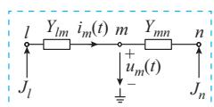  
(a) 从节点m看入的等效系统

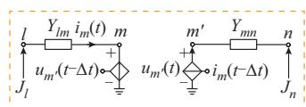  
(b) 解耦后的系统  
图2 解耦建模原理  
Fig. 2 Principle of decoupling modeling

对图2（a）所示等效系统的节点m进行解耦，解耦后如图 2（b）所示。拆分后解耦点一侧为受控电压源，另一侧为受控电流源。受控电流源值等于另一端受控电压源支路流过的电流，受控电压源值等于另一端受控电流源的出口电压。利用受控源解耦时，解耦点两端的信息传递延迟一个仿真步长。

# 2. 2　风电机组外部端口解耦建模方法

风电机组外部端口包括同条链路内机组之间的链式连接以及链路出口的并联连接 2种连接方式。基于上述解耦建模原理，建立了风电机组外部端口解耦等效模型，如附录A图A1所示。

对于风电机组链路而言，其电网侧可等效为一个受控电压源，其电压值为PCC处电压 $u _ { n + 1 } ( \boldsymbol { t } - \Delta { t } )$ ；对于电网而言，各条链路可等效为一个受控电流源，其电流值为各条链路输出电流之和 $i _ { \mathrm { a l l } } ( t - \Delta t ) _ { \circ }$ 。链路内各风电机组出口与前段线路之间进行解耦，对于第 k台风电机组而言，其出口侧等效为一个受控电流源，其值为其前段所有机组输出电流之和$i _ { k - 1 } ( t - \Delta t )$ ；对于前段线路而言，其端口处等效为一个受控电压源 $u _ { k } ( t - \Delta t )$ ，用于传递电网侧电压值。

链路内第k台机组解耦点以及链路出口解耦点的受控电流源和电压源值如式（1）所示。

$$
\left\{ \begin{array}{l} i _ {k - 1} (t - \Delta t) = i _ {\mathrm {g} (k - 1)} (t) + i _ {k - 2} (t - \Delta t) \\ u _ {k} (t - \Delta t) = f _ {\Delta t} [ u _ {k} (t) ] \\ i _ {\text {a l l}} (t - \Delta t) = \sum_ {j = 1} ^ {N} i _ {\mathrm {L} j} (t - \Delta t) \\ u _ {n + 1} (t - \Delta t) = f _ {\Delta t} [ u _ {n + 1} (t) ] \end{array} \right. \tag {1}
$$

式中：f [⋅]表示取上一个仿真步长的值。

由于受控源在传递信息时存在一个仿真步长的延时，在系统仿真步长足够小的前提下，从解耦点处

向模型内部看，解耦后的模型与原始模型可认为完全等效。上述解耦方法的有效性可通过基尔霍夫定律和节点分析法证明，证明方法参考2.4节。

# 2. 3　风电机组内部端口解耦建模方法

由图1可知，每台直驱风电机组中包含PMSG、滤波器、变压器、换流器等多种电气设备，其整体阶数可达25阶。为进一步降低系统阶数，可在风电机组内部电气设备间应用前述解耦建模方法，实现各设备之间的进一步解耦，如附录A图A2所示，从而将大规模风电场的高阶矩阵运算分解成多个小矩阵运算同时进行。由于矩阵求逆和阶数的3次方呈正相关，故系统分解后计算量降低，极大地提高了仿真的计算效率。由图 A2可知，该解耦建模方法不仅可应用于交流端口，也可应用于直流端口。

# 2. 4　解耦建模方法有效性证明

通过对PMSG、滤波器、开关器件、变压器及电感、电容等元件的等效建模，单台风电机组可以表示为图 3（a）所示的诺顿等效电路［11］。由于各相之间完全解耦，可构建如图3（b）所示的单相形式下风电机组链路的诺顿等效电路，对应的解耦诺顿等效电路如图 3（c）所示。图中： $: J _ { \mathrm { G A } } \setminus J _ { \mathrm { G B } } \setminus J _ { \mathrm { G C } }$ 分别为风电机组三相等效电流源； $Y _ { \mathrm { G A } \setminus Y _ { \mathrm { G B } \setminus Y _ { \mathrm { G C } } } }$ 分别为风电机组三相等效导纳； ${ } _ { ; J _ { G k } } ( t )$ 为 t时刻第 k台风电机组注入第k个节点的诺顿等效电流源； $Y _ { G k }$ 为第k台风电机组诺顿等效导纳； $Y _ { \mathrm { L } k }$ 为第k台风电机组出口线路的导纳值。其中，地节点为参考节点，单相形式仅为了推导方便，其他相同理可得，不存在三相不平衡不适用的问题。在不失通用性的前提下，假设该链路诺顿等效电路可表示风电场内任意一条链路。

对图 3（b）所示的诺顿等效电路列写节点电压方程可得：

$$
\left[ \begin{array}{c c c c c} Y _ {1 1} & Y _ {1 2} & & & \\ & \ddots & & & \\ & Y _ {k (k - 1)} & Y _ {k k} & Y _ {k (k + 1)} & \\ & & & \ddots & \\ & & & Y _ {n (n - 1)} & Y _ {n n} & Y _ {n (n + 1)} \\ & & & & Y _ {(n + 1) n} & Y _ {(n + 1) (n + 1)} \\ [ u _ {1} (t) \dots u _ {k} (t) \dots u _ {n} (t) u _ {n + 1} (t) ] ^ {\mathrm {T}} = \end{array} \right].
$$

$$
\left[ J _ {\mathrm {G} 1} (t) \quad \dots \quad J _ {\mathrm {G} k} (t) \quad \dots \quad J _ {\mathrm {G} n} (t) \quad - i _ {\mathrm {L} K} (t) \right] ^ {\mathrm {T}} \tag {2}
$$

式中： $Y _ { k ( k + 1 ) } = Y _ { ( k + 1 ) k } = - Y _ { \mathrm { L } k }$ ，为相邻节点间的互导纳； $Y _ { k k }$ 为第k个节点的自导纳，如式（3）所示。

$$
Y _ {k k} = \left\{ \begin{array}{l l} Y _ {\mathrm {G} k} + Y _ {\mathrm {L} k} & k = 1 \\ Y _ {\mathrm {G} k} + Y _ {\mathrm {L} k} + Y _ {\mathrm {L} (k - 1)} & 2 \leqslant k \leqslant n \\ Y _ {\mathrm {L} k} & k = n + 1 \end{array} \right. \tag {3}
$$

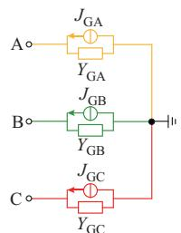  
(a)单台风电机组诺顿等效电路

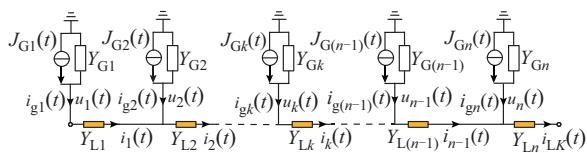  
(b) 单相形式下风电机组链路诺顿等效电路

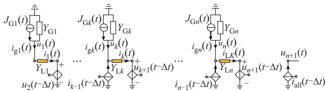  
(c)单相形式下风电机组链路解耦诺顿等效电路  
图3 风电机组及链路等效电路  
Fig. 3 Equivalent circuit of wind turbine and link

对图 3（c）中第 1、第 k和第 n+1个节点应用基尔霍夫电流定律，有

$$
Y _ {\mathrm {L} 1} \left[ u _ {1} (t) - u _ {2} (t - \Delta t) \right] = J _ {\mathrm {G} 1} (t) - Y _ {\mathrm {G} 1} u _ {1} (t) \tag {4}
$$

$$
Y _ {\mathrm {L} k} [ u _ {k} (t) - u _ {k + 1} (t - \Delta t) ] = J _ {\mathrm {G} k} (t) - Y _ {\mathrm {G} k} u _ {k} (t) +
$$

$$
i _ {k - 1} (t - \Delta t) = J _ {\mathrm {G} k} (t) - Y _ {\mathrm {G} k} u _ {k} (t) +
$$

$$
Y _ {\mathrm {L} (k - 1)} [ u _ {k - 1} (t - \Delta t) - u _ {k} (t - 2 \Delta t) ] \tag {5}
$$

$$
Y _ {1, n} [ u _ {n} (t) - u _ {n + 1} (t - \Delta t) ] = i _ {1, K} (t) \tag {6}
$$

整理式（4）—式（6）可得：

$$
\left(Y _ {\mathrm {L} 1} + Y _ {\mathrm {G} 1}\right) u _ {1} (t) - Y _ {\mathrm {L} 1} u _ {2} (t - \Delta t) = J _ {\mathrm {G} 1} (t) \tag {7}
$$

$$
- Y _ {\mathrm {L} (k - 1)} u _ {k - 1} (t - \Delta t) + \left(Y _ {\mathrm {G} k} + Y _ {\mathrm {L} k}\right) u _ {k} (t) +
$$

$$
Y _ {\mathrm {L} (k - 1)} u _ {k} (t - 2 \Delta t) - Y _ {\mathrm {L} k} u _ {k + 1} (t - \Delta t) = J _ {\mathrm {G} k} (t) \tag {8}
$$

$$
- Y _ {\mathrm {L} n} u _ {n} (t) + Y _ {\mathrm {L} n} u _ {n + 1} (t - \Delta t) = - i _ {\mathrm {L} K} (t) \tag {9}
$$

为便于说明，将式（7）—式（9）中非 t时刻的电 压量约等为 t-Δt 时刻的量，结果如式（10）—式 （12）所示。

$$
\left(Y _ {\mathrm {L} 1} + Y _ {\mathrm {G} 1}\right) u _ {1} (t - \Delta t) - Y _ {\mathrm {L} 1} u _ {2} (t - \Delta t) = J _ {\mathrm {G} 1} (t) \tag {10}
$$

$$
- Y _ {\mathrm {L} (k - 1)} u _ {k - 1} (t - \Delta t) + \left(Y _ {\mathrm {G} k} + Y _ {\mathrm {L} k} + Y _ {\mathrm {L} (k - 1)}\right) \bullet
$$

$$
u _ {k} (t - \Delta t) - Y _ {\mathrm {L} k} u _ {k + 1} (t - \Delta t) = J _ {\mathrm {G} k} (t) \tag {11}
$$

$$
- Y _ {\mathrm {L} n} u _ {n} (t - \Delta t) + Y _ {\mathrm {L} n} u _ {n + 1} (t - \Delta t) = - i _ {\mathrm {L} K} (t) \tag {12}
$$

将式（10）—式（12）写成矩阵形式，如式（13） 所示。

$$
\left[ \begin{array}{c c c c} Y _ {\mathrm {L} 1} + Y _ {\mathrm {G} 1} & - Y _ {\mathrm {L} 1} & & \\ & \ddots & & \\ & - Y _ {\mathrm {L} (k - 1)} & Y _ {\mathrm {G} k} + Y _ {\mathrm {L} k} + Y _ {\mathrm {L} (k - 1)} & - Y _ {\mathrm {L} k} \\ & & & \ddots \\ & & & - Y _ {\mathrm {L} n} \end{array} \right] \left[ \begin{array}{c} u _ {1} (t - \Delta t) \\ \vdots \\ u _ {k} (t - \Delta t) \\ \vdots \\ u _ {n + 1} (t - \Delta t) \end{array} \right] = \left[ \begin{array}{c} J _ {\mathrm {G} 1} (t) \\ \vdots \\ J _ {\mathrm {G} k} (t) \\ \vdots \\ - i _ {\mathrm {L} k} (t) \end{array} \right] \tag {13}
$$

可见，解耦后等效电路的节点电压方程与原始方程的区别在于节点电压列向量存在一个仿真步长的延时。由此可知，图3（b）和（c）所示2个诺顿等效电路在系统仿真步长较小时，可认为完全同解。由于风电场中包含了大量的电力电子器件，为准确刻画这些器件的动态特性，要求仿真步长较小。因此，所提解耦建模方法可应用于大规模风电场中。

通过一组成对的受控源，大规模风电场各子系统之间电气解耦，实现了高阶矩阵的等价降阶，提高了仿真速度。所建立的 CS-DAM 不仅可以降低导纳矩阵求逆的计算量，而且可以准确仿真详细模型在启动、换流器解闭锁、次同步振荡及短路故障等工况下的所有电气特性。该建模方法原理简单、物理概念清晰、可扩展性好，可与其他建模方法实现互补。当风电场拓扑或机组结构发生变化时，采用戴维南/诺顿等效建模方法需重新建立等效电路，较为复杂。此时，可采用解耦模型搭建拓扑变化部分，其余部分则保留戴维南/诺顿模型，从而避免了再次建模，也弥补了其灵活性不足的问题。此外，所提解耦建模方法仅将系统电路部分进行解耦，而与控制方法无关。

# 3 仿真验证

为验证所提CS-DAM的准确性、误差影响因素以及加速效果，在 PSCAD/EMTDC中搭建了风电场详细模型（detailed model，DM）和 CS-DAM，对比其仿真精度和加速比。系统参数见附录A表A1。

本文仿真算例中，PMSG采用基于桨距角控制的最大功率点跟踪（maximum power point tracking，）控制，机侧换流器和网侧换流器均采用双闭环控制。其中，机侧换流器采用有功功率控制、网侧换流器采用直流电压控制。

# 3. 1　仿真精度验证

为验证CS-DAM的仿真精度，按照图1所示拓扑搭建了包含20台风电机组的风电场。其中，共包含4条链路，每条链路由5台风电机组经链式方式连接，用于测试不同工况下CS-DAM的仿真精度。

# 3. 1. 1　启动阶段

工况设置：0~0.5 s，机组断路器处于断开状态，

机侧和网侧换流器均闭锁，此时的风电场交流电流为 0，交流电压逐渐达到额定值；0.5~0.6 s，断路器闭合，机组并入交流电网；0.6~0.7 s，网侧换流器解锁；0.7 s后，机侧换流器解锁，机组直流电压升高导致撬棒支路动作，维持直流电压稳定，风电场交流电流逐渐增大，输出的有功功率逐渐提升至额定值、机组直流电压恢复额定值并进入稳定运行状态。

图4给出了DM和CS-DAM在启动阶段风电场的输出有功功率 $P _ { \mathrm { W F } }$ 、无功功率 $Q _ { \mathrm { W F } }$ 、交流电压 $u _ { \mathrm { W F } }$ 、交流电流 $i _ { \mathrm { W F } }$ 及机组直流电压 $U _ { \mathrm { D C } }$ 的波形图。图中：DM和CS-DAM的仿真波形基本重合，风电场有功功率、无功功率、交流电压、交流电流和机组直流电压 的 误 差 分 别 为 ：1.61%、0.570 5 Mvar、0.29%、2.10%、7.95%（其中交流量的误差基准为其额定值，下同）。由于撬棒支路触发时刻的误差，导致直流电压的误差相对较大，但实际上撬棒支路开始及结束时刻是准确的，且更关注撬棒支路能否正确动作而并不关注触发期间具体如何动作。由此可知，所提 CS-DAM 在启动阶段的仿真结果具有较高的准确性。

# 3. 1. 2　稳态阶段

后，系统由启动阶段进入稳态。附录 图A3给出了DM和CS-DAM在稳态阶段风电场的输出有功功率、无功功率、交流电压、交流电流及机组直流电压波形图。

稳态阶段，风电场各物理量最大相对误差为1.22%。由此可知，不论是在交流端口还是在直流端口解耦，CS-DAM均具有较高的准确性。

# 3. 1. 3　小扰动阶段

工况设置：1.5 s时，风电场中4台风电机组的机侧换流器有功外环比例系数由 0.25阶跃至 4，风电场输出的有功和无功功率出现振荡现象，0.5 s后有功外环比例系数恢复至0.25，风电场振荡逐渐消失并恢复稳定运行。

附录A图A4给出了DM和CS-DAM在小扰动阶段风电场的输出有功功率、无功功率，发生小扰动机组的输出电流、有功功率和直流电压，以及未发生扰动机组的输出电流、有功功率和直流电压波形图。

风电场有功功率的最大相对误差为 2.14%，相

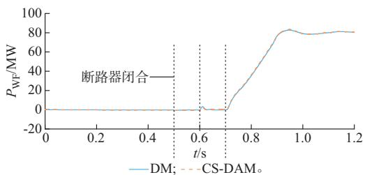  
(a) 风电场有功功率

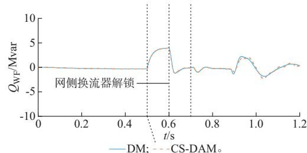

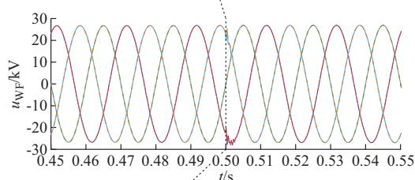  
(b) 风电场无功功率   
A相: DM, CS-DAM; B相: DM, CS-DAM;

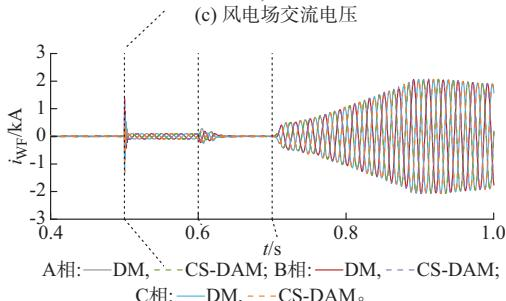  
DM, CS-DAM。

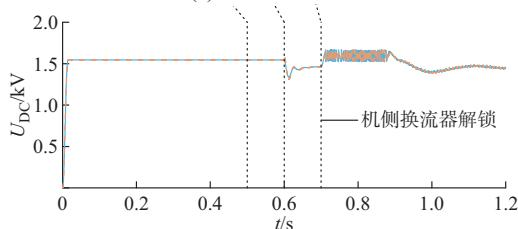  
(d) 风电场交流电流   
DM; CS-DAM。  
(e) 机组直流电压  
图4 启动阶段DM和CS-DAM的仿真波形  
Fig. 4 Simulation waveforms of DM and CS-DAM during startup period

位延迟时间和振荡频率绝对误差分别为 13.7 ms和 0.83 Hz；风电场无功功率的最大绝对误差为；发生小扰动机组交流电流的相位延迟时间和振荡频率绝对误差分别为 11.3 ms 和0.38 Hz；有功功率的相位延迟时间和振荡频率绝对误差分别为 11.2 ms和 0.31 Hz；机组直流电压的相

位延迟时间和振荡频率绝对误差分别为10.5 ms和0.51 Hz。未发生小扰动机组的交流电流、有功功率和机组直流电压的最大相对误差分别为 2.04%、0.71% 和 1.87%。 在 小 扰 动 过 程 中 ，虽 然 DM 和CS-DAM 在风电机组层面的仿真波形有一定相位的误差，但风电场级层面仍具有良好的重合度，且振荡 频 率 误 差 较 小 ，进 一 步 验 证 了 CS-DAM 的 准确性。

# 3. 1. 4　短路故障阶段

工况设置：在 2.8 s时，风电场交流出口侧发生持续时间为625 ms、过渡电阻为50 mΩ的三相短路故障。故障发生后，风电场出口交流电压跌落，输出有功功率受阻，出现功率倒送现象；故障清除后，系统逐渐恢复稳定运行。

附录A图A5给出了DM和CS-DAM在短路故障阶段风电场的输出有功功率、无功功率、交流电压、交流电流及机组直流电压波形图。

风电场有功功率、无功功率、交流电压、交流 电 流 和 机 组 直 流 电 压 的 误 差 分 别 为 5.86%、2.106 7 Mvar、3.32%、6.82%、9.35%。 由 于 有 功 功率出现过零点，基准低导致相对误差放大。DM和CS-DAM在短路故障阶段的仿真波形重合度较高，在风电场级层面的最大相对误差为5.86%。

# 3. 2　解耦建模方法误差影响因素验证

为验证受控源解耦建模方法误差的影响因素，对比了不同仿真步长下 CS-DAM 各个仿真阶段的误差。附录A图A6给出了仿真步长分别为5 μs和10 μs 下，各个阶段 CS-DAM 的误差对比图。图A6（a）为各个阶段下 CS-DAM 的相对误差 ，图A6（b）和（c）分别为小扰动阶段下CS-DAM的相位延迟时间和频率绝对误差。本节工况设置与3.1节保持一致。

由附录 A 图 A6可知，启动阶段和稳态阶段的前后步长内参数变化很小。因此，仿真步长降低后，CS-DAM 的相对误差没有明显降低。系统仿真步长降低后，CS-DAM在小扰动阶段和短路故障阶段的相对误差降低，在小扰动阶段CS-DAM的相位延迟时间以及频率绝对误差明显降低，说明了系统仿真步长对解耦建模方法准确性的影响。

# 3. 3　仿真加速效果验证

为验证CS-DAM的加速效果，按照图1所示拓扑分别搭建了包含 1~30台风电机组的风电场，用于测试不同风电机组数下，DM和CS-DAM的CPU仿真用时和加速比。测试所采用的计算机配置为

2.10 GHz Intel Core i7-1260P，测试系统仿真步长为10 μs，仿真时间为 1 s。

表1记录了不同风电机组数下DM和CS-DAM的 CPU 仿真用时和加速比。图 5展示了两种模型的仿真用时和加速比随风电机组数变化的趋势。

表1 DM和CS-DAM仿真时间和加速比对比 Table 1 Comparison of simulation time and acceleration rate between DM and CS-DAM   

<table><tr><td>风电机组数量/台</td><td>DM仿真时间/s</td><td>CS-DAM仿真时间/s</td><td>加速比</td></tr><tr><td>1</td><td>17.33</td><td>10.11</td><td>1.71</td></tr><tr><td>2</td><td>80.64</td><td>10.97</td><td>7.35</td></tr><tr><td>5</td><td>384.14</td><td>30.41</td><td>12.63</td></tr><tr><td>10</td><td>2058.78</td><td>43.94</td><td>46.85</td></tr><tr><td>15</td><td>5448.30</td><td>56.50</td><td>96.43</td></tr><tr><td>20</td><td>10596.62</td><td>87.33</td><td>121.34</td></tr><tr><td>25</td><td>18073.16</td><td>123.95</td><td>145.81</td></tr><tr><td>30</td><td>42702.20</td><td>161.81</td><td>263.90</td></tr></table>

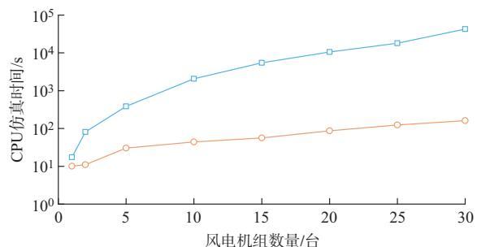  
(a) CPU仿真时间

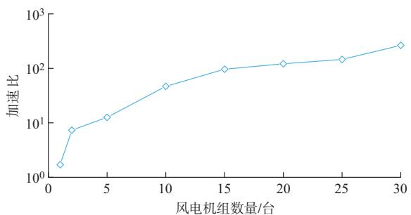  
(b) 加速比  
DM; CS-DAM。  
图5 不同机组数量下DM和CS-DAM的提速效果对比 Fig. 5 Comparison of acceleration effect between DM and CS-DAM under different wind turbine numbers

由图5可知，对于单台风力发电机组，CS-DAM对于仿真速度的提升不明显。随着风电机组数的增多，CS-DAM的CPU仿真时间呈线性增长，加速比逐渐提高。当风电机组增加到30台时，CS-DAM的计算效率相较于 DM 提高了 2个数量级，加速比达到了 263.90 倍。

主流电力系统仿真软件电磁暂态仿真效率低的

主要原因有以下2方面：一是系统节点数；二是仿真步长。虽然CS-DAM保留了换流器开关模型，但在仿真步长不变的前提下，影响系统计算效率的原因主要是系统节点数。因此，本文所提CS-DAM将大系统分解为若干小系统进行求解，降低了解算过程中的矩阵阶数，实现了仿真加速。

# 4 结 语

为解决大规模海上风电存在的风电机组数量多、仿真速度慢的问题，本文提出一种电磁暂态解耦加速模型以提高大规模海上风电的仿真速度。在仿真步长较小时，可利用受控源传递端口信息实现风电机组之间以及风电机组内部的解耦，将原始高阶网络拆分成多个子系统进行求解以提高仿真速度。具体结论如下：

1）所提解耦加速模型建模方法简单，具有较强的通用性、灵活扩展性，通过仿真软件中的现有模块即可搭建，不依赖于具体的电磁暂态仿真环境。可与其他建模方法互补，弥补其灵活性不足的问题。  
）所提解耦加速模型具有较高的仿真精度，可以准确仿真风电场的启动、换流器解闭锁、次同步振荡及短路故障等各种暂稳态工况。风电场级层面有功功率误差不超过5.86%。  
3）所提解耦加速模型在保留原有模型精度的前提下，可以显著缩短仿真时间。与详细模型相比，解耦加速模型可实现1~2个数量级的加速效果。  
）所提解耦加速模型的仿真精度受系统仿真步长影响。系统仿真步长较大时，解耦建模方法的误差较大。解耦建模方法的稳定性分析将是下一步的研究方向。

附录见本刊网络版（http：//www.aeps-info.com/aeps/ch/index.aspx），扫英文摘要后二维码可以阅读网络全文。

# 参 考 文 献

［1］Global Wind Energy Council. Global wind report 2022［R］. Brussels， Belgium： Global Wind Energy Council，2022.   
［2］郭琦，卢远宏.新型电力系统的建模仿真关键技术及展望［J］.电力系统自动化，2022，46（10）：18-32.  
GUO Qi， LU Yuanhong. Key technologies and prospects ofmodeling and simulation of new power system［J］. Automation ofElectric Power Systems，2022，46（10）：18-32.  
［3］吴磊，晁璞璞，李甘，等.数据-模型混合驱动的风电场聚合等值建模方法［J］.电力系统自动化，2022，46（15）：66-74.  
WU Lei， CHAO Pupu， LI Gan， et al. Hybrid data-model-driven

aggregation equivalent modeling method for wind farm ［J］.Automation of Electric Power Systems，2022，46（15）：66-74.  
［4］薛翼程，张哲任，徐政.适用于短路故障分析的风电场动态等值建模方法［J］. 太阳能学报，2022，43（5）：327-335.  
XUE Yicheng， ZHANG Zheren， XU Zheng. Dynamicequivalent model of wind farm for short-circuit faults analysis［J］.Acta Energiae Solaris Sinica，2022，43（5）：327-335.  
［5］LIU H K，XIE X R，HE J B， et al. Subsynchronous interaction between direct-drive PMSG based wind farms and weak AC networks［J］. IEEE Transactions on Power Systems，2017，32 （6）：4708-4720.   
［6］穆世霞，侯俊贤，王虹富，等 .双馈风力发电机组快速电磁暂态仿真模型［］电力系统自动化， ，（ ）： -  
MU Shixia， HOU Junxian， WANG Hongfu， et al. Fastelectromagnetic transient simulation model of doubly-fedinduction generator based wind turbine ［J］. Automation ofElectric Power Systems，2019，43（9）：147-153.  
［7］夏玥，李征，蔡旭，等 .基于直驱式永磁同步发电机组的风电场动态建模［J］. 电网技术，2014，38（6）：1439-1445.  
XIA Yue， LI Zheng， CAI Xu， et al. Dynamic modeling of windfarm composed of direct-driven permanent magnet synchronousgenerators［J］. Power System Technology，2014，38（6）：1439-1445.  
［ ］吴志鹏，裴建华，李银红 基于低电压穿越功率特性的双馈风电场多机等值方法［］电力系统自动化， ，（ ）： -  
WU Zhipeng， PEI Jianhua， LI Yinhong. Multi-machine equivalent method for DFIG-based wind farm based on power characteristic of low voltage ride-through［J］. Automation of Electric Power Systems，2022，46（19）：95-103.   
［9］潘学萍，戚相威，梁伟，等 .综合模型聚合和参数辨识的风电场多机等值及参数整体辨识［J］.电力自动化设备，2022，42（1）：124-132.  
PAN Xueping， QI Xiangwei， LIANG Wei， et al. Multi-machineequivalence and global identification of wind farms by combiningmodel aggregation and parameter estimation［J］. Electric PowerAutomation Equipment，2022，42（1）：124-132.  
［10］ZOU M，WANG Y，ZHAO C， et al. Integrated equivalent model of permanent magnet synchronous generator based wind turbine for large-scale offshore wind farm simulation［J/OL］. Journal of Modern Power Systems and Clean Energy［2023-04- 30］. https：//10.35833/MPCE.2022.000495.   
［11］ZOU M， ZHAO C Y， XU J Z. Modeling for large-scaleoffshore wind farm using multi-thread parallel computing［J］.International Journal of Electrical Power & Energy Systems，2023，148：108928.  
［12］姚蜀军，刘刚，曾子文，等.直驱风力发电单元的电磁暂态半隐式延迟解耦与仿真方法［］中国电机工程学报， ， （ ）：6053-6063.  
YAO Shujun， LIU Gang， ZENG Ziwen， et al.Electromagnetic transient semi-implicit latency decoupling andsimulation technology for direct-drive wind power generationunit［J］. Proceedings of the CSEE，2022，42（16）：6053-6063.

［13］曹斌，王立强，赵永飞，等.基于PSCAD/EMTDC的大规模新能源并网电磁暂态并行仿真［J］. 中国电力，2020，53（11）：154-161.  
CAO Bin， WANG Liqiang， ZHAO Yongfei， et al.Electromagnetic transient parallel simulation of large-scale newenergy grid connection based on PSCAD/EMTDC［J］. ElectricPower，2020，53（11）：154-161.  
［14］LI Y P，SHU D W，SHI F， et al. A multi-rate co-simulation of combined phasor-domain and time-domain models for largescale wind farms ［J］. IEEE Transactions on Energy Conversion，2020，35（1）：324-335.   
［15］许建中，赵成勇，刘文静.超大规模MMC电磁暂态仿真提速模型［J］. 中国电机工程学报，2013，33（10）：114-120.  
XU Jianzhong， ZHAO Chengyong， LIU Wenjing. Acceleratedmodel of ultra-large scale MMC in electromagnetic transientsimulations［J］. Proceedings of the CSEE，2013，33（10）：114-120.  
［16］安峰，崔彬，白睿航，等.高压大容量直流变压器模块化离散解耦等效建模方法［J］.电力系统自动化，2021，45（7）：79-86.  
AN Feng， CUI Bin， BAI Ruihang， et al. Modular discretedecoupling equivalent modeling method for high-voltage large-capacity DC transformer［J］. Automation of Electric PowerSystems，2021，45（7）：79-86.  
［ ］程启明，刘科，程尹曼，等 基于调制系数最优法的 -新型直接转矩控制［ ］ 电力自动化设备：-［2023-04-30］. https：//kns. cnki. net/kcms2/article/abstract？ v=3uoqIhG8C45S0n9fL2suRadTyEVl2pW9UrhTDCdPD64GuMGdYvUCEmiB1GTA1qad4URBGFcuFikt8LHz4t9eLhrXsHXf0YxV&uniplatform=NZKPT.  
CHENG Qiming， LIU Ke， CHENG Yinman， et al. New direct torque control of TLDMC-PMSM based on modulation coefficient optimization method ［J/OL］. Electric Power Automation Equipment：1-15［2023-04-30］. https：//kns. cnki. net/kcms2/article/abstract？ v=3uoqIhG8C45S0n9fL2suRadT yEVl2pW9UrhTDCdPD64GuMGdYvUCEmiB1GTA1qad4U RBGFcuFikt8LHz4t9eLhrXsHXf0YxV&uniplatform=NZK PT.   
［18］MAHDI D， ARINDAM G. Controlling current and voltagetype interfaces in power hardware-in-the-loop simulations［J］.IET Power Electronics，2014，7（10）：2618-2627.

（编辑 章黎）

# Electromagnetic Transient Controlled Source Based Decoupling Acceleration Model for Large-scale Offshore Wind Farm

ZOU Ming， WANG Yan， XU Jianzhong， ZHAO Chengyong

(State Key Laboratory of Alternate Electrical Power System with Renewable Energy Sources

(North China Electric Power University), Beijing 102206, China)

Abstract: With the increase of installed capacity and proportion of wind power, the problem of extremely slow electromagnetic transient simulation speed of large-scale wind farms is becoming more and more prominent. In view of the complexity of the existing modeling methods, the inability to reflect internal characteristics of the wind farm, and the lack of flexibility, this paper proposes an electromagnetic transient controlled source based decoupling acceleration model (CS-DAM) for the large-scale offshore wind farm. This method realizes the decoupling between the internal components of the wind turbine (WT) and the ports between different WTs by transmitting the voltage and current information between the ports through the controlled source, so that the highorder matrix in the system solution process is decomposed into multiple small matrices to achieve simulation acceleration. The effectiveness of the method is proved based on the node analysis method and Kirchhoff’s law. The proposed modeling method of CS-DAM, which can build a model by dragging existing modules in the simulation software, is simple. The CS-DAM can accurately simulate various transient and steady-state conditions of the wind farm, and the acceleration effect is obvious. Meanwhile, the proposed CS-DAM can complement the methods proposed in the existing literature and expand their flexibility. Finally, wind farm models with different numbers of WTs are built in PSCAD/EMTDC to verify the simulation accuracy and acceleration effect of the CS-DAM. The results show that the proposed CS-DAM can achieve acceleration effects of 1~2 orders of magnitude, and has higher simulation accuracy compared to the detailed model.

This work is supported by National Natural Science Foundation of China (No. 52277094) and Technology Project of China Huaneng Group Co., Ltd. (No. HNKJ20-H88).

Key words: offshore wind farm; wind turbine; electromagnetic transient simulation; controlled source based decoupling acceleration model; equivalent modeling

