Received 13 November 2024; revised 21 December 2024; accepted 27 December 2024. Date of publication 3 January 2025; date of current version 29 January 2025. The review of this article was arranged by Associate Editor Yingyi Yan.

Digital Object Identifier 10.1109/OJPEL.2024.3525019

# Discretized Impedance-Based Modeling of Converter-Interfaced Energy Resources for State-Variable-Based Real-Time EMT Simulators

TALEB VAHABZADEH (Member, IEEE), SEYYEDMILAD EBRAHIMI 2 (Member, IEEE), AND JURI JATSKEVICH 3 (Fellow, IEEE)

1Electric Power Engineers, LLC., Austin, TX 78735 USA

2School of Electrical Engineering and Computer Science, Washington State University, Pullman, WA 99163 USA

3Electrical and Computer Engineering Department, University of British Columbia, Vancouver, BC V6T 1Z4, Canada

CORRESPONDING AUTHOR: SEYYEDMILAD EBRAHIMI (e-mail: s.ebrahimi@wsu.edu)

This work was supported by the Natural Sciences and Engineering Research Council (NSERC) of Canada under the Collaborative Research and Development Grant.

ABSTRACT Modern power systems are experiencing high penetration of voltage-source converter (VSC)- interfaced distributed energy resources and loads. Design, analysis, and reliable operation of such systems require extensive offline and real-time electromagnetic transient (EMT) simulations. This paper proposes discretized impedance-based modeling (DIBM) of VSCs for efficient time-domain transient analysis in state-variable (SV)-based EMT simulators. Specifically, the VSC-based systems are first represented as admittance-based models in Laplace domain, and then they are discretized and formulated to construct a Thévenin equivalent impedance matrix and history voltages that can be interfaced seamlessly with external systems in SV-based simulators. By replacing VSC subsystems with Thévenin equivalent circuits, the proposed DIBM technique significantly reduces the number of states and eliminates the need for fictitious snubbers that may be needed in SV-based EMT simulators for compatible interfacing. The effectiveness of the proposed DIBM approach over the conventional method that uses average value models of VSCs is demonstrated on a seven-bus VSC-based system in offline (MATLAB Simscape Electrical) and real-time (OPAL-RT) EMT simulators. It is verified that the proposed method enables high accuracy and larger simulation time steps while also significantly improving the overall computational performance.

INDEX TERMS Admittance-based modeling, average-value model (AVM), discretization, EMT simulation, impedance-based modeling, interfacing, state-variable, voltage source converter (VSC).

# I. INTRODUCTION

The adoption of renewable and distributed energy resources (R/DERs) has surged in modern electric power systems, prompting significant changes in electricity generation, transmission, and distribution [1], [2]. The interfacing of such R/DERs into conventional power grids is mainly done using power-electronic-based voltage-source converters (VSCs) [3]. While the increasing use of power electronics offers potential benefits such as enhanced controllability, sustainability, and overall efficiency, it also introduces new challenges [4]. These challenges include, but are not limited to, faster system

dynamics and potential sub/super-synchronous converter-grid interactions [5], [6]. With the increasing deployment of VSCs and the rapid evolution of grid dynamics, there is a need for advanced simulation tools capable of analyzing modern power-electronic-based systems efficiently and accurately [7].

The so-called state-variable-based (SV-based, e.g., MAT-LAB Simscape Electrical, PLECS, OPAL-RT, Typhoon HIL [8], [9], [10], [11]) and nodal-analysis-based (NA-based, e.g., PSCAD, MicroTran, EMTP, RTDS [12], [13], [14], [15]) electromagnetic transient (EMT) programs are among the most common tools for studying modern power systems with

fast transients. The SV-based programs utilize a differentialalgebraic modeling approach to represent all system components, from which the state-space equations are constructed. These equations are subsequently discretized and numerically solved using ordinary differential equation (ODE) solvers [16], [17]. Although SV-based simulators are very effective for studying small-scale power systems and power electronics, they are computationally expensive for the analysis of largescale VSC-based systems [18]. The offline SV-based packages (e.g., MATLAB Simscape Electrical and PLECS) do not have time constraints and may offer variable time-step ODE solvers for enhanced simulation efficiency. The real-time SV-based simulators (e.g., OPAL-RT and Typhoon HIL) are constrained to fixed-time steps due to interfacing with hardware and the real-time simulation environment.

The NA-based programs, on the other hand, are based on the discretization of the differential equations at the component level (typically using the numerical trapezoidal rule of integration) [19]. This, in turn, results in a set of difference equations that are formulated in the nodal form and solved at each time step. Employing the fixed simulation time steps (which is the case in most non-iterative NA-based programs), the nodal equations become time-invariant, resulting in significant computational efficiency [19]. Furthermore, in systems with switching converters, the switching elements can be modeled using a constant conductance and a current injection to represent the off- and on-states of the switches [20]. This modeling approach avoids the use of iterative methods to handle switching events and ensures that the overall conductance matrix remains constant.

Using both SV- and NA-based programs, the time-domain transients of VSC-based systems can be reproduced with relatively high accuracy by representing the power-electronic converters with their detailed switching models [21]. The detailed switching models are discrete and event-driven, allowing for the accurate reproduction of voltage and current waveforms. However, they necessitate small simulation time steps that significantly slow down simulation studies. Alternatively, the average-value models (AVMs), which are non-switching, were developed to alleviate the computational burden while preserving the slower dynamics [21], [22], [23], [24]. Although the AVMs of converters are continuous and generally allow using larger simulation time steps, the time step delay inherent in the interfacing of the AVMs [25], [26], [27] and the time step delay in the interfacing of control systems with external networks [29] result in numerical inaccuracies or instabilities; thus, restricting the largest possible time step size.

A directly interfaced AVM (DI-AVM) for VSCs was developed to eliminate the simulation time-step delays in conventional AVMs [25], [26], [27] for NA-based simulators. This was achieved by formulating the AVM as a conductance matrix integrated with the overall network nodal equations for a simultaneous solution with external subsystems, thereby avoiding latency. While the DI-AVM allows for larger

simulation time steps, it introduces a time-varying conductance matrix that requires additional calculations at every simulation step. More recently, a constant-parameter DI-AVM (CP-DI-AVM) was proposed for more efficient simulations of VSC-based power-electronic systems in NA-based simulators, which does not require re-calculation of the network conductance matrix at each simulation time step [28]. This was achieved through a numerical approximation. Although both the DI-AVM [25] and the CP-DI-AVM [28] can effectively eliminate the interfacing time-step delay in the implementation of VSC AVMs, they are specifically derived for NA-based simulators, such as PSCAD and RTDS. Although a direct translation of the method in [25] and [28] to SV-based simulators (e.g., MATLAB, Opal-RT, etc.) is possible, it would offer only limited improvements due to interfacing.

Recent research efforts have been made to employ admittance-based modeling (ABM) to improve the EMT simulations of VSC-based systems in SV-based programs [30], [31], [32]. In ABMs, the converters are typically expressed as transfer functions in Laplace domain, which are able to capture the dynamic behavior at the interfacing terminals but without disclosure of the internal details. In [30], the ABMs of grid-following converter-based resources were represented as proper transfer functions and interfaced with external systems using dependent current sources and snubbers in the MATLAB/Simulink environment. Although some noticeable computational advantages become achievable, the size of the state space equations to be solved is not affected, resulting in the same state count as the conventional AVMs of converters. Such representation also has some limitations regarding numerical accuracy due to employing fictitious interfacing snubbers, which increases the system’s numerical stiffness and introduces error.

In [31] and [32], a MATLAB/Simulink-based open-source toolbox was introduced that utilizes the state space representation of electrical components to perform dynamic stability and sensitivity analysis of inverter-based resources via admittance/ impedance modeling. For time-domain simulations, the admittance models undergo discretization using the forward Euler integration rule, and the resulting discretized equations are then integrated into the Simulink environment using dependent sources and snubbers. The presence of a time-step delay at the interface with external systems and the use of the Euler method limit the possible simulation time step size and accuracy of this approach.

Moreover, an ABM was recently proposed in [33] to improve the time-domain simulations of VSCs by reducing the effective network size and eliminating interfacing time step delays. However, the method in [33], similar to [25], [26], [27], [28], has been developed for NA-based simulators. Although the direct and brute-force translation of the method in [33] to the SV-based EMT programs may be possible, it may also result in only limited improvements. For example, the implementation of the Norton equivalent circuit proposed

in [33] in SV-based programs necessitates fictitious snubbers, potentially impacting the numerical stability and accuracy of simulations.

To address some of the aforementioned challenges, this paper proposes a novel discretized impedance-based modeling (DIBM) of VSCs for time-domain transient analysis in SV-based programs. Specifically, the VSC-based systems with interfacing filters and controllers are first represented as ABMs in the form of transfer functions in Laplace domain. These ABMs are discretized, similar to the NA-type simulators, and then formulated to construct a Norton equivalent admittance matrix and current history sources at the interfacing terminals (nodes). The Norton circuit can be converted into a Thévenin equivalent circuit. The proposed DIBM method substitutes the VSC and its control system with a Thévenin equivalent impedance matrix and history voltage sources to interface with external systems in SV-based simulators. This approach substantially reduces the number of states and eliminates the need for fictitious snubbers that may be needed in SV-based EMT simulators for compatible interfacing.

The effectiveness of the proposed approach is demonstrated on a seven-bus VSC-based system simulated using offline MATLAB Simscape Electrical and real-time OPAL-RT simulators. In the context of the examined VSC-based power system, the proposed approach offers several benefits:

The proposed DIBM eliminates time-step delays in interfacing models of VSCs with control systems and external networks while also avoiding the need for fictitious snubbers, thus improving both accuracy and numerical stability.   
The proposed DIBM enhances computational efficiency and achieves up to four times computational improvement (per time step) compared to conventional AVMs of VSCs in real-time simulators.   
- The proposed DIBM allows the use of larger simulation time steps, up to one millisecond (1 ms). In contrast, the AVMs of VSCs are constrained to simulation time steps of approximately 80 microseconds (80 µs) to maintain reasonable accuracy and numerical stability.   
The proposed DIBM method is versatile and can be applied to most SV-based simulation environments without the need for additional add-on tools, making it easy to implement and use.

# II. ADMITTANCE-BASED MODELING OF VSCS

A generic VSC-based system considered in this paper is shown in Fig. 1. Herein, the VSC is assumed to have a common two-level topology [21], where it is connected to the grid at the point of common coupling (PCC). Without loss of generality, a sinusoidal pulse-width modulation (SPWM) is assumed for the switching converter. The ac system is represented by the Thévenin equivalent of the grid, as depicted in Fig. 1. In this paper, a grid-following VSC is considered with two commonly used control configurations. For the first case, the PI-based controller is implemented in the dq-frame

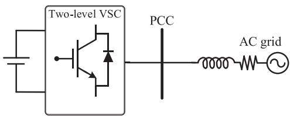  
FIGURE 1. A simplified single-line diagram of a three-phase grid-connected VSC.

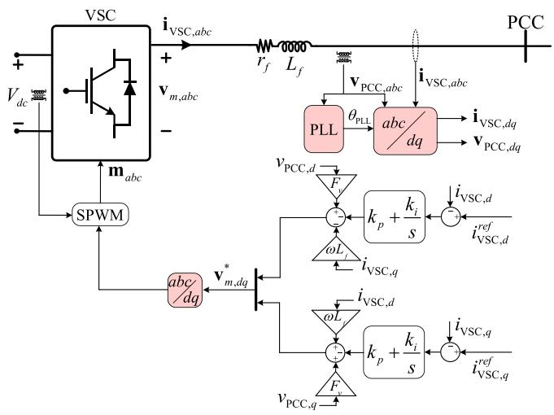  
FIGURE 2. A simplified single-line diagram of a grid-connected VSC with dq vector PI-based control (the nonlinear elements of the controller are highlighted in red).

and dq-vector control is used [34], [35]. In the second case, the proportional-resonant (PR) controller in the stationary αβ-frame is used [36], [37]. The proposed DIBM technique is formulated and implemented for both configurations to demonstrate its applicability in cases where VSCs utilize Park’s and Clark’s transformations for synchronization with the grid.

# A. ABM OF VSC WITH DQ-VECTOR PI-BASED CONTROL

The VSC system with dq-vector PI-based control is shown in Fig. 2, where the voltages $\mathbf { v } _ { m , a b c }$ are modulated from the dc bus voltage $V _ { d c }$ . As shown in Fig. 2, the VSC ac output terminals are connected to an RL-filter, and the converter is synchronized with the grid through a phase-locked-loop (PLL).

To derive the ABM, the VSC system physical variables in the abc-coordinates need to be transformed into the dq-frame using Park’s transformation as

$$
\mathbf {i} _ {\mathrm {V S C}, d q} = \mathbf {K} _ {s} \mathbf {i} _ {\mathrm {V S C}, a b c}, \quad \mathbf {v} _ {\mathrm {P C C}, d q} = \mathbf {K} _ {s} \mathbf {v} _ {\mathrm {P C C}, a b c}, \tag {1}
$$

where

$$
\mathbf {K} _ {s} = \frac {2}{3} \left[ \begin{array}{l l l} \cos \left(\theta_ {\mathrm {P L L}}\right) & \cos \left(\theta_ {\mathrm {P L L}} - 2 \pi / 3\right) & \cos \left(\theta_ {\mathrm {P L L}} + 2 \pi / 3\right) \\ \sin \left(\theta_ {\mathrm {P L L}}\right) & \sin \left(\theta_ {\mathrm {P L L}} - 2 \pi / 3\right) & \sin \left(\theta_ {\mathrm {P L L}} + 2 \pi / 3\right) \end{array} \right]. \tag {2}
$$

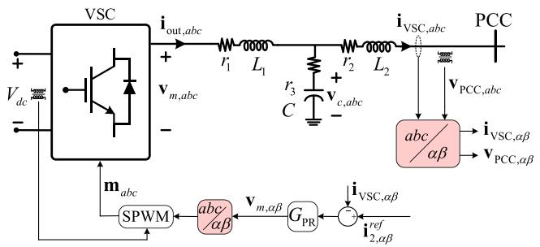  
FIGURE 3. A simplified single-line diagram of a grid-connected VSC with PR-based control (the nonlinear elements of the controller are highlighted in red).

The equations governing the VSC’s dq-vector control in Fig. 2 can be expressed in Laplace domain as

$$
v _ {m, d} ^ {*} = - \frac {s k _ {p} + k _ {i}}{s} \left(i _ {\mathrm {V S C}, d} ^ {r e f} - i _ {\mathrm {V S C}, d}\right) - \omega L _ {f} i _ {\mathrm {V S C}, q} + F _ {v} v _ {\mathrm {P C C}, d}, \tag {3}
$$

$$
v _ {m, q} ^ {*} = - \frac {s k _ {p} + k _ {i}}{s} \left(i _ {\mathrm {V S C}, q} ^ {r e f} - i _ {\mathrm {V S C}, q}\right) + \omega L _ {f} i _ {\mathrm {V S C}, d} + F _ {v} v _ {\mathrm {P C C}, q}, \tag {4}
$$

where $\omega$ is the estimated angular frequency, and $k _ { p }$ and $k _ { i }$ are the PI gains. Here, $\mathbf { i } _ { \mathrm { V S C } , d q } ^ { r e f }$ are the VSC current references.

The equations describing the voltage drop of the RL-filter can be written in the dq-frame in Laplace domain as

$$
v _ {m, d} ^ {*} - v _ {\mathrm {P C C}, d} = r _ {f} i _ {\mathrm {V S C}, d} + s L _ {f} i _ {\mathrm {V S C}, d} - \omega L _ {f} i _ {\mathrm {V S C}, q}, \tag {5}
$$

$$
v _ {m, q} ^ {*} - v _ {\mathrm {P C C}, q} = r _ {f} i _ {\mathrm {V S C}, q} + s L _ {f} i _ {\mathrm {V S C}, q} + \omega L _ {f} i _ {\mathrm {V S C}, d}. \tag {6}
$$

Combining (3), (4) with (5), (6) for the VSC system in Fig. 2, including the RL-filter and the current-control loop, one can formulate an admittance-based transfer matrix model in Laplace domain as

$$
\mathbf {i} _ {\mathrm {V S C}, d q} = \mathbf {A} _ {\mathrm {V S C}, d q} (s) \mathbf {v} _ {\mathrm {P C C}, d q} + \mathbf {B} _ {\mathrm {V S C}, d q} (s) \mathbf {i} _ {\mathrm {V S C}, d q} ^ {r e f}, \tag {7}
$$

where

$$
\mathbf {A} _ {\mathrm {V S C}, d q} (s) = \frac {s \left(F _ {v} - 1\right)}{s ^ {2} L _ {f} + s \left(r _ {f} - k _ {p}\right) - k _ {i}} \mathbf {I} _ {2},
$$

$$
\mathbf {B} _ {\mathrm {V S C}, d q} (s) = \frac {- s k _ {p} - k _ {i}}{s ^ {2} L _ {f} + s \left(r _ {f} - k _ {p}\right) - k _ {i}} \mathbf {I} _ {2}. \tag {8}
$$

Here, $\mathbf { I } _ { 2 }$ is $\mathrm { ~ a ~ } 2 \ \times \ 2$ identity matrix. The transfer matrix $\mathbf { A } _ { \mathrm { V S C } , d q }$ specifies the relationship between the $d -$ and q-axes output currents of the VSC and their corresponding PCC voltages; and the transfer matrix ${ \bf B } _ { \mathrm { V S C } , d q }$ specifies the relationship between d- and q-axes output currents of the VSC system and the dq current references.

# B. ABM OF VSC WITH PR-BASED CONTROL

Fig. 3 shows a VSC connected to the grid through an $L C L \cdot$ - filter at the PCC. Therein, an inner current-control loop is utilized, which establishes the required VSC output voltages $( \mathrm { i } . \mathrm { e } . , \mathrm { v } _ { m , a b c } )$ using a PR controller denoted by GPR.

The physical variables of the VSC system in the abccoordinates can be transformed into the stationary $\alpha \beta \mathrm { \cdot }$ -frame using Clarke’s transformation as

$$
\mathbf {i} _ {\mathrm {V S C}, \alpha \beta} = \mathbf {T} _ {\alpha \beta} \mathbf {i} _ {\mathrm {V S C}, a b c}, \quad \mathbf {v} _ {\mathrm {P C C}, \alpha \beta} = \mathbf {T} _ {\alpha \beta} \mathbf {v} _ {\mathrm {P C C}, a b c}, \tag {9}
$$

where

$$
\mathbf {T} _ {\alpha \beta} = \frac {1}{3} \left[ \begin{array}{c c c} 2 & - 1 & - 1 \\ 0 & \sqrt {3} & - \sqrt {3} \end{array} \right]. \tag {10}
$$

The equations describing the LCL filter shown in Fig. 3 can be expressed in the αβ-frame in Laplace domain as

$$
\mathbf {i} _ {\text {o u t}, \alpha \beta} = \frac {1}{s L _ {1} + r _ {1} + r _ {3}} \left(\mathbf {v} _ {m, \alpha \beta} - \mathbf {v} _ {c, \alpha \beta} + r _ {3} \mathbf {i} _ {\mathrm {V S C}, \alpha \beta}\right), \tag {11}
$$

$$
\mathbf {i} _ {\mathrm {V S C}, \alpha \beta} = \frac {1}{s L _ {2} + r _ {2} + r _ {3}} \left(\mathbf {v} _ {c, \alpha \beta} - \mathbf {v} _ {\mathrm {P C C}, \alpha \beta} + r _ {3} \mathbf {i} _ {\text {o u t}, \alpha \beta}\right), \tag {12}
$$

$$
\mathbf {v} _ {c, \alpha \beta} = \frac {1}{s C} \left(\mathbf {i} _ {\text {o u t}, \alpha \beta} - \mathbf {i} _ {\mathrm {V S C}, \alpha \beta}\right). \tag {13}
$$

Moreover, the modulated output voltages of the VSC in Fig. 3 can be calculated as

$$
\mathbf {v} _ {m, \alpha \beta} = G _ {\mathrm {P R}} (s) \left(\mathbf {i} _ {\mathrm {V S C}. \alpha \beta} ^ {r e f} - \mathbf {i} _ {\mathrm {V S C}. \alpha \beta}\right), \tag {14}
$$

where

$$
G _ {\mathrm {P R}} (s) = \frac {s ^ {2} k _ {\mathrm {P R} 1} + s \left(k _ {\mathrm {P R} 2} + 2 \omega_ {c} k _ {\mathrm {P R} 1}\right) + k _ {\mathrm {P R} 1} \omega_ {0} ^ {2}}{s ^ {2} + s 2 \omega_ {c} + \omega_ {0} ^ {2}}. \tag {15}
$$

Here, $\omega _ { c }$ and $\omega _ { 0 }$ are the cutoff and nominal angular frequencies of the controller, and $k _ { P R 1 }$ and $k _ { P R 2 }$ are the PR controller gains, respectively.

Subsequently, substituting (14) and (15) into (11) used along with (11)–(13), the ABM of the VSC can be formulated as [33], [37], [38]

$$
\begin{array}{l} \mathbf {i} _ {\mathrm {V S C}, \alpha \beta} = \underbrace {\frac {n _ {5} s ^ {5} + n _ {4} s ^ {4} + n _ {3} s ^ {3} + n _ {2} s ^ {2} + n _ {1} s ^ {1} + n _ {0}}{d _ {5} s ^ {5} + d _ {4} s ^ {4} + d _ {3} s ^ {3} + d _ {2} s ^ {2} + d _ {1} s ^ {1} + d _ {0}} \mathbf {I} _ {2}} _ {\mathbf {A} _ {\mathrm {V S C}, \alpha \beta}} \mathbf {v} _ {\mathrm {P C C}, \alpha \beta} \\ + \underbrace {\frac {m _ {5} s ^ {5} + m _ {4} s ^ {4} + m _ {3} s ^ {3} + m _ {2} s ^ {2} + m _ {1} s ^ {1} + m _ {0}}{d _ {5} s ^ {5} + d _ {4} s ^ {4} + d _ {3} s ^ {3} + d _ {2} s ^ {2} + d _ {1} s ^ {1} + d _ {0}} \mathbf {I} _ {2}} _ {\mathbf {B} _ {\mathrm {V S C}, \alpha \beta}} \mathbf {i} _ {\mathrm {V S C}, \alpha \beta} ^ {\text {r e f}}, \tag {16} \\ \end{array}
$$

where coefficients $n _ { i } , m _ { i }$ , and $d _ { i }$ (for $i = 0 , . . . , 5 )$ are presented in Appendix A. In (16), the transfer matrix $\mathbf { A } _ { \mathrm { V S C } , \alpha \beta }$ specifies the relationship between the α- and β-axes output currents of the VSC system and their corresponding PCC voltages; and the transfer matrix $\mathbf { B } _ { \mathrm { V S C } , \alpha \beta }$ specifies the relationship between α- and $\beta \cdot$ -axes VSC system output currents and the $\alpha \beta$ current references.

# III. PROPOSED DISCRETIZED IMPEDANCE-BASED MODELING

The ABM of the VSCs in (7), (8) and (16) were used for time-domain simulations in [30] and [31]. More specifically, the output currents of the VSCs [i.e., iVSC, $, d q$ in (7) and iVSC,αβ

in (16)] are injected into the external systems using controlled current sources with fictitious snubbers. However, with such representations, the size of the overall state space model to be solved is not affected, and certain limitations may arise concerning the numerical accuracy, stability, and time step selection due to the snubbers. In this paper, the continuous ABMs of VSCs are discretized and reformulated to construct a Thévenin equivalent impedance matrix and voltage history terms to achieve a simultaneous and efficient solution of the VSCs with external networks.

# A. DISCRETIZATION OF ABM OF THE VSC WITH DQ-VECTOR PI-CONTROL

To conduct the time-domain simulations, the continuous ABM of the VSC with dq-vector PI-based control in (7) is discretized by substituting the Laplace variable $^ { 6 6 } { \boldsymbol { s } } ^ { \flat }$ with $\frac { 2 } { \Delta t } \frac { z - 1 } { z + 1 }$ for the trapezoidal rule of integration with time step t z 1 $\Delta t [ \mathrm { 1 9 } ]$ . Consequently, the result is expressed in the z-domain as

$$
\begin{array}{l} \mathbf {i} _ {\mathrm {V S C}, d q} (z) = \frac {a _ {2} z ^ {- 2} + a _ {1} z ^ {- 1} + a _ {0}}{c _ {2} z ^ {- 2} + c _ {1} z ^ {- 1} + c _ {0}} \mathbf {v} _ {\mathrm {P C C}, d q} (z) \\ + \frac {b _ {2} z ^ {- 2} + b _ {1} z ^ {- 1} + b _ {0}}{c _ {2} z ^ {- 2} + c _ {1} z ^ {- 1} + c _ {0}} \mathbf {i} _ {\mathrm {V S C}, d q} ^ {r e f} (z), \tag {17} \\ \end{array}
$$

where coefficients $a _ { j } , b _ { j }$ , and $c _ { j }$ (for $j = 0 , 1$ , and 2) are presented in Appendix B. Applying the z-inverse transform to $( 1 7 ) , z ^ { - 1 }$ becomes a delay corresponding to the simulation time step $\Delta t ,$ and the result can be expressed as

$$
\begin{array}{l} c _ {0} \mathbf {i} _ {\mathrm {V S C}, d q} (t) + c _ {1} \mathbf {i} _ {\mathrm {V S C}, d q} (t - \Delta t) + c _ {2} \mathbf {i} _ {\mathrm {V S C}, d q} (t - 2 \Delta t) \\ = a _ {0} \mathbf {v} _ {\mathrm {P C C}, d q} (t) + a _ {1} \mathbf {v} _ {\mathrm {P C C}, d q} (t - \Delta t) + a _ {2} \mathbf {v} _ {\mathrm {P C C}, d q} (t - 2 \Delta t) \\ + b _ {0} \mathbf {i} _ {\mathrm {V S C}, d q} ^ {r e f} (t) + b _ {1} \mathbf {i} _ {\mathrm {V S C}, d q} ^ {r e f} (t - \Delta t) + b _ {2} \mathbf {i} _ {\mathrm {V S C}, d q} ^ {r e f} (t - 2 \Delta t). \tag {18} \\ \end{array}
$$

For the purpose of the proposed DIBM, (18) can be organized as

$$
\mathbf {i} _ {\mathrm {V S C}, d q} (t) = \mathbf {G} _ {d q} ^ {\mathrm {P I}} \mathbf {v} _ {\mathrm {P C C}, d q} (t) + \mathbf {h} _ {d q} ^ {\mathrm {P I}} (t), \tag {19}
$$

wher e GPI $\mathbf { G } _ { d q } ^ { \mathrm { P I } }$ and $\mathbf { h } _ { d q } ^ { \mathrm { P I } } ( t )$ are the resultant conductance matrix and history terms of the ABM of the VSC system, respectively [19]. These terms can be expressed as

$$
\begin{array}{l} \mathbf {G} _ {d q} ^ {\mathrm {P I}} = \frac {a _ {0}}{c _ {0}} \mathbf {I} _ {2}, \mathbf {h} _ {d q} ^ {\mathrm {P I}} (t) = \frac {a _ {1}}{c _ {0}} \mathbf {v} _ {\mathrm {P C C}, d q} (t - \Delta t) + \frac {a _ {2}}{c _ {0}} \mathbf {v} _ {\mathrm {P C C}, d q} (t - 2 \Delta t) \\ + \frac {b _ {1}}{c _ {0}} \mathbf {i} _ {\mathrm {V S C}, d q} ^ {r e f} (t) + \frac {b _ {1}}{c _ {0}} \mathbf {i} _ {\mathrm {V S C}, d q} ^ {r e f} (t - \Delta t) + \frac {b _ {2}}{c _ {0}} \mathbf {i} _ {\mathrm {V S C}, d q} ^ {r e f} (t - 2 \Delta t) \\ - \frac {c _ {1}}{c _ {0}} \mathbf {i} _ {\mathrm {V S C}, d q} (t - \Delta t) + \frac {c _ {2}}{c _ {0}} \mathbf {i} _ {\mathrm {V S C}, d q} (t - 2 \Delta t). \tag {20} \\ \end{array}
$$

The current references i re fVSC,dq $\mathbf { i } _ { \mathrm { V S C } , d q } ^ { r e f }$ in (20) may be defined as the input of the system, or they can be computed from the power control references as [39]

$$
\mathbf {i} _ {\mathrm {V S C}, d q} ^ {r e f} = \frac {2}{3 \| \mathbf {v} _ {\mathrm {P C C} , d q} \| ^ {2}} \left[ \begin{array}{c c} v _ {\mathrm {P C C}, d} & v _ {\mathrm {P C C}, q} \\ v _ {\mathrm {P C C}, q} & - v _ {\mathrm {P C C}, d} \end{array} \right] \left[ \begin{array}{c} P ^ {r e f} \\ Q ^ {r e f} \end{array} \right]. \tag {21}
$$

The ABM (19) is established in the dq-frame. In order to interface it with external systems in the abc coordinates, it needs to undergo a transformation to be represented as

$$
\mathbf {i} _ {\mathrm {V S C}, a b c} (t) = \mathbf {G} _ {a b c} ^ {\mathrm {P I}} \mathbf {v} _ {\mathrm {P C C}, a b c} (t) + \mathbf {h} _ {a b c} ^ {\mathrm {P I}} (t), \tag {22}
$$

where

$$
\mathbf {G} _ {a b c} ^ {\mathrm {P I}} = \left[ \mathbf {K} _ {s} \right] ^ {\dagger} \mathbf {G} _ {d q} ^ {\mathrm {P I}} \left[ \mathbf {K} _ {s} \right], \quad \mathbf {h} _ {a b c} ^ {\mathrm {P I}} (t) = \left[ \mathbf {K} _ {s} \right] ^ {\dagger} \mathbf {h} _ {d q} ^ {\mathrm {P I}} (t). \tag {23}
$$

Here, $[ { \bf K } _ { s } ] ^ { \dagger }$ is the pseudo-inverse of Park transformation in (2).

# B. DISCRETIZATION OF ABM OF THE VSC WITH PR CONTROL

Substituting the Laplace variable “” with $\frac { 2 } { \Delta t } \frac { z - 1 } { z + 1 }$ ,the ABM +(16) can be discretized using the trapezoidal rule with time step $\Delta t$ and expressed as

$$
\begin{array}{l} \mathbf {i} _ {\mathrm {V S C}, \alpha \beta} (z) \\ = \frac {q _ {5} z ^ {- 5} + q _ {4} z ^ {- 4} + q _ {3} z ^ {- 3} + q _ {2} z ^ {- 2} + q _ {1} z ^ {- 1} + q _ {0}}{w _ {5} z ^ {- 5} + w _ {4} z ^ {- 4} + w _ {3} z ^ {- 3} + w _ {2} z ^ {- 2} + w _ {1} z ^ {- 1} + w _ {0}} \mathbf {v} _ {\mathrm {P C C}, \alpha \beta} (z) \\ + \frac {g _ {5} z ^ {- 5} + g _ {4} z ^ {- 4} + g _ {3} z ^ {- 3} + g _ {2} z ^ {- 2} + g _ {1} z ^ {- 1} + g _ {0}}{w _ {5} z ^ {- 5} + w _ {4} z ^ {- 4} + w _ {3} z ^ {- 3} + w _ {2} z ^ {- 2} + w _ {1} z ^ {- 1} + w _ {0}} \mathbf {i} _ {\mathrm {V S C}, \alpha \beta} ^ {\text {r e f}} (z). \tag {24} \\ \end{array}
$$

Here, similar to (17) and (18), the coefficients $q _ { i } , g _ { i } ,$ and $w _ { i }$ (for $i = 0 , \ldots , 5 )$ depend on the system parameters and the time-step size t used for the discretization. These coefficients are also summarized in Appendix C.

In this work, the trapezoidal rule of integration is selected for discretization due to its advantageous properties in terms of accuracy and good numerical stability [19].

The discretized ABM of the VSC in the time domain can be derived by applying the z-inverse transform to (24), and the result can be expressed as

$$
\begin{array}{l} \sum_ {j = 0} ^ {5} w _ {j} \mathbf {i} _ {\mathrm {V S C}, \alpha \beta} (t - j \Delta t) = \sum_ {j = 0} ^ {5} q _ {j} \mathbf {v} _ {\mathrm {P C C}, \alpha \beta} (t - j \Delta t) \\ + \sum_ {j = 0} ^ {5} g _ {j} \mathbf {i} _ {\mathrm {V S C}, \alpha \beta} ^ {r e f} (t - j \Delta t). \tag {25} \\ \end{array}
$$

Moreover, similar to (19), one can organize (25) as

$$
\mathbf {i} _ {\mathrm {V S C}, \alpha \beta} (t) = \mathbf {G} _ {\alpha \beta} ^ {\mathrm {P R}} \mathbf {v} _ {\mathrm {P C C}, \alpha \beta} (t) + \mathbf {h} _ {\alpha \beta} ^ {\mathrm {P R}} (t), \tag {26}
$$

where the conductance matri x GPR ${ \bf G } _ { \alpha \beta } ^ { \mathrm { P R } }$ and vector of history terms ${ \mathbf { h } } _ { \alpha \beta } ^ { \mathrm { P R } } ( t )$ h αβ can be expressed as

$$
\begin{array}{l} \mathbf {G} _ {\alpha \beta} ^ {\mathrm {P R}} = \frac {q _ {0}}{w _ {0}} \mathbf {I} _ {2}, \quad \mathbf {h} _ {\alpha \beta} ^ {\mathrm {P R}} (t) = \sum_ {j = 1} ^ {5} \frac {q _ {j}}{w _ {0}} \mathbf {v} _ {\mathrm {P C C}, \alpha \beta} (t - j \Delta t) \\ + \sum_ {j = 0} ^ {5} \frac {g _ {j}}{w _ {0}} \mathbf {i} _ {\mathrm {V S C}, \alpha \beta} ^ {r e f} (t - j \Delta t) - \sum_ {j = 1} ^ {5} \frac {w _ {j}}{w _ {0}} \mathbf {i} _ {\mathrm {V S C}, \alpha \beta} (t - j \Delta t). \tag {27} \\ \end{array}
$$

The current references $\mathbf { i } _ { \mathrm { V S C } , \alpha \beta } ^ { r e f }$ in (27) can be constructed from power control as [39]

$$
\mathbf {i} _ {\mathrm {V S C}, \alpha \beta} ^ {r e f} = \frac {2}{3 \| \mathbf {v} _ {\mathrm {P C C}} , \alpha \beta \| ^ {2}} \left[ \begin{array}{c c} v _ {\mathrm {P C C}, \alpha} & v _ {\mathrm {P C C}, \beta} \\ v _ {\mathrm {P C C}, \beta} & - v _ {\mathrm {P C C}, \alpha} \end{array} \right] \left[ \begin{array}{c} P ^ {r e f} \\ Q ^ {r e f} \end{array} \right]. \tag {28}
$$

Furthermore, the ABM (26) can be transformed into the abc coordinates as

$$
\mathbf {i} _ {\mathrm {V S C}, a b c} (t) = \mathbf {G} _ {a b c} ^ {\mathrm {P R}} \mathbf {v} _ {\mathrm {P C C}, a b c} (t) + \mathbf {h} _ {a b c} ^ {\mathrm {P R}} (t), \tag {29}
$$

where

$$
\mathbf {G} _ {a b c} ^ {\mathrm {P R}} = \left[ \mathbf {T} _ {\alpha \beta} \right] ^ {\dagger} \mathbf {G} _ {\alpha \beta} ^ {\mathrm {P R}} \left[ \mathbf {T} _ {\alpha \beta} \right], \quad \mathbf {h} _ {a b c} ^ {\mathrm {P R}} (t) = \left[ \mathbf {T} _ {\alpha \beta} \right] ^ {\dagger} \mathbf {h} _ {\alpha \beta} ^ {\mathrm {P R}} (t). \tag {30}
$$

Here, $[ \mathbf { T } _ { \alpha \beta } ] ^ { \dagger }$ is the pseudo-inverse of Clarke transformation in (10).

# C. IMPLEMENTATION OF ABM IN SV-BASED EMT SIMULATORS

In the SV-based EMT programs, interfacing of the discretized ABMs can be accomplished by implementing the conductance matrices and history terms as coupled resistors and controlled current sources, respectively. However, this interfacing poses challenges, especially when the external system is an inductive circuit. In that case, the interfacing will require fictitious snubbers, contributing to numerical stiffness and introducing numerical inaccuracy.

To overcome this challenge, the ABM (22) can be rewritten in its dual impedance form as

$$
\mathbf {v} _ {\mathrm {P C C}, a b c} (t) = \mathbf {Z} _ {a b c} ^ {\mathrm {P I}} \mathbf {i} _ {\mathrm {V S C}, a b c} (t) + \mathbf {e} _ {a b c} ^ {\mathrm {P I}} (t), \tag {31}
$$

where

$$
\mathbf {Z} _ {a b c} ^ {\mathrm {P I}} = \left[ \mathbf {G} _ {a b c} ^ {\mathrm {P I}} \right] ^ {- 1}, \quad \mathbf {e} _ {a b c} ^ {\mathrm {P I}} (t) = - \left[ \mathbf {G} _ {a b c} ^ {\mathrm {P I}} \right] ^ {- 1} \mathbf {h} _ {a b c} ^ {\mathrm {P I}} (t). \tag {32}
$$

, ZPI $\mathbf { Z } _ { a b c } ^ { \mathrm { P I } }$ is the Thévenin equivalent impedance matrix andhe history voltage sources of the discretized model. ${ \mathbf { e } } _ { a b c } ^ { \mathrm { P I } } ( t )$

Similarly, for the AMB of the VSC with PR-controller, (29) is rewritten in its dual impedance form as

$$
\mathbf {v} _ {\mathrm {P C C}, a b c} (t) = \mathbf {Z} _ {a b c} ^ {\mathrm {P R}} \mathbf {i} _ {\mathrm {V S C}, a b c} (t) + \mathbf {e} _ {a b c} ^ {\mathrm {P R}} (t), \tag {33}
$$

where

$$
\mathbf {Z} _ {a b c} ^ {\mathrm {P R}} = \left[ \mathbf {G} _ {a b c} ^ {\mathrm {P R}} \right] ^ {- 1}, \quad \mathbf {e} _ {a b c} ^ {\mathrm {P R}} (t) = - \left[ \mathbf {G} _ {a b c} ^ {\mathrm {P R}} \right] ^ {- 1} \mathbf {h} _ {a b c} ^ {\mathrm {P R}} (t). \tag {34}
$$

It is also noted that the impedances in (31)–(34) are constant. Based on (31) and (33), the DIBMs of VSCs are implemented and interfaced in the SV-based EMT simulators using coupled constant resistive branches and voltage sources (i.e., as the Thévenin equivalent circuit). This interfacing is shown in Fig. 4, and it achieves a simultaneous solution for the VSCs and the external system within the given SV-based EMT simulator.

As shown in Fig. 4(a) for the VSC with dq-vector control, the PCC voltages, the PLL phase angle, and the reference active and reactive power are provided as the inputs to the model. The impedance matrix $\dot { \mathbf { Z } } _ { a b c } ^ { \mathrm { P I } }$ is implemented using cou-

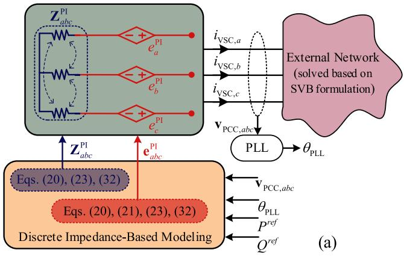

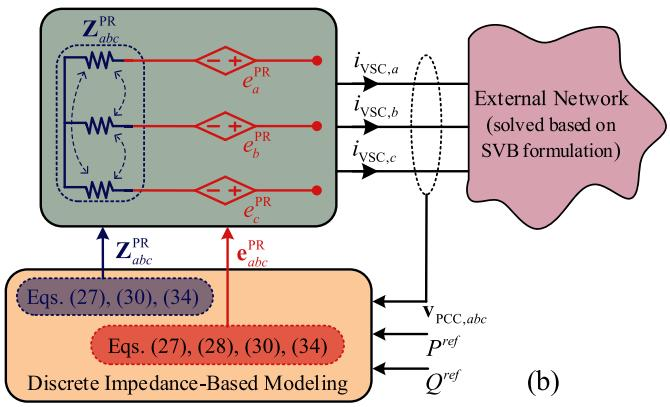  
FIGURE 4. Implementation of the proposed DIBM of the VSC system and its interfacing with the external network using an equivalent Thévenin impedance matrix and voltage history terms for: (a) with dq vector PI-based control, (b) with PR-based control.

pled resistors [based on (20), (23), (32)], and the history terms $\mathbf { \bar { e } } _ { a b c } ^ { \mathrm { P I } } ( t )$ ) as controlled voltage sources [based on (20), (21), (23), (32)], respectively.

For the VSC with PR-control, as depicted in Fig. 4(b), the PCC voltages and the reference active and reactive power are the inputs to the DIBM. The DIBM is computed based on (24), (27), (28), (30), and (34). The impedance matrix ${ \bf Z } _ { a b c } ^ { \mathrm { P R } }$ is implemented using coupled resistors [based on (27), abc (30), (34)], and the history terms ${ \bf e } _ { a b c } ^ { \mathrm { P R } } ( t )$ ) as controlled voltage sources [based on (27), (28), (30), (34)].

The procedure for implementing the proposed DIBM is summarized in the flowchart shown in Fig. 5. As shown in Fig. 5, the VSC system equations need to be constructed in Laplace domain to construct the VSC admittance-based transfer matrix as in (1)–(16). Then, the continuous admittancebased transfer matrix needs to be discretized using a numerical integration rule to construct the ABM in the z-domain. After that, using inverse z-transform, the ABM of VSC can be constructed in the time domain as in (18) and (25). Next, using the ABM of VSC in the time domain, the dual impedance form of the ABM of the VSC can be constructed to acquire the VSC system’s Thévenin equivalent impedance matrix. Finally, the Thévenin equivalent impedance matrix is implemented using

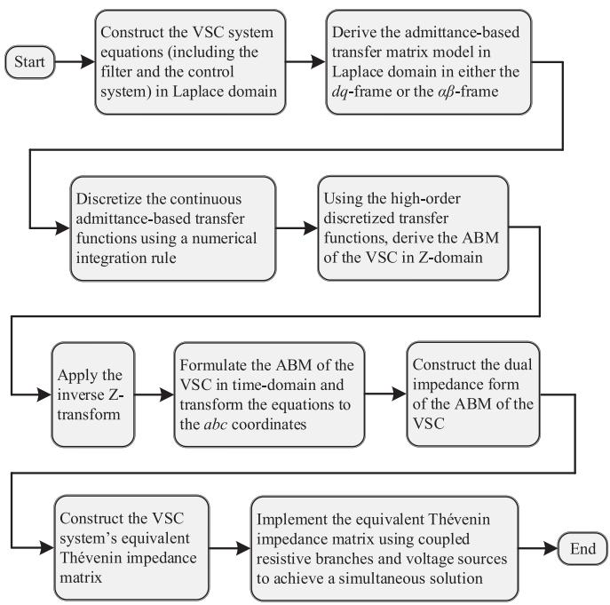  
FIGURE 5. Flowchart of the procedure for implementing the proposed DIBM.

coupled resistive branches and voltage sources, as shown in Fig. 4, to achieve a simultaneous solution of the VSC and the external system.

# IV. COMPUTER STUDIES

To validate the proposed DIBM technique, a 7-bus VSC-based energy conversion system shown in Fig. 6 is considered. This system comprises a total of 20 VSCs. The system integrates two groups of power-electronically-interfaced DERs in buses 4 and 6 (emulating wind and solar energy sources) and two groups of power-electronically-interfaced constant power loads (CPLs) in buses 5 and 7. The ac grid is represented by its Thévenin equivalent connected to bus 1. The DERs in buses 4 and 6 each include two VSCs equipped with dq-vector PIbased control, which are shown in blue. Moreover, the CPLs in buses 5 and 7 each comprise eight VSCs equipped with PR-based control, as shown in red. Furthermore, five constant impedance loads are also connected at buses 1, 2, 3, 5, and 7 (loads are named according to their bus number). It is assumed that the VSC dc link capacitor is sufficiently large to consider a stiff and constant dc voltage. The parameters of the system are summarized in the Appendix D.

The VSC-based system in Fig. 6 is implemented in MAT-LAB Simscape Electrical [9] and OPAL-RT [11] using the detailed switching model and the AVM of VSCs (in dq and αβ frames, i.e., two-axis systems) from the existing library components in Simulink. The proposed DIBMs have also been implemented as custom models using electrical circuit components and MATLAB code. For comparisons, the results of the AVM obtained with a small time-step (i.e., 1 µs) are

TABLE 1. Total Number of States of the Considered Case-Study System in Fig. 6 for the Subject Models   

<table><tr><td>Simulation Model</td><td>Detailed Switching</td><td>AVM</td><td>Proposed DIBM</td></tr><tr><td>Total number of states</td><td>271</td><td>271</td><td>43</td></tr></table>

considered as the reference average-value solution. The realization of models in the OPAL-RT simulator is shown in Fig. 7.

In this study, the fixed time-step ode4 solver is employed in both MATLAB Simscape Electrical and OPAL-RT simulations. While MATLAB’s Simscape Electrical supports iterative solvers to address algebraic loops caused by direct feedthrough paths (e.g., the interfacing between the VSC and its control subsystems) [8], [29], the real-time simulators such as OPAL-RT must adhere to strict timing constraints that necessitate fixed time-step solvers. Additionally, using iterative methods significantly increases computational costs. The chosen approach ensures compatibility with real-time hardware-in-the-loop environments while maintaining computational efficiency and enabling fair comparisons.

For the system depicted in Fig. 6, the state counts of the models implemented in MATLAB Simscape Electrical are summarized in Table 1. As illustrated, the detailed switching model and the AVM encompass 271 states originating from VSC filters, control systems, and network components (i.e., line impedances). In contrast, the system with the proposed DIBM comprises only 43 states, primarily associated with the network’s line impedances.

This reduction is achieved by substituting the VSC systems (along with their filters and control systems), with equivalent DIBMs incorporating a Thévenin equivalent impedance matrix and voltage history terms. Consequently, employing the DIBM reduces the state count within the systems.

# A. TIME-DOMAIN SIMULATION OF LARGE-SIGNAL TRANSIENTS

First, offline simulation is considered. It is assumed that the system of Fig. 6 operates in a steady state achieved when the reference active and reactive power of the DERs are set to 10 kW and 0 kVAR, respectively; and the active and reactive power of the CPLs are set to 5 kW and 0 kVAR, respectively. At time t 0.1 s, the active power command of all the CPLs is increased by 1 kW. At time t  0.4 s, the active power command of the DERs is increased by 5 kW. The reactive power settings are unchanged and remain at zero.

The transient response of several variables obtained by the subject models is depicted in Fig. 8, where the AVM and the proposed DIBM are run with a simulation time-step of 5 µs. Therein, the active and reactive powers flowing from bus 1 to $2 ( P _ { 1 2 } , \ : Q _ { 1 2 } )$ , bus 1 to $3 ( P _ { 1 3 } , \ Q _ { 1 3 } )$ , and bus 1 to $7 \ ( P _ { 1 7 } , \ Q _ { 1 7 } )$ are shown in Fig. 8(a)–(f), respectively. The phase a voltage at bus 1 $( v _ { 1 a } )$ is depicted in Fig. 8(g).

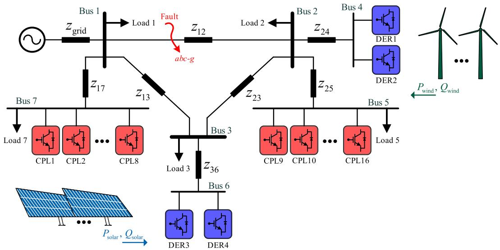  
FIGURE 6. Simplified single-line diagram of a 7-bus VSC-based system with two groups of DERs and two groups of CPLs.

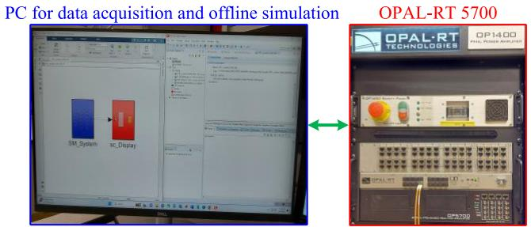  
FIGURE 7. Realization of the subject models in offline (MATLAB Simscape Electrical) and real-time (OPAL-RT 5700) simulators.

As shown in Fig. 8, following the changes in active power commands at t 0.1 s and $t = 0 . 4 \ : \mathrm { s } .$ , the controllers effectively regulate the output power of DERs and CPLs to their newly set reference values. Fig. 8 also illustrates that the AVM and the proposed DIBM closely match the transient responses produced by the reference AVM and the detailed switching model.

Furthermore, the AVMs and the DIBM consistently and accurately capture the average values of the dc variables, active and reactive powers, and the fundamental frequency component of bus 1 voltage. These results also agree with the responses from the detailed switching model.

To further assess the accuracy of the proposed DIBM technique compared to the AVM, the transient study of Fig. 8 has been repeated using larger time steps of 85 µs (for AVM) and 100 µs & 200 µs (for DIBM); and the results are illustrated in Fig. 9 for the variables $P _ { 1 2 } , P _ { 1 3 }$ , and $v _ { 1 a } .$ . As seen in Fig. 9, the AVM results diverge after the second change in the active power of the DERs at $t = 0 . 4 ~ \mathrm { s } ,$ , and the results become numerically unstable. These inaccuracies stem from the onetime-step delay inherent at the interface of the conventional AVMs of converters and control subsystems.

In the meantime, the proposed DIBM yields highly accurate results, as seen in Fig. 9, where the results of the DIBM closely match the reference solution even with simulation time steps of $2 0 0 \mu \mathrm { s }$ . This is achieved by the delay-free interfacing of the proposed DIBM with the rest of the system implemented in the SV-based simulation environment of Simulink and its Simscape Electrical toolbox.

To compare the accuracy of the proposed DIBM against the conventional AVM, the cumulative 2-norm error [40] of the solution trajectory over the considered simulation time interval is considered. The 2-norm error of the phase a voltage at bus 1 $( v _ { 1 a } )$ is computed for different simulation time steps, and the results are presented in Fig. 10, utilizing a semilogarithmic scale. As illustrated in Fig. 10, the accuracy of the AVM diminishes rapidly when the simulation time step exceeds 80 µs. In contrast, the proposed DIBM maintains acceptable accuracy (i.e., error below 2 %) even with time steps as large as 500 µs.

# B. TIME-DOMAIN SIMULATION UNDER FAULT CONDITIONS

Here, the performance of the proposed DIBM is compared against AVM and the detailed switching model under faulty conditions in the case study system of Fig. 6. The system operates in a steady-state condition before the fault, with the reference active and reactive power of the DERs set to 10 kW and 0 kVAR, and the CPLs at 5 kW and 0 kVAR. At time t 150 ms, a three-phase-to-ground fault with 0.3  fault impedance is applied at bus 1 and cleared after 100 ms. The transient response of several variables, including active and reactive power flows $( P _ { 1 2 } , \ Q _ { 1 2 } , \ P _ { 1 3 } , \ Q _ { 1 3 } , \ P _ { 1 7 } , \ Q _ { 1 7 } )$ and the phase a voltage at bus $\textbf { l } \left( v _ { 1 a } \right)$ , obtained from the detailed switching model, AVM, and the proposed DIBM, are shown in Fig. 11.

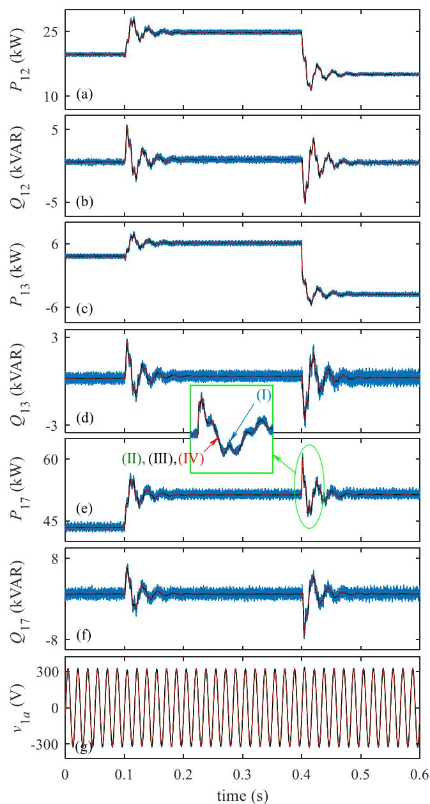  
(I) Detailed Switching - (III) AVM   
(II) Reference AVM (IV) Proposed DIBM

As seen in Fig. 11(a) and (e), when the fault occurs, the active power from bus 1 to buses 2 and 7 (i.e., P12 and P17, respectively) decreases due to the fault. However, the active power flow from bus 1 to bus 3 (i.e., P13) becomes negative because now the DERs supply power to the loads at bus 7. Once the fault is cleared, the power flow returns to its initial status as it was before the fault. It is also worth mentioning

FIGURE 8. Transient response of several variables obtained by the subject models: (a) active power from bus 1 to bus $\_ P _ { 1 2 } ;$ (b) reactive power from bus 1 to bus 2 $\pmb { Q } _ { 1 2 } ; ( \pmb { \mathrm { c } } )$ active power from bus 1 to bus ${ \bf 3 . } \sf { P } _ { 1 3 } .$ (d) reactive power from bus 1 to bus 3 ${ \bf \nabla } ( \pmb { \mathrm { q } } _ { 1 3 } , ( \pmb { \mathrm { e } } )$ active power from bus 1 to bus ${ \bf 7 } P _ { 1 7 } ,$ (f) reactive power from bus 1 to bus 7 $\pmb { Q } _ { 1 7 }$ , and (g) phase a voltage at bus 1 $v _ { 1 a } .$ The simulation time-step for AVM and proposed DIBM is -t 5 µs.   
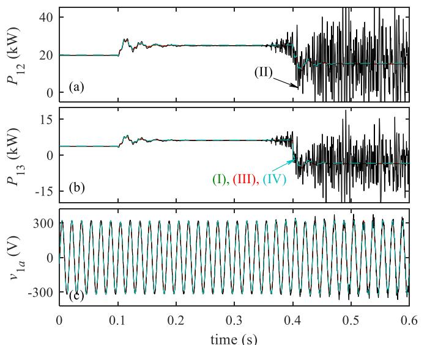  
(I) Reference AVM (III) Proposed DIBM (△t=100μs)   
(II)AVM (△ t=85μs)

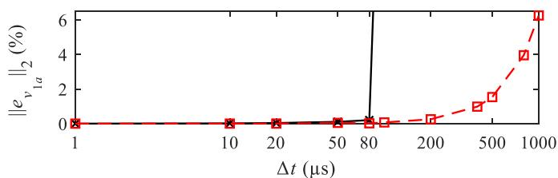  
FIGURE 9. Transient response of several variables obtained by the subject models for: (a) $P _ { 1 2 } , \left( \mathbf { b } \right) P _ { 1 3 } ,$ and $( \mathbf { c } ) \ v _ { 1 \pmb { a } } .$ The simulation time-step for AVM is -t = 85 µs, and the proposed DIBM is run with $\Delta t = 1 0 0 ~ \mathrm { \textmu s }$ and -t = $2 0 0 \mu 5 .$

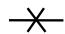  
AVM

  
Proposed DIBM   
FIGURE 10. The 2-norm error of the phase a voltage at bus 1 $( v _ { 1 q } )$ in the 0.6 s transient study using the subject models with different time step sizes.

that because the three-phase-to-ground fault is through a 0.3  resistance, the phase voltage does not become zero but drops, as shown in Fig. 11(g). Additionally, Fig. 11(a)–(g) shows that the results of both the AVM and the proposed DIBM closely match those of the detailed switching model, accurately capturing the system’s transient response and predicting fast transients effectively.

Next, the performance of the proposed DIBM method is evaluated against AVM using larger time steps. For this purpose, the same study is repeated with a time-step size of 85 µs (for AVM) and 100 µs & 200 µs (for DIBM), and the results are shown in Fig. 12. As observed in Fig. 12, the AVM shows significant errors, and its results diverge after the fault is cleared. This is due to the one-time delay in the interfacing of the AMV of the VSCs and the control subsystems. However, the proposed DIBM provides accurate results, closely matching the detailed switching model, even with time steps

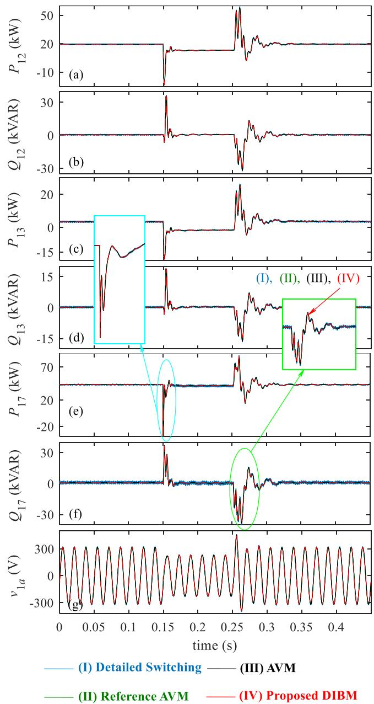  
FIGURE 11. Transient response of several variables when a three-phase to ground fault occurs at bus 1 obtained by the subject models: (a) active power from bus 1 to bus ${ \bf 2 } \left. P _ { 1 2 } ; \left( { \bf 6 } \right) \right.$ reactive power from bus 1 to bus ${ \bf 2 } \ { \bf 2 } _ { 1 2 } ;$ (c) active power from bus 1 to bus 3 $P _ { 1 3 } , ( \mathbf { d } )$ reactive power from bus 1 to bus 3 $\pmb { Q } _ { 1 3 } , ( \mathbf { e } )$ active power from bus 1 to bus 7 $\pmb { P } _ { 1 7 } ,$ , (f) reactive power from bus 1 to bus ${ \bf 7 } \left. { \pmb { \mathrm { Q } } } _ { 1 7 } \right. ,$ , and (g) phase a voltage at bus 1 $v _ { 1 a } .$ The simulation time-step for AVM and proposed DIBM is $\Delta t = 5 \mu$ s.

as large as 200 µs. This demonstrates the robustness of the proposed DIBM under large transients such as grid faults, further validating its applicability to simulations of severe conditions.

# C. NUMERICAL EFFICIENCY COMPARISON

To evaluate the numerical efficiency of the proposed DIBM method, the subject models were executed on the OPAL-RT 5700 real-time simulator using different fixed-time step sizes.

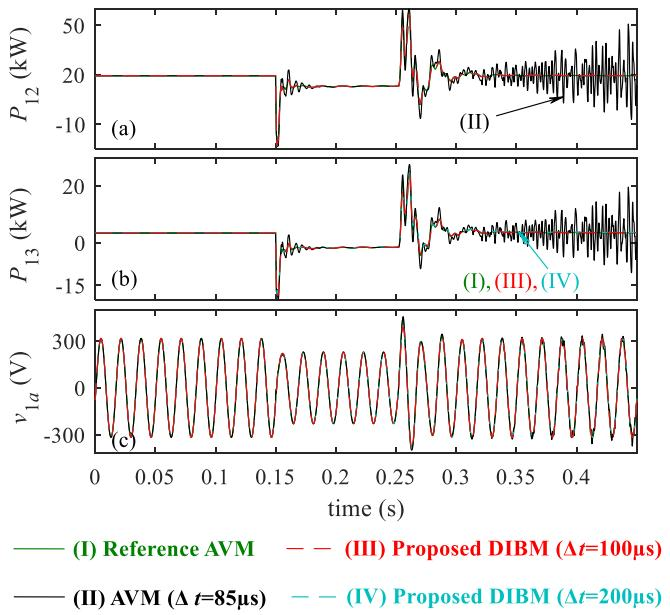  
FIGURE 12. Transient response of several variables when a three-phase to ground fault occurs at bus 1 obtained by the subject models for: (a) $\scriptstyle { P _ { 1 2 } } ,$ , (b) $\scriptstyle { \pmb { P } } _ { 1 3 } ,$ , and $( \mathbf { c } ) \ v _ { 1 \pmb { a } } .$ . The simulation time-step for AVM is $\Delta \mathbf { t } = 8 5 \ \mu \mathbf { s } ,$ , and the proposed DIBM is run with -t = 100 µs and $\Delta t = 2 0 0 \ \mu s ,$ .

TABLE 2. Computational Performance of the Subject Models for the Considered Case-Study System in Fig. 6 with Different Time-Step Sizes in OPAL-RT 5700 Real-Time Simulator   

<table><tr><td>Simulation Model</td><td>Time-Step</td><td>Δt=10 μs</td><td>Δt=25 μs</td><td>Δt=50 μs</td><td>Δt=80 μs</td><td>Δt=200 μs</td><td>Δt=500 μs</td><td>Δt=1000 μs</td></tr><tr><td rowspan="2">AVM</td><td>CPU Usage</td><td>Over loaded</td><td>Over loaded</td><td>Over loaded</td><td>93.5%</td><td>Not Valid</td><td>Not Valid</td><td>Not Valid</td></tr><tr><td>DIBM</td><td>Over loaded</td><td>79.5%</td><td>38.4%</td><td>25.6%</td><td>9.6%</td><td>3.8%</td><td>2%</td></tr></table>

The results are summarized in Table 2. As observed there, for the AVM, when using simulation time steps of smaller than 80 $\mathrm { 1 s ~ ( i . e . , ~ } \Delta t = 1 0 ~ \mu \mathrm { s } , \Delta t = 2 5 ~ \mu \mathrm { s } ,$ , and $\Delta t = 5 0 ~ \mathrm { \textmu s } )$ , the real-time processor becomes overloaded. The CPU utilization of the AVM model for the time-step of $\Delta t = 8 0$ µs is 93.5%, which is close to the limit (with the available real-time processor cores). The AVM also becomes numerically unstable at any larger steps, as seen in Fig. 9.

Meanwhile, as seen in Table 2, the proposed DIBM overloads the real-time CPU cores with a small simulation timestep of $\Delta t = 1 0$ µs but can successfully execute with larger time-step sizes. Specifically, it can run with time steps of $\Delta t$ 25 µs, t 50 µs, t 80 µs, and $\Delta t = 5 0 0 ~ \mathrm { \mu s }$ , with CPU utilization of 79.5%, 38.4%, 25.6%, and 3.8%, respectively. Moreover, as shown in Figs. 9 and 10, the proposed DIBM can run with time step sizes as large as $5 0 0 { \sim } 1 0 0 0 ~ { \mu } { \mathrm { s } }$ , for which the real-time CPU utilization is 2 4%.

$$
V (\omega) = e ^ {j \omega t} \longrightarrow \boxed {\begin{array}{c} \text {L i n e a r S y s t e m} \\ \mathrm {H} (\omega) \end{array} } \longrightarrow I (\omega) = H (\omega) e ^ {j \omega t}
$$

FIGURE 13. The linear system with a single-frequency input.

TABLE 3. Continuous Time- and Frequency-Domain Representation of an Ideal Inductor   

<table><tr><td>Electric circuit</td><td>Continuous time-domain</td><td>Continuous frequency-domain</td></tr><tr><td>i(t) L + v(t) -</td><td>i(t) = 1/L ∫ v(t) dt</td><td>I(ω) = 1/jωL V(ω)</td></tr></table>

Comparing the CPU usage of the AVM versus the proposed DIBM for the simulation time-step t  80 µs in Table 2 (i.e., 93.5% vs. 25.6%), one can see that the proposed method is approximately 3.6 times more efficient than the AVM for the system of Fig. 6. This is achieved by substituting VSC systems with their equivalent DIBMs (instead of the detailed switching models or the traditional AVMs), which reduces the size of the overall state model solved by the Simscape Electrical toolbox. Therefore, using the proposed DIBM, much larger VSC-based systems can be simulated on the same real-time processor.

# V. DISCUSSION

This section discusses some clarifications regarding the advantages and limitations of the proposed DIBM method, which are also supported by simulation results.

# A. SELECTION OF NUMERICAL INTEGRATION RULE FOR THE DIBM

This paper uses the trapezoidal integration rule to discretize the continuous impedance/admittance-based transfer functions to achieve the final Thévenin equivalent model. This method is chosen due to its numerical advantages, particularly regarding phase accuracy, over other common integration methods. To provide further context and investigate the numerical accuracy of different integration rules, either the error in the time domain or frequency response in the frequency domain can be evaluated. Since impedance-based analysis is closely related to circuit theory, the frequency response of a linear system with a single-frequency input (i.e., exponential function $e ^ { j \omega t } )$ is examined, as shown in Fig. 13, to assess the numerical accuracy of various integration rules. Here, we consider an ideal inductor as an example of a linear system, which can be represented as a continuous function in both the time and frequency domains, as shown in Table 3.

The continuous time-domain equations can be discretized using various integration rules [19] (herein, we consider commonly used Forward Euler, Backward Euler, implicit Trapezoidal, and 2nd-order Gear’s method), and the frequency

TABLE 4. Discrete Time-Domain and Frequency Response of the Equivalent Admittance Expressions   

<table><tr><td>Numerical integration rule</td><td>Discrete time-domain</td><td>Frequency response (discretized equivalent admittance Y_discretized)</td></tr><tr><td>Forward Euler</td><td>i(t) - i(t - Δt) = Δt/Lv(t - Δt)</td><td>I(ω)/V(ω) = Δt/LejωΔt-1</td></tr><tr><td>Backward Euler</td><td>i(t) - i(t - Δt) = Δt/Lv(t)</td><td>I(ω)/V(ω) = Δt/2LejωΔt-1</td></tr><tr><td>Trapezoidal</td><td>i(t) - i(t - Δt) = Δt/2Lv(t) + Δt/2Lv(t - Δt)</td><td>I(ω)/V(ω) = Δt/2LejωΔt+1</td></tr><tr><td>Gear&#x27;s Second Order</td><td>i(t) - 4/3i(t - Δt) + 1/3i(t - 2Δt) = 2Δt/3Lv(t)</td><td>I(ω)/V(ω) = 2Δt/L×1/e-2jωΔt-4e-jωΔt+3</td></tr></table>

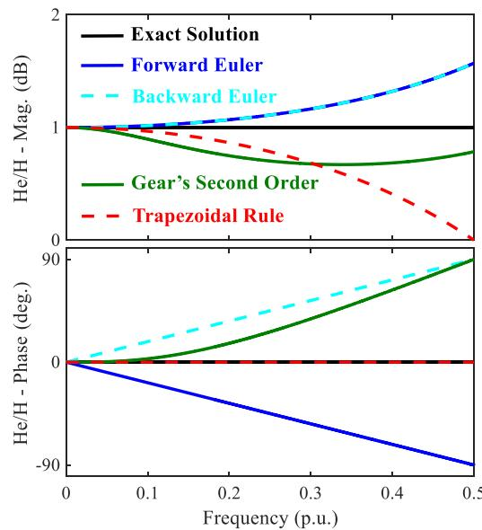  
FIGURE 14. Frequency response of the equivalent admittance of an inductor discretized with different integration rules compared to the exact solution (i.e., Bode of ratio $Y _ { \mathrm { d i s c r e t i z e d } } ( \omega \mathbf { \bar { ) } } / Y _ { \mathrm { e x a c t } } ( \omega ) )$ ).

response of the resulting discrete-time integrator can be calculated, as presented in Table 4. In this case, the frequency response of the equivalent admittance of the inductor discretized with each integration rule can be compared to the actual admittance of the ideal inductor in continuous time as $Y _ { \mathrm { d i s c r e t i z e d } } ( \omega ) / Y _ { \mathrm { e x a c t } } ( \omega )$ ), where

$$
Y _ {\text {e x a c t}} (\omega) = \frac {I (\omega)}{V (\omega)} = \frac {1}{j \omega L}, \tag {35}
$$

and $Y _ { \mathrm { d i s c r e t i z e d } } ( \omega )$ is the frequency response of the discretized equivalent admittance corresponding to each integration rule shown in the last column of Table 4. Fig. 14 depicts the frequency response of the ratio $Y _ { \mathrm { d i s c r e t i z e d } } ( \omega ) / Y _ { \mathrm { e x a c t } } ( \omega )$ for each

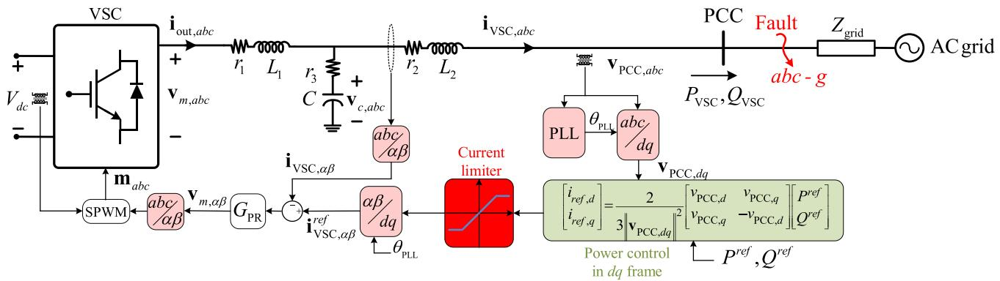  
FIGURE 15. Simplified single-line diagram of a VSC system with nonlinear current limiter and Clarke and Park transformations (the nonlinear elements of the controller are highlighted in red and green).

integration rule, with the frequency range considered from 0 to fNyquist $f _ { \mathrm { N y q u i s t } } = \frac { 1 } { 2 \Delta t } = 0 . 5 \mathrm { p }$ 1 .u.(Nyquist frequency).

As observed in Fig. 14, all considered integration rules provide an acceptable magnitude response for frequencies up to 0.1 p.u., but distortion increases as the frequency approaches the Nyquist limit. Unlike the other integration rules, the implicit Trapezoidal rule stands out by maintaining zero phase distortion across all frequencies. Although Forward Euler and Backward Euler methods provide better magnitude accuracy, they introduce significant phase distortion. The Gear’s 2ndorder method, despite having larger magnitude errors, provides better phase accuracy than Forward Euler and Backward Euler. Consequently, due to the very good phase response and the fact that the implicit Trapezoidal rule is A-stable (i.e., its stability is not constrained by the discretization time step), the proposed DIBM utilizes this method for discretizing continuous impedance/admittance-based transfer functions.

# B. HANDLING NONLINEARITIES AND SATURATIONS IN DIBM

While one possible approach is to linearize the entire VSC system (including the nonlinear parts) and form a single impedance model for EMT simulation, such an approach would result in a model that would be operating-point dependent and require continuously updating and re-computing the impedance model at each time step, which introduces additional complexity and overhead. In contrast, the proposed DIBM approach employs impedance/admittance modeling only for the linear parts of the VSC subsystems, which are interfaced with the rest of the system using a Thévenin equivalent impedance matrix and history voltages. The nonlinear parts of the VSC system are incorporated directly within the time-domain discretized equations, as highlighted in Figs. 2, 3, 15. This approach avoids the need to linearize the entire system while maintaining the integrity of the nonlinear dynamics. To further clarify the proposed DIBM approach, the case study system shown in Fig. 15 is considered here for discussion.

Different from the systems in Figs. 2 and 3, this system utilizes control schemes implemented in both the $\alpha \beta$ and dq

frames and incorporates nonlinear saturation for VSC current protection. More specifically, this system includes the linear current control and ac filter subsystems, as well as nonlinear components such as current saturation, power control, and Clarke and Park transformations. The linear subsystems are modeled using the impedance/admittance method as in (9)–(16), (24)–(30), (33), and (34). At the same time, the nonlinear components are implemented in the time domain using conventional EMT library components without modification/alteration.

The proposed DIBM model is validated against the AVM, and the detailed switching models for the case study system presented in Fig. 15 under fault conditions. The VSC system requires a current limiter (modeled as a saturation block in Fig. 15) to switch from the power control mode to the current-limited control mode to protect the VSC system when a fault happens. The current limiter is set to a maximum of 15 A based on the VSC-rated value that is presented in Appendix D. In this study, the VSC system initially operates in a steady state, while the reference active and reactive power of the VSC are set to 5 kW and 0 VAR, respectively. At t 150 ms, a three-phase-to-ground fault is applied at the PCC and is cleared after 100 ms.

The transient response of several variables obtained by the detailed switching model, the AVM, and the proposed DIBM method, all run with a small simulation time-step (i.e., 5 µs) is depicted in Fig. 16. As observed in Fig. 16, before the fault, the VSC operates in a constant power mode and generates 5 kW active power and 0 kVAR reactive power. However, during the fault, the PCC voltage drops significantly, and the VSC is switched to the constant current mode (due to the current limiter). During the fault, the VSC output current is limited to 10.6 A RMS (corresponding to 2 kW active power). After the fault is cleared, the VSC system control is switched back to the constant power mode, and it regulates the active and reactive power to their reference values. Fig. 16 shows that the AVM and the proposed DIBM predict the system’s transient response under faulty conditions very closely to the detailed switching model when the simulation is run with a small time step.

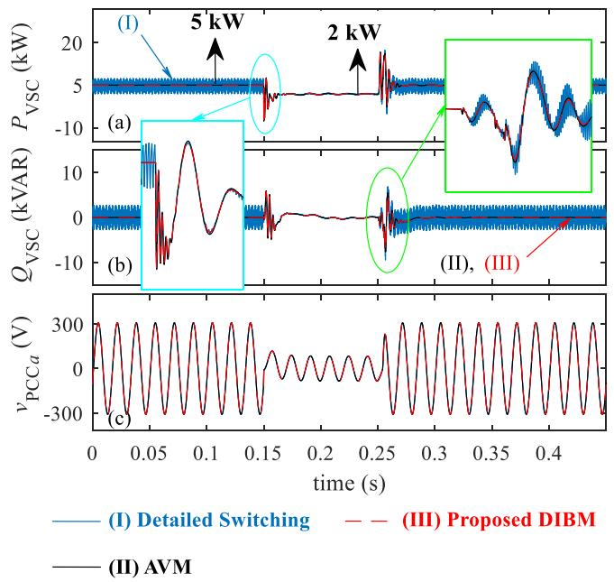  
FIGURE 16. Transient response of several variables obtained by the detailed switching model, AVM, and the proposed DIBM when a three-phase to ground fault occurs at the PCC: (a) VSC active power PVSC; (b) VSC reactive power $\pmb { Q } _ { \mathsf { V S C } } ,$ and (c) phase a PCC voltage vPCCa. The simulation time-step for all models is $\Delta t = 5 ~ \mu \mathbf { s } ,$ .

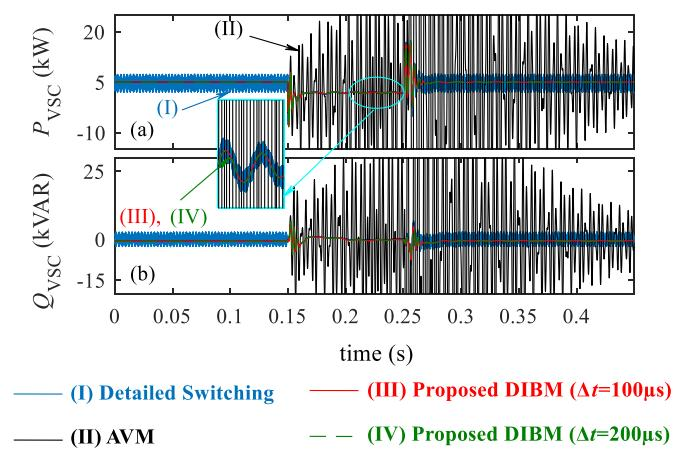  
FIGURE 17. Transient response of several variables obtained by the detailed switching model, AVM, and the proposed DIBM when a three-phase to ground fault occurs at the PCC: (a) VSC active power $P _ { \mathsf { V S C } } ,$ , and (b) VSC reactive power $\pmb { Q } _ { \mathsf { V S C } } .$ The simulation time-step for AVM is -t = 85 $\mu \mathsf { \pmb { S } } ,$ and the proposed DIBM is run with $\Delta t = 1 0 0 ~ \mathrm { \textmu s }$ and $\Delta t = 2 0 0 ~ \mu \leq$ .

The same time-domain simulation is conducted when the AVM and the proposed DIBM models are run with larger simulation time steps of 85 µs (for AVM) and 100 µs & 200 µs (for DIBM), and the results are shown in Fig. 17. As observed in Fig. 17, the AVM results diverge after the fault happens. These inaccuracies due to the one-time-step delay inherent at the interface of the AVM of the VSC and the control subsystems. However, as seen in Fig. 17, the proposed DIBM method provides accurate results during the fault transients and perfectly matches the detailed switching model

even with simulation time steps of 200 µs. This study further demonstrates the effectiveness of the proposed DIBM method for fault analysis and the effective inclusion of the saturation block and nonlinear components, along with the DIBM.

# C. MODELING DIGITAL CONTROL DELAY IN THE PROPOSED DIBM

The converter control systems include inherent delays due to digital computations as well as the pulse width modulation delay [41]. Typically, the delay of the digital computations is estimated to be approximately equal to the sampling period/ interval, i.e., $T _ { s } ,$ , and the pulse width modulation delay is estimated to be approximately half of the sampling period, i.e., $0 . 5 T _ { s }$ [41], [42]. Therefore, the total delay for the digital control can be approximated as 1.5T . The time delay can be modeled as $\mathrm { e } ^ { - T s }$ in Laplace domain, where s is the Laplace operator and T is the length of the delay (in seconds). In control systems, Pade approximation is a mathematical tool (based on Taylor series expansion) for analyzing nonlinear control systems. Specifically, [43] provides an extensive review and discussion regarding the continuous models of time delays using the Pade approximation. For instance, the Pade approximation can be employed to express the equivalent time delay exponential term as a transfer function as [43]

$$
e ^ {- T s} = \frac {\sum_ {i = 0} ^ {n} b _ {i} (T s) ^ {i}}{\sum_ {j = 0} ^ {m} a _ {j} (T s) ^ {j}}, \quad b _ {i} = (- 1) ^ {i} \frac {(n + m - i) ! n !}{i ! (n - i) !},
$$

$$
a _ {j} = \frac {(n + m - j) ! m !}{j ! (m - j) !}. \tag {36}
$$

To demonstrate the accuracy of the Pade approximation, the frequency response of a pure time delay $\mathrm { e } ^ { - \bar { T } \bar { s } }$ where $T =$ $1 . 5 T _ { s }$ and $T _ { s } = 5 \times 1 0 ^ { - 6 } \mathrm { s }$ (similar to the sampling period used in the cases study system in Fig. 6) is compared with the frequency response of the first-order [i.e., $n = m = 1$ in (36)] and second-order [i.e., $n = m = 2$ in (36)] Pade approximations in Fig. 18 for frequencies up to 100 kHz. As shown in Fig. 18, the first-order Pade approximation matches the frequency response of the pure time delay up to 10 kHz. However, the second-order Pade approximation perfectly matches the pure time delay even at 100 kHz. Therefore, the Pade approximation can effectively model digital control delays as transfer functions within the proposed DIBM approach. It is also important to note that digital time delays in the DIBM approach can also be modeled in the time domain without approximations, using standard EMT components, similar to the modeling of nonlinearities and saturations discussed in Section V-B.

# D. LIMITATIONS OF THE PROPOSED DIBM

The proposed DIBM method employs AVMs to represent converters, unlike the conventional switching (discontinuous) models typically used in EMT simulators. In the AVMs of VSCs, the fast-switching dynamics are neglected in favor of capturing slower dynamics [21]. While detailed switching models can reproduce exact switching transients of currents

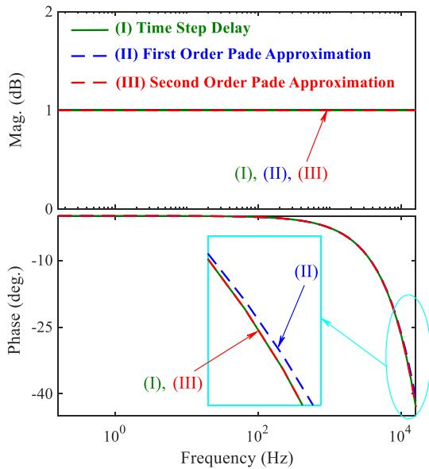  
FIGURE 18. Comparison between the frequency response of a pure time delay and the frequency response of its first- and second-order Pade approximation.

and voltages with high-frequency ripples, these switching transients are not represented in the AVMs and the proposed DIBM.

The DIBM approach is applied to the VSC subsystem connected to a larger power network modeled in EMT-type simulators. It relies on impedance modeling, which collapses all electrical nodes and control systems into an equivalent model interfaced with external systems at the VSC connection point. Although this approach accurately represents the overall VSC dynamics at the interfacing terminals, it limits the visibility to interfacing variables only without access to many internal variables. For example, in the VSC system shown in Fig. 3, the DIBM captures variables such as VSC output currents $( \mathbf { i } _ { \mathrm { V S C } , a b c } )$ and voltages $( { \bf v } _ { \mathrm { P C C } , a b c } )$ , but the internal variables, such as capacitor voltages $( \mathbf { v } _ { \mathrm { c } , a b c } )$ are not available. Therefore, while the detailed switching model is preferred during the design stage for more comprehensive analysis, the proposed DIBM method may offer significant advantages in terms of simulation efficiency for system-level studies when internal details of the affected parts are not of particular interest.

# VI. CONCLUSION

The discrete impedance-based modeling (DIBM) of VSCs has been proposed for state-variable-based EMT simulators. The VSC systems, including their filters and controllers, were represented as admittances in Laplace domain. The admittances were then discretized using the trapezoidal rule and formulated into Thévenin equivalent impedance matrices and voltage history terms to achieve a simultaneous solution with the external network. The efficacy of the proposed DIBM technique was validated through simulations

conducted on a 7-bus system comprising 20 VSCs representing DERs and CPLs. The studies were conducted offline (in MATLAB Simscape Electrical) and in real-time (in OPAL-RT) EMT simulators. Compared to the alternative traditional AVMs of the VSC systems, the proposed DIBM technique demonstrated approximately 3.6 times reduction of the CPU utilization per step (with an 80 µs time step in the real-time simulator) while permitting the use of a much larger time step (up to 500 µs 1000 µs) and still providing reasonable accuracy. These achievements hold considerable promise for studying large-scale systems with many VSC-interfaced DERs and loads in SV-based EMT simulators.

# APPENDIX

# A. TRANSFER FUNCTION COEFFICIENTS IN (16)

$$
\left\{ \begin{array}{l} n _ {0} = - \omega_ {0} ^ {2} \\ n _ {1} = - \omega_ {0} ^ {2} (r _ {1} + r _ {3}) C - 2 \omega_ {c} \\ n _ {2} = - \omega_ {0} L _ {1} C - 2 \omega_ {c} (r _ {1} + r _ {3}) C - 1 \\ n _ {3} = - 2 \omega_ {c} L _ {1} C - (r _ {1} + r _ {3}) C \\ n _ {4} = - L _ {1} C \\ n _ {5} = 0 \end{array} \right.,
$$

$$
\left\{ \begin{array}{l} m _ {0} = k _ {\mathrm {P R 1}} \omega_ {0} ^ {2} \\ m _ {1} = k _ {\mathrm {P R 1}} \omega_ {0} ^ {2} r _ {3} C + 2 k _ {\mathrm {P R 1}} \omega_ {c} + k _ {\mathrm {P R 2}} \\ m _ {2} = k _ {\mathrm {P R 1}} + \left(2 k _ {\mathrm {P R 1}} \omega_ {c} + k _ {\mathrm {P R 2}}\right) r _ {3} C \\ m _ {3} = k _ {\mathrm {P R 1}} r _ {3} C \\ m _ {4} = m _ {5} = 0 \end{array} \right. \tag {A1}
$$

$$
\left\{ \begin{array}{l} d _ {0} = \omega_ {0} ^ {2} \left(r _ {1} + r _ {2} + k _ {\mathrm {P R} 1}\right) \\ d _ {1} = \omega_ {0} ^ {2} r _ {1} r _ {2} C + 2 \omega_ {c} \left(r _ {1} + r _ {2} + k _ {\mathrm {P R} 1}\right) \\ \quad + \dots \omega_ {0} ^ {2} r _ {3} \left(r _ {1} + r _ {2} + k _ {\mathrm {P R} 1}\right) C + \omega_ {0} ^ {2} \left(L _ {1} + L _ {2}\right) + k _ {\mathrm {P R} 2} \\ d _ {2} = \omega_ {0} ^ {2} \left(r _ {1} L _ {2} + r _ {2} L _ {1}\right) C + 2 \omega_ {c} r _ {1} r _ {2} C + 2 \omega_ {c} r _ {3} \left(r _ {1} + r _ {2} + k _ {\mathrm {P R} 1}\right) C \\ \quad + \dots 2 \omega_ {c} \left(L _ {1} + L _ {2}\right) + \omega_ {0} ^ {2} r _ {3} \left(L _ {1} + L _ {2}\right) C + k _ {\mathrm {P R} 2} r _ {3} C + r _ {1} \\ \quad + r _ {2} + k _ {\mathrm {P R} 1} \\ d _ {3} = \omega_ {0} ^ {2} L _ {1} L _ {2} C + 2 \omega_ {c} \left(r _ {1} L _ {2} + r _ {2} L _ {1}\right) C + r _ {1} r _ {2} C \\ \quad + r _ {3} \left(r _ {1} + r _ {2} + k _ {\mathrm {P R} 1}\right) C \\ \quad + \dots 2 \omega_ {c} r _ {3} \left(L _ {1} + L _ {2}\right) C + L _ {1} + L _ {2} \\ d _ {4} = 2 \omega_ {c} L _ {1} L _ {2} C + r _ {3} \left(L _ {1} + L _ {2}\right) C + \left(r _ {1} L _ {2} + r _ {2} L _ {1}\right) C \\ d _ {5} = L _ {1} L _ {2} C \end{array} \right. \tag {A2}
$$

# B. DISCRETIZED TRANSFER FUNCTION COEFFICIENTS IN (17)

$$
\left\{ \begin{array}{l} a _ {0} = - 2 \Delta t   (F _ {v} - 1) \\ a _ {1} = 0 \\ a _ {2} = 2 \Delta t (F _ {v} - 1) \end{array} \right., \quad \left\{ \begin{array}{l} b _ {0} = \Delta t ^ {2} k _ {i} + 2 \Delta t k _ {p} \\ b _ {1} = 2 \Delta t ^ {2} k _ {i} \\ b _ {2} = \Delta t ^ {2} k _ {i} - 2 \Delta t k _ {p} \end{array} \right..
$$

$$
\left\{ \begin{array}{l} c _ {0} = 4 L _ {f} + 2 \Delta t \left(r _ {f} + k _ {p}\right) + \Delta t ^ {2} k _ {i} \\ c _ {1} = 2 \Delta t ^ {2} k _ {i} - 8 L _ {f} \\ c _ {2} = 4 L _ {f} - 2 \Delta t \left(r _ {f} + k _ {p}\right) + \Delta t ^ {2} k _ {i} \end{array} \right. \tag {B1}
$$

# C. DISCRETIZED TRANSFER FUNCTION COEFFICIENTS IN (24)

$$
\left\{ \begin{array}{l} q _ {0} = p _ {q 0} + p _ {q 1} + p _ {q 2} + p _ {q 3} + p _ {q 4} + p _ {q 5} \\ q _ {1} = 5 p _ {q 0} + 3 p _ {q 1} + p _ {q 2} - p _ {q 3} - 3 p _ {q 4} - 5 p _ {q 5} \\ q _ {2} = 1 0 p _ {q 0} + 2 p _ {q 1} - 2 p _ {q 2} - 2 p _ {q 3} + 2 p _ {q 4} + 1 0 p _ {q 5} \\ q _ {3} = 1 0 p _ {q 0} - 2 p _ {q 1} - 2 p _ {q 2} + 2 p _ {q 3} + 2 p _ {q 4} - 1 0 p _ {q 5} \\ q _ {4} = 5 p _ {q 0} - 3 p _ {q 1} + p _ {q 2} + p _ {q 3} - 3 p _ {q 4} + 5 p _ {q 5} \\ q _ {5} = p _ {q 0} - 2 p _ {q 1} + 2 p _ {q 2} - p _ {q 3} + p _ {q 4} - p _ {q 5} \\ p _ {q 0} = \frac {n _ {0} \Delta t ^ {5}}{3 2}, \quad p _ {q 1} = \frac {n _ {1} \Delta t ^ {4}}{1 6}, \quad p _ {q 2} = \frac {n _ {2} \Delta t ^ {3}}{8} \\ p _ {q 3} = \frac {n _ {3} \Delta t ^ {2}}{4}, \quad p _ {q 4} = \frac {n _ {4} \Delta t}{2}, \quad p _ {q 5} = n _ {5} \end{array} \right. \tag {C1}
$$

$$
\left\{ \begin{array}{l} g _ {0} = p _ {g 0} + p _ {g 1} + p _ {g 2} + p _ {g 3} + p _ {g 4} + p _ {g 5} \\ g _ {1} = 5 p _ {g 0} + 3 p _ {g 1} + p _ {g 2} - p _ {g 3} - 3 p _ {g 4} - 5 p _ {g 5} \\ g _ {2} = 1 0 p _ {g 0} + 2 p _ {g 1} - 2 p _ {g 2} - 2 p _ {g 3} + 2 p _ {g 4} + 1 0 p _ {g 5} \\ g _ {3} = 1 0 p _ {g 0} - 2 p _ {g 1} - 2 p _ {g 2} + 2 p _ {g 3} + 2 p _ {g 4} - 1 0 p _ {g 5} \\ g _ {4} = 5 p _ {g 0} - 3 p _ {g 1} + p _ {g 2} + p _ {g 3} - 3 p _ {g 4} + 5 p _ {g 5} \\ g _ {5} = p _ {g 0} - 2 p _ {g 1} + 2 p _ {g 2} - p _ {g 3} + p _ {g 4} - p _ {g 5} \\ p _ {g 0} = \frac {m _ {0} \Delta t ^ {5}}{3 2}, \quad p _ {g 1} = \frac {m _ {1} \Delta t ^ {4}}{1 6}, \quad p _ {g 2} = \frac {m _ {2} \Delta t ^ {3}}{8} \\ p _ {g 3} = \frac {m _ {3} \Delta t ^ {2}}{4}, \quad p _ {g 4} = \frac {m _ {4} \Delta t}{2}, \quad p _ {g 5} = m _ {5} \end{array} , \right. \tag {C2}
$$

$$
\left\{ \begin{array}{l} w _ {0} = p _ {w 0} + p _ {w 1} + p _ {w 2} + p _ {w 3} + p _ {w 4} + p _ {w 5} \\ w _ {1} = 5 p _ {w 0} + 3 p _ {w 1} + p _ {w 2} - p _ {w 3} - 3 p _ {w 4} - 5 p _ {w 5} \\ w _ {2} = 1 0 p _ {w 0} + 2 p _ {w 1} - 2 p _ {w 2} - 2 p _ {w 3} + 2 p _ {w 4} + 1 0 p _ {w 5} \\ w _ {3} = 1 0 p _ {w 0} - 2 p _ {w 1} - 2 p _ {w 2} + 2 p _ {w 3} + 2 p _ {w 4} - 1 0 p _ {w 5} \\ w _ {4} = 5 p _ {w 0} - 3 p _ {w 1} + p _ {w 2} + p _ {w 3} - 3 p _ {w 4} + 5 p _ {w 5} \\ w _ {5} = p _ {w 0} - 2 p _ {w 1} + 2 p _ {w 2} - p _ {w 3} + p _ {w 4} - p _ {w 5} \\ p _ {w 0} = \frac {d _ {0} \Delta t ^ {5}}{3 2}, \quad p _ {w 1} = \frac {d _ {1} \Delta t ^ {4}}{1 6}, \quad p _ {w 2} = \frac {d _ {2} \Delta t ^ {3}}{8} \\ p _ {w 3} = \frac {d _ {3} \Delta t ^ {2}}{4}, \quad p _ {w 4} = \frac {d _ {4} \Delta t}{2}, \quad p _ {w 5} = d _ {5} \end{array} \right. \tag {C3}
$$

# D. CASE-STUDY SYSTEM PARAMETERS

Parameters of AC Grid System:

$$
| \mathbf {v} _ {\text {g r i d}} | _ {\text {l i n e}} ^ {\text {r m s}} = 4 0 0 \mathrm {V}, z _ {\text {g r i d}} = j 0. 3 7 7 \Omega , f _ {e} = 6 0 \mathrm {H z}.
$$

Parameters of VSC with dq-Vector Control [34], [35]:

$$
V _ {d c} = 1 \mathrm {k V}, S _ {\text {r a t e d}} = 1 5 \mathrm {k V A}, L _ {f} = 5 \mathrm {m H}, r _ {f} = 0. 2 \Omega ,
$$

$$
f _ {\mathrm {s w}} = 1 0 \mathrm {k H z}, k _ {p} = 3 3. 2 9, k _ {i} = 4 3 3.
$$

Parameters of VSC with PR Control [36], [37], [38]:

$$
V _ {d c} = 1 \mathrm {k V}, S _ {\text {r a t e d}} = 1 0 \mathrm {k V A}, L _ {1} = 1 \mathrm {m H}, L _ {2} = 5 7 \mu \mathrm {H},
$$

$$
C = 3 0. 7 \mu \mathrm {F}, r _ {1} = 0. 1 \Omega , r _ {2} = 0. 0 5 \Omega , r _ {c} = 0. 3 \Omega ,
$$

$k _ { \mathrm { P R 1 } } = 0 . 4 1 8 3 , k _ { \mathrm { P R 2 } } = 4 6 0 0 , \omega _ { 0 } = 3 7 7 \mathrm { r a d / s e c } ,$

$$
\omega_ {c} = 0. 5 \mathrm {r a d / s e c}, f _ {\mathrm {s w}} = 5 \mathrm {k H z}.
$$

Parameters of Line Impedances:

$$
z _ {1 2} = z _ {1 3} = z _ {2 3} = 5 0 + j 1 8 9 \mathrm {m} \Omega ,
$$

$$
z _ {1 7} = z _ {2 4} = z _ {2 5} = z _ {3 6} = j 3. 8 \mathrm {m} \Omega .
$$

Parameters of Constant Impedance Loads:

$$
z _ {\text {l o a d} 1} = z _ {\text {l o a d} 7} = 2 0 | | j 1 5 0. 8 \Omega ,
$$

$$
z _ {\text {l o a d} 2} = z _ {\text {l o a d} 3} = z _ {\text {l o a d} 5} = 2 0 | | - j 2 6 5 0 \Omega .
$$

# REFERENCES

[1] J. Matevosyan et al., “A future with inverter-based resources: Finding strength from traditional weakness,” IEEE Power Energy Mag., vol. 19, no. 6, pp. 18–28, Nov./Dec. 2021.   
[2] Y. Gu and T. C. Green, “Power system stability with a high penetration of inverter-based resources,” Proc. IEEE, vol. 111, no. 7, pp. 832–853, Jul. 2023.   
[3] F. Blaabjerg, R. Teodorescu, M. Liserre, and A. V. Timbus, “Overview of control and grid synchronization for distributed power generation systems,” IEEE Trans. Ind. Electron., vol. 53, no. 5. pp. 1398–1409, Oct. 2006.   
[4] M. Barnes, D. Van Hertem, S. P. Teeuwsen, and M. Callavik, “HVDC systems in smart grids,” Proc. IEEE, vol. 105, no. 11, pp. 2082–2098, Nov. 2017.   
[5] L. Harnefors, M. Bongiorno, and S. Lundberg, “Input-admittance calculation and shaping for controlled voltage-source converters,” IEEE Trans. Ind. Electron., vol. 54, no. 6, pp. 3323–3334, Dec. 2007.   
[6] X. Wang and F. Blaabjerg, “Harmonic stability in power electronicbased power systems: Concept, modeling, and analysis,” IEEE Trans. Smart Grid, vol. 10, no. 3, pp. 2858–2870, May 2019.   
[7] S. Subedi et al., “Review of methods to accelerate electromagnetic transient simulation of power systems,” IEEE Access, vol. 9, pp. 89714–89731, 2021.   
[8] “MATLAB/Simulink: Dynamic system simulation software,” User’s Manual, MathWorks Inc., Natick, MA, USA, 2023. [Online]. Available: http://www.mathworks.com   
[9] “Simscape electrical (SimPowerSystems): Model and simulate electrical power systems,” User’s Guide, MathWorks Inc., Natick, MA, USA, 2023. [Online]. Available: http://www.mathworks.com   
[10] “Piecewise linear electrical circuit simulation (PLECS),” User’s Manual, Version 4.7.1, Plexim GmbH, Zurich, Switzerland, 2023. [Online]. Available: http://www.plexim.com   
[11] OPAL-RT Technologies, “RT-lab: Real-time simulation and control software,” Version 11.3, Montreal, QC, Canada, 2024. [Online]. Available: https://www.opal-rt.com/software-rt-lab/   
[12] “EMTDC TM transient analysis for PSCAD power system simulation USER’s GUIDE A comprehensive resource for EMTDC,” 2018. [Online]. Available: http://www.hvdc.ca   
[13] “Electromagnetic transient program, EMTP,” Ver. 4.2.1, POWERSYS Solutions Inc., Le Puy-Sainte-R´eparade, France, 2021. [Online]. Available: http://www.emtp.com   
[14] “Alternative transients programs, ATP-EMTP,” ATP User Group, 2007. [Online]. Available: http://emtp.org   
[15] “RTDS simulator software,” RTDS Technologies Inc., Winnipeg, MB, Canada, 2023. [Online]. Available: http://www.rtds.com   
[16] O. Wasynczuk and S. Sudhoff, “Automated state model generation algorithm for power circuits and systems,” IEEE Trans. Power Syst., vol. 11, no. 4, pp. 1951–1956, Nov. 1996.   
[17] J. V. Jatskevich, “A state selection algorithm for the automated state model generator,” Ph.D. dissertation, Purdue Univ., West Lafayette, IN, USA, 1999.   
[18] C. Dufour, J. Mahseredjian, and J. Bélanger, “A combined state-space nodal method for the simulation of power system transients,” IEEE Trans. Power Del., vol. 26, no. 2, pp. 928–935, Apr. 2011.   
[19] H. W. Dommel, EMTP Theory Book, 2nd ed. Vancouver, BC, Canada: Microtran Power Systems Analysis Corp., 1992–1996.   
[20] P. Pejovic and D. Maksimovic, “A method for fast time-domain simulation of networks with switches,” IEEE Trans. Power Electron., vol. 9, no. 4, pp. 449–456, Jul. 1994.

[21] S. Chiniforoosh et al., “Definitions and applications of dynamic average models for analysis of power systems,” IEEE Trans. Power Del., vol. 25, no. 4, pp. 2655–2669, Oct. 2010.   
[22] H. Saad et al., “Modular multilevel converter models for electromagnetic transients,” IEEE Trans. Power Del., vol. 29, no. 3, pp. 1481–1489, Jun. 2014.   
[23] N. Herath and S. Filizadeh, “Average-value model for a modular multilevel converter with embedded storage,” IEEE Trans. Energy Convers., vol. 36, no. 2, pp. 789–799, Jun. 2021.   
[24] A. Yazdani and R. Iravani, “A generalized state-space averaged model of the three-level NPC converter for systematic DC-voltage-balancer and current-controller design,” IEEE Trans. Power Del., vol. 20, no. 2, pp. 1105–1114, Apr. 2005.   
[25] S. Ebrahimi and J. Jatskevich, “Average-value model for voltage-source converters with direct interfacing in EMTP-type solution,” IEEE Trans. Energy Convers., vol. 38, no. 3, pp. 2231–2234, Sep. 2023.   
[26] S. Ebrahimi, T. Vahabzadeh, and J. Jatskevich, “Direct interfacing of average-value models of voltage-source converters in PSCAD/EMTDC,” in Proc. IEEE Canada Electric Power Energy Conf., 2022, pp. 1–6.   
[27] S. Ebrahimi, T. Vahabzadeh, and J. Jatskevich, “Numerically efficient average-value model for VSCs in nodal-analysis-based programs,” IEEE Open J. Power Electron., vol. 5, pp. 93–105, 2024.   
[28] S. Ebrahimi, T. Vahabzadeh, and J. Jatskevich, “Constant-parameter average-value model of power-electronic voltage-source converters with direct interface in electromagnetic transient simulators,” IEEE Open J. Power Electron., vol. 5, pp. 1446–1458, 2024.   
[29] J. Mahseredjian, L. Dube, M. Zou, S. Dennetiere, and G. Joos, “Simultaneous solution of control system equations in EMTP,” IEEE Trans. Power Syst., vol. 21, no. 1, pp. 117–124, Feb. 2006.   
[30] A. Safavizadeh, T. Vahabzadeh, S. Ebrahimi, and J. Jatskevich, “Admittance-based modeling of grid-following converters for time domain simulations of multi-converter electrical power systems,” in Proc. Int. Conf. Clean Elect. Power, 2023, pp. 510–518.   
[31] “GitHub - future-power-networks/simplus-grid-tool,” Accessed: Jul. 21, 2022. [Online]. Available: https://github.com/Future-Power-Networks/Simplus-Grid-Tool   
[32] Y. Li, T. C. Green, and Y. Gu, “Descriptor state space modeling of power systems,” 2023, arXiv:2303.01701v1.   
[33] T. Vahabzadeh, A. Safavizadeh, S. Ebrahimi, and J. Jatskevich, “Admittance-based modeling for electromagnetic transient and stability analysis of power-electronic-based energy conversion systems,” IEEE Trans. Energy Convers., vol. 39, no. 3, pp. 1879–1890, Sep. 2024.   
[34] W. Taha, A. R. Beig, and I. Boiko, “Design of PI controllers for a grid-connected VSC based on optimal disturbance rejection,” in Proc. IECON - 41st Annu. Conf. IEEE Ind. Electron. Soc., 2015, pp. 001954– 001959.   
[35] T. Vahabzadeh, S. Baig, S. Ebrahimi, and J. Jatskevich, “Investigation of MIMO state feedback controller for grid-connected AC-DC voltage source converters,” in Proc. Int. Conf. Elect., Comput. Energy Technol., 2022, pp. 1–6.   
[36] R. Teodorescu, F. Blaabjerg, M. Liserre, and P. C. Loh, “Proportional resonant controllers and filters for grid-connected voltage-source converters,” IEE Proc. Elect. Power Appl., vol. 153, no. 5, pp. 750–762, Sep. 2006.   
[37] T. Vahabzadeh, S. Ebrahimi, and J. Jatskevich, “Impedance-based online stability monitoring and control of VSC-based power systems,” in Proc. IEEE Int. Conf. Eng. Emerg. Technol., 2023, pp. 1–6.   
[38] T. Vahabzadeh, S. Ebrahimi, and J. Jatskevich, “Numerical recursive aggregation of VSC-based systems using impedance modeling for stability analysis,” IEEE Open J. Ind. Electron. Soc., vol. 6, pp. 62–75, Jan. 2025.   
[39] C. J. O’Rourke, M. M. Qasim, M. R. Overlin, and J. L. Kirtley, “A geometric interpretation of reference frames and transformations: dq0, Clarke, and Park,” IEEE Trans. Energy Convers., vol. 34, no. 4, pp. 2070–2083, Dec. 2019.   
[40] G. H. Golub and C. F. Van Loan, Matrix Computations, 4th ed. Baltimore, MD, USA: Johns Hopkins Univ. Press, 2013.   
[41] S. Buso and P. Mattavelli, Digital Control in Power Electronics. San Rafael, CA, USA: Morgan & Claypool, 2006.

[42] Y. Wang, X. Wang, F. Blaabjerg, and Z. Chen, “Harmonic instability assessment using state-space modeling and participation analysis in inverter-fed power systems,” IEEE Trans. Ind. Electron., vol. 64, no. 1, pp. 806–816, Jan. 2017.   
[43] J. L. Agorreta, M. Borrega, J. López, and L. Marroyo, “Modeling and control of N -paralleled grid-connected inverters with LCL filter coupled due to grid impedance in PV plants,” IEEE Trans. Power Electron., vol. 26, no. 3, pp. 770–785, Mar. 2011.

TALEB VAHABZADEH (Member, IEEE) received the B.Sc. degree in electrical engineering from the University of Tehran, Tehran, Iran, in 2021, and the M.A.Sc. degree in electrical and computer engineering from The University of British Columbia, Vancouver, BC, Canada, in 2024. He is currently with Electric Power Engineers LLC., Austin, TX, USA. His research interests include modeling, transient and stability analysis, and control of power electronics-based power systems.

SEYYEDMILAD EBRAHIMI (Member IEEE) received the B.Sc. and M.Sc. degrees in electrical engineering from Sharif University of Technology, Tehran, Iran, in 2010 and 2012, respectively, and the Ph.D. degree in electrical and computer engineering from The University of British Columbia (UBC), Vancouver, BC, Canada, in 2019. He was a Postdoctoral Teaching and Research Fellow with the Department of Electrical and Computer Engineering, UBC, till 2024. He is currently an Assistant Professor with the School of Electrical

Engineering and Computer Science, Washington State University, Pullman, WA, USA. His research interests include modeling and analysis of power electronic converters and electrical machines, application of power electronics to power systems, modeling and control of power systems, and simulation of electromagnetic transients. Dr. Ebrahimi is the Chair of IEEE Power and Energy Society Task Force on Dynamic Average Modeling Techniques, and an Associate Editor for IEEE TRANSACTIONS ON TRANSPORTATION ELECTRI-FICATION.

JURI JATSKEVICH (Fellow, IEEE) received the M.S.E.E. and the Ph.D. degrees in electrical engineering from Purdue University, West Lafayette, IN, USA, in 1997 and 1999, respectively. Since 2002, he has been with The University of British Columbia, Vancouver, BC, Canada, where he is currently a Professor with the Department of Electrical and Computer Engineering. His research interests include power electronic systems, electrical machines and drives, modeling, and simulation of electromagnetic transients. Dr. Jatskevich was

an Associate Editor for IEEE TRANSACTIONS ON POWER ELECTRONICS from 2008 to 2013, Editor-in-Chief of the IEEE TRANSACTIONS ON ENERGY CON-VERSION from 2013 to 2019, and Editor-in-Chief At-Large for the IEEE Power and Energy Society journals from 2019 to 2020. He also chaired the IEEE PES Task Force on Dynamic Average Modeling from 2007 to 2022. He was the recipient of the 2022 IEEE PES Cyril Veinott Electromechanical Energy Conversion Award and 2023 Nagamori Award.