# Modeling Method for DFIG-Based Wind Farm in High-Efficiency Real-Time Electromagnetic Transient (EMT) Simulations

Yifan Liu, Jianzhong Xu , Senior Member, IEEE, Yiyang Zhu, Zhaoxuan Tian, Chengyong Zhao , Senior Member, IEEE, and Gen Li , Senior Member, IEEE

Abstract—With the increasing integration of renewable energy into power systems, electromagnetic transient simulation has become indispensable for accurate system analysis. However, the complexity of wind turbine modeling, characterized by a large number of electrical nodes, poses significant challenges and necessitates substantial real-time simulation hardware. Existing methods for reducing circuit complexity improve simulation efficiency, but are each associated with inherent limitations. Aggregation methods sacrifice considerable internal station information, while existing decoupling techniques are constrained by specific requirements. This article proposes a real-time simulation model for a doubly fed induction generator-based wind farm (WF) using latency decoupling and a multilevel nested fast and simultaneous solution approach, effectively reducing node count while preserving internal details. A WF test model is implemented in real-time digital simulator (RTDS) for validation. Results demonstrate highly accurate impedance characteristics and time-domain waveforms of the proposed model, utilizing only 33.3% of the hardware resources compared to the traditional detailed model.

Index Terms—Doubly fed induction generator (DFIG), electromagnetic transient (EMT) simulation, latency decoupling method, multilevel nested fast and simultaneous solution (M-NFSS), real-time simulation.

# I. INTRODUCTION

HE development of an integrated energy system and a T clean energy supply with a high proportion of renewables is crucial for energy and environmental strategies [1]. The doubly fed induction generator (DFIG) based wind turbine (WT) is recognized for its stable technical performance, mature supply chains, and favorable economics, establishing itself as a prominent type in commercial wind power applications [2], [3].

Received 30 July 2024; revised 30 September 2024, 1 January 2025, and 30 March 2025; accepted 30 April 2025. Date of publication 5 May 2025; date of current version 30 June 2025. This work was supported by the National Natural Science Foundation of China under Grant 52277094. Recommended for publication by Associate Editor B. Singh. (Corresponding author: Jianzhong Xu.)

Yifan Liu, Jianzhong Xu, Yiyang Zhu, Zhaoxuan Tian, and Chengyong Zhao are with the State Key Laboratory of Alternate Electrical Power System with Renewable Energy Sources, North China Electric Power University (NCEPU), Beijing 102206, China (e-mail: xujianzhong@ncepu.edu.cn).

Gen Li is with the Energy Technology and Computer Science Section, Department of Engineering Technology and Didactics, Technical University of Denmark (DTU), 2750 Ballerup, Denmark (e-mail: genli@dtu.dk).

Color versions of one or more figures in this article are available at https://doi.org/10.1109/TPEL.2025.3567136.

Digital Object Identifier 10.1109/TPEL.2025.3567136

Electromagnetic transient (EMT) modeling and simulation are pivotal technologies for analyzing electrical power systems [4]. Real-time simulation of large-scale wind farms (WFs) holds significant engineering importance in supplier selection, validation of station design plans, investigation of grid connection stability, and development of dispatch control strategies [5]. However, the complex nature of WT core equipment, frequent switching of converter groups, and high node count pose challenges, leading to constraints in simulation step size and node scalability issues—the so-called “dimensionality disaster” [6], [7]. Consequently, there is a pressing need for research on real-time simulation modeling methods for large-scale WFs. Current research on wind power modeling has focused on two primary aspects: equipment-level and station-level modeling.

The acceleration of modeling techniques for individual WT primarily centers on simplifying core equipment components. Notably, the mathematical models of DFIG and back-to-back fully-rated converter (FRC) are intricate and offer opportunities for model optimization. Dommel [8] presents the state-space equations of the DFIG model in the dq0 frame. A harmonic model for DFIG to analyze the spectral characteristics of DFIG controller signals is developed in [9]. In [10], a noniterative method is proposed to compute steady-state operating conditions for DFIG-based WTs. Buragohain and Senroy [11] propos a reduced-order DFIG model to investigate grid synchronization stability. However, these models primarily rely on state-space methods, often necessitating the integration of equations for other components solved using Matlab’s ode function.

In contrast, the electromagnetic transient program (EMTP), employing nodal analysis, facilitates discrete component modeling through a graphical interface, allowing intuitive component placement and interconnection [12]. Mainstream EMTP simulation tools like PSCAD/EMTDC and RTDS offer DFIG models commonly used by researchers. However, the specific modeling principles of these “black/gray box “models remain opaque and inaccessible to users, limiting the widespread adoption of accelerated modeling approaches. Thus, it is timely to develop a method for constructing a DFIG nodal model based on the original state equations.

In large-scale WF simulations, emphasis typically shifts away from individual switching devices towards output modeling methods based on external characteristics, treating power electronic devices as unified entities [13]. Two predominant output

modeling methods currently exist: the averaging model and the switching function model. The averaging method has been extensively validated across diverse research scenarios including voltage and frequency stability [14], enabling enhanced simulation efficiency and larger time steps [15]. However, it overlooks high-frequency components [16]. In contrast, the switching function model preserves the original pulsewidth modulation (PWM) characteristics [17], facilitating ac and dc circuit decoupling and proving advantageous in modeling WTs postequipment integration [18].

At the station level, mainstream equivalent modeling methods encompass single- and multimachine representations. The former commonly utilizes the capacity-weighted equivalent method [19], [20]. Meanwhile, the latter categorizes WTs based on specified criteria and aggregates each group into a single equivalent machine [21], [22]. Recent research has incorporated additional elements into fundamental aggregation principles for WF modeling, such as low voltage ride-through behavior [23] and impedance characteristics [24]. These advancements aim to enhance the accuracy of aggregation methods and broaden their applicability across a wider range of scenarios. However, while these methods can scale up WF simulations, they often sacrifice internal characteristics such as individual WT feeders. Developing a refined model that preserves all WTs and their associated feeders is essential to ensure comprehensive information integrity.

To address the “dimensionality disaster” issue in node-based simulations, network decoupling and nested fast and simultaneous solution (NFSS) methods aim to reduce matrix dimensions requiring direct inversion. Common network decoupling methods include transmission-line (TL) natural decoupling [25], multiarea Thevenin equivalent (MATE) [26], and latency insertion method (LIM) [27]. TL methods are constrained by transmission line lengths [25], while MATE involves node tearing or branch segmentation, necessitating sequential network solution with lower computational efficiency [26]. LIM introduces additional inductors/capacitors and delays for mutual decoupling, altering system dynamics and imposing constraints on simulation step size [27]. NFSS, widely applied in modular multilevel converters [28], [29] and power electronic transformers [30], offers highly accurate speed-up modeling without numerical oscillation risks. Recent applications include direct-drive WT modeling [31]. However, due to the complex structure of renewable energy generation, large internal node counts limit its acceleration benefits compared to smaller systems [28], [29]. Decoupling and NFSS methods complement each other in scope and can be separately improved and combined for enhanced effectiveness.

The main contributions of the algorithm are as follows:

1) By employing discretization and latency decoupling, this article establishes a node model for DFIG enabling separate handling of stator and rotor connections to external circuits. This breakthrough addresses significant modeling challenges of DFIG.   
2) It decouples the core WT equipment into four parts, allowing three subnetworks to be independently solved with reduced matrix dimensions. This approach substantially lowers computational demands.

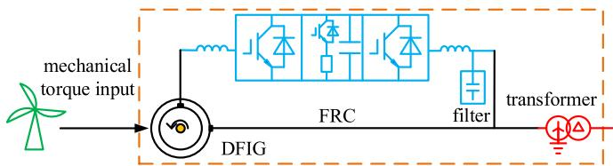  
Fig. 1. DFIG-based WT topology.

3) The M-NFSS method is proposed by using “multiple times with low-order” instead of “one time with high-order,” which can further reduce the number of nodes and expand the scale of the WF that can be simulated.

The rest of thos article is organized as follows: Section II presents the circuit-based decoupling modeling method for the core equipment of WTs. Section III introduces the M-NFSS method in wind power collection systems. Section IV provides comprehensive validation through tests conducted on RTDS. Finally, Section V concludes this article.

# II. WIND TURBINE MODELING PRINCIPLES

Fig. 1 depicts the topology of a DFIG-based WT. The electrical components include four core devices: DFIG; FRC; transformer, and filter. The resistor-capacitor filter model discretizes the capacitor as described in [32]. The converter utilizes a switching function model, details of which are omitted here. Notably, the converter models feature a large capacitor in the dc circuit and smoothing reactors in the ac circuit, ensuring smooth transitions in dc voltage $V _ { \mathrm { d c } } ( t )$ and ac current Ii(t) $( i = a , b , c )$ between consecutive steps. To achieve this, a decoupling method replaces $V _ { \mathrm { d c } } ( t )$ and $I _ { i } ( t )$ with $V _ { \mathrm { d c } } ( t { - } \Delta t )$ and $I _ { i } ( t { - } \Delta t )$ , respectively. This section introduces decoupling modeling methods for both the DFIG and transformer, reducing the WT model’s node count from 24 to just 3 nodes connected to the external circuit.

# A. DFIG Model by Decoupling Stator and Rotor

Existing DFIG models face challenges in interfacing with other equipment and are cumbersome to program in simulation software, often necessitating direct circuit connections between the stator and rotor. To address these issues, a discretizationbased modeling approach coupled with latency decoupling is proposed, establishing a singular electrical signal connection between the stator and rotor. The mathematical model of the DFIG comprises voltage equations, flux-linkage equations, and the rotor mechanical equation, outlined as follows:

$$
\begin{array}{l} \left\{ \begin{array}{l} U _ {a b c s} = R _ {s} I _ {a b c s} + \frac {d \psi_ {a b c s}}{d t} \\ U _ {a b c r} = R _ {r} I _ {a b c r} + \frac {d \psi_ {a b c r}}{d t} \end{array} \right. (1) \\ \left\{ \begin{array}{l} \psi_ {a b c s} = \left(L _ {l s} + L _ {m}\right) I _ {a b c s} + \frac {1}{n} L _ {m} I _ {a b c r} e ^ {j \theta_ {r}} \\ \psi_ {a b c r} = \left(L _ {l r} + \frac {1}{n ^ {2}} L _ {m}\right) I _ {a b c r} + \frac {1}{n} L _ {m} I _ {a b c s} e ^ {- j \theta_ {r}} \end{array} \right. (2) \\ \end{array}
$$

$$
J \frac {d \omega_ {r}}{d t} = T _ {e} - T _ {m} - K _ {D} \omega_ {r} \tag {3}
$$

where U, I, and ψ denote the winding voltage, current, and fluxlinkage; the subscripts abcs and abcr denote the stator winding and rotor winding in the abc frame; $R _ { s }$ and $R _ { r }$ represent the stator and rotor winding resistance; $L _ { l s }$ and $L _ { l r }$ represent the

leakage inductance of the stator and rotor; $L _ { m }$ is the excitation inductance; n denotes the turn ratio; $\theta _ { r }$ is the rotor angle between a- and d- axis; ωr represents the rotor speed; $T _ { m }$ is the mechanical torque exerted by the prime mover on the motor shaft; $T _ { e }$ is the electromagnetic torque; J is the rotational inertia; and $K _ { D }$ is the mechanical damping coefficient.

The stator and rotor variables are converted by analogy between the primary and secondary sides of the transformer. The conversion equations are as follows:

$$
\left\{ \begin{array}{l l} n \psi_ {a b c r} = \psi_ {a b c r} ^ {\prime} & \\ n U _ {a b c r} = U _ {a b c r} ^ {\prime} & n I _ {a b c r} = I _ {a b c r} ^ {\prime}. \\ n ^ {2} R _ {r} = R _ {r} ^ {\prime} & n ^ {2} L _ {l r} = L _ {l r} ^ {\prime} \end{array} \right. \tag {4}
$$

To convert the mathematical model of the DFIG into a constant coefficient equation, the abc/dq0 transformation is utilized. Following this transformation, the voltage and flux-linkage equations in matrix form in the dq0 frame are expressed as follows:

$$
\boldsymbol {U} = \boldsymbol {R} \boldsymbol {I} + \frac {\mathrm {d} \psi}{\mathrm {d} t} + \boldsymbol {e} \tag {5}
$$

$$
\psi = L I \tag {6}
$$

$$
\left\{ \begin{array}{l} \boldsymbol {U} = \left[ U _ {d s} \quad U _ {q s} \quad U _ {0 s} \quad U _ {d r} ^ {\prime} \quad U _ {q r} ^ {\prime} \quad U _ {0 r} ^ {\prime} \right] ^ {T} \\ \boldsymbol {R} = \operatorname {d i a g} \left[ R _ {s} \quad R _ {s} \quad R _ {s} \quad R _ {r} ^ {\prime} \quad R _ {r} ^ {\prime} \quad R _ {r} ^ {\prime} \right] \\ \boldsymbol {I} = \left[ I _ {d s} \quad I _ {q s} \quad I _ {0 s} \quad I _ {d r} ^ {\prime} \quad I _ {q r} ^ {\prime} \quad I _ {0 r} ^ {\prime} \right] ^ {T} \\ \boldsymbol {\psi} = \left[ \psi_ {d s} \quad \psi_ {q s} \quad \psi_ {0 s} \quad \psi_ {d r} ^ {\prime} \quad \psi_ {q r} ^ {\prime} \quad \psi_ {0 r} ^ {\prime} \right] ^ {T} \\ \boldsymbol {e} = \left[ - \omega_ {1} \psi_ {q s} \quad \omega_ {1} \psi_ {d s} \quad 0 \quad - \omega_ {s} \psi_ {q r} ^ {\prime} \quad \omega_ {\mathrm {s}} \psi_ {d r} ^ {\prime} \quad 0 \right] ^ {T}. \\ \boldsymbol {L} = \left[ \begin{array}{c c c c c c} L _ {s} & 0 & 0 & L _ {m} & 0 & 0 \\ 0 & L _ {s} & 0 & 0 & L _ {m} & 0 \\ 0 & 0 & L _ {\mathrm {l s}} & 0 & 0 & 0 \\ L _ {m} & 0 & 0 & L _ {r} ^ {\prime} & 0 & 0 \\ 0 & L _ {m} & 0 & 0 & L _ {r} ^ {\prime} & 0 \\ 0 & 0 & 0 & 0 & 0 & L _ {\mathrm {l r}} ^ {\prime} \end{array} \right] \end{array} . \right.
$$

Select the current as the state variable, substitute (6) into (5) to eliminate the flux-linkage term, and use the implicit Euler method to discretize

$$
\boldsymbol {L} (\boldsymbol {I} (t) - \boldsymbol {I} (t - \Delta t)) = \Delta t (\boldsymbol {U} (t) - \boldsymbol {R I} (t) - \boldsymbol {e} (t)). \tag {8}
$$

To avoid the computational complexity involving timevarying asymmetric matrices, the speed electromotive force e in (8) is treated as a historical value. Eq. (8) is then partitioned into stator and rotor blocks to obtain:

$$
\begin{array}{l} \left[ \begin{array}{c c} \boldsymbol {L} _ {s s} & \boldsymbol {L} _ {s r} \\ \bar {\boldsymbol {L}} _ {s r} ^ {- - -} & \bar {\boldsymbol {L}} _ {r r} ^ {- - -} \end{array} \right] \left[ \begin{array}{c} \boldsymbol {I} _ {d q 0 s} (t) \\ \bar {\boldsymbol {I}} _ {d q 0 r} ^ {r} (\bar {t}) \end{array} \right] = \Delta t \left[ \begin{array}{c} \boldsymbol {U} _ {d q 0 s} (t) \\ \bar {\boldsymbol {U}} _ {d q 0 r} ^ {r} (\bar {t}) \end{array} \right]. \\ + \Delta t e (t - \Delta t) + L I (t - \Delta t). \tag {9} \\ \end{array}
$$

The Park transformation is applied separately to the stator and rotor, and (9) is transformed into the abc frame to facilitate connection with the external circuit. This transformation yields the DFIG equation in the form of $\pmb { I } = \pmb { G } \pmb { U } + \pmb { J }$ , illustrated as follows:

$$
\left[ \begin{array}{c} \boldsymbol {I} _ {a b c s} (t) \\ \tilde {\boldsymbol {I}} _ {a b c r} ^ {r} (t) \end{array} \right] = \left[ \begin{array}{c c} \boldsymbol {G} _ {1 1} & \boldsymbol {G} _ {1 2} \\ \tilde {\boldsymbol {G}} _ {2 1} & \tilde {\boldsymbol {G}} _ {2 2} \end{array} \right] \left[ \begin{array}{c} \boldsymbol {U} _ {a b c s} (t) \\ \tilde {\boldsymbol {U}} _ {a b c r} ^ {r} (t) \end{array} \right] + \left[ \begin{array}{c} \boldsymbol {I} _ {s} (t - \Delta t) \\ \tilde {\boldsymbol {I}} _ {r} ^ {r} (t - \Delta t) \end{array} \right] \tag {10}
$$

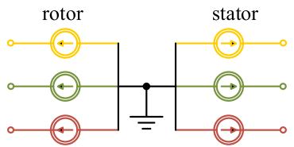  
Fig. 2. DFIG equivalent circuit.

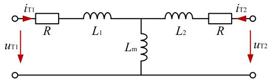  
Fig. 3. Transformer T-type equivalent circuit.

in which

$$
\left[ \begin{array}{c c} \boldsymbol {G} _ {1 1} & \boldsymbol {G} _ {1 2} \\ \tilde {\boldsymbol {G}} _ {2 1} & \tilde {\boldsymbol {G}} _ {2 2} \end{array} \right] = \left[ \begin{array}{c c} \boldsymbol {P} _ {1} ^ {- 1} & 0 \\ 0 & \boldsymbol {P} _ {2} ^ {- 1} \end{array} \right] \left[ \begin{array}{c c} \boldsymbol {L} _ {s s} & \boldsymbol {L} _ {s r} \\ \tilde {\boldsymbol {L}} _ {s r} & \tilde {\boldsymbol {L}} _ {r r} \end{array} \right] ^ {- 1} \left[ \begin{array}{c c} \boldsymbol {P} _ {1} & 0 \\ 0 & \boldsymbol {P} _ {2} \end{array} \right] \tag {11}
$$

where $P _ { 1 }$ and $P _ { 2 }$ represent Park transformation matrices; transformation angles are ϕ and $( \varphi - \theta _ { r } )$ , respectively, and $\varphi$ denotes the angle between stator a-axis and the A-axis of the rotating magnetic field.

The matrix G is an admittance matrix, and the nondiagonal elements represent the mutual admittance. Obtaining the equivalent circuit of the DFIG according to (10) results in mutual admittance between the stator and rotor nodes, including the ground node, complicating subsequent WT solutions. To simplify, matrix G is decomposed into $\pmb { G } = \pmb { G } _ { 1 } \pmb { + } \pmb { G } _ { 2 }$ , where U(t) multiplied by $G _ { 2 }$ part is delayed as $U ( t { - } \Delta t )$ , transforming the node admittance matrix to $G _ { 1 }$ . This adjustment alters node interconnections. To facilitate the overall modeling of the WT, it is expected to realize coupling between the stator and the rotor as well as the coupling of the three phases for DFIG. Thus, set $G _ { 1 } = 0 , G _ { 2 } = G$ and obtain

$$
\left[ \begin{array}{l} \boldsymbol {I} _ {a b c s} (t) \\ \boldsymbol {I} _ {a b c r} ^ {\prime} (t) \end{array} \right] = \left[ \begin{array}{c c} \boldsymbol {G} _ {1 1} & \boldsymbol {G} _ {1 2} \\ \boldsymbol {G} _ {2 1} & \boldsymbol {G} _ {2 2} \end{array} \right] \left[ \begin{array}{c} \boldsymbol {U} _ {a b c s} (t - \Delta t) \\ \boldsymbol {U} _ {a b c r} ^ {\prime} (t - \Delta t) \end{array} \right] + \left[ \begin{array}{c} \boldsymbol {I} _ {s} (t - \Delta t) \\ \boldsymbol {I} _ {r} ^ {\prime} (t - \Delta t) \end{array} \right]. \tag {12}
$$

The decoupled equivalent circuit of the DFIG is depicted in Fig. 2. It illustrates a circuit where the seven nodes are not connected by admittance, consisting solely of controlled current sources. Signal transmission occurs through these controlled sources, preserving the coupling relationship between the stator and rotor.

# B. Transformer Model By Decoupling the Primary and Secondary Sides

The modeling method for the transformer has been previously documented in [30], without accounting for the transformer winding resistance. To enhance the model’s comprehensiveness, the winding resistors are incorporated into the T-type equivalent circuit, as depicted in Fig. 3.

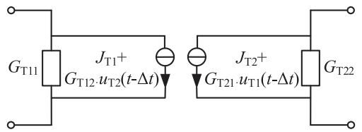  
Fig. 4. Transformer equivalent circuit.

The voltages across the coupled windings are shown as

$$
\left\{ \begin{array}{l} u _ {T 1} (t) = L _ {1} \frac {d i _ {T 1} (t)}{d t} + L _ {m} \frac {d \left(i _ {T 1} (t) + i _ {T 2} (t) / N\right)}{d t} + \boxed {R i _ {T 1} (t)} \\ u _ {T 2} (t) = \frac {L _ {m}}{N} \frac {\mathrm {d} \left(i _ {T 1} (t) + i _ {T 2} (t) / N\right)}{d t} + L _ {2} \frac {d i _ {T 2} (t)}{d t} + \boxed {R i _ {T 2} (t)} \end{array} \right.. \tag {13}
$$

Discretize (13) and organize into the form of $\pmb { I } = \pmb { G } _ { T } \pmb { U } + \pmb { J } _ { T } ,$ as shown in

$$
\begin{array}{l} \left[ \begin{array}{c} i _ {T 1} (t) \\ i _ {T 2} (t) \end{array} \right] = \left[ \begin{array}{c c} L _ {1} + L _ {m} + \Delta t R & L _ {m} / N \\ L _ {m} / N & L _ {2} + \frac {L _ {m}}{N ^ {2}} + \Delta t R \end{array} \right] ^ {- 1}. \\ \left\{\Delta t \left[ \begin{array}{c} u _ {T 1} (t) \\ u _ {T 2} (t) \end{array} \right] + \left[ \begin{array}{c c} L _ {1} + L _ {m} & L _ {m} / N \\ L _ {m} / N & L _ {2} + L _ {m} / N ^ {2} \end{array} \right] \left[ \begin{array}{c} i _ {T 1} (t - \Delta t) \\ i _ {T 2} (t - \Delta t) \end{array} \right] \right\}. \tag {14} \\ \end{array}
$$

where N is the transformer ratio.

Adopt the decoupling method similar to DFIG modeling in Section II-A and perform matrix splitting on the matrix $G _ { T } .$ For the transformer, decoupling the primary and secondary sides can greatly simplify the solution of the overall network, so take the splitting form as

$$
\boldsymbol {G} _ {1} = \left[ \begin{array}{c c} G _ {1 1} & 0 \\ \dots & \dots \\ 0 & - G _ {2 2} \end{array} \right], \boldsymbol {G} _ {2} = \left[ \begin{array}{c c} 0 & G _ {1 2} \\ \ddots & \ddots \\ G _ {2 1} & 0 \end{array} \right]. \tag {15}
$$

Since the primary and secondary sides of the transformer are two-terminal ports, the conductance and current source can be placed across the two terminals without grounding each individually. Fig. 4 illustrates the decoupled equivalent circuit of the transformer.

# C. Whole WT Equivalent Model

Based on the above core equipment decoupling modeling methods, according to the WT topology, the equivalent circuit of the WT can be obtained as shown in Fig. 5. Employing the decoupling method, the equivalent circuit is divided into four distinct parts, including the converter’s machine-side circuit, the dc-side circuit, the converter’s grid-side circuit, and the external circuit. The three complete circuits can be solved independently through $\pmb { U } = \pmb { Y } ^ { - 1 } \pmb { J } .$ while the external terminals can be connected to external circuits for solution.

# III. MODELING METHOD FOR THE WIND FARM

This section establishes a π-type line model taking into account inter-phase coupling and subsequently establishes a fournode equivalent model of a string based on M-NFSS. Several string models converge at the point of common coupling (PCC) to form the WF model.

A. π-type Line Model Considered Coupling Between Phases

The WT outlet line is short and can be modeled using a π-type equivalent circuit, as shown in Fig. 6. in which, R and L are in matrix form, and there are resistors and inductors connected between nodes at the receiving and sending sides

$$
[ R ] = \left[ \begin{array}{l l l} R _ {s} & R _ {m} & R _ {m} \\ R _ {m} & R _ {s} & R _ {m} \\ R _ {m} & R _ {m} & R _ {s} \end{array} \right], [ L ] = \left[ \begin{array}{l l l} L _ {s} & L _ {m} & L _ {m} \\ L _ {m} & L _ {s} & L _ {m} \\ L _ {m} & L _ {m} & L _ {s} \end{array} \right]. \tag {16}
$$

The resistance, inductance, and capacitance are derived from the sequence parameter, as in

$$
\left\{ \begin{array}{l} R _ {\mathrm {s}} = \frac {R _ {\mathrm {z}} + 2 R _ {\mathrm {p}}}{3}, R _ {\mathrm {m}} = \frac {R _ {\mathrm {z}} - R _ {\mathrm {p}}}{3} \\ L _ {\mathrm {s}} = \frac {L _ {\mathrm {z}} + 2 L _ {\mathrm {p}}}{3}, L _ {\mathrm {m}} = \frac {L _ {\mathrm {z}} - L _ {\mathrm {p}}}{3} \\ C = \frac {1}{2} \frac {C _ {\mathrm {p}} - C _ {\mathrm {z}}}{3}, C _ {\mathrm {m}} = \frac {C _ {\mathrm {z}}}{2} \end{array} \right. \tag {17}
$$

where the subscripts p and z represent positive- and zerosequence, respectively.

After discretization, the π-type line model is shown in

$$
\left\{ \begin{array}{l} i (t) = G \left[ u _ {t r} (t) - u _ {\mathrm {r e}} (t) \right] + J \\ G = \left\{\left[ R \right] + \frac {2}{\Delta t} [ L ] \right\} ^ {- 1} \\ J = G \left[ u _ {t r} (t - \Delta t) - u _ {\mathrm {r e}} (t - \Delta t) \right. \\ \quad \left. + \left(\frac {2}{\Delta t} [ L ] - [ R ]\right) i (t - \Delta t) \right] \end{array} . \right. \tag {18}
$$

For (18), although the decoupling method similar to the DFIG modeling in Section II-A can be used, it can only decouple the three phases, not the receiving and sending sides. In this case, it cannot split the circuit into two parts for further simplifying the circuit solution. Hence the decoupling method is not used for the π-type line. Instead, The string composed of multiple WTs and lines is processed using the M-NFSS method below.

# B. String Equivalent Method Using M-NFSS

Fig. 7 illustrates a schematic of the string topology. The string is composed of WTs connected with short transmission lines. Multiple strings gather power at a 35kV bus and transmit it to the ac system via a step-up transformer and long transmission lines.

Taking a string comprising m WTs and m lines as an example. Since the machine-side, grid-side, and dc circuits of each WT are independent, the string topology only encompasses the outer terminals of the transformer’s primary side of each WT and the terminals on both sides of the line.

The principles of NFSS are provided here. First, the network equations are divided into blocks according to the division of internal and external nodes, as shown in

$$
\left[ \begin{array}{l l} \boldsymbol {A} & \boldsymbol {B} \\ \ddot {\boldsymbol {B}} ^ {T} & \ddot {\boldsymbol {C}} \end{array} \right] \left[ \begin{array}{l} \boldsymbol {U} _ {\mathrm {E X}} \\ \ddot {\boldsymbol {U}} _ {\mathrm {I N}} \end{array} \right] = \left[ \begin{array}{l} \boldsymbol {J} _ {\mathrm {E X}} \\ \ddot {\boldsymbol {J}} _ {\mathrm {I N}} \end{array} \right] + \left[ \begin{array}{l} \boldsymbol {I} _ {\mathrm {E X}} \\ 0 \end{array} \right]. \tag {19}
$$

Eliminate the internal nodes and obtain

$$
\left(\boldsymbol {A} - \boldsymbol {B} \boldsymbol {C} ^ {- 1} \boldsymbol {B} ^ {T}\right) \boldsymbol {U} _ {\mathrm {E X}} = \boldsymbol {I} _ {\mathrm {E X}} + \boldsymbol {J} _ {\mathrm {E X}} - \boldsymbol {B} \boldsymbol {C} ^ {- 1} \boldsymbol {J} _ {\mathrm {I N}}. \tag {20}
$$

It is expected to only retain four external nodes (including the abc nodes and the ground node). If NFSS is directly applied to the string, the number of internal nodes is 3m, and the matrix inversion of C is still complex. As the matrix order increases, the computational complexity of matrix inversion increases exponentially, so NFSS can be improved by using ‘multiple

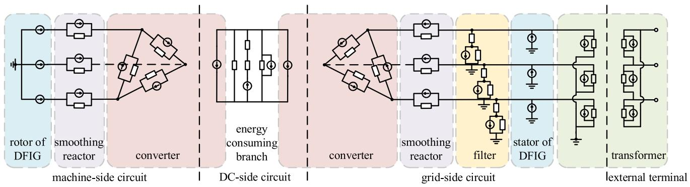  
Fig. 5. Whole WT equivalent circuit.

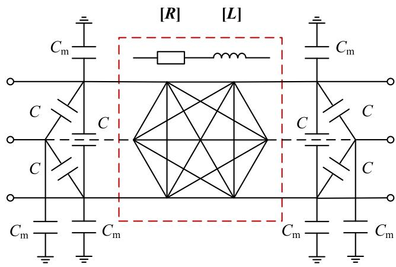  
Fig. 6. π-type equivalent circuit.

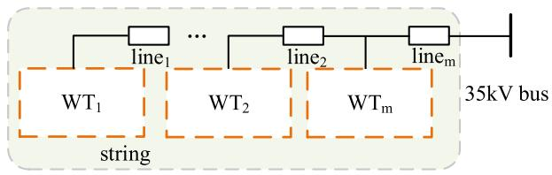  
Fig. 7. Schematic of the string topology.

times with low-order’ instead of “one time with high-order.” By re-extracting a smaller circuit from the circuit composed of the initial internal nodes, and further dividing the internal and external nodes, the M-NFSS method is proposed, so that the required calculations for each level will be much less.

In Fig. 8, only the seven-node model in the dotted rectangular box is considered during each step. First, the internal nodes between $\mathrm { W T _ { 1 } }$ and line1 are eliminated to obtain $\mathrm { E M } _ { 1 } .$ . Next, the first equivalent model $\mathrm { E M _ { 1 } }$ is combined with $\mathrm { l i n e _ { 2 } }$ and the internal nodes are once again eliminated. Repeat this step m times and obtain the final equivalent model $\mathrm { E M } _ { m } .$ . During each step, the equivalent is performed according to (19), (20), and (20) can be rewritten as

$$
\left\{ \begin{array}{l} I _ {\mathrm {E X}} = G _ {\mathrm {E Q}} U _ {\mathrm {E X}} + J _ {\mathrm {E Q}} \\ G _ {\mathrm {E Q}} = A - B C ^ {- 1} B ^ {T} \\ J _ {\mathrm {E Q}} = B C ^ {- 1} J _ {\mathrm {I N}} - J _ {\mathrm {E X}} \end{array} \right. \tag {21}
$$

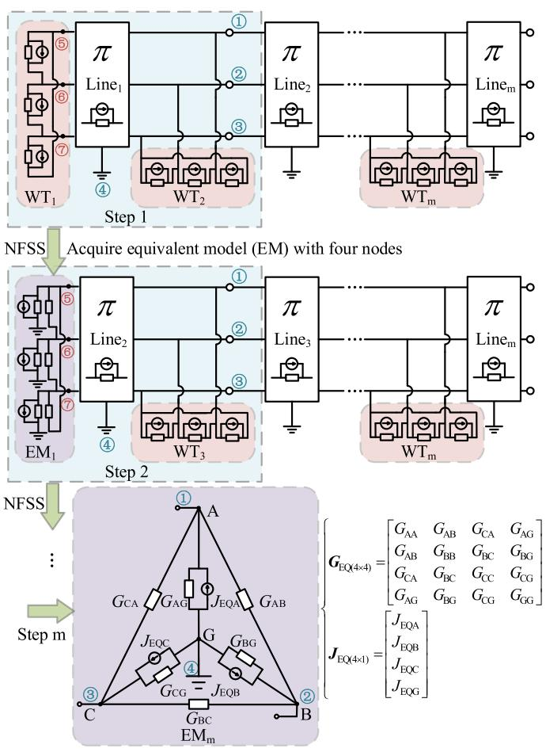  
Fig. 8. Flow chart of the proposed M-NFSS method.

The information of internal nodes can be obtained by the inverse solution, as shown in

$$
\boldsymbol {U} _ {\text {I N}} = \boldsymbol {Y} _ {2 2} ^ {- 1} \left(\boldsymbol {J} _ {\text {I N}} - \boldsymbol {Y} _ {2 1} \boldsymbol {U} _ {\text {E X}}\right). \tag {22}
$$

The calculations are divided into m stages and each stage involves computations of order 3. This iterative approach culminates in obtaining a four-node equivalent model of the string with low computational complexity. Importantly, all internal node information can be accurately resolved through inverse calculations, ensuring the integrity of internal data.

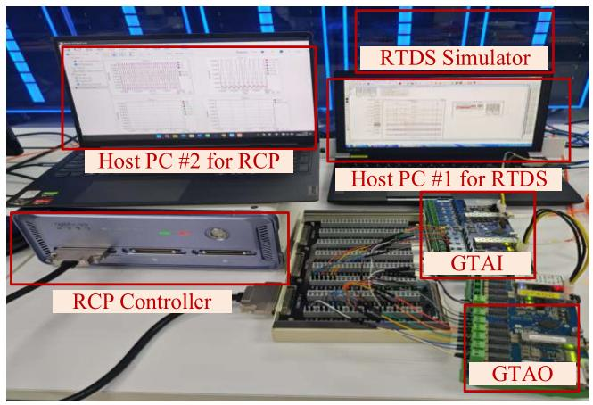  
Fig. 9. Photo of the hardware set-up.

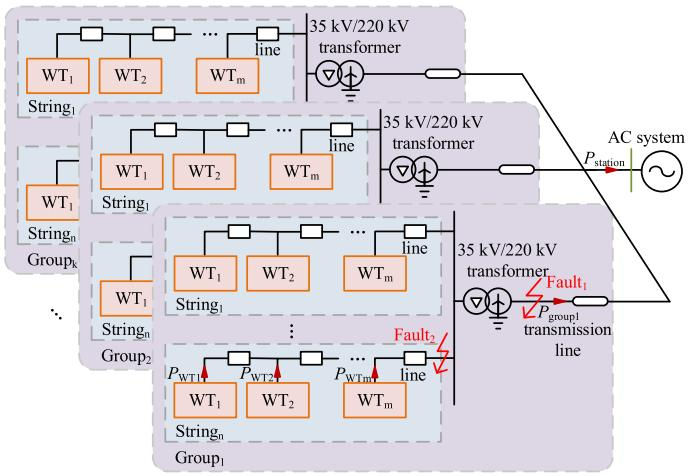  
Fig. 10. Schematic of the wind farm test system.

# IV. VALIDATION

The WT equivalent model $\mathbf { ( E M _ { 1 } ) }$ introduced in Section II and the string model comprising m WTs and m lines $\left( \mathrm { E M } _ { m } \right)$ introduced in Section III are implemented in the Cbuilder custom component function in real-time digital simulator (RTDS). A WF simulation test model was constructed to verify the accuracy of time-domain waveforms, impedance characteristics, and simulation resource occupation of the established model through comparison with the detailed model (DM) and the average model (AVM). Additionally, the $\mathrm { E M _ { 1 } }$ model was further evaluated through hardware-in-the-loop (HIL) tests. A rapid control prototyping (RCP) system was utilized to generate trigger signals for the grid-side converter, with input and output handled through GTAI/GTAO interface boards. These interface boards were connected to the RTDS via fiber optic cables. The RCP and the RTDS simulator were linked to their respective host PCs using network cables. The hardware set-up is shown in Fig. 9.

The system parameters of the test model are given in Table I. The filter parameter design follows the example model documentation provided by RTDS and considers the following factors: ac current ripple; dc voltage utilization; reactive power limits; resonant frequency; and damping resistor [33].

Fig. 10 illustrates the schematic of the test system.

TABLE I PARAMETERS OF THE TEST MODEL   

<table><tr><td>Device</td><td>Symbol</td><td>Parameter</td><td>Value</td></tr><tr><td rowspan="10">DFIG</td><td>Sb</td><td>Rated capacity (MVA)</td><td>2.5</td></tr><tr><td>Ub</td><td>Rated voltage (kV)</td><td>0.69</td></tr><tr><td>fb</td><td>Rated frequency (Hz)</td><td>50</td></tr><tr><td>Rs</td><td>Stator resistance (p.u.)</td><td>0.01</td></tr><tr><td>Rr</td><td>Rotor resistance (p.u.)</td><td>0.006</td></tr><tr><td>Lls</td><td>Stator leakage inductance (p.u.)</td><td>0.102</td></tr><tr><td>Llr</td><td>Rotor leakage inductance (p.u.)</td><td>0.08596</td></tr><tr><td>Lm</td><td>Magnetic inductance (p.u.)</td><td>4.348</td></tr><tr><td>n</td><td>Turns ratio from Rotor to Stator sides</td><td>2.6377</td></tr><tr><td>J</td><td>Machine inertia constant</td><td>1.5</td></tr><tr><td rowspan="4">converter</td><td>fs</td><td>Switching frequency (Hz)</td><td>2000</td></tr><tr><td>C</td><td>DC-bus capacitance (μF)</td><td>20000</td></tr><tr><td>Lg</td><td>Filter inductance for grid-side (mH)</td><td>0.3</td></tr><tr><td>Lm</td><td>Filter inductance for machine-side (mH)</td><td>0.12</td></tr><tr><td rowspan="2">filter</td><td>Cf</td><td>Capacitance (μF)</td><td>250</td></tr><tr><td>Rf</td><td>Resistor (Ω)</td><td>0.35</td></tr><tr><td rowspan="3">0.69 kV/35 kV transformer</td><td>STb</td><td>Rated capacity (MVA)</td><td>2.5</td></tr><tr><td>2R</td><td>Total winding resistance (p.u.)</td><td>0.001</td></tr><tr><td>L1+L2</td><td>Total winding reactance (p.u.)</td><td>0.1</td></tr><tr><td rowspan="6">line</td><td>Rp</td><td>Positive sequence resistance (Ω)</td><td>0.07</td></tr><tr><td>Lp</td><td>Positive sequence capacitive reactance (MΩ)</td><td>0.00455</td></tr><tr><td>Cp</td><td>Positive sequence inductive reactance (Ω)</td><td>0.07</td></tr><tr><td>Rz</td><td>Zero sequence resistance (Ω)</td><td>0.19</td></tr><tr><td>Lz</td><td>Zero sequence capacitive reactance (MΩ)</td><td>0.00455</td></tr><tr><td>Cz</td><td>Zero sequence inductive reactance (Ω)</td><td>0.02</td></tr></table>

This article does not focus on parameter and control strategy design, therefore, all WTs and lines in simulations share identical settings. The control strategy of the test model is traditional vector control, a standard approach in RTDS. PWM is used for converter modulation. The grid-side control regulates the dc-bus voltage and the ac voltage, while the machine-side control regulates the electromagnetic torque and the reactive power. Additionally, it is important to note that the proposed model represents an equivalent circuit and does not involve any simplification of the control system. Consequently, this model is compatible with any reasonable control system, allowing for varied initial settings among WTs before the start of simulation.

# A. Accuracy Test

1) Time-Domain Simulations Under Varying Wind Speeds: First, take $n = m = k = 1$ and exclude the line to verify the accuracy of the $\mathrm { E M _ { 1 } }$ . The simulation conditions under varying wind speeds, and the corresponding waveforms for wind speed, mechanical torque, electromagnetic torque, dc voltage, active power, and reactive power are presented in Fig. 11.

Fig. 11(a) illustrates that the wind speed decreases from 12 to 6 m/s at $t = 3 \ \mathrm { s } ,$ then ramps up to 16 m/s at $t = 1 5 \ \mathrm { s } ,$ and ultimately returns to 12 m/s, achieving a stable state. Fig. 11(b) illustrates that under pitch angle control, sudden variations in wind speed do not induce abrupt changes in mechanical torque. Consequently, electrical characteristics, such as electromagnetic torque and active power also display smooth trends of increase

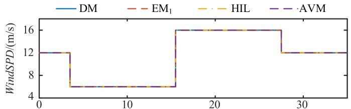

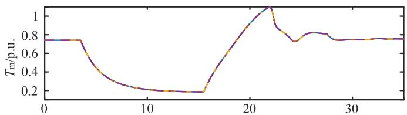  
(a)   
(b)

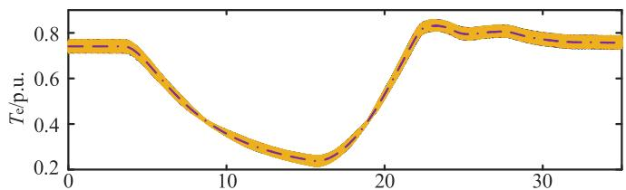

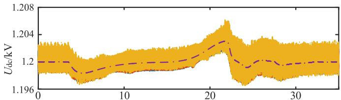  
(c)

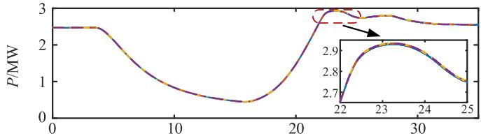  
(d)

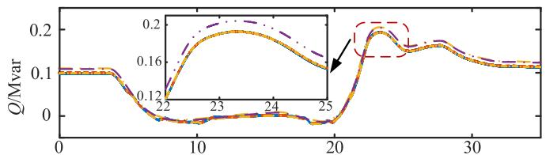  
(e)   
(f)   
t/s   
Fig. 11. Waveforms of WT under changing wind speeds. (a) Wind speed. (b) Mechanical torque. (c) Electromagnetic torque. (d) DC voltage. (e) Active power. (f) Reactive power.

and decrease, thereby confirming the robustness of the control system under fluctuating wind speed conditions. The average error between the EM1 model and the DM model is less than 1%, indicating high accuracy. HIL testing brings minor errors due to line losses and transmission delays. Despite this, the waveforms closely align with the DM results, indicating that the proposed modeling method is highly compatible with the actual controller. Although the waveform trends of the AVM align with those of

the DM model, it fails to capture the fluctuations of electrical quantities, such as dc voltage and electromagnetic torque, near their steady-state values due to the omission of the switching process, as shown in Fig. 11(c) and (d).

2) Time-Domain Simulations Under Faults: A single-phase grounding short-circuit fault is set at $\mathrm { F a u l t _ { 1 } }$ in Fig. 10 to further verify the accuracy of the $\mathrm { E M _ { 1 } }$ under faults. The fault time is 0.1 s. The waveforms of active power, reactive power, dc voltage, phase A voltage at the PCC, and phase A voltage at the outlet of the grid-side converter are recorded, as shown in :

Fig. 12 illustrates the temporal evolution of various electrical quantities during the fault. The fault is triggered at $t = 0 . 1$ s , leading to a decrease in active power, which reaches its minimum at $t = 0 . 2 ~ \mathrm { s }$ . Meanwhile, the dc voltage increases and the active power is dissipated in the dc energy-consuming branch. The electromagnetic torque of the DFIG exhibits oscillations and gradually recovers fault removal. The phase A voltage will drop, but due to the presence of ground fault resistance, it will not drop to zero. The average relative errors of $\mathrm { E M _ { 1 } }$ and HIL are both less than 3% and smaller than that of the $\mathbf { A V M } .$ , which proves the accuracy of each component and the overall modeling method mentioned in Section II. Furthermore, as depicted in Fig. 12(f), due to the neglect of high-frequency harmonics in the switching function model and AVM, the harmonic characteristics of the voltage at the outlet of the converter cannot be fully reflected. Therefore, DM remains necessary for device-level simulations.

Due to computational constraints, each RTDS core can simulate only three detailed WT models. Therefore, taking $k = n = 1$ , $m = 3$ to verify the accuracy of the $\mathrm { E M _ { 3 } }$ . In this test scenario, a three-phase short-circuit fault is introduced at $\mathrm { F a u l t _ { 2 } }$ in Fig. 10. The active power and reactive power waveforms of the station are recorded, as shown in Fig. 13.

Fig. 13 shows that, during the fault period, the changes in active power and reactive power are more severe, and the recovery process is more complicated during a three-phase short-circuit fault. These waveforms provide insights into the station’s response to fault conditions and the $\mathrm { E M _ { 3 } }$ can still achieve fitting of the DM and can be applied to the simulation of steady-state, fault of the WF. The average relative error is still less than 3.6%, and the accuracy of M-NFSS is high.

3) Frequency Domain Impedance Characteristic: By comparing the impedance characteristic scanning results to verify whether the frequency domain characteristics of the $\mathrm { E M _ { 3 } }$ are consistent with the DM. The frequency scanning component is used to inject harmonics. The frequency scanning area is on the left side of the ac system outlet bus in Fig. 10. Since the wind power oscillation problem mainly focuses on sub-, super-synchronous oscillation, and broadband oscillation, the range is set to 1–100 Hz and 1000–2000 Hz, with intervals of 1 and 2 Hz respectively. The results, illustrated in Fig. 14, validate the consistency of frequency domain characteristics between $\mathrm { E M _ { 3 } }$ and DM.

The impedance amplitude and phase angle results demonstrate that the $\mathrm { E M _ { 3 } }$ closely matches DM across most frequencies. At 25–27 Hz, slight deviations are observed where the amplitude shows a relative error of 15% and the phase angle exhibits near-opposite values. The phase angle of the DM and $\mathrm { E M _ { 3 } }$ at 26 Hz are 3.047 and −3.03, respectively, indicating that the

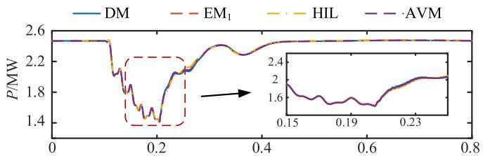

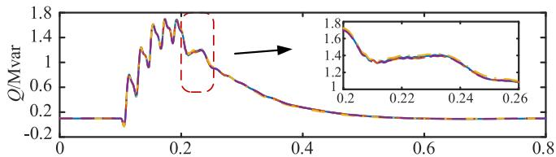  
(a)

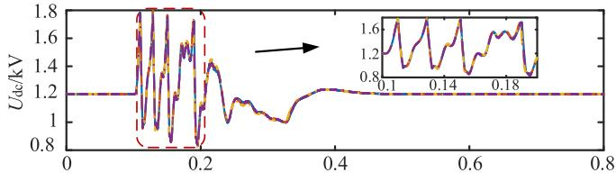  
(b)   
(c)

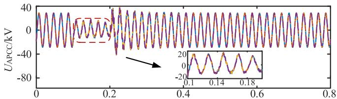

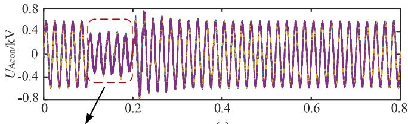  
(d)   
(e)

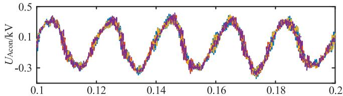  
(f)   
t/s   
Fig. 12. Waveforms of WT under faults. (a) Active power. (b) Reactive power. (c) DC voltage. (d) Phase A voltage at the point of common coupling. (e) Phase A voltage at the outlet of the grid-side converter. (f) Details of (e).

impedance is near the mutation point of $1 8 0 ^ { \circ } \ ( - 1 8 0 ^ { \circ } )$ . The actual error on the vector diagram is not large. Moreover, the minimum scanning interval of the scanning component is 1 Hz. Further refinement with smaller scanning intervals below 1 Hz could enhance accuracy. The average relative error of waveform comparisons is consistently below 3%, affirming the impedance characteristics established in Section III align closely with DM. This equivalence supports the utility of the proposed model for auxiliary analysis in small disturbance stability assessments.

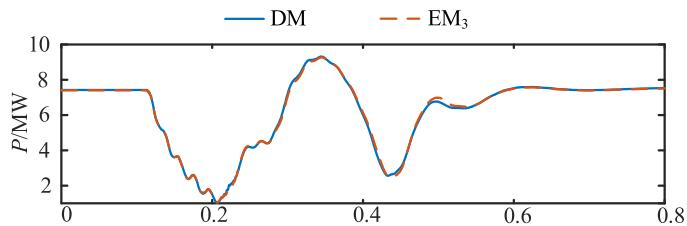

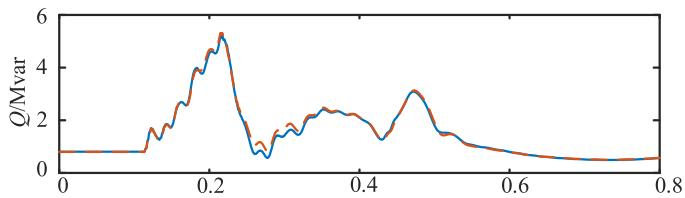  
  
(b)   
t/s

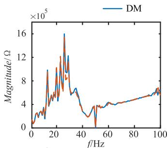  
Fig. 13. Waveforms of string. (a) Active power. (b) Reactive power.

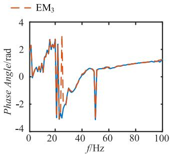

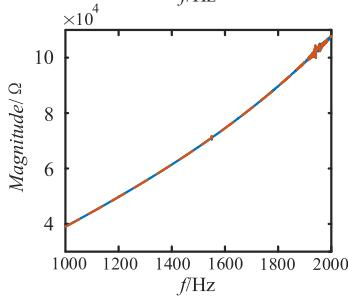

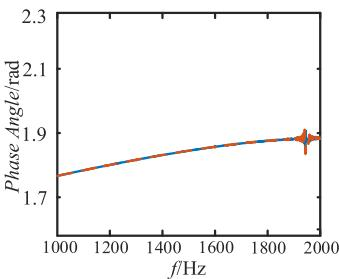  
Fig. 14. Impedance characteristic scanning results.

TABLE II NUMBER OF MODELS IN A CORE   

<table><tr><td>Simulation step</td><td>DM</td><td>AVM</td><td>EM1</td></tr><tr><td>2.17 μs</td><td>1</td><td>1</td><td>2</td></tr><tr><td>3.33 μs</td><td>2</td><td>2</td><td>3</td></tr><tr><td>4.17 μs</td><td>2</td><td>3</td><td>3</td></tr><tr><td>5.56 μs</td><td>3</td><td>3</td><td>5</td></tr><tr><td>10 μs</td><td>3</td><td>3</td><td>9</td></tr></table>

# B. Efficiency Test

This section validates the resource efficiency of the proposed modeling method by comparing the number of WTs simulated per core in the NovaCor simulator between DM, AVM, and EM1. Take $n = k = 1$ and short transmission lines are excluded here. As the simulation step size continues to expand, record the number

TABLE III COMPARISON OF AVERAGE MODEL, EM1, AND EMm   

<table><tr><td rowspan="2"></td><td rowspan="2" colspan="2">DM</td><td colspan="4">Equivalent model</td></tr><tr><td>AVM</td><td>NFSS</td><td>EM1</td><td>Aggregation model</td></tr><tr><td>System-level accuracy</td><td>★★★★★</td><td>★★★★★</td><td>★★★★★</td><td>★★★★★</td><td>★★★★☆</td><td>★★★★★</td></tr><tr><td>Accuracy inside the WF</td><td>★★★★★</td><td>★★★★★</td><td>★★★★★</td><td>★★★★★</td><td>★☆☆☆☆</td><td>★★★★★</td></tr><tr><td>Accuracy inside the WT</td><td>★★★★★</td><td>★★★☆☆</td><td>★★★★☆</td><td>★★★★☆</td><td>☆☆☆☆☆</td><td>★★★★☆</td></tr><tr><td>Simulation efficiency</td><td>☆☆☆☆☆</td><td>★★☆☆☆</td><td>★★☆☆☆</td><td>★★★☆☆</td><td>★★★★★</td><td>★★★★☆</td></tr><tr><td>Applicable scenarios</td><td>Device/ wind turbine</td><td>Small-scale station/ large time step</td><td>Large-scale station refined topology</td><td>Large-scale station refined topology</td><td>Ultra-large-scale stations/ multiple large-scale stations</td><td>Large-scale station refined topology</td></tr></table>

*More stars(★) indicate better performance

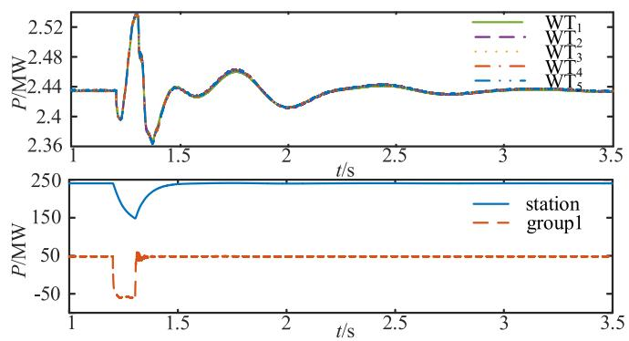  
Fig. 15. Waveforms of the three-phase fault condition.

of WTs in the dashed box in Fig. 10. The results are summarized in Table II.

The results show that the $\mathrm { E M _ { 1 } }$ takes up less resources than the DM and AVM. On the one hand, the computational complexity of a WT is lower and the simulation step requirements are lower; on the other hand, as the simulation step increases from 5.56 to 10 $\mu \mathrm { s } ,$ the DM and AVM encounter limitations due to the number of electrical nodes, whereas $\mathrm { E M _ { 1 } }$ remains unaffected. Overall, at a 10 $\mu \mathrm { s }$ step size, $\mathrm { E M _ { 1 } } \mathrm { \ ' } _ { \mathrm { s } }$ resource usage is 33.3% of that required by DM, enabling a threefold increase in simulation scale. In addition, according to the above analysis, the $\mathrm { E M _ { 1 } }$ at 10 μs is mainly limited by the calculations of the model, suggesting that the $\mathrm { E M } _ { m }$ does not have an obvious resource-saving effect. Nonetheless, $\mathrm { E M } _ { m }$ effectively eliminates additional nodes introduced by transmission lines, potentially extending the upper limit of simulatable WTs as the step size increases.

# C. WF Scale Test

To verify that using the modeling method proposed in this article has the ability to simulate a refined large-scale WF in real-time, this section uses four Novacor simulators, taking $n = 4 , m = 5$ , and using the $\mathrm { E M _ { 5 } }$ equivalent model. Build a WF model of hundreds of WTs for simulation. The WT capacity is 2.5 MW and the WF capacity reaches 250 MW. A three-phase short circuit fault is set at Fault2 in Fig. 10, and waveforms of power test points are shown in Fig. 15.

Modify the $\mathrm { W T _ { 1 } }$ control parameter $K p$ from 0.1 to 100 to excite an oscillation, the results are shown in Fig. 16.

$\mathrm { W T _ { 1 } }$ exhibits pronounced oscillations starting at $t = 1 \ : \mathrm { s } .$ , which escalate significantly by $t = 4 \mathrm { ~ s ~ }$ . While other WTs initially

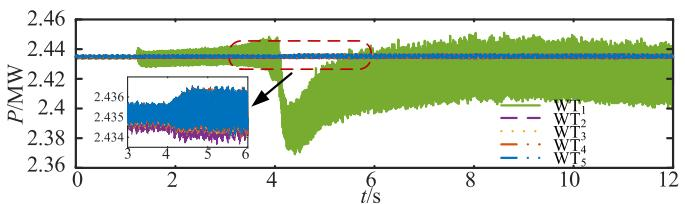

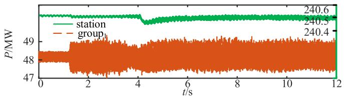  
Fig. 16. Waveforms of oscillation condition.

show minor oscillations, they intensify over time. This trend is similarly observed in group1 and the station. Figs. 15 and 16 demonstrate that the developed model accurately simulates internal faults and oscillation conditions, enabling the measurement of electrical quantities for each WT. The model retains comprehensive internal information, making it suitable for studying fault traceability and oscillation propagation characteristics.

# D. Discussions

This section aims to provide a comprehensive comparison of the proposed method with existing approaches, highlighting its innovations and application scenarios. Table III gives a comparison among the DM, AVM, NFSS method, EM1, aggregation model, and $\mathrm { E M } _ { m }$ .

The existing modeling methods each possess distinct advantages and limitations. The DM serves as a benchmark for accuracy but suffers from slow simulation speeds, making it suitable mainly for the core device or individual WT verification. The AVM sacrifices some WT internal accuracy and simplifies component-level details, albeit failing to resolve the “dimensionality disaster” of node complexities. Consequently, AVM is suitable for small-scale station simulations and larger time step simulations due to its ability to disregard switching processes. The aggregation model loses most of the internal information of the station and the WTs, and can only reflect the system’s output characteristics to a certain extent. However, due to the limitation of hardware resources, the aggregation method is still inevitably used in the simulation of ultra-large-scale WFs or multiple large-scale WFs. The NFSS, $\mathrm { E M _ { 1 } }$ , and $\mathrm { E M } _ { m }$ are all aimed at

refined modeling methods for large-scale WFs, encompassing all WTs and lines. Among these, the proposed method in this article markedly improves simulation efficiency and emphasizes parameter prestorage and parallelism for real-time simulations. It is worth mentioning that, higher model integration enhances efficiency but reduces flexibility for users to modify internal topology. Therefore, the $\mathrm { E M } _ { m }$ model can improve simulation efficiency more than the $\mathrm { E M _ { 1 } }$ model, but it loses some flexibility.

# V. CONCLUSION

In this article, a DFIG-based WT using the latency decoupling method is proposed. The established DFIG model facilitates seamless interfacing with other devices for simulations, overcoming traditional modeling challenges. Ultimately, the WT model is condensed into a three-node equivalent, significantly simplifying network solution complexities. M-NFSS method is proposed and used to establish a string model that can further expand the number of simulated WTs. By adopting “multiple times with low-order,” this method enhances NFSS efficiency particularly when handling numerous internal nodes.

Through various tests in RTDS and HIL testing, the results show that the computational complexity of the WT model is greatly reduced while the impedance characteristics and the time-domain waveform’s errors are within acceptable range. Moreover, unlike traditional single-machine or multimachine aggregation methods for station equivalents, the refined model retains all individual WTs. This approach proves advantageous for studying fault conditions and oscillation propagation characteristics within WFs. The proposed method emphasizes parameter preprocessing and shows promise for further development on hardware platforms with enhanced parallelism.

# REFERENCES

[1] J. Yang et al., “A 5.5–276 W integrated photovoltaic energy harvesting system with 99.95% MPPT efficiency and 98.74% power conversion efficiency,” IEEE Trans. Power Electron., vol. 40, no. 3, pp. 4522–4535, Mar. 2025.   
[2] S. Chen et al., “Transient stability analysis and improved control strategy for dc-link voltage of DFIG-based WT during LVRT,” IEEE Trans. Energy Convers., vol. 37, no. 2, pp. 880–891, Jun. 2022.   
[3] Y. Ma, D. Zhu, J. Hu, R. Liu, X. Zou, and Y. Kang, “Optimized design of demagnetization control for DFIG-based wind turbines to enhance transient stability during weak grid faults,” IEEE Trans. Power Electron., vol. 40, no. 1, pp. 76–81, Jan. 2025.   
[4] C. Jin, Z. Ji, K. Liu, W. Chen, and J. Zhao, “A region-folding electromagnetic transient simulation approach for large-scale power electronics system,” IEEE Trans. Power Electron., vol. 38, no. 8, pp. 9755–9766, Aug. 2023.   
[5] X. Guillaud et al., “Applications of real-time simulation technologies in power and energy systems,” IEEE Power Energy Technol. Syst. J., vol. 2, no. 3, pp. 103–115, Sep. 2015.   
[6] Z. Yu, Z. Zhao, B. Shi, and H. Xu, “An automatic circuit partitioning strategy for accelerated simulation of power electronic systems,” IEEE Trans. Power Electron., vol. 38, no. 5, pp. 5619–5625, May 2023.   
[7] X. Guo, X. Yuan, D. Zhu, X. Zou, and J. Hu, “Evaluation and optimization of DFIG-based WTs for constant inertia as synchronous generators,” IEEE Trans. Power Electron., vol. 39, no. 8, pp. 10453–10464, Aug. 2024.   
[8] H. W. Dommel, Electromagnetic Transients Program Reference Manual (EMTP Theory Book). Portland: Bonneville Power Administration, 1986.   
[9] N. Sarma, P. M. Tuohy, and S. Djurovi´c, “Modeling, analysis, and validation of controller signal interharmonic effects in DFIG drives,” IEEE Trans. Sustain. Energy, vol. 11, no. 2, pp. 713–725, Apr. 2020.

[10] M. Wu and L. Xie, “Calculating steady-state operating conditions for DFIG-based wind turbines,” IEEE Trans. Sustain. Energy, vol. 9, no. 1, pp. 293–301, Jan. 2018.   
[11] U. Buragohain and N. Senroy, “Reduced order DFIG models for PLLbased grid synchronization stability assessment,” IEEE Trans. Power Syst., vol. 38, no. 5, pp. 4628–4639, Sep. 2023.   
[12] C. Dufour, J. Mahseredjian, and J. Bélanger, “A combined State-space nodal method for the simulation of power system transients,” IEEE Trans. Power Del., vol. 26, no. 2, pp. 928–935, Apr. 2011.   
[13] N. Guo and W. Liu, “Power electronic switching models for numerical simulations of power system electromagnetic transient,” in Proc. IEEE 8th Int. Conf. Adv. Power Syst. Automat. Protection, 2019, pp. 1026–1030.   
[14] C. Shah et al., “Review of dynamic and transient modeling of power electronic converters for converter dominated power systems,” IEEE Access, vol. 9, pp. 82094–82117, 2021.   
[15] S. Ebrahimi, T. Vahabzadeh, and J. Jatskevich, “Numerically efficient average-value model for voltage-source converters in nodal-based programs,” IEEE Open J. Power Electron., vol. 5, pp. 93–105, 2024.   
[16] S. Shao et al., “Modeling and advanced control of dual-active-bridge dcdc converters: A review,” IEEE Trans. Power Electron., vol. 37, no. 2, pp. 1524–1547, Feb. 2022.   
[17] H. Jin, “Behavior-mode simulation of power electronic circuits,” IEEE Trans. Power Electron., vol. 12, no. 3, pp. 443–452, May 1997.   
[18] Q.-T. An, L.-Z. Sun, K. Zhao, and L. Sun, “Switching function model based fast-diagnostic method of open-switch faults in inverters without sensors,” IEEE Trans. Power Electron., vol. 26, no. 1, pp. 119–126, Jan. 2011.   
[19] W. Li, P. Chao, X. Liang, D. Xu, and X. Jin, “An improved single-machine equivalent method of wind power plants by calibrating power recovery behaviors,” IEEE Trans. Power Syst., vol. 33, no. 4, pp. 4371–4381, Jul. 2018.   
[20] J.-Y. Ruan, Z.-X. Lu, Y. Qiao, and Y. Min, “Analysis on applicability problems of the aggregation-based representation of wind farms considering DFIGs’ LVRT behaviors,” IEEE Trans. Power Syst., vol. 31, no. 6, pp. 4953–4965, Nov. 2016.   
[21] J. Zou, C. Peng, H. Xu, and Y. Yan, “A fuzzy clustering algorithm-based dynamic equivalent modeling method for wind farm with DFIG,” IEEE Trans. Energy Convers., vol. 30, no. 4, pp. 1329–1337, Dec. 2015.   
[22] M. Ali, I.-S. Ilie, J. V. Milanovic, and G. Chicco, “Wind farm model aggregation using probabilistic clustering,” IEEE Trans. Power Syst., vol. 28, no. 1, pp. 309–316, Feb. 2013.   
[23] A. P. Gupta, A. Mitra, A. Mohapatra, and S. N. Singh, “A multi-machine equivalent model of a wind farm considering LVRT characteristic and wake effect,” IEEE Trans. Sustain. Energy, vol. 13, no. 3, pp. 1396–1407, Jul. 2022.   
[24] W. Yubo et al., “An impedance-based equivalent method for wind farms with PMSGs to evaluate power system oscillation stability,” in Proc. 9th Asia Conf. Power Elect. Eng., 2024, pp. 60–64.   
[25] J. Marti and L. Linares, “Real-time EMTP-based transients simulation,” IEEE Trans. Power Syst., vol. 9, no. 3, pp. 1309–1317, Aug. 1994.   
[26] J. R. Martí, L. R. Linares, J. A. Hollman, and F. A. Moreira, “OVNI: Integrated software/hardware solution for real-time simulation of large power systems,” in Proc. 14th Power Syst. Comput. Conf., 2002, pp. 1–7.   
[27] M. Milton and A. Benigni, “Latency insertion method based real-time simulation of power electronic systems,” IEEE Trans. Power Electron., vol. 33, no. 8, pp. 7166–7177, Aug. 2018.   
[28] J. Xu, S. Fan, C. Zhao, and A. M. Gole, “High-speed EMT modeling of MMCs with arbitrary multiport submodule structures using generalized Norton equivalents,” IEEE Trans. Power Del., vol. 33, no. 3, pp. 1299–1307, Jun. 2018.   
[29] J. Xu et al., “Enhanced high-speed electromagnetic transient simulation of MMC-MTDC grid,” Int. J. Elect. Power Energy Syst., vol. 83, no. 1, pp. 7–14, Dec. 2016.   
[30] M. Feng, C. Gao, J. Ding, H. Ding, J. Xu, and C. Zhao, “Hierarchical modeling scheme for high-speed electromagnetic transient simulations of power electronic transformers,” IEEE Trans. Power Electron., vol. 36, no. 9, pp. 9994–10004, Sep. 2021.   
[31] M. Zou et al., “Integrated equivalent model of permanent magnet synchronous generator based wind turbine for large-scale offshore wind farm simulation,” J. Modern Power Syst. Clean Energy, vol. 11, no. 5, pp. 1415–1426, Sep. 2023.   
[32] N. Watson and J. Arrillaga, Power Systems Electromagnetic Transients Simulation. London, U.K.: Inst. Elect. Eng., 2003.   
[33] RTDS Technologies Inc., RTDS User’s Tutorial Manual, Winnipeg, MB, Canada, 2021.

Yifan Liu was born in Jiangsu, China. He received the B.S. degree in electrical engineering and its automation in 2021 from North China Electric Power University (NCEPU), Baoding, China, where he is currently working toward the Ph.D. degree in electrical engineering.

His research interests include the electromagnetic transient equivalent modeling of wind power generation system and real-time simulation.

Chengyong Zhao (Senior Member, IEEE) was born in Zhejiang, China. He received the B.S., M.S., and Ph.D. degrees in power systems and its automa tion from North China Electric Power University (NCEPU), Beijing, China, in 1988, 1993, and 2001, respectively.

From January to April 2013 and from September to October 2016, he was a Visiting Professor with the University of Manitoba, Winnipeg, MB, Canada. He is currently a Professor with the School of Electrical and Electronic Engineering, NCEPU. His research

interests include HVdc systems and dc grid.

Jianzhong Xu (Senior Member, IEEE) was born in Shanxi, China. He received the Ph.D. degree in electrical engineering from North China Electric Power University (NCEPU), Beijing, China, in 2014.

He is currently a Professor with the State Key Laboratory of Alternate Electrical Power System with Renewable Energy Resources, NCEPU. His research interests include electromagnetic transient equivalent modeling, simulation, and the analysis of HVdc grid.

Yiyang Zhu was born in Henan, China. She received the B.S. degree in electrical engineering and its automation in 2023 from North China Electric Power University (NCEPU), Baoding, China, where she is currently working toward the master’s degree in electrical engineering.

Her research interests include electromagnetic transient equivalent modeling and simulation methods for internal faults in wind generators.

Gen Li (Senior Member, IEEE) received the B.Eng. degree in electrical engineering from Northeast Electric Power University, Jilin, China, in 2011, the M.Sc. degree in Power Engineering from Nanyang Technological University, Singapore, in 2013, and the Ph.D. degree in electrical engineering from Cardiff University, Cardiff, U.K., in 2018.

He is currently an Associate Professor with the Technical University of Denmark (DTU), Kongens Lyngby, Denmark. From 2013 to 2016, he was been a Marie Curie Early Stage Research Fellow funded by

European Commission’s MEDOW project. He has been a Visiting Researcher with China Electric Power Research Institute, Beijing, China, Elia, Brussels, Belgium, and Toshiba International, Staines, U.K. He was a Research Associate at Cardiff University from 2018 to 2022. His research interests include control and protection of HV and MVdc, offshore wind, and offshore energy islands.

Dr. Li is a Chartered Engineer in the U.K., an Associate Editor for IEEE TRANSACTIONS ON POWER DELIVERY, IEEE TRANSACTIONS ON SUSTAINABLE ENERGY, and CSEE Journal of Power and Energy Systems and an Editorial Board Member of CIGRE ELECTRA. He was the recipient of the CIGRE NGN Significant Contribution Award in 2024 and the First CIGRE Thesis Award in 2018. He is now a Steering Committee Member of CIGRE Denmark NGN and a Member of CIGRE Working Group B4.96.

Zhaoxuan Tian was born in Hebei, China. She received the B.S. degree in electrical engineering from the Hebei University of Technology, Tianjin, China, in 2024. She is currently working toward master’s degree in electrical engineering at North China Electric Power University (NCEPU), Beijing, China.

Her current research focuses on the application of artificial intelligence in power systems.