# Norton Equivalent Modeling of Current Source MMC and Its Use for Dynamic Studies of Back-to-Back Converter System

Mukeshkumar M. Bhesaniya, Student Member, IEEE, and Anshuman Shukla, Senior Member, IEEE

Abstract—Current source modular multilevel converter (CSMMC) is a good alternative for high-power applications with medium-voltage and high-current requirements. In such applications, to obtain the multilevel current output and for current scaling, a large number of submodules are required in CSMMC. Detailed representation of such systems in electromagnetic transient-type (EMT-type) simulation programs brings computational complexity with large computing burden. This paper presents a computationally efficient equivalent model of CSMMC based on the Norton equivalents. Each arm of the converter is represented by a two-node Norton equivalent in this model, which eliminate the internal intermediate nodes, and hence, significantly reduces the computing time. The proposed model is implemented in PSCAD/EMTDC by using the module component coded in FORTRAN and results are validated with the full-size traditional model in PSCAD/EMTDC. Moreover, hybrid models are presented and validated for the submodule level studies such as fail-safe functionality with redundant submodules. This paper also focuses on the control method and dynamic studies of the CSMMC based back-to-back system. The results of these studies are compared with the proposed equivalent model and accurate matching of the results confirms the usefulness of the proposed model in such studies.

Index Terms--Electromagnetic transients (EMT), modular multilevel converter (MMC), Norton equivalent, current source converter (CSC), back-to-back converters.

# I. INTRODUCTION

ODULAR multilevel converters (MMCs) are gaining importance as a key technology for high-power M applications [1]-[6]. Voltage source MMCs, in particular, are highly suitable for medium to high-voltage applications, such as high-voltage direct-current (HVDC) transmission [2], [3]. Advantages and limitations of the voltage source MMCs for numerous applications are well reported in literature [1]-[6]. Alternatively, current source modular multilevel converters (CSMMCs) are the promising option for low to mediumvoltage applications [7]-[9]. The salient features of the CSMMCs include modular construction, lower switching frequency, reduced harmonics, and reduced stress on each device, amongst others [7]. Moreover, CSMMC offers a unique feature of dc fault tolerant capability [9]. This feature may eliminate the need for a dc-side breaker in applications such as back-to-back converter systems. Furthermore, the power reversal in a back-to-back converter system is achieved

by changing the dc-link voltage polarity [9]. The high scalability of CSMMC to different power and current levels make it a competitive solution for the medium-voltage and high-power applications such as flexible ac transmission systems and grid integration of renewable energy. In [13], hybrid configurations of CSMMC and line-commutated converters (LCCs) are presented for HVDC applications. Moreover, in pumped-storage plants, it is an interesting option as static frequency converters (SFC) for variable speed synchronous units of very large size. Variable speed operation based on doubly-fed induction machines (DFIM) is the latest technology in pumped storage operation [10]. However, there are serious limitations of DFIM based systems such as time consuming start-up and synchronization process and complex design [10], [11]. Hence, the future trend will be more towards synchronous machines with full-scale converters in pumpedstorage plants [11]. Due to medium voltage and high-current rating of the synchronous machines for these plants, the design of full-scale SFC, which is directly connected to the stator, is very challenging. However, using CSMMC, current scaling is possible due to the parallel connections of the submodules. This will make the CSMMC a potential candidate as SFC in pumped-storage applications. Many papers have also discussed the advantages of using current source converters (CSCs) for wind integration to the grid and it is reported in [12] that the CSC is most favorable for power ratings greater than 5 MW. Owing to the increased current capability, the CSMMCs are competitive options for such applications.

The full-scale CSMMC for high-power rating requires large number of submodules (SMs). If CSMMC is modeled using the detailed representation of all the semiconductor devices and passive components then, the simulation of such model in electromagnetic transient-type (EMT-type) program becomes computationally burdensome. In EMT-type simulation programs [15], Dommel’s algorithm is widely accepted method [14]. In this approach, the dynamic elements of the system are represented as the Norton equivalent using trapezoidal integration method. The resulting network using the Norton equivalents is used in formulating the system equations based on nodal analysis. At every switching operation, the resulting nodal admittance matrix is triangularized with ordered elimination and using sparsity [14], [15]. However, in high-power applications, converters used in the system may consist of large number of submodules and hence, the corresponding nodal admittance matrix of the system becomes very large. This makes the simulation computationally expensive using the full-size traditional model in EMT-type simulation tools. Hence, for increasing the

simulation speed of such systems, simplified or equivalent models of converter which accurately replicate the behavior of the system as the traditional models are very useful.

Various dynamic averaged and simplified models for voltage source MMCs are reported in [16]-[23] to overcome the computing limitations of the traditional model. In [16] and [17], the efficient models of voltage source MMC based on Thevenin equivalents have been proposed. However, the problem in the approach of [16] and [17] is that they do not reproduce the dynamic interactions between ac and dc sides during the blocking of the IGBT switches. Hence, they are not suitable for the dc fault studies [18]. The enhanced equivalent model of MMC is proposed in [18] to accurately represent the behavior of converter during the blocked IGBT conditions. In [19], the switches and thyristors are used in each arm level model to study the dc-side faults.

The averaged models for voltage source MMC based highvoltage dc transmission systems are presented in [20], [21]. These models can accurately replicate the dynamic and transient performance of the converter when interfaced into large grids. The voltage source MMC model derived from its differential equations is proposed in [22]. This approach can be used for the system level studies and controller design. The small-signal models for voltage source MMC, which are convenient for small-signal frequency domain analysis and controller design, are presented in [23]. For the studies of large ac/dc systems with multiple converters, the switching and the converter level control may not be taken into account in average models [25]. Hence, larger time steps can be used which results in high computational speed [24], compared with the equivalent models presented in [16]-[19]. However, since the parameters of the individual submodule are not accessible in the average models, they are not suitable for the converter level studies such as failure of balancing control algorithm or the failure of the submodule itself. Detailed comparisons of different types of voltage source MMC models are presented in [25]-[28].

The main objective of this paper is to propose an equivalent model for CSMMC having high computational speed while representing similar behavior as of the traditional model. The proposed model is developed using Norton equivalents of the submodules and can be quite easily implemented in EMT-type simulation programs, such as PSCAD/EMTDC. One of the important features of the proposed model is that it is capable of simulating the influence of the current balancing controller. Moreover, it is also useful for the submodule level studies such as fail-safe functionality with redundant submodules [4]. Furthermore, the dynamic performance of the CSMMC based back-to-back system is evaluated and the results of various simulation studies using the proposed model and the traditional model are compared.

# II. CSMMC: STRUCTURE AND MODELING

Fig. 1(a) shows the basic structure of one phase of a threephase CSMMC. Each phase leg of CSMMC consists of two arms as illustrated in Fig. 1(a). The ac output is available at the midpoint of the two arms. Each converter arm includes N parallel connected, identically rated, half-bridge submodules and the arm capacitor $C _ { \mathrm { a r m } } .$ These submodules comprises of two reverse voltage blocking switches, $S _ { 1 }$ and $S _ { 2 } ,$ and an

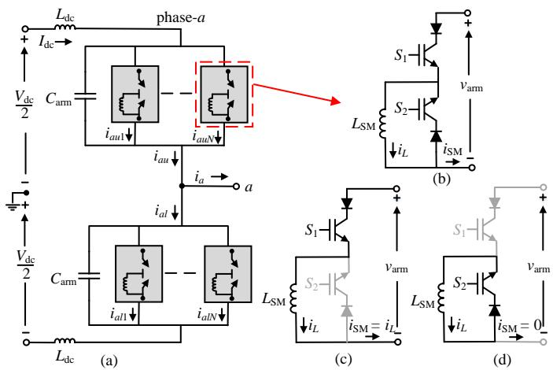  
Fig. 1. (a) Structure of one phase of a three phase CSMMC. (b) Half-bridge submodule configuration. (c) Submodule inserted. (d) Submodule bypassed.

energy storage inductor $L _ { \mathrm { S M } }$ as shown Fig. 1(b). In normal operation, only one of the two switches in the submodule will be in on-state at a given time instant. Assuming the inductor current $i _ { L }$ is kept constant, the output current $i _ { \mathrm { S M } }$ of each submodule can take one of two different current levels; $i _ { L }$ or zero. With $S _ { 1 }$ in on-state (S2 in off-state), the submodule is inserted in the arm, as shown in Fig. 1(c), and the current iSM is equal to $i _ { L } .$ When $S _ { 1 }$ is in off-state (S2 in on-state), the submodule is bypassed and the current iSM is equal to zero as shown in Fig. 1(d). Thus, it is possible to control the individual submodule of the converter to get the desired current as given by (1).

$$
i _ {\mathrm {S M}} (t) = \left\{ \begin{array}{l l} i _ {L}, & \text {i f S} _ {1} \text {i s o n a n d S} _ {2} \text {i s o f f} \\ 0, & \text {i f S} _ {1} \text {i s o f f a n d S} _ {2} \text {i s o n .} \end{array} \right. \tag {1}
$$

As a result, by inserting/bypassing appropriate number of submodules in each phase leg, the multilevel current waveform is generated at the converter ac terminals.

# A. Modeling of CSMMC Submodule

This subsection shows how the Norton equivalent of the submodule is developed and in next subsection this is used to construct the equivalent model for the converter arm. The switch in a submodule can be represented by a resistance which takes one of two different values; on-state resistance $R _ { \mathrm { o n } }$ or off-state resistance $R _ { \mathrm { o f f } } .$ . The submodule inductor can be represented by an equivalent current source in parallel with a resistor as shown in Fig. 2.

The continuous model of a submodule inductor, shown in Fig. 1(b), is described by the equation

$$
v _ {L} (t) = L _ {\mathrm {S M}} \frac {d i _ {L} (t)}{d t} \tag {2}
$$

where $\nu _ { L } ( t )$ is the voltage across the inductor and $i _ { L } ( t )$ is the inductor current. Equation (2) can be approximated by means of numerical integration [14]. Rearranging (2):

$$
i _ {L} (t) = i _ {L} (t - \Delta t) + \frac {1}{L _ {\mathrm {S M}}} \int_ {t - \Delta t} ^ {t} v _ {L} (t) d t. \tag {3}
$$

Here, ∆t is the calculation time-step and $i _ { L } \left( t - \Delta t \right)$ represents the inductor current at previous time-step. Using the trapezoidal method as the numerical integrator substitution, the discrete model of (3) is expressed as

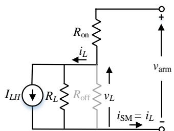  
(a)

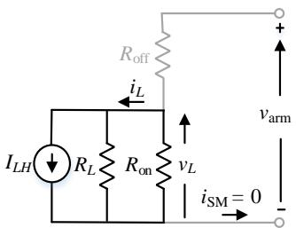  
(b)

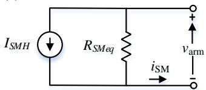  
(c)   
Fig. 2. Submodule equivalent circuits. (a) Submodule inserted. (b) Submodule bypassed. (c) Norton equivalent of a submodule.

$$
i _ {L} (t) = i _ {L} (t - \Delta t) + \frac {\Delta t}{L _ {\mathrm {S M}}} \left(\frac {v _ {L} (t - \Delta t) + v _ {L} (t)}{2}\right). \tag {4}
$$

Equation (4) can be rearranged as

$$
i _ {L} (t) = \frac {\Delta t}{2 L _ {\mathrm {S M}}} v _ {L} (t) + \left(i _ {L} (t - \Delta t) + \frac {\Delta t}{2 L _ {\mathrm {S M}}} v _ {L} (t - \Delta t)\right) \tag {5}
$$

or $i _ { L } \left( t \right) = \frac { \nu _ { L } \left( t \right) } { R _ { L } } + I _ { L H } .$ (6)

Here,

$$
R _ {L} = \frac {2 L _ {\mathrm {S M}}}{\Delta t} \tag {7}
$$

and 1=i(t-△t）+(t-△）. $I _ { L H } = i _ { L } \left( t - \Delta t \right) + \frac { \nu _ { L } \left( t - \Delta t \right) } { R _ { L } } .$ (8)

The first term in (6) represents the inductor current contribution at present time-step t and the second term represents the contribution to the inductor current from the previous time-step  t t.  Δ The second term is called a history term. The value of the resistance $R _ { L }$ depends on the submodule inductance and the simulation time-step. From (6), it is evident that the inductor can be represented by an equivalent current source $I _ { L H }$ in parallel with resistance $R _ { L } .$ . Accordingly, the submodule circuit can be represented in the form as illustrated in Fig. 2(a) or (b). The voltage across inductor $\nu _ { L } \left( t \right)$ is related to the arm voltage and the submodule current as given by (9).

$$
v _ {L} (t) = \left\{ \begin{array}{l} v _ {\text {a r m}} (t) - i _ {\mathrm {S M}} (t) R _ {\text {o n}}, \text {i f S M i n s e r t e d} \\ v _ {\text {a r m}} (t) - i _ {\mathrm {S M}} (t) R _ {\text {o f f}}, \text {i f S M b y p a s s e d .} \end{array} \right. \tag {9}
$$

Similarly, the voltage across inductor $\nu _ { L } \left( t - \Delta t \right)$ at previous time-step is calculated as follows:

$$
v _ {L} (t - \Delta t) = \left\{ \begin{array}{l} v _ {\text {a r m}} (t - \Delta t) - i _ {\mathrm {S M}} (t - \Delta t) R _ {\text {o n}}, \\ \text {i f S M i n s e r t e d} \\ v _ {\text {a r m}} (t - \Delta t) - i _ {\mathrm {S M}} (t - \Delta t) R _ {\text {o f f}}, \\ \text {i f S M b y p a s s e d .} \end{array} \right. \tag {10}
$$

A Norton equivalent of a submodule is then derived as illustrated in Fig. 2(c). This will reduce the number of nodes and hence, the size of the corresponding nodal admittance

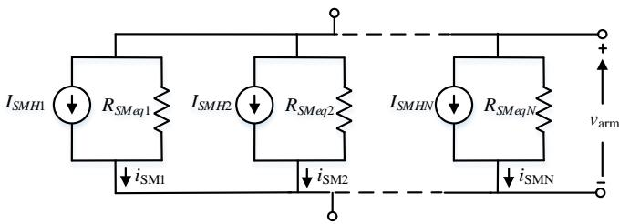  
(a)

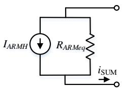  
(b)

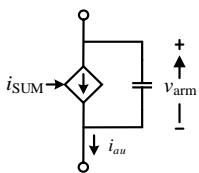  
(c)

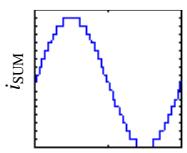  
  
Fig. 3. (a) Arm representation using Norton equivalents of submodules. (b) Norton equivalent representation of an arm. (c) Equivalent model of an arm. (d) Illustrative output current waveform.

matrix of the system reduces. The output current of an individual submodule can be determined as follows:

$$
i _ {\mathrm {S M}} (t) = \frac {1}{R _ {\mathrm {S M e q}}} v _ {\mathrm {a r m}} (t) + I _ {\mathrm {S M H}} \tag {11}
$$

where

$$
R _ {S M e q} = \left\{ \begin{array}{l} \frac {R _ {\text {o n}} R _ {L} + R _ {L} R _ {\text {o f f}} + R _ {\text {o f f}} R _ {L}}{R _ {L} + R _ {\text {o f f}}}, \text {i f S M i n s e r t e d} \\ \frac {R _ {\text {o n}} R _ {L} + R _ {L} R _ {\text {o f f}} + R _ {\text {o f f}} R _ {L}}{R _ {L} + R _ {\text {o n}}}, \text {i f S M b y p a s s e d} \end{array} \right. \tag {12}
$$

$I _ { S M H } = \left\{ \begin{array} { l } { I _ { L H } \frac { ( R _ { L } / / R _ { \mathrm { o f f } } ) } { R _ { \mathrm { o n } } + ( R _ { L } / / R _ { \mathrm { o f f } } ) } , \mathrm { i f ~ S M ~ i n s e r t e d } } \\ { I _ { L H } \frac { ( R _ { L } / / R _ { \mathrm { o n } } ) } { R _ { \mathrm { o f f } } + ( R _ { L } / / R _ { \mathrm { o n } } ) } , \mathrm { i f ~ S M ~ b y p a s s e d . } } \end{array} \right.$ LHI and (13)

# B. CSMMC Arm Model

To construct the equivalent model for the converter arm, all the submodules are replaced with their Norton equivalents as shown in Fig. 3(a). Here, the Norton equivalent resistances of all the identically rated submodules may be considered same. However, in certain studies, such as the testing of the balancing control with different electrical parameters of the switching components [29], these resistances can be considered different. In such cases each submodule in the arm can be treated individually, as done in [17] for voltage source MMC. However, it is not necessary to interface Norton equivalent of individual submodules with the EMT solver. For the system level studies, combined Norton equivalent of all submodules can give the satisfactory performance and hence the computation in EMT solver can be simplified. Therefore, all Norton equivalents of the parallel connected submodules are merged into a single Norton equivalent for the interface with the EMT solver as shown in Fig. 3(b). The equivalent model of an arm can be then represented using a single controlled current source as shown in Fig. 3(c) and illustrative output waveforms of an arm are shown in Fig. 3(d). The value of the controlled current source of an arm is determined using (14) which is derived by circuit inspection of Fig. 3(a) and applying fundamental circuit laws.

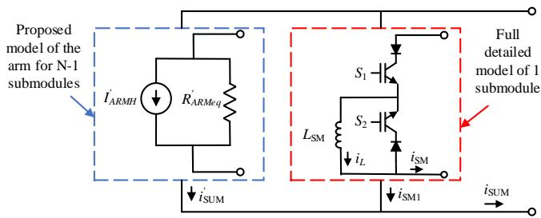  
(a)

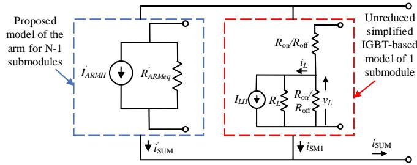  
(b)   
Fig. 4. Hybrid simulation models. (a) Proposed model incorporated with full detailed model of a submodule. (b) Proposed model incorporated with unreduced simplified IGBT-based model.

$$
\begin{array}{l} i _ {\mathrm {S U M}} = \sum_ {i = 1} ^ {N} i _ {\mathrm {S M} i} \\ = \sum_ {i = 1} ^ {N} \frac {1}{R _ {S M e q i}} v _ {\text {a r m}} (t) + \sum_ {i = 1} ^ {N} I _ {S M H i} \tag {14} \\ = \frac {1}{R _ {A R M e q}} v _ {\text {a r m}} (t) + I _ {A R M H} \\ \end{array}
$$

where $I _ { A R M H }$ and $R _ { A R M e q } $ are the Norton equivalent current and resistance of the arm. Thus each converter arm of N parallel connected submodules will reduce to a single two-node element and just one Norton equivalent equation for the arm is required. This will greatly reduce the size of the resultant admittance matrix of the system in EMT solver and drastically increases the simulation speed without compromising the accuracy. However, since all the submodules in the arm are now collapsed into a single Norton equivalent, users have no excess to the individual submodule components in the main EMT solver. Hence, this approach is not suitable for the submodule level studies which need the individual component access of the submodule. Nonetheless, the equivalent model does internally consider each submodule separately and therefore the individual submodule inductor currents and voltages are recorded. Hence, the model is still useful for the converter level studies such as testing of balancing control algorithm. The effect of activation/ deactivation of balancing control, using the proposed model, is demonstrated in Section IV-A. To study in detail the behavior individual submodule components, the hybrid models are presented in next subsection.

# C. Hybrid Models

Note that the proposed model is applicable not only to the system level studies, but also useful to test in detail the behavior of individual submodule by using hybrid simulation approach. One method is by linking the proposed model with the full detailed model of a submodule as illustrated in Fig.

4(a). In this approach, one or more submodules may be represented with the full detailed modeling [25] using the available components in the EMT-type program and the rest of the submodules in the arm are represented using the proposed equivalent model. The alternative method is to incorporate the unreduced equivalent model of a submodule with the proposed model as shown in Fig. 4(b). In this case, one or more submodules may be represented with their unreduced simplified IGBT-based model [25] and remaining submodules in the arm are represented using the proposed equivalent model. In this paper, the second method is used for studying the start-up and fail-safe functionality of the converter.

# III. BACK-TO-BACK CONVERTER SYSTEM

This section describes the control method for the CSMMC based back-to-back system. This system is used to validate the proposed model. The overall block diagram of the control scheme of the back-to-back converter system is shown in Fig. 5. The control task of this system is mainly distributed in two control layers: 1) system control layer and; 2) converter control layer. The system control layer decides the reference signals of active and reactive power exchange with the ac system. These signals are processed to produce the reference signals for the converter to obtain the desired output. Finally, at the converter control layer, the modulation and balancing control algorithm generates the gating commands for the converter.

# A. System Control Layer

As illustrated in Fig. $5 ,$ at the system control layer, the individual controller of the back-to-back converter is separated into two cascaded loops: 1) outer control loop and; 2) inner control loop. The outer controller is implemented to provide the active and reactive power regulation to the grid. If the converter is the power setting station, then it draws the set amount of active power from the ac side. If the dc-link current is set by the converter, then it exchanges the active power with the ac side so as to regulate the dc-link current. In the inner control loop, current controllers drive the actual $d -$ and q-axis currents to their corresponding references and generate the arm current references to feed the modulation and balancing algorithm. The $d -$ and q-axis current and voltage equations for the individual controller of the back-to-back converter system of Fig. 5 are given by (15)-(17) [9].

$$
\left[ \begin{array}{l} i _ {d} \\ i _ {q} \end{array} \right] = 2 \omega C _ {\text {a r m}} \left[ \begin{array}{l l} 0 & 1 \\ - 1 & 0 \end{array} \right] \left[ \begin{array}{l} v _ {d} \\ v _ {q} \end{array} \right] + 2 C _ {\text {a r m}} \frac {d}{d t} \left[ \begin{array}{l} v _ {d} \\ v _ {q} \end{array} \right] - 2 \left[ \begin{array}{l} i _ {u d} \\ i _ {u q} \end{array} \right] \tag {15}
$$

$$
\left[ \begin{array}{l} i _ {s d} \\ i _ {s q} \end{array} \right] = \omega C _ {f} \left[ \begin{array}{l l} 0 & 1 \\ - 1 & 0 \end{array} \right] \left[ \begin{array}{l} v _ {d} \\ v _ {q} \end{array} \right] + C _ {f} \frac {d}{d t} \left[ \begin{array}{l} v _ {d} \\ v _ {q} \end{array} \right] + \left[ \begin{array}{l} i _ {d} \\ i _ {q} \end{array} \right] \tag {16}
$$

$$
\left[ \begin{array}{l} v _ {s d} \\ v _ {s q} \end{array} \right] = \left[ \begin{array}{c c} R _ {s} & \omega L _ {s} \\ - \omega L _ {s} & R _ {s} \end{array} \right] \left[ \begin{array}{l} i _ {s d} \\ i _ {s q} \end{array} \right] + L _ {s} \frac {d}{d t} \left[ \begin{array}{l} i _ {s d} \\ i _ {s q} \end{array} \right] + \left[ \begin{array}{l} v _ {d} \\ v _ {q} \end{array} \right] \tag {17}
$$

where $\omega$ is the fundamental frequency, $R _ { s }$ and $L _ { s }$ are the resistance and leakage inductance of the coupling transformer, $i _ { d , q } ,$ and $\nu _ { d , q }$ are the $d -$ and q-axis converter output currents and voltages, $i _ { u d , u q }$ are the $d -$ and q-axis upper arm currents and $i _ { s d , s q }$ and $\nu _ { s d , s q }$ are the $d -$ and q-axis grid-side currents and voltages. Since the two converter stations are assumed to be

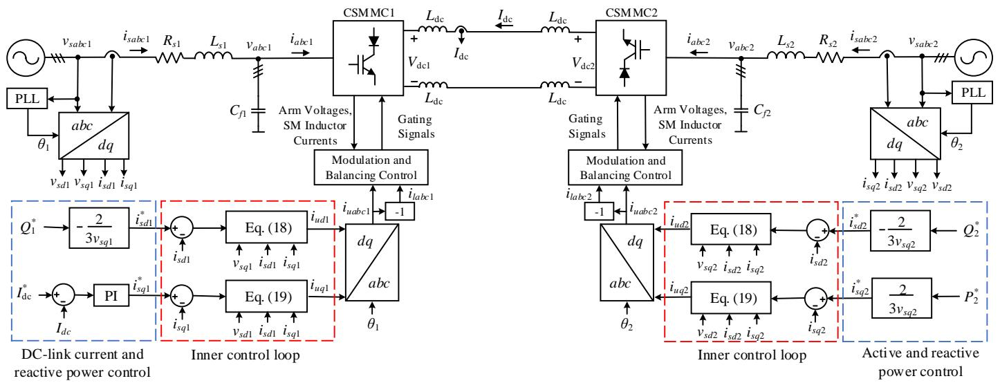  
Fig. 5. Schematic representation of the CSMMC based back-to-back converter system and control scheme.

symmetric, the variables and parameters are not subscribed by the numbers 1 and 2, used to denote the two different converter stations. Equations (15)-(17) are used by the inner control loop to obtain the $d -$ and q-axis arm current references $i _ { u d }$ and $i _ { u q }$ as follows:

$$
\begin{array}{l} i _ {u d} = \operatorname {P I} \left(i _ {s d} ^ {*} - i _ {s d}\right) - \frac {1}{2} \left(\left(1 - \omega^ {2} L _ {s} \left(C _ {f} + 2 C _ {\text {a r m}}\right)\right) i _ {s d} \right. \tag {18} \\ - \omega \left(C _ {f} + 2 C _ {\text {a r m}}\right) v _ {s q} + \omega \left(C _ {f} + 2 C _ {\text {a r m}}\right) R _ {s} i _ {s q}) \\ \end{array}
$$

$$
\begin{array}{l} i _ {u q} = \operatorname {P I} \left(i _ {s q} ^ {*} - i _ {s q}\right) - \frac {1}{2} \left(\left(1 - \omega^ {2} L _ {s} \left(C _ {f} + 2 C _ {\text {a r m}}\right)\right) i _ {s q} \right. \tag {19} \\ + \omega \left(C _ {f} + 2 C _ {\text {a r m}}\right) v _ {s d} - \omega \left(C _ {f} + 2 C _ {\text {a r m}}\right) R _ {s} i _ {s d}). \\ \end{array}
$$

The d- and q-axis upper arm current references are then converted back to the abc-frame as shown in Fig. 5. The lower arm current references are in phase opposition with the upper arm current references. The outer loop of the controller is devoted to the computation of the active and reactive power references. In Fig. 5, at converter station-2, both active and reactive power references are specified whereas, at converter station-1, the reactive power reference is specified and the active power exchange is decided by a dc-link current controller. The active and reactive power references are converted to the d- and q-axis current references $i _ { s d } ^ { * }$ and $i _ { s q } ^ { * }$ for inner control loop using

$$
Q ^ {*} = - \frac {3}{2} v _ {s q} i _ {s d} ^ {*} \tag {20}
$$

$$
P ^ {*} = \frac {3}{2} v _ {s q} i _ {s q} ^ {*} \tag {21}
$$

where phase locked loop (PLL) is employed such that $\nu _ { s d } { = } 0 .$

# B. Converter Control Layer

At the converter control layer, based on the arm current references, the modulator will determine the number of submodules to be inserted or bypassed to get the desired ac output current levels. Various modulation methods are reported in literature for multilevel converters [2], [5]. Phase shifted pulse width modulation (PS-PWM) scheme is used in

this work. Once the number of submodules to be inserted is decided, the selection of the proper combination of submodules to be inserted is done by the balancing algorithm. A balancing method based on a proportional controller is presented in [29]. In this paper, a sorting based balancing scheme proposed in [9] is used. In this approach, the inductor currents of the parallel-connected submodules and the arm voltages are measured. Then the submodules are sorted in ascending or descending order of their current magnitudes. If the arm voltage is positive, then the submodules with lowest currents in the sorted list are inserted, so their current will increase. Similarly, if the arm voltage is negative, then the submodules with highest currents in the sorted list are inserted, so their current will decrease. In this way, the balancing of inductor currents in all submodules is achieved.

# IV. MODEL VALIDATION

In order to demonstrate the effectiveness and the accuracy, the proposed model is implemented in PSCAD/EMTDC by using the module component coded in FORTRAN and the results are compared with the traditional model in PSCAD/EMTDC. The traditional model uses special features, such as interpolation and chatter removal algorithm to remove unwanted oscillations [15] which are not used by the Norton equivalent solver (user-defined code) of the proposed model. Hence, additional snubber circuit [30] is used in the proposed model to control the spurious oscillations. Study results of a standalone CSMMC and the closed-loop simulation of a backto-back converter system are presented in this section. Simulation time was measured on a 3.20 GHz Intel Core i5- 3470 CPU with 4 GB of RAM and Windows-7 professional 64-bit OS running PSCAD professional version X4.6.

# A. Standalone CSMMC

The computational efficiency of the proposed model is compared for the standalone CSMMC. System parameters are summarized in Table I. The selection of the submodule inductance value is a tradeoff between the inductor current ripple and the size of the inductor. The submodule inductance is calculated to ensure the ripple current within the rage of

±10% [9]. The test system was simulated for 2 s duration and for different numbers of submodules per arm ranging from 5 to 20. The simulation time-step used was 20 µs. The corresponding computation times for the proposed model and traditional model are compared in Table II. Results show the significant reduction in the computing time with the proposed model. The results are plotted in Fig. 6 to give more visual comparisons. Results also indicate that the computing time of the traditional model grows at faster rate as the number of submodules increases. This is because with the large number of submodules, solving the large admittance matrix in EMT solver for the traditional model is very time consuming. Hence, the proposed model will be very useful for the CSMMC with larger number of submodules.

TABLE I PARAMETERS FOR THE STAND-ALONE CSMMC   

<table><tr><td>DC Link Voltage</td><td>Vdc=3 kV, Ldc=1 mH</td></tr><tr><td>SM Inductance</td><td>Lsm=115 mH</td></tr><tr><td>No of SMs per Arm</td><td>varied from 5 to 20</td></tr><tr><td>Arm Capacitance</td><td>Carm=50 μF</td></tr><tr><td>Carrier Frequency</td><td>fc=0.25 kHz</td></tr><tr><td>Load</td><td>f0=50 Hz, L=3 mH, R=1.9 Ω</td></tr></table>

TABLE II COMPARISONS OF COMPUTING TIME BETWEEN THE PROPOSED MODEL AND THE TRADITIONAL MODEL   

<table><tr><td rowspan="2">Number of Submodules per Arm</td><td colspan="2">Computing Time (s)</td><td rowspan="2">Speed-up Ratio (%)</td></tr><tr><td>Traditional Model</td><td>Proposed Model</td></tr><tr><td>5</td><td>51</td><td>9.3</td><td>548</td></tr><tr><td>10</td><td>186</td><td>9.8</td><td>1898</td></tr><tr><td>15</td><td>424</td><td>10.3</td><td>4117</td></tr><tr><td>20</td><td>866</td><td>11.1</td><td>7802</td></tr></table>

To give the readers better idea on the reduction in number of nodes, a comparison between the proposed and the traditional model in PSCAD/EMTDC has been performed on the basis of the number of nodes of the test system, and the results have been summarized in Table III. The comparison shows that the number of nodes in the traditional model increases with increase in the number of submodules and hence, the corresponding nodal admittance matrix of the system becomes very large. However, in the proposed model, the number of nodes is the same, irrespective of the number of submodules. This significantly reduces the size of the resultant admittance matrix of the system and hence, drastically reduces the computing time as shown in Table II. Moreover, since the number of nodes is the same, regardless of the number of submodules, the proposed model can be very conveniently used for simulating CSMMC with any number of submodules in EMT-type simulation programs with limited number of permitted nodes, such as educational version of PSCAD/ EMTDC.

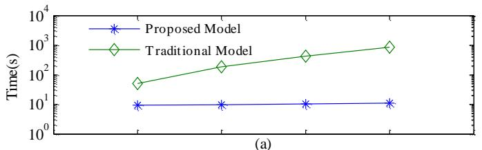

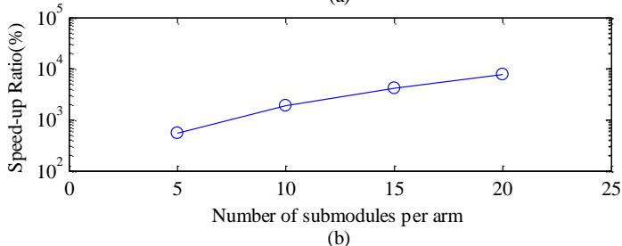  
Fig. 6. (a) Comparison of computation time as a function of the number of submodules. (b) Speed-up ratio.

TABLE III COMPARISONS OF NUMBER OF NODES OF THE TEST SYSTEM USING THE PROPOSED MODEL AND THE TRADITIONAL MODEL   

<table><tr><td rowspan="2">Number of Submodules per Arm</td><td colspan="2">Number of Nodes</td></tr><tr><td>Traditional Model</td><td>Proposed Model</td></tr><tr><td>5</td><td>113</td><td>23</td></tr><tr><td>10</td><td>203</td><td>23</td></tr><tr><td>15</td><td>293</td><td>23</td></tr><tr><td>20</td><td>383</td><td>23</td></tr></table>

The comparisons of various study results generated by the proposed model and the traditional model are discussed below.

1) Normal Operation: Comparisons of the simulation results under normal operation of the converter are shown in Fig. 7. The total output current of the submodules in the upper and lower arms of phase-a are shown Fig. 7(a) and (b) respectively. Fig. 7(c) shows the calculated differential current and Fig. 7(d) shows the waveforms of upper and lower arm voltages of phase-a. The individual submodule inductor currents in upper arm of phase-a are shown in Fig. 7(e). The results demonstrate good agreement between the proposed model and the traditional model.

To study the behavior of individual components of the submodule during normal start of the converter, the proposed hybrid model shown in Fig. 4(b) is used. During the start-up, normal switching signals are applied to the converter. Comparisons of the study results are shown in Fig. 8. The current through the upper switch of the submodule is shown Fig. 8(a). Fig. 8(b) shows the current through the submodule inductor. It can be seen that the results of the proposed hybrid model and the traditional model are closely matching. This study confirms that the proposed hybrid model is capable of describing the behavior of individual submodule components and hence it is very useful for submodule level studies.

2) Verification of Current Balancing Algorithm: To demonstrate the accuracy of the proposed model in response to the activation/deactivation of the current balancing controller,

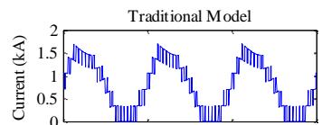

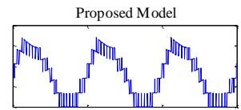

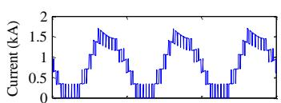

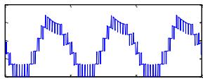  
(a)

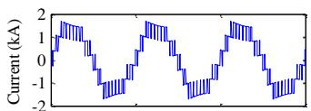

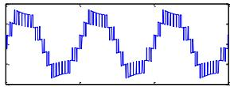

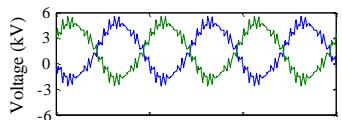

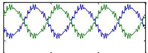

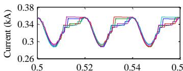

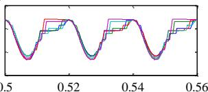  
  
  
Fig. 7. Comparison of phase-a results. (a) Total current of upper arm submodules. (b) Total current of lower arm submodules. (c) Differential current. (d) Upper (blue) and lower (green) arm voltages. (e) Upper arm submodule inductor currents.

balancing control is deactivated at t=1 s, and again activated at t=1.1 s. Very good matching between the results of the two models can be seen in Fig. 9. The slight difference between the results of traditional model and proposed model is due the additional snubber circuit used to control the numerical oscillations [30].

3) Fail-Safe Functionality Test: As mentioned earlier, one of the important benefits of the proposed model is that it is capable of testing the fail-safe functionality of the converter with redundant submodules. When one of the submodules is faulted, it may cause the complete system failure. In case of CSMMC, redundant submodules can be used so that the failsafe operation can be easily achieved and reliability of the system is improved. The redundant submodules are not used in producing higher number of output current level during normal operation of the converter. They act as backup and when the malfunction in any submodule is detected; faulty submodule is replaced with the redundant submodule. In this study, the fail-safe operation in upper arm of phase-a is tested using the hydride model. Here, converter arm consist of six submodules where one submodule is used as a redundant submodule. In the event of submodule failure at t=1.6 s, the corresponding faulty submodule is bypassed and a redundant submodule is inserted as explained in [9]. Comparisons of the results with the traditional model are shown in Fig. 10. It can be see that after activating redundant submodule, its inductor current rises to the normal value. The current of the bypassed submodule is not shown after t=1.6 s. The study results confirm the suitability of the proposed hybrid models for submodule level studies.

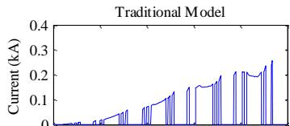

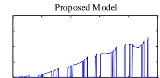

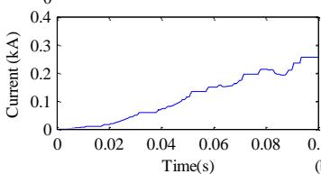

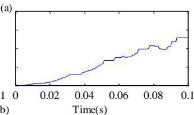

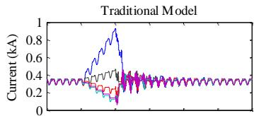  
Fig. 8. Comparison of results during normal start of converter. (a) Current of upper switch (S1) of submodule (fc=150 Hz). (b) Submodule inductor current.

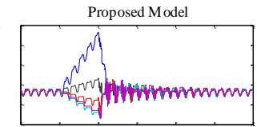

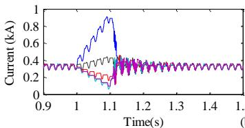

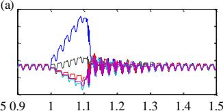

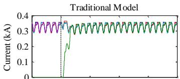  
Fig. 9. (a) and (b) Upper and lower arm submodule inductor currents of phasea showing the effect of activating/deactivating current balancing control. Balancing control is deactivated at t=1 s, and again activated at t=1.1 s.

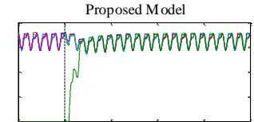

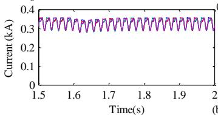

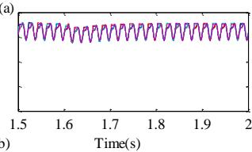  
Fig. 10. (a) and (b) Upper and lower arm SM inductor currents of phase-a when bypassing a faulty SM and inserting a redundant SM at t=1.6 s.

# B. Simulation of CSMMC Based Back-to-Back System

The dynamic performance of the CSMMC based back-toback system is studied in this section. Parameters of the test system are given in Table IV. To assess the accuracy of proposed model, comparisons of the results of various studies using the proposed model and traditional model are presented.

TABLE IV PARAMETERS FOR THE BACK-TO-BACK TEST SYTEM   

<table><tr><td>Grid Voltage/Frequency</td><td>Vs=230 kV (line-line RMS), f0=50 Hz</td></tr><tr><td>Coupling Transformer</td><td>230/11 kV, 100 MVA, L=0.16 pu</td></tr><tr><td>Converter Parameters</td><td>N=10, S=100 MVA, LSM=181 mH, Carm=15 μF, fc=0.25 kHz</td></tr><tr><td>DC-link reactor</td><td>Ldc=25 mH</td></tr><tr><td>Filter Capacitance</td><td>Cf=75 μF</td></tr></table>

1) Step Change in Reactive Power: Initially, the system is in a steady state and 0.8 pu active power flows from system-1 to system-2. Converter-1 is supplying 0.6 pu reactive power. Reactive power demand of ac system-1 is step changed from 0.6 pu to 0.2 pu at t=5 s. Fig. 11(a) shows the dynamic performance of the system to the step change in the reactive power reference. Fig. 11(b) and (c) show the changes in d- and q-axis currents and voltages of ac system-1 in response to changes in reactive power demand.   
Similarly, the reactive power demand of ac system-2 is step changed from 0.2 pu to 0.6 pu at t=7 s as shown in Fig. 12(a). The corresponding d- and q-axis currents and voltages are shown in Fig. 12(b) and (c), respectively. The results of the proposed model are almost same as of the traditional model.   
2) Active Power Flow Reversal: Initially, the system is in a steady state and active power of 0.7 pu flows from station-1 to station-2. Active power reversal command is applied at t=12 s. Fig. 13(a) shows the change in active power transfer in response to the power reversal. Fig. 13(b) and (c) show the changes in d- and q-axis currents at system-1 and system-2 respectively. It can be observed from the results that q-axis current component of both ac systems and consequently the active power exchange is reversed. Fig. 13(d) shows the dclink current and voltage responses. It can be seen that the dclink current is well regulated and the dc-link voltage polarity is revered. The proposed model appears to be a good representation of the traditional model during power reversal.   
3) Performance during Voltage Sag: In this test, three phase to ground fault is created at t = 9.0 s at the ac system-1 with impedance of 75Ω and X/R = 1. The ac bus voltage drops from 1 pu to 0.8 pu. The fault is cleared after 0.5 s. Fig. 14(a) shows the active and reactive power exchange at ac system-1. It can be seen that the active and reactive power exchange by the converter with the grid remains the same during the voltage sag. If it is desired to maintain the grid voltage, then the converter should be operated in ac voltage control mode. Fig. 14(b) and (c) show d- and q-axis currents and voltages of system-1. Comparisons of the results show that the proposed model is a good representation of the traditional model.   
4) DC Side Short Circuit: In this case, a permanent dc side pole-to-pole fault is applied in the middle of the dc line at t = 16 s. The transient responses produced by the proposed model and the traditional model are shown in Fig. 15. It can be seen that the dc side short circuit causes the voltage drop on both converter sides, which results in active power drop at both the ac systems. During the dead short circuit, as soon as the fault is detected (200µs after the fault) [22], both converters are operated as dc current setting terminals. Hence, both converters will act as STATCOM and continue to supply the commanded reactive power at respective ac systems as shown in Fig. 15(b). Results obtained by the proposed model remain in very close agreement with respect to the reference results obtained by the traditional model.

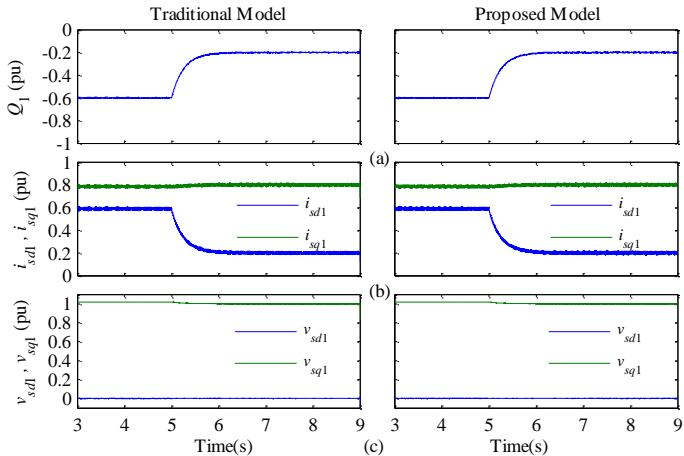  
Fig. 11. Comparison of results during step-change in reactive power at ac system-1 at t = 5 s. (a) Reactive power. (b) d- and q-axis gird currents. (c) dand q-axis gird voltages.

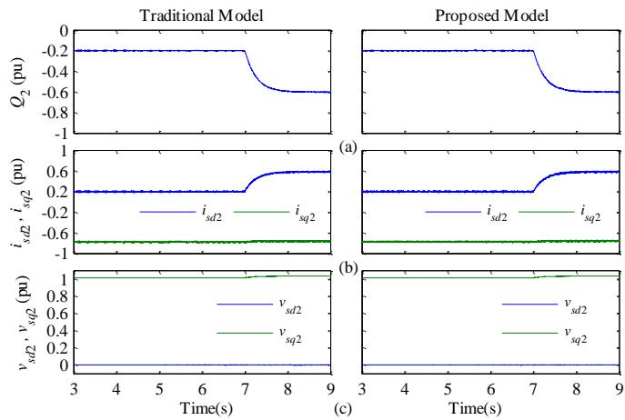  
Fig. 12. Comparison of results during step-change in reactive power at ac system-2 at t = 7 s. (a) Reactive power. (b) d- and q-axis gird currents. (c) dand q-axis gird voltages.

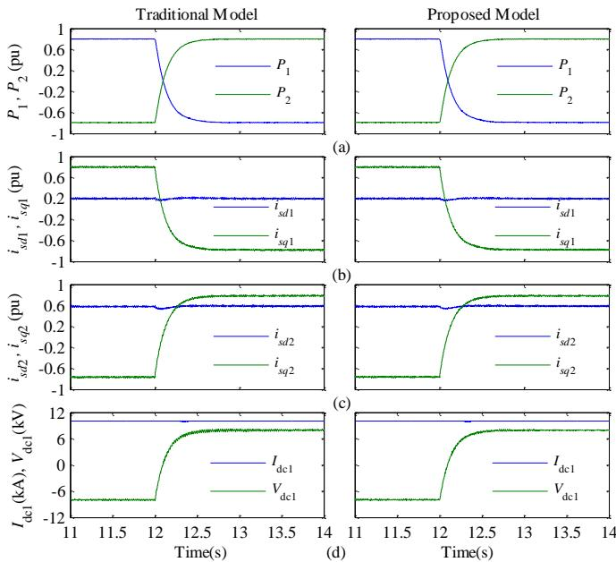  
Fig. 13. Comparison of results during active power reversal at t = 12 s. (a) Active power of system-1 and system-2. (b) d- and q-axis gird currents of system-1. (c) d- and q-axis gird currents of system-2. (d) dc-link voltage and current at converter-1.

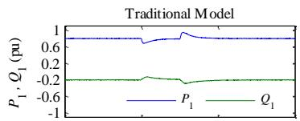

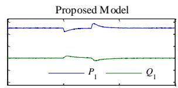

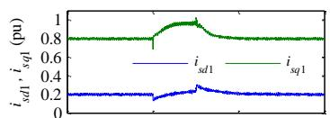

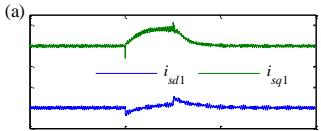

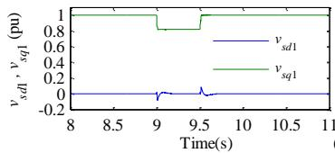

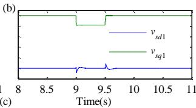

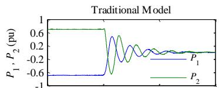  
Fig. 14. Comparison of results during voltage sag at system-1 at $\mathbf { t } = 9 \ \mathbf { s } .$ (a) Active and reactive power. (b) d- and q-axis gird currents (c) d- and q-axis gird voltages.

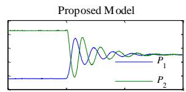

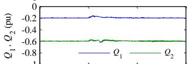

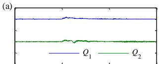

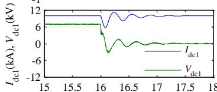

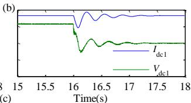  
Fig. 15. Comparison of results during dc side pole-to-pole fault at t = 16 s. (a) Active power of system-1 and system-2. (b) Reactive power of system-1 and system-2. (c) dc link voltage and current at converter-1.

# V. DISCUSSION

The computational performance and the accuracy of the proposed equivalent model of CSMMC are compared against the full-size traditional model in PSCAD/EMTDC. The study results clearly demonstrate that the acceleration of the simulation becomes very important when the number of submodules in CSMMC is very high. Moreover, in the proposed model of CSMMC, each converter arm of N-parallel connected submodules is reduced to a single two-node element and hence, the number of nodes is the same, regardless of the number of submodules. On the other hand, the number of nodes in the traditional model increases with increase in the number of submodules. Hence, the proposed model is very useful when simulating CSMMC with large number of submodules in EMT-type simulation tools with limited number of permitted nodes. It is also demonstrated that the proposed hybrid model is capable of describing the behavior of individual submodule components and hence it is useful for submodule level studies.

The DC-side fault studies are very essential for the back-toback converter systems. It is verified in this study that the

proposed model of CSMMC is capable of representing the accurate behavior during the dc-side faults without using any additional switching components in the arm level model.

The limitation of the proposed model is that it cannot be conveniently used for the frequency-domain analysis because this model involves discontinuities due to switching. In such studies, the average models which are continuous and timeinvariant in steady state are useful [24]. Moreover, in the average models, since the switching events are not included, larger time steps may be used and hence they are computationally more efficient than the switching models. However, for the converter level or submodule level studies, average models are not appropriate and hence the proposed model is suggested for such studies.

The alternative means such as parallel computation can also increase the simulation speed. However, the cost and complexity [17] increases with increase in the size of the system. On the other hand, the proposed method is very convenient for simulating CSMMC based system with any number of submodules in EMT-type simulation programs on personal computers.

# VI. CONCLUSION

A computationally efficient and accurate model of CSMMC is proposed in this paper. In the proposed approach, a reduction in the circuit is performed based on Norton equivalent to reduce the number of electrical nodes. It is shown that using this approach, significant reduction in the computing burden is achieved compared to the full-size traditional model. The accuracy of the proposed model is verified against the traditional model by the simulation studies of a CSMMC based back-to-back system in PSCAD/EMTDC software. The study results of various dynamic studies such as step change in reactive power, ac and dc faults and active power reversal are presented and it is shown that a very close matching between the results of two models is achieved. The dynamic performance showed at each condition confirms that the control method presented for the CSMMC based back-toback converter system gives the desired dynamic performance. The proposed model is also verified for the abnormal behaviors of the converter, such as failure of the balancing control and the fail-safe functionality with redundant submodules. The results show that the proposed model is capable of accurately representing these operations in a manner identical to the traditional model.

# REFERENCES

[1] A. Lesnicar and R. Marquardt, “An innovative modular multilevel converter topology suitable for a wide power range,” in Proc. IEEE Power Tech Conf., Bologna, vol. 3, June 2003.   
[2] M. Saeedifard and R. Iravani, “Dynamic performance of a modular multilevel back-to-back HVDC system,” IEEE Trans. Power Del., vol. 25, no. 4, pp. 2903–2912, Oct. 2010.   
[3] R. Picas, J. Zaragoza, J. Pou, S. Ceballos, and J. Balcells, “New measuring technique for reducing the number of voltage sensors in modular multilevel converters,” IEEE Trans. Power Electron., vol. 31, no. 1, pp. 177–187, Jan. 2016.

[4] G. T. Son et al., “Design and control of a modular multilevel HVDC converter with redundant power modules for noninterruptible energy transfer,” IEEE Trans. Power Del., vol. 27, no. 3, pp. 1611–1619, July 2012.   
[5] K. Ilves, L. Harnefors, S. Norrga and H. P. Nee, “Analysis and operation of modular multilevel converters with phase-shifted carrier PWM,” IEEE Trans. Power Electron., vol. 30, no. 1, pp. 268–283, Jan. 2015.   
[6] J. I. Y. Ota, T. Sato, and H. Akagi, “Enhancement of performance, availability, and flexibility of a battery energy storage system based on a modular multilevel cascaded converter (MMCC-SSBC),” IEEE Trans. Power Electron., vol. 31, no. 4, pp. 2791–2799, Apr. 2016.   
[7] J. Liang, A. Nami, F. Dijkhuizen, P. Tenca, and J. Sastry, “Current source modular multilevel converter for HVDC and FACTS,” in Proc. IEEE EPE, Lille, France, Sep. 2013.   
[8] M. A. Perez, R. Lizana, C. Azocar, J. Rodriguez, B. Wu, “Modular multilevel cascaded converter based on current source H-Bridges cells,” in Proc. IEEE IECON, Montreal, pp. 3443–3448, Oct. 2012.   
[9] M. M. Bhesaniya and A. Shukla, “Current source modular multilevel converter: detailed analysis and STATCOM application,” IEEE Trans. Power Del., vol. 31, no. 1, pp. 323–333, Feb. 2016.   
[10] P. K. Steimer, O. Senturk, S. Aubert, and S. Linder, “Converter-fed synchronous machine for pumped hydro storage plants,” in Proc. IEEE ECCE, Pittsburgh, PA, pp. 4561-4567, Sept. 2014.   
[11] H. Schlunegger and A. Thöni, “100 MW full-size converter in the Grimsel 2 pumped-storage plant,” in Proc. HYDRO Conference, Innsbruck, 2013.   
[12] V. Yaramasu, B. Wu, P. C. Sen, S. Kouro, and M. Narimani, “Highpower wind energy conversion systems: State-of-the-art and emerging technologies,” in Proc. IEEE, vol. 103, no. 5, pp. 740-788, May 2015.   
[13] J. Sastry, T. U. Jonsson, J. Liang, A. Nami, and F. Dijkhuizen, “Method and apparatus for transferring power between AC and DC power systems,” U.S. Patent, US9209679B2, Dec. 2015.   
[14] H. W. Dommel, “Digital computer solution of electromagnetic transients in single-and multiphase networks,” IEEE Tran. Power Apparatus and Systems, vol.PAS-88, no.4, pp.388-399, Apr. 1969.   
[15] “PSCAD/EMTDC User Guide,” Manitoba HVDC Research Centre Inc., Winnipeg, MB, Canada, Feb. 2010.   
[16] U. N. Gnanarathna, A. M. Gole, and R. P. Jayasinghe, “Efficient modeling of modular multilevel HVDC converters (MMC) on electromagnetic transient simulation programs,” IEEE Trans. Power Del., vol. 26, no. 1, pp. 316–324, Jan. 2011.   
[17] J. Xu, C. Zhao, W. Liu, and C. Guo, “Accelerated model of modular multilevel converters in PSCAD/EMTDC,” IEEE Trans. Power Del., vol. 28, no. 1, pp. 129–136, Jan. 2013.   
[18] F. B. Ajaei, and R. Iravani, “Enhanced equivalent model of the modular multilevel converter,” IEEE Trans. Power Del., vol. 30, no. 2, pp. 666- 673, Mar. 2015.   
[19] F. Yu, W. Lin, X. Wang, and D. Xie, “Fast voltage-balancing control and fast numerical simulation model for the modular multilevel converter,” IEEE Trans. Power Del., vol. 30, pp. 220–228, Feb. 2015.   
[20] J. Peralta, H. Saad, S. Dennetiere, J. Mahseredjian, and S. Nguefeu, “Detailed and averaged models for a 401-level MMC-HVDC system,” IEEE Trans. Power Del., vol. 27, no. 3, pp. 1501–1508, Jul. 2012.   
[21] J. Xu, A. M. Gole, and C. Zhao, “The use of averaged-value model of modular multilevel converter in dc grid,” IEEE Trans. Power Del., vol. 30, no. 3, pp. 519–528, Apr. 2015.   
[22] N. Ahmed, L. Ängquist, S. Norrga, A. Antonopoulos, L. Harnefors, and H.-P. Nee, “A computationally efficient continuous model for the modular multilevel converter,” IEEE Journal of Emerging and Selected Topics in Power Electron., vol. 2, no. 4, pp. 1139–1148, Dec. 2014.   
[23] A. Jamshidifar and D. Jovcic, “Small-signal dynamic DQ model of modular multilevel converter for system studies,” IEEE Trans. Power Del., vol. 31, no. 1, pp. 191-199, Feb. 2016.   
[24] S. Chiniforoosh et al., “Definitions and applications of dynamic average models for analysis of power systems,” IEEE Trans. Power Del., vol. 25, no. 4, pp. 2655–2669, Oct. 2010.   
[25] CIGRÉ WG B4.57 “Guide for the development of models for HVDC converters in a HVDC grid,” Ref. no. 604, Dec. 2014.   
[26] H. Saad et al., “Dynamic averaged and simplified models for MMCbased HVDC transmission systems.,” IEEE Trans. Power Del., vol. 28, no. 3, pp. 1723–1730, Jul. 2013.   
[27] H. Saad et al, “Modular multilevel converter models for electromagnetic transients,” IEEE Trans. Power Del., vol. 29, no. 3, pp. 1481–1489, Jun. 2014.   
[28] A. Beddard, M. Barnes, and R. Preece, “Comparison of detailed modeling techniques for MMC employed on VSC-HVDC schemes,” IEEE Trans. Power Del., vol. 30, pp. 579-589, Mar. 2015.

[29] M. M. Bhesaniya, A. Shukla, and G. D. Demetriades, “A control method for inductor current balancing in current source modular multilevel converter,” in Proc. IEEE IECON, Yokohama, Japan, Nov. 2015.   
[30] A. M. Gole et al., “Guidelines for modeling power electronics in electric power engineering applications,” IEEE Trans. Power Del., vol. 12, no. 1, Jan. 1997.

Mukeshkumar M. Bhesaniya (S’15) received the B.E. degree in electrical engineering from the Sardar Patel University, Gujarat, India, in 2000 and the M.Tech. degree in electrical engineering from the Indian Institute of Technology Kanpur, India, in 2009, and is currently pursuing the Ph.D. degree in electrical engineering at the Indian Institute of Technology Bombay, Mumbai, India.

He is with the Department of Electrical Engineering, G. H. Patel College of Engineering and Technology, Gujarat. His research interests include power-electronic

converters, HVDC, and flexible ac transmission systems.

Anshuman Shukla (S’04–M’08–SM’16) received the M.Tech. and Ph.D. degrees in electrical engineering from the Indian Institute of Technology Kanpur, Kanpur, India, in 2003 and 2008, respectively. From 2008 to 2011, he was a Scientist with ABB Corporate Research Center, Västerås, Sweden. In 2008, he was a Research Associate in the Department of Electrical Engineering, University of South Carolina, Columbia, SC, USA. In 2011, he joined the Indian Institute of Technology Bombay, Mumbai, India, where he is currently an

Associate Professor in the Department of Electrical Engineering. His research interests include modulation and control of power-electronic converters, hybrid and solid-state circuit breakers, and applications of power electronics in power systems and electric drives.

Dr. Shukla is a recipient of the Young Engineer Award (2011) conferred by the Institution of Engineers, India.