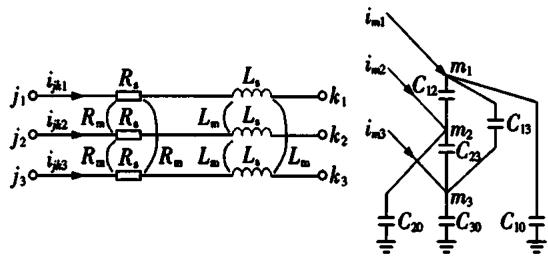

# 大电网仿真工具现状及其在华北电网推广应用的思考

皆 鹏,李轶群,谭贝斯,陈 曦,贾 琳,王茂海

（国家电网有限公司华北分部，北京100053）

摘要：常规的机电暂态仿真工具在分析交直流故障引起直流送/受端电压失稳、多电压源换流器与交流电网间相互作用产生的宽频振荡等问题方面略显不足，难以准确模拟直流系统的动作行为，影响实际电网运行控制措施的制定。调研用于大型交直流混联电网仿真工具的现状，并提出在华北电网推广应用的工作思路。首先，简要介绍了目前成熟、可行的大型交直流电网仿真技术；然后，重点分析了国内大型交直流电网仿真工具在模型开发、参数维护、用户体验不友好等方面的现状，突出描述了机电-电磁混合、数模混合、全电磁仿真工具在核心技术自主研发方面取得的成就以及在调度生产机构推广应用中的不足之处；最后，结合华北电网的生产需求，明确了各种仿真工具目前在华北电网的定位并提出了后续的工作思路。所做工作对其他调度生产机构也具有一定的借鉴作用，可提高对大型交直流混联电网的掌控能力，间接提高各仿真工具的实用化水平。

关键词：大型交直流混联电网；机电暂态仿真；电磁暂态仿真；机电-电磁混合仿真；数模混合仿真；推广应用

中图分类号：TM743

文献标志码：A

DOI:10.16081/j.epae.201909055

# 0 引言

截至2019年3月，华北电网形成了“两横一纵”特高压交流和“两外送两受入”特高压直流混联大电网格局，特高压交直流输电的规模进一步提升，交直流间的相互影响进一步增大。锡泰、雁淮特高压直流送端存在电压失稳、暂态过电压、配套机组暂态失稳等问题。鲁固、昭沂、银东直流密集馈入山东电网，存在电压崩溃、大范围交流电网故障引起连续同时换相失败等问题。未来的2~3a内，随着张北四端柔性直流电网工程以及张北、锡盟地区大量新能源的投产，存在多电压源换流器与交流电网间相互作用产生的宽频振荡风险，新一代电力系统的技术特征进一步突显[1]。目前，调度生产机构主要采用的机电暂态仿真工具在分析上述问题时略显不足，难以准确模拟直流系统的动作行为[2]，往往需借助机电-电磁混合仿真工具、数模混合仿真工具和全电磁暂态仿真工具[3]，相比于机电暂态仿真工具，这些仿真工具的技术门槛高、数据质量要求高，国内科研机构在电网仿真规模和电力电子设备仿真精度方面均取得了技术突破，但目前存在模型参数管理不规范、用户体验不友好等问题，在调度生产机构的推广应用中还需开展许多实用化提升工作。另外，调度生产机构的生产任务繁重，在现阶段如何定位这些仿真工具，在未来如何掌握相关技术并推广应用这些仿真工具是值得探讨的问题。

本文重点分析了机电-电磁混合仿真、数模混合仿真、全电磁仿真工具目前在调度生产机构推广应用中的不足之处，并结合华北电网的生产需求及当

前条件，明确了以机电为主、机电-电磁/电磁为辅、数模为校核标杆的仿真工具定位，提出了在华北电网推广应用的工作思路，涉及模型开发、参数管理、项目合作、实验室共建等各方面。本文的研究工作对其他调度生产机构也具有一定的借鉴作用，具有重要的实际意义。

# 1 大电网仿真技术简介

从时间尺度来看，电力系统受扰动后的暂态过程可分为电磁暂态过程、机电暂态过程和中长期动态过程[4-7]。从仿真手段来看，电力系统模拟方法可以分为物理动态模拟、全数字仿真、数模混合仿真[8]。结合电网调度部门的实际生产需求，目前成熟、可行的可用于大电网仿真的技术主要有电磁暂态仿真技术、机电暂态仿真技术、机电-电磁混合仿真技术和数模混合仿真技术[8-11]。

# (1)电磁暂态仿真技术。

电磁暂态仿真主要考虑电力系统各个元件中电场、磁场以及相应的电压和电流的变化过程，模型采用三相瞬时值模型，仿真步长可达微秒或纳秒级，对参数要求高，仿真准确度高，但速度慢。电磁暂态仿真可详细考虑元件的非线性、频率相关特性等[1-2]。

电磁暂态仿真工具有PSCAD/EMTDC、PSMO-DEL[12]、ADPSS[13]、EMTPE[14]、HYPERSIM、RTDS、MATLAB/SimPowerSystem等，应用范围包括暂态过电压/过电流研究、谐振研究、大功率电力电子设备的快速暂态过程研究和事故反演。

# (2)机电暂态仿真技术。

机电暂态仿真主要研究同步发电机机械、电磁转矩之间不平衡引起的转子运动变化过程，模型采

用相量模型，仿真步长一般为半个周期或一个周期，仿真速度快。由于忽略了元件的电磁暂态过程，其对涉及多高压直流输电、柔性交流输电系统(FACTS)等大功率电力电子设备的大电网的仿真计算准确度不高。

机电暂态仿真工具有PSD、PSASP、FASTEST、PSS/E、DIgSILENT等，应用范围包括电力系统功角、电压和频率稳定等机电暂态过程的稳定性研究。

# (3)机电-电磁混合仿真技术。

机电-电磁混合仿真将电磁暂态仿真和机电暂态仿真相结合，在仿真过程中实现对大规模交流电网的机电暂态仿真和针对高压直流输电、FACTS等局部网络的电磁暂态仿真，既体现了电磁暂态仿真的准确性，又兼顾了机电暂态仿真的快速性[9-10]。由于电磁暂态的计算量远大于机电暂态，电磁暂态仿真需采用服务器实现多任务的并行计算。

机电-电磁混合仿真工具有PSMODEL、ADPSS、 $\mathrm{PSS / E + PSCAD / EMTDC}$ 等，应用范围为涉及高压直流输电、FACTS等大功率电力电子设备与交流系统强耦合的电力系统稳定性的补充计算。

# (4)数模混合仿真技术。

数模混合仿真是将数字仿真和物理设备相结合的一种仿真方法，兼顾了数字仿真灵活和规模大以及物理设备准确的优点[8,11]，对硬件设备要求较高，甚至需要专门定制，价格昂贵。

数模混合仿真工具有ADPSS、HYPERSIM、RTDS、DDRTS、RTLAB等，应用范围包括涉及高压直流输电、FACTS等大功率电力电子设备的大电网稳定性专题研究以及设备制造、事故反演及策略优化研究。

# 2 大电网稳定仿真工具现状

# 2.1 仿真程序自主研发水平

中国电力科学研究院在电磁、机电、机电-电磁、数模混合仿真方面均有自主开发的工具，南瑞集团有限公司在机电暂态方面有自主开发的工具。仿真程序自主研发情况见表1。

表 1 国内大电网稳定仿真工具自主研发情况  
Table 1 Independent research and development of stability simulation tools for large power grid in China   

<table><tr><td>单位</td><td>仿真分类</td><td>自主研发仿真工具</td></tr><tr><td rowspan="3">中国电力科学研究院</td><td>电磁暂态仿真,机电-电磁混合仿真</td><td>PSMODEL,ADPSS</td></tr><tr><td>机电暂态仿真</td><td>PSD,PSASP</td></tr><tr><td>数模混合仿真</td><td>ADPSS</td></tr><tr><td>南瑞集团有限公司</td><td>机电暂态仿真</td><td>FASTEST</td></tr></table>

国内自主研发的电磁暂态、机电-电磁混合、数模混合仿真工具在提高仿真速度方面，研发了多机多核分网并行技术、现场可编程门阵列(FPGA)+

$\mathrm{CPU}^{[15-16]}$ 异构电磁暂态多时间尺度的并行混合仿真技术、大型线性方程组分块求解方法以及高速输入/输出(I/O)互联技术等；在提高电力电子器件的仿真精度方面，研发了基于实际工程的直流输电控制系统电磁模型、基于FPGA的小步长仿真技术等，使其具备了万节点以上规模的电网仿真能力、含大量电力电子设备的精细化仿真能力、外接多个物理装置的实时仿真能力，已成为交直流大电网稳定仿真计算疑难问题研究、电网事故反演、直流调试方案论证等一系列关键任务的必备工具。

目前，各电力调度机构大电网稳定仿真分析以中国电力科学研究院自主研发的机电暂态仿真程序为主要工具，机电-电磁混合仿真、数模混合仿真程序为辅助工具，形成了对电网规划设计、电网运行从年度到日前、多种分析工具协同配合的仿真分析模式。总体来看，现有仿真工具基本能够满足当前电网规划发展和运行分析的需要。各仿真工具具体的应用情况如下：

(1)机电暂态仿真工具主要用于大电网稳定计算分析，华北（除山东外）、华东电网采用PSD程序，国家电力调度控制中心、东北、华中、西北、西南、山东电网采用PSASP程序，南方电网采用PSD程序；  
(2)电磁暂态仿真工具虽已正式发布，但仍处于边开发完善边升级推新的阶段，PSMODEL、ADPSS、HYPERSIM的感应电动机、直流控制保护模型还需要进一步的丰富和完善；  
(3)机电-电磁混合仿真工具主要用于大电网稳定计算与直流相关的某个特定的专题分析，已在我国研究机构得到大量的应用；  
(4)数模混合仿真工具主要用于大电网稳定计算与直流相关的某个特定的专题分析以及作为电磁暂态、机电-电磁混合仿真工具的对比标杆。

# 2.2 模型开发及参数维护水平

# 2.2.1 机电暂态仿真数据维护管理

国家电网的机电暂态仿真数据在国家电网仿真中心的电网仿真计算数据管理平台中维护。发电机励磁、电力系统稳定器(PSS)、调速器等的动态参数由中国电力科学研究院根据机组的实测报告统一入库维护。直流参数由中国电力科学研究院依据国网经研院或设备厂家提供的成套设计书、电磁暂态模型、出厂试验曲线进行参数拟合，然后统一入库维护。其他电网数据均由国家电力调度控制中心牵头，各分部及省电力公司配合统一在年度方式计算前入库维护。

机电暂态仿真数据的维护流程规范、分工明确、权责分明。机电暂态仿真数据的正确率较高，但由于稳定计算以校核三相对称故障为主，发电机负序、变压器零序、线路零序数据中存在部分错误，需规范

负序、零序数据的管理。

# 2.2.2 电磁暂态仿真数据维护管理

由于模型及参数的复杂性，电磁暂态目前并无规范的模型及参数管理模式，开发人员各自独立开发，模型缺少统一规范，参数不通用，无法相互转化。

目前电磁暂态仿真数据中的直流模型及参数由各电磁暂态工具开发人员单独维护，直流模型以外的电磁暂态仿真数据利用各自开发的转换工具由机电暂态仿真数据转换而来。电磁暂态仿真数据具体存在以下问题。

(1)常规发电机的控制器模型不完备。常规发电机的电磁暂态模型为三相瞬时值模型，与机电暂态模型的结构不同，发电机励磁、调速等控制器的电磁暂态模型需全部重新开发。PSMODEL、ADPSS、HYPERSIM中的发电机励磁/调速等模型分别由中国电力科学研究院PSD、PSASP、HYPERSIM的开发人员开发，其中PSMODEL、ADPSS中的发电机励磁、调速等模型暂不能与机电暂态模型一一对应，数据转换过程中存在部分模型缺失，目前正在进行相应的开发工作；HYPERSIM中的发电机励磁、调速模型比较完备，能与机电暂态模型一一对应，可由机电暂态数据直接转换而来。  
(2)感应电动机用恒阻抗模型替换，仿真的准确度低。PSMODEL、ADPSS目前暂无适用于大电网仿真的感应电动机电磁暂态模型，负荷均采用恒阻抗模型，使得仿真准确度降低。  
(3)直流控制保护模型还不能真实反映实际物理装置的特性。直流控制保护模型及参数由厂家提供，但厂家提供的一般为封装模型，封装模型由多个用户自定义模型（UDM）构成，部分关键结构及参数无法获取。PSMODEL、ADPSS等电磁暂态工具的开发人员根据封装模型的仿真外特性，各自开发控制保护模型以及拟合参数，仿真特性各异，所以控制保护模型的准确度不高，纯电磁暂态仿真的结果与HYPERSIM数模混合仿真的结果还存在一定的差距，不能真实反映实际物理装置的特性。直流控制保护的电磁暂态模型还有待进一步的研究开发。  
(4)网络元件模型参数的准确度不高。PSMO-DEL、ADPSS、HYPERSIM等网络元件的电磁暂态模型参数均由机电暂态模型参数转换而来。目前，线路及变压器的机电暂态仿真数据中的零序参数存在不少错误，影响了电磁暂态仿真的准确度，需专业人员纠错修正。

以理想换位的交流线路模型为例分析机电暂态模型参数对电磁暂态模型参数的影响过程。交流线路的机电暂态模型为相量模型，如图1所示。交流线路的电磁暂态模型由耦合的三相RL支路和耦合的三相电容支路搭建而成，如图2所示。

$$
i \circ \frac {R _ {*} + j X _ {*}}{\frac {1}{\frac {1}{2}} j B / 2} \xrightarrow [ j B / 2 ]{j B / 2} o j
$$

  
图1 交流线路的机电暂态仿真模型  
Fig.1 Electromechanical transient simulation model of AC line   
图2 交流线路的电磁暂态仿真模型  
Fig.2 Electromagnetic transient simulation model of AC line

根据图2，交流线路电磁暂态模型的计算公式为：

$$
\left\{ \begin{array}{l} L \mathrm {d} i _ {j k} (t) / \mathrm {d} t + R i _ {j k} (t) = u _ {j} (t) - u _ {k} (t) \\ i _ {\mathrm {m}} (t) = C \mathrm {d} u _ {\mathrm {m}} (t) / \mathrm {d} t \end{array} \right. \tag {1}
$$

$$
i _ {j k} (t) = \left[ i _ {j k 1} (t), i _ {j k 2} (t), i _ {j k 3} (t) \right] ^ {\mathrm {T}}
$$

$$
\boldsymbol {u} _ {j} (t) = \left[ u _ {j 1} (t), u _ {j 2} (t), u _ {j 3} (t) \right] ^ {\mathrm {T}}
$$

$$
\boldsymbol {u} _ {k} (t) = \left[ u _ {k 1} (t), u _ {k 2} (t), u _ {k 3} (t) \right] ^ {\mathrm {T}}
$$

$$
i _ {\mathrm {m}} (t) = \left[ i _ {\mathrm {m} 1} (t), i _ {\mathrm {m} 2} (t), i _ {\mathrm {m} 3} (t) \right] ^ {\mathrm {T}}
$$

$$
\boldsymbol {u} _ {\mathrm {m}} (t) = \left[ u _ {\mathrm {m} 1} (t), u _ {\mathrm {m} 2} (t), u _ {\mathrm {m} 3} (t) \right] ^ {\mathrm {T}}
$$

$$
\boldsymbol {R} = \left[ \begin{array}{l l l} R _ {\mathrm {s}} & R _ {\mathrm {m}} & R _ {\mathrm {m}} \\ R _ {\mathrm {m}} & R _ {\mathrm {s}} & R _ {\mathrm {m}} \\ R _ {\mathrm {m}} & R _ {\mathrm {m}} & R _ {\mathrm {s}} \end{array} \right], \boldsymbol {L} = \left[ \begin{array}{l l l} L _ {\mathrm {s}} & L _ {\mathrm {m}} & L _ {\mathrm {m}} \\ L _ {\mathrm {m}} & L _ {\mathrm {s}} & L _ {\mathrm {m}} \\ L _ {\mathrm {m}} & L _ {\mathrm {m}} & L _ {\mathrm {s}} \end{array} \right]
$$

$$
\boldsymbol {C} = \left[ \begin{array}{l l l} C _ {\mathrm {s}} & - C _ {\mathrm {m}} & - C _ {\mathrm {m}} \\ - C _ {\mathrm {m}} & C _ {\mathrm {s}} & - C _ {\mathrm {m}} \\ - C _ {\mathrm {m}} & - C _ {\mathrm {m}} & C _ {\mathrm {s}} \end{array} \right]
$$

其中， $u_{j}(t),u_{k}(t)$ 和 $\pmb{i}_{jk}(t)$ 分别为交流线路电阻、电感串联耦合电路的节点电压和支路电流； $\pmb{u}_{\mathrm{m}}(t)$ 、 $i_{\mathrm{m}}(t)$ 分别为交流线路电容耦合电路的节点电压、节点注入电流； $R,L,C$ 为对称矩阵，对角元 $R_{s},L_{s},C_{s}$ 分别为自电阻、自电感、自电容，非对角元 $R_{\mathrm{m}},L_{\mathrm{m}},C_{\mathrm{m}}$ 分别为互电阻、互电感、互电容，各元素与交流线路机电暂态模型中的正序参数 $R_{1},L_{1},C_{1}$ 和零序参数 $R_{0}$ 、 $L_0,C_0$ 的关系式如式(2)所示。

$$
\left\{ \begin{array}{l} R _ {\mathrm {s}} (t) = \left(R _ {0} + 2 R _ {1}\right) / 3 \\ R _ {\mathrm {m}} (t) = \left(R _ {0} - R _ {1}\right) / 3 \\ L _ {\mathrm {s}} (t) = \left(L _ {0} + 2 L _ {1}\right) / 3 \\ L _ {\mathrm {m}} (t) = \left(L _ {0} - L _ {1}\right) / 3 \\ C _ {\mathrm {s}} (t) = \left(C _ {0} + 2 C _ {1}\right) / 3 \\ C _ {\mathrm {m}} (t) = \left(C _ {0} - C _ {1}\right) / 3 \end{array} \right. \tag {2}
$$

由式(2)可知，若交流线路机电暂态模型中的正序、零序参数存在错误，将直接影响交流线路电磁暂态模型的参数，从而影响电磁暂态仿真的准确度。

# 2.2.3 机电-电磁混合仿真数据存在的问题

机电-电磁混合仿真中元件的数据根据所采用的模型具有不同的来源。目前常用的方式是直流系统使用电磁暂态模型，交流系统使用机电暂态模型。因此，数据一般是在机电暂态数据的基础上，增加直流系统的电磁暂态模型。PSMODEL的机电暂态部分直接采用PSD的数据，与PSD的数据兼容。ADPSS的机电暂态部分直接采用PSASP的数据，与PSASP的数据兼容。电磁暂态部分各自维护，尚不能通用，存在的问题与电磁暂态仿真数据相同。国家电网数据中心正在研究这些电磁暂态模型的统一管理方法。

# 2.2.4 数模混合仿真接实际直流控制保护装置规模

为了接入实际的直流控制保护装置，数模混合仿真工具需达到实时的仿真速度，因此仿真工具接入实际直流控制保护装置越多，对硬件配置的要求越高。数模混合仿真工具接实际直流控制保护装置的规模主要取决于服务器核数和通信板卡数。目前，HYPERSIM配置了1台320个核的服务器和10块通信板卡，具备接10条直流实际控制保护装置的能力。ADPSS目前仅具备接3条直流实际控制保护装置的能力。数模混合仿真数据来源与电磁暂态仿真数据相同，存在的问题与电磁暂态仿真相同。

# 2.3 电磁暂态、机电-电磁混合仿真工具的用户体验

与广泛应用的机电暂态仿真工具相比，电磁暂态、机电-电磁混合仿真工具的用户体验不友好，主要体现在参数转换复杂、初始化（启动）过程繁琐、硬件配置要求高。

# (1)参数转换复杂。

PSMODEL、ADPSS、HYPERSIM交流部分的电磁暂态模型及参数分别通过相应的软件由PSD、PSASP的机电暂态仿真数据转换而来，但在数据转换过程中存在大量的错误数据，纠错修正需要花费专业人员大量的时间。以某大区孤网2018年夏季平峰数据为例，将其转换成PSMODEL、ADPSS、HYPERSIM电磁暂态仿真数据，需花费专业人员约1~2周的时间，转换数据时遇到的具体问题主要分为以下2类。

a. 机电暂态模型的参数错误, 具体包括: 交流线路和并联电容/电抗器阻抗没有零序参数; 同步发电机没有负序电抗; 交流线路对地电容没有正序参数; 变压器接线方式与零序参数不一致; 并联电容器的零序参数设置不合理, 正序电容为负, 而零序电容为正, 无法判断是电容还是电抗; 变压器的激磁电纳参数为正, 填写错误。  
b. 电磁暂态模型不完善, 具体包括: 变压器中压或低压侧的电阻参数为负, 无对应模型; 负有功功

率负荷无对应模型；具有耦合特性的并联或串联电容带电阻参数，无对应模型。

# (2)初始化（启动）过程繁琐。

PSD、PSASP等机电暂态仿真利用潮流结果为动态元件状态量提供初始值，自动完成初始化工作，无需人工参与初始化过程，与机电暂态初始化过程相比，机电-电磁混合仿真的电磁仿真部分的初始化过程较为复杂，主要体现在2个方面。一方面，电磁暂态计算中大量的阀和控制系统元件的状态无法直接设定。一个典型的特高压直流由正负极双12脉动组成，送端和受端各48个阀，这些阀的导通/截止受复杂的直流控制系统控制。直流控制系统非常复杂，由近1000个模块组成，包含大量的非线性、延时、死区等环节。阀的状态和控制系统中的变量都无法简单地由准稳态模型(潮流、机电暂态程序的直流模型)的计算结果来设定，只能通过时域仿真一段时间得到。另一方面，直流输电系统的非线性产生的谐波影响。一个直流系统的电磁暂态模型包含大量元件详细的非线性数学模型，换流阀的交替导通引起直流系统内部产生大量的谐波，同时也向交流系统注入一定的谐波，交直流滤波器虽然具有很好的滤波作用，但不能完全消除谐波，这些谐波会对直流电压和电流产生影响。直流准稳态模型完全不考虑谐波的作用，潮流计算结果与直流系统电磁暂态模型的初始运行点具有一定的偏差。因此，也需要通过时域仿真一段时间得到初始运行点。

# 不同仿真工具的初始化过程如下。

a. 机电-电磁仿真工具PSMODEL目前采用半自动的初始化过程，1条直流系统的初始化需要 $5\mathrm{min}$ 左右。以国家电网2018年夏季平峰数据为例，馈入某大区电网的10条直流系统采用电磁暂态模型，交流系统侧采用机电暂态模型。可通过专门的初始化工具，自动配置滤波器组、调整换流变的变比、修改控制器中的换相电抗，实现直流系统整流侧触发角、逆变侧关断角、直流电压与潮流结果一致，采用普通台式计算机在 $40\mathrm{min}$ 左右可完成馈入某大区电网的10条直流系统的初始化。若涉及方式、潮流、工况调整，上述过程需重新进行一遍。无需人工干预的全自动初始化方法正在研发之中。  
b. 机电-电磁仿真工具ADPSS的初始化过程需预先按照模版以用户自定义方式搭建电磁直流模型的初始化控制模块，从而直接采用潮流计算的结果对直流模型的稳态工况进行自动初始化，否则需人工填写大量参数。以国家电网2018年夏季平峰数据为例，馈入山东电网的鲁固、昭沂、银东直流系统采用电磁暂态模型，交流系统侧采用机电暂态模型。若采用自动初始化方式，可在分钟级以内完成初始化，目前自动初始化工具正在开发完善。若采用人

工方式, 则专业人员需根据潮流计算结果人工设置 3 条直流系统的初始化数据, 部分参数还需要人工计算, 包括箝位电源的电压幅值 / 相角、直流控制器的直流电流参考值、换流变的变比、交流滤波器 / 无功补偿组数等共 89 个参数, 同时需调整直流系统整流侧触发角、逆变侧关断角、直流电压与潮流结果完全一致, 总耗时近 $1 \mathrm{~h}$ 。若涉及方式、潮流、工况调整, 上述过程需重新进行一遍。ADPSS 纯电磁仿真的初始化过程如下: 直流部分的初始化过程与上述相同, 传统交流元件的初始化过程与机电暂态仿真初始化过程类似, 即基于潮流结果由程序自动完成初始化, 但电磁暂态模型的参数丰富, 若机电暂态仿真的数据质量差, 初始化失败, 需人工纠错, 总耗时约 1 周。

c. 数模混合仿真工具HYPERSIM的初始化过程需花费数小时。以某大区孤网2018年夏季平峰数据为例，馈入某大区的10条直流系统的控制保护系统采用实际物理装置，其他仿真数据为电磁暂态模型。常规发电机组暂时先不考虑励磁、调速等控制器，直流系统用负荷等值，整个电力系统自启动至稳态后，手动逐台将同步发电机的控制器投入，运行至稳态后，手动逐条将10条直流系统解锁升功率至指定值，期间退出等值负荷，配合直流升功率。整个初始化过程约 $2\mathrm{h}$ 。若涉及方式、潮流、工况调整，上述过程需重新进行一遍。HYPERSIM纯电磁仿真的初始化过程与上述过程相同。

目前国际上通用的电磁暂态仿真程序都在致力于初始化研究，但目前都没有得到很好的、实用化的研究成果。

# (3)硬件配置要求高。

电磁暂态仿真的计算量远大于机电暂态仿真，前者的计算量约为后者计算量的数百倍。以某大区孤网2018年夏季平峰数据为例，故障集中约有1000个故障，每个故障的仿真时长为 $10\mathrm{s}$ ，不同仿真工具的硬件配置及计算速度如下。

a. 机电暂态仿真工具PSD、PSASP需配置1台笔记本，仿真一个故障耗时约 $20\mathrm{s}$ ；4台含12个物理核心的服务器，扫描完毕整个故障集，耗时约 $0.5\mathrm{h}$ 。  
b. 机电-电磁混合仿真工具PSMODEL、ADPSS需配置1台笔记本，仿真一个故障耗时约 $360\mathrm{s}$ ；4台含12个物理核心的服务器，扫描完毕整个故障集耗时约 $5\sim 6\mathrm{h}$ 。  
c. 数模混合仿真工具HYPERSIM需配置定制化的SGI服务器，1台含300个物理核心的服务器（1个屏柜），10条直流控制保护装置约100个屏柜，因数模混合仿真为实时仿真，仿真花费时间与仿真时长相同。

# 3 推广应用的思考

通过上述分析可知，机电-电磁混合仿真、数模混合仿真和全电磁仿真工具的技术门槛高、数据质量要求高，核心仿真算法取得了技术突破，但存在模型参数管理不规范、用户体验不友好等实用化不足的问题，在调度生产机构的推广应用还需开展许多基础性的工作。目前，华北电力调控分中心的生产任务繁重，在现阶段如何定位这些仿真工具，在未来如何掌握相关技术并推广应用这些仿真工具是值得探讨的问题。因此，结合华北电网的生产需求及当前条件，并借鉴国家电力调度控制中心的先进经验，本文提出了仿真工具推广应用的工作思路，具体如下。

(1)建立华北电网的电磁暂态模型及参数库，形成规范化管理流程。目前，华北电网的机电暂态模型及参数管理流程规范，国网数据统一由国家电网仿真中心管理，而电磁暂态模型及参数尚未进行统一管理。华北电网可与中国电力科学研究院PSMO-DEL、ADPSS、HYPERSIM以及南瑞集团有限公司PSCAD/EMTDC、RTDS的软件开发/使用团队开展合作，形成一套通用的华北电网电磁暂态模型及参数库，并形成规范化的管理流程，不同的仿真程序进行相互校核验证。具体内容包括：  
a. 结合张北柔性直流电网工程，与中国电力科学研究院PSMODEL、ADPSS的团队合作开发固化张北柔性直流电网工程的电磁模型及参数库；  
b. 推进华北电网交流系统电磁暂态模型的建立和规范化管理，推进开发常规交流元件的电磁暂态模型（感应电动机、励磁/调速等控制器），实现华北电网常规交流元件电磁暂态仿真数据由机电暂态仿真数据的转化，减少人工参与，提高自动化程度；  
c. 配合国家电力调度控制中心与中国电力科学研究院、南瑞集团有限公司建立提高常规直流电磁暂态模型及参数的闭环机制；  
d. 根据华北电网发生的大扰动案例，与机电-电磁混合仿真、数模混合仿真工具开发单位共同开展事故反演，将电磁或机电-电磁仿真的结果与实测录波曲线进行对比以及相互验证，逐步提高华北电网电磁暂态仿真数据的准确度。  
(2)提高机电暂态仿真数据的准确度。目前，机电暂态仿真数据中线路、变压器、发电机的负序/零序参数准确度不高，转换成电磁暂态仿真数据存在较多错误。与中国电力科学研究院PSMODEL、ADPSS团队以及数据中心团队开展合作，协同各省（市、自治区）调度部门进一步提高华北电网机电暂态仿真数据的准确度。  
(3)推动中国电力科学研究院机电-电磁混合仿

真程序的实用化工作。华北电网可与中国电力科学研究院PSMODEL、ADPSS团队展开合作，开发根据潮流结果初始直流模型的自动化工具，缩短初始化时间，实现机电-电磁混合仿真工具的多方式应用。

(4)与中国电力科学研究院开展数模混合仿真试验室共建工作。结合张北柔性直流电网工程，与中国电力科学研究院共建数模混合仿真试验室，采购柔性直流极控物理装置，在ADPSS、HYPERSIM仿真平台中建立华北电网的数模混合仿真数据，初步实现华北电网的数模混合仿真。

(5)现阶段以机电为主、机电-电磁/电磁为辅、数模为校核标杆。机电暂态工具PSD用于华北电网稳定性分析计算，由专业人员独立开展。机电-电磁暂态工具PSMODEL、PSS/E+PSCAD/EMTDC用于华北电网涉及直流的特定专题分析，由中国电力科学研究院PSMODEL团队、南瑞集团有限公司PSS/E+PSCAD/EMTDC团队提供技术支撑，近期采用“需求联系单”的形式开展工作，远期随着机电-电磁混合仿真工具逐步实用化，具备独立使用混合仿真程序的能力。电磁暂态工具PSMODEL、ADPSS、HY-PERSIM、PSCAD/EMTDC模型及辅助工具还在开发、调试阶段，现阶段可与中国电力科学研究院PSMODEL、ADPSS、HY-PERSIM以及南瑞集团有限公司PSCAD/EMTDC团队合作开展华北电网的电磁暂态仿真。数模混合仿真ADPSS、HY-PERSIM、RTDS作为电磁、机电-电磁混合仿真结论的校核工具，可用于特性复杂的张北柔性直流电网工程特性结论的校核，由中国电力科学研究院ADPSS、HY-PERSIM以及南瑞集团有限公司RTDS团队支撑，采用“需求联系单”的形式开展工作。

# 4 结论

本文深入调研了各仿真工具在模型开发、参数维护、数据转换、初始化（启动）、硬件支撑及应用情况等方面的现状，详尽地分析了机电-电磁混合、数模混合、全电磁仿真工具目前在调度生产机构推广应用中存在的不足之处：①仿真数据各自维护、正确率不高；②参数转换复杂；③初始化（启动）过程繁琐；④硬件配置要求高。

随着含高比例电力电子设备的大型交直流混联电网的发展，华北电网迫切需要机电-电磁混合、数模混合及全电磁仿真结果互相校验，满足制定华北电网运行方式及控制策略的需求。在此背景下，参考国家电力调度控制中心的先进经验，本文明确了各种仿真工具目前在华北电网的定位，即以机电为主、机电-电磁/电磁为辅、数模为校核标杆，并提出了在华北电网推广应用的工作思路：

(1)建立华北电网的电磁暂态模型及参数库，形

成规范化管理流程；

(2) 提高机电暂态仿真数据的准确度；  
(3)推动中国电力科学研究院机电-电磁混合仿真程序的实用化工作，特别是直流系统的自动初始化功能；  
(4)与中国电力科学研究院开展数模混合仿真试验室共建工作。

本文工作对其他调度生产机构也具有一定的借鉴作用，通过新型仿真工具的推广应用可提高调度机构对大型交直流混联电网的掌控能力，间接提高各仿真工具的实用化水平。

# 参考文献：

[1] 周孝信，陈树勇，鲁宗相，等. 能源转型中我国新一代电力系统的技术特征[J]. 中国电机工程学报，2018,38(7):1893-1904,2205. ZHOU Xiaoxin, CHEN Shuyong, LU Zongxiang, et al. Technology features of the new generation power system in China [J]. Proceedings of the CSEE, 2018, 38(7):1893-1904, 2205.   
[2] 李亚楼, 穆清, 安宁, 等. 直流电网模型和仿真的发展与挑战 [J]. 电力系统自动化, 2014, 38(4): 127-135. LI Yalou, MU Qing, AN Ning, et al. Development and challenge of modeling and simulation of DC grid [J]. Automation of Electric Power Systems, 2014, 38(4): 127-135.   
[3] 李亚楼, 张星, 李勇杰, 等. 交直流混联大电网仿真技术现状及面临挑战[J]. 电力建设, 2015, 36(12): 1-8. LI Yalou, ZHANG Xing, LI Yongjie, et al. Present situation and challenges of AC/DC hybrid large-scale power grid simulation technology[J]. Electric Power Construction, 2015, 36(12): 1-8.   
[4]DOMMEL HW.电力系统电磁暂态计算理论[M].李永庄，林集明，曾昭华，译．北京：水利电力出版社，1991:1-7.  
[5] 李光琦. 电力系统暂态分析[M]. 2版. 北京: 中国电力出版社, 1995:204-234.  
[6] 宋新立, 汤涌, 卜广全, 等. 大电网安全分析的全过程仿真技术[J]. 电网技术, 2008, 32(22):23-28.  
SONG Xinli, TANG Yong, BU Guangquan, et al. Full dynamic simulation for the stability analysis of large power system[J]. Power System Technology, 2008, 32(22):23-28.  
[7] 宋新立, 王皓怀, 苏志达, 等. 电力系统全过程动态仿真技术的现状与展望[J]. 电力建设, 2015, 36(12): 22-28. SONG Xinli, WANG Haohuai, SU Zhida, et al. Status and prospect of unified dynamic simulation technology for power system[J]. Electric Power Construction, 2015, 36(12): 22-28.  
[8] 汤涌. 电力系统数字仿真技术的现状与发展[J]. 电力系统自动化, 2002, 26(17):66-70. TANG Yong. Present situation and development of power system simulation technologies[J]. Automation of Electric Power Systems, 2002, 26(17):66-70.   
[9]岳程燕.电力系统电磁暂态与机电暂态混合实时仿真的研究[D].北京：中国电力科学研究院，2004.YUEChengyan.Study of power system electromagnetic transient and electromechanical transient real-time hybrid simulation [D].Beijing:China Electric Power Research Institute, 2004.   
[10] 岳程燕, 田芳, 周孝信, 等. 电力系统电磁暂态-机电暂态混合仿真接口原理[J]. 电网技术, 2006, 30(1): 23-27, 88. YUE Chengyan, TIAN Fang, ZHOU Xiaoxin, et al. Principle of interfaces for hybrid simulation of power system electromagnetic-electromechanical transient process[J]. Power System

Technology, 2006, 30(1): 23-27, 88.   
[11] 中国南方电网公司. 交直流电力系统仿真技术[M]. 北京：中国电力出版社，2007:48-85.  
[12] 刘文焯, 汤涌, 侯俊贤, 等. 考虑任意重事件发生的多步变步长电磁暂态仿真算法[J]. 中国电机工程学报, 2009, 29(34):9-15. LIU Wenzhuo, TANG Yong, HOU Junxian, et al. Simulation algorithm for multi variable-step electromagnetic transient considering multiple events[J]. Proceedings of the CSEE, 2009, 29(34):9-15.  
[13]田芳，李亚楼，周孝信，等.电力系统全数字实时仿真装置[J].电网技术，2008,32(22):17-22.TIAN Fang,LI Yalou,ZHOU Xiaoxin,et al.Advanced digital power system simulator[J].Power System Technology,2008,32 (22):17-22.   
[14] DOMMEL H. Digital computer solution of electromagnetic transients in single-and multiphase networks [J]. IEEE Transactions on Power Apparatus and Systems, 1969, PAS-88(4): 388-399.   
[15] MU Qing, LIANG Jun, ZHOU Xiaoxin, et al. Systematic evaluation for multi-rate simulation of DC grids [J]. International Journal of Electrical Power & Energy Systems, 2017, 93:119-134.   
[16] SUN Qian, MU Qing, WANG Xiangxu, et al. Network tearing interface for FPGA simulation[C]//2017 1st International Conference on Electrical Materials and Power Equipment (ICE-MPE). Xi'an, China: IEEE, 2017:515-520.   
[17] 李亚楼, 周孝信, 吴中习. 一种可用于大型电力系统数字仿真的复杂故障并行计算方法[J]. 中国电机工程学报, 2003, 23

(12):1-5.   
LI Yalou, ZHOU Xiaoxin, WU Zhongxi. A parallel complex fault computation algorithm for large scale power system digital simulation[J]. Proceedings of the CSEE, 2003, 23(12): 1-5.   
[18] 万磊，丁辉，刘文焯. 基于实际工程的直流输电控制系统仿真模型[J]. 电网技术，2013,37(3):629-634.  
WAN Lei, DING Hui, LIU Wenzhuo. Simulation model of control system for HVDC power transmission based on actual project[J]. Power System Technology, 2013,37(3):629-634.  
[19] MU Qing, LIANG Jun, ZHOU Xiaoxin, et al. Improved ADC model of voltage-source converters in DC grids [J]. IEEE Transactions on Power Electronics, 2014, 29(11):5738-5748.   
[20] MU Qing, WANG Xiangxu, SUN Qian, et al. Study VSC with small time-step simulation based on FPGAs[C]//2016 China International Conference on Electricity Distribution (CICED). Xi'an, China: IEEE, 2016:1-6.

# 作者简介：

  
菁鹏

訾鹏（1982—），男，山东潍坊人，高级工程师，博士，主要研究方向为大电网分析与控制(E-mail:zipeng2006@163.com)；

李轶群(1974—), 男, 山东济南人, 高级工程师, 博士, 主要研究方向为大电网分析与控制(E-mail:largebox@163.com)。

# Current situation of large-scale power grid simulation tools and their popularization and application in North China Power Grid

ZI Peng,LI Yiqun,TAN Beisi,CHEN Xi,JIA Lin,WANG Maohai

(North China Branch of State Grid Corporation of China, Beijing 100053, China)

Abstract: Conventional electromechanical transient simulation tools are not good enough in analyzing the problems of voltage instability of DC sending-/receiving-end caused by AC/DC faults, wide-frequency oscillation caused by the interaction between multiple voltage source converters and AC power grid, and so on. It is difficult to accurately simulate the action of DC system by conventional electromechanical transient simulation tools, which affects the formulation of control measures for actual power grid operation. Therefore, the current situation of simulation tools for large-scale AC/DC hybrid power grid is investigated, and the popularization and application ideas in North China Power Grid are put forward. Firstly, the mature and feasible simulation technologies for large-scale AC/DC hybrid power grid are briefly introduced. Then, the current situations of domestic large-scale AC/DC power grid simulation tools in terms of model development, parameter maintenance and users' unfriendly experience are mainly analyzed. The achievements in the independent research and development of core technologies and the shortcomings in the popularization and application of the electromechanical-electromagnetic hybrid simulation, digital and analog mixed simulation and full electromagnetic simulation tools are highlighted. Finally, according to the production demand of North China Power Grid, the current positioning of various simulation tools in North China Power Grid is clarified and the following working ideas are put forward. The work can also be used for reference by other dispatching and production organizations, which can improve the control ability of large-scale AC/DC hybrid power grid and indirectly improve the practical level of simulation tools.

Key words: large-scale AC/DC hybrid power grid; electromechanical transient simulation; electromagnetic transient simulation; electromechanical-electromagnetic hybrid simulation; digital and analog mixed simulation; popularization and application