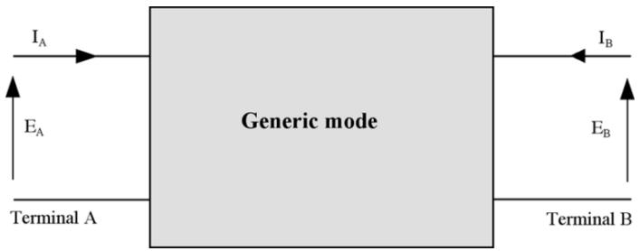
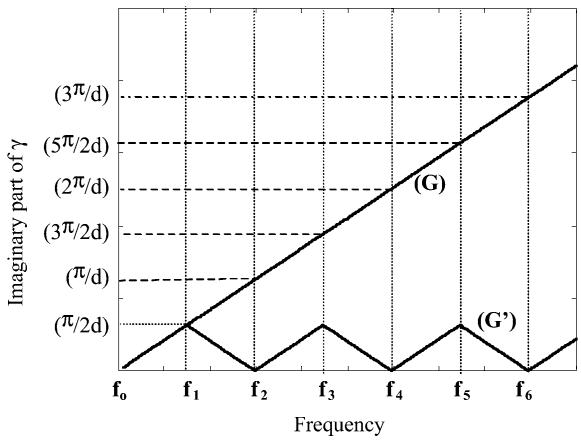
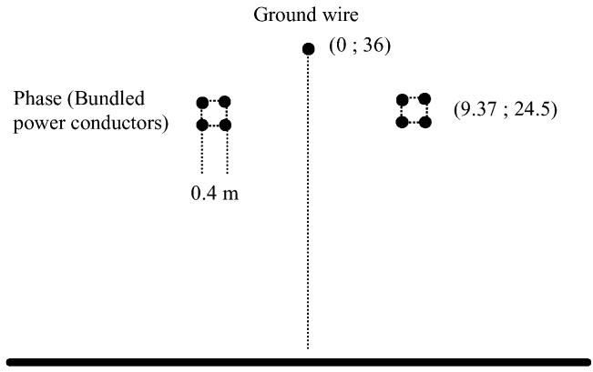
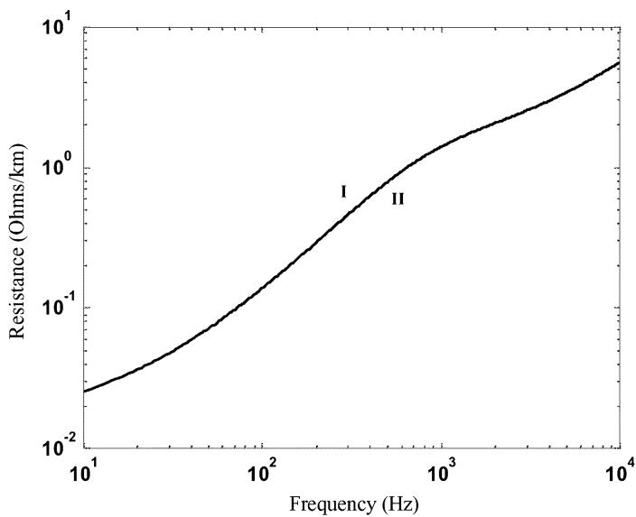
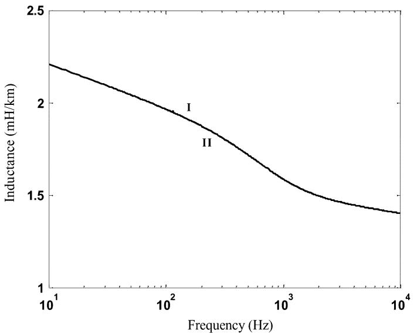
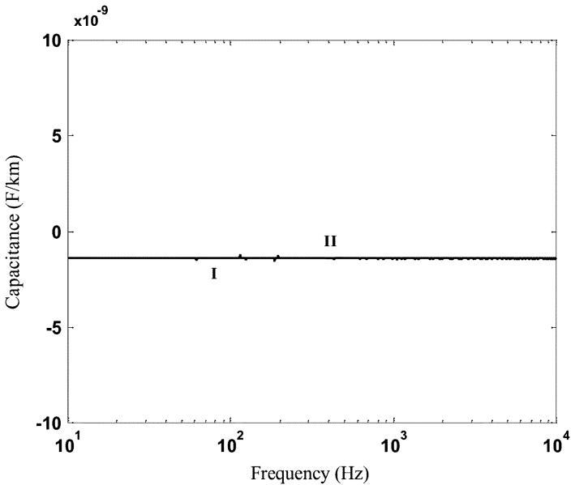
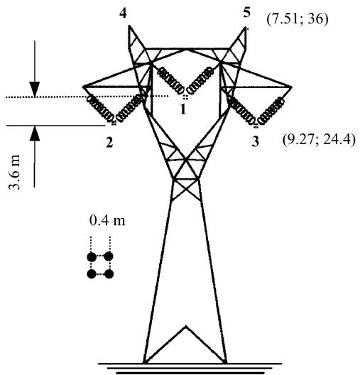
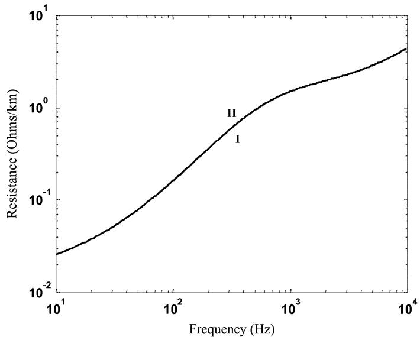
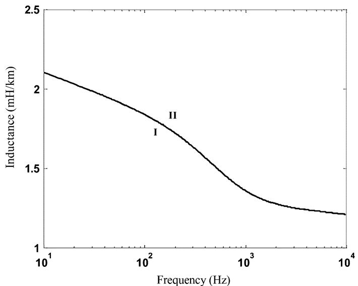
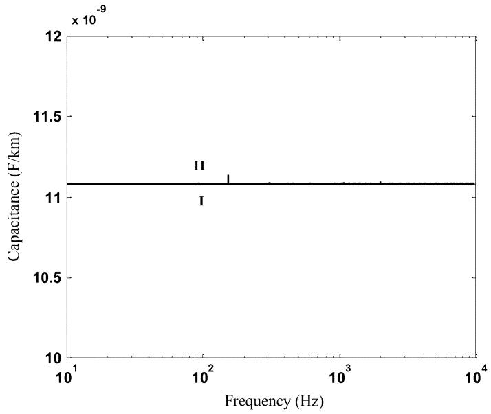

# A New Procedure to Derive Transmission-Line Parameters: Applications and Restrictions

Sérgio Kurokawa, Member, IEEE, José Pissolato, Member, IEEE, Maria Cristina Tavares, Member, IEEE, Carlos Manuel Portela, Life Senior Member, IEEE, and Afonso J. Prado, Member, IEEE

Abstract—The objective of this paper is to show an alternative methodology to calculate transmission-line parameters per unit length. With this methodology, the transmission-line parameters can be obtained starting from impedances measured in one terminal of the line. First, the article shows the classical methodology to calculate frequency-dependent transmission-line parameters by using Carson’s and Pollaczeck’s equations for representing the ground effect and Bessel’s functions to represent the skin effect. After that, a new procedure is shown to calculate frequency-dependent transmission-line parameters directly from currents and voltages of an existing line. Then, this procedure is applied in a two-phase and a three-phase transmission line whose parameters have been previously calculated by using the classical methodology. Finally, the results obtained by using the new procedure and by using the classical methodology are compared. The article shows simulations results for a typical frequency spectrum of switching transients (10 Hz to 10 kHz).

Index Terms—Electromagnetic transients, frequency dependence, modal transformation, phase domain, transmission line, transmission-line parameters.

# I. INTRODUCTION

HE self and mutual impedances present in the overhead T transmission-line equations in the frequency domain can be derived from the solution of Maxwell’s equations for the boundary conditions at the contact surfaces of the three relevant materials that are the conductor, air, and ground. Considering the different specific resistances, magnetic permeabilities, and dielectric permittivities of the materials, these expressions are integral functions of the frequency and the physical properties [1].

In the most usual procedures to evaluate line parameters, there are some explicit or implicit assumptions that imply in physical approximations. The approximations can be in respect to geometry simplifying or electromagnetic (EM) field behavior [2]. The geometric simplifying consists of assuming that the

Manuscript received December 1, 2004; revised March 1, 2005. This work was supported by Fundação de Amparo à Pesquisa do Estado de São Paulo. Paper no. TPWRD-00566-2004.

S. Kurokawa and A. J. Prado are with Faculdade de Engenharia de Ilha Solteira, Universidade Estadual Paulista, Ilha Solteira 15385-000, Brazil (e-mail: kurokawa@dee.feis.unesp.br; afonsojp@dee.feis.unesp.br).

J. Pissolato and M. C. Tavares are with Universidade Estadual de Campinas, Campinas 13081-970, Brazil (e-mail: pisso@dsce.fee.unicamp.br; cristina@dsce.fee.unicamp.br).

C. M. Portela is with Universidade Federal do Rio de Janeiro (UFRJ), Rio de Janeiro 21941-972, Brazil (e-mail: portelac@ism.com.br).

Digital Object Identifier 10.1109/TPWRD.2005.852296

soil surface is plane, the line cables are horizontal and parallel among themselves, the distance between any pair of conductors is much higher than the sum of their radii, and the EM effects of structures and insulators are neglected. Some simplifying assumptions are usually made about EM-field behavior and these approximations imply that, in what concerns the transversal behavior of the line, the quasi-stationary EM-field simplification is assumed [2]. For historical and cultural reasons, the most used procedures to represent the ground assume that the ground may have a constant conductivity, is frequency independent, and has a dielectric permittivity that can be neglected. These assumptions are quite far from reality, and can cause inadequate line modeling. Except for very high electric fields, where significant soil ionization originates, soil electromagnetic behavior is essentially linear but the electric conductivity and electric permittivity are strongly frequency dependent [2].

There are situations where the above-mentioned simplifications cannot be assumed. An example of a situation in which physical properties can be changed is in the study of EM transients that include nonuniform lines that could be portions of transmission lines where the conductors are not parallel. This occurs as in the connection between an overhead line and a cable, or where the sag is significant, for instance, at the crossing of rivers and valleys [3].

In an existing transmission line in which the previously mentioned simplifications again cannot be assumed, the transmission-line parameters could be derived from measured transmission-line impedances. As mentioned in [4], there are some practical difficulties to measure the frequency response of a transmission line. First, it requires a strong motivation to get the consent from a power utility to make an outage of a long transmission line. Second, the experimental setup may be nontrivial. Frequency measurement requires a voltage source with variable frequency and high power. Due to difficulties mentioned above, the procedure developed in this paper has been used in transmission lines represented by digital models.

This paper proposes a methodology to calculate longitudinal and shunt parameters per unit length of overhead transmission lines starting from the impedances measured at the line terminal. This paper provides results for a two-phase line and for an untransposed three-phase 440-kV, 500-km transmission line. Longitudinal and transversal parameters calculated by using traditional methodology and by using the methodology developed are also presented.

# II. CLASSICAL METHODOLOGY TO CALCULATE FREQUENCY-DEPENDENT TRANSMISSION-LINE PARAMETERS

It has long been recognized that one of the most important aspects in the modeling of transmission lines for EM transient studies is to account for the frequency dependence of the parameters. Models that assume constant parameters cannot adequately simulate the response of the line over the wide range of frequencies that are present during transient conditions. In most cases, the constant parameter representation produces a magnification of the higher harmonics and, as a consequence, a general distortion of the waveshapes and exaggerated magnitude peaks [5].

The self and mutual impedances included in the overhead transmission-line equations in the frequency domain can be derived from the solution of Maxwell’s equations. The self-impedance falls into three parts and the mutual impedance into two parts. These are listed as follows.

• The internal longitudinal impedance (per unit length) is associated with the electromagnetic field within the conductor. Within the assumption previously mentioned, such an EM field does not affect mutual terms, but only diagonal (self) terms of the longitudinal impedance matrix. In general, the internal impedance can be interpreted as a resistance and an inductance, both frequency dependent. The inner impedance can be calculated, with good accuracy, with formulas based on Bessel’s functions of geometric conductor parameters, material electric conductivity and frequency, or with simplified formulas depending on the frequency range. Due to the skin effect, the resistance increases whereas the inductance decreases.   
• The external longitudinal impedance (per unit length) is associated with the EM field outside the conductors. Assuming a lossless (infinite electric conductivity) ground and the other assumptions indicated before, the external longitudinal impedance (per unit length) may be interpreted as corresponding to an inductance matrix (per unit length), frequency independent.   
• For a lossy ground (finite electric conductivity), within the other assumptions indicated previously, it is possible to consider the effect, in longitudinal per unit length impedance matrix, of the EM field in soil by means of an additional parcel of the external longitudinal impedance, with nonzero diagonal (self) and mutual elements, frequency dependent (that can be treated as frequency-dependent resistance and inductance matrices).

A similar analysis applies also to the transversal admittance matrix [Y]. The main difference concerning simplifying assumptions is that, for [Y] effects, it is “reasonably accurate,” in typical conditions, to assume ideal conductors and ground (infinite electric conductivity) up to 1 MHz.

The parameters of transmission lines with ground return are highly dependent on the frequency. Formulas to calculate the influence of the ground return were developed by Carson and Pollaczek and these formulas can also be used for power lines. Both seem to give identical results for overhead lines, but Pollaczek’s formula is more general inasmuch as it can also be used for underground conductors or pipes [6].

# III. CALCULATION OF THE TRANSMISSION-LINE PARAMETERSDIRECTLY FROM PHASE CURRENTS AND VOLTAGES

# A. General Description of the Methodology

It is well known that for complex representation of sinusoidal alternating electrical magnitudes, and with several approximations and validity restrictions, the basic equations of a transmission line are [2]

$$
\frac {\mathrm {d} ^ {2} [ \mathrm {V _ {p h}} ]}{\mathrm {d x} ^ {2}} = [ \mathrm {Z} ] [ \mathrm {Y} ] [ \mathrm {V _ {p h}} ]; \quad \frac {\mathrm {d} ^ {2} [ \mathrm {I _ {p h}} ]}{\mathrm {d x} ^ {2}} = [ \mathrm {Y} ] [ \mathrm {Z} ] [ \mathrm {I _ {p h}} ]. \qquad (1)
$$

The equations in (1) are valid if some geometric and EM field behavior simplifying assumptions can be considered as described before. It is assumed that the EM field has a quasi-stationary behavior in orthogonal direction to the line axis [2].

In (1), [Z] and [Y] are per unit length longitudinal impedance and shunt admittance matrices, respectively. The elements of the matrices [Z] and [Y] are frequency dependent. The vectors $[ \mathrm { V _ { p h } } ]$ and $[ \mathrm { I _ { p h } } ]$ are, respectively, transversal voltages of the line cables and longitudinal currents in the line cables.

It is well known that in phase transmission lines, equations are solved by transforming coupled equations into decoupled equations. Decoupling of equations can be achieved through the use of a suitable chosen modal transformation matrix bringing [Y] [Z] to a diagonal form [7], [8]

$$
[ \mathrm {T} _ {\mathrm {I}} ] ^ {- 1} [ \mathrm {Y} ] [ \mathrm {Z} ] [ \mathrm {T} _ {\mathrm {I}} ] = [ \lambda ] \tag {2}
$$

where is the diagonal eigenvalue matrix.

Manipulating and substituting (2) in (1), it is possible to write the basic equations of a transmission line in mode domain as being [9]

$$
\frac {\mathrm {d} ^ {2} [ \mathrm {E} ]}{\mathrm {d x} ^ {2}} = [ \mathrm {Z} _ {\mathrm {m}} ] [ \mathrm {Y} _ {\mathrm {m}} ] [ \mathrm {E} ]; \quad \frac {\mathrm {d} ^ {2} [ \mathrm {I} ]}{\mathrm {d x} ^ {2}} = [ \mathrm {Y} _ {\mathrm {m}} ] [ \mathrm {Z} _ {\mathrm {m}} ] [ \mathrm {I} ] \tag {3}
$$

where matrices $[ Z _ { \mathrm { m } } ]$ and $[ \mathrm { Y } _ { \mathrm { m } } ]$ are obtained as follows [7]:

$$
\left[ \mathrm {Z} _ {\mathrm {m}} \right] = \left[ \mathrm {T} _ {\mathrm {I}} \right] ^ {\mathrm {t}} [ \mathrm {Z} ] [ \mathrm {T} _ {\mathrm {I}} ]; \quad \left[ \mathrm {Y} _ {\mathrm {m}} \right] = \left[ \mathrm {T} _ {\mathrm {I}} \right] ^ {- 1} [ \mathrm {Y} ] [ \mathrm {T} _ {\mathrm {I}} ] ^ {- \mathrm {t}} \qquad (4)
$$

where $[ \mathrm { T } _ { \mathrm { I } } ] ^ { \mathrm { t } }$ is the transposed of $[ \mathrm { T } _ { \mathrm { I } } ]$ and $[ \mathrm { T } _ { \mathrm { I } } ] ^ { - \mathrm { t } }$ is the inverse of $[ \mathrm { T _ { I } } ] ^ { \bar { \mathrm { t } } }$ .

In (3), the vectors [E] and [I] are, respectively, transversal voltages of the line cables and longitudinal currents in the line cables, written in mode domain. Because matrices $[ Z _ { \mathrm { m } } ]$ and $[ \mathrm { Y } _ { \mathrm { m } } ]$ are diagonal matrices, these matrix products $[ \mathrm { Z _ { m } ] \bar { [ Y _ { m } ] } }$ and $\mathrm { [ Y _ { m } ] [ Z _ { m } ] }$ are diagonal and, therefore, there is no coupling between modes. The solution of (3) for a generic mode is [9]

$$
\mathrm {E} _ {\mathrm {A}} = \mathrm {E} _ {\mathrm {B}} \cosh (\gamma \mathrm {d}) - \mathrm {I} _ {\mathrm {B}} Z _ {\mathrm {c}} \sinh (\gamma \mathrm {d}) \tag {5}
$$

$$
\mathrm {I _ {A}} = - \mathrm {I _ {B}} \cosh (\gamma \mathrm {d}) + \frac {\mathrm {E _ {B}}}{\mathrm {Z _ {c}}} \sinh (\gamma \mathrm {d}). \tag {6}
$$

In (5) and (6), $\mathrm { E _ { A } }$ and $\mathrm { E _ { B } }$ are, respectively, modal voltages at terminals A and B as described in Fig. 1. The terms $\mathrm { I _ { A } }$ and $\mathrm { I _ { B } }$ are modal currents at these terminations and is the line length. The terms $\gamma$ and $\mathrm { Z _ { c } }$ are, respectively, the propagation constant

  
Fig. 1. Generic mode of a transmission line.

and the characteristic impedance of the mode and are written as being [2]

$$
\gamma = \sqrt {z y} \tag {7}
$$

$$
Z _ {\mathrm {c}} = \sqrt {\frac {\mathrm {z}}{\mathrm {y}}} \tag {8}
$$

where z and y are, respectively, the longitudinal impedance and transversal admittance per unit length of the mode considered.

Because (7) and (8) are well known, in this paper, these equations will be denominated classical equations for $\gamma \mathrm { e } Z _ { \mathrm { c } }$ . These equations show that $\gamma$ and $\mathrm { Z _ { c } }$ of each mode are written as functions of longitudinal and transversal parameters.

In Fig. $1 , \mathrm { I _ { A } }$ and $\mathrm { I _ { B } }$ are, respectively, the modal currents in terminals A and $\mathrm { B } ; \mathrm { E _ { A } }$ and $\mathrm { E _ { B } }$ are, respectively, the modal voltages at terminals A and B.

Let us suppose that in terminal B, of the generic mode shown in Fig. 1, a load impedance $\mathrm { Z _ { L } }$ (whose value $\mathrm { Z _ { L } }$ is supposedly known) is connected. Then, from transmission-line theory and using (5) and (6), it is possible to determine the impedance Z of the equivalent circuit of the mode as being [4]

$$
Z = \frac {Z _ {\mathrm {L}} \cosh (\gamma \mathrm {d}) + Z _ {\mathrm {c}} \sinh (\gamma \mathrm {d})}{\cosh (\gamma \mathrm {d}) + \left(\frac {Z _ {\mathrm {L}}}{Z _ {\mathrm {c}}}\right) \sinh (\gamma \mathrm {d})}. \tag {9}
$$

By considering two specific situations, we have defined two impedances for the mode shown in Fig. 1. The first impedance is defined considering that terminal B is open and the other impedance is defined considering terminal B is short-circuited. These impedances are denominated equivalent impedances.

In (10), $\mathrm { Z _ { o p e n } }$ is the equivalent impedance when terminal B is open, and $( \mathrm { Z _ { L } } \to \infty ) , \mathrm { E _ { A o p e n } }$ , and $\mathrm { I _ { A o p e n } }$ are voltage and current in terminal A when terminal B is open

$$
Z _ {\text {o p e n}} = \frac {E _ {A \text {o p e n}}}{I _ {A \text {o p e n}}}. \tag {10}
$$

In (11), $\mathrm { Z _ { c c } }$ is the equivalent impedance when terminal B is short-circuited $( \mathrm { Z _ { L } = 0 } )$ and $\mathrm { E } _ { \mathrm { A c c } }$ and $\mathrm { I _ { A c c } }$ are the voltage and current in terminal A when terminal B is short-circuited

$$
Z _ {c c} = \frac {E _ {A c c}}{I _ {A c c}}. \tag {11}
$$

By manipulating (9), it is possible to write $\mathrm { Z _ { c c } }$ and $\mathrm { Z _ { o p e n } }$ of each mode as functions of $\mathrm { Z _ { c } }$ as being

$$
\mathrm {Z} _ {\mathrm {c c}} = \mathrm {Z} _ {\mathrm {c}} \tanh  (\gamma \mathrm {d}) \tag {12}
$$

$$
\mathrm {Z} _ {\text {o p e n}} = \mathrm {Z} _ {\mathrm {c}} \coth (\gamma \mathrm {d}). \tag {13}
$$

It is possible to observe that the equivalent impedances can be calculated directly from currents and voltages of the line, by using (10) and (11), or directly from $\gamma \mathrm { ~ e ~ } \mathrm { Z _ { c } }$ , by using (12) and (13).

Using and $\mathrm { Z _ { c } }$ calculated as functions of $\mathrm { Z _ { c c } }$ and $\mathrm { Z _ { o p e n } } .$ , it is possible to calculate longitudinal and transversal transmissionline parameters by using (7) and (8)

# B. Calculating as a Function of $\mathrm { \Delta \cdot z } _ { \mathrm { c c } }$ and $\mathrm { Z _ { o p e n } }$

Let us consider a phase transmission line with terminals A and B. Let us consider also that it is possible to obtain in this line the vectors $[ \mathrm { V _ { p h } } ] , [ \mathrm { I _ { p h } } ] _ { \mathrm { o p e n } }$ , and $[ \mathrm { I _ { p h } } ] _ { \mathrm { c c } }$ where the vector $[ \mathrm { V _ { p h } } ]$ consists of sources connected in terminal A of the line. The vectors $[ \mathrm { I _ { p h } } ] _ { \mathrm { o p e n } }$ and $[ \mathrm { I _ { p h } } ] _ { \mathrm { c c } }$ have the longitudinal currents in terminal A of each phase of the line, considering terminal B is open and short-circuited, respectively.

The vectors above mentioned are written in modal domain as being

$$
\left[ \mathrm {E} _ {\mathrm {m}} \right] = \left[ \mathrm {T} _ {\mathrm {I}} \right] ^ {\mathrm {t}} \left[ \mathrm {V} _ {\mathrm {p h}} \right] \tag {14}
$$

$$
\left[ \mathrm {I} _ {\mathrm {m}} \right] _ {\text {o p e n}} = \left[ \mathrm {T} _ {\mathrm {I}} \right] ^ {- 1} \left[ \mathrm {I} _ {\mathrm {p h}} \right] _ {\text {o p e n}} \tag {15}
$$

$$
\left[ \mathrm {I} _ {\mathrm {m}} \right] _ {\mathrm {c c}} = \left[ \mathrm {T} _ {\mathrm {I}} \right] ^ {- 1} \left[ \mathrm {I} _ {\mathrm {p h}} \right] _ {\mathrm {c c}}. \tag {16}
$$

In (14), $[ \mathrm { E } _ { \mathrm { m } } ]$ is the vector with modal voltage sources. Each modal voltage is connected to terminal A of the respective mode of the line. The vectors $[ \mathrm { I } _ { \mathrm { m } } ] _ { \mathrm { o p e n } }$ and $[ \mathrm { I } _ { \mathrm { m } } ] _ { \mathrm { c c } }$ in (15) and (16) are current vectors in terminal A of each mode considering that terminal B is open and short-circuited, respectively.

Considering a generic mode of the above-mentioned line, it is possible to use (10) and (11) for calculating the equivalent impedances $\mathrm { Z _ { o p e n } }$ and $\mathrm { Z _ { c c } }$ of this mode. After that, by manipulating (12) and (13), it is possible to obtain

$$
\coth (\gamma \mathrm {d}) = \sqrt {\frac {\mathrm {Z} _ {\text {o p e n}}}{\mathrm {Z} _ {\mathrm {c c}}}}. \tag {17}
$$

In (17), the equivalent impedances $\mathrm { Z _ { o p e n } }$ and $\mathrm { Z _ { c c } }$ are known and were obtained by using (10) and (11), respectively. Therefore, by using algebraic manipulation in (17), it is possible to obtain the propagation function $\gamma$ of the generic mode of the line.

The term can be written as being

$$
\coth (\gamma \mathrm {d}) = \frac {\mathrm {e} ^ {\gamma \mathrm {d}} + \mathrm {e} ^ {- \gamma \mathrm {d}}}{\mathrm {e} ^ {\gamma \mathrm {d}} - \mathrm {e} ^ {- \gamma \mathrm {d}}}. \tag {18}
$$

Substituting (18) into (17) yields

$$
\frac {\mathrm {e} ^ {\gamma \mathrm {d}} + \mathrm {e} ^ {- \gamma \mathrm {d}}}{\mathrm {e} ^ {\gamma \mathrm {d}} - \mathrm {e} ^ {- \gamma \mathrm {d}}} = \sqrt {\frac {\mathrm {Z} _ {\text {o p e n}}}{\mathrm {Z} _ {\mathrm {c c}}}}. \tag {19}
$$

After algebraic manipulation of (19), it is possible to express of each mode as being

$$
\gamma = \frac {1}{2 \mathrm {d}} (\ln \mathrm {X} + \mathrm {j} \cos^ {- 1} \mathrm {F}). \tag {20}
$$

In (20), is the line length and X and F are written as being

$$
\mathrm {X} = \frac {\left(1 + \mathrm {C} _ {1}\right) ^ {2} + \left(\mathrm {C} _ {2}\right) ^ {2}}{\sqrt {\left(1 - \mathrm {C} _ {1} ^ {2} - \mathrm {C} _ {2} ^ {2}\right) ^ {2} + 4 \mathrm {C} _ {2} ^ {2}}} \tag {21}
$$

  
Fig. 2. Behavior of the imaginary part of 
 for a generic mode.

$$
F = - \frac {1 - \left(C _ {1} ^ {2} + C _ {2} ^ {2}\right)}{\sqrt {\left(1 - C _ {1} ^ {2} - C _ {2} ^ {2}\right) ^ {2} + 4 C _ {2} ^ {2}}} \tag {22}
$$

$$
\sqrt {\frac {\mathrm {Z} _ {\text {o p e n}}}{\mathrm {Z} _ {\mathrm {c c}}}} = \mathrm {C} _ {1} + \mathrm {j C} _ {2}. \tag {23}
$$

An analysis of the components of (20) shows that it can be used in a specific frequency value if it satisfies the following restriction:

$$
\mathrm {C} _ {1} \neq \pm 1 \quad \text {a n d} \quad \mathrm {C} _ {2} \neq 0. \tag {24}
$$

The condition defined in (24) needs to be satisfied for each mode of the line in a specific frequency value where is going to be calculated.

# C. Behavior of the Imaginary Part of (20)

Let us define functions G and $\mathrm { G } ^ { \prime }$ , the imaginary part of (7) and the imaginary part of (20), respectively. Therefore, G and $\mathbf { G } ^ { \prime }$ are written as being

$$
\mathrm {G} = \operatorname {I m} (\sqrt {\mathrm {z y}}) \tag {25}
$$

$$
\mathrm {G} ^ {\prime} = \frac {1}{2 \mathrm {d}} \cos^ {- 1} \mathrm {F}. \tag {26}
$$

Fig. 2 shows the behavior of functions G and $\mathrm { G } ^ { \prime }$ .

Fig. 2 shows that functions G and $\mathrm { G } ^ { \prime }$ are equal for frequencies between $\mathrm { f _ { 0 } }$ and $\mathrm { f _ { 1 } }$ only. However, it is possible to link G and $\mathbf { G } ^ { \prime }$ for other frequency ranges by using a single formation rule that is shown soon after.

Let us define the function H as being

$$
\mathrm {H} \left(\mathrm {f} _ {\mathrm {k}}\right) = \left| \frac {\partial \mathrm {G} ^ {\prime} \left(\mathrm {f} _ {\mathrm {k}}\right)}{\partial \mathrm {f}} \right| \left(\mathrm {f} _ {\mathrm {k}} - \mathrm {f} _ {\mathrm {k} - 1}\right) + \mathrm {H} \left(\mathrm {f} _ {\mathrm {k} - 1}\right) \tag {27}
$$

where

$$
\frac {\partial \mathrm {G} ^ {\prime} \left(\mathrm {f} _ {\mathrm {k}}\right)}{\partial \mathrm {f}} \approx \frac {\mathrm {G} ^ {\prime} \left(\mathrm {f} _ {\mathrm {k}}\right) - \mathrm {G} ^ {\prime} \left(\mathrm {f} _ {\mathrm {k} - 1}\right)}{\mathrm {f} _ {\mathrm {k}} - \mathrm {f} _ {\mathrm {k} - 1}}. \tag {28}
$$

Equation (27) must be used if $\mathrm { f _ { k } }$ is larger than $\mathrm { f _ { 1 } . H f _ { k } }$ is lower than $\mathrm { f _ { 1 } }$ , then H(f) is written as being

$$
\mathrm {H} \left(\mathrm {f} _ {\mathrm {k}}\right) = \mathrm {G} ^ {\prime} \left(\mathrm {f} _ {\mathrm {k}}\right). \tag {29}
$$

By using (27) and (29), it is possible to express $\mathrm { G } ^ { \prime }$ as being a function of G for generic frequencies.

# D. Calculation of Longitudinal and Transversal Transmission-Line Parameters

Multiplying (12) and (13) and then substituting (8) in this product, the following relationship is obtained:

$$
\frac {\mathrm {Z}}{\mathrm {y}} = \mathrm {Z} _ {\mathrm {c c}} \mathrm {Z} _ {\mathrm {o p e n}}. \tag {30}
$$

Solving (7) and (30)

$$
z = \gamma \sqrt {Z _ {\mathrm {c c}} Z _ {\mathrm {o p e n}}} \tag {31}
$$

$$
\mathrm {y} = \frac {\gamma}{\sqrt {\mathrm {Z} _ {\mathrm {c c}} \mathrm {Z} _ {\mathrm {o p e n}}}}. \tag {32}
$$

As shown in (10) and (11), the terms $\mathrm { Z _ { o p e n } }$ and $\mathrm { { Z _ { c c } } }$ are calculated from currents and voltages obtained in one terminal of the mode considering that the other terminal is open and short-circuited. Then, by using (20)–(29), the modal propagation constants are calculated. After that, using (31) and (32), longitudinal impedance and transversal admittance of each mode are derived.

With longitudinal impedance and transversal admittance of each mode calculated, longitudinal impedance matrix $[ \mathrm { Z } _ { \mathrm { m } } ]$ and transversal admittance matrix $[ \mathrm { Y } _ { \mathrm { m } } ]$ in mode domain are derived.

Now the matrices $[ Z _ { \mathrm { m } } ]$ and $[ \mathrm { Y } _ { \mathrm { m } } ]$ are converted to phase domain as follows:

$$
[ \mathrm {Z} ] = [ \mathrm {T} _ {\mathrm {I}} ] ^ {- \mathrm {t}} [ \mathrm {Z} _ {\mathrm {m}} ] [ \mathrm {T} _ {\mathrm {I}} ] ^ {- 1} \tag {33}
$$

$$
[ \mathrm {Y} ] = [ \mathrm {T} _ {\mathrm {I}} ] [ \mathrm {Y} _ {\mathrm {m}} ] [ \mathrm {T} _ {\mathrm {I}} ] ^ {- \mathrm {t}}. \tag {34}
$$

In (33) and (34), [Z] and [Y] are longitudinal impedance and shunt admittance matrices in phase domain, respectively. Therefore, if currents and voltages above mentioned are known, matrices [Z] and [Y] can be calculated. Consequently, it is possible to calculate per-unit longitudinal and transversal parameters of the transmission line.

# E. Some Considerations About the Methodology Developed

The procedure proposed in this paper is based in the knowledge of the modal transformation matrix and the voltage and current magnitudes at the beginning of the line during open- and short-circuit conditions. The necessary conditions before mentioned reduce the applicability of the methodology. However, it is necessary to consider that this paper shows an initial study of an alternative procedure to obtain transmission-line parameters and the results have shown that it is viable when it is used in transmission lines represented through (5) and (6).

The first obstacle to consider the presented method as being a general procedure is the fact that the modal transformation matrices need to be known. This fact initially turns the methodology into an unnecessary procedure because if the modal transformation matrix is known, the longitudinal and transversal parameters are known too. However, there are some situations in which the modal transformation matrix is known and the transmission-line parameters are not necessarily known. In these cases, the matrix is obtained from transmission-line geometric characteristics.

For two-phase transmission lines, the modal transformation matrix is independent of the transmission-line parameters and is written as being [9]

$$
\left[ \mathrm {T} _ {\mathrm {I}} \right] = \left[ \begin{array}{c c} 1 & 1 \\ 1 & - 1 \end{array} \right]. \tag {35}
$$

Therefore, the two-phase transmission line, whose longitudinal and transversal parameters are considered unknown, can be decoupled in two exact modes denominated exact modes 1 and 2 by using (35). In this case, if the phase currents and voltages are known, it is possible to obtain longitudinal and transversal parameters in the mode domain. After that, it is possible to calculate these parameters in phase domain.

For ideally transposed three-phase transmission lines, Clarke’s matrix separates the line in its exact modes [10] and, in this situation, the proposed methodology can be used too.

Another obstacle that reduces the applicability of the method is the fact that the equivalent impedances are essential elements in the proposed methodology. As mentioned in Section I, there are several difficulties to obtain voltage and currents in a wide frequency range, but recently, Akke and Biro [4] have calculated the equivalent impedances of a transmission line represented through a downscaled experimental model. The applicability of our methodology only can be verified when we have conditions to calculate frequency measurements considering variable frequency and high power. At this moment, our studies have been restricted to transmission lines, whose modal transformation matrices are considered known, represented through (5) and (6).

# IV. RESULTS OBTAINED

In this section, results are shown for a two-phase transmission line and for a three-phase transmission line. It is considered that the lines are untransposed transmission lines with a vertical symmetry plane. It is considered a frequency range of 10 Hz to 10 kHz that is the typical frequency spectrum of switching transients [11].

It is assumed that the lines are over nonideal ground with finite conductivity and that the cables are not perfect conductors. In this situation, the self and mutual parameters are frequency dependent and are calculated considering the ground return and skin effect [6], [12]. The phase conductors consist of four Grosbeak subconductors, the ground wires are EHSW- and the soil resistivity is 1000 -m.

In the two-phase line, the modal transformation matrix is always known and, therefore, the methodology can be used if it is assumed that the currents and voltages in frequency domain are known. For the three-phase line, it has been assumed that, in a hypothetical situation, the modal transformation matrix is known.

The procedure to verify the methodology consists of calculating the longitudinal and transversal parameters by using the methodology developed in this paper and then to compare it with the longitudinal and transversal parameters that were calculated as shown in Section II.

First, phase currents and voltages in the frequency domain in one terminal of the line, considering that the other terminal

  
Fig. 3. Two-phase transmission line.

  
Fig. 4. Self-resistance of phase 1: obtained by using the procedure shown in Section II (curve I) and obtained from currents and voltages (curve II).

is open and short-circuited, were obtained considering the line represented through (5) and (6). Then, using the methodology developed in this paper, the longitudinal and transversal parameters were calculated. Finally, these parameters were compared with parameters obtained by using the procedure shown in Section II.

# A. Application on a Two-Phase Transmission Line

Consider a two-phase transmission line where the characteristics have been previously described. Fig. 3 shows this mentioned line.

The procedure developed in this paper was applied in the line shown in Fig. 3.

In Figs. 4– 6, the self-resistance, the self-inductance, and the mutual capacitance, respectively, are presented.

In Figs. 4–6, curve I shows the procedure used in Section II and curve II shows the results obtained from currents and voltages of the line. It is possible to verify that parameters of a twophase transmission line can be calculated by using the methodology developed in this paper. The results are in agreement with those obtained from Section II.

  
Fig. 5. Self inductance of phase 1: obtained by using the procedure shown in Section II (curve I) and obtained from currents and voltages (curve II).

  
Fig. 6. Apparent capacitance between phases 1 and 2: obtained by using the procedure shown in Section II (curve I) and obtained from currents and voltages (curve II).

# B. Application on a Three-Phase Transmission Line

Consider the three-phase transmission line shown in Fig. 7 whose characteristics have been previously described.

The procedure was used to calculate three-phase transmission line parameters. In the line shown in Fig. 7, it was considered that the modal transformation matrix is known.

Figs. 8–10 show the self-resistance, self-inductance, and apparent capacitance of the line. Curve I shows the procedure used in Section II and curve II shows the results obtained from measured impedances of the line. It is possible to conclude that the unknown parameters of an untransposed three-phase transmission line can be calculated by using the methodology developed in this paper if, hypothetically, the modal transformation matrix is known. The results obtained by using the methodology proposed in this article are in agreement with results obtained in accordance with Section II calculations.

  
Fig. 7. A 440-kV three-phase transmission line.

  
Fig. 8. Self resistance of phase 1: Obtained by using the procedure shown in Section II (curve I) and obtained from currents and voltages (curve II).

  
Fig. 9. Self inductance of phase 1: Obtained by using the procedure shown in Section II (curve I) and obtained from currents and voltages (curve II).

  
Fig. 10. Apparent capacitance of phase 1: Obtained by using the procedure shown in Section II (curve I) and obtained from currents and voltages (curve II).

# V. CONCLUSION

This paper presents a procedure to derive longitudinal and transversal per-unit transmission-line parameters, for a typical frequency spectrum of switching transients, directly from the measured impedances of the line. The main characteristic of the procedure is to calculate the longitudinal and transversal parameters of an existing line and in which simplifications with respect to geometry and the EM field cannot be assumed as being true.

The methodology requires, basically, two conditions: First, the transmission line, whose parameters are unknown and should be calculated, needs to have a known modal transformation matrix . Second, the frequency response of the line needs to be known. The first condition reduces the applicability of the methodology to two-phase transmission lines where the modal transformation matrix is already known. Because the frequency response needs to be known, we have only used the proposed method in transmission lines represented by (5) and (6) and these equations have been implemented in a personal computer. However, a recent paper [4] shows that it is possible to obtain the frequency response of transmission lines represented through a downscaled experimental model. The results obtained in [4] have led us to believe that it is possible, in future research, to apply the methodology in a transmission line represented through a downscaled experimental model. However, this idea needs to be carefully analyzed.

The use of the methodology in lines represented through digital models, in frequency domain, shows good results for twophase transmission lines. The methodology has also been used to obtain parameters of a three-phase transmission line whose modal transformation matrix has been considered known.

# REFERENCES

[1] L. Hofmann, “Series expansions for line series impedances considering different specific resistances, magnetic permeabilities, and dielectric permittivities of conductors, air, and ground,” IEEE Trans. Power Del., vol. 18, no. 2, pp. 564–570, Apr. 2003.

[2] C. Portela and M. C. Tavares, “Modeling, simulation and optimization of transmission lines. Applicability and limitations of some used procedures,” in Proc. IEEE Power Eng. Soc. Transmission Distribution, São Paulo, Brazil, 2002.   
[3] A. Semlyen, “Some frequency domain aspects of wave propagation on nonuniform lines,” IEEE Trans. Power Del., vol. 18, no. 1, pp. 315–322, Jan. 2003.   
[4] M. Akke and T. Biro, “Measurements of the frequency-dependent impedance of a thin wire with ground return,” IEEE Trans. Power Del., pt. 2, vol. 20, no. 2, pp. 1748–1752, Apr. 2005.   
[5] J. R. Marti, “Accurate modeling of frequency-dependent transmission line in electromagnetic transient simulations,” IEEE Trans. Power App. Syst., vol. PAS-101, no. 1, pp. 147–155, Jan. 1982.   
[6] H. W. Dommel, EMTP Theory Book Portland, OR, 1986.   
[7] L. M. Wedephol, H. V. Nguyen, and G. D. Irwin, “Frequency-dependent transformation matrices for untransposed transmission lines using Newton-Raphson method,” IEEE Trans. Power Syst., vol. 11, no. 3, pp. 1538–1546, Aug. 1996.   
[8] J. A. B. Faria and J. H. B. Mendez, “Modal analysis of untransposed bilateral three-phase lines—A perturbation approach,” IEEE Trans. Power Del., vol. 12, no. 1, pp. 497–504, Jan. 1997.   
[9] A. Budner, “Introduction of frequency-dependent line parameters into an electromagnetic transients programs,” IEEE Trans. Power App. Syst., vol. PAS-89, no. 1, pp. 88–97, Jan. 1970.   
[10] M. C. Tavares, J. Pissolato, and C. M. Portela, “Quasimodes multiphase transmission line model,” Elect. Power Syst. Res., no. 49, pp. 159–167, 1999.   
[11] , “Mode domain multiphase transmission line model—Use in transient studies,” IEEE Trans. Power App. Syst., vol. PAS-14, no. 4, pp. 1533–1544, Oct. 1999.   
[12] L. Marti, “Low-order approximation of transmission line parameters for frequency-dependent models,” IEEE Trans. Power App. Syst., vol. PAS-102, no. 11, pp. 3582–3589, Nov. 1983.

Sérgio Kurokawa (S’01–M’04) received the D.Sc. degree in electrical engineering from Universidade Estadual de Campinas, Campinas, Brazil.

Currently, he is Professor with Unesp-São Paulo State University, Ilha Solteira, Brazil, where he has been since 1994. His research interests are electromagnetic transients in power-electric systems and models of long transmission lines used in studies of EM transients.

José Pissolato (M’95) received the D.Sc. degree in electrical engineering from Université Paul Sabatier, Toulose, France, in 1986.

Since 1979, he has been with Universidade Estadual de Campinas (Departamento de Sistemas e Controle de energia), Brazil. His research interests are in high-voltage engineering, EM transients, and EM compatibility.

Maria Cristina Tavares (M’98) received the D.Sc. degree in electrical engineering from Universidade Estadual de Campinas, Campinas, Brazil, in 1998.

Currently, she is a Professor with Universidade Estadual de Campinas. Her research interests are power system analysis, long distance transmission, and computer application to the analysis of power systems transients.

Carlos Manuel Portela (SM’68–LS’02) received the D.Sc. degree from Lisbon Technical University (UTL), Lisbon, Portugal, in 1963.

Currently, he is Titular Professor of Universidade Federal do Rio de Janeiro (COPPE/UFRJ), working on research projects in transmission systems and equipment.

Afonso J. Prado (S’95–M’03) received the M.Sc. degree from Faculdade de Engenharia de Ilha Solteira, Universidade Estadual Paulista (FEIS/UNESP), São Paulo, Brazil, in 1995, and the Ph.D. degree from Universidade Estadual de Campinas (UNICAMP), Campinas, Brazil, in 2002.

Currently, he is a Researcher with FEIS/UNESP, São Paulo, Brazil (sponsored by FAPESP–Fundação de Amparo à Pesquisa do Estado de São Paulo). His main research interests are EM transients of transmission lines