# 适用于电网频率响应分析的直驱型风电场实用化等值方法

张 磊 1，2 ， 晁 璞 璞 3 ， 金 泳 霖 3 ， 刘 志 辉 3 ， 李 卫 星 1，3 ， 李 志 民 1

（1. 哈尔滨工业大学电气工程及自动化学院，黑龙江省哈尔滨市 150001；

2. 可再生能源并网全国重点实验室（中国电力科学研究院有限公司），北京市 100192；

3. 大连理工大学电气工程学院，辽宁省大连市 116024）

摘要：风电参与系统调频是提升新型电力系统频率安全稳定水平的重要途径之一。为了高效分析风电参与调频时系统的频率演化机理，亟须研究适用于电网频率响应特性分析的风电场聚合等值方法。文中建立了直驱型风电机组的通用调频控制模型，仿真分析了直驱型风电机组工作于不同运行点时的调频响应特性，发现处于不同风速区间内的同型号风电机组参与系统调频时具有显著的聚群特征，据此提出了适用于电网频率响应特性分析的直驱型风电场实用化等值方法。通过建立和对比某风电场的详细拓扑模型、文中所提等值模型、传统单机等值模型及两种典型多机等值模型在不同运行场景的调频响应特性，发现所提方法的等值性能明显优于其他等值方法，可以在保证计算速度的同时兼顾对详细场站频率响应特性的模拟精度，并且能较好地适应不同的风速和扰动场景。

关键词：直驱型风电场；频率响应；电磁暂态建模；等值方法

# 0 引 言

随着中国“双碳”战略的提出，以风电为代表的新能源发电技术快速发展，风电机组在电力系统中的装机容量占比迅速提高。考虑到经济性和弃风率等 因 素 ，风 电 机 组 多 运 行 于 最 大 功 率 点 追 踪（maximum power point tracking，MPPT）模 式 ，呈 现出“弱惯量”，且基本不参与系统的快速一次调频。风电出力具有显著的波动性和不确定性，使得电力系统频率的安全形势不断恶化［1］ 。为了实现电力系统频率响应特性的精确分析和涉频控制策略的优化设计，建立准确的风电场频率响应仿真模型是关键。不同于传统同步机组，风电场往往包括几十台甚至上百台风电机组，机组的单机容量小、位置相对分散。风电场详细模型的复杂度和仿真计算时间呈几何式增长，研究准确高效的风电场等值建模方法至关重要［2］ 。

目前，风电场的等值建模方法主要分为单机和多机等值两类［3］ 。单机等值方法将整个风电场等值为一台风电机组［4-5］ ，等值机的运行点为所有机组运

行点的平均，当机组间运行状态的差异较大时，等值精度通常难以满足要求［6］。文献［7］基于对风能捕获、风机转子、桨距角等关键环节参数的等值计算，实现了风电场调频模型的单机等值，但仅考虑了桨距角减载和下垂控制。文献［8］提出了基于注入电流加权动态聚合的单机等值方法，在部分电压跌落的工况下可以得到较高的精度；文献［9］以有功/无功输出、动能变化率等关键参数不变为原则，设计了单机等值机组的参数计算方法，并在机电和电磁暂态仿真中取得了较高的精度。然而，上述两种方法对于高电压故障场景的适应性缺乏充分的验证。文献［10］基于粒子群算法辨识等值参数，实现了风电场群的频域单机等值建模；文献［11］基于粒子群算法提出了风电场等值建模方法，可实现控制参数不同的机组之间的单机等值。然而，此类方法需要大量数据支撑，运算压力相对较大。可以看出，目前传统单机等值方法精度较差，且多针对低电压穿越工况进行研究，虽可以采用智能算法改善误差，但算法复杂且难以适用于海量运行场景。

多机等值方法将具有相同或相近特性的机组归为一群，利用多台等值机表征整个风电场［12-13］。文献［14］基于改进 K-means算法，得到了较好的短路电流等值精度，然而该方法涉及控制方式、机端电压相位、电压跌落程度等多种分群指标，计算较为复

杂。文献［15］将卸荷电路动作状态和故障期间电压作为一次、二次分群原则，结合密度聚类和K-means算法实现了直驱型风电场的多机等值；文献［16］根据机组在短路故障清除后能否恢复至故障前的运行点为依据，辅以临近传播算法，提出了基于两步分群的多机等值方法。上述方法虽能改善风电场的等值精度，但均针对短路故障工况，缺乏多样化运行场景下的详细验证。文献［17］基于系统间隙度量计算实现风电场的多机等值，一定程度兼顾了一次调频模型计算效率与模型精度；文献［18］基于状态参数与改进 K-means聚类算法，可在机组调频控制参数不一致的情况下建立风电场多机等值模型；文献［19］基于风电机组非线性模型，结合模糊 C-means聚类算法，改善了电压扰动和频率扰动工况下的风电场等值精度。但上述方法未能完整计及虚拟惯量控制、下垂控制、超速减载控制和桨距角减载控制等风电机组的常用调频控制方法。可见，现有多机等值方法虽能获得较高的等值精度，但大多集中于如何识别能够表征机组故障穿越动态和部分调频动态特

性的分群指标，须借助复杂的聚类或优化算法实现分群。

综上，现有等值方法多针对电压跌落的故障穿越场景和部分调频控制下的频率扰动场景，采用复杂的优化或聚群算法实现高精度等值，难以兼顾精度和计算量，且难以支撑风电场参与系统的调频特性研究。为解决以上问题，本文建立了直驱型风电机组调频控制的通用详细电磁暂态模型，仿真分析了机组运行于不同工作点的调频响应特性，发现处于不同风速区间内的同型号风电机组参与系统调频时的响应特性具有显著的聚群特征，并据此提出了适用于电网频率响应特性分析的直驱型风电场实用化等值方法。该方法最多用3台等值机即可表征复杂风电场不同运行场景下的调频特性。

# 1 直驱型风电机组的通用调频控制模型

为覆盖国内主流型号直驱型风电机组可能的调频控制模式，本文构建了如图 1所示的通用调频控制模型。

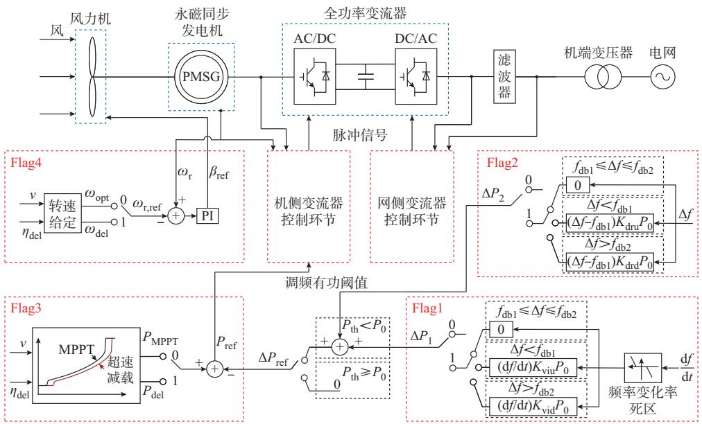  
图1 直驱型风电机组的通用调频控制模型  
Fig. 1 Generalized frequency regulation control models for direct-drive wind turbines

图中 $: \Delta P _ { 1 }$ 为虚拟惯量控制器输出的有功调节量； $\mathsf { \Omega } ; \Delta P _ { 2 }$ 为下垂控制器输出的有功参考值调节量； $; { \cal P } _ { \mathrm { r e f } }$ 为综合惯量控制的有功输出参考值 $\mathrm { ; } f _ { \mathrm { d b l } } \mathrm { \setminus } f _ { \mathrm { d b 2 } }$ 为调频死区； $P _ { \mathrm { M P P T } }$ 为 MPPT 控制的有功输出； $\omega _ { \mathrm { d e l } }$ 为减载运行下的转速 $\bullet \omega _ { \mathrm { r , r e f } }$ 为风电机组转子转速参考值； $; \beta _ { \mathrm { r e f } }$ 为桨距角参考值； $K _ { \mathrm { v i u } } \setminus K _ { \mathrm { d r u } }$ 和 $K _ { \mathrm { v i d } } \setminus K _ { \mathrm { d r d } }$ 分别为频率上升和下降时的虚拟惯量系数、下垂控制系数；Flag1至Flag4分别代表虚拟惯量控制、下垂控制、超速减载控制和桨距角减载控制，其标志位取 1 表示投

入，取 0 表示闭锁，共可以生成 16 种控制模式。其中，Flag1 和 Flag2 代表的综合惯量控制与 Flag3和Flag4代表的减载控制在工程上一般需要配合使用。通过标志位的灵活组合，能够实现控制模式的灵活切换。本文以机组采用虚拟惯量控制、下垂控制、超速减载控制和桨距角减载控制的协同控制模式为例，论证适用于电网频率响应特性分析的直驱型风电场实用化等值方法。

综合惯量控制包括虚拟惯量控制和下垂控制，

分别通过引入与频率变化率和频率偏差成比例的有功功率调节量，模拟同步机惯性和调速器的调频特性，二者有功功率调节量的计算公式如下：

$$
\Delta P _ {\mathrm {r e f}} = \left[ - K _ {\mathrm {v i}} \frac {\mathrm {d} f}{\mathrm {d} t} - K _ {\mathrm {d r}} \left(\Delta f - f _ {\mathrm {d b}}\right) \right] P _ {0} \tag {1}
$$

式中： $\Delta P _ { \mathrm { r e f } }$ 为综合惯量控制的有功输出参考值调节量； $P _ { 0 }$ 为稳态运行下的风电机组有功输出 $; f _ { \mathrm { d b } }$ 为调频死区；f为系统频率； $\Delta f$ 为系统频率偏差；t为时间；$K _ { \mathrm { v i } }$ 为虚拟惯量控制系数； $K _ { \mathrm { d r } }$ 为下垂控制系数。根据需求，频率跌落和频率上升工况下的 $f _ { \mathrm { d b } } \setminus K _ { \mathrm { v i } }$ 和 $K _ { \mathrm { d r } }$ 可各自设为相等常数，也可分别设置，详见附录 A式（A1）至式（A3）。

风电机组需要上调有功功率时，若无额外能量来源，仅依靠转子动能，则支撑调频响应的持续时间较短，且在转子转速下降至极限或频率恢复过程中，可能导致频率二次跌落。要解决该问题，须辅以减载备用控制，使机组具备相对稳定的上调空间。

减载备用控制：包括超速减载和桨距角减载控制。如附录A图A1所示，风速一定时，存在唯一的最优转速 $\omega _ { \mathrm { o p t } }$ 和最优叶尖速比 $\lambda _ { \mathrm { o p t } }$ 使风能利用系数 $C _ { \mathrm { p } }$ 在当前桨距角 $\beta$ 下达到最大值，改变 $\lambda _ { \mathrm { o p t } }$ 和 $\beta$ 可间接改变 $C _ { \mathrm { p } }$ ，实现风电机组的减载运行。 $\omega _ { \mathrm { o p t } }$ 和 $\lambda _ { \mathrm { o p t } }$ 的对应关系如下所示：

$$
\omega_ {\text {o p t}} = \frac {\lambda_ {\text {o p t}} v}{R} \tag {2}
$$

式中：R为风轮半径 $; v$ 为风速。

采用超速减载控制时，如附录A图A1所示，桨距角为 $\beta _ { 1 }$ ，即风机运行于蓝色曲线时，可通过风机转子超速增大叶尖速比使风机运行点由 A移动至 C，实现风电机组的减载运行。采用桨距角减载控制时，如图A1所示，将桨距角由 $\beta _ { 1 }$ 增大至 $\beta _ { 2 }$ ，风机运行点将由 A移动至 B，也可实现类似超速控制的减载效果。采用超速减载控制时，风电机组可同时调用转子动能与备用功率参与调频，响应速度较快，但受转速上下限限制，不适用于高风速场景。桨距角控制虽然可以适应更大范围的风速场景，但涉及大型机械部件的动作，响应速度较慢，且将增加机械系统的磨损。因此，通常需要采用综合惯量控制、超速减载控制和桨距角减载控制的协同控制模式，以满足不同风速场景下的调频需求。

# 2 直驱型风电机组的调频响应特性及其原理分析

# 2. 1　不同风速区间内直驱型风电机组的调频响应特性分析

研究风电机组在不同风速场景和频率扰动下的

调频特性是进行风电场调频等值建模的基础。结合图 1，在 MATLAB/Simulink 平台建立了直驱型风电机组电磁暂态模型（Flag1 至 Flag4 均取 1，减载备用10%，以下均采用此参数），并设计如下测试场景进行调频特性分析。

测试场景1和场景2：频率分别阶跃下降和上升至 49.5 Hz 和 50.5 Hz，持续 5 s 后恢复至 50 Hz；风速从切入 3 m/s 到切出 22 m/s，功率间隔为 0.01 p.u.。

测试场景3和场景4：频率以0.5 Hz/s的速率下降 和 上 升 ，分 别 达 到 49.5 Hz 和 50.5 Hz 后 保 持 5 s，再以相反速率恢复至 50 Hz，风速场景同测试场景1、2。

测试结果如图 2所示。图中：左侧的每条曲线对应一种风速下的调频响应结果，为避免曲线粘连，在100条曲线内筛选出40条曲线用以展示；右侧为风电机组在频率扰动期间的有功功率调节量 $\Delta P$ 的曲线。可以看出，不同风速区间内的风电机组在相同频率扰动下的有功响应曲线形态显著不同：区间1为低风速区间（红色曲线簇，3∶00~6.05 m/s），区间2为中风速区间（蓝色曲线簇，6.05~7.75 m/s），区间 3为高风速区间（粉色曲线簇，7.75~22∶00 m/s）。同时，计算了不同有功响应曲线之间暂态部分的皮尔逊相关系数。结果表明，相同风速区间内不同曲线的皮尔逊相关系数约为1，形态几乎完全一致，不同风速区间内不同曲线的皮尔逊相关系数介于0.3至0.9之间，相似性显著降低，证明了上述风速分区的正确性。

频率阶跃扰动方面，可得出以下结论：）区间内风电机组对频率扰动无响应，不参与系统调频；2）区间 2内风电机组根据频率的跌落/上升调节有功输出，下垂控制与超速减载控制协同，调节速度较快；3）区间3内风电机组根据频率的跌落/上升调节有功输出，下垂控制与桨距角减载控制协同，调节速度较慢，响应时间约为区间2的2倍。

频率斜率扰动方面，可得出以下结论：1）区间1内同阶跃扰动，不参与系统调频；2）区间 2内，在超速减载控制提供有功备用的基础上，频率爬坡阶段由虚拟惯量控制和下垂控制共同提供有功调节量，爬坡结束后虚拟惯量控制退出，下垂控制继续作用，有功调节量突减后进入稳定状态，频率恢复阶段有功调节量随斜率变化；3）区间3内，在桨距角减载控制提供有功备用的基础上，响应过程同区间 ，响应速度与阶跃响应类似，区间3的速度慢于区间2，但由于频率斜坡扰动的变化速度相对较慢，区间2和3之间的速度差异较小。

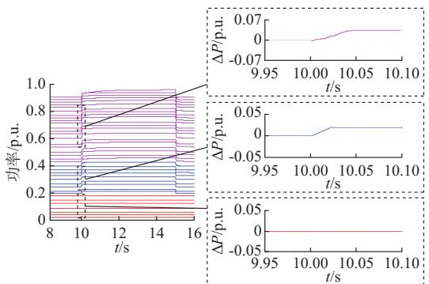  
(a) 测试场景1

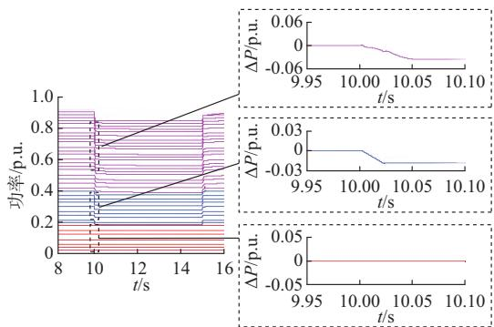  
(b) 测试场景2

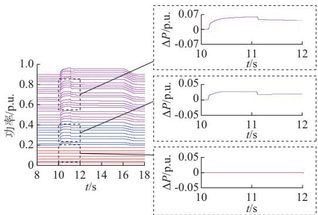  
(c) 测试场景3

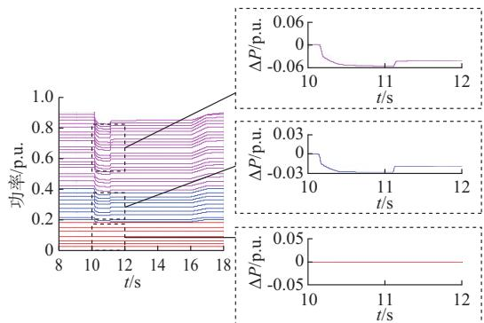  
(d) 测试场景4   
图2　不同风速下的风电机组调频响应曲线及其典型曲线形态  
Fig. 2 Frequency regulation response curves of wind turbines at different wind speeds and their typical curve patterns

# 2. 2　直驱型风电机组调频响应的原理分析

由上节风电机组调频响应的特性分析结果可知，工作于 3种风速区间内的风电机组由于控制模式不同，频率响应特性有明显差异，各自表现出了明显的聚群特性，可初步按照区间 1、2和 3将风电机组分为3群，原理说明如下。

1）区间1

在此区间内，机组的风速和转速较低，输出有功功率和转子动能均处于较低水平。根据附录 A 式（A4）给出的风机转子摇摆方程和式（A5）给出的风电机组机械功率计算公式，风电机组若响应系统频率的变化增加有功输出，将导致转速降低，极易造成风力机失速［20］ 。为保证机组稳定运行，此区域内风电机组不实施减载备用，也不参与系统调频。风电机组正常运行且有功出力大于0.2 p.u.时，风机响应系统频率变化。因此，区间 1对应的风速分割点分别为风机的切入风速和风机有功出力等于有功调频阈值 $P _ { \mathrm { t h } } ($ （本文模型为0.2 p.u.）时对应的风速，通常包含启动区与部分风速较低的MPPT区。

2）区间2

在此区间内，风速和风机转速提升， 控制下风机桨距角始终维持在0°，机组采用超速控制实现减载运行，并与综合惯量控制协同参与系统调频，控制框图如图3所示。图中：下标max、min分别

表示上、下限；P 为风电机组的电磁功率。

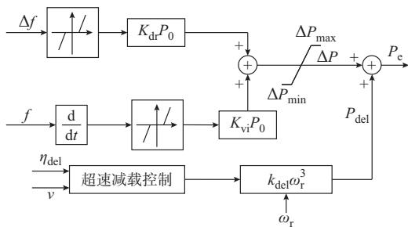  
图3 区间2的调频控制  
Fig. 3 Frequency regulation control of zone 2

值得注意的是，上述控制中的转子转速ω 通过直接采集发电机的转速得到。稳态运行时，超速减载控制基于当前风速和减载备用系数，使转子超速至减载运行转速。此时，机械功率与电磁功率平衡，转速保持稳定，减载功率跟踪方程为：

$$
P _ {\mathrm {d e l}} = k _ {\mathrm {d e l}} \omega_ {\mathrm {r}} ^ {3} \tag {3}
$$

$$
k _ {\mathrm {d e l}} = (1 - \eta_ {\mathrm {d e l}}) k _ {\mathrm {o p t}} \tag {4}
$$

式中： $P _ { \mathrm { d e l } }$ 为减载运行功率； $k _ { \mathrm { o p t } }$ 为最大功率跟踪系数； $; k _ { \mathrm { d e l } }$ 为减载运行跟踪系数； $; \eta _ { \mathrm { d e l } }$ 为减载备用系数［21］ 。

当系统频率跌落时，综合惯量控制将提高电磁功率输出，导致转速降低，风能利用系数提高，直至风力机捕获的机械功率与发电机输出的电磁功率达到新的平衡。该动态调节过程中风电机组各项主要

变量的仿真曲线如附录A图A2所示。当系统频率上升时，风电机组将通过进一步提高转速来降低有功输出，持续参与调频，若此过程中已达到风机转速上限，则需要通过增大桨距角辅助来降低有功输出。

当采用超速减载控制无法满足减载备用的要求时，通常由桨距角控制以实现减载备用。因此，区间2的最大风速为超速减载备用后风机转速恰好到达转速上限时对应的风速，即区间 2 和 3 的风速分割点。

# 3）区间 3

如图4所示，区间3内风电机组采用桨距角控制来实现减载运行，并与综合惯量控制协同参与系统调频。当系统频率跌落或升高时，综合惯量控制将提高或降低电磁功率输出，使转速偏离稳态值。此时，桨距角控制将实时调节桨距角，直至转速再次稳定在稳态转速。以频率跌落工况为例，上述动态调节过程中风电机组各项主要变量的仿真曲线如附录A图A3所示。因此，区间3的最大风速为风机的切出风速，该区间通常横跨部分 MPPT区、整个恒转速区和整个恒功率区。

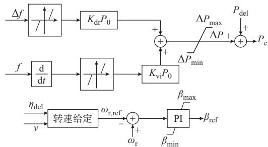  
图4 区间3的调频控制  
Fig. 4 Frequency regulation control of zone 3

综上，造成不同风速区间调频响应曲线形态差异的原理可总结如下：工作于同一风速区间内的风电机组的调频控制策略相同、响应特性相似，工作在不同风速区间内的风电机组的调频控制策略不同、响应特性各异，区间1不参与系统调频，区间2、3分别采用超速减载和桨距角减载来实现备用，风电机组在相同调节量下的调频响应速度有显著差异，采用桨距角控制实现减载运行的有功调节速度显著低于采用超速减载控制的情况。

# 3 直驱型风电场实用调频等值方法

根据上述原理分析，可提出如图 5所示的实用调频等值方法。假设场站内仅包含同型号的风电机组，则可按照其工作的风速将风电机组分为3群，分别被聚合成等值机1、2和3，分割风速分别为风电机

组有功出力等于 P 时对应的风速和超速减载备用后风机转速为上限时的风速。实际工程中，风电场的风速场景常常分布于某一区间，等值机数量将进一步减少，最多用 3台等值机即可表征整个场站的调频响应特性。

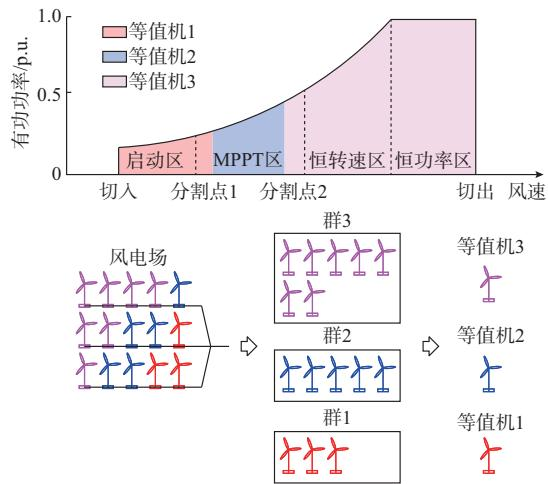  
图5 实用化三机等值分群方法  
Fig. 5 Practical three-machine equivalent clustering method

为验证上述实用等值方法对全风速场景的适应性，参照图 6所示的某 33×1.5 MW 直驱型风电场（主 要 参 数 见 附 录 B 表 B1），基 于 MATLAB/Simulink平台构建了其详细模型和等值模型，频率阶跃跌落至49.5 Hz，持续5 s后恢复，等值前后风电场的调频响应如附录B图B1所示。

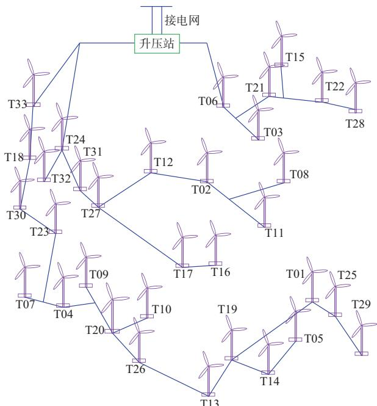  
图6 某实际风电场拓扑  
Fig. 6 Topology of actual wind farm

由附录B图B1可知，3个风速场景下风电场的单机等值模型和详细模型的调频响应一致，扰动全过程中有功功率的平均绝对偏差均小于 0.02 p.u.，证明工作于3个风速区间内的风电机组可以各自等值为一台等值机，且具备较高的等值精度。应用时，基于图5，根据各个风电机组的风速数据，按照当前型号风电机组的 2个分割点风速，将风电场内的风电机组分为 3群，每群用一台等值机表征即可。等值机参数和等值集电网络参数则参照文献［22］进行计算，可有效降低将电气距离较远的风电机组聚合为一台等值机时产生的误差，最多用 3台等值机即可表征整个场站的调频响应特性。需要注意的是，本文方法仅适用于电网有功功率供需失衡引起的频率扰动场景，应用所提等值方法的前提是场站内仅包含同型号的跟网型直驱风电机组，对于场站内包含多个型号或风电机组采用构网型控制的情况，还需进一步分析和研究。

# 4 仿真分析与验证

为了验证本文所提适用于电网频率响应特性分析的三机等值建模方法的有效性，本章以图 6所示的风电场为测试对象，从该风电场2022年数据库中随机抽取了两组机组间风速差距较大的数据，建立了其详细模型，与本文所提等值模型、单机等值模型、基于风速分区分群的多机等值模型和基于 K-means聚类算法的等值模型在频率扰动和功率扰动两种测试工况下进行分析和验证。

设置频率斜坡扰动测试和频率阶跃扰动测试的频率设定值为 49.5 Hz和 50.5 Hz，频率斜坡扰动测试的频率变化率 $\mathrm { \Delta } \mathcal { H } \pm 0 . 5 ~ \mathrm { H z } / \mathrm { s }$ ，仿真结果如图 7所示。4种等值模型的仿真平均耗时分别为 108、62、133、232 s，等值模型与详细模型的有功功率平均绝对偏差如附录 图 所示。

由上述仿真结果可知，采用基于风速分区和K-means的多机等值方法以及单机等值方法建立的风电场等值模型在频率扰动期间与详细拓扑模型的暂态和暂稳态响应均存在较大偏差。原因在于：基于上述方法分群后，同一群内风电机组的控制及响应特性不同，导致对应的等值机不能准确表征该群风机的动态特性。具体地，暂稳态偏差主要来源于第1群风电机组在频率扰动中产生的有功调节缺额，暂态偏差主要来源于超速减载控制与桨距角控制在不同风速区间内有功调节速度上的差距。采用本文方法建立的等值模型可准确表征不同风速对风电机组频率响应的影响，在两种风速场景和测试工况下均能精确跟踪风电场详细模型的频率响应特性，其

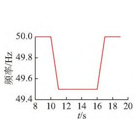  
(a)风速场景1的频率斜坡跌落扰动工况

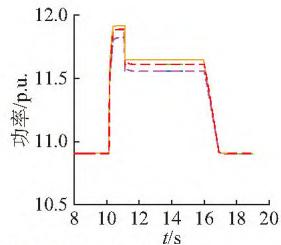

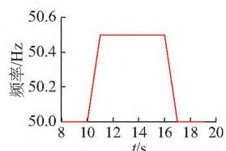  
(b)风速场景2的频率斜坡上升扰动工况

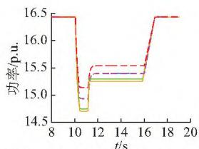

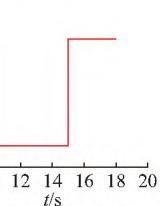

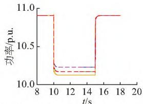  
(c)风速场景1的频率阶跃上升扰动工况

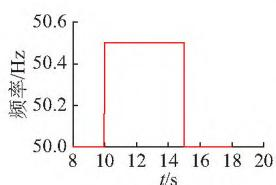  
(d)风速场景2的频率阶跃跌落扰动工况   
详细模型；--本文方法；—风速分区；  
单机等值；--K-means。  
图7　不同风速场景和频率扰动工况下的等值结果   
Fig. 7 Equivalent results for various wind speed scenarios and frequency disturbance conditions

等值精度均高于其他等值方法，同时，仿真计算耗时仅次于单机等值方法，证明了所提方法的正确性和高效性。

为进一步验证本文提出的实用等值方法对功率扰动工况的适应性，建立了如附录B图B3所示的由同步机、负荷和风电场组成的调频响应测试仿真系统，主要参数如附录B表B2所示。采用不同等值建模方法，风电场在负荷突增和突减工况（功率扰动量均为 4 MW）下的有功功率和系统频率的响应特性对比如附录B图B4所示，关键指标计算结果如附录B表 B3所示。结果表明，从系统频率最低点、暂稳态频率和频率曲线的平均绝对偏差 3种指标来看，本文所提等值模型精度最佳，其平均绝对偏差仅为单机等值模型的 ，明显优于其他等值模型，进

一步验证了本文方法的有效性。

# 5 结 语

本文构建了直驱型风电机组调频控制的通用电磁暂态模型，并以采用虚拟惯量控制、下垂控制、超速减载控制和桨距角减载控制协同的典型跟网型机组模型为例，基于其在不同风速区间调频响应的仿真分析，发现由于控制策略和响应速度的差异，不同风速场景下机组的调频响应具有显著的聚群特征，针对同型号机组组成的风电场，提出了三机实用调频等值方法。基于某实际风电场详细拓扑模型、本文所提等值模型、传统单机等值模型及两种典型多机等值的对比仿真，验证了所提方法的有效性。该方法无需复杂的优化算法，仅需按照机组风速即可实现等值分群，且等值机最多为3台，实现了对等值精度和计算量的兼顾。

本文所提等值方法的主要研究对象为采用跟网型控制的直驱型风电场，后续将进一步验证该方法对其他类别和组网方式新能源场站的适应性。

附录见本刊网络版（http：//www.aeps-info.com/aeps/ch/index.aspx），扫英文摘要后二维码可以阅读网络全文。

# 参 考 文 献

［1］滕贤亮，谈超，昌力，等 .高比例新能源电力系统有功功率与频率控制研究综述及展望［J］.电力系统自动化，2023，47（15）：12-35.  
TENG Xianliang， TAN Chao， CHANG Li， et al. Review andprospect of research on active power and frequency control inpower system with high proportion of renewable energy［J］.Automation of Electric Power Systems，2023，47（15）：12-35.  
［2］齐金玲，李卫星，晁璞璞，等.直驱风电场实用化等值方法［J］.电力自动化设备，2022，42（12）：50-57.  
QI Jinling， LI Weixing， CHAO Pupu， et al. Practical equivalentmethod for direct-driven wind farm ［J］. Electric Power， ， （ ）： -  
［3］张元，郝丽丽，戴嘉祺.风电场等值建模研究综述［J］.电力系统保护与控制， ，（ ）： -  
ZHANG Yuan， HAO Lili， DAI Jiaqi. Overview of theequivalent model research for wind farms［J］. Power SystemProtection and Control，2015，43（6）：138-146.  
［ ］董文凯，王洋，王海风 用于小信号稳定性分析的风电机群单机等值模型［］电网技术， ，（ ）： -  
DONG Wenkai， WANG Yang， WANG Haifeng. Single-machine equivalent model of a group of wind turbine generatorsfor small-signal stability analysis［J］. Power System Technology，， （ ）： -  
［5］HU Y L，WU Y K. Inertial response identification algorithm for the development of dynamic equivalent model of DFIG-based wind power plant ［J］. IEEE Transactions on Industry

Applications，2021，57（3）：2104-2113.  
［6］安之，沈沉，郑泽天，等 .考虑风电随机性的直驱风机风电场等值模型评价方法［J］.中国电机工程学报，2018，38（22）：6511-6520.  
AN Zhi， SHEN Chen， ZHENG Zetian， et al. Assessment method for equivalent models of wind farms based on directdriven wind generators considering randomness［J］. Proceedings of the CSEE，2018，38（22）：6511-6520.   
［7］奥博宇，王方政，陈磊，等 .风电机组变桨减载一次调频模型及聚合方法［J］. 电网技术，2023，47（4）：1360-1369.  
AO Boyu， WANG Fangzheng， CHEN Lei， et al. Primaryfrequency regulation model and aggregation of deloading windturbine generators with pitch angle adjustment［J］. Power SystemTechnology，2023，47（4）：1360-1369.  
［8］SHABANIKIA N，NIA A A，TABESH A， et al. Weighteddynamic aggregation modeling of induction machine-based windfarms［J］. IEEE Transactions on Sustainable Energy，2021，12（3）：1604-1614.  
［9］夏安俊，鲁宗相，闵勇，等 .双馈异步发电机风电场聚合模型研究［J］. 电网技术，2015，39（7）：1879-1885.  
XIA Anjun， LU Zongxiang， MIN Yong， et al. An aggregatedmodel of wind farm composed of doubly fed induction generators［J］. Power System Technology，2015，39（7）：1879-1885.  
［10］潘学萍，郭金鹏，孙晓荣，等.双馈风电场频率响应特性的频域等 值 建 模 方 法［J/OL］. 电 网 技 术［2024-09-27］. https：//doi.org/10.13335/j.1000-3673.pst.2024.0248.  
PAN Xueping， GUO Jinpeng， SUN Xiaorong， et al. Frequency domian equivalent modelling of frequency response characteristics for DFIG-based wind farms ［J/OL］. Power System Technology［2024-09-27］. https：//doi. org/10.13335/j. 1000-3673.pst.2024.0248.   
［11］FANG Q， ZHOU N， CHEN J C， et al. Low voltage ridethrough equivalence of centralized doubly-fed wind farm basedon particle swarm optimization ［C］// IEEE InternationalConference on Power Systems and Electrical Technology（PSET）， October 13-15，2022， Aalborg， Denmark.  
［12］刘素梅，王泽彭，毕天姝 .计及转子侧变换器控制切换模式差异的双馈风电场多机表征方法［J］.电力系统自动化，2023，47（14）：130-139.  
LIU Sumei， WANG Zepeng， BI Tianshu. Multi-machinecharacterization method for DFIG wind farms consideringdifference of control switching modes of rotor-side converters［J］. Automation of Electric Power Systems，2023，47（14）：130-139.  
［13］WANG T，GAO M Y，MI D K， et al. Dynamic equivalentmethod of PMSG-based wind farm for power system stabilityanalysis［J］. IET Generation， Transmission & Distribution，2020，14（17）：3488-3497.  
［14］贾科，孔繁哲，张旸，等.基于改进K-均值算法的双馈风场故障等值建模方法[I]电网技术.2023.47(10)：4161-4173  
JIA Ke， KONG Fanzhe， ZHANG Yang， et al. Faultequivalent modeling of doubly fed wind farm based on improvedK-means algorithm［J］. Power System Technology，2023，47（10）：4161-4173.  
［15］王磊，盖春阳，王恒 .基于改进 D-K聚类算法的直驱型风电场动态等值建模［］太阳能学报， ，（ ）： -

WANG Lei， GAI Chunyang， WANG Heng. Dynamic equivalence method of PMSG wind farms based on improved D-K clustering algorithm［J］. Acta Energiae Solaris Sinica，2021， （ ）： -   
［16］吴志鹏，裴建华，李银红 .基于低电压穿越功率特性的双馈风电场多机等值方法［J］.电力系统自动化，2022，46（19）：95-103.WU Zhipeng， PEI Jianhua， LI Yinhong. Multi-machineequivalent method for DFIG-based wind farm based on powercharacteristic of low voltage ride-through［J］. Automation ofElectric Power Systems，2022，46（19）：95-103.  
［17］姚琦，刘吉臻，胡阳，等.含异步变速风机的风电场一次调频等值建模与仿真［J］.电力系统自动化，2019，43（23）：185-192.YAO Qi， LIU Jizhen， HU Yang， et al. Equivalent modelingand simulation for primary frequency regulation of wind farmwith asynchronous variable-speed wind turbines［J］. Automationof Electric Power Systems，2019，43（23）：185-192.  
［18］韩平平，王凯鹏，吴红斌，等.含减载控制和虚拟惯量控制的直驱风电场等值建模方法［J］.电力系统及其自动化学报，2024，36（8）：142-149.HAN Pingping， WANG Kaipeng， WU Hongbin， et al.Equivalent modeling method for direct drive wind farm with loadshedding control and virtual inertia control［J］. Proceedings ofthe CSU-EPSA，2024，36（8）：142-149.  
［19］WU Y K， ZENG J J， LU G L， et al. Development of anequivalent wind farm model for frequency regulation［J］. IEEETransactions on Industry Applications，2020，56（3）：2360-

2374.   
［20］FAKHARI MOGHADDAM ARANI M，MOHAMED Y A R I. Dynamic droop control for wind turbines participating in primary frequency regulation in microgrids ［J］. IEEE Transactions on Smart Grid，2018，9（6）：5742-5751.   
［21］朱瑛，石琦，蔡寿国，等.基于二维动态减载和双层MPC的风储联合调频与功率优化分配［J］.电力自动化设备，2024，44（8）：1-8.ZHU Ying， SHI Qi， CAI Shouguo， et al. Wind-storage jointfrequency modulation and power optimization allocation basedon two-dimensional dynamic load reduction and two-layer MPC［J］. Electric Power Automation Equipment，2024，44（8）：1-8.  
［22］LI W X， CHAO P P， LIANG X D， et al. A practicalequivalent method for DFIG wind farms ［J］. IEEETransactions on Sustainable Energy，2018，9（2）：610-620.

（编辑 王梦岩）

# Practical Equivalent Method for Direct-drive Wind Farms Applicable to Frequency Response Analysis of Power Grids

ZHANG Lei1，2 ， CHAO Pupu3 ， JIN Yonglin3 ， LIU Zhihui3 ， LI Weixing1，3 ， LI Zhimin1

(1. School of Electrical Engineering and Automation, Harbin Institute of Technology, Harbin 150001, China;

2. State Key Laboratory of Renewable Energy Grid-integration (China Electric Power Research Institute), Beijing 100192, China;

3. School of Electrical Engineering, Dalian University of Technology, Dalian 116024, China)

Abstract: The participation of wind power in system frequency regulation is one of the important ways to enhance the frequency safety and stability level of the new power system. To efficiently analyze the frequency evolution mechanism of the system when wind power participates in frequency regulation, it is urgent to study the aggregation equivalent method of wind farms applicable to the frequency response characteristic analysis of power grids. This paper establishes a general frequency regulation control model for direct-drive wind turbines, and simulates and analyzes the frequency regulation response characteristics of direct-drive wind turbines operating at different operation points. It is found that wind turbines of the same model participating in system frequency regulation in different wind speed intervals have significant clustering characteristics. Based on this, a practical equivalent method for direct-drive wind farms applicable to the frequency response characteristic analysis of power grids is proposed. By establishing and comparing the detailed topological model of a wind farm, the equivalent model proposed in this paper, the traditional singlemachine equivalent model, and two typical multi-machine equivalent models in different operation scenarios, it is found that the equivalent performance of the proposed method is significantly better than the other equivalent methods. It can ensure the calculation speed while maintaining the simulation accuracy of the detailed station frequency response characteristics, and can better adapt to different wind speeds and disturbance scenarios.

This work is supported by National Natural Science Foundation of China (No. U22B20109).

Key words: direct-drive wind farm; frequency response; electromagnetic transient modeling; equivalent method