# 双导体有损频变均匀传输线的电磁暂态时域仿真模型研究

刘刚 1 ，温晓芳 1 ，郝世缘 1 ，纪锋 2

（1．华北电力大学电力工程系，河北省 保定市 071003；

2．先进输电技术国家重点实验室(全球能源互联网研究院有限公司)，北京市 昌平区 102209）

# Study on Electromagnetic Transient Time-domain Simulation Model of Lossy Frequency-dependent Uniform Transmission Line With Two-conductor

LIU Gang1 , WEN Xiaofang1 , HAO Shiyuan1 , JI Feng2

(1. Department of Electrical Engineering, North China Electric Power University, Baoding 071003, Hebei Province, China;

2. State Key Laboratory of Advanced Power Transmission Technology(Global Energy Interconnection Research Institute Co., Ltd.,)

Changping District, Beijing 102209, China)

ABSTRACT: The characteristic impedance and the transfer function are two important parameters in the electromagnetic transient time-domain simulation model of the multi-conductor transmission line. In this paper, taking the lossy frequency-dependent uniform double-conductor transmission line as the research object, the coupling amount of the transmission line is decoupled by using the phase-mode transformation. Then, in the mode domain, the time-domain equivalent circuit of the characteristic impedance is obtained by using the Pade approximation and the Foster circuit model. Simultaneously, the approximate function of the transfer function is got by using the Laplace inverse transformation and the Prony approximation. Based on the equivalent circuit and the approximation function, the electromagnetic transient time-domain simulation model of the double-conductor transmission line is established by adopting the MATLAB programming. Finally, this time-domain simulation model is used to achieve the voltage responses at the beginning and the terminal ends of the transmission line under the step excitation. The simulation results are compared with those using the PSCAD/EMTDC software to verify the time-domain model in this paper.

KEY WORDS: Bergeron model; Pade approximation; Prony approximation; frequency-dependent parameters; electromagnetic transient

摘要：特征阻抗和传输函数是多导体传输线电磁暂态时域仿

真模型中的 2 个重要参数。该文以有损频变均匀双导体传输线为研究对象，采用相模变换实现传输线耦合量的解耦，在模态域利用 Pade 近似和 Foster 电路模型获得特征阻抗的时域等效电路。同时利用拉普拉斯反变换和 Prony 近似得到传输函数的近似函数。该文基于等效电路和近似函数通过MATLAB 编程建立了双导体传输线的电磁暂态时域仿真模型。最后，用该时域仿真模型获得了阶跃激励下传输线首末端的电压响应，并与 PSCAD/EMTDC 软件仿真结果进行对比分析，验证了所提时域模型的有效性。

关键词：Bergeron 模型；Pade 近似；Prony 近似；频变参数；电磁暂态

DOI：10.13335/j.1000-3673.pst.2021.2318

# 0 引言

当电力系统发生短路、过电压或其它非正常运行工况时，传输线上的电压电流会在短时间内快速变化，可能会对电气设备甚至整个电力系统造成危害[1]，为了避免此类危害的发生，需要准确分析传输线和电气设备上的电压电流动态变化过程，因此建立准确的传输线暂态时域模型至关重要[2-3]。

最初提出的传输线时域模型为 Bergeron 模型，但 Bergeron 模型未考虑损耗分布特性和线路参数频变特性的影响[4]。而实际传输线的距离很长，并且线路参数是随频率变化的[5-7]，因此，很多学者开始研究频变传输线电磁暂态模型。Budner提出了时域瞬态解的频率相关线路模型，他在导纳线路模型中使用了加权函数的概念[8]。但是，加权函数高度振荡且较难精准拟合。之后，学者们开始在算法改进和拟合精度等方面展开研究。Snelson 提出了行

波法[9]，引入一个常数将电流和电压在时域中联系起来(其表达式与 Bergeron 模型中对波过程解释的表达式类似)，然后转换到频域中求解。Meyer 和Dommel 在 Snelson 的基础上，提出了前、反行波权函数法[10]，使计算结果更加准确，但是该方法含有多个卷积积分，计算复杂。为解决这一问题，Semlyen 通过指数函数来拟合线路的冲击响应和阶跃响应，并用插值法把复杂的卷积运算转化为递归公式的求解[11]。J.Marti 基于 Semlyen 思想，建立了更加有效的 J.Marti 模型，该模型采用渐进拟合法在频域中拟合特征阻抗和传输函数，将模拟滤波技术应用于频变传输线的暂态计算中[12]，该思想受到广泛应用，但由于拟合的有理式零极点被局限于实数域，在一定程度上降低了拟合的精确度。后来，Gustavsen 提出了矢量匹配法，该方法减少了计算量并使拟合精度进一步提高[13]，其不足为不同的初始迭代极点会导致不同的有理式；因此，有学者将矢量匹配法和遗传算法结合起来完成拟合[14]。这种方法精度较高且计算速度较快，但过程稍显复杂。

针对以上研究现状，为简化特征阻抗和传输函数的近似方法，本文将分别用 Pade 近似和 Prony近似实现特征阻抗和传输函数的拟合，该方法只需在已知线路参数的前提下，采用 Pade 近似得到特征阻抗的 Foster 等效电路，采用 Prony 近似得到传输函数的近似函数，然后将其应用于 Bergeron 模型，最终通过 MATLAB 编程获得适用于时域仿真的有损频变均匀传输线电磁暂态模型。本文所提方法无需迭代，更简单易懂，易于程序实现。为了验证方法的有效性，论文分别用所提方法建立的时域传输线模型和 PSCAD/EMTDC 对双导体传输线的阶跃响应进行仿真，并对比分析了二者的结果。

# 1 相模变换

为了分析方便，本文以双导体传输线为例，其电路图如图 1 所示。

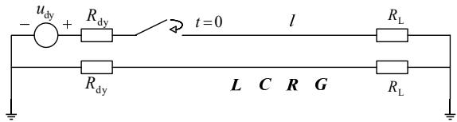  
图 1 双导体传输线电路图  
Fig. 1 Circuit of two-conductor transmission line

图中： $u _ { \mathrm { d y } }$ 表示电压源； $R _ { \mathrm { d y } }$ 表示电源内阻；l表示传输线长度； $R _ { \mathrm { L } }$ 表示负载电阻；L、C、R、G分别表示传输线的串联电感分布参数矩阵、并联电容分布参数矩阵、串联电阻分布参数矩阵、并联电导分布参数矩阵。电路的时域电报方程为

$$
- \frac {\partial \boldsymbol {u} _ {a b}}{\partial x} = \boldsymbol {R i} _ {a b} + \boldsymbol {L} \frac {\partial \boldsymbol {i} _ {a b}}{\partial t} \tag {1}
$$

$$
- \frac {\partial \boldsymbol {i} _ {a b}}{\partial x} = \boldsymbol {G} \boldsymbol {u} _ {a b} + \boldsymbol {C} \frac {\partial \boldsymbol {u} _ {a b}}{\partial t} \tag {2}
$$

式中： abu $\pmb { u } _ { a b } = \left[ { \begin{array} { c } { { { u _ { a } } } } \\ { { { u _ { b } } } } \end{array} } \right] , i _ { a b } = \left[ { \begin{array} { c } { { { i _ { a } } } } \\ { { { i _ { b } } } } \end{array} } \right]$ ai 。

电力系统中，传输线一般为循环对称结构，因此有：

$$
\left\{ \begin{array}{l} \boldsymbol {R} = \left[ \begin{array}{c c} R _ {\mathrm {z}} & 0 \\ 0 & R _ {\mathrm {z}} \end{array} \right], \boldsymbol {L} = \left[ \begin{array}{c c} L _ {\mathrm {z}} & L _ {\mathrm {h}} \\ L _ {\mathrm {h}} & L _ {\mathrm {z}} \end{array} \right] \\ \boldsymbol {G} = \left[ \begin{array}{c c} G _ {\mathrm {z}} & 0 \\ 0 & G _ {\mathrm {z}} \end{array} \right], \quad \boldsymbol {C} = \left[ \begin{array}{c c} C _ {\mathrm {z}} & C _ {\mathrm {h}} \\ C _ {\mathrm {h}} & C _ {\mathrm {z}} \end{array} \right] \end{array} \right. \tag {3}
$$

式(1)(2)变换到复频域，可得如下方程：

$$
- \frac {\partial \boldsymbol {U} _ {a b}}{\partial x} = (\boldsymbol {R} + s \boldsymbol {L}) \boldsymbol {I} _ {a b} \tag {4}
$$

$$
- \frac {\partial I _ {a b}}{\partial x} = (\boldsymbol {G} + s \boldsymbol {C}) \boldsymbol {U} _ {a b} \tag {5}
$$

式中： $U _ { a b } = { \left[ \begin{array} { l } { U _ { a } } \\ { U _ { b } } \end{array} \right] } , I _ { a b } = { \left[ \begin{array} { l } { I _ { a } } \\ { I _ { b } } \end{array} \right] } \circ$ 。

从式(3)知，R，L，G，C 均为对称矩阵。导线之间的电磁联系导致了互电感和互电容的产生，使 L 矩阵和C 矩阵中存在耦合元素，为方便计算，需采用相模变换实现解耦，相模变换示意图如图 2所示。

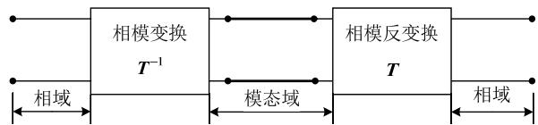  
图2 相模变换示意图  
Fig. 2 Schematic diagram of phase-mode transformation

以 ab 代表 2 个导体， $\alpha \beta$ 代表 2 个模量。从两相自然坐标系 $a b$ 到静止坐标系 $\alpha \beta$ 的 Clarke 变换为

$$
\left[ \begin{array}{l} \alpha \\ \beta \end{array} \right] = \boldsymbol {T} \left[ \begin{array}{l} a \\ b \end{array} \right], \quad \boldsymbol {T} = \frac {1}{\sqrt {2}} \left[ \begin{array}{l l} 1 & 1 \\ 1 & - 1 \end{array} \right] \tag {6}
$$

矩阵 T 的 2 个列向量是一组标准正交基，其转置矩阵即为自身的逆矩阵，故对应的 Clarke 反变换为

$$
\left[ \begin{array}{l} a \\ b \end{array} \right] = \boldsymbol {T} ^ {- 1} \left[ \begin{array}{l} \alpha \\ \beta \end{array} \right], \quad \boldsymbol {T} ^ {- 1} = \boldsymbol {T} ^ {\mathrm {T}} = \frac {1}{\sqrt {2}} \left[ \begin{array}{l l} 1 & 1 \\ 1 & - 1 \end{array} \right] \tag {7}
$$

由于该变换与频率无关，所以可将式(7)代入式(4)(5)，整理得到：

$$
- \frac {\partial \boldsymbol {U} _ {\alpha \beta}}{\partial x} = \boldsymbol {T} (\boldsymbol {R} + s \boldsymbol {L}) \boldsymbol {T} ^ {- 1} \boldsymbol {I} _ {\alpha \beta} \tag {8}
$$

$$
- \frac {\partial I _ {\alpha \beta}}{\partial x} = \boldsymbol {T} (\boldsymbol {G} + s \boldsymbol {C}) \boldsymbol {T} ^ {- 1} \boldsymbol {U} _ {\alpha \beta} \tag {9}
$$

在循环对称结构下， ${ \pmb T } ( { \pmb R } \mathrm { + } s { \pmb L } ) { \pmb T } ^ { 1 }$ 和 ${ \pmb T } ( \pmb G \mathrm { + } s \pmb C ) \pmb T ^ { \ - 1 }$

均是对角矩阵[15-16]。这样就利用 Clarke 变换实现了解耦，从而可以应用单导体传输线理论解决双导体问题。

# 2 复频域 Bergeron 等效电路

复频域下单导体传输线首末端的电压和电流可以用传输矩阵[17]表示为

$$
\begin{array}{l} \left[ \begin{array}{c} U (\mathrm {k}, s) \\ I (\mathrm {k}, s) \end{array} \right] = \\ \left[ \begin{array}{c c} \frac {\mathrm {e} ^ {\gamma (s) l} + \mathrm {e} ^ {- \gamma (s) l}}{2} & - Z (s) \frac {\mathrm {e} ^ {\gamma (s) l} - \mathrm {e} ^ {- \gamma (s) l}}{2} \\ \frac {1}{Z (s)} \frac {\mathrm {e} ^ {\gamma (s) l} - \mathrm {e} ^ {- \gamma (s) l}}{2} & - \frac {\mathrm {e} ^ {\gamma (s) l} + \mathrm {e} ^ {- \gamma (s) l}}{2} \end{array} \right] \left[ \begin{array}{l} U (\mathrm {m}, s) \\ I (\mathrm {m}, s) \end{array} \right] \tag {10} \\ \end{array}
$$

式中：k 代表线路首端；m 代表线路末端；U(k,s)，I(k,s)分别表示线路首端的电压和电流，传输函数$G ( s ) { = } \mathbf { e } ^ { - \gamma ( s ) l }$ ；传播常数 $\gamma ( s ) = \sqrt { ( R + s L ) ( G + s C ) }$ ；特征阻抗 $Z ( s ) = \sqrt { \frac { ( R + s L ) } { ( G + s C ) } } ~ ; ~ U ( \mathrm { m } , s ) \setminus { \cal I } ( \mathrm { m } , s )$ 分别表示线路末端的电压和电流。

用式第一行减去式(10)第二行乘以 Z(s)并整理得到线路首端电压：

$$
\begin{array}{l} U (\mathrm {k}, s) = I (\mathrm {k}, s) Z (s) + \\ \left[ \frac {U (\mathrm {m} , s)}{Z (s)} + I (\mathrm {m}, s) \right] \mathrm {e} ^ {- \gamma (s) l} Z (s) \tag {11} \\ \end{array}
$$

类似地，线路末端电压

$$
\begin{array}{l} U (\mathrm {m}, s) = I (\mathrm {m}, s) Z (s) + \\ \left[ \frac {U (\mathrm {k} , s)}{Z (s)} + I (\mathrm {k}, s) \right] \mathrm {e} ^ {- \gamma (s) l} Z (s) \tag {12} \\ \end{array}
$$

根据式(11)(12)可得复频域下 Bergeron 等效电路如图 3 所示。

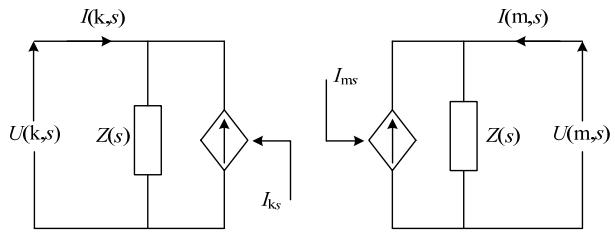  
图 3 复频域 Bergeron 等效电路  
Fig. 3 Bergeron equivalent circuit in complex frequency domain

图 3 中， $I _ { { \bf k } s }$ 和 $I _ { \mathrm { m s } }$ 为线路首末端的历史电流源，如式(13)(14)所示。

$$
\begin{array}{l} I _ {\mathrm {k} s} = \left(\frac {U (\mathrm {m} , s)}{Z (s)} + I (\mathrm {m}, s)\right) \mathrm {e} ^ {- \gamma (s) l} (13) \\ I _ {\mathrm {m} s} = \left(\frac {U (\mathrm {k} , s)}{Z (s)} + I (\mathrm {k}, s)\right) \mathrm {e} ^ {- \gamma (s) l} (14) \\ \end{array}
$$

从图中可知，求得单导体传输线首末端电压电流的前提是特征阻抗和传输函数的准确拟合。

# 3 基于Pade近似的特征阻抗拟合

本文对于特征阻抗拟采用 Pade 近似，Pade 近似是一种有理分式逼近法，以尽量快的速度与泰勒级数展开式相匹配。如对 $( \frac { 1 + 2 x } { 1 + x } ) ^ { \frac { 1 } { 2 } }$ 做近似，Pade 近1 x似采用 5 阶的有理分式得到的结果与标准值的精确度仅差在 $1 0 ^ { - 8 }$ 数量级，而泰勒级数展开式需要取11 项才能达到相同精度。此外，Pade 近似往往比截断的泰勒级数准确，而且当泰勒级数不收敛时，Pade 近似往往仍可行，所以多应用于基于计算机的科学计算中。其基本思路为将原函数近似为有理多项式相除的形式[18-19]，本文中 Pade 近似函数用 $Z _ { \mathrm { d } } ( s )$ 表示：

$$
Z (s) \approx Z _ {\mathrm {d}} (s) = \frac {y _ {1} s ^ {n} + y _ {2} s ^ {n - 1} + \cdots + y _ {n} s + y _ {n + 1}}{x _ {1} s ^ {n} + x _ {2} s ^ {n - 1} + \cdots + x _ {n} s + 1} \tag {15}
$$

式(15)两端同乘以分母并整理得

$$
\begin{array}{l} y _ {1} s ^ {n} + y _ {2} s ^ {n - 1} + \dots + y _ {n} s + y _ {n + 1} - Z (s) x _ {1} s ^ {n} - \\ Z (s) x _ {2} s ^ {n - 1} - \dots - Z (s) x _ {n} s = Z (s) \tag {16} \\ \end{array}
$$

式中有 2n+1 个待定系数，选择 2n+1 个频点构成以下方程组，求解即可。

$$
\boldsymbol {M} \boldsymbol {B} = \boldsymbol {Z} \tag {17}
$$

其中，

$$
M =
$$

$$
\begin{array}{l} \left[ \begin{array}{c c c c c c c} s _ {1} ^ {n} & \dots & s _ {1} & 1 & Z (s _ {1}) s _ {1} ^ {n} & \dots & Z (s _ {1}) s _ {1} \\ \vdots & \ddots & \vdots & \vdots & \vdots & \ddots & \vdots \\ s _ {2 n + 1} ^ {n} & \dots & s _ {2 n + 1} & 1 & Z (s _ {2 n + 1}) s _ {2 n + 1} ^ {n} & \dots & Z (s _ {2 n + 1}) s _ {2 n + 1} \end{array} \right] \\ \boldsymbol {B} = \left[ \begin{array}{l l l l l l} y _ {1} & \dots & y _ {n} & y _ {n + 1} & x _ {1} & \dots & x _ {n} \end{array} \right] \\ \boldsymbol {Z} = \left[ \begin{array}{l l l} Z (s _ {1}) & \dots & Z (s _ {2 n + 1}) \end{array} \right] ^ {\mathrm {T}} \\ \end{array}
$$

至此，可求出式(16)中的 x、y 值，也就得到了特征阻抗的有理近似函数，之后，将其展开为部分分式和的形式，如式(18)所示。

$$
\begin{array}{l} Z _ {\mathrm {d}} (s) = \\ \frac {y _ {1} s ^ {n} + y _ {2} s ^ {n - 1} + \cdots + y _ {n} s + y _ {n + 1}}{x _ {1} s ^ {n} + x _ {2} s ^ {n - 1} + \cdots + x _ {n} s + 1} = k + \sum_ {j = 1} ^ {n} \frac {r _ {j}}{s - p _ {j}} \tag {18} \\ \end{array}
$$

首先将式(18)中的 k 等效为一个电阻，然后将每一项分式都等效为一个 RC 并联模块。这样就得到了特征阻抗的Foster模型(即一系列RC并联模块的串联)，如图 4 所示，其中 $C _ { j }$ 和 $R _ { j }$ 由有理近似函数的极点和留数确定。

单个 $R _ { j } C _ { j }$ 并联模块如图 5 所示。

根据图 5，求出复频域下该电路的阻抗，并将其与部分分式建立等式关系，如式(19)。

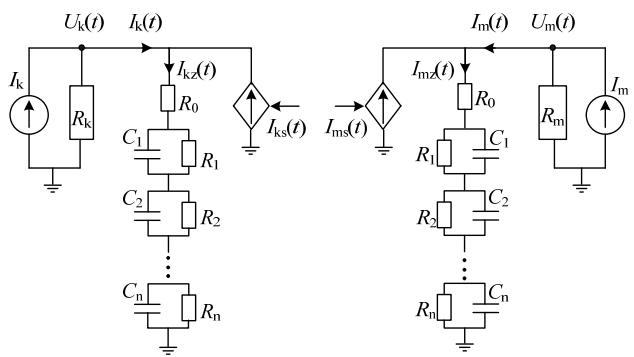  
图 4 Foster 等效模型

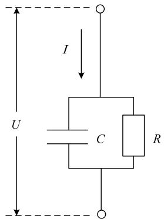  
Fig. 4 Foster equivalent model   
图 5 $R _ { j } C _ { j }$ 并联模块  
Fig. 5 $R _ { j } C _ { j }$ parallel module

$$
Z _ {j} = \frac {\frac {R _ {j}}{s C _ {j}}}{\frac {1}{s C _ {j}} + R _ {j}} = \frac {\frac {1}{C _ {j}}}{s - \frac {- 1}{C _ {j} R _ {j}}} = \frac {r _ {j}}{s - p _ {j}} \tag {19}
$$

为方便计算，去掉极点和留数的虚部，但拟合效果仍比较理想(从图 9和图 10 中可知)。经整理得Foster模型中的电容和电阻值如式(20)所示。

$$
\left\{ \begin{array}{l} C _ {j} = 1 / r _ {j} \\ R _ {j} = - r _ {j} / p _ {j} \end{array} \right. \tag {20}
$$

# 4 基于Prony 近似的传输函数拟合

如果用 Pade 近似来拟合传输函数，会得到一些虚部不可忽略的极点和留数，在之后进行历史电流源的计算时难以处理，所以本文换一种思路，采用 Prony近似拟合传输函数。

Prony 近似采用指数函数的线性组合来描述等间距采样数据，该算法通过求解常系数线性方程组来得到近似函数，避免了非线性方程组的求解，广泛应用于电力系统响应信号分析、电磁暂态过程以及各种控制系统的协调设计研究中[20]，其基本思路如下：

设原函数为 $g ( t )$ ，近似函数为 $g _ { \mathrm { d } } ( t )$ ，将 $g _ { \mathrm { d } } ( t )$ 由$2 n$ 个等间距采样点表示[21-22]

$$
g _ {\mathrm {d}} (t) = \sum_ {j = 1} ^ {n} r _ {j} \mathrm {e} ^ {p _ {j} t} \tag {21}
$$

可知式(21)中有 2n 个参数，分别为留数 $r _ { j }$ 和极点 $p _ { j }$ ，每个采样点对应原函数中一个时刻的值：

$$
g (i T) = g _ {i}, i = 0, 1, \dots , 2 n - 1 \tag {22}
$$

式中 T为采样周期，第一个采样点为原点。

$$
z _ {j} = \mathrm {e} ^ {p _ {j} T}, j = 1, \dots , n \tag {23}
$$

结合式，得：

$$
g _ {i} = \sum_ {j = 1} ^ {n} r _ {j} z _ {j} ^ {i}, i = 0, 1, \dots , 2 n - 1 \tag {24}
$$

此时引入变量 $\alpha _ { i } ,$ ，有：

$$
\sum_ {i = 0} ^ {n} \alpha_ {i} z ^ {i} = \prod_ {j = 1} ^ {n} \left(z - z _ {j}\right), \alpha_ {n} = 1 \tag {25}
$$

根据式(24)和(25)，可得：

$$
\begin{array}{l} \sum_ {i = 0} ^ {n} g _ {k + i} \alpha_ {i} = \sum_ {i = 0} ^ {n} \left(\sum_ {j = 1} ^ {n} r _ {j} z _ {j} ^ {k + i}\right) \alpha_ {i} = \\ \sum_ {j = 1} ^ {n} r _ {j} z _ {j} ^ {k} \left(\sum_ {i = 0} ^ {n} \alpha_ {i} z _ {j} ^ {i}\right) = 0, k = 0, 1, \dots , n - 1 \tag {26} \\ \end{array}
$$

进而：

$$
\sum_ {i = 0} ^ {n - 1} g _ {k + i} \alpha_ {i} = - g _ {k + n}, k = 0, 1, \dots , n - 1 \tag {27}
$$

由式(27)求出 $a _ { i } ;$ ；将 $a _ { i }$ 代入式(25)，求出 $z _ { j } { \bf { ; } }$ ；根据式(23)，可得 $p _ { j } { \bf { ; } }$ ；将已求出的值代入式(24)，求得$r _ { j } ,$ ，如此可得近似函数 $g _ { \mathrm { d } } ( t )$ 。

为简化计算，先对传播常数做适当变形，具体推导过程见附录 A。

$$
(R + s L) (G + s C) =
$$

$$
L C \left[ \left[ s + \frac {1}{2} \left(\frac {R}{L} + \frac {G}{C}\right) \right] ^ {2} - \frac {\left(R C - G L\right) ^ {2}}{4 L ^ {2} C ^ {2}} \right] \tag {28}
$$

令 | |RC GL   ， $\Delta = \frac { \mid { \cal R } C - G L \mid } { 2 L C } , c = \frac { 1 } { 2 } ( \frac { R } { L } + \frac { G } { C } )$ ，传播常数可表示为

$$
\gamma (s) = \sqrt {L C} \sqrt {(s + c) ^ {2} - \Delta^ {2}} \tag {29}
$$

令 $\nabla = l { \sqrt { L C } } = { \frac { l } { \nu } }$ ，波速 $\nu { = } \frac { 1 } { \sqrt { L C } }$ ，则传输函 数为

$$
G (s) = \mathrm {e} ^ {- \nabla \sqrt {(s + c) ^ {2} - \Delta^ {2}}} \tag {30}
$$

表 1 为拉普拉斯变换对[23]。

表1 拉普拉斯变换对  
Table 1 Laplace transform pairs   

<table><tr><td>时域形式</td><td>复频域形式</td></tr><tr><td>e-ctδ(t-∇)+e-ctΔ∇/√t2-∇2I1(Δ√t2-∇2)ε(t-∇)</td><td>e-∇√(s+c)2-Δ2</td></tr><tr><td>e-c∇δ(t-∇)+ε(t-∇)*∑j=1n rjepl</td><td>(e-c∇+∑j=1n(rj/s-pj)e-s∇</td></tr><tr><td>riepi</td><td>ri/s-pi</td></tr></table>

由表 1 可知传输函数的拉普拉斯反变换为

$$
\begin{array}{l} g (t) = \mathrm {e} ^ {- c t} \delta (t - \nabla) + \\ \mathrm {e} ^ {- c t} \frac {\Delta \nabla}{\sqrt {t ^ {2} - \nabla^ {2}}} I _ {1} \left(\Delta \sqrt {t ^ {2} - \nabla^ {2}}\right) \varepsilon (t - \nabla) \tag {31} \\ \end{array}
$$

令

$$
I (t) = \mathrm {e} ^ {- c t} \frac {\Delta \nabla}{\sqrt {t ^ {2} - \nabla^ {2}}} I _ {1} \left(\Delta \sqrt {t ^ {2} - \nabla^ {2}}\right) \varepsilon (t - \nabla) \tag {32}
$$

式(31)中含有贝塞尔函数 $I _ { 1 } ( \Delta \sqrt { t ^ { 2 } - \nabla ^ { 2 } } )$ ，故先对 $I ( t )$ 作 Prony 近似，得到其近似函数：

$$
I _ {\mathrm {d}} (t) = \sum_ {j = 1} ^ {n} r _ {j} \mathrm {e} ^ {p _ {j} t} \tag {33}
$$

当 $C { = } 7 . 3 3 { \times } 1 0 ^ { - 1 2 } \mathrm { F / m }$ ， $L { = } 1 . 5 2 { \times } 1 0 ^ { - 6 } \mathrm { H / m }$ ， $R =$ $1 0 ^ { - 6 } \Omega / \mathrm { m }$ ， $G { = } 1 0 ^ { - 1 2 } \mathrm { S } / \mathrm { m }$ 时，求解式(32)的近似函数，去掉实部为正的极点和小于 ${ { 1 0 } ^ { - 1 0 } }$ 的留数，将式(32)和式(33)进行对比，同时给出二者的相对误差，如图 6 所示，其相对误差的最大值为 $1 . 0 4 6 3 { \times } 1 0 ^ { - 9 } \%$ 。由此可知 $I ( t )$ 与 $I _ { \mathrm { d } } ( t )$ 的吻合程度较好。

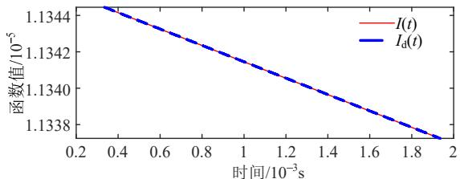

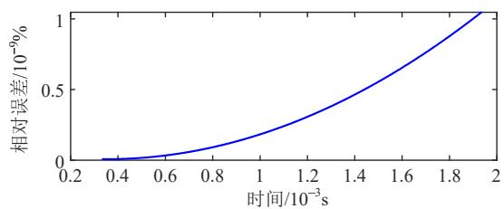  
图 6 $I ( t ) .$ 与 $I _ { \mathrm { d } } ( t )$ 对比及相对误差  
Fig. 6 Comparison and relative error of I(t) and $I _ { \mathrm { d } } ( t )$

将式(33)代入式(31)得：

$$
g _ {\mathrm {d}} (t) = \mathrm {e} ^ {- c \nabla} \delta (t - \nabla) + \varepsilon (t - \nabla) * \sum_ {j = 1} ^ {n} r _ {j} \mathrm {e} ^ {p _ {j} t} \tag {34}
$$

$g _ { \mathrm { d } } ( t ) \underset { = \pm } { \mathscr { y } } _ { }$ 拉氏变换后，即得传输函数的近似函数，如式(35)所示，其控制框图如图 7 所示。

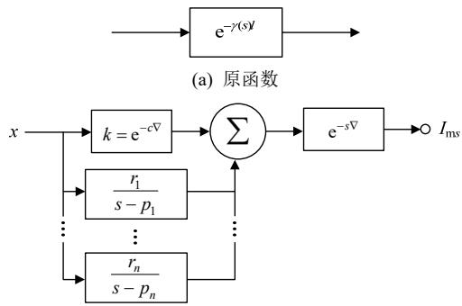  
(b) 近似函数  
图7 传输函数控制框图  
Fig. 7 Block diagram of transfer function control

$$
G _ {\mathrm {d}} (s) = \left(\mathrm {e} ^ {- c \nabla} + \sum_ {j = 1} ^ {n} \frac {r _ {j}}{s - p _ {j}}\right) \mathrm {e} ^ {- s \nabla} \tag {35}
$$

# 5 历史电流源的计算

根据图 4 并运用文献[24]中的方法将电路中所有电压源等效为诺顿电流源，然后获得电阻系数矩阵 ${ \cal K } _ { \mathrm { R } }$ 、电容系数矩阵 $K _ { \mathrm { C } }$ 和电感系数矩阵 $K _ { \mathrm { L } }$ 。

当电阻 R 连接在节点 i 和 j 之间时，电阻系数矩阵 $\pmb { K } _ { \mathrm { r } }$ 中， $\scriptstyle K _ { \mathrm { r } } ( i , i ) = R ^ { - 1 } , K _ { \mathrm { r } } ( i , j ) = R ^ { - 1 } , K _ { \mathrm { r } } ( j , i ) = - R ^ { - 1 }$ ，$\pmb { K } _ { \mathrm { p } } ( j , j ) { = } { R } ^ { - 1 }$ ， 其 余 元 素 为 0 。 最 后 求 和 得 到$K _ { \mathrm { { R } } } = \sum _ { R } K _ { \mathrm { { r } } }$ R 。

当电容 C 连接在节点 i 和 j 之间时，电容系数矩阵 $\pmb { K } _ { \mathrm { c } }$ 中， $\pmb { K } _ { \mathrm { c } } ( i , i ) { = } C$ ， $\pmb { K } _ { \mathrm { c } } ( i , j ) { = } - C$ ， $\pmb { K } _ { \mathrm { c } } ( j , i ) { = } { - } C$ ，$\pmb { K } _ { \mathrm { c } } ( j , j ) { \mathrm { = } } C ,$ ，其余元素为0。最后求和得到 $K _ { \mathrm { c } } = \sum _ { C } K _ { \mathrm { c } }$ 。

当电感 L 连接在节点 i 和 j 之间时，电感系数矩阵 $\pmb { K } _ { 1 }$ 中， $\boldsymbol { K } _ { 1 } ( i , i ) { = } \boldsymbol { L } ^ { - 1 }$ ， $K _ { 1 } ( i , j ) { = } { \_ } L ^ { - 1 }$ ， $K _ { 1 } ( j , i ) { = } { \_ } L ^ { - 1 }$ ，$\boldsymbol { K } _ { 1 } ( j , j ) { = } \boldsymbol { L } ^ { - 1 }$ ， 其 余 元 素 为 0 。 最 后 求 和 得 到$K _ { \mathrm { L } } = \sum _ { L } K _ { \mathrm { l } }$ 。

接下来建立状态方程：

$$
\boldsymbol {K} _ {\mathrm {C}} \ddot {\boldsymbol {\Psi}} + \boldsymbol {K} _ {\mathrm {R}} \dot {\boldsymbol {\Psi}} + \boldsymbol {K} _ {\mathrm {L}} \boldsymbol {\Psi} = \boldsymbol {i} _ {\mathrm {d y}} \tag {36}
$$

式中： ${ \pmb { \psi } } = \int { \pmb { \varphi } } \mathrm { d } t$ 为节点电位积分列向量； $\pmb { \varphi }$ 为节点电位向量； $\pmb { i } _ { \mathrm { d y } }$ 为节点电流列向量。

采用直接时间积分法求解线路的节点电压，直接积分法的迭代格式如下[24]：

$$
\begin{array}{l} \left(\frac {1}{\Delta t} \boldsymbol {K} _ {1} + \beta \boldsymbol {K} _ {2}\right) \boldsymbol {\varphi} _ {n + 1} = \\ \left[ \frac {1}{\Delta t} \boldsymbol {K} _ {1} - (1 - \beta) \boldsymbol {K} _ {2} \right] \boldsymbol {\varphi} _ {n} + \beta \boldsymbol {i} _ {\mathrm {d y}} \tag {37} \\ \end{array}
$$

式中： $\Delta t$ 为时间步长； $\beta$ 取值与积分算法有关，本 文采用后差法，故 $\beta { = } 1$ ； $\pmb { K } _ { 1 }$ ， $\pmb { K } _ { 2 }$ 分别为

$$
\boldsymbol {K} _ {1} = \left[ \begin{array}{c c} \boldsymbol {K} _ {\mathrm {C}} & \boldsymbol {0} \\ \boldsymbol {0} & \boldsymbol {E} \end{array} \right], \quad \boldsymbol {K} _ {2} = \left[ \begin{array}{c c} \boldsymbol {K} _ {\mathrm {R}} & \boldsymbol {K} _ {\mathrm {L}} \\ - \boldsymbol {E} & \boldsymbol {0} \end{array} \right]
$$

根据式(37)求得线路节点电压，运用欧姆定律求得各支路电流，然后进一步求解历史电流源，以下先进行历史电流源的推导。

根据图 3 末端电路可知：

$$
\frac {U (\mathrm {m} , s)}{Z (s)} = I _ {\mathrm {m s}} + I (\mathrm {m}, s) \tag {38}
$$

将式(38)代入式(13)，得：

$$
I _ {\mathrm {k} s} = (2 I (\mathrm {m}, s) + I _ {\mathrm {m} s}) \mathrm {e} ^ {- \gamma (s) l} \tag {39}
$$

同理可得：

$$
I _ {\mathrm {m} s} = (2 I (\mathrm {k}, s) + I _ {\mathrm {k} s}) \mathrm {e} ^ {- \gamma (s) l} \tag {40}
$$

根据式(39)和式(40)可得到如图 8 所示的电流控制框图：

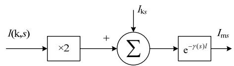  
(a)Ims

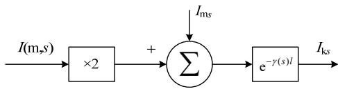  
(b)Iks   
图 8 电流控制框图  
Fig. 8 Current control block diagram

为描述方便，令：

$$
I _ {\mathrm {m}} = 2 I (\mathrm {m}, s) + I _ {\mathrm {m s}} \tag {41}
$$

$$
I _ {\mathrm {k}} = 2 I (\mathrm {k}, s) + I _ {\mathrm {k s}} \tag {42}
$$

从图 8 可知，历史电流源的求解需用到传输函数，而此时传输函数已近似为式(35)，故以下将式(35)代入式(39)和式(40)求解 $I _ { \mathrm { k } s }$ 和 $I _ { \mathrm { m s } }$ 。

本文先考虑 $I _ { \mathrm { k } s }$ 和 $I _ { \mathrm { m s } }$ 的延时，即根据波从线路首端到末端的传输时间来确定，然后处理 $G _ { \mathrm { d } } ( s )$ 中的部分分式和，根据表 1第三行所给的拉氏变换对可知， $G _ { \mathrm { d } } ( s )$ 中的部分分式和经拉普拉斯氏反变换为指数和的形式，这样便可应用递归卷积来获得历史电流源，具体计算步骤如下[17,25]。

$$
I _ {\mathrm {k s} j} (t) = r _ {j} \int_ {\tau} ^ {t} \mathrm {e} ^ {- p _ {j} T} I _ {\mathrm {m}} \mathrm {d} T \tag {43}
$$

式中 $I _ { \mathrm { k } s j } ( t )$ 表示 t 时刻第 j 个指数的线路首端的历史电流源。对于步长为 Δt的单步长，式(43)变为

$$
I _ {\mathrm {k s j}} (t) = \mathrm {e} ^ {- p _ {j} \Delta t} I _ {\mathrm {m}} (t - \Delta t) + \int_ {0} ^ {\Delta t} r _ {j} \mathrm {e} ^ {- p _ {j} T} u (t - T) \mathrm {d} T \tag {44}
$$

式中：u(t–T)为输入信号； $I _ { \mathrm { k } s j } ( t )$ 由 $I _ { \mathrm { m } } ( t { - } \Delta t )$ 和单步长积分得到。若在步长时间内输入为恒定常数，可将其从积分号中提出，即：

$$
I _ {\mathrm {k s} j} (t) = \mathrm {e} ^ {- p _ {j} \Delta t} I _ {\mathrm {m}} (t - \Delta t) + u (t - \Delta t) \int_ {0} ^ {\Delta t} r _ {j} \mathrm {e} ^ {- p _ {j} T} \mathrm {d} T =
$$

$$
\mathrm {e} ^ {- p _ {j} \Delta t} I _ {\mathrm {m}} (t - \Delta t) + \frac {r _ {j}}{p _ {j}} (1 - \mathrm {e} ^ {- p _ {j} \Delta t}) u (t - \Delta t) \tag {45}
$$

这样便求得 t 时刻第 j 个指数的线路首端历史电流源，之后将每个指数对应的历史电流源求得并相加，获得 t 时刻线路首端的历史电流源，类似地可求出该时刻线路末端的历史电流源。随着时间的增加，历史电流源不断更新，节点电压也随之改变。

根据第 3 节所述方法，得到模量下特征阻抗的Foster 等效模型；根据第 4 节所述方法，得到传输函数的逼近函数，运用本节理论列写系统状态方程并更新历史电流源，进而得到一种新的求解频变传输线电磁暂态时域响应的方法。

# 6 算例分析

以图 1 所示电路作为算例，进行本文所提模型的有效性验证。输电线路参数如表 2 所示。

表 2 线路参数表  
Table 2 Line parameters   

<table><tr><td>激励源us/kV</td><td>线路长度l/km</td><td>电源内阻Rs</td><td>负载电阻RL</td></tr><tr><td>1</td><td>100</td><td>1</td><td>1</td></tr></table>

图中 L，C，R，G值如下：

$$
\boldsymbol {L} = \left[ \begin{array}{l l} 1. 4 2 9 8 5 1 0 6 7 6 9 5 5 9 & 0. 1 7 8 8 6 7 2 8 8 6 5 3 0 6 6 9 \\ 0. 1 7 8 8 6 7 2 8 8 6 5 3 0 6 6 9 & 1. 4 2 9 8 5 1 0 6 7 6 9 5 5 9 \end{array} \right] \times
$$

$$
1 0 ^ {- 6} \mathrm {H / m}
$$

$$
\boldsymbol {C} = \left[ \begin{array}{c c} 8. 1 9 4 4 0 2 2 7 8 9 1 5 3 7 & - 1. 0 6 1 3 5 1 9 7 2 6 0 2 1 6 5 9 \\ - 1. 0 6 1 3 5 1 9 7 2 6 0 2 1 6 5 9 & 8. 1 9 4 4 0 2 2 7 8 9 1 5 3 7 \end{array} \right] \times
$$

$$
1 0 ^ {- 1 2} \mathrm {F / m}
$$

$$
\boldsymbol {R} = \left[ \begin{array}{c c} 1. 0 0 0 0 2 8 2 4 & 0 \\ 0 & 1. 0 0 0 0 2 8 2 4 \end{array} \right] \times 1 0 ^ {- 5} \Omega / \mathrm {m}
$$

$$
\boldsymbol {G} = \left[ \begin{array}{l l} 1 & 0 \\ 0 & 1 \end{array} \right] \times 1 0 ^ {- 1 1} \mathrm {S / m}
$$

运用 Clarke变换将 L，C，R，G变为模量后进行特征阻抗和传输函数的近似。

# 6.1 特征阻抗的近似计算

经 MATLAB 编程计算可知 α 模阻抗 $Z _ { a } \ =$ 474.9002Ω， $\beta$ 模阻抗 $Z _ { \beta } = 3 6 7 . 6 3 7 6 \Omega$ ，留数和极点分别如附录表 B1、B3 所示，其对应的电容和电阻值如附录表 B2、B4 所示。将近似函数与原函数进行对比，其幅频特性、相频特性以及二者的相对误差如图 9、10 所示，相对误差的最大值分别为0.0768%、0.1248%。

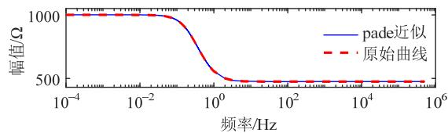

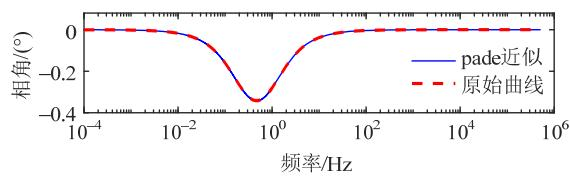

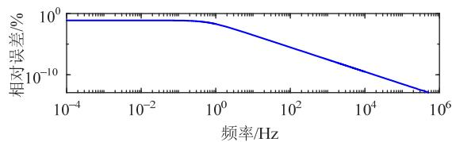  
图9 模特征阻抗近似函数与原函数对比  
Fig. 9 Comparison between approximate function and original function of α mode characteristic impedance

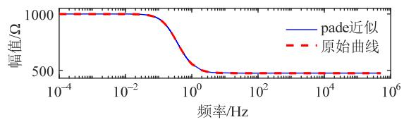

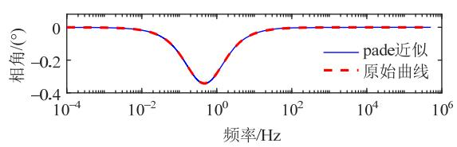

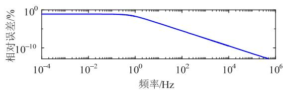  
图10 β 模特征阻抗近似函数与原函数对比  
Fig. 10 Comparison between approximate function and original function of β mode characteristic impedance

根据附录表B2和附录表B4可将模态域下的特征阻抗用 Foster模型表示出来，即每个特征阻抗由6 组 RC 并联模块和 1 个单独的电阻支路构成拟合，具体示意图见附录图 C1。

# 6.2 传输函数的近似计算

采用Prony近似可得α模和β模传输函数的留数和极点如附录表 B5、B6 所示，分别将其近似函数与原函数进行对比，如图 11、12 所示，其相对误差的最大值分别为 $3 . 7 5 1 3 \times 1 0 ^ { - 4 } \%$ 、0.0019%。

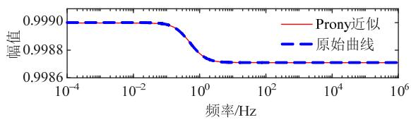

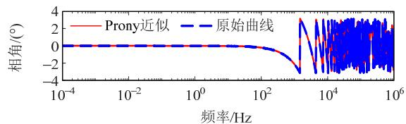

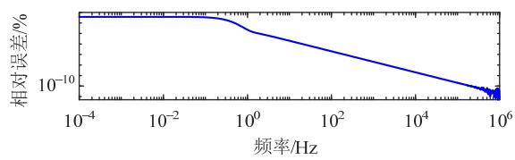  
图11 α 模传输函数近似函数与原函数对比  
Fig. 11 Comparison between approximate function and original function of α mode transfer function

从图 9—12可以看出，近似函数的幅频特性、相频特性与原函数的幅频特性、相频特性的吻合程度较好，最大相对误差不超过 0.2%。

# 6.3 仿真与对比分析

# 6.3.1 MATLAB 编程

根据附录图C1并运用式(36)建立该算例的状态

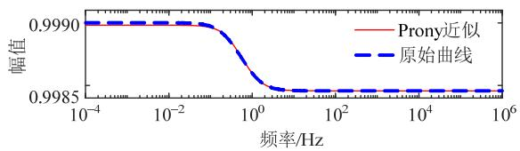

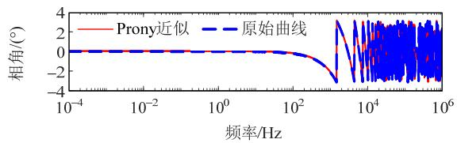

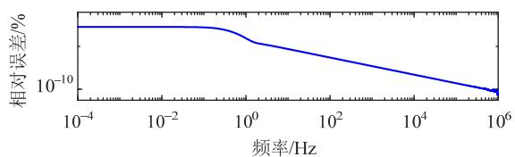  
图 12 β 模传输函数近似函数与原函数对比  
Fig. 12 Comparison between approximate function and original function of β mode transfer function

方程，由于输电线路的外部节点有 5 个，内部节点有 28 个，共用节点有 4 个，即①，②，③和④，所以总节点数为 29， $\pmb { K } _ { \mathrm { C } } , \pmb { K } _ { \mathrm { R } }$ 和 $K _ { \mathrm { L } }$ 均为 $2 9 \times 2 9$ 阶矩阵。应用式(37)解得双导体传输线的节点电位，根据欧姆定律得到各支路电流，将其转为模态，采用式(45)求解历史电流源，其电流控框图如图 13所示。

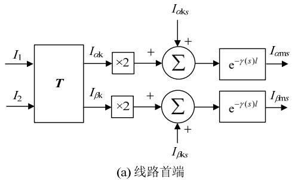

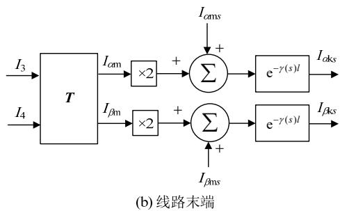  
图 13 电流控制框图  
Fig. 13 Current control block diagram

采用附录 B 中数据通过 MATLAB 编程得到各节点电压。

# 6.3.2 PSCAD/EMTDC 仿真

按照图 1 所示电路图搭建双导体传输线模型，线路参数与表 2 一致，架空线位置及尺寸如图 14所示(此处不考虑大地的影响)。

传输线模型采用频率相关(相域)模型，将该模

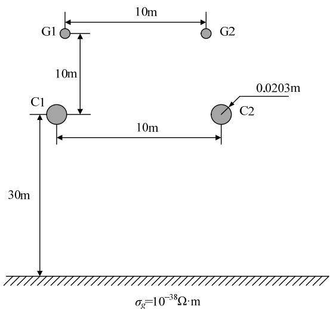  
图14 架空线位置及尺寸  
Fig. 14 Location and size of overhead line

块中曲线拟合起始频率设置为 $1 0 ^ { - 8 } \mathrm { H z }$ ，其他选项均采用默认设置，具体参数详见 PSCAD/EMTDC软件。

本文将仿真步长设为 1μs，仿真时间为 0.5s，运行得到各节点电压曲线。

# 6.3.3 对比与分析

将应用本文模型和 PSCAD/EMTDC 得到的各节点电压曲线以及二者的绝对误差曲线表示在图 15—18 中。

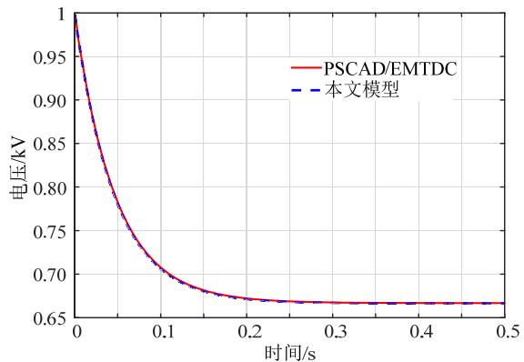  
(a) 对比图

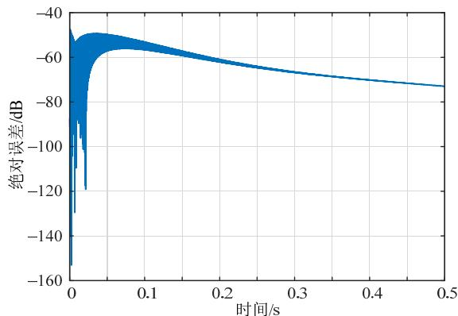  
(b) 绝对误差图  
图 15 本文模型与 PSCAD/EMTDC 对比的节点①电压  
Fig. 15 Node ① voltage between proposed model and PSCAD/EMTDC software

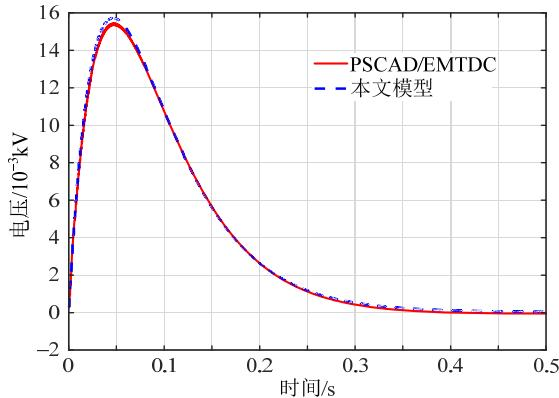  
(a) 对比图

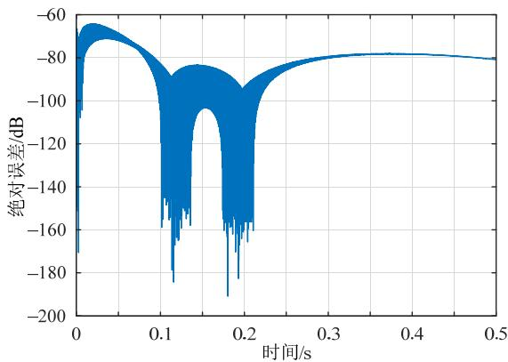  
(b) 绝对误差图

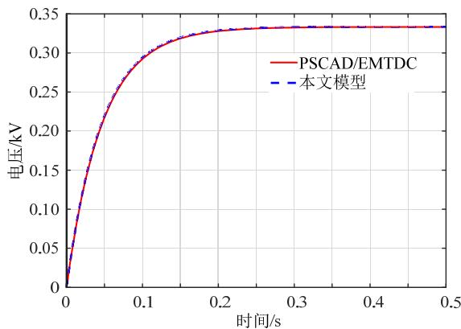  
图 16 本文模型与 PSCAD/EMTDC 对比的节点②电压 Fig. 16 Node ② voltage of between proposed model and PSCAD/EMTDC software   
(a) 对比图

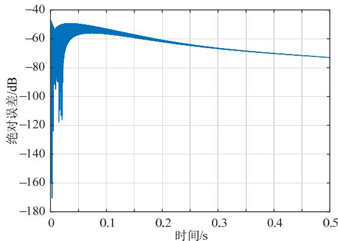  
(b) 绝对误差图  
图 17 本文模型与 PSCAD/EMTDC 对比的节点③电压  
Fig. 17 Node ③ voltage between proposed model and PSCAD/EMTDC software

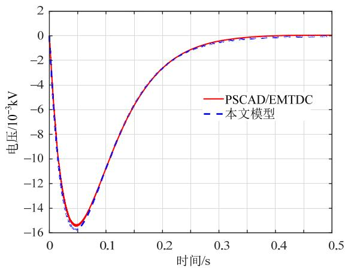

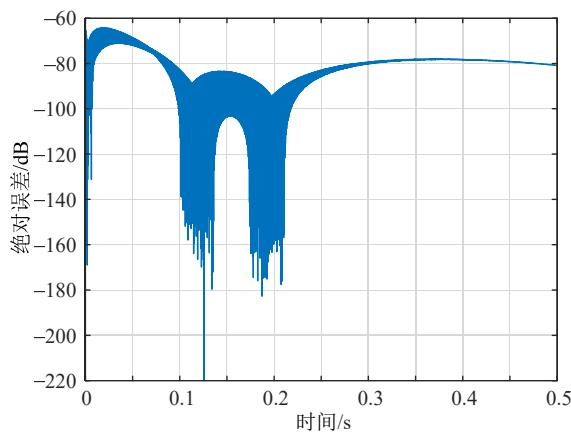  
(a) 对比图  
(b) 绝对误差图  
图 18 本文模型与 PSCAD/EMTDC 对比的节点④电压 Fig. 18 Node ④ voltage of between proposed model and PSCAD/EMTDC software

从图 15(a)、17(a)可知，节点①的电压从零时刻的 1kV 逐渐下降，经过多次折反射，直到大约0.25s 时到达稳态值 0.67kV；类似地，节点③的电压从零开始增加，直到大约 0.25s 时达到稳态值0.33kV；在 0~0.25s 这个时间段，连接电源的输电线路首末端的电压变化较大，同时电流也有较大变化，而输电线路中有电感参数，电流的变化会感应出电压，故耦合输电线路的首末端在 0~0.25s 这个时间段感应出电压，之后线路的电压电流逐渐趋于稳态，所以耦合电路的感应电压也逐渐变为零，如图 16(a)、18(a)所示。

通过以上算例，从各节点电压对比图可以看出，本文所提模型的仿真结果与 PSCAD/EMTDC的结果吻合程度较好，验证了本文模型的有效性；从各节点电压绝对误差可知，两种模型的误差较小，说明本文模型的准确度较高，但仍然存在一定误差。

经分析可知，本文模型与 PSCAD/EMTDC 存在误差的原因有二：

1）本文线路的电容电感值是根据 PSCAD/EMTDC 传输线输出文件中的阻抗和导纳推算而

来，取值时采取了四舍五入的方法，存在一定的误差。

2）特征阻抗和传输函数分别应用 Pade 近似和Prony 近似等效而来，也会带来一定的误差。

# 7 结论

本文研究了有损频变传输线电磁暂态模型中特征阻抗和传输函数的拟合方法，即 Pade 近似和Prony 近似，采用伯德图分析近似函数和原函数的幅频特性和相频特性，结果表明二者的吻合程度较好。相比现有的比较精确的拟合方法，本文所述方法无需迭代，近似原理简单且易于程序实现。将获得的等值电路和近似函数应用到 Bergeron 模型中，得到一种新的频变传输线时域仿真模型。以双导体频变传输线为例，仿真得到传输线首末端阶跃响应，并与 PSCAD/EMTDC 响应曲线进行比较，对比发现两种模型的仿真结果基本一致，验证了本文所提模型的有效性和准确性。

在后续研究中，将考虑大地阻抗对传输线响应的影响，建立更加符合实际的传输线电磁暂态时域仿真模型。

附录见本刊网络版(http://www.dwjs.com.cn/CN/1000-3673/current.shtml)。

# 参考文献

[1] 郭蕾，刘聪，陈伟，等．基于暂态接地电阻建模的输电线路雷击响 应 研 究 [J/OL] ． 电 网 技 术 ： 1-10[2022-12-21] ． DOI ：10.13335/j.1000-3673.pst.2022.0663  
GUO Lei，LIU Cong，CHEN Wei，et al．Lightning strike response of transmission lines based on transient earth resistance modelling[J/OL]．Power System Technology：1-10[2022-12-21] DOI：10.13335/j.1000-3673.pst.2022.0663(in Chinese)   
[2] 郑涛，宋祥艳．基于故障暂态行波高低频能量比值的交流输电线 路快速保护方案[J]．电网技术，2022，46(12)：4616-4629 ZHENG Tao，SONG Xiangyan．Fast protection scheme for AC transmission lines based on ratio of high and low frequency energy of transient traveling waves[J]．Power System Technology，2022， 46(12)：4616-4629(in Chinese)   
[3] 高明鑫，胡志坚，倪识远，等．三回非全线平行线路零序分布参数测量方法[J]．电网技术，2022，46(4)：1539-1547  
GAO Mingxin，HU Zhijian，NI Zhiyuan，et al．Zero sequenceparameters measurement of triple-circuit non-full-line paralleltransmission lines[J]．Power System Technology，2022，46(4)：1539-1547(in Chinese)  
[4] Dommel H W．电力系统电磁暂态计算理论[M]．李永庄，林集明，曾昭华，译．北京：水利电力出版社，1991：77-90．  
[5] 董博文．考虑频变参数的架空线分数阶建模及其雷电过电压计算方法的研究[D]．保定：华北电力大学，2016．  
[6] 白淑华．多导体传输线的时域有限元法研究[D]．保定：华北电力大学，2013．  
[7] 孙强，魏克新，王莎莎，等．计及 PWM 变换器传输线分布参数模型的宽频建模机理研究[J]．中国电机工程学报，2016，36(15)：

4232-4241   
SUN Qiang，WEI Kexin，WANG Shasha，et al．Mechanism study on wideband modeling of transmission lines considering distributed parameters for PWM converters[J]．Proceedings of the CSEE，2016， 36(15)：4232-4241(in Chinese)   
[8] BUDNER A．Introduction of frequency-dependent line parameters into an electromagnetic transients program[J]．IEEE Transactions on Power Apparatus and Systems，1970，PAS-89(1)：88-97   
[9] SNELSON J K．Propagation of travelling waves on transmission lines-frequency dependent parameters[J] ． IEEE Transactions on Power Apparatus and Systems，1972，PAS-91(1)：85-91   
[10] MEYER W S ， DOMMEL H W ． Numerical modelling of frequency-dependent transmission-line parameters in an electromagnetic transients program[J]．IEEE Transactions on Power Apparatus and Systems，1974，PAS-93(5)：1401-1409   
[11] SEMLYEN A，DABULEANU A．Fast and accurate switching transient calculations on transmission lines with ground return using recursive convolutions[J]．IEEE Transactions on Power Apparatus and Systems，1975，94(2)：561-571   
[12] MARTI J R．Accurate modeling of frequency-dependent transmission lines in electromagnetic transient simulations[J] ． IEEE Power Engineering Review，1982，PER-2(1)：29-30   
[13] 李小燕，董华英．矢量匹配法在频变传输线暂态模拟中的应用[J]电力自动化设备，2004，24(8)：79-80，84LI Xiaoyan，DONG Huaying．Application of vector fitting to transientsimulation of frequency dependent transmission line[J] ． ElectricPower Automation Equipment，2004，24(8)：79-80，84(in Chinese)  
[14] 张炳达，赵紫昆，郭凯，等．基于矢量匹配法和遗传算法的频变输电线建模[J]．电力系统及其自动化学报，2016，28(6)：14-18ZHANG Bingda， ZHAO Zikun ， GUO Kai ， et al ． Model offrequency-dependent transmission line based on vector fitting andgenetic algorithm[J]．Proceedings of the CSU-EPSA，2016，28(6)：14-18(in Chinese)  
[15] 吴维韩，张芳榴，刁颐民．多导线输电线路上波过程的贝杰龙计算方法[J]．高电压技术，1981(4)：11-26WU Weihan，ZHANG Fangliu，DIAO Yimin．Bergeron calculationmethod for wave processes on multi-conductor transmission lines[J]High Voltage Engineering，1981(4)：11-26(in Chinese)  
[16] 郭以贺，谢志远，石新春．基于多导体传输线的中压电力线通信信道建模[J]．中国电机工程学报，2014，34(7)：1183-1190GUO Yihe，XIE Zhiyuan，SHI Xinchun．Modeling of medium voltagepower line communication channel based on muti-conductor lines[J]Proceedings of the CSEE，2014，34(7)：1183-1190(in Chinese)  
[17] 沃森，阿里拉加．电力系统电磁暂态仿真[M]．陈贺，白宏，项祖涛，译．北京：中国电力出版社，2017：108-115  
[18] 梁贵书．陡波前过电压下变压器的建模及快速仿真算法研究[D]保定：华北电力大学(河北)，2008  
[19] 卢铁兵，崔翔．有损土壤上的多导体传输线的时域分析[J]．电波

科学学报，2000，15(3)：269-274  
LU Tiebing ， CUI Xiang ． FDTD analysis of multi-conductortransmission lines over lossy ground[J]．Chinese Journal of RadioScience，2000，15(3)：269-274(in Chinese)  
[20] 李晶，侯俊贤．Prony分析在电力系统中的应用综述[C]//中国电机工程学会电力系统专业委员会2005年学术年会论文集．北京：中国电机工程学会，2006：222-231  
[21] 赵少锋，邹斌．Prony 算法在电力系统振荡模态识别中的应用[J]电气开关，2019，57(6)：71-73，79ZHAO Shaofeng，ZOU Bin．Application of Prony algorithm in powersystem oscillation mode recognition[J]．Electric Switchgear，2019，57(6)：71-73，79(in Chinese)  
[22] WEISS L，MCDONOUGH R N．Prony's method，Z-Transforms，and Padé approximation[J]．Siam Review，1963，5(2)：145-149  
[23] 孙韬．传输线方程解析解的研究[D]．重庆：重庆大学，2005  
[24] 纪锋，魏晓光，吴学光，等．线性开关电路电磁暂态分析的状态方程法[J]．中国电机工程学报，2016，36(22)：6028-6037JI Feng，WEI Xiaoguang，WU Xueguang，et al．State space methodto analyze the electromagnetic transient of linear switching circuit[J]Proceedings of the CSEE，2016，36(22)：6028-6037(in Chinese)  
[25] 王川川，贾锐，曾勇虎，等．一种频变传输线系统电磁脉冲响应 的数值算法[J]．北京邮电大学学报，2020，43(2)：52-58 WANG Chuanchuan，JIA Rui，ZENG Yonghu，et al．A numerical algorithm for the transient response of a frequency-dependent transmission line system excited by EMP[J]．Journal of Beijing University of Posts and Telecommunications，2020，43(2)：52-58(in Chinese)

在线出版日期：2022-04-11。

收稿日期：2021-11-30。

作者简介：

刘刚(1985)，男，通信作者，博士，副教授，硕导，主要从事电磁场理论及其应用、电气设备多物理场仿真和电力系统时域仿真技术的研究工作，E-mail：liugang_em@163.com；

温晓芳(1998)，女，硕士研究生，研究方向为电力系统电磁暂态建模，E-mail：1425181741@qq.com；

郝世缘(1999)，女，硕士研究生，主要研究方向 为 电 磁 场 理 论 及 其 应 用 ， E-mail ： hsyjya@163.com；

纪锋(1982)，男，硕士，高级工程师，研究方向为电力系统电磁暂态建模与仿真，E-mail：jameskeating@163.com。

（责任编辑 宋钰龙）

附录 A

$$
\begin{array}{l} (R + s L) (G + s C) = L C s ^ {2} + (R C + G L) s + R G = \\ L C \left[ s ^ {2} + \left(\frac {R}{L} + \frac {G}{C}\right) s \right] + R G = \\ L C [ s + \frac {1}{2} (\frac {R}{L} + \frac {G}{C}) ] ^ {2} - \frac {L C}{4} (\frac {R}{L} + \frac {G}{C}) ^ {2} + R G = \\ L C [ s + \frac {1}{2} (\frac {R}{L} + \frac {G}{C}) ] ^ {2} - \frac {(R C - G L) ^ {2}}{4 L C} = \\ L C \left[ \left[ s + \frac {1}{2} \left(\frac {R}{L} + \frac {G}{C}\right) \right] ^ {2} - \frac {\left(R C - G L\right) ^ {2}}{4 L ^ {2} C ^ {2}} \right] \tag {A1} \\ \end{array}
$$

附录 B

表 B1 模特征阻抗留数和极点  
Table B1 Residues and poles of α mode characteristic impedance   
表B2 模等效电容电阻  

<table><tr><td>序号</td><td>rZα</td><td>pZα</td></tr><tr><td>1</td><td>47.2728350600116</td><td>-5.72254663030718</td></tr><tr><td>2</td><td>148.459623416022</td><td>-4.52764347419507</td></tr><tr><td>3</td><td>226.407855905578</td><td>-3.23067601103395</td></tr><tr><td>4</td><td>249.342510627310</td><td>-2.25631789909773</td></tr><tr><td>5</td><td>241.067279213093</td><td>-1.68390924172323</td></tr><tr><td>6</td><td>230.624762943817</td><td>-1.43171087720950</td></tr></table>

Table B2 α mode equivalent capacitance and resistance   

<table><tr><td>序号</td><td>Cα(F)</td><td>Rα(Ω)</td></tr><tr><td>1</td><td>0.0211537979207409</td><td>8.26080381934330</td></tr><tr><td>2</td><td>0.00673583818273433</td><td>32.7896010942901</td></tr><tr><td>3</td><td>0.00441680787091171</td><td>70.0806441538278</td></tr><tr><td>4</td><td>0.00401054756962278</td><td>110.508590445973</td></tr><tr><td>5</td><td>0.00414821954793808</td><td>143.159306475685</td></tr><tr><td>6</td><td>0.00433604781739597</td><td>161.083335060861</td></tr><tr><td>0</td><td>—</td><td>474.900213939658</td></tr></table>

表B3 β 模特征阻抗留数和极点  
Table B3 Residues and poles of β mode characteristic impedance   
表B4 β 模等效电容电阻  

<table><tr><td>序号</td><td>rZβ</td><td>pZβ</td></tr><tr><td>1</td><td>62.3051630107209</td><td>-7.20030099216526</td></tr><tr><td>2</td><td>190.276661748135</td><td>-5.32631706077762</td></tr><tr><td>3</td><td>274.139746278706</td><td>-3.40257455829887</td></tr><tr><td>4</td><td>276.823747201174</td><td>-2.08465556101782</td></tr><tr><td>5</td><td>245.007479053528</td><td>-1.39179514447647</td></tr><tr><td>6</td><td>222.283228662729</td><td>-1.11224029609524</td></tr></table>

Table B4 β mode equivalent capacitance and resistance   
表B5 α 模传输函数留数和极点  

<table><tr><td>序号</td><td>Cβ(F)</td><td>Rβ(Ω)</td></tr><tr><td>1</td><td>0.0160500342456038</td><td>8.65313312297860</td></tr><tr><td>2</td><td>0.00525550527748736</td><td>35.7238706552620</td></tr><tr><td>3</td><td>0.00364777458786783</td><td>80.5683289467030</td></tr><tr><td>4</td><td>0.00361240684771627</td><td>132.791120210773</td></tr><tr><td>5</td><td>0.00408150805788882</td><td>176.037026731896</td></tr><tr><td>6</td><td>0.00449876495863439</td><td>199.851803106848</td></tr><tr><td>0</td><td>—</td><td>367.637607891057</td></tr></table>

Table B5 Residues and poles of α mode transfer function   
表 B6 β 模传输函数留数和极点  

<table><tr><td>序号</td><td>rγα</td><td>pγα</td></tr><tr><td>1</td><td>0.000490680959869313</td><td>-2.60541030996702</td></tr><tr><td>2</td><td>0.000490769144591076</td><td>-5.01260221244659</td></tr></table>

Table B6 Residues and poles of β mode transfer function   

<table><tr><td>序号</td><td>rγβ</td><td>pγβ</td></tr><tr><td>1</td><td>0.00101639039416351</td><td>-2.80858445766703</td></tr><tr><td>2</td><td>0.00101662574553021</td><td>-6.26535885785123</td></tr></table>

附录 C

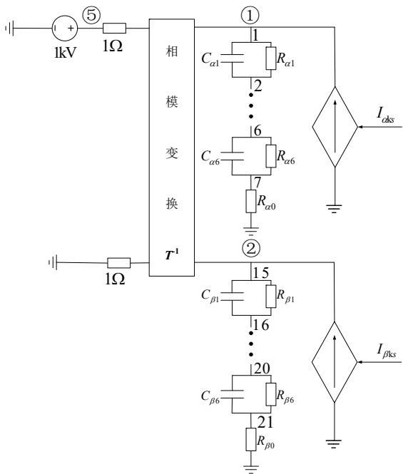

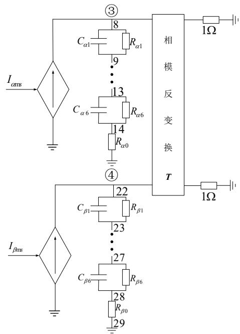  
图 C1 双导体传输线等效电路图  
Fig. C1 Equivalent circuit of two-conductor transmission line