# Modeling of MMC-based STATCOM with embedded energy storage for the simulation of electromagnetic transients✰

Anton Stepanov a,* , Hani Saad b , Jean Mahseredjian

a PGSTech, Montreal, QC, Canada   
b ACDC Transient, Lyon, France   
c Polytechnique Montreal, Canada

# A R T I C L E I N F O

Keywords:

Energy storage

Modeling

Modular multilevel converter

EMT

STATCOM

# A B S T R A C T

The Delta-connected STATCOM is regarded as the most advantageous topology for STATCOMs based on the Modular Multilevel Converter (MMC) technology. Embedding energy storage devices into the MMCs has gained significant research interest in recent years. This paper focuses on modeling of MMC-based Delta-STATCOMs with embedded energy storage. A flexible modeling approach is proposed, which allows easy interfacing of various converter models with various energy storage device models. Four commonly used types of MMC models are applied to STATCOM modeling: detailed, detailed equivalent, arm equivalent, and average value. Supercapacitors and batteries are used as energy storage devices. Dynamic performances of the models are compared in transient simulation cases using EMTP.

# 1. Introduction

Modular multilevel converter (MMC) is a power electronic converter that generates AC voltages by inserting/bypassing the appropriate number of submodules (SMs). Each SMs represents one level of the resulting voltage waveform [1]. MMCs have several advantages over conventional 2- and 3-level voltage source converters, including easy scalability to high voltage levels, smoother AC voltage waveform, lower rate of change of voltage [2,3]. MMCs are used in many modern projects: HVDC systems [4,5], power quality improvement [6,7] and others [8,9].

Energy Storage (ES) devices allow to enhance network congestion management, to counteract the effects of intermittent power generation from renewable energy sources, provide grid frequency support, improve economic efficiency [9,10]. It has been concluded that MMCs with ES devices embedded within submodules are a promising solution to improve power quality [10–12]. Depending on the application requirements, the nominal power of the embedded energy storage may vary from partial (40% and lower) to full power of the converter, and its energy capacity likewise depends on the project requirements [10,11].

MMC-based STATCOMs can have single-star, double-star or delta topologies. Delta configuration with full-bridge (FB) SMs is considered in this paper since it has more advantages over other types [10,13].

Accurate models of various types of equipment are required to perform electromagnetic transient (EMT) simulations in the design and analysis of electrical systems. Owing to the structural complexity of MMCs, numerous nonlinear devices, and advanced control systems, many EMT models have been developed. They are generally divided into four groups [14–16]:

Detailed Model (DM): represents nonlinear v-i characteristics of IGBTs. It is used to validate other models, to simulate SM internal faults, to analyze SM topologies etc.

• Detailed Equivalent Model (DEM): represents IGBTs as two-value resistances. Useful for the analysis of low-level controls such as capacitor balancing algorithms, modulation.   
• Arm Equivalent Model (AEM): represents all SMs in each arm by a single equivalent circuit. Reduces computational time while keeping accuracy of internal variables such as circulating current and MMC internal energy.   
• Average Value Model (AVM): represents all SMs in the converter as a single capacitor. Accelerates simulations while keeping accurate AC system dynamics, sufficiently accurate for transient stability studies.

Despite considerable research efforts in MMC modeling, the

modeling of STATCOMs with embedded ES has not yet been widely researched. Some models have been proposed in [17,18], and [19], but only for the double-star configuration with half-bridge SMs and only using batteries as ES devices. Thus, the modeling of Delta-STATCOM configuration with FB SMs (Fig. 1) has not yet been discussed in the literature.

This paper aims to cover this gap by providing guidelines for EMT modeling of STATCOMs with energy storage using MMC technology, with a specific focus on Delta configuration. A comprehensive set of models with various types of embedded ES is presented. Plus, a generalized modeling approach for various ES device models and interfacing converter is proposed in this paper, describing how any two-port ES device model can work with any converter model.

The paper is organized as follows: Section 2 describes the converter topology and its control system, Section 3 describes the modeling principles of the ES and the converter, simulation results and analysis are given in Section 4.

# 2. Topology overview

# 2.1. Electrical circuit

The STATCOM shown in Fig. 1 comprises three arms connected in delta configuration, where each arm contains an inductance and a chain of series-connected FB SMs with energy storage units. The SMs are comprised of a capacitor and four fully controllable switches (IGBTs). To be able to use the STATCOM at high voltage levels, a coupling transformer is typically used, which is also shown in Fig. 1.

# 2.2. Energy storage device

While various options are available for energy storage, batteries [20] and supercapacitors [21] have gained popularity as embedded energy storage units due to the ease of interfacing and reasonable technological development. Thus, this paper focuses only on these ES devices.

# 2.3. Interfacing DC/DC converter

It is possible to connect the ES device to the SM either directly [9,12] or through an interface DC/DC converter [12,21,22]. The DC/DC converter can be used for batteries and supercapacitors and may serve multiple purposes:

• interconnect different voltage levels if the SM voltage differs from the ES device voltage;

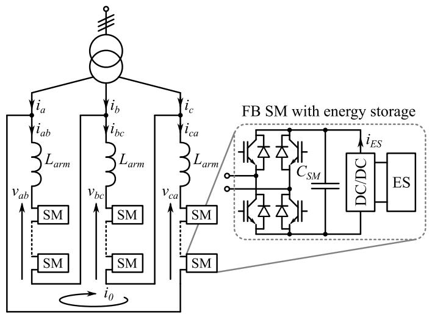  
Fig. 1. Delta-STATCOM with embedded energy storage.

• provide accurate control of the charging/discharging process;   
• provide galvanic isolation if required.

The DC/DC converter must be bi-directional, since both charging and discharging processes are present. In this paper it is considered that the DC/DC converter is present.

# 2.4. Control system

The overview of the control system used in this paper is shown in Fig. 2. The main control system for the full-bridge MMC STATCOM in Delta configuration is taken from [23]. It employs the classical cascade structure. The active channel of the outer loop is responsible for the DC voltage control (which makes it the total energy control of the STAT-COM), and the reactive channel is responsible for the AC voltage or reactive power output of the STATCOM. The outer loop generates reference signals for the inner current loop, which regulates the AC currents. The low-level control includes the calculation of the number of SMs to insert, capacitor voltage balancing within the arm, and gating signals generation for the SM switches. Zero-sequence current (i0) control is responsible for the energy balancing among the three arms of the converter.

In parallel to the main cascade control structure, the ES control system is added. The outer loop of the ES control system is responsible for the grid frequency support and/or for the state of charge of the ES device, the inner loop is responsible for ES current regulation, and lowlevel control generates the gating signals for the switches.

It should be noted that SM capacitor voltage in the MMC STATCOM with embedded energy storage is directly affected by three competing controls: DC voltage magnitude control in the main control system, grid support in the ES control system, and arm energy balancing. Thus, it is important to make sure that the control loops do not adversely interact with each other. This can be done by selecting different settling times for different loops in the control system. Active power grid support, for example, is typically slower than DC voltage control. In this paper, the time constant of energy balancing control is 0.05 s, the DC voltage control time constant is 0.1 s, the time constant of the LPF in ES outer control is 0.3 s.

Grid synchronization is ensured by the PLL. Additional improvements to the control system may be considered, such as improved operation in unbalanced conditions [24,25], but this is out of the scope of the paper.

# 3. Modeling

This section deals with the modeling of embedded ES and the converter separately and is split into three subsections: ES devices, DC/DC interface converter, and MMC STATCOM with embedded ES. The proposed modeling methodology allows to interface any embedded ES device (as long as it has a two-port EMT model) with any MMC-based topology since the ES devices are connected via two electrical nodes to any converter model, as will be shown in this section: at the SM-level in DM and DEM, at the arm-level in the AEM, to the equivalent converter

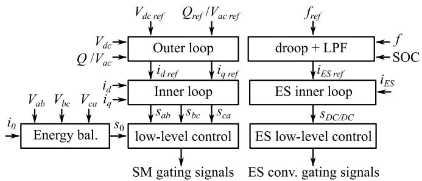  
Fig. 2. Control system overview.

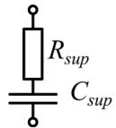

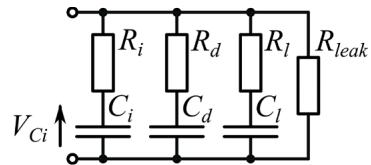  
  
Fig. 3. Supercapacitor models: a) simple, b) multi-branch.

capacitor in the AVM.

# 3.1. ES devices

Both considered ES devices (supercapacitors and batteries) are modeled as two-port electrical circuits, this allows easy interfacing with the DC/DC interface converter model.

# 3.1.1. Supercapacitor

The simplest supercapacitor model is a series RC circuit shown in Fig. 3a, where $R _ { s u p }$ and $C _ { s u p }$ represent the resistance and capacitance of the supercapacitor. This model may be sufficient for short-circuit studies but not enough for long charge/discharge processes if high accuracy is needed [26]. In such cases, a multi-branch model is used as shown in Fig. 3b. It comprises immediate $( R _ { i } , C _ { i } ) ,$ delayed $( R _ { d } , C _ { d } ) _ { }$ , long-term $( R _ { l } ,$ C ), and leakage $\left( R _ { l e a k } \right)$ branches [26]. The time-constants are in the order of seconds, minutes, and tens of minutes for the immediate, delayed, and long-term branches, respectively. The immediate branch capacitance $C _ { i }$ may include nonlinearities, such as voltage dependency:

$$
C _ {i} = C _ {i 0} + C _ {i 1} V _ {C i} \tag {1}
$$

where $C _ { i 0 } , C _ { i 1 }$ are constants and $V _ { C i }$ is capacitor voltage.

# 3.1.2. Battery

Battery models vary depending on the type of study, it is possible to find electrochemical, analytical, circuit-based, stochastic and other models. For EMT studies, electrical-circuit-based models are the most appropriate [27–29].

3.1.2.1. Ideal battery model. The simplest battery model comprises a constant voltage source $E _ { B 0 }$ (open-circuit battery voltage) and an optional internal resistance $R _ { i n }$ measured at full charge as shown in Fig. 4a. An extension to this model can include different resistances for charging and discharging $( R _ { c h } , R _ { d i s c h } )$ as shown in Fig. 4b; and/or a dedicated branch for a transient response $( R _ { t r } , \ C _ { t r } )$ along with an optional self-discharge branch $( R _ { s d } )$ shown in Fig. 4c [28–30]. Such ideal battery models can be used to assess the overall validity of the system (which is usually the case for EMT studies) in relatively short simulations not requiring high accuracy at SM level. But they are not enough to simulate long charge/discharge processes due to the lack of the state of charge (SOC) representation.

3.1.2.2. State of charge. Having a variable SOC is essential for monitoring and control of the charging/discharging process (it should be noted that operating the battery at very high or low state of charge has a

negative impact on the lifetime of the battery). Including the SOC in addition to the ideal model presented in the previous subSection 3.1.2.1 allows to run longer simulations where the overall energy storage dynamics are of interest. The SOC can be found by integrating the battery current:

$$
S O C (t) = S O C (0) - \frac {1}{C _ {n}} \int_ {0} ^ {t} i _ {B} (\tau) d \tau \tag {2}
$$

where $C _ { n }$ is the nominal capacity of the battery, iB(τ) is the current going out of the battery at the instant τ.

More advanced models may include the effects of temperature, current magnitude, and efficiency on the SOC [29,31,32].

3.1.2.3. Nonlinear behavior. Inclusion of nonlinear dynamic behavior makes battery models more realistic, so it should be used where the highest accuracy of the results is required. Often, the nonlinearities discussed in the literature describe the effects of the SOC and the battery current on the value of the battery voltage $E _ { B }$ and passive elements of the model [32–34]. For EMT simulations, the models that only modify the voltage source value, as shown in Fig. 5a, are advantageous since the admittance matrix is kept constant and therefore does not require refactoring and does not slow down the simulations.

The relationship between the circuit parameters and the SOC can be given using an analytic expression or a lookup table [17,33,34]. A typical relationship between the battery voltage and its SOC is shown in Fig. 5b. The actual curve can differ depending on the battery technology (lead-acid, Li-ion, NiMH, NiCd, etc.), its temperature, state of health and other parameters. Additional nonlinearities, such as hysteresis and Peukert effect, where the battery capacity decreases depending on the discharge rate, can also be included in the model [35].

# 3.2. ES converter

Although in the literature the DC/DC interface converter between the ES and the SM is sometimes omitted [12,17], it cannot always be avoided [18,19], and therefore it is important to include it in a generalized modeling procedure.

The simplest model of the ES and interface converter is a controlled current source iES (Fig. 6a). To calculate the SOC using (2), the battery current is calculated as

$$
i _ {B} = i _ {E S} v _ {C} / E _ {B 0} \tag {3}
$$

where $\nu _ { C }$ is capacitor voltage.

The converter can be represented as an ideal transformer with variable ratio (Fig. 6b). This is the average value model.

For higher accuracy, the converter topology is preserved in the detailed model (an example is shown in Fig. 6c). The switches of the ES converter can be modeled as two-state resistances or with nonlinear v-i characteristic. The average value and detailed models require modeling of the ES device.

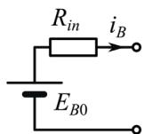  
a)

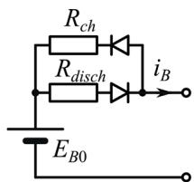

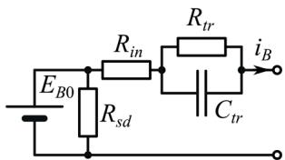  
c）  
Fig. 4. Ideal battery model with extensions: a) simple, b) nonlinear, c) transient.

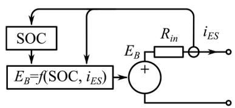

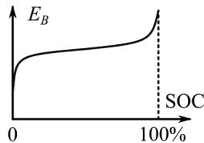  
  
Fig. 5. Generic nonlinear battery model suitable for EMT simulations: a) electric diagram; b) typical charge/discharge curve.

# 3.3. STATCOM modeling

The STATCOM models presented in this subsection follow the MMC–HVDC system modeling approach [17,36].

# 3.3.1. Full detailed model

In this model, semiconductor devices are represented with nonlinear v-i characteristics. This model offers the highest level of precision in EMT-type software, but it is the slowest.

The ES units are connected to individual SMs through the DC/DC interface converter, as shown in Fig. 7.

It is suggested to use the detailed (nonlinear) models for the ES device and ES converter as well, such as in Fig. 6c.

# 3.3.2. Detailed equivalent model

In this model, SM semiconductor switches are represented as twovalue resistances: a small value $R _ { O N }$ is used to represent losses in the conduction state, and a large value $R _ { O F F }$ is used in the turned-off state, Fig. 8.

It is proposed to use the same representation of switches for the ES converter model. The ES device model is suggested to include nonlinearities if the details of the charge/discharge process are of interest. Otherwise, the ideal model can be used.

It should be noted that for MMCs without energy storage, it is typi cally advisable to implement the DEM arms as executable code and interface them with the EMT software solver to reduce the number of nodes in the main network equations (MNE) matrix [14]. However, it becomes more challenging to do so for MMCs with embedded ES. This is due to the large number of variants for ES devices and ES converters. A deep analysis of ES converter operating modes is required, as well as reprogramming and recompiling the model for each new ES device and/or ES interface converter [18,19], which makes this implementation approach less flexible. Besides, STATCOMS often have fewer than 50 SMs per arm $[ 6 , 7 ] ,$ , which is significantly below the numbers for HVDC MMCs where hundreds of SMs are usual [5]. Thus, the imple mentation of the DEM using EMT software blocks is a viable solution for STATCOMs and is used in this paper.

# 3.3.3. Arm equivalent model

3.3.3.1. Converter model. This model (see Fig. 9) aggregates all SMs in each arm into a single equivalent circuit with one arm capacitor $C _ { a r m } \mathrm { : }$

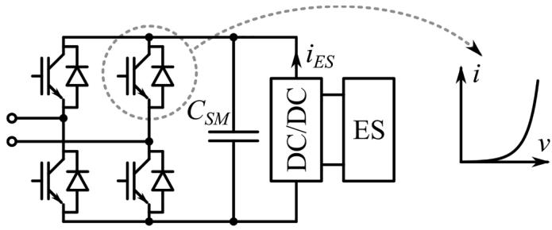  
Fig. 7. One SM of the Full Detailed Model.

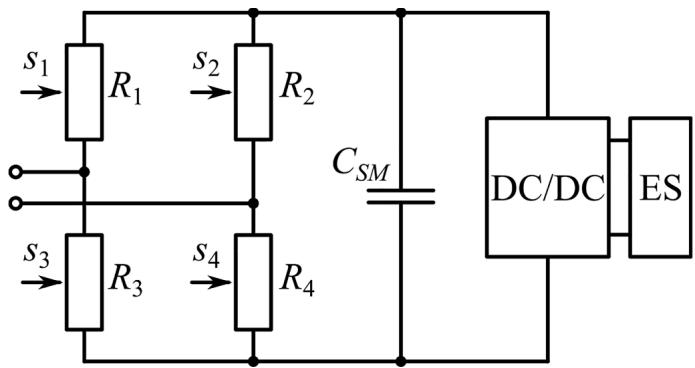  
Fig. 8. One SM of the Detailed Equivalent Model.

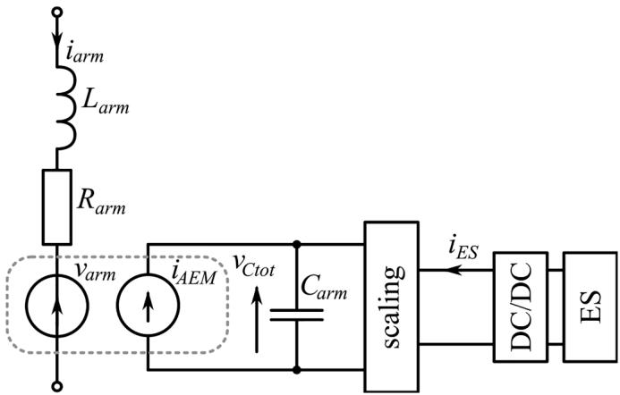  
Fig. 9. One arm of the Arm Equivalent Model.

$$
C _ {\text {a r m}} = C _ {S M} / N _ {S M} \tag {4}
$$

where $N _ { S M }$ is the number of SMs in the arm. The conduction losses of IGBTs/diodes are represented using a lumped resistance:

$$
R _ {\text {a r m}} = N _ {S M} R _ {O N} \tag {5}
$$

The arm switching function $s _ { a r m }$ provided by the control system in this model (the subscript arm can be any of ab, bc, ca) can be regarded as

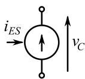  
a)

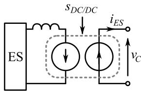

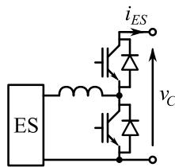  
c)   
Fig. 6. ES converter models: a) simplified, b) average value, c) detailed.

a variable transformation ratio between the equivalent capacitor and the rest of the electrical grid. In EMT programs it can be implemented as an ideal transformer with variable transformation ratio or as a combination of controlled voltage and current sources [17,37]:

$$
v _ {\text {a r m}} = v _ {\text {C t o t}} s _ {\text {a r m}} \tag {6}
$$

$$
i _ {\mathrm {A E M}} = i _ {\text {a r m}} s _ {\text {a r m}} \tag {7}
$$

where $\nu _ { a r m }$ is the voltage of inserted SMs in the arm, $\nu _ { C t o t }$ is the total voltage across the arm capacitor, iAEM is the current flowing into the equivalent capacitor from the converter side.

It is assumed that SMs in a given arm have the same energy storage device, but different arms may have different ES devices. The ES converter is suggested to be modeled as the average value model, Fig. 6b.

It should be noted that the capacitor voltage with the AEM is much smoother than with the DM or DEM due to the lack of inserting/ bypassing action, leading to a different harmonic content for the ES device. To better imitate the actual harmonic content, the arm switching function signal can be discretized.

Some authors propose to implement such a model independently from the EMT simulation software and interface with the EMT solver, just as the DEM [18], but since the number of nodes in the MNE matrix is already considerably reduced with the AEM, the implementation within the EMT software is also considered possible and is used in this paper.

3.3.3.2. Scaling. To interface the ES device, a scaling stage is inserted between the ES converter and the arm capacitor as shown in Fig. 9. Voltage of the ES converter must be scaled by the number of SMs in the arm so that the ES device voltage is matched with $C _ { a r m }$ voltage vCtot. Power must be amplified by the number of ES SMs in the arm. If all SMs have energy storage, the power is amplified by $N _ { S M } .$ . This can be implemented using built-in EMT software blocks (power amplifier and transformer) as shown in Fig. 10a, or using controlled voltage and current sources as shown in Fig. 10b, with the following references:

$$
v _ {\text {s c a l e}} = v _ {\text {C t o t}} / N _ {\text {S M}} \tag {8}
$$

$$
i _ {\text {s c a l e}} = i _ {E S} \tag {9}
$$

where iES is the current going into the scaling device from the ES device side, $i _ { s c a l e }$ is the current going out of the scaling device from the capacitor side, $\nu _ { C t o t }$ is the voltage at the scaling device from the capacitor side, $\nu _ { s c a l e }$ is the voltage at the scaling device from the ES device side.

It should be noted that the controlled source implementation introduces a one-time-step delay between the solutions of the AC side of the model and arm capacitor circuit with the ES device, which may reduce accuracy [37].

If the ES converter is modeled as a controlled current source $i _ { E S }$ (see subSection 3.2), it can be applied directly across the arm capacitor without the scaling stage. To calculate the SOC using (2), the battery current is found from

$$
i _ {B} = i _ {E S} v _ {C t o t} / \left(N _ {S M} E _ {B 0}\right) \tag {10}
$$

# 3.3.4. Average value model

In this model, the valves of the STATCOM are represented as

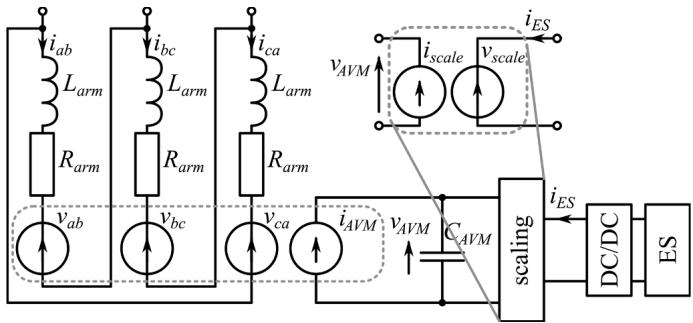  
Fig. 11. Average Value Model with controlled-sources-type scaling device.

controlled voltage sources, preserving the Delta topology (see Fig. 11). All converter capacitors are aggregated into one equivalent capacitor $C _ { A V M }$ [38]:

$$
C _ {A V M} = 3 C _ {S M} / N _ {S M} \tag {11}
$$

Either three ideal transformers with variable ratios or three pairs of voltage/current sources can be used. In the latter case, the value of the total AVM current source is found using power balance principle, i.e. the power generated/consumed at the AC side must be transmitted to the AVM capacitor:

$$
i _ {A V M} = \sum v _ {x y} i _ {x y} / v _ {A V M} \tag {12}
$$

$$
v _ {x y} = v _ {A V M} s _ {x y} \tag {13}
$$

where the subscript xy = ab, bc, ca denotes the arms, $\nu _ { x y }$ are the AVM arm voltages, $i _ { x y }$ are the arm currents, $s _ { x y }$ are the arm switching functions.

As in the AEM, it is proposed to interface the ES converter with the AVM equivalent capacitor through a scaling device, as shown Fig. 11. For the power amplifier implementation of the scaling, the ratio must be (3 NSM) : 1 and for the controlled sources implementation, the following relations are used:

$$
v _ {\text {s c a l e}} = v _ {\text {A V M}} / N _ {\text {S M}} \tag {14}
$$

$$
i _ {\text {s c a l e}} = 3 i _ {E S} \tag {15}
$$

It is suggested to model the ES device and converter as a controllable current source, Fig. 6a.

# 4. Simulation results

The models are compared in the system of Fig. 12. A 100 MVA STATCOM is connected to the 230 kV grid. The synchronous machine uses the ST1 exciter, PSS1A stabilizer, and IEEEG1 governor. Each arm of the STATCOM is composed of 20 full-bridge submodules, each with an ES unit. Unless stated otherwise, the time-step is 20 µs. Other parameters are given in Table 1.

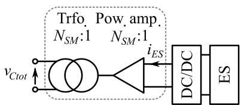  
a)

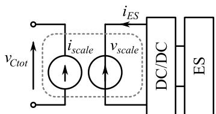  
  
Fig. 10. Scaling implementation variants: a) with transformer and power amplifier; b) with controlled sources.

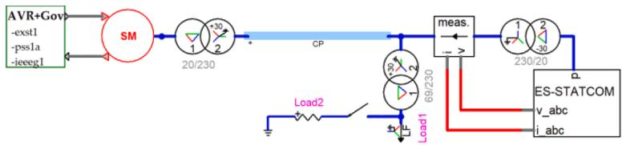  
Fig. 12. Simulated system in EMTP [39].

Table 1 Test-case parameters.   

<table><tr><td>Parameter</td><td>Value</td><td>Symbol</td></tr><tr><td>Synchronous machine frequency</td><td>50 Hz</td><td></td></tr><tr><td>Synchronous machine voltage</td><td>20 kV</td><td></td></tr><tr><td>Synchronous machine rated power</td><td>2000 MVA</td><td></td></tr><tr><td>STATCOM rated power</td><td>100 MVA</td><td></td></tr><tr><td>STATCOM transformer power</td><td>100 MVA</td><td></td></tr><tr><td>STATCOM transformer impedance</td><td>0.004 + j0.15 p.u.</td><td></td></tr><tr><td>STATCOM transformer voltages</td><td>230 / 20 kV</td><td></td></tr><tr><td>Total ES rated active power</td><td>50 MW</td><td></td></tr><tr><td>Number of SMs per arm</td><td>20</td><td>NSM</td></tr><tr><td>Arm inductance</td><td>0.15 p.u.</td><td>Larm</td></tr><tr><td>DEM ON/OFF-state resistances</td><td>1 mΩ / 1 MΩ</td><td>RON / ROFF</td></tr><tr><td>AEM arm resistance</td><td>40 mΩ</td><td>Rarm</td></tr><tr><td>SM capacitance</td><td>55 mF</td><td>CSM</td></tr><tr><td>Load1</td><td>120 + j60 MVA</td><td></td></tr><tr><td>Load2</td><td>100 + j0 MVA</td><td></td></tr><tr><td>Battery type</td><td>Li-Ion</td><td></td></tr><tr><td>Battery nominal voltage</td><td>550 V</td><td>EB0</td></tr><tr><td>Battery capacity per submodule</td><td>15 kWh</td><td>Cn</td></tr><tr><td>Battery internal resistance</td><td>0.0495 ΩAh/V</td><td>Rin</td></tr></table>

# 4.1. Active power support

A 100 MW resistive load is connected in parallel to Load1 at 0.5 s. ES power reference is obtained as a frequency droop with ±100 mHz deadband. STATCOM reactive power channel is used to control the AC voltage at the measurement point to 1 p.u. Different STATCOM models are compared. Ideal battery model and AVM ES converter are used in this study since only the overall behavior of the converter during a very slow transient will be evaluated in this test, more detailed ES models are not required. One extra simulation is performed without the ES contribution to compare the overall behavior of the system.

The frequency dip in Fig. 13 is the same with all models. Without the ES contribution, the dip is much larger, and the waveform is less damped. Active and reactive powers are also similar with all models in Fig. 14 and Fig. 15. Without the ES, no extra active power is generated. The reactive power waveform without the ES contribution in Fig. 15 differs from others because of the voltage regulator of the synchronous generator at the other side of the transmission: its exciter and stabilizer respond to disturbances and frequency variations and thus impact the reactive power flow in the grid differently when frequency deviation is different. Power oscillations can be seen between 1 s and 3 s in Fig. 14a and Fig. 15a. This is due to the control system requests to produce arm voltages which are larger than the available total capacitor voltage (Fig. 16). The generated AC side voltages become capped and introduce

nonlinearities to the grid, leading to oscillations. It should also be noted that the total capacitor voltage of the STATCOM (Fig. 17) is affected by the active power contribution of the ES devices during the transient, which underlines the importance of careful tuning of all controls related to active power/energy of the converter, as mentioned in subSection 2.4.

# 4.2. AC fault

At 0.5 s, a 3-phase fault is applied to the 230 kV grid for 200 ms at the point of load connection. Different STATCOM models are compared. The ideal battery model (Fig. 4a) and average value ES converter model (Fig. 6b) are used in all simulations, this allows to avoid high-frequency ripple of the detailed ES converter model, and thus to focus only on the STATCOM model effects.

The total capacitor voltage in Fig. 18 exhibits oscillations at doublefundamental-frequency with all models except the AVM. The AVM is also unable to represent significant capacitor voltage fluctuations after fault clearance. During the fault, the STATCOM tries to maintain the desired AC voltage level but is unable to generate significant reactive power with any model, which is expected since STATCOM power is not enough to maintain the voltage during close faults (Fig. 19).

# 4.3. ES modeling effect

The effects of the following ES device and DC/DC converter models are compared in this subsection:

• controlled current source model (Fig. 6a);   
• simple ideal battery model (Fig. 4a) with AVM ES converter (Fig. 6b);   
• simple ideal battery model with detailed ES converter (Fig. 6c);   
• nonlinear battery model (Fig. 5a) with detailed ES converter (Fig. 6c). A Li-Ion battery is used, the model details are given in [32, 33].

The STATCOM is modeled with the AEM as the internal SM-level behavior will not be evaluated in this test.

A 5% step is applied to the capacitor voltage reference at 0.5 s. The STATCOM is at zero power output to avoid capacitor voltage oscillations.

As shown in Fig. 20, the current source model and the ideal battery model with AVM ES converter produce similar responses. The detailed ES converter model introduces additional noise in the voltage waveform due to the switching action of the IGBTs, but the average value of the capacitor voltage does not deviate from the simplified models. The nonlinear battery model introduces some damping in the voltage

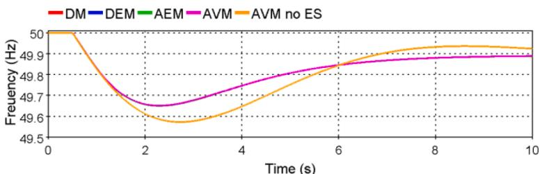  
Fig. 13. Grid frequency.

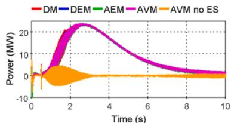  
a)overview

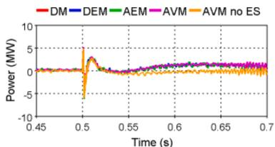  
b) zoom

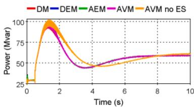  
Fig. 14. STATCOM active power output.   
a) overview

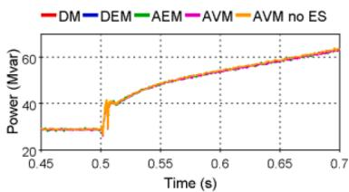  
b) zoom   
Fig. 15. STATCOM reactive power output.

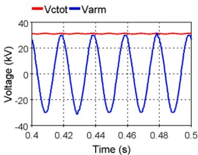  
a) sinusoidal $( \nu _ { _ { a r m } }$ below $\nu _ { _ { C t o t } } )$

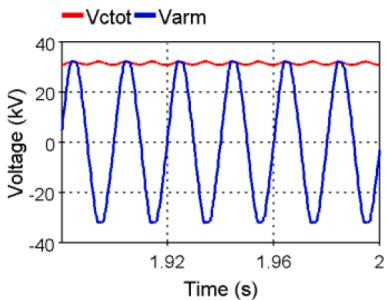  
b) capped $( \nu _ { _ { a r m } }$ reaches $\nu _ { _ { c t o t } } )$

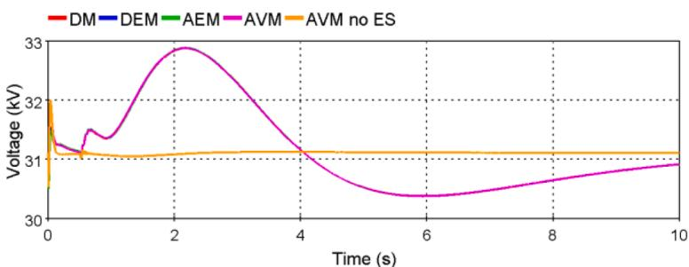  
Fig. 16. Generated AC side voltage of the ab-arm with the DM.   
Fig. 17. Average total capacitor voltage of the STATCOM.

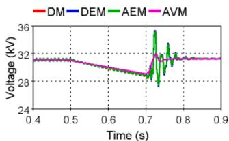  
a) overview

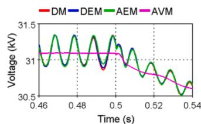  
b) zoom   
Fig. 18. Total capacitor voltage $\nu _ { C t o t }$ of the ab-arm.

response and oscillations to the system, compared to the simplified models. This is due to the fact that the output voltage of the battery in

the nonlinear battery model varies depending on the passing current, as explained in subSection 3.1.2.3 and $[ 3 2 , 3 3 ]$ , which affects the dynamics of the active power exchange in the STATCOM.

# 4.4. Computing times

Computing times with different STATCOM models are shown in Table 2. Ideal battery model with AVM ES converter is used. One second of steady-state operation is simulated; simulation time-step is 20 μs. The DM is taken as reference, the DEM acceleration is 1.9 times, which can be attributed to the comparably reduced number of iterations. The acceleration of the AEM is 16.5 times, which is related to the smaller number of iterations and reduced number of nodes. The AVM acceleration is 23 and 209 times, respectively, depending on the time-step.

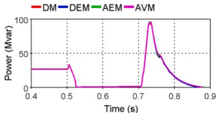  
a) overview

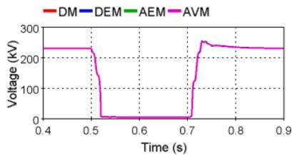  
b) zoom

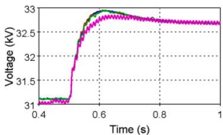  
Fig. 19. Reactive power and voltage at HV terminals of STATCOM.   
a) overview

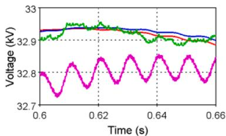  
b) zoom   
Fig. 20. Total capacitor voltage of the ab-arm with different ES models. Red: controlled current source, blue: simple ideal model with AVM ES converter, green: simple ideal battery and detailed ES converter, purple: nonlinear battery and detailed ES converter.

Table 2 Computing times with different STATCOM models.   

<table><tr><td>Model</td><td>Time, s</td><td>Average number of iterations per time-step</td><td>Acceleration factor w.r. t. DM</td></tr><tr><td>DM</td><td>68.84</td><td>2.05</td><td>1 (reference)</td></tr><tr><td>DEM</td><td>36.38</td><td>1.22</td><td>1.89</td></tr><tr><td>AEM</td><td>4.17</td><td>1</td><td>16.5</td></tr><tr><td>AVM</td><td>2.89</td><td>1</td><td>23.8</td></tr><tr><td>AVM (200 μs)</td><td>0.33</td><td>1</td><td>209</td></tr></table>

Another set of timing tests is performed to evaluate the impact of different battery and DC/DC interface converter models. Two converter models are used: AEM and DEM, the time-step is reduced to 10 μs. The results are shown in Table 3. The impact of the battery model on simulation time is non-negligible: the current source model allows to accelerate simulations up to 1.9 times with the DEM compared to the most detailed nonlinear battery model with detailed DC/DC converter. The effects are a little less significant with the AEM STATCOM model, where the maximum acceleration is 1.6 times.

# 5. Conclusion

A set of models for MMC-based Delta-STATCOM with embedded ES has been developed and presented. The proposed modeling approach allows to combine any ES model with any STATCOM model.

As with the conventional MMC models, for the long-run simulations when only the overall behavior of the system is of interest, the simplified STATCOM models are the most appropriate (AVM or AEM), since they are much faster and their active and reactive power contribution is the same as with detailed models (DM, DEM). However, it should be noted that with the AVM, the ripple in total capacitor voltages is not represented.

When harmonic analysis is necessary, for example in case of AC faults, it is needed to use the detailed models of both the STATCOM and the ES device with its converter, because the simplified models do not represent harmonics accurately.

Table 3 Computing times with different ES models.   

<table><tr><td>STATCOM model</td><td>Battery and DC/DC converter model</td><td>Time, s</td><td>Acceleration factor w.r.t. Nonlinear battery model + DM</td></tr><tr><td rowspan="3">AEM</td><td>Current source</td><td>11.0</td><td>1.6</td></tr><tr><td>Ideal battery + AVM</td><td>12.0</td><td>1.5</td></tr><tr><td>Nonlinear battery + DM</td><td>17.5</td><td>1</td></tr><tr><td rowspan="3">DEM</td><td>Current source</td><td>55.4</td><td>1.9</td></tr><tr><td>Ideal battery + AVM</td><td>80.7</td><td>1.3</td></tr><tr><td>Nonlinear battery + DM</td><td>107.1</td><td>1</td></tr></table>

# CRediT authorship contribution statement

Anton Stepanov: Conceptualization, Methodology, Investigation, Writing – original draft. Hani Saad: Conceptualization, Methodology, Supervision, Writing – review & editing. Jean Mahseredjian: Resources, Writing – review & editing, Supervision.

# Declaration of Competing Interest

The authors declare that they have no known competing financial interests or personal relationships that could have appeared to influence the work reported in this paper.

# Data availability

The authors are unable or have chosen not to specify which data has been used.

# References

[1] A. Lesnicar, R. Marquardt, An innovative modular multilevel converter topology suitable for a wide power range, in: Proceedings of the 2003 IEEE Bologna PowerTech - Conference Proceedings, Bologna, Italy 3, IEEE Computer Society, 2003, pp. 272–277.   
[2] S. Rohner, S. Bernet, M. Hiller, R. Sommer, Modulation, losses, and semiconductor requirements of modular multilevel converters, IEEE Trans. Ind. Electron. 57 (8) (2010) 2633–2642, https://doi.org/10.1109/tie.2009.2031187.

[3] A. Nami, J. Liang, F. Dijkhuizen, G.D. Demetriades, Modular multilevel converters for HVDC applications: review on converter cells and functionalities, IEEE Trans. Power Electron. 30 (1) (Jan 2015) 18–36, https://doi.org/10.1109/ tpel.2014.2327641.   
[4] S.P. Teeuwsen, Modeling the trans bay cable project as voltage-sourced converter with modular multilevel converter design, in: Proceedings of the 2011 IEEE Power Energy Society General Meeting, Detroit, Michigan, USA, IEEE, 2011, pp. 1–8, https://doi.org/10.1109/pes.2011.6038903.   
[5] P.L. Francos, S.S. Verdugo, H.F. Alvarez, S. Guyomarch, J. Loncle, INELFE - Europe’s first integrated onshore HVDC interconnection, in: Proceedings of the 2012 IEEE Power Energy Society General Meeting. New Energy Horizons - Opportunities and Challenges, San Diego, California, USA, IEEE, 2012, pp. 1–8.   
[6] J. Park, S. Yeo, J. Choi, Development of ±400Mvar world largest MMC STATCOM, in: Proceedings of the 2018 21st International Conference on Electrical Machines and Systems (ICEMS), 2018, pp. 2060–2063, https://doi.org/10.23919/ ICEMS.2018.8549235, 7-10 Oct. 2018.   
[7] M. Pereira, D. Retzmann, J. Lottes, M. Wiesinger, G. Wong, SVC PLUS: an MMC STATCOM for network and grid access applications, in: Proceedings of the 2011 IEEE Trondheim PowerTech, 2011, pp. 1–5, 19-23 June 2011.   
[8] A. Marzoughi, R. Burgos, D. Boroyevich, Y. Xue, Design and comparison of cascaded H-bridge, modular multilevel converter, and 5-L active neutral point clamped topologies for motor drive applications, IEEE Trans. Ind. Appl. 54 (2) (2018) 1404–1413, https://doi.org/10.1109/TIA.2017.2767538.   
[9] N. Kawakami, S. Ota, H. Kon, S. Konno, H. Akagi, et al., Development of a 500-kW modular multilevel cascade converter for battery energy storage systems, IEEE Trans. Ind. Appl. 50 (6) (2014) 3902–3910, https://doi.org/10.1109/ TIA.2014.2313657.   
[10] S.G. Mian, P.D. Judge, A. Junyent-Fer´r, T.C. Green, A delta-connected modular multilevel STATCOM with partially-rated energy storage for provision of ancillary services, IEEE Trans. Power Delivery 36 (5) (2021) 2893–2903.   
[11] E. Spahic, C.P.S.S. Reddy, M. Pieschel, R. Alvarez, Multilevel STATCOM with power intensive energy storage for dynamic grid stability - frequency and voltage support, in: Proceedings of the 2015 IEEE Electrical Power and Energy Conference (EPEC), 2015, pp. 73–80, https://doi.org/10.1109/EPEC.2015.7379930, 26-28 Oct. 2015.   
[12] T. Soong, P.W. Lehn, Evaluation of emerging modular multilevel converters for BESS applications, IEEE Trans. Power Delivery 29 (5) (2014) 2086–2094.   
[13] O.J.K. Oghorada, L. Zhang, Analysis of star and delta connected modular multilevel cascaded converter-based STATCOM for load unbalanced compensation, Int. J. Electr. Power Energy Syst. 95 (2018) 341–352, https://doi.org/10.1016/j. ijepes.2017.08.034, 2018/02/01/.   
[14] H. Saad, S. Dennetiere, J. Mahseredjian, P. Delarue, X. Guillaud, et al., Modular multilevel converter models for electromagnetic transients, IEEE Trans. Power Delivery 29 (3) (June 2014) 1481–1489, https://doi.org/10.1109/ tpwrd.2013.2285633.   
[15] H. Saad, J. Peralta, S. Dennetiere, J. Mahseredjian, J. Jatskevich, et al., Dynamic averaged and simplified models for MMC-Based HVDC transmission systems, IEEE Trans. Power Delivery 28 (3) (July 2013) 1723–1730, https://doi.org/10.1109/ tpwrd.2013.2251912.   
[16] U.N. Gnanarathna, A.M. Gole, R.P. Jayasinghe, Efficient modeling of modular multilevel HVDC converters (MMC) on electromagnetic transient simulation programs, IEEE Trans. Power Delivery 26 (1) (Jan 2011) 316–324, https://doi.org/ 10.1109/tpwrd.2010.2060737.   
[17] A.F. Cupertino, W.C.S. Amorim, H.A. Pereira, S.I.S. Junior, S.K. Chaudhary, R. Teodorescu, High performance simulation models for ES-STATCOM based on modular multilevel converters, IEEE Trans. Energy Convers. 35 (1) (2020) 474–483, https://doi.org/10.1109/TEC.2020.2967314.   
[18] N. Herath, S. Filizadeh, Average-value model for a modular multilevel converter with embedded storage, IEEE Trans. Energy Convers. 36 (2) (2021) 789–799.   
[19] N. Herath, S. Filizadeh, M.S. Toulabi, Modeling of a modular multilevel converter with embedded energy storage for electromagnetic transient simulations, IEEE Trans. Energy Convers. 34 (4) (2019) 2096–2105.   
[20] M. Schroeder, S. Henninger, J. Jaeger, A. Raˇs, H. Rubenbauer, H. Leu, Integration of batteries into a modular multilevel converter, in: Proceedings of the 2013 15th

European Conference on Power Electronics and Applications (EPE), 2013, pp. 1–12, https://doi.org/10.1109/EPE.2013.6634328, 2-6 Sept. 2013.   
[21] F. Errigo, F. Morel, C.M.D. Vienne, L. Chedot, et al., A submodule with integrated supercapacitors for HVDC-MMC providing fast frequency response, IEEE Trans. Power Delivery 37 (3) (2022) 1423–1432, https://doi.org/10.1109/ TPWRD.2021.3086864.   
[22] I. Trintis, S. Munk-Nielsen, R. Teodorescu, A new modular multilevel converter with integrated energy storage, in: Proceedings of the IECON 2011 - 37th Annual Conference of the IEEE Industrial Electronics Society, 2011, pp. 1075–1080, https://doi.org/10.1109/IECON.2011.6119457, 7-10 Nov. 2011.   
[23] D. Sixing, L. Jinjun, L. Jiliang, H. Yingjie, Control strategy study of STATCOM based on cascaded PWM H-bridge converter with delta configuration, in: Proceedings of The 7th International Power Electronics and Motion Control Conference 1, 2012, pp. 345–350, https://doi.org/10.1109/IPEMC.2012.6258870, 2-5 June 2012.   
[24] P. Wu, P. Cheng, A fault-tolerant control strategy for the delta-connected cascaded converter, IEEE Trans. Power Electron. 33 (12) (2018) 10946–10953.   
[25] J.J. Jung, J.H. Lee, S.K. Sul, G.T. Son, Y.H. Chung, DC capacitor voltage balancing control for delta-connected cascaded H-bridge STATCOM considering unbalanced grid and load conditions, IEEE Trans. Power Electron. 33 (6) (2018) 4726–4735, https://doi.org/10.1109/TPEL.2017.2730244.   
[26] L. Zubieta, R. Bonert, Characterization of double-layer capacitors for power electronics applications, IEEE Trans. Ind. Appl. 36 (1) (2000) 199–205, https://doi. org/10.1109/28.821816.   
[27] M. Tomasov, M. Kajanova, P. Bracinik, D. Motyka, Overview of battery models for sustainable power and transport applications, Transport. Res. Procedia 40 (2019) 548–555, https://doi.org/10.1016/j.trpro.2019.07.079, 2019/01/01/.   
[28] M.R. Jongerden, B.R. Haverkort, Which battery model to use? IET Software 3 (6) (2009) 445–457.   
[29] A.A. Hussein, I. Batarseh, An overview of generic battery models, in: Proceedings of the 2011 IEEE Power and Energy Society General Meeting, 2011, pp. 1–6, https://doi.org/10.1109/PES.2011.6039674, 24-28 July 2011.   
[30] K. Sun, Q. Shu, Overview of the types of battery models, in: Proceedings of the 30th Chinese Control Conference, 2011, pp. 3644–3648, 22-24 July 2011.   
[31] G. Lijun, L. Shengyi, R.A. Dougal, Dynamic lithium-ion battery model for system simulation, IEEE Trans. Compon. Packag. Technol. 25 (3) (2002) 495–505.   
[32] N. Mars, F. Krouz, F. Louar, L. Sbita, Comparison study of different dynamic battery model, in: Proceedings of the 2017 International Conference on Green Energy Conversion Systems (GECS), 2017, pp. 1–6, https://doi.org/10.1109/ GECS.2017.8066241, 23-25 March 2017.   
[33] O. Tremblay, L. Dessaint, A. Dekkiche, A generic battery model for the dynamic simulation of hybrid electric vehicles, in: Proceedings of the 2007 IEEE Vehicle Power and Propulsion Conference, 2007, pp. 284–289, https://doi.org/10.1109/ VPPC.2007.4544139, 9-12 Sept. 2007.   
[34] O. Tremblay, L.-.A. Dessaint, Experimental validation of a battery dynamic model for EV applications, World Electric Vehicle J. 3 (2) (2009) 289–298.   
[35] R. Rynkiewicz, Discharge and charge modeling of lead acid batteries, in: Proceedings of the APEC ’99. Fourteenth Annual Applied Power Electronics Conference and Exposition. 1999 Conference Proceedings (Cat. No.99CH36285) 2, 1999, pp. 707–710, 14-18 March 1999vol.2.   
[36] Guide for the Development of Models for HVDC Converters in a HVDC Grid, B4.57 CIGRE WG, Paris, Dec. 2014.   
[37] A. Stepanov, H. Saad, U. Karaagac, J. Mahseredjian, Spurious power losses in modular multilevel converter arm equivalent model, IEEE Trans. Power Delivery 35 (1) (2020) 205–213, https://doi.org/10.1109/TPWRD.2019.2911052.   
[38] J. Peralta, H. Saad, S. Dennetiere, J. Mahseredjian, S. Nguefeu, Detailed and averaged models for a 401-Level MMC-HVDC system, IEEE Trans. Power Delivery 27 (3) (July 2012) 1501–1508, https://doi.org/10.1109/tpwrd.2012.2188911.   
[39] J. Mahseredjian, S. Denneti`ere, L. Dub´e, B. Khodabakhchian, L. G´erin-Lajoie, On a new approach for the simulation of transients in power systems, Electric Power Syst, Res. 77 (11) (Sep. 2007) 1514–1520, https://doi.org/10.1016/j. epsr.2006.08.027.